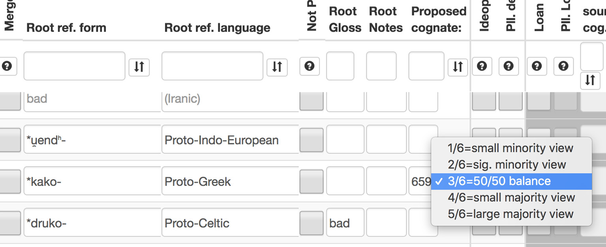
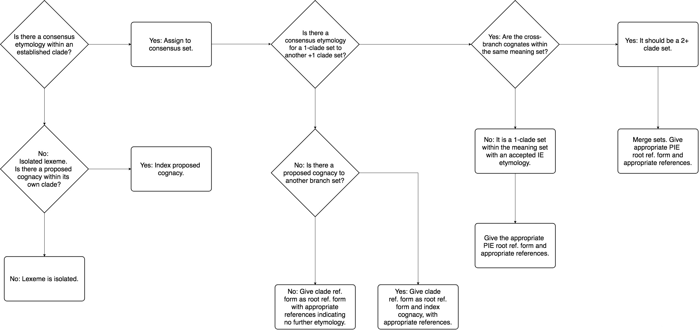

# Chapter 9: Cognacy and Computational Cladistics: Issues in Determining Lexical Cognacy for Indo-European Cladistic Research

## 1 Introduction1

The use of computational cladistics as a tool to investigate the phylogeny of the Indo-European languages has garnered much attention in recent years. In many studies cognacy judgements from comparative word lists form the basis for the computational analysis either partially or entirely.2 The added extensions of potential chronological and phylogeographical analysis have recently further stoked wider debates over the time-depth of the Indo-European language family and the question of the location of the Indo-European homeland.3 Nevertheless, it is frequently held that lexical data from comparative word lists form the least reliable evidence for subgrouping arguments.4 In this 1 Standard bibliographical abbreviations used in this paper include: ÈSSJa (Trubačev et al. 1974–), EWAia (Mayrhofer 1992–2001), EWAhd (Lloyd et al. eds. 1988–), IE-CoR (Heggarty et al., eds.), IELex (Dunn et al.), IEW (Pokorny 1959–1969), LIPP (Dunkel 2014), LIV² (Rix et al. 2001). Linguistic abbreviations include: AGk. (Attic Greek), Alb. (Albanian), Arm. (Armenian), Av. (Avestan), Bulg. (Bulgarian), Capp. (Cappadocian [Greek]), Cz. (Czech), Goth. (Gothic), Hitt. (Hittite), It. (Italian), Khot. (Khotanese), Lat. (Latin), Latgal. (Latgalian), Latv. (Latvian), Lith. (Lithuanian), Luw. (Luwian), Lyc. (Lycian), Maced. (Macedonian), MIA (Middle Indo-Aryan), MW (Middle Welsh), Myc. (Myceanaean), NHG (New High German), NIA (New Indo-Aryan), NT (New Testament [Greek]), OAv. (Old Avestan), OBret. (Old Breton), OCS (Old Church Slavonic), OE (Old English), OIr. (Old Irish), ON (Old Norse), OPr. (Old Prussian), OS (Old Saxon), Osc. (Oscan), PIE (Proto-Indo-European), Pol. (Polish), Russ. (Russian), SCr. (SerboCroatian), Skt. (Sanskrit), Slk. (Slovak), SMG (Standard Modern Greek), Sogd. (Sogdian), Sp. (Spanish), TochA (Tocharian A), TochB (Tocharian B), Tsak. (Tsakonian), Ukr. (Ukrainian), Ved. (Vedic), YAv. (Young Avestan). 2 Ringe et al. (2002) uses data points coded from phonological and morphological as well as lexical characters, Gray & Atkinson (2003), Bouckaert et al. (2012), Chang et al. (2015) are based solely on lexical data. 3 In this regard, cf. especially Bouckaert et al. (2012) and Chang et al. (2015). 4 Cf. Ringe et al. (2002: 69). The question of the position of Tocharian as the second branch to split off from Proto-Indo-European is primarily supported by lexical correspondences according to Ringe et al. (2002: 99–100). Note, however, Malzahn (2016) recently doubting the value

<!-- source-pdf-page: 192; source-page: 180 -->

paper I will not be strictly engaging with the methodology of cognacy-based phylogenetic methods and their further applications, but instead will be focusing on methodological problems arising with the encoding of lexical cognacy judgements in the first instance. For Bayesian phylogenetic analyses comparative word lists are only the starting point. For comparative word lists to be useful in determining genetic relationships, cognate relations need to be indexed between lexemes. These cognate judgements are made on the basis of our knowledge of the comparative phonology and morphology of the individual daughter languages. In turn these cognate judgements, once made, can then be used as data points representing shared linguistic history that can be used for phylogenetic analyses. In determining lexical cognacy judgements the standard handbooks can be used as references, and in a large proportion of cases etymologies are straightforward. Nevertheless, as we are well aware, not all etymological proposals are equally certain and agreed upon, either through differences in scholarly opinion over formal reconstruction or via uncertainties where a given proposed etymology may happen to be simply a conjecture. Computational cladistics ideally requires very clear-cut, preferably binary data input. In many cases a cognate vs. non-cognate decision may be straightforward, but in others there may be, for many reasons, uncertainties where it is not easy to reduce a given proposed cognate relationship to such a binary decision. For this reason, establishing reliable and consistent cognacy judgements in a machine-readable format is not always a straightforward task. In order to address some of these issues, in this paper I will discuss methodological and practical problems in establishing lexical cognacy, based on work undertaken as part of the Indo-European Cognate Relationships (IE-CoR) database project at the Max Planck Institute for the Science of Human History. I will first introduce the background of the IE-CoR project and its approach and guiding principles to establishing cognacy in the lexica of Indo-European languages. I will then discuss some practical problems that have commonly arisen in establishing lexical cognacy judgements and some proposed solutions to these problems within the IE-CoR framework in order to minimise the amount of inconsistent data. Finally, I will discuss some issues pertaining to the limits of lexical cognacy for phylogenetic analyses.

of the lexical correspondences between Anatolian and Tocharian for characterising an early split vis-à-vis the rest of Indo-European.

<!-- source-pdf-page: 193; source-page: 181 -->

## 2 Research Context: The IE-CoR Project

The IE-CoR database represents a fresh break from the old IELex database developed by Michael Dunn and used as the basis for high-profile but controversial phylogenetic studies such as Bouckaert et al. (2012), and Chang et al. (2015).5 The IELex database was designed to host the lexicostatistical dataset of Dyen et al. (1992), combined with the lexical cognacy data from the Swadesh meanings used in Ringe et al. (2002), and to output those data on cognacy relationships in the NEXUS file format required as the input to many quantitative and phylogenetic analysis algorithms. While one of the functions of the IE-CoR database is likewise to export cognacy judgement data in the same NEXUS file format, the comparative language data themselves are entirely new, and indeed the approach to coding cognacy has been thoroughly revised. The IECoR database has been ambitiously conceived to cover a large representative sample of Indo-European languages with the comparative lexical data provided by experts in the individual languages based on a new reference list of comparison meanings that have been carefully defined to ensure a consistent medium of semantic comparison. In addition to the lexical data being elicited anew, the cognacy judgements have been thoroughly revised by specialists in Indo-European comparative linguistics and specialists in individual branches of Indo-European with a cognacy policy explicitly rooted in phylogenetic systematics.6
### 2.1 The Jena 200 Concept List

The IE-CoR database project developed a new concept list in order to reduce the amount of inconsistent data in cognacy-based phylogenetic analyses. The basis for this was the Swadesh 207 list (itself the combination of his 100 and 200-meaning lists) combined with the Leipzig-Jakarta 100 list that originated

5 Studies based on IELex data have been heavily criticised (cf. Pereltsvaig & Lewis 2015). The recognition of problems in the consistency of both the source data and cognacy of IELex was the impetus for a radical re-conceptualisation of a new database of Indo-European Cognate judgements. 6 The main editor of the Indo-European cognacy judgements and cognacy metadata for IECoR is Matthew Scarborough, but important contributions to the cognate coding have also been made at various points in the revision process by Cormac Anderson (Celtic, Iranic, Italic & Romance), Erik Anonby (Iranic), Alexander Falileyev (Celtic), Cassandra Freiburg (IndoEuropean), Ulrich Geupel (Albanian), Geoffrey Haig (Iranic), Britta Irslinger (Indo-European and Celtic), Lechosław Jocz (Slavic), Thomas Jügel (Iranic), Ron Kim (Tocharian), Martin Kümmel (Indo-European, Indo-Iranic), Martin Macak (Armenian) and Roland Pooth (IndoIranic). Regarding the IE-CoR cognacy policy, see §2.2 below.

<!-- source-pdf-page: 194; source-page: 182 -->

with the World Loanword Database project (in turn showing considerable overlap with the Swadesh 207).7 These meanings added from the Leipzig-Jakarta list include:
– ant, bitter, to carry, claw, to cry/weep, to do/make, fly (noun),
to go, to grind/crush, hard, to hide, house, navel, run, shade/ shadow, sweet, thigh, yesterday An attempt was made at a close semantic specification of the combined list of 227 concepts in several workshops held in Jena between October and November 2015.8 From these, the twenty-seven most problematic concepts were removed on the basis of various criteria such as ease of elicitation, fuzziness of meaning, difficulty in coding, and linguistic and cultural universals, resulting in the Jena 200 concept list.9 From the combined 227 list the following meanings were rejected:
– Adpositional meanings, conjunctions, pronouns, grammatical words:
– all, and, at, because, he/she/it, if, in, other
– Quantifiers too fuzzy for closer semantic specification:
– few, many, some
– Meanings problematic in terms of cultural universals:
– husband, road, rope, wife
– Meanings semantically vague, difficult for consistent elicitation, or “nonbasic”:
– animal, dull (blunt), float, flow, hold, rub, split, squeeze,
stab, suck, wipe This pruning of meanings that are difficult to identify and encode has been a part of an effort to minimise the amount of unreliable and bad data that was a typical criticism of the reliability of the IELex dataset. The final Jena 200 list is given in Table 9.1.10
## 7 8 9 10

Cf. Tadmor (2009). The Swadesh 207 list used by Ringe et al. (2002) and IELex specified the meaning claw of the Swadesh 207 (cf. Comrie & Smith 1977) as (finger)nail, so the original Swadesh 207 comparison meaning claw was reintroduced from the Leipzig-Jakarta list. Dyen et al. (1992) used only the Swadesh 200 list of comparison meanings. Similarly, cf. Kassian et al. (2010). The definitions used for the final Jena 200 list can be
found on the IE-CoR public wiki on GitHub: https://github.com/lingdb/CoBL‑public/wiki.
For the complete list of meanings determined for the Jena 200 list, see http://concepticon
.clld.org/contributions/Heggarty‑2017‑200. The Jena 200 list was finalised at a workshop held at the Max Planck Institute for the Science of Human History 27–29 November 2015, whose attendees included Cormac Anderson, Oleg Belyaev, Harald Bichlmeier, Tonya Dewey-Findell, Martin Findell, Robert Forkel, Andrew Gargett, Paul Heggarty, Steve Hewitt, Britta Irslinger, Lechosław Jocz, Martin Kümmel, Martin Macak, Sergio Neri, Roland Pooth, Tijmen Pronk, Jakob Runge, Matthew Scarborough, Kim Schulte, Matilde Serangeli, Aviva Shimelman, and Ariel Silva.

<!-- source-pdf-page: 195; source-page: 183 -->

**table 9.1: The Jena 200 concept list**

ant
ash
back (body part)
bad
(tree) bark belly
big
bird bite bitter black blood blow bone breathe burn carry chest child claw cloud cold come count
cry
cut
day
die
dig
dirty
do
dog
drink
dry
dust
ear
earth
eat

flower fly (noun) fly (verb)
fog
foot forest four freeze fruit full give
go
good grass green grind guts hair hand hard head hear heart heavy here hide
hit
horn
hot
house
how
hunt
i
ice
kill knee know lake

mother mountain mouth nail name narrow navel near neck
new
night nose
not
old
one
person play pull push rain
red
right river root rotten round
run
salt sand
say
scratch
sea
see
seed
sew
shadow sharp short

stand star stick stone straight
sun
sweet swell swim tail take that there they thick thigh thin think this three throw
tie
tongue tooth tree true turn
two
vomit walk wash water
we
wet
what when where white

<!-- source-pdf-page: 196; source-page: 184 -->

**Table 9.1: The Jena 200 concept list (cont.)**

egg
eye
fall
far
fat
father fear feather fight fire fish five

laugh leaf left
leg
lie
live liver long louse
man
meat moon

sing
sit
skin
sky
sleep small smell smoke smooth snake snow spit

who
wide wind wing with woman worm year yellow yesterday you (pl.) you (sg.)

### 2.2 Practical and Methodological Issues in Determining Cognacy

in IE-CoR The main methodological problem of preparing lexical cognacy data is determining which lexemes (within a given comparison meaning) are cognate with one another, and rendering those cognate relations into a machine-readable format consisting of a binary cognate or non-cognate decision. As we are well aware, not all proposed etymologies are as certain as others, and we may have varying levels of confidence about the reliability of a given etymological proposal. If one is overly trusting of more conjectural etymologies, one runs the risk of introducing inaccurate data into analyses. As Don Ringe frequently reminds us, “if we are to maintain scientific rigor, we must reject etymologies that are attractive but flawed”.11 At the same time, however, if we are completely hypercritical of the comparative evidence, this often leads to postulating excessive differences between branches, undermining the whole enterprise of phylogenetic analysis in the first place. An additional problem is that of variable degrees of cognacy. In the Indo-European context, one can speak of root cognacy as the most basic and fundamental cognate relationship, or closer cognate relationship through a shared derived stem.12 In the context of IE-CoR, it
11
## 12 Ringe (2017: 2), cf. Ringe (1996: xvi–xvii). This is actually even more complex in many cases where finite verbs have been replaced by light-verb constructions. In such cases the nominal elements are coded for cognacy.

For example, in the meaning fear Bulgarian straxuvam se, Rusyn strašɪtɪ s′a ‘to fear’ continue finite verbs derived from Proto-Slavic *strax-, while Kashubian miec strach, Upper

<!-- source-pdf-page: 197; source-page: 185 -->

was decided that the basic criterion for cognacy was the Indo-European root, with the possibility left open for introducing cognate subsets to reflect different morphological derivations within a given cognate set in potential database expansions at a later date.13 In order to deal with the problem of maintaining a balance of scientific rigor and being too hypercritical of proposed etymologies, the following solutions were implemented.
#### 2.2.1 Hypercriticism over Forms in Closely Related Varieties

A practical problem that frequently occurs with closely related linguistic varieties is the question of the cognacy of lookalikes, especially among closely related dialects. At what point can one be justified in postulating a dialectal loanword from, e.g., Standard Italian into Friulian, or from Persian into modern West Iranian varieties, when the regular reflexes may be expected to look exactly or nearly the same as the loanword source? In practice, some effects of otherwise unrecognised loanwords are partly mitigated by having the language experts authoring the datasets of individual languages indicate all known loanwords, but it is an inevitability that some unrecognised loanwords will slip through. A solution for these cases comes from the theoretical underpinnings of phylogenetic systematics, where the principle followed is that in absence of clear evidence to the contrary, by default we assume common inheritance from a more recent shared ancestor rather than independent innovation (in this case, lexical replacement via an inter-dialect loanword).14 2.2.2

Encoding Proposed but Uncertain Cognate Relations: Some bad Etymologies While this principle works well at the microscopic level within an individual recognised branch of the Indo-European languages, it is more difficult to maintain it when considering less certain etymological proposals between

## 13 14

Sorbian měć strach ‘to have fear’ are calques on Standard German Angst haben, and based instead upon nominal derivatives of Proto-Slavic *strax-. In this case the Slavic lexemes are technically cognate but represent quite different morphosyntactic constructions. For cases where an Indo-European etymology is lacking the policy is to take an etymology as far back within its individual clade as possible. Loanword classes are rooted at the event of their borrowing and form their own cognacy classes based on these “loan events”. This principle is known in biological phylogenetic systematics as Hennig’s Auxiliary Principle (cf. Hennig 1966: 121–122) and is based on Hennig’s conviction that if the burden of proof is required to be given in each individual case that a feature is not convergent or a parallel independent innovation, the entire practice of phylogeny would lose all the ground on which it stands.

<!-- source-pdf-page: 198; source-page: 186 -->

two or more branches of Indo-European. Such cases are the most critical for Indo-European phylogeny, since accepting or rejecting etymologies between Indo-European branches directly impacts the output results for subgrouping hypotheses. To illustrate my point, I will examine a couple of bad examples for what Ringe (2017: 2) might perhaps consider attractive but ultimately flawed etymologies. The first example is the proposed cognacy of Hittite and Tocharian lexemes in the comparison meaning bad:
## 1 Hitt. idālu- ‘bad, evil, evilness’ Luw. ādduu̯ āli-, TochB yolo ‘bad, evil’ < ?*h₁ed-u̯ ol-.15

According to Kloekhorst (2008: 420–422), Hittite idālu-, Luwian ādduu̯ āli- may go back to an original Proto-Anatolian stem *(ʔ)eduo-. These Anatolian lexemes were further connected by Watkins (1982) to the complex of words consisting of Armenian erkn ‘pain, labour pains’, Ancient Greek ὀδύνη ‘pain, grief’, Old Irish idu ‘pain’, which Schindler (1975) attempted to bring together from putative Indo-European *h₁ed-u̯ ol/n-. While the root etymology to *h₁ed- ‘bite; eat’ (LIV² 230–231) is doubted by Kloekhorst, he does not explicitly reject a possible connection to Tocharian B yolo ‘bad, evil’ which had been proposed as an additional cognate to this complex by Rasmussen (1984: 144–145).16 If this etymology connecting the Anatolian and Tocharian lexemes is correct, this formation would be a unique Anatolian–Tocharian isogloss in this particular comparison meaning. As it stands, however, Michaël Peyrot has given sufficient reason that this etymology may be doubted, as it is also quite possible that Tocharian B yolo is a loanword ultimately from Old Turkic yavlak ‘bad, evil’ (via Khotanese yola ‘falsehood, lies’).17 One may observe from all this that while there is a reasonable amount of support for a possible proto-form *h₁ed-u̯ ol/nwhich can account for all these forms, there exists sufficient doubt surrounding the etymologies of the Tocharian and Anatolian forms that it is difficult to say with complete certainty whether or not these forms are definitely cognate to each other. A second bad etymology where much uncertainty exists is the question of
Greek and Albanian lexemes in this comparison meaning:

## 15 16 17

Cf. Schindler (1975), Rasmussen (1984: 144–145), Puhvel (1984: 487–493), Kloekhorst (2008: 420–422), Adams (2013: 555–556). Cf. also Adams (2013: 555–556), accepting Rasmussen’s etymology. Peyrot (2016). I thank Michael Weiss for alerting me to this reference.

<!-- source-pdf-page: 199; source-page: 187 -->

## 2 AGk. κακός ‘bad’ < Proto-Greek *kako/ā-, Alb. keq ‘bad’ < Proto-Albanian *kakii̯a/ā-.

The standard handbooks for Greek regard κακός as without a secure etymology.18 By contrast, in the Albanological literature an etymology with Greek κακός for Albanian keq is frequently assumed from a common base *kak- albeit with different derivational morphology.19 If this is correct, this would qualify as a root etymology and might be a Greek-Albanian isogloss which could serve as a small piece of evidence in the question of a Balkanindogermanisch subgrouping within Indo-European.20 One admits that Albanian keq certainly looks old and does not so easily appear to be the result of an early loan from Greek, but at the same time, the phonological and derivational uncertainties over the Albanian material and its great chronological remove from the earliest attested
Greek make this etymology far from certain.21
Further cases like these two bad examples could be easily assembled. The point is, the decisions made in cases such as these are critical for the subgrouping of individual branches of Indo-European. However, in trying to come to some sort of compromise over the etymological disputes, we are caught between our two methodological principles: We don’t want to be hypercritical towards proposed etymologies since hypercriticism may lead to dismissing potentially relevant data for subgrouping. On the other hand, as with Ringe, we want to avoid introducing etymologies that are not fully secure since that risks introducing false-positive data into the analyses. When we make cladistic

## 18 19 20 21

Cf. Frisk (1960–1972, 1: 758–759), Chantraine (1968–1980: 482), Beekes (2010: 619–620). Willi (2016: 505–507) has recently argued that the irregular comparative and superlative forms κακίων and κάκιστος may be best accounted for by assuming an original u-stem adjective *κακύς, but the further etymology is not easily decided. The best candidates are either the proposal of Hübschmann (1885: 154) to OAv. kasu- ‘small, mediocre’ (which formally accounted for via a zero-grade root *kn̥ k-̑ or *kak̑-, cf. also de Lamberterie 1990: 821–830), or a zero-grade u-stem noun derived to the verbal root *k̑enk- ‘to hang’ (cf. LIV² 325) in the sense of *‘hanging’ > *‘hesitant, wavering’ > ‘cowardly, bad’ vel sim. (Willi 2016: 506–507). Proposed connections with AGk. κάκκη ‘shit’ remain unconvincing (Willi 2016: 505). Cf. Huld (1984: 79–80), Demiraj (1997: 216–217), Orel (1998: 175), Schumacher & Matzinger (2013: 223, 239). Cf. Klingenschmitt (1994: 244–245) for some proposed isoglosses. Cf. Huld (1984: 79–80). Demiraj (1997: 217) has healthy scepticism, admitting that the possibility of a Greek loan cannot be ruled out, as “[d]ie paradigmatischen Verhältnisse, insbesondere der Akzentwechsel zwischen Singular- und Pluralstamm sprechen jedenfalls für eine uralte Formation (evtl. i-Stamm oder als solcher empfunden), die auf gr. (Komp.) κακίων bezogen werden kann”.

<!-- source-pdf-page: 200; source-page: 188 -->

arguments on the basis of qualitative arguments, we can simply ignore these cases, but when doing cognate coding with Swadesh-style comparison lists for phylogenetic analyses, it is not feasible to simply omit an entire concept meaning because one or two etymologies within that meaning set are difficult to decide.22 A significant weakness of the IELex database was its inability to code a cognacy relationship beyond a binary cognate/non-cognate decision. Within the IE-CoR framework an intermediate solution is proposed: In situations like these bad examples where there is sufficient uncertainty over a proposed etymology or several competing proposals outside of a single branch of Indo-European, these cognate sets are split into separate classes. As split classes, this would be the hypercritical approach. However, built into the database framework is a proposed cognacy system, which allows uncertain or disputed cognacy proposals between branches to be cross-linked in the database and assigned scores equivalent to the varying levels of consensus over the etymology in the standard handbooks (cf. Fig. 9.1). This proposed solution eliminates the need to have to settle on an absolute cognate/not-cognate decision process by encoding varying degrees of uncertainty in difficult cases of cross-branch etymologies. By encoding the data in this way the database system can easily generate different outputs depending on how permissive or restrictive one wishes to be in accepting more conjectural etymological comparisons.

## 22 It is worth observing, as Cormac Anderson points out to me, that while selectively ignoring data from certain comparison meanings may well be useful, doing so is potentially open to abuse by pre-selecting what meanings are considered to be more diagnostic than others. The opposite situation, stacking the list of comparison meanings to favour a given

analysis is likewise true: if one wishes to use cognacy-based methods to test, e.g., the Greco-Armenian hypothesis, one could preselect the list of comparison meanings used to include meanings with exclusive Greek and Armenian isoglosses that could bias the sample towards a result that could make Greek and Armenian appear closer to each other with respect to the rest of Indo-European. Similarly, in traditional subgrouping much depends on deciding what features (phonological, morphological, etc.) are decided to be the most probative for classification in a given situation. Competing analyses may disagree what these features are, and—perhaps unconsciously—select the features that favour one analysis over another. This has in the past been a criticism regarding the testability of the comparative method (cf. McMahon & McMahon 2005: 69). In any case, the potential for pre-selecting meanings that favour a given analysis is a strong argument for a standardised list of comparison meanings.

<!-- source-pdf-page: 201; source-page: 189 -->

2.2.3

A Proposed Decision-Making Framework for Encoding Lexical Cognacy Judgements With the introduction of the proposed cognacy system in the IE-CoR database, I have devised the following framework as a set of guidelines for systematising cognate judgement decisions (Fig. 9.2). The purpose of these guidelines is to streamline the decision-making process in order to ensure as much consistency as possible and to make explicit the degree of confidence in the scholarly consensus regarding any given cognate set in the database. The starting point for this decision-making process is the assessment of any given lexeme in a single meaning (e.g. bad, back, bark, etc.). The etymology of an individual lexeme is assessed within its own individual branch of Indo-European, typically by consulting the standard reference works for that language or branch. If there is no etymology within its own sub-branch of IndoEuropean elsewhere in that comparison meaning, then the lexeme is treated as etymologically isolated (although there may be uncertain proposals which can be indexed using the proposed cognacy system). If, alternatively, there is an established etymology within the clade to, e.g. Proto-Germanic, Proto-Celtic, etc., then the lexeme is to be added to that set. Further decisions in the guidelines concern the multi-branch etymologies: If there is no certain etymology outside of a given branch of Indo-European, then a set of decisions is followed parallel to the assessment whether an individual lexeme is isolated within its own branch. If the two or more-branch etymology is widely accepted, then the cognate sets are to be merged into a multiple-clade set. At all stages, references are added into the database metadata in order to provide justification for the cognacy decisions.

<!-- source-pdf-page: 202; source-page: 190 -->

<!-- source-pdf-page: 203; source-page: 191 -->

## 3 Practical Problems of Cognacy Coding in Comparative Wordlists

### 3.1 An Indo-European Specific Problem: What is a Root Etymology

Anyway? A perhaps not so obvious problem is the definition of an Indo-European root etymology in itself. As Indo-Europeanists we operate with established theories of root structure, but if we consider root etymologies as our basic criterion of Indo-European cognacy then difficulties in assigning cognacy arise in assessing whether individually reconstructed Indo-European roots may be cognate with others. In practice, this primarily concerns cases whether s-mobile roots and roots that exhibit root extensions are to be considered the same root or lexically distinct roots etymologically. Consider the roots in the meaning cut in (3) and (4):
## 3 2. *(s)ker- ‘scheren, kratzen, abschneiden’ (LIV² 556–557, IEW 938–940): ON skera, OE scieran (but possibly extended *(s)kerH- (LIV² 558, cf. Lith. skìrti ‘trennen, teilen, unterscheiden’), so Kroonen 2013: 443–444).

## 4 *(s)kert- ‘(zer)schneiden’ (LIV² 559–560, IEW 941–942): YAv. kərəṇtaiti, OPers. *kart-, Ved. kr̥ t-

In IE-CoR we have followed the practice of LIV² which splits up lemmata from their potentially root-extended variants, but lumps together s-mobile variants.23 Certainly this is a reasonable pre-established policy following the practice of a standard reference work, but perhaps it requires some further methodological justification. On the one hand, the function of s-mobile is not fully understood, but it is certainly well documented.24 The role of rootextensions in Proto-Indo-European and/or pre-Proto-Indo-European derivational morphology is likewise not well understood, but given the large number of morphemes that have been claimed as root extensions (but are functionally unclear), it is difficult to determine whether roots with extensions were derived forms within Indo-European, or near homophonous forms of independent origin. For the purposes of establishing cognacy, I would therefore argue that extended roots should be split into separate classes in the database and be
## 23 24

For the justification of LIV² on this practice, cf. LIV² 6–7. One standard view on the origins of s-mobile variants is in sandhi, i.e. -s # # C- → -sC-, in which case one would not expect any functional distribution of s-mobile forms at all as they would have arisen via ad hoc reanalyses as part of PIE phonotactics (cf. Mayrhofer 1986: 119–120). I thank the anonymous reviewer for alerting me to this reference.

<!-- source-pdf-page: 204; source-page: 192 -->

indexed as potentially related to each other. Methodologically, this approach also has the advantage that sets with root extensions that have been indexed for proposed cognacy (cf. §2.2.2 above) can easily be automatically merged if one wishes to run an analysis that does take potentially extended roots as cognates. Thus systematically splitting and indexing proposed cognacy in these cases allows for greater flexibility at the level of the phylogenetic analysis.25
### 3.2 Taboo Deformation

Taboo deformation is a general problem in etymology that obscures the identification of true cognates.26 By its nature, taboo deformation introduces irregular sound correspondences into lexical comparisons, and consequently obscures etymological relationships. In some cases the invocation of taboo distortions is justifiable, in others it may be used to prop up attractive but flawed etymologies. We cannot eliminate a whole meaning from the concept list simply because taboo distortions are exhibited in that meaning, therefore proposals of taboo distortions in etymologies need to be carefully evaluated on a caseby-case basis. I would like to illustrate this through three examples drawn from the IE-CoR database in (5), (6), and (7).
5

tongue from PIE *dn̥ g̑ʰu̯ éh₂- : TochA käntu, TochB kantwo, Arm. lezow, Av. hizuua, Ved. jihvā ́, OCS językъ, Lith. liežùvis, OPr. insuwis, Goth. tuggō, Osc. fangvam, Lat. lingua, OIr. tengae.

The standard post-Anatolian word for tongue is notorious for exhibiting extensive taboo-deformation in most of the daughter branches that attest it. The individual deformations, however, are generally well explained, even if their specific motivations are unclear, and we can generally be confident of this etymology.27

## 25 26

## 27 It is worth observing that the practice of splitting roots with enlargements offers a degree of further resolution in the analysis of subgrouping, i.e. two branches that might show the same enlarged root in contrast to other branches that exhibit only the unenlarged root

may be potential evidence for a shared morphological innovation in the former group. If both unenlarged and enlarged variants were merged into, e.g. *(s)ker(t)-, no further subgrouping information could be extracted from this lexical cognacy data point. On taboo distortion in general, cf. Hock (1991: 303–305). On taboo distortion specifically in Indo-European, cf. the discussion in Mallory & Adams (1997: 493–494), Mallory & Adams (2006: 89). For this cognate judgement, cf. the discussion of Mallory & Adams (2006: 175), Martirosyan (2010: 307–308), Adams (2013: 147), EWAia 1: 591–593, de Vaan (2008: 343), Derksen (2008: 159), Derksen (2015: 285), Lehmann (1986: 349), Matasović (2009: 368).

<!-- source-pdf-page: 205; source-page: 193 -->

6

ant from PIE ?*moru̯ i- : TochB warme*, AGk. μύρμηξ, Arm. mrǰiwn, YAv. maoiri-, Ved. vamrá-, OCS mravii, ON maurr, Lat. formīca, OBret. morion

Ant, a meaning on our comparison list taken over from the Leipzig-Jakarta list, is difficult to fully account for in all the branches, but a proto-form is generally reconstructed from the many variants, and we can be more or less confident of an Indo-European etymology although the exact shape of the reconstruction remains uncertain.28
7

louse (IEW 692: *lū ̆ s (gen. *luu̯ -ós) ‘Laus’) a Germanic and Celtic ?*lū ̆ - : ON lús, OE lūs, OS lûs; MW lleuen, OBret. louenn (Orel 2003: 252, Seebold & Kluge 2011: 563, Matasović 2009: 250) b Ved. yūka- (> MIA, NIA forms, e.g. Pāli ūkā, Hindi jūm̐ , Bengali ukun, Nepali jumro, etc., cf. EWAia 2: 415, Turner 1962–1966: 608, no. 10512). c Proto-Slavic *vŭš- (SCr. uš, Maced. voška, Russ. voš’, Ukr. voša, Pol. wesz, Cz. veš, Slk. voš, cf. Derksen 2008: 532). d Baltic forms: Lith. utėlė,̃ Latv. uts, Latgal. vuts (to be connected with Slavic forms: Fraenkel 1962–1965: 1173; against connection with Slavic forms cf. Derksen 2008: 532).

Indo-European louse, however, is a most difficult case for which to securely establish cognacy. The reconstructed etymon in IEW is simply not large enough in terms of reconstructed segments for us to be fully confident that the deviant forms ascribed to it go back to the same source. It is attractive to posit a single IE etymon for louse, as Pokorny does, but given the difficulties in reconstruction the only principled solution, as I see it, is to reject the attractive etymology and to split the different forms postulated to *lū ̆ s in IEW into the most plausible individual cognate sets. It is probably worth observing that Kassian, Zhivlov & Starostin (2015: 311) have recently given up on using louse in their list of comparison meanings for a lexicostatistical assessment of Indo-Uralic because of the difficulty of reliably reconciling these lexemes to a single original PIE protoform.
### 3.3 Contamination and Blending

Similar to taboo deformation is the question of contamination and blending of two distinct lexical roots, where a given word may not have a single root
## 28 For this cognate judgement and further discussion of these lexemes, cf. Matasović (2009: 278), Beekes (2010: 982), EWAia 2: 507, ÈSSJa 19: 248–249, Martirosyan (2010: 482–483), Adams (2013: 630), de Vries (1977: 380).

<!-- source-pdf-page: 206; source-page: 194 -->

etymology. True blends are where two lexemes in closely associated semantic spheres have merged, creating a new lexeme in the process that takes on semantic aspects of both original lexemes. A contamination, by contrast, is where the phonetic form of a lexeme is altered due to close association with another lexeme in a related semantic field (Hock 1991: 198, Clackson 2017: 101– 102). An example of simple contamination has been plausibly suggested for the reflexes of the IE word for tongue, where Latin lingua and Armenian lezow are not actually taboo distortions but are the result of an associative contamination with the PIE root *lei̯g̑ʰ- ‘to lick’, which could well have occurred independently in both branches (cf. Lat. lingō ‘I lick’, Arm. lizem ‘id.’).29 In such examples, the semantics of the original lexeme remain intact. By contrast, for a prototypical example of a true blend one may consider English brunch which is a blending of the words breakfast and lunch, where the semantics have also blended to indicate a late morning meal that is not-quite breakfast, nor entirely lunch.30 A concrete example of a family of lexemes arising from an original blending might be attested in the case of Armenian tesanem ‘I see’, proposed since Meillet (1936: 135) to have originally been a blend of reflexes from the PIE roots *spek̑- ‘to see’ and *derk̑- ‘to see’ which formed a suppletive pair elsewhere in Indo-European (cf. Skt. pres. paśyati vs. aor. adarśat).31 Such examples are problematic for establishing a single root etymology, since the result is not fully cognate with lexemes from either of the two roots. In such cases a principled solution, and the one that has been adopted in IE-CoR, could be to consider true blends as the creation of an entirely new lexeme, not directly cognate to either of the source lexemes that were originally blended. There is no clear way, however, to acknowledge the sources of the blending other than in the metadata for the new cognate set.
### 3.4 Meanings in Grammatical Words and Pronominal Stems

High-frequency grammatical words that are subject to increased wear-and-tear in the lexicon are not straightforward to code for cognacy. Initially some of these concepts were eliminated from the comparison list because lexical cognacy was not straightforward due to the lack of a single clearly identifiable
29
## 30 31

Cf. de Vaan (2008: 343), Martirosyan (2010: 307–308).
Hock (1991: 198), cf. “brunch, n.” in OED Online http://www.oed.com (accessed June 12th
2018). For further discussion of this example cf. Clackson (2017: 105–106) and see there passim for further proposed examples of blends in Armenian etymology. An alternative possibility for an etymology of Armenian tesanem may be a backformation from a root aorist *dek̑~ *dk̑- > Arm. etes ‘saw’ with a semantic development ‘receive’ > ‘take in’ > ‘see’ (accepted by LIV² 109–110, cf. Klingenschmitt 1982: 228, Schmitt 2007: 146, 190).

<!-- source-pdf-page: 207; source-page: 195 -->

lexical root. This can be observed in (8) and (9) for various lexical elicitations in the comparison meaning because, with examples in Slavic and Hellenic. In these cases, single root etymologies are impossible because there is no one single morpheme; these are all periphrases of different prepositions, pronouns and particles. As such they are difficult to encode consistently and are consequently more than likely to be a source of bad data.
8

because in Slavic: OCS zanje(že), ponje(že); Bulg. zaščoto; Maced. zatoa što; Russ. potomu čto; Ukr. tomu ščo, Cz., Slk. pretože

9

because in Greek: AGk. διότι (= διά + ὅ + τι), ἕνεκα; SMG γιατί (για + τί), επειδή (ἐπεί + δή), SMG διότι; Pontic επειδήσκαι (επει + δη + (σ?) + και), Capp. ασο (ας + το), Cypriot επειδή (επει + δη), Tsakonian γιατσ̔ ί (= SMG γιατί), Italiot τι.

For this reason, the comparison meaning because was rejected from the Jena 200 list, but as work proceeded other grammatical words that are otherwise generally more stable also transpired not to be exempt from difficulties in cognacy coding. To demonstrate this, I will discuss examples in the concept not (verbal negation, indicative) in (10) and (11). It may be observed that the majority of Indo-European languages use an indicative negation particle based on PIE *ne which has been generally stable in most branches (10).
## 10 *ne ‘not’ : Hitt. natta, Alb. nuk, Av. nōit̰, Ved. ná, OCS не, Lith. ne-, Goth. ni, Lat. nōn, OIr. ní (cf. LIPP Vol. 2 530–549 s.v. 1. *né ‘nicht’)

A characteristic lexical innovation of Hellenic is a different negation particle οὐ(κ) with no certain etymology outside of its branch, with the possible exception of Armenian oč‘.32
11

not in Hellenic: a Ancient: Myc. o-u-, AGk. οὐ(κ), NT οὐ(κ) b Modern: SMG δεν, Tsak. δε(ν), ο-, ου- (prefix), Capp. δεν

## 32 Against the interpretation of Cowgill (1960) as a putative *ne h₂oi̯u (kʷid) ‘not (ever) in life’ I follow the reserved judgement of Clackson (1994: 158), Clackson (2004/2005: 155– 156), and Martirosyan (2010: 531), who see Arm. oč‘ as more likely to be an inner-Armenian

creation based on the simple pronoun o- (cf. o-k‘ and o-mn ‘someone’) + simple negative č‘ < *kʷid.

<!-- source-pdf-page: 208; source-page: 196 -->

The Modern Greek dialects present continuity issues with the cognacy from
Ancient Greek οὐ(κ). Standard Modern Greek and several modern dialects
show a reflex δεν, which is historically accounted for via Ancient Greek οὐδέν (οὐ ‘not’ univerbated with δέ ‘and’ and ἕν ‘one’ = ‘and not one’), which had been simplified to δεν following the tendency of Modern Greek to delete unstressed initial vowels.33 In the case of Modern Greek δεν the original semantic-bearing morpheme that forms the basis for a cognate class, Ancient Greek οὐ(κ), has been entirely lost. Should then, Modern Greek δεν be considered the same as
Ancient Greek οὐ(κ) for the purposes of establishing a cognate judgement relationship? The answer to this question is difficult to decide. Strictly from the
point of view of historical morphology, the original elements from which Modern Greek δεν were formed do not have anything to do with Ancient Greek οὐ(κ). On the other hand there has not been any total lexical replacement, since the loss of οὐ- is the result of a regular sound change in the development of Modern Greek and there has been no break in functional continuity of the morpheme(s) used for indicative negation. Any cognacy coding decision implemented in this case, either to keep οὐ(κ) and δεν together as cognates or to split them as non-cognate, is ultimately an arbitrary decision. An alternative solution would be to assign cognate classes to each of οὐ(κ), δέ, and ἕν, but consistently implementing multiple cognate-codes solutions across the entire Indo-European language family becomes increasingly fraught as time progresses and additional deictic markers or adpositional elements are grammaticalised (as in the example of because above). Additionally, as the same inherited deictic and pronominal elements may well be independently re-used, it is not certain whether such a solution will necessarily improve the quality of output data to be used in lexicon-based phylogenetic analyses. In short, this example illustrates that in certain cases, coding lexical cognacy judgements can be occasionally arbitrary, especially in cases with compounded morphemes and other pleonastic elements, as frequently is the case in comparison meanings that are grammatical words or pronouns.34

## 33 34

Cf. Babiniotis (2010: 338). This case from Hellenic was selected because it is one of the clearest examples of arbitrariness in the cognacy coding of pronominal and grammatical elements. The same difficulties are regularly found in pronominal elements. Further levels of absurdity in coding ghost morphemes could be reached in the Hellenic example if one accepts the etymology of Cowgill (1960), cf. n. 32 above, where the semantic-bearing morpheme *ne ‘not’ is not even attested as part of the proposed collocation at all in the history of Greek.

<!-- source-pdf-page: 209; source-page: 197 -->

### 3.5 Sound Symbolism, Onomatopoeia, and Child Language

Another set of problems comes from trying to consistently encode comparison meanings that are prone to frequent lexical renewal and distortion from other inherent semantic qualities of the comparison meanings themselves. I would focus on two examples:
12

spit from PIE *spti̯eu̯ H- ‘spucken, speien’ (LIV² 583–584) : Lat. spuī (pf.), ́ , Ved. aṣṭhaviṣam Lith. spiáuti, OCS pljьvati, Goth. speiwan, AGk. πτῡω (aor.) ‘habe gespuckt’

In (12) we have many phonologically similar lexemes in the comparison meaning spit, which, if one follows LIV², may to go back to an original IndoEuropean root *spti̯eu̯ H- ‘to spit’.35 Presumably Proto-Indo-European speakers did have a verb ‘to spit’ that was inherited by its daughter languages, but like the taboo deformation examples, presumably these underwent occasional deformations in individual branches; perhaps to maintain an imitative sounding verbal stem that complies with changes in phonological inventory, syllable structure, etc. Because the various sp-, or pt- reflexes of the daughter languages from the reconstructed initial cluster *spt- appears to be imitative of the act of spitting, I find it is hard, at least in principle, to rule out new imitative forms being independently re-created among the daughter languages.36 It is consequently difficult to be completely confident of the cognacy of such forms.

## 35 36

IEW 999–1000 reconstructs *(s)p(h)i̯ēu- : *(s)pi̯ū-, *(s)pīu-. Another possible candidate for sound-symbolism interfering with etymology is the case of lexemes for the meaning scratch, for which there are no less than seven roots reconstructed with phonetic elements *s, *k, and *r in various permutations which could well be (partly) influenced by imitation of a scraping noise: PIE 2. *(s)ker- ‘scheren, kratzen, abschneiden’ : Arm. k‘erem (LIV² 556–557, Martirosyan 2010: 662–663); PIE *kes- ‘ordnen’ : OCS česati, Latv. kasît (LIV² 357, Derksen 2008: 86, Derksen 2015: 231); PIE *kseu̯ ‘schaben, schliefen’: SMG ξύνω (< AGk. ξύω), Hindi khuracanā (cf. Skt. kṣuráti) (LIV² 372, Beekes 2010: 1039–1040, Turner 1962–1966: 194, no. 3729, EWAia 1: 435–436.); PIE *ksneu‘schärfen’ : Ved. kṣṇav- (LIV² 373, EWAia 1: 441, cf. Lat. novācula ‘Rasiermesser’); PIE *skabʰ‘kratzen, schaben’ : Lat. scabere, OS skaƀan (LIV² 549, de Vaan 2008: 541, Kroonen 2013: 438, cf. Lith. skõbti ‘to plane’); PIE *(s)kreb- ‘schaben, kratzen’ : OE screpan, MW crauu (LIV² 562, cf. Orel 2003: 344); PIE *(s)kerp- ‘abschneiden, abrufen’ : Lith. krapštýti (LIV² 559). Cf. also Germanic *krat- > NHG kratzen, etc. (EWAhd 5: 762–764) without secure etymology outside of Germanic. Not all of these root etymologies need be dismissed outright, but potential influence from onomatopoeia or sound symbolism in these cases should perhaps not be entirely ruled out.

<!-- source-pdf-page: 210; source-page: 198 -->

Similarly, when target lexemes arise in child language they are difficult to reliably assign cognacy. Consider the following phonetically similar words in the target meaning father in Anatolian, Germanic, and Slavic (13):
## 13 Hitt. attaš, Goth. atta, OCS otьcь

To these lexemes we may also compare Ancient Greek ἄττα ‘father’, Latin atta ‘father’, Old Irish aite ‘foster father’. Considering an original Indo-European nursery word *atta- ancestral to all of these forms is tempting, although it is remarkable that we do not have, e.g., Hitt. †az-za or Gk. †ἄστα which might be expected due to the well-known PIE phonological rule where epenthesis of *s occurs in dental + dental clusters.37 Furthermore, similar formations attested in unrelated languages (e.g. Dravidian *attan ‘father, elder’, Turkish ata ‘father’, Hungarian atya ‘father’), also rather make it appear more likely that the forms found among the various Indo-European branches are independent creations.38 Consequently, in such a set, cognacy cannot be reliably assigned between these three forms, and similar arguments could be made in cases of other familiar kinship terms of the same nature.
### 3.6 Proposed Solutions: Further Emendations to the Jena 200 Concept

List Some of the problems that we have encountered here, such as those with grammatical words in §3.4, were known at the time of the compilation of the Jena 200 concept list. The pervasive difficulties in consistently encoding cognacy for pronouns, deictic elements, and concepts prone to onomatopoeia and soundsymbolism became much more apparent through the cognacy revision process. It is not particularly problematic to identify the best target lexeme for these

## 37 38

Cf. Mayrhofer (1986: 110–111) and examples like Hitt. ez-za-zi /ed-tsi/ > [ets-tsi] ‘(s)he eats’ from PIE *h₁ed-ti ‘(s)he eats’, Gk. ἴσθι ‘know!’ (2.sg.imptv.) < *u̯ id-dʰi. One could possibly speculate, however, that the very nature of the putative *atta as a lexeme rooted in child language has inoculated it against the normal phonological rules, but I feel such an assumption unwarranted. For a survey of opinions in standard handbooks, cf. Kloekhorst (2008: 225–226) “clearly onomatopoeic”, Chantraine (1968–1980: 135) “le terme a une origine indo-européenne”, Beekes (2010: 165) “A nursery word found in several IE languages, and may be inherited”, de Vaan (2008: 60) [reconstructs *h₂et-o-], Lehmann (1986: 46) “nursery word […] [n]o need to assume borrowing in spite of earlier attestations, such as Hitt attas”, Kroonen (2013: 39) “A cross-linguistically uniform nursery word”, Derksen (2008: 383) “must be considered a nursery word”, ÈSSJa 39: 168–173 “Слав. *otьcь через и.-е. *att-iko-s связано с и.-е. *ătta”. For Dravidian, cf. Burrow & Emeneau (1984: 15).

<!-- source-pdf-page: 211; source-page: 199 -->

comparison meanings, but as I have attempted to demonstrate through various examples, these are not always the meanings for which it is easiest to encode cognate relations reliably or consistently. Consequently, although these elements could be considered basic vocabulary, I would argue that concepts of these types should be avoided in comparative lexical word lists altogether. In IE-CoR a further twenty most problematic concepts were removed from the project’s comparison list for these reasons. These include:
– Pronominal and Deictic Meanings
– here, how, I, that, there, they, this, we, what, when, where,
who, you_pl., you_sg.
– Miscellaneous grammatical words
– not, with
– Meanings frequently prone to onomatopoeia
– blow, spit
– Meanings prone to independently recurring child-language variants:
– father, mother
The further emendation of the Jena 200 list has addressed a few of the most obvious data problems outlined here, although not all of them. Possible examples of taboo deformation in §3.2 and blending in § 3.3 still need to be carefully weighed on a case-by-case basis, and just because some of the most onomatopoeia-prone meanings have been omitted does not mean that cases of onomatopoeia will not occur in other meaning sets.39

## 4 The Limits of Cognacy

Before I conclude, I would like to briefly address two issues where lexical cognacy methods, strictly followed, have the potential to produce misleading results: independent parallel semantic shifts in distantly related linguistic varieties, and semantic calquing among closely related linguistic varieties.
### 4.1 Parallel Semantic Shift

In some cases, it appears that strict adherence to the principles of a root etymology leads to some cognate sets that are parallelisms not inherited from a more

39

Within the framework IE-CoR it is additionally possible to mark individual problematic cases as “ideophonic” if it cannot be ruled out that all the lexemes in a given cognate set are not independent parallel creations. In such marked cases these individual cognate sets are simply removed from the dataset in a data export.

<!-- source-pdf-page: 212; source-page: 200 -->

recent ancestor. Observe child in Lycian and Modern Romance varieties in (14) and give in Middle Iranian and Old Irish in (15).
14

child derivations from PIE *dʰeh₁(i̯)- ‘(Muttermilch) saugen’ : Lyc. tideimi- ‘child’; Sp. hijo, It. figlio ‘child’, etc. < Lat. filius ‘son’ (LIV² 138– 139, Kloekhorst 2008: 875–877, Neumann 2007: 359–360, de Vaan 2008: 219).

15

give from PIE *bʰer- ‘tragen’ : Khot. heḍä, Sogd. θbr- from *frā ̆-bar-; OIr. do·beir (Bailey 1979: 499, Cheung 2007: 6–10, Matasović 2009: 62).40

Descriptively, these cases are lexically cognate at the Indo-European root level, and strictly are to be connected together according to the IE-CoR cognacy policy. Nonetheless, the derivations are secondary formations, and one cannot use the coincidence of these forms to claim that the language branches in these examples are more closely related to each other because they share a root etymology in these sets. Perhaps these cases of parallel semantic shift may be few enough that the noise they bring to the phylogenetic signal could be minimal, but strictly speaking these cases—if sufficiently numerous—may potentially add false-positive data for closer genetic relationships between individual branches of Indo-European. In the IE-CoR database we have explicitly introduced a system to indicate such cases.41 It is also worth emphasizing that Bayesian methods are probabilistic, not absolute, and are designed to handle occasional independent parallel derivations at different points within a tree, but such examples are less capably handled by traditional lexicostatistical analyses.
### 4.2 Semantic Calquing and Convergence in Lexical Semantics: The Case

of Tsakonian Since the criterion of comparison in lexical cognacy judgements is cognacy across semantic identities, a major problem for these methods is semantic
## 40 41

The anonymous reviewer rightly pointed out that OIr. do•beir is part of a suppletive paradigm in Old Irish and wondered how verbal suppletion is handled in IE-CoR. This is a very good question given the ubiquity of root suppletion between derived aspect stems found among the Indo-European languages. In general, the IE-CoR policy on this point is to encode the root of the present stem as the comparison form. In exceptional cases where root/stem suppletion occurs within a present stem paradigm, the root cognacy is coded for the third person singular indicative active, e.g. Hittite say root cognacy is coded for 3.sg. tēzzi < *dʰeh₁-ti rather than ter-/tar- < *ter- / *tr̥-, Modern French go is cognacy coded for 3.sg. va (cf. Latin vādere) rather than infinitive aller. These cases marked in IE-CoR as “parallel derivations” are treated as cases in n. 39 above.

<!-- source-pdf-page: 213; source-page: 201 -->

**table 9.2: Percentages of shared cognates in target meanings across Greek varieties on the**

Jena 180 comparison list

Ancient (Attic)

New Testament

Modern Std

Tsakonian

Ancient (Attic)
158/167 = 94.6% 103/180 = 57.2 % 95/180 = 52.8 %
New Testament 158/167 = 94.6%
97/167 = 58.1 % 89/167 = 53.3 %
Modern Std
103/180 = 57.2% 97/167 = 58.1% 131/180 = 72.8 %
Tsakonian
95/180 = 52.8% 89/167 = 53.3% 131/180 = 72.8 %

calquing and lexical convergence between dialects. Where lexical semantics have converged within a given clade, one runs the risk of misrepresenting the actual historical relationships between individual varieties. Tsakonian, a modern Hellenic variety, provides a case where purely lexical methods can, depending on one’s point of view, either completely fail, or at least illustrate that conventional historical linguistic narratives may be more nuanced than formerly assumed. On the basis of phonological and morphological isoglosses it is generally agreed that Tsakonian is descended from a Doric or West Greek dialect of
Ancient Greek, as opposed to all other Modern Greek dialects, which stem
from a form of the East Greek Attic-Ionic koiné.42 Consequently, in a traditional phylogenetic analysis of Tsakonian vis-à-vis the other Modern Greek dialects, the split between them is quite ancient, predating the first attestation of the
Ancient Greek dialects.43 A lexicostatistical analysis of Tsakonian with respect
to Ancient Greek and Modern Standard Greek, however, tells a somewhat different story. Percentages of cognate vocabulary in the targeted concept meanings of the Jena 180 list (cf. §3.6 above) shared between the IE-CoR Attic Greek,
New Testament Greek, Modern Standard Greek, and Peloponnese Tsakonian
varieties of Hellenic have been compiled in Table 9.2.44 A lexicostatistical analysis of these percentages based on absolute distances would subgroup Tsakonian with Standard Modern Greek instead of placing it on a branch separate to all three of the Attic / Attic-Ionic koiné derived varieties as one would expect from the analysis based on the comparative
## 42 43 44

For further discussion on Tsakonian, cf. Horrocks (2010: 87–88), Liosis (2014), Liosis (2016). For a conventional discussion of Ancient Greek dialectal phylogeny, cf. Horrocks (2010: 13–24). Cf. Scarborough (forthcoming a), Scarborough (forthcoming b), Scarborough (forthcoming c), Liosis (forthcoming).

<!-- source-pdf-page: 214; source-page: 202 -->

method. This is, perhaps, unsurprising considering that Tsakonian did not develop in isolation of other Modern Greek dialects, and the reasons for this are almost certainly contacts and convergence with other Medieval Greek superstrates.45 How, then, are we to interpret this situation? It is clear that the picture from lexicostatistical comparison is at odds with the one obtained from the more rigorous methodologies of comparative reconstruction. On the one hand we could consider that the limits of lexical-cognacy based methods are reached where long-term convergence in lexical semantics has occurred.46 On the other hand, perhaps we need not be so dismissive here since the picture obtained from cognacy-based methods and that of comparative reconstruction are illustrating two different but important aspects of the linguistic history of Tsakonian. The inability of lexical methods to reproduce a deep phylogeny that is predicted by comparative reconstruction does illustrate their limits and that they cannot fully be a replacement for phylogenies reconstructed on the basis of more reliable criteria. Nevertheless, the unexpected result of Tsakonian being lexically closer to Modern Greek varieties rather than being more divergent illustrates the problematic aspects of the narrative of a deep phylogenetic split. The West Greek dialectal varieties ancestral to Tsakonian have never been out of contact with other East Greek and koiné dialects, and the fact that these dialects have been in contact is reflected in the lexicon-based results. Both analyses are complementary to our understanding of the evolution of Tsakonian. One must bear the caveat in mind, however, for one would misinterpret the dialectal history of Greek here on the basis of the comparative lexical analysis alone.

## 5 Conclusions

In this paper I have attempted to outline some of the issues in determining lexical cognacy judgements for the Indo-European language family within the framework of the IE-CoR database project. Throughout this paper I have attempted to emphasise the difficulty of encoding lexical cognacy judgements in terms of all-or-nothing binary data. Of course, in very many cases cognacy
## 45 46

Liosis (2014: 886–887). I have used absolute lexicostatistical distances for the sake of simplification in this example. Probabilistic Bayesian phylogenetic methods also fail in this case, but perhaps not so overtly because of the built-in ability to handle occasional independent parallel innovations (cf. §4.1 above).

<!-- source-pdf-page: 215; source-page: 203 -->

judgements are straightforward and recognisable, especially at the level within a given sub-clade of Indo-European. This paper has focused on a selection of the more difficult cases where uncertainties cannot be easily reduced to such binary clarity. I have sought to illustrate these through various case studies drawn from the examples encountered during the cognacy revision process of the IE-CoR database. I have also attempted to outline some proposed solutions to these methodological and practical problems of determining lexical cognacy judgements implemented in IE-CoR. I would emphasise that cases such as these are generally the exception across the entire dataset, and the recognition of problems such as those discussed in this paper is what motivated a complete re-think of how a database of cognate relations for computational cladistics can be more reliably and consistently realised. As studies in computational historical linguistics continue to proliferate, I hope the discussion offered in this work will provide not only some theoretical justification for the cognacy decisions made within the IE-CoR database, but also stimulate further fruitful discussion on ways to improve the quality and usefulness of lexical cognacy datasets more generally.

Acknowledgements The present paper is based on work carried out on the Indo-European Cognate Relationships (IE-CoR) database (formerly Cognacy in Basic Lexicon [CoBL-IE]), a project based at the Max Planck Institute for the Science of Human History. Much of the content of this paper on problems of encoding lexical cognacy has been born out of practical work undertaken on this project, and many of the problems and proposed solutions presented have been worked out with the co-editors of the database Cormac Anderson and Paul Heggarty, as well as with our many database co-authors and collaborators. A full list of authors in
the IE-CoR database can be found at http://iecor.clld.org/contributors/. I would
like to specifically thank my fellow Indo-Europeanist colleagues and individual branch specialists who have collaborated on the cognacy coding aspects of the IE-CoR project at various phases and with whom I have discussed many individual cases and methodological problems of etymology: Cormac Anderson, Erik Anonby, Cassandra Freiberg, Ulrich Geupel, Geoffrey Haig, Britta Irslinger, Lechosław Jocz, Martin Kümmel, Martin Macak, and Roland Pooth. I also specifically wish to thank the conference attendees for comments on the original version of this paper, and my colleagues Paul Heggarty and Cormac Anderson for many helpful comments which considerably improved this paper. I would also like to thank the anonymous reviewer for constructive crit-

<!-- source-pdf-page: 216; source-page: 204 -->

icisms and helpful suggestions. All remaining errors and other deficiencies, of course, remain my responsibility alone.
