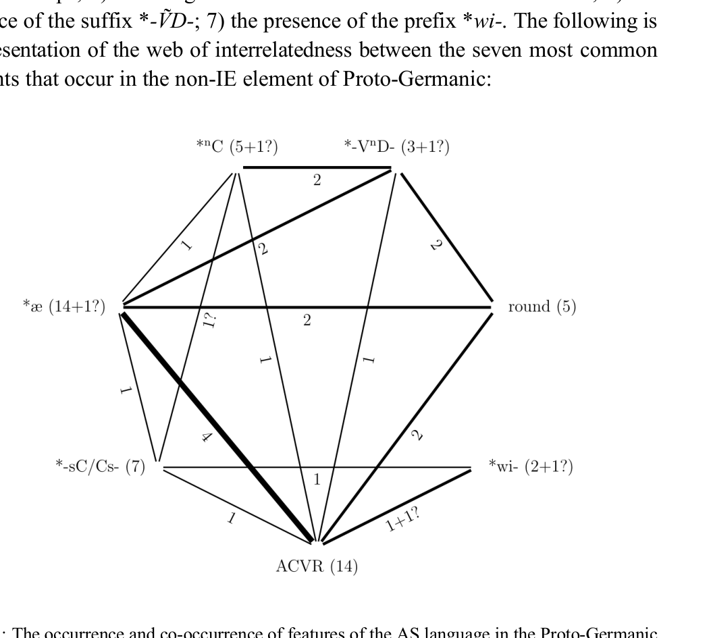

# Characteristics of lexemes of a substratum origin in Proto-Germanic

Aljoša Šorgo  
Leiden University

## Abstract

This article discusses 76 lexemes in Proto-Germanic that have been proposed to have a non-Indo-European origin, concluding that such an origin is very likely for at least 49 of these. The most common features identified in the non-IE element of the Germanic lexicon are: 1) accentually conditioned vocalic reduction; 2) the *a ~ *e ~ *ai vocalic correspondence set; 3) the irregular voicing and ordering correspondence of *-sC-/-Cs- clusters; 4) correspondences suggesting the existence of pre-nasalized stops; 5) rounding of a vowel between a labial and a resonant; 6) the presence of the suffix *-ṼD-; 7) the presence of the prefix *wi-. At least one of these features is found in 36 lexical items, which were adopted into Proto-Germanic from a single language or a group of closely related languages, the Agricultural substrate. It is proposed that the Agricultural substrate was characterized by a four-vowel system of /*æ *ɑ *i *u/, the presence of pre-nasalized stops, a mobile stress accent, and reduction of unstressed vowels.

## 1. Introduction1

The speakers of what would later become Proto-Germanic settled in South Scandinavia and what is today Northern Germany and Denmark at some point prior to 1000 BCE (HAWKINS 2009:52) and, in doing so, came in contact with the already present inhabitants of the area. It has long been recognized that Proto-Germanic had a non-Indo-European lexical substratum, which is usually ascribed to this native population (see RIFKIN 2007:53 and references provided there). There is no direct evidence of this language, henceforth called pre-Germanic, but an examination of Proto-Germanic vocabulary of non-IE origin can serve to provide some insight into the structure of pre-Germanic. 1

This article is a greatly revised and updated version of my unpublished master’s thesis ŠORGO (2015): Pre-Germanic: A tentative description of the substratum language in Proto-Germanic based on Guus Kroonen’s Etymological Dictionary of Proto-Germanic and supersedes that work entirely. The master’s thesis was written under the supervision of Metka FURLAN and Frančiška TROBEVŠEK-DROBNAK, to whom I am much obliged for their guidance and kindness. An earlier version of this article was presented at the International Colloquium on Loanwords and Substrata in Indo-European languages, held in Limoges, France, on 4th-7th June 2018, which I was able to attend as a contributor to the Multilingualism and Minority Languages in Ancient Europe project, funded by HERA, Uses of the Past. I would additionally like to thank Chams BERNARD and Ola WIKANDER for their comments, suggestions, and corrections. As always, any infelicities are entirely my own.

<!-- source-page: 428 -->

## 2. Identifying substrate vocabulary

The proportion of non-IE lexical items in the Germanic languages has been estimated to be as high as a full third of their entire lexical stock (HUTTERER 1975 apud HAWKINS 2009:53, 56; POLOMÉ 1987 apud RIFKIN 2007:54). This suggestion is certainly significantly over-inflated; rather, as the relatively small number of lexemes identified as being non-Germanic in origin in this article implies, the actual proportion of non-native vocabulary is unlikely to be any larger than in other Indo-European languages.2 The criteria used in this article to judge whether a lexeme has a substratum origin have been laid out in a number of works (BEEKES 1996:218; SCHRIJVER 1997:294–296; BOUTKAN & SIEBINGA 2005: §1.2.1.3). LUBOTSKY (2001:301) summarizes: “[A] lexeme is likely to have a substratum origin if it possesses some or all of these features: 1) limited geographic distribution; 2) phonological or mophonological irregularity; 3) unusual phonology; 4) unusual word formation; 5) specific semantics, i.e. a word belongs to a semantic category which is particularly liable to borrowing.”4 As SCHRIJVER (1997:296) points out, any one of these features in isolation is not enough to assume a substratum origin; rather, the cumulative weight of the evidence must be used to make that classification. One important pattern found in the non-IE element of the Western IE languages is a-prefixation, identified by SCHRIJVER (1997:296–297, 308ff.). He observed that some related etyma show one of two variants: 1) a variant with an a-prefix and a reduced form of the stem, i.e. a-CC-; 2) a variant without a prefix and a “full” form of the stem, i.e. CVC-. The clearest example is the variation *amsl- ~ *mesal- ‘blackbird’, where the former appears in Germanic, and the latter in Latin and Celtic. Several lexical items have since been identified which conform to this pattern, and this article takes a-prefixation as an important diagnostic criterion for determining non-IE origin of a lexeme. One suffix which commonly occurs in the non-IE part of the Greek lexicon is *-ind(h)- with several allomorphs: *-ĩd-, *-ĩdʰ-, *-ind-, *-indʰ- (KROONEN 2012: 242–244). This suffix, which will henceforth be written as *-ṼD-, is apparently 2

Compare, for example, Celtic, where substrate vocabulary comprises 6–10% of the entire lexical stock (MATASOVIĆ 2009:443). 3 Due to only having online access to BOUTKAN & SIEBINGA (2005), the section, rather than the pagination, is provided. 4 POLOME (1986:661–663) has identified the following semantic areas as liable to borrowing: animals, animal products, plant names, simple implements, environmental features, human feelings and perceptions, and human activities.

<!-- source-page: 429 -->

present in some lexical material of the northern IE languages as well. The best correspondence is PG *arwīt- ‘pea’ ~ Greek ἐρέβινθος ‘chick-pea’. The presence of this suffix will also be taken as one of the diagnostic criteria for ascribing a non-IE origin to a lexeme.— As a final point, an important methodological principle to consider when determining whether a lexeme has a substratum origin is best summed up by this quote: “One might argue that the starting point must be that a word in an Indo-European language must be IE, unless this proves not to be the case. And heuristically this is the best way we can work.” (BEEKES 1996: 215).

## 3. The Uniformity of the Substratum Language

It is by no means certain that all etyma identified as having a non-IE origin stem from the same source; rather, we expect at least some of them to be derived from different sources. This holds true even when we might identify a non-IE origin on the basis of the Germanic evidence alone: there is no a priori reason to exclude the possibility of two or more substrates exerting influence on Germanic, for example. This issue is only compounded when comparanda from other languages and language families are considered. KUIPER (1995:65–76) has specifically identified three different substrate layers in Europe, and an additional fourth has since been added to this list (BEEKES 1996:216–217). An overview of these four layers is provided by BOUTKAN & SIEBINGA (2005: §1.2.1). Layer A2, also called the “language of geminates”, was supposed to have been the primary source of non-IE vocabulary in the Germanic languages, but the main argument in favour of its existence, i.e. the preponderance of geminates in Germanic, has since been severely undermined by KROONEN (2009:60–62). Layer A3 is the language of Old European hydronymy proposed by KRAHE, who observed a number of similarities in river names across Europe. The language in which these river names were created was originally thought to be Indo-European, but it has since become clear that cannot be the case (KUIPER 1995:72–76). Based on its structure and the lack of any clear comparanda, the language itself is unlikely to have directly provided any lexical material to the IE languages (BOUTKAN & SIEBINGA 2005: §1.2.1., KUIPER 1995:74). Finally, layer A4 is the Mediterranean substrate found almost exclusively in Greek (BOUTKAN & SIEBINGA 2005: §1.2.1.).— Having eliminated three of the four layers, KUIPER’s framework has in essence once again left us with a single proposed substrate language or language family, his layer A1, “European”, for the Indo-European languages of Central Europe (i.e. Germanic, Celtic, Italic, and Balto-Slavic).

<!-- source-page: 430 -->

Proposing different substrates based solely on the geography of where certain non-IE etyma appear is not a suitable model; the only way to determine to which substrate a certain non-IE lexeme belongs is by examining its phonological and morphological make-up. It is noteworthy, however, as will be argued in Section 5, that certain phonetic and morphological patterns re-occur throughout the Central European area and arguably extend to South-Eastern Europe. Due to the limited number of non-IE etyma in Proto-Germanic considered here, some of these patterns may be mirages, but it is difficult to deny that at least some non-IE elements in IE languages of Central and Southern Europe show an affinity to each other. These have served as the basis for the Agricultural substrate hypothesis, positing that this substrate language spread with adoption of agriculture (KALLIO 2003:232ff.; KROONEN 2012:239ff.). While a uniform substrate language for such a widespread area is impossible, these affinities do suggest that the various European IE languages were at the time in contact with a group of closely related languages, which is the underlying assumption of this article. Acknowledging the existence of this substrate language family does not preclude the likelihood of its co-existence with other non-IE languages in areas later settled by speakers of IE languages, however, and it is thus likely that some of the non-IE etyma are derived from those. The first step, however, is to simply identify lexemes of a non-IE origin in Proto-Germanic. Only afterwards can we analyse these in an effort to further classify their origin.5

## 4. Proto-Germanic lexemes of a likely substrate origin

This section lists a number of lexemes in Proto-Germanic that have been proposed to have a non-IE origin.6 Arguments for or against a substrate origin are provided in the commentary. The original list of 85 lexical items I identified as having a non-IE origin in ŠORGO (2015) has now been reduced to 49 items due to a more rigorous application of the principles outlined in Section 2.7

5

For this, see Section 5.2. When not otherwise specified, the suggestion that a lexeme may have a non-IE origin is given under the relevant entry in EDPG. 7 The entries are exclusively taken from KROONEN (2013) ( = EDPG), and the list is by no means exhaustive; including other references would certainly expand the number of relevant items. With further research and more data, it is likely that the status of some of these items will need to be reconsidered, either by including or excluding them from the list of substrate vocabulary. 6

<!-- source-page: 431 -->

### *ahurna- masc. ‘maple’ (EDPG 7)

Germanic: North, West. Indo-European: Latin acer ‘maple’; Greek (Hesychius) ἄκαστος (?) ‘maple’ and ἄκαρνα (?) ‘laurel-tree’. Analysis input: AHUR

The two Greek terms have been proposed to be of a pre-Greek origin (BEEKES 2010:49, 50) and may be connected to the Proto-Germanic lexeme (DE VAAN 2008:21–22; BEEKES 2010:49, 50), though KROONEN disagrees (EDPG 7). The no-suffix, also attested in Latin acernus ‘made of maple’, must be a secondary addition in Germanic in light of Upper German Acher < *ahra- (EDPG 7). A derivation from the root *h₂eḱ- ‘sharp’ (POKORNY 1959:18–22) is formally difficult due to initial a-vocalism and non-matching ablaut grades in Germanic and Italic: *akr- ~ *aker-.

### *aik- fem. ‘oak’ (EDPG 9–10)

Germanic: North, West. Indo-European: Latin aesculus (?) ‘kind of oak-tree’; Greek αἰγίλωψ ‘kind of oak’, Baltic: Lithuanian áižuols, ą́žuolas (?), áužuolas (?), Latvian uôzuõls (?), Old Prussian ansonis (?) ‘oak’. Analysis input: {AI}K

The Germanic lexeme is declined as a root noun, but it is also possible to reconstruct a West Germanic word *aikilōn- ‘acorn’ from the same root (EDPG 9-10). The Greek and Italic comparanda are seemingly derived from a root we may reconstruct as *aig-. The derivation of the Greek and Italic terms from this root, however, is obscure. Some Baltic comparanda can be regularly derived from Proto-Balto-Slavic *onʔź-(ō)l- (DERKSEN 2015:75); the semantic and phonetic match of the root in Lithuanian áižuols with *aiǵ-, however, seems to require taking this lexeme at face value, as descended from *aiǵ-ōl.8

### *akwesī- f. ‘axe’ (EDPG 19)

Germanic: East, North, West. Indo-European: Latin ascia ‘axe, trowel’, Greek ἀξίνη ‘two-edged axe’. Non-Indo-European: Akkadian ḫaṣṣinu ‘axe’ (Szemerényi 1971: 656 apud Beekes 2010: 111, Holes 2016: 14), Aramaic ḥaṣṣīnā ‘id.’ (ibid.), Arabic xaṣīn ‘id.’ (ibid.), Mishnaic Hebrew ḥazīnā (WALDMAN 1972:117). Analysis input: A{KW}ESĪ

The forms in the three Indo-European languages cannot be formally reconciled. The Latin form must be the result of metathesis (DE VAAN 2008:57). The Greek lexeme includes the element -īn-, which is a typical substrate suffix (BEEKES 8

As a side note, the descendants of Proto-Balto-Slavic *onʔź-(ō)l- all have the meaning ‘oak’ in Baltic, while regularly descended Proto-Slavic *ǫ̀zlъ certainly means ‘knot’. A connection between the Proto-Slavic noun *ǫ̀zlъ ‘knot’ and the verb *vę̄ zàti ‘to tie’ is problematic for accentual reasons (DERKSEN 2008:388), but one may imagine a scenario where in Proto-Slavic the noun meaning ‘oak’ and the verb ‘to tie’ were, due to their phonetic similarity, folketymologically understood as being related and the noun thus acquired a meaning derived from the verb, ie. ‘knot’.

<!-- source-page: 432 -->

2010:111) and the cluster ks ‹ξ› precludes the possibility of a labial element in the Greek pre-form. The Semitic comparanda cannot be regularly descended from Proto-Semitic; rather, Akkadian ḫaṣṣinu was loaned into the other Semitic languages (WALDMAN 1972:117). Since the Akkadian etymon itself exhibits an unexpected internal variation ṣ ~ z (ibid.), however, it is likely to be a loanword from some third source and related to the IE comparanda through it.

### *albut- f. ‘swan’ (EDPG 20)

Germanic: North, West. Indo-European: Proto-Slavic *olbǭdь ~ *olbǭtь ~ *elbedь ~ *elbǭtь ‘swan’ (DERKSEN 2008:365–366). Analysis input: ALBUT

While the word is often connected to the adjective *h₂elbʰ-o- ‘white’ (cf. Latin albus ‘id.’), the Slavic comparanda present a plethora of issues (DERKSEN 2008: 365–366) and appear irreconcilable with this assumption. Rather, the root inflection in Proto-Germanic and the presence of a *-ṼD- element strongly suggest a substrate origin.

### *alh- m. ‘temple’ (EDPG 22)

Germanic: East, West. Indo-European: Proto-Baltic *alkas ‘grove on a hill; idol’ (Derksen 2015: 49-50). Analysis input: none.

While proposed to be a substrate term due to its limited geographic distribution and declension as a root noun in Germanic (EDPG 22), a derivation from the root *h₂lek- ‘to ward off, defend’ (cf. Greek ἀλκή fem. ‘defense, help’) hardly seems arbitrary and is the preferable choice.

### *alis/z- m. ‘alder’ (EDPG 22)

Germanic: North, West. Indo-European: Latin alnus ‘alder’, Proto-Baltic *alksnis ‘alder’ (cf. Lithuanian al̃ksnis ‘id.’) (Derksen 2015: 50), Proto-Slavic *olьxa ~ *elьxa ‘alder’ (DERKSEN 2008:370-371), (Ancient) Macedonian ἄλιζα (?) ‘white poplar’ (BEEKES 2010:67–68). Analysis input: ALI{S/Z}

SCHRIJVER (1991:40–42) notes two issues with the terms in Germanic and Balto-Slavic: the variation between initial a ~ e in both groups (Old Icelandic jǫlstr ‘alder’ < *elustru < *elastrō ~ Old Icelandic ǫlr ‘id.’ < *al-; cf. OCS. jelьxa ‘id.’ ~ Polish olcha ‘id.’) and the variation between s ~ is in the second syllable. He then provides an account of how the various forms might have been derived from PIE *h₂el- in the individual branches. As observed by DERKSEN (2008:371; 2015:50), however, the recurrence of the same issues in both branches strongly points to a substrate origin.

<!-- source-page: 433 -->

### *amslōn- f. ‘blackbird’ (EDPG 25–26)

Germanic: West. Indo-European: Latin merula ‘blackbird’, Proto-Celtic *mesalkā ‘blackbird’ (cf. Middle Welsh mwyalch) Analysis input: AMSL

The variation between *amsl in Germanic and *mesal- in Italic and Celtic clearly shows the a-prefix with associated syncope indicative of a substrate origin (SCHRIJVER 1997:307ff.).

### *apan- m. ‘monkey, ape’ (EDPG 31)

Germanic: North, West.Indo-European: Greek κῆπος (?) ‘long-tailed monkey’, Sanskrit kapí- (?) ‘monkey’. Non-Indo-European: Hebrew qōf (?) ‘monkey vel sim.’, Akkadian u/i/aqūpu (?) ‘id.’, Coptic sapi (?) ‘id.’, Old Egyptian gfj (?) ‘id.’ Analysis input: none

The forms in Greek and Sanskrit are reminiscent of the words for ‘monkey’ in some Afro-Asiatic languages (EDPG 31). To resolve the discrepancy between the absence of an initial plosive in Proto-Germanic, KROONEN suggests that the word was borrowed as *h₂/₃eb- at an early stage (presumably from a pre-form akin to *q/χVb-). Another explanation is that PG *apan- is descended from the PIE root for ‘water’, *h₂ep-, and the suffix *-h₃on-, i.e. *h₂ep-h₃on- > *h₂ebon-,9 with the original meaning being ‘water creature’. Proto-Celtic *abon- ‘river’ can be understood as a regular development of this pre-form, and its derivative *abanko- ‘beaver’ came to refer to ‘dwarf’ and ‘sea monster’ in the later Celtic languages (MATASOVIĆ 2009:23–24). If one upholds this derivation, the Germanic semantics developed along similar lines: water creature > water monster > monster > dwarf/giant > monkey (KLUGE–SEEBOLD 2011:18–19, though it is argued there that PG *apan- is originally a loan from Celtic). In this case, the lexeme is simply descended from PIE. If we assume a connection to the Sanskrit and Greek terms, however, the preservation of the original meaning ‘monkey’ and the non-shifted *-p- suggests we are dealing with a comparatively late loanword from some southern source, rather than one from the Germanic substrate.

### *artō(n)- f. ‘wagtail?’ (EDPG 36)

Germanic: North, West. Indo-European: Greek ἐρῳδιός, ἐρωδιός, ῥωδιώς, ἀρωδιός (?) ‘heron’; Latin ardea (?) ‘heron’; Serbian róda (?) ‘stork’. Analysis input: ART

The vacillation of the initial vowel in Greek forms could be due to a pre-Greek origin (BEEKES 2010: 468-469), which would exclude an Indo-European etymology. While BEEKES (ibid.) doubts a connection between the Greek and 9

With voicing assimilation of the cluster *-ph₃-, as in the commonly cited example *pi-ph₃-e/o- > Skt. piba- ‘to drink’.

<!-- source-page: 434 -->

Germanic lexemes, a substrate origin for both seems likely to me. KROONEN (EDPG 36) notes the possibility that the initial /a/ is the substrate a-prefix.

### *arut- m. ‘ore’ (EDPG 37)

Germanic: West. Indo-European: Latin raudus, rūdus ‘lump of ore’. Analysis input: ARUT

The Latin lexeme has been proposed to be a loanword from another Indo-European language in order to uphold a connection with the PIE root *h₁reu̯dʰ‘red’ (DE VAAN 2008:515), but a connection to the Proto-Germanic lexeme is more attractive in light of the latter’s root-noun inflection and their variation in a way that is formally identical to a-prefixation with syncope.

### *arwīt- f. ‘pea’ (EDPG 37)

Germanic: North, West.Indo-European: Latin eruum ‘bitter vetch’, Greek ὄροβος ‘id.’ and ἐρέβινθος ‘chick-pea’. Analysis input: ARWIT

The two Greek lexemes ὄροβος and ἐρέβινθος are clearly of non-Indo-European origin in light of their non-matching vocalism and the presence of the ινθ-suffix (BEEKES 2010: 451, 1107–1108), indicating that the formally irreconcilable Latin and Germanic comparanda are also non-Indo-European in origin, further corroborated by the likely reflex of the *-ṼD- suffix in Germanic (EDPG 37).

### *aspō- ~ *apsō- f. ‘aspen’ (EDPG 39)

Germanic: North, West. Indo-European: Proto-Baltic *epušė ‘aspen’ (cf. Lithuanian ẽpušė) (DERKSEN 2015:154)10, Proto-Slavic *osa ‘id.’ (DERKSEN 2008:378). Non-Indo-European: Teleut apsak ‘alder’, Siberian Tatar ausak, apsak ‘id.’, Chuvash ăwăs ‘id.’, Kazan Tatar usak ‘id.’, Proto-Finnic *šapa ‘id.’ Analysis input: none

The distribution of this lexeme matches the distribution of the tree and has comparanda in Turkic and Uralic languages (EDPG 39). Armenian op’i ‘poplar’ and Sanskrit sphyá- ‘oar, pole, shovel’ (MALLORY & ADAMS 1997:33), however, indicate that the ultimate origin of the northern terms for ‘aspen’ must be IE.

### *aþala- n. ‘nature’ (EDPG 40)

Germanic: West. Analysis input: none

While KROONEN (2013) merely classifies this lexeme as Germanic, BOUTKAN (1998:105–108) considers it a borrowing from a substratum language based on vocalic variations between a and i in the various Germanic languages. This is better explained by assuming that the forms with i are derived from the adjective *aþulja- < *at-l̥-i̯o-. 10

*a > *e by means of ROZWADOWSKI’s change (for which see ANDERSEN 1996:97ff.).

<!-- source-page: 435 -->

### *awadī- f. ‘eiderduck’ (EDPG 44)

Germanic: North. Non-Indo-European: North Saami hávda ‘eider’, Lule Saami ávdda ‘eider’. Analysis input: AWADĪ

The northern distribution seems to imply its ultimate origin as a loanword into both Proto-North-Germanic and Saami (or into one of them, from which it was then loaned into the other) (EDPG 44). The similarity to PG *ewwadjōn- ‘tit’ (see below) is apparent, but the two roots are not in any derivational relationship that can be explained in Indo-European or Uralic terms, so it is reasonable to assume that both *awadī- and *ewwadjōn- derive from a third language. The only issue is the chronology implied by the purely northern distribution, which might indicate that the terms were loaned into Proto-North-Germanic after the disintegration of Proto-Germanic proper.

### *baira- m. ‘boar’ (EDPG 48)

Germanic: West. Indo-European: Brittonic *basi̯ o- / *baði̯ o- ‘boar’ (cf. Middle Welsh baed) (SCHRIJVER 1997:304). Analysis input: B{AI}R

Already identified as having a pre-Indo-European origin by Polomé (apud EDPG 48), the Celtic a ~ Germanic ai variation has been proposed to be indicative of a substrate origin (SCHRIJVER 1997:306–307).

### *balika/ōn- m./f. ‘coot’ (EDPG 50)

Germanic: West. Indo-European: Latin fulica ‘a water bird (coot?)’ (DE VAAN 2008:248). Analysis input: BALIK

While KROONEN (EDPG 50) and DE VAAN (2008:248) disagree on whether the first vowel in the Latin lexeme can reflect *-ol- (former against, latter for), the otherwise identical suffixes disagree in voicing, which cannot be formally reconciled. The additional fact that we are dealing with a bird-name and its very limited geographical distribution are strongly indicative of a substrate origin.

### *baunō- f. ‘bean’ (EDPG 55)

Germanic: North, West. Indo-European: Latin faba ‘bean’, OPru. babo ‘id.’, Proto-Slavic *bobъ ‘id.’ (cf. OCS bobъ); Greek φακός ‘lentil’, Albanian bathë ‘bean’ < *bʰaḱ-o/eh₂-. Analysis input: B{AU}-

All the European words have the same initial elements, but the final consonants of the root cannot be reconciled.11

11

The assumption that the *bʰabʰ- variant in Latin and Balto-Slavic is a result of reduplication and that the root *bʰa- is of an Indo-European origin (POKORNY 1959:106) is formally problematic not only because of the unexpected a-vocalism in the reduplicated syllable, but because it

<!-- source-page: 436 -->

### *bebura- m. ‘piece of skin, cloth’ (EDPG 57)

Germanic: North, West. Indo-European: Latin fibra ‘radical or sheathing leaf; lobe, division, section’ (DE VAAN 217–218); Latin fimbriae ‘fringe on a garment, fringe of curly hair’ (ibid.). Analysis input: none

While the lexeme does not exhibit any peculiar alternation in Germanic, the (possible) Latin equivalent fibra exhibits a variant f. pl. form fimbriae. As a result, DE VAAN (2008:217–218) proposes it to be a possible loanword. Note that the variation of b ~ mb is common in Pre-Greek (BEEKES 2010: xxiv). Nonetheless, it is unwarranted to assume a substrate origin based on a single unexplained form in another language.

### *benuta- m. ‘bentgrass’ (EDPG 59)

Germanic: West. Analysis input: none

The Low German variants (cf. Dutch bies ‘bulrush, sedge’) point to a preform *beusō- and, since the lexemes have no extra-Germanic comparanda, we might be dealing with a loanword (EDPG 59). A single aberrant form in one of the descendant languages, however, is not sufficient grounds to assume a substrate origin.

### *blīwa- n. ‘lead’ (EDPG 69)

Germanic: North, West.Indo-European: Latin plumbum (?) ‘lead’, Greek μόλυβδος ~ μόλιβος ~ βόλιμος (?) ‘id.’, Proto-Celtic *φloud (EDPG 328). Non-Indo-European: Berber *βā̆ldūn/m, *būldūn ‘lead’ (DE VAAN 2008:474). Analysis input: BLĪW-

BEEKES (1999:7–14) has argued that the Greek terms cannot be related to Latin plumbum, and is possibly a loanword from Lydian marivda- ‘dark’ (see also MELCHERT 2004). The similar PG *lauda- ‘lead’ is a loanword from Proto-Celtic *φloud (EDPG 328). Latin plumbum, however, cannot be directly related to this Proto-Celtic form and both are likely loanwords from a third source, whence the Berber terms might have likewise been borrowed ( DE VAAN 2008:474). KROONEN proposes that we are dealing with a Wanderwort whose form in pre-Germanic was *mlīuo- (EDPG 69).

### *dawēn- v. ‘to marvel’ (EDPG 91)

Germanic: North. Indo-European: Greek θαῦ-μα ‘wonder, astonishment’. Analysis input: none

If one accepts BEEKES’s analysis that the root in Greek θαῦμα is of a pre-Greek origin (BEEKES 2010:535), then it naturally follows that the root in Proto-

cannot account for the Germanic forms (even if one conceded that the Greek and Albanian forms could originally be ko-adjectives to the root).

<!-- source-page: 437 -->

Germanic is non-native as well. Nonetheless, a single formal correspondence is not enough reason to conclusively connect the two.

### *dragjō- f. ‘dregs’ (EDPG 99)

Germanic: North. Indo-European: Proto-Balto-Slavic *dro(z)gi(ʔ)aʔ ‘dregs, yeast’ < *dʰragʰ-i̯eh₂ (DERKSEN 2008:121); Albanian dra m. ‘sediment, dregs; sweepings, dirt’ < *dʰragʰ-o-; Latin fracēs (?) ‘sediments of olive pulp’. Analysis input: none

KROONEN (EDPG 99) rejects the connection with Latin fracēs, but both DE VAAN (2008:238) and DERKSEN (2008:121) affirm it and assume non-IE avocalism, which is, however, not strictly necessary even if we accept a connection with the Latin term. Furthermore, DE VAAN himself provides an explanation for Latin c as originating from analogy, so the only other phonetic irregularity does not require a substrate explanation either.

### *drenan- m. ‘drone’ (EDPG 101)

Germanic: West. Indo-European: Proto-Baltic *trono- ‘drone’, Proto-Slavic *trǫtъ ‘id.’ < *tronto-, Greek ἀν-θρηδών ‘hornet’, τεν-θρηδών/τεν-θρήνη ‘wasp, forest-bee’. Analysis input: none

The various Germanic terms require different pre-forms: *dʰr- + *-(ē/e/o/Ø)n-, some of which may be secondary. While it is theoretically possible, though difficult, as far as the vocalism is concerned, that all the Germanic and Balto-Slavic terms are derived from an n-stem, the non-matching anlaut is impossible to explain in Indo-European terms. The Greek comparanda, if related, are likely of pre-Greek origin (BEEKES 2010:1467). On the other hand, BEEKES (2010: 554) ascribes an independent onomatopoetic origin to Germanic *dren- and Sanskrit dhraṇati ‘sounds’. This is the most likely explanation and the Germanic and Balto-Slavic roots, *dren- and *tren, respectively, must then be independent creations derived from attempting to mimic the sound of buzzing, presumably through the trilling quality of the sound *r or the combination *Tr-.

### *ēbanþ- ~ *ēbund- m. ‘evening’ (EDPG 113)

Germanic: North, West. Analysis input: {Ē/A}{B/F}T

KROONEN (EDPG 113) follows HAMP’s reconstruction of nom. sg. *h₁éh₁ptont, gen. sg. *h₁h̥ 1pt-nt-ós, which would explain West Germanic *ēb- (with dissimilation of *t) and North Germanic *aft- respectively. BEEKES (1996:231– 233), on the other hand, considers this lexeme to be of a substratum origin, one of the reasons being that the long vowel variant appears in an open syllable and the short vowel variant in a closed one. Kroonen’s observation that the *-an- ~ *-un- alternation points to an original accentually mobile paradigm is surely

<!-- source-page: 438 -->

correct and if the term was loaned, it was most likely secondarily extended with *-(o)nt-. The primary issue with HAMP’s reconstruction, however, is the apparent root element: *h₁(e)h₁pt- cannot be directly inherited from PIE, so if we are dealing with a native term, it would need to be secondarily created at a relatively early stage through, e.g., compounding or some derivational process. Such a scenario seems extremely unlikely, so it is preferable to assume that the root *ēb-/*aft- ( < *ē/apt-) was loaned at a pre-Verner stage.

### *ebura- m. ‘boar’ (EDPG 114)

Germanic: North, West. Indo-European: Proto-Balto-Slavic *weprios (DERKSEN 2008:515) ‘wild boar’; Proto-Italic *apro-, *aprōn- ‘wild boar; kind of fish’ (DE VAAN 2008:46); Thracian ἐβρος ‘buck’ (ibid.). Analysis input: EBUR

While DE VAAN (2008:46) assumes that the Proto-Germanic form developed from *h₁ep-r- and the Proto-Italic from *h₁pr-o-, this cannot explain the avocalism in Italic, so he additionally proposes the possibility that a was taken from Latin caper ‘he-goat’. Even if one were to fully accept this explanation for Latin, the initial *w in Balto-Slavic still cannot be formally accounted for.

### *ewwadjōn- f. ‘tit’ (EDPG 121)

Germanic: North. Non-Indo-European: Imandra Saami avigʒinȇ ‘tit (?)’. Analysis input: E{WW}AD

See *awadī- above.

### *fata- n. ‘vat, vessel’ (EDPG 131)

Germanic: North, West. Indo-European: Proto-Baltic *puodas ‘pot’ (DERKSEN 2015:372). NonIndo-European: Proto-Finno-Ugric *pata (CARPELAN & PARPOLA 2007:122). Analysis input: none

The Baltic forms developed from *podo-, originally a neuter (DERKSEN 2015: 372), the same as in Germanic, while there are also numerous comparanda in the Uralic languages, which have been analysed as descended from an original loan into Proto-Uralic from PIE (CARPELAN & PARPOLA 2007:122)12. KROONEN considers the northern distribution evidence of a substrate origin, but that is by no means certain.

### *gait- f. ‘goat’ (EDPG 163-164)

Germanic: East, North, West. Indo-European: Latin haedus ‘young goat-buck, kid’. Non-Indo-European: Proto-Semitic *gady ‘goat’. Analysis input: G{AI}T DE VAAN (2008:278) assumes a non-native origin for the Latin and Germanic

12

The comparanda are found throughout the Uralic family (COLLINDER 1955:47) and are thus all likely descended from Proto-Uralic itself as opposed to being later loans.

<!-- source-page: 439 -->

forms. KROONEN (EDPG 163) agrees, since the reconstruction requires avocalism and the Germanic term was inflected as a root noun. One may also compare Proto-Semitic *gady ‘goat’ and KROONEN proposes that both the ItaloGermanic and the Proto-Semitic forms were borrowed from a third source (or, rather, borrowed different terms ultimately derived from a single source).

### *gazda- m. ‘prickle’ (EDPG 172)

Germanic: East, North, West. Indo-European: Proto-Celtic *gazdo- ‘withe, osier’ ~ *gasto‘sprig, shoot, twig’; Latin hasta ‘spear-shaft, lance’. Analysis input: GAZD

The comparanda point to a root-final alternation of a voiced and voiceless cluster, which cannot be accounted for in formal terms.

### *gerstō- f. ‘barley’ (EDPG 175)

Germanic: West.Indo-European: Latin hordeum ‘barley’ < *gʰr̥(s)d-i̯o-; Greek κρῑϑή, epic κρῖ ‘barley’ < *gʰrīdʰ-; Armenian gari ‘wheat’; Albanian drithë ‘cereal, grain’ < *ǵʰrisdʰ-, Hittite karaš ‘wheat, emmer-wheat’ < *ǵʰersdʰ- (KLOEKHORST 2008:515). Non-Indo-European: Georgian keri (ქერი) ‘barley’ (TSCHENKÉLI 1960:1548) < *ker, Basque gari ‘wheat’, garagar ‘barley’ (MARTIROSYAN 2009:199; ČIRIKBA 1985:101), Burushaski gur ‘wheat’ (WITZEL 2003:22), ProtoEast-Caucasian *G̱ ōl’e (ibid.: 22, 31). Analysis input: GERST

The Germanic, Latin, and Hittite forms can be accounted for as descending from a common root, but cannot be reconciled with the other comparanda which exhibit variation in the treatment of the *-sD- cluster (with non-matching voicing) and unexpected vocalism; Armenian gari and Greek κριθή point to an earlier *gʰriV-/*gʰrīdʰ- (MARTIROSYAN 2009:199). Because of the formal difficulties in relating the various IE forms and the widespread geographic distribution, it is possible we are dealing with a Mediterranean substratum word (MARTIROSYAN 2009:199), which would have also provided the Basque comparanda.13 The Caucasian etyma are likely somehow related to this Mediterranean substrate term, either directly or through intermediaries. Since Germanic and Latin show forms that can be formally more easily related, they both likely received the term for barley through related continental sources.

13

Contrary to this view, WITZEL (2003:21ff., 22, 31) and ČIRIKBA (1985:95ff., 101–102) argue for a genetic relation between some Caucasian languages and Basque and see Basque gari as a cognate of a number of East Caucasian terms. Witzel (2003: 45) argues that the Macro-Caucasian family (including the Northeast and Northwest Caucasian languages, Basque, and Burushaski) directly received its term for wheat, **gVr/l, from the Fertile Crescent.

<!-- source-page: 440 -->

### *habuka- m. ‘hawk’ (EDPG 197–198)

Germanic: North, West. Indo-European: Proto-Slavic *kobьcь ‘a type of bird’ (Derksen 2008: 227), Latin capus ‘falcon’. Non-Indo-European: Etruscan capu ‘falcon’. Analysis input: HABU

The Slavic and Germanic forms point to *ka/obʰu- with added *-k- and *-g-, respectively, while Latin requires *kapu- (which was likely loaned from Etruscan). These voicing variations cannot be formally reconciled and, additionally, *k-bʰ of Slavic and Germanic is in violation of PIE root constraints and thus cannot be inherited. KROONEN (EDPG 198) assumes we are dealing with a Wanderwort.

### *hafra- m. ‘billy goat, buck’ (EDPG 198)

Germanic: North, West. Indo-European: Proto-Celtic *gabro- ‘he-goat’; Proto-Italic *kapro- ‘hegoat, buck’, Greek κάπρος ‘(wild) boar’. Analysis input: HAFR

The word for ‘goat’ has been explained in two ways: as a substrate word (EDPG 198) or as derived from the root *kh₂p- ‘to take’ (BEEKES 2010:639– 640). The Celtic forms present us with a formal difficulty: while -br- < *-pr is a regular development, initial g has no certain explanation (MATASOVIĆ 2009:148). I thus cautiously include it among substrate vocabulary.

### *haleþ- ~ *haluþ- m. ‘man, hero’ (EDPG 204)

Germanic: North, West. Indo-European: Tocharian B kālśke, kālyśke (?) ‘boy, youth, young brahmin’, Proto-Celtic *karut- (?) ‘champion’. Analysis input: HAL{E/U}Þ

A connection with the Tocharian forms is possible (with a different suffix)14, but since Proto-Celtic *karut- is a better semantic match and has no IE etymology, and the Germanic forms are difficult, though not impossible, to reconcile with each other, a substrate origin seems more likely (EDPG 204).

### *hanipa- m. ‘hemp’ (EDPG 209)

Germanic: North, West. Indo-European: Proto-Slavic *konopl’a (SNOJ 2009:303), Greek κάνναβις ‘hemp’. Analysis input: HANIP- A pre-IE Wanderwort.

### *hemerō- f. ‘hellebore’ (EDPG 219)

Germanic: West. Indo-European: Proto-Balto-Slavic *kemero- ‘hellebore’; Greek κάμ(μ)αρος ‘larkspur, aconite’. Analysis input: none

The Germanic and Balto-Slavic forms can be reconciled into a single protoform. The Greek term is semantically and phonetically similar, but is not necessarily related to the Germanic and Balto-Slavic forms. 14

Both perhaps related to Greek καλός ‘beautiful’ (ADAMS 2013:164).

<!-- source-page: 441 -->

### *hrugan- m. ‘fishroe’ (EDPG 250)

Germanic: North, West. Indo-European: Proto-Baltic *kr(H)k-ulo- ‘frogspawn’, Proto-Slavic *krēk-o-, *kor(h₁)k-o- ‘frogspawn’. Analysis input: none

POLOMÉ (1986:661) proposes a non-IE origin, but KROONEN’s explanation (EDPG 250) of PG *hrugan- for expected *hurgan- < *kr(h₁)k-ón- as based on the full-grade variant of the root (*kreh₁k-) is more attractive.

### *hulisa- m. ‘holly’ (EDPG 253)

Germanic: West. Indo-European: Proto-Celtic *kolino- ‘holly’, Albanian kalli ‘ear, awn’ (MATASOVIĆ 2009:213, DEMIRAJ 1997:211), Proto-Slavic *kolsъ ‘ear, spike (of wheat)’ (DEMIRAJ 1997:211). Analysis input: none

KROONEN (EDPG 253) proposes a non-IE origin, but it seems preferable to derive the Germanic proto-form from a zero-grade *kl̥ hx-i- and the Celtic one from the o-grade variant *kolhx-i-, both derivations from the verbal root *kelh₂‘to sting’. Other related words then include Proto-Slavic *kolsъ ‘ear, spike (of wheat)’ and Albanian kalli ‘ear, awn’ (DEMIRAJ 1997:211, SNOJ 2009:275). Old English holen, holegn appears to require a pre-form *kuleno-, but, as noted with *benuta- above, a single aberrant proto-form is hardly sufficient evidence to assume a substrate origin.

### *humara- m. ‘lobster’ (EDPG 254)

Germanic: North. Indo-European: Greek κάμ(μ)αρος m. ‘lobster’, κάραβος (?) ~ κάβουρος (?) ‘id.’ Analysis input: none

KROONEN (EDPG 254) argues that Greek κάραβος and κάβουρος he lists as variants indicate a non-IE origin for this term. However, BEEKES (2010:631) makes no note of a connection between these Greek terms, even though he considers κάμ(μ)αρος itself pre-Greek based on the vocalism of the Macedonian gloss κομ(μ)άραι ‘shrimps’ (ibid.). Since the reflex of *CRH- in Macedonian is uncertain, the Greek and Macedonian words could just as easily be regular reflexes of *kmh₂ero-, which would also regularly develop into PG *humara-.15

### *humelan- m. ‘hops’ (EDPG 255)

Germanic: North, West. Indo-European: Proto-Slavic *xъmelь ‘hops’, Ossetic xumællæg ‘hops’ < Proto-Iranian *haumalaka- (SNOJ 2009: 206–207). Non-Indo-European: Hungarian komló, Middle Turkic kumlak (LEVITSKAJA et al. 2000:137–139), Proto-Chuvash *qumlaγ (ibid.). Analysis input: none

15

The Greek and Macedonian variants with -μμ- are admitedly unexpected, but are in light of the existence of the un-germinated variant most likely secondary.

<!-- source-page: 442 -->

KROONEN considers this a prehistoric Wanderwort of an Eastern origin based on lookalikes in Finno-Ugric and Turkic, with Slavic *xъmelь ‘hops’ being a loan from Germanic. The situation is most likely reversed, however: the Germanic term is a borrowing from Slavic, which itself borrowed the term from an Iranian word cognate with Ossetic xumællæg ‘hops’ < Proto-Iranian *haumalaka- (SNOJ 2009:206–207). This same Iranian word, or another cognate, is also the ultimate origin of Middle Turkic kumlak and Proto-Chuvash *qumlaγ (LEVITSKAJA et al. 2000:137–139). Hungarian komló must be a late loanword from some Turkic source, as evidenced by the preservation of initial k, which would have otherwise regularly developed into h.

### *hwerhwetjō- f. ‘gourd’ (EDPG 266)

Germanic: West. Indo-European: Latin cucurbita ‘gourd’. Analysis input: {HW}ER{HW}ET

The only descendants are found in English, but are unlikely to be inherited. The resemblance with the Latin term is apparent, but impossible to formally account for in any way. Both likely stem from a single or a pair of related substrate words.

### *kattōn- f. ‘cat’ (EDPG 281-282)

Germanic: North, West. Indo-European: Latin cattus (?) ‘cat’. Non-Indo-European: Proto-FinnoUgric *käδ’wä ‘female (fur animal)’, Nubian kadis (?) ‘cat’, Arabic qiṭṭa (?) ‘id.’ Analysis input: KAT

While usually considered to be a borrowing of Latin cattus, which originated from an Afro-Asiatic language, the internal Germanic evidence indicates we are dealing with an old n-stem nom. sg. *katō ~ gen. sg. *kattaz (EDPG 281), as evidenced by the existence of a derivation *katazan ‘tomcat’ (EDPG 281). The presence of a geminate in the n-stem variant requires the existence of this root in Proto-Germanic before Grimm’s law, meaning its original form was *gad-, comparable to Proto-Finno-Ugric *käδ’wä and its descendants (EDPG 282).

### *kisila- m. ‘gravel’ (EDPG 289)

Germanic: West. Indo-European: Proto-Baltic *ǵ(e)is-ro-. Non-Indo-European: Udmurt gi̮ ǯ, gi̮ ǯi̮ ‘grain of sand’, Komi keža ‘gravel’, Khanty χĭš ‘fine sand’, Mansi χĭs ‘sand’ (COLLINDER 1955:80), Georgian kviša ‘sand’. Analysis input: KIS

A diminutive of Proto(-West)-Germanic *kisa-, which has a root cognate in Proto-Baltic. Both are reminiscent of Udmurt gi̮ ǯ/gi̮ ǯi̮ , Komi keža, Khanty χĭš, and Mansi χĭs (hys), which cannot, however, be reconciled into a single Proto-

<!-- source-page: 443 -->

Uralic form.16 The Georgian comparandum kviša indicates we are not dealing with a term limited to the north. It is likely that the root *ǵ(e)is- and a derived word for ‘gravel’ already existed in a late northern dialect of Proto-Indo-European and while a native origin for it cannot be excluded (a Uralic or Georgian origin is unlikely due to their peripheral location), the seeming correspondence of -vi- (< *-wi-) and -š- in Georgian with a (mid-)high back vowel and -ś-, respectively, required for the pre-forms of the Uralic comparanda, in addition to the peculiar geographic distribution and the presence of an initial voiced stop in central locations only, the most likely explanation is that we are dealing with an originally non-Indo-European word.

### *kizna- m. ‘pine tree’ (EDPG 289–290)

Germanic: West. Indo-European: Proto-Celtic *gis-usto- ‘pine tree’, Irish giumhas ‘resin’, Scottish Gaelic giuthas ‘fir’. Non-Indo-European: Finnish kuusi ‘spruce’, North Saami guossâ ‘spruce’. Analysis input: KIS

One may compare the terms that refer to the spruce or the pine tree in the various Uralic languages, which are difficult to reconcile with each other due to the vocalism of the first syllable (RÉDEI 1988:222).17 The Uralic pre-forms were, however, unlikely to be loaned from PIE *gis- or a descendant, since its vowel could have hardly been taken over as rounded. This, along with the northern distribution, strongly suggests an origin in some third source.

### *krabita- m. ‘crayfish’ (EDPG 300)

Germanic: West. Analysis input: none

KROONEN (EDPG 300) notes the similarity to Greek κάμ(μ)αρος, κάραβος, κάβουρος ‘crab’, but PG *krabita- can be easily assumed to be derived from *krabban- ‘crab’ (of inner-Germanic origin) with the addition of the synchronically productive ita-suffix of animal names. Assuming a substrate origin would require the substitution of this simple scenario with a more complicated one and is thus not prudent.

### *kuban- m. ‘shed, room’ (EDPG 308)

Germanic: North, West. Indo-European: Greek γύπη ‘hut; cavity in the earth, den, corner’ (BEEKES 2010:292). Analysis input: none

The length of the vowel in Germanic and Greek does not match, which makes a 16

Udmurt media “almost always” correspond to Komi media (COLLINDER 1960: 45), which is not the case here. 17 Though ZHIVLOV (2014:139) proposes Proto-Uralic *koγsi ‘spruce’.

<!-- source-page: 444 -->

common Indo-European origin formally impossible (EDPG 308), but, as elsewhere, a single discrepancy of this kind is not enough to warrant the assumption of a substrate origin.18

### *kumb/pan- m. ‘basin, bowl’ (EDPG 310)

Germanic: West. Indo-European: Greek κύμβος, κύμβη ‘hollow vessel’, Proto-Celtic *kumb-eh₂-, Proto-Indo-Iranian *k(h)umbʰa-. Analysis input: KUMB

The forms in the various Indo-European languages are formally incompatible. BEEKES (1996:223–227) has analysed a number of lexical items in the Indo-European languages, including PG *kumb/pan-, as belonging to the *k/gu(m)Pcomplex of substrate vocabulary. The irregular correspondences support that conclusion and the distribution suggests we are dealing with a Wanderwort.

### *kuta- n. ‘shed’ (EDPG 313–314)

Germanic: North, West. Indo-European: Proto-Iranian *kata- ‘house’. Non-Indo-European: Proto-Uralic *kota (RÉDEI 1988:190), Turkish kota ‘house’ (ibid.), Mongolian qota(n) (ibid.), Ainu kot ‘(house) place’ (ibid.), Tamil kuṭi ‘cottage, house’(ibid.). Analysis input: KUT

Similar terms for ‘cottage’, ‘shed’, ‘house’, or similar, exist in a number of otherwise unrelated languages. We are dealing with an old Wanderwort (RÉDEI 1988:190) and the Iranian comparanda clearly show that Proto-Germanic adopted the word only after Grimm’s law had stopped being operational.

### *laiwizakōn- m. ‘lark’ (EDPG 324)

Germanic: West. Indo-European: Latin alauda ‘lark’. Non-Indo-European: Finnish leivo ‘lark’. Analysis input: L{AI}WI{S/Z}

A diminutive of *laiwaz- (probably reflected in Finnish leivo). Latin alauda is originally a loan from Gaulish. The pattern of correspondence between the Germanic and Celtic forms is consistent with that of a-prefixation with syncope, and the ai ~ a vocalic variation is found in other substrate lexical items as well (SCHRIJVER 1997:309–312).

### *lauba- m./n. ‘leaf, foliage’ (EDPG 328)

Germanic: East, West. Indo-European: Proto-Baltic *luobas ‘peel, bast’ (DERKSEN 2015:296–297), Proto-Slavic *lubъ ‘bast’ (DERKSEN 2008:289), Latin liber ‘bark of a tree’, Greek ὀλόπτω ‘to peel, pluck, peck’, ὀλούφω ‘to pluck hair’ (BEEKES 2010:1073). Analysis input: L{AU}B

18

BEEKES (1996:223-227) includes Greek γύπη and PG *kuban- in the *k/gu(m)P- ‘heap, bend, basin, bowl’ complex of seemingly substrate vocabulary in the various Indo-European languages (see under *kumb/pan-), but I find the semantic connection unconvincing.

<!-- source-page: 445 -->

While the various forms can for the most part be understood as deriving from ablaut variants of a root *lubʰ-, we may find some unexplained phenomenon in almost every branch: the Baltic forms are incompatible with both a final original *b and *bʰ (DERKSEN 2015:296–297), in Slavic the apparently related verb *lupiti ‘to peel’ requires a final *p (DERKSEN 2008:289, 291), Latin liber has an unexpected i that is usually explained as being secondary (DE VAAN 2008:337– 338), and the Greek forms agree semantically, but are likewise incompatible with each other and the rest of the comparanda. Thus, a substrate origin is the likeliest explanation for these disagreements.

### *magan- m. ‘stomach’ (EDPG 346)

Germanic: North, West. Indo-European: Proto-Balic *makas ‘pouch, purse’ (DERKSEN 2015:301), Proto-Slavic *mošьna ‘small bag, purse’ (DERKSEN 2008:327), Proto-Celtic *makīnā ‘bellow’ (MATASOVIĆ 2009:254). Analysis input: none

The Proto-Celtic is the only form that seemingly requires a-vocalism (MATASOVIĆ 2009:254), but KROONEN reconstructs that form with *o (EDPG 346). The Baltic and Slavic forms require the reconstruction of a plain velar (DERKSEN 2008:327, DERKSEN 2015:301). These are not sufficient grounds to assume a substrate origin.

### *magaþi- f. ‘girl, maiden’ (EDPG 346–347)

Germanic: East, North, West. Indo-European: Proto-Celtic *mog-u- ‘servant’, Avestan maγava‘unmarried’ (BOUTKAN 2003:14). Analysis input: none

A feminine derived from masculine *mag-u- ‘boy, relative’ with an inherited

### *-ot-i- suffix (EDPG 346–347). The distribution of the masculine forms suggests their existence in PIE already. For the view that the Germanic suffix shows

an alternation -a/iþ-, see BOUTKAN (2003).

### *maldjō- f. ‘saltbrush, orache’ (EDPG 351)

Germanic: North, West. Indo-European: Greek βλίτον, βλῆτον ‘blite, purple amaranth’. Analysis input: MALD

The Greek forms point to a variation between *mlit- and *mlēt- (EDPG 351) and cannot be derived from an Indo-European source. The Germanic pre-form, on the other hand, requires the root element to have the shape *molt- (EDPG 351). These variants are formally incompatible and thus likely to be non-Indo-European. The vocalic patterns in Germanic and Greek are reminiscent of the pair PG *walt- ~ Latin lūt- < *u̯ olt- ~ *u̯ lou̯ t (see *waldjō- below).

<!-- source-page: 446 -->

### *managa- adj. ‘many’ (EDPG 352)

Germanic: East, North, West. Indo-European: Proto-Slavic *mъnogъ ‘many’, Proto-Celtic *menekki‘many’. Non-Indo-European: Finnish moni ‘many’ (COLLINDER 1955:133, RÉDEI 1988:279). Analysis input: MANAG

The first vowel *ъ of the Slavic forms can be interpreted as deriving from a zero-grade (DERKSEN 2008:334), but the Celtic forms require a reconstruction *menekk- (MATASOVIĆ 2009:265) with two vowels, like the Germanic ones. The non-matching vocalism and the peculiar CVCVC shape of the stem preclude the possibility of an Indo-European inheritance (BOUTKAN & SIEBINGA 2005: meni [entry]). The gemination in Celtic likely developed secondarily in that branch (MATASOVIĆ 2009:265). Apparently related is Finnish moni and a number of other Uralic words, which are usually taken to be loanwords from Germanic or some other Indo-European language (RÉDEI 1988:279; COLLINDER 1955:133), but it is just as possible that these are loanwords from the same source that provided the Indo-European terms.

### *murhōn- f. ‘wild carrot’ (EDPG 378)

Germanic: West. Indo-European: Proto-Slavic *mъrky ‘carrot’, Russian borkan’ ‘wild carrot’, Greek βράκανα (?) ‘wild vegetables’. Non-Indo-European: Finnish porkkana ‘carrot’. Analysis input: MURH

The root apparently exists in two variants: *mrk- and *brk-. Finnish porkkana and Latvian burk̃ ãns ‘carrot’ are likely to be loanwords from Russian borkan’ or some other related word derived from the root variant *brk- (EDPG 378). Possibly related is Greek βράκανα, whose irregular variant βάκανον ‘cabbage (-seed)’ suggests a pre-Greek origin (BEEKES 2010:235).

### *pagila- m. ‘measuring stick?’ (EDPG 395)

Germanic: West. Indo-European: Proto-Celtic *bakko- ‘hook, (curved) stick’, Latin baculum ‘stick’, Greek βακτηρία ‘staff, stick, scepter’ (Beekes 2010: 194). Analysis input: PAG

All the pre-forms require the presence of initial *b and the vowel *a, both of which are rare or non-existent phonemes in PIE, making a non-IE origin very likely. In addition, the geminate in Celtic is unexplained (EDPG 395, DE VAAN 2008: 67, MATASOVIĆ 2009:52–53, BEEKES 2010:194).

### *pakka- n. ‘bundle, pack’ (EDPG 396)

Germanic: West, North. Indo-European: Latin bāiulus ‘porter, carrier’. Analysis input: PA{KK} and BA{GG}

The West Germanic words derive from *pakk-, but Old Norse baggi ‘pack, bundle’ requires the root to be reconstructed as *bagg-. On this basis, KROONEN

<!-- source-page: 447 -->

(EDPG 396) suggests the possibility that the word was borrowed twice, once before the operation of Grimm’s law and once after. The two variants certainly confirm the non-native origin of the lexeme. Apparently related is Latin bāiulus < *bagjelos (DE VAAN 2008: 68). It is tempting, but formally difficult, to compare the Latin and Germanic forms with Greek φάκελος ‘bundle’ or σφάκελος ‘gangrene, spasm’ (< *‘drawing, tying together’), both of pre-Greek origin (BEEKES 2010:1547). The other European root for ‘bundle’ is *bʰask-, surviving in Latin fascis ‘bundle, faggot’, Proto-Celtic *baski- ‘bundle’ (MATASOVIĆ 2009: 58), Macedonian βάσκιοι ‘bindings of Phrygana’ and βασκευταί ‘bundles’, and perhaps Greek φάσκωλος (POKORNY 1959:111) and Albanian bashkë ‘fleece’ (MATASOVIĆ 2009:58). The semantic and formal similarity between *bag- and *bʰask- is striking, but it remains unclear whether the two are related in any way.

### *rōbjōn- f. ‘turnip’ (EDPG 415)

Germanic: West. Indo-European: Proto-Baltic *rāp- ‘turnip’, Proto-Slavic *rēp-, Welsh erfin pl. < *arp-, Latin rāpum ‘turnip’ (SCHRIJVER 1991:310), GREEK ῥάφυς, ῥάπυς, ῥάφανος, ῥέφανος ‘cabbage, radish’ (BEEKES 2010:1277). Analysis input: RŌB

The vowels in the various European languages do not regularly correspond and the Celtic pre-form shows the pattern of a-prefixation (EDPG 415). In addition, there is a vacillation between root-final π and φ in Greek (SCHRIJVER 1991:310; BEEKES 2010:1277).

### *sahaza- m. ‘sedge’ (EDPG 421)

Germanic: West. Indo-European: Belarusian osoka- ‘sedge’ < *asak-eh₂-, Proto-Celtic *seks-ā/i> *sesk-ā/i- (?) ‘rushes, sedge’ (MATASOVIĆ 2009:331). Analysis input: none

The Celtic forms are better understood as derivations from the PIE root *sek‘to cut (MATASOVIĆ 2009:331). Thus, the only evidence for a substrate origin is the apparent a-prefix in Belarusian осока (EDPG 421), but this single form does not support the weight of the claim of a substrate origin. Rather, it seems preferable to derive PG *sahaza- from PIE *sek- as well.

### *samda- m. ‘sand’ (EDPG 425-426)

Germanic: West. Indo-European: Latin sabulum ‘coarse sand, gravel’, Greek ἅμαθος, ψάμαθος ‘sand’. Analysis input: SAMD

The Proto-Germanic word, from *samdʰ-, is close to Greek ἅμαθος < *samədʰand it is likely both derive from the same source (BEEKES 2010:79–80). The *-ədʰ- in Proto-Greek is likely to be a reflex of *-ndʰ-, a variant of the suffix found in other lexical items of substrate origin (EDPG 426). Latin sabulum points to an original *saCʰ-lo-, with either *-dʰ- (EDGP 425) or *-bʰ- (DE VAAN

<!-- source-page: 448 -->

2008:531). It is unclear whether this Latin word is in any way related to the Greek and Germanic forms. Greek ψῆφος ‘pebble’ and ψάμμος ‘sand’, both of unclear origin,19 might likewise be related and were certainly closely associated enough with ἅμαθος for contamination to take place; cf. the existence of ψάμαθος ‘sand’ and ἄμμος ‘id.’ (BEEKES 2010:89, 1660–1661). In any case, this entire complex of words is difficult to understand from an Indo-European point of view.

### *semeþa/ō- n./f. ‘rush’ (EDPG 432)

Germanic: North (?), West. Indo-European: Old Irish simin, sibin(n), sibhean(d) ‘rush, reed, cornstalk’ < *sem-ino-. Analysis input: none

Some Nordic forms (e.g. Old Norse sef ‘reed’) point to a root variant *sebinstead of *sem-, which might indicate a substrate origin. KROONEN himself (EDPG 432), however, notes the possibility that these North Germanic words are loaned from Old Irish, where -b- arose through dissimilation. This explanation is preferable to the assumption of a substrate source.

### *silubra- n. ‘silver’ (EDPG 436)

Germanic: East, North, West. Indo-European: Proto-Baltic *sidabras ‘silver’ (DERKSEN 2015: 396), Proto-Slavic *sьrebro ‘id.’ (ibid.), Celtiberian silabur ‘id.’ Non-Indo-European: Basque zilhar ‘silver (?)’. Analysis input: SILUBR

The various related words for silver cannot derive from the same proto-form. The vowels in the second syllable do not match, and neither does the second consonant, though the Baltic *d and Slavic *r can presumably be explained through dissimilation and assimilation, respectively. The proto-form *silVb(h)ris extremely unlikely to be of an Indo-European origin.

### *smelhwō- f. ‘hair-grass’ (EDPG 456-457)

Germanic: North, West. Indo-European: Proto-Baltic < *sml̥g-éh₂- ‘hair-grass, bentgrass’, Polish smlz ‘hairgrass’ and Slovak smlz(a) ‘id.’ < *sml̥ǵ-o/eh₂-. Analysis input: SMEL{HW}

The Baltic and Slavic forms point to a reconstruction with *g and *ǵ, respectively, neither of which can be reconciled with the *kʷ required for PG *smelhwō- and its Verner variant *smelwō-. This voicing disagreement in the suffix is indicative of a substrate origin (cf. habuk- above).20 19

ψάμμος perhaps derived from ψῆφος: *ψαφ-μο-? (BEEKES 2010:1660–1661) Czech smldí, Polish smłod < Proto-Slavic *smьldъ ‘(hygrophilous plant)’ (MACHEK 1968:561) are strongly reminiscent of Slovak smlz(a). Lithuanian méldas ‘rush, reed’ and męldi ‘rush’, however, support the existence of Proto-Balto-Slavic *meld- ‘(hygrophilous plant)’, rather than a (post)-Proto-Slavic dissimilatory development *smьlz > *smьld- (pace MACHEK 1946:66). If we 20

<!-- source-page: 449 -->

### *smērjōn- f. ‘clover’ (EDPG 457)

Germanic: North. Indo-European: Old Irish seamar ‘clover, shamrock’, Gaulish uisumarus ‘clover’. Analysis input: SMĒR

The Germanic and Celtic forms point to a different position of the vowel: Germanic *smer/smair- against Celtic *se/immr-. KROONEN (EDPG 357) interprets this as the result of a stress shift in the source language. This may well be so, but is on its own not sufficient evidence for assuming substrate origin. The existence of Gaulish uisumarus ‘clover’, however, presents an additional argument. It has been argued that it can be interpreted as a compound of *wisu‘poison’ and *māro- ‘big’ (MATASOVIĆ 2009:424–425). However, the striking phonetic resemblance and the perfect semantic match do suggest a connection of Old Irish seamar with Gaulic -sumarus, the latter extended with a substrate prefix wi-, which might be found in wisund- (see below) as well (EDPG 457). With this additional argument for a substrate origin of the Celtic terms, a non-IE origin of PG *smērjōn- is also likely.

### *steura- m. ‘bull’ (EDPG 478–479)

Germanic: East, West. Analysis input: ST{EU}R

Usually understood to be related to Avestan staora- ‘beast’, which may have been derived from PIE *steh₂-u-r-ó- ‘big’ (cf. PIE *sth₂-u-r-ó- > *stuh₂-r-ó- > Young Avestan stūra- ‘strong’, Sanskrit sthūra- ‘big, strong, thick, massy’) (EDPG 478–479, 482). In this framework, PG *steura- can be understood as related to PG *þeura- ‘bull’ by means of the addition of s-mobile. However, see below under *þeura- for reasons why an Indo-European origin for the Proto-Germanic lexeme is ultimately unlikely.

### *sturja/ōn- m./f. ‘sturgeon’ (EDPG 488)

Germanic: North, West. Indo-European: Proto-Baltic *eršketas ‘sturgeon’ (DERKSEN 2015:156), Proto-Slavic *esetrъ/a ‘id.’ (DERKSEN 2008:145–146), Russian osëtr ‘id.’ (ibid.); both likely from Proto-Balto-Slavic *eśetros (DERKSEN 2015:156). Analysis input: none

The Balto-Slavic forms can be understood as ultimately deriving from PIE *h₂e!‘sharp’ (cf. Latin acipēnser ‘sturgeon’ < *h₂eḱ-u-), with the Baltic forms influenced by *eršketis ‘thorn’ (DERKSEN 2015:156). The initial vowel development *a assume that the descendants of Proto-Slavic *smьlz- and *(s)mьld- were synchronically closely associated with each other due to significant semantic and phonetic overlap, the initial *s- in Slavic *smьldъ can be understood as secondarily adopted from *smьlz-ъ/a. The etymology of Proto-Balto-Slavic *meld- as descended from the PIE root *meld- ‘soft’ can thus be upheld (DERKSEN 1996:155), as opposed to assuming that the forms with *d are also the result of borrowing from a substrate.

<!-- source-page: 450 -->

> *e would then be the result of ROZWADOWSKI’s change (ANDERSEN 1996:97 ff.). If one assumed a substrate origin, the Balto-Slavic form would need to be borrowed from a stem *asetr-, and the Proto-Germanic one from *str- (EDPG 488). This may be compared to substrate a-prefixation, but, as Kroonen himself notes, this is formally incongruent with the expected pattern *astr ~ *setr, and thus proposes that the original distribution was reshuffled. Since the Balto-Slavic forms can be plainly understood in Indo-European terms and the Baltic irregularities are clearly secondary to that branch, it seems prudent to separate them from PG *sturja/ōn- in spite of the admittedly appealing semantic identity and formal similarity. Thus, this lexeme is currently best classified as having no clear etymology.

### *swamb/ppan- m. ‘sponge, mushroom’ (EDPG 495)

Germanic: East, North, West. Indo-European: Proto-Slavic *gǫba ‘(tree-)fungus’ < *g(h)umb(h)-, Latin fungus ‘id.’ < *gʷʰong(h)-, Greek σπόγγος, σφόγγος ‘sponge’ < *skʷ(h)ong-, Armenian sunk < *suongʷʰ-, Sanskrit kṣumpa- ‘mushroom’ (BAILEY 1979:491), Proto-Iranian *kumba- ‘spongy’ (ibid.). Non-Indo-European: Georgian dialectal c ̣umpva- ‘to saturate with water’, Mingrelian doc ̣umpua ̣ ‘to bespatter with mud’, Laz o-c ̣umpụ ‘id.’ Analysis input: SWAMB-

The various terms in the Indo-European languages clearly appear to be related, but cannot be meaningfully reconciled in any formal manner. It is practically certain that we are dealing with a wide-spread family of non-Indo-European words that were independently loaned into the various Indo-European languages (EDPG 495). The Kartvelian comparanda, if connected, would then likewise be loaned from some source related to those which provided the Indo-European terms.

### *swebla- m. ‘sulfur’ (EDPG 497)

Germanic: East, West. Indo-European: Latin sulpur, Armenian ccumb, Serbian/Croatian sumpor. Non-Indo-European: Hebrew gofrít, Turkish kükürt, Mongolian khükher. Analysis input: none

The Proto-Germanic word for ‘sulfur’ is claimed to be a “pre-PIE Wanderwort with clear connections to the East Mediterranean” in EDPG (497), but the adduced comparanda must from the most part be divorced from PG *swebla-. Serbian and Croatian sumpor is very likely to be a loan from some local Romance word descended from Latin sulpur/sulfur with a simple assimilation of *l to the following labial. Mongolian khükher, Turkish kükürt, and related forms in their respective language families can be taken out of consideration, since they are loanwords from an Iranian word related to Middle Persian gōgird ‘sulfur’ (SÜKHBAATAR 1997:204; NIŞANYAN 2002). Armenian ccumb ‘sulfur’, where the -b is likely to be a secondary addition (AČAṘYAN 1973:462), has

<!-- source-page: 451 -->

phonetically little in common with the Latin and Germanic forms beyond a nonobstruent - /u/ - resonant structure. Thus, the two remaining forms that need to be reconciled are PG *swelbla- (of which *swebla- is a dissimilated variant) and Latin sulpur. The Latin term has been explained as originating from the PIE root *selp- ‘fat, oily substance’ (cf. Sanskrit sarpíṣ- ‘molten butter, lard’): either from *selpo- > *solpos, -oris into sulpur (as in sulcus) (SZEMERÉNYI 1995:410 apud DE VAAN 2008:598) or from a pre-form *solp-' (DE VAAN 2008:598). This scenario, however, cannot account for initial *sw in PG *swelblo-. Alternatively, it has been proposed that both the Latin and Proto-Germanic terms both derive from the PIE *suel-plo-, a derivation from the PIE root *su̯el- ‘to burn’ (PFEIFER 1995:1258 apud SNOJ 2009:876–877). This scenario requires the assumption of some PIE *-plo-suffix, which is otherwise unknown, and an additional dissimilation in Latin. Thus, neither of these explanations is entirely satisfactory. Rather, it seems best to me to assume a (Late?) PIE root *su̯elp-, from which Germanic derived *swelp-ló- and Italic *sulp-ó- or, alternatively *sulp-r̥ . The question then shifts to the origins of *suelp-, which, however shows no evidence of being non-native beyond its limited distribution. It is possible that it developed through mutual contamination of *selp- and *suel-.

### *tafna- n. ‘sacrificial meat’ (EDPG 504)

Germanic: North. Indo-European: Latin damnum ‘loss, expense’, daps ‘sacrificial meal, feast’; Armenian tawn ‘feast’; Greek δαπάνη ‘cost’, δάπτω (?) ‘to devour, consume’, δεῖπνον (?) ‘meal’; Tocharian A tāpā- ‘to eat’, Hittite tappala- (?) ‘person responsible for court cooking’. Non-Indo-European: Akkadian zību ‘sacrifice, sacrificial animal’, Ugaritic dbḥ ‘id.’, Hebrew zeb̠ aḥ ‘id.’, Arabic ḏ-b-ḥ ‘id.’ Analysis input: none

The various Indo-European terms that seem to refer to a sacrificial meal or some part of it can all be seen as derivations from the root *dh₂p-, which must have existed in Proto-Indo-European already. The Proto-Germanic word is thus inherited and does not have a direct substrate origin. One may note the similarity between PIE *dh₂p- and the Proto-Semitic root *ḏ-b-ḥ ‘sacrifice, sacrificial animal’, from which the Semitic forms listed above are descended (MARTIROSYAN 2009:609–610). It seems probable that the two roots are somehow related, with one loaned to the other either directly, through intermediaries, or with both loaned from some third source, but the relation predates the disintegration of PIE.21

21

Greek δεῖπνον ‘meal’ might be related to this complex of forms as a borrowing from a Mediterrinean substrate (MARTIROSYAN 2009:610).

<!-- source-page: 452 -->

### *tigōn- f. ‘goat’ (EDPG 516)

Germanic: West. Indo-European: Greek Laconian δίζα ‘goat’, Armenian tik ‘skin bottle’, Albanian dhi ‘goat’ < *dig(h)-éh₂-. Non-Indo-European: Old Turkish teka ‘goat’ (MARTIROSYAN 2009:613–614), Proto-Tsezic *t’iga ‘he-goat’ (ibid.), Proto-Andic *t’uka ‘id.’ (ibid.). Analysis input: none

The Greek Laconic form δίζα has been suggested to be a mistaken rendering of *αἶζα (= Mycenaean a3-za) (PERPILLOU 1972:116–117 apud CLACKSON 1994: 89, BEEKES 2010:333) and is thus of questionable relevance. Armenian tik looks as if derived from quasi-PIE *dig-, which is in violation of PIE root constraints and cannot be formally reconciled with PG *tig- < *digʰ- (MARTIROSYAN 2009: 613-614). East Armenian *tig-, however, seems to confirm the existence of a Proto-Armenian form descended from PIE *digʰ- (ibid.). In light of this, it is preferable to interpret Armenian tik as a secondary development from *tig-, eliminating the formal mismatch between Germanic and Armenian and thus obviating the only reason for presupposing a substrate origin.

### *trabō- f. ‘fringe’ (EDPG 520)

Germanic: North, West. Indo-European: Lithuanian dróbė ‘linen (cloth)’, Latvian drẽbe ‘cloth, laundry’; Upper Sorbian draby, Czech zdraby (masc. pl.) ‘clothes’ < Proto-(West-)Slavic*drabъ (DERKSEN 2008:115). Analysis input: none

The Germanic forms must descend from a quasi-PIE *drop- or *drobʰ-, while the listed Baltic and Slavic comparanda must derive from a root with final *b (EDPG 520). Proto-Balto-Slavic *drob- ‘cloth (?)’ may be compared to Proto-Slavic *drāp/dьrp- ‘scratch, tear’ and Lithuanian drãpanas ‘clothes’, both of which confirm the existence of a Proto-Balto-Slavic root *drep- (cognate with Greek δρέπω ‘pluck’) (DERKSEN 2008:115; DERKSEN 2015:532). There is no reason not to assume that PG *trab- does not derive from PIE *drep- ‘scratch, pluck, tear’. While Proto-Balto-Slavic *drob- might have a non-IE origin, it is best considered separate from PG *trab-.

### *þahsu- m. ‘badger’ (EDPG 531)

Germanic: North, West. Indo-European: Middle Irish Tadg ‘PN’ < *tazgo-, Gaulish Tasco‘(element of) PN’ < *tasko- (MATASOVIĆ 2009:372), British Taximagulus ‘PN’ < *taks- (KATZ 1998:70); Hittite takšu- (?) ‘subcaudal body part’ (ibid: 73ff.). Analysis input: ÞAHS-

The Middle Irish name Tadg is that of a king whose totem was a badger, so the meaning of the name is rather secure (MATASOVIĆ 2009:372). Even if one disregards all the other data, PG *þahsu- and Proto-Celtic *tazgo- are formally irreconcilable due to the voicing and the order of the two medial consonants. Furthermore, Celtic almost certainly requires an *a vowel for its pre-form. This

<!-- source-page: 453 -->

is already strong evidence that the word in both languages cannot be inherited from PIE, and either being a loan from one language into the other is hardly likely. Thus, the assumption of a substrate origin for both is the optimal choice (KATZ 1998:72–73). If we also suppose that the other Celtic personal names are related to words for ‘badger’, this argument is only bolstered, as none of the forms are compatible with each other. We may note the peculiar timing of the adoption of the word for badger in Celtic and Germanic. The Celtic variants clearly show that the word was independently adopted into the already differentiated Celtic languages, i.e. after Proto-Celtic had already broken up. Conversely, the pre-form of *þahsu- must have been loaned into the precursor of Proto-Germanic even before the operation of Grimm’s law, indicating that the source language of this word was at that time spoken on the periphery of the disintegrating post-Proto-Indo-European dialect continuum. Whether Hittite tašku- is related to the word for ‘beaver’ is unclear. KATZ (1998) has argued that it is, proposing a semantic development along the lines of badger > musk > musk-secreting organ > genito-anal body part (ibid.:76 ff.); KROONEN (EDPG 531), on the other hand, rejects the connection.

### *þeura- m. ‘bull’ (EDPG 540)

Germanic: North, West. Indo-European: Greek ταῦρος ‘bull’, Latin taurus ‘id.’, Albanian ter ‘id.’, Proto-Baltic *tauras ‘id.’ (DERKSEN 2015:460), Proto-Slavic *tȗrъ (DERKSEN 2008:500). Non-Indo-European: Proto-Semitic *t̠ awr ‘steer’, Etruscan thevru-mines ‘Minotaur’. Analysis input: Þ{EU}R-

This lexeme is usually treated alongside PG *steura- as the variant without smobile, with both then compared to the other Indo-European terms listed here, in addition to Avestan staora- ‘beast’, with all of these descended from PIE

### *(s)teh₂-u-r-ó- ‘big’ (EDPG 478–479). This is formally problematic in Germanic,

where the *-eu- vocalism is unexpected, and in Latin, where *-aur- is expected to develop into *-aru̯ -, which suggests its origin as a loanword (DE VAAN 2008: 607). The striking similarity to Proto-Semitic *t̠ awr, with descendants in Akkadian šūru, Arabic t̠ awr, and Hebrew šôr, thus rather suggests that the European words for ‘bull’ are direct or indirect loans from it. The Proto-Germanic variant with initial *st- is likely the result of an attempt to render an original *θ (EDPG 478–479), which suggests that it was either mediated through a language which substituted *θ with *st or that it was borrowed before the operation of Grimm’s law which produced a native voiceless dental fricative.

<!-- source-page: 454 -->

### *ufna- m. ‘oven’ (EDPG 557-558)

Germanic: East, North, West. Indo-European: Old Prussian wumpnis ‘oven’, Greek ἰπνός (?) ‘baking oven’, Hittite ḫapn- (?) ‘baking kiln, fire-pit, broiler’, Hittite ḫuppar (?) ‘bowl, pot, keg’ (MALLORY & ADAMS 1997:443), Latin aulla (?) ‘bowl’ (ibid.), Sanskrit ukhā- (?) ‘bowl’ (ibid.). Analysis input: none

The Hittite noun ḫapn- ‘baking kiln, fire-pit, broiler’ which KROONEN adduces as a comparandum, is derived from the root *h₃ep- ‘to bake’ (cf. Greek ὀπτάω ‘to bake’) and thus has a clear Indo-European etymology (KLOEKHORST 2008: 348), removing it from consideration in this context. Greek ἰπνός was probably originally initially aspirated, in which case a derivation from PIE *sep- ‘to boil, bake’ is simpler than assuming a non-native origin (BEEKES 2010:596–597). PG *ufna- and its variant *uhna- (reflected in Gothic auhns) are commonly compared to Latin aulla ‘bowl’ < *auk-s-lo- and Sanskrit ukhā- ‘cooking pot’ (MALLORY & ADAMS 1997:443, POKORNY 1959: 88, KLUGE & SEEBOLD 2011: 666, MERINGER 1907:292 ff., ...). If one takes *ufna- to be a secondary variant in Proto-Germanic, the other terms can then be understood as being derived from a PIE *h₂/₃eu̯kʷ- ‘cooking vessel’ (ibid.). The semantic equation is not perfect, however, and the development *kʷ > *p is irregular and would need to be understood as some kind of an assimilationary process.22 More likely is KROONEN’s argument (EDPG 557) that Gothic auhns < *uhna- is the result of a dissimilation from *ufna-, similarly to Gothic auhuma < *uhuman < *ufuman (ibid.). There is no reason to suppose that North Germanic *umn- (Old Swedish omn) is anything but a late assimilated variant, which would then be the source of Old Prussian wumpnis (POKORNY 1959:88).23 Since all of the usual comparanda can be better understood as being unrelated to *ufna-, and the two Germanic variants *uhna- and *umna- are the result of a regular development or a trivial assimilation, respectively, the Proto-Germanic term for ‘oven’ shows no good evidence for being of a substrate origin, but at the same time remains isolated among the Indo-European languages.

### *waizda- n. ‘woad’ (EDPG 567–568)

Germanic: West. Indo-European: Greek ἰσάτις ‘woad’. Analysis input: W{AI}SD-

The early semantic association of woad with the blue-violet colour found in 22

Mallory & Adams (1997:443) talk of an “older, marginal *kʷ > *p” for PIE already and use that to further add Hittite ḫuppar ‘bowl, pot, keg’ and Old Prussian wumpnis ‘oven’ (with an anticipatory nasal) to the list of cognates. Hittite ḫuppar is unlikely to be of Indo-European origin, since initial ḫup- is common throughout the area for vessel names, most likely originating in Hurrian or Sumerian (WEEKS 1985:78–79). For Old Prussian wumpnis, see further in main body. 23 On the other hand, MALLORY & ADAMS (1997:443) assume an anticipatory nasal in wumpnis.

<!-- source-page: 455 -->

Germanic derives from the technique of dyeing with woad spread from SouthWestern Asia and the Mediterranean basin. This technique was certainly not Indo-European in origin, and, by extension, the related vocabulary is unlikely to be Indo-European as well (EDPG 568). An original alternation *uaisd- ~ *uisat- vel sim., presumably accentually conditioned, can be used to compare Greek ἰσάτις to PG *waizda- (ibid.). It is possible that the initial *u̯ i- seen in *uisat- is the substrate prefix also found in Proto-Celtic *(wi)se/immr- ‘clover’ and PG *wisund- ‘wisent’. In that case, the falling diphthong in *u̯ aisd of Germanic would have been an approximate substitution of an original rising diphthong in *u̯ iasd-. Latin uitrum ‘glass, woad’ has been proposed to derive from PIE *u̯ ed-ro- ‘water-like’, with the meaning referring to the green-blue colour of the glass of antiquity, which was subsequently adopted to refer to the plant as well (SZEMERENYI 1989:24–26; DE VAAN 2008:684–685).24 The development PIE *-dr- > Latin -tr- is likely regular (SIHLER 1995:211–212), while the development of PIE *u̯ et- > Latin vit- does have an apparent parallel in Latin uitulus ‘calf’ but is not entirely regular (ibid.:39-40). An alternative explanation is that the colour of the plant provided the name for glass and that the form uitrum derives from *u̯ isd-ro-, with the element *u̯ isd- comparable to Greek *ϝισάτ- and PG *waizd-, though the lack of compensatory lengthening of the first vowel before *-sd- is somewhat unexpected.

### *waldō- f. ‘dyer’s rocket’ (EDPG 569–570)

Germanic: West. Indo-European: Latin lūtum ‘dyer’s rocket; yellow dye’ < *u̯ lou̯ t-o-. Analysis input: WALD

This lexeme signifies a European plant for dyeing and the perfect semantic correspondence and the formal incompatibility strongly suggest a non-native origin in Latin and Germanic. The two terms point to an original alternation

### *u̯ olt- and Latin *(u̯ )lou̯ t- (EDPG 570), though if one assumes a non-native

origin in Latin, the Latin pre-form might as well have been *u̯ lō/ūt-, which allow one to compare the alternation pattern with that of *molt- ~ *mlē/īt(> PG *wald- ~ Proto-Greek *mlē/īt-), for which see *maldjō- above.

### *wisund- m. ‘wisent’ (EDPG 588–589)

Germanic: North, West. Indo-European: Proto-Baltic *stumbras ‘wisent’ (DERKSEN 2015:432–433), Old Prussian wissambs’ ‘aurochs’ (ibid.); Proto-Slavic *zǫbrъ ‘wisent’ (DERKSEN 2008:549); Ossetic dombaj ‘aurochs’. Non-Indo-European: Abkhaz a-dəwp-èy ‘aurochs’. Analysis input: WISUND 24

Proto-Iranian *āp-aka- ‘water-like’ gave rise to Middle Persian ābgēnag ‘crystal, glass’ in a similar semantic development to the one proposed (SZEMERÉNYI 1989:25).

<!-- source-page: 456 -->

While the term for ‘wisent’ in Proto-Slavic can be formally derived from the word for ‘tooth’ *zǫbъ, but in light of the other comparanda, such an interpretation is strained. The various Baltic terms for the most part seem to descend from a proto-form *stumbras, but the presence of *t in it is uncertain (DERKSEN 2015:432–433). Similarly to Germanic, Old Prussian wissambs’ and perhaps dialectal Russian iz(j)úbr ‘red deer’, which cannot be loans from Germanic, have an unexplained initial element *wi-, which might have a substrate origin (see above under *smerjōn). Additionally, the Proto-Germanic lexeme was originally most likely a root-noun. KROONEN (EDPG 588–589) thus proposes an original substrate proto-form *dzomb(h)- ~ *dzond(h)-, or, in light of *samdaperhaps simply *dzomdʰ-, which could be prefixed with *wi-. Ossetic dombaj and Abkhaz a-dəwp-èy from the Caucasus are two other terms likely related in some way to this substrate word for ‘wisent’.

## 5. Characteristics of lexemes of a substratum origin

This section presents some of the features of lexemes of a substratum origin and the patterns that emerge when they are compared against substrate vocabulary in other IE languages and language branches. It should go without saying that the paucity of available data necessarily makes this a somewhat speculative endeavour fraught with difficulties. Some patterns or features have almost certainly been neglected or misinterpreted, while connections may have been proposed where none actually exist. Hopefully, some of the inferences drawn in this section will aid in further identification and analysis of substrate vocabulary.

### 5.1. Vocalic reduction

- The pattern of a-prefixation (identified by SCHRIJVER 1997:296–297, 308ff.)

or a variant of it can be observed in the following set of comparanda: 1) PG *ahurna- ~ Latin acer = aCC- ~ aCVC-;25 2) PG *amslōn- ~ Latin merula, Proto-Celtic *mesal= aCC- ~ CVC-; 3) PG *artō(n)-, Latin ardea, Greek ἀρωδιός, ἐρῳδιός, ἐρωδιός ~ Serbian róda, Greek ῥωδιώς = aCC-/aCVC ~ CVC-; 4) PG *arut- ~ Latin raudus, rūdus = aCR̥ C- ~ CVR̯ C/CR̥̄ C-; 5) Latin alauda (loaned from Gaulish) ~ PG *laiwas/z- = aCVR̯ C- ~ CV̄ R̯ VC-; 6) Welsh erfin < *arp- ~ PG rōbjōn-, Proto-Baltic *rāp-, Proto-Slavic *rēp-, Latin rāpum, Greek ῥάφυς, ῥάπυς, ῥάφανος, ῥέφανος = aCC- ~ CV̄ C.

25

This is assuming PG *ahurna < *akr̥ -. Since the substrate language is unlikely to have had vocalic resonants, it is likely that pre-PG *akr̥ - is itself a nativization of a substrate *akər- vel sim., so the pattern is more properly actually aCVC- ~ aCVC-.

<!-- source-page: 457 -->

- Furthermore, we may compare seven additional cases where the vowel patterning shows an alternation between CVCC ~ CCVC vel sim.: 7) PG arwīt-, Latin

eruum ~ Greek ὄροβος, ἐρέβινθος = VCC- ~ VCVC-; 8) Greek μόλυβδος/ μόλιβος/βόλιμος ~ PG *blīwa- ~ Latin plumbum = CVCR̥ ~ CCV̄ R̯ ~ CCR̥ -; 9) PG *maldjō- ~ Greek βλίτον/ βλῆτον = CVCC ~ CCV̄̆ C; 10) PG *samda- ~ Greek ἅμαθος = CVCC ~ CVCV; 11) Proto-Celtic *se/immr~ PG *smai/ēr- = CVCC ~ CCV̄ C; 12) PG *waldō ~ Latin lūtum < *u̯ lou̯ t-/*u̯ lūt- = CVCC ~ (C)CV̄ C; 26 13) PG *waizda- ~ Greek ἰσάτις = CVR̯ CC ~ CR̥ CVC.

These patterns are best understood by assuming an original accentually conditioned alternation (C)V́ CV̆ C ~ (C)V̆ CV́ C in the substrate language(s), where the shift in its stress accent between the two variants was the result of some language-internal process, perhaps morphologically or prosodically conditioned.27 The presence of variants which preserve both vowels in the pattern (aCVC and VCVC), if these did not result from later levelling, suggests that the unaccented vowel was initially simply reduced,28 but that these reduced vowels were prone to loss (explaining the rest of the observed patterns). It is difficult to determine at which point they disappeared: some may have been lost in the substrate language already, and some may have been lost when being adopted into a specific IE language. We may note a marked tendency for an accented second vowel to be represented with [+long] in the target languages, reinforcing the assumption that the substrate language had a stress, rather than a pitch, accent.

### 5.2. *a ~ *e ~ *ai correspondences

- In two instances, Proto-Germanic *ai corresponds to *a in Proto-Celtic (a pattern already noted by SCHRIJVER 1997:306–307): 1) PG *baira- ~ Proto-Celtic *basi̯ o-;

2) PG laiwas/z- ~ Latin alauda (loaned from some Celtic language).

- Similarly, a Proto-Germanic *e corresponds to *a in the other branches in these

two cases: 3) PG *ebura- ~ Proto-Italic *apro-; 4) PG *st/þeura- ~ Latin taurus, Greek ταῦρος.

- Conversely, a Proto-Germanic *a corresponds to *e in the other branches in

these instances: 5) PG *albut- ~ Proto-Slavic *olbǭdь ~ *olbǭtь ~ *elbedь ~ *elbǭtь;29 6) PG *alis/z- ~ Proto-Slavic *olьxa ~ *elьxa; 7) PG *artō(n)- ~ Greek variants ἐρῳδιός, ἐρωδιός; 8) PG *arwīt- ~ Latin eruum, Greek variant ἐρέβινθος (variant ὄροβος); 9) second vowel in PG *managa- ~ Proto-Celtic *menekki- (but cf. Proto-Slavic *mъnogъ); 10) PG *rōbjōn < *rāp- ~ Proto-Slavic *rēp-, Greek variant ῥέφανος. 26

Or, in light of Section 5.3. below, perhaps rather Latin lūtum < *u̯ lou̯ t- < *u̯ lau̯ t-, since *a appears between a resonant and a labial. 27 Crucially, this means that a-prefixation represents a subset of this broader accentually conditioned vocalic alternation in the substrate language. 28 Vowel reductions of this type are common in stress-timed languages. 29 The Proto-Slavic synchronic alternation *o ~ *e reflects an original alternation *a ~ *e and will henceforth be treated as such. See penultimate paragraph in the main body of this Section.

<!-- source-page: 458 -->

- Within Germanic itself, we may note an alternation between *a and *e in: 11)

PG *alis/z- ~ *elis/z- (as reflected in the Old Icelandic pair jǫlstr < *el- ~ ǫlr < *al-); 12) PG *awadī- ~ *ewwadjon-; 13) West Germanic *ēb- ~ North Germanic *aft-.

It is likely that the language from which these variants originate possessed a vowel that was perceived as similar to both *a and *e by the speakers of Indo-European languages, which I will write as *æ from this point onward.30,31 As such, we may also add PG *kattōn- to the set of lexemes suggesting an original front low vowel in light of its correspondence to Proto-Finno-Ugric *käδ’wä.

### 5.3. Substrate *o?

The determination of whether the substrate language had a rounded low- or mid-vowel can be made by examining the following set of comparanda, where a rounded vowel corresponds to an unrounded one, with at least one of them being non-high:32,33 1) PG *arwīt- ~ Greek variant ὄροβος ~ Greek variant ἐρέβινθος, Latin eruum; 2) PG *balika- ~ Latin fulica; 3) PG *haleþ- ~ PG *haluþ, Proto-Celtic *karut-; 4) PG *lauba- ~ Greek ὀλόπτω and ὀλούφω;34 5) first vowel in PG *managa- ~ Proto-Slavic *mъnogъ ~ Proto-Celtic menekki-; 6) PG *swamb/ppan- ~ Proto-Slavic *gǫba, Latin fungus, etc.

This is the only unambiguous evidence for the existence of a rounded lowor mid-vowel in the substratum language of Proto-Germanic. It is immediately striking that the rounded vowel in Latin fulica, Proto-Slavic *mъnogъ, and in the various comparanda to PG *swamb/ppan- is found next to a labial and a resonant. To my mind, this suggests that the presence of a rounded vowel was conditioned by this environment, and that the underlying vowel was still *a or *æ.35 In the case of Greek ὄροβος and ὀλόπτω/ὀλούφω, the second vowel fits the distributional pattern; in light of the variant ἐρέβινθος, we may perhaps 30

It is of course possible that this vowel was merely an allophone of another vocalic phoneme, and a distribution may yet be found. 31 The use of the grapheme ‹æ› is due to the need to clearly distinguish this vowel from *a and to emphasize its placement between *a and *e. It should not be taken as a claim that this vowel was identical to IPA [æ]. 32 The alternation of *i and *u in a labial environment (in e.g. PG *blīwa- ~ Latin plumbum) is not probative when determining the existence of a mid- or low-rounded vowel and is very likely the result of simple assimilation or dissimilation. Most of the variation between rounded and unrounded high-vowels matches the conditioning environment provided below in this section. 33 Instances where a rounded vowel can be taken as a reflex of a syllabic resonant are not included here. That is not to suggest that the substrate language had syllabic resonants, but rather that substrate sequences *-əR- vel sim. were occasionally taken over as native syllabic resonants. 34 Latin liber is easily explicable as a dissimilated variant of an accentually reduced variant *lubin line with similar treatment of other high vowels. 35 As such, in a PVR environment, *a would have the rounded allophone *o, and *æ the allophone *ɶ. No phonetic information beyond roundedness is meant to be implied by the use of graphemes ‹o› and ‹ɶ›.

<!-- source-page: 459 -->

assume that the initial vowel was assimilated to the second: *æRVP- > *æRoP> oRoP- (contra BEEKES 2010:1108). The remaining case, i.e. PG *hale/uþ-, does not fit the pattern, but is by itself, in my opinion, not sufficient grounds for postulating the existence of a phonemic rounded mid-vowel.36 One may suggest, since Proto-Germanic *a is a reflex of pre-Proto-Germanic *o, that some of the apparent initial alternations of the *a ~ *e type actually represent an original *o ~ *e alternation, thus providing further evidence for the existence of a substrate vowel *o. This is in principle possible for some cases,37 but where we have a comparandum that unambiguously points to the vowel *a, economy suggests we should take PG *a and Proto-Slavic *o as derived from *a, not *o.38 Nevertheless, an original alternation *o ~ *e for those instances where the nature of *a as originally unrounded is not unambiguously established is possible and cannot be disproven. Postulating an additional initial *o ~ *e correspondence pattern on the basis of entirely ambiguous data, however, seems premature at the moment. As a result, I conclude that the substrate language did not possess phonemic rounded vowels, though they did appear allophonically in the presence of a labial and a resonant.

### 5.4. Voicing

Disagreements in the laryngeal features of stops between the different comparanda, even within a single branch, are numerous and at present show no clear pattern of distribution. Clusters with *s tend to have inconsistent correspondences in terms of voicing and ordering of the segments: 1) PG *aik- ~ Latin aesculus; 2) PG *akwesī- and Greek ἀξίνη ~ Latin ascia; 3) PG *gazda- ~ Proto-Celtic *gazdo/*gasto- and Latin hasta 4) PG *þahsu- ~ (Proto-)Celtic *tazgo-, *tasko-, *taks-; 5) PG *(wi)sund- ~ Proto-Baltic *stumbras, Proto-Slavic *zǫbrъ.

One additional peculiarity we may note is that a Proto-Germanic *-g- corresponds to a Celtic *-kk- in PG *managa- ~ Proto-Celtic *menekki- and in PG *pagila- ~ Proto-Celtic *bakko-.

### 5.5. Prenasalization

Some lexical items of a non-IE origin show a correspondence pattern where one comparandum shows a plain stop, and another a nasal or a combination of a 36

If the element PG *-e/uþ-, Proto-Celtic *-ut- is actually descended from the substrate *-ṼD-suffix, the variation may reflect the same phenomenon that resulted in the Greek variants -ινθ-/-υνθor PG *-ut-/-īt-. 37 Namely *albut-, *arwīt-, *awadī- ~ *ewwadjōn, and *ēbanþ. 38 Thus, for instance, in PG *alis/z- and Proto-Slavic *olьxa, the Latin comparandum alnus suggests we should not take the Germanic and Slavic initial vowels as derived from an original *o.

<!-- source-page: 460 -->

nasal and a stop (the pattern originally noted and interpreted as prenasalization by KUIPER 1995:67–72). These are: 1) PG *aik- ‘oak’ ~ Proto-Balto-Slavic *onʔź-; 2) PG *albut- ‘swan’ ~ Proto-Slavic variant *olbǭdь; 3) PG *arwīt- ‘pea’ ~ Greek variant ἐρέβινθος; 4) PG *blīwa- ‘lead’ ~ Latin plumbum, Greek μόλυβδος ~ μόλιβος ~ βόλιμος; 5) PG *kumb/ppan‘basin, bowl’ Greek κύμβος, κύμβη ‘hollow vessel’ ~ Greek κύπελλον ‘bulbous drink vessel, beaker, goblet’, Latin cūpa ‘barrel’ (see further BEEKES 1996:223–227); 6) PG *murhōn- ‘carrot’, Proto-Slavic *mъrky ‘carrot’ ~ Russian borkan’ ‘wild carrot’, Greek βράκανα ‘wild vegetables’ (?); 7) PG *samda- ‘sand’ ~ Latin sabulum ‘coarse sand, gravel’.

In principle, we can understand this pattern as being the result of adaptation of one of these two substrate features: 1) the rendering of a nasalized vowel; 2) the rendering of a pre- or post-nasalized stop. Since we may observe that the unexpected nasal always appears before or in the place of a stop, we may exclude the option of a post-nasalized stop, and the presence of this variation in word-initial position suggests that it is not a feature of the vowel. Thus, it is exceedingly likely that the substrate language possessed a set of pre-nasalized stops (presumably with concomitant nasalization of a preceding vowel), which were understood by speakers of Indo-European languages as either nonnasalized stops with some degree of voicing, clusters of a nasal and a stop, or a nasal.39 An additional observation regarding Proto-Germanic in particular can be made here. The vowel *ī in its non-IE vocabulary has a tendency to appear in a context where another comparandum shows evidence for the presence of a pre-nasalized or nasal stop after it: 8) PG *akwesī- ~ Greek ἀξίνη; 9) PG *arwīt- ~ Greek ἐρέβινθος; 10) PG *awadī- ~ PG *ewwadjōn-, Imandra Saami avigʒinȇ; 11) PG *blīwa- ~ Latin plumbum.

The vowel length in *ī in these correspondences is likely incidental, as suggested by those cases where the vowel was not lengthened; the more relevant factor was probably attempting to mimic the vowel quality of an allophonically nasalized vowel, which found a better match in Proto-Germanic *ī.40

### 5.6. Manner of articulation in the labials

In three non-IE lexical items, we may observe a variation of *b ~ *w: 1) PG *arwīt, Latin eruum- ~ Greek ὄροβος, ἐρέβινθος; 2) PG *bauno- ~ Latin faba, Old Prussian babo, Proto-Slavic *bobъ; 3) PG *blīwa- ‘lead’ ~ Latin plumbum, Greek μόλυβδος ~ μόλιβος ~ βόλιμος.

This might reflect an attempt at rendering a substrate *[β] or *[v], but the latter two cases may just as easily reflect a Proto-Germanic dissimilation, which 39

This suggests that the suffix *-ṼD- should be understood as actually being*-VⁿD. If pre-nasalized stops were perceived as moraically heavier than simple stops, the length of the vowel might have simply been an attempt at preserving the perceived moraic weight of syllables. This explanation cannot work for *akwesī- and *awadī-, however, whose comparanda suggest the presence of a nasal, as opposed to a pre-nasalized stop. 40

<!-- source-page: 461 -->

is directly supported by *blīwa-, where we have already identified the original substrate segment as being a pre-nasalized stop. As a result, this pattern is unlikely to reflect a reality of the substrate language, but is noted here for future reference.

### 5.7. Derivational morphology

- The *wi- prefix, which has been suggested for the substrate language (EDPG

589), can perhaps be found in: PG *wisund-, Proto-Celtic *(wi)se/immr-, and possibly in PG *waizda-, if it was originally *wi-azda.

- Traces of a substrate suffix *-ṼD- (KROONEN 2012:242–244) can be seen in:

1) PG *albut- < *-Ṽd- (confirmed by Slavic, where the dental stop is found in both the voiceless and voiced variants); 2) PG *arwīt- < *-Ṽd- (confirmed by Greek, where the dental stop is aspirated); 3) perhaps PG *hale/uþ- < *-Ṽt- (with a comparandum in Celtic, where the dental stop is likewise originally voiceless); 4) perhaps PG *samda- < *-m-dʰ- from syncopated *-m-Vndʰ- (if Greek ἅμαθος < *sVm-Vndʰ-/-n̥ dʰ-).

The nature of the vowel in this suffix remains indeterminate. It is certain to have been a comparatively high vowel, but whether it was rounded or not cannot be determined at this time.

### 5.8. Criteria for recognizing lexemes originating from the Agricultural substrate

In Section 3 above, it was acknowledged that not all non-IE lexical items in Proto-Germanic would necessarily stem from the same source (or a group of closely related sources which we are unlikely to tell apart). Having now identified some recurring patterns in the non-IE element of Proto-Germanic, we may use the interrelatedness of these patterns to determine which of the non-IE etyma are likely to have entered Proto-Germanic from the Agricultural substrate language. The argument that the patterns identified in section 5 above belong to the same substrate language is simple. Taking the pattern of accentually conditioned vocalic reduction (which includes a-prefixation) as the defining trait of the Agricultural substrate language, we may note that it co-occurs with the *a ~ *e ~ *ai alternation in a number of lexemes, which would be difficult to explain if these phenomena were not present in the same language, i.e. the Agricultural substrate. Having thus identified the *a ~ *e ~ *ai pattern as reflecting a reality of the Agricultural substrate, we may now look for another non-IE feature that co-occurs with this alternation, for instance the presence of the suffix *-ṼD-. When we find that they do co-occur, we may again draw the conclusion that they are features of the same language, one which we have already identified as

<!-- source-page: 462 -->

the Agricultural substrate on the basis of the co-occurrence of the accentually conditioned vocalic reduction and the *a ~ *e ~ *ai alternation. Thus, we would be able to identify both the accentually conditioned vocalic reduction and the suffix *-ṼD- as belonging to the same language, even if both of these features never co-occured in a lexical item, which they actually do. The most common features we have identified in the non-IE vocabulary in Proto-Germanic are: 1) accentually conditioned vocalic reduction (= ACVR); 2) the *a ~ *e ~ *ai vocalic correspondence set; 3) the irregular voicing and ordering correspondence of *-sC-/-Cs- clusters; 4) the correspondences suggesting the existence of prenasalized stops; 5) rounding of a vowel between a labial and a resonant; 6) the presence of the suffix *-ṼD-; 7) the presence of the prefix *wi-. The following is a representation of the web of interrelatedness between the seven most common elements that occur in the non-IE element of Proto-Germanic:

Figure 1: The occurrence and co-occurrence of features of the AS language in the Proto-Germanic 
lexicon. The numbers in the brackets give the number of occurrences of each feature. The numbers below the lines connecting two features give the number of lexemes in which the two features co-occur.41 41

The abbreviations are (clockwise): 1) *-VnD- = presence of the substrate suffix *-ṼD-; 2) round = shows evidence for vowel rounding in a PVR/RVP environment; 3) *wi- = presence of prefix *wi-; 4) ACVR = shows accentually conditioned vocalic reduction; 5) *-sC/Cs- = presence of

<!-- source-page: 463 -->

Two objections may be advanced against the argument given in this section: 1) Even if a lexical item has one of the features outlined here, that is not conclusive evidence that it originated in the Agricultural substrate. This is in principle true, and especially relevant in the case of Wanderwörter, most of which surely have their ultimate origin elsewhere. However, the claim made is not that the lexical items originated in the Agricultural substrate, but rather that they entered Proto-Germanic and/or the other relevant Indo-European languages through the Agricultural substrate.42 Otherwise, we would not expect to find features of AS in it. That the Agricultural substrate should modify loans to conform to its own phonetics and phonotactic patterns is entirely expected; the process is known as “nativization” and takes place whenever a foreign element is introduced to a language (HOCK 1991:390–397).43 2) Observing a single feature of the Agricultural substrate is insufficient grounds to assume that a lexical item was ever a part of its lexical stock. This objection holds more weight and cannot be entirely dismissed. It is certainly possible that a feature which has been classified as belonging to the Agricultural substrate is also present in a different language that could have provided the lexical item to Proto-Germanic or another Indo-European language.44 In terms of phonetic correspondences, some phonetic and phonotactic features could be spread over a number of otherwise unrelated languages in a Sprachbund. In terms of morphology, an affix designated as belonging to the Agricultural substrate might simply exist in it because multiple words with the same affix were borrowed from another source where the affix was present, without the speakers of the AS ever using it productively or even recognizing it as an element separate from the root. If speakers of Proto-Germanic also interacted with this third language, they could have borrowed the term directly from it, not from the Agricultural substrate.45 irregular voicing and ordering correspondences in *-sC/Cs- clusters; 6) *æ = presence of vowel *æ; 7) *nC = presence of a pre-nasalized consonant. 42 Consider, for example, *akwesī- ‘axe’, which has its ultimate origin in Akkadian. The Proto-Germanic etymon was certainly not directly loaned from Akkadian. It was diffused from Akkadian through a series of intermediaries, of which we can recognize one as being the Agricultural substrate on the basis of the accentually conditioned vocalic reduction and the treatment of the consonant cluster in Greek ἀξίνη and Latin ascia. As such, the likeliest conclusion is that the penultimate link in the chain that lead from Akkadian *x-ṣ-n to PG *akwesī- was the Agricultural substrate. 43 Indeed, any study of substrates is predicated on the examination of the patterns of nativization. 44 For instance, it is entirely possible that another Central European non-IE language also possessed the vowel *æ and provided some of the lexical items we have classified as belonging to the Agricultural substrate on the basis of an irregular *a ~ *e correspondence. 45 Consider the PG word for ‘swan’, *albut-, which only has comparanda in Slavic. Both branches consistently show the presence of the suffix *-ṼD-, so if we assume it originated from the

<!-- source-page: 464 -->

This objection is hereby acknowledged and it is conceded that some of the AS features noted here may not be exclusive to AS or may in fact not belong to AS at all. The paucity of data examined here, however, precludes the possibility of a different approach beyond simply giving up the subject of study. In the same vein as the principle outlined in section 2 on how to identify non-IE elements in the lexicon of an IE language, we would ideally hope to restrict the identification of a non-IE lexical item as belonging to the AS substrate layer if more than one of the features outlined in this section as diagnostic were present. We will, however, for the time being, take one feature as sufficiently diagnostic for our purposes here. Hopefully, further research will be able to utilize the identified features and patterns as a heuristic and, once a sufficiently large set of items conforming to it is complied, re-examine their validity and the validity of their application to individual lexical items.

### 5.9. A list of Proto-Germanic lexemes originating from the Agricultural substrate language

Based on the seven criteria outlined in section 5.2. above, the final list of lexical items in Proto-Germanic that originated in or were mediated into it through the Agricultural substrate language is as follows:

| Lexeme | Meaning | Analysis input | How many AS features? |
|---|---|---|---|
| *ahurna- | maple | AHUR | ACVR |
| *aik- | oak | {AI}K | *-sC/Cs-, *nC (?) |
| *akwesī- | axe | A{KW}ESĪ | ACVR, *-sC/Cs- |
| *albut- | swan | ALBUT | *æ, *-ṼD-, *nC |
| *alis/z- | alder | ALI{S/Z} | *æ, *-sC/Cs- |
| *amslōn- | blackbird | AMSL | ACVR |
| *artōn- | wagtail | ART | ACVR, *æ |
| *arut- | ore | ARUT | ACVR |
| *arwīt- | pea | ARWĪT | ACVR, *æ, *-ṼD-, *nC, round |
| *awadī- | eiderduck | AWADĪ | *æ, round |
| *baira- | boar | B{AI}R | *æ |
| *balika- | coot | BALIK | round |
| *blīwa- | lead | BLĪW | ACVR, *nC |
| *ēbanþ- | evening | {Ē/A}{B/F}T | *æ |
| *ebura- | boar | EBUR | *æ |
| *ewwadjōn- | tit | E{WW}AD | *æ |
| *gazda- | prickle | GAZD | *-sC/Cs- |
| *gerstō- | barley | GERST | *-sC/Cs- |
| *hale/uþ- | man, hero | HAL{E/U}Þ | *-ṼD- (?) |
| *kattōn- | cat | KAT | *æ (?) |
| *kumb/ppan- | basin, bowl | KUMB | *nC |
| *laiwizakōn- | lark | L{AI}WI{S/Z} | ACVR, *æ |
| *lauba- | leaf, foliage | L{AU}B | ACVR, round |
| *maldjō- | saltbrush, orache | MALD | ACVR |
| *managa- | many | MANAG | *æ, round |
| *murhōn- | wild carrot | MURH | *nC |
| *rōbjōn- | turnip | RŌB | ACVR, *æ |
| *samda- | sand | SAMD | *nC, *-ṼD- |
| *smērjōn- | clover | SMĒR | ACVR, *wi- |
| *steura- | bull | ST{EU}R | *æ |
| *swamb/ppan- | sponge, mushroom | SWAMB | round |
| *þahsu- | badger | ÞAHS | *-sC/Cs- |
| *þeura- | bull | Þ{EU}R | *æ |
| *waizda- | woad | W{AI}SD | ACVR, *wi- (?) |
| *waldō- | dyer’s rocket | WALD | ACVR |
| *wisund- | wisent | WISUND | *-sC/Cs-, *wi- |

Table 1: Proto-Germanic lexemes loaned from the AS language.

### 5.10. Quantitative segmental analysis of PG lexemes originating from AS and the vocalic system of AS

| # | Segment(s) | Occurrences | Percent of total |
|---:|---|---:|---:|
| 1 | a | 23 | 15,5 |
| 2 | r | 12 | 8,1 |
| 3 | l; s | 10 | 6,8 |
| 5 | b | 9 | 6,1 |
| 6 | d; m; t; w | 8 | 5,4 |
| 10 | u | 7 | 4,7 |
| 11 | ī; ai; e; h; i | 4 | 2,7 |
| 17 | k | 4 | 2,7 |
| 17 | g; þ | 3 | 2 |
| 19 | s/z; n; eu | 2 | 1,4 |
| 22 | ō; au; ē; e/u; b/f; ē/a; ww; kw; z | 1 | 0,7 |

Table 2: Segments of Proto-Germanic lexemes loaned from the AS language, sorted by frequency.46

The small number of inputs used for the frequency analysis necessarily restricts its usefulness, particularly with regard to the consonants. As it stands, we may make the following observations about the consonantal system of pre-Germanic: 1) a voicing contrast of some kind is likely to have existed;47 2) there was no consonantal gemination; 3) there were no labio-velar consonants; 4) there was no semi-vowel *j; 5) the presence of non-sibilant fricatives cannot be demonstrated.

- Vowels:

| # | Segment(s) | Occurrences | Percent of total |
|---:|---|---:|---:|
| 1 | a | 23 | 43,4 |
| 2 | u | 7 | 13,2 |
| 3 | ī; ai; e; i | 4 | 7,5 |
| 7 | eu | 2 | 3,8 |
| 8 | ō; au; ē; e/u; ē/a | 1 | 1,9 |

Table 3: Vocalic segments of Proto-Germanic lexemes loaned from the AS language, sorted by frequency.

46 The results of the quantitative analysis given in tables 1, 2, and 3 were obtained with the use of EVA, programmed by Primož JAKOPIN (http://www.laze.org/eva/)

47 Voicing was likely an ancillary by-product of pre-nasalization, which was established for the AS language in Section 5.5.

<!-- source-page: 467 -->

The preceding table shows the distribution of vowels based on the raw inputs listed after each lexeme in Section 5.9. In light of Sections 5.1.–5.7., we may amend the data in the following manner:

- A number of vowels probably represent substrate *æ: 1) the diphthong *ai in *baira- and

*laiwas/z-; 2) the vowel *a in *albut-, *alis/z-, *artōn-, *arwīt-, *awadī-; 3) the vowel *e in *ebura-, *ewwadjon-; 4) the alternation between *ē and *a in *ē/abunþ-; 5) the vowel *a in *katton- in light of Proto-Finno-Ugric *kädwä; 6) the second *a vowel in *managa- (cf. Proto-Celtic *menekki- and Proto-Slavic *mъnogъ-); 7) the long vowels *ē in *smērjon- and *ō in *rōbjōn-.

- The first vowel in *managa- stands for substrate *oe and is grouped with *æ.

- The diphthong *eu in *steura- and *þeura- is likely the diphthong *æu.

- Finally, the long vowels are grouped together with their short counterparts, since vowel length appears to be extremely marginal and is unlikely to reflect an original phonemic opposition of length.

| # | Segment(s) | Occurrences | Percent of total |
|---:|---|---:|---:|
| 1 | a | 15 | 30,2 |
| 2 | æ | 15 | 26,4 |
| 3 | i | 8 | 15,1 |
| 4 | u | 7 | 13,2 |
| 5 | ai; e; æu | 2 | 3,8 |
| 8 | au; e/u | 1 | 1,9 |

Table 4: Vocalic segments of Proto-Germanic lexemes loaned from the AS language, sorted by frequency, corrected.

The vocalic system for the substrate language suggested by Table 4 is: *æ, *ɑ, *i, *u, with four cardinal phonemic vowels.48 The status of the diphthongs is difficult to speculate on in light of their comparative rarity, though the absence of a consonantal *j suggests the two instances of *ai also reflect an original *æ; further data is needed on this point. One vocalic element that has been independently argued for in Section 5.1. is the presence of a reduced vowel or vowels, which were commonly syncopated. Some of the vowels in Table 3 surely directly reflect such a reduced vowel,49 but it was also commonly lost, so its status and distribution in the AS language merit further research. For the moment, we may state that it was almost certainly not phonemic. One question 48

The lack of clear *e = *e correspondences in the data set more or less already precluded the possibility of it being a separate phonemic vowel, and the status of *o and *ɶ as merely allophonic was argued for in Section 5.3. above. 49 Most likely, e.g., in *ahurna-, where a substrate *akər- was adopted as *akr̥ - > *ahur-.

<!-- source-page: 468 -->

that may yet be answered is whether *æ and *ɑ could themselves be allophones of a single underlying low vowel. This is possible in theory, since most of the instances of *a dealt with here were identified as such on the basis of not showing evidence of being *æ; the lack of such evidence may simply be due to chance. Alternatively, there might exist some distribution between the two. For the time being, however, it seems prudent to treat them as two separate entities. With further research, the picture is certain to become clearer.

## 6. Conclusion

This paper identified and analysed 49 lexemes in Proto-Germanic of a likely non-IE origin, of which 36 have been identified as being loaned from the Agricultural substrate language. The features present in the 36 lexical items loaned from the Agricultural substrate language suggest the following minimal segmental system:

|   | labial | dental | alveolar | velar |
|---|---|---|---|---|
| voiceless stop | *p | *t |  | *k |
| pre-nasalized stop | *mb | *nd |  | *ŋg |
| nasal | *m | *n |  |  |
| fricative |  | *þ?, *s |  | *x? |
| resonant |  |  | *r, *l |  |
| semi-vowel? | *w |  |  |  |

|   | front | central | back |
|---|---|---|---|
| high | */i/ |  | */u/ |
| mid |  | *[ə] |  |
| low | */æ/ ~ *[ɶ] |  | */ɑ/ ~ *[o] |

Tables 5.1 and 5.2: The minimal segmental system of the Agricultural substrate language.

On a suprasegmental level, the AS language had a mobile stress accent and was prosodically stress-timed. As the list of identified substrate vocabulary in the Indo-European languages of Europe changes, our conclusions regarding the nature of the substrate language need to be continuously revised. The patterns which have been noted in Section 5 should be sought in the non-IE elements both in other Indo-European languages of Europe and in the Germanic languages, so that they may be either corroborated or taken out of consideration. The primary task, however, still remains further identification of non-IE material in the Indo-European languages of Europe.

<!-- source-page: 469 -->

## Abbreviations & Symbols

| Symbol | Meaning |
|---|---|
| AS | Agricultural substrate |
| C | consonant |
| D | voiced dental |
| EDPG | KROONEN (2013) |
| IE | Indo-European |
| P | labial |
| PG | Proto-Germanic |
| T | dental |
| V | vowel |
