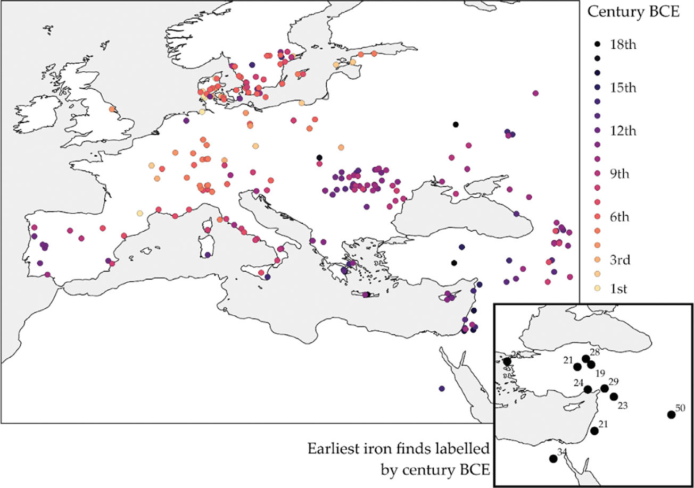
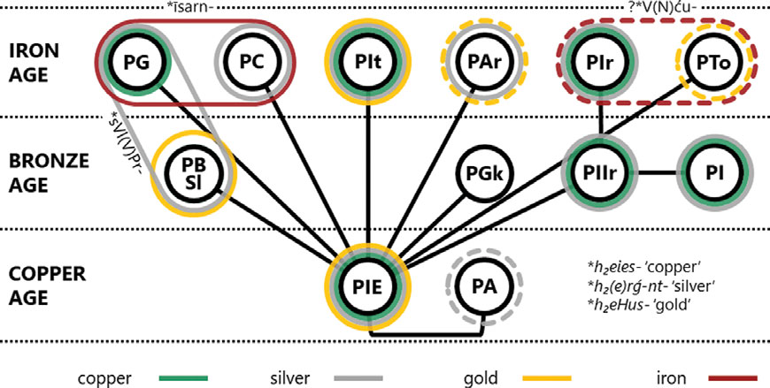

# Word Mining: Metal Names and the Indo-European Dispersal[^*]

Rasmus Thorsø, Andrew Wigman, Anthony Jakob, Axel I. Palmér, Paulus van Sluis, and Guus Kroonen

<!-- source-page: 105; pdf-page: 2 -->

## 8.1 Introduction
The first use of metals in the production of objects among human societies was undoubtedly a defining event with a profound, irreversible impact on craftsmanship, agriculture, trade, warfare, and other cultural and political phenomena. The continuous refinement of metallurgical practice, including the introduction of new metals, has left behind some of the most conspicuous and important archaeological remains. Furthermore, the linguistic and archaeological evidence provided by metals can be combined to cast light on the relative placement of reconstructed languages in time and space through the use of linguistic palaeontology (cf. already Schrader 1883). For the study of the expansion of the Indo-European (IE) languages, examining the inventory of metallurgical vocabulary is thus highly relevant – not only for dating and locating the dissolution of each language, but also for determining the branching and spread of the successive daughter languages, and how they were influenced by foreign languages. Here, we present and analyze IE linguistic material surrounding metallurgy, most of which is relevant to understanding the expansion of the IE languages. First of all, we ask which metals were known to the speakers of Proto-Indo-European (PIE) and which were adopted only after its dissolution. Furthermore, we aim to determine, where possible, where and when non-IE words for metals were adopted by the various daughter languages. A related question is which metals are the most relevant for such an analysis. Thus, in Sections 8.2 to 8.7, we analyze the most relevant lexemes according to their most dominant meaning in order to determine the earliest language stage for which they can be reconstructed and, where possible, their origin, either as inherited from PIE or adopted from a foreign source. This will provide the basis for a discussion (Section 8.8) where, by applying the principles of linguistic palaeontology, we seek to gain at least a rudimentary insight into the state of metallurgy in the IE branches, and the sources of metal trade and innovation. Here, special focus is placed on ironworking (8.8.2), which, by virtue of being a relatively late innovation compared to PIE, provides especially relevant information from the linguistic side. By identifying the earliest stage of a daughter branch that contained a word for iron, it should be possible to place this language stage in a material context and thus estimate the period and/or location of its existence. This is the principal aim of the present article.
## 8.2 Gold
### 8.2.1 PIE *h₂eHus-
One likely IE word for ‘gold’ is found in Baltic (Lith. áuksas 3/1, Pr. (EV) ausis, (III) ausin acc.sg.) and Italic (Lat. aurum, Sabine [Paul. ex Fest.] ausum).[^1] Traditionally, this word has been connected with the root *h₂eus- ‘(to) dawn, early’ (cf. NIL 357–367; Blažek 2017: 272–276).[^2] A simple thematic stem *h₂eus-o- cannot explain the acute accent in Baltic, however, and one would have to follow Driessen (2003) in reconstructing a reduplicated stem *h₂é-h₂us-o-. A reduplicated formation of this type would be rare and archaic, which, along with the exact match in Italic and Baltic, is good evidence that the formation would be of PIE date. On the other hand, it cannot be excluded that there is no link with the root ‘to dawn’, as several other reconstructions are possible (*HeHuso- or *He/ouHso-). To approach a reconstruction of this word, the evidence of the Tocharian forms is crucial, but also problematic. ToA wäs, ToB yasa (gen.sg. ysā[ṃ]tse) ‘gold’ reflect a PTo. *ẃəsā. In order to establish direct cognacy with the aforementioned

<!-- source-page: 106; pdf-page: 3 -->

forms, one can reconstruct *h₂ues-eh₂- (cf. Adams 2013: 524–525), but this suffers from the extra assumption of Schwebeablaut. Alternatively, all of the ‘gold’ forms could reflect thematicizations of an ablauting s-stem *h₂éh₂u-s- ~ *h₂h₂u-és- (or *h₁eh₂u-, *h₂eh₁u-), of which the Tocharian form would continue the oblique stem *h₂h₂u-és-. However, the Tocharian word may not be inherited at all. Kallio (2004: 132–133) assumes that it is borrowed from Proto-Samoyed *wesä ‘metal, iron’ (Nganasan basa ‘metal, iron’, Tundra Nenets yesya, Taz Selkup kē̮ si̮ ‘iron’), in which case its potential reconcilability with the other IE forms would be due to chance. The Proto-Samoyed word can be compared to forms attested in the westernmost Uralic branches, including North Saami veaiki (< Proto-Saami *veaškē) and Finnish vaski ‘copper’ (< Proto-Finnic *vaski), reflecting a Proto-Uralic *wäśkä. According to Kallio (l.c.), this represents the original Proto-Uralic situation, and irregularities in the central branches (Mordvin, Permic, and Hungarian) are due to later re-borrowing of the word. There are problems with the native status of the words in the peripheral branches too, however. Aikio (2015: 43) points out that the Nganasan and Selkup forms with a back vowel can only be explained by positing a disharmonic Proto-Samoyed *wäsa. Disharmonic roots are not typical of inherited Uralic vocabulary. Additionally, it is noteworthy that the Finnic word may not regularly reflect PU *wäśkä, either. While the change *ä–ä > *a–i is regular in Finnic, it appears to have been blocked by a tautosyllabic palatal; cf. e.g. Fin. päivä ‘day; the sun’ (< *päjwä), nälkä ‘hunger’ (< *ńälkä), hähnä ‘woodpecker’ (< *śäśnä) (Zhivlov 2014: 114–115; Aikio 2015: 40–41).[^3] Therefore, the Uralic etymon as a whole is probably best treated as a Wanderwort of post-Proto-Uralic date (Aikio 2015: 43). It is still quite remarkable that the Proto-Samoyed reconstruction provided here is essentially identical to Proto-Tocharian *ẃəsā. Janhunen (1983: 119–121) argues that the borrowing went from Tocharian into Proto-Samoyed. However, while semantic arguments can be made in either direction (‘gold’ broadened to ‘metal’ or ‘metal’ narrowed to ‘gold’), if the Samoyed and Tocharian forms indeed reflect this same Wanderwort, the direction of borrowing must have been from Samoyed to Tocharian; it is not appealing to detach the Proto-Samoyed word, which shows the regular simplification of *-śk-> *-s-, from the other Uralic forms, which cannot be explained as Tocharian borrowings. In conclusion, if the Samoyed and Tocharian words are connected, the Tocharian word was borrowed from Samoyed. Yet it remains theoretically possible that the Tocharian word is inherited from PIE, in which case its resemblance to the Samoyed word is a pure coincidence. Armenian oski ‘gold, golden’ (GDA pl. -eacᶜ, inst.pl. -wovkᶜ) is another problematic comparandum. Unlike most other Armenian metal names, the substantive (‘gold’) and adjective (‘golden’) are not formally distinguished; cf. e.g., arcatᶜi ‘silvery’ from arcatᶜ ‘silver’. It is thus not immediately clear whether the final -i is originally part of the substantive stem or whether the adjectival form, where -i would be productive, was at some point generalized or substantivized. The difficulty of establishing an exact preform linking this word with the complex of ‘gold’ words covered above has led many to assume substrate origin or interference. None of these proposals is tenable, however.[^4] Although it cannot be excluded that the word was borrowed from a completely obscure source, it can be furnished with a relatively convincing root etymology. Yet the stem formation is not very clear. Olsen (1999: 441) suggests *h₂ustu̯ io- ‘leuchtungsfähig’, a formation comparable to the isolated Skt. kṛ-tvyá- ‘fit, capable’. There is, however, no need to project the clearly productive suffix -i all the way to the protolanguage. Thus, a formation *h₂ustu̯ o- (cf. Skt. bhittvá‘splitting’) is sufficient to produce *usk(o)-.[^5] With the addition of the suffix -i, the adjective *uski would become oski through dissimilatory umlaut *u_i > o_i,6 after which, at a relatively late stage, the form of the substantive was replaced by that of the adjective. The motivation for this may have been the fact that virtually all other metal names are disyllabic. Among current proposals, a PIE formation *h₂us-t-u̯ o- remains the most likely reconstruction for Arm. oski, which would then represent the original adjective ‘golden’. Yet, such a formation

<!-- source-page: 107; pdf-page: 4 -->

would be isolated among the extant IE vocabulary in Armenian and thus cannot be established with full certainty.
### 8.2.2 PIE *ǵʰelh₃-
The root *ǵʰelh₃- ‘green, yellow’[^7] provides the basis for the words for ‘gold’ in Indo-Iranian, Phrygian, Balto-Slavic, and Germanic. In Balto-Slavic and Germanic, the formation is specifically a *-to- derivative of the root. From this root derives the Proto-Indo-Iranian n-stem *ȷ́rHan-, as reflected in YAv. zaran-aēna- ‘golden’.[^8] All other forms derive from a stem *ȷ́ŕHania-. These include Skt. híraṇya‘precious metal, gold’, OP daraniya-, Khot. ysīrra-, Sogd. zyrn, and Oss. zærin/zærinæ ‘gold’. Hungarian arany ‘gold’ and certain Ob-Ugric forms (Khanty lorńə ~ ʟŏrńi̮ ‘copper, brass’, Mansi tåreń ~ tariń ‘copper’) can be combined under a reconstruction *sarńi ‘gold’ (cf. Holopainen 2019: 232, with a different reconstruction).[^9] Similar forms are found in other Uralic languages: Mari šörtńö ~ šörtńi (< *se̮ rńV?), Permic zarńi ‘gold’ (< *särńV?), as well as Mordvin si͔ŕńe ~ śiŕńä ‘gold’ (< *serńä?). Due to the numerous irregularities, it seems clear that the word spread through the Uralic languages as a Wanderwort, perhaps being adopted from several different Iranian sources (cf. Holopainen 2019: 234). Because of the initial *s-, Uralic *sarńi and the other forms were most likely borrowed from a post-Proto-Iranian source of the shape *zar(a)ni̯a- (Häkkinen 2009: 23), as Proto-Indo-Iranian *ȷ́ remained an affricate in Proto-Iranian (Cantera 2017: 492). The Phrygian word for gold was almost certainly γλουρος. It is reported in the adjectival form γλούρεα by Hesychius and glossed as χρύσεα. Φρύγες ‘golden things (among the Phrygians)’ (EDG 277). An additional entry by Hesychius reads γλουρός· χρυσός and we can surmise that this too is a Phrygian word. The adjectival form γλούρεα is also attested in an undated inscription (W-11) from Dokimeion (Brixhe 2004: 17). The formation is cognate with Gk. χλωρός ‘green, yellow, pale’, reflecting PIE *ǵʰlh₃-ro- (EDG 277). In Northern Europe, there seems to be a general tendency to derive words for ‘gold’ from the root *ǵʰelh₃- with the suffix *-to-. However, we find three different ablaut grades: the morphologically expected zero grade in Germanic *gulþa- (Go. gulþ, OHG gold, OE gold) beside an o-grade in Slavic *zȍlto (c) ‘gold’ (OCS zlato, Ru. zóloto, Cz. zlato, SCr. zlȃto, Sln. zlatọ ̑ , etc.) and an e-grade in Latv. zȩ̀ lts. It is therefore unclear to what extent these words represent a genuine isogloss. As the application of color terms for distinguishing metals is crosslinguistically common (cf. also 8.3.1), we may very well be faced with independently formed stems. The Latvian word, for instance, is likely an independent substantivization of the color adjective seen in Lith. žel̴ tas ‘yellowish, golden’. This is further supported by the fact that a different word for ‘gold’ can be reconstructed for Proto-East Baltic (see 8.2.1). A derivational base for the Slavic word is less forthcoming, but it may represent a fossilized derivative of the same Balto-Slavic adjective. Skt. hárita- ‘yellow’ and YAv. zairita- ‘yellow’ are independent Indo-Iranian derivations of PIIr *ȷ́arH-i- rather than continuations of PIE *ǵʰelh₃-to-, since a laryngeal would not vocalize in medial position in Avestan (Cantera 2017: 487).[^10] The morphological variation in this set of root comparanda strongly suggests that PIE *ǵʰelh₃- was not lexicalized as ‘gold’ per se, but simply an adjective ‘yellow-green’, which, at most, could occasionally be applied as an epithet of gold. This use may even have arisen independently in the branches where it is attested.
### 8.2.3 Greek χρῡσός
Greek χρῡσός ‘gold’ has been attested since Myc. ku-ru-so (15th c. BCE) and is certainly a loan from Semitic; cf. Akk. ḫurāṣu, Ug. ḫrṣ, Phoen. ḥrṣ, and Hebr. ḥāruṣ (< *ḫrṣ-) (Masson 1967: 37–38). The correspondence of Akk. ḫ, Ug. ḫ, and Hebr. ḥ demonstrates a Proto-Semitic *ḫ (Militarev & Kogan 2000: LXVIII), and both ḫ and ḥ are borrowed as Greek χ (cf. Rosół 2013: 21). The word is considered most likely to have entered Greek from Phoenician (Masson 1967: 38).[^11] Greek ῡ reflects Phoenician ō or ū from earlier ā (Akkadian preserves the inherited vocalism in ḫurāṣu [Militarev & Kogan 2000: CXXIV]), meaning that the Phoenician word, whose vocalism is otherwise hidden by orthographical conventions, was most likely ḥurō/ūṣ (Szemerényi 1964: 53–54).

<!-- source-page: 108; pdf-page: 5 -->

## 8.3 Silver
### 8.3.1 PIE *h₂(e)rǵ-nt-o-
PIE *h₂(e)rǵ-nt-o- ‘silver’ is solidly attested across the IE languages: YAv. ərəzata-, Lat. argentum, OIr. argat, MW aryant.[^12] In all likelihood, Arm. arcatᶜ also belongs here.[^13] The latter seems to have been borrowed by a number of Daghestanian languages; cf. Godoberi arci, Lak arcu, Southern Akhvakh arči; perhaps also forms with *ars-, e.g. Andi orsi, Botlikh, Archi arsi, all of which fail to show regular correspondences (Schultze 2013: 309–310). An Iranian source for these words is theoretically possible but less geographically obvious. The stem *h₂(e)rǵ-nt-o- may be analyzed as a thematicized participle in *-nt- built from the root *h₂erǵ- ‘white, shining’; cf. Hitt. ḫarki-, ToA ārki- ‘white’. A different and isolated formation is Gk. ἄργυρος, Myc. a-ku-ro ‘silver’ < *h₂(e)rǵ-u-ro-, based on a u-stem also seen in Ved. árjuna- ‘white, bright, silver-colored’, ToB arkwi ‘white’. As the form based on the participle appears in noncontiguous IE dialects, the Greek form must represent a later innovation, a substantivization of an adjective combining the Caland-suffixes *-u- and *-ro- (note Skt. ṛjrá- ‘shining, quick’ and the i-stems in Hittite and Tocharian). Although *ḫarkant- ‘silver’ is not directly attested in Anatolian, its existence is suggested by the phonetic complement in Hitt. KÙ.BABBAR-ant- (HED 3: 171), showing that a formation *h₂rǵ-ent- ‘silver’ might have existed at the earliest stage of PIE. The later thematicization of this stem can thus be considered a Core IE innovation.[^14]
### 8.3.2 West European *sil(a)P(u)r
Next to the aforementioned Indo-European word for silver, another, clearly non-IE, word is found in Europe and North Africa, namely PG *silubra- (Go. silubr, ON silfr etc.), OCS sьrebro, Lith. sidãbras, Pr. (III) sirablan (acc.sg.), (EV) siraplis, and Celtiberian śilaPuŕ. These are all formally irreconcilable but show an undeniable similarity. Indeed, additional similar words are found in Basque zil(h)ar (< *zilpar?), Berber *ẓrǐp-/ẓrǔp-, and perhaps Proto-Semitic *ṣarp- (Akk. ṣarp-, Arab. poet. ṣarīf).[^15] This gives the impression of a Wanderwort that spread from the (Western?) Mediterranean to North Europe after the diversification and expansion of Indo-European languages.
## 8.4 Copper
### 8.4.1 PIE *h₂eies- ‘metal, copper?’
Skt. áyas- ‘metal, copper, iron’, Av. aiiah- ‘metal’, Lat. aes n. (gen. aeris) ‘ore, copper, bronze’, Umb. ahesnes (dat. pl.), Go. aiz ‘(copper) coin, money’,16 and ON eir ‘brass, copper’ all support the reconstruction of a PIE neuter s-stem *h₂eies-. While this term is certainly associated with metals, it is not clear whether it is a generic designation applying to any metal, or if it originally refers to a specific one. It is noteworthy that the meaning ‘copper’ is attested in at least some languages in all of the branches where this word is continued, and the occasional meanings ‘iron’, ‘bronze’, ‘brass’, and ‘ore’ could easily be secondary developments. On the other hand, the absence of another candidate for a generic PIE word for ‘metal’ raises the possibility that *h₂eies- carried this meaning too. In fact, it is very likely that both the meanings ‘copper’ and ‘metal’ existed to some extent. Native copper is extremely common and due to its malleability, it could be worked cold even by Neolithic populations (cf. Forbes 1950: 291). As such, it is a metal par excellence and perhaps the only one that PIE speakers came across regularly (cf. Huld 2012: 299). By contrast, silver and gold are far more rare and unsuitable for practical use. Thus, *h₂eies- could be interpreted as ‘workable metal or ore’. This stem cannot evidently be connected with a certain root, although a hypothetical *h₂ei- ‘fire?’ may underlie *h₂eidʰ- ‘ignite’ (Gk. αἴθω) if this is originally composed with *dʰeh₁- ‘to put’.[^17]

<!-- source-page: 109; pdf-page: 6 -->

### 8.4.2 Sanskrit lohá-, Old Norse rauði, Old Church Slavonic ruda
The package of words containing PIIr. *Hraudʰa- (Skt. lohá‘reddish metal, copper-colored, reddish, made of iron’, MP/NP rōy ‘copper, brass’, and Bal. rōd ‘copper’)[^18] as well as ON rauði ‘bog iron ore’ and OCS ruda ‘ore, metal’ can all be derived from the inherited root *h₁reudʰ- ‘red’ (cf. Gk. ἐρυθρός). All forms can reflect an adjective *h₁roudʰ-o- ‘red’, which also came to refer to ‘copper’ and/or ‘ore’, but as in the case of *ǵʰelh₃- for ‘gold’ (8.2.2), this may be an instance of similar yet independent semantic developments based on a natural description of copper as the ‘red’ metal. Despite their surface resemblance to Lat. raudus, -eris (8.4.3), the latter cannot be technically related (pace IEW 872–873), as *h₁reudʰ-os- would have yielded **rūbus[^19] (cf. the same root in *h₁rudʰ-ro-, attested as Lat. ruber ‘red’).
### 8.4.3 Proto-Germanic *arut- ~ Latin raudus ~ Sumerian aruda
A Proto-Germanic base *arut- ‘ore’ can be reconstructed from the attestations ON ørtog ‘type of weight’ (< *aruti-tauga-), Old Du. arut, OHG aruz ‘ore’ < *aruta- and OHG arizzi, erizzi, MHG erze, G Erz n. ‘id.’ < *arutja-. The underlying Pre-PG base *arud- has of old been compared to Sum. uruda, urudu ‘copper’ (Schrader 1883: 62, 118). While the formal match has been criticized for being imperfect (Huld 2012: 305), the recent discovery of a regular development of uruda from Old Sumerian aruda (Jagersma 2010: 60–61) removes this objection. The traditional contextualization of this etymology is that a metal name spread from Mesopotamia to Europe where Indo-European languages could have adopted it after they had become established there (cf. Kauffmann 1913: 123 fn. 6). For geographic reasons, Sumerian cannot have been the direct donor language, however, and we may well be dealing with a Wanderwort that is nonnative in either language. Another potential clue to the provenance of this loanword cluster is offered by Lat. raudus (var. rōdus, rūdus) ‘piece of copper or brass (used as coin)’, which has been adduced as a related Pre-Indo-European loan into Italic (Karsten 1928: 196). Although the appurtenance of this lexical item to the Germanic and Sumerian words is formally and semantically less evident (cf. Huld 2012: 304–305), the variation of Germanic and Sumerian *arud- and Italic *raud- falls within the relatively well-established pattern of lexical doublets with and without a non-Indo-European a-prefix in prehistoric loanwords in Europe (Schrijver 1997: 308; Iversen & Kroonen 2017: 518; Schrijver 2018: 363). Further evidence for a non-prefixed form might come from W rhwd ‘rust, dirt’, Old Breton rod glossing eruginem uitalium ‘rust of the vital parts’ < PC *rutu-, which, if related, could be an independent imposition in view of *t against *d elsewhere (Koch 2020: 110).[^20] If correctly applied, this pattern would associate the cluster with a specific stratum of the European Pre-Indo-European linguistic landscape, i.e. a single unclassified language (family) that mediated a term also found in Sumerian to Italic, Celtic, and Germanic.
### 8.4.4 Hittite ku(wa)nna(n)- Hitt. kuwannan- (contracted variant kunnan- and later a-stem kuwanna-) is attested in the meanings ‘copper’ and, when preceded by the determinative NA4, ‘bead’ or ‘ornamental mineral’. Hom. κύανος ‘dark blue (enamel), copper carbonate’,
later referring also to the color alone (cf. Eng. cyan), is probably an Anatolian loanword (Goetze 1947: 307–311); cf. also Myc. ku-wa-no, which refers to a blue decorative material, perhaps cobalt glass (Halleux 1969). The ultimate source of the Hittite word is possibly Sum.ku3-an ‘a metal’, which can be interpreted as a compound of ku3(.g) ‘precious metal’ and an ‘sky’. Thus it seems to refer to either a blue (i.e. skycolored) metal or material, or a metal literally coming from the sky, i.e., meteoritic iron.[^21] Determining which of the two meanings ‘copper’ and ‘azurite (a blue copper ore)’ is oldest is difficult and mostly relies on the exact interpretation of the ambiguous Sumerian compound (cf. Halleux 1969: 65–66). If this is indeed the source of the Hittite word, it is tempting to opt for the analysis of Sum. ku3-an as ‘blue (sky-colored) metal, copper carbonate’. This finds some support in the fact that Hurrian, which is a plausible vector for borrowing into Hittite (Halleux 1969: 65), appears to designate copper by the Sumerian urud- (cf. Richter 2012: 502).[^22]
### 8.4.5 Greek χαλκός
Gk. χαλκός, Cretan καυχός, Myc. ka-ko ‘copper, bronze’ has no certain etymology, but cannot be inherited from PIE in view of

<!-- source-page: 110; pdf-page: 7 -->

the internal irregularity between the Homeric and Cretan forms, which respectively presuppose Proto-Greek *kʰalk- and *k(ʰ) alkʰ-.[^23] The traditional comparison with Lith. geležìs ‘iron’ etc. is difficult to maintain (cf. 8.5.5) and both of these etyma seem to represent relatively late borrowings in their respective branches. For the same reason, a direct relationship with Hitt. *ki/eklu(ba)- ‘iron, steel?’, as per Blažek (2010: 28–29), is unlikely. A clear candidate for a foreign source of χαλκός does not present itself. One such candidate may be the originally Hattic ḫapalki ‘iron’, which also entered Hittite and Hurrian (Pisani apud GEW II: 1071, EDG s.v.). However, unless this form was borrowed through an unknown medium or really features an archaic spelling for something like */ḫalki/, it is difficult to explain why the medial consonant p would not be reflected in any of the Greek forms.[^24] The aforementioned Hitt. *ki/eklu(ba)seems too distant both formally and semantically. Slightly more promising is Dossin’s suggestion (1948: 32 fn. 4, 1971: 9) of a connection with Sum. kal(ag)ga ‘strong’ (also ‘a process involving silver’), which may have designated a ‘strengthened copper’, i.e., ‘bronze’ (the usual meaning in Homer). This would have been borrowed into Greek through some intermediary language(s) of Anatolia. For want of other attestations, this remains speculative. In conclusion, although no etymology can be established, it is probably safe to say that χαλκός represents a non-IE loanword, most likely from a source in the East, adopted after Proto-Greek had begun to disintegrate.
### 8.4.6 Balto-Slavic Words for ‘copper’
In East Baltic, we find a ja-stem *varja- (Lith. vãris, obs. vãrias; Latv. vaŗš), which corresponds to Pr. (EV) wargien ‘copper’. The Prussian form can be interpreted as a neuter /warjan/ with the <g> reflecting a glide, as shown by warene /warinē/ ‘brass pot’. This incidentally disproves the traditional comparison with Mari würɣeńe ‘copper’ (Trautmann 1910: 458), whose initial wmay also be of secondary origin (see on this word 8.5.7). As no similar forms are found in neighboring languages, the only workable hypothesis appears to be an internal derivation from the root of Lith. vìrti, Latv. varît ‘cook’, PSl. *vьrěti ‘boil’ (Ivanov 1977: 234), which may be cognate with Hitt. ur-āri / u̯ ar-āri ‘burn’, ToA wrātk- ‘prepare (meat)’ (< *uerh₁-), referring to the process of its production. In Slavic, a form *mě̀dь (a) ‘copper, brass’ is found (OCS mědь, Ru. méď, Cz. měď, SCr. mjȅd, Sln. mẹ ̑ d). The acute accent can be attributed to Winter’s Law, allowing a reconstruction *meid-. Its etymology is disputed, but it seems possible to link it with the OIr. méin, MW mwyn ‘ore, metal’ through a reconstruction *meid-ni- for Celtic. The Germanic forms Go. maitan, ON meita, OHG meizan ‘to hew, cut’ (IEW 697, with “?”) have also been connected with the Celtic forms (Stokes & Bezzenberger 1979: 205). However, Kroonen (EDPG 349) considers the Germanic *t to be of secondary origin, comparing ON meiða ‘hurt, damage’ < *maidjan- (cf. LIV² 430 s.v. *mei̯th₂-). This leaves only the Celtic and Slavic material as certain. In view of this limited distribution, it is uncertain whether *meid- represents a PIE root.[^25]
### 8.4.7 Celtic *omi-, *omiio-
PC *omiio- is attested in OIr. umae ‘copper, bronze, brass’ and W efydd ‘bronze, brass, copper’; PC *omi- is found in OIr. uim(m) ‘bronze’. A connection with PC *omo- ‘raw, crude, untreated’ (OIr. om, W of, cf. Skt. āmá-, Gk. ὠμός, Arm. howm ‘raw, uncooked’ < *HoH-mó- ‘raw, uncooked’) has been suggested, which may be understood as referring to the red color of the metal (Pedersen 1909: 166; Krogmann 1940; EDPC 298). The derivation may also be understood with reference to the secondary meanings of *omo- as ‘crude, untreated’; perhaps the derivatives *omiio- and *omi- originally meant ‘untreated metal, ore’ before the meaning narrowed to ‘bronze’.[^26] OIr. umae is neuter in the earliest Old Irish, just like other metal

<!-- source-page: 111; pdf-page: 8 -->

names. The shift from an adjective to a neuter noun implies an intermediate stage where *omiio- was usually found as an adjective qualifying such a neuter noun denoting a metal. The original metal noun (*h₂eies-?) was subsequently dropped, upon which *omiio- was reinterpreted as denoting the metal and was nominalized to a neuter noun (Huld 2012: 345).
## 8.5 Iron
### 8.5.1 PIE *h₂eḱ-mon- ‘meteoritic iron?’
PIE *h₂eḱ-mon-, which seems to be a *men-derivation of the root *h₂eḱ- ‘sharp, pointy’, is attested with two principal meanings. A meaning ‘stone’ is found in Ved. áśman-, Av. asman-; Lith. akmuõ, Latv. akmens, OCS kamy. In OP asman- and the remaining Iranian languages, the meaning is ‘heaven, sky’. Gk. ἄκμων usually means ‘anvil’, but in a passage from Hesiod, it seems to mean ‘meteorite’ (Th. 722: χαλκεός ἄκμων οὐρανόθεν κατιών “a brazen ἄ. falling from the sky”).[^27] Hesychius offers the glosses ἄκμων· οὐρανός ἢ σίδηρον (heaven or iron) and Cypriot ἄκμονα· ἀλετρίβανον (pestle). These attestations could suggest that the older meaning in Greek is ‘(meteoritic) stone/ iron’ (cf. LSJ). In most dialects, the meaning was extended from ‘iron’ to ‘anvil’ (also in Homer), but could have changed to ‘heaven’ in other dialects, if the testimony of Hesychius is to be trusted. It is tempting to connect this polysemy with that of Indo-Iranian, thus projecting the meaning ‘meteorite, meteoritic iron’ back to at least late PIE. The semantic connection of ‘stone’ and ‘heaven’ is frequently interpreted in the context of PIE mythology, where the sky may have been considered to be a stony vault from which fragments could fall in the form of meteorites, or be thrown down by a thunder god (cf. Fortson 2010: 26), hence the later meaning ‘(divine) thunderbolt’ in Sanskrit. The Greek material provides some tantalizing, albeit peripheral, evidence that meteorites were also associated with iron.
### 8.5.2 Proto-Germanic ~ Proto-Celtic *īsarn- Celtic and Germanic have an exclusive lexical correspondence in the word for ‘iron’: PC *ī̆ sarno- (Gaul. personal name Isarnus, OIr. ïarn, W haearn, B houarn) ~ PG *īsarna- (Go. eisarn, ON ísarn, OE īsern, īsen, īren, OS, OHG īsarn). On the basis of the OE variant īren (MoE iron), a Verner variant *īzarna- can technically be postulated for Proto-Germanic, but the limitation of this form to Old English would suggest some kind of secondary development.[^28] On formal grounds, it
is improbable that the word is native to Germanic: the voiceless sibilant shows that before the sound shifts, the stress would have been on the first syllable, Pre-Gm. *ī́sarno-, but as n regularly assimilates to a preceding r in unstressed position, the regular outcome of this form should have been **īsara- in this scenario (through Pre-PG *īsarra- by regular shortening of geminates in unstressed syllables). A more plausible scenario is therefore that Proto-Germanic borrowed the word from Celtic after the sound shifts had taken place. The timing of this borrowing event may thus coincide with the introduction of iron metallurgy itself to Northern Germany and Scandinavia from Central Europe around 500 BCE (cf. Brumlich 2005). The etymology of PC *ī̆ sarno- is unclear. It has been suggested that the word was derived from the PIE word for ‘blood’; cf. Hitt. ēšḫar, gen. išḫanāš, ToA ysār, B yasar (< PTo. *yəsar), Gk. ἔαρ, gen. -ρος < *h₁esh₂-r/n-, i.e. as a vṛddhi formation *h₁ēsh₂-r-no- (Cowgill & Mayrhofer 1986: 86 fn. 10). However, there is no direct proof of the proposed semantic shift from ‘blood’ to ‘iron’ in Celtic. The derivational base is, in fact, not attested in this branch. Given the late arrival of iron metallurgy in Northwest Europe (see Fig. 8.1), i.e. roughly two millennia after the disintegration of the parent language, it seems a priori unlikely that an archaic PIE formation could be reconstructed for this word. It is possible that Celtic too acquired the word as foreign loan at the start of the Central European Iron Age.[^29]
### 8.5.3 Latin ferrum
Lat. ferrum ‘iron, steel’ < PIt. *ferso- (?) has been given a number of Indo-European etymologies, but none is satisfactory. An early connection was with the root *bʰers-, then thought to mean ‘fixate, solidify’, but now better understood as meaning ‘tip, end, bristle’ (Vaniček 1881: 109; Fick I 1890: 94, 493). Recently, Garnier (2017: 252) has proposed a back-formation from a hypothetical *conferrātus ‘re-welded’, which he in turn derives from *fer-us, fer-er-is ‘firmness, stability’ < *dʰér-e/os-. Rather than assuming an Indo-European origin, it is more attractive to view Lat. ferrum as belonging to a cluster of Wanderwörter also including PG *brasa- ‘brass’ (cf. OE bræs ‘bronze, brass’, OFri. bress ‘copper’, Middle Du. bras-penninc

<!-- source-page: 112; pdf-page: 9 -->

‘(silver) coin’),30 Svan (Kartvelian) berež ‘iron’ (Furnée 1972: 232 fn. 13), and possibly also Ingush/Chechen borza ‘bronze’.[^31] Widely acknowledged as belonging with ferrum is also a Semitic cluster of words including Ug. brḏl, Hebr. barzel, Phoen. brzl, Aram. przl, Cl. Arab. firzil, etc. (Muller 1918: 148; Alessio 1941; Gerola 1942; WH; Breyer 1993; EDL 214). The Semitic forms were all borrowed from Akk. parzillu‘iron’ (thus already Hommel 1881: 3386). Recently, this Akkadian form has been proposed to originate in turn from Luw. *parz-il(i)-, an adjectival derivative of the nominal stem *parza- ‘iron ore’ (Valério & Yakubovich 2010). However, only the forms parzassa- ‘made of parza-’ and parzagulliya‘having loops made of parza-’ are actually attested. As items described as being parzassa include arrows, a leopard statue made of precious materials, and even ‘times’ (cf. the phrase ‘hard times’), it seems doubtful that *parza- could have meant a stone like hematite or magnetite. Given that arrows were made of it, it is more likely to have meant ‘iron’. Additionally, in light of the Semitic forms being the only attestations containing an l-suffix, Luwian may not be the direct source after all. If the word passed through a Hurrian intermediary, we may assume that the Luwian stem vowel was replaced with the more frequent ending -i and that the enclitic pronoun (3. pl.) -l(la), which occasionally functions as a general plural marker (cf. Wegner 2000: 66), was added, here perhaps in a collective function. Frequent contact with the Latin-speaking world could point to Phoen. barzel (Muller 1918: 148) or more specifically its reflex in a Punic dialect (EDL 214) as being the source for the Latin word. Criticism of this connection has problematized (1) the fact that ferrum shows no trace of the l of the Semitic forms and (2) its initial f (Georgiev 1936: 250; Huld 2012: 340). The l cannot be expected to disappear by any regular sound change, but considering the vocalism in Hebrew (which helps elucidate the Phoenician vowels hidden by its consonant-only writing tradition), ferrum could technically be a back-formation from *ferzel-om reanalyzed as a diminutive *ferz-elom. However, given the additional non-Semitic comparanda mentioned above, it is more likely that a form closer to Luw. *parzawithout the l-suffix was in currency (and seemingly most likely with initial *b or *bʰ, the voiced nature of which could be hidden by Luwian spelling), and the Punic source does not easily explain the initial f.[^32] The initial f has also been explained through Etruscan mediation (Alessio 1941: 552; Furnée 1972: 232; Breyer 1993: 444; WH), and the early cultural significance of the Etruscans on the Italian peninsula provides compelling circumstantial evidence for this; the earliest iron production on the Italian peninsula thus far is found in Etruria (Pleiner 1996: 287; Corretti & Benvenuti 2001). Etruscan has no phonemically voiced consonants and so could continue a Wanderwort beginning with *b(ʰ) as p, and some have claimed a tendency for p to become f in contact with r (cf. Breyer 1993: 444). The phonological details of this do not stand up to close scrutiny, however.[^33] While it cannot be ruled out that the Wanderwort for ‘iron’ entered Etruscan in a form already with f or φ, no such word is attested in the Etruscan corpus. Therefore, although it is clear that ferrum arrived in Latin as a Wanderwort whose ultimate origins lie between Anatolia and Mesopotamia, neither Phoenician/Punic nor (despite the archaeological evidence) Etruscan provides a satisfactory medium of transmission.
### 8.5.4 Iranian *(ā̆ )ću(a)n(i)ā̆ - ~ Tocharian *eñcə(u)wo-
A widespread word for ‘iron’ in Iranian is reflected in Khot. hīśśana- ‘iron’, Sogd. B ’spn’yn /(ə)spanēn/ ‘of iron’, Khwar. ’spny /aspanī/ ‘iron’, Oss. æfsæn ‘plowshare (modern), iron (archaic)’, Pashto ōspana-, ōspīna- ‘iron’, Šu. sipin ‘iron’, Wakhi yišn ‘iron’, Munji yūspən, yispən, MP ’’hwn /āhun/ ‘iron’, Parthian ’’hwn /āsun/ ‘iron’, Bal. āsin ‘iron’, etc. Although clearly related, the words cannot be regularly derived from a single Proto-Iranian form, and vary in the length of the initial vowel and in the shape of the “root”, e.g. *ćuan- (Oss.) : *aćuan- (Khot.) : *āćuan- (Pashto) : *āćun- (MP), as well as in the form of the suffix, e.g. *-ă- (Oss.), *-ā- (Munji), *-iā̆ (Pashto). Together, these forms will be referred to as *(ā̆)ću(a)n(i)ā̆ - ‘iron’. Several etymologies are at hand for this term (see Buyaner 2020). An Indo-European etymology derives the words from *(H)ać-uan- < *h₂eḱ- ‘sharp’ (Klingenschmitt 2000: 193

<!-- source-page: 113; pdf-page: 10 -->

fn. 7), in which case the variation within Iranian is due to independent thematicizations of an original athematic stem. This explanation fails to account for the forms with long *ā-, however,34 and it is further complicated by YAv. haosafnaēna- ‘of steel’ (lit. ‘of good iron’?). Its apparent derivational base *safna- is formally reminiscent of *(ā̆)ću(a)n(i)ā̆ and Abaev (I 480–481) therefore argued that it could have arisen via metathesis from *spana- < *ćuana-. This scenario requires an additional, potentially ad hoc, change of *p to *f, however, and even if it can be maintained, it would merely add another variant to the already problematic array of irregular proto-forms. This variation is rather consistent with a post-Proto-Iranian Wanderwort. ToA añcwāṣi ‘in steel’ and ToB eñcuwo, iñcuwo ‘iron’[^35] has been argued to be borrowed from an Old Sakan reflex of *(ā̆)ću(a)n(i)ā̆ - (Tremblay 2005: 424).36,37 However, the *n in the first syllable of this unattested Old Sakan *anču̯ an- remains difficult to substantiate without reverting to ad hoc explanations. The assumption of a borrowing in the converse direction, as proposed by Adams (2013: 85), similarly suffers from having to assume irregular loss of the nasal in Iranian. In addition, the proposed derivation of PTo. *eñcə(u)wo- from *h₁n-ǵʰeueh₂(-n)- ‘what is poured in’ > ‘cast (iron)’ appears semantically uncompelling. In conclusion, given the phonological and semantic similarity, it seems unlikely that Iranian *(ā̆)ću(a)n(i)ā̆ - and PTo. *eñcə(u)wo are unconnected, but they cannot readily be explained as mutual borrowings and neither the Iranian nor Tocharian words can be given convincing Indo-European etymologies. This leaves the possibility of independent reflections of the same Wanderwort with an unclear path of transmission through Western and Central Asia.[^38] Although *(ā̆)ću(a)n(i)ā̆ - displays significant variation, the regular outcomes of *-ću- in the attested forms shows that the word must have been present in the Iranian dialect area prior to the expected developments affecting this cluster in the emerging dialect groups (e.g., > *-sp-, Khot. -śś-), suggesting that Proto-Iranian began its dissolution shortly before the beginning of the Iron Age in the region.
### 8.5.5 Balto-Slavic *gele(ˀ)ź-
Lith. geležìs, Latv. dzèlzs (dial. dzelezs), Pr. (EV) gelso, and OCS želězo, Ru. želézo, Pol. żelazo, and Sln. želẹ́zọ (< *želě̀zo) ‘iron’ have been traditionally been compared with Gk. χαλκός ‘copper, bronze’ (cf. REW I: 416). Ivanov (1977: 227), for instance, reconstructs IE *gʰel-eǵʰ-. However, the comparison is phonologically problematic (*gʰl-ǵʰ-o- would have yielded Gk. **κλαχός). If we are dealing with a Wanderwort, it is difficult to imagine how Greek -κ- or -χ- could correspond to Balto-Slavic *-ź- unless the borrowing was very early (i.e., predating Baltic satemization). An early time of borrowing into Proto-Balto-Slavic is contradicted, however, by the irregular internal correspondence: the long medial vowel with acute accentuation in Slavic suggest *g(ʰ) el-eǵ-, while the Baltic terms suggest *g(ʰ) el-eǵʰ-. Any connection with the Greek word should probably be abandoned. The further comparison with Sino-Tibetan terms for ‘iron’ (e.g. Ivanov 1977: 229; EIEC 379) – cf. Old Chinese *l̥ˁik (Baxter-Sagart 1256b) or Tibetan lcags, reconstructed by Chang (1972) as Proto-Sino-Tibetan *qhleks – is difficult to substantiate, especially given the enormous geographical distance between the relevant languages. Huld (2012: 330) sees a potential bridge in Turkish çelik ‘steel’, but this word is unknown in other Turkic languages and may rather be from Slavic *ocělь ‘steel’, of Romance origin (Menges apud Räsänen 1969: 104, cf. also Tietze 2002). Alternatively, it may be a native creation built on the root çel- (a frontvocalic variant of Proto-Turkic *çal- ‘strike, beat’; cf. Clauson 1972: 417). In any case, the word does not belong here. As a result, the Balto-Slavic term for ‘iron’ remains unetymologized, and it is probably best to simply follow Meillet (1923: 138) in assuming a loanword from an unknown source.
### 8.5.6 Greek σίδηρος
Gk. σίδηρος, Doric σίδᾱρος ‘iron’ represents an isolated word and has not been convincingly compared to other Indo-European words. The most plausible suggestion considers it to be an East Caucasian word (Tomaschek 1884; GEW II 703), of which the only surviving attestation would be Udi zido ‘iron’; cf. Aghwan (Old Udi) dai-zde ‘gold’ with dai

<!-- source-page: 114; pdf-page: 11 -->

‘yellow’. Since initial z- in Udi can reflect older *s-, while the opposite is not the case in Greek, Schultze (2013: 302) considers it more likely that the Udi word is a Greek borrowing. However, there seems to be no clear explanation for Udi preserving only the first syllable of the Greek word. Obviously, the Greek word would not necessarily have been adopted from a direct ancestor of Udi, as it may simply be the last vestige of an old East Caucasian (or areal) word *sid-. A significant problem remains the further derivation of the Greek word and the present confinement of this word to a single language. However, another possibly related word is Oss. zdy ‘lead’, to which the Udi word seems closer than the forms adduced by Abaev (IV 307–308). The semantic vacillation of ‘iron’ and ‘lead’ is paralleled in the geographically close Avar-Andic-Tsezic languages (cf. Schultze 2013: 303 and 8.7.4 fn. 55 below).
### 8.5.7 Armenian erkatᶜ Arm. erkatᶜ (o-stem) ‘iron’ lacks an accepted etymology (HAB II 58–60; Olsen 1999: 949; Hübschmann 1897 vacat; EDAIL vacat). The suggestion (EIEC 314, Huld 2012: 314, 334) of a connection with *(h₁)regʷ-es- ‘darkness’ (cf. Arm. erek ‘evening’) should not be blankly rejected, but it is difficult
to explain a root zero grade *(h₁)rgʷ- if the term originates in an s-stem, while there is no certain reflex of an older adjective from the same root anywhere. Attention may instead be drawn to similar words found in some neighboring languages of the Caucasus, viz. in Kartvelian – Old Georgian rḳinay, Georgian/Megrelian rḳina, ḳina (Schrader 1883: 287) – and in East Samur: Aghul/ Tabasaran ruq̇ , Lezgian raq̇ , all ‘iron’ (HAB II 58). In the absence of any potential Indo-European cognates, Arm. erkatᶜ was probably borrowed from a Kartvelian or East Caucasian language. Lezgian raq̇ has the oblique stems raq̇ -u-, raq̇ -uni-; cf. also Tabasaran ruq̇ -an. In Lezgian, the productive suffix -uni- is subject to the vowel harmonic alternation -uni-/-üni-/-ini(Haspelmath 1993: 77). It seems possible, then, that the Georgian-Zan form, which is absent in Svan (cf. 8.5.3), was borrowed from a Lezgic form *ruq̇ -ɨn(V)- vel sim.[^39] Perhaps this stem was also the source for a set of Uralic words for ‘copper’, viz. Mansi arɣin ~ ärɣən (< *ärɣən), Mari würɣeńe ~ wərɣeńə (< *wü ̆ rgeńə), Udmurt i̮rgon, and Komi i̮rge̮ n (< *u̇ rgän), as originally suggested by Bugge (1893: 83). Some formal problems require attention, however. The reflection of *rVq̇ - as *Vrk- can be understood as a result of the general avoidance of initial *r- in Uralic. Note, however, also Oss. (Iron) ærx°y, (Digor) ærxi ‘copper’ which may likewise reflect a Lezgic borrowing. The Permic forms are possibly borrowed from Mari, as they did not undergo the (Pre-)Proto-Permic simplification of *-rk- > *-r-. The Mari and Mansi forms may both continue *ürkän(V) vel sim. Perhaps, then, Mari würgeńə has initial w- due to the influence of *wü ̆ r ‘blood’ (Viitso 2013: 192) and ń for *n due to influence of the nominal suffix *-ńə (UEW II 628). As for the Armenian form, the final -atᶜ is hardly explicable as a borrowed element. The traditional assumption of a blend with arcatᶜ ‘silver’, or rather a reinterpretation of -atᶜ as a type of metal suffix, remains the best possible solution, especially as arcatᶜ may now be explained by regular sound change (cf. 8.3.1 fn. 13). It is difficult to decide whether the source of erk- is then a unsuffixed form like Lezgian raq̇ or the Georgian-Zan rḳina. Pisani (1959: 120) suggests connecting Alb. hekur with Arm. erkatᶜ by metathesis. Following Jokl, Orel (1998: 144) alternatively suggests borrowing from Gk. ἄγκῡρα ‘anchor’. This is hardly possible, as it does not explain the first syllable of the Albanian word. At first sight, hekur looks like a participle from a root hek- (cf. perhaps heq, dial. hek ‘draw, extract’). There are, however, formal problems, the most serious perhaps being that the expected Gheg form *hekun does not appear to be attested. A connection between the Armenian and Albanian words (e.g., through a Balkan substrate connected to the Caucasus) remains within the sphere of possibility but cannot be confirmed.
## 8.6 Tin
### 8.6.1 Latin stagnum
Lat. stagnum occurs beside stannum, but there is little independent evidence for the authenticity of the latter form.[^40] The word itself does not appear before Pliny or Suetonius, but the derived adjective stagneus is found in a Plautus fragment cited by Festus (LS), proving that it is quite old. In its earlier attestations, stagnum refers to a mixture of silver and lead.[^41] Not until Late Latin (e.g., Isidore) does stagnum itself come to mean ‘tin’ (EM 646, WH II 585). Attempts to etymologize stagnum as a native Italic term often involve a comparison with Gk. σταφύλη ‘plumb bob’, explained as a metaphorical extension of σταφυλή ‘grape’ (the original meaning, in light of the derivatives, which all generally have to do with grapes) based on similarity of shape (Boisacq 1938: 903–904; WH II 585; EDG 1391), but this does not work. Walde and Hofmann (WH II 585) reconstruct *stagʷʰfor σταφυλή, but the implied *stagʷʰ-no- would not result in

<!-- source-page: 115; pdf-page: 12 -->

Latin stagnum[^42] (EM; WH, pace Pedersen 1909: 103; and Flasdieck 1952: 16–17). Pliny claims that the process of coating copper vessels in plumbum album, that is to say true tinning, originated in the Gallic provinces, leading some to suggest that it was borrowed from a Celtic language; cf. OIr. stán, W ystaen, B staen, Late Cornish stean ‘tin’ (Fick II 312; Boisacq 1938: 903–904; WH II 585; EM 646). While OIr. stán must itself be a borrowing, since inherited *st- would have regularly surfaced as s- in Irish, inherited *st- can regularly remain unchanged in Brittonic. Given the rich sources of tin in southwestern Britain and Brittany, which were exploited as early as the Bronze Age (Harding 2013: 374–375), it is tempting to propose that the Old Irish and Latin words are borrowings from Brittonic. However, there is no internal derivation that supports an ultimately Brittonic source for the Latin and the Irish. Furthermore, as the Celtic words exclusively mean ‘tin’, which is the later meaning in Latin, it is likely that all the Celtic forms are borrowed from Latin (cf. Deshayes 2003: 687). A possible solution is offered by Gk. σταγών, -όνος ‘drop’ (cognate with OBret. staer ‘river, brook’ and Lat. stāgnum ‘standing water’; cf. EDG 1388). Crucially, in one line of the Timaeus Locrus, σταγών follows gold, silver, copper, tin, and lead[^43] in a list of metals. This means it too must be a metal, but almost certainly not one of those listed already. Hesychius, citing this line, defines it as ‘pure iron’ and a scholiast of the Timaeus text defines it as ὀρείχαλκος or ἄσπρον χάλκωμα (the latter meaning ‘rough, newly minted/white copper’). Thus it seems that at some point, before falling into obscurity, σταγών referred to a metal alloy (Stéphanidès 1918), even if speakers at the time thought it was a homogeneous substance. This sounds very similar to the earliest conceptions of Lat. stagnum. The Latin could formally have developed by regular syncope from the Greek oblique stem σταγόν- through a proto-form *stagonom, but the Greek cannot be derived from the Latin in such a way. Thus, despite the rich Cornish tin deposits, it seems more likely that Lat. stagnum was borrowed from Greek and further lent to the Celtic languages rather than the other way around.
### 8.6.2 Greek κασσίτερος
The Greek word for ‘tin’, Hom. κασσίτερος, Attic καττίτερος, is, judging from the geminate σσ/ττ, a word of nonnative origin.[^44] The word spread from Greek to several other languages – cf. Lat. cassiterum, OCS kositerъ, Aram. qsyṭr, qsṭyr, Arab. qaṣdīr, Skt. kastīra- (lex.) ‘tin’ (GEW I 798; DELG 504) – but the source of the Greek word itself is obscure.[^45] It has been suggested that the Greek word reflects a derivation of Elamite kassa-/kazza- ‘to forge’ (cf. Hinz & Koch 1987: 409, 411, 447), e.g. by Freeman (1999). The name of the Kassites has long been connected by assuming an Elamite formation *kassi-ti-ra ‘from Kassi’, which could have been borrowed independently as Skt. kastīra- (Hüsing 1907; WH I 178). Apart from the semantic issues that can be raised with this suggestion, it crucially does not provide an explanation for the geminate in Att. καττίτερος. According to Loma (2005), the Greek word represents an early Iranian borrowing from *ka-ću̯ iϑra- ‘tin’, which contains *ću̯ iϑra- ‘white, lead’ (Kurdish sīs ‘white, lead ore’) < PIE *ḱuit-ro-. Skt. sī́sa- ‘lead’, kāsī́sa-, kāśī́śa- ‘green vitriol’ are assumed to be later borrowings of the same word.[^46] The prefix kā̆ - (cf. EWAia I 285; Loma 2005: 332–333) poses a problem, since it is not well attested in Iranian, where the safest example is YAv. ka-mərəδa- ‘demonic head’ against Skt. mūrdhán‘head’ (< *mlHdʰ-en-; cf. OE molda ‘top of the head’).[^47] On the other hand, the etymology provides a reasonable explanation for the variation -σσ-/-ττ- within Greek, as it could represent different reflections of Iranian *ć or *ts. However, the biggest phonological obstruction remains the unexpected reflection of Ir. *-ϑr- as Gk. -τερ- (versus expected -θρ-/-τρ-). Anaptyxis could have been based on the desire to avoid three consecutive heavy syllables, but there seem to be no certain parallels for this.[^48] In any case, this etymology seems more plausible than any alternative proposal.

<!-- source-page: 116; pdf-page: 13 -->

### 8.6.3 Proto-Germanic *tina-
The Proto-Germanic word for ‘tin’ is *tina- (ON tin, OE tin, OS tin, OHG zin). This form was borrowed into Saami. Cf. North Saami datni ‘tin’ < Proto-Saami *te̮ nē; the fact that it underwent the sound change Pre-Saami *i > Proto-Saami *e̮ (ultimately > a) reveals that the borrowing happened early, probably from Proto-Norse at the latest. Within Germanic, *tina- can be related to *taina- ‘twig’ (Go. tains ‘branch, shoot, twig’, ON teinn ‘twig; spit; stake’, OE tān ‘twig, sprout, shoot’, OHG zein ‘twig, stick, ruler, shaft, pipe, bar (of metal)’. The range of meanings in Germanic makes it possible to reconstruct a semantic shift ‘branch, twig’ > ‘(metal) rod’ > ‘tin’ (see e.g. Schrader 1883: 305), but the limitation of the metallurgical connotation to High German casts doubt on the assumption that this shift dates back to the Proto-Germanic period. The alternative reconstruction as *dih₂-nó-, by which the word is derived from the PIE root *deih₂- ‘to shine’ (see Huld 2012: 337–338; LIV² s.v. *dei̯h₂- ‘aufleuchten’), is formally possible (by invoking Dybo’s law of pretonic shortening), but remains semantically arbitrary. Furthermore, it presupposes a considerable age for the formation, which is not backed up by any certain cognates in the other IE branches. As with most other words for ‘tin’ found in the IE languages, we must therefore conclude that no compelling (Indo-European) etymology currently is at hand for this Germanic word.[^49]
## 8.7 Lead
### 8.7.1 Greek μόλυβδος ~ Proto- Germanic *blīwa-
Greek (Ionic-Attic) μόλυβδος ‘lead’ occurs in a wealth of variants (μόλιβδος, μόλυβος, μόλιβος, βόλυβδος, βόλιμος, βόλιβος; cf. GEW II: 251), clearly pointing to a non-IE origin. Myc. mo-ri-wo-do /moliwdos/ may be seen as a more primary form, which may account both for later -βδ- from the foreign sequence *-u̯ d- and for -β- via metathesized *-du̯ -, while the variants with -υ- for -ιmay be understood as an assimilation to the labial quality of the following consonant (Beekes 1999: 8–9). The further origin of the Greek word is uncertain, but as already suggested by Pott (1833: 113), it is possibly connected with PG *blīwa- ‘lead’ (ON blý, OS blī, OHG blīo), though not as an inherited word. The PG form would represent an independent borrowing from a related source. This form can reflect an earlier *mlīwo- (EDPG 69). It thus becomes possible to conjecture the existence of a non-IE form *m(V)liw(d)-. At the same time, this renders more uncertain the suggestion of Melchert (2008) that Gk. μόλυβδος is a borrowing from Lyd. mariwda- *‘dark’, attested as a theonym, which he reconstructs as PIE *morkʷ-ii̯o-.[^50]
### 8.7.2 Latin plumbum ~ Proto-Celtic *(ɸ)loud(i)o- ~ Berber *būldūn
Proto-Celtic *(ϕ)loudio- (Middle Irish lúaide ‘lead’) can be connected with Lat. plumbum ‘lead’, but the irregularity of the sound correspondences makes direct cognacy impossible. The Celtic form requires *ple/oud(ʰ) - and the Italic *plo/uNdʰu̯ (for the change *-Ndʰu̯ - > *-mb-, cf. lumbus ‘loin’ < *londʰu̯ o-). While Huld (2012: 336) proposes that both are direct descendants from a formation *plou-dʰ(H)om ‘solder’ < *pleu‘to flow, float’, his explanations for the development of the nasal in Italic involve irregular changes. It is therefore more fruitful to consider the word a prehistoric Wanderwort, to which Berber *būldūn may also be adduced (EDL 474).[^51] A Celtic *(ϕ)loudo- is the most likely source for Proto-(West-)Germanic *lauda- (OE lēad, OFri. lād, Du. lood ‘lead’). It is phonologically impossible for these forms to have directly been borrowed from Gk. μόλυβδος ‘lead’ (Beekes 1999: 10), but it seems plausible that this group of words is still ultimately related to the other group of prehistoric loanwords in 8.7.1, and so represent additional independent borrowings. Note the large internal variation of the Greek forms, where e.g., Attic (inscr.) βόλυβδος is not very far from the Italic reconstruction. Basque berun ‘lead’ appears likely to be related as well, because the sound law *-VlV- > -VrV- and the restriction against clusters may explain its development from something like *bl(e)un(P). It is not entirely clear from which source it was borrowed and whether this was Romance (cf. Gascon ploum?) or not. To all of these forms, Boutkan & Kossmann (1999: 92) tentatively add Proto-Romance *piltrum,52 which generally refers to a tin alloy. However, thisform appears too formally distant to justify the assumption of a shared origin with Lat. plumbum. The limited distribution and lack of a defensible IE etymology could suggest substrate origin, but Flasdieck’s (1952) suggestions of Ligurian, Etruscan, or Pelasgian origin are purely speculative (cf. Tripathi 1995: 163). W elydn ‘brass, bronze, latten; copper; tin; pewter’

<!-- source-page: 117; pdf-page: 14 -->

and Middle Irish elada, elatha ‘art, craft, skill’ may continue PC *(ɸ)elotn-ī-, *(ɸ)elotVn- respectively; W elydr ‘brass, bronze; copper; tin; pewter’ can reflect a variant PC *(ɸ)elotr-ī-. These forms come formally close to Proto-Romance *piltrum and may reflect borrowings from a similar source.
### 8.7.3 Balto-Slavic *al(a)wa- ‘lead/tin’ and *św(e)in- ‘lead’
In Slavic, one finds two competing words for ‘lead’. PSl. *ȍlovo (c) ‘lead’ (thus OCS olovo, ORu. ólovo, SCr. ȍlovo, Bulgarian dial. élavo) beside *ȍlovь (Ru. dial. lov́ [‘tin’], OPl. ołów, Sln. dial. olǫ́ v) is close to Pr. (EV) alwis ‘lead’. Matching forms in East Baltic – Lith. obs. álvas and Latv. al̂va, al̂vs – have shifted to mean ‘tin’. The same shift occurred in Ru. ólovo ‘tin’ as compared to ORu. ‘lead’. Another ORu. word for lead, svinьcь, is the source of modern Ru. svinéc ‘lead’. Although sparsely attested, the word must be Proto-Slavic in view of Sln. svínəc ‘lead’. Such a peripheral distribution might support the idea that PSl. *svinь ̀ cь (b) is the original word for ‘lead’, which was replaced with *ȍlovo/ь everywhere except the periphery. The shift to ‘tin’ in Baltic is perhaps no coincidence, considering that the Baltic word for ‘lead’ there, Lith. švìnas, Latv. svins, is cognate with PSl. *svinь ̀ cь. Neither word has an acceptable etymology. The broken tone in Latv. al̂va probably means it cannot be syncopated from *alava. The difference between the Baltic and Slavic forms could be resolved by reconstructing an ablauting u-stem *álʔ-u-s ~ *alʔ-éu-s (cf. IEW 30–31). Perhaps a related form can also be identified in OHG elo ‘pale yellow’ (< *elwa-), in view of the numerous parallels of color terms being used as designations for metals. The OHG word is usually compared with Skt. aruṇa- ‘reddish-brown’ (IEW 302), but it seems impossible to exclude the older theory that it was borrowed from Lat. helvus ‘yellow’ (AhdWb s.v.). As no entirely convincing comparanda are available, our word might as well not be of IE origin, as was concluded by e.g. Derksen (2015: 53–54).[^53] Baltic *švina- and Slavic *svinь ̀ cь could go back to an ablauting Balto-Slavic *śwein-/*świn-. A root connection with PIE *ḱueit- ‘white’ (Skt. svéta- ‘white’, Lith. šviẽsti ‘to shine’, etc.) has been proposed (Persson; Petersson apud LEW 1045); however, there is no evidence for an unextended root *ḱuei(pace IEW 628, Lith. šviesà < *švait-sā-), and the semantic connection between ‘white’ and ‘lead’ requires the extra assumption of an intermediate meaning ‘tin’. Likewise, the old comparison with Gk. κύανος ‘dark blue (enamel), copper carbonate’ (see 8.4.4) is not possible in IE terms. Ivanov (1977: 231) assumes that the Greek and Balto-Slavic words are connected as a Wanderwort, attempting to explain the initial sibilant in Baltic as due to contamination with Hatt. šiniti ‘copper’. This is quite implausible. Nor can we accept, as Trubachev does (1967: 33), a comparison with Iranian *(ā̆)ću (a)n(i)ā̆ - (see 8.5.4). Both Fraenkel (LEW 1045) and Vasmer (REW 592) leave the word without etymology.
### 8.7.4 Armenian kapar Arm. kapar ‘lead’ has mostly been considered a Semitic or Hurrian loanword; cf. Akk. abārum, Syr. ˀawārā; Hur. abari
‘lead’ (see HAB II: 522 with references). The lack of an explanation for the initial k-, however, remains an insurmountable problem. The required assumption of a borrowing predating the Armenian sound shift is also problematic, as there seems to be no other Semitic borrowings from this period. It is possible that kapar is related to Hur. kab(a)li, Eblaite kapalum ‘copper’,54 yet these forms are neither phonologically or semantically perfect matches. Unless we consider the possibility of contamination between Hur. abari ‘lead’ and kab(a)li ‘copper’, either in the Urartian reflex or in Armenian itself, the direct source of the word remains unknown.[^55]
## 8.8 Discussion
### 8.8.1 Metals in PIE and the Daughter Branches
The metallurgical vocabulary reconstructible for PIE first of all allows us to reiterate the conclusions of earlier works like Schrader 1883 and Hirt 1905–1907: that this language was spoken before the introduction of iron and tin-bronze. Words for gold and silver are reconstructible at least for the non-Anatolian/Tocharian languages, as is *h₂eies-, which probably referred to a useful metal at a time when this could only have been copper. In contrast, words for tin, lead, and iron are all later innovations or, in particular, borrowings from non-IE languages. Latin, Celtic, and especially Germanic probably borrowed a word for ‘copper (ore)’ from a European substrate language (8.4.3). The earliest copper use in Europe dates to the mid-sixth millennium BCE in Serbia. While it began with native copper, by the end of the millennium, slag finds suggest the earliest smelting also began in this area (Roberts 2009: 464–465). In Scandinavia, isolated copper finds are known from the late fifth

<!-- source-page: 118; pdf-page: 15 -->

millennium BCE (Nørgaard et al. 2019), with the record growing exceptionally rich by the beginning of the Funnel Beaker culture, ca. 4000 BCE. Evidence of smelting is found at southern Neolithic Funnel Beaker sites beginning around 3800 BCE (Gebauer et al. 2020). When steppe groups settled in Europe, they may have adopted a non-IE word for copper from already present Neolithic societies. These steppe groups were coming from areas home to the Yamnaya/Pit Grave cultural horizon, which was already familiar with copper metallurgy in two traditions or “foci” and may have used the PIE word *h₂eies-. The Pit Grave/Poltavka metallurgical focus attests tools cast or hammered from pure copper sourced from the Ural, Samara, and Belaya river basins, where they were likely mining it. The Lower Dniepr metallurgical focus attests alloyed arsenical bronze sourced from the Caucasus (Chernykh 1992: 83–91). The well-attested extensive copper trade relationship between Scandinavian Funnel Beaker sites and the Mondsee, Altheim, and Pfyn cultures of the Alpine region (Gebauer et al. 2020) might explain how a different word was borrowed from a common substrate into both Germanic and Italic. Vocabulary surrounding the production of bronze and later alloys, like steel and brass, strikes us as exceedingly difficult to reconstruct. Prior to the spread of the word bronze itself, which is clearly an early modern event coinciding with the development of modern chemistry,56 there seems to be no noteworthy linguistic distinction between copper and its derived alloys. This may suggest that for most of the Bronze Age, there was in fact no perceived distinction or awareness of the various elements composing a metal, but only a gradual distinction of different copper qualities. Nor did the introduction of tin mining leave a discernible imprint on the IE languages, as words for tin seem strikingly late and mostly have an unclear origin (especially 8.6.1, 8.7.3). Furthermore, frequent semantic vacillation between ‘tin’ and ‘lead’ suggests that these elements were frequently denoted by the same word (cf. also Lat. plumbum album/nigrum), probably due to having similar colors and melting points. It may however be noted that an Eastern (perhaps Iranian) source of the Greek (and by proxy Slavic) word for tin (8.6.2) has been suggested. Central Asia contains relatively large deposits of tin (Garner 2015). From the Bronze Age, there is evidence to suggest that most of the tin in the Mediterranean was imported from Cornwall (Berger et al. 2019), but the linguistic evidence does not necessarily mirror this. As for the information about the expansion of the IE daughter languages that can be deduced from metal terminology, it is appropriate to begin with the Anatolian branch, which is usually regarded as the outlier among the IE languages (i.e. “the first to split off”); see most recently Pronk & Kloekhorst (2019). While metallurgical terminology does not provide direct evidence for this, the formation of the (inferred) word for silver (see 8.3.1) supports this scenario. Furthermore, there is no trace of the PIE word for ‘gold’ (8.2.1) or ‘copper, metal’ (8.4.1) in Anatolian. In fact, apart from the inferred existence of *ḫark(ant-) ‘silver’, none of the extant metal vocabulary can be demonstrated to be of Proto-Indo-Anatolian origin, except in cases where this originates with color terms vel sim. (e.g. parkui- ‘shining; bronze’). Central Anatolia became an important center of innovation with signs of early iron ore smelting during the second millennium BCE (Erb-Satullo 2019). Most of the metal terms in Hittite seem to originate with local languages of Anatolia/Mesopotamia, including ku(wa)nna(n)‘copper’ (8.4.4), and the Hattic borrowings ḫapalki- ‘iron’ and arzili- ‘tin’ (Vanséveren 2012: 215), which probably means that the language communities of Anatolia who were first to engage in metal production were non-IE speakers. This also speaks for the intrusive nature of the Anatolian IE languages and against a placement of PIE in the Anatolian region, which would probably have led to IE languages being dominant enough to have left some trace in the local metallurgical terminology. Armenian preserves old IE terms only for ‘silver’ and perhaps ‘gold’, suggesting that its speakers always remained within the sphere of these precious metals. Other terms are clearly connected with the immediate north (Kartvelian, East Caucasian) or South (Hurrian/Urartian) in the case of ‘iron’ and ‘lead’, respectively; cf. further anag ‘tin’, which is clearly an adaptation of Akk. annakum, perhaps via Hurrian (Diakonoff 1985: 598–599). These are supplemented by later adoptions from Iranian (płinj ‘copper, bronze’, aroyr ‘brass’, połovat ‘steel’). There is a conspicuous lack of influence from the languages of Anatolia on this part of the lexicon, which could suggest either a late arrival of Armenian (after ca. 1200 BCE) in the region or an arrival via the Caucasus. The word for ‘iron’ erkatᶜ has no certain etymology, but probably represents a borrowing from a Kartvelian or East Caucasian language. This coincides with the fact that the first iron finds in the Kura–Araxes valleys appear between ca. 1150 and 800 BCE, before the expansion of Urartians into this region (Erb-Satullo 2019). Interestingly, Germanic and Balto-Slavic lost the PIE word for ‘silver’ (8.3.1) entirely, probably because their speakers migrated out of the silver sphere in the third millennium BCE. These branches appear to have readopted the metal along with the non-IE loanword *sil(a)P(u)r- (8.3.2) when silver became known in Northern Europe from the second millennium BCE (Johannsen 2016). An Iberian center of spread is supported by linguistic evidence; cf. Celtiberian śilaPuŕ and Basque zilhar ‘silver’. Silver circulated in the El Argar culture (ca. 2200–1550 BCE) from the start of the second millennium BCE and appears to have been an important status symbol (Lull et al. 2014). The Greek metallurgical lexicon has a strikingly foreign provenance. Only ‘silver’ (8.3.1) reflects a PIE root but may be an independent derivation. While the origin of σίδηρος ‘iron’ cannot be identified with certainty, some limited evidence would connect it with the Caucasus (8.5.6). Material evidence for the Caucasus as an additional route of entry for iron objects into Europe from the thirteenth century BCE (Bebermeier et al. 2016) at least does not contradict this

<!-- source-page: 119; pdf-page: 16 -->

possibility. The word for ‘gold’ is clearly of Semitic origin (8.2.3), while an Eastern source seems plausible also for ‘copper’ (8.4.5) and ‘tin’ (8.6.2). Meanwhile, the Greek word for ‘lead’ (8.7.1) represents a relatively late Pre-IE word shared with Germanic and perhaps also Italic and Celtic, clearly suggesting that this word was widespread in Europe. While lead, as a by-product of silver mining, becomes popular in the Near East and Mediterranean around 3000 BCE, where it is naturally available, it is rarer in Northern Europe, where the first lead objects appear from the beginning of the Bronze Age, during which it becomes more widespread. The relatively late adoption of a pervasive non-IE word could be speculated to coincide with the introduction of lead-alloyed copper, which appears in Wales around 1500 to 1300 BCE, then becomes widespread in western and southern Europe around 1000 BCE, and more sporadically in Scandinavia during the Late Bronze Age, 700 to 500 BCE (Johannsen 2016). The existence, in West Germanic languages, of a later borrowing of the Celtic word for lead (8.7.2) points to ongoing contact and trade.
### 8.8.2 Indo-European Languages at the Beginning of the Iron Age More so than other metals, words for ‘iron’ provide highly relevant evidence for the prehistoric locations of the Indo- European daughter languages. As the introduction of iron in Europe probably postdates the dissolution of Proto-Indo- European by one to two millennia, the coupling of linguistic and material evidence can in some cases help narrow the time window for the emergence of the descendant protolanguages and for prehistoric linguistic contact. At the same time, evi- dence for linguistic contact can support material evidence in tracing the spread of ironworking.
The earliest remains of iron are meteoritic, found in Mesopotamia and Egypt, but soon Anatolia becomes very much involved in this use (see Figure 8.1). For PIE, an interesting polysemy can be reconstructed for PIE *h₂eḱ-men-, whose cognates have meanings varying between ‘stone’ and ‘heaven’, with a marginal meaning ‘iron’ in Greek (8.5.1). It is therefore possible to imagine that this word was indeed

*Figure 8.1. The spread of iron metallurgy in Europe. The inset at the bottom right shows the earliest archaeological iron finds, many of which are of meteoritic iron. The main map shows selected sites from publications that specifically mention dated iron artifacts in the cultural assemblage, but is not exhaustive. (Compiled from Seyer 1982, Levinsen 1984, Boroffka 1991, Hjärthner-Holdar 1993 (with lit.), Pleiner 1996, Pigott 1999, Yalçın 1999, Giardino 2005, Bejko et al. 2006, Papadopoulos et al. 2007, Nieling 2009, Brumlich et al. 2012, Zapatero et al. 2012, Bebermeier et al. 2016, Foxhall 2018, Garcia 2018, Gimatzidis 2018, Lang 2018, Metzner-Nebelsick 2018, Nowakowski 2018, Teržan & de Marinis 2018, and Erb-Satullo 2019).*

<!-- source-page: 120; pdf-page: 17 -->

associated with knowledge of meteoritic iron among PIE speakers. This is supported by the unambiguous evidence for the processing of meteoritic iron in the Yamnaya and later Catacomb and Afanasievo cultures, where the rare metal appears to have been held in high regard (Koryakova et al. 2008: 112–127). This early tradition of processing meteorites appears to have been lost later and is unrelated to the later emergence of iron metallurgy (Terekhova 2008). Generally speaking, iron ore acquisition and smelting are techniques associated with terms that are not shared between the IE languages. The IE subgroups apparently obtained them independently well after the disintegration of the original language community, which after all predates the Iron Age under the Steppe hypothesis. Iron smelting is attributed by the Ancient Greeks to the Chalybes (Bittarello 2016; Gnesin 2016), a group living inside the borders of the Hittite Empire in the early second millennium BCE, while the earliest certain remains of iron slag that clearly indicate smelting have been found at Kaman-Kalehöyük in Central Anatolia and date to the Old Assyrian Colony Period, ca. 1800 BCE (Akanuma 2007; see further Yalçın 1999). With the continued early involvement of Anatolia and the Levant, true iron metallurgy emerges during the second millennium (Bebermeier et al. 2016). Greece is an early locus and the Balkans were likely a major inroad for iron into Europe (Pleiner 1996). The Caucasus and Carpathians are in this area, but surprisingly Etruria (Corretti & Benvenuti 2000) and the Iberian peninsula (Zapatero et al. 2012) take up iron metallurgy quite early (Pleiner 1996 generally). Here, the technology must have arrived by sea. In Italy, it spreads from the area of Tuscany and the Villanovan culture, but not necessarily rapidly. The exploitation of iron-rich Elba did not begin until relatively late. Meanwhile, the Greek colony at Pithekoussai already had iron (Corretti & Benvenuti 2000). In mainland Western Europe, e.g., in the Late Hallstatt and La Tène cultures, iron use begins only in the early first millennium BCE, and so we may expect more possible sources of iron words due to the longer traditions elsewhere in Europe. On the Iberian peninsula, there were two waves of spread: by sea, affecting the coast and being later amplified by Phoenician activity (Bronze Age), and then over the Pyrenees from the south of France (Late Bronze Age/Early Iron Age) (Zapatero et al. 2012). Indeed, there is linguistic evidence supporting the spread of iron from Anatolia and the vicinity to other regions in West Eurasia. One such piece of evidence is Lat. ferrum (8.5.3), which can plausibly be traced to a (geographically) Anatolian source that additionally spread to Germanic, Svan (Kartvelian), and perhaps Nakh (East Caucasian). To this we may add a word for ‘smith’, Lat. faber (< PIt. *þabro-), with which Arm. darbin ‘smith, forger’ has long been connected. In IE terms, this implies a root *dʰabʰ- or dʰHbʰ- (cf. HAB I 636, IEW 233–234). The traditional comparison to OCS dobrь ‘good’, Lith. dabà ‘character’ is semantically arbitrary. Instead, it is tempting to see an origin in Hur. tab/w- ‘cast metal’, taballi ‘smith’, ta/ibira/i ‘copper-worker’ (Yakubovich apud Blažek 2010: 23), with additional reflexes in Ug. tbl ‘blacksmith’, Sum. tibira, and perhaps the Hebr. personal name twblqyn (DUL 845) showing the expansive spread of this word across the Middle East. While the Armenian word may have been a relatively late adaptation of an Urartian form (where the initial stop would be voiced), its presence in Italic suggests that it had spread widely by the first millennium BCE, perhaps together with the same stratum that brought the word for ‘iron’. In Proto-Germanic, the word for ‘iron’ is formally close to that of Proto-Celtic (8.5.2). This word has no convincing Indo-European etymology and can be analyzed as a Celtic loan into Proto-Germanic. This evidence for linguistic contact suggests that iron metallurgy was introduced to the Proto-Germanic language community by Proto-Celtic speakers. A potentially suitable archaeological context for such linguistic contact is found in the so-called Schmiedegräber in the core of the Jastorf culture and Nienburg group, where in the La Tène-period, burials appear with iron ore, slag, anvils, and complete sets of blacksmith tools (Brumlich et al. 2005). The appearance of these burials has been interpreted as a reflection of the rise of a latènisized “caste” of blacksmiths. Within La Tène there is also data showing an increasing use of hardened iron during the course of the period, agreeing with a general pattern of increasing technical competence (Champion 2018). If indeed the language contact between Celtic and Germanic can be attributed to the La Tène craftsmen, they may have either spoken Proto-Celtic themselves or acquired the terminology from Celtic-speaking specialists further to the south. Morphological features of the Celto-Germanic word further allow us to speculate that it may have been taken over from the pioneering Etruscans in the Italian peninsula. The Tocharian and Iranian words for iron may reflect individual borrowings of the same West-Central Asian areal word, but it still cannot be excluded that they are entirely unrelated. It is, however, relevant to note that the Tocharian words are at least traceable to Proto-Tocharian, and the Iranian word was probably borrowed (soon) after the dissolution of Proto-Iranian. This would provide a tentative date for the dissolution of Proto-Iranian around 1250 BCE, when iron first spread into NW Iran (Danti 2013). Strictly, no Proto-Balto-Slavic word for iron can be reconstructed. However, the clearly similar words in Proto-Baltic and Proto-Slavic seem to be borrowings from related sources. Assuming that the dissolution of the Balto-Slavic languages took place in the Baltic Sea region, we can thus tentatively place the protolanguage right before the final Bronze Age (800–500 BCE), when iron starts to appear in this region (Lang 2018). As in the case of ‘tin/lead’ (8.7.3), we may be faced with a loanword entering most of the Balto-Slavic language area, but from a different source than those found in the languages of Southern and Western Europe. This supports a relatively northern position for the Balto-Slavic languages at this point in time. The development of the IE metal terms discussed in this paper, combined with the archaeological evidence for the timeline of Eurasian metallurgical development, is presented in Figure 8.2.

<!-- source-page: 121; pdf-page: 18 -->

*Figure 8.2. Schematic overview of the occurrence of the most important shared metal names in the Indo-European language family. Circles indicate terms inherited from PIE; dashed circles terms, whose IE etymology is uncertain or debated. Stadia represent areal terms that were absorbed locally after the IE dispersal.*

## List of Abbreviations
Akk. = Akkadian Alb. = Albanian Arab. = Arabic Aram. = Aramaic Arm. = Armenian Av. = Avestan B = Breton Bal. = Balochi Cz. = Czech dial. = dialectal Du. = Dutch Eng. = English EV = Elbing Vocabulary G = German Gaul. = Gaulish Gk. = Greek Go. = Gothic Hatt. = Hattic Hebr. = Hebrew Hitt. = Hittite Hom. = Homeric Greek Hur. = Hurrian Khot. = Khotanese Khwar. = Khwarezmian Lat. = Latin Latv. = Latvian Lith. = Lithuanian Luw. = Luwian MHG = Middle High German MP = Middle Persian NP = New Persian MW = Middle Welsh Myc. = Mycenaean Greek OCS = Old Church Slavonic OE = Old English OFri. = Old Frisian OHG = Old High German OIr. = Old Irish ON = Old Norse OP = Old Persian OPl. = Old Polish ORu. = Old Russian OS = Old Saxon Oss. = Ossetic PBSl. = Proto-Balto-Slavic PC = Proto-Celtic PG = Proto-Germanic PGk. = Proto-Greek Phoen. = Phoenician PIE = Proto-Indo-European PIIr. = Proto-Indo-Iranian PIr. = Proto-Iranian PIt. = Proto-Italic Pr. = Old Prussian PSl. = Proto-Slavic PTo. = Proto-Tocharian PU = Proto-Uralic Ru. = Russian SCr. = Serbo-Croatian Skt. = Sanskrit Sln. = Slovenian Sogd. = Sogdian Šu. = Šughni Sum. = Sumerian Syr. = Syriac ToA = Tocharian A ToB = Tocharian B Ug. = Ugaritic Umb. = Umbrian Ved. = Vedic Sanskrit W = Welsh YAv. = Young Avestan

## Notes

[^*]: This study has received funding from the European Research Council under the European Union’s Horizon 2020 research and innovation program (Grant Nº 716732). It also received funding from the Dutch Research Council (grant nº PGW.19.022). We thank Agnes Korn, Cid Swanenvleugel, Maikel Kuijpers, and Michael Weiss for assistance and comments provided during the research for this paper. For more details and additional perspectives on the Proto-Indo-European metal terms, we refer the reader to Chapter 7 by Thomas Olander.
[^1]: Blažek (2017: 284–285) adduces Luwian wašḫa- as cognate, but a meaning ‘gold’ for this word is not secure.
[^2]: A conceptual relation of ‘sun’ and ‘gold’ can be found in several South and Meso-American languages, e.g. Guaraní kuarepoti-ǰu lit. ‘yellow sun faeces’ (Bellamy 2018: 7).
[^3]: The Saami reflex may also be irregular, as the default outcome of PU *ä–ä in Saami is *ā–ē, e.g. Proto-Saami *ājmē ‘needle’ (< PU *äjmä). However, *ä–ä sometimes yields *ea-ē, particularly after labials; cf. *pealē ‘half’ (< PU *pälä), *peajvē ‘sun; day’ (< PU *päjwä); *weajē ‘be able’ (< PU *wäjä, cf. Finnish voida). In this case, *veaškē ‘copper’ can also reflect *wäśkä.
[^4]: A connection with Sum. guškin (Pedersen 1924: 219–220) must be abandoned, since this reading of the Sumerian logogram is now considered obsolete in favor of ku3sig17, a compound ‘yellow precious metal’ (Civil 1976; cf. the Pennsylvania Sumerian Dictionary). A borrowing from Uralic *wäśkä (J̌ahowkyan 1987: 452) is unlikely for both geographic and phonological reasons. Schrader (1883: 243) suggests a connection with Kartvelian – cf. Georgian/Megrelian okro, Svan (û)okûr ‘gold’ – but it is difficult to understand phonetically and besides, these words may have been borrowed from Gk. ὠχρός ‘pale (yellow), wan’ (Klimov 1964: 151).
[^5]: Alternatively, a *h₂ustu̯ o- may represent a *u̯ o-derivation of the stem reflected in Hitt. ḫust(i)-, which perhaps means ‘amber’ (cf. HED 3: 411–413). This word is cautiously compared to the complex of ‘gold’ words by Blažek (2017: 281–283). Although the comparison with Armenian would be extremely shallow, it is perhaps morphologically more plausible. Blažek’s (2017: 280, 294) own reconstruction for oski, an “appurtenance-formation” *h₂us-h₂u̯ o-, would probably not yield the correct outcome, as the medial laryngeal would vocalize in this environment; cf. harawownkᶜ ‘fields’ < *h₂erh₃m/u̯ on-. Martirosyan’s (EDAIL 533) reconstruction *əu̯ oskíya is also difficult to understand, since laryngeals do not usually vocalize before *u̯ , and there seems to be no other obvious source for an initial schwa. The suggestion that *-kV represents a non-IE suffix (ibid.), reflected also in Uralic (*wäś-kä), is not very convincing in view of its absence elsewhere in Armenian, and the already very weak evidence for its existence.
[^6]: Though it has not been met with broad acceptance, this rule is confirmed by transparent examples like erko-kᶜin ‘both’ < erkow ‘two’ Asori ‘Syrian’ ← Gk. Ἀσσύριος (Olsen 1999: 803) and runs parallel with the change *i_u > e_u recognized by Meillet (1936: 55).
[^7]: A close semantic parallel is the Semitic root YRQ; cf. Ugaritic yrq ‘greenish yellow (of metals)’, Aram. yarq ‘herb, vegetables’, Akk. (w)arāq ‘to be yellowish-green, pale’, etc. (Murtonen 1989: 222).
[^8]: OCS zelenъ ‘green’ is often compared to the YAv. zaran- (cf. Huld 2012: 308), but PSl. *zelenъ is more likely an original past passive participle from an unattested verb *zelti ‘to make green(?)’ (cf. Lith. žélti ‘to grow green’). A similarly fossilized form is OCS studenъ ‘cold’, presumably from a verb *stusti, 1sg. *studǫ ‘to cool’ (compare Ru. studíť ‘id.’).
[^9]: The epenthesis of -a- in the cluster *-rń- in Hungarian is apparently not regular, at least judging by horny ‘notch’ (~ Finnish kuurna ‘id.’ < PU *kurńa). On the other hand, a similar epenthesis is found in other words, e.g., arasz ‘span’ < *sorśi. The Ob-Ugric forms appear to point to Khanty and Mansi *ă.
[^10]: Skt. hāṭaka- ‘gold, name of a country’ is sometimes connected with the *‑to- derivatives above (cf. Burrow 1972: 540) by attributing the retroflex to Fortunatov’s Law, whereby *lt > Skt. ṭ (Fortunatov 1881). However, due to the root final *-h₃, which should have yielded Skt. i, the proper condition for this sound law would not have arisen (unless one assumes that the laryngeal was lost because of the Saussure effect, the validity of which is debated; see Pronk 2011). According to KEWA (III: 589), hāṭaka- is unrelated to the words for ‘gold’ and the meaning is rather derived from the ethnogeographical designation, itself perhaps of non-IE origin.
[^11]: The emphatic sibilant ṣ is normally reflected in Greek as σσ, such as in βύσσος ‘flax, linen’ (cf. Akk. būṣu, Hebr. būṣ, etc.) (Masson 1967: 38), which led Belardi (1949: 309) to propose an original form *χρυσσός that was later simplified to χρῡσός. Another Semitic loan in Greek is κασία ‘cassia’ (cf. Hebr. qəṣīʿā), which also occurs rarely as κασσία (Rosół 2013: 21), so a form with a second σ is not necessary to reconstruct.
[^12]: A more problematic form is Skt. rajatá- ‘white, silvery’, which seems to reflect *h₂reǵ-nt-ó-, with a different root shape. Although none of the words for ‘silver’ must reflect a form with root full grade, the reconstruction *h₂reǵ-nt-ó- is still in conflict with Skt. árjuna- ‘bright, white, silvery’, árji- ‘bright-colored’ (cf. Hitt. ḫarki-), which point to an original full grade *h₂erǵ-. Thus, rajatálikely represents a secondary formation that may go back to older *ṛjatá- or it reflects a different root altogether (cf. EWAia II: 426; Mallory & Huld 1984: 3).
[^13]: The Armenian reflex has been problematized on account of the final -tᶜ, as the commonly accepted reflex of *-nt- is either -n or -nd. Thus, one expects a regular reflex *arcan(d). The traditional explanation is that -tᶜ results from contamination with erkatᶜ ‘iron’ or contains an identical suffix, of obscure origin (cf. Hübschmann 1897: 424; HAB I 318; EDAIL 131). However, this solution is not attractive as long as the -tᶜ of erkatᶜ is etymologically unexplained. Others have regarded the Armenian word as an early borrowing from an Iranian *ardzata (Lamberterie 1978: 245–251; Olsen 1999: 868). Kümmel (2017: 444–446) seeks a regular explanation through a suggested development of pretonic *nt > *nϑ > tᶜ when not preceding a word boundary or single vowel; cf. kitᶜ ‘milking, harvest’ < *gem-tó/í-. Thus, *h₂(e)rǵ-nt-ó- would yield *arcanϑ- > arcatᶜ. This provides an attractive explanation for the final -atᶜ, which may later have been interpreted as a type of suffix and transferred to the word for ‘iron’ (see 8.5.7).
[^14]: For a similar thematicization, cf. Hitt ḫuu̯ ant- < *h₂uh₁-(e)nt- vs. Skt. vātá‑, W gwynt, Lat. ventus < *h₂ueh₁-(e)nt-o- ‘wind’ (cf. Pronk & Kloekhorst 2019: 4).
[^15]: Boutkan & Kossmann (2001) do not accept the appurtenance of the Semitic word. The root is marginally attested with the meaning ‘silver’ and this use appears to be secondary from ‘to burn, purify, refine’.
[^16]: A meaning ‘copper’ (or ‘bronze’) is suggested by the compound aizasmiþa (2 Tim. 4.14), which translates Gk. χαλκεύς ‘coppersmith’. In the only attestation of the simplex aiz, acc.sg. (Mk. 6.8), it translates Gk. χαλκόν in the sense ‘money’. One wonders if this is a calque of the Greek use of the word, whereby ‘copper’ can be considered the primary meaning in Gothic (cf. Huld 2012: 300).
[^17]: The old connection with Hitt ā(i)-/i- ‘to be hot’ should be abandoned, as this verb does not contain *h₂ (EDHIL 200).
[^18]: Arm. aroyr ‘brass, bronze’ must be borrowed from an Ir. *rauδ-.
[^19]: In fact, *h₁reudʰ-os- does have a reflex in Latin, viz. rōbus, -oris ‘red’, but this seems to be a non-Roman form (Weiss 2020: 503), and in any case shows that raudus cannot be related.
[^20]: W rhwd has alternatively been reconstructed to PC *ruddo-, itself a compound of PIE *h₁reudʰ- ‘red’ (8.4.2) and either *dʰeh₁- ‘to put’ (Stifter 1998: 212–218) or *sed- ‘to sit’ (Hill 2003: 196–202). Schaffner (2016/17: 114–115) alternatively reconstructs *h₂ru-tiand connects rhwd to Irish ruithen ‘ray, beam of light’ and Lat. rutilus ‘golden red; shining’. Finally, it is conceivable that W rhwd is borrowed from OE rudu ‘redness’.
[^21]: Giusfredi (2017) rejects the connection between the Sumerian and Hittite words on the basis that there is no Akkadian form that could have served as a vector of the borrowing. Any connection with Akk. uqnû ‘blue, lapis lazuli’ must be rejected, since it corresponds in texts with the sumerogram NA[^4] ZA.GÌN. This circumstance is, however, entirely synchronic and does not exclude the possibility that Sum. ku3-an was borrowed into the neighboring spoken languages, where it later lost its association with its original source.
[^22]: Another suggested source is Hattic, where Puhvel (HED 4: 310) expects a hypothetical *kup(a)ro- (underlying Gk. Κύπρος ‘Cyprus’ etc.; cf. 8.7.4) to alternate with *kuwano-. This explanation has the clear downside that the relevant attestations are lacking in Hattic, where the usual word for ‘copper’ is kinawar. Further, there seems to be no basis for assuming an alternation of r and n.
[^23]: Assuming the possibility of earlier *χαλχ-, Tremblay (2004: 238) suggests that the Attic-Ionic form χαλκ- has preserved its initial aspirate due to association with e.g. χάλιξ ‘pebble’, χάλυψ ‘steel’, χαλεπός ‘difficult, hard’, whereas Cret. *καλχ- would be the regular outcome through Grassmann’s Law. There are hardly any parallels for such a sporadic inverted dissimilation, and it seems we are dealing with independent adoptions of a foreign word. An anonymous reviewer points to a parallel for this in Gk. χίτων, Ionic/ Doric κίθων ‘chiton, tunic’, which is probably from Semitic; cf. Phoen. ktn. In any case, the comparison with Balto-Slavic should probably be abandoned (cf. 8.5.5), leaving no external support for a stem *gʰl(e)ǵʰ- vel sim.
[^24]: Note, however, that the common alternation of medial p and w in Hattic (Soysal 2004: 28) – cf. perhaps the toponym URU Hawalkina (Hoffner 1967: 184) – could reflect a phoneme (/f/?) that would have been lost in the Greek rendering of the word. Alternatively, Starostin (1985: 84–85) compares Hatt. ḫapalki to some West Caucasian forms, which he reconstructs as *ʁ́Iʷǝ-ƛ ̣ʷV ‘iron, lit. blue metal’ (Adyghe ğʷəč̣ə, Abaza jač̣ʷa ‘iron’), assuming a genetic relation between Hattic and West Caucasian. Although this relation is not well established (cf. Klinger 1995: 128–129), it is also possible to interpret this material in terms of borrowing. Leaving aside ḫapalki, the Proto-Circassian (and PWC?) compound *ǧʷapλa ‘copper, lit. red metal’ (Chirikba 1996: 400) could perhaps be considered an alternative, circuitous source of Gk. χαλκός; see Kas’jan 2010: 464–465, who also suggests that Hitt. *ki/eklu- is a reflection of the West Caucasian word for ‘iron’. These proposals are, unfortunately, impossible to verify. Witczak (2009) considers Hitt. ḫa-palki to be inherited from a putative (late) PIE “*pālaḱ-” ‘iron’, but most of the comparisons involved are at odds with established sound laws. It seems clear that the word is originally Hattic (Vanséveren 2012: 204–206), though it remains possible to speculate on a horizontal relationship between this word and ToB pilke ‘copper’, and further perhaps West Germanic *blika- ‘sheet metal’ (OHG bleh, G Blech, Middle Du. blec, blic, Du. blik).
[^25]: The comparison with Gk. μέταλλον ‘mine, quarry’, later ‘mineral, metal’ (van Windekens 1958: 135), is impossible in IE terms, but the word could perhaps be seen as a parallel loan from a Balkan source.
[^26]: The use of a single name for metal ores and their refined counterparts is rather common; cf. Huld (2012: 323 fn. 41) for parallels.
[^27]: This interpretation is fully rejected by Beckwith (1998), however.
[^28]: A parallel development is seen in Eng. our < OE ūre < *unsr-, on which see Schaffner (2001: 223).
[^29]: One possibility is to view PC *ī̆ sarno- within the context of several words in Latin exhibiting an -rn- (or perhaps -r-n-) suffix that are suggested to be loans from Etruscan. These include alaternus ‘buckthorn’, clarnus ‘offering tray’, laburnum ‘broom (plant)’, santerna ‘borax from gold smelting’, vīburnum ‘arrowwood’, etc. (Ernout 1946: 29–32; WH; EM; Breyer 1993). The strongest piece of evidence is probably Lat. cisterna ‘tank, reservoir’, which is ultimately from Gk. κιστή ‘box, chest’, but likely came through Etruscan, where -rna was added. It is speculative, but in view of this evidence, the word *ī̆ sarno- could have originated in the Etruscan spoken in the Villanovan culture (900–700 BCE) south of the Alps, which controlled several important iron mines in Tuscany and Elba (Pleiner 1996: 287–288). The alternation between palaga ‘clot of gold’ (bal(l)ūx, bal(l)ūca) and palacurna ‘gold dust; ingot of gold’ looks similar, but Pliny reports these words to be from Iberia (LS; WH I: 95; Witczak 2009: 297).
[^30]: Krogmann (1937: 268–269) connected the Latin and Proto-Germanic forms, albeit proposing an IE origin. He reconstructed an ablauting s-stem *bʰer-s- ~ *bʰr-os- of a now obsolete root *bʰer-, which he glossed as ‘to shine; bright, brown’ (cf. IEW 136-137, the examples of which are today generally understood to belong to several different roots).
[^31]: The appurtenance of Basque burdina ‘iron’ (cf. Schuchardt 1913: 304–305) is less evident (Trask 2008: 148).
[^32]: Phoenician voiceless plosives were transcribed by speakers of Greek with voiceless aspirates (Segert 1967: 55), and Latino-Punic material (Punic written in the Latin alphabet) shows that its reflex of Proto-Semitic *p was f. In Late Punic, non-initial /b/ and /w/ were undergoing a merger to /β/. There is even one possible example of /β/ > /f/ before /tʰ/ (Häberl n.d.). None of these phenomena explain how a Phoenician b could become a Latin f, but there remains a possibility that some of the changes coincided with the development of PIE *bʰ- > *pʰ- > Lat. f-.
[^33]: The change from p > f, presumably through φ, in contact with r/l, m/n, and s in Etruscan is not entirely regular. It does not occur in Greek loans (cf. Προμᾱθεύς > Prumaθe), whereas τ and κ do occasionally become spirantized (Ἄτροπος > Aθrpa but Πάτροκλος > Patrucle; Ἀρκάδιος > Arχaza but Κίρκᾱ > Cerca). In native Etruscan words, it occurs sporadically (Hafure : Hapre, Fufluna : Pupuluna, etc.) (de Simone 1970 II: 168–187). The simplest explanation is that it is a late, regional phenomenon (Pfiffig 1969: 38, 42). Additionally, for the change to occur, the p must be in direct contact with the liquid/nasal/s. The only convincing cases of Gk. π > Etr. φ that are not in direct contact with a triggering element and cannot be explained by anaptyxis or assimilation are Φerśe ~ Perse < Περσεύς and Φulnice ~ Pulunice < Πολυνείκης (de Simone 1970 II: 187). Note that neither of these demonstrate a change to f in Etruscan. Romans treated voiceless aspirates as voiceless stops, so Etr. φ is not expected to become Lat. f unless it did so in Etruscan first.
[^34]: Explaining the forms with long *ā- as vṛddhi derivatives is unsatisfactory.
[^35]: As well as Khwar. hnč ‘tip of arrow or spear’.
[^36]: The alternative connection of Tocharian *eñcə(u)wo- to Skt. aṃśu‘soma plant’ (Pinault 2006: 184–189) is difficult to defend due to the divergent semantics.
[^37]: Another group of words resembling the Tocharian forms are exemplified by Oss. ændon ‘steel’, a word that is also found in Permic (Komi jendon, Udmurt andan), Mansi jēmtån ‘steel’, and in Chechen-Ingush: Chechen ondun ‘tough’, Ingush ondæ ‘steel’ (Abaev I: 156–157). Abaev (l.c.) suggests a derivation from PIr. *han-dāna-, corresponding to Skt. saṃdhāna- ‘joining, uniting’ with a semantic shift from ‘steel plating’ > ‘steel’. Adams (2013: 84–85) traces these words, along with Persian hundawāni, back to *hindu-ān-, designating the very popular Indian-produced wootz iron. Both suggestions thus consider Iranian to be the source of both the Permic and Chechen-Ingush words, implying that a semantic development to ‘tough’ took place independently in Chechen. Seeing that neither attempt at an Iranian etymology is fully convincing from the semantic side, it may be worth considering if, rather, Chechen-Ingush is the source of the Ossetic word, and thence the Uralic words. Dudarev (2004: 14) notes that Chechen ondae ečīg lit. ‘tough iron’ is still used as a designation for steel. OFr. andaine (Medieval Lat. andena) and the ondan(i)que, undanique used by Marco Polo to describe a type of iron or steel may have its source among this cluster as well.
[^38]: Blažek & Schwartz (2016: 53–54) suggest that the Tocharian word might be “an adaptation of the Chinese compound 暗鑄 àn zhù ‘dark cast iron’ < Middle Chinese *ʔʌ̀ m tɕuăh < Han Chinese *ʔǝ̄ mh tśo.” Such a compound is unattested and would not contain a word for ‘iron’, however. Their alternative suggestion of a borrowing from an unattested Lolo-Burmese *ʔaŋ-cu(ᵐ) or *ʔaŋ-cwo(ᵐ) is also speculative and largely based on archaeological considerations.
[^39]: The word has been compared to Avar-Andic and Nakh words for ‘key’ or ‘lock’, e.g. Andi reḳul (NCED s.v. *rʕēnq̇ wɨ), assuming a semantic shift in Lezgic (or at the latest in Eastern Samur); cf. the Lezgian plural raq̇ -ar ‘trap’. If this is accepted, the borrowing cannot have been older than the Lezgic protolanguage.
[^40]: The form stagnum is the only form attested in inscriptions and is the better attested form in manuscripts. It is also the form that survives into the Romance languages (Italian stagno, French étain, etc.) (EM 646; WH II 585; Flasdieck 1952: 14–15).
[^41]: In Pliny’s Nat. Hist. (34, 160–163), it is a silver-colored metal used to coat bronze vessels. According to him, mock stagnum can be produced with a mixture of white copper and plumbum album ‘white lead’. It is this plumbum album that most likely refers to tin (EM 646; WH II 585).
[^42]: Nor is it likely the correct reconstruction for σταφυλή: Boisacq (1938: 903–904) and Beekes (EDG 1391) reconstruct *stm̥ bʰ- (the zero grade of a root shared with στέμφυλα ‘squeezed olives or grapes’ in the full grade), definitely precluding a relationship with stagnum.
[^43]: “χρυσός, ἄργυρος, χαλκός, κασσίτερος, μόλυβδος, σταγών” (Timaeus Locrus 99c).
[^44]: While the cluster is found in native words as a reflex of earlier *-ki̯-, the implied sequence *-ki̯i- cannot be IE. The presence of this geminate also renders impossible an identification with the root of Lat. canus ‘gray’ previously made in the framework of the defunct Pelasgian hypothesis (Georgiev 1941: 81). The same goes for the proposed link with κασίγνητος ‘brother’ and Arcadocypriot κας ‘also, and’ (e.g. Dossin 1971).
[^45]: An identification with the Gaulish Cassi-, attested in a number of proper nouns (cf. Delamarre 2003: 109–110) has been popular (e.g. d’Arbois de Jubainville 1902: 5), but the meaning of this word is uncertain, and the idea seems to hinge primarily on the assumption that the British Isles were an exclusive source for tin import in ancient Greece. First of all, it is difficult to understand the derivation in -τερος. D’Arbois de Jubainville (l.c.) considered it a comparative, but semantically this does not make much sense, and there does not seem to be any Celtic basis for this suffix. As for Gaulish Cassi-, an interpretation as ‘hatred’ and comparison with W cas ‘hatred, hateful’, OIr. cais ‘love or hate’ < *ḱh₂d-ti-, or with OIr. cas ‘curlyhaired’ (LEIA C-44), seems more plausible.
[^46]: However, the variant kāśī́śa- in particular lacks an explanation. As there seems to be no basis for the palatal pronunciation, it seems likely, a priori, that kāsī́sa- is based on folk-etymological association with sī́sa-.
[^47]: According to Remmer (2006: 45 fn. 18), the *ka(m)-prefix can be identified with the PIE particle *ko(m) ‘together, complete’; cf. Lat. co(m/n)-, PC *kom-, PG *ga-, Alb. kë-.
[^48]: Loma (2005: 334) considers the appearance of -τερ- to be based on the comparative suffix -τερο-, the replacement being motivated by the putative function of Iranian kā̆ -. It is, however, highly unlikely that speakers of Greek would be familiar enough with this function to provoke analogical reshapement.
[^49]: The Proto-Germanic word has additionally been connected with OIr. tinne ‘bar, rod of metal, ingot, mass of molten metal’. The meaning ‘tin’, however, is unattested for this word, which makes the connection doubtful. Since it can neither be excluded that the Irish form is a loan from the entirely unrelated OE tinne ‘bar, rod’ (cf. OHG zinna ‘spike’ < *tind-nō-), the association with PG ‘tin’ is better abandoned. For an intra-Celtic etymology, see McManus (1991: 37).
[^50]: Note that the PIE root must be *mergʷ- in view of the English form murky mentioned by Melchert (l.c.); cf. further ON myrkr, OE mierce ‘dark’ < *mrgʷ-io-.
[^51]: Boutkan and Kossmann (1999: 92–93) reconstruct *βaldūn ~ *βāldūn ~ *būldūn ~ *βaldūm on the basis of Ahaggar Touareg ăhâllun ‘tin, lead’, Iwellemmeden Touareg aldom ‘tin’, Ghat Touareg ahellum ‘lead’, Kabyle aldun ‘lead’, Sous Berber aldun ‘lead’, Mzab buldun ‘lead’, etc. The “wild variation” shows that this word is foreign to Berber.
[^52]: Given as *peltyrum by Walde and Hofmann (WH II 585 following Brüch 1914: 370–373), but emended to *piltrum by Flasdieck (1952: 17–70) based on careful consideration of the Romance reflexes: Catalan, Spanish, Portuguese peltre, Italian, Tuscan peltro, Friulian peltri, Sicilian piutru, Old French peautre. Eng. pewter, Irish péatar, and Icelandic pjátur ‘sheet metal’ are borrowed from Romance.
[^53]: In a non-IE context, Machek (1957: 413) compares Germanic blīwa(see 6.1), but this is difficult to substantiate. Huld (2012: 343) asserts that the Balto-Slavic word is borrowed from PC *olHu̯ o- < PIE *polH-u̯ o- ‘pale’ (cf. Lith. pal̴ vas ‘light yellow’), which seems unfounded, because no such word is attested in Celtic.
[^54]: These forms have also been compared with Greek Κύπρος ‘Cyprus’ (Neu 1995; Kas’jan 2010: 468–70), which was already mentioned by Ačaṙyan in relation to Arm. kapar (HAB II 522).
[^55]: Some similar forms in the Avar-Andic-Tsezic (East Caucasian) languages may be noted, e.g. Tsez kebu, Hunzib kobo ‘lead’, Andi k:ub, Chamalal koba ‘iron’ (Schultze 2013: 303). While these are semantically closer to the Armenian word, they lack the final -r. These forms are confined to the Avar-Andic-Tsezic group, so they may represent borrowings. Via the Caucasus, they seem to have entered Mordvinic as well; cf. Erzya kivé, Moksha kiví ‘lead, tin’.
[^56]: Eng. bronze, G Bronze, Ru. brónza, etc. can all be traced to Italian bronzo ‘brass’ (14th c. CE), whose origin remains uncertain (cf. Meyer-Lübke 1911: 79).
