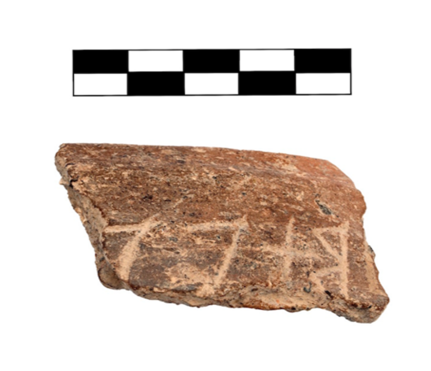

<!-- p. 273 -->

# An Umbrian inscription at Poggio Civitate (Murlo)

By ANTHONY TUCK / REX WALLACE, Amherst

Source: *Glotta* 94 (2018): 273–282. ISSN (print): 0017–1298; ISSN (online): 2196–9043. © Vandenhoeck & Ruprecht GmbH & Co. KG, Göttingen 2018.

*Abstract:* The Etruscan site of Poggio Civitate has preserved a small corpus of inscriptions dating to the 7th century BCE phase of the site. Among them is one outlier: a fragmentary text inscribed on the rim of a utilitarian vessel manufactured at the site. The text and alphabet appear Umbrian rather than Etruscan. The find spot and date of the fragment are discussed, possible interpretations of the text are offered, and attempt is made to situate the inscription within its social context.

## 1. Introduction[^1]

The Etruscan community of Poggio Civitate, which flourished in the years between the 8th and 6th centuries BCE, preserves a complex spectrum of evidence related to daily life at the site. Poggio Civitate is situated between the metal rich Tuscan *Colline Metallifere* of the Maremma to the west and the vast agricultural wealth of the *Crete Senese* and the Val d’Ombrono to the east. This advantageous location gave the inhabitants of the site the opportunity to economically exploit its immediate surroundings, although the area’s topography required a somewhat different approach to community formation than that attested at most large urban centers of the Tuscan coast (Tuck 2016: 112–114). Rather than a population concentrated atop a single, wide plateau, the terrain around Poggio Civitate resulted in a politically affiliated but non-nucleated community, with an elite, aristocratic center on Poggio Civitate surrounded by a number of related, subordinate communities on hilltops such as Vescovado di Murlo, Murlo, and Pompama (Campana 2001; Tuck et al. 2009).

The archaeological environment of Poggio Civitate is highly unusual. The site was abandoned toward the last quarter of the 6th century for reasons that are not particularly clear (Tuck et al. 2016: 105–108), resulting in a largely undisturbed archaeological condition that offers an exceptionally well preserved view of the development and daily life of an Etruscan settlement during the socially and politically dynamic years from the 8th through the 6th centuries BCE.

<!-- p. 274 -->

Among the various social and technological developments of this period are the introduction and adaptation of literacy. While most surviving evidence suggests literacy and its uses were largely within the purview of the region’s social elite, materials from Poggio Civitate indicate that at least some facility with writing and literacy was present within elements of the community’s non-elite constituents (Tuck and Wallace 2011; 2013).

To date, almost all objects bearing inscriptions have been recovered from stratigraphic layers associated with the buildings of the site’s middle phase of architectural development – the phase that included an aristocratic residence OC1/Residence, a multifunctional workshop, OC2/Workshop, and a tripartite building, OC3/Tripartite.[^2] The construction date of this complex of interrelated buildings was the middle of the second quarter of the 7th century BCE; the complex was destroyed by fire at the end of the same century (Tuck and Nielsen 2008).

Some inscriptions recovered from this phase of the site (circa 675/50–600 BCE) are found on objects manufactured at other Etruscan centers,[^3] while others were incised on locally produced bucchero, impasto, and coarse-ware ceramic.[^4] One of these locally produced pieces – the rim fragment of an inscribed impasto bowl (Poggio Civitate 19950066) – is the object of this paper. It is the only inscribed fragment at Poggio Civitate that is not, or is not likely to be, Etruscan in language.

## 2. Poggio Civitate 19950066

PC 19950066 preserves a maximum length of 0.056m, a maximum height of 0.044m, and a maximum thickness of 0.009m (Fig. 1 [See the end of this paper.]). The fragment consists of a portion of the vessel’s rim and indications of two low ridges running parallel to it. The interior is relatively rough and un-slipped with indications of the use of a narrow, blunt tool to burnish the surface. The fabric is a coarse impasto with visible indications of micaceous inclusions on all surfaces.

<!-- p. 275 -->

The vessel corresponds to a type found frequently at Poggio Civitate and classified by Bouloumie as either her type L1B or L1C (Bouloumie 1978: 86–90). Such utilitarian vessels were recovered in large numbers in both domestic and industrial contexts.[^5] Moreover, while the process of archaeometric testing of the clay source of this and many other samples of pottery from Poggio Civitate is not yet complete, initial results indicate the vessel’s clay was locally sourced.[^6]

PC 19950066 was recovered from a trench designated Tesoro 25. Tesoro 25 originally encompassed an extensive area and was excavated over the course of several years. However, the 1995 season only investigated a small area immediately north of the Archaic Phase Complex’s southern defensive wall. The stratum from which the fragment was recovered was heavily suffused with carbon and deteriorated plaster, a stratum linked to the destruction and subsequent cleanup following the fire that consumed the three buildings of the plateau’s second phase of architectural development.

The recovery of other forms of pottery and sculptural elements characteristic of the site’s Orientalizing Phase Complex indicates that PC 19950066 was almost certainly associated with the buildings of this phase of the site’s habitation. Following the fire that destroyed the Orientalizing Phase complex, large volumes of debris associated with the buildings appear to have been scraped into depressions and lower lying areas to prepare the plateau for the construction of the subsequent Archaic Phase Complex. Therefore, the two buildings closest to PC 19950066’s point of recovery were OC3/Tripartite and OC2/Workshop. Unfortunately, the nature of the disturbance of materials during this period of the plateau’s rebuilding process makes it impossible to assign PC19950066 to any of the buildings with complete confidence.

<!-- p. 276 -->

## 3. Alphabet and inscription

The inscription was written in right-to-left direction approximately 0.025m below the rim on the exterior of the vessel. Four letters, varying in height from 0.020m (*beta*) to 0.015m (final letter), are visible. The bottom portion of every letter is missing at the point where the ceramic is broken off; the leftmost portion of the final letter is missing as well.

- The first letter is *beta*; the loops are triangular, rather than rounded. In form, it resembles the *beta* on Um 41.[^7]
- The second letter has the form of a cross-mark. It is similar to the character found on Um 40, which was read as *iota* by Maggiani, without comment, a reading followed by Crawford (2011: 157–58 [Sabini (?) 1]) and by Maras in Agostiniani, Calderini, and Massarelli (2011: 12–13, no. 3), again without comment, and by Rix (2002: 62 [Um 40]), who admits a degree of uncertainty by ‘underdotting’ the letter. It is possible, as our colleague M. Weiss has suggested (p.c.), that the letterform is an attempt to indicate a palatal glide /j/. The context in which the sign appears, C_V, makes this suggestion imminently plausible.
- The third letter is either *epsilon* or *wau*. However, since letter four is unlikely to be a vowel sign, *epsilon* is the preferred reading.
- Of the final letter, approximately half of a vertical bar and a short segment of an oblique bar are visible. The letter could be any one of the following: *pi*, ‘empty’ *heta*, *ny*, *my*, or *wau*, but the latter only if the oblique bar is attached near the bottom of the vertical bar.

Although the impasto vessel from which the rim fragment comes was recovered in the context of an Etruscan aristocratic building complex, the alphabet in which the inscription was written is not Etruscan. The letter *beta* points to an alphabet of a type exemplified by Umbrian inscriptions Um 40 and Um 41. And, if letter two in our inscription is correctly identified as a *iota* in the form of a cross-mark, as also appears in Um 40, then this letter constitutes a significant similarity between the two scripts. Unfortunately, we cannot determine the relationship between the alphabet used to write PC 19950066 and the alphabets used to write Umbrian inscriptions Um 40 and Um 41, and Um 2, Um 3, and Um 4, because the letters that are diagnostic, apart possibly from *heta*, are not attested on PC 19950066.[^8]

<!-- p. 277 -->

Naturally, the reading of the text is difficult because the fragment is short and the final character uncertain. The possibilities are listed in (1).[^9]

(1)

|  | Reading |
|---|---|
| (a) | ]bịẹḥ[ |
| (b) | ]bịẹṇ[ |
| (c) | ]bịẹṃ[ |
| (d) | ]bịẹp[ |
| (e) | ]bịẹṿ[ |

The most likely interpretation of the inscription on the rim fragment, assuming that it belongs to the same epigraphic category as the Etruscan inscriptions found on locally-produced pottery at Poggio Civitate, is that it is a proprietary inscription and that it holds a portion of a name, either a personal name or a family name, and that the name is inflected in the nominative or the genitive case. If so, then (1b) is a good fit. We could have, for example, a family name vi]bịẹṇ[s (nom. sg.) or vi]bịẹṇ[es (gen. sg.),[^10] built by means of the suffix *-ēno-* from the well-attested Umbrian personal name vi(bis) (nom. sg.), vibie(s) (gen. sg.).[^11] Such a formation would be comparable to those attested by Umbrian uoisiener (Um 10, gen. sg.), variens (Um 23, nom. sg.), and possibly by South Picene titienom (Sp TE 3, gen. pl.).[^12]

Another interpretation, following reading (1a), is that the surviving portion of the inscription is the dative singular of an o-stem, e.g., vi]bịẹḥ [ (dat. sg.), and that it reflects the same series changes attested by the South Picene personal name k]aúieh (Sp AQ 1, dat. sg.) < *gāwiyōy*.[^13] Our inscription would then be a segment of a donative inscription designating the person for whom the bowl was made.

<!-- p. 278 -->

Other readings in (1) do not lend themselves so readily to interpretation as a name, or to interpretation as a lexical item for that matter, but of course that does not rule them out of bounds.[^14]

A second avenue of analysis is possible, but much less likely in our opinion. One could take the inscription as Etruscan in language though written in a Sabellic alphabet. But this approach is not easily countenanced because of the appearance of the letter b. One would have to imagine an Umbrian scribe ‘Etruscanizing’ his personal name by writing vi]bịẹ (in uninflected form) and employing the letter b rather than expected p (Etruscan does not have a series of voiced stops), perhaps as an orthographic symbol of his Sabellic identity. Following this approach the inscription would be a segment of a bipartite onomastic phrase, e.g. vi]bịẹ p[, as is the case for other Etruscan inscriptions on locally-produced ceramic recovered at Poggio Civitate.[^15] However, the use of the letter beta in an Etruscan inscription, even in the spelling of a name of Sabellic origin, makes this interpretation considerably less plausible than the interpretation of the text as Umbrian.[^16]

## 4. The social milieu

Although the interpretation of the inscription is uncertain, it is likely to have been composed and perhaps incised as well by an émigré from Umbrian territory. The discovery of a Palaeo-Umbrian inscription at Poggio Civitate in the 7th century BCE is not necessarily surprising given the mobility of members of the aristocratic classes in central Italy.[^17] Alternatively, it is possible that an individual from one of the community’s disenfranchised orders such as an itinerant craftsman or a slave purchased or traded into the community of Poggio Civitate was responsible for composing/incising PC 19950066. Indeed, this individual’s literacy could have been a facet of his commodified value. This scenario requires us to accept that a member of the community’s non-elite was literate, and while this may appear problematic at first glance, it is worth noting that we have essentially no direct evidence concerning the status and condition of the disenfranchised within Etruscan communities like Poggio Civitate during this period.

<!-- p. 279 -->

Regardless of the status of the person responsible for the inscription on PC 19950066, Palaeo-Umbrian inscriptions recovered from Etruscan communities at Chiusi and at Caere [Tolfa] are evidence that individuals or perhaps families of Sabellic speakers were present in Etruscan communities as early as the 7th century BCE.[^18] It seems reasonable to think that the inscribed fragment presented here is evidence that this was also the case at Poggio Civitate, that is to say, that an Umbrian individual or family was part of the community inhabiting the site at the end of the 7th century BCE.

An Umbrian speaker (or speakers) at Poggio Civitate presupposes a linguistically diverse community with a degree of bilingualism on the part of at least a few of its members.[^19] Although the evidence is limited to a single inscription, when considered in conjunction with the other evidence from the site – both material and epigraphic –,[^20] it provides for a multifaceted view of the constituency of the community, one that is more complex linguistically than scholars have heretofore realized.

<!-- p. 280 -->

## Abbreviations

| Abbreviation | Meaning |
|---|---|
| PC | Poggio Civitate |
| Sp | South Picene |
| TE | Teramo |
| Um | Umbrian |
| Ve | Veii |

## Concordance of inscriptions

| Rix 2002 | Crawford 2011 | Agostinani, Calderini, and Massarelli 2011 |
|---|---|---|
| Um 2 | Forum Novum 2 | Catalogue no. 4 |
| Um 3 | Forum Novum 1 | Catalogue no. 2 |
| Um 4 | [Caere 1] | Catalogue no. 5 |
| Um 10 | Asisium 1 | Catalogue no. 45 |
| Um 23 | Umbria 2 | Catalogue no. 25 |
| Um 35, 36 | Tuder 3, 4 | Catalogue nos. 55, 56 |
| Um 40 | Sabini (?) 1 | Catalogue no. 3 |
| Um 41 | Capena 1 | Catalogue no. 1 |
| Sp TE 3 | Interamnia Praetuttiorum 5 | – |

<!-- p. 282 -->

[^1]: We thank our colleagues E. Benelli, M. Weiss, and B. Regier for reading and commenting on earlier drafts of this paper. The usual disclaimers apply.

[^2]: Three fragmentary inscriptions can be assigned to the Archaic phase of architectural development at Poggio Civitate. They are: PC 19660121, PC 19680009, and 19700121.

[^3]: In total, segments of three inscriptions are found on fragments of bucchero kyathoi, one of which is characteristic of a type thought to be produced at Caere, while the others are linked to a production center in northern Etruria, perhaps located at or near Populonia (see Wallace 2007; Tuck and Nielsen 2008). Two bucchero kotylai preserve traces of inscriptions and are of a fabric and typological form uncharacteristic of Poggio Civitate; they are imported as well.

[^4]: Eight inscriptions are on pieces of delicately carved bone and ivory recovered from the floor of OC1/Residence, most if not all of which were locally produced (Maggiani 2006; Wallace 2008). Fifteen additional inscriptions consisting of names or onomastic phrases are found on a range of ceramic objects manufactured from locally sourced clay and thus produced and inscribed at Poggio Civitate (Tuck and Wallace, to appear 2018).

[^5]: Another example of this type of vessel manufactured at Poggio Civitate was also inscribed. PC 19730312 was recovered approximately 90m north of PC 19950066 and it preserves a portion of an inscription across the mid-section of the vessel’s body. Unlike PC 19950066, the letterforms incised onto PC 19730312 are Etruscan. Given the scarcity of all inscribed materials at the site, it is curious that two examples of such typologically similar, otherwise nondescript, locally manufactured utilitarian vessels bear inscriptions, although precisely why is unclear.

[^6]: Data collection employing PXRF equipment is currently being employed to add additional clarity to the question of local versus non-locally sourced clay at Poggio Civitate. Preliminary results indicate that PC 19950066’s elemental signature is consistent with clay sources tested in the immediate vicinity of Poggio Civitate.

[^7]: Umbrian and South Picene inscriptions are cited from Rix 2002; Etruscan inscriptions are cited from Meiser et al. 2014. A concordance of Umbrian and South Picene inscriptions with cross-references to Crawford 2011 and Agostinani, Calderini, and Massarelli 2011 is provided at the end of the paper. Photographs and/or drawings can be found in Crawford 2011 and in Agostinani, Calderini, and Massarelli 2011.

[^8]: See Colonna 1999 and Benelli 2008 for discussion of the alphabets in which these inscriptions were written.

[^9]: Readings ]bịṿḥ[, etc., while possible, are much less likely because of the combinations of consonants.

[^10]: For the family name, see Etruscan vipiiennas (Ve 3.11) and Latin Vībiēnus, both of Sabellic (Umbrian?) origin. For discussion of the etymology of the name Vībius, see Weiss 2010: 272–274.

[^11]: The derivational pattern is discussed in Hadas-Lebel 2008: 62–64.

[^12]: The syntactic context in which this word is found is unclear because the cippus is fragmentary.

[^13]: For the phonological developments, see Weiss 1998: 707.

[^14]: One could think, for example, of an adverb in -eh < *-ēd (1a) or an adverb in -e (1b, c, d, e) followed by the first letter of the next word. Or, if (1d), one could have a word inflected in the accusative singular, although ē-stems are quite rare in Sabellic.

[^15]: For the corpus of inscriptions see Tuck and Wallace (to appear 2018).

[^16]: Even so, as our colleague M. Weiss points out (p.c.), there are cases in which Etruscans spelled words using ‘exophonemes’, e.g. cnovies (Fa 2.33).

[^17]: For the evidence in Etruscan, see Marchesini 2007, especially chapters 1 and 5. The early diffusion of literacy in central Italy is one of the results of such mobility. Clackson and Horrocks 2007: 43–44 provide a good overview of the Italic koine.

[^18]: See Benelli 2014 and Rix 2005: 563–564 for discussion.

[^19]: A considerable amount of East Greek, Corinthian, Chiot, and Laconian ceramic has been recovered from the Orientalizing phase of the site (Phillips 1989). While our understanding of the trade networks that would have carried such goods to an inland center like Poggio Civitate is imperfect, it is tempting to imagine that some members of the community possessed the linguistic capacity to communicate and interact with individuals representing such economic interests while speaking a language other than their own.

[^20]: We also point to inscribed fragment PC 19750015, which reads ]alv[. We reconstruct as a segment of the name s]alv[ie, a borrowing from Faliscan or Latin into Etruscan.
