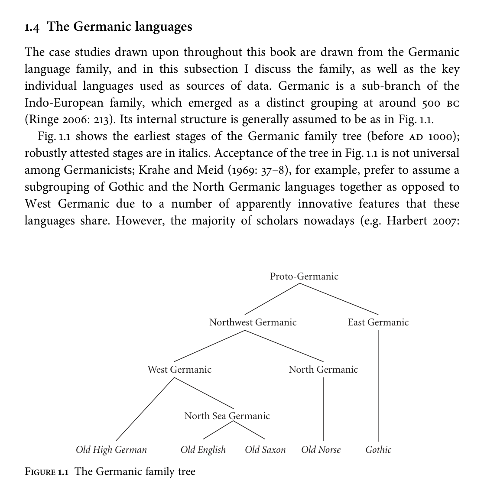

<!-- source page: 1 -->

1

Introduction

## 1.1 Preamble

We know that English, German, Dutch, and the Scandinavian languages are related by descent from a common ancestor, and that they are related, more distantly, to languages such as Spanish, Persian, Armenian, and Greek. We know this because of the development of two tools in particular—the family tree model (Stammbaumtheorie; Schleicher 1853, 1861/2, 1863) and the notion of the regularity of sound change (Osthoff and Brugmann 1878)—in the nineteenth century. With these two tools it became possible to make massive strides forward in corroborating the vague hypotheses about relatedness that had been put forward for centuries. Many of the achievements of scholars of this period are still widely accepted today; see Campbell and Poser (2008) and Morpurgo Davies (1998: 170–1, 251–4) for an overview. The ‘best fit’ Indo-European family trees generated by Ringe, Warnow, and Taylor (2003), Dunn et al. (2008), and Longobardi and Guardiano (2009), using computational methods as well as extensive up-to-date scholarship, are extremely similar to the classical tree presented in Schleicher (1853), which is still used as a yardstick against which to measure newer attempts at constructing family trees. Of course, as with everything in science, it is impossible to be sure that such hypotheses are on the right track, however many insights we accumulate and however many correct predictions are made. However, an alternative explanation with greater empirical coverage and explanatory power has yet to be presented. Assuming that the Germanic languages are indeed related in this way, a natural next question to ask is: what was their common ancestor like? The process of trying to answer this question is known as reconstruction, and nineteenth- and twentiethcentury linguists have had great success in reconstructing the sounds and words of such ‘protolanguages’. For example, we can hypothesize that the Proto-Germanic word for ‘wolf’, in the nominative case, was *wulfaz, on the basis of the attested forms given in (1).1

1 The versatile little asterisk serves a number of functions in this book. When prepended to a word or expression in an ancient language or protolanguage, it signifies that that form is a reconstruction, i.e.

<!-- source page: 2 -->

```text
(1)
Old English
wulf
Old Saxon
wulf, wolf
Old High German
wolf
Old Norse
úlfr
Gothic
wulfs
```

We can do this because the sounds that make up the word correspond systematically across the languages, in a way that will be made more precise in Chapter 2. The tools of traditional reconstruction thus enable us to reconstruct large swathes of the lexicon, phonology, and morphology of protolanguages. However, as has been noted by many authors (e.g. Brugmann 1904: viii; Watkins 1964: 1035; Clackson 2007: 157), comparative-reconstructive linguistics as practised in the nineteenth and early twentieth centuries has not always accorded syntax a central place. Beekes (1995), an introductory volume to comparative Indo-European philology, omits syntax entirely, as does Szemerényi (1996), another standard reference work. Even the father of historical-comparative syntax, Berthold Delbrück, questions whether it is appropriate to reconstruct in syntax as is done for the lexicon, phonology, and morphology (1900: v–vi). A number of works attempting to reconstruct aspects of the syntax of protolanguages have appeared: for Proto-Germanic, Lehmann (1972), Hopper (1975), and Kiparsky (1995, 1996) are a few key examples. On the other hand, these approaches have met with extreme scepticism: see, for example, Jeffers (1976), Winter (1984), and Lightfoot (1979, 1980, 1999, 2002a, 2002b, 2006). The debate was at its fiercest in the pages of Journal of Linguistics, 38, in which Lightfoot (2002a) criticized the reconstructive techniques of Harris and Campbell (1995), meeting with a response by Campbell and Harris (2002) which in turn was replied to by Lightfoot (2002b). A full review of the literature on syntactic reconstruction can be found in Walkden (2009, 2013a). This book is a discussion of the problem of whether it is possible or profitable to reconstruct the syntax of unattested stages of linguistic family trees. A related, though not coextensive, question is whether the methodology used in lexical-phonological reconstruction can be straightforwardly applied to syntax. My answer to this second question will be ‘partially’; my answer to the first question, in all its guises, will be an unalloyed ‘yes’. I start by discussing the epistemological and methodological issues involved in the reconstruction of syntax, including the important objections raised by Lightfoot and others (Chapter 2). The bulk of the book is devoted to case studies from the Germanic language (sub-)family in support of the approach to syntactic

unattested but hypothesized to exist, as is the norm in historical linguistics (see e.g. Campbell 1998: xix). When prepended to an expression in a language for which we have access to native speakers, it signifies that that form is ungrammatical, as is the norm in syntax. Finally, when appended to a syntactic phrase label it signifies that that phrase may occur zero or more times in the derivation; this is the Kleene star, roughly as used in mathematical logic.

<!-- source page: 3 -->

reconstruction developed, dealing with main clause constituent order (Chapter 3), the system of wh-words (Chapter 4), and the occurrence and distribution of null arguments (Chapter 5); these should also serve as stand-alone contributions to the historical syntax of the Germanic languages. Chapter 6 concludes. The rest of this chapter outlines the aims of the book in more detail, as well as the basic assumptions I make throughout.

## 1.2 The mythmaker’s handbook: a constructivist approach

to historical syntax

Being reflective creatures, thanks to the emergence of the human capacity, humans try to make some sense of experience. These efforts are called myth, or religion, or magic, or philosophy, or in modern English usage, science. (Berwick and Chomsky 2011)

Reconstruction can be defined as the process of constructing forms that are nowhere attested but which are ‘posited, on the basis of some evidence, as having existed in some earlier or ancestral form of a language’ (Trask 1996a: 302–3). The most pessimistic view on reconstruction to be found in the literature is that of Lightfoot (1979, 1980, 1999, 2002a, 2002b, 2006). For Lightfoot (2002a), reconstructions are ‘myths’; for Lightfoot, myths may have functions, as in the case of ‘formulist’ statements about the historical relatedness of languages, but the term can also be used in a pejorative sense, and this is what Lightfoot intends in using it to characterize ‘realist’ efforts to reconstruct a prior linguistic reality (2002a: 115). Campbell and Harris (2002), in response, suggest that it is damaging to the field to label hypotheses about prior realities ‘myths’. It is instructive to compare these perspectives with the one taken by Lass (1997). In contrast to many historical linguists, whose expertise is vastly more linguistic than it is historical, Lass has engaged with the literature on the philosophy of history. Such an engagement is important, since, as noted by White (1978: 126–7), ‘every historical discourse contains within it a full-blown, if only implicit, philosophy of history’; this is true no less of historical linguistic discourse than of other branches of history, and means that ‘metaworries’ (Kiparsky 1975: 204) must be accorded a central place in historical linguistic theorizing rather than dismissed in favour of ‘get[ting] on with the serious business of doing linguistics’, an attitude criticized by Lass (1980: ix–x). Lass draws a trenchant distinction between ‘history’, i.e. the events that happened, and ‘historiography’, the interpretation and explanation of those events. As is widely accepted within the academic discipline of history (cf. e.g. Jenkins 1991: ch. 1 for an accessible introduction), our only access to ‘history’, to those events, is through witnesses, which themselves must be identified and interpreted. But this identification and interpretation is an act of historiography.

<!-- source page: 4 -->

Our approach to history, as Lass (1997: 17) emphasizes, must therefore be at least partially constructivist in the sense of Ortony (1979): there can be no access to history without constitutive historiography. This is not to say that there exist no such things as ‘truth’ or ‘facts’; indeed, Lass is at pains to deflect charges of ‘flabby postmodern relativism’ (1997: 5). Sokal (2008: ch. 3, ch. 6) provides a good summary of the practical dangers of the relativist position. Crucially, even those who characterize history as a search for truth make the distinction between history and historiography, and do so willingly without supposing that the problem makes their work somehow ‘unreal’ or ‘illegitimate’ (cf. e.g. Elton 1967: 70, 112–13; Zagorin 1999; Jarrick 2004). There is, or was, a truth about history, and this assumption is ‘a conceptual necessity’ for the study of history (Zagorin 1999: 16; cf. also Hobsbawm 1997: 6); the key issue is our access to this truth. For Lass, then, all hypotheses about the past are myths (1997: 5); the term here is used in its technical sense, which is not inherently pejorative, as emphasized for social history by Tindall (1989: 2), for political science by Flood (2002: 44), and for the comparative study of mythology by Puhvel (1987: 2). A myth, under this view, can be defined as a story ‘which embodies and provides an explanation, aetiology, or justification for something such as the early history of a society, a religious belief or ritual, or a natural phenomenon’ (OED).2 The constructivist viewpoint suggests that Campbell and Harris (2002: 602) are being overly defensive in characterizing the suggestion that reconstructive hypotheses are myths as ‘inaccurate and deleterious to the field’. However, Lightfoot (2002a) makes a more serious error, not in labelling such hypotheses as myths but in implicitly contrasting them with an unexemplified type of non-mythological historiography. The gravity of this error lies in the fact that, as Lass has argued, any hypothesis about linguistic history is mythical in a non-trivial sense. For instance, Lightfoot’s account of the loss of case in English and its syntactic consequences (2006: 102–23) rests on a framework of interpretations and assumptions, including interpretations of the Old English textual record, the assumption that this reflects in any direct way the grammar of some (or indeed any) Old English speakers, and so on. Mythology in historical syntax, then, may be more pervasive than assumed in Lightfoot (2002a). Honeybone (2011) makes a similar point: since past I-languages cannot be observed, ‘all historical linguistics deals with reconstructed forms’ (2011: 30). As Lass additionally observes (1997: 19 n. 22), the problem of access is not one that is unique to the historical sciences: direct observation of synchronic states of the language faculty, for instance, is also impossible. Campbell and Harris (2002: 602) observe, rightly, that ‘for Lightfoot to suggest that reconstructions are myths, rather

2 Cf. Bierce’s (1911) tongue-in-cheek definition of mythology in The Devil’s Dictionary: ‘The body of a primitive people’s beliefs concerning its origin, early history, heroes, deities and so forth, as distinguished from the true accounts which it invents later.’

<!-- source page: 5 -->

than hypotheses, raises the question of whether the supposed “hypotheses” of synchronic linguists are also “myths”’. Following Lass (1997: 18) and Honeybone (2011: 30 n. 6), I would argue that the answer to this question is probably yes, but that it should not matter in the slightest to the practising linguist, whose task remains the same in this case.3

But are some myths more mythological than others? Perhaps. Lass (1997: 19–20) observes that comparing our sources of historical knowledge to witnesses leads to comparing the historian’s task to a courtroom setting:

[Accepted truth] arises through argument, evaluation, consideration of often conflicting testimony, discussion of the relative credibility of witnesses, precedent, even rhetoric. Witnesses may tell the truth; they may be mistaken or confused, or be liars; advocates may be sophists or demagogues. The historian, like a magistrate or jury, has to produce the best verdict he can. This is why historiography contains an irreducible conventionalist element, whether or not its ultimate pretensions are realist.

According to this view, the myths we construct in historical linguistics are, in virtue of their function, subject to criteria of empirical responsibility and rationality; in other words, when assessed against these criteria, some of the myths we construct will turn out to be more convincing than others. Similarly, Dressler (1971: 6) refers to the process of reconstruction as a Wahrscheinlichkeitsschätzung (‘estimation of probability’). Lightfoot (2002b: 625) closes his paper with an exhortation to the effect that the myths constructed thus far are not palatable to him:

If somebody thinks that they can reconstruct grammars more successfully and in more widespread fashion, let them tell us their methods and show us their results. Then we’ll eat the pudding.

What follows is an exploration, assuming the constructivist approach to history advocated by Lass (1997) and by much mainstream histori(ographi)cal practice at the same time as a realist attitude towards the past itself, of the extent to which plausible hypotheses (and thus tasty puddings) about the syntax of protolanguages can be constructed on a methodologically accountable basis. The first two chapters of this book lay down some guidelines for the prospective mythmaker; the remaining chapters put these guidelines into practice. With all that said, the term myth may nevertheless be unpalatable to some readers, perhaps due to its pejorative prior associations, or due to the necessity of a distinction between ‘religious’ and ‘non-religious’ myths (Lass 1997: 5). The reader is, in that case,

3 Evans and Levinson (2009) claim that many of the hypotheses of synchronic linguists, namely those postulating language universals, are in fact myths, in the sense that such universals do not exist. Their claims are, however, hard to evaluate, since they reject analyses above a certain (unspecified) level of abstraction (Baker 2009; Longobardi and Roberts 2010), and their article contains a large number of factual and logical errors (Harbour 2010).

<!-- source page: 6 -->

invited to substitute theory or hypothesis for (non-religious) myth for the remainder of this book; these are also the terms I shall be using hereafter.

## 1.3 Syntactic framework

The syntactic framework I assume here is, broadly, the one developed in the context of the Minimalist Program (e.g. Chomsky 1995, 2000, 2001) and refined in subsequent work. I do not view this work as Minimalist, as it does not seek to contribute to the goals of the Minimalist research program itself by investigating the Strong Minimalist Thesis, the idea that language is an optimal solution to legibility conditions (Chomsky 2000: 96). Instead I draw upon the results of the Minimalist approach to syntax in order to inform my own historical investigation, which has its own goals, as outlined in section 1.1; namely, to assess the possibilities for the reconstruction of syntax and ‘to recover as much as possible of the actual language spoken in the past’ (Campbell and Harris 2002: 600) with respect to the syntax of earlier stages of Germanic. As Chomsky (2001: 41) puts it:

Internalist biolinguistic inquiry does not, of course, question the legitimacy of other approaches to language, any more than internalist inquiry into bee communication invalidates the study of how the relevant internal organization of bees enters into their social structure. The investigations do not conflict; they are mutually supportive.

I take it that Minimalist investigation and investigation into the diachronic development of languages (in the pretheoretical sense) can be mutually supportive in this way. The specifics of the approach I take to syntactic variation are discussed in section 2.2, as these bear heavily upon the general question of whether it is possible to reconstruct syntax at all. Here I will simply outline some of the basics of the syntactic framework I am adopting, particularly its two core operations, Merge and Agree, as well as locality conditions and the order of Merge of functional lexical items. Readers with no interest in the technicalia should feel free to skip the rest of this subsection. For a more detailed overview of a Minimalist theory of syntax assuming no prior knowledge of the framework, see Adger (2003). Simply stated, Merge ‘takes two syntactic objects α and β and forms the new object γ = {α, β}’ (Chomsky 2001: 3). Much ink has been spilled over the precise formulation of Merge. For our purposes it is sufficient to note that it is a structure-building operation which operates on sets and makes no reference to linear order. I assume that linear order is derived through a mapping algorithm of the sort proposed by Kayne (1994), resulting in heads uniformly preceding their complements and specifiers uniformly preceding their heads. Constituent order variation must then be derived via movement. Although in Chomsky’s earlier Minimalist work (e.g. 1995, 2000) Move was required as a separate operation, it is argued in Chomsky (2001,

<!-- source page: 7 -->

2005) that movement comes for free as part of the formulation of Merge. Given α, β can be Merged to it either from outside α or from inside α. The former, ‘external Merge’, is the classic case of Merge of an item new to the derivation; the latter, ‘internal Merge’, corresponds to classic cases of movement (Chomsky 2005: 12). If movement is ‘free’ in this sense, no separate operation need be postulated, though the question of featural ‘triggers’ for internal (and external) Merge still remains. Agree, the second core operation, ‘establishes a relation . . . between an LI [lexical item—GW] α and a feature F in some restricted search space (its domain)’ (Chomsky 2000: 101). Features may be interpretable or uninterpretable; uninterpretable features must be checked, as they play no role at the conceptual-intentional and sensorimotor interfaces. Following Chomsky (2001) and much recent work, I will assume that the process of checking is a process of valuation, and that interpretable = valued and uninterpretable = unvalued (though cf. Pesetsky and Torrego 2001, 2004 for an approach which takes these notions to be distinct). In Chomsky’s framework, the probe is the uninterpretable feature F associated with a head α higher in the structure, and it seeks a goal in its c-command domain, which must bear a value for the feature F. In addition, a goal must be active: in Chomsky’s terms, it must also bear an uninterpretable feature (distinct from F). Structural Case features, for instance, may serve this role. Uninterpretable features will be indicated, following common practice, by a prepended u, e.g. [uTense]; interpretable features by a prepended i, e.g. [iTense], or simply by a value, e.g. [Tense:Past]. If an inactive goal, i.e. a goal bearing a value for the feature F but no uninterpretable feature, is closer to the probe than an active goal, then the effects of matching are blocked. This latter property of Chomsky’s model is termed a defective intervention constraint (2000: 123), which is the first type of locality condition that will play a role in the analyses in this book. Defective intervention has its roots in earlier theories of intervention-based locality constraints, most notably Rizzi’s (1990, 2001a) Relativized Minimality and the Minimal Link Condition of Chomsky (1995). It is a relative rather than absolute locality restriction in the sense of Rizzi (1990: 2), in that it is relativized to the feature F for which Agree must take place. The second type of locality condition is an absolute one: that of phases. I assume the Phase Impenetrability Condition of Chomsky (2000).4

```text
(2)
Phase Impenetrability Condition (PIC)
In phase α with head H, the domain of H is not accessible to operations outside
α, only H and its edge are accessible to such operations.
(Chomsky 2000: 108, his (21))
```

4 The version of the PIC given in Chomsky (2001: 13) is more permissive, and not assumed here.

<!-- source page: 8 -->

Phase heads are the spiritual successors of barriers (Chomsky 1986a), being conceptually justified by mapping their complements to the interfaces and thus ensuring that ‘mappings to the two interfaces can forget about what they have already done’ (Chomsky 2005: 16). Their role partially overlaps with that of intervention constraints. The traditional assumption is that C0 and v0 are phase heads (Chomsky 2005: 17), and possibly also D0 (Svenonius 2003). Agree and phase heads play an important role in the typology of movementtriggering that I will assume. Following Biberauer (2008) and Biberauer, Holmberg, and Roberts (2010), I assume that there is only one movement-triggering feature, ^, but that this can and must be parasitic on another type of feature wherever it occurs. When associated with a probing feature (e.g. φ-features), ^triggers A-movement; when associated with the Edge Feature that is the crucial property of a phase head, ^ triggers A’-movement.5 I also assume, following Roberts (2010b), that headmovement is not derived via internal Merge. Instead, head-movement is the result of an Agree relation in which the features of the goal are a proper subset of those of the probe; some mechanism of chain reduction then enforces the non-overtness of the goal. The hierarchy of projections that I will assume is the standard one: CP, TP, vP, VP in the clausal hierarchy, and PP, DP, nP, NP in the nominal hierarchy. In line with the assumptions of the ‘cartographic’ research tradition (Rizzi 1997; Cinque 1999; Cinque and Rizzi 2010) I assume that each of these is shorthand for a more finegrained array of projections, which largely occur in a fixed order,6 with only one specifier available per head (cf. also Kayne 1994). For my purposes, it will only be necessary to ‘expand’ the CP and zoom in on the left periphery of the clause, in a tradition following Rizzi (1997). Rizzi divides CP up as in (3).

(3) ForceP > TopP* > FocP > TopP* > FinP (Rizzi 1997: 297)

ForceP hosts elements related to clause type: declarative, interrogative, etc. TopP, which may be iterated indefinitely, hosts topics, while FocP hosts foci. Finally, FinP specifies the finiteness of the clause. Building on Rizzi’s work, Frascarelli and Hinterhölzl (2007) present a slightly more nuanced picture of the left periphery, illustrated in (4).

(4) ForceP > ShiftP > ContrP > FocP > FamP* > FinP (adapted from Frascarelli and Hinterhölzl 2007: 112–13; their (37))

5 ^may also be associated with the c-selectional features of a lexical root, in which case it triggers linearization movement (‘L-movement’). This latter type, often referred to as ‘roll-up’ in the literature, is largely used to derive orders in consistently head-final languages, and hence plays no further part in this book. 6 Cinque (1999: 127) notes that variation does arise, but in the TP domain at least seems to be limited to negation and agreement morphemes.

<!-- source page: 9 -->

The main advance made is the distinction between three different types of topic: shifting or Aboutness topics, hosted in ShiftP, indicating what the clause is about; contrastive topics, hosted in ContrP, which create oppositional pairs with respect to other topical elements; and familiar topics, hosted in FamP, which are typically given constituents, often realized in a pronominal form (Frascarelli and Hinterhölzl 2007: 88). I will adopt this hierarchy here, since it makes slightly stronger predictions than Rizzi’s pioneering hierarchy in (3). I also assume, with e.g. Aboh (2010) and Cruschina (2009), that information-structural features are present in the syntax, added in the numeration; the element bearing these features must then enter into an Agree relation with a left-peripheral head. These are the core details of the syntactic framework I am adopting. Other, more minor details will be introduced as and when they are needed in the relevant chapter.

The case studies drawn upon throughout this book are drawn from the Germanic language family, and in this subsection I discuss the family, as well as the key individual languages used as sources of data. Germanic is a sub-branch of the Indo-European family, which emerged as a distinct grouping at around 500 bc (Ringe 2006: 213). Its internal structure is generally assumed to be as in Fig. 1.1. Fig. 1.1 shows the earliest stages of the Germanic family tree (before ad 1000); robustly attested stages are in italics. Acceptance of the tree in Fig. 1.1 is not universal among Germanicists; Krahe and Meid (1969: 37–8), for example, prefer to assume a subgrouping of Gothic and the North Germanic languages together as opposed to West Germanic due to a number of apparently innovative features that these languages share. However, the majority of scholars nowadays (e.g. Harbert 2007:

```text
Old English
Old Saxon
Old Norse
Gothic
Old High German
```



<!-- source page: 10 -->

7–8; Nielsen 2000a: 23; Ringe 2006: 213) take the hypothesis of an early Northwest Germanic unity as a given. In any case, since the early Germanic varieties were geographically contiguous (Harbert 2007: 8), it is likely that East Germanic and West Germanic both individually shared innovations with North Germanic, and that the binary branching tree in Fig. 1.1 is essentially an artefact of the method. The correct internal subgrouping of West Germanic is more controversial (Ringe 2006: 214; Nielsen 2000b). Old English and Old Saxon (together with the laterattested Old Frisian and Dutch)7 are often assumed to form a North Sea Germanic or Ingvaeonic subgroup to the exclusion of Old High German. This hypothesis is not uncontroversial; however, the debate centres around the affiliation of Old Saxon, which shares certain features with Old High German that the two do not share with Old English (see Nielsen 2000b for discussion). For our purposes it is important simply to note that Old Saxon can be considered phylogenetically and geographically intermediate between Old English and Old High German. The Germanic family is an appropriate one to use as a test bed for syntactic reconstruction for a number of reasons. First, the older languages are comparatively well attested, and well studied, if not always well understood; cf. Robinson (1992) for an introduction to these languages, and Harbert (2007) for an overview with references. Secondly, as Harris (2008: 90) observes, focusing on a clearly delimited language (sub-)family at a relatively shallow time depth renders the task of reconstruction more manageable and less speculative. As discussed in Walkden (2009: 7–21), most past attempts at syntactic reconstruction (e.g. Lehmann 1974; Friedrich 1975; Watkins 1964, 1976) have attempted to address Proto-Indo-European, and are therefore dealing with a much more amorphous language family at a much greater time depth; Clackson (2007: 157–86) provides a useful discussion of work in this area. Such long-distance, big-picture syntactic reconstruction is by no means excluded in principle by the methodology outlined in this book. The most profitable way to proceed, however, would be to work from the ‘bottom up’, starting with smaller pieces of the puzzle such as the details of the common West Germanic or Northwest Germanic and proceeding to a greater time depth only when acceptance of some of these details is reached. The italicized languages in Fig. 1.1 are those that will form the basis of my discussion in Chapters 3, 4, and 5. The rest of this subsection is devoted to considering those languages in more detail, since each poses unique questions of attestation and interpretation. Many of the issues are shared, however; for general issues relating to the use of written records, including verse texts and translations, I follow the

7 These languages are largely excluded from the present study both due to their late attestation (de Haan 2001, for instance, argues on linguistic grounds that Old Frisian should really be called Middle Frisian) and for reasons of space and time.

<!-- source page: 11 -->

strategies suggested by Lass (1997: 44–103).8 There is little that is new here, since it has long been known that historical linguistics can be thought of as ‘the art of making the best use of bad data’ (Labov 1994: 11). Where it becomes useful to test for statistical significance, Fisher’s exact test (Fisher 1922) is used unless otherwise stated.

### 1.4.1 Gothic

Gothic is the earliest robustly attested Germanic language, and the only member of the East Germanic branch with such attestation. Spoken by the Visigoths and Ostrogoths, two highly mobile tribal groupings (see Robinson 1992: 43–7 for a brief history), it has survived primarily in fragments of a translation of the New Testament from Greek, attributed to Bishop Wulfila (c.310–383). The manuscript, known as the Codex Argenteus, dates from the sixth century and was most likely produced in Italy; see Ebbinghaus (1997) for discussion. The primary difficulty when dealing with the syntax of Gothic is the degree to which the translation is dependent on the syntax of the New Testament Greek original. A recent study of the adjectival syntax of Gothic describes the Gothic Bible as ‘a near-wholesale importation of Greek presented in Gothic guise’ (Ratkus 2011: 24). The two poles of opinion are represented by Curme (1911), who argues that the affinities between Gothic and New Testament Greek are due to shared inheritance rather than slavish translation technique, and Bennett (1980: 127), who claims that in view of translation influence the Gothic texts are ‘all but useless for the study of Germanic syntax’ (cf. also Hopper 1975: 60; Lehmann 1994: 21).9 Ratkus (2011: 32–3) describes these as the ‘idealist’ and ‘agnostic’ positions respectively. From a purely logical perspective, it is not clear that there is anything ‘agnostic’ about the claim that Gothic syntax was heavily influenced by Greek, and nor is it clear that this should be the null hypothesis when investigating the syntax of Gothic. Similarities between languages may be the result of language universals, shared inheritance, convergent development, parallel development, or language contact (Blevins 2004: 47–52; Aikhenvald 2006: 1–2). Common practice in the literature is to assume that a feature is not due to contact unless the evidence is clear and overwhelming (e.g. Lass 1997: 201, 209; though cf. Farrar and Jones 2002 and Filppula 2010: 449 for criticism of this ‘if-in-doubt-do-without’ mentality); among

8 Dewey (2006: 17–21) argues that using verse for syntactic investigations is even advantageous in some respects, as this text type is likely to be conservative and in addition intonational information may help us to determine syntactic features. See also Pintzuk and Kroch (1989), who use this logic to differentiate between extraposition and Heavy NP Shift in Beowulf. 9 Bennett’s claim is made with reference to both the Gothic Bible and the Skeireins, an incomplete short commentary on the Gospel of John. Though the Skeireins is generally thought not to have been composed by Wulfila, it is likely that it is nevertheless a translation from a Greek original: see Schäferdiek (1981). In addition, the newly discovered Gothica Bononiensia manuscript (Finazzi and Tornaghi 2013) came to my attention too late for it to be incorporated into my study.

<!-- source page: 12 -->

Gothicists, the logic seems to be reversed.10 Furthermore, many scholars have presented evidence for ‘genuine’ Gothic syntactic phenomena in the Gothic Bible, often supported by sophisticated quantitative argumentation, e.g. with regard to the relative order of the verb and its complement (Koppitz 1900, 1901; Fourquet 1938; Jasanoff 2004), use of the dual (Seppänen 1985; Keidan 2006), verb position in imperatives, whquestions, and negation (Eyþórsson 1995; Fuß 2003), relative clauses (Harbert 1992), the absolute construction (Dewey and Syed 2009), pronouns (Ferraresi 2005), and the order of elements in the noun phrase (Ratkus 2011). Many of these studies are based on the principle of lexical deficiency: instances where the Gothic text translates a single Greek word with multiple Gothic words. In these cases, it is argued, no model was available, and so the word order is likely to have followed the unmarked native pattern. Furthermore, instances where the Gothic text deviates from its Greek model also indicate native Gothic phenomena (provided that other influences, such as that of Latin or Coptic, can be ruled out). In contrast, I am unaware of any study presenting clear data and explicit argumentation to the effect that the similarities between Gothic and New Testament Greek are due to narrow translation: Metlen’s (1932: 46–7) conclusion to this effect has been criticized by Berard (1993) as based on an insufficient range of phenomena. Instead, the judgement that the Gothic Bible represents ‘Greek syntax garbed in the dress of Gothic grammar’ (Metlen 1932: 47) seems to be based, more often than not, on simple intuition; an intuition that is perhaps circular, as will become clear from the next paragraph. It is equally unclear, then, that ‘idealist’ is an appropriate term to apply to those who, like Curme (1911), wish to claim that similarities are due to common origin. The issue is an unresolved one. In any case, for those working on the syntax of Gothic it is necessary to attempt to rule out structural calquing from New Testament Greek, even though this necessity has more to do with the sociology of the field than with logic or empirical evidence. The important question then becomes: since we do not know what manuscript Wulfila himself had access to, and there is no single original Greek text, which version of the New Testament Greek Bible do we use as a comparator? Ratkus (2011: 28–32) provides a useful guide to this issue. Many scholars, e.g. Berard (1993), Fertig (2000), and Ferraresi (2005), primarily use the version provided in Streitberg’s (1919) edition, which has survived through later editions and is often reproduced elsewhere. The problem with this is that Streitberg was not a Bible scholar, and his version of the Greek New Testament is a hybrid which does not derive from any single manuscript; furthermore, observed differences between other versions and Streitberg’s edition make it clear that Streitberg’s version is closer to the Gothic than

10 One could object that the ‘if-in-doubt-do-without’ methodology is intended to be applied to cases of language change across populations rather than individual cases of loan-translation. The burden of proof would then be on those who wished to claim that the two types of contact influence were significantly different.

<!-- source page: 13 -->

any other (Ratkus 2011: 31). Using Streitberg’s version to investigate correspondence with the Greek is dangerously circular, then, as it cannot be ruled out that Streitberg was guided in his ‘reconstruction’ of the Greek original by the form of the Gothic. Another version often used is the Critical Text (most recent edition Nestle et al. 2001), which has a wide circulation and is widely regarded as the standard edition for academic purposes. It is used for studies of Gothic syntax by Thomason (2006) and Dewey and Syed (2009) inter alia. Ratkus (2011: 33–9) has conducted a three-way comparison in terms of omissions, word order, lexical choice, and grammatical form between the Gothic, the Critical Text, and another version, the Majority Text (Robinson and Pierpont 2005), which is based more heavily on Byzantine than on Alexandrine manuscripts: his aim is to establish which manuscript tradition the Gothic translation can be attributed to. His findings are unequivocal: ‘Gothic follows the Majority Text much more closely than it does the Critical Text, and the former should thus be used as a point of reference in the comparative study of Gothic and Greek’ (2011: 39). I will therefore use the Majority Text as comparator in subsequent chapters where Gothic becomes relevant to the discussion.

### 1.4.2 Old Norse

Old Norse (ON) is a North Germanic language. North Germanic bifurcates early into East Nordic (precursor to Danish and Swedish) and West Nordic (precursor to Faroese, Icelandic, and Norwegian); ON in this book refers to West Nordic texts. The texts investigated are Old Icelandic, mainly because of the availability of a prefinal version of the Icelandic Parsed Historical Corpus (IcePaHC; Wallenberg et al. 2011). Unless otherwise stated, Old Icelandic is here taken to stand for early North Germanic in general, though material on Old Swedish and Old Norwegian will also be drawn upon, particularly Håkansson (2008) and Kinn (2013) on null arguments. In addition to the corpus, the grammars drawn upon for this book are Gordon (1927), Wessén (1966), Heusler (1967), Barnes (2004), and Faarlund (2004). The study of ON poses problems that are different from those familiar to the student of Gothic or the early West Germanic languages. A large number of autochthonous prose texts are available, so that the philological issues of dealing with translations and verse texts do not need to concern us. On the other hand, the earliest texts at our disposal date from around 1150, which is markedly later than for the other Germanic languages under consideration; the ‘Old’ Norse period is thus contemporaneous with Middle English and Middle High German. The language has thus had a considerable amount of time to undergo changes, and we find that ON is indeed substantially different from the other early Germanic languages, e.g. in having generalized verb-second in subordinate clauses. A further issue is the extent to which the comparatively uniform grammar underlying the transmitted texts was representative of many, any, or all North Germanic speakers at the time of production (cf. Faarlund 2004: 2).

<!-- source page: 14 -->

The texts used in this book are the earliest texts found in IcePaHC; the First Grammatical Treatise and samples of the Íslensk hómilíubók (twelfth century), the Jarteinabók, Þorláks saga helga, the Íslendinga saga, the theta manuscript of Egils saga, the Jómsvíkinga saga, the Grey Goose Laws, and the Morkinskinna (thirteenth century).

### 1.4.3 Old English

‘Old English’ (OE) refers to the West Germanic language spoken in parts of Great Britain from the earliest migrations until circa 1150. In contrast to the other West Germanic languages, a substantial body of prose material is available from the period between 800 and 1150, much of it original and not translated from Latin (e.g. Wulfstan’s Homilies, the Anglo-Saxon Chronicle). A large amount of this material is contained within the York-Toronto-Helsinki Parsed Corpus of Old English Prose (Taylor et al. 2003), which I have used as my primary data source. Even in cases of translation it is in general safe to assume that we are dealing with native OE syntax, except in biblical translations (see Allen 1980a: 262 and Taylor 2008 for discussion). The parsed version of Beowulf from the York Parsed Corpus of Old English Poetry (Pintzuk and Plug 2001) has been used to supplement this large prose corpus. Four main dialects of OE can be distinguished: Northumbrian, Mercian, Kentish, and West Saxon. Northumbrian and Mercian are often grouped together as ‘Anglian’. Since the vast majority of texts in the YCOE are West Saxon, other material, such as the data of Berndt (1956), has occasionally been used to supplement this; this becomes particularly relevant for work on null arguments. Reference works used in addition are Mitchell (1985) and Mitchell and Robinson (2007). Citations of OE examples are given from corpus tokens where possible; elsewhere, the short titles given in Mitchell, Ball, and Cameron (1975, 1979) are used. A vast amount of work, both generative (e.g. Allen 1977, 1980a, 1980b; Koopman 1985, 1992, 1995, 1996, 1997, 1998; van Kemenade 1987; Pintzuk 1993, 1999, 2005; Fischer et al. 2000; Biberauer and Roberts 2005, 2008) and non-generative (e.g. Visser 1963–73; Kohonen 1978; Bean 1983; Mitchell 1985; Bech 2001; Davis and Bernhardt 2002; Cichosz 2010) has been done on the syntax of OE, particularly with regard to constituent order, and as a result discussion will often focus on whether the proposals made in these works are transferable to the less well-studied Germanic languages.

### 1.4.4 Old High German

Old High German (OHG) is a cover term for a group of West Germanic dialects whose unifying feature is that they have all undergone the phonological change known as the Second Sound Shift to some extent (see e.g. Sonderegger 2003: 31; König 2005: 63); early texts from the north of the German-speaking area are thus not included (see section 1.4.5 on Old Saxon). OHG is usually taken to range from the

<!-- source page: 15 -->

earliest texts, in the eighth century, to around 1050. The surviving texts are mainly manuscripts from monasteries, and can be divided into ‘dialects’ according to their place of origin: Franconian, Alemannic, or Bavarian. We are not as fortunate with the OHG texts as we are with OE: all substantial texts are either verse texts or translations, although some of the latter, such as the Isidor translation, have been argued to be relatively free (Schlachter 2010: 13–15). Perhaps because of this deficit, there exists as yet no parsed corpus of OHG, and hence few recent quantitative studies. For the present work I have not attempted to remedy this, instead relying solely on grammars such as Braune and Eggers (1975) and recent theoretically informed secondary work such as Schlachter (2010) and in particular Axel (2007).

### 1.4.5 Old Saxon

The third and final West Germanic language to have a textual tradition dating back to the first millennium ad is Old Saxon (OS), sometimes known as Old Low German. Two main texts exist from this period: the Heliand, a Gospel harmony written in alliterative verse of 5,983 lines, and fragments of a version of the Genesis story, also in verse. Both can be dated to the first half of the ninth century. Given the antiquity of these texts, it is surprising that, in comparison to the vast amount of work dealing with the syntax of OE, that of OS has rarely been given any serious attention, a lack noted elsewhere in the literature (e.g. by Linde 2009: 366). The extensive survey of verb position in the early Germanic languages by Eyþórsson (1995) only mentions OS in passing. Moreover, for the most part, traditional philological works on syntax (e.g. Behaghel 1897) and grammars in the philological tradition (e.g. Cordes and Holthausen 1973; Gallée and Tiefenbach 1993) have had nothing to say about the aspects of clause structure considered here. Among the few works dealing with the syntax of OS are Ries (1880), Rauch (1992), Erickson (1997), Dewey (2006), Breitbarth (2009), and Linde (2009); it is clear that the language is in need of further theoretically informed empirical work. My own data, which I hope represents a step in this direction, consists of all 6,229 finite clauses in the Heliand, using the Behaghel and Taeger (1996) edition. Clauses were manually tagged for clause type (main, conjunct, subordinate, relative, wh-question, yes-no question, imperative) and for verb position (initial, second, third, or later), polarity (the negation morpheme ni/ne proclitic to the finite verb), and various characteristics of the subject. It should be noted that subordinate clauses can be introduced by a wide range of elements. Some of these elements, such as thar ‘there’ and thô ‘then’, as well as serving as sentence adverbials of place and time in main clauses, can also introduce subordinate clauses; these two then receive the readings ‘where’ and ‘when’ respectively. In practice it is often difficult to distinguish between the two readings; verb position is a potential distinguishing factor, but, since

<!-- source page: 16 -->

the investigation of correlations between verb position and clause type is one of the objects of this study, using word order preconceptions to decide clause type would be unforgivably circular. Instead I have followed the readings indicated by the punctuation in Behaghel and Taeger (1996), though it may well be that some of these readings—and other editorial decisions—are wrong.

### 1.4.6 Other sources of evidence

The five languages mentioned above are the main ones I shall draw upon. However, as noted in section 1.4.2, mention is occasionally made of Old Swedish and Old Norwegian where relevant, as well as Old Dutch. In addition, it is necessary to say a few words here about the Germanic runic inscriptions. Modern scholarship usually takes these inscriptions, written in the Elder Futhark alphabet and attested between ad 200 and 800, to be representative of the Northwest Germanic node of Fig. 1.1, for the most part (Antonsen 1975, 2002; Nielsen 2000a). Few such inscriptions have survived, and many of these do not constitute full sentences; Faarlund (1989: 172, 1990: 21) estimates that of the 129 runic inscriptions known at the time of writing, 69 were full sentences, and Antonsen (1975: 24) states that there are 34 inscriptions in Northwest Germanic in which the position of the verb can be determined. In light of this extremely limited attestation, which is not unequivocal as regards the areas of investigation of this book (cf. Faarlund 1990: 29; Eyþórsson 1995: 180–9), I will not treat the language(s) represented by the runic inscriptions as a comparator in the same way as e.g. OE. Instead the evidence of the runic inscriptions will only be used as the broadest of heuristics against which to assess the reconstructions postulated. A similar stance is taken by Hopper (1975: 80).
