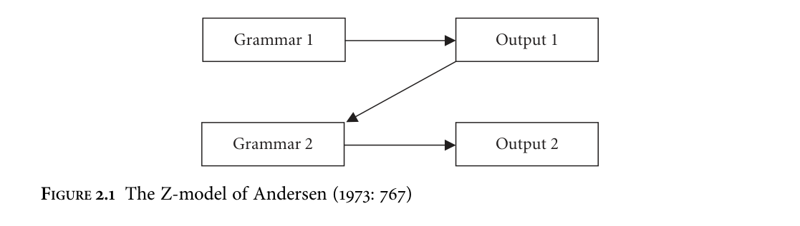

<!-- source page: 17 -->

2

A methodology for syntactic reconstruction

## 2.1 Introduction

This chapter lays out a framework for the reconstruction of syntax. To do this it is necessary to establish a clear view on the locus and nature of syntactic variation across space and time. Section 2.2 of this chapter is therefore dedicated to the question of syntactic variation: here I defend an implementation of Principles & Parameters theory known as the Borer–Chomsky Conjecture (BCC) against the criticisms of Newmeyer (2004), showing that it makes more, and clearer, predictions than Newmeyer’s rule-based alternative while remaining descriptively and explanatorily adequate. Section 2.3 addresses the question of syntactic change, arguing that it is desirable to reduce ‘language’ to individual grammars as assumed within the generative tradition, and that the task of diachronic linguistics then becomes to investigate the historical relationships between these grammars, mediated by transmission and acquisition. I also show, broadly following Roberts and Roussou (2003) and van Gelderen (2004, 2011), that directionality in syntactic change is not incompatible with this view of diachronic syntax as long as statements of directionality are reducible to properties of the acquirer’s interaction with the primary linguistic data (PLD). These serve as precursors to section 2.4, in which an attempt is made to draw parallels between lexical-phonological and syntactic reconstruction, and, where these fail, to work around them as far as possible. It is shown that the BCC adopted in section 2.2 provides a straightforward way of extending the traditional notion of cognacy to syntax, although it is not always as straightforward to establish cognacy as it is in lexical-phonological reconstruction due to the ‘correspondence problem’ raised by Lightfoot and others. I then suggest that if cognacy can be established, then the postulation of items for the protolanguage is just as easy or difficult as it is in lexical-phonological reconstruction.

<!-- source page: 18 -->

## 2.2 Modelling synchronic syntactic variation

### 2.2.1 The structure of syntactic variation

The general approach to the synchronic study of language taken here is a mentalist one, in which the object of enquiry is I-language, the linguistic knowledge of individual speakers (Chomsky 1986b; see Isac and Reiss 2008 for a recent introduction). Whatever the architecture of the innate universal endowment for language, it must be possible for the faculty of language to exist in different states, as even the most superficial glance at linguistic diversity reveals. The rest of this subsection concentrates on the form that this variation takes, since the nature of syntactic variation is crucial to establishing whether or not traditional notions such as cognacy can be transferred into the syntactic domain. This subsection focuses on the general case of variation across individuals; variation within individuals, in some sense, is another logical possibility, and this question will be addressed in section 2.2.2, since it is highly relevant to the question of the spread of linguistic changes across both space and time. The ‘primitives’, syntactic features, will be discussed in section 2.2.3. I shall take the position that the distribution of states of the faculty of language across the human population is a question that is not solely answerable in mentalist terms: in other words, that while the innate universal endowment for language delimits the hypothesis space, the state that an individual’s I-language will attain is contingent on a wide range of other factors, the incorporation of which into a model of grammar would be redundant and misleading. This ‘evolutionary’ or ‘substancefree’ position has been most clearly and frequently stated with respect to phonology (e.g. Blevins 2004; Hale and Reiss 2008; Samuels 2011), though Chomsky (1995: 17–20) emphasizes the role of ‘historical accident’ and other idiosyncrasies, and Newmeyer (2005) offers a forceful defence of the position. The historical study of syntax may shed light onto these factors, and in this sense is complementary to internalist biolinguistic enquiry, as argued in section 1.3. I thus concur with Kayne (2005) when he states that ‘there is no problem’ in the fact that a very limited number of choice points generates an astronomical number of possible grammars. There is no reason to expect the space of attested grammars to map to the space of possible grammars, or for the former to be randomly distributed among the latter, given what we know about diachrony. Furthermore, this large space does not necessarily present a learnability problem: poverty of the stimulus considerations only requires that it be logically possible to acquire language on the basis of limited input in our theory, not that it be maximally easy.1

1 In any case, most parametric theories of acquisition only require acquirers to set a limited number of parameters, not to search the space of possible grammars (Kayne 2005: 14; though cf. Yang 2002).

<!-- source page: 19 -->

The perspective I shall assume on the relation between variation and the innate endowment is as stated in (1).

```text
(1)
The Borer–Chomsky Conjecture (Baker 2008: 353)
All parameters of variation are attributable to the features of particular items
(e.g. the functional heads) in the lexicon.
```

The approach, also known as the Lexical Parameterization Hypothesis (Manzini and Wexler 1987), is associated with current Minimalist syntactic theories, but has its origins in an earlier stage of the Principles & Parameters programme (Borer 1984). Frameworks outside the Minimalist Program have also made use of the notion: Buttery (2006: 99) employs it in building a computational model of first language acquisition in Categorial Grammar, and the notion of Constructicon in Construction Grammar bears some similarities (cf. Barðdal and Eyþórsson 2012). The explanatory advantages of the approach are outlined by Borer (1984: 29):

The inventory of inflectional rules and of grammatical formatives in any given language is idiosyncratic and learned on the basis of input data. If all interlanguage variation is attributable to that system, the burden of learning is placed exactly on that component of grammar for which there is strong evidence of learning: the vocabulary and its idiosyncratic properties.

I am not the first to suggest that syntactic reconstruction should be approached on the basis of (1): the possibility is suggested by Pires and Thomason (2008: 47) and Bowern (2008: 195). However, its implications for reconstruction have not been explored in detail, and this will be the main focus of section 2.4. To fully understand the implications of the BCC it is necessary to contrast it with its conceptual predecessors. The Principles & Parameters approach, of which the BCC is usually considered part,2 originated in Rizzi (1978) and Chomsky (1981). Parameters under this view were points of variation associated with particular principles (Chomsky 1986b: 150–1). Classic examples, often seen as ‘macroparameters’, are the pro-drop parameter of Chomsky (1981) and Rizzi (1982) and the Subjacency Parameter of Rizzi (1982: 49–76). On this view, the initial state of the language faculty was seen as a ‘switchboard’ attached to UG, with various options that could be set; Chomsky (1986b: 146) attributes this metaphor to James Higginbotham. This model has come under fire from all sides in recent years (see Pica 2001; Newmeyer 2004, 2005, 2006; Boeckx 2010). Newmeyer’s critique has been particularly influential, and will briefly be discussed here, along with the response of Roberts

2 Boeckx (2010) takes a different view, distancing himself from the defence of parameters in Holmberg and Roberts (2010). However, the controversy seems to be mainly about whether it is appropriate to call the new, arguably epiphenomenal, points of variation ‘parameters’. As such the question is terminological rather than contentful.

<!-- source page: 20 -->

and Holmberg (2005) and Holmberg and Roberts (2010). Newmeyer takes issue with what he terms the ‘standard story’, given by (2) (his (8)).

```text
(2)
(a) Parameters are descriptively simple, whereas rules are (generally) not.
(b) Parameters have binary settings (an idea which is inapplicable to rules).
(c) Parameters are small in number; the number of rules is open-ended.
(d) Parameters are hierarchically/implicationally organized, thereby accounting for both order of first language acquisition and typological generalizations (there is nothing comparable for rules).
(e) Parameters are abstract entities with a rich deductive structure, making
possible the prediction of (unexpected) clusterings of morphosyntactic
properties.
(f ) Parameters and the set of their possible settings are innate (and therefore
universal). Rules are not (normally) assumed to be drawn from an innate
set.
(g) Parameter settings are easily learned, while rules are learned with greater
difficulty.
(h) Parametric change is markedly different from rule-based change (such as
grammaticalization and morphological change).
```

The thrust of Newmeyer’s argument is that the empirical expectations of the traditional Principles & Parameters model, in which it was hoped that a small number of parameters would be discovered along with ‘clusterings’ of properties, have not been met. This point is usually conceded by researchers in the framework (Baker 1996, 2008; Pica 2001). As a result, he concludes, points (a)–(h) are impossible to maintain. Instead Newmeyer advocates an alternative position in which ‘language-particular differences are captured by differences in language-particular rules’ (2004: 183). Points (a), (b), and (e) are largely issues of notation. With regard to (a), Newmeyer (2004: 189) assumes that ‘parameters are motivated only to the extent that they lead overall to more formal simplicity’, and that a descriptively adequate theory of parameters and a descriptively adequate theory of rules are notational variants of one another; hence, for him, rules should be preferred. Roberts and Holmberg (2005) do not dispute the latter assumption, but reject the former, since their motivation in positing parameters is explanatory adequacy rather than formal simplicity, and the two do not always coincide. Similarly, Roberts and Holmberg suggest that (b), binarity, is simply ‘a matter of formulation’ and thus does not bear on the issue of parameters vs. rules, since the key assumption, discreteness, is shared by both. Point (e) can be treated likewise: both rules and (macro- and micro-)parameters can predict clusterings if properly formulated; obviously the extent to which the clustering holds is an empirical question. With regard to (c), Newmeyer’s case is stronger: he points out that, if we take the ‘switchboard’ approach, then a parametric model becomes increasingly evolutionarily

<!-- source page: 21 -->

implausible under the assumption that those parts of the language faculty related to syntax are most likely to have evolved via a simple mutation (cf. Berwick and Chomsky 2011: 29). The question is then one of ‘evolutionary adequacy’ (Longobardi 2003). Roberts and Holmberg (2005) concede this point, suggesting that ‘parameters are not really primitives of UG, but rather represent points of underspecification which must be filled in in order for the system to become operative’. Under this view, compatible with the BCC, parameters are no longer genetically specified (in any direct sense), and the switchboard metaphor is no more than a metaphor. Point (d) relates to the hierarchies of parameters developed by Baker (2001) and subsequent work. In this view there are implicational relationships between parameters, such that, for instance, a language only has a value specified for the Subject Placement parameter if it has a positive value for the Verb Attraction parameter, which in turn only has a value specified if the Subject Side parameter is set to ‘beginning’ rather than ‘end’. Newmeyer (2004: 199–201) raises a large number of empirical problems for Baker’s (2001) parameter hierarchy, and implies on this basis that the attempt to develop such hierarchies is futile: ‘they do not work’ (2004: 201). Roberts and Holmberg (2005) take issue with this, and suggest that the predictive power of such hierarchies is worth the difficulty of attempting to establish them. In more recent work (e.g. Holmberg and Roberts 2010), specific implementations of parameter hierarchies have been proposed, along with the suggestion that macroparameters are aggregates of microparameters acting together (cf. also the ‘principles and schemata’ approach of Longobardi 2005).3 Assuming the underspecification view of ‘parameters’ sketched in the previous paragraph, such hierarchies, if they can be established in such a way as to be plausible empirically and from the point of view of acquisition, are in principle compatible with the BCC insofar as they are taken to be epiphenomena, not genetically specified per se but representing a way in which we can understand the learning process. This is close to the way in which these hierarchies are understood by Holmberg and Roberts (2010: 51), who suggest that they ‘arise from third-factor properties’ in the sense of Chomsky (2005: 6). The question of hierarchical organization, then, remains an open one. Points (f ), (g), and (h) are related in that innateness feeds into learnability, which in turn feeds into change, and in all cases Newmeyer assumes that ‘parameters are complemented by rules in the marked periphery’ (2004: 213). If such a periphery exists and is acquirable, he argues, then ‘learners have to acquire rules anyway’, and this undermines the need for a distinct parametric core. In their response, Roberts

3 This is comparable to the view sketched by Baker (2008: 354 n. 2) according to which ‘languages can differ in the properties that large classes of lexical items have’. A model of variation based on this notion, along with ‘generalization of the input’ (see section 2.3.2), is highly compatible with the conception of regularity in syntactic change outlined in Walkden (2009: 38–40) and in section 2.4. In this model it may be that the notion of hierarchy can be dispensed with.

<!-- source page: 22 -->

and Holmberg (2005) argue that this assumption is unnecessary, and that there is no need for a ‘marked periphery’ (following the mainstream view; though cf. Smith and Law 2009). They concede that Lightfoot’s (1991) diagnostics for parametric change as opposed to rule-based change are not reliable, as argued by Harris and Campbell (1995: 37–45). Instead they suggest a model in which there are only two types of change: parametric change and lexical change.4 In the model I assume here, based on the BCC, there is only one type of change, namely lexical change. In any case, I concur with Roberts and Holmberg (2005) that the issue is not a telling one with regard to parametric theory in general. Roberts and Holmberg’s (2005) main objection to Newmeyer’s proposal is that the alternative he suggests, language-particular rules, is unrestrictive. Newmeyer (2004: 185) in fact acknowledges this potential criticism but does little to stave it off, beyond arguing that performance factors may be implicated in shaping individual grammars. The influence of such factors is in my view inevitable, and here I find Newmeyer’s argument compelling; see section 2.3. But issues with the rule-based alternative remain. As Holmberg and Roberts (2010: 25) point out, the class of potential rules is infinite, giving rise to a potential acquisition problem. Furthermore, it is not clear what the primitives of a rule-based system are, or what constrains them. Newmeyer states his rules in natural language, as in (3).

(3) English: Complements are to the right of the head. (2004: 184)

But nothing in Newmeyer’s system prohibits the introduction of rules such as (4).

(4) Move the second word in the sentence to the beginning of the sentence.

However, it has long been known that acquirers do not posit rules such as (4): this restriction is known as structure-dependence (Chomsky 1957). It is not straightforwardly possible to formulate a lexical specification equivalent in derivational outcome to (4), assuming the BCC. It will not do to point at performance factors to explain the unviability of (4); the rule is certainly logically possible, and toy ‘languages’ can be constructed that make use of such a rule without becoming unprocessable. At the very least a plausible argument from performance against rules such as (4) would need to be constructed. The rule-based alternative seems, then, to be too permissive. In sum, a view of syntactic variation based on the BCC (1) is demonstrably superior, in terms of descriptive and evolutionary adequacy, to the traditional approach adopted

# 4 A reviewer also suggests that there may be an important distinction to be drawn between lexical

change, qua change in the properties of open-class lexical items, and change in the inventory of functional heads (closed-class items). This is also suggested by the mention of functional heads in the definition of the BCC in (1). While in principle this distinction may prove important, the trouble is that it is difficult to draw a firm line between the two: for instance, are prepositions lexical or functional (see Mardale 2011)?

<!-- source page: 23 -->

within the Principles & Parameters framework, while at the same time being immune to the bite of Newmeyer’s (2004) criticisms of the latter. Furthermore, while not being overly restrictive, it makes more, and clearer, predictions about possible languages than the rule-based alternative advocated by Newmeyer.

### 2.2.2 The question of free variation

In linguistic theory, a postulate such as (5) is commonplace.

(5) Blocking Effect Within a grammar, interpretatively identical lexical items cannot exist.

Motivation for (5) comes from two different sources. First, as well documented for morphology (Aronoff 1976) and imported into syntax by Clark (1992) and Kroch (1994), such an effect seems to be a reasonable empirical generalization, at least to a first approximation. Children who overgeneralize regular morphology during the acquisition process, for instance, do not admit variation between regular and irregular forms when they eventually learn the latter (Kroch 1994: 6). Furthermore, on the lexical level, formations such as clearness appear to be blocked by pre-existing competing forms such as clarity (Kroch 1994: 8). Kroch views the effect as ‘a global economy constraint on the storage of formatives’ that is active during acquisition (1994: 17), and argues that ‘there are good conceptual reasons to accept the universality of the blocking effect’. Assuming the BCC, (5) applies to syntax as it does to the rest of the lexicon. Second, a version of the Blocking Effect can also be derived from the principles of early Minimalism, namely Last Resort (‘don’t do too much’) and Full Interpretation (‘don’t do too little’); see Chomsky (1995), Biberauer and Richards (2006). Fox (2000) and Reinhart (1995) argue on this basis that ‘optional’ operations are only permitted when they allow an interpretation that would not otherwise be available: in other words, ‘an optional rule can apply only when necessary to yield a new outcome’ (Chomsky 2001: 34).5 Optionality understood this way, then, is not optionality at all. In addition to (5), two further assumptions often implicitly adopted are (6) and (7), which will be elucidated in what follows.

(6) Monoglossia A single speaker has a single grammar for a single language.

```text
(7)
Derivational Determinism
For a given selection of lexical items, there is only one possible derivational
outcome.
```

5 The original rationale, as proposed by Fox and Reinhart, is not available in current Minimalism, since Last Resort and comparison of derivations are no longer admitted. Chomsky’s formulation therefore follows from nothing directly, though can be argued to be a ‘third factor’ effect.

<!-- source page: 24 -->

The conjunction of (5), (6), and (7), however, excludes the possibility of ‘free variation’ at the individual level, in the traditional sense of interpretatively vacuous alternations. To avoid this consequence, there are three obvious options: deny (5), deny (6), or deny (7). All of these options have been proposed in the literature, and I will discuss each in turn. The most commonly taken option is to deny (6), the assumption of monoglossia. The theory of ‘competing grammars’ resulting from this is due to Kroch (1989, 1994), who maintains that the Blocking Effect holds within individual grammars but that grammars can compete with one another within the mind of a single individual, with cognitive/acquisitional pressures then leading to one grammar being favoured over the other in diachrony (see also Yang 2002). Competing grammars theory has been applied to various languages, particularly historically attested ones, e.g. Pintzuk (1999) on OE. Several considerations speak in favour of a variant of this approach. Most important is the fact that (6) must be rejected in any case, since it is entirely possible for individuals to be natively bilingual, and indeed bidialectal (see e.g. Roberts 2007: 324). The innovation is the extension of this concept of ‘syntactic diglossia’ to more fine-grained intra-speaker differences. It is worth noting that, although studies in the competing grammars framework have typically assumed a theory of syntax containing headedness parameters rather than the asymmetric view due to Kayne (1994) and adopted here, nothing about the framework per se requires such a theory: a Kaynean view of linearization is perfectly compatible with competing grammars, as shown by Wallenberg (2009: 117), who develops an account involving both. Another necessary clarification is that ‘competing grammars’ are not thought to involve massive redundancy for the many identical features involved; instead, the two grammars share a large amount of material (under the approach adopted here, to be understood as lexical items), diverging only where differences are found. Since (6) is so obviously false, some form of the competing grammars hypothesis must be correct. However, certain problems remain.6 As Roberts (2007: 325) notes, the concept of ‘syntactic diglossia’ is often generalized to cases in which no functional motivation for the use of one or other grammar is adduced. For instance, in the work of Pintzuk (1999, 2005), grammars with head-initial IP and head-final IP are argued to be at work in a single OE text, Alfred’s translation of Gregory’s Cura Pastoralis, but no discussion is provided of the contexts in which each grammar is appropriate; indeed, there seem to be no such contexts, and there is then no principled distinction to be drawn between the competing grammars approach and positing ad hoc ‘diacritic’ features [+F], [–F]. This becomes a problem when we examine the notion of ‘grammar’. Kroch (1989, 1994) does not provide an explicit

6 The argument that competing grammars give rise to learnability problems is controversial (cf. Kroch 1994: 184, 2001: 722; Niyogi 2006: 336; Roberts 2007: 328), and I do not consider it further here.

<!-- source page: 25 -->

definition of this notion, which must therefore remain intuitive. But the notion is problematic in the context of the BCC. Since differences between grammars are attributable to differences in lexical items, the only sensible way to view competing grammars under the BCC is as two separate mental bins that separate, for instance, the lexical items that constitute a ‘high’ grammar from those of a ‘low’ one (in the terminology of Ferguson 1959). This is not clearly distinguishable from the result of postulating lexical features [+high] and [+low] (or [+English] and [+French]). As I will argue in the next section, this is not an unreasonable way of representing conceptual knowledge, and obviates the need for reference to the ill-defined concept of ‘grammars’. But in cases where the two grammars are not functionally/contextually distinguishable, simply [+Grammar1] and [+Grammar2], we would expect the Blocking Effect in (5) to rule out the postulation of two separate grammars just as it would rule out two interpretatively identical lexical items.7

My conclusion as regards competing grammars, then, is similar to that of Roberts (2007: 331): in principle they represent a useful tool for understanding variation and the process of change, but they need to be employed with caution, as positing two grammars in free variation is no more plausible than postulating two lexical items in free variation. In addition, I have suggested that what have been called ‘competing grammars’ are better viewed as ‘competing lexical items’ like any others, with distinct feature specifications. Henry (1995, 2002; Wilson and Henry 1998) takes a different route, rejecting the Blocking Effect in (5). She concludes (from debatable premises) that competing grammars are unable to allow for differing frequencies of use across sentence types and for stable variation across long periods of time, and criticizes Kroch for failing to ‘grasp the nettle’ (2002: 272) and accept variability within a single grammar: ‘a better characterization seems to be that individual structures/parameter settings are variable, rather than that there are actually separate grammars’ (2002: 274). Adger (2006a) likewise rejects (5), or at least weakens it. In Adger’s scheme (2006a: 510), featurally identical lexical items may not exist, but featurally non-identical lexical items may be non-distinct in their contribution to interpretation as long as they differ only in uninterpretable features. Interpretatively identical lexical items with differing feature specifications can thus coexist: Adger refers to this as ‘underspecification’. Since I find the empirical and conceptual arguments for (5) compelling, not least because it enforces greater restrictiveness in theory-construction, I cannot here adopt Henry’s or Adger’s account of variability.

7 This problem is particularly severe for the model of acquisition of Yang (2002), in which the proliferation of vast numbers of probabilistically activated grammars during acquisition would be predicted to remove all semblance of discreteness in child linguistic judgements and production of possible variants, rendering the Blocking Effect vacuous.

<!-- source page: 26 -->

A third possibility is explored by Biberauer and Richards (2006) and exploited for diachronic purposes in Biberauer and Roberts (2005, 2008, 2009). The core of their proposal is that, while movement-triggering EPP features associated with agreement relations must be satisfied, the computational system simply ‘doesn’t mind’ whether they are satisfied by movement of the Goal alone or by pied-piping of additional structure. In modern spoken Afrikaans, for instance, an alternation between embedded V-final and V2 obtains, as in (8) and (9), and is claimed to be semantically vacuous.

```text
(8)
Ek
weet
dat
sy
dikwels
Chopin
gespeel
het
I
know
that
she
often
Chopin
played
has
```

```text
(9)
Ek
weet
dat
sy
het
dikwels
Chopin
gespeel
I
know
that
she
has
often
Chopin
played
‘I know that she has often played Chopin.’
```

This is derived if the finite verb is in T0 and the EPP feature of T0 may be satisfied either via movement of the DP subject from SpecvP to SpecTP, yielding V2, or via piedpiping of the entire vP. Though (5) and (6) are maintained in Biberauer and Richards’s (2006) account, then, the assumption of derivational determinism (7) is abandoned, since one and the same numeration may lead to different outcomes at the interface. Though the account elegantly exploits a loophole in Minimalist syntactic theory with regard to satisfaction of movement-triggering features, some of the assumptions it makes are not uncontroversial. In particular, it is not clear that it is more Minimalist for the grammar to be indifferent with regard to the size of the moved category; one might alternatively expect that in such cases the category moved would always be the smallest possible structure, in order to minimize ‘heavy lifting’, as proposed by Chomsky (1995: 262) (or indeed the largest, in order to maximize the amount of lifting being done in one go). Biberauer and Richards (2006) do not argue for the ‘computationally innocuous’ nature of their system as opposed to these alternatives. Similarly, the data does not support their account of variability over others, since it is possible to account for it in other ways, for instance in terms of competing grammars (cf. Wallenberg 2009: 100–45). Most problematically, the abandonment of (7) leaves it entirely unclear what determines which of the two options will be taken in a given derivation. Biberauer and Richards imply that nothing determines this choice. But this cannot be the case, since such a nondeterministic algorithm is unimplementable: faced with complete indeterminacy, the derivation must ‘roll the dice’ or crash, neither of which are desirable outcomes. It is also not clear that the approach of Biberauer and Richards (2006) can be generalized to all cases of syntactic variation beyond Germanic verb position.8

8 A dramatically different approach to the question of free variation is to encode probabilities in the grammar itself, as in Stochastic Optimality Theory: see Clark (2004) for an application of this to historical syntax.

<!-- source page: 27 -->

I have argued, then, that none of the approaches to the ‘question of free variation’ has succeeded in solving it without considerable cost: the abandonment of (6), though it is trivially false, does not resolve the situation, and (5) and (7) cannot reasonably be abandoned. There is, however, a fourth possibility, namely the rejection of the implicit assumption made throughout this section: that free variation exists. Obviously, if free variation did not exist then predicting its non-existence would not be a problem. In fact, the history of syntactic research reveals a gradual whittling down of the numbers of cases of what appear to be free variation. As Diesing (1992, 1997) shows, for instance, the possibilities for scrambling in the German Mittelfeld, which on the surface exhibit a great deal of freedom, are actually restricted by subtle considerations of specificity and scope:

```text
(10)
Er
hat
oft
ein
Buch
gelesen
he
has
often
a
book
read
‘He often read a (non-specific) book.’
```

```text
(11)
Er
hat
ein
Buch
oft
gelesen
he
has
a
book
often
read
‘There is a book that he often read.’
```

Similarly, in recent years the alternation between V2 and non-V2 in Mainland Scandinavian subordinate clauses has been shown to be related to illocutionary force (Julien 2007; Wiklund 2010). If the considerations in this section (including (5)–(7)) are on the right track, then true free variation is psychologically implausible. Biberauer and Richards (2006) claim that ‘true, semantically vacuous optionality is . . . prevalent in human language’; however, apparent cases may reduce to instances of variation with subtle conditioning, which may not be ‘semantic’ in the strict (truth-conditional) sense, but rather functional or contextual. I take it that the conceptual-intentional component of the mind contains such notions in a way to be elaborated upon in section 2.2.3. At any rate a methodological point must be made: our inability to perceive the conditions on variation does not mean that those conditions do not exist.9 Roberts (2007: 331) makes a similar point:

we cannot exclude the possibility that the competing grammars postulated by Kroch, Pintzuk, and others for the early stages of various languages for which we have little or no sociolinguistic information, did have a social value whose nature has been completely obscured by the passage of time and the nature of the extant texts.

9 It is telling that those languages for which the competing grammars framework has been most heavily used in its ‘diacritic’ form are those with no living native speakers, e.g. earlier stages of English, French, and Yiddish.

<!-- source page: 28 -->

Extrapolating from an artefact of our methodological limitations to making an ontological claim about the status of variation in a historically attested language is clearly a category error. A reviewer objects that studies of sound change in progress show that sometimes ‘there is simply probabilistic variation’, and even that ‘all social conditioning of linguistic variants is stochastic in nature’. However, no such thing has been demonstrated: all that can be shown (from a falsificationist perspective) is that the factors so far explored do not deterministically capture all variation. It is not possible to demonstrate that there is no factor such that, when properly understood, a deterministic account will be possible. That is, whenever we assume probabilistic variation, we are either ontologizing ignorance on the part of the researcher—see, for instance, Hale’s (2007: 180–90) discussion of Bresnan and Deo’s (2001) ‘Fallacy of Reified Ignorance’—or assuming an unfalsifiable hypothesis. In effect, then, the only methodologically sensible interpretation of probabilistic variation is an epistemic one. In what follows I will therefore assume, where I am unable to establish the exact nature of a conditioning factor, that such a factor existed in the form of a lexical feature of some kind. Admission of ignorance is only healthy.

### 2.2.3 Syntactic features

In this subsection I discuss the features entering into syntactic computation. First, observe that the alternation between (12) and (13) is not normally taken as parallel to the alternation between (14) and (15).

```text
(12)
Thus you have washed the dishes.
(13)
Thus have you washed the dishes.
(14)
You have washed the dishes.
(15)
Have you washed the dishes?
```

In (15), it is usually assumed that there is a feature present in the derivation that is absent in (14), for example [Q] associated with C0 (e.g. Radford 1997: 108), and that its presence is related to movement of the auxiliary. By contrast, (13) has a markedly more archaic flavour than (12), yet it is not usual to account for the difference in terms of a feature [archaic] associated with C0 in this case. Instead, it is usually assumed that the speaker has access to multiple varieties, and that a ‘user’s manual’ regulates the choice between them (e.g. Culy 1996: 114). The question is: why are these two alternations not treated in a parallel fashion? In what follows I argue that there is no principled reason for this disparity, and that ‘social knowledge’ should be treated as part of the lexicon, with the possibility to ‘enter into’ syntactic computation. In approaches to phonology that are similar to the one that I assume here for syntax, it is usually assumed that among the universal aspects of phonological knowledge, alongside some combinatorial process for constructing phonological

<!-- source page: 29 -->

representations, are phonological features (Blevins 2004: 41; Samuels 2011: 576). However, these features are substance-free in that their phonetic interpretation does not play a role in phonological computation, as Samuels emphasizes. A crucial consideration pointing in this direction comes from signed languages: although it is uncontroversial that these languages have phonology (see e.g. Brentari 1998), it is even clearer that the phonological primitives cannot make reference to, for example, bilabial articulation, or voicing; see Mielke (2008) and Samuels (2009: 46–72) for extended arguments against the innateness of specific distinctive features in phonology and in favour of an ‘emergent’ alternative. What is universal, then, can only be a schema for features rather than contentful features themselves. If hooked up to different production and perception systems, phonological computation may operate identically on a different set of primitives. I would like to suggest that the same is true of syntactic features. Specifically, universally available is a format for features, which (consistent with section 1.3) I assume is an attribute–value pairing. In addition, there is an Edge Feature marking a lexical item as a phase head, and the possibility for a diacritic^triggering movement.10 The semantic–pragmatic specifics of features are taken not to play a role in the syntactic computation per se. This picture seems consistent with a Minimalist view of the syntactic component; in the ideal case, even these few specifications are (virtually) conceptually necessary. The intuition is that, if hooked up to a different conceptual-intentional system, syntactic computation may operate identically on a disjoint set of primitives. It follows that there is no set of features ‘provided by UG’ in the sense of being specified in the syntactic component. Whether there is a set of semantically or pragmatically universal features, of course, remains an open question, as does the issue of the cartographic hierarchy: insofar as it is correct (see e.g. Nilsen 2003), it must be derived exclusively from semantic/conceptual considerations rather than encoded as a selectional sequence of heads as implied in Cinque (1999). Again, from a Minimalist perspective I take this to be a welcome result. Questions of learnability also play a role in what features enter into the syntax, of course: as Plaster and Polinsky (2010) emphasize, acquirers cannot be expected to build linguistic systems around complex, culture-specific conceptual-semantic information to which they have no access. The approach taken here is similar to that of Zeijlstra (2008). In terms of Zeijlstra’s Flexible Formal Feature Hypothesis, features are analysed as formal features able to project a functional projection if doubling is present in the input during acquisition (2008: 145). Abstracting away from his implementation and the question of whether doubling is a correct diagnostic, the crucial point is that positive evidence is required

10 I do not take a stance here on the issue of c-selection features.

<!-- source page: 30 -->

in the primary linguistic data in order for a feature to be analysed as ‘formal’ and enter into syntactic computation.11 Like the present approach, this hypothesis avoids ‘stipulating a set of formal features that is uniform across languages’ (2008: 145). Once these considerations are taken into account, there is no reason to distinguish between traditional ‘semantic’ features such as tense and negation and more ‘social’ features such as register. This too is a welcome result, for various reasons. First, it allows us to bring alternations such as that between (12) and (13) within the ambit of syntactic theory and out of the less well-understood realm of the ‘user’s manual’; in fact, it renders the notion of such a manual redundant. Second, it meshes with a body of work on ‘social meaning’ (e.g. Campbell-Kibler 2010) that focuses on social knowledge as it enters into cognition; this type of knowledge is compatible with, and in fact presupposes, a mentalist approach to language. Note that there is no blurring of the competence–performance distinction here. Society and social situations do not enter into the theory; knowledge of language and use of language are kept strictly separate, with knowledge of the situational appropriateness of specific linguistic forms a part of the former. The theory of variation expounded upon here remains a theory of competence.12

Culy (1996), after considering three theories of null objects in English recipes and concluding that an empty-category approach is the most promising, does an aboutturn and abandons the approach on the basis that ‘the regularities of registers . . . should not be expressed in the grammar per se’ (1996: 112). Culy does not provide justification for this perspective beyond asserting that ‘we must distinguish between a language and its uses’; while I agree with this statement, it is still possible and necessary to incorporate knowledge of use into a theory of linguistic knowledge, as I have argued.13

To summarize section 2.2, the main features of the model of syntactic variation I have proposed are presented in (16).

```text
(16)
(a) The human language faculty delimits the space of possible grammars.
(b) ‘Parameters’ are attributable to differences in the feature specifications of
lexical items (the BCC).
```

11 The precise definition of PLD varies in the literature, as noted by Hale (1998: 1 n. 1). I here take it to be the input to the linguistic learning system in the acquirer’s mind rather than a raw acoustic stream. 12 For other critiques of the strict separation of social and grammatical knowledge, see Hudson (1996), Bender (1999), and Paolillo (2000). The approach taken here is similar to that of Bailey (1996) in modelling the varieties at the speaker’s disposal within a single grammar: Bailey himself, however, rejects the notion that social knowledge should be part of the grammar per se (e.g. 1996: 61). 13 Cf. Bender (1999) for further critique. Culy’s further claim that a null pronoun analysis involves ‘complicating the ontology of categories’ (1996: 113) by admitting empty categories would not be taken seriously by many researchers nowadays, since the motivation for phonologically null elements has been repeatedly demonstrated independently of this specific case.

<!-- source page: 31 -->

(c) For some features of individual grammars or apparent generalizations, a historical explanation may be more enlightening than a synchronic one (‘substance-free’ or ‘evolutionary’ syntax). (d) There is no such thing as ‘free variation’. (e) The set of features that enter into syntactic computation is not universal, but those features have a universal format. (f) ‘Social’ and ‘pragmatic’ features as well as ‘semantic’ features may enter into syntactic computation, which is blind to featural content.

With these points in mind, let us turn to variation over time, and change.

## 2.3 Modelling diachronic syntactic variation

### 2.3.1 I-language, acquisition, and change

The approach to syntactic change taken here is based on the approach to syntactic variation outlined in section 2.2. In that sense it is an ‘I-language approach’, in the tradition of Lightfoot (1979, 1999, 2006), Hale (1998, 2007), and Roberts (2007), among others.14 It is important to realize, however, that there can exist no pure I-language approach to diachronic syntax, in that a crucial element of all diachronic linguistics is the postulation of historical relations between grammars. Crisma and Longobardi (2009: 5) provide a semi-formal version of this implicit notion:

```text
(17)
An I-language L2 derives from an I-language L1 iff
(a) L2 is acquired on the basis of a primary corpus generated by L1, or
(b) L2 derives from L3 and L3 is derived from L1.
```

```text
(18)
H-relation: Two linguistic objects X and Y (I-languages or subparts of them)
are in an H-relation if and only if one derives from the other or there is a
Z from which both derive.
```

Change, then, refers to the case in which L1 and L2 are non-identical. It is straightforward to see that this definition is not free of E-language notions. The idea of ‘primary corpus’ itself, for instance, cannot be defined in I-language terms: since we know that speakers cannot pass structures directly to hearers, the primary corpus must be a set of sentences, plausibly a proper subset of the weak generative capacity of L1. But weak generative capacity is an E-language notion, as Chomsky (1986b:

14 The idea that ‘language is not an object which has a reality of its own independent of its speakers’ is associated with Chomskyan linguistics, but was also an important founding principle of the Neogrammarian school, setting them apart from earlier thinkers such as Schleicher (Morpurgo Davies 1998: 230–3). Under the Minimalist assumption that the syntactic component itself is invariant, with change limited to the lexicon (the BCC), syntactic change as such does not exist; this point is made by Hale (1998, 2007). Though this may seem a terminological triviality, the BCC does have consequences for a theory of change, as section 2.4 shows.

<!-- source page: 32 -->



149–50 n. 89) makes clear. Moreover, it is not a random subset, since the sentences that the primary corpus consists of are determined by all sorts of contingent facts about the environment, the desires and motivations of the speaker, which way the wind is blowing (determining whether or not the sentences are audible to the hearer), etc. In addition, since speakers are fallible in production, speech errors—sentences that are not generated by L1—may occur as part of the primary corpus, such that the primary corpus can no longer even be defined as a proper subset of L1’s weak generative capacity. Furthermore, the definition in (17) is insufficient in a crucial respect: the ‘primary corpus’ on the basis of which L2 is acquired is, in the standard case, not generated by the grammar of a single individual: rather, it consists of sentences uttered by many different individuals, e.g. parents, carers, and peers, who may very well have grammars that differ in subtle ways. In other words, the classic ‘Z-model’ of language transmission due to Andersen (1973), given in Fig. 2.1, is an idealization that is untenable.15 By consequence, the notion of H-relation in (18) becomes either very permissive or very restrictive: is L2 in an H-relation with all of the grammars underlying the primary corpus? Does this hold when one of these grammars is of a different ‘dialect’, or a different ‘language’, or in the case that the primary corpus contains sentences produced by a second-language speaker? And how do we define ‘change’? All this is not to say that a more adequate definition of historical relation could not be formalized; merely that such a definition would inevitably require reference to non-I-language notions. As Andersen (1973) makes clear, the transmission of language must pass through the gulf between speaker and hearer, through a cloud of murky E-language.16

15 For technical discussion of this idealization, and an attempt to establish a class of models of acquisition that do not assume it, see Niyogi and Berwick (2009). 16 For this reason I reject Lightfoot’s (2006: 66–86) characterization of work such as Gibson and Wexler (1994) and Clark (1992) as ‘E-language approaches’ to acquisition, as opposed to his own ‘I-language approach’; in fact, all three of these works subscribe to the E-language/I-language distinction, differing only in that they model the interaction between innate capabilities and experience in varying ways. Lightfoot, however, is usually careful to highlight the relevance of E-language notions to historical syntax (see e.g. 2006: 15).

<!-- source page: 33 -->

It is clear that a diachronic linguistics without historical relations would be toothless and bizarre.17 As Hale (1998: 1) observes:

If we adopt I-language as the proper object of study for diachronic linguistics, as it is for synchronic, such traditional questions as ‘How was V2 lost in English?’ cease to be sensible. In spite of this seemingly dire consequence, I will argue here that, contrary to much theoretical work in the area of historical linguistics, we must make I-language the object of our study.

Although Hale correctly identifies this consequence as dire, he does not draw the obvious conclusion: if the questions we want to ask turn out to be unformulable in purely I-language terms, then a purely I-language approach to historical linguistics must be rejected.18 In Hale’s approach to the pretheoretical notion of ‘change’, however, such questions are not in fact unformulable, and can be answered with reference to an actuation event (Weinreich, Labov, and Herzog 1968: 102; Hale’s sense of the word ‘change’) plus an explanation of its diffusion. Although Hale classes diffusion as ‘simply not an I-language phenomenon’ and thus ‘irrelevant for those interested in studying the properties of I-language’ (1998: 6), he closes his article by discussing ‘the loss of [a] . . . property of Latin on the way to Romance’ (1998: 16–17): this ‘loss’ (a change in the pretheoretical sense) must involve both actuation and diffusion, of course, and is stated here not in terms of individual grammars but in terms of vague E-language notions (‘Latin’ and ‘Romance’). There is nothing wrong with this; indeed, there is no other approach to historical linguistics. The point is simply that the questions that historical linguists are interested in asking cannot be answered exclusively by reference to I-language. This does not, of course, entail that we should give up on looking at I-language; in fact, I argue in what follows that thinking of ‘change’ in I-language terms enables us to gain a much better understanding of it, following Hale, Lightfoot, and others. The actuation–diffusion distinction, as Hale views it, is also not clear-cut from a nuanced I-language perspective. Diffusion, for Hale, ‘represents the trivial case of acquisition: accurate transmission’ (1998: 5). However, once we allow that the input to the acquirer may consist of data generated by multiple grammars, the question then becomes: accurate transmission of what? Hale rejects the view expressed in Niyogi and Berwick (1995) and Lightfoot (1997) that ‘mixed PLD’ may be involved in change, suggesting that this is ‘strongly counterindicated by known observations regarding the acquisition process’ (1998: 4), observing that children exposed to an environment in which 70 per cent of their input is in French and 30 per cent in English do not typically acquire a ‘mixed’ grammar. However, it is then asserted that

17 Faarlund (1990: 32) makes a similar point: ‘If a language only exists in the minds or brains of each individual speaker, then it will die with the speaker. Thus it does not make sense to talk of linguistic change except in the trivial case of changes in one person’s language through his or her lifetime.’ 18 On this basis, Bailey (1996: 244) denies the fruitfulness of the I-language (‘static’, ‘minilectal’) approach altogether.

<!-- source page: 34 -->

‘acquisition of multiple “dialects” of one “language” is just as trivial as is the acquisition of multiple “languages”’, and that therefore ‘acquisition of more than one grammar (given sufficient exposure to both) is the only outcome we should be considering’ (1998: 4–5). While it is true that there is no distinction between ‘language’ and ‘dialect’ in I-language terms, it does not follow that the acquirer will always be capable of discerning which grammar underlies the input. While ‘English’ and ‘French’ grammars are sufficiently different to render this possible, it is not necessarily so easy when the two input grammars are varieties of ‘English’ that differ in subtle ways: here it is conceivable that the acquirer would be unable to distinguish. There is no logical basis, then, for the implicit denial that acquirers ever conflate input from different sources, and hence no argument against ‘mixed PLD’ explanations for change. Moreover, even assuming that a definition of historical relation can be formulated that distinguishes actuation and diffusion on a principled basis, some cases of apparent diffusion as ‘accurate transmission’ may nevertheless in fact be instances of ‘multiple reactuation’, where the same actuation process is triggered in multiple speakers (see Willis 1998: 47–8). Hale simply states that this ‘does not seem a priori particularly likely’. (See also the discussion of transmission and diffusion in section 2.3.4.) In the preceding discussion it has been assumed that, taking an I-languageinformed view of historical linguistics, an instance of ‘change’ can be defined as two distinct grammars in a historical relation with one another. This is presumably what authors such as van Kemenade (2007: 156) mean when they refer to ‘grammar (I-language) change’; if this and only this is to be classed as ‘change’, it follows that the locus of language change is language acquisition, as van Kemenade argues. Another logical possibility, of course, is change in the I-language over the course of a speaker’s lifetime. This possibility is usually glossed over by generative syntacticians interested in historical linguistics: Crisma and Longobardi assert that ‘within an I-language, there seems to be no such a thing as change’ (2009: 4), though they admit that changes do in fact occur later in life (2009: 5).19 Hale (1998) does not mention change during the lifetime. Faarlund (1990: 9) claims to defend ‘on the basis of logical inference’ that the locus of linguistic change is language acquisition by new generations. This logical inference seems to amount to stipulation: although ‘the internalized grammar of an adult speaker may change’, Faarlund states that ‘such changes do not constitute a diachronic linguistic change until a future generation of speakers have adopted the mixed system as their own’ (1990: 10). There is by now substantial evidence that speakers’ grammars may change in non-trivial ways throughout their lifetimes. For instance, Sankoff and Blondeau (2007) demonstrate a change from apical to posterior /r/ in Montreal French, and Wagner and Sankoff (2011) discuss a syntactic change, namely replacement of the

19 In addition to the obvious case of the radical changes that take place within a single I-language during acquisition.

<!-- source page: 35 -->

inflected future with the periphrastic aller ‘to go’ + infinitive, in which age-grading in a retrograde direction is found. Assertions such as that of Meisel (2011: 123) that such lifespan changes ‘do not involve reanalyses of grammars’ (see also the ‘A-rules’ of Andersen 1973) simply beg the question. The claim that the locus of language change is language acquisition, then, is subject to the same criticisms that Campbell (2001: 133) levels at the notion of unidirectionality in grammaticalization: either it is built into the definition of I-language approaches to syntactic change (as with Faarlund 1990), and is thus true but empirically vacuous, or is an empirical hypothesis stating that I-language change during the lifespan does not occur, and is false.20

However, this should not be taken to undermine the thesis that first language acquisition is of great importance for language change. Evidence for a ‘critical period’ in acquisition, a hypothesis first proposed by Lenneberg (1967), has accumulated over the years.21 The central idea is that the interaction between the innate human capacity for language and the PLD is different in young children from that of adults. Much acquisition research is devoted to exploring the extent of this difference, the ages at which it holds, whether there is a precise cut-off or rather a tail-off in acquisition ‘ability’, and whether the differences are qualitative or quantitative, and these are all interesting empirical questions; see Hawkins (2001) and White (2003) for two generative introductions, and Meisel (2011) for a recent discussion bearing on diachrony. Though it has its origins in the mentalist approach to language, some version of the critical period hypothesis is accepted by all serious linguists nowadays (see e.g. Dahl 2004: 294; Trask 1999: 63–4; Trudgill 1989, 1996, 2011: ch. 2). While Hale (2007: 44) states that he does not believe in ‘what is sometimes called the Critical Age Hypothesis’, it is clear that this relates to a very strong version of the hypothesis, since three pages earlier he suggests that ‘adults may be highly constrained in the types of changes they can make to their grammars’ (2007: 41). Though the details are controversial, then, the central idea is not. One striking piece of evidence comes from the creation of a new signed language, Idioma de Señas Nicaragüense, in Nicaragua, reported by Kegl, Senghas, and Coppola (1999). According to these authors, this language was created virtually ex nihilo by first language acquirers under 10 years old, who converted a range of idiosyncratic homesign systems into a fully-fledged natural language (1999: 180). Discussion of the implications of this

20 As a reviewer points out, however, all demonstrated cases of language change across the lifespan have so far involved relatively subtle changes in frequencies rather than the emergence of radically new structures. Further research into whether there is in fact a qualitative difference between acquisitiondriven change and change across the lifespan is an urgent desideratum. 21 Pace Roberts (2007: 322), the existence of a critical period is not necessary to account for the independent fact that the amount of data available to the acquirer is finite (Niyogi and Berwick 1995: 2; Niyogi 2006: 19); this fact already follows from human mortality, in conjunction with limitations on production and perception. The existence of a critical period serves to reduce the amount of relevant data even further, though.

<!-- source page: 36 -->

incident, and of the critical period hypothesis in general, for diachrony can be found in Lightfoot (2006: 156–66) and Roberts (2007: 427–38). A major advantage of incorporating the study of I-languages into historical syntax, then, is that we can apply our conceptions of the processes of acquisition—whether gained through experimental work or computational simulations such as those of Niyogi and Berwick (1995), Yang (2002)—to help us characterize the changes that we see. This includes differences in approach between adult learners and young children when faced with the same set of data (see also section 2.3.4). Paul (1880) is usually credited with being the first to highlight the importance of first language acquisition for diachrony. Crucially, it is not clear how these insights could be incorporated in a non-reductionist theory of diachrony in which languages, in the pretheoretical sense, are taken as abstract objects moving along a vector in a multidimensional phasespace, such as that of Lass (1997: 370–83).22 I will not commit to a specific model of acquisition here (for some candidates, see Lightfoot 1991; Clark and Roberts 1993; Niyogi and Berwick 1995; Fodor 1998; Yang 2002; Buttery 2006; Niyogi 2006; Lightfoot and Westergaard 2007; Westergaard 2009), though I will outline some desiderata in section 2.3.2. A further gain of the reductionist position is that it allows us to sidestep a persistent problem that has hounded traditional reconstruction. It has often been observed that traditional reconstructive methods result in a product which is timeless and non-dialectal (e.g. Twaddell 1948; Campbell 2013: 142–3). Pulgram (1959: 422) points out that ‘Anything in linguistics that is timeless, nondialectal, and nonphonetic, by definition does not represent a real language.’23 This problem evaporates as soon as the pretheoretical conception of ‘language’ plays no role in our theory, as Hale (2007) observes. Hale proposes to define a protolanguage as the ‘set of all (chronologically) anterior grammars which do not differ in recoverable features’ (2007: 228). Under this definition, there is no implication that a community of speakers were all possessed of a single grammar; rather, what variation existed among this community (the sociohistorical details of which are unknown or unimportant) is postulated to lie in precisely those features that we are unable to recover using traditional methods. The result of the methods then becomes an existential claim about a portion of a mental grammar, not spatiotemporally located except in the trivial sense of anteriority to its daughters. Of course, as a scientific hypothesis, the claim could be false or only partially correct. In any case, there is no longer anything weird about the entity postulated.

22 Though I share Lass’s scepticism about speakers as ‘agents’ of change (1997: 366–9), I disagree that ‘we don’t gain anything by invoking them’ (1997: 377 n. 42), at least in the realm of syntax. Section 2.3.2 suggests some potential gains. 23 On Pulgram’s distinction between ‘Real PIE’ and ‘Reconstructed PIE’, as well as the assertion that reconstructions are non-phonetic, see Walkden (2009: 27–9).

<!-- source page: 37 -->

In sum, though there is no ‘pure’ I-language approach to diachronic linguistics, I have argued that taking I-language into consideration in work on syntactic change is worthwhile in that it enables us to incorporate insights from acquisition into our approach to change and to avoid a conceptual problem often encountered in traditional reconstruction—in addition, of course, to allowing access to the tools and methods of analysis of synchronic generative linguistics. In section 2.3.2 I consider syntactic change itself, and its causes, in more detail.

### 2.3.2 Mechanisms and causes

In the previous section, an instance of ‘change’ was defined as two distinct grammars, L1 and L2, in a historical relation with one another. This includes both ‘actuation’ and ‘diffusion’, in the traditional sense (Weinreich, Labov, and Herzog 1968). One obvious question that can be asked is: why do changes happen when they do? In other words, what causes L2 to be different from L1? A natural assumption about acquisition is (19) (see also Hale 1998: 9).

(19) The acquisition of syntax is a deterministic process.

The intended meaning of (19) is that, for any temporally ordered set of sentences (PLD), any and all learners exposed to it will converge on the same grammar: there is no ‘“imperfect” learning or “spontaneous” innovation’ (Longobardi 2001: 278). This may turn out to be false, but such an assumption is desirable for the same reasons that it is desirable to exclude randomness from models of grammar; see, for instance, the discussion in Hale (2007: 180–90) of Bresnan and Deo’s (2001) stochastic approach to English dialectal ‘be’. Though some models of acquisition assume determinism (e.g. Fodor 1998; Lightfoot 1991), not all do: the models of Gibson and Wexler (1994) and Yang (2002), for instance, contain probabilistic components. See Walkden (2012) for further discussion.24

Given (19), then, why does any syntactic change occur at all? Clearly the cause of a particular change, in the traditional sense of ‘sufficient condition’, cannot be an innate predisposition, as innate factors (the first and third factors, in the terminology of Chomsky 2005) are assumed to be universal and constant: all else being equal, we should not expect one acquirer to be driven by UG to ‘fix’ the language they are acquiring if the previous generation was able to acquire it unproblematically. See Hale (1998: 8 n. 9). As Niyogi and Berwick (1995: 1) note, the occurrence of language change is particularly problematic under the widespread assumption that children converge on the grammar of the previous generation without error: this is the ‘logical problem of language change’ (Clark and Roberts 1993: 299–300).

24 Furthermore, if one believes that the language faculty itself matures with age independently of the input received (as do e.g. Borer and Wexler 1992), then we must also stipulate that (19) will only be true if the learners are exposed to the same sentences in the PLD at the same stage of development.

<!-- source page: 38 -->

There is no real problem, however, since the assumption of error-free convergence turns out to be untenable.25 Niyogi and Berwick explain this as follows (1995: 2):

. . . even if the PLD comes from a single target grammar, the actual data presented to the learner is truncated, or finite. After a finite sample sequence, children may, with non-zero probability, hypothesize a grammar different from that of their parents.

There are infinitely many sets of PLD that may be ‘generated’ by a particular L1. The ‘cause’ of a given change, then, assuming (19), must be a difference in the PLD as received by the learner of L2. This is what is standardly assumed in the generative literature: see Lightfoot (1999: 218, 2006: 15), Hale (1998: 9–10), Kroch (2001: 699–700), Roberts (2007: 126).26

Under a view of diachrony that takes I-languages into account, then, the cause of change lies in the triggering experience, Chomsky’s (2005) second factor. What causes this triggering experience to be different is something that is not well explored in the generative literature, since it is tangential to the concerns of mainstream theorizing; Lightfoot (1999: 207) states that we have ‘no theory of why trigger experiences should change’. It is possible to conceive of various influences, some performance-related: contact, production biases, speech errors, as well as the simple matter of what the speaker said and why. Though ideas can be advanced, and have been, a Theory of Everything would be necessary in order to capture the vast numbers of contingent factors that could potentially play a role. If the precise distribution of the PLD is not ‘random’, then, it is certainly ‘chaotic’ in the technical sense (see Hale 1998; Lightfoot 1999: ch. 10). Furthermore, invoking differences in PLD to explain attested historical changes is inevitably post hoc, since the specifics of the PLD of acquirers of previous millennia are forever beyond our grasp. The core argument of Lass (1980, 1997)—that there exist no satisfactory causal explanations of linguistic change—therefore applies in equal measure to the proposals made by Lightfoot, Hale, and others. Fortunately, causal explanation is not a prerequisite for successful reconstruction: causal explanations have been pursued with no greater success in historical phonology than they have in historical syntax, and the few such explanations attempted by the Neogrammarians have not been accepted; see McMahon (1994: 18) and Morpurgo Davies (1998: 263–4) for discussion. Reconstruction itself, on the other hand, has yielded genuine results. This is so because for reconstructive purposes it is far more important how languages change than why or when; this question of the

25 In addition to the logical argument given by Niyogi and Berwick (1995), Dąbrowska (2012) provides numerous empirical reasons to doubt the assumption. I will assume, with Roberts and Roussou (2003: 13), that the goal of acquisition is simply to acquire a grammatical system on the basis of experience. 26 This cuts both ways, in fact: it is impossible to ensure that the L2 acquirer’s PLD will guarantee convergence on the grammar of L1, and hence, as argued in Walkden (2012), there is no theoretical basis for ‘inertia’ in the sense of Longobardi (2001).

<!-- source page: 39 -->

‘mechanisms’ of change, as distinct from its causes, therefore needs to be addressed with regard to syntax. The central mechanism in the literature on syntactic change of the last forty years has been that of reanalysis. A term that gained weight in the 1970s (Andersen 1973; Timberlake 1977; Langacker 1977, 1979), reanalysis has been understood in subtly differing ways. Harris and Campbell (1995: 61), building on Langacker (1977), define it as ‘a mechanism which changes the underlying structure of a syntactic pattern and which does not involve any immediate or intrinsic modification of its surface manifestation’. The process by which the effects of a reanalysis become apparent, affecting more contexts, patterns, or words, is then known as actualization (Timberlake 1977) or extension (Harris and Campbell 1995). A further important notion in this approach to reanalysis is the exploratory expression, an expression produced as a by-product of the ordinary operation of the grammar which may then ‘catch on’ and become the input to reanalysis as an obligatory part of the grammar (Harris and Campbell 1995: 72–3). Another definition of reanalysis, closer to that implicit in Lightfoot (1979, 2002a), is as a process whereby the hearer assigns a parse to the input that does not match the structure assigned by the speaker.27 I will assume the latter here, since it is not clear how to define ‘surface manifestation’ or ‘underlying structure’ in the framework I have adopted; in particular, it is not clear what ‘a change in the surface manifestation of a syntactic pattern that does not involve immediate or intrinsic modification of underlying structure’, Harris and Campbell’s (1995) definition of extension, would involve. The alternative proposed here, though very similar, is more parsimonious, as there is no need for a separate process of ‘extension’: cases of extension can simply be viewed as either direct results of the reanalysis itself, or as smaller subsidiary reanalyses. This solves part of the problem noted by McDaniels (2003), who argues that it is not always possible to distinguish between reanalyses, extensions, and exploratory expressions on principled grounds (see also García 1990).28

Reanalysis here is a ‘mechanism’ in that it is a descriptive term for both process, misparsing, and results, instances of misparsing: it has no independent existence psychologically or genetically, nor is it causal, except in the very limited sense that the reanalysis ‘causes’ the hearer to update his syntactic lexicon, which is better viewed as an inextricable part of the whole process. Reanalysis does not cause syntactic change: it is syntactic change.

27 In Lightfoot’s approach, the learner/hearer is in fact only sensitive to certain ‘cues’, and filters out the vast majority of the input. The definition of reanalysis given here is applicable whether the learner/hearer takes in a little or a lot of the input, however. 28 ‘Exploratory expressions’, though not crucial to the approach adopted here, could be seen as utterances that are strictly speaking ungrammatical and created by conscious manipulation. The methodological problem of identification still remains.

<!-- source page: 40 -->

De Smet (2009: 1729) argues that ambiguity cannot be seen as the cause of reanalysis, since the ambiguity itself only arises when the newer analysis is in principle available. Under the approach to reanalysis taken here, this issue does not arise. For a given hearer, there is no ambiguity and no period in which multiple analyses are ‘available’; rather, following the principle of determinism in (19), only one analysis is available and selected. If this analysis differs from that of the previous generation it is due to differences in the PLD the two generations were exposed to. Ambiguity is neither causal nor necessary. A further argument against reanalysis adduced by de Smet (2009: 1731) is that, unlike analogy, it does not have independent status as a mechanism of synchronic grammatical organization:

The double status of analogy—as a mechanism of change and as a strategy of language use and synchronic organisation—is what gives analogy its substance as an explanation of language change . . . Reanalysis, by contrast, appears to show no direct correspondence to a principle of synchronic grammatical organisation, it enjoys no privileged status in synchronic modelbuilding, and it is, consequently, confined to the realm of historical change. The only synchronic process with which diachronic reanalysis could be equated is misparsing, but it is doubtful that misparsing could be an independent strategy of language use—rather, misparsing can be expected to arise through application of the same strategies as are employed in correct parsing.

Here an ontological issue is conflated with a terminological one. ‘Analogy’ as de Smet uses it is multiply ambiguous between a ‘mechanism’ of change, an instance of change by that mechanism, and a principle active synchronically. Reanalysis, by contrast, does not have the last of these three senses. Rather, as de Smet correctly identifies, reanalysis can be equated to misparsing, which is a by-product of parsing (of course, the string is only ‘misparsed’ in the sense that its parse does not match the structure underlying its production; there is no absolute sense in which a parse can be ‘wrong’). What appears to be needed, then, is a term ‘false analogy’, ‘analogical change’, or ‘misanalogy’, to differentiate between cases in which the application of analogy by the hearer results in structures which converge with those of the previous generation and cases in which it does not. Morpurgo Davies (1998: 233) points out that falsche Analogie was in fact the traditional term for analogically driven change in nineteenth-century linguistics. False analogy, then, arises through application of the same strategies as are employed in correct analogizing. Analogical change, in fact, can be considered to be derivative of reanalysis. This is because, as we have seen, internal ‘constant’ principles can never be causal. The role of analogy then becomes to mediate in the parsing/acquisition process, selecting favoured structures over disfavoured ones; it will only be able to affect change if the PLD is already skewed, since otherwise we would have expected the previous generation to analogize in the same way (given determinism). For instance, a child

<!-- source page: 41 -->

might hypothesize, by analogy, that the past participle of bring is bringed, in the specific case in which no tokens of brought are present in the PLD. Analogy may have a role to play in more purely syntactic cases, too, in the guise of ‘generalization of the input’ (Roberts 2007: 275); cf. also Hawkins’s (1983: 134) ‘Cross-Categorial Harmony’, Mobbs’s (2008: 41) ‘Generalize Features’, Boeckx’s (2011: 217) ‘Superset Bias’. In these cases—as a reviewer observes—analogy is active as a cognitive/acquisitional pressure with a tendency to lead to ‘harmonic’ parameter settings (see also Culbertson, Smolensky, and Legendre 2012). In all cases, however, we are dealing with a grammatical decision based on a parse. Analogy may thus have an important role to play in ‘how’-explanations, though not ‘why’-explanations, just as reanalysis does. I do not assume that reanalysis is ‘abductive’ (Andersen 1973). This is because the notion of abduction as employed in historical linguistics is not straightforwardly interpretable; Deutscher (2002) demonstrates that Andersen’s conception of abduction was based on a conflation of two different ideas, and concludes (2002: 484) that ‘the term “abductive innovation” is neither adequate nor necessary for a typology of linguistic innovations’; see also Itkonen (2002: 413–14) for a different conception of abduction. It is also argued in Walkden (2011) that ‘abduction’, if meaningful, entails a rejection of the assumption of determinism in (19), and that as a result it is abduction that should be abandoned.

### 2.3.3 Directionality

In the 1970s it was common for theorists of syntactic change to speak of changes as being ongoing over hundreds of years and following similar pathways over such periods (e.g. Lehmann 1973, 1974; Vennemann 1974), a phenomenon that Sapir (1921: 150) had already characterized as ‘drift’.29 As observed by Lightfoot (1979: 391), under the natural assumption that such changes must be reduced to sequences of I-language acquisition events, this view of long-term change creates more problems than it solves:

Languages are learned and grammars constructed by the individuals of each generation. They do not have racial memories such that they know in some sense that their language has gradually been developing from, say, an SOV and towards a SVO type, and that it must continue along that path.

Adopting the I-language perspective on historical syntax, then, there can be no independent principles of syntactic change governing the directions that change may take. Lightfoot in fact takes this further: ‘We have no well-founded basis for claiming that languages or grammars change in one direction but not in another’ (2002a: 126); in other words, cross-generational tendencies of change should not

29 Furthermore, ‘cycles’ of change had already been noted by Bopp (1816), as van Gelderen (2009a: 93) observes.

<!-- source page: 42 -->

exist. Though Lightfoot admits on the same page that grammaticalization is ‘a real phenomenon’, the implication is that the opposite changes might just as well occur. Both cross-generational changes and recurrent tendencies of change have, however, been identified. For instance, Kroch (1989), drawing on data from Ellegård (1953), has shown that the rise of do-support in English took place over a period extending at least from 1400 to 1700, at a rate that can be modelled using the logistic function. With regard to recurrent tendencies, a large number of ‘cycles’ and ‘pathways’ of change have now been catalogued; see Heine and Kuteva (2002) and van Gelderen (2011) for a selection. The challenge, then, is to account for these phenomena in a way that is consistent with the reduction of language change to series of historically related I-languages. A number of authors have since argued that the conclusion that there can be no (consistent or recurrent) directionality in a framework that takes I-language, and acquisition, as crucial to the understanding of change, does not follow. In particular, Roberts and Roussou (1999, 2003) and van Gelderen (2004, 2009a, 2009b, 2011) have reconceptualized grammaticalization in a way that they claim is consistent with the basic assumptions of an I-language approach to linguistic change. The principles these authors claim to underlie grammaticalization are presented in (20)–(22).

```text
(20)
Featural Simplicity Metric (Roberts and Roussou 2003: 201, their (23))
A structural representation R for a substring of input text S is simpler than an
alternative representation R’ iff R contains fewer formal feature syncretisms
than R’.
```

(21) Head Preference Principle (van Gelderen 2009b: 136, her (4)) Be a head, rather than a phrase.

(22) Late Merge Principle (van Gelderen 2009b: 136, her (5)) Merge as late as possible.

These principles are used to account for a number of clear-cut cases from the grammaticalization literature. Van Gelderen (2009a: 105–8, 2009b: 186–9) suggests that both (21) and (22) follow from a principle of feature economy similar to (20), which prefers uninterpretable features over interpretable features over semantic features. Two key categories are worth mentioning. First is the case in which a specifier of a phrase becomes the head of that phrase. Rowlett (1998: 89–97) conceptualizes Jespersen’s Cycle as the reanalysis of SpecNegP elements as Neg0, offering Haitian Creole pa as a potential recent example of this. Similarly, Roberts and Roussou (2003: 158–60, 199) present the Greek negator dhen, which was reanalysed from a DP to simply Neg0. Willis (2007a) discusses the Welsh affirmative main clause complementizers mi and fe, arguing that they originated as preverbal subject pronouns in SpecCP and were reanalysed as C0

elements. Van Gelderen (2009b) argues that the same is true of OE whether (see

<!-- source page: 43 -->

Chapter 4) and other wh-elements. Roberts and Roussou (2003: 199–201) illustrate how such cases follow from (20); in addition, all of these examples fall straightforwardly under (21). Second is the case in which a moved head originating lower in the structure becomes a head first Merged in its moved position. Roberts and Roussou (2003: 36–47) illustrate this using the English modals, which could originally be analysed as lexical verbs but became reanalysed as heads of higher functional projections (see also Lightfoot 1979, Warner 1993, and much subsequent work). Willis (2000) examines the case of conditional auxiliary forms in Slavonic, originally moved to C0, becoming reanalysed as uninflected markers of conditional mood first Merged there. Van Gelderen (2009b: 153–4) mentions that, in some Dravidian languages and Indo- European languages in contact with them as well as in Jamaican Creole, verbs of saying have been reanalysed as clause-final complementizers, e.g. Sinhala kiynǝla; another example is Ewe bé (Heine and Kuteva 2002: 263). Roberts and Roussou (2003: 198–202) illustrate how such cases follow from (20); in addition, all of these examples fall straightforwardly under (22). A word of caution is in order here, however. In the approach to syntactic change adopted in this section so far, it is clear that such principles of acquisition cannot be causal in change, contra van Gelderen (2009b: 189):

Thus, for Lightfoot, change can only come from the outside, i.e. triggered by variable data . . . I have argued the opposite: that change can come from the inside.

As argued by Hale (1998) and in section 2.3.2, ‘constants’—including the first and third factors of Chomsky (2005)—can never be causal in change, as this would lead to a regress problem.30 What, then, is the role of principles such as (20)–(22)? I would suggest that they help to answer the ‘how’ question of syntactic change: they do not tell us when or why a change will take place, but they aid in predicting the form it will take by acting as part of the parsing and acquisition process. In this formulation there is no conflict between the view, attributed to Lightfoot, that change can only come from the PLD, and the view that ‘third factor’ principles guide acquisition and thus shape change.31

There is no ‘diachronic grammar’ involved, and no unidirectionality (see Newmeyer 1998, Campbell 2001, and especially Janda 2001 for criticism of this notion): changes do not have to go in the direction these principles point towards (Norde 2001, 2009; Willis 2007b). The distribution of cases of ‘directional’ change is entirely a function of the distribution of different sets of PLD and how the learner/ hearer responds to them, i.e. the cases in which (20)–(22) and similar principles will

30 See also Labov’s (2001: 503) ‘Principle of Contingency’. 31 See also Niyogi and Berwick (2009: 10127); their SL model combined with a cue-based learning algorithm building on Lightfoot (1999) yields directionality straightforwardly.

<!-- source page: 44 -->

be active. But of course nothing prevents the PLD from taking an entirely different form and resulting in an entirely different grammar: if a grammar is a possible one, then it follows that it must be possible for a change to result in that grammar. It should also be noted that although (20)–(22) imply comparison of different derivations (or representations), it should not be assumed that the learner/hearer has access to two (or more) analyses and actively compares them. Instead it can be posited that at any time the learner only has access to one derivation for a given string, namely the most economical derivation as defined by (20)–(22) or similar principles that is compatible with the PLD received. Thus in the implementation of (20) there is no comparison of derivations with more or fewer syncretisms, for instance, and in the implementation of (21) there is no comparison of derivations with head elements vs. derivations with phrasal elements. This is a good thing if one believes, with Frampton and Gutmann (2002), that comparison of derivations is otiose. Similarly, (22) can be seen as a reflex of the fact that, given certain sets of PLD, it may very well be simply impossible for the learner/hearer to determine the site of first Merge of an item. There is no need to assume a ‘Merge over Move’ preference that is active as a synchronic principle; again, this is a good thing, as Castillo, Drury, and Grohmann (2009) and Motut (2010) observe that there are conceptual and empirical problems with such a principle. It is possible, then, for directionality to coexist with the basic assumptions of an I-language approach to syntactic change, including discontinuity of transmission, reanalysis, and determinism. In the terminology of Willis (2011), ‘universal directionality’, insofar as it is applicable, can be reduced to ‘local directionality’, the interaction of the acquisition algorithm with the PLD leading to reanalyses whose form is predictable; see also the discussion in Willis (2011: 421–4).

### 2.3.4 Transmission, diffusion, and language contact

To close the section on diachrony, I will briefly discuss sociolinguistic and contactrelated aspects of syntactic change, as these are necessary to give a full picture not only of how changes begin but also of how they run to completion across a speech community. Though the analysis of social and contact situations at a time depth of 2,000 years can only be coarse-grained, it still has the potential to supplement our understanding of the progression of specific linguistic changes. Much work in the second half of the twentieth century and beyond, in the Labovian tradition, has enriched our knowledge of how linguistic innovations spread. Weinreich, Labov, and Herzog (1968) provides a manifesto for the approach, and Meyerhoff (2006) is an accessible modern introduction. Labov (1994, 2001, 2011) attempts to bring the findings of half a century’s work together. Here just a few aspects of interest will be touched upon.

<!-- source page: 45 -->

Many of the specific hypotheses proposed in the sociolinguistic literature, such as those to do with the social stratification and evaluation of particular linguistic variants in terms of class and gender, can obviously not be assessed with regard to the early Germanic languages, for which the surviving material is too sparse and homogeneous in origin. However, sociolinguistics has also led to findings that are of interest to any attempt to explain language change. One of these is the finding that linguistic changes typically follow an S-curve, in terms of the relative frequencies of two competing variants (see Osgood and Sebeok 1954; Bailey 1973; Kroch 1989). Another is the finding, corroborated many times since the Milroys’ research reported in Milroy (1987), that change spreads more slowly through dense and multiplex social networks, and that peripheral members of networks can be instrumental in introducing changes. See Pratt and Denison (2000) for an application of this logic to syntactic change; on a macro-level, this sort of work offers hope for linking rates of language change to differences in population structure. Another important development is the distinction between transmission and diffusion (Labov 2007). Some scholars draw no firm distinction between these two terms, considering both together as near-synonyms for the process of spread of linguistic variants through speech communities. Hale (1998), as we have seen, regards diffusion as accurate transmission, and is primarily concerned with the process of actuation or innovation, which he terms ‘change’. Croft (2001), similarly, though from a very different theoretical standpoint, distinguishes ‘innovation’ from ‘propagation’. Labov (2007) was the first to draw the distinction. Transmission, in Labov’s sense, refers to an ‘unbroken sequence of native-language acquisition by children’ (2007: 346); diffusion, by contrast, involves the (often unfaithful) replication of linguistic features between adults. Labov illustrates the difference between transmission and diffusion with reference to the New York short-ɑ system (2007: 353–72), among other case studies. He demonstrates that the alternation between tense and lax variants of this variable is conditioned by a complex array of factors, ranging from phonological and grammatical to lexical and stylistic: function words, for instance, have lax short-ɑ, while the vowel is tense in corresponding content words, and there are a number of lexical exceptions to the general phonological rules. The New York system has diffused to other communities, but typically imperfectly: for instance, in New Jersey and Albany the function-word constraint has been lost. Diffusion, according to Labov, typically leads to a ‘loss of structural detail’ (2007: 357), typical of adult-language acquisition. Labov (2007) explicitly links diffusion with language contact. Contact must feature in any discussion of the early Germanic languages, since contact both within and outside the Germanic family was all-pervasive: for instance, between Brythonic Celtic and OE, and between ON and northern OE. As a basic framework, I will follow Winford (2003, 2005), who himself builds on van Coetsem (1988). Using ‘transfer’ as an umbrella term referring to any kind of cross-linguistic influence

<!-- source page: 46 -->

from a source language to a recipient language regardless of agentivity (2005: 376), Winford further distinguishes between ‘borrowing’—transfer of linguistic material under recipient language agentivity—and ‘imposition’, transfer under source language agentivity. The distinction is based on the notion of language dominance, understood in psycholinguistic terms as the language in which the speaker is most proficient. Speakers dominant in the recipient language are likely to bring about borrowing, while speakers dominant in the source language (i.e. less proficient in the language which ultimately receives the transferred material) are likely to bring about imposition. The distinction is important because—as Winford argues at length—borrowing and imposition are likely to have different kinds of effect on the recipient language. The prototypical example of borrowing involves open-class vocabulary items. Structural borrowing, though not impossible, is less usual; phonological and syntactic features are usually transferred through imposition (van Coetsem 1988: 25; Winford 2005: 377). In BCC terms, this can be understood in terms of more functional items being less liable to borrowing. Of course, not all contact-induced change is transfer from one language to another, as Winford acknowledges (2005: 376 n. 3). Lucas (2009) argues that another type of contact-induced change is possible in this situation, which he labels ‘restructuring’: ‘changes which a speaker makes to an L2 that cannot be seen as the transfer of patterns or material from their L1’ (2009: 145). Lucas illustrates this possibility using several case studies of L2 acquisition in which systematic deviations from the target grammar have been observed that cannot be interpreted as resulting from the acquirer’s L1 (2009: 135–8), particularly in the domain of word order. Håkansson, Pienemann, and Sayehli (2002) show, for example, that speakers of Swedish (a V2 language) learning German (another V2 language) as an L2 regularly produce non- V2 structures in their German output: a simple imposition story is clearly inadequate here.32 Restructuring will be important later in the book, especially in Chapter 5. Like Labov (2007), Trudgill (2011) argues that certain types of linguistic change are more likely to happen in certain sociohistorical situations, ultimately due to the balance of psycholinguistic dominance in a given area. Borrowing (to use Winford’s terms) is likely to lead to additive complexification, while restructuring is likely to lead to simplification. Conclusions of this kind must be drawn with caution, since different types of change can and do coexist in the same contact situation (Winford 2005: 378). Nevertheless, contact-based explanations of this kind have the potential to satisfy Labov’s (2001: 503) ‘Principle of Contingency’, according to which specific instances of change require specific (rather than universal) explanations.

32 For an early application of this logic, see Weerman (1993: 918–22), basing himself on Clahsen and Muysken (1986).

<!-- source page: 47 -->

With a framework for understanding the basic mechanisms of syntactic change in place, we can now turn to the core question of this chapter: can syntax be reconstructed, and if so to what extent?

## 2.4 Lexical-phonological and syntactic reconstruction:

parallels and pitfalls

### 2.4.1 Background to the debate

As noted in Chapter 1, syntactic reconstruction is often thought of as having lagged behind lexical-phonological reconstruction. In this section I explore whether there is a principled reason for this, such as the inapplicability of all or part of the methodology of lexical-phonological reconstruction, and, if so, whether syntactic reconstruction is thus rendered impossible.33 The question is lent added urgency by the emergence in recent years of phylogenetic work attempting to use syntactic properties as the basis for establishing historical relatedness, e.g. Dunn et al. (2008) and Longobardi and Guardiano (2009), on the grounds that structural features of a language are likely to be more diachronically stable (cf. Nichols 2003, Keenan 2003) and hence allow for construction of phylogenies at a potentially greater time depth. Both for phylogenetic and reconstructive purposes it is necessary to know how to proceed when the languages under consideration do not exhibit identity in syntactic properties. The two enterprises should be able to inform one another, as they are two sides of the same coin. I take for granted here that lexical-phonological reconstruction is possible and profitable, including the reconstruction of phonological systems; though this too can be questioned (cf. Lightfoot 1979: 166), the advances in understanding brought by this form of reconstruction seem obvious.34

Numerous prior attempts at syntactic reconstruction have been made, e.g. Delbrück (1893–1900), Watkins (1964, 1976), Givón (1971, 1999), Lehmann (1972, 1974), Friedrich (1975), Miller (1975), Campbell and Mithun (1981), Harris (1985, 2008), Campbell (1990), Harris and Campbell (1995), Campbell and Harris (2002), Costello (1983), Kortlandt (1983), Hock (1985), Kiparsky (1995, 1996), Roberts (1998, 2007), the papers in Gildea (1999) and Ferraresi and Goldbach (2008), Willis (2011), Barðdal and Eyþórsson (2012), Barðdal (2013). Much of this work is reviewed in Walkden (2009: 7–21; 2013a). Rather than discussing these prior attempts in detail here, I approach

33 Some of the material in this section overlaps with material presented in Walkden (2009, 2013a). 34 In earlier work (Walkden 2009) I sought to investigate whether ‘the Comparative Method’ was applicable to syntax. However, the term is understood in many different ways (cf. Meillet 1954; Fox 1995; Baxter 2002; Harrison 2003), such that the definite article and capitalization do not seem appropriate: there is no single, clearly defined method for comparative reconstruction. In what follows I will refer to ‘the methods of lexical-phonological reconstruction’, a wording which I feel is less misleading.

<!-- source page: 48 -->

the question from a more abstract perspective, comparing lexical-phonological and syntactic variation in order to see where parallels can and cannot be drawn. The questions will be framed around the problems that have been raised by sceptics such as Jeffers (1976), Jucquois (1976), Winter (1984), and Lightfoot (1979, 1980, 1999, 2002a, 2002b, 2006). I will term these the directionality problem, the radical reanalysis problem, the correspondence problem, the pool of variants problem, and the transfer problem. In phonological reconstruction, statements about the predictable direction of sound changes help us to reconstruct proto-sounds: for instance, b > p / V___V is a highly unlikely change, whereas p > b / V___V is natural and often found (Harris and Campbell 1995: 361). On the basis of his view that a theory of change should reduce to a theory of grammar and acquisition, Lightfoot (2002a) denies the existence of (uni)directionality.

```text
(23)
Directionality Problem
we have no well-founded basis for claiming that languages or grammars change in one
direction but not in another (Lightfoot 2002a: 126)
```

In response to (23), Campbell and Harris (2002: 612) argue that, although unidirectionality is rightly controversial, tendencies of directionality can be established, and that appeal to directionality is not only a valid criterion in the application of the comparative method but is fundamental to it. As seen in section 2.3.3, even those who have criticisms of grammaticalization theory or of the strong conception of unidirectionality are prepared to admit that instances of change from less grammatical to more grammatical are vastly more common than changes in the opposite direction (Campbell 2001: 133). Directionality of syntactic change is a fact, and ‘grammaticalization is a real phenomenon’ (Lightfoot 2006: 177). Furthermore, it is not true that ‘a distinction between possible and impossible changes is in principle a necessary prerequisite for reconstruction’ (1979: 154), since lexical-phonological reconstructions are a matter of qualitative probability rather than of mechanical certainty (Dressler 1971: 6; Ohala 1981). In syntax, as in lexical-phonological reconstruction, then, a minority of counterexamples to the prevailing tendency should not concern us much when carrying out reconstruction. Directionality cannot be established for all types of sound change, of course; the change /a/ > /o/ and the change /o/ > /a/, for instance, seem to be equally possible (cf. Barðdal 2013), and lenition and fortition are mirror-image processes that appear equally natural (Kiparsky 1988). The same holds for syntax: for instance, claims of directional tendencies in constituent order change, e.g. Newmeyer’s (2000) proposal that OV > VO is more natural than VO > OV, are controversial and rarely backed up with the sort of cross-linguistic study found in work on phonological directionality (e.g. Blevins 2004) or grammaticalization (e.g. Heine and Kuteva 2002). It follows that it will not always be possible for reconstruction to be guided by directionality

<!-- source page: 49 -->

considerations, either in phonology or in syntax. However, as in phonological reconstruction, further criteria are available to guide us; these will be the subject of section 2.4.3. The ‘directionality problem’ in (23), then, is no more problematic in syntax than it is in lexical-phonological reconstruction.35

As regards the radical reanalysis problem, Lightfoot has repeatedly emphasized that the lack of continuity between grammars, and the reanalytic nature of syntactic change, is an obstacle to reconstruction:

```text
(24)
Radical Reanalysis Problem
grammars are not transmitted historically, but must be created afresh by each new
language learner . . . If this is correct, one can deduce very little about the form of a
proto-grammar merely through an examination of the formal properties of the daughter grammars (Lightfoot 1980: 37)
```

Two points should be made here. First, although it is true that grammars are created afresh by each generation, it is also true that language acquisition is incredibly successful most of the time; indeed, this was, and remains, one of the key motivations of generative theory, in the form of the poverty-of-the-stimulus argument (Chomsky 1980). Given a finite array of data there are infinitely many theories consistent with it but inconsistent with one another (cf. Hauser, Chomsky, and Fitch 2002: 1577; Roberts 2007: 140), but it should follow from the first and third factors of Chomsky (2005) that grammars actually acquired on the basis of similar PLD do not vary substantially from one another, otherwise the acquisition task becomes intractable. Roberts and Roussou (2003: 13) explicitly assume that convergence with the adult grammar is successful in the normal case. This vitiates Lightfoot’s criticism in (24), as under these assumptions there is no reason to assume that the grammars of successive generations will be drastically different (though such difference is entirely possible); in fact, quite the contrary. A second relevant point is that, ‘if Lightfoot’s objection were valid, it would presumably apply equally to that portion of the grammar that handles phonology. This would equally mean that phonological reconstruction were impossible’ (Harris and Campbell 1995: 372). Therefore, if one accepts the validity of lexical-phonological reconstruction, the objection in (24) has no purchase. The fact that change occurs by way of discrete reanalyses is also unproblematic, as there is evidence that the same is true of phonology: Ohala (1981) has shown that reanalyses of the speech signal on the part of the listener commonly lead to phonologically abrupt sound changes, e.g. of the type VN > ṼN > Ṽ(see also Blevins 2004). Yet these changes are just as reconstructable as any other; the methods of lexical-phonological reconstruction do not require sound change to be gradual.

35 For more on the non-problematicity of (23) from a generative perspective, see Roberts (2007: 362) and Willis (2011: 421–4).

<!-- source page: 50 -->

A third, and more significant, objection is the correspondence problem.

```text
(25)
Correspondence Problem
It is hard to know what a corresponding form could be in syntax, hard to know how one
could define a sentence of French which corresponds to some sentence of English, and
therefore hard to see how the comparative method could have anything to work with.
(Lightfoot 2002a: 119)
```

As Watkins (1976: 312) puts it, ‘the first law of comparative grammar is that you’ve got to know what to compare’. Lightfoot is neither the first nor the only person to raise the issue of what can be compared in syntax (see also Jeffers 1976; Winter 1984: 622–3). The methods of lexical-phonological reconstruction involve hypothesizing correspondence sets in which both the lexical item and the sounds that constitute its phonological form are cognate, in the traditional sense of diachronic identity between those items and a single item in the proto language through transmission across generations.36 I will state this crucial assumption as in (26):

```text
(26)
Double Cognacy Condition
In order to form a correspondence set, the contexts in which postulated
cognate sounds occur must themselves be cognate.
```

In English pipe and German Pfeife, for example, we know that the initial /p/ and /pf/ are cognate because many other instances of /p/ and /pf/ corresponding in initial position are found (e.g. pepper ~ Pfeffer). The lexical items themselves are also cognate, as each of their component sounds is part of a systematic correspondence in this way, and so a proto-lexeme could be reconstructed. But pipe and Pfeffer, for instance, would not qualify as part of a correspondence set in the traditional sense, since although initial /p/ and /pf/ can be argued to be cognate the other sounds that make up the item do not correspond. Semantic similarity is a useful heuristic in establishing correspondences, but no more than that. Consider French bureau ‘office’ and Spanish buriel ‘a coarse cloth’. If any two lexical meanings are irreconcilable, these are they; yet we can establish straightforwardly on phonological grounds that these words are entirely cognate. Moreover, in this case the meaning change that took place in French can be traced back through textual records, but this is not always possible, especially when (as is frequent in reconstruction) we are working with the earliest attested stage of a language. Since we have no restrictive, universal theory of semantic change (see McMahon 1994: 184), the notion of functional irreconcilability is essentially vacuous.

36 Although the term is usually applied only to words (cf. the definition in Trask 1996a: 78), I use the term to apply to sounds in the clear sense mentioned by Harris and Campbell: ‘sounds which are related to each other . . . by virtue of descent from a common ancestral pronunciation’ (1995: 345); see also Harrison (2003: 221). Cognacy can be considered the equivalent of the historical relation between grammars argued to be necessary in 2.3.1; both are fictions, but useful ones.

<!-- source page: 51 -->

In contrast, we have a very stringent criterion for formal irreconcilability: if the sounds in two words do not correspond as one would expect them to given the sound changes established for that language on the basis of other correspondence sets, then the two words are simply not cognate. The notion of context is fundamental to phonological reconstruction. Correspondence sets can be constructed because we can observe that the sounds constituting the phonological form of a lexical item are themselves cognate. We can do this because we know that sounds develop regularly according to the phonological environment they find themselves in:37 this is the Neogrammarian regularity hypothesis (Osthoff and Brugmann 1878: xiii). Only this way can we see how sounds (as individual items) have developed systematically across lexical items. In phonological reconstruction, then, two types of unit can be said to correspond: sounds (phonemes) and words (lexical items). Correspondences are established on the basis of both, since the sounds that constitute the phonological forms of two words under comparison must be identifiable as having developed regularly, systematically, from a proto-form in order for the two words to be identified as cognate. What would these two types of unit be in syntax? As for the lower level unit, corresponding to the sound/phoneme, I will defer the answer until section 2.4.2. The higher level unit, however, corresponding to the context in which the lower level unit occurs, is a problem. The only meaningful context that any syntactic element could occur in is the clause or sentence. However, it is clear that sentences, in the vast majority of cases, cannot be cognate in the traditional sense, since ‘languages do not have finite inventories of sentences’ (Harris and Campbell 1995: 347). Harris and Campbell (1995: 344) nevertheless refer to cognate sentences ‘in an intuitively clear sense’, although Campbell and Harris (2002: 606) add an important clarification:

Cognate sentences cannot, of course, be descended from a shared sentence; . . . they are examples of shared patterns descended from a pattern in the proto-language.

As Lightfoot (2002a: 123) and von Mengden (2008: 103) note, this use of the term is out of step with its general use in the phonological comparative method, since for two items to be cognate in the traditional comparative method requires there to be a diachronic identity between those items and a single item in the proto language, in the sense of transmission across generations.38

37 A circularity thus emerges: in the comparative method, the cognacy of words is demonstrated by the cognacy of the sounds within them, which itself is demonstrated by the cognacy of the words in which they occur. This circularity is acceptable, however, to the extent that alternative explanations (chance similarity, or massive borrowing) are less plausible in accounting for the data. The account is justified by its internal coherence, which goes some way towards defending against the charge of circularity. 38 As section 2.4.2 should make clear, although the arguments of Lightfoot (2002a) and von Mengden (2008) with regard to the cognacy of sentences are sound, it does not follow that the notion of cognacy has no role to play in syntactic reconstruction. Insofar as they have psychological validity, patterns (Harris 2008), constructions (Barðdal and Eyþórsson 2012), and functional lexical items all have the potential for cognacy, since they are all units that are hypothesized to be acquired and transmitted across generations.

<!-- source page: 52 -->

Patterns, in and of themselves, do not provide a way out of this problem, however. In a pattern-based theory of syntax such as Construction Grammar, sentences are still formed through composition (combination) of patterns/constructions (see e.g. Michaelis 2012: 59–60). Although abstract schematic constructions in such a framework may make a number of slots available to be filled, considerable freedom is possible in filling these slots, and must be, in order to account for the discrete infinity of sentences that are grammatical in any language. The phonological matrices of lexical items also involve combination, in this case combination of phonemes, but here the combination is crucially not free: the phonological matrices are made up of a fixed set of phonemes in a fixed order, not analogous to the looseness of selectional restrictions in syntax. Patterns and constructions in syntactic reconstruction, then, cannot be quite parallel to lexical items in lexical-phonological reconstruction: the patterns/constructions themselves may be cognate, but the sentences they generate are not. If the context in which lower level syntactic items occur must be the sentence, and if sentences are not transmitted across generations in the standard case, then a clear lack of parallel between syntactic and phonological reconstruction is observed, since the Double Cognacy Condition in (26) cannot be met. In other words, pace e.g. Watkins (1976: 306), Fox (1995: 105), Harris and Campbell (1995), and Barðdal and Eyþórsson (2012), the correspondence problem is real, and the comparative method as employed in phonology cannot be unproblematically applied to syntax. The remaining two problems, the pool of variants problem and the transfer problem, are reducible to the correspondence problem. The pool of variants problem, a term coined by Vincent and Roberts (1999), can be presented as follows, following Roberts (2007: 362):

```text
(27)
Pool of Variants Problem
Future tense forms in Romance:
French:
chanterai
Italian:
canterò
Spanish:
cantaré
Romanian:
voi cînta
Sardinian:
appo a cantare
Calabrese:
Ø (no form)
Salentino:
Ø (no form)
How are we to decide what the original form might have been on this basis?
(Roberts 2007: 362)
```

The forms in (27) ‘correspond’ only in terms of function/meaning. The problem has an analogue in lexical-phonological reconstruction: English dog and German Hund are words fulfilling the same function and with the same broad meaning, but diachronic identity can be excluded on the basis that phonological regularity shows

<!-- source page: 53 -->

that they are not cognates. Because of the correspondence problem, however, there is no such clear criterion for syntax. The ‘pool of variants’ problem thus reduces to the correspondence problem: if a reliable way of reinforcing hypotheses about correspondence can be stated, we would have an independent criterion for stating that the Romance forms listed above do not correspond. The term ‘transfer problem’ is from Willis (2011):

```text
(28)
Transfer Problem
If a grammatical rule is present in two languages, this could be because there is a
continuous line of transmission from an ancestor grammar where that rule was present
or alternatively the rule could have been transferred via contact from one to the other.
(Willis 2011: 414)
```

The difficulty is in identifying the two cases. Lexical transfer can be ruled out in the study of phonological change by the fact that transferred items typically fail to fit the system of regular sound correspondences established for the recipient language.39

But under the analogy we have been pursuing, one equivalent of phonological transfer in syntactic reconstruction might be the transfer of functional lexical items, and so our syntactic comparative method is not necessarily able to identify this. Independent methods do exist for identifying such syntactic transfer: Harris and Campbell (1995: 372–4), Bowern (2008: 208–10), and Erschler (2009: 417–19) discuss some. For example, ‘exotic’ constructions that are counterexamples to strong typological principles or exceptional within the language or language family itself may be cases of transfer if a source can be identified (Bowern 2008: 209; Erschler 2009: 418). These criteria can be used to aid us in identifying syntactic transfer up to a point; however, they (and we) are not infallible. Due to the correspondence problem, then, transfer is an unavoidable confounding factor in syntactic reconstruction, and may obscure the history of the languages involved, leading us to incorrectly reconstruct retention of a feature rather than innovation: ‘structural similarity may mislead a historian’ (Lightfoot 2002a: 117).

### 2.4.2 Establishing correspondences

It is worth starting by recapitulating the main finding of the previous subsection. What would a correspondence set look like in syntactic reconstruction? In

39 However, it should be noted that direct phonological transfer can also occur: Dravidian influence may well have caused Indic to develop retroflex consonants (Emeneau 1956: 7; Thomason and Kaufman 1988: 141–4; though see Hock 1996 for a different view), and it may have been as a result of influence from other Caucasian languages that Eastern Armenian developed ejectives (Vogt 1988: 458; Chirikba 2008: 45). Lexical-phonological methods are not able to identify such transfer in all circumstances. If the problem is greater for syntax, then, it may be only quantitatively and not qualitatively so.

<!-- source page: 54 -->

phonological reconstruction, a correspondence set consists of words presumed to be cognate on the basis that the sounds within them can all be analysed as cognate. Pursuing the isomorphism, a correspondence set in syntactic reconstruction would consist of sentences presumed to be cognate on the basis that the lexical items or constructions ‘within’ them could all be analysed as cognate. But, as we have seen, sentences cannot be cognate, if we interpret cognacy to mean ‘diachronic identity’ in the sense of von Mengden (2008: 103). And if sentences are not transmitted, it is not meaningful to say that sentences preserve the evidence of lexical/constructional change in the same way that words preserve the evidence of phonological change. We therefore arrive at a real dilemma, one that vindicates Lightfoot’s criticism, and the isomorphism between phonological and syntactic reconstruction partially breaks down here. This leads to the pool of variants problem (27) and the transfer problem (28), for the reasons discussed above. If the correspondence problem is real, then, additional work is required in order to demonstrate that (a) correspondences (cognacy) can in principle exist in syntax, and that (b) methods for establishing correspondences can be found. This section attempts to demonstrate both of these, using as a test case the ON middle ending -sk. A crucial component of the comparative method in phonology is the notion of context, as shown in 2.4.1: sounds develop regularly according to the phonological environment they find themselves in. This is the Neogrammarian regularity hypothesis (Osthoff and Brugmann 1878). How can this be captured in syntactic reconstruction? Let us first consider the nature of phonological inventories. Current rule-based phonological theories represent variation across items in phonological inventories as variation in feature matrices; the feature specification for English /t/, for example, might be as in (29).

(29)

/t/ = + coronal

–voice

–cont

+ ant

+ dist

<!-- source page: 55 -->

A parallel can here be drawn between phonological variation and the view of syntactic variation outlined in section 2.2, given the Borer–Chomsky Conjecture in (1) (repeated below):

```text
(1)
The Borer–Chomsky Conjecture (BCC) (Baker 2008: 353)
All parameters of variation are attributable to the features of particular items
(e.g. the functional heads) in the lexicon.
```

A possible specification for the tense head T in English is given in (30) (after Adger and Smith 2005).

(30) T = tense:past

uCase:nom

uNum:

uPers:

This approach enables units of syntactic variation, lexical items, to be seen as analogous to the units of phonological variation. Most usefully for the purposes of comparative reconstruction, both types of (lower level) unit occur in context, as part of a higher level structure containing more such units: a word or morph in the case of phonological items, and a sentence in the case of lexical items. The isomorphism between phonological and syntactic reconstruction is thus almost complete: whereas in phonology we might reconstruct the lower level unit, sounds, through their context of appearance in lexical items attested in the daughter languages, in syntax we might reconstruct the lower level unit, lexical items, through their context of appearance in sentences attested in the daughter languages. Later in this section this is illustrated on the basis of the ON ending -sk. The issue of the parallels between syntax and phonology is certainly more complex than this, and different views have been advanced. The basic idea that sentences are (in some sense) permutations of words which are themselves permutations of sounds goes back at least to Hockett (1960), and Hjelmslev (1943) argues that syntax and phonology are entirely isomorphic. Bromberger and Halle (1989: 69) argue that ‘syntax and phonology are essentially different’; van der Hulst (2005) and Anderson (2006) take issue with this position, arguing that differences between ‘levels’ should be minimized, and if possible eliminated, on methodological grounds. Hale (1998: 15) is sceptical:

<!-- source page: 56 -->

A syntactic representation results from the concatenation of lexical items (its component parts) via the processes Merge and Move, while a phonological representation does not involve the concatenation of individually-stored segments (its component parts).

However, some sort of concatenation is required in phonology, e.g. the Concatenate operation proposed by Samuels (2009: 254), in order to account for the phonological effects of the concatenation of word-internal morphemes.40 Hierarchical organization with binary branching is commonly assumed at both levels. Chomsky also characterizes phonology as ‘at least partially compositional’ (2004: 151). I will assume here that the parallels between syntax and phonology, if not perfect, are extensive enough for the analogy to hold. Crucially, we know that lexical items can be cognate. If all syntactic variation is encoded on lexical items as stated in (1), then the lower level unit in syntactic reconstruction can be cognate too, meaning that correspondences (cognacy) can, in principle, exist in syntax—though we still need a method of identifying them. It should be noted that the logic of this approach to syntactic reconstruction as laid out so far follows from the architecture of the system within Minimalism, since it employs an ‘item-based’ view of syntactic variation in which syntactic primitives are stored in an inventory (the lexicon). As such it illustrates that derivational models of syntax can approach the question of proto-syntax in much the same way as representational models. However, the logic of the approach is valid not only for Minimalist theories of syntax but in any approach that assumes such an ‘item-based’ view of syntactic variation. Construction Grammar, with its Constructicon, is one such approach (cf. Michaelis 2012 and Barðdal and Eyþórsson 2012), as is the implicit pattern-based theory of syntactic variation assumed by Harris and Campbell (1995) and Harris (2008). It is less obvious how to extend this logic to a model which assumes variation to be encoded in the form of phrase-structure rules (as in early transformational approaches and LFG), as constraints (as in HPSG), or as the values of a fixed universal set of parameters (as in early Principles & Parameters theories of syntax). The parallels only run so far, however. Central to phonological reconstruction is the fact that both sounds and the units that contain them are transmitted from generation to generation. This allows hypothesized sets of cognate sounds and hypothesized sets of words containing them to provide mutually reinforcing evidence: in effect, a ‘fossil record’ of phonological change. As discussed in section 2.4.1, however, sentences are not transmitted in this way—the Double Cognacy Condition in (26) does not hold of syntax—and so this fossil record is absent, and the isomorphism is incomplete.

40 Unlike the symmetric Merge we see in syntax, this Concatenate operation may turn out to operate asymmetrically, as argued by Samuels and Boeckx (2009).

<!-- source page: 57 -->

Does this mean the end of the road for syntactic reconstruction? In the remainder of this section I will argue that it does not. Correspondences can be established in other ways: first, through the use of phonological clues, and secondly, through the distribution of lexical items across structures. Where overt phonological material is present, cognacy of lexical items can usually be established. Once this is done, working out the syntactic properties of those lexical items can then follow. This forms the starting point for Willis (2011: 425–42), in which a number of forms are identified which can be shown to be cognate with the modern Welsh free-relative marker bynnag. Similarly, in Old East and West Nordic texts a ‘middle voice’ verbal ending can be found (Barnes 2004: 146; Faarlund 2004: 123–7; Ottósson 1992; Ottosson 2008, 2009). In Old West Nordic it primarily functions as a reflexive, reciprocal, or anticausative marker, depending on the verb to which it is attached (Ottósson 1992: 66–8); although a passive function can frequently be found in Old Swedish and Old Danish, Ottosson (2009: 32) notes that the passive function is extremely rare in Old West Nordic texts. In Old East Nordic the ending surfaces as -s; in Old West Nordic it mainly surfaces as -sk, although -mk is found in the first person and -zk in the second person plural (Eyþórsson 1995: 234).

```text
(31)
Úlfrinn
gapði ákafliga ok
fekksk
um
mjök ok
vildi
bíta þá
wolf.def gaped greatly
and got.reflabout much and would bite them
‘The wolf gaped terribly and thrashed around and wanted to bite them’
(Prose Edda, 34)
```

This ending has no obvious morphological parallels in the early Germanic languages outside Scandinavia. However, a third person reflexive pronoun with a phonologically similar shape is attested in some of the other early Germanic languages, e.g. Gothic sik, OHG sih (Wright 1910: 123).

```text
(32)
Jah
gawandida
sik
Iēsus
in
mahtái
ahmins
in
Galeilaian
and
turned
reflJesus
in
power.dat
spirit.gen
to
Galilee.acc
‘Jesus returned in the power of the Spirit to Galilee’
(Gothic Bible, Luke 4: 14)
```

```text
(33)
muor
varsuuilhit
sih
sea
swallows
refl
‘the sea swallows itself ’
(Muspilli 53)
```

On the basis of both phonological and semantic criteria it can be argued that the ON -sk ending is cognate with this pronoun. The alternation between -sk and -mk, in particular, is indicative of this.

<!-- source page: 58 -->

There is also a partial parallel in the regularity of syntactic change. Although unconditioned changes in the featural composition of phonemes may occur, many changes are represented in terms of conditioning environments, as in (34):

(34) r > Ø / V ___ [C, +coronal] #

This is a change that happened in some varieties of English around 1300, according to Lass (1997: 284–5), yielding forms such as hoss ‘horse’, cuss ‘curse’, and passel ‘parcel’. Do environmentally conditioned syntactic changes, analogous to phonemic splits and mergers, occur? There is evidence that they do. Longobardi (2001) provides an example from the history of French, where the Latin noun casa(m) ‘hut, house’ developed in two different ways: into Old French chiese, a noun that was later lost except in a few fixed expressions, and into Old French chies, which became the modern French preposition chez (2001: 276). Using a variety of evidence from the Romance languages he demonstrates that a construct state construction is present in some of these languages, in which common nouns move leftward to D0 under certain conditions, and that French chez shared enough of the properties of this construction to be plausibly derived from it. The phonological alternation is then explained on the grounds of differing stress patterns (2001: 293). Importantly for our purposes, the single lexical item casa(m) develops in two different ways in different contexts: where it moves to D0, it becomes the preposition chez (presumably through string reanalysis of a D head as a P head at some point during the history of French), and elsewhere it remains syntactically the same. This type of change, where the ‘new’ and ‘old’ items coexist in the same grammar, is referred to as ‘divergence’ in the literature on grammaticalization (e.g. Hopper 1991: 22; Hopper and Traugott 2003: 118–22), and is analogous to a phonemic split. In addition to the chez example, the fixed item methinks in early modern English coexisted with its full lexical sibling, the verb think (Palander-Collin 1997: 374). Similarly, the conditional marker by in fourteenth-century Old Russian, an uninflected form first Merged in C0 which had been reanalysed from the second/third person form of the perfect auxiliary byti ‘to be’, coexisted with other forms of this verb, and the two could even co-occur in the same clause (Willis 2000). We can thus see that an effect akin to the Neogrammarian regularity hypothesis is at work. Syntactic change of a given lexical item may occur within a correctly defined context, and will normally be exceptionless. This in fact follows from the nature of syntactic change. If a speaker reanalyses an item in a certain context, e.g. a noun as a preposition, there is no reason for that speaker also to postulate the original (‘correct’) analysis of that item in that context. More generally, given the parallels presented above in which functional lexical items are analogous to sounds, it is difficult to imagine that irregular syntactic change could even exist. Irregular phonological changes are those which affect only specific individual words in which the

<!-- source page: 59 -->

sounds occur, with no phonologically definable context. Pursuing the analogy, an irregular syntactic change would affect only specific individual sentences in which the functional lexical items occur, with no syntactically definable context. Such ‘sentential diffusion’ is, however, ruled out by the simple fact that sentences are normally not transmitted from generation to generation, as discussed by Lightfoot (2002a) and in section 2.4.1. Pires and Thomason (2008) challenge the idea that there can be regularity in syntactic change, arguing that the analogical spread of animacy through Slavic noun declension paradigms is not regular in the sense of regular sound change, although they admit that ‘the analogic changes that led to the current states of [Russian and Čakavian Serbo-Croatian] were regular in that they affected all nouns in the relevant class, case, and number categories’ (2008: 53). This appears to be a misunderstanding of the nature of regularity, since, as the above quotation shows, their example in fact provides evidence for it. In a footnote, Pires and Thomason (2008: 53 n. 17) also cite personal communication from Longobardi, stating that he has never argued for regularity of syntactic change, ‘considering, for instance, that change of syntactic features may spread regularly [sic] and incompletely through similar lexical items’. Again, this is not a problem if we wish to maintain that syntactic change is regular. The sounds /p/, /t/, and /k/ are similar phonological items, and yet in phonological change /p/ > /pf/ word-initially may perfectly well occur regularly without /t/ > /θ/ and /k/ > /kx/ also occurring in the same context, as happened as part of the German Second Sound Shift (König 2005: 63). There is no need for ‘similar’ lexical items to pattern together in regular syntactic change, just as there is no need for ‘similar’ phonemes to pattern together in regular phonological change. Evidence, then, can be adduced from distributional patterns of the lexical items in question, i.e. the syntactic environments in which they can be found in the daughter languages. As with phonology, surface formal similarity is not enough, although it is a useful criterion. Environmental alternations brought about by the regularity of syntactic change are key, where they exist; as in phonological reconstruction, these help to differentiate between similarity caused by genetic relationship and similarity due to other causes. For instance, in the case of the Old West Nordic -sk ending a lexical split can be observed, since Old Icelandic itself also retains the reflexive pronoun alongside the middle ending:

```text
(35)
Grettir
lá
kyrr
ok
hrœrði
sik
hvergi
Grettir
lay
quiet
and
moved
refl
nowhere
‘Grettir lay quietly and did not move an inch’ (Grettis Saga, 35)
```

The distribution of the two cognates is different: the middle ending is only found postverbally, while the pronoun has greater syntactic freedom of position. This

<!-- source page: 60 -->

suggests a change in which the pronoun became reanalysed as an ending in this position.41

Round (2010) suggests a related criterion for syntactic reconstruction. If a sound change that occurred in the history of a language can be established to have affected words in a certain position in a phonological domain (such as its right edge), then words that have descended as doublets, in which one has undergone the change and the other has not, must have been able to occupy different syntactic positions, on the reasonable assumption that there exists some alignment between prosodic and syntactic domains (2010: 67). If the two doublet forms have slightly different meanings or functions, then again lexical split is a possibility. Round gives some illustrations of this criterion from the Tangkic language family. Finally, formal and functional similarity are additional criteria for determining correspondences, although nowhere near as reliable as the Double Cognacy Condition-based method of lexical-phonological reconstruction. (To illustrate this, consider ‘false cognates’ such as English day and Spanish día ‘day’, English dog and Mbabaram dog, or the list of formally similar words between Ancient Greek and Hawaiian given in Trask 1996b: 220.) ‘Formal’ similarity in a syntactic context is taken to include properties such as word order and agreement patterns as well as purely phonological similarity. To sum up: correspondences and cognacy can exist in syntactic reconstruction, given the BCC in (1), but identifying them is difficult and cannot depend on the methods of lexical-phonological reconstruction applied by analogy. Instead, lexicalphonological methods can be used directly to identify cognates, but only when the lexical items in question have phonological form; as Hale (1998: 16) points out, many of the most interesting items do not. The regularity of syntactic change as outlined in this section provides another criterion, supplemented by formal and functional similarity. The prospects for identifying correspondences are therefore not as rosy as might be hoped, but using these criteria we can at least do better than reconstructing under identity, which according to Lightfoot (2002a: 120) is as far as one can go.42

### 2.4.3 Establishing proto-forms

Harris and Campbell (1995: 344) recognize two steps in traditional methods of lexicalphonological reconstruction, each of which feeds into the other: the establishment of correspondences and the reconstruction of proto-forms. The preceding sections have argued that the establishment of correspondences in syntax is possible, though

41 The exact synchronic morphosyntactic status of the ending is debated; see e.g. Eyþórsson (1995: 238–41), Ottósson (2008), Walkden (2013a). I here analyse it as a suffix. 42 One might question why, under Lightfoot’s assumptions, it is even feasible to reconstruct identity. Is there any more basis for determining correspondence when two grammars exhibit ‘identical’ patterns than when differences are found? Structural similarity may be misleading, as Lightfoot (2002a: 117) observes.

<!-- source page: 61 -->

not in exactly the same way as in phonology. In this section I argue that no such disparity exists with regard to the step of establishing proto-forms: all the criteria used for this purpose in lexical-phonological reconstruction are in principle equally applicable in syntactic reconstruction. The discussion will be based around Lass (1997: 228–32), which provides a recent statement of these guidelines for lexicalphonological reconstruction (cf. also Lass 1993).

```text
(36)
‘Quasi-conventionalist’ guidelines for reconstruction
(a) Process naturalness
(b) System naturalness
(c) Simplicity
(d) Legality
(e) Family consistency
(f ) Oddity condition
(g) Portmanteau reconstruction
```

Guideline (a), process naturalness, suggests that a postulated proto-form (‘projection’, in Lass’s terms) ought, where possible, to reflect the natural starting point of a pathway of change. The issue of pathways in syntactic change has been covered in 2.3.3. In the case of the ON middle voice ending -sk and its cognate pronoun sik, for example, we should assume that the pronoun is the starting point, since the development from pronoun to verbal suffix is well attested and reasonably well understood (see Fuß 2004). Guideline (b), system naturalness, suggests that the full system of postulated proto-forms should be one that is compatible with known implicational universals as established through typological study. For instance, no VO language appears to contain clause-final complementizers (Dryer 1992: 102; Hawkins 1990: 225; see Biberauer, Holmberg, and Roberts 2010 for a theoretical account). Proceeding naturally to the inductive generalization that this combination is an impossible one in human languages, we should be wary of positing such a system at any point during a language’s history (see also von Mengden 2008). Of course, the usefulness of typological generalizations is dependent on their accuracy; see Wichmann (2008) for discussion of the dangers of assuming that properties correlate when in fact they do not. The typological criterion does not replace traditional reconstructive techniques; rather, it is a heuristic to be used alongside them, and with care. Lass (1997: 229) states guideline (c) in biological terms: ‘Apomorphies should be single rather than multiple: avoid homoplasy.’ In other words, we should minimize the number of innovations posited, and parallel innovation should not be the default assumption: this can be seen as a criterion of methodological economy (cf. Willis 2011: 424). Hale (2007: 240–2) argues that it is dangerous to apply this criterion, since the change under investigation may itself be evidence for subgrouping: if three

<!-- source page: 62 -->

related languages show one variant and another related language shows another, and if the variant shared by the three languages is likely to be innovative, it would be sufficient grounds for subgrouping the three languages together as against the fourth. Hale’s point is well taken as a cautionary note when applying the criterion of economy; in cases where subgroupings have already been safely established, however, such as the West Germanic languages as opposed to Gothic, we can make confident inferences on the basis of such a criterion. In the case of the ON middle ending, positing that the suffix rather than the pronoun was original to Proto-Germanic, or that both were present in Proto-Germanic, would require us to suppose that the suffix was lost independently in both East and West Germanic. As stressed by Lass (1997: 229), this guideline needs to be applied with particular care, especially when it conflicts with another guideline such as (a). (d), legality, is another typological criterion: ‘no reconstructed segment may be inconsistent with our present knowledge of the capabilities of the human vocal tract’ (Lass 1997: 229); analogously for syntax, no reconstructed lexical item may be inconsistent with our present knowledge of the capabilities of those elements of the human language faculty that deal with syntax. For instance, if we believe for whatever reason that the No Complex Values hypothesis of Adger (2010), given in (37), is well motivated, then we should not reconstruct a lexical item with the specification in (38).

(37) No Complex Values Features cannot embed other features in a lexical item.

(38)

T = tense:[uPast:perfect]

uCase:Nom

uNum:

uPers:

Our knowledge of the limitations on syntactic computation is arguably less, or less concrete, than our knowledge of the limitations of the vocal tract, but there is no qualitative difference in the application of the guideline. Legality is closely related to system naturalness: while system naturalness states that reconstructions should not violate implicational universals, legality states that reconstructions should not violate absolute universals. Guideline (e), family consistency, speaks for itself: ‘No segment type ought to be reconstructed for a protolanguage that does not occur in at least one descendant

<!-- source page: 63 -->

language’ (Lass 1997: 229). Applied to lexical items rather than segments, and concretely to the case of the ON middle voice, this suggests that we should not reconstruct, for instance, a noun *sik for Proto-Germanic as the origin of the cognate pronoun and endings, even though it is known that reflexive pronouns commonly originate as nominals (cf. van Gelderen 2000). This guideline must be used with caution, however, especially where it conflicts with one of the others. Guideline (f), the ‘oddity condition’, essentially states that the rarer an item is, the more evidence we should require to reconstruct it. This amounts to a uniformitarian principle based on the extrapolation of (qualitative) likelihoods to the past, also referred to as the Panda Principle: ‘in the absence of powerful evidence, the improbable probably wasn’t’ (Lass 1997: 230).43 Although basic OVS orders are argued to exist, for instance Hixkaryana (Derbyshire 1979), the amount of evidence required to motivate a reconstruction of Proto-Germanic as OVS in neutral declarative clauses would be comparatively high. Finally, portmanteau reconstruction, (g), is a procedure designed to deal with cases where positing an existing item as primitive, as preferred by guideline (e), yields extreme process unnaturalness. This is the case in lexical-phonological reconstruction for the Indo-European interrogative pronoun, whose initial consonant survives variously as labial, dental, velar, and labialized velar (Lass 1997: 231). The optimal response, according to Lass, is then to ensure ‘maximal coding’, ensuring that as much of the variation found in the daughters as possible is packed into the protoitem. I end this section with a further quotation from Lass (1997: 232):

projection . . . [is] guided by a network of partial prohibitions and procedural desiderata, which co-operate with whatever other argumentative strategies one uses. The network of procedural, conventionalist and empirical constraints underwrites our claims to epistemic respectability.

## 2.5 Summary

This chapter has argued that, given an appropriate theory of syntactic variation (2.2) and syntactic change (2.3), it is possible to approach the question of syntactic reconstruction (2.4). Under the approach to variation adopted here, the BCC in (1), stipulation would be required in order to argue that cognates could not exist in syntax; however, identifying these cognates remains difficult, and parallels with lexical-phonological reconstruction cannot universally be maintained. In some instances, cognacy can be hypothesized on phonological grounds; in other instances, the distribution of syntactic items can be used to identify correspondences, based on

43 This Panda Principle must be clearly distinguished from the unrelated use of pandas as an expository device in Lass (1980: 84–5 n. 18), intended as an argument against functionalism. For more on giant pandas, see Dudley (1997).

<!-- source page: 64 -->

the idea that syntactic change, like phonological change, is ‘regular’ by a certain definition. Finally, if correspondences can be established, reconstruction of protoforms may take place along the same lines as in lexical-phonological reconstruction. A simple example of reconstruction, concerning the origin of the ON middle voice suffix, was used to illustrate the method. The intuition that the ending originated through reanalysis of the reflexive pronoun is not a new one: it has been accepted for over a hundred years (e.g. by Nygaard 1906, Gordon 1927, Faarlund 2004, Ottosson 2008). By its very straightforwardness, though, it weighs heavily against Lightfoot’s (2002a: 120) contention that reconstruction of syntax is possible only in cases of identity, since in this example two different lexical items with differing forms, functions, and syntactic distribution descend from a single source. The rest of this book presents a number of case studies dealing with aspects of early Germanic clause structure, drawing on the approach outlined in this chapter.
