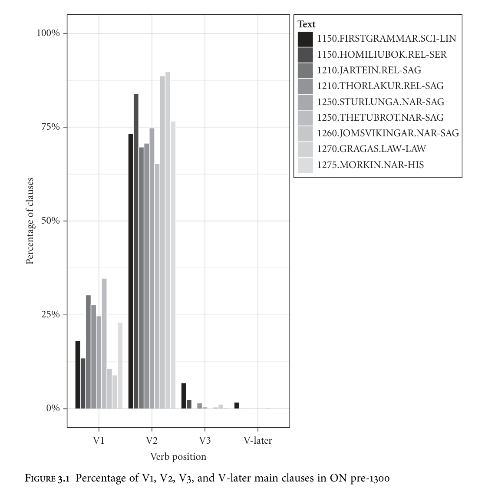
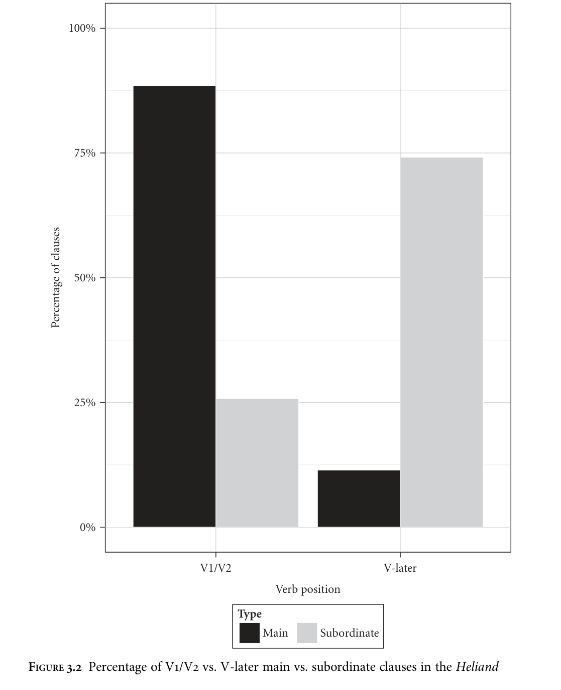

<!-- source page: 65 -->

3

Verb position in early Germanic main clauses

## 3.1 Introduction

This chapter represents an attempt to put the methodology for syntactic reconstruction outlined in Chapter 2 into practice, by reconstructing aspects of the structure of Proto-Northwest Germanic main clauses. The focus throughout is on the position of the finite verb in declarative main clauses: other types of clause, such as subordinate clauses, imperatives, and interrogatives, are left out of consideration here, though interrogatives are discussed extensively in Chapter 4. Second and subsequent conjoined declarative main clauses (‘conjunct clauses’) are also left out of consideration. It has often been observed for OE (e.g. Andrew 1940: 1; Mitchell 1985: 694) that these frequently appear to pattern with subordinate clauses with regard to constituent order, as in (1). Similar cases can be found for OHG, as in (2), though these are rare (Axel 2007: 77–9), and for OS, as in (3).

```text
(1)
Her
for
se
ilca
here
innan
Myrce
to
Snotingham
this-year
went
the
same
army
inside
M.
to
N.
&
þær
wintersetle
namon
and
there
winter-quarters
took
‘This year the army travelled inside Mercia to Nottingham and took up winter
quarters there’
(cochronE,ChronE_[Plummer]:868.1.1098)
```

```text
(2) Inti
fon
mir selbomo niquam
óh
her uuár ist ther
mih santa
and
from me
self
neg-came but he
true
is
who me
sent
‘I have not come here of my own accord, but he who sent me is true’
(Tatian 351,29; Axel 2007: 78)
```

<!-- source page: 66 -->

```text
(3)
Si
ni
uueldun im
hôrien
te thiu,
ac
sie
simla mêr
they
neg wanted
them hear.inf to that.instr but they still
more
endi
mêr
oƀar
that
manno
folc
hlûdo
hreopun
and
more
over
the
men.gen
folk
loudly
called
‘They did not want to listen to them, but instead called out more and more
loudly over the crowd of people’
(Heliand 3568–70)
```

Campbell (1970: 93 n. 4) goes so far as to suggest that ‘even co-ordinating conjunctions are syntactically subordinating’ in OE. More recent work (Stockwell and Minkova 1990: 512–13; Kiparsky 1995: 148–9; Pintzuk 1999; Bech 2001: 86–93; Ohkado 2005: 196–282) has indicated that this is an overstatement of the case. Kiparsky (1995: 148), for instance, observes that long-distance wh-dependencies into subordinate clauses can be found, but that the same is not true of conjunct clauses; furthermore, conjunct clauses permit V1 order even when there is no parallel in the initial conjunct, whereas this order is extremely rare in subordinate clauses. Stockwell and Minkova (1990) observe that subjunctive verb forms, frequent in subordinate clauses, are rare in conjunct clauses. Bech (2001) adduces quantitative evidence demonstrating that there is no strong tendency for conjunct clauses to be verb-final, contrary to what is often implied in the literature, but that there are statistically significant differences in the distribution of verb-positions between main and conjunct clauses in OE. I will therefore follow Bech (2001: 93) and other authors in keeping the two types of clause apart. Gothic will also be left out of consideration for the greater part of this chapter, due to (i) the special interpretative difficulties arguably involved with the Gothic data (see section 1.4.1), (ii) the preponderance of clauses introduced by the conjunction jah, and (iii) the fact that it appears to behave differently from the other early attested Germanic languages with regard to main clause word order (see Eyþórsson 1995). Reconstructions will therefore be posited here initially only for a Proto-West Germanic or Proto-Northwest Germanic stage, though section 3.5 will make some further tentative suggestions on integrating Gothic. Finally, word order in subordinate clauses will not be investigated here. It can be observed that there is an asymmetry in verb position between main and subordinate clauses in all the early West Germanic languages, but that the verb is not consistently final in subordinate clauses as it is in modern German: see e.g. van Kemenade (1987) and Fuß and Trips (2002) on OE, and Axel (2007) on OHG. The same is true for ON poetry (Kuhn 1933; Þorgeirsson 2012), though in ON prose there seems to be no such asymmetry (see e.g. Faarlund 2004: 191). I leave this interesting issue aside. Section 3.2 focuses particularly on the V2/V3 alternation that has often been observed in OE main clauses. Some scholars (e.g. Westergaard 2005; Hinterhölzl and Petrova 2009) have speculated that the V3 pattern resulted from an innovation. Sections 3.2.1

<!-- source page: 67 -->

and 3.2.2 lay out the situation in OE, OHG, OS, and ON. Section 3.2.3 presents an analysis involving multiple, information-structurally determined positions for subjects and other constituents in the clausal left periphery (C-domain) as well as verbmovement to the left periphery. It is argued in section 3.2.4 that the possibility of V3 is more likely to be the result of shared retention than of innovation among these languages; thus, an active left periphery is reconstructed for Proto-Northwest Germanic. In section 3.3 I consider V1 main clauses, which are found in all the early Germanic languages. Following much previous research I argue that they are associated with a special (non-assertive) interpretative value, and that the possibility of V1 can be reconstructed for Proto-Northwest Germanic at least. In section 3.4 I discuss ‘verb-late’ main clauses, which have so far resisted insightful analysis. After demonstrating the presence of such clauses in all the early West Germanic languages, I propose an account based on the discourse status of these clauses as presupposed. Section 3.5 is an attempt to integrate Gothic into the picture, in particular tackling the question of whether verb-movement to the left periphery should be posited for Gothic or for Proto-Germanic; section 3.6 then summarizes the reconstructions proposed in this chapter.

## 3.2 V2 and V3

### 3.2.1 V2: the data

A first glance at the syntax of OE main clauses ‘suggests a strong parallelism’ between OE and modern Germanic V2 languages such as Dutch and German (van Kemenade 1987: 42). Examples (4)–(6) illustrate this.1

```text
(4)
We
habbað
hwæðere
þa
bysene
on
halgum
bocum
we
have
nevertheless
the
examples
in
holy
books
‘We have, nevertheless, the examples in holy books’
(cocathom1,+ACHom_I,_31:450.315.6332)
```

```text
(5)
On
twam
þingum
hæfde
God
þæs
mannes
saule
gegodod
in
two
things
had
God
the
man’s
soul
endowed
‘With two things had God endowed man’s soul’
(cocathom1,+ACHom_I,_1:184.161.166)
```

```text
(6)
Þa
ongan
he
ærest
sprecan
to
þam
munece
then
began
he
first
speak.inf
to
the
monk
‘Then he first began to speak to the monk’
(comary,LS_23_[MaryofEgypt]:65.42)
```

1 References to OE examples are given from the YCOE (Taylor et al. 2003).

<!-- source page: 68 -->

In all of these examples the verb follows the first constituent. Where an adverbial ‘operator’ such as þa or þonne is initial, as in (6), this pattern is dominant (see e.g. Koopman 1998: 141; Fischer et al. 2000: 106). Moreover, it is the majority pattern in main clauses in general. Cichosz (2010: 72–6) shows that in samples of non-conjunct declarative main clauses from OE poetry, original prose, and translated prose, V2 is the most common position for the verb. Searching the YCOE reveals that 2,739 of 4,173 such clauses in Ælfric’s Lives of Saints (65.6%) are V2, and 1,138 of 2,717 such clauses in Bede’s Historia (41.9%). It has long been observed that OHG exhibits a robust variant of the V2 property (e.g. Reis 1901; Lippert 1974; Robinson 1997; Axel 2007). Lippert (1974) counts 280 of 380 main declarative clause examples in Isidor as verb-second (73.6%). Examples of subject-initial and non-subject-initial verb-second are in (7) and (8).

```text
(7)
der
antichristo
stet
pi
demo
altfiant
the
antichrist
stands
with
the
old-fiend
‘The Antichrist stands with the devil’
(Muspilli 44)
```

```text
(8)
pidiu
scal
er
in
deru
uuicsteti
uunt
piuallan
thus
shall
he
in
the
battlefield
wounded
fall
‘Thus he shall fall, wounded, on the battlefield’
(Muspilli 46)
```

Cichosz (2010: 72–6) shows that in samples of non-conjunct declarative main clauses from OHG poetry, original prose, and translated prose, V2 is the most common position for the verb, and that V2 is even more firmly established in OHG than it is in OE. As observed by Rauch (1992: 24), Erickson (1997), and Dewey (2006: 60), V2 seems to be the dominant pattern in OS as it is in OE and OHG. My quantitative data enables this to be stated more precisely: a total of 1,597 of the 2,348 main clauses in the Heliand (68.0%) have the verb in second position, as in (9) and (10).

```text
(9)
Godes
engilos
antfengun
is
ferh
God’s
angels
received
his
spirit
‘God’s angels received his spirit’
(Heliand 3350–1)
```

```text
(10)
Mattheus
uuas
he
hêtan
Matthew
was
he
called
‘He was called Matthew’
(Heliand 1192)
```

Finally, in ON the finite verb in declarative main clauses is typically in second position (Nygaard 1906; Eyþórsson 1995: 189; Faarlund 2004: 191; Þorgeirsson 2012:

<!-- source page: 69 -->

234–6), as in (11) and (12). Examples in which the verb is later than second are vanishingly rare; see Table 3.1.

```text
(11)
Stýrimaður
þarf
byrinn
brẏnna
en
sá
helmsman
needs
breeze.def
sharper
than
that.nom
er
nautunum
skal
brynna
that
cows.dat
shall
water.inf
‘A helmsman needs a sharper breeze than someone who waters the cows’
(1150.FIRSTGRAMMAR.SCI-LIN,.75)
```

```text
(12)
Nú
skaltu
drekka
blóð
dýrsins
now
shall-2sg
drink
blood
beast.def.gen
‘Now you shall drink the beast’s blood’
(Hrólfs saga kraka 34: 101)
```

In all of these languages, however, a substantial number of non-V2 clauses can be observed, of a kind that would be unexpected in a corpus of a strict V2 language such as modern German or Dutch. These exceptions are classifiable ‘into a relatively small number of easily distinguishable and clearly describable types’ (Axel 2007: 63), for which distinctive interpretative properties can be posited. Much of the rest of this chapter is devoted to describing and explaining these types across the early Northwest Germanic languages.

### 3.2.2 V3

A pattern in which two constituents precede the finite verb, as in (13), (14), and (15), has long been recognized for OE.

```text
(13)
æfter
his
gebede
he
ahof
þæt
cild
up
after
his
prayer
he
lifted
the
child
up
‘After his prayer he lifted the child up’
(cocathom2,+ACHom_II,_2:14.70.320)
```

```text
(14)
Fela
spella
him
sægdon
þa
Beormas
many
stories
him
told
the
Permians
‘The Permians told him many stories’
(coorosiu,Or_1:1.14.27.243)
```

```text
(15)
Nu
se
rica mann ne
mæg her
habban . . .
now the rich man
neg can
here have . . .
‘Now the rich man cannot here have . . .’
(coaelive,+ALS[Ash_Wed]:110.2758)
```

Where the subject is pronominal, as in (13), it almost invariably precedes the verb in main clauses not introduced by þa or þonne (Haeberli 1999a: 335). Van Kemenade

<!-- source page: 70 -->

(1987: 138–40) was aware of such examples, in which the second-position constituent is a subject. Pintzuk (1999) additionally observed that examples such as (14) involving object pronouns existed.2 The existence and relative prevalence of examples such as (15), in which a full DP subject precedes the finite verb, was first brought to light by Allen (1990: 150–1), Swan (1994), Bech (1998, 2001), Koopman (1998), and Haeberli (2002). Bech (2001: 96–8) demonstrates for XP-Subj-Vfin non-conjunct main clauses that 22 of 101 subjects (21.8%) in her early OE sample, and 21 of 86 (24.4%) in her late OE sample, are full nominals. Haeberli (2002) found that subject-verb non-inversion (i.e. V3) occurred 188 times (28.7%) of the time in a small corpus of 654 clauses with full nominal subjects in second position and a fronted constituent in initial position, taken from ten text samples. Speyer (2008, 2010: 187–210) additionally demonstrates that examples of V3 of this kind in OE cannot all be written off as instances of verb-late structure where the verb is ‘accidentally’ in third position.3

Tomaselli (1995) presents a number of cases of V3 main clauses in OHG:

```text
(16)
erino portun ih firchnussu
iron
portals I
destroy
‘I destroy iron portals’
(Isidor 157)
```

```text
(17)
Dhes
martyrunga
endi
dodh
uuir
findemes
his
martyrdom
and
death
we
demonstrate
mit
urchundin dhes
heilegin chiscribes
with evidence
the.gen holy
writings
‘We demonstrate his martyrdom and his death with evidence from the holy
scriptures’
(Isidor 516)
```

Tomaselli argues that subject pronouns are the only elements found in the second position of a V3 clause (1995: 348). Furthermore, she claims that V3 clauses are only found in the Isidor translation and in the Monsee Fragments. As Axel (2007: 239) points out, these are dated earlier than most OHG prose texts. Tomaselli’s first claim appears to be falsified, at least on the surface, by clauses such as (18), from Harbert (1999: 258), and (19), from Axel (2007: 239). Pronouns are often inserted in this position counter to the source text in translations (Axel 2007: 248).

2 Adverbs may also occur in this position (Koopman 1996, 1997: 84–5). 3 The V3 ‘pattern’ referred to here, as opposed to V3 as a surface word order, refers to a particular configuration (discussed in section 3.2.3) in which the verb has moved leftward and is preceded (typically) by some XP constituent followed by a discourse-old subject. It is not intended to encompass the cases of V3 word order discussed by te Velde (2010) with Vor-Vorfeld elements in modern German, or embedded V3 in Scandinavian as discussed by e.g. Angantýsson (2007).

<!-- source page: 71 -->

```text
(18)
Ih inan
chistiftu in minemu dome
I
him.acc install
in my
house
‘I install him in my house’
(Isidor 629)
```

```text
(19)
forlazan
imo
uuirdit
forgiven
him.dat
becomes
‘he will be forgiven’
(Monsee Fragments 6,9)
```

A difference between OHG and OE is that, whereas XP-Subj-Vfin order is almost always found when the subject is pronominal in main clauses not introduced by þa or þonne in OE, in OHG it appears to be optional: ‘it is not the case that personal pronouns must appear before the verb, but they may’ (Robinson 1997: 17). Furthermore, Axel (2007: 248–50) argues that non-pronominal elements are not attested in second position, other than a few examples with short adverbs such as (20), again unlike the situation in OE.

```text
(20) siu
tho
giuuanta
sih
she
then
turned
refl
‘she then turned herself’
(Tatian 665,19)
```

Like Speyer (2008, 2010) for OE, she also demonstrates that not all such examples can be written off as instances of verb-late order (contra Lenerz 1984), since further pronouns may follow the verb, which they may never do in ordinary verb-late clauses:4

```text
(21)
Vnde do
iu
habeta si
leid
in-fangen in iro herzen
and
then you-dat.pl had
she sorrow received
in her heart
‘and then her heart was filled with sorrow for you’
(Notker’s Psalter VII 23,26)
```

In OS, however, unlike in OE and OHG, V3 does not appear to be a productive pattern. In total, 93 of the 2,348 non-conjunct declarative main clauses (4.0%) are V3 in having two constituents preceding the finite verb. This proportion is low, and there are reasons to suspect that V3 does not have an underlying representation/derivation distinct from verb-late in OS. Whereas a large proportion of clauses in which the verb surfaces in third position in OE and OHG are of the form XP-SubjPron-Vfin

4 The rationale for treating V3 and verb-late as separate ‘patterns’ with potentially differing derivations is explained in the next section (3.2.3). Examples (17) and (18) do not provide decisive evidence either way, since the possibility of unmoved verbs and a process of rightward movement must be independently assumed for the older Germanic languages, as noted by Tomaselli (1995: 365 n. 3).

<!-- source page: 72 -->

(Haeberli 1999a: 335), this order is rare in OS. Only 4 of the 93 examples (4.3%) have this order: (22) and (23) below, as well as instances in lines 2,834 and 4,757.5

```text
(22)
Thanna thu scalt lôn
nemen fora
godes ôgun
then
you shall reward take
before God’s eyes
‘Then you shall be rewarded before God’
(Heliand 1563–4)
```

```text
(23)
Bethiu
man sculun haldan thene
holdlîco
therefore one
should hold
that.masc.acc favourably
‘Therefore all should keep him in their favour’
(Heliand 1869–70)
```

Three of the four examples of XP-SubjPron-Vfin, including (22) and (23), begin with adverbs that may also be used as subordinators, rendering them potentially ambiguous between main and subordinate clauses although traditionally read as the former. Since no adverbs or postverbal pronouns are present in any of these examples, furthermore, there is the possibility that these are in fact instances of the verb-late pattern rather than V3 as found in OE and OHG.6

Hinterhölzl and Petrova (2009: 320) suggest that (24) (their (12)a) is an example of V3 with verb movement as in OE:

```text
(24)
Thar
imu
tegegnes
quam
ên
idis
fan
âđrom
thiodun
there
him
against
came
a
woman
from
different
tribe
‘There, a woman from another tribe approached him’
(Heliand 2984–5)
```

However, this example is as inconclusive as (22) and (23) with regard to underlying structure. Since a rightward movement process must be postulated for OS as for OE, it is possible to argue that the verb in (24) is unmoved and that the postverbal constituent ên idis fan âđrom thiodun ‘a woman from another tribe’ has in fact been moved rightward over it.7 Furthermore, as for (22) and (23), in context it is entirely

5 Van Bergen (2003) shows that indefinite man in OE behaves as a personal pronoun rather than as a full nominal. I assume this holds for OS, though it remains to be demonstrated. 6 I have found only one example of a V3 clause with a pronoun in postverbal position:

```text
(i)
Than
thoh
gitrûoda
siu
uuel
an
iro
hugiskeftiun
then
though
trusted
she
well
in
her
understandings
‘Still she had faith in her mind’
(Heliand 2028–9)
```

Here, however, thoh seems to behave like modern German jedoch and aber in marking a preceding constituent as contrastive, and this example can thus be seen as an instance of V2: see e.g. Frey (2004: 20) and Axel (2007: 217–22). 7 Since this constituent represents new information, as acknowledged by Hinterhölzl and Petrova (2009: 320), this state of affairs is all the more likely, as rightward movement (at least in OE) appears to be driven partially by information-structural considerations (Pintzuk 2005: 124 n. 12; Taylor and Pintzuk 2009).

<!-- source page: 73 -->

possible to analyse (24) as an embedded clause with the meaning ‘where a woman from another tribe approached him’: see the expanded version in (25).

```text
(25)
Thô
giuuêt he imu
oƀer thea marka Iudeono,
sôhte
imu Sidono
then
went
he him over
the
region Jews.gen sought him S.
burg, habde gesîđos
mid imu, gôde iungaron. Thar imu
town had
companions with him
good disciples
there him
tegegnes
quam
ên
idis
fan
âđrom
thiodun
against
came
a
woman
from
different
tribe
‘Then he travelled across the lands of the Jews and sought out the town of
Sidon—he had companions with him, good disciples—where a woman from
another tribe approached him’
(Heliand 2982–5)
```

The appositive clause habde gesîđos . . . between the main clause and (24) should not be taken as an argument that (24) must be a main clause: compare (26), without capitalization or punctuation between the clauses, in which an appositive element also intervenes between the main clause and the locative adjunct.

```text
(26) Thô uuarđ
is
uuisbodo
an Galilealand, Gabriel cuman,
then became his wise-messenger in G.-land
G.
come
engil
thes
alouualdon,
thar
he
êne
idis
uuisse
angel
the.gen
Almighty.gen
where
he
a
woman
knew
‘Then his wise messenger, Gabriel, came to Galilee—the Almighty’s angel—
where he knew a woman’
(Heliand 249–51)
```

The extreme rarity of the XP-SubjPron-Vfin order in my corpus must also be taken as an argument against its productivity. For OE, the order XP-SubjPron-Vfin is ‘used consistently’ (Haeberli 1999a: 335) when an element other than þa or þonne is fronted. In contrast, in the Heliand there are 462 examples of V2 declarative main clauses in which the subject pronoun follows the finite verb, e.g. (27), and 223 examples of V2 declarative main clauses in which the subject pronoun precedes the finite verb, e.g. (28). All of these can be seen as ‘missed opportunities’ (Faarlund 1990: 17–18) for V3.

```text
(27)
mildi
uuas
he
im
an
is
môde
mild
was
he
them.dat
in
his
mood
‘He was gentle in spirit to them’
(Heliand 1259)
```

<!-- source page: 74 -->

**TABLE 3.1. Frequency and percentage of V1, V2, V3, and V-later main clauses in ON pre-1300**

```text
V1
V2
V3
V-later
Total
```

```text
N
%
N
%
N
%
N
%
N
```

```text
1150.FIRSTGRAMMAR.SCI-LIN
21
18.1
85
73.3
8
6.9
2
1.7
161
1150.HOMILIUBOK.REL-SER
172
13.5
1069
84.0
31
2.4
1
0.1
1273
1210.JARTEIN.REL-SAG
70
30.3
161
69.7
0
0.0
0
0.0
231
1210.THORLAKUR.REL-SAG
73
27.8
186
70.7
4
1.5
0
0.0
263
1250.STURLUNGA.NAR-SAG
318
24.7
962
74.8
6
0.5
0
0.0
1286
1250.THETUBROT.NAR-SAG
49
34.8
92
65.2
0
0.0
0
0.0
141
1260.JOMSVIKINGAR.NAR-SAG
49
10.7
406
88.6
2
0.4
1
0.2
458
1270.GRAGAS.LAW-LAW
15
9.0
150
89.8
2
1.2
0
0.0
167
1275.MORKIN.NAR-HIS
235
23.0
783
76.6
3
0.3
1
0.1
1022
```

```text
(28)
Thu
scalt
for
allun
uuesan
uuîƀun
giuuîhit
you
shall
before
all.dat
be.inf
women.dat
hallowed
‘You will be hallowed above all women’
(Heliand 261–2)
```

I therefore conclude that V3 as found in OE and early OHG is not a productive feature of OS, or at least of the variety represented by the Heliand. Finally, in ON V3 orders are not found (Faarlund 1994: 64). The distribution of word order types in the texts of the IcePaHC (Wallenberg et al. 2011) is given in Table 3.1, and illustrated in Figure 3.1.8

In all but the earliest two texts, instances of V3 or V-later are very rare, and all can be analysed as involving left-dislocations or constituents in apposition, or (in the Íslensk hómilíubók) involve the Latin word sicut in initial position, which appears to function as a conjunction. XP-Subj-Vfin orders are not found.

### 3.2.3 Analyses of V2 and V3

Two core classes of analysis of asymmetric V2 in the Germanic languages have been proposed.9 According to the first, based on an intuition going back to den Besten (1977) and Evers (1981, 1982), the finite verb moves to C0 in all main clauses, as in the tree in (29), illustrated by an example from modern German.

8 For the full names of these texts, see section 1.4.2. 9 I do not discuss ‘symmetric V2’, as found in Icelandic and Yiddish, here. See Rögnvaldsson and Þráinsson (1990) on Icelandic, and Santorini (1994) for a comparative perspective.

<!-- source page: 75 -->



```text
(29)
CP
```

```text
DP
```

```text
C'
```

Den Hundi

```text
C0
TP
```

[EFˆ]

the dog

```text
[uV]
DP
T'
```

habej

ich

I

have

seen tj gesehen ti

‘I have seen the dog’

<!-- source page: 76 -->

Two separate movements are involved. First, the finite verb moves to C0. Second, a single constituent is moved to SpecCP.10 Following the theoretical assumptions laid out in section 1.3, the head-movement operation can be recast here as triggered by a [uV] feature on C0 (see Roberts 2010b): this C0 agrees with the finite verb, and, since the featural content of the finite verb is by assumption a subset of that of C0, the verb is spelt out in C0. The movement of the verb, here and elsewhere in this book, is represented by a solid line. The second movement, of some constituent to SpecCP (in (29), the direct object), can be viewed as triggered by an instance of ^associated with the Edge Feature of the phase head C0. This demands that a constituent be moved to SpecCP, but is agnostic about the nature of that constituent; this is equivalent to Fanselow’s (2003) ‘stylistic fronting’, and Frey’s (2004) ‘formal movement’.11 This and other phrasal movements will be represented in this book by a dashed line. This approach has the major advantage of explaining the asymmetry between main and subordinate clauses in modern German and Dutch: on the assumption that the complementizer is first Merged in C0, this position is no longer available for the verb to move to, and so it remains in its base position. Under the head-movement-as-Agree account, we can assume that the complementizer C0 does not bear a [uV] feature. As a result, no Agree relation is established between C0 and the finite verb, precluding head-movement in the sense of Roberts (2010b). The second major class of approach is associated with Travis (1984, 1991), Zwart (1991, 1993), and is referred to by Diesing (1988, 1990) as the ‘two-structure hypothesis’. Under this approach, in present terminology, a derivation such as (29) is proposed only for main clauses in which a constituent other than the subject precedes the finite verb. In other cases, the verb moves only as far as T0, and the subject is in SpecTP, as in (30).12

10 I here abstract away from the movement of the subject from SpecvP and from the internal constituency/ordering of the vP. 11 Almost any constituent may fulfil this requirement. Finite TPs are one major exception: see Abels (2003), Wurmbrand (2004). 12 As noted by Schwartz and Vikner (1996: 46), for this approach it is crucial that TP be head-initial and that the finite verb fail to move to T0 in subordinate clauses. Haegeman (2001) provides data from West Flemish that casts doubt on this assumption. I will leave the issue aside here.

<!-- source page: 77 -->

```text
(30)
TP
```

```text
DP
```

```text
T'
```

Der Hundi the dog

T0 vP

[uV] [uϕˆ]

v'

ti hatj tj mich gesehen

has me seen

‘The dog has seen me’

This approach is characterized by the presence of [EF^] and [uV] on main clause C0 only when a constituent precedes the subject, with an interpretative effect (topicalization, focus, or interrogation). Motivation for this approach is provided by morphological alternations in verb forms in eastern dialects of Dutch and in Swabian depending on whether the subject precedes the verb (Zwart 1991, 1993),13 as well as by the desire to eliminate movements that are string-vacuous. Schwartz and Vikner (1989, 1996), however, argue that this approach is inadequate to account for the facts of the modern Germanic languages. A first problem (1996: 12–13) is that adjunction to TP must be stipulated to be possible in subordinate clauses but impossible in main clauses, in order to derive the contrast between modern German (31) and (32).

```text
(31)
Ich
weiß, dass letzte Woche Peter tatsächlich ein Buch gelesen hat
I
know that
last
week
Peter actually
a
book read
has
‘I know that Peter actually read a book last week’
```

```text
(32)
*Letzte
Woche
Peter
hat
tatsächlich
ein
Buch
gelesen
last
week
Peter
has
actually
a
book
read
‘Peter actually read a book last week’
```

13 A similar alternation in verb endings is found in OE with first and second person plural pronominal subjects (see van Gelderen 2000: 157–67), as well as in Middle Low German (Lasch 1914: 227).

<!-- source page: 78 -->

Secondly, the approach is unable to account for the contrast between (33) and (34)–(35) with respect to the absence of the expletive (see also Tomaselli 1986). On the hypothesis that es is a SpecCP expletive, that the verb is uniformly in C0, and that SpecCP must be filled, the facts in (33)–(35) fall out naturally: the expletive may not be Merged in SpecTP, so is prohibited in (33), but is necessary in (34) to fill the otherwise empty SpecCP (cf. (35)).

```text
(33)
Gestern
ist
(*es)
ein
Junge
gekommen
yesterday
is
(*there)
a
boy
come
‘A boy came yesterday’
```

```text
(34)
Es
ist
ein
Junge
gekommen
there
is
a
boy
come
‘A boy came’
```

```text
(35)
*Ist
ein
Junge
gekommen
is
a
boy
come
‘A boy came’
```

These, and other facts, indicate that the two-structure hypothesis is on the wrong track for the modern Germanic asymmetric V2 languages; see Diesing (1990: 60–1), Lenerz (1993), Branigan (1996), and van Cranenbroeck and Haegeman (2007) for further data militating in the same direction.14 However, the V3 data discussed in section 3.2.2 has been taken by many authors (e.g. Pintzuk 1993, 1999; Eyþórsson 1995; Haeberli 1999a, 1999b, 2002; Fuß 2003) to indicate that a version of this hypothesis is in fact correct for OE. Typically, this class of analysis assumes that verb-movement to C0 takes place only in contexts introduced by þa, þonne, or a wh-item; in all other cases, the verb moves to T0. The canonical OE sentence under this analysis can be represented in present terms as in (36).

14 Further types of analysis of V2 exist in the literature. These include: (a) the ‘V2-inside-IP’ analysis of Diesing (1990) and Rögnvaldsson and Þráinsson (1990), also shown to be inadequate by Schwartz and Vikner (1996: 30–46); (b) ‘Münchhausen-style’ analyses such as Fanselow (2003), in which the movement of the finite verb is XP-movement rather than head-movement; and (c) Müller’s (2004) remnantmovement analysis, in which a vP emptied of all constituents except its head and edge moves to SpecCP. Analyses of types (b) and (c) are motivated by the desire to exclude head-movement as a syntactic operation; in the present work, the theory of head-movement of Roberts (2010b) is adopted, making this unnecessary. Biberauer and Roberts (2004) also show that Müller’s (2004) approach makes a number of incorrect predictions for the V2 Germanic languages, especially with regard to adverb fronting.

<!-- source page: 79 -->

```text
(36)
CP
```

```text
C'
```

PP

C0

```text
TP
[EFˆ]
```

[æfter his gebede]i after his prayer

```text
DP
```

```text
T'
```

hej

T0 vP

he

[uϕˆ]

v'

tj

[uV]

ahofk

lifted

tk þæt cild up

ti

the child up

‘After his prayer he lifted the child up’ (cocathom2,+ACHom_II,_2:14.70.320)

Within the two-structure family of analyses, different variants exist. Pintzuk (1993, 1999), for example, assumes that TP may be head-initial or head-final, thus accounting for the existence of verb-late main clauses (see section 3.4). Eyþórsson (1995: 302–3) and Fuß (2003: 225 n. 15), meanwhile, acknowledge the existence of verb-late main clauses but do not provide an analysis for them. Haeberli (1999b, 2002) differs from the other accounts in that the verb is in AgrS0, with the subject occurring variably in SpecAgrS or SpecTP; Haeberli’s account is also adopted in important recent work by Speyer (2008, 2010).15 Nevertheless, similar concerns arise for all these accounts. These concern (a) the occurrence of objects in preverbal position, (b) the occurrence of multiple pronouns in preverbal position, (c) the absence of V1 orders in subordinate clauses, and (d) the clause-type asymmetry. The occurrence of objects in a position ostensibly reserved for subjects, as in (14) from OE and (18), (19), and (21) from OHG, is a problem for any account positing that ‘high’ subjects occur in SpecTP or SpecAgrSP, since these are typically viewed as A-positions restricted to subjects. Pintzuk (1993: 24 n. 25), Eyþórsson (1995: 314), and Haeberli (2002) avoid this problem by assuming that subject and (optionally) object pronouns are clitics not occupying a specifier position, a hypothesis to which I will return. Fuß (2003: 226 n. 22) speculates that these object pronouns might behave like

15 I do not assume Agr projections here, basically for conceptual reasons (see Chomsky 1995: ch. 4).

<!-- source page: 80 -->

modern Icelandic quirky subjects, but the latter typically occur systematically in the context of the case frames of particular lexical verbs, and there is no evidence that this is the case for OE preverbal objects. There are proposals in the literature (e.g. Diesing 1990; Barbosa 1995, 2001) to the effect that SpecTP may be an A’-position in certain languages; however, as well as being non-standard, such a proposal would overgenerate with regard to OE and OHG. All else being equal, we would expect the same range of constituents to occur in SpecTP as occur in SpecCP, including prepositional phrases and full DP objects. However, as shown in section 3.2.2, the constituents which may occur in this position in OE and OHG are pronominal subjects, pronominal objects, and light adverbs; in addition, there is evidence for full DP subjects in this position in OE, and more rarely full DP objects (Koopman 1997: 82). PPs, as far as I know, are essentially unattested. It will be shown that a simple generalization links the attested items: they are all discourse-given (Bech 1998, 2001; Westergaard 2005; van Kemenade and Los 2006; Walkden 2009; Hinterhölzl and Petrova 2009). If this information-structural approach is correct, then analyses assuming the two-structure hypothesis are unenlightening with regard to OE and OHG V3 unless additions are made. A further, related problem is presented by occasional cases in which multiple pronouns intervene between a fronted XP and the finite verb (see W. Koopman 1992).

```text
(37)
Nu
ic eow hebbe to hæftum
ham
gefærde alle of earde
now
I
you have
to bond.dat home led
all
of native-land.dat
‘Now I have led you all from your native land to a place of imprisonment’
(Sat 91–2)
```

SpecTP and SpecAgrSP are usually assumed to be single positions, making examples such as (37) problematic for any theory that requires preverbal pronouns to be in one of these positions. A third problem, raised by Haeberli (2005: 273), is that two-structure analyses typically predict that V1 structures should be possible in subordinate clauses. This is so because if subject movement to the higher specifier (SpecTP in most theories; SpecAgrSP in Haeberli 1999b and 2002) is optional, the subject may stay low while the verb moves, leaving the higher specifier unfilled and the verb adjacent to the complementizer. However, this word order is extremely rare. The final core problem with the two-structure analysis of the early Germanic languages, also noted by Haeberli (2005: 273–4), is the asymmetry in verb position between clause types. Under the traditional view going back to den Besten (1977), the complementizer in C0 in subordinate clauses and the verb in C0 in main clauses are in complementary distribution, with the former blocking the movement of the latter. If the verb only moves as far as T0 or another IP-domain-internal head in subject-initial V2 main clauses, the prediction is made that subordinate clauses should also always

<!-- source page: 81 -->

exhibit subject-initial V2, a prediction that is false at least for German and Dutch. Zwart’s (1991) workaround for this, adopted by Eyþórsson (1995: 202–3), is to assume that verb-movement to AgrS0 is driven by AgrS0’s need to check its N-features, and that when the complementizer is present AgrS0 achieves this by moving to C0, making verb-movement unnecessary. But as well as creating a lookahead problem in a derivational approach—when AgrS0 is Merged, how does it know whether a complementizer will be Merged above it or not?—this approach lacks independent motivation. As noted above, Pintzuk (1993, 1999) makes a virtue out of necessity by indicating that orders that she considers both IP-final and IP-initial are found in OE in both main and subordinate clauses. However, as observed by Koopman (1995: 142), and as Pintzuk (1999: 223) acknowledges, this provides no clear explanation for why IP-final should be more frequent in subordinate clauses than in main clauses, especially if with Fuß and Trips (2002: 211) we make ‘the plausible assumption that a speaker cannot switch from one grammar to another in mid-sentence’. Though Pintzuk and Haeberli (2008) claim that verb-late order in OE is more common in main clauses than previously thought, it still appears to be substantially more common in subordinate clauses (see their table 14, 2008: 398, and section 3.4). A clear asymmetry between clause types can also be observed in OHG (Axel 2007: 6–8) and in OS (see Table 3.2 and Figure 3.2; the difference is statistically significant, p<0.0001).16

Haeberli (2005) solves the latter two problems by positing that the verb moves higher in main clauses than in subordinate clauses (effectively reinstating a key aspect of the original V-to-C0 analysis of van Kemenade 1987): to AgrS0 in main clauses, but only to T0 in subordinate clauses. This rules out V1 in subordinate clauses, and

**TABLE 3.2. Frequency and percentage of V1/V2 vs. V-later main vs. subordinate clauses in the Heliand**

V1/V2 V-later Total

```text
N
%
N
%
N
```

```text
Main
2078
88.5
270
11.5
2348
Subordinate
567
25.8
1629
74.2
2196
Total
2645
–
1899
–
4544
```

16 The problems raised in this section do not arise for ON, since here verb-movement to (at least) T0 is found in subordinate clauses. Eyþórsson (1995: 214–88) discusses facts relating to negation in the Poetic Edda that indicate that negated verbs occupied a position below topics and above canonical subjects, arguing that this position is C0. It could therefore be the case that the two-structure account is correct for ON, but false for the West Germanic languages. However, the problems raised by Schwartz and Vikner (1996) remain for ON; in addition, the negation facts are also compatible with a split-CP account of the type I develop in this section.

<!-- source page: 82 -->



permits a clause-type asymmetry; however, the issues of preverbal pronominal objects and multiple preverbal pronouns are still problematic for this analysis. I therefore conclude that the two-structure hypothesis is unable to account convincingly for the full range of constituent order variation in the early Germanic languages without stipulation.

<!-- source page: 83 -->

For approaches to early Germanic constituent order that posit uniform V-to-C0

movement, it is necessary to make additional assumptions in order to account for the occurrence of V3. Most usually, as in van Kemenade (1987), Tomaselli (1995), and Roberts (1996) as well as the non-V-to-C0 approaches of Pintzuk (1993, 1999), Eyþórsson (1995), and Haeberli (2002), this assumption is that personal pronouns are clitics (rather than weak pronouns in the sense of Cardinaletti and Starke 1999) and thus ‘do not count’ as preverbal constituents.17 However, van Kemenade (1987: 126) and Pintzuk (1999: 189 n. 17) are obliged to admit that there is no written evidence for clitic forms in OE. The hypothesis of clitichood has been challenged for OE by Koopman (1997) and Bech (2001), and for OHG by Axel (2007: 254–77). Clitichood is usually associated with phonological reduction, yet there is almost no evidence for this: in OE the subject pronoun þu ‘you.sg’ is reduced when postverbal, and hit ‘it’ is sometimes spelled without an <h> in late OE, but otherwise no reduction is visible (Koopman 1997: 89–90). Koopman therefore concludes that ‘[t]he virtual absence of evidence for reduced forms makes it difficult to use the term “clitic”’. Axel (2007: 254–77) investigates the situation in OHG and comes to a similar conclusion. She cites evidence from Nübling (1992) that vowel reductions are found, and that postverbal pronouns are often written together with the preceding verb, though word boundaries are not consistently marked in general. However, there is not enough evidence to posit ‘a fully fledged paradigm of . . . clitic forms’ (2007: 260). It could, of course, be argued that the absence of phonological evidence is not telling, since written records might under-represent cliticization processes. In addition, it could be argued that syntactic clitichood and phonological clitichood need to be kept apart: this is suggested e.g. for Old French by Adams (1987a) and Vance (1997), and for Proto-Germanic by Hopper (1975: 31). However, the evidence for syntactic clitichood is equally dubious. Koopman (1997) takes the eight morphosyntactic criteria formulated by Kayne (1975) for distinguishing clitics from full pronouns, e.g. inability to be conjoined, and applies them to OE. He concludes that ‘personal pronouns show syntactic behaviour that differs from that of full NPs, but not all of them do and those that do, not in every position in which they occur’ (1997: 90). Axel (2007: 262–4) shows for OHG that personal pronouns could be modified and conjoined, and concludes (2007: 277) that preverbal pronouns in V3 constructions are XP-elements. For both OHG and OE, then, it seems more plausible to analyse personal pronouns as either weak or strong pronouns in the sense of Cardinaletti and Starke (1999). Furthermore, for both OE and OHG, assuming that personal pronouns are clitics does not solve the V3 ‘problem’, because other elements, such as adverbs, are found in the preverbal position in V3 main clauses. Koopman (1996, 1997: 84–5) argues that such adverbs cannot be analysed as clitics in OE due to their distributional properties. In addition, the prevalence of full DP subjects in preverbal position in V3 main

17 The analysis given in Haeberli (2005) is agnostic as to the clitic status of OE pronouns.

<!-- source page: 84 -->

clauses in OE means that assuming clitichood gains us little, merely replacing one V2 tendency with a slightly stronger V2 tendency. As Bech (2001: 98) puts it:

The fact that one fifth of the subjects in the [XP-Subj-Vfin] pattern cannot be clitics, but nevertheless occur in exactly the same position as the clitic elements, can hardly be overlooked, especially if a clitic position is defined as a position where only clitics can occur.

The clitic hypothesis, then, even if correct, does not solve the problem it set out to solve. An alternative account for V3 orders needs to be sought. Bech (1998, 2001) has provided the generalization upon which such an account can be based: the elements that occur in second, preverbal position are discourse-given. In Bech’s corpus of early OE, 86 of 101 subjects of XP-Subj-Vfin clauses (85.2%) had low information value, a notion roughly equating to givenness in Bech’s terms, vs. 180 of 301 subjects of XP-Vfin-Subj clauses (59.8%), and the latter figure falls to 53 of 174 (30.5%) when clauses with initial þa or þonne are discounted (2001: 160–1). Thisdifference isstatistically significant (p<0.0001). The fact that the figures are not absolute is of course a problem for any study making the assumptions about syntactic optionality outlined in section 2.2.2 (i.e. that it does not exist). However, the non-absoluteness of the figures could result from a number of things: (i) inconsistency of annotation and other human error; (ii) givenness not quite being the right notion to characterize the generalization; (iii) chance, especially given that historical data is typically noisy, and Bech’s sample contains a number of texts which themselves were worked on by a number of scribes. All in all I consider the generalization to be a fair starting point for an analysis that will probably have to be revised in the fullness of time. Support for this type of generalization is derived from a similar case in a modern language: Westergaard (2005) and Westergaard and Vangsnes (2005) present a close parallel from a recent synchronic study of Tromsø Norwegian. In this variety, certain types of wh-questions exhibit a V2/V3 alternation, with subjects preceding the finite verb if contextually given and following if new. In OE (and possibly in OHG), then, as in Tromsø Norwegian, the prevalence of subject pronouns in second position in V3 clauses receives a natural explanation: unstressed subject pronouns are ‘the canonical instance of a given nominal’ (Westergaard and Vangsnes 2005: 137). Walkden (2009: 60) and Hinterhölzl and Petrova (2009: 324) proceed to formalize the information-structural patterns in terms of the cartography of the split CP in the tradition of Rizzi (1997). Following Hinterhölzl and Petrova (2009), here I will base my analysis on the more nuanced split-CP hierarchy discussed in section 1.3 and repeated here in (38).

(38) ForceP > ShiftP > ContrP > FocP > FamP* > FinP (Frascarelli and Hinterhölzl 2007: 112–13; their (37))

Mohr (2009) in fact proposes a split CP analysis for V2 in modern German, the details of which I will adapt and adopt for main clauses in the early Germanic V2 languages

<!-- source page: 85 -->

(OS, ON, and late OHG). Under this analysis, the verb’s landing site is Fin0. This head also bears an Edge Feature associated with a movement-triggering ^, causing one (and only one) item to move to SpecFinP.18 This [EF^] may move any constituent to SpecFinP, including a constituent that will ultimately move higher in order to check and value an uninterpretable feature on a higher probe, since otherwise the merger of such constituents would cause the derivation to crash; when no such constituent exists, the structurally highest constituent is moved to SpecFinP (cf. Mohr 2009: 154; also Frey 2000, Fanselow 2003), in order to avoid derivational indeterminism. The derivation of a neutral subject-initial declarative in the early V2 Germanic languages therefore proceeds as in (39) (=(9), from OS).

(39) FinP

```text
DP
Fin'
```

```text
Fin0
TP
```

Godes engilosi

[EFˆ]

God’s angels

ti

tj is ferh

[uV]

his spirit

[uϕ]

antfengunj

received

‘God’s angels received his spirit’ (Heliand 3350–1)

When a constituent that is not the subject is in first position, the derivation is as in (40) (=(10), from OS). Structure without relevant material (e.g. ShiftP and FamP in this example) is omitted for clarity.

18 In Mohr’s analysis, this is a subject-of-predication feature rather than [EF^]. However, Mohr must stipulate that expletives (2009: 150), adverbs (2009: 152 n. 14), and focused XPs (2009: 155 n. 17) are able to check this feature, since these elements must be able to move through SpecFinP. In consequence it is no longer clear that the initially attractive semantic notion of subject-of-predication retains any semantic content. I assume a single specifier per head (cf. Kayne 1994; Cinque 1999). Chomsky (1995, 2000) has argued that Merge permits multiple specifiers. I retain the single-specifier assumption because (i) it is a cornerstone of the cartographic approach to phrase structure and (ii) it allows the construction of more restrictive theories. My argument here forces me to suggest that Fin0 bears [EF^] despite not being a phase head, pace Biberauer, Holmberg, and Roberts (2010). It could be that Fin0 is a ‘weak phase’ in the sense of Chomsky (2001), or that phase head properties are distributed across the heads of the split CP. Alternatively, it could simply be that all heads bear [EF], as suggested by Chomsky (2005), and that the presence or absence of ^ is parameterized.

<!-- source page: 86 -->

(40) FocP

```text
DP
```

Foc'

[iϕ] [uϕˆ]

Foc0

FinP

[uFoc]

[iFoc]

Mattheusi ti

Fin'

Matthew

Fin0

```text
TP
```

[EFˆ]

ti tj hêtan

he

[uV]

he called

[uϕ]

uuasj

was

‘He was called Matthew’ (Heliand 1192)

The initial constituent (here, Mattheus) first undergoes fronting to SpecFinP by virtue of the Edge Feature on Fin0. Foc0’s [uφ ^] feature then probes and in the process attracts Mattheus to SpecFocP. The movement of a constituent to the initial position in informationally non-neutral clauses is thus a two-stage process, as in Mohr’s (2009) account. Movement of more than one XP to the left periphery is ruled out as follows. By assumption, in OS and ON, the information-structural left-peripheral heads bear [uφ ^]-probes. The verb, however, which is in Fin0, bears φ-features that have (already) been valued by the subject. It therefore acts as an intervener in terms of agreement-based Relativized Minimality: the only constituent accessible to probing by an information-structural left-peripheral head is the (single) constituent in SpecFinP— or the finite verb itself, which, as a head, is unable to move and satisfy ^, causing the derivation to crash. The account is thus a ‘bottleneck’ approach to V2 in the sense of Rizzi (2006), Roberts (2004: 316–17), and Mohr (2009: 155): even though the left periphery is in principle fully available in main clauses in V2 languages, SpecFinP provides a bottleneck through which one and only one element may pass to reach it.19

19 Frascarelli and Hinterhölzl (2007) propose for modern German, and Hinterhölzl and Petrova (2009: 321–2) for OHG, that the finite verb and XP-movement-trigger are both in Force0. They present apparent cases of postverbal Aboutness topics in modern German as evidence for this. I will not adopt this proposal here, as it is not compatible with my analysis of null arguments (Chapter 5).

<!-- source page: 87 -->

This analysis predicts that V2 with a non-DP constituent in initial position is possible, through EF-triggered movement to SpecFinP; however, since left-peripheral heads other than Fin0 probe for φ-features, they should not be able to attract adverbs or PPs to their specifiers, and hence V2 with a non-DP constituent may not be information-structurally motivated. This prediction seems to be false. I leave this issue for future research, noting that Roberts and Roussou (2002) independently suggest that certain non-DP constituents may bear φ-features in order to account for non-nominal subjects in English. For OE and OHG, where multiple elements may occupy the left periphery, a different account is clearly needed: the intervention-based locality constraint does not seem to hold. This can be captured if in OE and OHG the left-peripheral heads probe not for φ- features, but for interpretable information-structural features, i.e. they bear features such as [uShift^] or [uFoc^]. A sample derivation of a V3 clause is given in (41).

(41) ShiftP

```text
DP
Shift'
```

[iϕ]

Shift0 FamP

[uShiftˆ]

[iShift]

```text
DP
Fam'
```

hira untrymnessei

[iϕ]

their weakness FinP

Fam0

[iFam] hej

[uFamˆ]

Fin0

```text
he
TP
```

[uV]

[uϕ]

tj tk ti scealk

rowian

atone.INF

shall

‘He shall atone for their weakness’ (cocura,CP:10.61.14.387)

Again, levels of structure not relevant have been omitted. Whether or not Fin0 bears an Edge Feature in OE and OHG as it does in OS and ON is immaterial, since its role in shipping a phrase to the left periphery is redundant in these languages due to the lack of intervention effects. In these languages, then, DP material is assigned interpretable informationstructural features upon entering the numeration, rather than uninterpretable

<!-- source page: 88 -->

features; similarly, the left-peripheral heads bear the uninterpretable version of their signature feature rather than the interpretable version. This difference could be the key property that defines so-called ‘discourse-configurational’ languages and sets them apart from languages such as modern English in which the possibilities for information-structure-related movement are severely limited. The proposal is able to overcome many of the shortcomings of earlier accounts of OE and OHG. Second-position elements in V3 clauses, including pronouns, occur in SpecFamP, as they are discourse-given, and surface after all left-peripheral material apart from the finite verb; the position may be iterated, accounting for examples such as (37) containing multiple preverbal pronouns.20 Clause-type asymmetries in verb position are accounted for if we assume, with Roberts (1996: 160, 2004: 300), that complementizers in these languages are Merged in Fin0 and move to Force0 if it is present. This is so because English-style complementizers such as that encode two pieces of information: clause type and finiteness (Rizzi 1997). If the complementizer is Merged in Fin0, then the verb cannot move there. The classic den Besten (1977) account of these asymmetries is thus maintained for all the early Northwest Germanic languages.21 Variable verb position in subordinate clauses, as amply demonstrated e.g. by Pintzuk (1999) for OE, can be accounted for by assuming varying targets of movement below Fin0 in these clauses (cf. Fuß and Trips 2002), a matter which falls beyond the scope of this chapter. Though the account given here develops split-CP proposals by Roberts (1996) and Frascarelli and Hinterhölzl (2009), it is also similar in its predictions to the twostructure account of Haeberli (2005). Like Haeberli’s account, the present proposal adopts the idea that there are two distinct subject positions as well as two distinct targets of verb-movement (at least in OE and OHG), and predicts clause-type asymmetries. The key difference here is that the targets of movement are higher in the structure than under Haeberli’s account, and the information-structural sensitivity of subject position as demonstrated by Bech (2001) and others is accounted for. In other respects, however, the two accounts are very similar, as noted by a reviewer. In particular, there is no conflict between the proposal here and the considerable evidence adduced by Speyer (2008, 2010) from the diachrony of English for a Haeberli-style account, since this evidence is equally compatible with the present proposal; Speyer himself resists a split-CP account for OE, but does not rule it out

20 Strictly speaking, by Relativized Minimality the different FamP heads should count as interveners with respect to one another, predicting (falsely) that only one element can occur in this position after all. This may indicate that further decomposition of FamP is needed. 21 Though this account is not without its problems: how is the acquirer to discern the first-Merge position of the complementizer? In the framework of Roberts and Roussou (2003), one might expect it to ‘grammaticalize’ upwards by eliminating the movement and treating Force0 as its first-Merged position, but this has clearly not happened in OE.

<!-- source page: 89 -->

for pre-OE (2008: 210–27). It is the earlier history of Northwest Germanic to which we now turn.

### 3.2.4 V2 and V3 in Proto-Northwest Germanic

In the account given in the previous section, the crucial difference between OE and OHG on the one hand and OS and ON on the other is that OE and OHG probing left-peripheral heads bear uninterpretable information-structural features such as [uShift^], [uFam^], or [uFoc^] rather than [uφ^] as in OS and ON. For the rest of this section I assume that the relevant properties were the same in early OHG as they were in OE, though, as observed in section 3.2.2, this is an oversimplification. Even for those scholars who have advocated syntactic reconstruction, constituent order has often been recognized as posing special problems: see e.g. Campbell and Harris (2002: 605 n. 1). In the context of the correspondence problem as laid out in Chapter 2, this is unsurprising. Those cases in which syntactic reconstruction is most intuitive, such as the ON -sk ending discussed in Chapter 2 and the examples discussed by Harris (1985), Willis (2011), and Barðdal and Eyþórsson (2012), are those in which cognacy can be independently established on lexical-phonological grounds, with the problem of reconstruction then reducing to the (simpler) task of determining the most likely syntactic properties of the proto-form by ‘undoing’ plausible reanalyses. In contrast, the properties determining constituent order at the clausal level are usually thought of as pertaining to phonologically null functional heads (cf. Hale 1998: 15–16), making the establishment of cognates substantially more speculative, and this is the case here. I will assume that the relevant left-peripheral heads—Shift0, Foc0, and Fam0 in particular—are all cognate with their counterparts in the other early Northwest Germanic languages. This is on grounds of formal similarity alone. This assumption having been made, we can ask which system—the OE/OHG one or the OS/ON/late OHG one—was closer to that of early Northwest Germanic. Westergaard (2005) suggests that V3 in OE was an innovation, although she admits (2005: n. 14) that ‘OE was presumably never a true V2 language in the same way as e.g. present-day Norwegian’. Hinterhölzl and Petrova (2009), too, speculate that V3 was an innovation. The diachronic scenario they posit is as illustrated in (42) (their (28)) for OE and OS, and (43) (their (27)) for OHG:

```text
(42)
a. Stage I:
[Aboutness] [ForceP (familiar topic) [TP . . . Vfin . . . ]]
b. Stage II:
[ForceP [Aboutness] (familiar topic) [TP . . . Vfin . . . ]]
c. Stage III: [ForceP [Aboutness]i [TP Subject Vfin ti] . . . ]
```

```text
(43)
a. Stage I:
[Aboutness] [ForceP Vfin [TP . . . ]]
b. Stage II:
[ForceP [Aboutness] Vfin [TP . . . ]]
c. Stage III: [ForceP [Aboutness]i Vfin [ti [TP . . . ]]]
```

<!-- source page: 90 -->

In other words, they posit that OE and OS underwent a process of reanalysis that caused clause-external Aboutness topics to be integrated into a clause with a clauseinternal, TP-external familiar topic ((42)a–b). In OHG, on the other hand, this clause-external Aboutness topic is integrated instead into a clause in which initial position is occupied by the finite verb ((43)a–b). These topics are then reanalysed as originating inside the clause ((42)b–c, (43)b–c). V3 as a syntactic possibility in OE and OS thus results from the innovation in (42)a–b. Hinterhölzl and Petrova’s (2009) general approach is appealing in many respects, since they offer a detailed consideration of the interaction between information structure and constituent order which makes nuanced predictions; furthermore, they attempt to account for a wide range of data. However, the specifics of their diachronic proposal are unsatisfactory for a number of reasons, both empirical and theoretical. For a start, Hinterhölzl and Petrova are incorrect in stating (2009: 324) that in OS ‘clauses expressing subordinating discourse relations [topic-comment structures—GW] pattern with OE rather than with OHG’ in exhibiting V3; as I have shown in section 3.2.2, XP-Vfin-SubjPron rather than XP-SubjPron-Vfin is almost ubiquitous in the Heliand, and there is no clear evidence that clauses in which the verb has moved from its first-Merged position into the left periphery as in OE, but in which a constituent still intervenes between it and an XP in initial position, are possible at all in OS. Hinterhölzl and Petrova’s reanalysis schema in (42) for OHG also cannot account for the fact that V3 orders do exist in this language, as clearly demonstrated by Tomaselli (1995) and Axel (2007); see section 3.2.3. Though they mention in passing earlier in their paper (2009: 316) that these are possible as ‘a very rare declining pattern’, Hinterhölzl and Petrova would either have to argue that the unequivocal examples of this kind (such as (21)) are ungrammatical, which seems unlikely, or that V3 in OHG is in fact the product of a similar innovation to that which took place in OE. There are also a few conceptual problems with this analysis. The schemata in (42) and (43) make numerous assumptions about the syntax of earlier stages of the languages in question. For instance, in order for (42)a to be possible, Proto-West Germanic (or just Proto-Ingvaeonic) would have had to allow clause-internal preverbal familiar topics, suggesting that a V2 pattern, of a kind, was already possible. But for (43)a to be possible, Proto-West Germanic (or at least prehistoric OHG) would have had to allow verb-initial clauses with verb-movement to Force0. Hinterhölzl and Petrova’s analysis thus either requires both V1 and V2 to have been possibilities in Proto-West Germanic—a state of affairs which they do not support with diachronic argumentation—or requires extra changes, which they do not discuss, to have taken place between Proto-West Germanic and the individual prehistoric OHG/OS/OE languages. Furthermore, evidence for stages (a) and (b) in their schemata is lacking, as they acknowledge (2009: n. 7). Finally, Hinterhölzl and

<!-- source page: 91 -->

Petrova (2009) motivate neither of the changes that they propose as initiating the reanalysis chains: why would the reanalysis involve a clause with a familiar topic for OE/OS acquirers only, and a verb-initial clause for OHG acquirers only? The alternative I will pursue here is simpler, in that it only involves a single type of change: the reanalysis of information-structural probing as [uφ^]-probing, and thus the reanalysis of ‘accidental V2’ structures as necessarily V2. In terms of the analysis in the previous section, I am proposing that the information-structural probing language type, found in OE and OHG, was the original one, and that the change that occurred in OS and ON (independently, as a result of language contact) was towards [uφ^]-probing. The only plausible alternative is to assume that the change happened in reverse in OE and OHG, which is not as diachronically parsimonious: the well-established family tree structure of West Germanic, in which OE and OS (together with the later-attested Old Frisian and Dutch) are often assumed to form a North Sea Germanic or Ingvaeonic subgroup to the exclusion of OHG (see section 1.4), prevents one from positing that these two languages shared an innovation, and so one would need to posit two separate (but parallel) identical innovations. The syntacticization of an originally information-structurally conditioned pattern is also, arguably, more plausible a priori than the reverse. Contact is also not a likely explanation, since OE and OHG occupied areas of the Northwest Germanic dialect continuum that were not geographically contiguous, with the OS-speaking area between them. By contrast, the generalization of [uφ^]-probing could plausibly have spread as a single wave of diffusion across the Proto-Northwest Germanic dialect continuum. That V2, a constituent-order phenomenon, can be affected by language contact is suggested by evidence from northern Middle English, which was more strongly V2 than southern varieties, plausibly due to contact with Scandinavian (Kroch and Taylor 1997). I can only speculate as to why V2 became generalized in OS, ON, and later OHG but not OE. The solution must inevitably be particularistic, given that certain Germanic varieties which by hypothesis share a starting point underwent the change and others did not. The Subset Principle (Berwick 1985; Biberauer and Roberts 2009) may have a role to play: a grammar which sanctions V3 as an interpretatively licensed variant generates a larger variety of structures than one which permits only V2.22

A certain brand of computational conservatism may therefore have been relevant. However, it is difficult to imagine that V3 clauses, which are robustly attested in OE, could have been simply ignored by the acquirer, or have fallen below a critical threshold.

22 Though there are problems with the Subset Principle as applied to syntactic acquisition, and it only holds if we assume a model of acquisition in which indirect negative evidence is impossible: see Fodor and Sakas (2005), Clark and Lappin (2011: 95–7).

<!-- source page: 92 -->

Several further, language-specific changes must be posited in order to capture the intricacies of the data. For instance, V2 must have become generalized in OE whquestions, since both in OHG (Axel 2007: 244–5) and Gothic (Eyþórsson 1995: 25) pronouns were able to intervene between wh-elements and the finite verb (see Chapter 4). Furthermore, if it is the case that only pronouns and not full XP topics could intervene between the initial XP and the finite verb in OHG, then an explanation for this qualitative difference as compared with OE is required. I leave these questions for future research. To summarize: under the scenario sketched here, Proto-Northwest Germanic had generalized V2/V3, i.e. verb-movement to Fin0 and no further, in ordinary declarative clauses, with the surface occurrence of V2 or V3 depending on the informationstructural status of clausal constituents. The development of generalized V2 was the result of a later reanalysis.

## 3.3 V1

### 3.3.1 V1: the data

Verb-first main clauses are found in all the early Germanic languages. For OE, 465 of 4,173 main clauses in Ælfric’s Lives of Saints (11.1%) are V1, and 760 of 2,717 main clauses in Bede’s Historia (28.0%). Cichosz (2010: 72–6) finds that 104 of 418 main clauses (24.9%) in her OE poetry sample, 15 of 122 main clauses (12.3%) in her OE original prose sample, and 7 of 140 main clauses (5.0%) in her OE translated prose sample are V1. An example is given in (44).

```text
(44) Wæs
he
se
biscop
æfest
mon
&
god
was
he
the
bishop
pious
man
&
good
‘He the bishop was a pious and good man’
(cobede,Bede_3:22.250.23.2556)
```

For OHG, Cichosz (2010: 72–6) finds for her samples that 50 of 224 main clauses (22.3%) in poetry, 2 of 144 (1.4%) in original prose, and 54 of 188 (28.7%) in translated prose are V1. Axel (2007: ch. 3) provides extensive discussion of the phenomenon, including references. An example is (45).

```text
(45)
Floug
er
súnnun
pad
flew
he
sun.gen
path
‘He flew the path of the sun’
(Otfrid’s Evangelienbuch, I, 5,5; Axel 2007: 114)
```

For OS it has often been observed that the V1 pattern is common (e.g. by Ries 1880, Linde 2009). In the Heliand, 481 of 2,348 main clauses (20.5%) are V1, as in (46).

<!-- source page: 93 -->

```text
(46) Fellun
managa
maguiunge
man
fell
many
young
men
‘Many young men fell’
(Heliand 743–4)
```

Finally, for ON Faarlund (2004: 192) observes that V1 is a common variant in main clauses. In the early texts from the IcePaHC, between 9.0 per cent and 34.8 per cent of main clauses are V1, with the sagas generally exhibiting higher percentages (see Table 3.1). An example is (47).

```text
(47)
Er
það
komið
til
eyrna
mér
is
it
come
to
ears.gen
me.dat
‘It has come to my ears’
(1260.JOMSVIKINGAR.NAR-SAG,.1377)
```

Eyþórsson (1995: 182–4) observes that (48), a Northwest Germanic runic inscription from the Vimose Chape, may be analysed as a V1 declarative main clause, although he notes that the interpretation is debated.

```text
(48) maridai
ala
makija
praised
Alla
sword
‘Alla praised the sword.’
```

### 3.3.2 Analyses of V1

One factor relevant to the presence of V1 in declarative main clauses is negation. It is observed by van Kemenade (1987) and Eyþórsson (1995) that negation is often initial in OE, and that it is often followed by the finite verb. Wallage (2005: 111) notes that ‘negation is most commonly placed clause initially in OE main clauses (n=1698/2547, or 67%)’, and that the initial element is most usually ne immediately followed by the finite verb, as in (49).

```text
(49) Ne
het
he
us
na
leornian
heofonas
to
wyrcenne
neg
ordered
he
us
not
learn
heavens
to
make
‘He did not order us to learn to make the heavens’
(coaelive,+ALS_[Memory_of_Saints]:127.3394)
```

Wallage also shows, however, that examples of V2 with a fronted constituent, a negated finite verb, and a postverbal subject pronoun existed throughout the OE period (2005: 137, his table 3.6): for the years 850–950, for example, 61 examples were found out of 450 negated clauses (13.6%), with some of the fronted XPs being arguments. It appears, then, that though initial placement of the negated finite verb is not compulsory in OE, the negated verb must move to a position that is above SpecFamP and below SpecShiftP. Similar facts appear to hold for OHG (Axel 2007:

<!-- source page: 94 -->

151–3) and for OS, in which V1 with negation is common but far from obligatory; see also Eyþórsson (1995: 258–64) for similar data involving the negative –at suffix in ON. Non-negated V1 declaratives are often described in the theoretical literature (e.g. by van Kemenade 1987: 44–5; Kiparsky 1995: 163; Cichosz 2010: 78) as characteristic of dramatic, lively narrative and continuity (often termed ‘Narrative Inversion’).23 This approach to V1 relates it to similar examples from colloquial modern German and Dutch (see Önnerfors 1997). It is, however, important to make this vague notion of lively narrative explicit. Reis (2000a, 2000b) argues that verb-first declaratives in the modern languages are associated with a systematically different illocutionary force, merely expressing/recounting a true proposition rather than asserting its truth.24 More work needs to be done to establish whether this holds of V1 in the older Germanic languages, and whether differences obtain between them; however, the possibility is plausible and opens up an analysis in which the verb moves further than in ordinary declaratives, to Force0, the locus of illocutionary force specification (Rizzi 1997).25

Since the possibility obtains in all the early Germanic languages, it can be straightforwardly reconstructed for Proto-Northwest Germanic alongside the neutral V2/V3 options discussed in section 3.2.

## 3.4 Verb-late and verb-final main clauses

### 3.4.1 Verb-late main clauses: the data

All of the early West Germanic languages, as well as some ON poetry but not prose (Þorgeirsson 2012: 239–42), exhibit clauses in which the verb occurs later than third position. These are often termed ‘verb-late’ or ‘verb-final’ clauses.26 I conflate these two categories here as ‘verb-late’, treating both as instances in which the verb does

23 In addition, Cichosz (2010: 77) observes that V1 has been said to be characteristic of poetry, though she notes that her own data does not entirely support this view. Axel (2007: ch. 3), meanwhile, comes to the conclusion that there are a number of different V1 constructions with heterogeneous motivations in OHG: in addition to V1 conditioned by negation and Narrative Inversion and by preverbal null subjects, she mentions V1 with verbs of saying, existential/presentational constructions and unaccusative verbs. Future research should establish whether these categories of V1 clause are shared by the other Germanic languages and whether they can be reconstructed for an earlier stage. 24 For a different approach, associating V1 with highly novel information, see Roberts and Roussou (2002). 25 This makes it unnecessary to posit a phonologically null element such as a narrative continuity operator (as suggested by Sigurðsson 1993 and Faarlund 2004 for ON) in initial position. However, þa and þonne in OE are characterized by the function of narrative continuity when inducing V2. It could therefore be the case that these elements are lexicalizations of such a null operator, though the question of their optionality (alternation with V1) would then arise. 26 With possible differences in categorization. For instance, Smith (1971) classes clauses in which the verb is in third position or later (including those discussed in section 3.2) separately from clauses in which the verb is in clause-final position. Koopman (1995) and Pintzuk and Haeberli (2008) deal with ‘verb-final’ main clauses, but include examples such as (49) in which the verb is not in absolute final position. Cichosz (2010) leaves clauses in which the verb is both second and final out of consideration. Here I broadly follow the diagnostics proposed by Koopman (1995) and Pintzuk and Haeberli (2008), but using the term ‘verb-late’.

<!-- source page: 95 -->

not occur in its expected clause-early position. For OE, Cichosz (2010: 73–4) finds that 69 of 418 main clauses (16.5%) in her OE poetry sample, 19 of 122 main clauses (15.6%) in her OE original prose sample, and 15 of 140 main clauses (10.7%) in her OE translated prose sample are verb-late. Similarly, Koopman (1995) found that between 0.5 and 6.0% of OE main clauses had late finite verbs, depending on the text, and Pintzuk (1993: 22 n. 22) found that 16 of 252 main clauses (6.3%) had late finite verbs in a corpus of OE prose texts from between 900 and 1100. Examples are (50) and (51).

```text
(50)
Her
Cenwalh
adrifen
wæs
from
Pendan
cyninge
here
C.
out-driven
was
from
Penda.dat
king.dat
‘This year Cenwalh was driven away by King Penda’
(cochronA-1,ChronA_[Plummer]:645.1.324)
```

```text
(51)
Baloham
ðonne
fulgeorne
feran
wolde
B.
then
full-gladly
proceed.inf
wanted
‘Ballam then very much wanted to proceed’
(cocura,CP:36.255.22.1674)
```

In a more recent study, Pintzuk and Haeberli (2008) use elements such as particles and negative objects as diagnostics for the ‘true’ prevalence of verb-lateness, since the existence of processes such as extraposition and scrambling means that surface V2 clauses may in fact be derived in a way that does not involve leftward movement of the verb. Their working assumption is that if a diagnostic element such as a particle precedes the finite verb, the clause must be analysed as verb-late, since these diagnostic elements are not susceptible to movement. They find that 56.6 per cent of main clauses including particles (111 of 196), 31.5 per cent of main clauses including negative objects (17 of 54), and 16.3 per cent of main clauses including stranded prepositions (20 of 143) are verb-late. The figure for particles, which is much higher than that for other diagnostic elements, may be problematic: as van Kemenade (1987: 30) showed, it may have been possible to move the particle leftward along with the verb in clauses like (52) and (53). A reviewer suggests that some of these particles may have switched from separable to inseparable.

```text
(52)
Stephanus
up
astah
þurh
his
blod
gewuldorbeagod
Stephen
up
rose
through
his
blood
crowned-with-glory
‘Stephen ascended, crowned with glory through his blood’
(cocathom1,+ACHom_I,_3:205.198.633)
```

```text
(53)
Ut
eode
se
sædere
hys
sæd
to
sawenne
out
went
the
sower
his
seed
to
sow
‘The sower went out in order to sow his seed’
(cowsgosp,Mk_[WSCp]:4.3.2387)
```

<!-- source page: 96 -->

Pintzuk and Haeberli are aware of this possibility (2008: 396–7), which they term ‘parasitic’ movement (2008: 389), and state that in their data evidence for this type of movement is restricted to the particle ut.27 In any case, the existence of such examples means they must weaken their conclusion substantially: ‘the frequency of preverbal diagnostic elements represents an upper limit’ to the frequency of verb-late structures (2008: 390). For OHG, Cichosz (2010: 73–4) finds frequencies of surface verb-late of 10.7 per cent (24/224) for poetry, 1.2 per cent (2/144) for original prose, and 10.1 per cent (19/ 88) for translated prose. These figures are lower than those found for OE. Indeed, Axel (2007: 62, 77) has argued that such cases are more restricted and less frequent than previously assumed in OHG: ‘there are far fewer incontestable examples than has been explicitly or implicitly assumed in the literature’ (2007: 77). She concludes, with Reis (1901), that ‘in OHG main clauses, verb-end order is rarely found’. One such example is given in (54).

```text
(54)
min
tohter
ubilo
fon
themo
tiuuale
giuuegit
ist
my
daughter
severely
by
the
devil
shaken
is
‘My daughter is severely possessed by a demon’
(Tatian 273,10)
```

In OS, the percentage of non-conjunct main clauses with the verb later than third position is 7.5 per cent (177/2348). If, as I suggested in section 3.2, verb-third clauses are taken to be underlyingly ‘verb-late’ (i.e. lacking movement to the C-domain), then we need to consider the percentage of non-conjunct main clauses with the verb later than second position, which is 11.5 per cent (270/2348). Some clauses traditionally seen as main clauses by editors may in fact be subordinate: for instance, in OHG, clauses with an anaphoric DP in the left periphery can often be analysed as internally headed relative clauses (Axel 2007: 75), as in (55) from OS:

```text
(55)
That
ic
an
mînumu
hugi
ni
gidar
uuendean
mid
uuihti
that
I
in
my
mind
neg
dare
change
with
whit
‘I do not dare change that at all in my mind’
OR
‘which I do not dare change at all in my mind’
(Heliand 219–20)
```

Several other examples can be seen as subordinate clauses, contrary to the usual reading:

27 (52) casts doubt on this claim, though it is possible to analyse this example as an instance of rightward movement of the participial phrase.

<!-- source page: 97 -->

```text
(56)
Sie
uundradun
alle,
bihuuî
gio
sô
kindisc
man
sulica
quidi
they
wondered
all
why
ever
so
childish
man
such
words
mahti mid is
mûđu gimênean. Thar ina
thiu modar fand
might with his mouth speak.inf
there him
the
mother found
‘They all wondered how such a young man could speak such words. There
his mother found him’
OR
‘ . . . where his mother found him’
(Heliand 816–18)
```

```text
(57)
Thô
he
sô
hriuuig
sat,
balg
ina
an
is
briostun
then
he
so
rueful
sat
was-angry
him
in
his
breast
‘Then he sat there sadly, was angry at heart’
OR
‘When/while he sat there sadly, he was angry at heart’
(Heliand 722–3)
```

In (56) and (57) the second reading is supported by the fact that the words thar, tho, and others are ambiguous between clausal adverbs and complementizers (see also example (24)). A number of the verb-late clauses are ambiguous between main and subordinate status in this way. However, even with this proviso there are many examples that cannot be analysed away:

```text
(58)
Ic
eu
an
uuatara
scal
gidôpean
diurlîco
I
you
in
water
shall
baptize
tenderly
‘I shall baptize you tenderly in water’
(Heliand 882–3)
```

```text
(59)
Krist
im
forđ
giuuêt
an
Galileo
land
Christ
refl
forth
went
into
Galilee.gen
land
‘Christ went forth into the land of Galilee’
(Heliand 1134–5)
```

```text
(60) Ic
is
engil
bium
I
his
angel
am
‘I am his angel’
(Heliand 99)
```

As for OE and OHG, then, verb-late was a possible pattern, though rare, in OS.

### 3.4.2 Verb-late main clauses as an unsolved puzzle

However frequent they may be, examples of verb-final main clauses have thus far proven problematic for all analyses that assume that the early West Germanic

<!-- source page: 98 -->

languages exhibited a variant of modern Continental Germanic V2. One possibility, outlined by Koopman (1995: 139–40), is to view them as simply ungrammatical. However, as Koopman notes, this position is not an attractive one, since ‘it is hard to believe that different scribes made the same grammatical error throughout the period, at roughly the same percentage’, and for all three languages in question this percentage is too high to simply write off. A variant of this hypothesis is to argue that verb-late order is due to foreign influence, specifically the influence of Latin. This is the line taken by Cichosz (2010: 88–9). However, Cichosz’s own data, given above, does not support this hypothesis: verb-late clauses are found more frequently in OE and OHG poetry and in OE original prose than in translated prose of either language, which is the opposite of what we would expect if the influence of Latin were the sole explanation. Similarly, Axel (2007: 72) argues that verb-late order in (54) is due to literal translation of the Latin original. Even if this is the case, it does not render the example unproblematic: can we really assume that literal translation from the source language can result in an order that is absolutely ungrammatical in the target language? For the same reason, though metre may have influenced the distribution of verb-late clauses in verse texts (see e.g. Dewey 2006: 60–6), a metrical explanation is unlikely to be fully satisfactory alone. As Lass (1997: 68) puts it, ‘it is unlikely in principle . . . that any device used in verse will be an absolute violation of the norms of non-verse language’. It seems necessary, then, to come up with an analysis in which these examples are accommodated. Classical asymmetric V2 analyses such as those of van Kemenade (1987) for OE, Axel (2007) for OHG, and Erickson (1997) for OS are unable to account for these examples at all if it is assumed that verb movement to C0 was obligatory as in modern German. By contrast, the competing grammars analysis of Pintzuk (1999) for OE is able to, as for Pintzuk V-to-C0 movement only takes place in a small subset of contexts: direct questions, verb-initial declarative and imperative clauses, and clauses with an adverb preceding the finite verb in second position (1999: 92). In all other cases, the finite verb remains in Infl, below C0, which may be headfinal or head-initial; cf. section 2.2.2 of this book for a discussion of the competing grammars hypothesis. However, as Koopman (1995: 142) points out, Pintzuk’s analysis is unable to account for the fact that a very low proportion of main clauses are Infl-final—a problem which is ameliorated by Pintzuk and Haeberli’s (2008) result that verb-final main clauses are more common than previously thought, though not solved, since this pattern is still rarer than in embedded clauses. It would be necessary to argue that one grammar was preferred over the other in main clauses but not subordinate clauses, which seems an unattractive prospect (see Fuß and Trips 2002: 211). The only analysis able to account for the data is that of Haeberli (2005), in which the verb moves to AgrS0 in main clauses and T0 in subordinate clauses. This allows for the headedness of AgrSP and TP to vary independently, solving the problem with

<!-- source page: 99 -->

Pintzuk’s (1999) analysis; however, it provides no insight into why some main clauses have head-initial AgrSP and others have final AgrSP. It thus seems safe to conclude that verb-late main clauses are a problem for all existing accounts of early Germanic clause structure. In the next subsection I make some suggestions towards the resolution of this problem.

### 3.4.3 An analysis

In Mainland Scandinavian there is variation as to whether V2 is found in embedded clauses, as shown by (61) vs. (62).

```text
(61)
Olle
sa
att
han
inte
hade
läst
boken
O.
said
that
he
neg
had
read
book.def
```

```text
(62)
Olle
sa
att
han
hade
inte
läst
boken
O.
said
that
he
had
neg
read
book.def
‘Olle said that he had not read the book’
(Swedish; Wiklund 2010: 81)
```

Adopting the Fox–Reinhart intuition that apparent optionality is motivated by interpretative alternations (see section 2.2), in recent years there has been substantial work on the potential interpretative differences between non-V2 (e.g. (61)) and V2 (e.g. (62)) embedded declaratives: see Julien (2007, 2009), Wiklund et al. (2009), Wiklund (2009a, 2009b, 2010).28 In (63), a rough hypothesis about the generalization governing their distribution is stated, building on Hooper and Thompson’s (1973) pioneering work on embedded main clause phenomena.

```text
(63)
The assertion hypothesis (Wiklund et al. 2009: 1915)
‘The more asserted (the less presupposed) the complement is, the more
compatible it is with V2 (and other root phenomena).’
```

Julien (2007, 2009) has defended a version of (62) in which V2 embedded clauses are asserted and non-V2 embedded clauses are not. Wiklund and co-authors, on the other hand, have defended a one-way implication: if an embedded clause is V2 then it is asserted, but not vice versa. The details are complex, and some of the judgements are disputed. Furthermore, as Wiklund et al. (2009: 1915) note, the relevant notion of assertion is not easy to define or operationalize (see also Hooper and Thompson 1973: 473). I will not go into the details here; some version of (63) seems to be correct, however, since much of the data is undisputed. For instance, sentences like (64), in which a V2 clause is embedded under a factive verb, are uncontroversially

28 The intuition goes back much further, and has been applied to V2 in other Germanic languages: see Wiklund et al. (2009) and Wiklund (2010) for references.

<!-- source page: 100 -->

ungrammatical, whereas their verb-late counterparts ((65)) are grammatical. This attested contrast is predicted by both Julien and Wiklund.

```text
(64)
*Olle
å ngrade
att
han
hade
inte
läst
boken
O.
regretted
that
he
had
neg
read
book.def
```

```text
(65)
Olle
å ngrade
att
han
inte
hade
läst
boken
O.
regretted
that
he
neg
had
read
book.def
‘Olle regretted that he had not read the book.’
(Swedish; Wiklund 2010: 82)
```

The literature on assertion and presupposition within pragmatics and philosophy is extensive; see Stalnaker (1974, 1978) for one approach, and Schlenker (2010) for a recent formalization. I here assume, broadly following this approach, that a proposition is presupposed if the speaker believes that its truth belongs to the common ground, and that in asserting a proposition the speaker intends to update the common ground to include the truth of that proposition.29 Assertion is thus an illocutionary act (Austin 1975: 98–102) with assertoric force. Given the apparent connection between embedded V2 and assertion, examining the force of early Germanic main clauses with and without verb-movement to the C-domain suggests itself; after all, main clauses can be used for a lot more than just assertion (see Austin 1975). However, identifying the force of non-embedded clauses is not straightforward. Most of the tests proposed to distinguish asserted from presupposed content (e.g. the ‘Hey, wait a minute!’ test of von Fintel 2004) require native speaker judgements. Kiparsky and Kiparsky (1970) present a number of syntactic diagnostics for factive predicates (i.e. those that presuppose their complements), e.g. the ability of the complement to be preposed, and the ability of the predicate to take the noun fact or a gerund as its complement; unfortunately, these tests, and tests based on island constraints, are only applicable to complementation structures, not to main clauses. The test I will use here depends on the availability of so-called speaker-oriented adverbs (Jackendoff 1972: ch. 3; Ernst 2009; Liu 2009). In modern English these include honestly, probably, obviously, clearly, and luckily, as in (66).30 These adverbs have a variety of special syntactic properties: they are incompatible with interrogatives ((67))

29 Though Julien (2007: 244; 2009: 229) suggests that some embedded clauses can be both presupposed (by the speaker) and asserted (treated as new information for the purposes of the hearer). Moreover, Hooper and Thompson (1973: 486) argue that it is possible for a clause to be neither presupposed nor asserted. The full interaction between clausal force and information packaging is too complex to be discussed here, but in the approach taken here presupposition and assertion are mutually exclusive by definition. 30 Ernst (2009: 498) subdivides these into discourse-oriented adverbs (paraphrasable by ‘I say ADV that P’) and epistemic and evaluative adverbs (paraphrasable by ‘It is ADJ that P’). See also Bellert (1977).

<!-- source page: 101 -->

and other inversion contexts ((68)), they cannot occur in the complements of factive verbs ((69)), and they cannot occur in the scope of negation ((70)).31

```text
(66)
Luckily, John was spotted by a lifeguard.
(67)
What has Charley (*luckily) discovered?
(68)
So fast did Tom (*luckily) run that he got to Texas in ten minutes.
(69)
Bill regrets that Frank (*luckily) discovered the uranium.
(70)
Karen has not (*luckily) left.
```

I will assume, following Bellert (1977: 342) and Liu (2009: 339), that speaker-oriented adverbs take the main proposition and construct a secondary proposition evaluating it: speaker-oriented adverb clauses are thus ‘double-propositional’, to use Liu’s term. For (66), for instance, the main proposition is that John was spotted by a lifeguard, and the secondary proposition builds on it to express that this was a fortunate state of affairs. Crucially, the truth of the main proposition is presupposed by the secondary proposition: the evaluation in (66) presupposes that John was in fact spotted by a lifeguard. Good candidates for speaker-oriented adverbs in OE, the early West Germanic language with the largest available corpus, include soþlice/soðlice ‘truly’ and witodlice ‘certainly’. Little research has been done on speaker-oriented adverbs in this language, though Lenker (2010) explores their function as adverbial ‘connectors’,32 and Scot (2009) and Sundmalm (2009) investigate the base-generated position of soþlice and witodlice, concluding that these are always CP-adverbs or IP-adverbs in their framework.33

To investigate the distribution of speaker-oriented adverbs I compared V2 clauses and V4+ clauses in the YCOE, on the assumption that these types would be likely to represent verb movement to the left periphery and the absence of such movement respectively. I considered only clauses containing three or more constituents (other than the verb), in order to avoid giving more opportunities for the adverbs to occur in V4+ clauses. The dividing line between early and late OE is 950; for more detail on this classification scheme, see Pintzuk and Taylor (2006). The results are presented in Tables 3.3 to 3.6. In all four of the tables the hypothesis of independence can be safely rejected, with p<0.0001 for each (df= 1; Yates’s chi-square values: 34.297, 29.765, 98.068, and 36.813 respectively). In all four, the relative frequency of the speaker-oriented

31 For me examples (67) and (68) are very marginally possible, but only with a manner reading (hence irrelevantly). 32 Lenker (2010: 51–3) observes that Ælfric’s grammar of OE (Zupitza 1880; see also Menzer 2004) discusses soþlice not as an adverb but under the heading of conjunctions, suggesting that its function was on the textual level. 33 Scot (2009: 11–12) observes that soþlice may (rarely) have a manner reading.

<!-- source page: 102 -->

**TABLE 3.3. Frequency and percentage of V2 vs. V4+ declarative main clauses with and without soþlice/soðlice in early OE**

With soþlice Without soþlice Total

```text
N
%
N
%
N
```

```text
V2
8
0.1
5489
99.9
5497
V4+
24
1.2
2048
98.8
2072
Total
32
–
7537
–
7569
```

**TABLE 3.4. Frequency and percentage of V2 vs. V4+ declarative main clauses with and without witodlice in early OE**

With witodlice Without witodlice Total

```text
N
%
N
%
N
```

```text
V2
6
0.1
5491
99.9
5497
V4+
20
1.0
2052
99.0
2072
Total
26
–
7543
–
7569
```

**TABLE 3.5. Frequency and percentage of V2 vs. V4+ declarative main clauses with and without soþlice/soðlice in late OE**

With soþlice Without soþlice Total

```text
N
%
N
%
N
```

```text
V2
135
1.1
11631
98.9
11766
V4+
99
3.9
2419
96.1
2518
Total
234
–
14050
–
14284
```

**TABLE 3.6. Frequency and percentage of V2 vs. V4+ declarative main clauses with and without witodlice in late OE**

With witodlice Without witodlice Total

```text
N
%
N
%
N
```

```text
V2
56
0.5
11710
99.5
11766
V4+
40
1.6
2478
98.4
2518
Total
96
–
14188
–
14284
```

<!-- source page: 103 -->

adverb is much higher in the V4+ clauses than in the V2 clauses. Examples of verblate clauses including soþlice and witodlice from early OE are given in (71) and (72) and examples from late OE are given in (73) and (74).

```text
(71)
He þa
soþlice oðre
þara
flascena
he then truly
other.acc the.gen bottles.gen
þam
halgan
were
brohte
the.dat
holy.dat
man.dat
brought
‘He then truly brought one of the bottles to the holy man’
(cogregdC,GD_2_[C]:18.141.28.1696)
```

```text
(72)
Þa
witodlice æfter þæs
lichaman æriste
be
then certainly after the.gen body.gen awakening.dat of
Lazares
wundrum
&
mægnum
wæs
ætswiged
L.gen
wonders.dat
and
virtues.dat
was
kept-silent
‘Then, certainly, we hear nothing of Lazarus’s wonders and virtues after his
body’s resurrection’
(cogregdC,GDPref_and_3_[C]:17.217.17.2929)
```

```text
(73)
Zosimus
soðlice þa
eorðan
mid tearum
ofergeotende hire
Z.
truly
the.acc earth.acc with tears.dat overspilling
her.dat
to
cwæð
to
said
‘Truly, soaking the earth with his tears, Zosimus said to her . . .’
(comary,LS_23_[MaryofEgypt]:362.234)
```

```text
(74)
ic
witodlice
æghwanane
eom
ungesælig
buton
westme
I
certainly
in-every-way
am
unhappy
beyond
increase
‘I am truly unhappy in every way beyond increase’
(coeust,LS_8_[Eust]:203.210)
```

Speaker-oriented adverbs occur in verb-late clauses with a frequency that is very clearly not due to chance, then. This is not a property of all adverbs, since the manner adverb swiðe/swiþe ‘severely, terribly’ does not pattern this way: the difference between V2 and V4+ clauses with regard to the frequency of occurrence of this adverb is not close to significance (for Table 3.7, Yates’s chi-square: 0.411, p=0.5215; for Table 3.8, Yates’s chi-square: 0.267, p=0.6054).34

For OS and OHG there is much less data available, and the relevant quantitative information is difficult to obtain. However, examples like (75) from OS may be

34 As observed by a reviewer, there is a general difference between early and late OE, such that verb-late clauses seem to become less common over time. The association between verb-movement and assertion, then, may be one that weakened during the OE period. More research on the change is certainly needed.

<!-- source page: 104 -->

**TABLE 3.7. Frequency and percentage of V2 vs. V4+ declarative main clauses with and without swiðe in early OE**

With swiðe Without swiðe Total

```text
N
%
N
%
N
```

```text
V2
107
1.9
5390
98.1
5497
V4+
35
1.7
2037
98.3
2072
Total
142
–
7427
–
7569
```

**TABLE 3.8. Frequency and percentage of V2 vs. V4+ declarative main clauses with and without swiðe in late OE**

With swiðe Without swiðe Total

```text
N
%
N
%
N
```

```text
V2
79
0.7
11687
99.3
11766
V4+
14
0.6
2504
99.4
2518
Total
93
–
14191
–
14284
```

suggestive that the asymmetry observed above holds across early West Germanic. Here the adverbial te uuârun ‘truly, in truth’ can be read as speaker-oriented.

```text
(75)
uui
thi
te
uuârun
mugun
. . .
ûse
ârundi
ôđo
gitellien
we
you.dat
to
truth.dat
may
. . .
our
message
easily
tell
‘Truly, we can happily tell you our message’
(Heliand 563–4)
```

Another relevant observation concerns the distribution of first person subject pronouns. Since they are definitionally uttered by the speaker, it is natural to assume that first person pronouns are naturally more likely to occur in evaluatives than pronouns of other persons. In both early and late OE, first person pronominal subjects are found with much greater frequency, relative to other personal pronouns, in V4+ clauses than in V2 clauses (once again considering only clauses with three or more constituents). The effect is significant at the p<0.0001 level (Yates’s chi-square, early OE (Table 3.9): 35.042; late OE (Table 3.10): 624.312). For OS, looking at Table 3.11, a similar effect appears to hold; however, the effect is not significant (Yates’s chi-square: 1.623, p=0.2027), so there is no evidence that the distribution we see in OS is not due to chance.

<!-- source page: 105 -->

**TABLE 3.9. Frequency and percentage of V2 vs. V4+ declarative main clauses with first and non-first person subject pronouns in early OE**

1st 2nd/3rd Total

```text
N
%
N
%
N
```

```text
V2
305
14.0
1874
86.0
2179
V4+
223
22.5
767
77.5
990
Total
528
–
2641
–
3169
```

**TABLE 3.10. Frequency and percentage of V2 vs. V4+ declarative main clauses with first and non-first person subject pronouns in late OE**

1st 2nd/3rd Total

```text
N
%
N
%
N
```

```text
V2
305
6.8
4198
93.2
4503
V4+
397
33.8
779
66.2
1176
Total
702
–
4977
–
5679
```

**TABLE 3.11. Frequency and percentage of V2 vs. V4+ declarative main clauses with first and non-first person subject pronouns in the Heliand**

1st 2nd/3rd Total

```text
N
%
N
%
N
```

```text
V2
95
19.7
387
80.3
482
V4+
29
25.7
84
74.3
113
Total
124
–
471
–
595
```

What are we to make of this, then? This data can, of course, be interpreted in many ways. However, it clearly indicates that for OE at least there was an interpretative distinction between at least some verb-late clauses and clauses in which the verb moved to the left periphery. Furthermore, it is not inconsistent with the hypothesis that verb-movement to the left periphery in declaratives was linked to the assertion of the main proposition of the clause, whereas in clauses in which the main proposition was presupposed, such as expressives/evaluatives, verb-movement did not

<!-- source page: 106 -->

take place.35 Speaker-oriented adverbs, which presuppose the main proposition, and first person pronouns, which are naturally likely to occur in evaluatives, occur with greater-than-chance frequency in clauses with unmoved finite verbs.36

In syntactic terms we can state this in terms of Fin0 lacking a [uV] feature in these clauses. Since the features of the verb are then no longer a subset of the features of Fin0, head-movement fails to take place. We can think of this non-verbal exponent of Fin0 as a null complementizer, which, following Roberts (1996), raises to Force0 for reasons to do with its clause-typing role. An appealing offshoot of this analysis is that it may help to explain the prevalence of verb-late order in conjunct clauses, as discussed in section 3.1. It could be argued that the verb occurs late in these if and when they do not constitute part of the main assertion of the utterance in which they occur. Similarly, the approach might account for some of the variation in verb movement in early Germanic subordinate clauses. However, these extensions are beyond the scope of this chapter.

### 3.4.4 Verb-late in Proto-Northwest Germanic

That some form of verb-late-generating lexical items must be reconstructed for Proto-Northwest Germanic main clauses is obvious; indeed, traditional scholarship on Proto-Germanic (e.g. Fourquet 1938; Smith 1971; Lehmann 1972: 243; Antonsen 1975; Hopper 1975: 86; Kiparsky 1995: 152, 1996: 140) assumed that its basic word order was SOV. The early West Germanic languages all contain verb-late examples, as we have seen. Though ON does not, the order is prevalent in the Northwest Germanic runic inscriptions, e.g. the famous Golden Horn of Gallehus.

```text
(76)
ek hlewagastiz holtijaz horna tawido
I
H.
H.
horn
made
‘I, Hlewagastiz Holtijaz, made this horn.’
```

Eyþórsson (1995: 181) also analyses this as an unambiguous example of the lack of V-to-C0 movement.37 The Northwest Germanic runic inscriptions contain a great deal of variation with regard to the position of the finite verb, however (Antonsen 1975: 25; Ureland 1978; Braunmüller 1982: 128; Faarlund 1989, 1990: 20–9; Eyþórsson 1995), with much depending on the exact reading of individual inscriptions. It seems

35 There is in fact evidence for various movements in the lower area of the clause (Fuß and Trips 2002; Haeberli and Pintzuk 2012). The crucial point here is that the verb did not move any higher than TP. 36 Petrova (2011, 2012) shows that verb-late clauses in Middle Low German are often ‘mirative’, serving to highlight the unexpectedness of information. This would be compatible with the interpretation of verblate clauses in OE outlined here: a secondary proposition built on the primary proposition expresses that the (presupposed) primary proposition is an unexpected state of affairs. 37 Under the analysis given in this chapter, this example is actually ambiguous: it is possible to analyse it as an instance of V3, with the horn as given information in SpecFamP and the verb in Fin0. In OE and OHG V3 structures, however, non-pronominal objects are rarely found in preverbal position, so this analysis is unlikely to be the correct one.

<!-- source page: 107 -->

clear that examples both with and without verb-movement can be found (Eyþórsson 1995, 2011), so that ‘it does not seem possible to make any statements about the absolute chronology of word order development within the language of the runic inscriptions’ (Eyþórsson 2011: 40). I have not been able to demonstrate that the division between assertive and evaluative/expressive main clauses in terms of verb-movement holds for any of the older Germanic languages except OE; the first-person-pronoun test does not yield significant results for OS, and the other early West Germanic languages have not been investigated due to the lack of parsed corpora. There is no justification for reconstructing this division for Proto-Northwest Germanic, then. The most that can be said is that the existence of some interpretatively motivated alternation between clauses with and clauses without verb-movement in the protolanguage is not implausible.

## 3.5 Main clauses in Gothic

In this section I briefly attempt to integrate the picture for early Northwest Germanic with the Gothic data. The most extensive treatment of verb position in Gothic to date is Eyþórsson (1995: 18–179), from which most of the data for this section will be drawn. Eyþórsson notes, following Koppitz (1900, 1901) and Fourquet (1938), that when single verbs or nominals in Greek are rendered as verb plus complement in Gothic the complement normally precedes the verb: (77) and (78) are examples.

```text
(77)
dwala
gatawida
foolish.acc.fem
made.3sg
‘made foolish’
(1 Corinthians 1: 20; Greek Majority Text: εμωρανεν)
```

```text
(78)
liban
taujiþ
live.inf
make.3sg
‘makes life’
(John 6: 63; Greek Majority Text: ζωοποιουν)
```

The basic word order of Gothic is therefore assumed to be SOV.38 However, the situation is more nuanced: object pronouns and verbal particles often follow the finite verb (Eyþórsson 1995: 29–48). Under the usual assumption that Germanic particles and pronouns cannot undergo rightward movement (Pintzuk and Haeberli 2008: 375–80), this indicates some degree of verb-movement.

38 As in the Northwest Germanic languages (see section 3.3), there is a tendency towards verbmovement in negative declaratives (Eyþórsson 1995: 24–5), as well as in imperatives and interrogatives.

<!-- source page: 108 -->

More interesting, however, are examples like (79) and (80), which show the relative positions of the finite verb and left-peripheral discourse particles such as uh.

```text
(79)
iþ
Iesus
iddj-uh
miþ
im
but
Jesus
went-uh
with
them
‘But Jesus went with them’
(Luke 7: 6)
```

```text
(80) iþ
is
ub-uh-wopida
but
he
prt-uh-cried
‘but he cried’
(Luke 18: 38)
```

The element -uh is normally enclitic to the first phonological word of the clause. However, there are fifteen cases, including (79) and (80), in which this element instead cliticizes to the finite verb, apparently ignoring the preverbal element (Eyþórsson 1995: 56–63). In all these instances, the preverbal element is a pronoun or a proper name (8× is ‘he’, 5× Iesus, 1× Filippus, 1× eis ‘they’). When other elements are in clause-initial position, as in (81), (82), and (83), the finite verb does not precede -uh.

```text
(81)
þuht-uþ
þan qiþa
ni
silbins,
ak
anþaris
conscience.acc-uh þan say.1sg neg self.gen.sg but other.gen.sg
‘Conscience, I say, not your own, but of the other’
(1 Corinthians 10: 29)
```

```text
(82)
uz-uh
þamma mela
managai
galiþun siponje
is
ibukai
from-uh that.dat time.dat many.nom went
disciples.gen his back
‘From that time many of his disciples went back’
(John 6: 66)
```

```text
(83)
sumai-h
qeþun
þatei
sunjeins
ist
some-uh
said
that
good
is
‘Some said that he is good’
(John 7: 12)
```

Assuming the positions of the particles iþ and -uh to be invariant,39 Eyþórsson takes this as evidence for movement of the verb to the C-domain with definite subjects only.

39 In Eyþórsson’s analysis, -uh is base-generated in head position and attaches to the first phonological word in the same maximal projection, for him CP (see examples (80) and (82)). I will have nothing to say about this process of attachment, which I take to be morphophonological. See Eyþórsson (1995: 121–41) on cliticization in Gothic.

<!-- source page: 109 -->

To analyse this data under the assumptions made here, let us consider the role and position of iþ and -uh. Following Klein (1994) and Klein and Condon (1993), Ferraresi (2005: 150) takes iþ to mark a shift in the discourse topic, and -uh to introduce a new element into the discourse. Viewing these elements in the framework of Frascarelli and Hinterhölzl (2007), iþ can be viewed as a lexicalization of the head of ShiftP, the phrase which hosts shifting (Givón 1983) and Aboutness (Reinhart 1981) topics. Evidence for this position is clear: iþ can be preceded by a topic and by subordinating conjunctions (Ferraresi 2005: 172). The enclitic -uh, meanwhile, can be viewed as a lexicalization of the head of FocP, the phrase which hosts foci.40 Example (79) can then be analysed as in (84).

(84) ShiftP

Shift0 ContrP

```text
DP
i
```

Contr'

Contr0

FocP

Iesus

Ø

Foc0 FinP

iddj-uh

mi im

The subject is here analysed as being in SpecContrP, that is, as a contrastive topic. In terms of information structure this seems to be correct: all fifteen instances of subjects following iþ and preceding -uh are given elements active in the discourse, and involve a contrast of topic in context. The absence of objects in this position is then not remarkable: the sample is small. It also makes the right predictions with regard to the absence of sentences such as *iþ iddja, with a null subject, since null subjects cannot be contrastive, and *iþ Iesus-uh iddja, since the contrastive topic Iesus is outside FocP and hence not a legitimate target for cliticization.41 In examples

40 For Eyþórsson, -uh serves merely as a coordinator (1995: 53). For Ferraresi, -uh is in FinP, but this leaves its function as introducer of new information unexplained. One problem for the FocP hypothesis, however, is that -uh may introduce quantified elements (as in (83)), which are sometimes thought to be ruled out in left-peripheral (identificational) focus position (É. Kiss 1998: 252). 41 One could then speculate that the movement of the verb to Foc0 is a ‘last-resort’-type strategy to provide a phonological host for the clitic -uh (cf. Eyþórsson 1995: 68–73 for a similar approach based on the need to license the subject trace), although it is not obvious that such an account can be stated in terms of the system of head-movement based on Roberts (2010b) adopted here, in which movement is a surface outcome of agreement with a defective goal. Alternatively, it could be argued that the verb moves to -uh because the focus is on the event itself. This approach has the advantage of accounting for the

<!-- source page: 110 -->

such as (81)–(83), on the other hand, the pre-uh element can be analysed as in focus in SpecFocP rather than contrastive, and hence can host -uh. If -uh is in Foc0, then examples such as (81)–(83) cease to present a problem for the hypothesis that the verb generally moves to Fin0, in the low left periphery, as I have argued for early Northwest Germanic. In (82) and similar examples, the subject can be analysed as given and in SpecFamP. In the Gospel of Matthew, 137 of the 153 nonconjunct positive indicative declarative main clauses are amenable to an analysis in which the verb is in Fin0, e.g. (85) and (86).

```text
(85)
ushof
sik
jainþro
removed
refl
thence
‘(He) removed himself thence’
(Matthew 11: 1; Greek Majority Text: μετεβη)
```

```text
(86) fram
saihston
þan hveilai
warþ
riqis
ufar allai
airþai
from
sixth.dat þan hour.dat became darkness over all.dat earth.dat
‘From the sixth hour, darkness covered the whole earth’
(Matthew 27: 45; Greek Majority Text: σκοτος εγενετο)
```

In (85) the verb precedes a reflexive pronoun which is not present in the Greek; in (86) riqis ‘darkness’ follows the verb, even though it is preverbal in the Greek. Only 16 of 153 examples (10.5%) resist analysis in this way, e.g. (87) and (88).

```text
(87)
fauhons
grobos
aigun
foxes.nom
holes.acc
have
‘Foxes have holes’
(Matthew 8: 20; Greek Majority Text: αι αλωπεκες φωλεους εχουσιν)
```

```text
(88)
þrutsfillai
hrainjai
wairþand
leprous.nom clean.nom become
‘Lepers become cleansed’
(Matthew 11: 5; Greek Majority Text: λεπροι καθαριζονται)
```

In these cases, the second preverbal element is new information and so cannot be treated as a SpecFamP element. Five of the 16 examples of this kind are due to the translator rendering a simple verb in Greek as a verb plus complement in Gothic, as in (88) (hrainjai wairþand for kaqarizontai). Cases such as this suggest that V-to-Fin0 movement cannot have been general in Gothic. On the other hand, 3 of the 137 unproblematic examples, including (85) and (86), also involve deviations

presence of -uh in such clauses in the first place, since it is supposed to be associated with new information.

<!-- source page: 111 -->

from the Greek; recall also that the other early Germanic languages appear to lack V-to-Fin0 movement in a low proportion of cases (section 3.4). Furthermore, assuming the absence of any kind of leftward verb movement in Gothic neutral declaratives would leave us with a large number of examples, including (85) and (86), which we would have to write off as completely ungrammatical. A tentative case can be made for V-to-Fin0 movement in neutral declaratives even in Gothic, then, pace e.g. Kiparsky (1995: 162). To sum up this section: in some contexts, there is definitive evidence for verb movement to the left periphery, as shown by Eyþórsson (1995). Furthermore, the Gothic data is largely not inconsistent with the hypothesis of V-to-Fin0 movement in neutral declaratives, though it should be noted that in cases where the translator had some freedom he seems to have opted for structures in which this movement is absent. Following Roberts (1996), Ferraresi (2005), and Axel (2007: 35–40), we might speculate that the loss of the Gothic (and presumably Proto-Germanic) system of C-domain discourse particles was related to the restricted activation of the expanded left periphery in later Northwest Germanic languages, though more research would be needed in order to substantiate such a claim.

## 3.6 Chapter summary

In this chapter I have presented an analysis of declarative main clauses in the early Germanic languages. I argued that it was likely that Proto-Northwest Germanic had an active left periphery, with verb-movement to Fin0 yielding V3 and occasional V4 orders, and that generalized V2 as found in ON, OS, and later OHG was an innovation. In sections 3.3 and 3.4 I argued that V1 and verb-late were probably also structural possibilities in Proto-Northwest Germanic, with different interpretations related to different clausal forces. Section 3.5 suggested that Gothic might be amenable to an analysis along the same lines. The reconstructions in this chapter have been limited in scope not only by difficulties of interpretation but also by the correspondence problem as discussed in Chapter 2. Nevertheless, concrete proposals have been made about the prehistory of the Germanic languages, and these can be assessed on the basis of our knowledge of the data as well as what we know about the progression of syntactic change. In addition, in the process, new facts about constituent order in the early Germanic languages have been brought to light: in particular, that OS had generalized V2 to a much higher degree than OE, comparable with late OHG, and that verb-late clauses in OE are systematically different in interpretation from verb-earlier clauses. It may be, as Lightfoot (2002a: 114) asserts, that

<!-- source page: 112 -->

reconstructions are ‘unlikely to tell us anything new about the nature of change’. However, this chapter has shown that the close comparative work required to approach questions of reconstruction can lead us to unearth new facts about historically attested languages, and that the process of reconstruction may therefore be more fruitful than previously thought.
