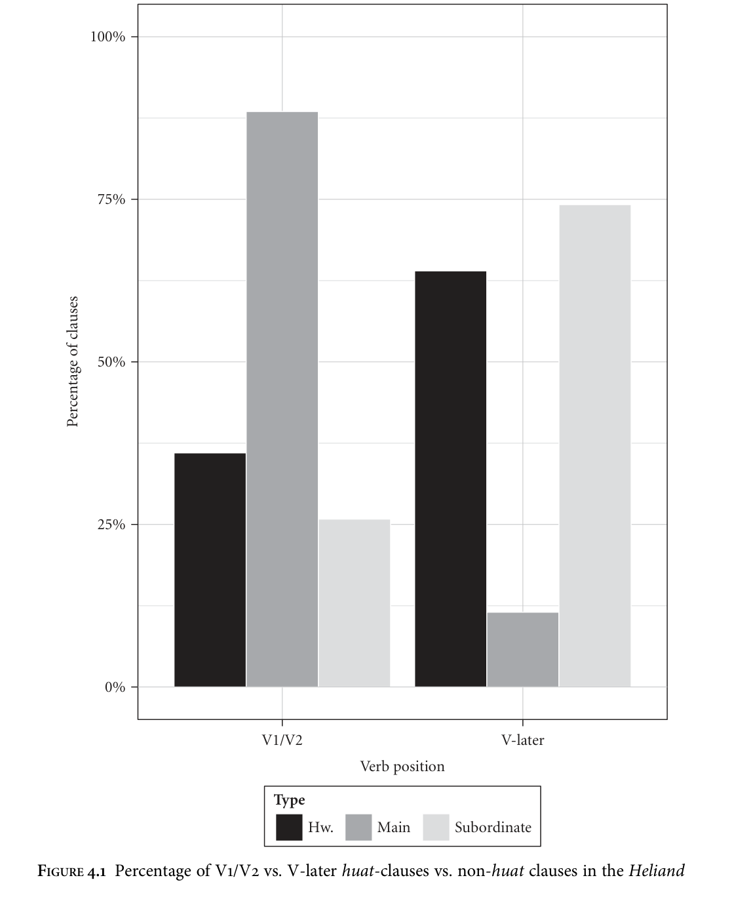
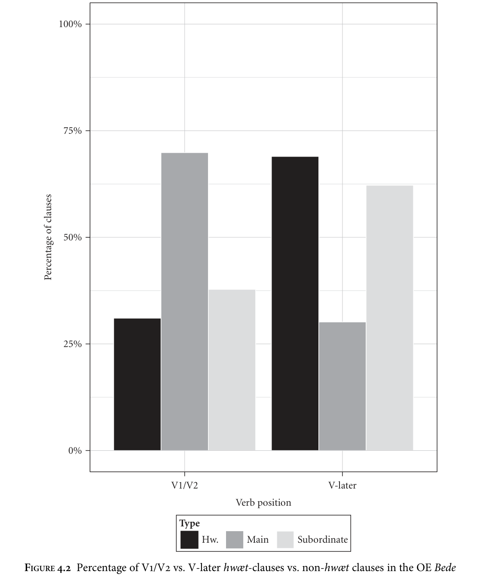
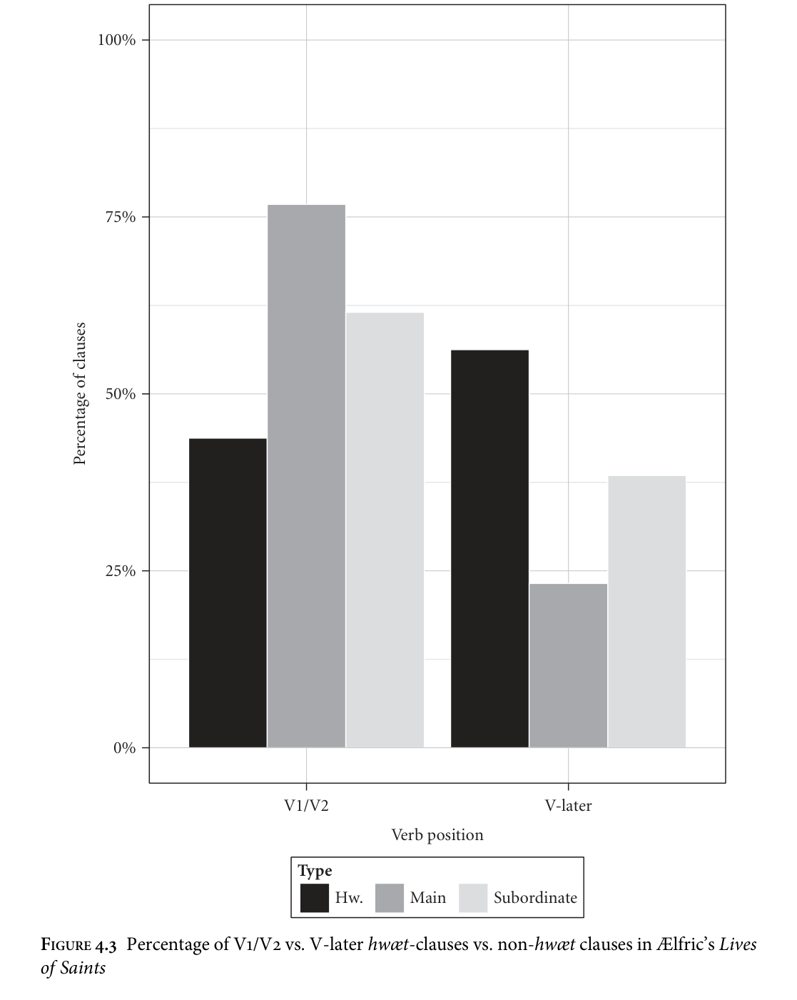

<!-- source page: 113 -->

4

The wh-system of early Germanic

## 4.1 Introduction

This chapter capitalizes on the intuition that syntactic reconstruction is lexical reconstruction in order to reconstruct aspects of the early Germanic wh-system. Lexical-phonological reconstruction has enabled us to posit forms for the early Germanic wh-pronouns going all the way back to Proto-Indo-European (see e.g. Ringe 2006: 289–90; Lehmann 2007: §3.4.5). The forms Ringe reconstructs for Proto- Germanic are given in Table 4.1. One separate neuter form exists, *hʷat in the nominative and accusative singular; only Gothic has separate feminine forms, and these are arguably secondary developments (Prokosch 1939: 279). In addition to these nominal interrogative pronouns ‘who’ and ‘what’, nonargumental forms, originally derived from the above paradigm, can be reconstructed for Proto-Germanic: *hʷar ‘where’, *hʷana ‘when’, *hʷō ‘how’. For ‘why’, a form of the instrumental argumental pronoun, combined with a preposition, was used. In addition there were the forms *hʷaþeraz/*hʷeþeraz, discussed in section 4.4. The task of the syntactic reconstructor is then to pair these forms, along with corresponding functional heads in the C-domain, with an appropriate syntax. Though much has been said about the syntax of interrogatives in Germanic (e.g. Kiparsky 1995; Eyþórsson 1995; Fuß 2003; Ferraresi 2005: 134–6; Axel 2007: 173–89, within the generative tradition alone), many things remain to be said. In this chapter I first give an overview and analysis of constituent order in the wh-system, following on from the discussion of declarative main clauses in Chapter 3. The following sections are devoted to more detailed examinations of individual wh-elements. Section 4.3 analyses attested cases of ‘underspecification’ of reflexes of *hʷat in the early Germanic languages, in the sense of Munaro and Obenauer (1999); section 4.4 discusses the forms *hʷaþeraz/*hʷeþeraz and their reflexes in the early Germanic languages. A theme of this chapter is that comparative work on the grammars of living languages can inform work on historically attested languages and on reconstruction.

<!-- source page: 114 -->

**TABLE 4.1. Proto-Germanic interrogative pronouns (Ringe 2006: 290)**

```text
Nom.
Acc.
Gen.
Dat.
Instr.
```

```text
Masc.
*hʷas (*hʷis?)
*hʷanǭ
*hʷes (*hʷas?)
*hʷammai
*hʷē, *hʷī
Neut.
*hʷat
*hʷat
*hʷes (*hʷas?)
*hʷammai
*hʷē, *hʷī
Fem.
*hʷō
*hwǭ
*hʷezōz
*hʷezṓi (?)
*hʷezō
```

## 4.2 Word order in wh-interrogatives

### 4.2.1 V2 in wh-interrogatives

Direct wh-interrogatives in the early Germanic languages have often been held up as cases in which V-to-C0 movement can be observed, contrary to the earlier view that Proto-Germanic was consistently verb-final. Examples (1)–(5) illustrate wh-Vfin order in Gothic, ON, OE, OHG, and OS.

```text
(1)
ƕa
skuli
þata
barn
wairþan?
what
shall
that
child
become
‘What shall that child become?’
(Gothic Bible, Luke 1: 66; Greek Majority Text: τι αρα το παιδιον τουτο εσται;
Eyþórsson 1996: 110)
```

```text
(2)
hverr
fell
af
láginni?
who.masc
fell
off
log.def
‘Who fell off the log?’
(Hkr I.335.9; Faarlund 2004: 227)
```

```text
(3)
Hwi
wolde
God
swa
lytles
þinges
him
forwyrnan
why
would
God
such
small.gen
thing.gen
him
deny.inf
‘Why would God deny him such a small thing?’
(cocathom1,+ACHom_I,_1:181.74.71; van Kemenade 1987: 112)
```

```text
(4)
bihuuiu
uuard
christ
in
liihhi
chiboran?
why
became
Christ
in
flesh
born
‘Why was Christ born in the flesh?’
(Isidor 487; Axel 2007: 55)
```

```text
(5)
huî
uuilliad
gi
sô
slâpen?
why
want
you
so
sleep.inf
‘Why do you want to sleep so?’
(Heliand 4777)
```

The V2 pattern with wh-items in the early Germanic languages is extremely robust. For Gothic, Ferraresi (2005: 45) states that ‘subject-verb inversion in questions is not

<!-- source page: 115 -->

the rule’, and that the order in which the subject precedes the verb is more common. However, Eyþórsson (1995: 24) observes that ‘in wh-questions there is a tendency for the verb to follow the wh-phrase directly’, even when this leads to deviations from the Greek original, as in (1). He concludes that ‘verb movement to C takes place in whquestions’ (1995: 26). Fuß (2003) considers a number of apparent counterexamples to the V2 generalization in Gothic and argues that, since in all such examples the constituent order is identical to that of the Greek, V-to-C0 movement can be said to be systematic in the grammar of this language. For ON, Faarlund (2004: 231) takes it as given that direct wh-interrogatives are V2. A search of the IcePaHC corpus (Wallenberg et al. 2011) reveals that 1,151 (93.2%) of 1,235 direct wh-interrogatives are V2, and many of the 84 exceptions can be read as indirect wh-interrogatives or exclamatives. For OE, Kiparsky (1995: 144–5) states that ‘wh-questions always have verb-second order’, and hence that ‘wh-phrases induce verb second’. Fischer et al. (2000: 106) state that constituent questions are exceptionlessly V2. A search of the YCOE (Taylor et al. 2003) gives 2,124 (97.7%) of 2,173 direct wh-interrogatives as V2.1 As with ON, many of the 49 exceptions can be read as indirect wh-interrogatives or exclamatives. For early OHG, Axel (2007: 54 n. 31) reports that 22 of 25 examples of wh-interrogatives in the Isidor and all 14 instances in the Monsee Fragments are V2. She also cites Dittmer and Dittmer (1998) as investigating four chapters of the Tatian and finding that 10 of the 11 examples of wh-interrogatives found are V2. For later OHG, Axel (2007: 55 n. 32) cites Näf (1979: 161–2) as finding that all 113 examples in Notker’s Consolatio translation are V2, often deviating from the Latin. In Williram’s Song of Songs there are eight examples of wh-interrogatives, all of which are V2. In the OS Heliand, there are 49 independent wh-interrogatives; 42 of these are V2. One of the remaining examples is a clause introduced by hueđer, which will be discussed further in section 4.4. The remaining six counterexamples all involve te huî or be huî ‘why’. The generalization that such clauses involve a species of V-to-C0 movement of the finite verb (Eyþórsson 1995: 333) seems to be on firm ground, then, at least numerically speaking.2 The remainder of this subsection is devoted to ‘cleaning up’ the remaining recalcitrant examples in the hope of making the generalization exceptionless. These examples may also shed light onto the precise nature of V-to-C0 movement within a theory that assumes a more fine-grained C-system.

1 The 64 additional examples of non-V2 wh-interrogatives introduced by hwæþer are accounted for in section 4.4. 2 On even safer ground is the hypothesis that the early Germanic languages—and Proto-Germanic— were wh-movement languages, and not, for instance, wh-in-situ languages as is the case for modern Chinese (Huang, Li, and Li 2009: 260–81). I am not aware of a single counterexample.

<!-- source page: 116 -->

### 4.2.2 Particles, pronouns, topics, and the fine structure of the left periphery

of wh-interrogatives

The three non-V2 examples in the OHG Isidor, and the one non-V2 example in the Tatian (Dittmer and Dittmer 1998: 106), all involve elements intervening between the wh-pronoun and the finite verb. In addition, examples of this kind can be found in the Tatian. Two examples, from Axel (2007: 244–5), are given below.

```text
(6)
uuanan
uns
sint
in
uuostinnu
so
manigu
brot?
whence
us.dat
are
in
desert.dat
so
many
bread.pl
‘Where are we to get so much bread in a desert?’
(Tatian 295,23)
```

```text
(7)
uuer
mih
sazta
zi
duomen
oder
teilari
ubar
íúuúih
who
me
installed
to
judge
or
divider
over
you
‘Who made me a judge or arbiter over you?’
(Tatian 353,22)
```

This order may mimic the order of the Latin original, as in (7), but it also occurs independently, as in (6).3 Though data is sparse, it seems to be the usual pattern when pronominal elements are present: there are two other examples like (6) in the Isidor, and only one in which the pronoun follows the finite verb (Axel 2007: 245). A similar set of examples can be found in Gothic, as observed by Ferraresi (2005: 42–3) and Fuß (2003: 198–9).

```text
(8)
duƕe jus
mitoþ ubila in hairtam
izwaraim?
why
you.pl think
evil
in hearts.dat your.dat
‘Why do you think evil in your hearts?’
(Gothic Bible, Matthew 9: 4; Greek Majority Text: ινα τι υμεις ενθυμεισθε
πονηρα εν ταις καρδιαις υμων)
```

```text
(9)
ƕaiwa
þu
qiþis
þatei
frijai
wairþiþ?
how
you.sg
say
that
free
become
‘How do you say you will become free?’
(Gothic Bible, John 8: 33; Greek Majority Text: πως συ λεγεις οτι ελευθεροι
γενησεσθε)
```

Fuß (2003: 199) observes that in these examples the word order is parallel to that of the Greek original, and concludes on this basis that they ‘do not tell us anything about the syntax of Gothic’. This is problematic in that we must assume that these examples are fully ungrammatical in Gothic if we do not wish to posit this pattern as a native one. The hypothesis is also undermined by the occurrence of such examples in OHG ((6)–(7)) and also in OE, albeit very rarely, as in (10).

# 3 This is not to deny that Latin models may lead to an increased frequency of use of a particular variant

independently of direct translation; cf. Taylor (2008) on OE.

<!-- source page: 117 -->

```text
(10)
To hwon
þu
sceole
for owiht
þysne
man habban . . . ?
to
what.instr you should for anything this.acc man have.inf
‘Why should you esteem this man at all?’
(coblick,LS_32_[PeterandPaul[BlHom_15]]:179.139.2278)
```

Although extremely rare, such examples arguably parallel the cases of V3 in early West Germanic declarative main clauses assessed in Chapter 3, and hence suggest that there may have been a stage in which the left periphery of wh-interrogatives was more complex than simple V2. On the other hand, this requires these examples to be analysed as relics, and there is no secure basis for this reasoning (see Campbell 1990: 81–6 for discussion of the problem of identification of archaisms); they could equally well be innovations, or perhaps even scribal errors or ungrammatical, as Fuß (2003: 199) suggests. However, it is at least possible that examples such as (6)–(10) indicate that more than one constituent could move to the left periphery in early Germanic wh-interrogatives. Perhaps this option, as opposed to the far more frequent V2, was marginally available, analysed as archaic by speakers/authors, and therefore restricted in its distribution; this would explain its occurrence in the Gothic Bible only when corresponding exactly to the Greek original, and would save us having to posit the existence of ungrammatical strings in this text.4

Another set of examples involves topics apparently preceding the wh-word. Such cases can be found in Gothic, ON Eddic poetry, OE, and OHG.

```text
(11)
izwara
ƕas
raihtis
wiljands
kelikn
timbrjan . . . ?
you.gen.pl
who.nom
then
wanting
tower
build
‘For which of you, wanting to build a tower, . . . ?’
(Gothic Bible, Luke 14: 28; Greek Majority Text: τις γαρ εξ υμων ο θελων
πυργον οικοδομησαι; Eyþórsson 1995: 100)
```

```text
(12)
af
heilom
hvat
varð
húnom
mínom?
of
healthy.dat
what
became
sons.dat
my.dat
‘What became of my healthy sons?’
(Vo˛lundarkviða 32: 3–4; Eyþórsson 1995: 101)
```

```text
(13)
Se
behydda
wisdom
and
se
bedigloda
goldhord,
the
hidden
wisdom
and
the
concealed
gold-hoard,
hwilc
fremu
is ænigum on aðrum
þæra?
which benefit is any.dat
in
either.dat them.gen
‘The hidden wisdom and the concealed gold-hoard, what benefit does either
of them bring?’
(coaelhom,+AHom_9:40.1326)
```

4 However, there are also examples of Gothic wh-interrogatives in which the verb occurs late on the hypothesis that the particles involved are C0-oriented (Eyþórsson 1995: 102; Fuß 2003: 200–5). I have no account for these.

<!-- source page: 118 -->

```text
(14)
[christes
chiburt]i
huuer
siai
chirahhoda?
Christ’s
birth
who
her.acc
recounted
‘Who recounted the birth of Christ?’
(Isidor 106; Axel 2007: 209)
```

Kiparsky (1995: 143–5) suggests that the possibility of having a topic to the left of the wh-phrase was general to early Germanic (see also Hale 1987a, 1987b on Vedic Sanskrit and Hittite).5 There are other such examples in Gothic (cf. Ferraresi 2005: 44); however, Eyþórsson (1995: 99–101) stresses that (11) is the only one that does not match the Greek original, and furthermore it is possible for izwara ƕas in this example to be analysed as a single constituent. The cases in (13) and (14) from OE and OHG, also rare, contain resumptive elements, and hence these can be argued to involve clause-external hanging topics, not necessarily hosted in the clausal left periphery.6 The only totally unproblematic example of a moved topic preceding the wh-phrase is (12), then. This is the only example in the Eddic poetry corpus, though, as Eyþórsson (1995: 101) remarks, it may be significant that it is attested in one of the oldest of the Eddic poems. In any case, I concur with Eyþórsson (1995: 99) that this single example should not be taken to indicate that this possibility was general in early Germanic, contra Kiparsky (1995)—the data is too sparse to draw any clear conclusions.

### 4.2.3 Verb-late order in OE and OS wh-interrogatives

Six examples of verb-late order can be found in the OS Heliand. All of these involve the wh-phrase te huî or be huî ‘why’, literally a preposition followed by an instrumental form of the interrogative pronoun. Two examples are given below; the remaining examples can be found on lines 3816–17, 5182, 5342, and 5967.

```text
(15)
Bihuuî
thu hêr
dôpisli
fremis undar thesumu folke . . . ?
to-what.instr you here baptism do
under this.dat
people.dat
‘Why are you performing baptisms among these people?
(Heliand 927–8)
```

5 Kiparsky’s own OE example involves an adverbial clause to the left of a wh-phrase. However, these cases are not probative, as there is evidence that such clauses were not originally integrated into the main clause in Germanic (Axel 2002, 2004; Axel and Wöllstein 2009). 6 The classical diagnostics for left-dislocations, which are assumed to be movement-derived (Cinque 1977; Benincà and Poletto 2004), and hanging topics, which are not, are difficult to apply to these languages. Axel (2007: 209) analyses christes chiburt in (14) as nominative: if this were the case, then (14) would have to be analysed as a hanging topic. However, due to morphological syncretisms it could just as well be in the accusative.

<!-- source page: 119 -->

```text
(16)
fader
alomahtig . . . te huî
thu mik sô farlieti . . . ?
father almighty
. . . to what.instr you me
so forsook
‘Almighty Father, why have you forsaken me?’
(Heliand 5635–6)
```

Similar examples, also involving an item meaning ‘why’, can be found in OE.

```text
(17)
Hwy
þu
la
Drihten
æfre
woldest
þæt
seo
wyrd
what.instr
you
intj
Lord
ever
wanted
that
the
fate
swa
hwyrfan
sceolde?
so
turn
should
‘Why, o Lord, would you ever want Fate to turn thus?’
(coboeth,Bo:4.10.17.127)
```

```text
(18)
Eala, ge
eargan
& idelgeornan; hwy
ge
swa unnytte
intj you wretched.pl & lazy.pl
what.instr you so
useless
sien
&
swa
aswundne?
be
&
so
idle
‘Oh, you wretched and lazy people, why are you so useless and idle?’
(coboeth,Bo:40.139.7.2771)
```

```text
(19)
For
hwan
þu
us,
ece
god,
æfre
woldest
for
what.instr
you
us
eternal
God
ever
wanted
æt
ende
fram
þe
ahwær
drifan?
at
end
from
you
anywhere
drive.inf
‘Why, o Lord, would you ever want to drive us from you?’
(Paris Psalter, Psalm 73)
```

While from a language-internal perspective these cases may seem problematic, viewed through a cross-linguistic lens such examples are not so difficult to account for. Peculiarities with wh-items meaning ‘why’ have long led linguists to attribute a different syntactic structure to why-questions than to other wh-questions (e.g. Rizzi 1990: 46–8; Hornstein 1995: 147–50; Ko 2005; Stepanov and Tsai 2008). Questions involving ‘why’ have also been observed to be exceptional from an acquisitional perspective in English (Labov and Labov 1978; Crain, Goro, and Thornton 2006).7

Most recently, Shlonsky and Soare (2011) have proposed that why is externally Merged in the specifier of a functional projection, ReasonP, above negation and adverbials, then undergoes movement (in its short construal) to the specifier of IntP. The cartography of the left periphery they assume follows Rizzi (2001b) and is given in (20).

(20) ForceP > IntP > TopP > FocP > WhP > Fin(ite)P

7 I am grateful to an anonymous reviewer for pointing this out.

<!-- source page: 120 -->

Crucially, other wh-phrases, including why itself when it originates in a lower clause (long construal), move to SpecWhP, not SpecIntP. This difference in landing site may correlate with a difference in verb-movement. More must be said than this, however, since both OS and OE have why-questions that do appear to involve movement of the finite verb to the left periphery. In OS there are 15 examples of V2 why-questions as opposed to 6 where the verb is in a later position. Something else needs to be said about the distribution of V2, therefore. I suggest that the conditioning factor for verb-movement is whether the whyquestion is a ‘true’ question, i.e. a genuine request for information, as opposed to a ‘special’ question such as a rhetorical question (Obenauer 2004; see Berizzi 2010: 9–13 for discussion).8 It has been demonstrated that ‘true’ and ‘special’ questions may differ syntactically. In those examples without movement, such as (15)–(19), the interpretation is unlikely to be as a request for information. In (15) the speakers are asserting that John the Baptist has no right to perform baptisms, since he is not one of the prophets. Examples (16), (17), and (19) are questions to God, and we can reasonably assume that the speakers are not expecting their question to be responded to (directly); a number of other examples are of this nature. Finally, in (18) the speaker is not genuinely requesting that the wretched and lazy people give reasons for their being useless and idle. V2 why-questions, on the other hand, are most naturally analysable as true questions. In example (22), for instance, the disciples are asking Jesus why he wants to return to the Jews. Similarly, (23), from the OE Rule of St Benedict, is a question to ask potential monks, and (24) is a question asked of Philosophy by Boethius.

```text
(21)
te
huî
sind
gi
sô
forhta?
for
what.instr
are
you
so
afraid
‘Why are you so afraid?’
(Heliand 2253)
```

```text
(22)
te
huî
bist thu sô gern tharod, . . . fro
mîn, te faranne?
for what.instr are
you so keen there
lord my
to travel.inf
‘Why are you so keen to travel there, my lord?’
(Heliand 3987–8)
```

```text
(23)
Freond,
to
hwy
com
þu?
friend
for
what.instr
come
you
‘Friend, why have you come?’
(cobenrul,BenR:60.105.16.1090)
```

8 Obenauer (2004) in fact identifies three types of ‘special’ questions: surprise/disapproval questions, rhetorical questions, and Can’t-find-the-value-of-x questions.

<!-- source page: 121 -->

```text
(24)
Forhwi
ne
magon
hi?
for-what.instr
neg
may
they
‘Why can’t they?’
(coboeth,Bo:29.65.5.1211)
```

If the verb-late interrogatives in OE and OS (a) all involve why and (b) can all be analysed as special questions, this means that it is not necessary to weaken to a statistical generalization the claim that (genuine) interrogatives in early Germanic involve verb-movement to the left periphery: the variation can all be accounted for in a categorical manner, as is desirable given the considerations laid out in section 2.2.2. I will not here speculate on whether the ‘special why construction’ can be reconstructed for Proto-Northwest Germanic or Proto-Germanic.

## 4.3 Underspecified *hʷat?

The OE word hwæt is well known within Anglo-Saxon studies as the first word of the epic poem Beowulf.9 In editions of Beowulf this hwæt is often followed by a comma (e.g. Klaeber 1922; Fulk 2010) or an exclamation mark (Kemble 1835; Harrison and Sharp 1893). It is commonly held that the word can be ‘used as an adv[erb]. or interj[ection]. Why, what! ah!’ (Bosworth and Toller 1898, s.v. hwæt, 1) as well as in its normal sense, familiar from modern English, as the neuter singular of the interrogative pronoun hwā ‘what’. In this section I present new evidence from OE and OS constituent order which suggests that the additional punctuation after ‘interjective’ hwæt and its OS cognate huat is inappropriate: not only are hwæt and huat not extra-metrical, they are also unlikely to be extra-clausal in the vast majority of cases of their occurrence.10 I argue that ‘interjective’ hwæt is not an interjection or an adverb but rather is parallel to modern English how as used in exclamative clauses such as How you’ve changed! In other words, it is hwæt combined with the clause that follows it that delivers the interpretative effect of exclamation, not hwæt alone.

### 4.3.1 The traditional view

As alluded to earlier, hwæt, as well as being the nominative/accusative neuter singular of the interrogative pronoun, was able to perform an extra role in OE, as in the first line of Beowulf:

9 This section to a large extent replicates material published as Walkden (2013c), though the analysis in section 4.3.3 differs from that earlier version by suggesting (pace Rett 2008) that exclamatives pattern syntactically with indirect questions rather than free relatives. 10 In the rest of this section I use hwæt as a cover term for both OE hwæt and OS huat, as the behaviour of the two is almost identical. Where differences exist, these will be flagged up in the text. I gloss the item simply as ‘hw.’ throughout.

<!-- source page: 122 -->

```text
(25)
Hwæt we Gardena
in geardagum ·
þeodcyninga
þrym
hw.
we Spear-Danes.gen in year-days.dat nation-kings.gen power.acc
gefrunon hu
ða
æþelingas
ellen
fremedon ·
heard
how then/those.nom princes.nom valour performed
‘We truly know about the might of the nation-kings in the ancient times of the
Spear-Danes how princes then performed deeds of valour’
(Beowulf 1–3; Bammesberger 2006: 3)
```

Bammesberger (2006) follows Stanley (2000) in suggesting that hwæt ‘can function more or less as an adverb’ (2006: 5), and accordingly translates it as ‘truly’. Other translations include ‘What ho!’ (Earle 1892), ‘Lo!’ (Kemble 1837), ‘Hear me!’ (Raffel 1963), ‘Yes’ (Donaldson 1966), ‘Attend!’ (Alexander 1973), ‘Indeed’ (Jack 1994), ‘So’ (Heaney 1999), and ‘Listen!’ (Liuzza 2000). The OED (s.v. what, B.11) states that hwæt can be ‘used to introduce or call attention to a statement’ in older English, citing the above example among others. Mitchell and Robinson (1998: 45) and Mitchell and Irvine (2000) go so far as to analyse this instance of hwæt as an extra-metrical ‘call to attention’, although this is far from universally accepted (see, e.g., Stanley 2000: 555; Bammesberger 2006: 7 n. 5). This use of hwæt is found not only in early OE verse but also in prose, as in the following examples from the writings of Ælfric and the OE Bede:

```text
(26) hwæt
se
soðlice
onwriið
his
fæder
scondlicnesse
hw.
he
truly
discovers
his
father.gen
nakedness.acc
‘he certainly uncovers the nakedness of his father’
(cobede,Bede_1:16.70.15.657)
```

```text
(27)
Hwæt
ða
Eugenia
hi
gebletsode
hw.
then
Eugeniai
heri
blessed
‘Then Eugenia blessed herself ’
(coaelive,+ALS_[Eugenia]:171.295)
```

In OS, the cognate item huat can be found with an apparently similar interpretation, and in the editions this is similarly partitioned off from the clause following it by a comma (e.g. Sievers 1878, and the Heliand text in Behaghel and Taeger 1996) or an exclamation mark (e.g. the Genesis text in Behaghel and Taeger 1996).

```text
(28)
Huat,
thu
thesaro
thiodo
canst
menniscan
sidu
hw.
you
this.gen
people.gen
know.2sg
human
custom.acc
‘You know the customs of these people’
(Heliand 3101–2)
```

```text
(29)
‘huat, ik iu
godes rîki’,
quað he, ‘gihêt
himiles
lioht’
hw.
I
you.dat God’s kingdom.acc said
he
promised heaven’s light
‘“I promised you God’s kingdom,” he said, “heaven’s light.”’
(Heliand 4572–3)
```

<!-- source page: 123 -->

Grimm (1837: 448–51) remarked that within Germanic this use of the interrogative pronoun was specific to these two languages,11 emphasizing that the sense was not interrogative here, since the pronoun was not followed directly by the verb as in true interrogatives; furthermore, he demonstrates that the pattern cannot be merely an artefact of translation from a Latin original, since hwæt in OE translations (e.g. the OE Bede) is often inserted even when it corresponds to nothing overt in the original. Grimm notes that it always stands at the beginning of a clause, and that it often serves to introduce speech, or even a whole poem as in the case of Beowulf. His conclusion is that it is ‘purely an exclamation, albeit in a very moderate sense’.12

Brinton (1996) analyses hwæt as a pragmatic marker, suggesting that its function is ‘very similar to that of you know in Modern English’ (1996: 185).13 Brinton’s discussion reveals a remarkable range of functions for hwæt: for instance, it may serve to introduce an insulting ‘verbal assault’ on the addressee, but may also express deference or solidarity (1996: 188). Hwæt is also not uniform with respect to the status of information it introduces: it may indicate that the information to follow is common or familiar, serve to renew interest in that information and/or focus attention on its importance, but it may also precede new information (1996: 187–8). Several useful observations are made: for instance, that hwæt frequently (but not exceptionlessly) occurs with a first or second person pronoun (1996: 185). Brinton also discusses a potential path of grammaticalization of hwæt from its origins as an argumental interrogative pronoun (1996: 199–206). She suggests that it has lost its characteristics as a pronoun, e.g. its inflectional morphology and syntactic position, and undergoes ‘decategorialization’ to a particle or interjection. A situation of divergence, in the terminology of Hopper and Traugott (2003: 118–22), thus obtains, with hwæt continuing to function as an argumental interrogative in the grammar of OE. The general view of hwæt as having undergone grammaticalization is a cogent one, and will be adopted in what follows; however, I will argue that the data does not support the view that hwæt has proceeded to become a category-neutral particle or interjection. Garley, Slade, and Terkourafi(2010) also discuss hwæt in relation to Beowulf, and their article provides a useful summary of the received wisdom regarding the word.

11 It is striking that OHG exhibits no trace of this use. Hopper (1977) speculates that dat ‘that’ in line 35b of the OHG Hildebrandslied may be a scribal error for wat, and notes that this would fill the surprising lacuna. However, his hypothesis cannot be confirmed, and given the heavy OS influence on the Hildebrandslied the occurrence of wat here would not be a reliable indication that the construction was native to OHG. In addition, Stanley (2000: 527 n. 7) refers to Cleasby and Vigfusson (1874) for some potential ON examples of hvat as an interjection, although states that these are ‘certainly rare’. Although I have not investigated these in detail, the examples given (1874, s.v. hvat, B.II) do not seem parallel to those in OE and OS in which hwæt precedes a clause. 12 ‘ein bloßer ausruf, jedoch in sehr gemäßigtem sinn’ (1837: 450). 13 As Brinton notes (1996: 30–1), the definitions of pragmatic markers found in the literature seem to bear little resemblance to one another. Östman (1982), for example, includes the suggestion that pragmatic particles ‘tend to occur in some sense cut off from, or on a higher level than, the rest of the utterance’ (1982: 149); as will be demonstrated, this is unlikely to have been the case for hwæt.

<!-- source page: 124 -->

They take it to be a discourse-structuring formula, ‘a marker employed in the representation of spoken discourse’ (2010: 218). Supporting this, all 25 of the OS examples I have found in the Heliand occur in the speech of a character within the text. It ‘signals the character’s intention to begin a dialogue or a narrative’ (2010: 219); eight OE poems other than Beowulf begin in this way (2010: 219), and 15 of the 25 OS examples initiate a character’s speech, as in example (29) above. This might also explain the frequency of first and second person pronouns in clauses preceded by hwæt noted by Brinton. Less commonly discussed, however, are the cases in which hwæt cannot be assimilated to this discourse-initiating role. Garley, Slade, and Terkourafinote that it may also occur in the middle of a character’s speech, as in the remaining 10 OS examples, e.g. (28) above. Even more problematic than this is its occurrence (e.g. (26), (27)) in texts such as Ælfric’s Lives of Saints, and in particular the OE Bede, which are far less associated with prototypical orality and in which it therefore makes little sense to view hwæt as being representative of speech or functioning as a ‘call to attention’. Although hwæt clearly had this discourse-opening function in OE and OS, then, this function alone does not suffice to characterize its meaning.14

### 4.3.2 Problems with the traditional view

Stanley (2000) provides a recent and extensive discussion of hwæt in OE, although without discussing clausal word order. His conclusions are much the same as Grimm’s, and in addition he adduces metrical evidence to show that hwæt cannot have been a strong interjection: if it were stressed, then various instances of it in verse would have led to double alliteration, ‘breaking a basic prosodic rule’ (2000: 554). Against the Mitchell and Robinson view that hwæt was extra-metrical he argues that ‘if an opening word were felt to be divorced from the phrase that follows we might

14 For completeness it should be mentioned that in OE and OS, hwaet could also serve as an indefinite pronoun:

```text
(i)
Heo
is
uoluntas,
þæt
is
wylla,
þonne
heo
hwæt
wyle
she
is
uoluntas
that
is
will
when
she
hw.
wants
‘It is voluntas, that is will, when it wants anything’
(coaelive, +ALS_[Christmas]:189.147)
```

```text
(ii) that
he
thar
habda
gegnungo
godcundes
huat
forsehen
that
he
there
had
obviously
holy.gen
hw.
seen
‘that he had seen something holy there’
(Heliand 188–9)
```

Behaghel (1923: 366–7) suggests that in OE, and in all other older Germanic languages except OS, hwæt was restricted to contexts that we would now describe as licensing negative polarity items (cf. Baker 1970, Haspelmath 1997, Giannakidou 1998, and Rowlett 1998 for discussion of this concept). He argues that the use of hwæt in positive contexts in OS, as in (ii), must be an innovation, since only one putative example can be found in Gothic (Galatians 2: 6) while it is relatively frequent in OS. The meaning of OE hwæt, when used as an indefinite, was therefore presumably closer to modern English ‘anything’, whereas OS huat could additionally mean ‘something’.

<!-- source page: 125 -->

have expected it to be occasionally followed by a mark of punctuation, as is hwætla in a good Ælfric manuscript’ (2000: 555). In actual fact, OE manuscripts never show punctuation between hwæt and a following clause (2000: 525), and the same is true of OS: no punctuation mark is ever found between huat and a following clause in any of the manuscripts of the Heliand containing a relevant example (Cotton, Munich, Straubing).15 Furthermore, Stanley points out that Ælfric’s grammar of Latin and OE16 (edition Zupitza 1880) did not include hwæt as an interjection, commenting that ‘Ælfric’s omission is surprising seeing that this word when used to open a sentence appears to function often as an interjection’ (2000: 541). So far, then, we have seen that the traditional view of hwæt as an adverb or interjection (Bosworth and Toller 1898) outside the clause and potentially extrametrical, possibly serving as a ‘call to attention’ (Mitchell and Robinson 1998), suffers from a number of problems, many already noted by Grimm (1837) and Stanley (2000). These are listed below for ease of reference:

(a) Hwæt must usually be analysed as unstressed; (b) no punctuation between hwæt and the following clause is ever found; (c) a contemporary grammarian did not analyse hwæt as an interjection; (d) hwæt is not exclusively found in texts connected to primary orality, and does not always serve to initiate speech.

Constituent order facts are also problematic for the interjection hypothesis. Traditional philological works on syntax make little mention of constituent order in connection with hwæt. Behaghel (1923–32) does not mention the construction at all. Visser (1969: 1547) provides several examples of what he considers to be SV word order with initial interrogative hwæt, but, as Mitchell (1985: 680) points out, ‘these can all be taken as non-dependent exclamations’. Hopper (1977: 483) suggests that the hwæt-construction is quasi-formulaic and may therefore be likely to have the ‘archaic’ verb-final order, but does not go into any detail on this point. Likewise, Mitchell (1985: 299–300 n. 95) suggests that interjections like efne ‘lo!/behold!’ and hwæt may influence word order, but does not elaborate on this. More recently, within a generative framework, Koopman (1995), in his discussion of verb-final main clauses in OE prose, observes that ‘influence of style is . . . noticeable in the word order after the interjection hwæt’ (1995: 140; see also Ohkado 2005: 246).

15 The Cotton manuscript, Caligula A VII, I was able to check personally at the British Library. The other two were checked by means of digitized versions made available online by the Bayerische Staatsbibliothek. 16 It has been argued (e.g. Law 1987) that Ælfric’s grammar is not a grammar of OE at all, since its primary intended use is as an aid to learners of Latin. However, ‘when Ælfric explains that language is made of andgytfullic stemn, when he shows how patronyms are formed in English, when he divides English nouns into twenty-eight categories and English adverbs into twenty-three, he is analyzing English as a grammatical entity’ (Menzer 2004: 122–3).

<!-- source page: 126 -->

**TABLE 4.2. Frequency and percentage of V1/V2 vs. V-later huatclauses vs. non-huat main clauses in the Heliand**

V1/V2 V-later Total

```text
N
%
N
%
N
```

```text
Huat
9
36.0
16
64.0
25
Non-huat (main)
2078
88.5
270
11.5
2348
Total
2087
–
286
–
2373
```

**TABLE 4.3. Frequency and percentage of V1/V2 vs. V-later huatclauses vs. non-huat subordinate clauses in the Heliand**

V1/V2 V-later Total

```text
N
%
N
%
N
```

```text
Huat
9
36.0
16
64.0
25
Non-huat (sub)
567
25.8
1629
74.2
2196
Total
576
–
1645
–
2221
```

However, the constituent-order patterns found in both OE and OS are too pervasive and significant to be ascribed to archaism or stylistic choices alone. Under the hypothesis that huat is an extra-clausal interjection, separated from the clause itself by a comma in writing that corresponds to a pause in speech, the null hypothesis as regards the constituent order of the following clause would be that no difference would obtain between these and other main clauses. This prediction is not, however, borne out by the data in Table 4.2.17 Here all the non-interrogative clauses preceded by huat in the Heliand have been considered, and are compared to all the other non-conjunct main clauses in the Heliand. Although the number of huat-clauses is very small, once again, the difference between the two types of clause is clearly statistically significant (p< 0.0001). For anyone who takes huat to be clause-external, this result must surely be a mystery: if huat influences the constituent order of the clause that follows it, it must be a part of that clause, and hence not an ‘interjection’. Comparing clauses followed by huat to (non-conjunct) subordinate clauses, as in Table 4.3, is also instructive. Here the difference between the two types of clause is not statistically significant at the 0.05 level (p= 0.2545). This suggests that we should

17 hwæt and huat themselves are not treated as clausal constituents in the figures given in Table 4.2 and beyond, nor is the þa normally collocated with hwæt by Ælfric, since, if the null hypothesis is that these were true extra-clausal particles, it should not be assumed that they were clausal constituents when assessing this hypothesis. Instead these elements are discounted for the purpose of counting constituents.

<!-- source page: 127 -->



hypothesize that these two types of clause pattern together; in other words, clauses introduced by huat have the word order of subordinate clauses. Figure 4.1 illustrates the findings in Tables 4.2 and 4.3. Similar results are found for OE. In the OE Bede, 20 of the 29 clauses preceded by hwæt (69.0%) have the verb in a position later than second (see Table 4.4 and

<!-- source page: 128 -->

**TABLE 4.4. Frequency and percentage of V1/V2 vs. V-later hwætclauses vs. non-hwæt clauses in the OE Bede**

V1/V2 V-later Total

```text
N
%
N
%
N
```

```text
Main (non-hwæt)
1898
69.9
819
30.1
2717
Subordinate
1863
37.8
3067
62.2
4930
Hwæt
9
31.0
20
69.0
29
Total
3770
–
3906
–
7676
```

Figure 4.2). In Ælfric’s Lives of Saints, excluding five examples of the true interjection hwæt la (cf. Stanley 2000), 112 clauses preceded by hwæt can be found, 63 of which have the verb in a position later than second (56.3%; see Table 4.5 and Figure 4.3). The results of contingency tests based on this data are clear.18 As in the OS Heliand, main and subordinate clauses pattern distinctly differently in the Historia translation (p < 0.0001). While the constituent order in hwæt-clauses and main clauses is once again dramatically different (once again p < 0.0001), the difference between constituent orders in hwæt-clauses and in subordinate clauses falls well short of significance (p=0.5657). The argument for hwæt-clauses patterning with subordinate clauses in this text is thus even stronger than for the huat-clauses in the Heliand. Ælfric’s Lives of Saints is a substantial OE text dated around 996–7. Although direct sources in Latin can be identified, Ælfric’s translation is generally argued (e.g. by Bethurum 1932) to be very free and idiomatic, making it a suitable object for syntactic investigations. This text has a very different range of constituent order patterns from that found in the OE Bede. While the position of the verb differs substantially between main and subordinate clauses (p < 0.0001), subordinate clauses themselves far more often have the verb in an early position than in the OE Bede. As a result, hwæt-clauses, which more frequently have the verb later, differ very significantly from both main (p < 0.0001) and subordinate (p=0.0002) clauses. Here, then, it cannot be said that hwæt-clauses pattern with subordinate clauses; instead they seem to follow a pattern of their own, with the verb much more likely to be later than in other clauses in general. The fact that broadly the same results are obtained for OE and OS—a general preference for verb-later order in hwæt-clauses—makes it unlikely that the

18 Frequency data for main and subordinate clauses in the Historia translation and Ælfric’s Lives of Saints has been obtained by searching the relevant parts of the YCOE (Taylor et al. 2003) using Corpus- Search 2.0 (Randall 2005–7) and taking hit frequency counts. The queries I used to obtain these values can be obtained at <http://www.dspace.cam.ac.uk/handle/1810/226419>. Although the data is presented here in a single table for ease of exposition, for the purpose of the Fisher’s exact tests I compared hwæt-clauses to main clauses and subordinate clauses separately.

<!-- source page: 129 -->



constituent order differences between hwæt-clauses and other main clauses are the result of innovation in both languages; although parallel innovation (perhaps contact-facilitated) cannot be ruled out, by the criterion of diachronic parsimony it should be assumed that the verb-late pattern was the original one, and that hwætclauses patterned with subordinate clauses from their inception.

<!-- source page: 130 -->

**TABLE 4.5. Frequency and percentage of V1/V2 vs. V-later hwætclauses vs. non-hwæt clauses in Ælfric’s Lives of Saints**

V1/V2 V-later Total

```text
N
%
N
%
N
```

```text
Main (non-hwæt)
3204
76.8
969
23.2
4173
Subordinate
3467
61.5
2168
38.5
5635
Hwæt
49
43.7
63
56.3
112
Total
6720
–
3200
–
9920
```

To recapitulate: in terms of constituent order, clauses introduced by hwæt in OE and OS pattern statistically with subordinate clauses (including dependent questions and free relatives), rather than with main clauses as would be expected if hwæt were a free-standing interjection. In combination with the other issues raised by Stanley (2000) and listed in this subsection, the constituent order data therefore gives us strong reason to doubt that hwæt had such a syntactic role or status. In the next subsection I hypothesize as to the correct interpretation and analysis of hwæt-clauses.

### 4.3.3 An underspecification analysis

As a starting point for an investigation into the role of hwæt it is instructive to look at other languages in which the interrogative pronoun appears to exhibit polysemy. Munaro and Obenauer (1999) present three such languages: German, French, and Pagotto (a sub-variety of the northeastern Italian dialect of Bellunese). Interestingly, the sets of meanings contributed by the interrogative pronouns in these (not very closely related) languages do not appear to differ arbitrarily but instead intersect in several key ways. First, in all three of these languages the interrogative pronoun can be used non-argumentally to mean ‘why’ or ‘how’ in questions, as in examples (30) from German, (31) from French,19 and (32) from Pagotto:

```text
(30)
Was
rennst
du
so
schnell?
what
run
you
so
fast
‘Why are you running so fast?’ (Munaro and Obenauer 1999: 184)
```

```text
(31)
Que
ne
partez-vous?
what
neg
leave-you
‘Why don’t you leave?’ (Munaro and Obenauer 1999: 208)
```

19 The French examples are essentially only acceptable in negative contexts if at all; Munaro and Obenauer report that this use of que is rare in all registers.

<!-- source page: 131 -->



<!-- source page: 132 -->

```text
(32)
Cossa
zìghe-tu?
what
shout-you
‘Why are you shouting?’ (Munaro and Obenauer 1999: 191–2)
```

Similar examples can be found in OE ((33)) and OS ((34)), as well as in ON ((35) and (36)):

```text
(33)
Hwæt
stendst
þu
her
wælhreowa
deor?
hw.
stand
you
here
cruel
beast
‘Why are you standing here, cruel beast?’
(coaelive,+ALS_[Martin]:1364.6872)
```

```text
(34)
huat
uuili
thu
thes
nu
sôken
te
ûs?
hw.
will
you
this.gen
now
seek
to
us
‘why do you now complain about this to us?’
(Heliand 5158)
```

```text
(35)
hvat
þarftú
at
spyrja
at
nafni
minu?
what
need-you
to
ask
to
name.dat
mine.dat
‘Why do you need to ask my name?’
(Cleasby and Vigfusson 1874, s.v. hvat, A.I.3)
```

```text
(36)
hvat mun ek þat
vita?
what may I
that know
‘How could I know that?’
(Cleasby and Vigfusson 1874, s.v. hvat, A.I.3)
```

Latin also permits this non-argumental use of the interrogative pronoun quid:

```text
(37)
quid
plura
disputo?
what
more
dispute.1sg
‘Why do I dispute at greater length?’
(Cic. Mil. 16, 44; Lewis and Short 1879, s.v. quis, II.b)
```

```text
(38)
quid
venisti?
what
came.2sg
‘Why have you come?’
(Plaut. Am. 1, 1, 209; Lewis and Short 1879, s.v. quis, II.b)
```

Such non-argumental uses of interrogative pronouns can also be found in Arabic (Ruba Khamam, p.c.), Ancient Greek (Brian Joseph, p.c.), Dutch, some varieties of Norwegian (Vangsnes 2008), and the early Celtic languages (Lewis and Pedersen 1937: 226–9).

<!-- source page: 133 -->

Secondly, German ((39)), French ((40)), and Pagotto ((41)) also permit the interrogative pronoun to occur non-argumentally in exclamatives; German was and French que alternate in this role with the more usual wie and comme respectively.

```text
(39)
Was
du
dich
verändert
hast!
what
you
refl
changed
have
‘How you’ve changed!’
```

```text
(40) Que
il
vous
aime!
what
he
you
loves
‘How he loves you!’ (Munaro and Obenauer 1999: 211)
```

```text
(41)
Cossa
che’l
ghe
piaze,
al
gelato!
what
that.cl
him
please.3sg
the
ice-cream
‘How he loves ice cream!’ (Munaro and Obenauer 1999: 211)
```

Dutch also permits exclamatives using the interrogative pronoun wat, as in (40) (cf. Corver 1990):

```text
(42)
Wat
ben
jij
veranderd!
what
are
you
changed
‘How you’ve changed!’
```

Such a construction is also possible for older speakers of Afrikaans (Theresa Biberauer, p.c.). For present purposes, the important thing to note about all these examples is that certain other languages systematically exhibit a range of possible uses/meanings for their interrogative pronoun that are not possible with modern English what. Munaro and Obenauer discuss two possible analyses of this state of affairs: either these wh-words are identical in phonological form by chance, or the two are closely and intrinsically related (1999: 185). The first view, ascribing the variety of meanings of what looks like the interrogative pronoun to accidental homophony of a variety of lexical items, cannot be ruled out, as there are many cases of such homophony throughout attested human languages: indeed, it seems plausible that this is the case with the OE adjective hwæt ‘quick, active, vigorous, stout, bold, brave’, which is generally agreed to be related in no way to the interrogative pronoun hwæt but instead to be derived from the verb hwettan ‘to whet’ (cf. e.g. Bosworth and Toller 1898, s.v. hwæt, 2). However, as Munaro and Obenauer point out (1999: 222), when the same range of meanings for the interrogative pronoun crops up in language after language it becomes increasingly unlikely that this is due to chance homophony, especially when the languages in question are not closely related. Munaro and Obenauer instead pursue an analysis in which the relevant interrogative pronoun in German, French, and Pagotto may in each of these languages be semantically underspecified for certain features. They adduce distributional syntactic

<!-- source page: 134 -->

data from these languages to illustrate this. For instance, normal wh-words can be coordinated in German, as in (43) and (44), but this is not possible with ‘why’-like was or ‘how much’-like was, as illustrated in (45) and (46).

```text
(43)
Wann
und
warum
hast
du
mit
Max
gesprochen?
when
and
why
have
you
with
M.
spoken
‘When and why did you speak to Max?’
(Munaro and Obenauer 1999: 226)
```

```text
(44) Wie
laut
und
wie
lange
er
geschrien
hat!
how
loud
and
how
long
he
shouted
has
‘How loud and how long he shouted!’
```

```text
(45)
*Wann
und
was
hast
du
mit
Max
gesprochen?
when
and
what
have
you
with
M.
spoken
‘When and why did you speak to Max?’
```

```text
(46) *Was
und
wie
lange
er
geschrien
hat!
what
and
how
long
he
shouted
has
‘How much and how long he shouted!’
```

These non-argumental uses of was are also unable to function as contrastive focus and cannot appear in truncated questions (Munaro and Obenauer 1999: 227); the same restrictions hold, mutatis mutandis, in French and Pagotto (1999: 229–33). In the spirit of Cardinaletti and Starke (1999), who account for the difference between strong and weak pronouns cross-linguistically in terms of structural impoverishment, Munaro and Obenauer propose that a piece of word-internal syntactic structure is absent from the structure of underspecified wh-items. They do not state explicitly what the missing piece of structure is, but they suggest that it ‘must be linked to the expression of argumenthood, and contain the semantic restriction . . . [+thing]’ (1999: 236). The correct interpretation of the wh-item—as an argument in certain questions when fully specified, as ‘why’ or ‘how’ when underspecified and non-argumental in questions, and as ‘how’ or ‘how much’ when underspecified in exclamatives—must be vouchsafed by the particular context in which it occurs. Specifically, in its non-argumental use speakers prefer the wh-item to be accompanied by an expression of the speaker’s attitude, particularly of surprise: this is inherently present in exclamatives, and can be expressed in e.g. German questions by use of a modal particle such as denn, or by a particular intonation pattern. Jäger (2000) and Holler (2009), within Minimalist and HPSG syntactic frameworks respectively, have also argued independently that there must exist a form of was in German that is underspecified for [thing] and therefore non-argumental, as in

<!-- source page: 135 -->

examples (30) and (39) above.20 If the underspecification logic outlined above holds in general, then it is tempting to analyse the OE and OS interrogative pronoun hwæt along the same lines as modern German was, French que, and Pagotto cossa, etc., namely as a wh-item which may occur non-argumentally in an underspecified form. Although it is not possible to test for contrasts such as those in (43)–(46) in OE or OS for obvious reasons, the corpus data we have is compatible with the analysis outlined above. So where does this lead us with regard to examples of clauses such as (25)–(29)? Clearly, as observed by Grimm (1837: 449), these clauses cannot be interrogative, since the word order is not that of matrix questions, hwæt cannot be argumental in these clauses, and no sensible interrogative interpretation is available in the contexts in which they occur. The remaining possibility is that these clauses are in fact exclamatives. Munaro and Obenauer (1999) have little to say about the analysis of exclamatives, or how the underspecified interrogative pronoun receives its interpretation of ‘how’ or ‘how much’, speculating only that ‘since it is structurally and . . . semantically deficient in ways parallel to “why”-like WHAT, the interpretation it eventually gets should again be construed from elements of the sentential context’ (1999: 248). To pursue the matter further we must turn to analyses of exclamatives themselves, since the hypothesis that hwæt-clauses are exclamatives can only be tested through comparison with the properties and structures of exclamatives in general. Current and past analyses of exclamatives have generally proposed that a key component of the interpretation of exclamatives is that their content must involve something related to degree/scalarity (e.g. Bolinger 1972; Corver 1990; D’Avis 2002; Zanuttini and Portner 2003; Sæb× 2005; Rett 2008, 2009). For simplicity’s sake I will adopt here the semantic proposal of Rett (2008, 2009), who suggests the following two restrictions on the content of exclamatives:

```text
(47)
The Degree Restriction (Rett 2008: 147, her (4))
An exclamative can only be used to express surprise that the degree property
which is its content holds of a particular degree.
```

```text
(48)
The Evaluativity Restriction (Rett 2008: 155)
The content of the exclamative must additionally be evaluative: the degrees it
makes reference to are restricted such that they must exceed a contextual
standard.
```

20 Another set of data potentially supporting the underspecification analysis of German was, as Munaro and Obenauer (1999: 236) note, is constituted by ‘expletive wh’-clauses such as (i).

```text
(i)
Was
glaubst
du,
wen
Maria
getroffen
hat?
what
believe
you
who
M.
met
has
(Felser 2001: 5)
```

Since the literature on this phenomenon cross-linguistically is substantial and the correct analysis controversial (cf. Dayal 1996, Horvath 1997, and Felser 2001, 2004, inter alia), it will not be discussed further here.

<!-- source page: 136 -->

The Degree Restriction is key for our purposes. Consider (49) (from Rett 2008: 147, her (5b)):

(49) What languages Benny speaks!

This can be taken to express surprise at the number of languages Benny speaks, even in the absence of any overt degree morphology, for example in the context where Benny is an American and you expect him to speak only English (the ‘amount reading’). Another context might be one where Benny is a Romance linguist and you expect him to speak only Romance languages, but in fact he speaks languages from other obscure/exotic language families; this is the ‘gradable reading’ of (49), in which surprise is being expressed at the degree to which the languages Benny speaks are exotic. Note that no overt gradable predicate ‘exotic’ is present in the sentence, but this interpretation is nevertheless available. Rett takes this to mean that a null gradable predicate , an adjective (or adverb) that receives its value from context, must be posited for the gradable reading as a ‘necessary evil’ (2008: 149). In a situation where you expect Benny to speak Portuguese and Romanian but discover that he instead speaks French and Italian, on the other hand, uttering (49) would be expressively incorrect. The impossibility of this ‘individual reading’ of (49) leads Rett to conclude that the degree reading, and hence the Degree Restriction, is an essential part of exclamativity: ‘non-degree readings are impossible interpretations of exclamatives’ (2008: 151; emphasis original). It follows that syntactic constructions used to express wh-exclamatives must be able to denote a degree property (Rett 2008: 168–9). The two possible candidates are (degree) constituent questions and free relatives. The one systematic syntactic difference between these two types of construction in modern English is that subjectauxiliary inversion is required in constituent questions (contrast (50) and (51)) and impossible in free relatives ((52)–(53)); in English, subject-auxiliary inversion is impossible in traditional wh-exclamatives too ((54)–(55)).

```text
(50)
How big is your car?
(51)
*How big your car is?
(52)
*I’ll buy what are you selling.
(53)
I’ll buy what you are selling.
(54)
*How big is your car!
(55)
How big your car is!
```

Questions and free relatives differ morphosyntactically in many languages other than English, and here Rett makes a stronger claim: ‘in any such language I know of, exclamatives pattern in their morphosyntax with free relatives rather than with questions’ (2008: 173), although she cautions that ‘a thorough crosslinguistic study

<!-- source page: 137 -->

of these constructions is necessary to give any serious weight to this claim’.21 In Hebrew, for instance, exclamatives and free relatives require an overt complementizer, but questions do not (2008: 175–6); in German and Icelandic, independent exclamatives typically have subordinate clause word order, lacking the full V2 present in main clauses. While Rett’s semantic analysis is in principle neutral as to whether the morphosyntactic structure underlying wh-exclamatives is that of a question or a free relative, then, she favours the latter view. If we assume that hwæt-clauses are exclamatives, the data from OS and OE casts some doubt on Rett’s claim. In these languages, a swa wh swa construction is typically used for free relatives, as in (56) and (57) (Mitchell and Robinson 2007: 80).

```text
(56)
Swa hwær swa ic beo, hie beoð mid me
so
where so
I
be,
he
is
with me
‘Wherever I am, he is with me’
(coboeth,Bo:7.17.18.274)
```

```text
(57)
that it sô giuuerđen scal, sô huan sô thius uuerold endiod
that it so become
shall so when so this
world
ends
‘that it shall be so, when this world ends’
(Heliand 4046)
```

As in the modern Scandinavian languages, a wh-element is not usually used alone to introduce a relative clause (see Berizzi 2010: 77–80 for discussion). It is only in Middle English that this modern use becomes prevalent (Mitchell and Robinson 2007: 73–4), although a few examples can be found in both OE and OS:

```text
(58)
forðan
ic
leng
næbbe
hwæt
ic
on
his
lacum
aspende
because
I
longer
neg-have
hw.
I
on
his
service
spend
‘because I no longer have anything to spend in his service’
(coaelive,+ALS[Lucy]:66.2205)
```

```text
(59)
hie . . . ne
lêt that manno
folc
uuitan, huat sia
uuarahtun
he . . .
neg let the
men.gen people know
hw.
they did
‘He did not let the people know what they were doing’
(Heliand 5393–4)
```

21 Some examples exist that are difficult to account for under this generalization. See Nye (2009) for a discussion of ‘how pseudo-questions’, an inversion-exhibiting construction in modern English that shares many interpretative properties with traditional wh-exclamatives although appearing formally identical to constituent questions at first sight:

(i) How cool is that?!

German exclamatives can also be V2 instead of V-final, subject to some restrictions:

```text
(ii) Was
hast
du
dich
verändert!
what
have
you
refl
changed
‘How you’ve changed!’
```

<!-- source page: 138 -->

However, a third possibility, not discussed by Rett, is that exclamatives pattern with indirect questions. Indirect questions in OE (Mitchell and Robinson 2007: 73) and OS are introduced by wh-words, as in examples (60) and (61).

```text
(60)
se
halga
Thomas . . . acsode
urne
Dryhten
hwænne
the
holy
Thomas . . . asked
our
Lord
when
Antecristes
cyme
wære
Antichrist’s
coming
were
‘St Thomas asked our Lord when the Antichrist would arrive’
(coverhom,HomU_6_[ScraggVerc_15]:1.1850)
```

```text
(61)
Thô
frâgode
sie
the
hêlago
Crist,
aftar
then
asked
them
the
holy
Christ,
after
huemu
thiu
gelîcnessi
gilegid
uuâri
whom
the
picture
laid
were
‘Then Jesus asked them who the picture was of ’
(Heliand 3825–6)
```

As I demonstrated in 4.3.2, hwæt-clauses pattern with subordinate clauses in terms of verb position. Constituent questions in OE are exceptionlessly V2 (cf. e.g. Fischer et al. 2000: 106), and the same seems to hold for OS, once a few specific classes of apparent counterexample have been properly analysed (see sections 4.2.3 and 4.4). In contrast, in indirect questions such as (60), in free relatives such as (58), as in other subordinate clauses and in hwæt-clauses, the verb is in a later position in OE (Fischer et al. 2000: 61) and in OS. The modified generalization thus seems to hold for OE and OS, as well as for at least modern English and German; a fuller investigation is beyond the scope of this book.22

What about the interpretation of these ‘exclamative’ hwæt-clauses? Consider examples (26)–(29), repeated below as (62)–(65) for ease of reference.

```text
(62)
hwæt
se
soðlice
onwriið
his
fæder
scondlicnesse
hw.
he
truly
discovers
his
father.gen
nakedness.acc
‘he certainly uncovers the nakedness of his father’
(cobede,Bede_1:16.70.15.657)
```

```text
(63)
Hwæt
ða
Eugenia
hi
gebletsode
hw.
then
Eugeniai
heri
blessed
‘Then Eugenia blessed herself ’
(coaelive,+ALS_[Eugenia]:171.295)
```

22 Abels (2010: 141 n. 1) points out an additional difficulty for the proposal that exclamatives are free relatives: if so, they would be expected to occur only in positions that accept NPs, which does not seem to be the case. The present proposal is immune to this criticism.

<!-- source page: 139 -->

```text
(64)
Huat, thu thesaro
thiodo
canst
menniscan sidu
hw.
you this.gen people.gen know.2sg human
custom.acc
‘You know the customs of these people’
(Heliand 3101–2)
```

```text
(65)
‘huat,
ik
iu
godes
rîki’,
quað
he,
hw.
I
you.dat
God’s
kingdom.acc
said
he
‘gihêt
himiles
lioht’
promised
heaven’s
light
‘“I promised you God’s kingdom,” he said, “heaven’s light.”’
(Heliand 4572–3)
```

Example (62) receives a straightforward and satisfying analysis as an exclamative. According to Rett’s analysis outlined in this section, underspecified hwæt must receive a degree reading, and a natural item for it to range over is the verb onwrēon ‘to unbind/unwrap’. The interpretation of the clause would thus be ‘How he truly uncovers the nakedness of his father!’ A similar analysis can be given for the OS example in (64). If the predicate that huat ranges over is understood as the verb ‘to know’, the clause then relates to the extent of the addressee’s knowledge: ‘How well you know the customs of these people!’ (63) and (65) are less straightforward. At first sight it appears that there is no predicate for huat to range over, since the verbs ‘to bless’ and ‘to promise’ do not seem gradable in any intuitive sense. However, Rett’s analysis allows for a null gradable predicate which receives its value from context (recall that this null predicate is independently necessary to account for English examples such as (49) under the gradable reading). In this case we can posit a null adverb which receives a meaning ‘fervently’ for (63), yielding a reading ‘How fervently Eugenia then blessed herself!’ Likewise, (65) could be viewed as containing a null adverb ‘earnestly’ or ‘faithfully’, and receiving the reading ‘How earnestly/faithfully I promised you God’s kingdom!’ These readings of (62)–(65) make sense not only in isolation but also in context. In (63), for instance, Eugenia is blessing herself fervently as a consequence of Melantia’s attempt at temptation. We are now in a position to revisit example (25), the first sentence of Beowulf. Complications other than hwæt mean that the correct analysis of this sentence is disputed; indeed, whole articles have been devoted to these few lines alone (e.g. Bammesberger 2006). I repeat it, without translation, as (66) below.

```text
(66) Hwæt
we
Gardena
in
geardagum
hw.
we
Spear-Danes.gen
in
year-days
þeodcyninga
þrym
gefrunon
nation-kings.gen
power
heard
(Beowulf 1–2)
```

<!-- source page: 140 -->

Here the verb, frīnan ‘to learn by enquiry’, can straightforwardly be read as gradable. The exclamative hypothesis suggests that this clause should be interpreted as ‘How much we have heard of the might of the nation-kings of the Spear-Danes’. Of the translations so far put forward, this interpretation has the most in common with Morgan’s (1952) rendering as ‘How that glory remains in remembrance’. Other well-known poetic examples are also compatible with the exclamative hypothesis. For instance, Dream of the Rood begins with such a clause:

```text
(67)
Hwæt
ic
swefna
cyst
secgan
wylle
hw.
I
dreams.gen
best
tell
will
(Dream of the Rood 1)
```

Once again, the verb ‘to want’ is clearly gradable, and so a reading along the lines of ‘How I want to tell you of the best of dreams’ is indicated by the exclamative hypothesis. Similarly (68), from the verse text Juliana, is neatly amenable to an exclamative analysis:

```text
(68) Iuliana!
Hwæt
þu
glæm
hafast
J!
hw.
you
beauty
have
(Juliana 167)
```

The gradable element here is glæm ‘beauty’, suggesting a reading of ‘Juliana! How beautiful you are . . .’ The content of the relevant hwæt-clauses seems to present no problem for the hypothesis that their illocutionary force is that of exclamatives, then. In addition, hwæt used in this way appears to survive sporadically into early Middle English. Brinton (1996: 201) gives some examples from Chaucer, including (69) and (70).

```text
(69) What,
welcome
be
the
cut,
a
Goddes
name!
hw.
welcome
be
the
cut
by
God’s
name
‘what, welcome be the cut, by God’s name’
(Canterbury Tales, prologue, 854)
```

```text
(70) Sires,
what!
Dun
is
in
the
myre!
sires
hw.
dun
is
in
the
mire
‘Sirs, what! The dun-coloured horse is in the mire!’
(Canterbury Tales, Manciple’s Tale, 5)
```

Both of these examples occur in the direct speech of characters in the text, as is normal for OE hwæt. Each also suggests an interpretation consistent with the exclamative hypothesis. The first can be read as ‘How welcome is the cut, by God’s name!’ The second, in which the dun-coloured horse in the mire is taken as a metaphor for events having come to a standstill, can be read as ‘How things have slowed down!’

<!-- source page: 141 -->

Further pieces of potential evidence for the exclamative hypothesis for OE hwæt come from later texts: occasional apparent degree-exclamatives with what are found in texts dating to as late as the sixteenth century. The OED (s.v. what, B.II.4) gives (71), from 1440:

```text
(71)
A!
lorde,
what
the
wedir
is
colde!
ah
lord
hw.
the
weather
is
cold
‘Ah! Lord, how cold the weather is!’
(York Mystery Plays 14, 71)
```

Berizzi (2010: 140) also gives examples of ‘why’-like what from Shakespeare. It cannot be ruled out, of course, that this pattern arose separately and is unrelated to OE hwæt as found in e.g. the first line of Beowulf. However, parsimony alone is enough to suggest that this (rare) degree-exclamative use of what in Middle and Early Modern English may represent not an innovation but the tail-end of a much older pattern. Finally, the exclamative hypothesis has the merit of bringing into line a few further observations not accounted for by the traditional view. Brinton (1996: 189–91) considers, and rejects, the hypothesis (attributed to personal communication from Elizabeth Traugott, and defined only broadly) that hwæt functions as an ‘evidential’; however, she does note that ‘it does frequently precede a clause containing an evidential or an evidential-like form’ (1996: 190). It is possible that the intuition is in fact not about evidentiality per se, but about presupposition. Under the exclamative hypothesis proposed here, hwæt introduces an exclamative clause, and it is well known that the main propositions in such clauses are presupposed (cf. e.g. Zanuttini and Portner 2003; Abels 2010). If hwæt-clauses involve presupposition, this explains why the intuition that hwæt has an epistemic element to its meaning seems to ring true; this also unifies hwæt-clauses with the non-asserted verb-late main clauses discussed in section 3.4. The exclamative hypothesis is also consistent with the suggestion made by Grein in his Sprachschatz der angelsächsischen Dichter (1912 [1864]: 367) that hwæt could be used with the same meaning as exclamatory hu ‘how’, and therefore that it should be distinguished from an interjection, with punctuation in editions reflecting this. As Stanley (2000: 551 n. 75) notes, Grein’s suggestion was not adopted by later editors of OE and OS. However, the evidence adduced in this paper also suggests that this punctuation is superfluous, and that there is a partial parallel to be drawn between hwæt and exclamatory hu ‘how’. Perhaps, then, it is time for Grein’s suggestion to be rehabilitated. A reasonable objection at this point is that the exclamative hypothesis is just one view of the reading of hwæt-clauses; it could turn out that there are other hypotheses consistent with the data. However, the hypothesis presented here has significant advantages over the traditional account of the function and meaning of hwæt as outlined in section 4.3.1: it accounts for the word order facts, it does not need to maintain that hwæt is an interjection (with all the concomitant problems of this

<!-- source page: 142 -->

stance; see section 4.3.2), and it brings the behaviour of hwæt into line with that of a range of other interrogative pronouns observed cross-linguistically. Furthermore, it is falsifiable: it predicts that hwæt-clauses must be amenable to, or at least coercible into, a degree reading. Any alternative proposal must be able to do at least as well, or better, on these counts.

### 4.3.4 The diachrony of underspecification

A related problem—and one that is central to this book’s aim of reconstruction—is how hwæt came to be potentially underspecified in the first place. Was *hʷat underspecified in Proto-Germanic? Intuitively, the change toward underspecification, and the loss of the restriction [+thing] (and thus of the necessity of argument status), seems to be a ‘natural’ change. In studies of grammaticalization such ‘semantic bleaching’ has often been observed (cf. e.g. Hopper and Traugott 2003), and principles of acquisition such as ‘minimize feature content’ (Longobardi 2001: 294) have often been posited in the generative literature on syntactic change; see also the discussion of directionality in section 2.3.3. In OHG, for example, there are no examples of the cognate interrogative pronoun (h)waz in a non-argumental role (though cf. n. 11), and hence no evidence that the cognate interrogative pronoun was underspecified for the feature [thing]— and yet modern German was ‘what’ is, as illustrated in the previous section, providing another example of this change. Lass’s (1997) criterion of process naturalness, discussed in 2.4.3, thus suggests a progression from argumental to non-argumental. The fact that modern English what may no longer be semantically underspecified in the same way, as shown by the ungrammaticality of examples such as *What did you do that? and *What you’ve grown! with intended readings of ‘Why did you do that?’ and ‘How you’ve grown!’ respectively, can be explained as the result of a separate change, namely the loss of underspecified what as a lexical item. The situation of ‘divergence’ that obtained in OE, with both argumental and non-argumental hwæt as lexical options in the language, was thus effectively counteracted.23

As regards the origin of this underspecification in the prehistory of the Germanic languages, the logic of language contact and the wave model may be able to help us. Among the early Germanic languages, OE, OS, and (to a lesser extent) ON

23 Berizzi (2010: 139–46) in fact gives some examples of ‘why’-like what from modern English, including (i) and (ii) (as well as some from early modern english).

(i) Malcolm, what are you walking like that? (Malcolm in the Middle—Season 2, Ep. 17, Surgery (2001))

(ii) What don’t you go first, Andy? (Margot Adler, Radio Transcript, Air Date: 27 February 2006)

In my idiolect these examples are completely ungrammatical. It is unclear whether this pattern should be considered a continuation of the OE pattern via transmission or whether it represents an independent innovation. In view of the variation in provenance of these examples, the latter may be more likely.

<!-- source page: 143 -->

display underspecification, while Gothic and OHG do not. If we accept the traditional family grouping discussed in section 1.4, then either way we must postulate two changes: either underspecification was innovated in Proto-Ingvaeonic and ON, or it was lost in OHG and Gothic. A criterion of economy in terms of number of changes, then—Lass’s (1997) simplicity criterion discussed in section 2.4.3—does not help us here. Departing from the strict tree model, however, the change could be traced back to an early Northwest Germanic dialect continuum: we have ample evidence that considerable contact between what was to become the Ingvaeonic languages and what was to become Proto-Scandinavian must have taken place, and that there was a high degree of mutual intelligibility. One hypothesis, then, could be that the underspecification of the interrogative pronoun was an innovation diffused across the Northwest Germanic dialect continuum but which did not make it as far southeast as the pre-OHG area of Europe. Furthermore, data exists which may help us to pin down the exact reanalysis that caused this change to happen. Interrogative examples such as (72) are occasionally found in the Heliand:

```text
(72)
huat
uualdand
god
habit
guodes
gigereuuid
hw.
ruling
G.
has
good.gen
prepared
‘what good things Lord God has prepared (for us)’ (Heliand 2533–4)
```

Here huat can still be analysed as argumental, as in essence it forms a unit with guodes to mean ‘what of good [things]’. Such discontinuous constituents were a possibility in many early Indo-European languages: see e.g. Matthews (1981: 255) and Hale (1998: 16) on Latin, and Devine and Stephens (1999) on Greek. As the possibility of discontinuity became rarer, learners who had not acquired this possibility would require another analysis for clauses such as (72).24 Analysis of huat as underspecified in such cases, specifically non-argumental and generated in the left periphery of the clause rather than extracted by wh-movement from a nominal constituent further down the tree, would be one solution to this problem, with guodes itself analysed as a genitive argument of the main verb: the clause would then receive the interpretation ‘how the Lord God has prepared good things (for us)’. Once huat had become detached from its position in the paradigm of argumental interrogative pronouns and was able to be interpreted as underspecified ‘how’, it could then be extended unproblematically to exclamatives as in the construction discussed in 4.2. We thus have an argument, albeit not a watertight one, for reconstructing underspecified *hʷat as a North Sea Germanic innovation.

24 I have no account for the increasing rarity of discontinuity. However, if Bošković (2005, 2008, 2009) is right that languages may lack DP and that the presence of a DP is incompatible with discontinuity, then the ongoing grammaticalization of D0 elements could be taken as a trigger for the loss of this property; see Lander and Haegeman (2013) for discussion in the context of ON.

<!-- source page: 144 -->

To summarize section 4.3, then, I have argued that the traditional view of OE hwæt as an interjection meaning simply ‘lo!’ or ‘listen!’, as proposed by Grimm (1837) and assumed ‘by all Anglo-Saxonists’ (Stanley 2000: 541), is unsatisfactory. This is because (a) hwæt must usually be analysed as unstressed where it occurs in metrical texts, (b) no punctuation between hwæt and the following clause is ever found, (c) the contemporary grammarian Ælfric did not analyse hwæt as an interjection, and (d) hwæt is not exclusively found in texts connected to primary orality, and does not always serve to initiate speech. Most dramatically of all, clauses preceded by hwæt pattern with subordinate clauses, not with main clauses, with respect to the position of the verb. It is difficult to imagine how the presence of an extra-clausal interjection could have such a dramatic effect on clausal word order. Regardless of whether my own proposal is accepted, these facts must be accounted for by any satisfactory theory of hwæt. According to the alternative analysis pursued in section 4.3.3, there were two variants of hwæt in OE: both were interrogative, but one was underspecified for the feature [thing] and thus able to assume a non-argument role. Non-interrogative clauses preceded by hwæt are wh-exclamatives parallel in interpretation to modern English How you’ve changed!; it was demonstrated that a cross-section of such clauses were amenable to this kind of interpretation. If the logic of this section is accepted, then the implications for editors and translators of OE and OS texts are significant. In section 4.3.4 it was also suggested, more tentatively, that the underspecification of hwæt may have originated in late Northwest Germanic through reanalysis of interrogatives containing discontinuous nominal constituents. There is thus no call to reconstruct underspecification for Proto-Germanic itself. Note that this proposal is in no way incompatible with the view that hwæt, or perhaps more precisely clauses beginning with hwæt, were characteristic of speech, and were used to initiate discourse with particular pragmatic functions. Here we must distinguish sharply between the grammatical properties of a lexical item or clause and the way it is used by speakers of the language. It could perfectly well have been the case that it was customary among speakers of early Ingvaeonic languages, for whatever reason, to start one’s speech with an exclamative; at least, this is as plausible as starting one’s speech with an interjection. The ‘exclamative hypothesis’, then, does not quibble with the view that hwæt had this function; it simply argues that this function alone is insufficient to characterize the grammatical properties and interpretation of hwæt and clauses beginning with it.

## 4.4 Whether

Modern English whether has a number of strange properties as compared to other members of the wh-system. It cannot appear in a main clause context, with or without inversion, as shown by the ungrammaticality of (73)–(74).

<!-- source page: 145 -->

```text
(73)
*Whether did you go fishing yesterday?
(74)
*Whether you went fishing yesterday?
```

It is often suggested to be a subordinate clause complementizer parallel to if (e.g. Freidin 1992: 81; Alexopoulou and Keller 2007). However, van Gelderen (2009b: 156) and Berizzi (2010: 122) argue that whether cannot be analysed as a complementizer, since unlike if it (a) blocks wh-movement from a lower clause (75), (b) can be coordinated with not (76), and (c) can occur with prepositions (77).

```text
(75)
Who do you wonder if/*whether I saw?
(76)
I asked whether/*if or not you had gone fishing.
(77)
It depends on whether/*if he comes.
```

None of these arguments is fully convincing. With regard to (a), the blocking of extraction, judgements such as those in (75) are not clear-cut for many speakers. Chung and McCloskey (1983) report extraction out of whether-clauses as fully grammatical; Sobin (1987) and Snyder (2000) provide experimental results indicating wildly varying judgements; Alexopoulou and Keller (2007) report results showing that whether-clauses and that-clauses pattern together as opposed to strong islands such as relative clauses. It should be noted that weak islandhood is clearly sensitive to the discourse status of the extracted element, as illustrated by (78), which is substantially more acceptable:

(78) Which film did you wonder whether I saw?

Hofmeister and Sag (2010) have provided experimental evidence for this contrast, and a semantic explanation for it is provided by Szabolcsi and Zwarts (1993). The coordination argument (b) is also not watertight, since if and when is possible; the impossibility of if or not may therefore be semantic, rather than syntactic, in origin. Similarly, it could be argued that occurrence with prepositions is limited to clauses that can be embedded under a null nominal, and that whether introduces such a clause; argument (c) would thus be without force. Rosenbaum (1967) proposed that all clauses were dominated by a nominal projection, and Kiparsky and Kiparsky (1970) propose it for factives; more recently, Adger and Quer (2001) have revived the hypothesis for certain types of clause.25 Adger and Quer themselves analyse whether as a SpecCP element, but note (2001: 21 n. 15) that nothing rests on whether it is in

25 However, Adger and Quer explicitly propose that if-clauses are embedded under a D0 (2001: 119–21), on the basis of parallels with affective polarity items. This leaves the preposition-related facts mysterious, as they observe (2001: 121 n. 16). In fact, clauses such as the supposedly ungrammatical version of (77) with if embedded under a preposition are in fact robustly attested in corpora: for instance, in the Corpus of Contemporary American English (COCA; Davies 2008–; accessed July 2012), 35 relevant examples of the string depends on if can be found, e.g. (i). This casts even more doubt on argument (c).

(i) It all depends on if I’m healthy and if we’re winning. (COCA; 2005)

<!-- source page: 146 -->

SpecCP or in C0. In light of the above facts, I will assume that in modern English both if and whether are C0 heads after all, and not SpecCP elements. Cognates in the other modern Germanic languages have different roles. For instance, German weder is used exclusively to form a negative disjunction (‘neither’). This section will not be concerned further with the correct analysis of the modern languages: see Larson (1985), Kayne (1991: 664–6), Henry (1995), Nakajima (1996), Adger and Quer (2001), and Berizzi (2010: 122–31) for analyses of modern English whether, and Johannessen (2003) for an analysis of modern German weder. Here I will discuss reflexes of *hʷaþeraz/*hʷeþeraz in the early Germanic languages, with a view to reconstructing its properties in Proto-Germanic. It will be glossed as ‘whether’ throughout.

### 4.4.1 East Germanic: ƕaþar

In Gothic, ƕaþar, a reflex of *hʷaþeraz, had a completely different role from that of its modern English cognate; it served as an argumental interrogative pronoun meaning ‘which of two’ (Wright 1910: 129). There are six attestations of ƕaþar in this role in the Gothic corpus, two of which are given below.

```text
(79)
hvaþar
ist
raihtis
azetizo
qiþan:
afletanda
þus
whether
is
though
easier
say.inf
be-forgiven
you.dat
frawaurhteis,
þau
qiþan:
urreis
jah
gagg?
sins.nom
or
say.inf
arise
and
go
‘Which is easier: to say “Your sins are forgiven”, or to say “Arise and go”?’
(Gothic Bible, Matthew 9: 5)
```

```text
(80)
hvaþar
nu
þize,
qiþ,
mais
ina
frijod?
whether
now
these.gen
say
more
him
loves
‘Tell me: Which of these most loves him?’
(Gothic Bible, Luke 7: 42)
```

It is also found as an indefinite in the Skeireins, as in (81). Various cognate forms are found as indefinites (often compounded) in the early Germanic languages; I will not consider these further here.

```text
(81)
eiþan
galaubjandans
sweriþa
ju
hvaþaramme
usgibaima
thus
believing
honour
now
whether.dat
give-out.1pl
bi
wairþidai
by
ability
‘Thus believing we should now give out honour to each of the two according
to ability’
(Skeireins 5:7)
```

<!-- source page: 147 -->

As regards constituent order, in all interrogative examples ƕaþar is clause-initial, and in five of the six examples the verb immediately follows the pronoun. Three of these are renderings of the same utterance, (79), in different Gospels (Matthew 9: 5, Luke 5: 23, and Mark 2: 9), and one further example (Philippians 1: 22) contains only ƕaþar and the verb; in addition, there is a V2 example in the Skeireins (3:3). (80) is the only verb-late example; however, it is possible for this to be analysed as an embedded interrogative selected by the verb qiþ ‘say’. Gothic ƕaþar thus seems to behave as a regular argumental interrogative pronoun, though, as usual with Gothic, the data is sparse.

### 4.4.2 West Germanic: hwæþer, hweđar, hwedar

While the OE form hwæþer is a reflex of *hʷaþeraz, the OS and OHG forms hweđar and hwedar appear to be reflexes of *hʷeþeraz. I will ignore this phonological difference here. Allen (1980b) gives an overview of the behaviours of OE hwæþer. Examples (82) and (83) (from Allen 1980b: 790) show that the ‘which of two’ meaning could be found, as in Gothic. In this instance, fronting of the finite verb was usual, as with other wh-questions.26 Example (83) shows that the pronoun could be inflected for case; genitive examples can also be found.

```text
(82)
Hwæðer
cweðe
we
ðe
ure
ðe
ðæra
engla?
whether
say
we
or
ours
or
the.gen
angels.gen
‘Which should we say: ours, or the angels’?’
(cocathom1,+ACHom_I,_15:302.95.2825)
```

```text
(83)
hwæðerne
woldes
þu
deman
wites
wyrðran?
whether.acc
would
you
deem
punishment.gen
worthier
‘Which would you deem worthier of punishment?’
(coboeth,Bo:38.122.28.2444)
```

However, examples can also be found where hwæþer has a different meaning, as in (84) (from Allen 1980b: 789) and (85) (from van Gelderen 2009b: 143 n. 6).

26 Van Gelderen (2009b: 140) suggests that an example from Beowulf 2530–2 (her 11c) is an exception:

```text
(i)
hwæðer
sel
mæge
æfter
wælræse
wunde
gedygan
uncer
twega
whether
better
may
after
bloody-storm
wounds
survive
us.gen
two.gen
She translates this as ‘Who of us two is better at surviving wounds after the deadly battle?’ However, in
context this example is clearly a free relative and not a direct question, and hence the lack of verbmovement is unsurprising.
```

<!-- source page: 148 -->

```text
(84) Hwæðer
ic
mote
lybban
oð
þat
ic
hine
geseo?
whether
I
may
live
until
that
I
him
see
‘Might I live until I see him?’
(cocathom1,+ACHom_I,_9:250.41.1601)
```

```text
(85)
Hwæþer
nu
gimma
wlite
eowre
eagan
to
him
getio?
whether
now
gems.gen
beauty
your
eyes
to
him
attract
‘Does the beauty of gems attract your eyes to them?’
(coboeth,Bo:13.28.27.491)
```

In these examples, there is no obvious sense of ‘which of two’: instead the semantics seem to be those of a straightforward yes/no question. Furthermore, though these examples are direct interrogatives, there is no verb fronting. Allen (1980b: 791) states that this pattern is general, with only a few counterexamples from Bede, which can be discounted on the basis that ‘there are also a few examples of inversion in indirect questions in this text’ (1980b: 791 n. 3). Van Gelderen (2009b: 140 n. 4) calls Allen’s claim into question on the basis of examples such as (86) and (87), in which verbmovement is visible.

```text
(86) Hwæðer wæs iohannes fulluht
þe of heofonum
þe of mannum
whether
was
John’s
baptism or of heaven.dat or of man.dat
‘Which was John’s baptism: of heaven, or of man?’
(cowsgosp,Mt_[WSCp]:21.25.1438)
```

```text
(87)
Hwæðer wille ge
ðæt ic cume to eow, ðe mid gierde
ðe
whether
will
you that I
come to you
or with rod
or
mid
monnðwære
gæste?
with
gentle
spirit
‘Which do you want me to come to you with: a rod, or a gentle spirit?’
(cocura,CP:17.117.6.784)
```

However, as my translations suggest, I believe that these examples are ‘which of two’- questions parallel to that in (82), pace van Gelderen’s (2009b: 142) suggestion that hwæþer here is an independent question marker. As such, (86) and (87) do not constitute counterexamples to Allen’s generalization. The yes/no question use of hwæþer is rare after the Middle English period, and disappears entirely in the seventeenth century (van Gelderen 2009b: 143; Berizzi 2010: 127). As in modern English, subordinate clauses could begin with whether, as in (88) and (89). (88) is conceivably an embedded ‘which of two’-question; (89) is a simplex embedded interrogative.27

27 In addition, OE had an adverb hwæþ(e)re ‘yet, however, nevertheless’ (Bosworth and Toller 1898: 572; Mitchell and Robinson 2007: 380), which will not be further discussed here.

<!-- source page: 149 -->

```text
(88)
he gecyðde hwæðer
he
mænde ðe
ðæs
modes foster
he asked
whether
he
meant
or
the.gen spirit’s nourishment
ðe ðæs
lichoman
or the.gen body’s
‘He asked whether he meant the spirit’s nourishment or the body’s’
(cocura,CP:18.137.18.936)
```

```text
(89) ðry
weras . . . axodon . . . hwæðer se
halga Petrus
þær
three men . . .
asked . . .
whether the holy
Peter
there
wununge hæfde
dwelling
had
‘Three men asked whether Saint Peter lived there’
(coaelive,+ALS[Peter's_Chair]:109.2346)
```

As for the analysis of hwæþer, van Gelderen (2009b: 140–55) assumes that a situation of divergence obtained in OE, and that there were at least two separate items: (a) an argumental hwæþer with a semantic wh-feature, (b) hwæþer first Merged in a specifier of the C-domain bearing an [iQ] feature, and (c) hwæþer as a C-domain head bearing [uQ] (see also Kiparsky 1995: 142).28 She argues that ‘there is a clear tendency’ for hwæþer to be a head, on the basis that the lack of verb-movement with hwæþer is indicative that it is blocking this movement much as complementizers in modern German and Dutch do under the traditional account (e.g. den Besten 1977). She suggests that evidence for it being a specifier would be provided by its cooccurring with another complementizer (2009b: 142–3), and that there are only ‘a handful’ of examples of this, some of which are amenable to other analyses. In subordinate clauses, diagnostic evidence is harder to come by; there are no clear cases of hwæþer preceding a complementizer in subordinate clauses (though there are some in Middle English; van Gelderen 2009b: 155), and verb-movement cannot serve as a diagnostic. The arguments for head status are not watertight. Subordinate clauses are completely mute with respect to the issue, since we cannot test for OE to see whether hwæþer blocks extraction of another wh-element, and since the absence of verbmovement tells us nothing. Furthermore, we would not expect to see a complementizer in these clauses in any case, since OE embedded questions never display one even with normal wh-elements that are uncontroversially specifiers. In other words, whatever underlies the Doubly Filled COMP Filter (Chomsky and Lasnik 1977) for modern English already held for OE embedded questions. Berizzi (2010) also provides many examples of varieties of English in which verb-movement does not occur in direct wh-questions, e.g. African-American English, despite the relevant wh-items

28 Note that van Gelderen makes a (non-standard) distinction between semantic features and interpretable features, under which both are required to participate in syntactic operations.

<!-- source page: 150 -->

being in specifier position. I therefore believe it preferable to posit only two interrogative hwæþer items for OE: an argumental ‘which of two’ pronoun which moves to a specifier position in the left periphery, and a non-argumental lexicalization of an interrogative operator that is base-generated in a specifier position there. Berizzi’s own hypothesis (2010: 129–31), in order to account for the lack of verbmovement in clauses with non-argumental hwæþer, is that there is a silent IS IT THAT between hwæþer and the following clause.29 Though highly stipulative, this analysis capitalizes on the notion that even when hwæþer introduces a direct question the form is that of a subordinate clause. As Fischer et al. (2000: 54) observe, this word order, along with the fact that the verb in hwæþer-clauses is commonly in the subjunctive, ‘betrays the origin of this type of question as an indirect question’. Indeed, it seems plausible that left-peripheral operator hwæþer came about through reanalysis of an indirect question as a direct one. A separate reanalysis could have led to the dissociation of argumental hwæþer from its first-Merged position, as described in section 4.3.4 for *hʷat, consistent with the Late Merge principle of directionality discussed in section 2.3.3. In OS the picture is similar. Six examples of simplex interrogative hweđar can be found in the Heliand. (90) is a direct question parallel to the OE examples in (84) and (85), of the kind not found in Gothic, with lack of verb-movement. Although in this example two options are available, suggesting the possibility of a ‘which of two’ reading, in the classic OE examples from Allen (1980b) the verb in the hwæþer-clause is not in either of the two options, and directly follows hwæþer. I therefore analyse this example as an OE-style direct question. (91) and (92) are embedded wh- and yes/ no questions parallel to (88) and (89) respectively; two further examples like (92) can be found, on lines 3406 and 3848.30

29 Berizzi also posits a silent IT IS THAT for whether-clauses in modern English, in order to explain the lack of the otherwise-available embedded verb-movement with this item in Hiberno-English. As support for the account, she gives examples where ‘it is that’ is lexicalized. However, the issue of when and why IT IS THAT remains unexpressed is not addressed. 30 The remaining example presents a problem:

```text
(i)
huueđer
lêdiad
gi
uundan
gold
te
geƀu
whether
lead
you
wound
gold
to
gift.dat
huilicun
gumuno?
which.dat
men.gen
‘To whom are you taking wound gold as a gift?’ (???)
(Heliand 554–5)
```

Here there are multiple wh-words and clear verb-movement, and the interpretation is unclear: no ‘which of two’ reading is evidently available. It could be that huilicun gumuno ‘to whom?’ is a separate question, and the reading could then be ‘Are you taking wound gold as a gift?’ But this is unsatisfactory, especially as verb-movement is involved. Perhaps an analysis as an ‘expletive wh’-clause in the sense of Felser (2001, 2004) is available.

<!-- source page: 151 -->

```text
(90)
hueđer
thu that fan
thi
selƀumu sprikis,
whether you that from you self
speak
. . . the
it
thi
ôđre
hêr
erlos
sagdun
. . . or
it
you
other
here
men
told
‘Is that what you yourself say, or what others have told you?’
(Heliand 5207–8)
```

```text
(91)
Thuo
bigan
thie
heritogo
thia
hêri
Iudeono . . .
frâgoian,
then
began
the
duke
the.acc
people
Jews.gen
ask.inf
. . . hueđeron
sia
thero
tueio
tuomian
uueldin
. . . whether.acc
they
the.gen
two.gen
free.inf
would
‘Then the duke asked the Jews which of the two they wanted to free’
(Heliand 5409–11)
```

```text
(92)
ne
rôkead,
huueđar
gi
is
ênigan
thanc
antfâhan
neg
think.imp
whether
you
it.gen
any
thank
receive.inf
‘Do not think about whether you will receive any thanks for it’
(Heliand 1541)
```

There are no examples of direct questions with ‘which of two’ readings; however, I will tentatively assume with Cordes and Holthausen (1973: 248) on the basis of the above examples that this lack is accidental, and that OS patterns with OE. For OHG, Graff and Massmann (1838: 1217–23) provide a list of examples with hwedar and related forms. (93) is a ‘which of two’ reading direct question parallel to OE (80). (94) and (95) are embedded questions parallel to OE (86) and (87) respectively.

```text
(93)
Uuedaran
minnota
her
mer?
whether.acc
loved
he
more
‘Which of the two did he love more?’
(Tatian 138,9)
```

```text
(94) Suohhemes
auur
uuir
nu
ziidh
dhera
christes
chiburdi,
seek.1pl
however
we
now
time
the.gen
Christ’s
birth.gen
huuedhar
ir
iu
quhami
odho
uuir
noh
sculim
siin
whether
he
already
came
or
we
still
should
his
quhemandes
biidan
coming
wait.inf
‘Let us now seek the time of Christ’s birth, whether he already came or we
should still be waiting for his coming’
(Isidor 25,8)
```

<!-- source page: 152 -->

```text
(95)
uueder
sie
doh
machotin ranas unde scinifes unde sanguinem
whether they though made
frogs and
gnats
and
blood
‘whether they made frogs, gnats and blood’
(Notker’s Psalter 77,49)
```

Although suggesting that hwedar can function as a question particle, Graff and Massmann (1838: 1217) give no examples of its use as such in direct questions, and in all the examples that they do provide hwedar, or the constituent containing it, immediately precedes the verb. If this absence is non-accidental, OHG hwedar does not pattern with OE hwæþer and OS hweđar. Instead, as in OE, OS, and Gothic, it has a ‘which of two’ reading, and additionally (as in modern English) may introduce indirect yes/no questions. I will return to this potential difference between OHG and the other West Germanic languages in section 4.4.4.

### 4.4.3 North Germanic: hvaðarr, hvárr/hvár/hvárt

The North Germanic reflexes of Proto-Germanic *hʷaþeraz are hvaðarr and hvárr (Heusler 1967: 78; Wessén 1966: 130). The latter is a contraction of the former; hvaðarr occurs three times in the tenth-century poetry corpus (Cleasby and Vigfusson 1874: 298). One example is given in (96).

```text
(96)
en
ek veit,
at
hefr heitit
hans bróðir
mér
góðu
but I
know that has
promised his
brother me.dat goods
. . . hvaðarr
tveggja
. . . each
two.gen
‘But I know that each of his brothers has promised me goods’
(Glúmr Geirason, Gráfeldardrápa, 12, 5–8)
```

Here hvaðarr is used as an indefinite. The far more common form is hvárt (neuter), along with its masculine form hvárr and its feminine form hvár. Examples of this contraction in interrogatives are given in (97)–(100).

```text
(97)
Hvorn
viltu
her
þiggja
teininn?
whether.acc
will-you
here
receive
twig.def
‘Which of the two twigs would you rather receive?’
(Haralds saga Sigurðarsonar 23)
```

```text
(98) Eða
hvárt
hefir
þú
nakkvat
sét
Baldr
á
Helvegi?
but
whether
have
you
anything
seen
Baldr
on
Hell-way
‘But have you seen anything of Baldr on the road to Hell?’
(Gylfaginning 49)
```

<!-- source page: 153 -->

```text
(99)
ok
biðr
hana
kjósa,
hvárn
hún
vill
eiga
and
asks
her
choose.inf
whether.acc
she
will
have
‘and (he) asks her to choose which of the two she will have’
(Hervarar Saga ok Heiðreks 3)
```

```text
(100)
hvárt
Baldr
var
svá
ást
sæll
sem
sagt
er
whether
Baldr
was
so
love
blessed
as
said
is
‘whether Baldr was as beloved as people said he was’
(Gylfaginning 49)
```

All the uses of OE hwæþer can also be found in ON. Examples (97) and (99) are examples of the cognate pronoun with a ‘which of two’ reading in a main clause and in a subordinate clause respectively. Examples (98) and (100) are examples of the cognate pronoun serving as a question-introducer in a main clause and in a subordinate clause respectively, possibilities also noted by Faarlund (2004: 226–7). In modern Icelandic—uniquely among the modern Germanic languages—the ‘which of two’ reading for hvort is retained. Unlike in OE, all these clauses have V2 word order, regardless of the reading.31

Since the generalization of V2 is vastly more advanced in ON than it is in the other early Germanic languages, this is perhaps not surprising. Two further points need to be made about ON hvárt, however. First, like other wh-items in ON, it may occur with a complementizer, and frequently does:

```text
(101)
Hvárt
sem
hann
hét
góðu
eða
illu
whether
that
he
promised
good
or
ill
‘Whether he promised good or ill, . . .’
(Þorgils saga skarða 1)
```

This strongly suggests that hvárt itself was a specifier, not a head, in this language. Second, it is often compounded with the genitive numeral tveggja ‘of two’, especially when used as an indefinite:

```text
(102)
Þetta
var
tvöfaldr
spáleikr,
því at
hvárttveggja
that
was
twofold
prophecy
because
whether-two.gen
came from later
kom
fram
síðan
‘That was a twofold prophecy, because the two things came to pass’
(Guðmundar saga)
```

31 Though ‘embedded V2’ in examples (99) and (100) is clearly not the same phenomenon as matrix V2, since, as in modern Icelandic, in embedded clauses a constituent may intervene between the interrogative pronoun and the finite verb (see e.g. Maling 1980). Smith (1971) even takes such examples as V3. Some have taken this asymmetry to indicate that the verb only moves to T in such languages, while others maintain a CP-recursion analysis: see e.g. Vikner (1995), Schwartz and Vikner (1989, 1996), and Biberauer (2002) for discussion. I will not take a position on this issue here.

<!-- source page: 154 -->

**TABLE 4.6. Reflexes of *hʷaþeraz/*hʷeþeraz in early Germanic**

```text
‘Which of two’
Disjunctive question
Indefinite
Main
Sub
Main
Sub
```

```text
Gothic
✓(V2)
✓(V-late)
×
×
✓
OHG
✓(V2)
✓(V-late)
×?
✓(V-late)
✓
OE
✓(V2)
✓(V-late)
✓(V-late)
✓(V-late)
✓
OS
?
✓(V-late)
✓(V-late)
✓(V-late)
✓
ON
✓(V2)
✓(V2)
✓(V2)
✓(V-to-T)
✓
```

This indicates that the ‘which of two’ meaning was weakened and needed reinforcement in ON.

### 4.4.4 The syntax of Proto-Germanic *hʷaþeraz/*hʷeþeraz

The overall picture found in the early Germanic languages with regard to reflexes of *hʷaþeraz/*hʷeþeraz can be summarized as in Table 4.6. As with *hʷat, the correspondence problem here can be resolved on lexicalphonological grounds: the different items in the five languages can be safely assumed to be cognate, reflexes of *hʷaþeraz/*hʷeþeraz.32 Again as with *hʷat, a story can be told in terms of lexical split. I take the ‘which of two’ reading to be original and present in Proto-Germanic; this is the only reading attested in Gothic, and is supported by the availability of this reading for the cognate item in Sanskrit, ka-tará ‘which of two’, and throughout the history of Lithuanian, katras ‘which of two’ (OED; Artūras Ratkus, p.c.). One possibility is that the disjunctive question reading was also available in Proto- Germanic. The absence of this possibility in Gothic (as well as in Sanskrit and Lithuanian) suggests that this is unlikely, however. In addition, the development of this reading can be sketched straightforwardly. At the first stage, in which only the ‘which of two’ reading was possible, it would also have been possible to juxtapose two independent structures in speech, as in modern English (103).

(103) Tell me which you would prefer—that I walk, or that I cycle?

Which is still nominal and argumental in this example. We see this type of example in OE: for instance, (88). One of the conjuncts could then be left unexpressed, yielding the equivalent of (104).

32 To be more accurate, the forms found in Gothic and ON, as well as OE hwæþer, are reflexes of *hʷaþeraz, while the forms found in OHG and OS, as well as the occasionally found alternative OE form hweder, are reflexes of *hʷeþeraz (Nielsen 1998: 78–9). I assume this phonological difference has no syntactic consequence, and that the two items behaved identically in Proto-Germanic, though this is by no means an innocent assumption.

<!-- source page: 155 -->

(104) Tell me which you would prefer—that I walk?

This type of example, however, would have been susceptible to a clause-union reanalysis in which which became analysed as a disjunctive question marker.33

I hypothesize that example (94) from OHG may have involved such a marker. A third stage has indirect questions being reanalysed as direct questions; this is the stage reached by OE and OS, and accounts for the presence of verb-late order in these examples.34

The first reanalysis, leading from stage 1 to stage 2, is characteristic of all of Northwest Germanic. As with the reanalysis of *hʷat mentioned in the previous section, the second reanalysis, leading from stage 2 to stage 3, is only attested in OE, OS, and ON. It may thus have been an innovation that was diffused across the Northwest Germanic dialect continuum at an early stage. The subsequent generalization of V2 in all types of main clauses in ON and a similar phenomenon in subordinate clauses then accounts for the presence of V2 word order with hvárt questions in this language.

## 4.5 Chapter summary

In this chapter, a variety of facts related to interrogatives in the early Germanic languages have been considered. It is uncontroversial that these languages all exhibit V2 (i.e. verb movement to the left periphery) in wh-interrogatives; section 4.2 examined some data that indicates that a slightly more nuanced view is necessary. There is some evidence from both East and West Germanic that it was possible for material (usually pronouns) to intervene between fronted wh-items and the finite verb under certain circumstances, suggesting that in Proto-Germanic the verb in such constructions may have moved only to Fin0 and not as far as Foc0 or Int0. However, these examples are infrequent, and there is no independent evidence to analyse them as archaisms, so any reconstruction has to remain tentative. This is even truer of wh-interrogatives with a topic to the left of the wh-word, for which the number of examples is vanishingly small. No clear criteria of process naturalness, legality, or economy are applicable to these cases, and so no reconstruction can be reached with any certainty. This is no failing of the method outlined in Chapter 2, since it is to be expected of any reconstructive method that there will be defined circumstances under which it does not yield unequivocal results.

33 Though the absence of any reflex of the complementizer or conjunction in the disjunctive questions other than whether itself is unaccounted for under this approach. It is also unclear why the reanalysis took place in embedded contexts, and why languages at the second stage would not immediately permit V2 questions introduced by whether. 34 Diachronically, that is. Synchronically van Gelderen’s (2009b) suggestion that hwæþer could be a head in OE provides one explanation, as does Berizzi’s (2010) null structure hypothesis.

<!-- source page: 156 -->

Section 4.3 examined reflexes of the word *hʷat in the early Germanic languages. Certain apparently anomalous ‘interjectional’ uses of the word in West Germanic were analysed as well-behaved examples of exclamatives involving an underspecified *hʷat; criteria of process naturalness (grammaticalization) and economy then lead us to analyse this underspecification as an innovation within West Germanic rather than reconstructing it for an earlier stage. Similar conclusions were drawn in section 4.4, where the ‘which-of-two’ reading is reconstructed for Proto-Germanic *hʷaþeraz/ *hʷeþeraz and not the indirect-question marker found in some of the daughter languages. A key finding of this chapter, then, is that syntactic reconstruction is at its most believable when dealing with the syntactic properties of those lexical items that have overt phonological forms traceable via lexical-phonological reconstruction, such as *hʷat and *hʷaþeraz/*hʷeþeraz. Though much work remains to be done on the interrogative system of Proto-Germanic, I hope the narratives presented here represent progress in this direction.
