## 5.2 Null arguments across the attested early Germanic languages

### 5.2.1 Gothic

Wright (1910: 188) remarks that subject pronouns are rare in Gothic, and in her booklength study of the syntax of Gothic, Ferraresi (2005: 47) states that ‘Gothic is a nullsubject language’. However, as has been emphasized in recent years by Holmberg (2010) among others, there are various different types of null subject language, and so it is necessary to look at the contexts in which null arguments can be found. Ferraresi shows that expression of nominative pronouns in Gothic largely follows the (presumed) Greek Vorlage.2 She notes that in the rare instances where there is a discrepancy between the Vorlage and the Gothic text it is usually (but not always) the Gothic that expresses the pronoun overtly (2005: 48); see Tables 5.1 and 5.2. Ferraresi notes that insertion in Gothic is always preverbal, with the exception of a couple of wh-questions. Interestingly, ‘in all the examples of embedded clauses where

2 Ferraresi (2005) and Fertig (2000) both use Streitberg’s reconstruction of this Vorlage, which may be problematic; cf. section 1.4.1 and Ratkus (2011: 28–32) for discussion.

<!-- source page: 159 -->

**TABLE 5.1. Subject pronouns in Gothic main clauses (Ferraresi 2005: 48, her (43))**

Pr V XP Pr V V Pr XP V Pr

```text
Gothic, not Greek
8
0
0
(wh) 2
Greek, not Gothic
1
0
0
0
```

**TABLE 5.2. Subject pronouns in Gothic subordinate clauses (Ferraresi 2005: 48, her (44))**

C Pr V C XP Pr V C V Pr C XP V Pr

```text
Gothic, not Greek
23
0
0
0
Greek, not Gothic
2
0
0
0
```

a subject pronoun has been inserted in Gothic while it is null in Greek, there is a change in the subject with respect to the main clause’ (2005: 49). This tendency militates against the common picture of Wulfila as a slavish word-for-word translator, since a clear motive for inserting the subject can be identified in some cases, namely discourse clarity; at the same time, it indicates that null subjects were a native possibility in Gothic, since otherwise such insertions would be the norm and not the exception. Cf. also section 1.4.1 of this book for discussion of the degree of freedom of Wulfila’s translation. The other recent study of null subjects in Gothic, Fertig (2000), also concludes that null subjects were a native possibility. However, he notes that there are only ‘a handful of cases’ where the Gothic differs from Streitberg’s Greek, and that they favour insertion rather than deletion. He argues against the view of Held (1903: viii), who suggests that the insertion of these pronouns was merely a stylistic preference. Fertig suggests that, if Wulfila’s translation followed a strict principle of adherence to the Greek original, he would not have inserted pronouns unless virtually forced to do so by the grammar of Gothic (2000: 10). He also points out that there is no correlation between the presence of overt subject pronouns and the ambiguity of verbal endings, pace Streitberg (1920: 185), and speculates that the overt pronouns that we see may be just ‘the tip of the iceberg’ of what we would find in idiomatic Gothic (2000: 11). As regards the data itself, Fertig observes, following Schulze (1924: 96–100), that instances of non-nominative pronouns in Greek non-finite constructions often correspond to overt nominative pronominal subjects in Gothic finite clauses, but even more often correspond to null subjects; he takes this deviation from Greek to indicate that null subjects were a native possibility in Gothic, as does Schulze (1924: 107). Furthermore, Gothic pronouns tended to be inserted when the antecedent was non-topical, though

<!-- source page: 160 -->

**TABLE 5.3. All subjects in Gothic finite clauses in the Gospel of Matthew**

Full Pronominal Null Total

```text
Main
89 (32.4%)
15 (5.5%)
171 (62.2%)
275
Subordinate
70 (30.6%)
16 (7.0%)
143 (62.4%)
229
Conjunct
105 (42.2%)
9 (3.6%)
135 (54.2%)
249
Total
264
40
449
753
```

**TABLE 5.4. Referential pronominal subjects in the Gothic Gospel of Matthew, by clause type**

Overt Null Total

```text
Main
15 (13.9%)
93 (86.1%)
108
Subordinate
16 (15.4%)
88 (84.6%)
104
Conjunct
9 (15.8%)
48 (84.2%)
57
Total
40
229
269
```

**TABLE 5.5. Referential pronominal subjects in the Gothic Gospel of Matthew, by person and number**

```text
Person
N
Overt
Null
Total
```

```text
1
sg
11 (19.0%)
47 (81.0%)
58
pl
2 (11.1%)
16 (88.9%)
18
2
sg
8 (27.6%)
21 (72.4%)
29
pl
8 (14.8%)
46 (85.2%)
54
3
sg
4 (6.1%)
62 (93.9%)
66
pl
7 (15.9%)
37 (84.1%)
44
Totals
40
229
269
```

were not always (2000: 13). Fertig uses this possibility to argue that Gothic occupied a different position in the typology of null subject languages from Greek, a conclusion I do not feel is necessarily warranted by the (extremely limited) data; instead I take the view of Held (1903: viii), that these deviations were merely stylistic. For the present work I supplemented the work of Ferraresi (2005) and Fertig (2000) with an exhaustive investigation of the transmitted fragments of the Gospel of Matthew. The results are summarized in Table 5.3. The relevant subset of these, referential pronominal subjects, is presented in Table 5.4, which excludes full DP subjects as well as subjects elided under coordination, expletives, subject gaps in relative clauses, and the understood subject of imperative clauses and optative clauses with imperative force, and is ordered by clause type. Table 5.5 presents the same data by person and number. Figures 5.1 and 5.2 illustrate.

<!-- source page: 161 -->

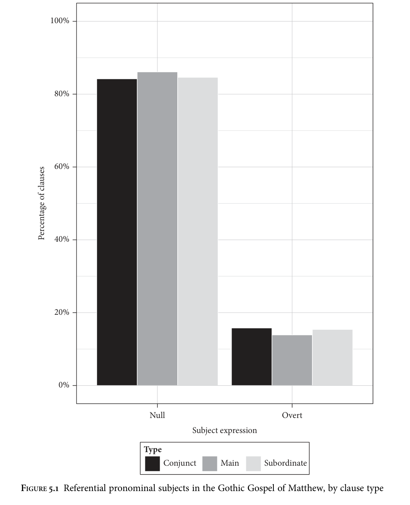

The difference between main and subordinate clauses in Gothic in terms of occurrence of overt vs. null referential pronominal subjects is not statistically significant (p=0.8466), and neither is the effect of person and number (p=0.0807). Examples of null subjects in main and subordinate clauses respectively are given in (1) and (2).

<!-- source page: 162 -->

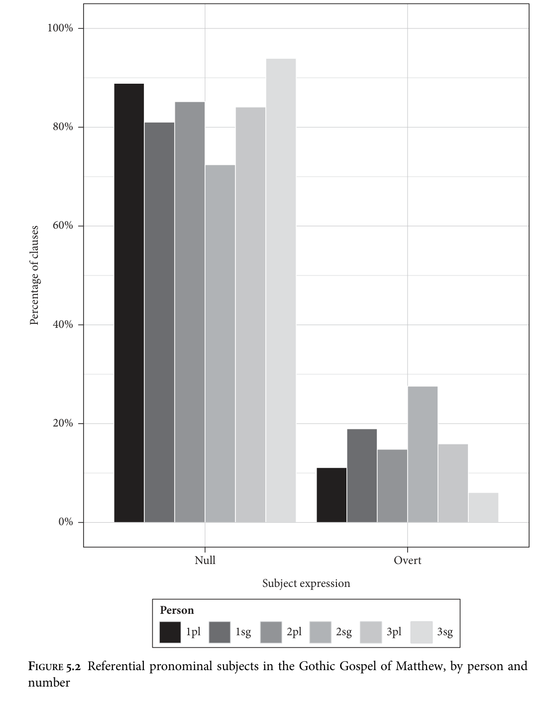

<!-- source page: 163 -->

```text
(1)
andnemun
mizdon
seina
take.3pl.pret
reward.acc
their.acc
‘They have their reward’ (Matthew 6:2)
```

```text
(2)
. . . ei
qemjau
gatairan
witoþ
aiþþau
praufetuns
. . . that
come.1sg.opt
destroy.inf
law.acc
or
prophets.acc
‘ . . . that I have come to destroy the law or the prophets’ (Matthew 5: 17)
```

Ferraresi (2005: 59) also mentions that ‘due to its null subject nature, Gothic does not have [overt] expletive subjects either’. An example of the absence of an overt expletive is given in (3).

```text
(3)
Ganah
siponi
ei
wairþai
swe laisareis
is
suffice.3sg disciple.acc that become.3sg.opt as
teacher.nom his.nom
‘It is enough for the disciple that he be as his master’ (Matthew 10: 25)
```

Where subject pronouns are included, the intended interpretation is clearly as focused or contrastive, as in (4).

```text
(4)
hausideduþ
þatei
qiþan
ist:
ni
horinos.
heard.2pl.pret
that
said
is.3sg
neg
whore.2sg.opt
aþþan
ik
qiþa
izwis . . .
but
I
say.1sg
you.dat . . .
‘You have heard it said that you should not commit adultery. But I say to you . . .’
(Matthew 5: 27–8)
```

In addition, I compared these findings to the Majority Text of the Greek New Testament (see section 1.4.1 for details). In none of the 229 instances of a null referential subject in the Gothic Gospel of Matthew does the Greek text contain a corresponding overt pronoun, a result consistent with those of Ferraresi (2005) and Fertig (2000). In 33 of the 40 cases of subject pronouns in finite clauses, the pronoun directly corresponds to a Greek pronoun (though not necessarily one that is in the nominative case). In a further six cases the pronoun corresponds to a Greek third person demonstrative ο (singular) or οι (plural): this is the case in Matthew 8: 32, 9: 31, 26: 66, 26: 70, 27: 4, and 27: 66. In only one case in this sample (which is much smaller than that considered in Tables 5.1 and 5.2, from Ferraresi 2005) does the subject pronoun in Gothic correspond to nothing overt in the Majority Text: this example is given in (5).

```text
(5)
jabai in Saudaumjam waurþeina
mahteis
þos
waurþanons
if
in Sodom
became.3pl.opt.pret powers.nom those become
in
izwis,
aiþþau
eis
weseina
und
hina
dag
in
you
or
they
remain.3pl.opt.pret
until
this
day
‘if those great works done in you had been done in Sodom, they would have
remained until this day’ (Matthew 11: 23)
```

<!-- source page: 164 -->

The expression of the pronoun here may be linked to its presence in the apodosis of a conditional, a rare construction in Gothic; the translator may have felt that the presence of the antecedent in the protasis might not have been enough to guarantee the correct interpretation. Null objects also appear to be possible in Gothic. I have not conducted a quantitative investigation due to the difficulty of identifying which verbs require an overt object; however, clear examples can be found, as in (6) and (7).

```text
(6)
mis
tawideduþ
me.dat
done.2pl.pret
‘you have done it to me’ (Matthew 25: 40)
```

```text
(7)
iþ
Iesus
qaþ
du
imma:
þu
qiþis
but
Jesus
said
to
him
you
say
‘and Jesus said to him: “So you say.”’ (Matthew 27: 11)
```

These examples follow the Greek in the omission of any object. However, as we have seen, Wulfila seems to have been capable of deviating from the Vorlage if he had reason to do so (cf. section 1.4.1); it is therefore not unreasonable to hypothesize that null objects were natively possible in Gothic.

### 5.2.2 Old Norse

Whereas in most of this book examples and data from Old Icelandic have been used to illustrate the behaviour of the older Scandinavian languages, with regard to null arguments it is Old Swedish for which the most quantitative data is available. Falk (1993), in a paper devoted mostly to non-referential null subjects in the history of Swedish, observes that Old Swedish also permitted null referential subjects, as in (8).

```text
(8)
þer
diþi
ok
drak
miolk
af
moþor
spina
there
sucked
and
drank
milk
of
mother.gen
teats
‘There he sucked and drank milk from his mother’s teats’
(Tjuvabalken in Den äldre Codex af Westgöta-Lagen, dated 1225; Falk 1993: 143,
her (1a))
```

A thorough recent study, Håkansson (2008), also highlights the existence of such examples, although emphasizing their rarity:

```text
(9)
þar
gierþi
kirchiu
aþra
there
built
church
other
‘There they built another church’
(Guta Saga; Håkansson 2008: 14, his (1.3))
```

Håkansson (2008: 101) also concludes that referential null subjects are most frequently found in main clauses. Of the 540 main clauses investigated, 31 (5.7%) had

<!-- source page: 165 -->

null subjects, as opposed to only 12 of 513 subordinate clauses (2.3%). Furthermore, whereas 44 of 765 third person referential subjects (5.8%) are null, this is the case for only 3 of 164 first person subjects (1.8%) and 0 of 132 second person subjects (Håkansson 2008: 115). As noted by Rosenkvist (2009: 158), these patterns appear to be similar to those found in OHG (section 5.2.4). A number of works have addressed the situation in Old Icelandic. The possibility of null arguments was investigated by Nygaard (1894, 1906), and the most extensive discussion in terms of generative syntactic theory is that of Sigurðsson (1993), building on empirical work by Hjartardóttir (1987). Here I will limit myself to discussing the data; Sigurðsson’s theoretical approach will be discussed in section 5.3. Faarlund (2004: 221) also discusses the issue briefly, arguing that ‘Old Norse is not a regular “pro-drop” language’ and that ‘deletion of a specified subject is rare’ (2004: 223; cf. also Faarlund 1994: 56, Rögnvaldsson 1990). However, as Rosenkvist (2009: 157) laments, there appear to be no quantitative studies of null subjects comparable to those carried out for e.g. OHG. Hróarsdóttir (1996: 130) reports that she found thirteen examples of referential null subjects in her sample of Icelandic between 1730 and 1750, but the numbers given are absolute, and hence there is no way of comparing this to the number of overt subjects in the sample; clausal context (main or subordinate) is also not mentioned. Null non-referential subjects are the norm in Old Icelandic, as pointed out by Faarlund (2004: 220) and illustrated by (10) (his (68)a).

```text
(10)
var
þá
myrkt
af
nátt
was
then
dark
at
night
‘Then it was dark at night’
```

However, referential subjects and objects may also be null, as in (11) and (12) from Sigurðsson (1993) (fourteenth century; his (1) and (2)).

```text
(11)
ok
kom hann þangat, ok
var Hoskuldr uti,
er
reið í
tún
and came he
there
and was H.
outdoors when rode into field
‘And hei came there, and Hoskuldr was outside when hei rode into the field’
```

```text
(12)
dvergrinn
mælti,
at
sa
baugr
skyldi
vera
hverjum
dwarf.def
said
that
the
ring
should
be
anyone.dat
hofuðsbani,
er
átti
headbane
that
possessed
‘The dwarf said that the ring would bring death to anyone who possessed it’
```

A quantitative investigation of null subjects in Old Icelandic is now possible, due to the availability of a pre-final version of the IcePaHC corpus of historical Icelandic (version 0.9.1; Wallenberg et al. 2011). Using this corpus I have investigated the frequency of null vs. overt pronominal subjects in texts from the twelfth and

<!-- source page: 166 -->

**TABLE 5.6. Referential pronominal subjects in Old Icelandic finite clauses in IcePaHC 0.9.1, by text and clause type**

```text
Text
Clause type
Overt
Null
Total
```

```text
First Grammatical Treatise
(1150.FIRSTGRAMMAR.SCI-LIN)
Main
55 (96.5%)
2 (3.5%)
57
Subordinate
102 (80.3%)
25 (19.7%)
127
Conjunct
25 (92.6%)
2 (7.4%)
27
Total
182 (86.3%)
29 (13.7%)
211
```

```text
Íslensk hómilíubók (1150.HOMILIUBOK.
REL-SER)
Main
610 (98.9%)
7 (1.1%)
617
Subordinate
1120 (98.2%)
20 (1.8%)
1140
Conjunct
239 (95.6%)
11 (4.4%)
250
Total
1969 (98.1%)
38 (1.9%)
2007
```

```text
Jarteinabók (1210.JARTEIN.REL-SAG)
Main
126 (99.2%)
1 (0.8%)
127
Subordinate
228 (87.7%)
32 (12.3%)
260
Conjunct
144 (94.7%)
8 (5.3%)
152
Total
498 (92.4%)
41 (7.6%)
539
```

```text
Þorláks saga helga (1210.THORLAKUR.
REL-SAG)
Main
149 (100.0%)
0 (0.0%)
149
Subordinate
312 (97.8%)
7 (2.2%)
319
Conjunct
117 (95.1%)
6 (4.9%)
123
Total
578 (97.8%)
13 (2.2%)
591
```

```text
Íslendinga saga (1250.STURLUNGA.
NAR-SAG)
Main
497 (99.4%)
3 (0.6%)
500
Subordinate
358 (97.0%)
11 (3.0%)
369
Conjunct
248 (93.9%)
16 (6.1%)
264
Total
1103 (97.4%)
30 (2.6%)
1133
```

```text
Egils saga (Theta manuscript; 1250.
THETUBROT.NAR-SAG)
Main
65 (98.5%)
1 (1.5%)
66
Subordinate
94 (98.9%)
1 (1.1%)
95
Conjunct
26 (96.3%)
1 (3.7%)
27
Total
185 (98.4%)
3 (1.6%)
188
```

```text
Jómsvíkinga saga (1260.
JOMSVIKINGAR.NAR-SAG)
Main
263 (99.2%)
2 (0.8%)
265
Subordinate
542 (97.5%)
14 (2.5%)
556
Conjunct
344 (95.8%)
15 (4.2%)
359
Total
1149 (97.4%)
31 (2.6%)
1180
```

```text
Grey Goose Laws (Grágás; 1270.
GRAGAS.LAW-LAW)
Main
68 (94.4%)
4 (5.6%)
72
Subordinate
171 (85.1%)
30 (14.9%)
201
Conjunct
58 (95.1%)
3 (4.9%)
61
Total
297 (88.9%)
37 (11.1%)
334
```

```text
Morkinskinna (1275.MORKIN.
NAR-HIS)
Main
428 (93.4%)
30 (6.6%)
458
Subordinate
508 (95.3%)
25 (4.7%)
533
Conjunct
355 (90.8%)
36 (9.2%)
391
Total
1291 (93.4%)
91 (6.6%)
1382
```

thirteenth centuries. In the IcePaHC, referential null subjects (*pro*) are tagged distinctly from subjects elided under coordination (*con*) and null expletives (*exp*), using *pro* only when an analysis in terms of one of the other two is impossible. This makes the search for relevant examples relatively simple. The results are presented in Table 5.6 and Figure 5.3.

<!-- source page: 167 -->

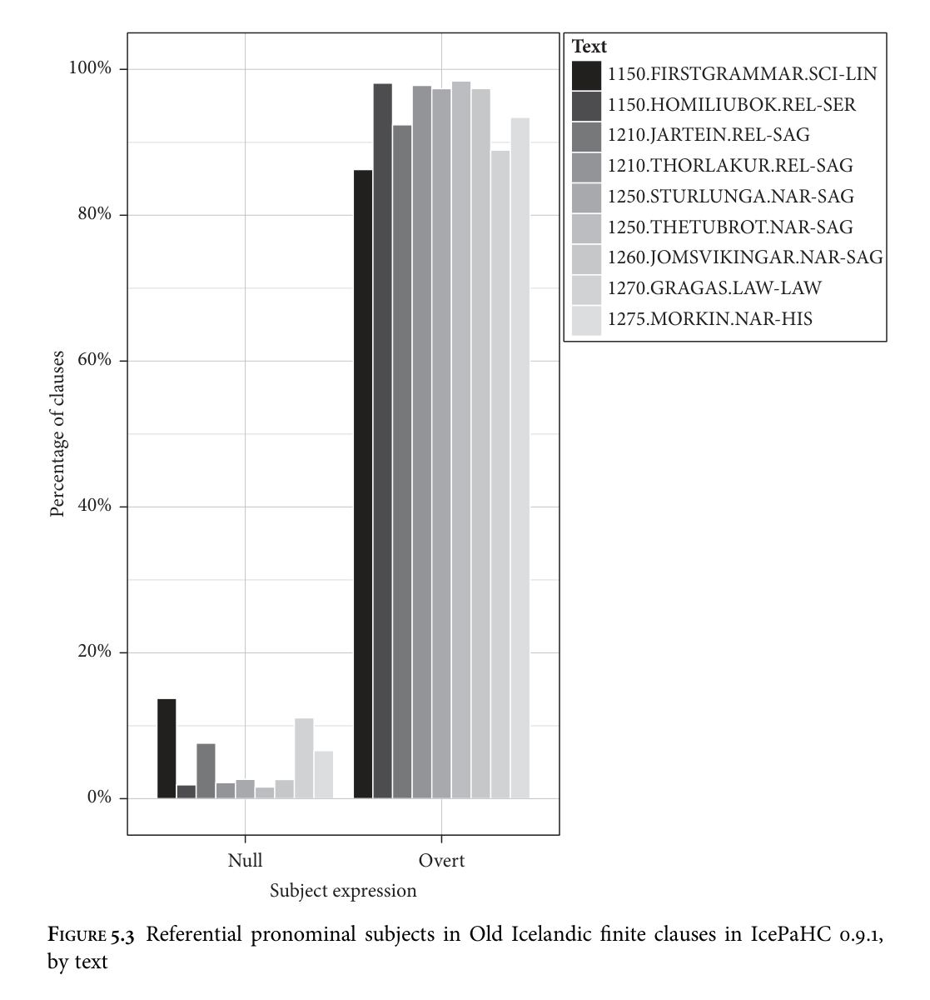

In contrast to Gothic, the proportions of null subjects in these texts are uniformly low, and never above 20 per cent. Some texts provide better evidence of a null subject property in Old Icelandic than others: while the Íslensk hómilíubók and the Egils saga manuscript contain few unambiguous examples, for instance, the First Grammatical Treatise and Morkinskinna contain a robust number. The effect of clause type (main vs. subordinate) is significant only for the First Grammatical Treatise (p = 0.0031), Jarteinabók (p < 0.0001), Íslendinga saga (p = 0.0111), and the Grey Goose Laws (p = 0.0390). The effect in these texts—null subjects are more common in subordinate clauses than in main clauses—is the opposite of that found by Håkansson (2008)

<!-- source page: 168 -->

**TABLE 5.7. Referential pronominal subjects in finite clauses in the First Grammatical Treatise and Morkinskinna, by person and number**

```text
Text
Person
N
Overt
Null
Total
```

```text
First Grammatical Treatise
1
sg
78 (100.0%)
0 (0.0%)
78
pl
6 (100.0%)
0 (0.0%)
6
2
sg
14 (100.0%)
0 (0.0%)
14
pl
0
0
0
3
sg
63 (71.6%)
25 (28.4%)
88
pl
21 (84.0%)
4 (16.0%)
25
Totals
182
29
211
```

```text
Morkinskinna
1
sg
269 (99.3%)
2 (0.7%)
271
pl
79 (95.2%)
4 (4.8%)
83
2
sg
185 (99.5%)
1 (0.5%)
186
pl
13 (100.0%)
0 (0.0%)
13
3
sg
562 (90.1%)
62 (9.9%)
624
pl
183 (89.3%)
22 (10.7%)
205
Totals
1291
91
1382
```

for Old Swedish and that found in the early West Germanic languages (for which see sections 5.2.3–5).3

Person also has a strong effect on expression (see Table 5.7 and Figures 5.4 and 5.5), and in this respect my data agrees with that of Nygaard (1906: 8–9) and Hjartardóttir (1987) for Old Icelandic as well as with that of Håkansson (2008: 106) for Old Swedish.4 The First Grammatical Treatise contains no first or second person null subjects at all, and for both texts investigated the effect of first vs. non-first person is statistically significant (p < 0.0001 for both; cf. the discussion of the early West Germanic languages in sections 5.2.3–5). The effect of number in the third person is not significant (First Grammatical Treatise, p = 0.3005; Morkinskinna, p = 0.7897). A problematic factor that must be noted is the potential availability of ‘quirky’ or ‘oblique’ subjects, i.e. subjects in a case other than the nominative, in Old Icelandic. Opinions vary on whether this property, widely acknowledged to hold for modern Icelandic, also held for Old Icelandic, or whether the relevant elements are objects; Rögnvaldsson (1991, 1995), Haugan (1998), Barðdal (2000, 2009), and Barðdal and Eyþórsson (2005, 2012) argue that they are subjects, whereas Faarlund (2001, 2004: 194–5) argues against this on the basis that non-subjects other than predicate

# 3 A reviewer suggests that null subjects in subordinate clauses in Old Icelandic might be analysable as

(null) long-distance reflexives, and that this difference between Old Icelandic and the other Northwest Germanic languages could then be reduced to an independent property, namely the availability of longdistance reflexivization in this language. This intriguing suggestion warrants further investigation. 4 Dual pronouns are treated as plural for the purposes of Table 5.7.

<!-- source page: 169 -->

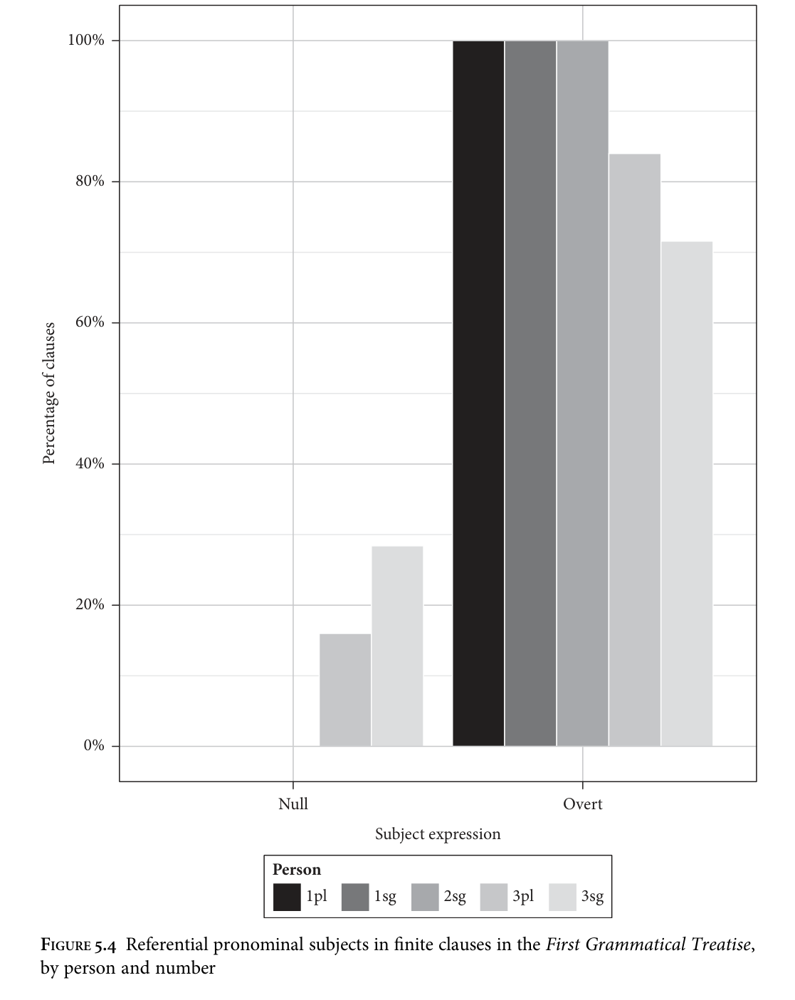

<!-- source page: 170 -->

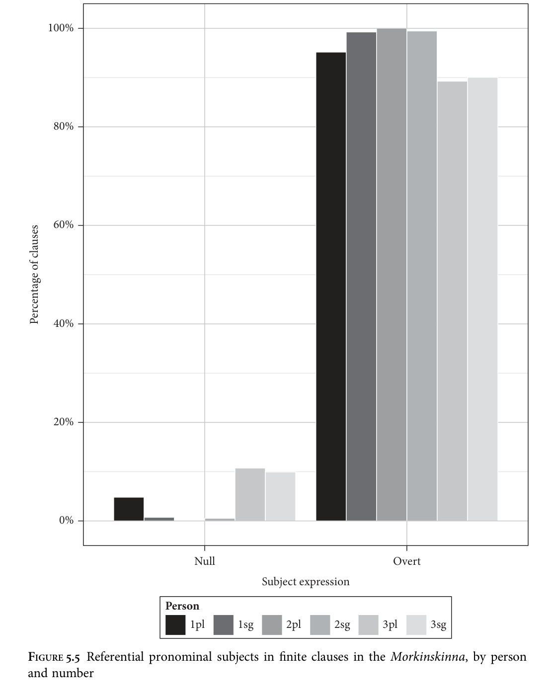

<!-- source page: 171 -->

complements otherwise never occur in the nominative in Old Icelandic. Since the IcePaHC corpus takes the former view and tags as subjects constituents that may be in the dative or the genitive, I have followed their annotation scheme and assumed that these constituents are indeed subjects.5 This is important to note when comparing the data for Old Icelandic to that for other older Germanic languages. My assumption for these is that all subjects take nominative case and that non-nominative arguments cannot be subjects, which is not uncontroversial (see Harris 1973; Allen 1995; Barðdal and Eyþórsson 2005) but is made largely for ease of quantitative investigation. Though it affects the classification of the data, this assumption in fact has minimal bearing on the analysis presented in section 5.3, for which the grammatical relations involved are irrelevant. Null objects are also found in early Icelandic texts such as the First Grammatical Treatise, e.g. (13).

```text
(13)
leka
myndi
húsið,
ef
eigi
mændi
smiðurinn
leak
may
house.def
if
not
roof.sbjv
smith.def
‘A house may leak if a craftsman does not roof it’
(1150.FIRSTGRAMMAR.SCI-LIN,.71)
```

Finally, Kinn (2013) has looked at null arguments in Old Norwegian. She finds that, as in Old Swedish and the West Germanic languages, null subjects are more common in main than subordinate clauses. This indicates an early difference between Old Icelandic and what were to become the Mainland Scandinavian languages. A further finding of Kinn (2013) is that, as in other early Northwest Germanic languages, null subjects in the first and second person are extremely rare. As in the other languages, examples of null objects in Old Norwegian can also be found.

### 5.2.3 Old English

Compared to e.g. clausal constituent order, the availability of null arguments in OE has been little investigated, and the literature contains conflicting claims.6 Hulk and van Kemenade (1995: 245) state that ‘the phenomenon of referential pro-drop does not exist in Old English’; van Gelderen (2000: 137), on the other hand, claims that ‘Old English has pro-drop’ (cf. also van Gelderen 2013). Mitchell (1985: 633) apparently takes a middle ground, suggesting that the possibility of leaving arguments unexpressed ‘occurs (or survives) only spasmodically’ in OE. In this section I will show that there is an element of truth in all three suggestions. The availability of the

# 5 This decision taken by the annotators is intended to ease retrieval rather than as a theoretical

statement, though Wallenberg, Sigurðsson, and Ingason (2011) argue that there are good reasons to analyse Old Icelandic this way. 6 The data in this section was first reported in Walkden (2013b).

<!-- source page: 172 -->

YCOE (Taylor et al. 2003) makes it possible to conduct a quantitative investigation of null arguments on a larger scale than carried out before. It is not a new observation that OE contains examples of referential null subjects. Pogatscher (1901) provides a large number of examples, which Visser (1963–73) and Mitchell (1985) take into account in their overview works on English historical syntax. Pogatscher’s data must be used with caution, since he conflates all examples of subject omission, including those which would be grammatical in modern English, such as coordination reduction as found in (14) (van Gelderen 2000: 124). However, many of Pogatcher’s examples can only be analysed as true null referential subjects; (15) is of this kind.

(14) The king went to Normandy and met the bishop.

```text
(15)
Nu
scylun
hergan
hefaenricaes
uard
now
must
praise
heavenly-kingdom.gen
guard
‘Now we must praise the lord of the heavenly kingdom’
(Caedmon’s Hymn, Cambridge University Library MS M, line 1; van Gelderen
2000: 126, her (16))
```

Example (15) is from the eighth-century Northumbrian version of Caedmon’s Hymn. In other versions transmitted in different manuscripts, the subject is expressed as a pronoun. Example (16) is of this kind.

(16) Nu we sculan herian heofonrices Weard. (Bodleian Library MS T1, line 1; van Gelderen 2000: 126, her (17))

Corpus Christi Oxford MS 279 (MS O) contains interesting palaeographical evidence with regard to this sentence: it seems as if the scribe initially copied Nu sculan ‘Now must’ but then inserted the pronoun, yielding Nu we sculan ‘Now we must’ (see Kiernan 1990: 164 for discussion of this variability). This leads to a concern, also voiced by Pogatscher (1901: 277): if subject omission became rarer and rarer through the diachrony of English, scribes may have made ‘intelligent revisions’ (Kiernan 1990: 164) to fill in omitted subjects, and this could skew our data in the direction of overrepresentation of pronouns, particularly in texts that only survive in late manuscripts. A similar problem is caused by the insertion of pronouns by modern editors of OE texts (Pogatscher 1901: 275–6). As the YCOE (Taylor et al. 2003) is based on critical editions, this could also lead to over-representation of pronouns in the data reported here. In what follows it is important to bear in mind that null subjects may have been more frequent in actual OE usage than this section suggests. As in the IcePaHC, referential null subjects have their own tag (*pro*) in the YCOE, distinct from cases of coordination reduction (*con*) and null expletives (*exp*). The principle guiding annotation is that *pro* is only used when *con* and *exp* are independently ruled out. Searching for relevant examples is therefore

<!-- source page: 173 -->

relatively simple. Nevertheless, a pilot search for all instances of *pro* uncovered two broad classes of examples which would be dubious as support for a prototypical referential null subject analysis. First, in a number of cases, the verbal mood is subjunctive and the clause delivers an order or recipe, as in (17).7

```text
(17)
gemenge
wið
buteran
mix.sbjv
with
butter
‘Mix with butter’
(colaece,Lch_II_[1]:3.8.2.406)
```

Although the force is that of an instruction, much like imperatives, the form of the verb itself is clearly subjunctive; (ge)mengan is a class Ib weak verb, and the expected imperative form here would be (ge)meng. The impossibility of an imperative analysis presumably underpins the annotation decision in the YCOE to include *pro* in the syntactic parse of these sentences. Since this ‘jussive’ or ‘hortative’ *pro* is extremely common (in the Benedictine Rule, 29 of 30 examples of *pro* in main clauses are of this type, and 48 of 52 in the Heptateuch), I decided to exclude all clauses containing a subjunctive finite verb from my analysis. The second category of *pro* that occurs with unexpected frequency is the type illustrated in (18), involving the verb hatan ‘to be called’. Such examples could be analysed as involving a special type of asyndetic (subject-gap) contact relative clause rather than a true null referential subject; see Mitchell (1985: 186), Dekeyser (1986: 108), and Poppe (2006: 197–201).8

```text
(18)
Ualens
wæs
gelæred
from
anum
Arrianiscan
biscepe,
Valens
was
taught
from
an
Arian
bishop
Eudoxius
wæs
haten
Eudoxius
was
called
‘Valens was taught by an Arian bishop called Euxodius.’
(coorosiu,Or_6:33.151.22.3215)
```

The pilot search yielded a higher percentage of *pro* in main clauses in Orosius than in other texts, at 6.4 per cent (34 examples). However, 27 of these 34 examples involve the verb hatan, and all but one of the other seven are cases of ‘jussive’ *pro* of the type discussed above. The OE Bede also contains a number of such examples. The search was therefore refined in order to find and exclude these cases. Results are presented in Table 5.8 and Figure 5.6.

7 Interestingly, (17) also lacks an object, perhaps due to ‘recipe drop’ (cf. Culy 1996 and Bender 1999). 8 This construction is available in older stages of German as well (Gärtner 1981; Poppe 2006: 200). Dekeyser (1986: 112–13) in fact argues that it is an ‘offshoot’ of earlier optionality in the expression of the subject pronoun.

<!-- source page: 174 -->

I investigated all texts of over 15,000 words in the corpus in their entirety, as well as Beowulf, which can be found in the YCOEP corpus of poetry (Pintzuk and Plug 2001). These larger texts were selected on the basis that their size would make quantitative results less likely to be accidental. Table 5.8 for OE can thus be considered equivalent to Tables 5.4 for Gothic, 5.6 for Old Icelandic, 5.11 for OHG, and

**TABLE 5.8. Referential pronominal subjects in OE finite indicative clauses in the YCOE and YCOEP, by text and clause type**

```text
Text
Clause type
Overt
Null
Total
```

```text
Ælfric’s Homilies Supplemental
(coaelhom.o3)
Main
585 (99.8%)
1 (0.2%)
586
Subordinate
871 (99.8%)
2 (0.2%)
873
Conjunct
501 (99.4%)
3 (0.6%)
504
Total
1957 (99.7%)
6 (0.3%)
1963
```

```text
Ælfric’s Lives of Saints (coaelive.o3)
Main
789 (99.2%)
6 (0.8%)
795
Subordinate
1137 (99.4%)
7 (0.6%)
1144
Conjunct
532 (96.4%)
20 (3.6%)
552
Total
2458 (98.7%)
33 (1.3%)
2491
```

```text
Bede’s History of the English Church
(cobede.o2)
Main
719 (96.6%)
25 (3.4%)
744
Subordinate
1038 (98.0%)
21 (2.0%)
1059
Conjunct
377 (92.6%)
30 (7.4%)
407
Total
2134 (96.6%)
76 (3.4%)
2210
```

```text
Benedictine Rule (cobenrul.o3)
Main
144 (99.3%)
1 (0.7%)
145
Subordinate
177 (98.3%)
3 (1.7%)
180
Conjunct
29 (100.0%)
0 (0.0%)
29
Total
350 (98.9%)
4 (1.1%)
354
```

```text
Beowulf (cobeowul; from YCOE Poetry)
Main
190 (78.2%)
53 (21.8%)
243
Subordinate
139 (93.3%)
10 (6.7%)
149
Conjunct
24 (92.3%)
2 (7.7%)
26
Total
353 (84.4%)
65 (15.6%)
418
```

```text
Blickling Homilies (coblick.o23)
Main
436 (99.5%)
2 (0.5%)
438
Subordinate
582 (99.1%)
5 (0.9%)
587
Conjunct
345 (98.9%)
4 (1.1%)
349
Total
1363 (99.2%)
11 (0.8%)
1374
```

```text
Boethius, Consolation of Philosophy
(coboeth.o2)
Main
902 (99.4%)
5 (0.6%)
907
Subordinate
1095 (99.6%)
4 (0.4%)
1099
Conjunct
260 (98.5%)
4 (1.5%)
264
Total
2257 (99.4%)
13 (0.6%)
2270
```

```text
Ælfric’s Catholic Homilies I
(cocathom1.o3)
Main
1271 (99.9%)
1 (0.1%)
1272
Subordinate
1507 (99.7%)
4 (0.3%)
1511
Conjunct
648 (99.1%)
6 (0.9%)
654
Total
3426 (99.7%)
11 (0.3%)
3437
```

```text
Ælfric’s Catholic Homilies II
(cocathom2.o3)
Main
1071 (99.9%)
1 (0.1%)
1072
Subordinate
1191 (99.7%)
4 (0.3%)
1195
Conjunct
547 (98.7%)
7 (1.3%)
554
Total
2809 (99.6%)
12 (0.4%)
2821
```

<!-- source page: 175 -->

```text
Chrodegang of Metz (cochdrul)
Main
83 (97.6%)
2 (2.4%)
85
Subordinate
168 (100.0%)
0 (0.0%)
168
Conjunct
43 (97.7%)
1 (2.3%)
44
Total
294 (99.0%)
3 (1.0%)
297
```

```text
Anglo-Saxon Chronicle C (cochronC)
Main
51 (94.4%)
3 (5.6%)
54
Subordinate
165 (100.0%)
0 (0.0%)
165
Conjunct
199 (89.6%)
23 (10.4%)
222
Total
415 (94.1%)
26 (5.9%)
441
```

```text
Anglo-Saxon Chronicle D (cochronD)
Main
66 (88.0%)
9 (12.0%)
75
Subordinate
197 (99.0%)
2 (1.0%)
199
Conjunct
213 (88.4%)
28 (11.6%)
241
Total
476 (92.4%)
39 (7.6%)
515
```

```text
Anglo-Saxon Chronicle E (cochronE.o34)
Main
115 (95.0%)
6 (5.0%)
121
Subordinate
246 (98.8%)
3 (1.2%)
249
Conjunct
238 (93.3%)
17 (6.7%)
255
Total
599
26
625
```

```text
Cura Pastoralis (cocura.o2, cocuraC)
Main
722 (99.6%)
3 (0.4%)
725
Subordinate
1504 (99.7%)
5 (0.3%)
1509
Conjunct
339 (99.4%)
2 (0.6%)
341
Total
2565 (99.6%)
10 (0.4%)
2575
```

```text
Gregory’s Dialogues C (cogregdC.o24)
Main
747 (99.7%)
2 (0.3%)
749
Subordinate
1409 (99.7%)
4 (0.3%)
1413
Conjunct
651 (99.7%)
2 (0.3%)
653
Total
2807 (99.7%)
8 (0.3%)
2815
```

```text
Gregory’s Dialogues H (cogregdH.o23)
Main
240 (100.0%)
0 (0.0%)
240
Subordinate
424 (100.0%)
0 (0.0%)
424
Conjunct
117 (99.2%)
1 (0.8%)
118
Total
781 (99.9%)
1 (0.1%)
782
```

```text
Herbarium (coherbar)
Main
451 (100.0%)
0 (0.0%)
451
Subordinate
119 (100.0%)
0 (0.0%)
119
Conjunct
162 (100.0%)
0 (0.0%)
162
Total
732 (100.0%)
0 (0.0%)
732
```

```text
Bald’s Leechbook (colaece.o2)
Main
90 (76.3%)
28 (23.7%)
118
Subordinate
94 (94.0%)
6 (6.0%)
100
Conjunct
23 (65.7%)
12 (34.3%)
35
Total
207 (81.8%)
46 (18.2%)
253
```

```text
Martyrology (comart3.o23)
Main
182 (99.5%)
1 (0.5%)
183
Subordinate
242 (98.8%)
3 (1.2%)
245
Conjunct
206 (98.1%)
4 (1.9%)
210
Total
630 (98.7%)
8 (1.3%)
638
```

```text
Orosius (coorosiu.o2)
Main
344 (99.7%)
1 (0.3%)
345
Subordinate
707 (99.3%)
5 (0.7%)
712
Conjunct
299 (93.1%)
22 (6.9%)
321
Total
1350 (98.0%)
28 (2.0%)
1378
```

(continued)

<!-- source page: 176 -->

**TABLE 5.8. Continued**

```text
Text
Clause type
Overt
Null
Total
```

```text
Heptateuch (cootest.o3)
Main
748 (99.9%)
1 (0.1%)
749
Subordinate
804 (99.9%)
1 (0.1%)
805
Conjunct
450 (98.9%)
5 (1.1%)
455
Total
2002 (99.7%)
7 (0.3%)
2009
```

```text
St Augustine’s Soliloquies (cosolilo)
Main
393 (100.0%)
0 (0.0%)
749
Subordinate
411 (100.0%)
0 (0.0%)
805
Conjunct
64 (100.0%)
0 (0.0%)
455
Total
868 (100.0%)
0 (0.0%)
868
```

```text
Vercelli Homilies (coverhom)
Main
464 (98.9%)
5 (1.1%)
469
Subordinate
609 (99.3%)
4 (0.7%)
613
Conjunct
393 (98.3%)
7 (1.8%)
400
Total
1466 (98.9%)
16 (1.1%)
1482
```

```text
West-Saxon Gospels (cowsgosp.o3)
Main
1411 (99.7%)
4 (0.3%)
1415
Subordinate
1139 (99.7%)
3 (0.3%)
1142
Conjunct
820 (99.4%)
5 (0.6%)
825
Total
3370 (99.6%)
12 (0.4%)
3382
```

```text
The Homilies of Wulfstan (cowulf.o34)
Main
128 (100.0%)
0 (0.0%)
128
Subordinate
351 (100.0%)
0 (0.0%)
351
Conjunct
181 (100.0%)
0 (0.0%)
181
Total
660 (100.0%)
0 (0.0%)
660
```

## 5.15 for OS, in that it leaves out of consideration other types of null subject such as

expletives, subjects elided under coordination, relative clause subject gaps, and imperatives. From Table 5.8 we see that, in the majority of classical OE texts, examples of null referential arguments are so rare as to be potentially considered entirely ungrammatical. However, in certain other texts the phenomenon occurs with a frequency and distribution that cannot be attributed entirely to performance errors. Many of these texts, including Ælfric’s Catholic Homilies and Homilies Supplemental, as well as the Benedictine Rule, Blickling Homilies, Chrodegang of Metz, the translation of Boethius’ Consolation of Philosophy, the Cura Pastoralis, both manuscripts of Gregory’s Dialogues, the Martyrology, the Heptateuch, St Augustine’s Soliloquies, the West-Saxon Gospels, and Wulfstan’s Homilies, show a frequency of overt pronouns of 98–100 per cent in all clause types. This arguably lends weight to Hulk and van Kemenade’s (1995) claim, since one approach to such low figures is to consider these examples ungrammatical; at any rate it is easy to see why such a claim would have been made. In Ælfric’s Lives of Saints and Orosius, null subjects are found at a substantial frequency only in conjunct clauses. Why this should be the case is unclear, especially

<!-- source page: 177 -->

```text
0%
5%
10%
15%
20%
```

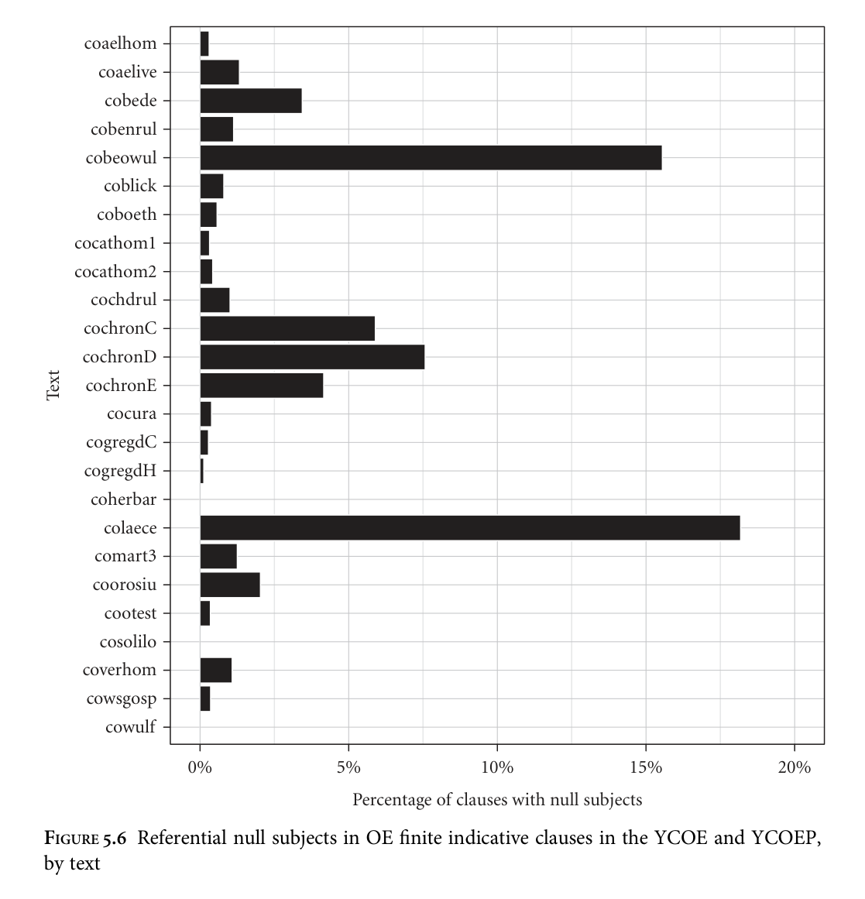

for Ælfric, in whose other writings null subjects in general are extremely rare. Perhaps the systems underlying these texts are characterized by a rule of conjunction reduction in which arguments can be shared across conjuncts ‘regardless of case or grammatical function’, as suggested by Faarlund (1990: 104) for ON. In any case, I will leave these two texts out of consideration in what follows. The remaining texts are Bede’s History of the English Church, Beowulf, Bald’s Leechbook, and the C, D, and E manuscripts of the Anglo-Saxon Chronicle. All of these texts exhibit null subjects to a greater extent. Some examples are given below.

```text
(19)
Wæs
ærest
læded
to
Bretta
biscopum
was
first
led
to
Britons.gen
bishops
‘He was first led to the priests of the Britons’
(cobede,Bede_2:2.100.3.926)
```

<!-- source page: 178 -->

```text
(20) þonne
bið
on
hreþre
under
helm
drepen
biteran
stræle
then
is
in
heart
under
helm
hit
bitter
dart
‘Then he is hit in the heart, under the helmet, by the bitter dart’
(cobeowul,54.1745.1443)
```

In (19) the understood subject is a blind man, who was introduced as the direct object of the previous clause. In (20) it is an unspecified king. Note that this example and others like it preclude a ‘pronoun zap’ analysis of OE null arguments à la Ross (1982) and Huang (1984) on German (see section 5.3.2), since þonne ‘then’ is in initial preverbal position. For more examples of OE null subjects, particularly from Beowulf, see van Gelderen (2000: 126–9) and Visser (1963: 4ff.). In all of these texts, including Beowulf, null subjects are more common in main clauses than in subordinate clauses. The effect of clause type in Beowulf (main vs. subordinate, as conjunct clauses in general are rare in this text), for instance, is clearly significant (p < 0.0001). This result is similar to that found by Håkansson (2008) for Old Swedish, and by Eggenberger (1961) and Axel (2007) for OHG. (21) and (22) are examples of null subjects in subordinate clauses.

```text
(21)
þætte oft
þæt
wiðerworde yfel abeorende &
ældend
bewereð
that
often that noxious
evil enduring
and concealing prevents
‘that she (the Church) often suppresses that noxious evil through endurance
and connivance’
(cobede,Bede_1:16.70.33.666)
```

```text
(22)
þæt
þone
hilderæs
hæl
gedigeð
that
the
battle-charge
hale
endure
‘that they will survive the assault unharmed’
(cobeowul,11.293.236)
```

This result enables us to fill a hole in Rosenkvist’s (2009) table 4. Null subjects in OE were sensitive to clausal status as in OHG and Old Swedish, though not in any absolute way, such that Pogatscher (1901: 261) is correct to state that it is possible for subjects to remain unexpressed both in main and subordinate clauses. Note that in both examples (21) and (22) the verb is in final position. This would be problematic for an attempt to extend to OE Axel’s (2007) approach to OHG, which seeks to explain the restricted occurrence of null subjects in subordinate clauses by correlating it with V2 word order in such clauses; cf. section 5.2.4 for discussion. Six of the ten examples of null subjects in indicative subordinate clauses in Beowulf, and two of the six examples in Bald’s Leechbook, cannot be analysed as involving verb-movement to the left periphery. As in Old Icelandic (section 5.2.2) and OHG (section 5.2.4), person has a statistically significant effect on the expression vs. non-expression of subjects. Van Gelderen (2000: 132–6) makes this into a crucial part of her analysis. Table 5.9 summarizes the data, taken from a study by Berndt (1956); Figure 5.7 illustrates.

<!-- source page: 179 -->

**TABLE 5.9. Referential pronominal subjects in finite indicative clauses in the Lindisfarne Gospels and Rushworth Glosses, by person and number (based on Berndt 1956: 65–8; cf. van Gelderen 2000: 133, her table 3.1)**

```text
Text
Person
N
Overt
Null
Total
```

```text
Rushworth Glosses, part 1
1
sg
191 (97.0%)
6 (3.0%)
197
pl
44 (97.8%)
1 (2.2%)
45
2
sg
90 (88.2%)
12 (11.8%)
102
pl
168 (89.4%)
20 (10.6%)
188
3
sg
246 (58.2%)
177 (41.8%)
423
pl
141 (58.0%)
102 (42.0%)
243
Totals
880
318
1198
```

```text
Lindisfarne Gospels, part 1
1
sg
212 (96.4%)
8 (3.6%)
220
pl
53 (100.0%)
0 (0.0%)
53
2
sg
103 (87.3%)
15 (12.7%)
118
pl
206 (95.8%)
9 (4.2%)
215
3
sg
116 (26.3%)
325 (73.7%)
441
pl
108 (36.9%)
185 (63.1%)
293
Totals
798
542
1340
```

```text
Lindisfarne Gospels, part 2
1
sg
656 (98.6%)
9 (1.4%)
665
pl
120 (99.2%)
1 (0.8%)
121
2
sg
308 (93.3%)
22 (6.7%)
330
pl
428 (95.7%)
19 (4.3%)
447
3
sg
225 (18.3%)
1003 (81.7%)
1228
pl
154 (24.5%)
475 (75.5%)
629
Totals
1891
1529
3420
```

```text
Rushworth Glosses, part 2
1
sg
528 (96.5%)
19 (3.5%)
547
pl
100 (98.0%)
2 (2.0%)
102
2
sg
226 (91.1%)
22 (8.9%)
248
pl
302 (83.7%)
59 (16.3%)
361
3
sg
186 (19.0%)
795 (81.0%)
981
pl
124 (22.8%)
420 (77.2%)
544
Totals
1466
1317
2783
```

Though in his own tables (1956: 65–8) Berndt distinguishes between subjects elided under coordination and other null referential subjects (1956: 75 n. 1), van Gelderen conflates the two categories in her figures for null subjects in table 3.1. In Table 5.9 I have excluded Berndt’s cases of subjects elided under coordination in order to ensure comparability with Table 5.10 and others.

Berndt investigates two texts, the Lindisfarne Gospels (Northumbrian) and the Rushworth Glosses (of which the first part is Mercian and the second Northumbrian). The effect of third vs. non-third person is significant (p< 0.0001) in both parts of each text, as van Gelderen (2000: 132 n. 6) also shows. There is also an effect of number in the third person, with overt subjects preferred for plurals, although the effect is only statistically significant in the Lindisfarne Gospels (part 1: p = 0.0025, part 2: p = 0.0023), not in the Rushworth Glosses (part 1: p = 1, part 2: p = 0.0841). Number has no effect in

<!-- source page: 180 -->

```text
0%
20%
40%
60%
80%
100%
```

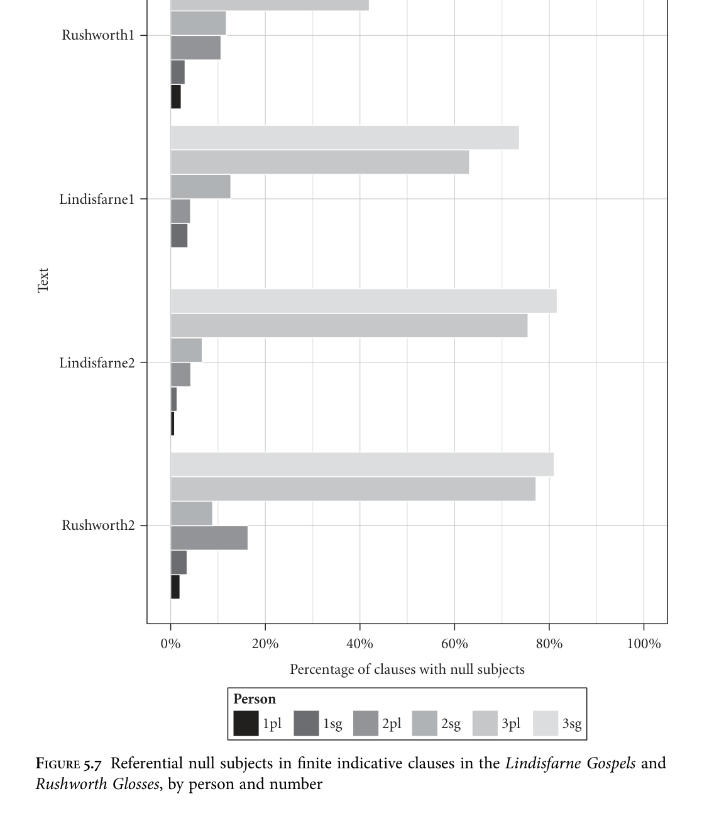

<!-- source page: 181 -->

**TABLE 5.10. Referential pronominal subjects in finite indicative clauses in Beowulf, Bald’s Leechbook, Bede, and MS E of the Chronicle, by person and number**

```text
Text
Person
N
Overt
Null
Total
```

```text
Beowulf
1
sg
75 (97.4%)
2 (2.6%)
77
pl
21 (100.0%)
0 (0.0%)
21
2
sg
26 (96.3%)
1 (3.7%)
27
pl
10 (100.0%)
0 (0.0%)
10
3
sg
172 (80.4%)
42 (19.6%)
214
pl
49 (71.0%)
20 (29.0%)
69
Totals
353
65
418
```

```text
Bald’s Leechbook
1
sg
1 (100.0%)
0 (0.0%)
1
pl
11 (100.0%)
0 (0.0%)
11
2
sg
52 (100.0%)
0 (0.0%)
52
pl
0
0
0
3
sg
108 (77.1%)
32 (22.9%)
140
pl
35 (71.4%)
14 (28.6%)
49
Totals
207
46
253
```

```text
Bede
1
sg
129 (100.0%)
0 (0.0%)
129
pl
171 (98.8%)
2 (1.2%)
173
2
sg
69 (100.0%)
0 (0.0%)
69
pl
25 (96.2%)
1 (3.8%)
26
3
sg
1504 (97.2%)
44 (2.8%)
1548
pl
236 (89.1%)
29 (10.9%)
265
Totals
2134
76
2210
```

```text
Chronicle MS E
1
sg
3 (100.0%)
0 (0.0%)
3
pl
18 (100.0%)
0 (0.0%)
18
2
sg
3 (100.0%)
0 (0.0%)
3
pl
3 (100.0%)
0 (0.0%)
3
3
sg
297 (97.1%)
9 (2.9%)
306
pl
275 (94.2%)
17 (5.8%)
292
Totals
599
26
625
```

the first person (Lindisfarne part 1: p = 0.3612, part 2: p = 0.6570; Rushworth part 1: p = 1, part 2: p = 0.5558) and no consistent effect in the second person (Lindisfarne part 1: p = 0.0067, part 2: p = 0.1464; Rushworth part 1: p = 0.8449, part 2: p = 0.0076). Similar facts hold for four YCOE texts exhibiting null subjects Beowulf, Bald’s Leechbook, the OE Bede, and the Chronicle MS E, as shown in Table 5.10 and Figure 5.8, though the proportions of null subjects in general in these texts is much lower. In both texts the effect of third vs. non-third person is statistically significant (p < 0.0001 for both).9 The effect of number in the third person is not statistically

9 First and second person dual pronouns in Beowulf have been treated as plural.

<!-- source page: 182 -->

```text
0%
20%
40%
60%
80%
100%
Percentage of clauses with null subjects
```

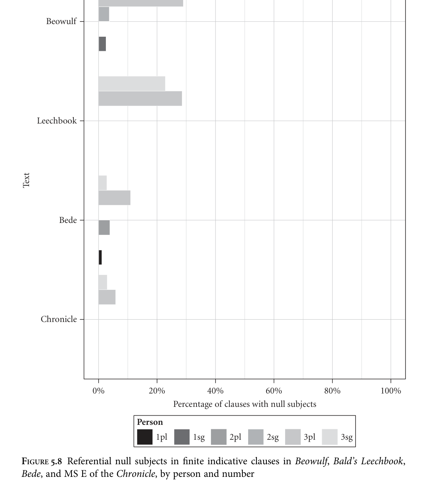

significant in any of the texts except Bede at p < 0.0001 (Beowulf: p = 0.1311; Bald’s Leechbook: p = 0.4427; Chronicle MS E: p = 0.1080). Among other things, van Gelderen takes this systematicity to show that the null argument property of at least some OE texts cannot be attributed solely to Latin influence: since in Latin overt pronouns are almost never present, if the absence of

<!-- source page: 183 -->

pronouns in OE resulted entirely from isolated instances of over-literal translation we would expect a random distribution of null subjects across persons and numbers, which is not the case (2000: 133). I concur; furthermore, such a hypothesis would be problematic when dealing with autochthonous texts such as Beowulf which display many null arguments despite being universally acknowledged as having no Latin original and displaying little Latin influence. Likewise, the null argument property of OE cannot be attributed solely to metrical considerations in texts such as Beowulf, because this would not account for the greater frequency of null subjects in the third person than in the first and second: all three types of personal pronoun are unstressed monosyllables in OE. Furthermore, such a hypothesis would be problematic when dealing with prose texts such as Bald’s Leechbook, for which no metrical explanation is available. If translation from Latin and/or metrical considerations played a role in favouring null subjects at all in OE texts, then, it could only have led to a slight general quantitative preference, as neither of these factors is able to account for the person and clause-type asymmetries in OE or the range of texts in which null subjects are found. Was OE a null subject language, then? The answer appears to be that there is variation. The texts I have investigated that display null subjects robustly have in common with those investigated by Berndt (1956) that they are Anglian (Northumbrian or Mercian) or exhibit Anglian features. Berndt (1956: 59–60) demonstrates this for the Lindisfarne Gospels and the Rushworth Glosses, in the process noting that they exhibit null subjects where the West Saxon Corpus MS of the Gospels virtually never does (1956: 78–82). Fulk (2009: 96) notes that the OE Bede and Bald’s Leechbook and the D and E manuscripts of the Anglo-Saxon Chronicle, though traditionally assigned to West Saxon, display Anglian features.10 Though it is agreed that Bald’s Leechbook in its transmitted form was composed in Winchester (Meaney 1984: 236), Wenisch (1979: 54) argues on a lexical basis that an Anglian (probably Mercian) original must have existed. As for Beowulf, Fulk (1992: 309–25) notes a number of Anglian lexical and morphological features. If null subjects can be considered an Anglian feature on the basis of their distribution across texts, it seems fair to suggest, tentatively, that both van Gelderen (2000) and Hulk and van Kemenade (1995) are correct: referential null subjects were not grammatical in classical OE (West Saxon), as exemplified by e.g. the works of Ælfric, but were available, subject to certain restrictions, in Anglian dialects. The key to resolving the apparent contradiction lies

10 The only possible exception is MS C of the Chronicle. Swanton (1996: xxiv) notes that it was produced at Abingdon ‘on the border between Wessex and Mercia’. If Mercian influence can be suggested on this basis, then the (few) examples of null subjects in this text cease to present a problem for my hypothesis.

<!-- source page: 184 -->

in dispelling the illusion of OE as a monolithic entity: the texts provide evidence for diatopic and diachronic variation.11

Finally, null objects can also be found in OE: Ohlander (1943), van der Wurff (1997), and van Gelderen (2000) provide a number of examples, including (23) and (24).

```text
(23)
se
here . . .
gesæt
þæt
lond
and
gedælde
the
army
invaded
the
land
and
divided
‘The army . . . invaded the country and divided it up’
(cochronC,ChronC_[Rositzke]:881.1.762)
```

```text
(24)
hie . . .
leton
holm
beran /
geafon
on
garsecg
they
let
sea
bear
gave
on
ocean
‘They let the sea bear him, gave him to the ocean’
(cobeowul,4.47.41–2)
```

Van Gelderen (2000: 149) claims that this is expected under her analysis, insofar as all cases are of third person. However, this does not obviously follow, given that she adopts ‘a Taraldsen/Platzack [account]’ of pro-licensing (2000: 125): such accounts predict that a null argument may occur where the verb bears agreement for that element, and OE verbs never agree with their object. See section 5.3.1 for further discussion.

### 5.2.4 Old High German

Null subjects are also possible in OHG, as illustrated by (25) and (26).

```text
(25)
Sume
hahet
in cruci
some-acc hang-2pl to cross
‘Some of them you will crucify’
(Monsee Fragments XVIII.17; Matthew 23: 34; Axel 2007: 293)
```

```text
(26) steih
tho
in
skifilin
stepped.3sg
then
into
boat
‘He then stepped into the boat’
(Tatian 193.1; Axel 2007: 293)
```

The situation for OHG is different from that of the other older Germanic languages in that recent work by Axel (2005, 2007: ch. 6; Axel and Weiß 2011) has brought the language’s null subject property to the attention of linguists. Axel presents

11 Berndt (1956: 82–5) considers but rejects the hypothesis of dialectal variation, instead suggesting that the relevant criterion is closeness to the West Saxon ‘standard’. However, his argument rests on the claim (justified on functional grounds) that the systematic use of first and second person pronouns was an innovation in colloquial OE; as comparative data from the other early Northwest Germanic languages shows, this is unlikely to have been the case.

<!-- source page: 185 -->

**TABLE 5.11. Referential pronominal subjects in OHG finite clauses, by text and clause type (based on Axel 2007: 310, her table 2; data from Eggenberger 1961)**

```text
Text
Clause type
Overt
Null
Total
```

```text
Isidor
Main
61 (56.0%)
48 (44.0%)
109
Subordinate
85 (91.4%)
8 (8.6%)
93
Total
146
56
202
```

```text
Monsee Fragments
Main
48 (36.4%)
84 (63.6%)
132
Subordinate
73 (84.9%)
13 (15.1%)
86
Total
121
97
218
```

```text
Tatian
Main
1434 (59.9%)
960 (40.1%)
2394
Subordinate
1180 (92.5%)
95 (7.5%)
1275
Total
2614
1055
3669
```

quantitative data based on the exhaustive survey of null subjects in OHG texts in Eggenberger (1961: 128, 124–6, 84–6). Table 5.11 (her table 2) is calculated on the basis of this data, and includes only referential pronouns/null subjects and arbitrary pronouns/null subjects. These texts are all early prose texts; in later OHG, such as the writings of Notker, null subjects are basically no longer attested (Axel 2007: 298). Eggenberger does not separate conjunct clauses from other clause types for this purpose. Figure 5.9 illustrates. Within each text, the effect of clause type is statistically significant (p < 0.0001 in all cases). Specifically, as Axel remarks (2007: 309), null subjects are clearly rarer in subordinate clauses than in main clauses. Axel interprets this as evidence that null subjects must follow the finite verb (2007: 311), as proposed by Adams (1987b) for Old French. She argues that (27) (her (27)), for instance, can be analysed as verb-second.

```text
(27)
uuanta
sehente
nigisehent
because
seeing
neg-see.3pl
‘because seeing they do not see’
(Tatian 235.15)
```

Like van Gelderen (2000) for OE, Axel argues that null subjects in OHG cannot be explained away as loan syntax from Latin (2007: 306), since the main/subordinate clause asymmetry has no explanation if null referential subjects were not a grammatical feature of OHG itself. Furthermore, she notes that the Hildebrandslied, an autochthonous text, features five instances of null subjects as opposed to 29 overt pronouns. However, Axel resorts to the loan-syntax hypothesis to explain the existence of examples of referential null subjects occurring in unambiguously verblate clauses in the Tatian and Monsee Fragments, since these pose a problem for her hypothesis that such subjects are only licensed when they follow the finite verb

<!-- source page: 186 -->

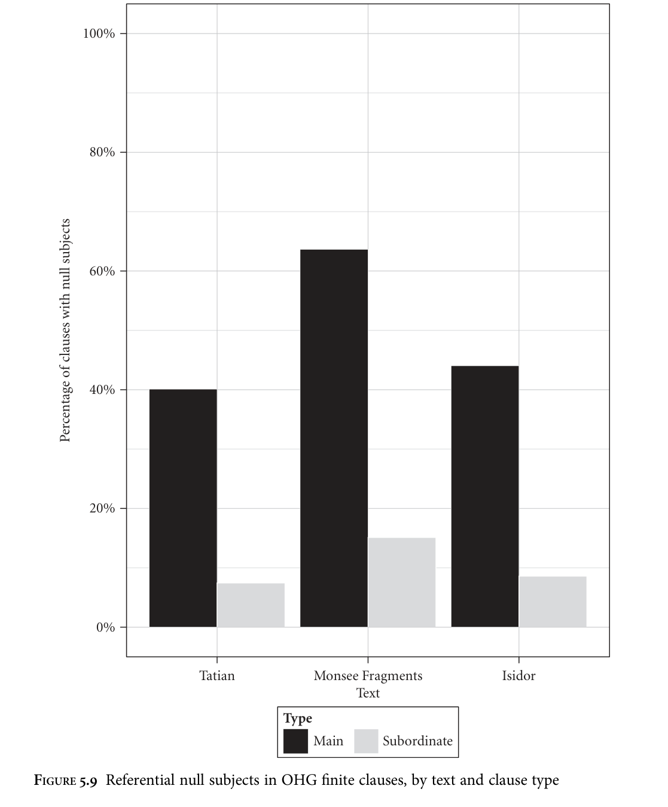

(2007: 311), suggesting that Latin ‘may have had a minor impact’ here. Schlachter (2010: 161–3) finds this unconvincing, and gives several examples where Latin influence is unlikely. Furthermore, an analysis of the constituent order patterns in the examples of pronominals in subordinate clauses in the Isidor given by Eggenberger (1961: 128) reveals that four of the eight examples of null pronominals cannot be

<!-- source page: 187 -->

**TABLE 5.12. Referential pronominal subjects in subordinate clauses in Isidor by possibility of verb-movement**

V-movement possible? Overt Null Total

```text
Yes
26 (30.6%)
4 (50.0%)
30
No
59 (69.4%)
4 (50.0%)
63
Total
85
8
93
```

analysed as involving verb-movement to the left periphery under Axel’s assumptions.12 The distribution is illustrated in Table 5.12. The difference in verb position between clauses with overt pronominals and clauses with null pronominals is not significant (p = 0.2666). This text thus provides no support for the hypothesis that null subjects are licensed only postfinitely in OHG. (28) is one of the four counterexamples.

```text
(28)
nibu
fona
zuuem
chiboran
uuerdhe
neg-if
from
two
born
become-3sg.sbjv
‘if he is not born of two people’
(Isidor 3.15)
```

Person also seems to have influenced the availability of null referential subjects, as in Old Swedish, Old Icelandic, and OE. Axel (2007: 315, her table 3) illustrates this once more using data from Eggenberger (1961), reproduced here in Table 5.13 and Figure 5.10. For each text, third person null referential subjects occur at a higher rate than first or second person null referential subjects (p < 0.0001 in all cases). Much as for the ON and OE texts I have investigated, the effect of number within the third person is not statistically significant for any text: for Isidor, p = 0.7544; for the Monsee Fragments, p = 1.0000; for Tatian, p = 0.0918. I therefore conclude, provisionally, that number has no effect on the possibility of null subjects in OHG, and that plural and singular referential subjects were equally likely to be null.13

12 Clauses were analysed as potentially involving verb-movement to the left periphery if the finite verb was preceded by 0 or 1 constituents or by an XP-SubjPron sequence, in accordance with Axel’s own assumptions (see Chapter 3). 13 Axel also observes (2007: 317) that the choice between the two first person plural endings available in OHG, the shorter -n/-m vs. the longer -mēs, appeared to influence the availability of postverbal null subjects (cf. also Dieter 1900; Harbert 1999). Schlachter (2010: 168–9) is sceptical as to whether this is relevant to the overall system of OHG, suggesting that these clauses can be analysed as adhortatives. Since Axel does not provide quantitative evidence on this point, and since the origins and analysis of the longer ending are debatable (cf. Shields 1996; Jóhannsson 2009), I leave this issue aside here.

<!-- source page: 188 -->

**TABLE 5.13. Referential pronominal subjects in main clauses in Isidor, the Monsee Fragments, and the Tatian, by person and number (based on Axel 2007: 315, her table 3; data from Eggenberger 1961)**

```text
Text
Person
N
Overt
Null
Total
```

```text
Isidor
1
sg
36 (94.7%)
2 (5.3%)
38
pl
2 (40.0%)
3 (60.0%)
5
2
sg
3 (60.0%)
2 (40.0%)
5
pl
1 (100.0%)
0 (0.0%)
1
3
sg
15 (34.1%)
29 (65.9%)
44
pl
4 (25.0%)
12 (75.0%)
16
Totals
61
48
109
```

```text
Monsee Fragments
1
sg
10 (66.7%)
5 (33.3%)
15
pl
2 (66.7%)
1 (33.3%)
3
2
sg
5 (62.5%)
3 (37.5%)
8
pl
16 (61.5%)
10 (38.5%)
26
3
sg
12 (18.8%)
52 (81.3%)
64
pl
3 (18.8%)
13 (81.3%)
16
Totals
48
84
132
```

```text
Tatian
1
sg
415 (80.1%)
103 (19.9%)
518
pl
62 (69.7%)
27 (30.3%)
89
2
sg
131 (60.9%)
84 (39.1%)
215
pl
262 (86.2%)
42 (13.8%)
304
3
sg
394 (46.1%)
460 (53.9%)
854
pl
170 (41.1%)
244 (58.9%)
414
Totals
1434
960
2394
```

Axel (2007: 299) acknowledges that OHG does not pattern with canonical full nullsubject languages such as modern Italian, since overt subjects do not appear to be necessarily emphatic or contrastive. She also argues against a ‘topic drop’ analysis of OHG null arguments (see section 5.3.2) on the basis of cases such as (25) where the subject is null and a non-subject has been topicalized. She further observes that the cases of null arguments almost exclusively involve subjects, unlike in modern German, for example, in which objects may also be null when topicalized. In general, Axel (2007) does not consider null objects, commenting, for example, that this possibility ‘has hardly been discussed in the literature’ (2007: 182). Nevertheless, examples can be found, such as (29).

```text
(29)
denne
varant
engilâ
uper
dio
marhâ,
wechant
deotâ,
then
travel.3pl
angels
over
the
lands
wake.3pl
people
wîssant
ze
dinge
lead.3pl
to
judgement
‘Then angels fly over the lands, wake the people, lead them to the judgement’
(Muspilli 79–80; Lockwood 1968: 215)
```

<!-- source page: 189 -->

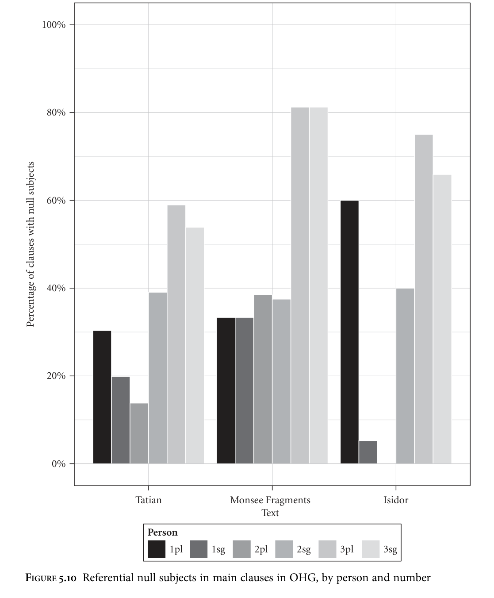

Krisch (2009: 211) also gives an example from the Strasbourg Oaths. Such examples would not be expected to occur at all under the hypothesis that the possibility of early OHG null subjects was conditioned by rich agreement, since the language lacks object agreement entirely (see section 5.3.1). With this in mind it is difficult to see how Axel’s approach, which links the possibility of null arguments to post-finite

<!-- source page: 190 -->

position, could account for them. Although I accept that topic drop is not a suitable explanation for the OHG facts, then, the existence of examples such as (29) casts doubt on Axel’s own analysis.

### 5.2.5 Old Saxon

The possibility for subjects to remain unexpressed in OS has occasionally been remarked upon in the literature. Pogatscher (1901: 276–7) mentions it in passing, his main sources being Heyne (1873) and Behaghel (1897), neither of whom devotes more than a few pages to the topic (Heyne 1873: 212, 297; Behaghel 1897: 298). Behrmann (1879) has a more thorough discussion, observing that pronouns can be omitted when there is no nominative antecedent. At first glance, the Heliand appears to contain a relatively high proportion of unexpressed subjects: the figures for the whole text are provided in Table 5.14. However, the style in which the text is written involves a considerable amount of paratactic repetition by means of clauses which could be analysed as conjoined by a null element. As a result, most of these unexpressed subjects could potentially be analysed as cases of conjunction reduction. Once these as well as null expletive subjects, subject gaps in relative clauses, and unexpressed subjects in imperatives are taken out of the picture, the figures are as in Table 5.15 (Figure 5.11). These figures for null subjects are a lower bound: it is entirely possible that some of the cases I have analysed as conjunction reduction are in fact cases of referential null

**TABLE 5.14. All subjects in OS finite clauses in the Heliand, by clause type**

Full Pronominal Null Total

```text
Main
1295 (50.5%)
969 (37.8%)
301 (11.7%)
2565
Subordinate
636 (28.6%)
1277 (57.5%)
307 (13.8%)
2220
Conjunct
146 (10.1%)
97 (6.7%)
1201 (83.2%)
1444
Total
2077
2343
1809
6229
```

**TABLE 5.15. Referential pronominal subjects in the OS Heliand, by clause type**

Overt Null Total

```text
Main
969 (93.4%)
68 (6.6%)
1037
Subordinate
1277 (99.4%)
8 (0.6%)
1285
Conjunct
97 (74.6%)
33 (25.4%)
130
Total
2343
109
2452
```

<!-- source page: 191 -->

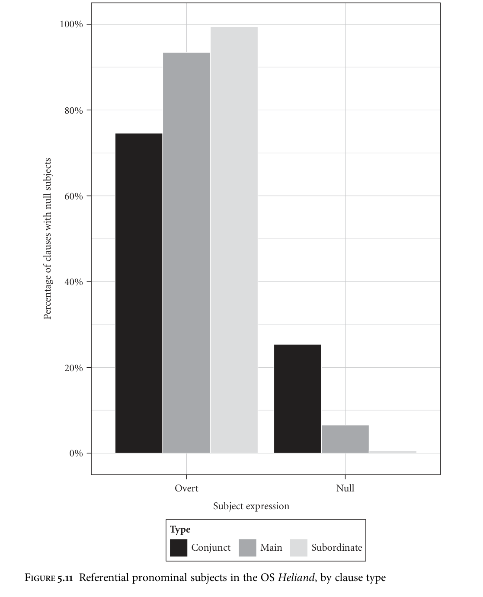

<!-- source page: 192 -->

subjects in non-conjunct clauses. Some examples of true referential null subjects I have found are given in (30)–(32) below.

```text
(30)
Giuuitun
im
thô
eft
te
Hierusalem
iro
sunu sôkean
went.3pl
refl.dat
then
after
to
Jerusalem
their
son
seek.inf
‘They then went to Jerusalem to seek their son’
(Heliand 806–7)
```

```text
(31)
gisâhun iro
barn
biforan, kindiunge
man, qualmu
sueltan
saw.3pl their children before
child-young men
murder.instr die.inf
‘They saw their young children murdered before them’
(Heliand 749–51)
```

```text
(32)
lîbes
uueldi
ina
bilôsien,
of
he
mahti
gilêstien
sô
life.gen
would
him
take
if
he
could
achieve
so
‘hei would take hisj life if hei could’
(Heliand 1442)
```

In all of these cases there is no antecedent in the nominative that is present in the immediately preceding clauses, thus excluding an analysis involving conjunction reduction. In (30), for example, the understood subject is ‘Joseph and Mary’, yet Joseph is not mentioned in the preceding discourse. In (31) the understood subject is ‘the women of Bethlehem’, who are present in the preceding clause but in the dative case. Finally, (32) excludes an analysis for OS involving traditional ‘topic drop’: the verb has moved to the left periphery, as shown by the fact that it precedes the object pronoun, and yet a fronted item (a genitive object) is also present, in preverbal position; cf. Axel’s example (25) from OHG and section 5.3.2. In addition to the 109 examples in which neither manuscript contains an overt subject, there are also 30 examples in which one of the two main manuscripts contains a pronoun but the other does not. Two such examples are given in (33) and (34), here using the parallel edition provided by Sievers (1878).

```text
(33)
M: Oc
scal
ic
iu
te
uuarun
seggean
C: Oc
scal
iu
te
uuaron
seggean
also
shall
(I)
you
to
truth
say.inf
‘I will also truly tell you . . .’
(Heliand 1628; Sievers 1878: 114–15)
```

```text
(34)
M: Ac
than
uuillean
te iuuuomo herron helpono biddean
C: Ac
than
gi
uuellean
te iuuuon
herron helpono biddean
but when (you) want.2pl to your
lord
help
request.inf
‘But when you want to ask for help from your lord, . . .’
(Heliand 1573–4; Sievers 1878: 112–13)
```

<!-- source page: 193 -->

In eight of these cases, e.g. (34), it is manuscript M that omits the pronoun; in the other twenty-two it is manuscript C, e.g. (33). It is tempting to speculate, with Pogatscher (1901: 277), that in the manuscripts in which the pronoun is present it represents an addition by a scribe of a later period and that the original contained no pronoun. However, for the purposes of the numbers in Tables 5.14 and 5.15 I have erred on the side of caution and treated all such examples as cases of overt pronouns. There is a clear effect of clause type (cf. Behrmann 1879: 19): leaving second conjunct clauses out of consideration, the effect of clause type (main vs. subordinate) is statistically significant (p< 0.0001). I found only eight examples in the Heliand of subordinate clauses that unambiguously contained a referential null subject. (35) is one of these.

```text
(35)
that
brôđer
brûd
an
is
bed
nâmi
that
brother.gen
bride.acc
to
his
bed
take.sbjv
‘. . . that he takes his brother’s bride to his bed’
(Heliand 2713)
```

It is therefore safe to conclude that null subjects were strongly dispreferred in subordinate clauses, if not universally disallowed; this ties in with findings for Old Swedish (5.2.2), OE (5.2.3), and OHG (5.2.4). Next let us consider the effect of person and number on the occurrence of referential null subjects in OS. Table 5.16 and Figure 5.12 present the data. All but four examples of null referential subjects found were third person, though a few examples where the manuscripts differ would be counterexamples if original: (33) and (34) are of this type, involving first person singular and second person plural subjects respectively. There is also a statistically significant effect of third vs. nonthird person (p < 0.0001). Within the third person, the percentage of plural referential pronominal subjects that are null is higher than that of singular referential pronominal subjects. This is the opposite tendency to that found by van Gelderen (2000) based on Berndt’s (1956) data, although the effect is not quite as clear-cut as the others found in this section (p = 0.0275).

**TABLE 5.16. Referential pronominal subjects in the OS Heliand, by person and number**

```text
Person
N
Overt
Null
Total
```

```text
1
sg
262 (100.0%)
0 (0.0%)
262
pl
61 (100.0%)
0 (0.0%)
61
2
sg
247 (99.2%)
2 (0.8%)
249
pl
230 (99.1%)
2 (0.9%)
232
3
sg
1089 (94.5%)
63 (5.5%)
1152
pl
454 (91.5%)
42 (8.5%)
496
Totals
2343
109
2452
```

<!-- source page: 194 -->

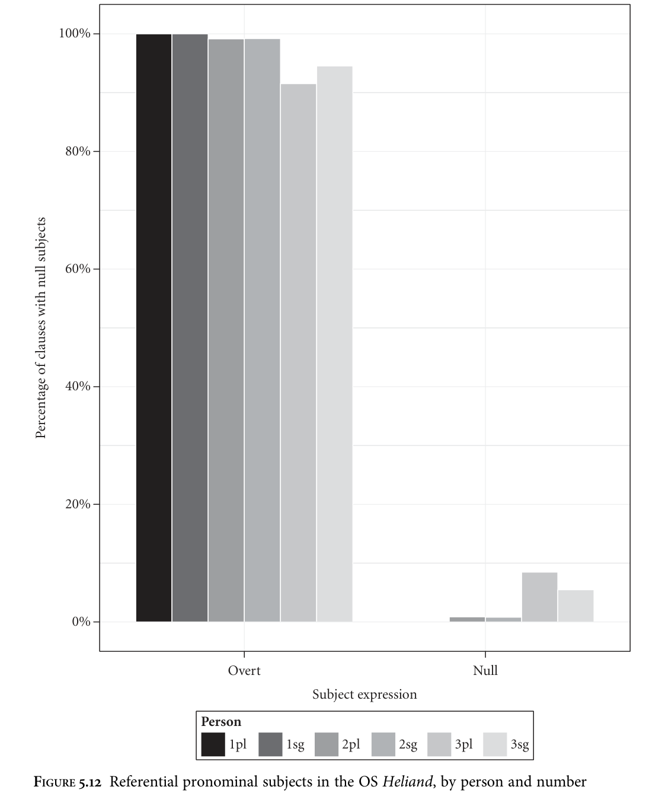

As argued by van Gelderen (2000: 133) for OE and Axel (2007: 306) for OHG, I take it that the non-random distribution of null subjects in this text, as illustrated by Tables 5.15 and 5.16, militates against the argument that their presence is due simply to Latin influence; ‘pure’ translation can be ruled out, since, although the Heliand definitely had Latin sources, primarily Tatian’s Diatessaron (cf. Sievers 1878: xli and

<!-- source page: 195 -->

Haferland 2001, 2004 for discussion), the Germanicized content and alliterative style demonstrate that it represents a substantial piece of original verse composition. These distributional considerations also suggest that a purely prosodic/metrical analysis is likely to be insufficient to explain the data, all other things being equal. Finally, as in all the other early Germanic languages under discussion, null objects can also be found in the OS Heliand, as illustrated by the following section of discourse explaining why not to amass a hoard of earthly treasures.

```text
(36)
huuand
it
rotat
hîr
an
roste,
endi
regintheoƀos
farstelad,
because
it
rusts
here
to
rust
and
thieves
steal
uurmi
auuardiad . . .
worms spoil
‘because it rusts away, thieves steal (it), worms spoil (it) . . .’
(Heliand 1644–5)
```

### 5.2.6 Summary: distribution of null arguments in early Germanic

In Gothic, null referential pronominal subjects are the norm in all persons, numbers, and clause types. Referential pronominal objects may also be null. In the Northwest Germanic languages the distribution of referential null arguments is very similar (cf. Rosenkvist 2009). In all of these languages, referential null subjects are not obligatory and are outnumbered by overt pronominal subjects. The proportion of third person null referential subjects in these languages is considerably higher than that of first and second person null referential subjects.14 Null subjects of all types are rarer in subordinate clauses than they are in main clauses (except in Old Icelandic). Finally, null objects are allowed in all of these languages. These facts may cast doubt on Hopper’s (1975: 31) assertion that ‘in the early Germanic languages the use of a pronominal subject was probably usual’, depending on how ‘usual’ is understood. These are the facts I will be attempting to account for in the next section.
