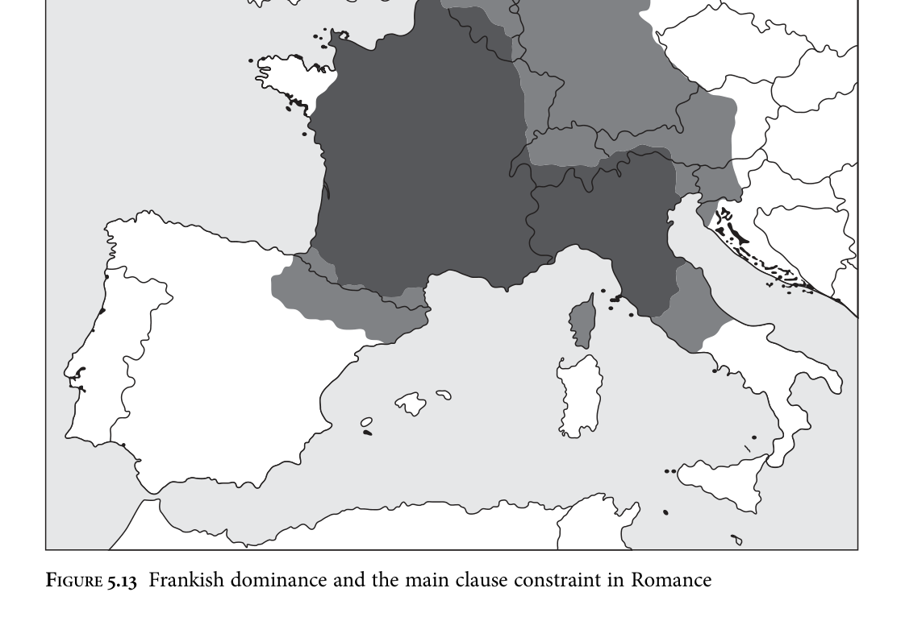

## 5.4 Null arguments across the history of Germanic

### 5.4.1 Diachronic trajectories

I have argued that the situation in the individual early Northwest Germanic languages with regard to null arguments was the same or at least very similar, with Gothic differing from the others essentially only in being a language with [uD] in T0. In this section I briefly discuss possible diachronic trajectories of the individual languages. Since the ‘middle’ stages of these languages are outside the focus of the present study, the discussion will necessarily remain speculative.

36 There would also no longer be any syncretisms at all in OHG, predicting that this language too would be a consistent null subject language. Such a solution, although convenient for Gothic, is therefore not ideal.

<!-- source page: 220 -->

Gothic can be set aside immediately; the available Gothic documents do not permit us to get a diachronic cross-section of the language, which is now extinct. Modern Icelandic and modern (Low and High) German are all topic drop languages. In addition, Icelandic has been a symmetric V2 language essentially throughout its recorded history (see Þráinsson 2007 on the modern language, and Faarlund 2004 on earlier stages). Hróarsdóttir (1996) reports that referential null subjects were lost during the eighteenth and nineteenth centuries.37 As discussed in Chapter 3, the only OHG texts that robustly exhibit V3 are the Isidor translation and the Monsee Fragments, with other texts displaying predominantly V2 order in main clauses; null subjects, on the other hand, persisted through the eighth and ninth centuries (e.g. in the V2 Tatian) and are essentially no longer found in later OHG such as that of Notker (Axel 2007: 298). The OS Heliand is also V2 with null arguments. As discussed in the previous section, what differentiates a topic drop language from a partial null argument language syntactically is the probing feature on the [iD]- bearing left-peripheral operator, specifically whether it is [uφ] or [uAnaphor]. Now in a V2 language, all else being kept constant, a grammar in which the left-peripheral operator bears [uAnaphor] will generate a set of sentences that is a superset of that generated by a grammar in which the left-peripheral operator bears [uφ]. Specifically, clauses such as (32) from OS, repeated below, with a fronted element preverbally as well as a null argument, can be generated by the [uAnaphor] grammar but not by the [uφ] grammar, due to intervention.

```text
(32)
lîbes
uueldi
ina
bilôsien,
of
he
mahti
gilêstien
sô
life.gen
would
him
take
if
he
could
achieve
so
‘hei would take hisj life if hei could’
(Heliand 1442)
```

The Subset Principle of Berwick (1985), as stated in (63), comes into play here.

```text
(63)
The Subset Principle
The learner must guess the smallest possible language compatible with the
input at each stage of the learning procedure.
(Clark and Roberts 1993: 304–5)
```

37 Icelandic, and to a lesser extent also German, is thus problematic for Yang’s claim that ‘the combination of pro-drop and V2 is intrinsically unstable and necessarily gives away to an SVO (plus pro-drop) grammar’ (2000: 243–4). Earlier Icelandic permitted null arguments for at least half a millennium despite being a V2 language, and when a change did occur it was a reduction in the possibilities for null arguments, not the loss of V2. These indicate that Yang’s claim must be made more specific or else abandoned. Kashmiri, which is also V2 with null arguments of various kinds (Wali and Koul 1997: 119), may also present a problem for Yang’s hypothesis insofar as it is not imminently losing either.

<!-- source page: 221 -->

```text
(63) follows from the assumption (disputable; see Clark and Lappin 2011 for discussion) that acquirers during the critical period do not make use of negative evidence.
Since they therefore have no way to retreat from hypotheses of feature specifications
that are too permissive, they must make use of a strategy to avoid such ‘superset
traps’.38 The Subset Principle can be viewed as a third-factor-motivated part of the
learning algorithm rather than as part of grammar as such; cf. Biberauer and Roberts
(2009) for discussion of this principle in the context of syntactic change.
If clauses such as (32) are not robustly represented in the primary linguistic data,
then, the acquirer will default to [uφ]-probing rather than [uAnaphor]-probing by
the Subset Principle. Such clauses do seem to be rare in the languages investigated: in
my OS data (32) was the only unambiguous example. Chance fluctuation could
therefore have led to their absence in a given set of PLD. We thus have a rationale
for the change from partial null argument language to ‘topic drop’ language in the
histories of Icelandic and German, though the picture needs to be investigated in
more detail.39
```

This leaves English, in which, at least in the standard variety, all forms of referential null argument are ungrammatical in finite clauses. As observed in section 5.2.3, even most OE (West Saxon) texts do not appear to contain referential null arguments in any robust way, leading to Hulk and van Kemenade’s (1995: 245) statement that ‘the phenomenon of referential pro-drop does not exist in Old English’. Assuming that earlier stages of Northwest Germanic did allow referential null arguments (see section 5.4.2), this property must have been lost in these dialects during and before the time that our very earliest texts were being produced. Why did this occur in OE but not in the other early Northwest Germanic varieties? I suggest that the loss of null arguments in these varieties was due to the language contact situation in the British Isles during the relevant time period, specifically the substantial substratum of speakers of Brythonic Celtic and British Latin. Tristram (2004: 94–9) outlines the prevalence of these speakers in Wessex and elsewhere in the OE-speaking area, arguing that the social situation was one which was likely to produce imperfect second language learning of OE by subjected Britons. This type of social situation may lead to ‘imposition’ of features from Brythonic Celtic onto OE, in the terminology of Winford (2005); see section 3.2.4 for discussion. Tristram (2004) argues that this was the case for loss of the inflectional endings in the OE NP (cf. also Trudgill 2011: ch. 1), and for the rise of verbal aspect. However, Lucas’s (2009: 145) notion of ‘restructuring’ may be more relevant for the loss of null arguments. Bini (1993) has shown that speakers of Spanish (a consistent null subject

38 For a fuller discussion of the status of the Subset Principle in syntactic acquisition and learnability theory, see Fodor and Sakas (2005) and Clark and Lappin 2011. 39 This change equates to the ‘loss of free discourse indexing as an identification strategy for nullarguments’ suggested by Sigurðsson (1993: 277) for Icelandic.

<!-- source page: 222 -->

language) learning Italian (another consistent null subject language) as an L2, up to an intermediate proficiency level, systematically overproduce ‘redundant’ overt pronouns. Bini’s study supplemented existing studies that showed that L2 learners of Italian with English as an L1 also overproduced overt pronouns—unsurprisingly, since imposition can be invoked in these cases. The literature on L2 acquisition of null subject languages is substantial (see Sorace et al. 2009 for a recent overview), but the relevant point for our purposes is that L2 learners of any null subject language appear to ‘use overt subject pronouns as a compensatory “default” strategy’ (Sorace et al. 2009: 464), regardless of the structure of their L1. Thus, although Brythonic Celtic probably allowed subject pronouns to be omitted, in common with many other early Indo-European varieties (Koch 1991: 24), it is not implausible to suppose that the overgeneralization of overt pronouns by L2 learners of OE, primarily speakers of Brythonic Celtic and British Latin, was responsible for the loss of the possibility of null arguments in West Saxon and in later varieties of English.40

### 5.4.2 The main clause constraint: innovation or retention?

Assuming once again that the distribution of null arguments in Proto-Northwest Germanic was the same as that of its early North and West Germanic descendants (see section 5.4.3), one striking property to be accounted for is the rarity of null arguments in subordinate clauses. How might this be accounted for? Recall that under the analysis given in 5.3.4, this rarity was accounted for on the basis of features that had nothing to do with null arguments as such: it was proposed that subordinate clauses in the early Northwest Germanic languages were (a) usually FinPs lacking a higher information-structural layer, and (b) inaccessible for agreement with elements in higher clauses. The rarity of null arguments in subordinate clauses thus falls out from an interaction with an independent property of the grammar of these languages. However, a very similar constraint has been observed in older Romance languages, especially Old French (Thurneysen 1892; Foulet 1919; Vanelli, Renzi, and Benincà 1986: 169–72; Adams 1987a, 1987b; Roberts 1993: 208; Vance 1997). In the relevant subset of the medieval Romance languages, specifically Old French, some dialects of Occitan, Franco-Provençal, Northern Italian dialects, and Florentine (Vanelli, Renzi, and Benincà 1986: 163), null arguments were generally unavailable in subordinate clauses except where these clauses were V2. The similarity between these languages and the early Northwest Germanic languages in this respect has occasionally been

40 Note that under the ‘restructuring’ logic given above, this conclusion holds regardless of whether Brythonic Celtic or British Latin were themselves null argument languages.

<!-- source page: 223 -->

remarked upon (e.g. by Axel 2007: 323).41 It is, in my view, unlikely that this is due to chance. If so, then the direction of contact influence must be established. Fortunately this is made simple both by the geographical distribution of the main clause constraint and by the probable language contact situation. As regards the former, the subset of the old Romance varieties that do not freely allow null subjects in subordinate clauses covers a geographically contiguous area. The same cannot be said for the complement of this subset, which includes the Iberian peninsula, southern and central Italian varieties, and Romanian (Vanelli, Renzi, and Beninca 1986: 163); this area is divided at least by a wedge of main clause constraint varieties stretching down to the Mediterranean coast at the base of the Alps. Classic dialect geography suggests that the contiguous area should be viewed as the area of an innovation that has spread, whereas the non-contiguous area should be viewed as preserving older forms (e.g. Chambers and Trudgill 1998: 94). Furthermore, the area in which the main clause constraint is found in Medieval Romance corresponds roughly to the area controlled by Frankish tribes in the sixth–eighth centuries; see Figure 5.13. The light grey area in Figure 5.13 represents the area controlled by the Frankish empire as of ad 814 (see Shepherd 1926: 53). The dark grey area, which is fully contained within this area, represents the extent of the early Romance languages in which the main clause constraint for null subjects is in operation; this area is estimated based on the geographical extent of the corresponding modern Romance languages as depicted in Harris and Vincent (1988: 481–3). It thus seems plausible that the main clause constraint, in the medieval Romance varieties that exhibit it, is of West Germanic origin. By contrast, if the main clause constraint had originated in Romance and spread to Germanic via contact, its presence in Old Norwegian and Old Swedish would be surprising, although diffusion across the Germanic dialect continuum cannot completely be ruled out. This reverse theory also leaves unexplained the absence of the main clause constraint in those Romance varieties that have not undergone heavy contact with West Germanic. Considerations of language contact type also militate against the reverse theory. It is known that, ultimately, the Frankish language failed to prevail in France (cf. e.g. Rickard 1993: 8). Pre-Old French remained the socially dominant language, meaning that Frankish L1 speakers would have had to learn it as an L2: precisely the sort of sociolinguistic situation that can lead to imposition of linguistic material under source language agentivity in the sense of Winford (2005). A plausible psycholinguistic mechanism for the transfer of the main clause constraint from West Germanic to northern Romance varieties thus exists, and we have an explanation for the origin of this constraint in Romance, something I believe has not been attempted

41 Since the main clause constraint is characteristic of all the early Northwest Germanic languages, this property can be added to Mathieu’s (2009) list of the ‘Germanic properties of Old French’.

<!-- source page: 224 -->



before in the literature. Since Latin clearly did not have this restriction, this is a positive step. In addition, the main clause constraint must already have been present in West Germanic in order to be borrowed from it into Romance; the simplest hypothesis for its presence in both North and West Germanic is that it was a retention in both.

### 5.4.3 Proto-Germanic as a null argument language

To recap: I have argued in section 5.3.4 that the early Northwest Germanic languages displayed a system in which null referential pronouns are DPs bearing [uD] and

<!-- source page: 225 -->

[iAnaphor], finite T0 does not bear a [uD] feature, and a left-peripheral Aboutness topic operator may bear [iD] and [uAnaphor]. Furthermore, subordinate clauses in these languages may lack the information-structural layer containing Aboutness topics. Classical OE is the only exception to these generalizations, and I have argued in section 5.4.1 that a contact-based explanation is plausible for the change that took place in this language; northern OE varieties, and the early stage of OE represented by Beowulf, clearly exhibit null arguments, as shown by Berndt (1956) and van Gelderen (2000), with a similar distribution to those of the other early Northwest Germanic varieties. As far as I have been able to determine, then, the syntactic situation across the early Northwest Germanic languages is one of identity.42 Lass’s (1997) ‘oddity condition’, discussed in section 2.3.4, requires that rare systems require more evidence to reconstruct, and languages in which null subjects occur systematically in the third person do seem to be rare. However, the evidence from the attested daughter languages in this case is unequivocal, and so the reconstruction of the same pattern for Proto-West Germanic and Proto-Northwest Germanic should therefore be uncontroversial; as we have seen, even sceptics like Lightfoot accept reconstruction in cases of identity (e.g. 2002a: 120). The runic evidence is not inconsistent with this picture. For instance, of fourteen complete inscriptions containing first person singular verbs, two contain no corresponding pronoun (Antonsen 2002: 188–9): the Trollhättan bracteate, tawo laþodu ‘(I) make invocation’, and the Sievern bracteate, r writu ‘(I) write runes’ (Antonsen 2002: 213, 216). Elsewhere, full pronouns are found, either ek or the enclitic -eka/-ika. This sort of distribution is to be expected if it was possible but rare for first and second person pronouns to be null in Northwest Germanic. Unfortunately, but unsurprisingly, contexts for second and third person subject pronouns are entirely unattested in the corpus of early runic inscriptions. In section 5.3.5 I argued that the system in Gothic was extremely similar to that found in early Northwest Germanic, with one key difference: finite T0 in Gothic was able to bear a [uD] feature. This enabled φP pronouns to incorporate into T0, receiving their ‘referential index’ via agreement with [iD] on a left-peripheral operator. More minor differences were that in Gothic the logophoric agent and patient operators ɅA 0 and ɅP 0 were able to probe in addition to the topic operator, and the probing feature on all three was [uφ]. What, then, can we reconstruct for Proto-Germanic? To claim that this language was a null subject language would not be novel. Grimm (1837: 203) makes the suggestion, as do Paul (1919: 22), Lockwood (1968: 64), and Fertig (2000: 8).

42 Further differences between the languages almost certainly exist. For instance, underlying the quantitative differences between the West Germanic languages presented in section 5.2 there are probably qualitative differences that I have been unable to discover. Future research will hopefully be able to shed light on these.

<!-- source page: 226 -->

Hopper (1975) is more tentative, suggesting that expletive and quasi-argumental subjects are reconstructable for Proto-Germanic (1975: 80) and drawing no firm conclusion about referential pronominal subjects (1975: 31–2). Meillet (1909: 89) and Behaghel (1928: 443) are similarly cautious. In any case, studies of null subject languages within the Principles & Parameters framework have shown us nothing if not that there are multiple types of languages omitting referential null arguments (cf. e.g. Roberts and Holmberg 2010). It is thus necessary to be more specific than this. Proto-Germanic would clearly count as a null subject language under either the Gothic system or the Northwest Germanic system; the question, then, is which type was closer to the original. Any suggestion must be tentative given the equivocal nature of the Gothic evidence. However, all partial null argument languages for which we have written history seem to exhibit an earlier stage of being a full null subject language. Brazilian Portuguese was once such a language (Roberts 2011), like modern European Portuguese. Marathi is descended from Sanskrit, another typical null subject language (Kiparsky 2009: 55); likewise for Old Church Slavonic (Eckhoff and Meyer 2011), which is likely to be similar to the Common Slavonic ancestor of modern Russian. Though the generalization is in need of further testing, it seems that partial null argument languages occupy a late position in a ‘null argument cycle’, developing out of canonical null subject languages. If this is how partial null argument systems arise, then it may be the case that the Northwest Germanic system represents an innovation, and that the Gothic system is the one that should be reconstructed for Proto-Germanic.
