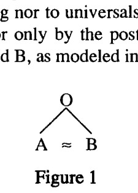
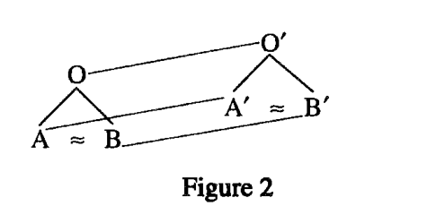

# I. The field of comparative poetics: Introduction and background

# Chapter 1. The comparative method in linguistics and poetics

<!-- pdf-page: 20 | source-page: 3 -->

The comparative method in
linguistics and poetics
1. Synchrony and diachrony,
typological and genetic comparison
INDO-EUROPEAN is the name that has been given since the early 19th century to the large
and well-defined genetic family which includes most of the languages of Europe, past
and present, and which extended geographically, before the colonization of the New
World, from Iceland and Ireland in the west across Europe and Asia Minor—where
Hittite was spoken—through Iran to the northern half of the Indian subcontinent.
A curious byproduct of the age of colonialism and mercantilism was the
introduction of Sanskrit in the 18th century to European intellectuals long familiar
with Latin, Greek, and the European languages of culture at the time: Romance,
Germanic, and Slavic. The comparison of Sanskrit with the two classical languages
revolutionized the perception of linguistic relationships.
In the year 1812 a young German named Franz Bopp (1791-1867) traveled to
Paris to read Oriental languages. He stayed for four years, serenely unconcerned with
the Napoleonic Wars, and in 1816 was published his book On the Conjugation System
of Sanskrit in Comparison with that of the Greek, Latin, Persian, and Germanic
Languages. Bopp was only 25 when the work appeared, but it marks the birth of the
Comparative Method. Bopp was not the first to discover that Sanskrit was related to
these other languages, the family we now term Indo-European but he was the first to
establish comparison on a systematic basis as an autonomous science to explain the
forms of one language by those of another.
As emphasized in the classical description (1925) of the Comparative Method
by the greatest Indo-Europeanist of his age, the French scholar Antoine Meillet (1866-
1936), there are two kinds of linguistic comparison, equally legitimate but with two
distinct goals. The first is TYPOLOGICAL comparison, and its goal is the establishment

<!-- pdf-page: 21 | source-page: 4 -->

of universal characteristics or universal laws; this is the ordinary sense of the term
'comparative' in comparative literature, comparative anatomy, or comparative law.
But the other type is GENETIC comparison, and its goal is history; that is the ordinary
sense of the term comparative linguistics. The same method is in principle perfectly
applicable to other disciplines as well. Genetic comparative anatomy is a part of
evolutionary—historical—biology. There exists a genetic comparative law, however
rudimentary, associated with particular related peoples and cultures. The present work
as a whole can be taken as an argument for the existence of a real genetic comparative
literature. In all cases it is the genetic model that I will refer to as the Comparative
Method in historical linguistics.
The Comparative Method is not very complicated, yet it is one of the most
powerful theories of human language put forth so far and the theory that has stood the
test of time the longest. Put simply, the comparatist has one fact and one hypothesis.
The one fact is that certain languages show similarities which are so numerous and so
precise that they cannot be attributed to chance, and which are such that they cannot
be explained as borrowings from one language into another or as universal or quasi-
universal features of many or all human languages. The comparatist's one hypothesis,
then, is that these resemblances among certain languages must be the result of their
development from a common original language.
Certain similarities may be accidental, like Latin deu-s, Greek theo-s, both
'god', and Nahuatl (Aztec) teo-tl 'sacred' (the hyphen separates the case marker at the
end of each). They may reflect elemental similarities: the Greek stem pneu- 'breathe,
blow' is virtually identical to the verb pniw- 'breathe' of the Klamath of Oregon, and
the imitative phrase I learned from my father for the call of the 'hoot owl' (actually the
great horned owl, Bubo virginianus), I-cook-for-myself-who-cooks-for-you-all, is
nearly the same in its last five syllables as the Swampy (Woodland) Cree word for the
same bird, ko.hko.hkaho.w (Siebert 1967:18). Both pairs imitate the physiological
gesture (blowing [pu-] through the nose [-n-]) or the sound of the bird. Finally,
languages commonly borrow words and their features from each other in a whole
gamut of ways ranging from casual contact to systematic learned coinages of the kind
that English makes from Latin and Greek. But where all these possibilities to account
for the similarities must be excluded, we have a historical conclusion: the similarities
are said to be genetic in character, and the languages are spoken of as related or cognate.
The comparatist assumes genetic filiation of the languages, in other words, descent
from a common ancestor, often termed a proto-language, which no longer exists. The
standard model to display this relation remains the family tree diagram.
Wherever the comparative method is carried to a successful conclusion it leads
to the restoration of an "original", arbitrarily "initial", language, i.e. the proto-
language. We speak of this as reconstruction. Reconstructed, and thus not directly
attested linguistic features—sounds, forms, words and the like—are conventionally
preceded by an asterisk in historical linguistic usage, e.g. the Proto-Indo-European
verb form *gʷhen-ti 'slays, smites' and the Proto-Algonquian noun form
*ko.hko.hkaho.wa 'great horned owl'. The systematic investigation of the resem-
blances among these languages by the comparative method enables us to reconstruct

<!-- pdf-page: 22 | source-page: 5 -->

the principal features of the grammar and the lexicon of this proto-language. The
reconstruction, in turn, provides a starting point for describing the history of the
individually attested daughter languages—which is the ultimate goal of historical
linguistics.
The technique by which reconstruction works consists of equations of linguistic
forms between languages, from which we may deduce rules of correspondence. These
operate on all levels of grammar, the meaningless as well as the meaningful, sound as
well as form. The key word is systematicity or regularity.
We can, for example, state it as a rule that the p and the d of the Greek stem pod-
'foot' will correspond to the f and t of English foot. That these rules work is
demonstrated by the comparison and equation of Greek pezd-(is) ([unclear]) with its
English translation and cognate (bull)fist, a kind of puffball, and the comparison and
equation of Greek pord-(e) ([unclear]) with its English translation and cognate fart. The
reconstructed Proto-Indo-European roots for these three words, *pod-/*pod-, *pozd-
/*pozd- and *pord-/*pord- can be viewed as just a shorthand for the sets of rules of
correspondence among the Greek, English, and all other cognates. But the stronger
claim, in spite of all the cautionary hedges we may put up, is that these reconstructions
are a real model, constructed to the best of our ability, of how we think certain people
talked at a remote period before recorded history—before the human race had invented
the art of writing.
Let us take as our starting point the simplest possible model of comparative
historical linguistics, of genetic filiation as determined by the application of the
Comparative Method. Two languages, A and B, exhibit systematic similarities which
cannot be attributed to borrowing nor to universals nor to chance. The systematic
similarities can be accounted for only by the postulation of an original common
language O, the ancestor of A and B, as modeled in Figure 1:

Figure 1
The description of O is its grammar and lexicon, i.e. its 'dictionary'. The task
of the historical linguist is both to describe O (by reconstruction) and, more impor-
tantly, to show how it is possible to get from O to A and from O to B.
Now, in favorable circumstances the use of languages A and B for artistic
purposes, which we will designate POETIC LANGUAGES A' and B', may also exhibit
systematic similarities which are not attributable to borrowing, universality, or
chance. The only explanation of the Comparative Method is again a common
"original": the use of O itself for artistic purposes, POETIC LANGUAGE O', as in
Figure 2:

<!-- pdf-page: 23 | source-page: 6 -->

Figure 2
The description of O' is its poetic grammar and its poetic repertory.
Put as simply as possible, linguistics is the scientific study of language, and
poetics is the scientific study of "artistic" language. In a famous and influential phrase
of Roman Jakobson (1896-1982), 'poetics deals primarily with the question, what
makes a verbal message a work of art?'(1981:18, originally published 1960).
Linguistics (and epistemology) owes to Ferdinand de Saussure (1857-1913) the
distinction between synchrony and diachrony, between the synchronic study of
phenomena (such as linguistic structures) at a particular point in time without
reference to history and the diachronic study of phenomena (such as linguistic
structures) as they move across or through time. It can be seen that it is synchronic
comparison which leads to the perception of universals, the properties of all human
languages, at any time and place, whereas diachronic comparison leads to history. Yet
the "opposition" of the synchronic to the diachronic plane or axis resolves itself in the
nature of the object, language. Synchrony is concerned with how all languages are the
same, whereas diachrony is concerned with how all languages are different; every
human language combines both properties, universal and particular.
Let us return to our model in Figure 2, the reconstruction of a poetic language.
The task of the linguist in this model is much more complex than in Figure 1. It is
twofold: first to describe O and O', the reconstructed proto-language and the recon-
structed poetic proto-language, and second to show how it is possible to get from O
to A and O to B, and from O' to A' and O' to B'. These are diachronic concerns. But
the linguist's task is also to show the relation of language A to poetic language A', B
to B', and O to O'. These are synchronic concerns.
Poetic language, poetic grammar, and poetic inventory may be approached
purely synchronically (typologically), with the goal of discovering universals; but
they may also be studied with an eye to history, not just social but genetic, evolutionary
history. The two are combined in the field of COMPARATIVE INDO-EUROPEAN POETICS,
which is the concern of the present work. Comparative Indo-European poetics may
be defined as a linguistic approach to the form, nature, and function of poetic language
and archaic literature among a variety of ancient Indo-European peoples. This
linguistic approach can and must be both diachronic and synchronic, both historical
and descriptive-theoretical, both genetic and typological. Comparative Indo-Euro-
pean historical linguistics in practice combines the diachronic and the synchronic
approach, and great comparatists like Ferdinand de Saussure, Berthold Delbruck
(1842-1922), Jacob Wackernagel (1852-1938), and Emile Benveniste (1902-1976)
moved freely and effortlessly between synchrony and diachrony. In my own way I
have tried to follow their model.

<!-- pdf-page: 24 | source-page: 7 -->

2. Culture history and linguistic reconstruction
A language necessarily implies a society, a speech community, and a culture, and a
proto-language equally necessarily implies a 'proto-culture', that is, the culture of the
users of the proto-language. In terms of our model we can also reinterpret O', A', B'
as representing any linguistically relevant aspect of the proto-culture, as for example
law: A' and B' would be cognate legal institutions in two societies speaking cognate
languages A and B, and O' would be the legal system reconstructible for the society
speaking proto-language O. The methods of historical linguistics provide critically
important tools for the culture historian concerned with the reconstruction of ancient
ways of life as well as ancient forms of speech. Poetic language is of course only one
of many registers available to the members of a given society.
Language is linked to culture in a complex fashion: it is at once the expression
of culture and a part of it. And it is in the first instance the lexicon of the language or
proto-language which affords an effective way—though not the only one—to approach
or access the culture of its speakers. Indo-Europeanists saw very early that the
agreements in vocabulary among the various ancient languages attest significant
features of a common ancestral culture. The same technique of reconstructing culture
from the lexicon has been applied successfully to other, non-Indo-European, families
as well.
To take a simple example, the word for 'dog' shows systematic similarities in
many Indo-European languages:
OIrish
Hittite
Greek
Vedic
Lith.
PIE
nominative
cu
kuwas
kuon
s(u)va
suo
* kuuo
accusative
coin
kuwanan
kuna
svanam
suni
* kuonm
genitive
con
kunas
kunos
sunas
suns
* Kunos
From the cognate set we can reconstruct not only the Proto-Indo-European word for
'dog' but also the precise details of its declension. Yet note that we have not only
reconstructed a word for 'dog', but we have postulated an item of the material culture
of the speakers of Proto-Indo-European as well. The inference that the Indo-
Europeans had dogs is obviously trivial, given the remote antiquity of the animal's
domestication. A more telling example, however, is an old technical term for an item
of chariot harness, the 'reins' held by the charioteer. We find the word in only two
traditions, Old Irish and Greek; but in both the one term is specifically linked to
charioteering in the earliest texts. We find in Homeric Greek of the 8th century heniai
([unclear]) 'reins' and heniokhos

) 'charioteer', literally 'reins-holder', which
faithfully continue the forms of the same words 500 years earlier in the Bronze Age,
Mycenean Greek anija 'reins' and anijoko 'charioteer, reins-holder'. Their only
cognate is in Old Irish of the 8th century A.D., the plural eisi or eise 'reins', held in the
hand of the charioteer in the epic Tain Bo Cuailnge. We can reconstruct an Indo-
European preform *ansiiola-, earlier *h,ans-iio/ah₂ -.1 As a technical term in chariotry
1. Thus correct the reconstruction given in Liddell-Scott-Jones, Greek-English Lexicon. The
attested Mycenean instrumental plural anijapi 'with the reins' can even be equated with the attested Old Irish

<!-- pdf-page: 25 | source-page: 8 -->

and the harnessing of the horse it is certainly a non-trivial reconstruction for the
material culture of the Proto-Indo-Europeans.
Non-material culture, what anthropologists now term symbolic culture, is
equally amenable to reconstruction. We can reconstruct with certainty an Indo-
European word for 'god', *deiuos, from Irish de, Latin deus, Sanskrit devas, etc.; it is
a derivative of an older root noun *dieu- (Hittite siu-n- 'god'). This form figures as
well in the two-part reconstructible name of the chief deity of the Indo-European
pantheon, *dieu- ph₂ter-. The second element is the general Indo-European word for
'father', not in the sense of 'parent' or 'sire', but with the meaning of the adult male
who is head of the household, Latin paterfamilias. He is the 'father god': for the Indo-
Europeans the society of the gods was conceived in the image of their own society. The
reconstruction *dieu- ph₂ter- recurs not only in Latin Iuppiter, Greek Zeu pater, and
Vedic Diaus pitar, but also in Luvian Tatis Tiwaz 'father Diw-at- and Hittite Attas Sius
'father Sius' (written with Sumerograms as DUTU-us). Old Irish has its special
contribution to make here as well: the pagan deity known as the Dagdae (in Dagdae,
literally 'the good-god', always with the article) has the epithet Oll-athair 'great-
father', 'super-father'. We can reconstruct a whole Celtic phrase, *sindos dago-
deiwos ollo-[p]atir. The Indo-European semantics "father god" (in boldface) is
actually better preserved in Old Irish and in Hittite than it is in Greek or Latin with their
personalized "father Zeus/Jove". The definite article (older demonstrative) of Irish in
Dagdae adds its own archaic modality, like the Hittite god Sius-summis 'our own God'.
Now another lexical set relating to an aspect of symbolic culture in the semantic
realm of power or authority is the group of words including Vedic asura- and Avestan
ahura- 'lord' (usually divinized), Hittite hassu- 'king', and the group of Germanic
deities known in Old Norse as the
sir, Germanic *ansuz. These are respectively
reconstructed as *h₂ns-u-ro , *h₂,ns-u-, and *h₂o'/ans-u-.2
Most scholars today assume these words for 'king, lord, god' are related to the
Hittite verb has-/ hass- 'beget, engender, produce', from *h₂o/ans-. Ferdinand
Sommer as early as 1922 noted the parallelism of Hittite has-/hass- 'engender' beside
hassu- 'king' from a single root, and the family of English kin etc. beside the family
of English king (Germanic *kuningaz) from another single IE root *genh₁ -, also
meaning 'engender'. The ruler was looked upon as the symbolic generator of his
subjects; the notion is still with us in the metaphor 'father of his country', translating
the even clearer Latin figure pater patriae.
Other Indo-European words for 'king' make reference to other semantic aspects
of royalty and kingship. The old root noun *h₃reg- is found only in the extreme west
(Latin rex, Irish ri) and extreme east (Vedic raj-, Avestan barazi-raz- 'ruling on
high').3 The noun clearly belongs with Greek
'stretch out', Latin rego 'rule',
Vedic raj- 'stretch out straight', and a whole set of forms built on the metaphor
'straight, right' and 'rule, ruler, regulate'. The Old Avestan derivative razar is
dative plural e'sib, down to the very case ending. We can reconstruct *ansiiabhi, earlier *h₂ans-iiah,
-bhi-, with the same precision as in the word for 'dog'.
2. For the nasal and other details see most recently the dictionaries of Puhvel, Tischler, Mayrhofer,
and Lehmann, with references.
3. Or 'commanding aloud' (Kellens 1974).

<!-- pdf-page: 26 | source-page: 9 -->

variously translated as 'ordinance' (Bartholomae), 'order' (Kellens), even 'prayer'
(Humbach-Elfenbein-Skjærvø). We may observe yet another metaphor for guidance
or governance in Y. 50.6 raivim stoi mahiia razang '(we should instruct Zarathustra)
to serve as charioteer of my ordinance/prayer'. The metaphor of the ruler as driver,
charioteer recurs in the Old Irish text Audacht Morainn §22 and frequently in the
Rigveda.
This metaphor permits us to return to our words for' ruler', 'lord', 'king' in Vedic
asura-, Germanic *ansuz, Hittite hassu-, and to propose they may be related to the
technical term for the chariot driver's means of guiding and controlling his horses:
the 'reins', Greek and Irish *ans-io- from the same Indo-European root *h₂ns- or
*h₂ans-, which we discussed above. The designation of the reins rests squarely on a
metaphor: the "reins" are the "rulers". It is just the inverse of the metaphor which calls
the ruler "charioteer", "helmsman".
In our model of the reconstruction of a poetic language (Figure 2), two cognate
poetic languages, A' and B', form the base of the triangle, and its apex is the
reconstructed poetic proto-language O'. As we stated, the description of this poetic
language O' is its poetic grammar and repertory. The notion of poetic grammar and
its analogues to the different components of ordinary grammar such as phonology and
syntax will be examined in greater detail in chap. 3. Let us here only note that on a
higher level of grammar, where meaning is pertinent, we find the syntactic, semantic,
and pragmatic components. This is the domain of FORMULAS, set phrases which are the
vehicles of THEMES. The totality of themes may be thought of as the culture of the given
society.
The comparison of characteristic formulas in various Indo-European languages
and societies permits their reconstruction, sometimes as far back as the original
common language and society. The formulas tend to make reference to culturally
significant features—'something that matters'—and it is this which accounts for their
repetition and long-term preservation. The phrase goods and chattels is an example
of a formula in English today, fixed in the order of its constituents and pragmatically
restricted in deployment and distribution. A glance at The New English Dictionary
shows the phrase attested in that form and in that fixed order since the early 16th
century and a good century earlier in the form good(e)s and cattel(s). The earliest
citation is 1418, but we may safely presume the phrase is much older. It appears to be
a translation into English of an Anglo-Latin legal phrase (NED s.v. cattle) designating
non-moveable and moveable wealth which is attested as bonorum aliorum sive
cattalorum in the pre-Norman, 11th-century Laws of Edward the Confessor. The
coinage cattala is from Late Latin cap(i)tale, presumably transmitted through North-
ern or Norman French, but before the Conquest.
This formula is a MERISM, a two-part figure which makes reference to the totality
of a single higher concept, as will be shown in chap. 3: goods and chattels, non-
moveable and moveable wealth, together designate all wealth. In its present form this
formula is nearly a thousand years old in English. Yet its history may be projected even
further back, with the aid of the comparative method. We find a semantically identical
formula in Homeric Greek nearlytwo thousand years earlier: the phrase

<!-- pdf-page: 27 | source-page: 10 -->

TE (Od. 2.75), where Telemachus complains of the suitors devouring his
'riches which lie and riches which move', the totality of his wealth. For other parallels
see Watkins 1979a and 1992a.
In its semantics and as the expression of a cultural theme the formula goods and
chattels goes all the way back to Indo-European, even if the particular verbal
expression, the wording of the phrase itself, does not. Lexical renewal of one or more
components of a formula does not affect its semantic integrity nor its historical
continuity. We have a renewal of the signifiant, the "signifier", while the signifie, the
"thing signified", remains intact. In cases where we can know, as here, language is
almost incredibly persistent, and in this work as a whole it is my goal to emphasize the
longevity and specificity of verbal tradition and the persistence of specific verbal
traditions, whether in structures of the lexicon, of syntax, or of style.
The collection of such utterances, such formulaic phrases, is part of the poetic
repertory of the individual daughter languages, and, where reconstructible, of the
proto-language itself. Individual lexical items or sets of these which constitute
formulaic phrases are not the only entities amenable to reconstruction. On the basis
of similarities—samenesses—we reconstruct language. But it happens that certain
texts themselves in some of these cognate languages, or text fragments, exhibit the sort
of similarity to suggest that they are genetically related. These texts are in some sense
the same. Exploration of what might be termed the "genetic intertextuality" of these
variants casts much light on the meaning of the ancient texts themselves; on the basis
of the samenesses we may in privileged cases reconstruct proto-texts or text fragments.
These too are part of the poetic repertory of the poetic proto-language O'.
Formulas may also function to encapsulate entire myths and other narratives,
and the whole of Part Two of the present work is devoted to the 'signature' formula
of the Indo-European dragon-slaying myth, the endlessly repeated, varied or invariant
narration of the hero slaying the serpent. We will begin in the Rigveda, with the
phonetically and syntactically marked phrase hann him 'he/you SLEW the SER-
PENT' . Following the French Indologist Louis Renou (1896-1966) we will term this
phrase the BASIC FORMULA. As we shall see, it recurs in texts from the Vedas in India
through Old and Middle Iranian holy books, Hittite myth, Greek epic and lyric, Celtic
and Germanic epic and saga, down to Armenian oral folk epic of the last century. This
formula, typically with a reflex of the same Indo-European verb root *gʷhen- (Vedic
han-, Avestanjan-, Hittite kuen-, Greek
-, Old Irish gon-, English bane),
shapes the narration of 'heroic' killing or overcoming of adversaries over the Indo-
European world for millennia. There can be no doubt that the formula is the vehicle
of the central theme of a proto-text, a central part of the symbolic culture of the
speakers of Proto-Indo-European.
The formula appears in texts of a variety of genres from cultic hymn and
mythological narrative, epic and heroic legend, to spells and incantations of black and
white magic. The variations rung on this basic formula constitute a virtually limitless
repository of artistic verbal expression in archaic and preliterate Indo-European
societies. Their careful study can cast light in unexpected places and bring together
under a single linguistic explanation a variety of seemingly unrelated, unconnected

<!-- pdf-page: 28 | source-page: 11 -->

text passages in a number of different but related languages. Things that do not make
sense synchronically often do make sense diachronically, and, just as in language, the
key may lie in a "singular detail" (Meillet 1925:3), like the use of a derivative of the
root *gʷhen-. This linguistic approach to the poetics of these ancient texts in related
ancient languages I have, I believe legitimately if somewhat tendentiously, termed
genetic intertextuality. The method as a whole I have called elsewhere (1989)—
rehabilitating an old-fashioned term by insisting on its literal meaning—the new
comparative philology.
It should be unnecessary to point out explicitly that the approach to these ancient
Indo-European texts I am advocating here is intended only as a supplement or
complement to, not a substitute for, the ordinary standard approaches to literary texts
in these same languages through literary history, philology, or criticism. The Greek
poet Pindar was a historical personage, who practiced his craft and earned his
livelihood commemorating in song the accomplishments and virtues of other contem-
porary personages of a specific historical time and place, Greece and Sicily of the 5th
century B.C. Pindar was a product of his own times. But it can only increase our awe
before his genius to know that in some of his formulas and themes, some of his genres
and subgenres, some of his training and his role in society, he was still part of a cultural
tradition, verbally expressed, which reached back thousands of years. It can by the
same token only enhance our wonder at Pindar's art to hear his elemental words of
water, gold, and fire echoing and reverberating from Celtic ringforts to Indic ritual
enclosures:
Best is water, but gold like burning fire
by night shines out beyond all lordly wealth.
