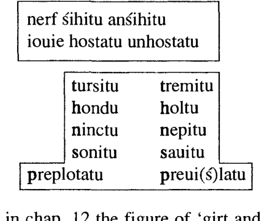
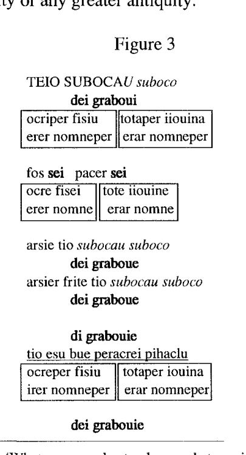

# Chapter 18. Umbria: The Tables of Iguvium

<!-- pdf-page: 231 | source-page: 214 -->

Among the most interesting texts that antiquity has left us are the seven bronze tablets
discovered in 1444 in Gubbio, Latin Iguvium, a small town of Umbria, where they still
remain. The Iguvine tables, by far our most extensive source of information for the
Umbrian language, are no less important for the study of religion in ancient Italy, for
they consist of an extremely detailed set of liturgical and cultic instructions for a
college of priests, the Atiedian Brethren. As the late Arnaldo Momigliano wryly
remarked (1963:115), 'Like the laws of Gortyna, the Iguvine Tables owe something
of their fascination to the double fact of being preserved near the place where they
originally stood, and of being very difficult to understand.'
Tablets VI and VII are written in the Latin alphabet, probably in the 1 st century
B.C.; their content is nearly identical to that of Tablet I, written in the native Umbrian
alphabet (derived from the Etruscan) probably in the 3rd century B.C., but with the
important difference that Tablets VI and VII include the full text of all the prayers and
invocations only alluded to in I. They are thus invaluable for the study of the poetic
form of Umbrian liturgical language as well.
I begin with the first of three virtually identical prayers accompanying the
sacrifice of three oxen to Jupiter Grabovius, the first of the 'Grabovian' triad Di,
Mane, Vofione, which strikingly recalls the old Roman triad luppiter, Mars,
Quirinus.' Though not all scholars accept the Dumezilian account of these Roman and
Umbrian deities, a more adequate hypothesis has yet to be proposed. The interpreta-
tion has in any case no consequence for the poetic analysis of the prayer itself.
In order to show the manner in which the inherited figures, many of which we
saw in the preceding section, are incorporated into a liturgical whole, I present this first
prayer in its entirety (VIa 22-34), dividing into line units of syntactic cohesion.2
teio subocau suboco
Thee I invoke an invoking,
dei graboui
Jupiter Grabovius,
1. Benveniste 1945:6-9 first provided the etymology of Vofion- as *leudhiono- (*loudhiono~)
to Lat. Liber, German Leute.
2. The text is readily available in Poultney 1959. For later literature and invaluable discussion see
Meiser 1986.

<!-- pdf-page: 232 | source-page: 215 -->

18 Umbria: The Tables of lguvium
215
5
10
ocriper fisiu totaper iiouina
erer nomneper erar nomneper
fos sei pacer sei
ocre fisei tote iiouine
erer nomne erar nomne
arsie tio subocau suboco
dei graboue
arsier frite tio subocau suboco
dei graboue
di grabouie
tio esu bue peracrei pihaclu
15
20
25
30
35
ocreper fisiu totaper iouina
irer nomneper erar nomneper
dei grabouie
orer ose persei ocre fisie pir
orto est
toteme iouine arsmor dersecor
subator sent
pusei neip heritu
dei crabouie
persei tuer perscler uaseto est
pesetomest
peretomest
frosetomest
daetomest
tuer perscler uirseto auirseto
uas est
di grabouie
persei mersei esu bue peracrei
pihaclu pihafei
di grabouie
pihatu ocre fisei pihatu tola iouina
di grabouie
pihatu ocrer fisier totar iouinar nome
nerf arsmo
veiro pequo
castruo frif
pihatu
futu fos pacer pase tua
for the Fisian Mount, for the Iguvine State
for the name of that, for the name of this.
Be favorable, be propitious,
to the Fisian Mount, to the Iguvine State
to the name of that, to the name of this.
In the formulation^ I invoke thee
an invoking,
Jupiter Grabovius;
in trust of the formulation I invoke thee
an invoking,
Jupiter Grabovius.
Jupiter Grabovius,
thee (I invoke) with this yearling ox as
purificatory offering
for the Fisian Mount, for the Iguvine State
for the name of that, for the name of this.
Jupiter Grabovius,
in that rite if on the Fisian
Mount fire has arisen
or in the Iguvine State the due
formulations have been omitted,
(bring it about)' that (it be) as not intended.
Jupiter Grabovius,
if in your sacrifice there has been any flaw,
any defect, any transgression,
any deceit, any delinquency,
(if) in your sacrifice there is
any seen or unseen ritual flaw,
Jupiter Grabovius,
if it is right with this yearling ox
as purificatory offering to be purified,
Jupiter Grabovius,
purify the Fisian Mount, purify the Iguvine State.
Jupiter Grabovius,
purify the name of the Fisian
Mount, of the Iguvine State;
magistrates (and) formulations,
men (and) cattle,
heads (of grain) and fruits
purify.
Be favorable, propitious in thy peace,
3. Literally, 'to the name of this (masculine) [the Fisian Mount], to the name of this (feminine) [the
State of Iguvium].'
4. The translation is tentative and modeled on that of Vedic brahman-. Meiser 1986:194translates
arsmor as 'Ordnungen', arsmo- (and related words like arsie(r)) as 'Ordnung, Gesetz'. Vendryes' old
etymology (1959:13) to Old Irish ad . i. dliged 'law, right' and related forms is certainly plausible, though
not mentioned by Poultney or Meiser.
5. The gapped verb fetu is present in the parallel passage Ha 4.

<!-- pdf-page: 233 | source-page: 216 -->

ocre fisi tote iiouine
erer nomne erar nomne
di grabouie
saluo seritu ocre fisi
salua seritu tola iiouina
di grabouie
saluo seritu ocrer fisier totar
iiouinar nome
nerf arsmo
veiro pequo
castruo fri
salua seritu
futu fos pacer pase tua
ocre fisi tote iouine
erer nomne erar nomne
di grabouie
tio esu bue peracri pihaclu
ocreper fisiu totaper iouina
erer nomneper erar nomneper
di grabouie
tio subocau
to the Fisian Mount, to the Iguvine State
to the name of that, to the name of this.
Jupiter Grabovius,
keep safe the Fisian Mount
keep safe the Iguvine State;
Jupiter Grabovius,
keep safe the name of the
Fisian Mount, of the Iguvine State;
magistrates (and) formulations,
men (and) cattle,
heads [of grain] (and) fruits
keep safe.
Be favorable, propitious in thy peace
to the Fisian Mount, to the Iguvine State
to the name of that, to the name of this.
Jupiter Grabovius, thee (I invoke)
with this yearling ox as purificatory offering
for the Fisian Mount, for the Iguvine State
for the name of that, for the name of this,
Jupiter Grabovius,
thee I invoke.
The similarity in style, rhythm, and temper to Cato's suouitaurilia prayer has
been evident to all observers over the past century and a quarter, the period of scientific
study of the Umbrian language. Let us examine its devices more carefully.
The prayer is bounded by nested ring composition at a distance of more than 50
lines: 1-2 teio subocau suboco / dei graboui and 55-6 di grabouie I tio subocau.
The insistent, almost relentless doubling of grammatical parallel phrases on the
"horizontal" (linear) axis—for/to the Fisian Mount, for/to the Iguvine State, lines 3,
6, 14, 37, 49, 53—is in counterpoint to the "vertical" (non-linear) reference to the
following lines 4,7, 15, 38,50,54, for/to the name of this (masc.), for/to the name of
this (fern.):
The remarkable play on deixis in the Umbrian passage is made possible solely by the
different gender marking of the repeated pronoun:' for the name of this (masculine)',
'for the name of this (feminine)'. The result is a sort of "magic square" which is
repeated six times over 12 out of the 56 short lines.6 See the diagrams in figure 3 below.
The perfect grammatical symmetry of these six "squares" is counterbalanced by
the grammatical asymmetry of the two verb phrases which have as object first the
Mount and the State and then the name of the Mount and the State: one with pihatu (29-
6. For a play on 'N and the name of N' in Vedic noteTS 3.3.3.2 ydt te somddahhyamndmajdgrvi
tdsmai le soma sdmaya xvdha 'What (is) thy undeceived, watchful name, o Soma, to that of thine, o Soma,
to Soma hail!'

<!-- pdf-page: 234 | source-page: 217 -->

31) and the other with saluo seritu (40-43). These two straddle one of the squares (37-
38). The symmetry is only partial; the first colon is bipartite and balanced,
29
pihatu ocre fisei
pihatu tota iouina,
the second is not:
31
pihatu ocrer fisier
totar iouinar nome.
The complexity is increased in 40-43 by the doubling of the sentence-initial imperative
to an alliterative phrase saluo seritu occupying the same slot: symmetric
40-41
saluo seritu ocre fisi salua seritu tota iouina
but asymmetric
43
saluo seritu ocrer fisier
totar iouinar nome.
40-3 are furthermore grammatically more complex since the adjective saluo/a of the
phrase 'keep safe' must agree with the object of the verb. The two neuter accusatives,
adjective saluo and noun nome, thus frame the whole sentence:
[sal. ser. [[ocr. fis. tot. iou.] nom.]]].
The symmetrical "squares" and asymmetrical lines occupy 17 of the 56 short lines.
The name and epithet of the divinity addressed accounts for 13 more lines.
We have three instances of figuraetymologica: subocau suboco 1,8,10;pihaclu
pihafei. . . pihatu 27-29; and pacer pase 36, 48. In teio subocau suboco 1, arsie tio
subocau suboco 8, arsier frite tio subocau suboco 10 we have a figure akin to the
KA.vu,oe^ or gradatio of classical rhetoric. The first "square" separates the first and
second of the three cola of the latter figure.
The captatio benevolentiae formula 'Be favorable (and) propitious' is expressed
in 5 with the symmetrical clause-final 2sg. subjunctives fos sei pacer set, before the
second "square", and in 36 and 49 before the fourth and fifth "square" with the clause-
initial imperative and doubly alliterative but grammatically asymmetrical futu fos
pacer pase tua "be favorable (and) propitious in thy peace." F. Leo (cited by Norden
1939:127n.) long ago compared the prayer in Plautus, Merc. 678-80:
Apollo, quaeso te ut des pacem propitius
salutem et sanitatem nostrae familiae
meoque ut parcas gnato pace propitius
Apollo, I beseech thee, propitious, that you give peace,
haleness, and health to our family,
and that you spare my son, propitious in thy peace.

<!-- pdf-page: 235 | source-page: 218 -->

The passage—'das schone Gebet' (Norden loc. cit.)—also shows close similarities to
Cato's suouitaurilia prayer. With the first formulation pacer sei 'may you be
propitious' compare the closely related Marrucinian pacrsi 'may it be propitious,
acceptable' (Vetter 218, ca. 250 B.C.)
The fourth and fifth "squares", introduced by the futu fos formula, are them-
selves framed by the third and sixth "squares", introduced by the elliptic formula tiom
esu hue peracrei pihaclu 'thee by this yearling ox as purificatory offering (I invoke,
propitiate).' The syntax of tiom esu hue pihaclu is identical to that of the corresponding
Latin te hoc porco piaculo 'thee by this pig as offering (I propitiate)', Cato, De agr.
141.4 (and te hisce suouitaurilibus piaculo ibid.), down to the very ellipsis of the verb.
There is no Latin verb *piaculo 'I make atonement to', despite the Oxford Latin
Dictionary s.v.,7 as is proved by made hoc porco piaculo immolando esto (ibid. 139),
with the same nouns and an overt verb phrase. The elliptic expression is the rule in
Umbrian, with and without pihaklu: VIb 28 tiom esu sorsu persontru tefrali pihaklu
'thee with this Tefral (divine name Tefer) pork fat as offering'; VIb 14 tiom esa mefa
spefa fisouina 'thee with this Fisovian (divine name Fisovius) sacrificial flat cake';
VIIa 10/26 tiom esir uesclir adrir/alfir 'thee with these black/white vessels'. The
oldest and simplest is Ha 25 in the native alphabet, tiu puni tiu vinu 'thee with mead,
thee with wine'.
In the two phrases
tiom esu bue pihaclu
thee with this ox as offering
te hoc porco piaculo
thee with this pig as offering,
both with ellipsis (gapping of a finite verb), we have a sacrificial formula of Common
Italic date, i.e., a formula which might go back to the period of community of the
ancestors of Umbrian and Latin.8
It is in fact far more likely that this formula was diffused over part of the
geographic area of Italy, perhaps sometime in the middle of the first millennium B.C.,
rather than being inherited from a period of linguistic community that might antedate
the migration of its speakers into the Italian peninsula. The sacrifical formula in its
particularity and cultic setting is rather more characteristic of the first millennium B.C.
than an earlierperiod. In such cases we speak of a linguistic area (German Sprachbund,
Russian jazykovyj sojuz), as in cases like the Balkans, India, or areas of Australia. The
direction of the diffusion, the spread of 'areal' features is often indeterminate,
particularly where the history is largely unknown. In comparative and historical
poetics (and other cultural manifestations) the role of diffusion, as against either
genetic transmission or occasional or systematic borrowing (for example of the
7. And Lewis and Short, Forcellini, etc.
8. Methodologically note the equation of two zero signs (the gapped verbs), plus the two accusative
pronouns, the two ablative deictics and animal names, and the identical case as well as lexical form in
pihadulpiaculo. In both we may see partitive apposition, 'thee by the offering of this pig/ox'. Note also
that to assume that piaculo in hoc porco piaculo is sometimes a 1 sg. verb and sometimes an abl. sing, noun
in Latin, with translators and lexicographers, is uneconomical given the unambiguous Umbrian pihaclu'. a
1 sg. verb would be *pihaclau. The Latin ablatives in Cato's time would in any case have still ended in final
-d, thus eliminating any possible ambiguity.

<!-- pdf-page: 236 | source-page: 219 -->

18 Umbria: The Tables of lguvium
219
dactylic hexameter and other meters from Greek into Latin), should not be underes-
timated, particularly in geographically contiguous and contemporary cultures as in
Ancient Italy.9
Lines 16-18 and 21 -24 are concerned with heading off the consequences of any
act which might invalidate the prayer and the ritual: a lightning fire on the mountain,
incorrect formulation in the state, or omitted ritual actions: '(Bring it about) that (it be)
as not intended' pusei neip heritu. The conjunction pusei recalls the use of its Latin
cognate uti (and utique) in the suouitaurilia prayer. Lines 16-18 come the closest of
any in the Umbrian prayer to unadorned prose;10 but in the balance of ocr.fis. and tot.
iou. they continue the parallelism of the "squares". In intent and function these lines
are similar to Cato' s instructions at the end of the suouitaurilia prayer (141.4): Si minus
in omnis litabit, sic uerba concipito:
Mars pater,
siquid tibi in illisce suouitaurilibus lactentibus
neque satisfactum est,
te hisce suouitaurilibus piaculo.
Si in uno duobusque dubitabit, sic uerba concipito:
Mars pater,
quod tibi in illoc porco
neque satisfactum est,
te hoc porco piaculo.
If favorable omens are not obtained in response to all (three victims),
use these words:
Father Mars,
if anything in the offering of those sucklings
did not satisfy thee,
thee by the offering of these suouitaurilia (I propitiate).
If there is doubt about one or two, use these words:
Father Mars,
what(ever) in that pig
did not satisfy thee,
thee by the offering of this pig (I propitiate).
9. For a modern example of cross-linguistic verbal diffusion compare the spread of the expression
no problem, pas deprohleme, kein Problem etc. all the way to s 'ka problem in Albania by at least 1991 (fide
C. Reiss). Another typical example is the spread of jokes in contemporary folklore, down to such particulars
as the characteristic phonetic distortion in the telling of "the wide-mouthed frog", which I heard exactly
repeated in Paris in 1991 as "la grenouille a grande gueule".
10. It is doubtful that in orer ose . . . ocre . , . orto we should see intentional alliteration.

<!-- pdf-page: 237 | source-page: 220 -->

The (probably symbolic) contrast in deixis 'those (illisce) - these (hisce)', 'that
(illoc) - this (hoc)' parallels Umbrian orer (not erer).
Lines 21-24 of the Umbrian prayer clearly constitute a strophe, bound together
by rhythm, repetition, grammatical parallelism, and a double inherited grammatical
and formulaic figure. Rhythm and morphological parallelism characterize the center
two lines 22-3,
22
pesetomest peretomest
23
frosetomest daetomest,
(If there has been) any defect, any
trangression,
any deceit, any delinquency,
all of four syllables (da-etomest), and all impersonal 3sg. perfect passives. 22a and 23a
are linked by semantics (compare their Latin equivalents peccatum -fraudatum); 22a
and b are linked by alliteration; and 22b and 23b are linked grammatically as
compounds of *ei- 'go', as though they were in Latin *per-itom and *de-itom. We have
three sides of a "magic square" again, and the linkage horizontal-sound (alliteration)/
vertical-meaning (semantics) can be exactly paralleled in another Sabellic dialect:
Oscan.
The lead tablet curse Vetter 3 (ca. 100 B.C.) is a true malum carmen, both for its
alliteration and for its semantic catagories. It contains two "magic squares", each
consisting of two alliterative merisms, followed by a single merism. These five
lines—2 1/2 "squares"—are flanked by the name of the intended victim and the
fragmentary dative 2sg. pronoun t(f[ei 'to you', referring to the divinity to whom the
effectuation of the curse is directed. It is interesting that there is not room in the lacuna
for a verb like Latin trado, mando 'I hand over'; the verb in this utterance as well must
have been gapped, understood. Strophically the lines may be presented as
aginss
fakinss
biass
aftiim
urinss ulleis
fangvam
bi1tam
anamum
aitatum
amirikum
his actions
deeds
strength
ability"
lifespan
utterances
tongue
life
soul
livelihood.
Each horizontal line pair alliterates (boldface); the enclitic possessive ulleis comes
after the first merism rather than the first word, by an optional poetic version of
Wackernagel's rule. Each of the four vertical pairs are semantically similar, i.e. have
features in common. The last merism stands alone, as a global merism designating the
victim's life (Lat. aetas) and the means to live it (: Lat. merx). Observe finally that the
11. Following Pisani 1964:95. Meiser's(1986:91) 'sight' from *htk'-ti- is semantically out of place
in the above scheme, and in any case phonologically impossible.

<!-- pdf-page: 238 | source-page: 221 -->

18 Umbria: The Tables of lguvium
221
merism biass biitam may be of Common Italic date; with lexical replacement of the
first member (' strength') under semantic and grammatical identity (the plural number)
it recurs in the alliterative Old Latin uires uitaque (Ennius,Ann. 38), as we have seen.12
Returning to the Umbrian prayer, we saw that lines 22-23 form a symmetrical
central "square", bipartite on all sides, in the middle of the strophe. They are framed
first by the repetition in 21 and 24 of the genitive tuer persder 'in the sphere of your
sacrifice', and then an inherited stylistic figure found in many early Indo-European
traditions: the resumption or iteration of a verb form V
i by a nominal form from the
same root Ni in a semantically equivalent verb phrase (Ni + V), including copula
sentence or nominal sentence:
21
uaseto(m)13 est
(Vi)
(If) there has been any flaw,
literally, impersonal '(if) it has been flawed', with a verb form corresponding to Latin
uacatum est, beside
24
uas est
(NN+ V (NIf there is a f there
with a related abstract noun, s-stem *uak-os.14 The nominalization in the last example
made possible the addition of the likewise inherited merism of adjectives 'seen (and)
unseen':
uirseto auirseto uas est.
The latter is the figure of Latin uisos inuisosque, Vedic drstams ca adfstarhs ca
discussed in chap. 17.
The Indo-European stylistic figure (Vi) . . . (Ni + V) has been discussed and
illustrated in chap. 13.
Of the 56 short lines of this prayer there remain only 6 to be accounted for. These
are the two three-line strophes discussed in the preceding chap. 12, the triad of
asyndetic merisms
nerf arsmo
magistrates (and) formulations,
ueiro pequo
men (and) cattle,
castruo frif
heads [of grain] (and) fruits,
followed by pihatu (32-5) and salua seritu (44-7) respectively. The functional
hierarchy is the same as that of the central strophes II-III of Cato's prayer, as
Benveniste recognized. The structure is thus
12. For the diachronic dynamics see further in chap. 12.
13. The final -m is present in the second and third repetitions of the prayer.
14. Morphologically the relation of stalive *uak-e- (uasetom) to *utak-os (uas) parallels Latin decet
: decus and is old.
f l a w ,

<!-- pdf-page: 239 | source-page: 222 -->

A1(+)B1
A2(+) B2
A3 (+) B3,
and may be read both linearly (horizontally) and vertically: nerf ueiro castruo and
arsmo pequo frif, as in the Oscan curse examined earlier. Note also the little phonetic
ring linking the first and last words and thus delimiting the strophe. The last word
provides at once a double response:
Compare the phonetic responsion of Sophocles' paean to sleep studied in chap. 55:
huPN . . . PaioN.
Of the other longer Umbrian prayers in tablets VI and VII two contain similar
strophic structures. In VIb 10-11 the offering to Fisovius Sancius is accomplished by
a prayer:
fisouie sansie
Fisovius Sancius
ditu
grant
ocre fisie tote iouine
to the Fisian Mount, to the Iguvine State
ocrer fisier totar iouinar
of the Fisian Mount, of the Iguvine State
dupursus peterpursus
to the two-footed (and) the four-footed
fato fito
(success) in word (and) deed
perne postne
before (and) behind
sepse sarsite
hedged (and) whole
[uouse auie esone""]
in vow, in augury, in sacrifice
In dupursus peturpursus we have another Indo-European formulaic merism, a
specification (and here equivalent) of ueiro pequo 'men and cattle', as noted in the
preceding section. In the sequence beginningfatofito the interpretation of some of the
words is still tentative, but the structure is clear: three alliterative two-word figures
followed by a three-word figure (grammatically parallel with the same locative
ending, homoioteleuton). The four lines have thus the form of an inverted T, exactly
as we noted in strophe II of Cato's prayer in Latin.
The second of the three bipartite figures belongs to 1.1 .b of our typology in the
preceding section, argument + counter-argument, while the third is I.2.b, argument +
synonymous argument. 'Before (and) behind' designates 'everywhere', whereas
'hedged (and) unbroken' is intensive, 'very protected'. The latter, if the usual
connection with Latin sarcire 'repair, mend (as in fences)' is correct, is similar to both
Latin sane sarteque 'safe and sound' (with the same adverbial ending as the Umbrian),
and Latin sarcta tecta 'whole (and) roofed'. They are probably related, either by
genetic filiation or by diffusion within Italy.

<!-- pdf-page: 240 | source-page: 223 -->

18 Umbria: The Tables of lguvium
223
The translation of fato fito as 'word (and) deed' is loose, but the two must be
related to Latin fari' speak' and fieri (as passive of facere 'do') respectively, probably
*bhh₂-to- and *bhuh₂-to-.15 Semantically, recall Oscan aginss urinss 'actions (and)
utterances'.
The final strophe-like structure is found in the ritual curse pronounced on the
neighboring peoples, their magistrates and armies, in VIb 58-60, repeated VIIa 47-9:
nerf sihitu ansihitu
iouie hostatu unhostatu
tursitu
tremitu
hondu
holtu
ninctu
nepitu
sonitu
sauitu
preplotatu
preui(s)latu
the magistrates girt (and) ungirt,
the young men under arms
(and) not under arms
terrify (and) make tremble,
destroy (and) smash (?),
fall upon (and) nullify (?),
overcome (and) wound (?),
trample (and) fetter.
We saw in chap. 12 the figure of 'girt and ungirt' etc., I.I.a Argument + Negated
Argument. The remaining set of five alliterative pairs are clearly all I.2.b Argument
+ Synonymous Argument, even if the translations of the underlined verbs are mere
guesses; for the others see Meiser 1986. Both figures have exact parallels in Cato's
prayer, strophes II-III. The last is finally linked both by alliteration and grammatical
anaphora, the pre verbs pre-.. .pre-. For the figure compare from the Old Latin Senatus
Consultum de Bacchanalibus of 186 B.C. neue . . . coniourase neue comuouise neue
conspondise neue compromesise 'not to swear, vow, pledge, or make promise with
others', almost all hapax legomena.
The poetic units discussed through this chapter are identified and individuated
by different type styles and other marks in Figure 3, beginning and ending with the ring
in upper case letters.
The systematic links inpoetic technique between Cato' s prayer and the Umbrian
prayers thus go far beyond the simple parallelism in rhythm and alliteration rightly
noted long ago by F. Buecheler and E. Norden.16 The latter could evoke with great
charm 'welche Kraft und Naturlichkeit, welcher Ernst und Wurde, welche sanctitas,
15. With Meiser 1986:53. Umbrian fato probably shows the inherited short of Latin fat(en) rather
than the long offatus.
16. 1883 and 1958 [18981] respectively.
totam tarsinatem
trifo tarsinatem
tuscom naharcom iabuscom nome
totar tarsinater
trifor tarsinater
tuscer naharcer iabuscer nomner
the Tadinate State,
the Tadinate tribe,
the Etruscan, Narcan,
lapudic name,
of the Tadinate State,
the Tadinate tribe,
of the Etruscan, Narcan,
lapudic name

<!-- pdf-page: 241 | source-page: 224 -->

kurz welches echt italische Wesen' (p.163).17 In the domain of poetics we may well
think of Ancient Italy in the early to middle first millennium B.C. as a linguistic area.
Over this territory certain poetic features, like linguistic features, could be diffused
across language boundaries in an ambience of largely shared cultural institutions, both
material and symbolic. The analogy with the Balkans, both in language and poetics,
is illustrative. In this way we can perhaps more easily account for such "uncanny"—
i.e. remarkably particular—similarities as Latin pastores pecuaque salua seruassis
and Umbrian ueiro pequo ... salua seritu, with both noun phrases occupying second
place in a triadic strophic structure, or Oscan biass biitam and Latin uires uitaque, with
the first member of each pair ('strength (and) life') in the plural.18 In the first case the
diffused similarities were building on a conventionally inherited material, as we saw
in the preceding section; in the second case the merism may have been created on the
soil of Italy. Here also doubtless belongs the shared usage with 'name' illustrated by
tuscom naharcom iabuscom name 'Etruscan, Narcan, lapudic name' and nomen
Romanum etc. (first attested in the Senatus Consultum de Bacchanalibus, nominus
Latini 'of Latin name'). The mystical importance of the 'name' is itself probably a
universal.
We have spoken frequently of strophic structures in these Italic texts, and we
have posited a characteristic Italic ritual offering formula. The next sections look to
other traditions to see if these very particular features of Italic verbal style have the
possibility of any greater antiquity.

Figure 3
TEIO SUBOCAU suboco
dei graboui
5
10
15
ocriper fisiu
erer nomneper
totaper iiouina
erar nomneper
fos sei pacer sei
ocre fisei
tote iiouine
erer nomne erar nomne
arsie tio subocau suboco
dei graboue
arsier frite tio subocau suboco
dei graboue
di grabouie
tio esu bue peracrei pihaclu
ocreper fisiu
irer nomneper
totaper iouina
erar nomneper
dei grabouie
17. 'What power and naturalness, what gravity and worthiness, what sanctitas, in short, what real
Italicness.'
18. Cf. Homeric ptn.cpi, (f)upi, with the old instrumental plural suffix, whatever their synchronic
status.

<!-- pdf-page: 242 | source-page: 225 -->

18 Umbria: The Tables of lguvium
225
orer ose persei ocre fisie pir orto est
toteme iouine arsmor dersecor
subator sent
20
pusei neip heritu
dei crabouie
persei tuer perscler uaseto(m) est
pesetomest peretomest
frosetomest daetomest
tuer perscler uirseto auirseto uas est
25
di grabouie
persei mersei esu bue peracrei
pihaclu pihafei
30
35
40
45
50
55
di grabouie
pihatu ocre fisei pihatu tota iouina
di grabouie
| pihatu ocrer fisier totar iouinar nome
neRF arsmo
veiro pequo
castruo fRiF
pihatu
futu fos pacer pase tua
ocre fisi
erer nomne
tote iiouine
erar nomne
di grabouie
I saluo seritu ocre fisi
| salua seritu tota iiouina
di grabouie
saluo seritu
ocrer fisier totar iiouinar nome
neRF arsmo
veiro pequo
castruo FRi
salua seritu
futu fos pacer pase tua
ocre fisi
erer nomne
tote iouine
erar nomne
di grabouie
tio esu hue peracri pihaclu
ocreper fisiu
erer nomneper
totaper louma
erar nomneper
di grabouie
TIO SUBOCAU
