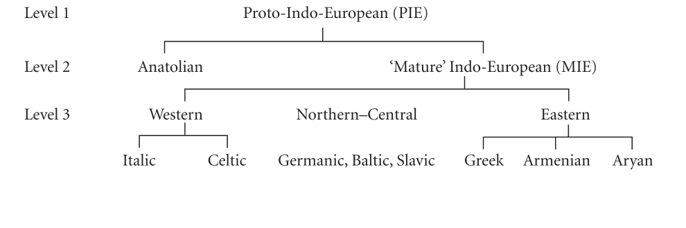

# Introduction

<!-- source-page: 1; pdf-page: 16 -->
‘Indo-European’ is primarily a term of historical linguistics. It refers to the
great family of languages that now extends across every continent and already
two thousand years ago extended across the whole breadth of Europe and
large tracts of central and southern Asia; or it refers to the hypothetical
ancestral language from which all the recorded Indo-European languages
descend.
That affinities existed among various of these languages, including
Persian and Sanskrit, was often observed from the sixteenth century on. In
the seventeenth, the idea emerged of an extinct parent language, generally
identified as ‘Scythian’ or ‘Japhetic’, as the source of the historical tongues.1
The scientific study of linguistic relationships began early in the nineteenth
century, pioneered by scholars with monosyllabic names such as Rask, Bopp,
Grimm, and Pott. It was at this time that the terms ‘Indo-Germanic’ and
‘Indo-European’ were coined; they are first recorded in 1810 and 1813
respectively.2 The two centuries since then have seen steady advances in
knowledge and understanding, and the progress achieved is now cumulatively enormous. All serious students operate on the assumption of a
single parent language as the historical source of all the known Indo-European languages.
This is still a hypothesis, not an observable fact, but it is an inescapable
hypothesis. Of course, when this proto-Indo-European was spoken, it was
itself only one of many languages that existed at that time, and it was no
doubt related to some of the others. Some scholars argue for affinities with

1 For the early comparatists see the survey of Sergent (1995), 21–7, who cites an ample
bibliography.
2 See K. Koerner, IF 86 (1981), 1–29. ‘Indo-Germanic’ was meant to define the family by
reference to its eastern and western extremities; that Celtic belongs in it was not discovered till
the 1830s. ‘Indogermanisch’ continues to be the prevalent term among German-speakers, for
whom it has the merit of greater euphony as well as appealing to national feeling, but in the rest
of the learned world the more inclusive ‘Indo-European’ is now standard.

<!-- source-page: 2; pdf-page: 17 -->
European, into a super-family dubbed ‘Nostratic’. This shimmering construct
is of no consequence for the present study. But it is good to bear in mind that
Indo-European was not a unique, original entity like the primal cosmic atom
before the Big Bang. As a historical reality, it necessarily existed in a historical
context.3
If there was an Indo-European language, it follows that there was a people
who spoke it: not a people in the sense of a nation, for they may never have
formed a political unity, and not a people in any racial sense, for they may
have been as genetically mixed as any modern population defined by
language. If our language is a descendant of theirs, that does not make them
‘our ancestors’, any more than the ancient Romans are the ancestors of the
French, the Romanians, and the Brazilians. The Indo-Europeans were a
people in the sense of a linguistic community. We should probably think of
them as a loose network of clans and tribes, inhabiting a coherent territory
of limited size. It has been estimated that in prehistoric conditions the largest
area within which a single language could exist without dividing into
mutually unintelligible tongues (as Indo-European, of course, eventually did)
might be of up to a million square kilometres––roughly the size of Ontario––
but was probably a good deal less.4
A language embodies certain concepts and values, and a common language
implies some degree of common intellectual heritage. Within the original
common territory,5 which we may call Eurostan, there no doubt existed local
diversities: differences of material culture, of dialect, of cult and custom. But
so long as the dialects remained mutually intelligible and there was easy
communication across the whole area, we might suppose there also to have
been a measure of shared tradition in such spheres as religion, storytelling,
and general ideology. If the evidence assembled in the present work is not
illusory, this theoretical expectation is fulfilled.
Indo-European studies have long spilled beyond the confines of purely
linguistic analysis and reconstruction. By the middle of the nineteenth
century some scholars––the pioneer was Adalbert Kuhn––had started to
make inferences from the linguistic evidence about the people who spoke
the proto-language: about their habitat, their conceptual world, their social

3 Typological similarities with other language families are reviewed by B. Comrie in Ramat
(1998), 74–97.
4 Mallory (1989), 145 f., cf. 64.
5 It should be understood that ‘original’ here does not mean ‘occupied from the beginning
of time’, but refers to the initial area from which the later diversification of Indo-European
languages proceeded; in other words, the territory occupied by the Indo-Europeans in the last
phase of development before they and their one language began to divide.

<!-- source-page: 3; pdf-page: 18 -->
and others began to identify parallel poetic phrases in different branches of
the Indo-European tradition, especially in Greek and Indic: phrases composed of words that corresponded etymologically in the different languages,
and expressing concepts such as would not have had a place in ordinary
everyday speech but only in an elevated formal type of discourse, in poetry
or high rhetoric. The inference was that the Indo-Europeans had had
poetry and a poetic language, some relics of which survived long enough
in traditional usage to be still recognizable in texts available to us.7 In 1860
there appeared the first attempt to reconstruct Indo-European forms of
versification by comparing Greek and Vedic metres.8
The comparative mythology that took flight at this period, associated
especially with Kuhn and Müller, stalled within fifty years and made a forced
landing. This was partly because some of its most striking conclusions were
based on equations of names that turned out to be untenable as more exact
linguistic rules were established by the so-called Neo-grammarians, and
partly because of its practitioners’ propensity for explaining almost every
myth or mythical personage as an allegory of the sun, moon, storm, or some
other natural phenomenon. There continued to be sober surveys of the
evidence for Indo-European culture, and numerous attempts, based on
ecological appraisals and data from prehistoric archaeology, to determine
the whereabouts of the Urheimat, the original homeland. But it was in the
linguistic field that the clearest progress was being made. The Neogrammarians, whose leading figure was Karl Brugmann, achieved what
seemed to be a fairly complete and definitive account of the Indo-European
languages and their evolution from the parent tongue. Then in the first two
decades of the twentieth century further horizons opened up through the
discovery of two hitherto unknown branches of the Indo-European family,
represented by Tocharian and Hittite.

6 Adalbert Kuhn, Zur ältesten Geschichte der indogermanischen Völker (Progr. Berlin 1845),
expanded in Indische Studien 1 (1850), 321–63; id. (1859); Jacob Grimm, Geschichte der deutschen Sprache (Leipzig 1848; 4th edn. 1880); various works of Friedrich Max Müller, from his
Essay on Comparative Mythology (1856) to his Science of Mythology (1897); Pictet (1859–63);
Michel Bréal, Hercule et Cacus (Paris 1860); Victor Hehn, Kulturpflanzen und Haustiere (Berlin
1870); August Fick, Die ehemalige Spracheinheit der Indogermanen Europas (Göttingen 1873);
Otto Schrader, Sprachvergleichung und Urgeschichte (Jena 1883), translated as Prehistoric
Antiquities of the Aryan Peoples (London 1890). Already in 1788 Sir William Jones (Asiatic
Researches, i. 422 f.) had found common elements in Greek, Roman, and Hindu religion and
postulated a historical connection.
7 For an account of the progress of this line of inquiry from Kuhn onwards see Schmitt
(1967), 6–60. The first to speak explicitly of ‘traces of Indo-Germanic poetry’ was Adolf Kaegi,
Der Rigveda. Die älteste Literatur der Inder (2nd edn., Leipzig 1881), 128 n. 12, cf. 158 n. 82.
8 See the section on metre in Chapter 1.

<!-- source-page: 4; pdf-page: 19 -->
Dumézil that were to give comparative mythology a fresh direction and a
fresh esteem. While pursuing philological equations of names as far as they
went, he held that they were not necessary for establishing connections
between myths in different traditions, as new names had often been substituted for old ones. More significant, in his view, were parallel structures.
In the 1930s he developed his famous theory of the three fonctions, the sacral,
the martial, and the economic. This gave him a structural formula that he
was able to find in myths, pantheons, and rituals all over the place. At first
he thought that it derived from a real threefold division of Indo-European
society into holy men, warriors, and peasants. Later he retreated from this
position and presented the system rather as a feature of Indo-European
thought, a habit of organizing things in terms of those three categories.
Dumézil’s work has been enormously influential. Some researchers continue to operate within the framework of his tripartite ideology, and to refer
to the First, Second, or Third Function as if they had the same truth-status as
the first, second, or third declension in Latin. Others have been strongly
critical. As the system is essentially a theoretical taxonomy, it is hardly capable
of proof or disproof. You may find it illuminating and useful, or you may not.
Personally I do not. But one must acknowledge Dumézil’s breadth of learning
and combinatorial brilliance, and give due credit for his real discoveries.9
Meanwhile the more strictly philological approach to the quest for Indo-European poetry and culture made unspectacular but steady progress under
the pens of such scholars as Paul Thieme, Bernfried Schlerath, Jaan Puhvel,
Calvert Watkins, Marcello Durante, Enrico Campanile, and Wolfgang Meid.
Something of a milestone was set in 1967 by Rüdiger Schmitt’s Dichtung und
Dichtersprache in indogermanischer Zeit, a major synthesis of what had been
achieved up to that date in the field of Indo-European poetics and poetic
language. Schmitt did not concern himself with theology and myth, and his
focus is somewhat restricted also in that Celtic and Anatolian evidence
remains outside his purview.
In the last thirty or forty years Indo-European studies of every kind have
gained energy and mass. A journal devoted to their less austerely linguistic
aspects was founded in 1973 and has thrived, calving numerous monographs
by the way. There have been ever more frequent conferences resulting in bulky

9 On Dumézil and his development see C. Scott Littleton, The New Comparative Mythology
(Berkeley–Los Angeles 1966; 3rd edn. 1982); W. W. Belier, Decayed Gods. Origin and Development of Georges Dumézil’s Idéologie Tripartite (Leiden 1991) (strongly critical); Sergent
(1995), 328–33; B. Schlerath, Kratylos 40 (1995), 1–48; 41 (1996), 1–67 (critical); Polomé in
E. C. Polomé (ed.), Indo-European Religion after Dumézil (JIESM 16, Washington, DC 1996),
5–12; W. W. Belier, ibid. 37–72.

<!-- source-page: 5; pdf-page: 20 -->
Indo-Europeanists, and other substantial books. Since 1997 we have had an
imposing and decidedly useful (if uneven) Encyclopedia of Indo-European
Culture.

The Indo-Europeans In Space And Time

In assessing the evidence from the diverse literatures and traditions of the
Indo-European peoples, we shall need to have a notion of their historical
relationships. Just as in reconstructing a manuscript archetype one cannot
simply take agreements between any two or three manuscripts as reflecting
the archetype reading, but must consider their stemmatic relationships, and
the degree to which these relationships are confused by cross-contamination,
so with Indo-European.
The first question concerns dialect groupings within Indo-European.10
There is a growing consensus that the Anatolian branch, represented by
Hittite and related languages of Asia Minor, was the first to diverge from
common Indo-European, which continued to evolve for some time after the
split before breaking up further. This raises a problem of nomenclature. It
means that with the decipherment of Hittite the ‘Indo-European’ previously
reconstructed acquired a brother in the shape of proto-Anatolian, and the
archetype of the family had to be put back a stage. E. H. Sturtevant coined
a new term ‘Indo-Hittite’ (better would have been ‘Euro-Hittite’), and at a
recent conference Robert Drews advocated using this for the larger construct
and reserving ‘Indo-European’ for what remains after the separation of
Anatolian.11 The great majority of linguists, however, use ‘Indo-European’ to
include Anatolian, and have done, naturally enough, ever since Hittite was
recognized to be ‘an Indo-European language’. They will no doubt continue
to do so. For the time being we lack a convenient term to denote the non-Anatolian side of the family. I shall call it ‘Mature Indo-European’ (MIE),
and use ‘Proto-Indo-European’ (PIE) for the archetype of the whole family
(Drews’s PIH).

10 Among recent works on this topic see Gamkrelidze–Ivanov (1995), 325–74; EIEC 550–6
s.v. Subgrouping; Berkeley Linguistic Society: Proceedings of the Twenty-fourth Annual Meeting:
Special Session in Indo-European Subgroupings (Berkeley 1998).
11 In Drews (2001), 250. It may be mentioned here that some scholars regard Etruscan
as representing another branch of the family, related to Anatolian. See F. R. Adrados, JIES 17
(1989), 363–83; F. C. Woudhuizen, JIES 19 (1991), 133–50 and 29 (2001), 505–7; doubted by
E. Neu, HS 104 (1991), 9–28; response by Adrados, HS 107 (1994), 54–76.

<!-- source-page: 6; pdf-page: 21 -->
by a series of linguistic innovations and represented by Indo-Iranian,
Armenian, Phrygian, and Greek. It is sometimes called Graeco-Aryan.12 To
the north, Slavonic and Baltic seem to be closely related to each other, and in
the west Celtic and Italic. But overall one finds a network of multiple overlapping links connecting different languages and groups, especially where
they are neighbours, or have been at some time in the past: for example
connecting Slavonic with Iranian, or Germanic with Italic or Celtic on the
one side and with Baltic on the other. Linguistic changes (especially
phonetic changes) frequently cross dialect and language boundaries and so
blur them, and it may come about that a dialect of one language shares
features with neighbour languages that other dialects do not.13 When one
bears in mind that most peoples have had different neighbours at different
times, and so been exposed successively to different linguistic influences,
it is not surprising if the outcome is a complex layered pattern that resists
instant stemmatic analysis.
An example of an isogloss that once appeared fundamental for language
grouping, but is now seen to be of secondary importance, is the celebrated
satem shift. This is the generalized change of palatal velar consonants to
sibilants, as illustrated by the [s] in Avestan satəm ‘a hundred’ corresponding
to the [k] in Latin centum or Greek ἑ-κατόν. In the nineteenth century Indo-European languages were routinely divided into centum and satem languages,
and this was taken to be a basic dichotomy. As we now understand, the
absence of the satem shift is not a significant indicator of a relationship
between languages. Its presence does make a link, but only a superficial one,
as the shift was an areal phenomenon which affected a number of languages
that were in contact at the time, cutting across older established and more
basic divisions. The satem languages include Indo-Iranian, Armenian, and
Slavonic, but not Greek or Phrygian. The shift thus affected only a part of the
Graeco-Aryan territories, together with some other lands adjoining them.
The central part of the Indo-European area is represented by little-known
ancient languages such as Illyrian, Thracian, and Dacian, and by modern
Albanian. Some regard Albanian as descended from ancient Illyrian, while
others connect it rather with Dacian. Thracian and Albanian, and probably
the other two, are satem languages. Dacian and Thracian are considered to be

12 On the term Aryan, which in modern usage refers to Indo-Iranian, see p. 142. For the
Graeco-Aryan grouping cf. Kretschmer (1896), 168–70; Durante (1976), 18–30; Euler (1979),
18–23 (history of views since 1858); James Clackson, The Linguistic Relationship between Armenian and Greek (Oxford 1994), who contests the belief often encountered that Greek and
Armenian have a specially close relationship within the group.
13 Kretschmer (1896), 24 f., 411.

<!-- source-page: 7; pdf-page: 22 -->
seen between Thracian and the Anatolian languages Lydian and Luwian.15
For the most part the pattern of affinities and distances between the
various Indo-European languages and language groups corresponds fairly
well to the geographical relationships of their earliest recorded speakers. The
striking exception is Tocharian, a language, or rather two kindred languages,
spoken in the second half of the first millennium CE around the Tarim basin
in Chinese Turkestan. It shows no close connections with the languages of the
east.

Chronological parameters

In Anatolia, from about 1650 BCE, we find the earliest attested Indo-European language, Hittite, together with two related languages, Luwian and
Palaic. The personal names attested in Assyrian traders’ records from Kültepe
(the ancient Kanesh, 20 km. north-east of Kayseri) show that the dominant
population of that area was already Hittite at the beginning of the second
millennium, and that Hittite already had a distinct profile separating it
from Luwian. Clearly these Indo-European peoples were well established in
Anatolia before 2000 BCE. But they were hardly autochthonous, for there
were also many non-Indo-European speakers in the land. The native language
of the central region was Hattic, which is thought to have Caucasian affinities.
Further east there was a solid front of non-Indo-European languages,
Hurrian and Semitic. It was in the west and south of Anatolia that the languages of the Indo-European group prevailed. This geographical distribution
points strongly to the Indo-European speakers’ having entered the country
not from the east via the Caucasus, but from the west, from the Balkans, as the
Phrygians and Galatians did in later times.16
We shall see shortly that Graeco-Aryan must already have been differentiated from MIE by 2500 BCE. We have to allow several centuries for the
development of MIE after its split from proto-Anatolian and before its
further division. The secession of proto-Anatolian, then, must be put back
at least to the early third millennium, whether or not it was synchronous
14 Kretschmer (1896), 213 f.; I. Duridanov, Thrakisch-dakische Studien (Sofia 1969), 99 f.;
M.-M. Rădulescu, JIES 12 (1984), 82–5 and 22 (1994), 334–40. Cf. also E. C. Polomé in
The Cambridge Ancient History, iii(1). 866–88; Gamkrelidze–Ivanov (1995), 805 f. (who claim
Albanian affinities with Graeco-Aryan); Sergent (1995), 94–9.
15 H. Birnbaum, JIES 2 (1974), 373.
16 G. Steiner, JIES 18 (1990), 185–214; Sergent (1995), 409. For the Kültepe tablets see
Annelies Kammenhuber, Die Arier im Vorderen Orient (Heidelberg 1968), 27–9; Gamkrelidze–
Ivanov (1995), 757–9.

<!-- source-page: 8; pdf-page: 23 -->
would be consistent with its introduction to Anatolia at that period.17 It is
possible that its carriers could have crossed from Europe by a land bridge,
the Black Sea being still an enclosed lake; at any rate the Black Sea’s water
level appears to have been much lower then than it is now.18
It has come to be widely accepted that Greek-speakers were preceded in
Greece by speakers of an Indo-European language of the Anatolian type,
similar to Luwian.19 These were the people responsible for the numerous
place-names ending in -nthos and -ssos. Parnassos, for example, is happily
explicable in terms of the Luwian parna- ‘house’ and possessive suffix
-ssa-, and Hittite and Luwian texts attest an Anatolian town (or towns) of the
same name, Parnassa. We may call this pre-Hellenic language Parnassian.
From the distribution of the names, it seems to have been current in the
Early Helladic II period, which began around 2800. I take it to betoken not an
invasion from Anatolia, but a parallel movement down from Thrace by a
branch of the same people as entered Anatolia, the people who were to appear
1,500 years later as the Luwians.
The first speakers of Greek––or rather of the language that was to develop
into Greek; I will call them mello-Greeks20––arrived in Greece, on the most
widely accepted view, at the beginning of Early Helladic III, that is, around
2300.21 They came by way of Epirus, probably from somewhere north of
the Danube. Recent writers have derived them from Romania or eastern
Hungary.22
The Phrygians, whose language shows a number of noteworthy similarities
to Greek,23 crossed into Anatolia after 1200. Previously they had been

17 See W. H. Goodenough in Cardona (1970), 261 (appearance of battle-axes in western
Anatolia); M. M. Winn, JIES 2 (1974), 120 f. (east Balkan Chalcolithic cultures antecedent to
Troy I); J. Mellaart, JIES 9 (1981), 135–49 (spread of north-west Anatolian cultures to the later
Luwian lands around 2700–2600); Sergent (1995), 409 f.
18 The Early Bronze Age site of Kiten on the Bulgarian coast, now ten metres under water,
was still inhabited in 2715 ± 10 BCE (dendrochronological date), when its last pilings were
driven: P. I. Kuniholm in Drews (2001), 28.
19 L. R. Palmer, TPhS 1958, 36–74; id., Mycenaeans and Minoans (2nd edn., London 1965),
321–57; Alfred Heubeck, Praegraeca (Erlangen 1961); Sergent (1995), 140–4; O. Carruba,
Athenaeum 83 (1995), 5–44; R. Drews, JIES 25 (1997), 153–77; M. Finkelberg, Classical World
91 (1997), 3–20. Note the reservations of Anna Morpurgo Davies in Gerald Cadogan (ed.), The
End of the Early Bronze Age in the Aegean (Leiden 1986), 109–21.
20 From Greek µέλλω, ‘I am going to be’.
21 Cf. West (1997), 1 with n. 2.
22 Sergent (1995), 413–15; J. Makkay, Atti e memorie del Secondo Congresso Internazionale di
Micenologia (Rome 1996), 777–84; id., Origins of the Proto-Greeks and Proto-Anatolians from a
Common Perspective (Budapest 2003), 47–54.
23 G. Neumann, Phrygisch und Griechisch (Sitz.-Ber. Österr. Ak. 499, 1988); Sergent (1995),
122 f.

<!-- source-page: 9; pdf-page: 24 -->
pressure from Thracian tribes coming down from further north, from beyond
the Dnieper.24 It was formerly assumed that Phrygians and Thracians were
closely related, and compound adjectives such as ‘Thraco-Phrygian’ used to
be freely used in various connections. In fact there is no special affinity
between the two. It is to be observed that Phrygian, like Greek, was a centum
language, whereas Thracian was satem, like Slavonic and Iranian.
Armenian too is a satem language, and not closely related to Phrygian, even
though both belong to the Graeco-Aryan group. In historical times the
Armenians were located far away to the east of the Phrygians, and Herodotus
(7. 73) was told that they were a Phrygian colony. Perhaps someone had
observed a similarity to the Phrygian in their language or culture. But if we set
aside this dubious western connection, their geographical situation is much
easier to understand on the hypothesis that they came there by way of the
Caucasus. They first appear in history in the seventh century BCE; there is no
sign of them earlier, despite our having Urartian inscriptions from the area
from the immediately preceding centuries. Their arrival may be connected
with the burning of the main Urartian fortresses in around 640.25 This
was just at the time when the Cimmerians had come down from north of
the Caucasus and were causing havoc throughout Asia Minor. There seems
much to be said for the view that the Armenian influx was part of the same
movement.26 If so, the Armenians had previously lived in the north-east
Pontic area, in the immediate neighbourhood of other satem-speakers such
as the Scythians (who drove out the Cimmerians according to Herodotus
1. 15).
The Iranian and Indic languages are closely related to each other, and must
be traced back to a common Indo-Iranian or Aryan. The period of Indo-Iranian unity may be put in the late third to early second millennium, and its
territory located north and east of the Caspian Sea. From an archaeological
point of view it seems a good fit with the Andronovo culture which developed
in northern Kazakhstan between 2300 and 2100 and later spread southwards
and eastwards.
Indic was already differentiated from Iranian by the sixteenth century,
when a horde of Aryan warriors established themselves as rulers of the land of
Mitanni in north Syria. Their personal names, their gods, and other evidence
of their speech show that they were Indic-speakers. We may suppose that
Indic had been the dialect of the southern Aryans, and that they had made a
major southward movement down the east side of the Caspian. Then, faced

24 Cf. Sergent (1995), 423–5.
25 Paul Zimansky in Drews (2001), 23 f.
26 Cf. Feist (1913), 65; Schramm (1973), 164–217.

<!-- source-page: 10; pdf-page: 25 -->
and left: one group headed west between Mt Elbruz and the sea and eventually made its fortune in Mitanni, while the main body proceeded east through
Afghanistan and reached the Punjab before the middle of the millennium.
An Iranian migration followed some centuries later, again moving south
and dividing at the desert. The ones who turned right camped in the Zagros
mountains and eventually expanded further south to become the Medes and
Persians, peoples first mentioned in Assyrian records in the ninth and eighth
centuries. The ones who turned left became the East Iranians of Bactria and
Sogdiana. Other Iranians stayed in the north and roamed widely across the
steppes, to appear in the mid-first millennium as Scythians and Sarmatians.27
If Indo-Iranian already had a distinct identity in central Asia in the last
quarter of the third millennium, and mello-Greeks were entering Greece
at the same period, we must clearly go back at least to the middle of the
millennium for the postulated Graeco-Aryan linguistic unity or community.
This was presumably situated in the east Balkan and Pontic regions.
We are beginning to get a sense of overall chronology, or at least a set of
termini ante quos: divergence of Anatolian from the rest of Indo-European by
2900 at latest, perhaps some centuries earlier; emergence of a distinct eastern
dialect (Graeco-Aryan) by 2500; individuation of Greek, Indo-Iranian, and
no doubt other languages in the group by 2300; differentiation of Indic and
Iranian by 1600.
It is more difficult to reconstruct developments in other parts of the Indo-European world. Historical evidence for the northern and western peoples––
Balts and Slavs, Germans, Celts, Italics, and the rest––becomes available
much later than it does for the Anatolians, Indics, and Greeks. By the seventh
century BCE we can see that a clear differentiation of Italic languages
has occurred; a common Italic must surely be put back into the second
millennium.28 We may assume that at least a proto-Celtic and a proto-Germanic also existed by the same date. But this is more than a millennium
after the epoch when MIE began to break up. To bridge the gap we are
reduced to poring over the archaeological record, trying to identify prehistoric cultures that might have evolved by continuous development into
what we know to have been a Celtic culture, an Italic one, and so on.

27 On Indo-Iranian migrations cf. R. Heine-Geldern, Man 56 (1956), 136–40; P. Bosch-Gimpera, JIES 1 (1973), 513–17; T. Burrow, JRAS 1973, 123–40; D. W. Anthony, JIES 19 (1991),
203; EIEC 308–11; A. Hintze in Meid (1998), 139–53. On the Iranianness of the Scythians cf.
Kretschmer (1896), 214 f.; Sergent (1995), 429.
28 Cf. H. Rix in Alfred Bammesberger and Theo Vennemann (edd.), Languages in Prehistoric
Europe (Heidelberg 2003), 147–72.

<!-- source-page: 11; pdf-page: 26 -->
culture complexes in the third millennium are likely to be relevant to the early
history of the Indo-European dispersal: the Yamna(ya) or Pit-grave culture
which extended from the Danube to the Urals, a Balkan-Danubian complex
in south-east Europe, and the Corded Ware culture extending from the Rhine
across Germany and southern Scandinavia eastwards to the upper Volga. One
adept has written recently:
No one has yet figured out a coherent linguistic history of Europe without assuming
that both the Corded Ware and the Yamnaya cultures were predominantly Indo-European speaking, and yet there is no general agreement about the relationship
between these cultures.29
His own model seems entirely plausible. His original Indo-Europeans are
represented by the Sredny Stog and Khvalynsk cultures in the Ukraine and
middle Volga regions. About 4400 BCE, following depopulation in the
Balkans, they spread westward. The division between the Anatolians and
the rest perhaps took place in the lower Dnieper region in the first half of the
fourth millennium, before the invention or general currency of the wheel, as
the Anatolian word for a wheel is not from the same root as that current in
other branches of Indo-European.30 The Anatolian party might be represented by the Usatovo and other hybrid cultures found west of the Black
Sea down to 3500; this area had close ties across the Bosporos. In the third
millennium what later appears as the Luwian area shows a sequence of
destruction and depopulation, followed by a switch to a more pastoral economy: this would be the work of the incoming Indo-European groups. The
MIE peoples would be represented by the Yamna and Corded Ware cultures
together. Evidence is cited for population movements from the steppe into
north and central Europe between about 3500 and 3200.31
This scenario implies a higher (but not much higher) chronology than the
termini ante quos proposed above. In placing the last phase of Indo-European
unity no earlier than the late fifth to early fourth millennium, it is in accord
with arguments drawn from the Indo-Europeans’ apparent familiarity with
the domesticated horse, ox traction, and the woolly sheep.32 It also suggests
an incipient division between east and west Indo-European in the late fourth
millennium. The eastern variety would be ancestral to Graeco-Aryan.

29 B. J. Darden in Drews (2001), 212.
30 The earliest evidence for wheeled vehicles is from Poland and dated to 3530–3310. See
D. W. Anthony, JIES 19 (1991), 199 f.; K. Jones-Bley, JIES 28 (2000), 445; Darden in Drews
(2001), 204–9. On the vocabulary see EIEC 640 f.
31 Darden, ibid. 184–228.
32 Cf. EIEC 157, 276, 648 f.; E. W. Barber in Drews (2001), 6, 13; Darden, ibid. 193–200, 204.

<!-- source-page: 12; pdf-page: 27 -->
SOURCES
In the search for Indo-European poetry and myth we have to draw on sources
of very various character and very various date, from hymns and ritual texts
of the second millennium BCE to songs and folk-tales recorded in the nineteenth century CE. It might be thought that nothing sound could possibly
be built from such diverse materials. But Indo-European linguists are in a
similar boat. They work on the one hand with Hittite and Vedic texts that
are over three thousand years old, on the other hand with Albanian or
Lithuanian, which were first recorded no more than five or six hundred
years ago. Yet from data of such unequal antiquity they are able to forge
unshakeable structures. The reason is simple. Although languages undergo
enormous changes over two or three millennia, and to the casual eye are
transformed out of recognition, they may also preserve many highly archaic
elements. Even modern English, which cannot compare with Lithuanian
as a conservator of ancient morphology, is full of Indo-European vocabulary;
it preserves unchanged, almost alone, the original sound [w]; it preserves
such old features as ablauting verbs (sing, sang, sung) and free-range
preverbs (not easy to get away from). Such things are identifiable as old
by surveying the whole system. Similar principles will apply in the present
investigation.
As in linguistic reconstruction, we seek to work back to prototypes by
comparing data from different branches of the Indo-European tradition. The
more widely separated and historically independent the branches, the further
back in time their concord should carry us. Within each branch we shall pay
greatest attention to the oldest available material, as that is where inherited
elements are most likely to appear, and where what seem like significant
elements are most likely to be inherited. In some cases, naturally, a genuinely
inherited motif may turn up only in a later source, but our emphasis must be
on the earlier ones.
The oldest extant texts in Indo-European languages are those in the
Anatolian languages Hittite, Luwian, and Palaic, starting in the seventeenth
century BCE, and written either in cuneiform or in Luwian hieroglyphs.33
The greatest number are in Hittite and date from the New Kingdom, c.1350–
1200. The majority are prescriptions for rituals; there are also state documents of various kinds, royal annals, prayers, laws, treaties, correspondence,

33 The cuneiform texts are identified by reference to Emmanuel Laroche, Catalogue des
textes hittites (Paris 1971) (CTH); the hieroglyphic ones by reference to J. D. Hawkins and
others, Corpus of Hieroglyphic Luwian Inscriptions, i–ii (Berlin–New York 1999–2000) (CHLI).

<!-- source-page: 13; pdf-page: 28 -->
mythological narratives. The myths, however, mostly seem to be taken over
from other, non-Indo-European peoples of the region (Hattics, Hurrians,
Babylonians, Canaanites), and have little to offer for the present enterprise.
The ritual texts sometimes contain embedded hymns, prayers, or incantations, which may be more relevant. The vocabulary of the languages
themselves can throw valuable lights.
Hieroglyphic Luwian inscriptions continue into the first millennium, being
most frequent in the first quarter. From later centuries we have inscriptions
in other languages of Asia Minor that belong to the Anatolian family, such
as Lydian, Lycian, Carian, and Sidetic. They have little to offer in terms of
content, but I shall have occasion to mention some of them in the section on
metre in Chapter 1.
Of comparable antiquity to the Hittite and Luwian material, and of much
richer interest for our purpose, is the Indic. Of prime importance are the
1028 hymns of the Rigveda (RV), thought to have been composed in the
Punjab in the period between 1500 and 1000 BCE. The collection is arranged
in ten books, of which 2–7 are the oldest: these are the so-called Family
Books, attributed to poets from half a dozen specific families. Books 1 and
10 are the latest. A second large collection, the Atharvaveda (AV), probably
overlaps in time with the later parts of the Rigveda, from which much
material is repeated. It is more magical in character, consisting largely of
curses, blessings, and charms for various purposes. It exists in two recensions.
The better known is that of the Śaunaka school, which contains 581 hymns.
The other is that of the Paippalādas (AV Paipp.), only parts of which have so
far been edited. A later Vedic text that I have occasionally cited is the Black
Yajurveda in the recension of the Taittirīyas (Taittirīya Saṃhitā = TS). Later
still is the Bṛhaddevatā, an index of the deities of the Rigveda, of interest for
the myths that it relates about them.
Apart from this Vedic and para-Vedic literature, India’s two great epics, the
Mahābhārata and the Rāmāyaṇa, are of some significance. Although later in
language and versification than the Vedas and certainly composed at a later
time––they grew over a long period, conventionally put between about 400
BCE and 400 CE––they clearly continue traditions of narrative poetry going
back many centuries.34

34 The subject of the first, the war of the Bhāratas, should have taken place (if it was a
historical event) around the ninth century BCE. For an account of the epics see Puhvel (1987),
68–81 and 89–92, and in general Brockington (1998). He reviews Indo-Europeanists’ efforts
with the Mahābhārata on pp. 67–81.

<!-- source-page: 14; pdf-page: 29 -->
Zarathushtra (Zoroaster) known as the Gāthās. They are transmitted as part
of the Avesta, the corpus of Parsi sacred books. The three largest components
in what has survived of the collection are the Yasna liturgy (Y.), the Yasˇts or
hymns of praise (Yt.), and the Vidēvdāt or Vendidād (Vd.), a book that sets
out (in the words of R. C. Zaehner) ‘dreary prescriptions concerning ritual
purity’ and ‘impossible punishments for ludicrous crimes’. The Gāthās form
chapters 28–34, 43–51, and 53 of the Yasna. Their language is about as archaic
in Indo-Iranian terms as that of the Rigveda, and this persuades some
scholars to date them to before 1000 BCE; others put them as late as the sixth
century. The truth very likely lies between these extremes. Next in age is
another section of the Yasna, the ‘Gāthā of the Seven Chapters’ (Y. 35–41).
The remainder of the Avesta, known collectively as the Younger Avesta, dates
probably from between the eighth and fourth centuries BCE, the Vidēvdāt
being the latest part.
Zarathushtra lived in eastern Iran, perhaps Drangiana in the south-western
part of what is now Afghanistan, and the Avestan language is east Iranian.
West Iranian is represented by Old Persian, the language of the royal inscriptions promulgated by Darius I (reigned 521–486) and his successors down to
Artaxerxes III (359–338).35
For anything in the nature of Iranian epic we have to wait for the
Shāh-nāma of Firdawsi, a lengthy verse history of the Iranian empire composed about 975–1010. It does not continue a native tradition of epic, but it
does embody much ancient myth and folktale.36
From another corner of the Iranian world we have an interesting body
of legend recorded at a still later date. This is the heritage of the Ossetes,
who form an Indo-European enclave in the ethnic mosaic of the northern
Caucasus, speaking a language of the Iranian family. They are believed to
be a remnant of the Alans, who were powerful in the region until the
eleventh century. Their mythology, which is concerned with a legendary
race of heroes called the Narts, was first brought to wider attention by
Dumézil, and collections of the material have been published by others more
recently.37

35 These are cited from the edition of R. G. Kent, Old Persian. Grammar, Texts, Lexicon (New
Haven 1953).
36 See Puhvel (1987), 117–25.
37 Georges Dumézil, Légendes sur les Nartes (Paris 1930); id., Le livre des héros. Légendes sur
les Nartes (Paris 1965); id. (1968–73), i. 441–575; id. in Wb. d. Myth., i. 4: Mythologie der
kaukasischen und iranischen Völker (1986); Sikojev (1985); Colarusso (2002). See also the
highly erudite and informative chapter by H. W. Bailey in A. T. Hatto (ed.), Traditions of Heroic
and Epic Poetry (London 1980–9), i. 236–67.

<!-- source-page: 15; pdf-page: 30 -->
second millennium is Greek. However, these early, non-literary documents
in the Linear B script yield little that we can use. A far more rewarding
source for Indo-European inheritance is the corpus of Homeric and
Hesiodic poetry. Most of it was fixed in writing in the seventh century BCE,
but some of the material it contains, and the traditional language in which
it is expressed, have more ancient roots, reaching back at least into the
Mycenaean age. Next in importance are the lyric poets of the period
650–450. It is one of the latest of these (also the most extensively preserved),
the Boeotian Pindar, who has the greatest amount of interest to offer. Calvert
Watkins has called him ‘in many ways the most Indo-European of Greek
poets’.
The other languages of the Graeco-Aryan group are Phrygian and Armenian. The Phrygian material is epigraphic, and comes from two separate
periods: from the eighth to the fourth century BCE (Old Phrygian), and the
second to fourth century CE (New Phrygian). Some of the inscriptions are
metrical or contain metrical phrases, and certain formulae of elevated diction
are recognizable.38 The literary attestation of Armenian begins after the
Christianization of the country in the fourth century. There are eight
fragments of pre-Christian oral verse on mythological and heroic themes,
preserved in quotation, and some other evidence of ancient beliefs.39 Popular
oral heroic poetry survived into the twentieth century, and 1939 saw the
publication of a national ‘folk epic’ Sassountsy David, put together from
poems transcribed from bardic recitations. It deals with the lives and adventures of four generations of legendary kings who founded and ruled in the
city of Sassoun (now Sasun in Turkey). From the formal point of view this
Grossepos is an artificial construct, but the materials represent authentic oral
tradition.40
For the ancient Thracian and Illyrian peoples the source material is
extremely scanty. It consists largely of personal and place names, a few glosses
from Classical sources, and one or two inscriptions. To these can be added a
larger body of inscriptions from south-east Italy in the Messapic language,

38 Texts are collected by Haas (1966); Claude Brixhe and Michel Lejeune, Corpus des
inscriptions paléo-phrygiennes, i–ii (Paris 1984); Vladimir Orel, The Language of Phrygians.
Description and Analysis (New York 1997).
39 Collected and translated by L. H. Gray, Revue des Études Arméniennes 6 (1926), 159–67.
See also J. R. Russell, ibid. [new series] 20 (1986/7), 253–70; id., Acta Antiqua 32 (1989),
317–30; Ishkol-Kerovpian (1986).
40 Cf. C. M. Bowra, Heroic Poetry (London 1952), 357. I cite the work by page from the
translation by A. K. Shalian, David of Sassoun (Athens, Ohio, 1964).

<!-- source-page: 16; pdf-page: 31 -->
Classical authors about Thracian religion.41
Among the Italic languages Latin naturally takes pride of place. But Latin
literature is so pervasively influenced by Greek that it can only be used with
the greatest caution as a separate witness to Indo-European tradition. The
most promising sources are the earliest poets, who, while by no means
innocent of Greek influence, at any rate were the least far removed from older
native traditions; religious ritual and language, insofar as they are not based
on Greek models; and popular and subliterary material such as charms and
incantations. Outside Latin the most notable text is the series of bronze
tablets from Iguvium (Gubbio) containing the proceedings of a college of
priests, the Atiedian Brethren, with ritual prescriptions and regulations. They
date from between 200 and 50 BCE, and constitute the principal document
of the Umbrian language. Occasional mention will be made of other Italic
dialects such as Marrucinian and Venetic.
Celtic evidence, coming as it does from the most westerly of the Indo-European territories, is of especial interest and value as a complement to
what can be gathered from Graeco-Aryan sources. There is a gap in time
between the continental Celtic material and the insular. The first, consisting
of Lepontic, Gaulish, and Celtiberian inscriptions, comes from the Roman
period and fades out in the third century CE. The Gaulish inscriptions are the
most significant, giving us many names of local deities and sometimes other
things of religious interest. Further information on the Celts and their ways is
provided by Greek and Latin writers such as Diodorus, Strabo, and Caesar,
who were all indebted to the Stoic Posidonius, and some others who were
not.42
The insular Celtic material consists mainly (apart from some primitive
Irish inscriptions in the Ogam script) of Irish and British literature, and it
begins around 600 CE. On the Irish side, besides a not very large quantity
of early poems and poetic fragments collected by Kuno Meyer and Enrico
Campanile, the main body of pertinent material is narrative prose (with some
embedded verse) dealing with heroic and legendary subject matter and dating
from the eighth to twelfth centuries. There are four major groups, known as
the Ulster and Fenian Cycles, the Cycle of the Kings, and the Mythological
41 See Clemen (1936), 83–92; Detschew (1957); Krahe (1955–64); Mayer (1957–9);
Haas (1962); C. Brixhe and A. Panayotou, ‘Le thrace’, in Françoise Bader (ed.), Langues
indo-européennes (Paris 1997), 181–205; C. de Simone and S. Marchesini, Monumenta Linguae
Messapicae (2 vols., Wiesbaden 2002).
42 Zwicker (1934–6); Michel Lejeune, Lepontica (Paris 1971); id. and others, Recueil des
inscriptions gauloises, i–iv (Paris 1985–2002); Meid (1994); id., Celtiberian Inscriptions (Budapest
1994); Jürgen Untermann, Monumenta Linguarum Hispanicarum, iv: Die tartessischen,
keltiberischen und lusitanischen Inschriften (Wiesbaden 1997); Lambert (2003).

<!-- source-page: 17; pdf-page: 32 -->
Cúailnge or Cattle-raid of Cooley (sometimes referred to simply as ‘the Táin’,
though there are also other Cattle-raids). According to Thurneysen it was
already known in the first half of the eighth century, but it is preserved in later
recensions of the ninth and eleventh.43 Other works to be mentioned by
name, all from the twelfth century, are the Dindshenchas, which are prose and
verse texts concerned with the lore and legend attached to place names, the
Acallam na Senórach (Conversation of the Ancients), a collection of numerous
stories and poems with a narrative frame, and the Lebor Gabála Érenn (Book
of the Invasions of Ireland), an antiquarian mythical history.
From Britain we have a poetic and prose literature in Early and Middle
Welsh––we call it Welsh, but until the Saxons confined it to Wales it was
the language of large areas of England and southern Scotland too. The
earliest poems are associated with the late sixth-century bards Taliesin and
Aneirin. Taliesin was the court poet of Urien, king of Rheged (Cumbria
with Dumfries and Kirkcudbright), a champion of the British against the
English. Aneirin was a younger contemporary of Taliesin and court poet in
Strathclyde. He is credited with Y Gododdin, sometimes misdescribed as a
heroic poem, in fact a collection of short praise poems mostly relating to the
historic Battle of Catraeth (Catterick).44 The most important prose source is
the Mabinogion, a collection of eleven mythical narratives from the tenth and
eleventh centuries. Mention will also be made of the Triads of the Isle of
Britain, a twelfth-century collection of miscellaneous lore expressed in the
form of lists of three.
Finally there is a Gaelic oral tradition represented by songs collected from
the Western Isles in the nineteenth century by Alexander Carmichael (Carmina Gadelica, 6 vols., Edinburgh 1928–59). They contain some remarkable
survivals of pagan piety.
The earliest evidence relating to the Germanic world comes from Classical
authors, most notably from Tacitus’ Germania, which drew on a lost work
of Pliny the Elder on the German wars. Tacitus mentions the existence
of traditional poetry as the Germans’ only form of record of the past, and
in another work he refers to songs in which the national hero Arminius
was commemorated.45 Later, after Christianity brought literacy, we find
four separate branches of Germanic poetic tradition: Old High German

43 For surveys of this literature see Thurneysen (1921; on its chronology, 666–70); Dillon
(1946), (1948); Koch–Carey (2000).
44 I cite Y Gododdin by the line-numbering of Sir Ifor Williams, Canu Aneirin (1938), which
is followed by Koch–Carey (2000), 307–41. The transmitted text is thought to be a mixture of
recensions of the seventh and ninth centuries, see Koch–Carey (2000), 304–6.
45 Tac. Germ. 2. 2, Ann. 2. 88; passages from other authors in Clemen (1928).

<!-- source-page: 18; pdf-page: 33 -->
Norse. These show mutual similarities of metre and diction that point to a
common origin. Insofar as their subject matter is heroic, they look back to the
Gothic world of the fourth and fifth centuries; the Gothic lays of that time
probably stood in a common line of tradition with those of which Tacitus had
written.
Germanic heroic poetry is represented by two stray pages from the Old
High German Hildebrandslied, by the likewise eighth-century Beowulf and a
few other Old English pieces such as the Finnsburh and Waldere fragments,
the Battle of Brunanburh, and the late Battle of Maldon, and by a number of
Norse poems of the ninth to twelfth centuries. Most of these last are included
in the so-called Elder or Poetic Edda, others are preserved in the prose sagas
or other sources, and one, the Biarkamál, in a Latin hexameter version in Saxo
Grammaticus’ History of the Danes. The ninth- or tenth-century Latin epic
Waltharius may also be noticed for its Germanic subject matter, related to that
of Waldere.
The Edda further contains mythical poems about the gods and gnomic
poetry. Besides the Edda there is a large body of verse by the skalds, professional court poets, composed in a less archaic, highly elaborate style. Two
ninth-century skaldic poems of importance for mythology are Thiodolf’s
Haustlǫng and Bragi’s Ragnarsdrápa. The Old English corpus includes narrative poems on Christian subjects, reflective and gnomic poems, riddles, and
spells. Two spells and a prayer in Old High German, the Merseburg Charms
and the Wessobrunn Prayer, will also engage our attention.
Complementing this poetic literature, two substantial prose works of the
early thirteenth century are of especial importance. Snorri Sturluson’s Prose
Edda consists of three parts: Gylfaginning, a delightfully written compendium
of Nordic myths about the gods, based on older poetic sources; Skáldskaparmál, a survey of poetic language, with much reference to mythical
material; and Háttatal, a treatise on verse-forms. Saxo’s History, mentioned
above, is a Latin work in sixteen books, of which the first nine in particular
are a precious repository of Danish legend.
The Baltic countries were not converted to Christianity till a comparatively
recent date––Latvia in the thirteenth century, and Lithuania in the fifteenth––
and then only superficially. The consequence is on the one hand that there
is no native literature until even later, but on the other hand that pagan gods
and mythology remained alive in the popular consciousness long enough to
be reported by Christian writers and to leave many traces in songs and
ballads. The tradition of these songs is very abundant, especially in Latvia,
where over 60,000 were recorded in the nineteenth century. There have
also been collections of folk-tales, riddles, and the like. Pagan cult practices

<!-- source-page: 19; pdf-page: 34 -->
teenth-century Latvia.46
The Slavs were converted much earlier, in the ninth and tenth centuries.
Again most of the earliest evidence for their native religion and beliefs comes
from outsiders’ reports. By way of poetic tradition there is an obscure and
peculiar Russian epic from 1185–6, the Lay of Igor, besides the oral heroic
verse represented by the Russian byliny and the much ampler products of the
Serbo-Croat bards. The folklore of the Slavonic peoples is a further source of
material.47
Albania has its own poetry and folklore, though it is doubtful how far they
can be regarded as representative of a distinct branch of Indo-European
tradition, since they are not clearly separated from those of neighbouring
lands. The oral epics parallel those of the South Slavs and are in some cases
composed by bilingual poets, while the folk-tales often resemble those found
in Greece. There remains nevertheless a residue of national mythology.48

Considerations Of Method

Many who have written on Indo-European poetics, mythology, and religion
have tended to proceed in a rather naive way, ignoring historical and geographical coordinates. As soon as they find a parallel between two individual
traditions, say between Greek and Indian myth, they at once claim it as a
reflex of ‘Indo-European’, without regard either to the groupings of the
Indo-European dialects or to the possibilities of horizontal transmission.
Greater sophistication is needed.49
In the light of the earlier discussion it will be seen that application of the
comparative method can take us back to different levels of antiquity, depending on the location of the material compared. Schematically:
46 The fullest collection of the external sources was made by Wilhelm Mannhardt and
published posthumously under the title of Letto-Preussische Götterlehre (Riga 1936); cf. also
Clemen (1936), 92–114. For the songs cf. Rhesa (1825); K. Barons, Latvju daiņas (1894–1915,
2nd edn. 1922; 8 volumes) (LD), from which 1,219 stanzas with variants are edited and translated in Jonval (1929); folk-tales etc. in Schleicher (1857). The evidence for the Lithuanian
pantheon is laid out by Usener (1896), 79–119, with the help of Felix Solmsen. See also
Mannhardt (1936); Gimbutas (1963), 179–204; Biezais–Balys (1973); H. Biezais, Baltische
Religion (Stuttgart 1975); Greimas (1992); P. U. Dini and N. Mikhailov, Mitologia baltica (Pisa
1995).
47 C. H. Meyer (1931) collects sources in non-Slavonic languages. See further Unbegaun
(1948); Gimbutas (1971), 151–70; N. Reiter, ‘Mythologie der alten Slaven’, in Wb. d. Myth. i(2).
165–208; Vánˇa (1992) (survey of literary sources: pp. 29–34).
48 Lambertz (1973).
49 Cf. Meid (1978), 6 f.

<!-- source-page: 20; pdf-page: 35 -->

It is to be noted that these levels are stemmatic, not synchronic. A significant
parallel observed between Homer and the Rigveda should take us back to
Level 3 and (according to the argument presented earlier) to about 2300 BCE,
the time of the Sixth Dynasty in Egypt; one between Italic and Celtic will
likewise take us to Level 3, but perhaps only to 1300 BCE, contemporary with
Mycenaean Greece or early Vedic India. An agreement between Celtic and
Iranian will take us back to Level 2, sometime in the first half of the third
millennium. To get back to the deepest level, to PIE, we shall require a comparison involving Anatolian.
An archaeologist is interested not only in the deepest layer of his site but
in all the others too. ‘Indo-European’ in the title of my book is a shorthand
term. I am not concerned only to reach the PIE stratum, throwing aside
whatever does not fulfil the criteria for reaching it. Levels 2 and 3 are just as
interesting, indeed more so, as the finds are more abundant, varied, and
coherent. In practice it will not be very often that we can reach Level 1: it
requires the PIE material to have survived on both sides of the stemma for
two thousand years or more from the time of the Anatolian secession to
the time of our earliest direct evidence, and much of the Indo-European
heritage was lost on the Anatolian side under the influence of alien cultures.
Most of the time, therefore, the evidence will take us no further than Level 2
or 3. It would be very tiresome if I were to point this out explicitly on every
occasion, so I ask the reader to note it and not to impute my economy to
negligence.
Sometimes I am aware, or the reader may discover ahead of me, that
certain things which I attribute to Indo-European (PIE or MIE) are also to be
found in Semitic or other non-Indo-European cultures. That does not lessen
the value of the results, as my object is to identify whatever is Indo-European,
not just what is distinctively or exclusively Indo-European. As another
researcher in the field has written, ‘since the aim of the present work lies
solely in the reconstruction of a culture and not in its evaluation in comparison with other cultures, the question whether individual features of Indo-European culture can or cannot also be found among non-Indo-European

<!-- source-page: 21; pdf-page: 36 -->
invalidated by objections on the lines ‘the parallel motifs that you note in
this and that source need not imply a common Indo-European prototype,
because they occur all over the world’. If a motif is indeed universal, all the
more likely that it was also Indo-European.
There are of course standards to be applied. The parallels used must be
specific and detailed enough to indicate a historical connection; and we have
to discount those where the historical connection looks likely to be horizontal
rather than the result of common descent from primeval times. The Indo-Europeans did not simply divide and divide into more and more separate
peoples who proceeded to develop in isolation from one another. Most
of them were in communication with neighbouring peoples over long
periods, and with different ones at different times. In some cases parts of their
populations undertook long migrations that brought them among quite new
neighbours. Wherever peoples were together, it was possible for elements of
language and culture to cross the frontiers by diffusion. In such cases philologists speak of a linguistic area or Sprachbund, and they describe a change
(such as the satem shift) that affects contiguous rather than cognate languages
as an ‘areal’ phenomenon.51 They are usually able, on phonological or
morphological grounds, to identify elements that a language has acquired by
horizontal transmission and not by inheritance, for example Iranian loanwords in Armenian or Celtic ones in German. It is not so easy in the case of
myths and motifs, unless they are tied to specific names.
According to our stemma, significant parallels between Homer and the
Rigveda ought to take us back to the time of the Graeco-Aryan language or
Sprachbund. The premise is that all contact between mello-Greeks and mello-Aryans was severed by about 2300 BCE. However, the archaeologist János
Makkay has marshalled a series of plausible arguments for the thesis that a
band of Iranian-speaking invaders from the steppes occupied Mycenae itself
at the beginning of the Late Helladic period, around 1600.52 This would have
50 Campanile (1990b), 11. See also Müller (1897), 185–9.
51 Cf. Watkins (1995), 218 f.
52 J. Makkay, The Early Mycenaean Rulers and the Contemporary Early Iranians of the
Northeast (Budapest 2000). This might account for the presence in the Homeric language of
Iranian loan-words such as τόξον ‘bow’ (this already in Linear B) and γωρυτός ‘bowcase’. So
Durante (1976), 30: ‘certo è che un ethnos iranico ha intrattenuto rapporti con la grecità nella
fase micenea, se non ancor prima. Testimonia in tal senso la voce τόξον . . . La perfetta
corrispondenza con pers. taxsˇ “arco”, di cui si ha un antecedente nell’antroponimo scitico
Τόξαρις, rivela che si tratta di un iranismo.’ Cf. ibid. 31, 36, on the name of the Dana(w)oi
and its possible relationship to Avestan dānav- ‘river’, Vedic dā́nav- ‘dripping water’, and the
river-names Danube, Don, Dnestr, etc. According to myth (‘Hes.’ fr. *128), it was the Danaai
who made Argos well-watered. Danae and her son Perseus recall the names of Iranian tribes, the
Turanian Dānavas (Yt. 5. 72–4, 13. 37 f.) and the Persians.

<!-- source-page: 22; pdf-page: 37 -->
Mitanni at the same period. If it really happened, it would provide a channel
by which Aryan poetry might have directly influenced early Mycenaean
poetry, short-circuiting the stemma. It is hardly likely that all Greek–Indic
and Greek–Iranian parallels could be so accounted for, but it remains a
theoretical consideration to be borne in mind.
Both in the Mycenaean age and in subsequent centuries Greece was
much exposed to contacts with the Near East, including Anatolia. So if we
find parallels between Greek and Hittite myth, religion, or idiom, we must ask
whether it is a case of independent inheritance from Indo-European or of
horizontal transmission. At a later period the problem is similar with regard
to Greece and Italy.
Under the Roman empire there were extensive trade connections linking
southern with northern Europe. The literacy that gave us our Celtic and
Germanic texts was the gift of a clergy schooled in Latin letters. Some scholars
have sought to derive as much as possible in these literatures from Classical
models and to play down the element of native tradition. They have certainly
gone too far in this, but the possibility of Classical influence must always be
considered. The Germans were also subject to Celtic influences from an early
date, certainly from well before the beginning of the Christian era to long
after.53
Let me give an example of horizontal transmission. The doctrine of
metempsychosis is both Greek and Indian. The Greek and Indian doctrines
must be historically connected, because they correspond point for point.
Souls pass into the body of a higher or lower creature according to their
conduct in their previous incarnation; this cyclical process continues over
thousands of years; pure conduct will eventually lead to the divine state; the
eating of meat is to be avoided. Such a system is not reliably attested for any
other people. But we cannot regard it as Graeco-Aryan heritage, because it is
absent from the earliest stratum of Indian literature, the Vedas, and equally
from the earliest Greek literature, and it stands out in sharp contrast to earlier
Indian and Greek ideas about death. It appears as it were from nowhere in
both countries at about the same time, around the sixth century BCE, and we
must suppose that it reached them from a common source, probably across
the Persian empire, even though no such doctrine is attested in Iran.54
It is not only contacts between Indo-European peoples that come into
question. In some cases others may have functioned as middlemen. Certain
shamanistic elements common to Nordic and Indian myth may have come to

53 Cf. Feist (1913), 483; de Vries (1956), i. 64, 137, 171.
54 Cf. West (1971), 61–7.

<!-- source-page: 23; pdf-page: 38 -->
Asia.55 Some myths that occur both in India and in Greece can be traced to
the far-reaching influence of Mesopotamia. For instance, in one of the
poems of the Greek Epic Cycle, the Cypria, it was related that once upon a
time Earth was oppressed by the excessive numbers of people milling about
on top of her. Zeus took pity on her and conceived the plan of lightening
the burden by means of the Trojan War. A similar myth is found in the
Mahābhārata. The earth once complained to Brahmā of the ever-increasing
weight of mankind, and Brahmā created death to alleviate the problem. Some
have inferred from the coincidence that an Indo-European tradition lies
behind the story, although it appears only in a late phase of the Greek epic
tradition and at an even later date in India. What is more to the point is that a
similar myth is attested over a thousand years earlier in Mesopotamia. The
natural conclusion is that the Greek and the Indian poets were both using a
motif somehow derived from Mesopotamia, not one inherited from Graeco-Aryan antiquity.56 Similar considerations apply to the Hesiodic and Indian
Myths of Ages, or to the currency of the animal fable in both Greece and
India.57
When we have parallels that extend all the way from India or Iran to the
Celtic world, their probative value may be rated particularly high, because
horizontal transmission seems virtually ruled out. But even then we must be
cautious. The heroic traditions of both India and Ireland portray warriors
using horse-drawn chariots. We might be tempted to infer that this was an
Indo-European style of warfare. Similarly, as we shall see in Chapter 5,
the myth of the Sun’s horse-drawn chariot is widely diffused among
Indo-European peoples, and we might well conclude that this was an Indo-European myth. But it cannot be so, for archaeology tells us that the warchariot with spoked wheels––the only type of vehicle light enough for horses
to pull at speed––first appeared east of the southern Urals around 2100–2000
BCE, long after the Indo-European cultural continuum had been broken up.
Chariot warfare as a military reality and as a heroic motif, and the myth of the
solar chariot, must have spread across the Indo-European territories long
after the Indo-European peoples themselves had done so. These novelties
were no doubt widely disseminated in the space of a few centuries; it is likely
enough that chariot-borne warrior bands were instrumental in their rapid

55 Cf. Lorenz (1984), 259 f.
56 Cypria fr. 1; MBh. 1. 58, 3. 142, 11. 8. 20–6, 12. 248–50, etc.; V. Pisani, ZDMG 103 (1953),
127 f. = Schmitt (1968), 156 f.; id. (1969), 64 f.; Durante (1976), 61; W. Ruben, Sitzb. Ak. Wiss.
DDR 1973 (24), 50–5; C. Vielle in L. Isebaert and R. Lebrun (edd.), Quaestiones Homericae
(Louvain–Namur 1998), 275–90; West (1997), 480–2.
57 Myth of Ages: West (1997), 312–19. Animal fable: ibid. 319 f., 502–5.

<!-- source-page: 24; pdf-page: 39 -->
of the proto-Indo-Europeans.58
This is a devastating result for us seekers of Indo-European mythology.
If ideas and myths could spread so far and so fast over lands that had been
Indo-Europeanized long before, how can we ever know if we are getting back
to an original common heritage? Perhaps we cannot. Perhaps we must content ourselves with identifying ‘isomyths’, elements shared by a particular
pair or a particular constellation of peoples, acknowledging that they may
date only from a comparatively late phase in the long history of the diaspora.

Conclusion

Comparative Indo-European mythology remains and is bound to remain a
poor relation of comparative Indo-European philology. It is easy to see why.
People change their gods and their mythologies more readily and quickly
than they change their declensions and conjugations, and more capriciously.
Rules can be formulated to predict how a given Indo-European phoneme will
turn out in Old High German or Pale Dry Tocharian, but the mutations of
divinities or of mythical motifs are subject to no rules. The validity of a
comparison, therefore, cannot be tested in the same way, by reference to
a standard, but has to be judged on its intrinsic appeal. The total harvest will
certainly be modest in comparison with the quantity of linguistic material
available for the reconstruction of Indo-European speech.
As the various Indo-European tribal groups spread into new lands and
contacts between them weakened, they became exposed to other cultural
influences of many kinds. The Hittites came into the cultural orbit of the
Hattic, Hurrian, and Mesopotamian civilizations, and their society, religion,
and mythology were transformed as a result. The Greeks absorbed much
from previous Aegean culture and from contacts with the peoples of the
Near East. If we take the principal gods of the Homeric Olympus––Zeus and
Hera, Leto, Apollo and Artemis, Poseidon, Athena, Ares, Hephaestus, Hermes,
Aphrodite––we find that only one of them, Zeus, has a clear Indo-European
ancestry. The rest either developed on Greek soil or were taken over from
other peoples with whom the Greeks came in contact. Zeus himself has

58 Cf. Durante (1976), 15. On the origin of the spoke-wheeled chariot see Robert Drews, The
Coming of the Greeks (Princeton 1988), 107–57; D. Anthony and N. Vinogradov, Archaeology
48(2) (1995), 36–41; EIEC 627 f.; E. W. Barber, The Mummies of Ürümchi (London 1999), 203 f.;
E. E. Kuzmine, JIES 29 (2001), 12–17.

<!-- source-page: 25; pdf-page: 40 -->
siderations apply to the traditions of the other peoples that fall within our
purview.
However, the case of Zeus and his many cognates in the other traditions
(Chapter 4) proves that some elements of Indo-European theological heritage
were preserved in widely separated regions. One factor that favoured their
survival was the persistence of poetic traditions of a conservative nature. We
shall see in the next two chapters how shared features of poetic theory,
diction, and imagery and of stylistic and metrical technique attest the continuity of these traditions from a common origin. It is reasonable to hope
for the preservation in them of at least some mythological themes of equal
antiquity.
