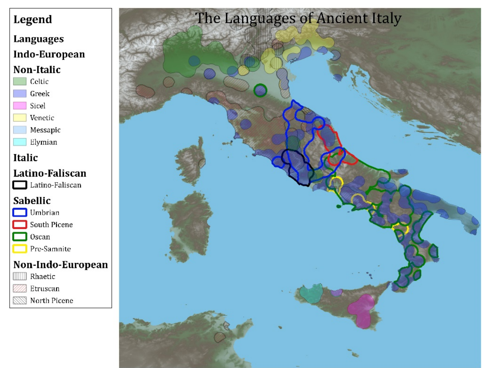

<!-- source-page: 1; pdf-page: 21 -->

# 1 Introduction

## 1.1 The Motivation

The Italian peninsula, reaching far into the Mediterranean Sea, served by virtue of its geography as an important crossroads of ancient cultures. Economic intercourse occurred across millennia between groups speaking many different languages that we know of (Figure 1.1), and likely countless others that have been lost to time. Many of these interactions left a mark on Latin. Here, the contact was intense and transformative. The colonization of Magna Graecia in the 8th century BCE resulted in ca. 5000 Greek words appearing in Latin amongst 44,000 core lexemes (Seidl 2003: 519) and Greek also affected written Latin syntax (Clackson & Horrocks 2011: 191-7, Weiss 2020: 509). Latin and Etruscan seem to have been in close enough contact that they both underwent the same areal shift to initial accent.1 As will be discussed in detail in §5, the first traces of populations bearing steppe-derived ancestry appear in Northern Italy ca. 2000 BCE (Saupe et al. 2021) after the dispersal of Yamnaya populations ca. 3000 BCE (Haak et al. 2015), and they appeared on a peninsula that had been inhabited by Neolithic farmers since ca. 6000 BCE (Malone 2003: 242). With such intense contacts in the attested record, we must be able to see traces from unattested contacts as well. Much research has been done on prehistoric substrates, but differences in methodology have produced a corpus of literature that on the one hand does not always agree on the exact nature and impact of these substrates and on the other hand deserves a fresh and more modern treatment.

## 1.2 Prior Research

The research on linguistic substrates is at its core a question about language contact. The search to understand potential contact between Latin and poorly attested or unattested languages has led in several directions. In general, the feasibility of recognizing different linguistic strata only came about at the end of the nineteenth century, after nuanced views of language contact began to develop. Thomason and Kaufman (1988: 1) capture the volatility of the early field: Max Müller in 1871 claimed “Es gibt keine Mischsprachen” against Hugo Schuchardt’s 1884 claim of the exact opposite, “Es gibt keine völlige ungemischte Sprache”.

1 This is inferred for Etruscan and Italic on the basis of weakening and syncope in non-initial syllables (cf. Wallace 2008: 37-9, Weiss 2020: 118-19, 527). Etruscan spellings attest to what looks like vowel weakening by the end of the 7th century. Latin shows vowel weakening and syncope by ca. 500 BCE. Then Etruscan begins to show syncope in medial syllables beginning ca. 470 BCE. The Sabellic languages also developed initial accent. The order of the changes makes it difficult to determine if one group or the other initiated the change. Instead it looks areal.

<!-- source-page: 2; pdf-page: 22 -->

The theory of linguistic substrates began to develop in the work of Romanists (Craddock 1969: 18-22), especially Graziadio Isaia Ascoli,2 who were dealing with a wide variety of material attested in the numerous Romance languages and who seemed to understand

2 Like his 1882 ‘Lettere glottologiche: prima lettera’ in Rivista di Filologica Classica 10: 1-71, where he argued that Gallo-Romance sound shifts were caused by Celtic speakers learning Latin. Craddock (1969: 19-22) notes several scholars preceding Ascoli who wrote about similar ideas. Data taken mainly from a spreadsheet compiled by Katherine McDonald (https://katherinemcdonald.net/research/maps/ with refs.), further supplemented as follows: Elymian from Marchesini (2012: 97); Faliscan from Bakkum (2009); Latin from EAGLE (Electronic Archive of Greek and Latin Epigraphy, http://www.edr-edr.it/) with a search for inscriptions in Latin dating to before 400 BCE; Lepontic from the Lexicon Leponticum (https://lexlep.univie.ac.at/wiki/Main_Page); Rhaetic from the Thesaurus Inscriptionum Raeticarum (https://tir.univie.ac.at/wiki/Main_Page); Sicel from Inscriptions of Sicily (http://sicily.classics.ox.ac.uk/). Not shown are Punic/Phoenician and the Greek inscriptions of Sicily. The simplified grouping of the Sabellic languages into Oscan, Umbrian, South Picene, and Pre-Samnite follows Weiss (2020: 15-16). Note that Pre-Samnite pre-dates Oscan where it was attested.

<!-- source-page: 3; pdf-page: 23 -->

that the spread of Latin must not have involved simple language replacement. It began, at least with Ascoli, as a criticism of the Neogrammarian model. This discontentment with the stringency of the Neogrammarian model and the exclusive focus of Indo-Europeanists on discovering the regularities of the daughter languages continued to influence the work of Italian scholars into the 1940s. Bertoldi (1939a: 5-19) contrasted the approaches/attitudes of Indo-Europeanists like Walde with those of Romanists like his teacher Jules Gilliéron and later (Bertoldi 1942: 1-8) highly praised Schuchardt for taking into account the shifting linguistic contacts that must underlie the complexity of Romance development from Latin: Schuchardt was therefore one of the first to rise up against the purely evolutionary conception of a language whose changes should be governed by rigid laws, who adheres instead to the principle that linguistic innovation in every system is the effect of contact of the individual with a more or less homogeneous collectivity of speakers in a varied game of expressive and receptive possibilities (Bertoldi 1942: 4-5).3 He saw that progress in the field relied on seeing linguistic change “no longer as the reflection of a pure and simple grammatical development, but as the result of historical events and cultural currents destined to accelerate or delay the rhythm of the consequent linguistic innovations” (Bertoldi 1942: 5).4 Alessio (1944a: 94) shared the frustration when describing research on the Mediterranean substrate (see §1.2.2.1.1), noting that the major etymological dictionaries “do not know how to completely free themselves from the shackles of traditional etymology”5 and calling for the languages of the Mediterranean to be thoroughly surveyed by experts in the field, not Indo-Europeanists “who have a very different sensitivity in dealing with linguistic problems.”6 As will be mentioned further in §1.4, words borrowed from the unknown pre-Latin languages of Europe show up in Latin as traditionally unetymologizable. They are either isolated without any cognates or have lookalikes in other languages that defy understood sound laws. Some words like this can be explained through inter-dialectal borrowing or internal processes like analogy. However, given the disgruntlement towards the field of Indo-European studies mentioned above, it is worth noting that the state of the field today takes both sides’ interests into account. It is only the adherence to the Neogrammarian model of the inviolability of sound law that allows for the identification of instances where regularity breaks down. It is the historical comparative method that

3 “Fra i primi ad insorgere contro la concezione puramente evoluzionistica d’una lingua i cui mutamenti dovrebbero essere retti da leggi rigide fu, dunque, lo Schuchardt che s’attiene invece al principio che l’innovazione linguistica in ogni sistema è l’effetto del contatto dell’individuo con una collettività di parlanti più o meno omogenea in un gioco vario di possibilità espressive e ricettive.” 4 “Non più come il riflesso di un puro e semplice sviluppo grammaticale, ma come il risultato delle vicende storiche e delle correnti culturali destinate ad accelerare o a ritardare il ritmo delle conseguenti innovazioni linguistiche.” 5 “Non sanno liberarsi completamente dalle pastoie dell’etimologia tradizionale.” 6 “Che hanno una sensibilità molto differente nel trattare i problemi linguistici.”

<!-- source-page: 4; pdf-page: 24 -->

allows us to determine if a word is the expected reflex of an inherited root, if it is isolated, or if it shows irregular correspondences to would-be cognates. In the history of the field, there have been many kinds of attempts to explain the origins of Latin etyma once it has been determined that they are not inherited. Numerous examples of borrowing from known, well-understood languages are still accepted today.7 But countless lexemes cannot be explained in this way. Given that the linguistic diversity of the Italian peninsula and the Mediterranean Basin has been documented since antiquity, various other contact scenarios have been proposed and used as explanations. What follows is a summary of several kinds of proposals: borrowings from poorly understood Indo-European languages, borrowings from lost Indo-European languages, and borrowings from non-Indo-European languages.

### 1.2.1 Indo-European Sources

#### 1.2.1.1 The Balkans

As will be shown in detail, there are several cases of Latin-Greek correspondences with very slight aberration in consonantism. Two salient examples include Lat. ballaena ~ Gk. φάλλαινα ‘whale’ and Lat. fascinus ‘evil spirit; charm’ ~ Gk. βάσκανος ‘bewitcher, slanderer’. In both cases, especially the latter where one can imagine descent from PIE *bʰeh₂- ‘to speak’, one reflex can be reconstructed as descending regularly from PIE *bʰ while the other represents *b. This has led to the suspicion that the irregular one of the pair represents a loan from a known language in which PIE mediae apsiratae yielded mediae. There are three potential culprits, namely the poorly attested Balkan languages Illyrian, Thracian, and Macedonian (cf. Schwyzer I: 65-71, Biville I: 180).

##### 1.2.1.1.1 Illyrian

Archaeological and onomastic material along with indications in the writings of ancient authors make it possible that Messapic was directly related to Illyrian (cf. Hamp 1957: 74), but there exists no inscriptional material to help confirm this (cf. Fortson 2010: 464-5, 467-8; Matzinger 2005: 29, de Simone 2018: 1842-3, Matzinger 2019: 20). In fact, Albanian is spoken in the geographic region where Illyrian is purported to have been spoken, but again, the absence of attested Illyrian material makes it very difficult to investigate any connection. On the other hand, some remarkable lexical correspondences between Albanian and Messapic, especially given the poor attestation of the latter and the nearly 1500 years separating their first attestations, make it quite likely that they are closely related (e.g. Matzinger 2005, followed lukewarmly by Hyllested & Joseph 2022: 240, 241). Thus, regardless of an existing relationship to the elusive Illyrian, Messapic seems to represent an originally Balkan language that came to be spoken on the Italian

7 From Greek (cf. Weise 1882, much more recently Biville I and II), Celtic (e.g. Schmidt 1966), Germanic (precious few: Green 1998: 182-200). On the possibility of inter-dialectal borrowing, i.e. Sabellicisms or regional variants appearing in attested urban Classic Latin see e.g. Rix (2005) and a careful treatment of the chronological and regional variation of Latin in Adams (2007).

<!-- source-page: 5; pdf-page: 25 -->

peninsula. Krahe (1955: 114-7) gave a summary of Latin and Greek words considered to be loans from Illyrian, often via Messapic, finding that they fell into two main categories—small sea-going vessels and horse-related words—along with some others. Even if we re-script Illyrian as “an ancestor of Albanian”, many of the proposed loans have little to support them. Lat. gandeia ‘an African vehicle’ is supposed to be from Messapic on comparison with Venetian gondola ‘type of boat’8 and the -eia suffix found in sabaia ‘beer’, given by glossators as Illyrian. Lat. hōreia ‘small fishing boat, pointed at the front’ would be Illyrian/Messapic on the evidence of the -eia suffix alone. Lat. caballus ~ Gk. καβάλλης ‘workhorse’ would have entered from Illyrian because of several personal names that all have the element cabal(l)-. But there is no reason to source this word specifically from Illyrian given its attestation in several other places. The Messapic reflexes of PIE *bʰ and *dʰ really do seem to be b and d (cf. Messapic berain ‘may they bring’ < *bʰer-o-ih₁-nt, Matzinger 2019: 64, and further hipa-des ‘he/she dedicated’ < *supo-dʰeh₁-s-t, de Simone 2018: 1844). If this goes for Illyrian too, then a *Dʰ ~ *D discrepancy between languages might attest to one of them having borrowed an Illyrian reflex in place of its own inherited reflex. Several cases of this are given by Krahe (1955: 114-7) to explain irregular alternations between Latin and Greek, but there are methodological problems. According to him: -Lat. ballaena ‘whale’ would be either from Gk. φάλλαινα ‘whale’ via Illyrian or both would be from Illyrian. But if the Illyrian reflex of *bʰ was b, then Gk. φάλλαινα cannot be from Illyrian. The Latin diphthong (unweakened in a non-initial syllable) attests to a late loan from Greek. In that case, we are not looking for a language whose reflex of PIE *bʰ was b but rather one that borrowed Gk. φ as b; there is no indication that Illyrian or Messapic did this. -Lat. dēda ‘wet nurse’, if the vowel length is correct, would be from the Illyrian reflex of *dʰeh₁dʰā-: cf. Gk. τήθη ‘grandmother’ (cf. also Krahe 1937) and PBSl. *deʔd- ‘grandfather/uncle’ (cf. Derksen 2007: 101, EDG 1477). But it is a Lallwort (cf. TLL s.v. dida) and thus its evidentiary value is dubious. -Lat. galaia and Gk. γαλαία ‘racing vessel’ would be Illyrian along with Lat. golaia ‘sea turtle’, cognate with Gk. χέλῡς ‘tortoise’ and PSlav. *žely- < *gʰel(H)-uH-. Note here also the -aia suffix. But the connection of the ship and turtle words is not secure. Despite the turtle lexeme being reconstructible to a common proto-form in two languages of the Balkans, golaia appears in Latin recently, in glosses and the Latin translation of Dioscorides’ de Materia Medica. Thus a loan from Illyrian or even Messapic seems far from the only option.

8 This was used as evidence because Venetic had been thought to belong to the Messapic-Illyrian branch. It does not (already Beeler 1949: 48-57).

<!-- source-page: 6; pdf-page: 26 -->

-Lat. brīsa ‘remains of pressed grapes’ would be from Illyrian *brīsa, itself from Thracian *brūti̯a, the source of Gk. βρῦτος ‘barley beer’ and βρύτεα ‘refuse of olives or grapes’ < PIE *bʰru- (cf. Lat. dē-frutum ‘boiled down must’). The assumption of Thracian origin is not bulletproof, but otherwise this is the only example where a Balkan language seems to have been involved, albeit not Illyrian. The pre-form of Alb. bërsí ‘pomace, lees, dregs’, PAlb. *brı̄̆sā, is identical to Lat. brīsa. Since Albanian produces s < *ti̯, a pre-form of Albanian may have been involved in the transmission of this lexeme into Latin. Krahe assumed that Illyrian was responsible for the change of ū to ī, but without any further evidence of this, it is ad hoc. All we can say is that βρῦτος reached Albanian (where a direct loan should have given **brys-, Demiraj 1997: 98) indirectly. Kretschmer (1896: 248-9, fn. 4) had additionally suggested that a North Balkan treatment of *bʰeh₂- ‘to speak’ might be responsible for Gk. βάσκανος ‘who bewitches; sorcerer, slanderer’ beside Lat. fascinus ‘evil spirit, spell’ (cf. also Devoto 1943: 364). But given the semantic distance from the root in question and the lack of evidence of other IE attestations of this formal and semantic derivation, it does not seem fully warranted to achieve regularity by forcing *bʰaskano- through Illyrian on its way to Greek. There are two cases of potential Illyrian loans given by Krahe where his reason seems to have been the aberrant a-vocalism in Latin. Lat. mannus ‘small horse’ (cf. also Brüch 1922: 246-7) would be from Illyrian *manda- attested in a Messapic name of Jupiter Menzana, supposed to be from PIE *mezd- ‘to feed’ (cf. Alb. mënd ‘to suckle’ but also mëz ‘foal’). Orel (1998: 265) reconstructs for mëz PAlb. *mandja- and takes It. manzo ‘ox’ from its Messapic cognate. It. manzo requires a pre-form like *mandius and could indeed theoretically be related to the Albanian form, but Lat. mannus would not regularly have developed from a form with *-nd-.9 Lat. parō, Gk. παρών ‘small boat’ would be from Illyrian, cognate to OHG farm ‘fast ship’, Ru. poróm ‘ferry’, etc. < *por-mo-. But regardless of the source of the Greek form, the Latin is most easily explained as a loan from it. Illyrian need not have produced it. Krahe additionally gives the case of Lat. g for Gk. κ in Lat. grabātus, Gk. κράβ(β)ατος ‘bed’. They would be from Illyrian/Macedonian *graba- ‘oak’, also found behind Gk. γράβιον ‘torch, oakwood’ and the Umbrian epithet of Jupiter Grabovius. EDG (284) notes that the forms are also compared to e.g. Ru. grab ‘hornbeam’. The Slavic forms are the only indication of an originally Balkan source. Otherwise the forms could be from

9 The sequence -nd- is preserved in Latin, thus the assumption is in WH (II: 30) and EM (384) that it is a dialectal form (cf. dispennite for dispandite in Plautus’ Miles Gloriosus). Nor does Sabellic origin provide a good explanation. Weiss (2020: 188) notes that even there, the evidence for a development *nd > nn is poor. Whether the forms with *-nd- are Messapic/Illyrian to begin with is unclear, but such an origin does not straightforwardly explain how Latin ended up with mannus (which, WH [II: 30] mention, the grammarian Consentius ascribes Gallic origin).

<!-- source-page: 7; pdf-page: 27 -->

anywhere. Perhaps Illyrian transmitted the χ of Gk. ἔγχελυς ‘eel’ to Latin as the gloss enocilis = anguīlla, but this relies only on the Illyrian personal name Enoclia as evidence. In the end, the evidence pointing to Illyrian (or Messapic/Proto-Albanian) being responsible for irregular sound correspondences involving Latin is too slim to confirm. When a solid IE root etymology can be proposed and several sound laws are involved, the case becomes stronger. But this is so far only the case for Lat. brīsa. Even there however, the vocalism suggests that its potential Proto-Albanian source did not receive the word from any attested source.

##### 1.2.1.1.2 Thracian and Macedonian

Thracian is poorly attested and poorly understood. Our best information generally comes from Hesychius glosses (Fortson 2010: 463-4) beside a small number of inscriptions. Its name often appears in compounds like Thraco-Phrygian and earlier as Thraco-Illyrian, but the evidence is too fragmentary to connect Thracian to another subgroup with any amount of certainty. Thus, though Kretschmer (1923a: 229) gave as evidence of the Thraco-Phrygian development of PIE mediae aspiratae to mediae αββερετ < *bʰer- and αδδακετ < *dʰeh₁-, these are Phrygian forms and cannot be used to investigate Thracian. Our best evidence that Thracian had the same outcome of the voiced aspirates is Gk. βρῦτος and βρύτεα (Hsch. βροῦτος, βρύττιον), which seems to descend from *bʰru- if related (as mentioned above) to Lat. dēfrutum and Engl. brew, broth. But as will be mentioned in §2.4.3, I am skeptical of the Thracian origin of this word. Nor does it explain the vocalism of Lat. brīsa. Its origins in Thracian may have nothing to do with the change and the mediating language could have been any language of the Mediterranean, known (like Illyrian) or unknown. Because historical Thrace is not contiguous to Italic-speaking areas but does border on Greek-speaking areas, many of the hypotheses about words of Thracian origin are more relevant to Greek than to Latin. The Thracian pedigree of a Greek word has no bearing on how it is borrowed into Latin unless Latin has also borrowed the word from Thracian, which is geographically unlikely. For example, Boisacq (1911-12: 58-9) gives e.g. Gk. πίσος ‘pea’ and πύξος ‘box-tree’ as words of Thracian origin due to a lack of an etymology and the presence of the suffix -aso or -so with preserved intervocalic s. But Lat. pisum ‘pea’ is a direct borrowing from Greek neut. πίσον and a Thracian origin of Gk. πύξος (for which there is no morphophonological indication) does not explain the voiced consonant of Lat. buxus. There are enough Macedonian personal names and glosses given as Macedonian that we can be relatively certain that it reflects PIE mediae aspiratae as mediae. Cf. for example Mac. Βίλιππος : Gk. Φίλιππος, Mac. Βερενίκη : Gk. Φερενίκη, and Mac. κεβαλή : Gk. κεφαλή ‘head’ (Fortson 2010: 464), though Méndez Dosuna (2012) argues that this is the result of a Lautverschiebung in what was originally a Greek dialect. Nevertheless, it seems that few Macedonian loans have been proposed for Latin, perhaps because it

<!-- source-page: 8; pdf-page: 28 -->

suffers from the same problem as Thracian in that it is not contiguous with Latin-speaking regions. The problem for all of these languages is that, while they could be used to try to explain a few mismatching forms between Latin and Greek by claiming that one language borrowed the form while the other language continues an inherited reflex, this is generally the extent of their usefulness. To account for larger numbers of words with irregular correspondences, we would need to assume either a substantial number of cases of this incongruous borrowing or perhaps that these languages were once more widespread—that they might have underlain Latin or Greek. It is unlikely that we will be able to claim this, at least for the languages in their historically attested states. Thus there have been a number of attempts to identify within Latin and/or Greek and/or other IE branches remnants of older Indo-European languages that may have reached the areas that Latin and Greek would come to be spoken in some time before they got there. The idea is certainly not absurd. Populations with steppe ancestry appear in Italy around 2000 BCE (Saupe et al. 2021) but Latin is not attested until much later. Part of this must be due to the lack of an alphabet on the Italian peninsula until the 8th c. BCE, but it is easy to image that other Indo-European languages got to the Italian peninsula before the Italic family did. Several lost PIE languages have been proposed to account for irregular reflexes, not all directly bearing on Italic.

#### 1.2.1.2 Indo-European Substrates

Kretschmer (1896: 401-9), as will be mentioned in §1.2.2, in part summarizing what had been gathered up to that point, supported the idea of a non-IE speaking population having been present in Greece and Asia Minor before IE languages became settled in those areas. The convincing factor to him was the Gk. -νθος suffix, not be a gerundive in form or function, and which appeared on substantives of obscure etymology, several personal names, and placenames which corresponded to placenames in Asia Minor ending in -ndos and -nda. Gk. -σ-/-σσ-/-ττ- featured in his argument, but he noted that these can be the result of inherited morphology as well. He maintained this position for several decades (cf. still Kretschmer 1923a: 69). But by 1925, he began to change his mind, influenced by the paradigm-shifting discovery and decipherment of the Anatolian languages. He noticed a widespread, functionally diverse nt-suffix in words with a good IE etymology in Greek (e.g. ἀνδριάς, άντος ‘statue’), Slavic (diminutives like *ovьcę to *ovьcà ‘sheep’), Italic (ethnic names like Picentes, Fulcentes, Aventinus), Germanic (*hri/unþiz- ‘cow’ < *ḱr-ent-), and Illyrian placenames in -entum/-untum (Kretschmer 1925a: 84-106). After listing several examples, he concluded that the non-IE -νθος/-anda suffix was used in approximately the same ways as the nt-suffix he examined amongst the Indo-European languages. This could be due to chance, or it could suggest “daß schon vor der späteren Ausbreitung der Indogermanen sich eine indogermanische oder indogermanoide Welle nach dem Süden ergoß, und zwar über eine unindogermanische Urbevölkerung” (pg. 106).

<!-- source-page: 9; pdf-page: 29 -->

In a second article in the same year, he used the early understanding of the recently understood Anatolian languages to make a logical postulation. If Lydian and Lycian are Indo-European, and if Etruscan is related to Lydian and to Tyrrheno-Pelasgian/Pre-Greek, then we should find Indo-European elements in Etruscan, Pre-Greek, and in the later Indo-European languages that settled over and around them, namely Italic and Greek (Kretschmer 1925b: 300-19). The relationships between the languages he mentioned may no longer be supported today, but the basic principle was clear: there could be traces of much older “protindogermanische” [sic] languages taken up by later Indo-European languages. And they should be visible: “In diesen Fällen erlaubte die unregelmäßige Vertretung der Verschlußlaute, die [protindogermanische] Herkunft von der [indogermanischen] zu unterscheiden” (pg. 310). He had set the stage for more systematic approaches to try to understand which irregular reflexes might be due to underlying but related languages—Indo-European substrates—with different sound laws.

##### 1.2.1.2.1 Pelasgian

Taking archaeological investigations into account, Kretschmer updated his ideas in 1940 (231-78) and 1943 (84-218). He argued for two Pre-Greek layers: a non-IE Anatolian layer and an Indo-European stratum that he called Danubian. He identified the Anatolian layer with the ancient autochthonous Leleges, while the Danubian layer represented the Pelasgoi. The latter appeared as the archaeological Dimini Culture, bringing Linearbandkeramik elements from the North into the Balkans along with the Protindogermansich linguistic elements preserved in Greek. Katičić (1976: 57-87) in general provides a more detailed overview of the development of the Pelasgian theories than I could here ever hope to replicate. With the help of his summary, I will highlight a few of the main developments of the Pelasgian theory. Milan Budimir, publishing from the 1920s to the end of the 1960s, preferred the name Pelastic, based on the lectio difficilior Πελαστικέ for Πελασγικέ in the scholiast to the Iliad 16.233. He saw Pelastic as preserving the three-way distinction of the original PIE velar series, and argued 1) that Albanian does this too and therefore continues this oldest PIE stratum of the Balkans and 2) that Slavic has many of the same features of this IE Pre-Greek language of the Balkans including being satəm, velarization of -s- after u, and preterit participles in -lo. Katičić’s criticism of his work is the same as for Kretschmer. The variation in the phonology of the proposed cognate sets is too great. It contradicts the main thesis that all the forms descend from one genetically homogenous language. An example of a word family claimed by Budimir to descend from PIE *dʰeup/b- ‘deep’ assumes d ~ l and d ~ s alternations, alternations between all nearly all possible vowels, and an a-prefix (Katičić 1976: 64-6):

<!-- source-page: 10; pdf-page: 30 -->

Hsch. δάξα, var. δάψα ‘sea’ ∴ Θέτις ‘Thetis’ < *Θέπτις

∴ Ὀδυσσεύς ‘Odysseus’ = prep. ο + δυσσ < *δυξ

Lat. Ulixes = prep. u + lix Gk. ζάψ ‘surf’Alb. det/dejet ‘sea’ Lat. Tiberis ‘Tiber river’ Gk. σίμβλος ‘beehive’, σιπύη ‘meal tub’, Gk. δέπας, δέπαστρον ‘beaker’ Gk. ἀλάβαστρον/ἀλάβαστρος ‘vase for perfume’, λεπαστή ‘limpet-shaped cup’ Gk. λαβρώνιον ‘large, wide cup’ Lith. dauburỹs ‘valley’ Vladimir Georgiev, especially by the time of his Vorgriechische Sprachwissenschaft (1941-5), had identified a pre-Greek Pelasgian underlying Greek that he considered an independent daughter branch of PIE. He was one of the first to propose a system of sound laws for Pelasgian. Based on his data, he found: PIE *o > Pelasgian a PIE *R̥  > Pelasgian uR or iR (*r̥ , *l̥ sometimes > ru, lu) Chain shift: *bʰ > b *b > p

*p > ph

*dʰ > d *d > t

*t > th

*gʰ > g *g > k

*k > kh PIE *kʷ, gʷ, gʷʰ > Pelasgian kʰ, k, g PIE *ḱ; ǵ, ǵʰ > Pelasgian s (þ); z (ð), i.e. it is a satəm language PIE *s preserved prevocalically and intervocalically Aspirate dissimilation occurred before any other changes Georgiev further claimed that this Pelasgian was the same language as the source of the Pre-Greek placenames. He does not convince Katičić on this account (pp. 79-80), who emphasizes that placenames are not reliably etymologizable. Several scholars built upon Georgiev’s premises. Weriand Merlingen followed Georgiev, but envisioned the IE Pelasgian language (he called it Akhaean) as a superstrate rather than a substrate. He additionally proposed a second IE language that influenced both Greek and Pelasgian. He called it Psi-Greek because of the first row of the consonant shift: *p *t *k *ḱ > ps s ks ks *b *d *g *ǵ > ph th kh kh *bʰ *dʰ *gʰ *ǵʰ > b d g g *kʷ *gʷ *gʷʰ > ph bh b Before the shift, aspirates were dissimilated in voicing and aspiration. As for vowels, *o > u, *e > i, *ā > ō, *ē > ā, but the syllabic nasals and resonants have irregular outcomes. This allowed etymological equivalences between Gk. θεός and Lat. deus ‘god’, Gk. ξανθός ‘blond’ and Lat. candidus ‘white’ as well as Gk. ἄνθρωπος and Gk. ἀνήρ, ἀνδρός ‘man’ (examples from Katičić 1976: 81). One sees how quickly this double system of superstrate languages can produce artificial results, especially when the matches are not perfect.

<!-- source-page: 11; pdf-page: 31 -->

Otto Haas also followed Georgiev, and by 1960 had teased apart what he saw as two different layers: 1) That found by Georgiev (and Albrecht von Blumenthal in his 1930 Hesychstudien), which he called hylleisch after the Ὑλλαῖοι of Istria. 2) An earlier layer that he called vorgriechisch to avoid historical interpretation, involving the change of *p, *t, *k before *u to ps-, s-, ks- (compare Merlingen’s Psi-Greek) and *s > x after *r and *u like in Balto-Slavic and Indo-Iranian. In this way, he explained e.g. Gk. ψύλλα ‘flea’ < Pre-Greek *phjulja (cf. Lat. pūlex ‘flea) and Gk. ὀξύς ‘sharp’ < Pre-Greek *akhjus < *aḱus ‘sharp’ (examples from Katičić 1976: 83-84). Albert van Windekens (esp. van Windekens 1952) accepted the name Pelasgian, but only as a placeholder. He followed Georgiev’s sound laws in general, amending *e > i before a nasal, *u > o in an initial syllable (but u in a second syllable), and noting that intervocalic *u̯  yielded b (Gk. ἐρέβινθος ‘chickpea’ vs. Lat. ervum ‘bitter vetch’), which could be transformed into m through proximity to n (Gk. κυβερνάω ‘to steer’ vs. Cypriot ku-me-re-na-i ‘they steer’). He also examined noun formation and explained the Pre-Greek suffixes through concatenations of Indo-European morphology (e.g. -νθ- < Pelasgian *-nth- < IE *-n-t-). Albert Carnoy also followed Georgiev’s sound laws and proposed numerous Pelasgian etymologies based on short roots with general meanings. (Cf. e.g. κόμαρος ‘strawberry tree’ < PIE *geu- ‘to bend, form a ball’, μίνθη ‘mint’ < PIE *mei- ‘sweet, refreshing’, νάρκισσος ‘daffodil’ < PIE *snerg- ‘to stiffen’, σαλάμβη ‘chimney’ < PIE *swel- ‘absorb’, Carnoy 1955a). This methodology led to criticism even from other Pelasgian scholars. The problems with the methodology of the Pelasgian theories begin with the scholars themselves. Hester (1965: 347) writes that “the great ingenuity and erudition of the Pelasgianists,” (the exact two words which Katičić (1976) also uses to preface his criticisms) “especially Georgiev and van Windekens, is generally praised, but…the greater the ingenuity, the greater the possibility of constructing a phantom Indo-European language from non-Indo-European material.” Indeed, attempting to provide native etymologies for what had up to then begun to be suspected of being non-Indo-European was at the core of the Pelasgianists’ methodology. In the end, they show that virtually anything can be provided with an IE etymology. Hester continues, “If we allow the Pelasgianists to postulate one new Indo-European language, we can hardly prevent them from postulating several (which is historically at least as plausible); but the postulation of them obviously increases the danger…” Of course there could have been numerous Indo-European languages in the area, now lost; the question is not one of plausibility but provability. Despite generally following the sound laws as proposed by Georgiev, there was disagreement amongst the Pelasgianists as to the exact phonology they reconstructed. Too many exceptions were allowed, defended on the basis of words entering Greek at different stages. This is theoretically valid—the way that language A borrows from language B changes as both languages’ phonologies develop over time— but it is perilously difficult to prove. Another criticism shared by both Hester and Katičić is that most words given as Pelasgian show only one of the sound changes.10 Of those

10 Interestingly, Devoto (1943: 365) takes issue with exactly the cases that show more than one of the sound laws. However, this is because he sees several of the phenomena as having different sources. Thus

<!-- source-page: 12; pdf-page: 32 -->

that show more than one, Hester (1965: 384) is only convinced by πύργος ‘tower, fortress’ (< *bʰerǵʰ-), τάργανον ‘vinegar’ (< *dʰerə-gʰ- or *ster-eg-), τύμβος ‘grave mound’ (< *dʰm̥ bʰos cf. Gk. τάφος ‘grave’), and τρύγη ‘drought; harvest’ (< *dʰeregʰ- vel sim.), a list so small it could be due to coincidence. Katičić (1967: 76) places much weight on Hester’s (1965: 384) conclusion “It appears then that there is a small number of probable Indo-European loan-words in Greek,” but he does not finish the quotation. Hester continues “…borrowed most probably from neighbouring languages and not from a substrate or superstrate. These words are totally unconnected with ‘Aegean’.” For these reasons, and particularly as evidence in favor of the Yamnaya theory of Indo-European dispersion has accumulated, Indo-European Pelasgian theories have generally been given up. Garnier and Sagot (2017) attempt a fresh approach with the criticisms in mind, as will be mentioned below. But the Pelasgianists were far from the only ones to attempt to find an Indo-European substrate amongst some of the daughter languages.

##### 1.2.1.2.2 Temematic

Less relevant to Latin and the Mediterranean world but systematically similar to the Pelasgian hypothesis is the Temematic language described by Georg Holzer (1989). He proposes the existence of an Indo-European language from which Baltic and Slavic borrowed words with seemingly irregular outcomes. The sound laws are: 1) PIE tenues > mediae (The “teme-” of temematic)

*p, *t, *k, *ḱ, *kʷ > b, d, ǵ, gʷ 2) PIE mediae aspiratae > tenues (the “-mat-” of temematic)

*bʰ, *dʰ, *gʰ, *ǵʰ, *gʷʰ > p, t, k, ḱ, kʷ 3) PIE *r̥  > ro, *l̥ > lo 4) PIE *V̄  > V̆  /_ i̯, u̯ , r, l, m, n 5) PIE *er > ir /_ C, # 6) PIE diphthongs immediately before a sequence *CV received acute accentuation. This functioned after rules 4 and 5. Holzer’s analysis benefits from a number of criteria het sets in order to ensure that his data are as objective as possible, including root length (shorter roots are more likely to be coincidence), root sharpness (the number of different root reconstructions allowed for by the comparanda due to the sound laws of the languages involved), probability of having

the connection of Gk. σοφός ‘clever, wise’ and Lat. sapiō ‘to know’ is impossible to him because it shows an Armenian-esque consonant mutation and an Illyrian-esque retention of *s. What Georgiev saw as evidence of a pre-Greek IE Pelasgian language, according to Devoto, could be the result of “filoni diversi” (he mentions an orientalizing stratum and a central stratum) which fused to create Proto-Greek. He later argues for the existence of “peri-Indo-European”, languages on the margins of the IE linguistic area that are affected by non-IE features and lexemes. The ideas are not impossible, but it is interesting that he proposes such concepts as an alternative to Georgiev’s more systematic attempt to identify recurring sound laws.

<!-- source-page: 13; pdf-page: 33 -->

an IE origin, semantic closeness, degree of abstractness of the semantics, and number of synonyms. Because of this, many of his comparisons are quite good. Kortlandt (2010: 73-80) accepts the existence of Temematic and takes it seriously enough to speculate on its placement in the IE tree. The ability to establish that a root is of IE origin is per se difficult, especially when irregularities are involved. A large number of comparanda does not guarantee that a root is inherited (especially when the attestations are geographically close). For example, Holzer (1989: 121-2) connects PBSl. *tron- ‘drone’ (PSlav. *trǫtъ, Lith. trãnas, Latv. trans ‘drone’) to Germanic and Greek drone words from *dʰrōn-. But problems with reconstruction within Germanic (cf. Kroonen 2013: 101) and Greek (cf. EDG 105, 554) suggest instead that the whole group represents loans from a non-IE language. On the other hand, Holzer’s (1989: 51-4) connection of e.g. Lith. bir̃žė ‘furrow’ to Lat. porca, OHG furh, and MW rhych ‘furrow’ < *pr̥ ḱ- is more difficult to do away with. Its potential reflex in Ved. párśāna- ‘low sunken place?’ seems to lend credence to an IE origin. What makes it particularly compelling is its irregularity in Balto-Slavic compared to the common pre-form reconstructible for the other branches. Distributions like this seem quite significant; while an IE substrate is not the only explanation (perhaps the lexeme was mediated by a non-IE language, cf. Devoto’s 1943 peri-indoeuropeo), it should be kept in mind.11

##### 1.2.1.2.3 Indo-European Substrates directly involving Italy

###### 1.2.1.2.3.1 Ribezzo’s Ausonian

Francesco Ribezzo postulated throughout several articles (1928, 1929, 1930, 1932, 1934a etc.) that pre-Italic Southern Italy from Rome to Sicily was home to an IE language the he named Ausonian after the inhabitants of Southern and Central Italy (called Αὔσονες by the Greeks, Aurunci by the Romans). Its main feature was the reflection of mediae apsiratae as tenues, but almost all examples show *dʰ > t: Leuternii etc. < *leudʰer(i)no- < *h₁leudʰ- ‘people’ Rutulī < *rudʰ- ‘red’ (1930: 92) Mount Aetna (Αἴτνη) < *aidʰenā < *h₂ei̯dʰ- ‘to burn’ (1928: 192-4, 1934a: 91) Etr. lautn ‘free?’ = līber < *h₁leu̯ dʰ- (1929: 64, 1932: 32) Sicel λίτρα ‘Sicilian coin’, Lat. lībra ‘Roman pound, scales’< *tlēidʰrā- < *telh₂- ‘to carry’ Szemerényi (1991 II: 655-672) reviews the idea by means of updating the etymology of λίτρα/lībra.12 He is convinced by Ribezzo’s arguments that “Sicel-Ausonian” had the

11 Holzer (1989) lists only the cases that work with Temematic sound laws. It would be interesting to see a list of cases of alternation between Balto-Slavic and other IE branches that attest to different irregular correspondences. 12 He asserts that Germanic forms (like OE lēad) are not borrowed from Celtic (cf. MIr. lúaide) but instead that the Germanic and Celtic lead words are from *loudʰ-o- ‘lead’, whence Lat. lībra as “in the

<!-- source-page: 14; pdf-page: 34 -->

change *dʰ > t and in fact further proposes to have found evidence for *bʰ > p as well. He notes some cases that Ribezzo adduces that do not show this development (like *h₂elbʰo- ‘white’ > ΑΛΛΙΒΑΝΟΝ = Allifae, *reudʰo- ‘red’ > Rudiae, pg. 663), but thinks they can be safely removed from consideration (pg. 671-2). The *bʰ > p change is dubious: in Paulus ex Festo it is claimed that Latin has album ‘white’, Greek has ἀλφόν, but Sabine has alpum. Szemerényi (1991 II: 671) argues that it should be taken seriously and that it is a remnant of the dialect of their predecessors. Neither of these proposals is warranted in my mind. He further mentions Alpēs ‘Alps’ < *h₂elbʰ- ‘white’ and Tiberis ‘the Tiber’ < *dʰeubʰ- ‘deep’, but as toponyms there is no guarantee that their original semantic value is recoverable. The etymological analysis of ethnic and geographic names is extremely problematic, and Etr. lautn, if borrowed from Italic, can simply have been borrowed before the change from *h₁leudʰ- > līb- (on this, cf. Rix 2005: 564, who suggests an Umbrian source). The only case where it seems like Ribezzo and Szemerényi were on the right track is that of λίτρα ~ lībra, but it does not carry the significance that they claim. Rather than evidence of an IE Ausonian language where *dʰ > t, λίτρα is probably a loan from Sicel (Lejeune 1993: 2, Weiss 2021) where *dʰ > d, and d was devoiced before sonorant consonants (Willi 2008: 22). Current scholarship leans towards Sicel being an Italic language (cf. Weiss 2020: 15 fn. 26), making it unlikely to have served as a substrate for the peninsula. Furthermore, the problems with a multi-wave origin of the Italic languages (as espoused here by Szemerényi 1991 II: 682-5) is discussed in §7.2.

###### 1.2.1.2.3.2 Haas’s Frühitalische Element

Otto Haas, as mentioned above, had followed much of what Georgiev proposed for the Indo-European substrate language(s) in Greece, but would not call any of them Pelasgian. In 1960, he searched for traces of these in Latin. This too built off of work that Georgiev had done in his 1938 Die Träger der kretisch-mykenischen Kultur, ihre Herkunft und ihre Sprache, II. Teil: Italiker und Urillyrier; Die Sprache der Etrusker. But Haas set out to do it better by not assuming from the beginning that Etruscan was a dialect of Pelasgian. His methodology included 1) that the only reason to compare an Italic word to another IE word despite a mismatch in form is its meaning. 2) The meaning must be well established; not hypothetical. He explicitly stated that this makes most of the Etruscan material unusable and that toponyms are generally not helpful. 3) The larger the portions of the words that correspond, the better (i.e. they do not share simply a root-like element). 4) The same strict standard must be used for counterarguments; alternative explanations do not take precedence simply by virtue of them being more conventional.

Bronze Age, the standard weight was of lead’ (Szemerényi 1991 II: 662). Lat. plumbum would thus be unrelated. In §2.2.2.1, I instead follow the etymology in Thorsø & Wigman et al. (2023: 117).

<!-- source-page: 15; pdf-page: 35 -->

Despite his attempt at a strict methodology and his disclaimer that this is simply a preliminary attempt, his data leave an overall unconvincing impression. His comparisons led him to some of the following sound changes for Frühitalisch: *bʰ, *dʰ, *gʰ > p, t, k (parcō ‘to spare’ < *bʰorgʰ- cf. PGm. *bergan ‘to keep (safe)’ *b, *d, *g > p, t, k (columba ‘dove’ vs. PSlav. golǫbь- ‘dove’) *u̯  > f (favus ‘honeycomb’ < *u̯ obʰ-o- cf. OHG waba ‘honeycomb’ but elsewhere ‘weave’) *o > a *ou̯ , *eu̯  > au *au̯  > i̯u (iubar ‘starlight, sunshine’ < *ausr̥ - with -br- < *-sr-, cf. Skt. uṣar- ‘dawn’) *āu̯  > lu (luscinia ‘nightingale’ < *āusi-kan-i̯ā- ‘Morgensängerin’) Some of the developments have alternative outcomes or are otherwise suspicious. For example, after a nasal *bʰ > b and *gʰ > g (in pīnguis ‘fat’ < *bʰn̥ gʰu-). But in truncus ‘mutilated; trunk’ < *dʰrongʰos, *ngʰ instead produced c. While *āu is meant to produce lu, lutra ‘otter’ (< *udrā-) would suggest that *u has the same result. Both *bʰ and *dʰ are meant to produce b after *u in Frühitalisch, though these are simply regular Latin sound laws (the former is the expected development of non-initial *bʰ and the latter is the RUbL Rule [Weiss 2020: 84]). There are furthermore issues with some of his etymologies. For example, he compares Lat. filix ‘fern’ to the Greek and Germanic willow words of the shape *welik-. Lat. culpa ‘blame’ he compares to derivations of PGm. *glapp/bōn- ‘to slip off’ such as ON glapna ‘to spoil, become useless’. He justifies the connection by comparison to Lat. vinum culpatum ‘spoiled wine’; this despite his warnings against hypothetical reconstructions of meaning. Lat. tuba ‘trumpet’ he compares to Ru. dudá, etc. ‘pipe (instrument)’, leading him to reconstruct *dʰudʰ- and *dʰou̯ dʰ- respectively; but *dʰeu̯ dʰ- is not a permissible root structure for PIE (unless perhaps an exception given its onomatopoetic function). He collected much material, but its usefulness is in the irregular correspondences he notes between forms rather than his IE etymological connections.

###### 1.2.1.2.3.3 Garnier and Sagot

Garnier and Sagot (2017) set forth to re-analyze the situation, taking into account the criticisms of the Pelasgianists’ methodology (semantic implausibility, exceptions to the proposed sound changes, one sound change per word, non-conformance to PIE word-formation patterns), and propose to have found underlying Latin and Greek traces of an IE substrate language that was 1) centum, 2) underwent a change in which “voiced aspirated consonants (at least PIE *bʰ) would be reflected as non-aspirated voiceless consonants, at least in certain contexts”, 3) had syllabic sonorants, 4) had fortis consonants, and 5) underwent stress regression. The centum rather than satəm nature of the language and the change *Dʰ > T rather than *Dʰ > D puts their substrate in league with Temematic and Ausonian rather than Pelasgian.

<!-- source-page: 16; pdf-page: 36 -->

Their analysis first proposes a frequent nominal morph *p, for which I am not convinced there is sufficient PIE evidence.13 This allows proposals like (with their proposed phonetic laws in parentheses): (1) *lei̯H- ‘to drip, pour’: *loi̯-p-eh₂-i̯é/ó- > *loiβā́- (intervocalic lenition) > *lóiβā- (stress retraction). Gives Hsch. λοιβᾶται ‘libates’ and then deverbal Gk. λοιβή ‘libation’, secondary Gk. λείβω ‘to shed, pour’; Lat. lībāre ‘to pour, spill’. (2) *dór-u- ‘chopped piece of wood’: *dr-óu̯ -p-o- (action noun), *dr-ú-p-eh₂- (collective), analogically levelled to *dr-ú-p-o- > *drúPo- (consonant fortition). Gives Gk. *drúpʰos, denominal verb *drupʰ-i̯o > Gk. δρύπτω ‘to scratch’ (3) *ḱel- ‘to cover’:

-*ḱl-óu-p-o- ‘covering’ > *kəlū́Po- (pretonic fortition and anaptyxis). Gives Gk. κέλῡφος ‘shell’.14 - *ḱl-u-p-éh₂ ‘set of huts’ > *kluβá- (posttonic lenition). Gives Gk. καλύβη ‘hut, cabin’. They reconstruct several stages of derivations, which are difficult to prove but cannot be rejected outright. In fact, it is an important consideration: an Indo-European language, even one that served as the substrate to another, would have undergone the same complex derivations that we see in the attested languages. I take more issue with the semantic implausibility or sometimes vagueness of several of their suggestions. Gk. δρύπτω ‘to scratch’ above is difficult to envision from *dór-u- ‘chopped piece of wood’ (actually ‘tree’). Lat. porrum, Gk. πράσον ‘leek’ they derive from *bʰers-, traditionally ‘to point, burst’ but which they define as ‘to break into pieces; to break through the ground upwards (especially speaking of a plant)’. Gk. βροῦκος ‘edible locust’ they take from *(s)preu̯ g- ‘to jump’. Gk. βλέπω ‘to look’, βλέφαρον ‘eyelid’ they derive from *bʰleǵ- ‘to sparkle, shine’. To list these cases is of course to ignore the cases that do work well,15 but suggests that such cases may have other explanations (e.g. chance, onomatopoeia, origin in a non-IE substrate). In Garnier and Sagot (2020) they propose that some of the material they treated may be the result of an Anatolian (mainly Lydian, in part Lycian) substrate in Greek. Their reanalysis of several proposals still relies on a, to me, unconvincing link to PIE roots.

13 Without committing to a comparison, I would like to mention how this calls to mind Hubschmid (1963 I), most of which is dedicated to a study of a purportedly widespread substrate p-suffix. Though he does e.g. agree that κέλῡφος is of inherited origin (p. 34). 14 Merrit (2021) offers an alternative explanation of the labial element as part of a light verb construction with *bʰuH-. 15 Some of the sound laws they propose allow the comparison of Gk. βρέμω ‘to roar, grumble’ with Lat. fremō ‘to rumble, roar’, OHG breman ‘buzz’, and MW brefu ‘roar’; Gk. πύνδαξ ‘bottom of a jar’ with Lat. fundus ‘bottom’; Gk. θρύον ‘reed, rush’ with PBSl. *trus- ‘reed, cane’; and a derivation of Gk. θρῖναξ ‘trident’ from PIE *tri- ‘three’.

<!-- source-page: 17; pdf-page: 37 -->

#### 1.2.1.3 Verdict on Indo-European Substrates

In sum, these attempts are all based on the perfectly plausible idea that the attested Indo-European languages were not the first Indo-European languages to be spoken in the area where they are attested. The irregularity of the data can a priori be due the intersecting effects of contact with 1) any number of different lost IE languages 2) over a long period of time in which both sides of the contact situation were undergoing sound changes. On the other hand, it is equally plausible that such a complex pattern can have other explanations. It is certainly possible that Gk. τύμβος is borrowed from a language in which it is the inherited reflex of *dʰm̥ bʰ-o-, like Gk. τάφος, but which deaspirated PIE mediae aspiratae. But if Greek has borrowed it, then it is equally plausible that the sound changes are due to a non-IE language’s treatment of PIE *dʰm̥ bʰ-o-. It is also possible, in light of Lat. tumulus, that τύμβος is not from the Indo-European formation *dʰm̥ bʰ-o- at all. The borrowing of a plosive into an IE language could only be mapped in terms of its voicedness, its aspiration, and (of velars) its palatal or labial quality. So a borrowing from a non-IE language that has its foreign sounds mapped onto native ones would look the same as a borrowing from an IE language with different sound laws. Given the amount of irregularity that such hypotheses do not explain, especially the cases where a link to an attested IE root is tenuous, perhaps other explanations are not simply plausible but even preferable. Alongside the field of explanation that proposed lost IE languages, a parallel field developed around the idea of the existence of non-IE substrates.

### 1.2.2 Non-Indo-European Sources

Whether or not traces of lost Indo-European languages exist in the attested daughter languages and whether these are visible as such, there are certainly a large number of cases for which an attempt at an Indo-European etymology is futile. Thus the focus of the rest of this chapter, and of this thesis in general is on the research of non-Indo-European sources of Latin vocabulary. The history of research on non-Indo-European substrates began, as did that of the Pelasgianists et al. above, amongst the Romanists and especially Ascoli. Hirt (1894) had proposed that the differentiation of the Indo-European daughter languages was due in part to contact with different groups of languages. Kretschmer (1896: 401-9) importantly furnished evidence for what he understood as relics of an explicitly non-Indo-European language. From here, the field seems to have developed in several directions of which I will detail two for their direct impact on the motivation and methodology of this work. The first was a continuation of Kretschmer’s work in the Mediterranean and the other, inspired by the phenomenon that Kretschmer identified, developed around Germanic.

<!-- source-page: 18; pdf-page: 38 -->

#### 1.2.2.1 The Two Lineages

##### 1.2.2.1.1 The Mediterranean Substrate

Antoine Meillet (1908), inspired in part by Sommer’s comparison of Lat. plumbum and highly diverse Gk. μόλυβδος, proposed a list of words that Latin and Greek had independently borrowed from “un troisième langue inconnue,” explicitly ruling out Semitic as the source. These included vaccīnium, cupressus, menta, rosa, līlium, fīcus, lībra, and vīnum. The article introduced the concept of a Mediterranean substrate to linguistics.16 Albert Cuny (1910) took from both Kretschmer and Meillet to further develop the list. He importantly noted not only the words with the already supposed non-IE suffixes, but went on to describe the phonological alternations that occurred within variants of these words as well as several other cases of irregular correspondence between e.g. Latin and Greek. His insights were remarkably prescient, and many of his suggestions withstood the test of time and are accepted in this work. In Italy (cf. Craddock’s 1969 overview of the field, which I follow here), research on the Mediterranean substrate was taken up early on by Francesco Ribezzo and Alfredo Trombetti. Ribezzo (1920a, esp. 1920b) proposed to have found evidence of a unitary substrate language in toponyms of the Mediterranean. Trombetti, known otherwise for his work on linguistic monogenesis, took Ribezzo’s approach to the extreme and saw two strata underlying the Indo-European languages of the Mediterranean: a Basque-Caucasian one and an Etruscan-Asia Minor one (cf. one of his latest formulations in Trombetti 1927: 220). Vittorio Bertoldi17 brought an amount of scientific rigor to the study of the Mediterranean substrate by investigating the lexicon in addition to the onomasticon. He laid out methodological considerations in a 1932 article and again in two books (Bertoldi 1939a, 1942). But Craddock (1969: 38-40), in reviewing Bertoldi’s body of work, notes a general lack of transparency as to whether he considered the Mediterranean substrate to be a uniform language. While he grew to focus more and more on regional variation within the stratum, he also identified pieces of morphology that seemed to overlap broad areas. “In Bertoldi’s writings it rarely, if ever, becomes crystal-clear exactly what languages belong to the Mediterranean substratum, what structural features words attributable to that substratum share, in short, what sort of linguistic reconstructions can be labeled uniquely Mediterranean” (Craddock 1969: 40). Giacomo Devoto introduced the idea of Peri-Indo-European (Devoto 1943) as an

16 The development of this concept probably cannot be separated from the racial theory of “Mediterraneanism” proposed by Giuseppe Sergi in his 1895 Origine e diffusione della stirpe mediterranea. As an opposition to Nordicism, it proposed the existence of an autonomous, i.e. non-Nordic, non-African, Mediterranean race and culture with the further stipulation that they were the greatest race in the world (cf. Craddock 1969: 31 fn. 19). 17 As a student of Wilhelm Meyer-Lübke in Vienna, he met Carlo Battisti, who was at the time already a lecturer at the university.

<!-- source-page: 19; pdf-page: 39 -->

alternative in response to the work of the Pelasgianists who were in many cases (especially Georgiev) all too willing to explain away all irregularities as traces of lost Indo-European languages. As an almost intermediate approach, Devoto’s Peri-Indo-European languages/cultures/peoples were those of non-IE origin that became Indo-Europeanized, serving as vectors of non-IE phonology and morphology in the cases where they came to influence other Indo-European languages. Giovanni Alessio, a student of Carlo Battisti, began to publish in the field of substrate studies with two articles (actually one, split into two) in 1935 and 1936. In 1955 he published a book overviewing his understanding of the situation. Similarly to Trombetti and in opposition to Bertoldi, he saw the Mediterranean substrate as a mostly homogenous unit. The patterns of phonology, morphology, and lexicon that he found reached from the Atlantic coast, through the Baltic, from Iberia to Asia Minor, on to the Caucasus and even to India (Alessio 1955: 220). He had earlier noted that “Mediterranean” was a term “which has gradually been emptied of its geographic significance”18 (Alessio 1946: 142).19 This inspired criticism from many, amongst them Alessio’s rival Johannes Hubschmid.20 Hubschmid was a student of Jakob Jud in Zürich, co-author of the 1920-40 Sprach- und Sachatlas Italiens und der Südschweiz. Thus the tradition of substrate research growing very visibly out of the study of the Romance languages was not restricted to the Italian scholars (many of whom had studied under Wilhelm Meyer-Lübke in Vienna or Jules Gilliéron in Paris). Beginning his publications in the field in 1943, his 1960 Mediterrane Substrate presents a less geographically extreme idea of the Mediterranean substrate, in fact two: an older Eurafrikanische (though he still calls it Mediterranean) substrate underlying most of Western Europe and a younger, Basque-related Hispano-kaukasische Mediterranean substrate (Hubschmid 1960a: 24). He identified further strata elsewhere as well, including several in Sardinia (Hubschmid 1953). His work began to culminate in the Thesaurus Praeromanicus, with volume 1 (1963) focusing on the evidence for a substrate p-suffix and volume 2 (1965) on Basque and Basque-Pre-Romance contact (including a discussion of Bertoldi’s and Alessio’s work). No further volumes were produced. Thus from its inception, research on the Mediterranean substrate has been well informed by a large amount of material, especially from a detailed understanding of the Romance languages, using as important evidence the irregular phonological alternations between comparanda. But it has also suffered from a few problems. The reliance on toponyms as independent evidence has potentially over-extended the boundaries of the phenomenon. There has never been uniform agreement as to its geographic extent or the number of

18 “Che si è andata un po’ alla volta svuotando del suo significato geografico.” 19 Lewy (1934) had already used a definition of “Mediterranean” that extended to the Caucasus and in fact included parts of West Africa. 20 Interestingly, Johannes Hubschmid’s father, Johann Ulrich Hubschmied, was a critic of the (Italian) substrate linguists, writing: “In der Tat stehe ich all diesen Etymologien aus der voridg. kala-pala-bara-Sprache skeptisch gegenüber” (1942: 118).

<!-- source-page: 20; pdf-page: 40 -->

strata it comprises.21 The spectrum ranged from Alessio’s enormous, monolithic “Mediterranean” substrate, with regional variations, to e.g. de Simone’s (1963: 196) conclusion that the evidence allows us neither to transgress well-delimited Sprachräume nor to postulate on the genetic relationship of these.

##### 1.2.2.1.2 The European (Germanic) Substrate

In 1899, Bruno Liebich published Die Wortfamilien der lebenden hochdeutschen Sprache als Grundlage für ein System der Bedeutungslehre, in which he classified the German lexicon based on etymologizability.22 Hirt (1909: 59) followed Liebich’s figures, wherein nearly one third of the German vocabulary, a significant part of it pertaining to maritime technology, was not attested outside of the Germanic family. Feist (1910: 350-1) then used these two works to conclude that 30% of the Germanic vocabulary came from a pre-Germanic non-IE substrate. Thus the Germanic substrate hypothesis was born23 and the figure of 30% was repeated into the 2000s.24 The idea that a pre-Indo-European language should have existed in North Europe was, especially after the discovery of Hittite, easily defensible: North Europe was almost certainly not the Urheimat of Proto-Indo-European.25 Those defending the Germanic substrate hypothesis even drew on Kretschmer’s work that had already been published on the non-IE strata in Latin and Greek (e.g. Feist 1932, Güntert 1934: 72). But Feist’s 30% figure was the result of a misunderstanding of Liebich’s categorization: the etymologies on which the categorization was made were very conservative (Prokosch 1939: 23) and the 30% included innovative combinations of nonetheless inherited morphology that simply did not occur outside of Germanic (Neumann 1971b: 78). Some scholars had sought other types of evidence, such as Ribezzo (1934a) and Güntert (1934) who suggested external influence triggered the first Germanic consonant shift. They pointed to what they understood as a similar change in Etruscan; thus the pre-Germanic substrate would be a relative, perhaps Alpine Rhaetic. But such a hypothesis was questioned already by Pokorny (1936:81-2) and is no longer considered today. In contrast to research on the Mediterranean substrate, which relied in part on irregular phonological correspondences within and between languages, the earliest conceptions of the Germanic substrate hypothesis relied on the non-etymologizability (i.e. isolation) of lexemes. This was a critical weakness of the methodology. Streitberg and Michels (1927: 51) quite reasonably noted that, as long as there is nothing explicitly non-Indo-European about the word, its lack of etymology might be an ephemeral lacuna awaiting a solution

21 Karel Oštir (esp. 1921, 1930) is an outlier, in that his version of “Alarodian” included the Caucasian families, Sumerian, Urartian, Elamite, Egyptian, Berber, Basque, Etruscan, etc. 22 This summary follows Bichlmeier (2016). 23 Though Neumann (1971b: 85) records even earlier ideas, for example Friederich Kluge’s 1901 (second edition) Urgermanisch. Vorgeschichte der altgermanische Dialekte, in which he proposed Apfel, Krug, Silber and Go. baira- ‘mulberry’ were from an unknown Urvolk. 24 Since Feist (1932). Cf. also recently Rifkin (2007: 54). 25 Published in English in the American journal Language because he had been so denounced for his germanenfeindliche ideas that no German journal would publish his work (Mees 2003: 20).

<!-- source-page: 21; pdf-page: 41 -->

from improvements in the field. “Wer sagt uns, daß dies nicht morgen der Fall sein werde?” It took longer than a day, but Bichlmeier (2016: 323-4) notes two times (already Prokosch 1939: 23, Mees 2003: 26) at which it had already been claimed that most of the etymologies had been provided. Neumann (1971b), too, predicted that the number of pre-Germanic substrate words proposed on this basis would shrink as better etymologies came out. Pokorny, who was by no means opposed to the idea of a pre-IE substrate,26 had taken this into account to conclude from other evidence (Lautbestand, innere Sprachform, and Flexion und Wortbildung), “that, from a purely linguistic perspective, there exist only few indications of a substrate. But these in all likelihood point to an ancient relationship with Finno-Ugric languages” (Pokorny 1936: 84).27 The 1960s saw a development along the lines of Pelasgian. Łowmiański in 196328 criticized Pokorny for not taking into account the possibility of an Indo-European pre-Germanic substrate. Some Pelasgianists had already compared the sound changes they found to the Germanic Lautverschiebung. Hans Krahe (e.g. 1964) proposed to have found an inherited Old European stratum of linguistic unity behind Central and Western European hydronyms. But Mees (2003: 23) remarks that Krahe provided no actual proof that the hydronyms were from one monolithic stratum: “Having the model of Illyrian in mind, he assumed that together these elements represented the remnant of one archaic language, whereas in fact they may well represent the remains of a number of different Indo-European (palaeo-)dialects.” At about the same time as each other, Maurits Gysseling and Hans Kuhn (esp. Kuhn, Hachmann, and Kossack 1962) remarked on several place-names in the region of Belgium preserving a p, making it unlikely that they were native Germanic words (given the rarity of PIE *b) and unable to be of Celtic origin (as *p is lost). Other elements were built up that seemed to point to a third language originally native to the area. The former called it Belgian (cf. Gysseling 1975), the latter the Nordwestblock, but both agreed it was Indo-European. Meid (1986) defended the idea of the existence of a Germanic-related, non-Celtic language against criticism but remained unsure about its extent. Credible progression on the research of the Germanic substrate would require updated methodology.

#### 1.2.2.2 Uniting the Lineages

The topic of this thesis as well as its methodology probably has F.B.J. Kuiper to thank for, whether directly or not, uniting various lines of substrate research. He first wrote on the topic of substrates in his 1948 Proto-Munda Words in Sanskrit, then on the pre-Greek substrate in 1956. He would not write about the substrate of Germanic until 1995, but

26 In fact, he wrote several articles on a non-IE substrate in Irish in the Zeitschrift für Celtische Philologie (1927 vol. 16: 95-144, 231-266, 363-394; 1928 vol. 17: 373-388; 1930 vol. 18: 233-248). 27 “…daß rein sprachlich nur geringe Anhaltspunkte für ein Substrat vorhanden sind, die aber mit einer gewissen Wahrscheinlichkeit auf uralte Beziehungen zu den finno-ugrischen Sprachen hinweisen.” 28 Łowmiański, Henryk. 1963 Początki Polski: Z dziejów Słowian w I tysiącleciu n.e. Warsaw: Państwowe Wydawnictwo Naukowe. Page 45. Non vidi, apud Witczak (1996: 169-70).

<!-- source-page: 22; pdf-page: 42 -->

two of his students, Edzard Johan Furnée and Robert S.P. Beekes, meanwhile made critical developments in the methodology of substrate research. Kuiper’s 1956 article formed the basis of Furnée’s dissertation, published in 1972 as Die wichtigsten konsonantischen Erscheinungen des Vorgriechischen. The work undertook to describe all of the irregular consonant alternations (with an appendix on vowels) that occur within Greek and thus point to the influence of a non-IE substrate. Interestingly, he concludes that the variation was due to expressive alternation within the substrate language rather than to the borrowing process. Georgiev (1971: 164-67), who could think only of Pelasgian, reviewed Furnée harshly: “…These are apparently the sound laws(?) of Pre-Greek. The book presents a misguided attempt to rescue the already obsolete pan-Mediterranean idea. Its fundamental errors attest to an insufficient linguistic education,”29 later saying that it is of no scientific value. Beekes on the other hand, who a year earlier had already used irregular alternations to argue for the European substrate origin of Gk. λέπω ‘to peel’ (Beekes 1971), valued it greatly, calling it “without a doubt a turning point in the study of the Greek substratum” (Beekes 1975). He would incorporate its insights into his 2010 Greek etymological dictionary. Around this time, research on the topic began to appear in the United States as well. Eric P. Hamp wrote in 1975 and 1979 about substrate words, in the former noting a case of invalid root structure in words for ‘to cut’ and in the latter importantly noting the presence of *a and an a ~ o alternation in reflexes of the apple word. Hamp and several others, especially Edgar Polomé, would continue to publish on substrate topics throughout the 1980s. The late 80s and the 90s saw a boom of substrate research output, especially in Leiden. Beekes developed his ideas on the pre-Greek substrate, with their roots all the way back in Kretschmer’s work, culminating in his 2010 etymological dictionary and a 2014 monograph. Beekesian Pre-Greek was supposed to have been restricted to the geographic area of Greece, though this assertion will be investigated in this thesis. But even more work was being done on the evidence for a non-IE substrate language present outside of and beyond Greece, including by Beekes (Beekes 1996, 1999, 2000). Kuiper’s 1995 article30 focused on the importance of non-IE *a to detect three substrates within Germanic: Krahe’s Old European (but this time interpreted as non-IE), a stratum specific to Germanic, and a wider “European substrate.” Peter Schrijver, having studied in Leiden under Beekes, wrote a 1997 article on “Western European” substrate words, focusing on regular irregularities, that is “phonological and morphological alternations which are regular in the sense that they occur in more than one etymon according to a certain

29 “…das sollen die Lautgesetze(?) des Vorgriechischen sein. Das Buch stellt einen verfehlten Versuch dar, die schon überholte panmediterransiche These zu retten. Seine Grundfehler zeugen von ungenügender sprachwissenschaftlicher Schulung.” 30 He had also resumed the theme of his 1948 book in a 1991 article where he searched for non-IE words in the Rigveda. A decade later, Lubotsky (2001) would apply the updated methodology of the late 90s to search for substrate words that had entered Proto-Indo-Iranian.

<!-- source-page: 23; pdf-page: 43 -->

pattern but irregular in the sense that they cannot be explained, for some reason or another, on the basis of Indo-European phonology and morphophonology” (pg. 296). Dirk Boutkan, a student of Beekes and Kortlandt, wrote in 1998 on “North European” substrate words that he found in Germanic, and many of his insights on the substrate were included in the 2003-2009 Etymologisch Woordenboek van het Nederlands by Philippa et al. Beekes in 2000 wrote on “European” substrate words in Greek, noting that they likely represent a different contact situation from that preserved by words with a more Mediterranean distribution. Outside of the Netherlands, Eric Hamp and Edgar Polomé were joined by other Americans including Martin Huld and Joseph Salmons. Polomé (1986) provided a refreshed look at the Germanic lexicon lacking IE etymologies, indicating that, by this date, they were unlikely to receive them. Hamp (1990), drawing on his 1979 proposals about the apple word, attributed to a substrate in “Northern (Central) Europe” an a ~ o alternation arising from *ɔ, *b, and *DeD shaped roots. Huld (1990) wrote on words shared in two distributions, an “Alpine” group and a “North Balkan” group, which nonetheless shared “similar phonological, morphological and syntactic patterns” such that they might be remnants of a Sprachbund. The modern methodological considerations and assumptions that allowed substrate research to begin advancing again had been mentioned all throughout the works of these scholars, but especially in Polomé (1989)31 and Schrijver (1997).32 The former’s list was refined in a sense by Salmons (1992), who ranked the types of evidence. As most important he placed discrepant phonological or morphological features vis-à-vis IE, especially when they do not rely on isolated lexemes but rather show irregular correspondences. Weakest are items simply lacking a clear IE etymology. Schrijver’s list (used also by Lubotsky 2001) was even more refined. It presented the items with the understanding that none of them could stand in isolation; rather it was the accumulation of circumstantial evidence that made a substrate origin more likely: 1. Limited geographic distribution 2. Phonological or morphological irregularity 3. Remarkable word formation 4. Non-IE phonology 5. Semantic category As Bichlmeier (2016: 327) notes, “Die ursprüngliche Liste der vermeintlichen Substratwörter spielt bei diesen Untersuchungen interessanterweise (so gut wie) keine Rolle mehr.” Thus the main early criticism of pre-Germanic substrate research had been

31 In part as a review of the work of Gysseling and why it failed to produce convincing results. 32 Schrijver’s 1997 paper crucially remarked on the phenomenon of the “a-prefix” with concomitant vocalic reduction (cf. Gallo-Lat. alauda vs. PGm. *laiu̯ ar/z- ‘lark’). Interestingly, a “präfigiertes a-”, thought to be of Hattic origin, was first noticed as early as the 1930s (Kretschmer 1933a: 86) in placenames of Asia Minor.

<!-- source-page: 24; pdf-page: 44 -->

addressed and solved. Research continuing the work on the Mediterranean substrate could benefit from this refined methodology as well, interesting in light of the fact that the consideration of irregular alternations always played an important role there. Two contradictory assumptions seem to have hindered its progression, revolving around uniqueness and exclusivity. On the one hand, there seems to have been an underlying assumption that it was the only substrate. Thus as more evidence of substrate words shared across Europe grew, the geographic range of the “Mediterranean” was expanded until the word became meaningless. On the other hand, the Mediterranean substrate was exclusively Mediterranean. This is interestingly continued in Beekesian Pre-Greek, where it is assumed the substrate language was not spoken outside Greece. In reality, several features supposed to be unique to it occur elsewhere. Guus Kroonen continued the search for non-IE substrates in Germanic (Kroonen 2012a, 2013 [his etymological dictionary], Iversen & Kroonen 2017). An argument had been growing that we should expect one or more of the substrate languages of Europe to have been spoken by pre-Indo-European farming populations. Since at least Schrader (1883), the likelihood had been established that the speakers of Proto-Indo-European were pastoral nomads (a theory that would come into competition with and ultimately prevail over the idea that Proto-Indo-European spread with farming; see §6.2). V. Gordon Childe (1926) drew on Schrader’s work, finding it difficult to decide whether the PIE Urheimat was in Scandinavia or South Russia, but leaning towards the latter. In any case, he noted that the language of the original PIE-speakers would have been affected by contact. “Through migrations, intermingling with other races, commercial relations with alien civilizations and the autonomous local growth and specialization of arts and cults, many words may have been lost and replaced by others” (pg. 70). Marija Gimbutas built on Schrader as well, formulating the kurgan hypothesis (the direct predecessor of the steppe hypothesis) that saw Indo-European speakers expanding in waves from the Pontic-Caspian steppe (Gimbutas 1956), coming into conflict with and disrupting the previous inhabitants of agricultural “Old Europe”. These Old Europeans seem to have been culturally and perhaps linguistically relatively homogenous (based on the widespread shared symbolism and artistic representation, Gimbutas 1989; cf. also Shennan 2018: 105). Kallio (2003: 232-4) also explicitly noted that “the Northwest Indo-European speech area was already agricultural before the spread of Indo-European” and that the language of the farmers was unlikely to have been related to Indo-European (opposite to what e.g. Sherratt and Sherratt 1988 had proposed). Schrijver (2007: 21-2) noted that linguistic unity (at a family level) of the pre-Indo-European farmers could explain the pattern we see, in which words of non-IE origin and features like the a-prefix are found with a wide distribution amongst the daughter languages. Kroonen (2012), encouraged by Kallio and Schrijver as well as the early ancient DNA results (see §6.2), argued in support of the Agricultural Substrate Hypothesis, providing evidence of its existence in Germanic. By the time of Iversen and Kroonen (2017), ancient genome analysis had confirmed that agriculture had indeed been brought to

<!-- source-page: 25; pdf-page: 45 -->

Europe via migrations of people. Several studies had shown that farming populations have served as vectors for language spread (e.g. Bellwood & Renfrew 2002; Diamond & Bellwood 2003; Bellwood 2005). Thus, under the supervision of Guus Kroonen and Kristian Kristiansen, this thesis forms a part of the ERC EUROLITHIC Project, whose full title is “The Linguistic Roots of Europe's Agricultural Transition”, aiming to identify the substrate lexicon of Latin (a large part of which likely were borrowed from the languages of the first European farmers).

#### 1.2.2.3 An Excursion on Etruscan

Many have tried to show that Etruscan is Indo-European (cf. recently Steinbauer’s 1999 connection to the Anatolian branch), but the current communis opinio is that it is unrelated (cf. Wallace 2008: 1; refutations of Anatolian connections in Simon 2021: 227 fn. 2). As such, the close linguistic and cultural contact which we know from the historical record that Etruscan had with Latin represents an important source for non-IE material in the Latin lexicon. Additionally, if Etruscan is the remnant of the languages that were spoken on the Italian peninsula before the arrival of the Italic family, it could crucially be an (albeit quite poorly) attested example of one of the substrate languages. Unfortunately, the evidence is far too complex to allow an answer to any of these questions. The question of Etruscan origins remains, despite the confidence asserted by Beekes (2003) and Kloekhorst (2022), undecided. Deciding one way or the other requires believing either Herodotus’ account that they came from Anatolia or the opposite report of an autochthonous Italian origin in Dionysius of Halicarnassus. The attestation of Lemnian on the island of Lemnos (two inscriptions, one the famous Lemnos Stele) in a slightly different alphabet than that used in Etruria shows that it was present there before the introduction of the alphabet. But whether it is autochthonous to Lemnos or represents an Etruscan colony cannot be determined. Two facts tip the balance in favor of an autochthonous origin, in my opinion. Firstly, the only other attested relative of Etruscan and Lemnian is Rhaetic. By the accounts of Oettinger (2010) and Marchesini (2013), Etruscan and Lemnian are more closely related to each other than either is to Rhaetic, suggesting Rhaetic split from the family first and that the split likely occurred in Italy. Secondly, a recent genetic study by Posth et al. (2021) found that by 800 BCE, populations in the area were genetically homogenous. That is, they found no difference between remains from Etruscan contexts and those from Latin contexts. If the Etruscans had come from elsewhere, then they did so long enough ago that they no longer retained a unique ancestry signature. If the Etruscans were autochthonous, then their language is likely related to one or more of the European substrate languages. But if they are later intruders, then their linguistic influence on Latin is not as relevant to the research questions in this study. Unfortunately, it is also notoriously difficult to find solid proof of Etruscan lexical influence on Latin.

<!-- source-page: 26; pdf-page: 46 -->

The main hindrance to understanding Etruscan lexical influence on Latin is its poor attestation. Despite thousands of texts, there are only around nine of any length (cf. Weiss 2020: 519). Our understanding of the grammatical structure is quite good, whereas our understanding of the lexicon is much more limited. Ernout (1930)33 began to investigate the influence of Etruscan on Latin and his dictionary with Meillet (EM) along with that of Walde and Hofmann (WH) cautiously suspect many Latin lexemes to be of Etruscan origin. Often it is done even in the absence of an attested Etruscan source option. Given the lack of material, one can sympathize with this practice; this makes it no less reckless. More modern works base their proposals of Etruscan origin more concertedly on phonological and morphological considerations, yet the practice remains. Of the ca. 550 words that Breyer (1993) discusses (meaning that they have been proposed as loans from Etruscan), for only 123 is an Etruscan word attested (almost always of unknown meaning) that looks similar. Of the 198 words for which she accepts that Etruscan origin is either “sehr wahrscheinlich oder sicher” or “möglich, jedenfalls nicht auszuschließen”, a potential Etruscan attested form exists for only 101. The phonological and morphological criteria used to identify Etruscan loans in Latin vary in quality (cf. a ranked list in Breyer 1993: 11-135). Some of the most frequently given include: Phonological o ~ u vacillation e ~ i vacillation media ~ tenuis vacillation tenuis ~ tenuis aspirate ~ spirant alternation in the environment of liquids

or nasals Morphological -rna (-rno-) -enna / -ennus Etruscan had a four-vowel system in which the vowel they represented graphically with u is sometimes transcribed in Latin with o (Wallace 2008: 32-3, Weiss 2020: 523). Thus its pronunciation may well have been intermediate to Latin o and u and resulted in vacillation within Latin due to the borrowing process. On the other hand, Etruscan had both e and i. Their interchange (cf. Pfiffig 1969: 29-34) has been taken to be the culprit behind e ~ i alternations in Latin as well as between Latin and e.g. Greek (cf. Bertoldi 1939b: 89). While the “alternation” in Etruscan is likely explained by an umlaut of the first syllable and otherwise vowel weakening (Wallace 2008: 34-5), Latin could have borrowed from Etruscan before and after the changes occurred, creating a vacillation in Latin due to pre-existing formal diversity.

33 The text of the journal to which I have access has amended the printed year 1929 to 1930. In the bibliography, I have listed it under its re-print as Ernout (1946).

<!-- source-page: 27; pdf-page: 47 -->

The question of Etruscan consonant voicing is actually perhaps too complex to be useful. Outside of early abecedary inscriptions, the Etruscan alphabet did not use the graphemes for voiced stops. As late as Bonfante (1985: 203), it has been claimed that Etruscan had no voiced stops and that no Latin words with voiced stops can have originated in Etruscan. Indeed, Etr. Catmite, borrowed into Latin as Catamītus, is none other than Greek Γανυμήδης “Ganymede” with devoicing (though note it suggests a variant *Γαδυμήδης, cf. de Simone 1968-70 II: 189-90). On the other hand, Latin spellings of Etruscan names include Tidi for Titi, Pergomnsa for Percumsna and Pabassa for Papaσ́a (Rix 1985: 220). Varro writes that Lat. sūbulō ‘flute-player’ is of Etruscan origin, which Watmough (1997: 53-68) defends. Thus Latin speakers at least sometimes perceived Etruscan intervocalic stops as voiced. Whether this makes it in fact more likely that such alternations within Latin could be due to Etruscan or whether it is too poorly understood to be diagnostic, I leave open. The question of tenuis ~ tenuis apsirata ~ spirant alternation is likewise complex, but seems to have been exaggerated due to misunderstanding. There does in fact seem to have been an alternation between the tenues and tenues aspiratae, at least in contact with liquids and nasals (Pfiffig 1969: 38-41). But the alternation of Etr. p and Etr. f (cf. already Terracini 1929: 230-48) is attested for only some six lexemes. Pfiffig (1969: 42) asserts that it is late and regional, with Steinbauer (1999: 59) saying specifically North Etruscan.34 Thus it seems unlikely that Etruscan caused this change in Latin (cf. Thorsø & Wigman et al. 2023 on ferrum). Niedermann (1916: 152) noted that several Etruscan names attest to the sequence -rn- (e.g. Macstrna, Perperna, Steprna, Θucerna, and Velθurna), and that several Latin words with this sequence (e.g. alaternus ‘buckthorn’, laburnum ‘broom plant (Cystius)’, santerna ‘borax from gold smelting’, vīburnum ‘arrowwood’) are of unclear etymology. Despite this suffix appearing on roots of clear IE origin, he, followed by Ernout (1946: 29-35), suggested the suffix might be of Etruscan origin. Several Latin words have a native -rn- suffix such as hībernus (and other temporal adjectives) < *ǵʰei̯m-r-ino- with zero-grade of *-er as in Ved. uṣar-búdh- ‘waking at dawn’ and hesternus ‘of yesterday’ built on the stem of heri ‘yesterday’ with zero-grade of the oppositional suffix *-tero- and the *-ino- suffix (Weiss 2020: 311).35 The sequence *-esino would also yield -ernus (Michael Weiss, p.c.). Besides e.g. taberna ‘hut, inn’ < trabs ‘beam’ and caverna ‘a hollow’ < cavus ‘hollow’, Latin has cisterna ‘cistern’ alongside cista ‘box’ < Gk. κίστη ‘basket, chest’. Could the suffix have been added in Etruscan? Latin lucerna ‘oil lamp’ looks like it must be from the inherited root *leuk-, but Latin has only reflexes of the full-grade in lūx ‘light’ and lūceō ‘to shine’. The short ŭ of lucerna is suspiciously unexplained (Alessio 1944a: 144 fn. 222, DV 355). Perhaps it went through Etruscan, which may not originally have vowel length (Wallace 2008:

34 Additionally, it seems that the spellings with f are older; thus rather than p > f, perhaps through φ, we have in fact only evidence for the opposite direction f > p (Watmough 1997: 99, Steinbauer 1999: 59-60). 35 Weiss (2020: 311) suggests that this suffix also occurs in PGm. *gestra- ‘the previous or next day’; but Kroonen (2013: 176) notes that the *t can simply be the result of the Germanic sound law *sr > *str and thus PGm. *gestra- would only attest to a suffix *-ro-.

<!-- source-page: 28; pdf-page: 48 -->

33-4, Weiss 2020: 523 on the vowel length). A crucial form is Lat. santerna ‘borax from gold smelting’ which seems likely to be related to Etruscan gold words zamaϑi ‘gold’, zamϑic ‘golden’ (cf. Trombetti 1928: 128, further Breyer 1993: 274 fn. 307 on the Etruscan meanings). But then it is the Etruscan forms that specifically do not occur with the -rn- suffix. Does this imply some other language was the source of the -rn- in both languages?36 In fact, one case proves that Etruscan has added an -n- suffix to a word that already ended in -r: Etr. Macstrna is simply a borrowing of Latin magister with the (perhaps most37) productive Etruscan suffix -na. Perhaps similarly, Lat. lanterna has the same meaning as Gk. λαμπτήρ ‘torch, lantern’ in which -τήρ is an inherited agentive suffix added to λάμπω ‘to shine’. Thus the status of -rn- as an Etruscan suffix cannot be decided, but the n-suffix will importantly feature in later discussion. Similarly based on its appearance in Etruscan names (transmitted in Latin) like Perpenna, Sisenna, Spurinna, Vibenna, and Porsenna, the suffixes -enna and -inna are considered to be of Etruscan (or Etruscicizing) origin (Ernout 1946: 27-9, Leumann 1977: 321, Weiss 2020: 514, etc.). They too occur on Latin bases like sociennus ‘partner’ < socius ‘ally’ and Dossennus ‘Hunchback’ < dossum < dorsum ‘back’. Unlike -erno-, the geminate -nn- is very unlikely to have a native source in Latin. However the proof that this suffix is specifically Etruscan feels just as underwhelming as for the -rn- suffix above. Thus the true nature of the extent of Etruscan influence on Latin and vice versa is plagued by difficulty. A new approach to Etruscan research might instead involve finding evidence to support or reject its status as one of the pre-IE substrate languages of Europe. This means, however, that Etruscan itself will play little role in the forthcoming analysis. In the end, my analysis here may be able to say more about Etruscan than the Etruscan language itself can benefit my analysis.

## 1.3 The Consequences: Goals of this Dissertation

The research on the pre-Indo-European substrate languages of Europe has come a long way since the idea of substrate influence was given practical attention in the 1880s. The methodology for identifying words as being of substrate origin has also been sharply refined. As concerns Latin, there is an immense corpus of work on which lexemes might be of substrate origin. Given the shortcomings of some of this prior work (see the concerns of uniqueness and exclusivity above) and its existence in several disparate places, a current survey of the substrate lexicon of Latin is greatly needed.

36 Cf. Battisti (1929) who suggested that the suffix is too widespread in Mediterranean toponymy to have been originally just Etruscan. But furthermore, it is present in e.g. palacurna ‘gold ingot’ given by Pliny along with palaga of the same meaning and almost certainly related balūx, bal(l)ūca ‘gold sand’ as gold mining terminology from Iberia (WH I: 95, 851, II: 237; EM 65, 475). Ernout (1946: 32) wondered if this meant that the language of Iberia was related to Etruscan. 37 Steinbauer 1999: 121

<!-- source-page: 29; pdf-page: 49 -->

Therefore, the goals of the present work are to: 1. Use the most current methodology to collect the evidence for loanwords from unknown sources in Latin. 2. Determine the geographic extent of the attestations of these words and attempt to chronologize their appearance in Latin. 3. Use this corpus to understand what sorts of substrate languages were in Europe. 4. In combination with archaeology and genetics, use the linguistic data to postulate how and perhaps when Italic speakers (or their ancestors) entered the Italian peninsula.

## 1.4 Methodology

### 1.4.1 Theoretical Perspective

This work operates with the assumption that the steppe origin of the (core) Indo-European languages is correct. Thus, Latin has its origins with speakers of Proto-Indo-European who migrated over an as of yet unknown period of time, taking an as yet unknown route, to end up on the Italian peninsula. The terminus post quem is the ca. 3000 BCE initiation of the Yamnaya migrations from the Pontic Steppe while the literal terminus ante quem is the attestation of Very Old Latin in around the 7th century BCE. Ancient DNA analysis has dated the first populations with steppe-derived ancestry in Northern Italy to ca. 2000 BCE and in Central Italy to ca. 1600 BCE (Saupe et al. 2021). Given the proposed origins of Indo-European speakers, 2000 BCE therefore seems like a good terminus post quem for the arrival of Indo-European languages in Italy. Whether or not this was the Italic branch remains to be seen. However, this means that there was a period of ca. 1000 years between the disintegration of Proto-Indo-European unity and the arrival of potentially Indo-European speaking populations in Italy during which contact would have occurred with the previous inhabitants of Europe (cf. already Hirt 1894: 38). Then there was a period of ca. 1400 years between the appearance of potentially Indo-European speaking populations in Italy and the written attestation of the Italic languages during which 1) the Italic languages must have arrived and 2) contact would have occurred with the previous inhabitants of the peninsula. Two major changes that speakers of Proto-Indo-European would have been exposed to on their way to Italy and which would likely have had a linguistic impact are 1) the introduction to and adoption of agricultural practices (and consequently the familiarity with vocabulary for new practices, tools, animals, and plants) and 2) the entry into the Mediterranean region (and consequently the familiarity with vocabulary for new plants, animals, etc.). These scenarios suggest several layers of lexical replacement would have occurred.

<!-- source-page: 30; pdf-page: 50 -->

### 1.4.2 How (not) to do it

As mentioned above, Schrijver (1997: 294-6) discusses a list of five criteria that have been used to demonstrate that a word is of non-IE origin. He prefaces the discussion with the consideration that no one criterion alone is sufficient; only cumulatively can they be convincing. Indeed, objections can be raised to each, but I find the objections to some of them to be strong enough to warrant excluding them from the process. The criteria again are: 1. Limited geographic distribution 2. Phonological or morphological irregularity 3. Remarkable word formation 4. Non-IE phonology 5. Semantic category Criteria 2-4 are valid according the historical comparative method, whereas 1 and 5 are not actually based in valid a priori assumptions.

#### 1.4.2.1 Reservations about Semantic Category

Schrijver (1997: 295) notes that words denoting economically and culturally unimportant animals and plants are possibly more likely to have a substrate origin. But he immediately expresses doubt about the robustness of this criterion due e.g. the ability to reconstruct *ḱr̥ Hs- ‘hornet’ for PIE. I think the premise is faulty. Even despite the fact that, as mentioned above, many of the entities that the people participating in these migrations came across would have been unknown to them before, we must work with the caveat that the absence of an inherited signifiant does not necessarily mean the absence of its signifié. Nor, conversely, does the presence of an inherited signifiant always imply that it refers to its original signifié. In fact, there are generally four main input-output situations one can expect, which I would like to describe by use of an example from closer to (my) home. When English-speaking Europeans travelled to and began to live on the East Coast of North America, they came into contact with both new and familiar flora and fauna. They also had complex interactions with the indigenous peoples of the Americas and their languages. The racoon, Procyon lotor, at the time did not exist outside of North America. It was a new animal to the Europeans, and they correspondingly adopted the Powhattan word transcribed at the time as aroughcun to refer to it.38 The red fox, Vulpes vulpes, however,

38 Other transcriptions of the Powhattan included aroughcoune, rahaugcum, rarowcun, raugroughcum, arathkone, resulting in numerous early American English spelling variations (taken from the OED): with reduplication rahaugcum, rahaughcum, rarowcun, raugroughcum; with an initial vowel arocoun, aroughcoune, aroughcun, arroughcan; and without an initial vowel raccoone, rackcame, rackoone, racoone, racoune, racowne, rockoone, rokoone, rackoon, raccoon, raccoon.

<!-- source-page: 31; pdf-page: 51 -->

due to its native distribution across the Northern hemisphere, was already well known to them. Thus, rather than adopting a Powhattan word (such as that preserved in transcription as onxe), they kept the name ‘fox’. These are the two situations that would be the most informative to the question of the origins and earliest contacts of the Italic-speakers. The words for new things are borrowed from already-present languages and the words for familiar things stay the same. This is not always the case, however. The exact opposite of each of these processes can also occur. The American robin, Turdus migratorius, was a previously unknown bird to the arriving Europeans as it is exclusively native to North America.39 Rather than adopt an indigenous word for it,40 its red-breasted similarity to the European robin (Erithacus rubecula) and perhaps its lesser economic significance than the racoon, led to the re-purposing of the English word ‘robin’ to refer to it. The robust cervid Alces alces was and is called ‘elk’ in Europe. Incoming English-speakers, however, adopted (an) Algonquian word(s) like Narragansett moos and Eastern Abenaki mos and it is now known in American English as the ‘moose’.41 These latter two examples did not occur without motivation (close similarity to a familiar animal in the first case and lack of familiarity with the “native” word in the latter case), but is the motivation strong enough that we would be able to predict its occurrence if we did not have the knowledge of hindsight? To be able to explain examples like this in prehistory furthermore already assumes the success of the primary task, that is being able to separate the racoons and foxes from the robins and moose. These examples suggest that semantics are not a robust way to do this. It is instead the morphophonotactics of the words that betray their non-native origin. A similar situation has been discovered for the names of cereals in Indo-European (Kroonen et al. 2022): many cereal terms are named with repurposed inherited material, rather than being foreign. Thus, semantic considerations are best kept for after non-inherited material has been identified, not used to identify it.42

39 No more than a few per year ever end up in the British Isles as a result of migration mishaps. 40 Perhaps an Iroquoian word like Oneida tsiskóko or an Algonquian word like Ojibwe a/opichi 41 The reason for this is likely that Alces alces was basically a new species for settlers coming from the British Isles. Alces alces was likely extirpated from the British Isles by 900 CE, and so English-speakers had actually come to use the word “elk” to describe very large deer. The Alces alces that they saw in America was nothing like the deer they were used to (red deer Cervus elaphus, roe deer Capreolus capreolus, and fallow deer Dama dama), unlike the Cervus canadensis that looked like a very large version of their familiar red deer. Thus it was the uniquely American Cervus canadensis that received the European name “elk” (although it is also known as the wapiti from the Algonquian language Shawnee, since even the European red deer Cervus elaphus to which it was closely related was already quite rare in the South of the British Isles) and it was the species which also existed in Europe—albeit basically unbeknownst to British settlers—whose name was replaced with an indigenous word. 42 Cf. Iversen & Kroonen (2017: 517) who use phonological irregularities to identify non-inherited words and can then conclude “One of the striking features of the lexical layer surviving from this landscape is that it contains a cluster of words belonging to the sphere of agriculture… On the basis of this clustering, it seems safe to claim that the language that donated the words for crops…was spoken by a culture whose subsistence strategy was more pervasively agricultural than that of the predominantly pastoral

<!-- source-page: 32; pdf-page: 52 -->

#### 1.4.2.2 Doubts about Limited Geographic Distribution

Schrijver (1997: 294) immediately acknowledges that this criterion by itself is not a valid piece of evidence, giving one example (Lat. porrum, Gk. πράσον ‘leek’ < *pr̥ som43) where an IE-looking proto-form can be reconstructed and one (*mori ‘sea’) that was thought to be limited to North and West Europe until an Iranian cognate was found in Ossetic. Even without cases like the second example, the first consideration is extremely important. When working within the historical comparative method, isolated items are understood to be able to represent either innovations or chance preservations. Without a compelling morphophonological reason, it cannot be ruled out that an isolated or geographically restricted lexeme is simply the sole survivor of an inherited construction. For this reason, in the data, items that have been suspected to be of substrate origin due only to their restriction to only a few daughter language are placed in the category §2.4.1 No Positive Evidence of Borrowing. From the other side of things, a widespread distribution does not guarantee inherited status. As Beekes (1996: 215-16) notes, in the face of morphophonological irregularities, we cannot a priori exclude items for which there are matches in the Western languages as well as Greek and e.g. Sanskrit. These could represent early loans that were taken up just after the proto-language disintegrated and the daughter branches were still in close proximity.

#### 1.4.2.3 The Requirement of Positive Evidence

Thus, the most secure indication that a word is of non-IE origin in Latin is the existence of positive morphophonological evidence. Very rarely can positive evidence exist in words isolated to Latin and without attested variants. But when (morpho)phonological sequences appear that are not reconstructible to PIE, it is good evidence of non-native origin. Two such instances appear in the data: cases that must reconstruct to an invalid PIE root structure44 and cases of unrhotacized intervocalic s after a short vowel. Otherwise, positive evidence can only be the result of comparison. Loanwords were taken up into the daughter languages after the dissolution of the parent language. They entered in slightly different forms due to pre-existing dialectal differentiation within the substrate languages and/or due to the borrowing process itself. Thus, while reconstruction to the proto-stage of the daughter languages should result in forms that are closer to each other, further reconstruction to PIE should make them look less similar

Indo-Europeans.” 43 See the entry on this word for potential problems with reconstructing it this way. 44 The root structure constraints relevant to the data set in §2 are those against *DeD and *TeDʰ roots (e.g. Szemerényi 1990: 103, Beekes 2011: 171; on *TeDʰ roots see also Meillet 1912: 60). Even *TeRDʰ roots (excluding if the resonant is a nasal) were probably not permitted (de Vaan 1999). Nor were *CieCi roots (that is, roots beginning and ending with the same consonant, Szemerényi 1990: 103) or roots with initial *r (Beekes 2011: 171).

<!-- source-page: 33; pdf-page: 53 -->

again. It results in the reconstruction of irregular alternations, as if these words originated from different roots. Note that a Latin word can have remarkable phonotactics and still not be isolated to Latin. Cases like these are particularly strong. Likewise, however, other daughter languages can attest to forms that are not reconstructible in their branch despite being compared to a Latin word that is easily reconstructible. Even though the phonotactic problems are not present in Latin, they nonetheless occur in the family of the lexeme’s attestation.

### 1.4.3 Terminology

#### 1.4.3.1 Comparanda

The methodology for identifying words of non-IE origin as described above relies on locating irregular correspondences that appear upon comparison with forms in other daughter languages. I have decided to avoid using the word “cognate” for these groups and instead reserve that term for lexical items that have been inherited and developed regularly from the proto-language. Instead, the lexical items investigated in this thesis, since they must reconstruct to different proto-forms, will not look like cognates. But because of their morphophonological and semantic closeness, it is clear that they originate from the same non-native lexeme. They must still be compared. Thus I will employ the Latin gerundive comparandum to describe these quasi-cognates.

#### 1.4.3.2 Substrate

Thomason and Kaufman (1988) in their seminal work Language Contact, Creolization, and Genetic Linguistics define substratum interference as: a subtype of interference that results from imperfect group learning during a process of language shift. That is, in this kind of interference a group of speakers shifting to a target language fails to learn the target language (TL) perfectly. The errors made by members of the shifting group in speaking the TL then spread to the TL as a whole when they are imitated by original speakers of that language (pp. 38-9). They further note that in cases like this, the target language often ends up borrowing few words from the shifting speakers’ language. Because it requires a population that is shifting to a new language, its results are different from borrowing, “the incorporation of foreign features into a group’s native language by speakers of that language: the native language is maintained but is changed by the addition of the incorporated features” (Thomason & Kaufmann 1988: 37). In the case of Latin, both processes have likely occurred. Upon contact with the pre-Indo-European populations of Europe, speakers of what would eventually become Latin had both opportunity and cause to borrow words (migration to a new environment, shifting subsistence strategies upon contact with agricultural populations). But, at least upon reaching the Italian peninsula, the populations inhabiting the places where they

<!-- source-page: 34; pdf-page: 54 -->

settled all eventually underwent a language shift to speak Italic languages. It is interesting to keep these inter-connected factors in mind. Because the effects of both borrowing and language shift contributed to the non-IE lexicon of Latin, and because of its use in previous literature, I will focus on a more basic meaning of the word “substrate”; one that again connects to its Latin roots. Substrātum as the perfect passive participle of substernō means that which has been spread beneath. Used here, a “substrate” refers to an unknown language with which Latin speakers and their ancestors came into contact. This includes languages that might be classified as having served as adstrates or superstrates if we knew more about the intensity of contact and power relationships. I am generally of the opinion that the evidence points to the substrate languages being non-IE.

### 1.4.4 A Mild Disclaimer

It is important to note from the beginning of a study like this that there will always be a degree of subjectivity in the analysis and categorization of the data. Despite the shorthand description of ‘substrate’ that I assign the accepted cases and the confidence with which I include all data in the analyses, discussions, and conclusions, I recognize that other scholars with other theoretical perspectives may disagree with some of my analyses. I have discovered that, in order for an analytical approach to be falsifiable, the assumptions behind that approach must be made explicit. The basic tenet of my approach is to identify the words in the Latin lexicon that can be shown to demonstrate problems in reconstruction, and that therefore are unlikely to have been directly inherited from the Proto-Indo-European parent language. Some of the cases are more widely accepted than others. For many, however, attempts can and have been made to assign the lexemes an Indo-European origin. My approach to these attempts is that, unless the irregularities can be demonstrated to participate in a systematic process, I remain suspicious of inherited origin as an explanation. Future developments in the field will certainly, as they have done in many cases in the past, uncover more systematic patterns. In the meantime, I am generally not persuaded by explanations that can be described as ad hoc in the face of more frequently occurring irregular alternations. Included in this category are unparalleled root extensions, unparalleled assimilation/dissimilation, unmotivated analogy, explanations proposing onomatopoeic origin, and explanations that involve several reconstructed (that is unattested) stages of derivation. I am also opposed to assigning a word an Indo-European etymology if it requires that word to be derived from an inherited root with an only tenuous semantic link while at the same time removing it from comparison with an irregularly corresponding similar form that is a much better semantic match. For instance, Gk. βάσκανος ‘slanderer, sorcerer’ could theoretically be derived, like βάσκω ‘to come; go’ from *gʷem- ‘to go’ under the assumption that it underwent some sort of semantic change like ‘to go (towards)’ > ‘to

<!-- source-page: 35; pdf-page: 55 -->

accost, attack’ > ‘to harm with magic or speech’, but it would require removing it from comparison with Lat. fascinum ‘witchcraft, phallus charm’ whose form can be reconstructed as identical but for the aspiration required (*bʰaskano-) and whose meaning is quite patently more similar. It is my hope that, while certain lexemes will receive alternative interpretations based on differences in approach, the majority of my data holds up to scrutiny, and therefore that the results of my analysis remain viable.

## 1.5 Limitations

### 1.5.1 Scope

Much of the work of the early substratists was deeply informed by their training as Romance linguists. They located numerous substrate lexemes attested only in the Romance languages. This thesis restricts itself to words that have an attestation in Classical (urban) Latin45 with the hope that 1) it limits the scope of the material but especially 2) it says the most about the earliest layers of Latin-substrate contact. The Romance languages are like a net that has been thrown over Europe and has caught substrate lexemes. But the net was thrown from Rome and therefore necessarily attests to later contact phenomena.

### 1.5.2 Methodological Blind Spots

As Alessio (1944a: 94) writes with suitably metaphoric language, “è anche vero…che la

45 There are several words that Roman authors mention, but which are clearly foreign and which likely did not enter Latin parlance. While it seems counterintuitive to leave out what are basically sure-fire vestiges of lost languages, they do not comprise the substrate which entered Latin and therefore represent a different topic. For methodological reasons, I leave them out of the corpus. Pliny mentions several words in use in Iberian gold mines: arrugia, corrugus ‘shaft and pit in a gold mine’, bāllux ‘gold dust’, palacurna, palaga ‘gold ingot’, etc. But he gives these as foreign words, and it is clear they were never in use in Latin. Camōx ‘some quadruped’ occurs once in all of Latinity, in the calendar by the 5th century Polemius Silvius of Gaul. It has Alpine Romance descendants (cf. Bertoldi 1937a: 147, Hubschmid 1963-5 II: 94) but does not seem to have ever entered Latin. Mufrō and mus(i)mō ‘wild sheep, almost certainly the mouflon’, while fragmentarily mentioned in Cato, Lucilius, and Varro, is described as living in Corsica by Pliny (he also mentions Iberia) and Strabo. Amongst the Romance languages, most forms seem to have been borrowed from Corsican (REW no. 5715), suggesting that it may not have entered spoken Latin. Capys ‘bird of prey, probably falcon’ appears only in authors and glosses who attribute it to Etruscan and is not continued in Romance. (Isidore claims it is a native Italic word, but his spelling capus shows he has confused it with capus ‘capon’.) Despite its interesting implications in combination with PGm. *habuka-, PSlav. *kobuzъ-, and Arm. kcowpič ‘male peregrine falcon or hawk’ (cf. Thorsø fthc.), it does not seem to have actually entered Latin. The words salmō ‘salmon’ and salar ‘trout’ are considered by Diebold (1985: 59) and Huld (1990: 397) to be loans from a substrate. But salmon do not live in the Mediterranean Sea, and Pliny (Nat.Hist. 9.32) writes that the salmō is from Aquitania. Furthermore, salar appears in Ausonius’ (from Bordeaux) poem about the Moselle and in a letter by Sidonius Apollinaris (of Lyon) about his summer home. Thus they are likely loans from Celtic (cf. Holder 1896-1904 II: 1299,
WH II: 467). The potential relationship to salpa ‘a kind of fish’ (cf. Alessio 1946a: 155) is interesting, but
salpa itself is likely a loan from Gk. σάλπη/σάρπη ‘sea bream’. Thus there is no independent Latin evidence for this group.

<!-- source-page: 36; pdf-page: 56 -->

buona riuscita della cernita dipende dalla bontà del vaglio e dall’abilità dell’operatore, e che attraverso una maglia rotta o addirittura balzando al disopra del cerchio,…alcuni chicchi di grano possono passare nel loglio o alcuni granelli di loglio sfuggire e restare nel vaglio.”46 Because the specification of positive evidence has above been given as the occurrence of irregular correspondences or remarkable phonotactics in the attested comparanda, some substrate words will be missed. If a particular phoneme of one of the substrate languages was similar to one existing in PIE, there is a chance that the daughter languages would borrow it in a way that would be too regular to be caught by this methodology. Likewise there are bound to be false positives. For instance, there is always the chance that what has been identified as an irregularity will be understood as regular in the future. More insidious is possibility of chance resemblance. Schrijver (1997: 296) cautions: When historical phonology no longer counts for much, the danger of producing false etymologies looms large. Any two words that lack a reliable IE etymology and resemble one another vaguely can now be lumped together under the label ‘substratum’, and we are deprived of our most important tool to check linguistic affiliation and perform linguistic reconstruction: sound laws. Within the inherited corpus, it is the Ausnahmslosigkeit der Lautgesetze that allows us to rule out chance resemblances between lexemes. “A phonological ‘near miss’ is as good as useless” (Jakob fthc.). But substrate research operates outside of these laws. Schrijver (1997) solves this problem by exploring cases in which the same irregular (from an inherited perspective) correspondence recurs with the same distribution. This is similar to the methodology used in studies of loanwords between known languages. But as will be shown (§0), the correspondence patterns in the Latin words of loanword origin can be diverse. This is not unexpected given that the corpus presented by attested Latin represents all contact situations with 1) an unknown number of languages 2) throughout the prehistory of Latin from the dissolution of PIE until its attestation (some of the same arguments used to defend cases that did not match expected Pelasgian sound laws, cf. §1.2.1.3). But it means that quasi-lautgesetzlich approaches like that of Schrijver are unfeasible. I have only accepted for analysis cases where I believe the sematic match between forms is good. But semantic closeness can be subjective, and the risk of chance resemblance exists between even otherwise identical words. False positives and negatives are an unavoidable problem in any scientific investigation; we can only do our best to design a methodology that maximizes specificity and sensitivity. The constraints of time and space have also meant that, amongst the list that would already include both false positives and false negatives, I have chosen to leave out some

46 “It is also true that the success of the sorting depends on the goodness of the sieve and the ability of the operator, and that through a broken mesh or even a jumping out over the hoop, some grains of wheat can pass into the chaff or some bits of chaff escape and remain in the sieve.”

<!-- source-page: 37; pdf-page: 57 -->

suggested examples that I did not think would lead to productive discussion.47 Despite the limitations mentioned here, I am confident that the material discussed is a thoroughly representative sample.

47 This includes for example bruscus ‘type of frog’ (and bruscum ‘excrescence on a maple’, brūscus ‘butcher’s broom’, rūscum ‘butcher’s broom’, ruscus ‘toad’, Alessio 1944a: 119-22), lāma ‘bog’ (Alessio 1944a: 134-7), lappa ‘burdock’ (Alessio 1941b: 218-20), lolium ‘darnel’ (Alessio 1944a: 137), parra ‘unlucky bird’ (Matasović 2009: 334), sturnus ‘starling’ (cf. Matasović 2020: 340-1), tālus in the meaning ‘dice’ (Alessio 1944a: 147), taxus ‘yew’ (potentially IE, but the explanations feel like folk etymologies, cf. Alessio 1957), tōfus ‘volcanic rock, tufa’ (Fiesel & Groth 1932, Battisti 1943: 265, Alessio 1944a: 154-5).

<!-- source-page: 38; pdf-page: 58 -->
