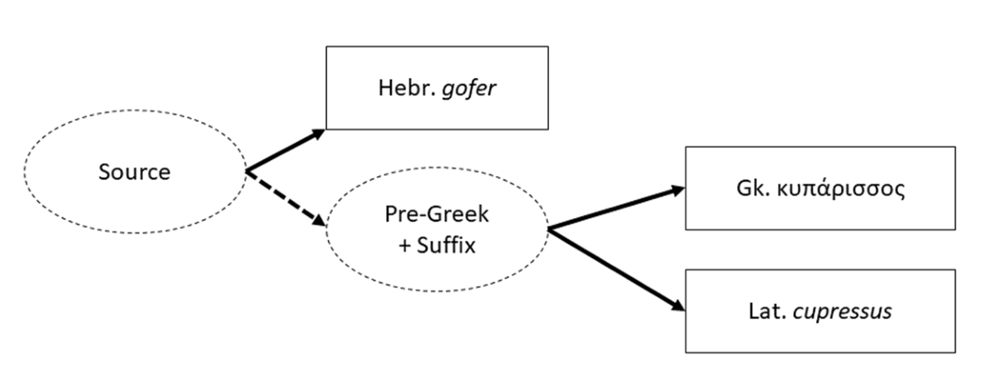

<!-- source-page: pdf-1; pdf-page: 1 -->

Unde venisti? The Prehistory of Italic through its Loanword
Lexicon
Wigman, A.M.
Citation
Wigman, A. M. (2023, November 1). Unde venisti?: The Prehistory of Italic
through its Loanword Lexicon. Retrieved from
https://hdl.handle.net/1887/3655644

Version:
Publisher's Version
License:
Licence agreement concerning inclusion of doctoral
thesis in the Institutional Repository of the University
of Leiden
Downloaded from:
https://hdl.handle.net/1887/3655644

Note: To cite this publication please use the final published version (if
applicable).

<!-- source-page: pdf-2; pdf-page: 2 -->

<!-- source-page: pdf-3; pdf-page: 3 -->

Unde vēnistī?
The Prehistory of Italic through its Loanword
Lexicon

<!-- source-page: pdf-4; pdf-page: 4 -->

Cover image: Photograph of Piedmont taken by Ettore Cauvin.

Copyright © 2023: Andrew Wigman. All rights reserved.

<!-- source-page: pdf-5; pdf-page: 5 -->

Unde vēnistī?
The Prehistory of Italic through its Loanword
Lexicon

PROEFSCHRIFT

ter verkrijging van
de graad van doctor aan de Universiteit Leiden,
op gezag van rector magnificus prof.dr.ir. H. Bijl,
volgens besluit van het college voor promoties
te verdedigen op woensdag 1 november 2023
klokke 10:00 uur

door

Andrew Michael Wigman

geboren te Voorhees (New Jersey, Vereinigde Staten)
in 1991

<!-- source-page: pdf-6; pdf-page: 6 -->

Promotores:

Prof. dr. G.J. Kroonen

Prof. dr. K. Kristiansen

Promotiecommissie:
Dr. L.C. van Beek

Dr. B. Nielsen Whitehead (University of Copenhagen)

Prof. dr. M. Peyrot

Prof. dr. M.L. Weiss (Cornell University)

This research was carried out with funding from the European Research Council (ERC)
under the European Union’s Horizon 2020 research and innovation programme (Grant
agreement No. 716732). I would also like to acknowledge the travel grant I received
from the Leids Universiteits Fonds (LUF).

<!-- source-page: pdf-7; pdf-page: 7 -->

cui dōnō lepidum novum libellum
āridā modo pūmice expolītum?

To my parents

namque vōs solēbātis
meās esse aliquid putāre nūgās.

(Adapted from Catullus 1)

<!-- source-page: pdf-8; pdf-page: 8 -->

<!-- source-page: pdf-9; pdf-page: 9 -->

vii

Table of Contents
Acknowledgements ......................................................................................................... xii
List of Figures ................................................................................................................ xiv
List of Tables ................................................................................................................. xiv
Abbreviations ................................................................................................................. xvi
1
Introduction ...............................................................................................................1
1.1
The Motivation ..................................................................................................1
1.2
Prior Research ...................................................................................................1
1.2.1
Indo-European Sources .............................................................................4
1.2.1.1
The Balkans .......................................................................................4
1.2.1.1.1
Illyrian ...........................................................................................4
1.2.1.1.2
Thracian and Macedonian .............................................................7
1.2.1.2
Indo-European Substrates ..................................................................8
1.2.1.2.1
Pelasgian .......................................................................................9
1.2.1.2.2
Temematic...................................................................................12
1.2.1.2.3
Indo-European Substrates directly involving Italy ......................13
1.2.1.2.3.1
Ribezzo’s Ausonian ...............................................................13
1.2.1.2.3.2
Haas’s Frühitalische Element ................................................14
1.2.1.2.3.3
Garnier and Sagot ..................................................................15
1.2.1.3
Verdict on Indo-European Substrates ..............................................17
1.2.2
Non-Indo-European Sources ...................................................................17
1.2.2.1
The Two Lineages ...........................................................................18
1.2.2.1.1
The Mediterranean Substrate ......................................................18
1.2.2.1.2
The European (Germanic) Substrate ...........................................20
1.2.2.2
Uniting the Lineages ........................................................................21
1.2.2.3
An Excursion on Etruscan ...............................................................25
1.3
The Consequences: Goals of this Dissertation ................................................28
1.4
Methodology ...................................................................................................29
1.4.1
Theoretical Perspective ...........................................................................29
1.4.2
How (not) to do it ...................................................................................30
1.4.2.1
Reservations about Semantic Category............................................30
1.4.2.2
Doubts about Limited Geographic Distribution ...............................32
1.4.2.3
The Requirement of Positive Evidence ............................................32
1.4.3
Terminology ...........................................................................................33
1.4.3.1
Comparanda .....................................................................................33
1.4.3.2
Substrate ..........................................................................................33
1.4.4
A Mild Disclaimer ..................................................................................34
1.5
Limitations ......................................................................................................35
1.5.1
Scope ......................................................................................................35
1.5.2
Methodological Blind Spots ...................................................................35
2
The Linguistic Data .................................................................................................39
2.1
Introduction to the Data...................................................................................39
2.1.1
Structure of the Data ...............................................................................39

<!-- source-page: pdf-10; pdf-page: 10 -->

viii

2.1.2
Structure of the Entries ...........................................................................41
2.2
Non-inherited Origin in Latin Accepted..........................................................42
2.2.1
Phonotactic Reasons ...............................................................................42
2.2.1.1
Isolated to Latin but with Unrhotacized S ........................................42
2.2.1.2
Isolated to Latin but with an Invalid Root Structure ........................46
2.2.2
Comparanda in Other Branches ..............................................................49
2.2.2.1
Non-inherited Origin is Probable .....................................................49
2.2.2.2
Non-inherited Origin is Possible .................................................... 130
2.2.3
Comparanda only in Latin and Romance .............................................. 169
2.3
Origin Unclear ............................................................................................... 176
2.3.1
No Comparanda .................................................................................... 176
2.3.2
Uncertain Comparanda ......................................................................... 185
2.3.3
Conflicting Possibilities ........................................................................ 213
2.3.3.1
Non-inherited vs. Inherited ............................................................ 213
2.3.3.2
Non-inherited vs. Loan from a Known Language ......................... 238
2.3.4
Core-Periphery Cases ........................................................................... 247
2.3.5
Methodologically Difficult to Delimit Comparanda ............................. 252
2.4
Non-IE Origin in Latin Rejected ................................................................... 259
2.4.1
No Positive Evidence of Borrowing ..................................................... 259
2.4.2
Best Explained as Inherited .................................................................. 275
2.4.3
Loan from a Known Language ............................................................. 283
2.5
Latin Index for the Data Section ................................................................... 288
3
Feature Analysis .................................................................................................... 291
3.1
Introduction to the Feature Analysis ............................................................. 291
3.2
Phonological Alternations ............................................................................. 292
3.2.1
Consonants............................................................................................ 292
3.2.1.1
Alternations between PIE Rows .................................................... 292
3.2.1.1.1
Non-Velars ................................................................................ 293
3.2.1.1.1.1
Labials ................................................................................. 293
3.2.1.1.1.1.1
Voicing ......................................................................... 293
3.2.1.1.1.1.2
Aspiration ..................................................................... 294
3.2.1.1.1.1.3
Voicing and Aspiration ................................................ 294
3.2.1.1.1.2
Dentals ................................................................................. 295
3.2.1.1.1.2.1
Voicing ......................................................................... 295
3.2.1.1.1.2.2
Aspiration ..................................................................... 295
3.2.1.1.1.2.3
Voicing and Aspiration ................................................ 296
3.2.1.1.1.3
Interim Conclusion on Labials and Dentals ......................... 296
3.2.1.1.2
Velars ........................................................................................ 297
3.2.1.1.2.1
Voicing ................................................................................ 297
3.2.1.1.2.2
Aspiration ............................................................................ 297
3.2.1.1.2.3
Voicing and Aspiration ........................................................ 298
3.2.1.1.2.4
Palatalization ....................................................................... 298
3.2.1.1.2.5
Labialization ........................................................................ 299

<!-- source-page: pdf-11; pdf-page: 11 -->

ix

3.2.1.1.2.6
Interim Conclusion on Velars .............................................. 300
3.2.1.1.3
Conclusions on the QPIE Plosive Rows.................................... 300
3.2.1.2
Alternations Beyond the Plosive Rows .......................................... 301
3.2.1.2.1
Labial Plosive ~ Labial Nasal Alternation ................................ 301
3.2.1.2.2
Labial Plosive ~ Labial Approximant Alternation .................... 303
3.2.1.2.3
L ~ R Alternations ..................................................................... 304
3.2.1.2.4
N ~ M Alternation ..................................................................... 305
3.2.1.2.5
L ~ D Alternation ...................................................................... 305
3.2.1.2.6
S ~ D Alternation ...................................................................... 306
3.2.1.2.7
D ~ K ~ Ø Alternation............................................................... 306
3.2.1.2.8
Further Irregular Involvement of a Sibilant............................... 307
3.2.1.2.8.1
S mobile ............................................................................... 307
3.2.1.2.8.2
S Insertion............................................................................ 308
3.2.1.2.8.3
SK Metathesis ...................................................................... 309
3.2.1.2.9
Gemination ................................................................................ 310
3.2.2
Vowels .................................................................................................. 312
3.2.2.1
Clearly non-IE Alternations ........................................................... 313
3.2.2.1.1
E ~ I .......................................................................................... 313
3.2.2.1.2
I ~ U .......................................................................................... 314
3.2.2.1.3
E ~ U ......................................................................................... 315
3.2.2.1.4
O ~ U......................................................................................... 315
3.2.2.2
a-Vocalism .................................................................................... 316
3.2.2.2.1
Reconstructed a-Vocalism ........................................................ 316
3.2.2.2.2
Alternations Involving A........................................................... 317
3.2.2.2.2.1
A ~ Ā ................................................................................... 317
3.2.2.2.2.2
A ~ E ................................................................................... 317
3.2.2.2.2.3
A ~ O ................................................................................... 318
3.2.2.2.2.4
A ~ AU ................................................................................ 319
3.2.2.2.2.5
A ~ U ................................................................................... 319
3.2.2.2.2.6
A ~ AI .................................................................................. 319
3.2.2.3
Wider Variation ............................................................................. 320
3.2.2.4
Ablaut Phenomena ......................................................................... 321
3.2.2.4.1
Ablaut Unparalleled in IE ......................................................... 321
3.2.2.4.2
Ablaut Difficult to Motivate from an IE Perspective ................ 322
3.2.2.4.3
Vocalic Alternations That Can Occur in Ablaut Paradigms ...... 322
3.2.3
Phonological Conclusions ..................................................................... 323
3.3
Morphological Alternations .......................................................................... 324
3.3.1
Pre-Greek Suffixes ................................................................................ 324
3.3.1.1
Latin -essus .................................................................................... 325
3.3.1.2
Latin -undo .................................................................................... 325
3.3.1.3
Latin *-ara ..................................................................................... 326
3.3.1.4
Conclusion on Pre-Greek Suffixes in Latin ................................... 326

<!-- source-page: pdf-12; pdf-page: 12 -->

x

3.3.2
The a-Prefix .......................................................................................... 326
3.3.3
The Velar Suffix ................................................................................... 328
3.3.4
The n-Suffix .......................................................................................... 330
3.3.5
Reduplication ........................................................................................ 334
3.3.6
Morphological Conclusions .................................................................. 336
4
Distribution Analysis ............................................................................................. 337
4.1
Introduction to Distribution Analysis ............................................................ 337
4.2
Partial Stratification Based on Phonology: The Most Recent Borrowings .... 340
4.2.1
Latin-Greek Isoglosses with Recurring Irregular Alternations ............. 341
4.2.1.1
Voicing and Devoicing .................................................................. 341
4.2.1.2
Aspiration Alternations .................................................................. 341
4.2.2
Wider Implications: A Mediterranean Substrate ................................... 342
4.2.2.1
Other Words with a Mediterranean Distribution ........................... 342
4.2.2.2
Balkan Connections ....................................................................... 343
4.2.2.3
Indo-Iranian Connections .............................................................. 345
4.2.2.4
Recurring Features ......................................................................... 346
4.2.2.4.1
L ~ R Alternation ...................................................................... 346
4.2.2.4.2
E ~ I Alternation ....................................................................... 347
4.2.2.4.3
I ~ U Alternation ....................................................................... 347
4.2.2.5
A Definitively Mediterranean Substrate ........................................ 348
4.2.2.6
Mediterranean Languages with a Wider Distribution .................... 350
4.3
Further Stratification Using Distribution....................................................... 351
4.3.1
Potentially Recent Borrowings ............................................................. 351
4.3.1.1
Words Exclusive to Latin and Romance ........................................ 351
4.3.1.2
Gemination .................................................................................... 352
4.3.2
Earlier Strata ......................................................................................... 352
4.3.2.1
The Oldest Loans in Italy............................................................... 352
4.3.2.2
Early Contact or Widespread Substrate? ....................................... 354
4.3.2.3
Intermediate Contact Situations ..................................................... 357
4.3.2.3.1
Stratum Excluding Greek .......................................................... 357
4.3.2.3.2
Italo-Celtic Isoglosses and the Italo-Celtic Subnode ................. 358
4.3.2.3.3
Italo-Germanic Group ............................................................... 360
4.3.2.3.4
Germanic Loans in General....................................................... 361
4.3.2.3.5
Other Groups ............................................................................. 362
4.4
A More Inclusive Visualization .................................................................... 363
4.5
Summary of Stratigraphy .............................................................................. 365
5
Semantic Analysis ................................................................................................. 367
6
Population Genetics of Italy .................................................................................. 371
6.1
Genetics Introduction .................................................................................... 371
6.2
European Genetics from the Origins of Agriculture to the Homeland Debate

371
6.2.1
Understanding the Origin and Spread of Agriculture ........................... 371
6.2.2
The Indo-European Homeland Debate ................................................. 373

<!-- source-page: pdf-13; pdf-page: 13 -->

xi

6.2.3
Refining and Overturning the Understandings...................................... 374
6.2.3.1
Building Genetic Databases ........................................................... 374
6.2.3.2
A Paradigm Shift Waiting to Happen: the Sequencing of Ancient
DNA
376
6.2.3.3
The 2015 Paradigm Shift ............................................................... 379
6.2.4
Summary ............................................................................................... 383
6.3
The Italian Peninsula ..................................................................................... 383
6.3.1
Studies on Modern Populations ............................................................ 383
6.3.1.1
The Earliest Studies ....................................................................... 383
6.3.1.2
More Modern Methods .................................................................. 384
6.3.2
Ancient DNA ........................................................................................ 386
6.3.3
Other Questions .................................................................................... 388
6.3.3.1
Greek Colonization ........................................................................ 388
6.3.3.2
Etruscans........................................................................................ 389
6.4
Conclusions ................................................................................................... 390
7
Archaeological Theories on the Italicization of Italy............................................. 391
7.1
Single Origin Theories .................................................................................. 392
7.1.1
The Copper Age Cultures ..................................................................... 392
7.1.2
Side Note: Bell Beaker and Polada Cultures......................................... 392
7.1.3
Terramare Culture ................................................................................. 393
7.1.4
Apennine Culture .................................................................................. 395
7.1.5
Urnfield Horizon ................................................................................... 395
7.2
Multiple Origin Theories and the Question of Proto-Italic Unity.................. 397
8
Conclusion ............................................................................................................. 403
8.1
Summary ....................................................................................................... 403
8.2
Discussion: Triangulating Italic Prehistory ................................................... 404
Bibliography .................................................................................................................. 413
Nederlandse Samenvatting............................................................................................. 479
Curriculum Vitae ........................................................................................................... 481

<!-- source-page: pdf-14; pdf-page: 14 -->

xii

Acknowledgements
The trajectory that has resulted in this dissertation began long ago, with the language
teachers who instilled in me the first sparks of linguistic curiosity (Tina Bechtel, Michael
Korom, Cynthia Knisley, and Gregory Toates). It was then under the aegis of Philip
Baldi at Penn State that I discovered Latin historical grammar and the field of historical
comparative linguistics. My curiosity became insatiable as I learned that, from the
balcony of Latin, one could look down upon the floorboards of Proto-Indo-European.
My teachers at the Ludwig-Maximilians-Universität, Olav Hackstein, Peter-Arnold
Mumm, Dieter Gunkel, and Filip De Decker, taught me the nuances of the architecture of
this reconstruction. When I saw the glints of something older, just barely visible from
between the floorboards, it was with Guus Kroonen and his project The Linguistic Roots
of Europe’s Agricultural Transition that I was able to begin excavating (along with the
expertise of one who has literally excavated, my second supervisor Kristian Kristiansen)
to see what sort of substrate the edifice was built upon. To all these teachers I am
grateful.
I am grateful to several other scholars from whom I have learned much along the way.
To Sasha Lubotsky, Alwin Kloekhorst, Tijmen Pronk, Lucien van Beek, Michaël Peyrot,
Maarten Kossmann, David Stifter, and Peter Schrijver, I am thankful for the
conversations and email exchanges. I will treasure the mentorship I received from
Michael Weiss and Alan Nussbaum at Cornell University along with the friends I made
there.
My research would never have proceeded without the insightful discussions on material,
methodology, and motivation with my team- and office-mates Yvonne van Amerongen,
Paulus van Sluis, Anthony Jakob, Rasmus Thorsø, Axel Palmer, and Cid Swanenvleugel.
Wonderful friends and colleagues have played a great role in making the hard work in
Leiden worth it. To the Lunch Bunch (especially Niels Schoubben, Jesse Wichers
Schreur, Ahmed Sosal, and Sophia Nauta), thank you for putting up with all the
Germanic etymologies. To Stefan Norbruis, Annika Kramer, Rasmus Puggaard-Rode,
Chams Bernard, Olga Nozdracheva, Ami Okabe, Ménghuī Shǐ, Niko Kontovas, Astrid
van Alem, Laura Smorenburg, Jiāng Wú, Priscilla Lam, Aljoša Šorgo, Davide
Procaccino, Eleonora Settembrino, Tíngtíng Zhèng, Meike de Boer, Aliza Glasbergen-
Plas, Jiāqí Wáng, Shàoyǔ Wáng, and others, thank you for the dinners, picnics, and
algemene gezelligheid. Abel Warries en Femke Montagne (translator extraordinaire),
sommige Nederlandse vogels zijn inderdaad mooier dan Amerikaanse. En stor tak til
Simon Poulsen og Tobias Søborg. Louise Skydsbjerg Friis (I, II, and III) ñi kärweñe,
thank you for always being there. Kate Bellamy, thank you for the tri-Georgian feast and
the reyt good career advice. Petra Couvée, thank you for always believing in me. Yàn
Wáng, thank you for the walks and talks. Sarah von Grebmer Zu Wolfsthurn, your
kindness and positivity has been an inspiration. Lis Kerr and Xander Vertegaal, you have
been iridium quality friends.

<!-- source-page: pdf-15; pdf-page: 15 -->

xiii

I likewise could not have done without the support I have felt from friends in more far
off places as well. Karla Gutberlet has been a constant source of strength these many
years. Paweł Ślęczka, Daniel Méndez Aranda, and Ali Karrity have helped keep me sane
through the hardest parts of being away from home. Kittipong Vongagsorn, bahu manye
mitratvam avayoḥ. Thank you Martin Riesenberg for the insightful discussions about
steppe archaeology and the methodological difficulties of comparing different lines of
evidence. Thank you Hannes Puchta, my Berlin-based book sleuth. Tori Parker, Hannah
Hoganson, Neil Hong, and Amritha Mallikarjun, my oldest friends, come what may,
thank you for keeping Downingtown free of werewolves. To Melissa DiJulio and
Deirdre Graham, I loved our weekly lockdown check-ins, and I am still ready to buy that
farm in Ireland with you.
I am also ever grateful to the support of my family. This book is dedicated to my parents,
Dr. Larry and Mrs. Lisa Wigman. I thank my brothers, Jonathan and Benjamin, my
cousins, aunts, uncles, and grandmother, who checked in with me along the way. At his
doctoral defense, Dr. Benjamin Wigman said he always thought I was smarter than he,
but even a chemist with a PhD can be wrong sometimes.
Grātia [est], in quā amīcitiārum et officiōrum alterīus memoria et remūnerandī voluntās
continētur (Cicero, de Inventione 2.53.161).

<!-- source-page: pdf-16; pdf-page: 16 -->

xiv

List of Figures
Figure 1.1 The linguistic diversity of the Italian peninsula represented by sites of
inscriptions. ...............................................................................................................2
Figure 4.1 Latin words of loanword origin distributed by existence of comparanda in
Celtic, Germanic, and Greek ................................................................................. 338
 from a source form339
Figure 4.3 Overlapping irregular alternations between words with a Mediterranean
distribution ............................................................................................................ 348
Figure 4.4 Range of Rhamnus alaternus ........................................................................ 350
Figure 4.5 Range of Ficus carica................................................................................... 350
Figure 4.6 Range of Buxus sempervirens ....................................................................... 350
Figure 4.7 Range of Cupressus sempervirens ................................................................ 350
Figure 4.8 Separate contact situations suggested by the distribution of non-inherited
lexemes .................................................................................................................. 357
Figure 4.9 One interpretation of contact incorporating Italo-Celtic considerations ....... 359
Figure 4.10 An alternative scenario with an early Italo-Celtic split and later close contact
 ............................................................................................................................... 360
Figure 4.11 PCA of loose analysis ................................................................................. 364
Figure 4.12 PCA of strict analysis ................................................................................. 365

List of Tables
Table 3.1 Alternations between *b and *p ..................................................................... 293
Table 3.2 Alternations between *bʰ and *b .................................................................... 294
Table 3.3 Alternations between *bʰ and *p .................................................................... 294
Table 3.4 Alternations between *bʰ or *b and *p .......................................................... 294
Table 3.5 Alternations between *bʰ, *b, and *p ............................................................. 295
Table 3.6 Alternations between *d and *t ...................................................................... 295
Table 3.7 Alternations between *dʰ and *d .................................................................... 295
Table 3.8 Alternations between *dʰ and *t..................................................................... 296
Table 3.9 Alternations between *g and *k ..................................................................... 297
Table 3.10 Alternations between *gʰ and *k .................................................................. 298
Table 3.11 Alternations between *gʰ or *g and *k ......................................................... 298
Table 3.12 Alternations between *gʰ, *g, and *k ........................................................... 298
Table 3.13 Alternation between *b(ʰ) and *m ................................................................ 301
Table 3.14 Alternation between *p, *b (/*bʰ), and *m ................................................... 301
Table 3.15 Alternations between *b(ʰ) and *mb(ʰ) ........................................................ 302
Table 3.16 Alternation between *bʰ, *b, and *u̯  ............................................................ 303
Table 3.17 Alternation between *b and *u̯  .................................................................... 303
Table 3.18 Group A alternations between *l and *r ...................................................... 304
Table 3.19 Group B alternations between *l and *r ...................................................... 305

<!-- source-page: pdf-17; pdf-page: 17 -->

xv

Table 3.20 Group C alternation between *l and *r ........................................................ 305
Table 3.21 Alternations in the order of sibilant and velar in clusters ............................. 309
Table 3.22 Alternations in gemination ........................................................................... 312
Table 3.23 Alternations between *e and *i .................................................................... 313
Table 3.24 Alternation between *i and *u ..................................................................... 314
Table 3.25 Alternations between *ī and *ū .................................................................... 314
Table 3.26 Alternation between *e and *u..................................................................... 315
Table 3.27 Alternations between *o and *u ................................................................... 315
Table 3.28 Alternation between ō and ū ........................................................................ 315
Table 3.29 Alternation between ō and u ........................................................................ 315
Table 3.30 Alternations between *e and *o ................................................................... 322
Table 3.31 Alternations between *e and *ø ................................................................... 323
Table 3.32 Alternating presence of an n-suffix .............................................................. 332
Table 4.1 Consonantism correspondences between Germanic and other branches ....... 361

<!-- source-page: pdf-18; pdf-page: 18 -->

xvi

Abbreviations
General
ca.
circa, around/approximately
cf.
confer, compare
dial.
dialectal
dim.
diminutive
e.g.
exempli gratia, for example
esp.
especially
et al.
et alii, and others
et alib.
et alibi, and elsewhere
etc.
et cetera, and so on
fn.
footnote
fthc.
forthcoming
id.
idem, the same
p.c.
personal communication
pg., pp.
page, pages
s.v.
sub verbo, under the entry
var(s).
variant(s)
with lit.
with literature
Dates
BCE
Before the Common Era (BC)
c.
century
CE
Common Era (AD)
Languages
Aeol.
Aeolic (Greek)
Akk.
Akkadian
Alb.
Albanian
Att-Ion.
Attic-Ionic (Greek)
Arab.
Arabic
Aram.
Aramaic
Arcad.
Arcadian (Greek)
Arm.
Armenian
Av.
Avestan
Boeot.
Boeotian (Aeolic Greek)
Bret.
Breton
Bulg.
Bulgarian
Cat.
Catalan
Cl. Arab. Classical Arabic
CLuw.
Cuneiform Luwian
Copt.
Coptic
Dan.
Danish
Du.
Dutch
Egypt.
Egyptian
Engl.
English
Etr.
Etruscan
Fal.
Faliscan
Far.
Faroese
Fr.
French
Georg.
Georgian
Ger.
German
Gk.
Ancient Greek
Go.
Gothic
Hebr.
Hebrew
Hitt.
Hittite
HLuw.
Hieroglyphic Luwian
Hsch.
Hesychian (gloss in Greek)
Hurr.
Hurrian
Icel.
Icelandic
IE
Indo-European
It.
Italian
Kartv.
Kartvelian
Khot.
Khotanese
Lat.
Latin
Latv.
Latvian
LCo.
Late Cornish
Lith.
Lithuanian
Lyd.
Lydian
Mac.
Macedonian
MBret.
Middle Breton
MBulg.
Middle Bulgarian
MDu.
Middle Dutch
ME
Middle English
MHG
Middle High German
MIr.
Middle Irish
MoDu.
Modern Dutch
MoGk.
Modern Greek
MoP
Modern Persian
MP
Middle Persian
MW
Middle Welsh
Myc.
Mycenaean (Greek)
Nw.
Norwegian
OBret.
Old Breton
ODan.
Old Danish
OE
Old English
OGeorg. Old Georgian
OHG
Old High German

<!-- source-page: pdf-19; pdf-page: 19 -->

xvii

OLG
Old Low German
ON
Old Norse
OP
Old Persian
OPol.
Old Polish
OPr.
Old Prussian
OProv.
Old Provençal
OPt.
Old Portuguese
ORu.
Old Russian
Osc.
Oscan
OSum.
Old Sumerian
OW
Old Welsh
PAlb.
Proto-Albanian
PArm.
Proto-Armenian
PBalt.
Proto-Baltic
PBerb.
Proto-Berber
PBSl.
Proto-Balto-Slavic
PCelt.
Proto-Celtic
PEBalt.
Proto-East Baltic
PGk.
Proto-Greek
PGm.
Proto-Germanic
Phoen.
Phoenician
PIE
Proto-Indo-European
PIIr.
Proto-Indo-Iranian
PIr.
Proto-Iranian
PItal.
Proto-Italic
Pol.
Polish
PRom.
Proto-Romance
Prov.
Provençal
PSem.
Proto-Semitic
PSlav.
Proto-Slavic
PU
Proto-Uralic
PVasc.
Proto-Vasconic
Pt.
Portuguese
Rom.
Romanian
Ru.
Russian
RuCS
Russian Church Slavonic
Sard.
Sardinian
SCr.
Serbo-Croatian
Serb.
Serbian
SGael.
Scottish Gaelic
Slk.
Slovak
Slov.
Slovene
Sogd.
Sogdian
Sp.
Spanish
SPic.
South Picene
Sum.
Sumerian
Sw.
Swedish
Syr.
Syriac
Thess.
Thessalian (Aeolic Greek)
Toch. A
Tocharian A
Toch. B
Tocharian B
Turk.
Turkish, Turkic
U
Umbrian
Ugr.
Ugaritic
Ved.
Vedic Sanskrit
W
Welsh
YAv.
Young Avestan

Grammar
abl.
ablative
acc.
accusative
adj.
adjective
dat.
dative
fem.
feminine
fut.
future
gen.
genitive
indecl.
indeclinable
inf.
infinitive
loc.
locative
masc.
masculine
neut.
neuter
nom.
nominative
obl.
oblique
pass.
passive
pl.
plural
PPP
 perfect passive participle
pres.
present
sg.
singular
subj.
subjunctive

<!-- source-page: pdf-20; pdf-page: 20 -->

xviii

Archaeo-Genetics
ANE

Ancient North Eurasian (ancestry component)
calBCE
Calibrated radiocarbon date
CHG

Caucasus Hunter-Gatherer (ancestry component)
EEF

Early European Farmer (ancestry component)
EHG

Eastern Hunter-Gatherer (ancestry component)
LBK

Linearbandkeramik Culture
mtDNA
Mitochondrial DNA
WHG

Western Hunter-Gatherer (ancestry component)
Symbols
?

(appurtenance) uncertain
<

is from
>

develops to
>>

is borrowed as
~

alternates with
§

heading number (of this thesis)
< >

graphical element
/ /

phonemic transcription
Phonological Cover Symbols (in text; not in header reconstructions)
C

consonant
Ci

identical consonant
D

voiced stop
Dʰ

voiced aspirated stop
H

laryngeal
R

resonant
T

unvoiced stop
V

vowel
