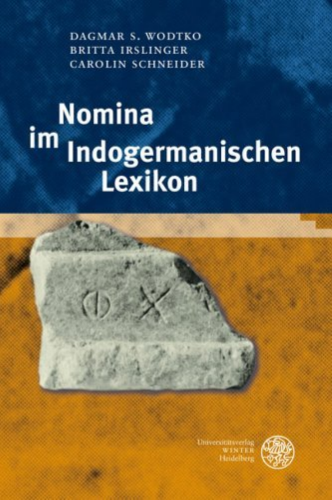

# Preliminaries, Contents, Introduction, and Abbreviations

<!-- pdf-page: 1 -->

<!-- pdf-page: 2 -->

DAGMAR S. WODTKO
BRITTA IRSLINGER
CAROLIN SCHNEIDER

Nomina
•
1m
Indogermanischen
Lexikon

Universitätsverlag
WINTER
Heidelberg

<!-- pdf-page: 3 -->

Bibliografische Information der Deutschen Nationalbibliothek
Die Deutsche Nationalbibliothek verzeichnet diese Publikation
in der Deutschen Nationalbibliografie;
detaillierte bibliografische Daten sind im Internet
über http.J/dnb.d-nb.de abrufbar.

Gedruckt mit Unterstützung
der Deutschen Forschungsgemeinschaft.

UMSCHLAGBILD

Fragment einer kariscben Inschrift aus Saqqära.
Aus: Carian Inscriptions from Nortb Saqqära and Buhen by Olivier Masson
with contributions by Geoffrey Thomdike and Richard Vaugban Nicbolls,
Texts from Excavations,
Ftfth Memoir Egypt Exploration Society 1978, Plate XXVI, No. 4-48a.
Courtesy ofThe Egypt Exploration Society.

Diese~ Werk einschließlich aller seiner Teile ist urheberrechtlich geschützt. Jede Verwertung
außerhalb der engen Grenzen des Urheberrechtsgesetzes ist ohne Zustimmung des
Verlages unzulässig und strafbar. Das gilt insbesondere rur Vervielfältigungen,
Übersetzungen, Mikroverfilmungen und die Einspeicherung
und Verarbeitung in elektronischen Systemen.
© 2008 Universitätsverlag Winter Heidelberg GmbH
Imprime en Allernagne' Printed in Gerrnany
Druck: Memrninger MedienCentrum, 87700 Memmingen
Gedruckt auf umweltfreundlichem, chlorfrei gebleichtem
und alterungsbeständigem Papier

Den Verlag erreichen Sie im Internet unter:
www.winter-verlag-hd.de

<!-- pdf-page: 4 -->

Vorwort

Dieses Buch legt Ergebnisse vor, die überwiegend in dem von Prof. Dr. E. Tichy geleiteten
Freiburger Projekt "Indogermanisches Nomen" gewonnen wurden. Das Projekt wurde von
der Deutschen Forschungsgemeinschaft von 2000 bis 2006 gefördert. Es war ursprünglich
als lexikonartige Darstellung der indogermanischen Nominalbildung geplant, der eine
theoretischen Aufbereitung der Grammatik des indogermanischen Nomens zur Seite
stehen sollte. Letztere wurde nicht verwirklicht. Somit ist hier lediglich eine AuswaW des
Lexikonmaterials in möglichst theoriefreier Darstellung präsentiert, die hoffentlich auch
allein einen Einblick in indogermanische Nominalbildung vermitteln kann.
Im Freiburger Projekt waren außer den hier vertretenen Autoren zu verschiedenen Zeit-
räumen auch Douglas Fear, Stefan Gierschner, Katharina Kupfer, Reinhold Plöchl und
Stefan Schumacher als Mitarbeiter bei der Materialaufnahme beschäftigt. Lemmata sind
jedoch allein von den Unterzeichneten, Britta Irslinger (BI), Carolin Schneider (CS) und
Dagmar S. Wodtko (DSW) verfaßt worden, die jeweils die alleinige Verantwortung für
den Inhalt ihres Lemmas übernehmen. Die allgemeine Struktur des Lemma-Aufbaus
wurde von D.S. Wodtko in Anlehnung an die Konzeption des LIV für das Indoger-
manische Nomen entworfen.) Die Arbeit von DSW und CS an ihren Lemma-Einträgen
war bereits im Oktober 2006 abgescWossen; Sekundärliteratur, die uns nach Dezember
2006 zugänglich geworden ist, konnte nur noch in Ausnahmefällen berücksichtigt werden.

zahlreiche Kolleginnen und Kollegen haben uns bei der Arbeit am Indogermanischen
Nomen durch Hinweise, Auskünfte und Bereitstellung von Literatur unterstützt. Unser
herzlicher Dank gilt dafür Vaclav Blaiek, Carla Bruno, George Dunkel und seinem LIPP-
Team, Frank Heidermanns, Eugen HilI, Harry A. Hoffner Jr., Daniel Kölligan, Jenny
Larsson, Ranko Matasovic, Torsten Meißner, Peter-Arnold Mumm, Rosa Ronzitti, Stefan
Schaffner, Xavier Tremblay, Michiel de Vaan, Sabine Ziegler und ganz besonders Antje
Casaretto und H. Craig Me\chert, die zahllose Fragen mit unermüdlicher Geduld
beantwortet haben.
Prof. H. Hettrich hat das Freiburger Projekt vor den Unbillen der Fünfjahresgrenze
gerettet und freundlichen Zugang zu seinem Institut gewährt; Prof. St. Zimmer hat
großzügig die Benutzung seiner Bibliothek erlaubt; Arbeitstreffen mit Prof. R. Lühr und
ihren Mitarbeitern Irene Balles und Joachim Matzinger sowie Sabine Häusler boten will-
kommene Anregungen für das Indogermanische Nomen.

I Die Länge des Anmerkungsteils in einigen Lemmata hätte vielleicht die Zusammenfassung in

einem gesonderten Anmerkungsband gerechtfertigt; dieser Vorschlag ist jedoch bei einem Teil der-
Projektmitglieder auf Ablehnung gestoßen.

<!-- pdf-page: 5 -->

Dank gilt auch G. Borsch für umfangreiche Korrekturhilfen sowie U. Müller und P.-A.
Mumm für Beistand in technischen Fragen.
Wir danken der Deutschen Forschungsgemeinschaft für die Finanzierung dieser Arbeit,
Prof. E. Tichy gilt unser Dank für die Aufnahme in ihren Mitarbeiterstab und für nützliche
Hinweise besonders in indo-iranischen Fragen.
Unser Text wurde in der Schriftart Titus Cyberbit Basic geschrieben, die beim Frankfurter
Indogermanistik-Server http://titus.uni-frankfurtdezugänglich ist.
Der Universitätsverlag Winter hat kompetent und freundlich unsere Publikation voran-
gebracht, wofür ihm auch an dieser Stelle gedankt sei.
Wir danken U1i, Fabien und Luca und für Geduld.

DSW,BI,CS

<!-- pdf-page: 6 -->

Inhalt

Vorwort                                            :                         .    ........ V
Inhalt                                                                       . ...... VII
Einleitende Bemerkungen                '"                                    . .... XIII
Abkürzungen für Sprachen                                                     .        XXXI
Abkürzungen für grammatische und sonstige metasprachliche Termini            . XXXIII
Allgemeine Abkürzungen                                                       . XXXIV
Abkürzungen in Belegangaben                                                  .    XXXV
Abgekürzt zitierte Literatur                                                 . XXXIX

Nomina im indogermanischen Lexikon

* bhag_ 'als Anteil bekommen'                                                .   ..       1
* b hah2/!-{0-) 'Buche'                                                       .   ......... 2
*bhaJ(s)dh-olahr'Bart'                                                    . ......... 4
*bheg- 'brechen'                                                         .  ......... 6
*bhehr 'glänzen, leuchten, scheinen'                                     . ......... 7
*bhejd- 'spalten'                                                        .               11
*bhejdIJ.. 'sich anvertrauen, Vertrauen fassen'                                        . 12
*bhengIJ.. 'dicht, fest machen'                                              .          13
*bher- 'tragen, bringen'                                                 .              15
*bhergIJ.. 'hoch werden, sich erheben'                                   . ....... 30
* bhes- 'reiben, fegen'                                             ,    .       ..     34
*bheydIJ.. 'wach werden, aufmerksam werden'                               .       ..     36
*bbrah2 ter- m. 'Bruder'         '"                                           . ....... 38
* bhruH- f. 'Braue'                                                       .       ....... 41
*bhsehr 'abreiben, zerkleinern'                                          ..       ....... 45
*bbyehr 'wachsen, entstehen, werden'                                     .        ....... 46
*dajycr- m. 'Gattenbruder, Schwager'                                     .. ....... 58
* deh3 -'geben'                                                           . ....... 60
*dei- 'hell (sein), scheinen'                                            .. ....... 69
*denk- 'beißen'                                                          ..       ....... 82
* dbalh r 'herausquellen, hervorsprießen'                                 . ....... 83
* dheb b- 'vermindern'                                                   .        ....... 85
*dbCgIJ..om-f. 'Erde'                                                    .. ....... 86
* dheh r 'stellen, legen, setzen; herstellen, machen'                     . ....... 99

<!-- pdf-page: 7 -->

VIf!

* dbehIk- 'machen, herstellen'                              . ..... 117
* dbejgb- 'bestreichen, kneten'                        ..             118
* dbejH- 'ins Auge fassen'                                  .         120
*dbers- 'Mut fassen'                                        .         120
* dbe!!b- 'tief                                             .         122
* dbohrnahr 'Getreide(kömer)'                               .         125
*dbughzter-f. 'Tochter'                                ..        ..... 126
* dbpor- f. 'Tür, Türflügel'                                .    ..... 130
*gemH- 'heiraten'                                      ..        ..... 136
*genhr 'erzeugen'                                       .. ..... 139
*gnehr 'erkennen'                                           .    ..... 154
*gb6j-om- 'Winter, Schnee'                                  . ..... 162
*gbes- *'fassen?' 'Hand', 'Griff                            . . 170
*gbost(hz)i- 'Fremder'                                  .       .     173
*gPeh:r 'den Fuß aufsetzen, treten'                    ..        .    174
*gPem- '(wohin) gehen, kommen'                         ..        ..   175
*gPen-, *gI{e)n(a)h:rf. 'Frau'                         ..        .    177
*g'1ehr 'leben'                                         ..       ..... 185
*gPop- f. und m. 'Kuh, Rind'                           ..       ..    189
*gPrd- 'langsam, träge'                                ..       .. 195
*gPber- 'warm werden'                                   .       ..... 196
*HeHk- 'schnell'                                      ..        ..... 200
* Hem- 'roh; bitter (?)'                               ..       ..... 202
*(H)jenhzter- 'Gattin des Mannesbruders'                . ..... 204
* HosgP- 'Knoten, Auswuchs'                            .. ..... 207
*hIed- '(beißen -+) essen'                            ..        ..... 208
* hIej- 'gehen'                                         . ..... 220
* hIekljo- m., f. 'Pferd'                               . ..... 230
* hler-, • hIer-i- 'Lamm, Ziege, Bock'                  .       .. ... 233
*hIcs- 'dasein, sein'                                ..        ..... 235
* hIes-u- 'gut'                                         .       ..... 239
* hIJengPb. 'sich mühelos bewegen'                     ..       ..... 243
*hIJeljdb. 'steigen, waohsen'                         .        .. ... 245
*h]ors-o-m. 'Arsch'                                    .        ..... 246
* hIpeh:r 'verlassen, aufgeben; ablassen, aufhören'    ..       ..... 248
*hIperH- 'breit, weit, geräumig'                       .       ..    250
*hIljes- 'gut'                                        ..        ..    253
*hzaj-r, *hzaj-en- n. 'Tag, Morgen'                     . ..... 258

<!-- pdf-page: 8 -->

IX

*h:zaks- '(Drehpunkt:) Achse, Achsel'                         .     .    259
*h:zeb-{ e/O)/- m. 'Apfel; Apfelbaum'                         .     .    262
* h:zeg- 'treiben'                                           ..     ..   267
* h:zel~U- n. 'Leben, Lebenszeit, -erwartung'                 .     .    277
* h:zek- 'scharf, spitz (sein / werden / machen)'             .     ..... 287
* h:zemgb.. '(zu)schnüren' -+ 'beengen'                        .    ..... 301
* h~n-r(1n-) n. 'Eingebung, Anschauung, innere Sicht'         .     ..... 303
*h:zenHth;r f. 'Türpfosten'                                    .    ..... 306
*h:zenh r 'atmen'                                              .     ..... 307
*h:zep- f. 'Wasser, fluß'                                      .     ..... 311
*h:zerg- 'weiß, hellglänzend, (blitz-)schnell'                .      ..... 317
*h:zerhr 'aufbrechen, pflügen'                                .     ..... 322
* h:ze/lg- 'stark werden'                                     .     .   328
* h211t5r- m. 'Mann'                                          .. .. 332
*h;J6f!-i- m., f. 'Schaf   :                                   .. ..... 335
*h:zOfIS-oS- n. 'Ohr'                                         .. ..... 339
~r..
*h'1ILAo-m.,. f 'B"ar,                                       .. ..... 343
*h;zSc/ls- 'trocken werden'                                   . .. 345
* h;zStir-, *h;zStcr- • f. 'Stern'                            . .. 348
*h2vcks- '(heran)wachsen, groß werden'                         . ..... 354
*h2vcrs- 'regnen'                                             . ..... 356
* h2vcs- '(morgens) hell werden'                             .. ..... 357
*h2uks-i/6n- m. 'Stier, Ochse'                                 . ..... 368
*h;ejgb.. '(fort)gehen'                                         . ..... 370
*h;eJcll- 'ins Auge fassen, erblicken'                   :      . ..... 370
*h.J11lcjgb.. 'hamen'                                        .. ..... 384
*hjIlcbb.. 'Nabel; Nabe'                                       . ..... 385
*h:ftihrs-, *h:JJres-osn. 'Mund'                              . ..... 387
*h:ftiyst-o- 'Mund, Lippe'                                   .. ..... 390
*jchJS- 'gürten'                                               . ..... 391
*je! ok~-rI n- n. 'Leber'                                      . ..... 392
*jct- 'sich (fest) hinstellen'                               .. ..... 395
*jCllg- 'anschirren'                                           . ..... 397
*jellH-r-, *juH-r- n. 'Wasser'                               .. ..... 404
*j(c)uHs-n. 'Brühe, Suppe'                                    .     ..... 405
*jcllhr 'Getreide; Gerste'                                    .     ..... 407
* kas- 'grau; Hase'                                           .     ..... 410
*keh:i;.) .. 'schärfen'                                      .      ..... 411

<!-- pdf-page: 9 -->

x

* ke!okv-rin- n. 'Kot, Exkrement'             '"        .      ..... 413
* kel- 'warm werden'                                        . ..... 414
* kelH- 'kalt werden, frieren'                              . ..... 416
* kir, krd- /n. 'Herz'                                   .      ..... 417
* keJ(I-l)- 'scheißen'                              .          ..... 423
* kepbb.. 'schön werden / sein'                          .      ..... 424
* ide!J- 'hören'                                         .     ..... 425
* ide!Js- '(zu)hören'                                    . ..... 432
* kvejt- 'hell aufleuchten'                                 . ..... 434
* k( u)!Jon- m., f. 'Hund'                              .      ..... 436
*kor-o- 'Krieg', *kor-jo- 'Männerbund'                   .     ..... 440
*kreyhr 'Blut außerhalb des Körpers'                 ..        ..... 444
* kusdb(hJ)- 'etwas Verborgenes'                         . ..... 448
* legb.. 'leicht, gering, klein'                    ..         ..... 450
*lejkV- 'zurücklassen, sich entfernen von'           ..        ..... 451
*lejp- 'kleben bleiben'                                  . ..... 453
* mad- 'naß sein / werden'                               . ..... 455
*mah2 ter- f. 'Mutter'                               ..        ..... 457
1. * masd- 'fett sein / werden'                      ..        ..... 461
2. • masd- 'Stange, Mast'                                . ..... 463
*med- 'voll werden, satt werden'                       .      ..... 463
*medb.. 'mittlerer'                                 .         ..... 465
*medbu- n. 'Met, Honigwein'                         .         ..... 467
*meg- 'groß'                                           .      ..... 468
*meh2k- 'lang'                                         . ..... 478
* mejk- 'mischen'                                   ..         ..... 481
* meld- 'weich werden'                               .         ..... 482
* meldlJ.. 'ablassen von, im Stich lassen'          ..         ..... 485
*me(m)s-n. 'Fleisch'                                     . ..... 486
*mer- 'verschwinden, sterben'                       .         ..... 488
*me!Jd- 'in Freude geraten'                        ..         ..... 491
*mis-dbhro- 'Lohn, Belohnung'                      ..         ..... 492
*mp(s)db(e)hr 'den Sinn (auf etw.) richten'         .         .. ... 493
*mojs- 'Schaffell'                                  .         ..... 496
*mregb.. 'kurz'                                     . ..... 497
*nebb.. 'feucht, bewölkt, dunstig (werden)'        .         ..... 499
1. * neg V- 'dunkel werden, dämmern'                 . ..... 504
2. *negV- 'nackt'                              '"   .          ..... 513

<!-- pdf-page: 10 -->

XI

*nehru- f. 'Schiff, Boot'                                        . ..       515
*nejgY- 'waschen'                                                . .        519
*nepot-m. 'Neffe; Enkel, Nachkomme'                              . ..... 520
*ney- 'neu'                                                      .     .    524
*ped- 'treten; fallen, sinken'                                   .     ..   526
*peh2 yerln-n. 'Feuer'                                           . ..... 540
1. *pejg- 'malen'                                               .     ..    545
2. *pejg- 'verdrießen'                                           .    ..    546
*pejI- 'heraushauen, herausschneiden'                            . ..       546
*pe/(Y- 'reif machen, gar machen'                               .     .     548
*p.. e)r-sthr 'etwas Hervorstehendes'                        .        ..    552
*peyI-f. 'Nadelbaum; Kiefer, Fichte'                            .     .     553
*ph2ter- m. 'Vater'                                              . .. 554
*plehr 'flach, breit'                                            . ..... 562
*plethr 'breit werden, sich ausbreiten'                       .        ..    564
*pp.tlv)stJ~ 'Faust'                                          .        ..    566
*prejH- 'vertraut, lieb sein / werden'                        .        ..    568
*regY- 'dunkel'                                               .        .     573
*res- 'Tau'                                                   .        .     574
*ret- 'laufen'                                                .        ..    575
*(hl)reydb- 'rot machen'                                      .        ..... 580
*(hl),s-en- 'männlich, männliches Tier'                       . ..... 584
*sal- 'Salz'                                                 .        ..... 586
*sed- 'sich setzen'                                 '"        . ..... 590
* segb.. 'überwältigen, in den Griff bekommen'                . ..... 600
*seg- 'heften, anheften'                                  .           ..... 604
*seh2 yeUn-n. 'Sonne'                                     .           ..... 606
*sel- 'scWeichen'                                             . .. ... 611
*selp- 'Öl, Fett'                                             . ..... 612
*sen- 'alt'                                               . ..... 613
*sendbh r 'sich absetzen, absondern, ausscheiden'         . ..... 615
*set- 'gut, wahr sein'                                        . ..... 616
*seyH- 'gebären'                                          .           ..... 617
* skbejd- 'spalten, abtrennen, zerreißen'                    . ..... 619
* skabb.. 'kratzen, schaben'                              . ..... 621
*smer- 'eine schmierige Substanz: Mark, Fett'             . ..... 622
*snejgYb- 'kleben bleiben'                               .            ..... 622
*snus-o- f. 'Schwiegertochter'                           ..           ..... 625

<!-- pdf-page: 11 -->

XII

"sok-rfn- 'Kot, Exkrement'                                .         ..... 626
"(s)pend-'spannen'                                       ..         ..... 628
*(s)reg- '(sich) färben'                                  ..        ..... 629
"srelj- 'fließen, strömen'                                    . ..... 630
"srillg'- 'frieren, schaudern'                                . ..... 634
*(s)teg- 'decken, bedecken'                              ..     ..... 634
*stehr 'wohin treten, sich hinstellen'                        . ..... 637
"(s)tejg-'stechen, spitz sein'                           ..      ..... 660
*stel- 'hinstellen, bereit machen'                       ..     ..... 662
"stelb- 'Pfosten'                                         . ..... 665
"stelg- 'helVoTStehen(d), starr (atifragen)'             ..     ..... 666
*sljedbh r 'sich selbst als I für, zu etw. bestimmen'    . ..... 667
*syehzd- 'schmackhaft werden'                           .. ..... 670
*spekp.p/jer-'Schwieger-'                                 . ..... 672
*spep- 'einschlafen'                                         . ..... 675
*syesor- f. 'Schwester'                                 ..     ..... 680
1. • suB- f., m. 'Schwein, Sau'                          ..     ..... 683
2. • suH- 'Sohn'                                          .     ..... 686
*ten- 'sich spannen, sich dehnen'                        .     ..... 690
*tenhr 'dünn; ausgestreckt'                              . ..... 694
*tep- 'warm sein, heiß sein'                            .. ..... 698
*ters- 'vertrocknen; durstig werden'                     .     ..... 701
*te/js- 'leer sein I werden'                             . ..... 704
*treb- 'von Menschen besiedelter Ort; Wohnstätte'       ..     ..... 705
*ped- 'quellen'                                          . ..... 706
*pehrr-, ·uhrr-n. Wasser'                                .. ..... 715
*/jejd- 'erblicken'                                       . ..... 717
1. • /jers- 'männlich, männliches Tier'                  .. ..... 722
2. • pers- 'sich erheben, hochkommen'                    .. ..... 724
*ljiH-ra- (m.) Junger, kräftiger (Mann)'                 . ..... 726
*Ijrdb..6-, • Ijordb..o- Wort'                          ..     ..... 729

Index der einzelsprachlichen Wortformen                         .      733

<!-- pdf-page: 12 -->

Einleitende Bemerkungen

§ 1 Dieses Buch präsentiert eine Anzahl von indogermanischen Nomina - Substantiven und
Adjektiven - unter etymologischen Aspekten. Verdeutlicht wird, wie Nomina der älteren
indogermanischen Einzelsprachen in ihrem semantischen Kern und in ihrer Bildeweise
sprachliche Charakteristika fortsetzen, die für die urindogermanische Grundsprache er-
schlossen werden können. Zur Darstellung dieses Verhältnisses sind einzelsprachliche
Wörter lautlich auf eine urindogermanische Form zurücktransponiert. Die Wortbildung wird,
soweit möglich, durch Bindestriche an Morphemgrenzen kenntlich gemacht.
Indogermanische Sprachen haben im Nominalbereich, wie in allen anderen sprachlichen
Bereichen, eine Reihe von Eigenschaften aus dem Urindogermanischen ererbt. Zum Teil
handelt es sich hierbei um Wörter, die in verschiedenen Sprachen schlicht über die Jahr-
tausende hinweg bewahrt blieben, um Substantive wie *ph:Jler- 'Vater' oder um Adjektive wie
*nepos 'neu'. Ein deutlich größerer Anteil von sprachlicher Information ist jedoch nicht un-
verändert in solchen Wörtern fortgesetzt. Große Teile des Lexikons unterliegen in der
Sprachentwicklung ständig der Erneuerung, indem etwa ältere Formen durch neue, pro-
duktive Muster ersetzt werden. Auch hier weisen aber die Einzelsprachen Gemeinsamkeiten
im Bestand dieser Muster auf. Einzelsprachliche nominale Wortbildungstypen lassen sich in
beträchtlicher Zahl auf grundsprachliche Wortbildungsmuster zurückführen. Die Basis, auf
die die Wortbildung angewendet wird, ist häufig eine Wurzel oder ein Stamm, wofür urindo-
germanisches Alter gleichfalls in Anspruch genommen werden kann. Die ererbte Gemein-
samkeit, das "Indogermanische" an indogermanischen Nomina, äußert sich somit nicht selten
in der identischen Verbindung ein und desselben lexikalischen Grundelernents mit immer
gleichen derivativen Mitteln. Diese Identität des Kerns von indogermanischen Wortschätzen
wird hier anhand von ausgewählten Nominalbildungen illustriert.

§ 2 Gemäß der Natur der Derivationsbasis lassen sich Nomina in verschiedene Gruppen auf-
teilen. Die Basis kann, wie z.B. im Falle von * hftko- 'Bär', ein Stamm sein, der selbst wort-
fähig ist und keine weitere grundsprachliche Analyse bzgl. einer morphologischen oder
semantischen Grundform mehr voraussetzt. Sie kann andererseits für verschiedene Mit-
glieder des Lexikons verfügbar sein, wobei keine Beschränkung auf nominale Mitglieder be-
steht. Das ist bei einer großen Menge der hier verzeichneten Nomina der Fall. Z.B. läßt sich
ein Adjektiv wie *neyos 'neu' als Ableitung von einer Partikel *nu 'nun' verstehen, ähnlich
sind etwa Formen wie gr. EvtapCl 'Eingeweide', ved. fvant- 'so groß' auf adverbiale oder pro-
nominale Basen rückführbar. Nominalformen zu solchen Basen wurden hier nur in kleiner
Zahl verzeichnet, da ihnen in G. DUNKELS Lexikon der indogermanischen Partikeln und

<!-- pdf-page: 13 -->

XIV

Pronomina eine spezifische Behandlung zukommt.' Verzichtet wurde weitgehend auch auf
die Berücksichtigung von Numeralia, die nominal sein können oder die Basis für Nomina
darstellen können, jedoch ein eigenes Subsystem stellen, das geschlossen betrachtet werden
sollte. Somit sind zwar Wörter für '1000' (ved. sahasra- usw.) im Rahmen ihrer Wortsippe
*gbes- behandelt, nicht jedoch nflminale Bildungen von strikt numeralen Basen.

§ 3 Es bleiben zahlreiche Fälle, wo Nomina als Ableitungen von einer Wurzel angesehen
werden können, die nach Abtrennung eines bekannten Wortbildungselementes als ihre
semantische und morphonologische Basis erkennbar ist. Die Segmentierung einer Wurzel ist
dank der Kenntnis der uridg. Wurzel- und Suffixstruktur zwar nicht für alle, doch bei weitem
für die Mehrzahl der Beispiele möglich.2
Die meisten Wurzeln liefern mehr als eine nominale Ableitung, viele können darüber hinaus
auch Verbalbildungen zulassen. Sie stellen also dem Lexikon mehr oder weniger umfang-
reiche Wortfamilien zur Verfügung, die in Einzelsprachen reduziert oder ausgebaut werden
können. Lemma-Einträge, die auf eine Wurzel Bezug nehmen, können daher ggf. recht um-
fangreich sein.
Auch die indogermanische Wurzel ist bekanntlich, allein mit Flexionsendungen versehen,
wortfähig, sie kann grundsätzlich als Verb - im Präsens- oder Aoriststamm - und als Nomen
fungieren, und während die gleichzeitige Existenz von Wurzelpräsens und Wurzelaorist aus
Gründen der Abgrenzung ausgeschlossen scheint,3 ist das Vorhandensein eines Wurzel-
nomens neben einer Wurzelbildung beim Verb geläufig, wobei das Wurzelnomen über-
wiegend als abstrakte (Nomen actionis / rei actae) oder agentive (Nomen agentis) Nominali-
sierung des Verbs angesehen werden kann.4

1 Ein Vorabdruck des UPP, den G. DUNKEL dem Freiburger Projekt großzügig zur Verfügung ge-

stellt hat, ist hier intensiv benutzt, soweit relevantes Material behandelt wurde.
2 Vgl. zur uridg. Wurzelstruktur LIV Sf.

3 Zu möglichen Ausnahmen s. J.A HARDARSON, Studien zum urindogermanischen Wurzelaorist und

dessen Vertretung im Indoiranischen und Griechischen, Innsbruck (1993), 59fl. und KÜMMEL, HS
111 (1998), 191ff.
*Wurzelnomina in agentivischer Funktion sind auf die Verwendung als Kompositionshinterglieder
konzentriert, s. SCARLATA 756f. Beispiele für Simplicia sind einzelsprachlich selten und dann ver·
mutlich sekundär entstanden. Für das Urindogermanische ist der Typ kaum rekonstruierbar, allenfalls
lassen sich vereinzelte Fälle als bereits grundsprachlich aus den Komposita abstrahiert verstehen.
Solche Hinterglieder sind "pseudo-adjektivisch", d.h. im Stande als Attribute sowohl mit maskulinen I
femininen als auch mit neutralen Bezugswörtem zu kongruieren. Aufgrund der agentiven Bedeutung,
die sich häufig auf eine (mask.) Person bezieht, sind jedoch Neutra selten, appositive oder sub-
stantivische Verwendung ist häufig. Wurzeladjektive sind abgesehen von solchen Nominalisierungen
kaum zu finden, die Bildeweise war offenbar durch Wurzelverben und substantivische Wurzelnomina
bereits ausgelastet. Denkbar ist allenfalls auch, daß hier eine stärkere formale Restriktion in Hinsicht

<!-- pdf-page: 14 -->

xv

Nominalisierungen des Verbs in den eben genannten sowie in diversen weiteren Funktionen
werden darüber hinaus auch mit Hilfe einer Reihe von SuffIXen gebildet, die überwiegend als
morphologisch primäre Bildemittel ihrerseits an die Wurzel, nicht an einen der Stämme des
Verbs antreten. Wie also etwa das Formans" -s- zunächst an die Wurzel antritt und nicht etwa
an einen Präsensstamm, wenn es einen Aorist kennzeichnet, so tritt auch ein NominalsuffIX
wie .. -ti- an die Wurzel, nicht an einen Verbalstamm, wenn es ein Verbalabstraktum bildet.
Erst in jüngeren Sprachstufen setzt sich für solche Kategorien eine stammbasierte, nicht
mehr deradikale Bildeweise durch.s Solche Fälle sind hier als nicht prototypisch unberück-
sichtigt.
Nominalisierungen des Verbs lassen sich (wie entsprechend etwa auch die Abstraktbildungen
zu Adjektiven) als Sekundärbildungen zu eben diesem Verb verstehen, von dem aus sie, un-
geachtet ihrer morphologisch primären Kodierung, semantisch-funktional motiviert sind. 6
Sekundärbildungen sind hier grundsätzlich aufgenommen, beispielsweise auch (morpho-
logisch sekundäre) denominative Ableitungen, soweit für die Bildeweise grundsprachlicher
Status wahrscheinlich ist. Für ein Einzelwort, das dieser Bildeweise folgt, ist freilich oft nicht
feststellbar, ob die konkrete Bildung selbst bereits dem Urindogermanischen zugeschrieben
werden soll oder ob nur die Basis und das Wortbildungsmuster als ererbt gelten dürfen und
ihre Kombination zu einem Wort in einer indogermanischen Sprache erst später, innerhalb
der Geschichte dieser Sprache erfolgt ist. Formale Entsprechungen, die ein solches Wort in
mehreren Einzelsprachen belegen, stellen bekanntlich an sich kein hinreichendes Kriterium,
um Parallelbildungen auszuschließen. Wenn auch die Abgrenzung von Parallelbildungen in
manchen Fällen durch Kenntnis der einzelsprachlichen Beleglage gelingen mag, so bleibt
doch, wie es in der diachronen Wortbildung geläufig ist, eine beachtliche Grauzone, in der
das Alter eines Wortes und sein etwaiger Erbcharakter nicht einschätzbar sind. In den
Lemmata ist deshalb gelegentlich auf den vermuteten Status von Wörtern als Parallelbildung
aufmerksam gemacht; in den meisten Fällen fehlt ein solcher Hinweis jedoch, und umgekehrt
wird auf anzunehmenden Erbcharakter selten verwiesen. Die Entscheidung, ob hinreichende
Kriterien für ein bereits urindogermanisch real existierendes Wort vorliegen, bleibt damit
dem Leser überlassen. Für viele Leser wird gewiß diese Entscheidung anders ausfallen im
Falle von z.B. "(h1)rudb..ro- oder "syah:zd-u- als etwa im Fall von" kubb..ro- oder "lip-t6-, für
manche wohl auch anders als bei z.B...p6jk-o- oder" nigP-to-.

auf das neutrale Genus zum Tragen kommt, das von Adjektiven wie z.B. 'groB', 'neu', 'rot' bildbar sein
muß; neutrale Wurzelnomina scheinen aber im späten Urindogermanischen unproduktiv, ein ent-
sprechender adjektivischer Typ hätte demnach in der Nominalbildung wenig Anhalt gehabt.
5 Zu überdenken wäre in der Verbalstammbildung allenfalls die Rolle des Essivformans "-htiil6- im

Verhältnis zum Fientiv auf *-(e)h r , s. HARDARsON, FT Innsbruck (1998), 328.
6 Vgl. ausführlicher WODTKO, IF 110 (2005), 41ff. auch zum Folgenden.

<!-- pdf-page: 15 -->

XVI

Gerade deverbal motivierte Nomina stellen einen umfangreichen Teil des gemeinsamen
indogermanischen Wortschatzes dar, da das urindogermanische Lexikon in stärkerem Maße
deskriptive Mittel vetwendet zu haben scheint, als es in vielen modemen indogermanischen
Sprachen der Fall ist. 7 Auch wenn solche Wörter nicht in jedem einzelnen Fall als aus der
Grundsprache ererbt angesehen werden können, so illustrieren sie doch ebenso gut wie
ererbte Wurzeln Qder Flexionsendungen die genetische Einheit der Sprachfamilie. Deverbale
Nomina sind deshalb hier in einer Reihe von Lemmata dargestellt, ein Verzicht auf solche
Formen würde den urindogermanischen nominalen Wortschatz nur unzureichend repräsen-
tieren.

§ 4 Aus dem Gesagten geht bereits hervor, daß für die Aufnahme eines Nomens unter einem
bestimmten Lemma-Eintrag seine Wortbildung ausschlaggebend sein kann. Folgt die Bilde-
weise einem Typ, der hier als grundsprachlich angesehen wird. und läßt sich ein ent-
sprechender Status auch für die Wurzel annehmen, so wird das betroffene einzelsprachliche
Wort hier durch ein lautlich-morphologisches Transponat in urindogermanischer Gestalt
abgebildet. Alle hier angeführten grundsprachlichen Ansätze verstehen sich prinzipiell als
Transponate, sie sind keine Rekonstrukte, die das jeweilige Wort als schon grundsprachlich
existent postulieren. Die urindogermanische Form ist lediglich als "Formel" für eine virtuelle
Vorform vetwendet, Ansätze sind nur hypothetische Wörter, die die ererbte Morphologie
von einzelsprachlichen Formen verdeutlichen. Dementsprechend erhalten sie auch, im
Gegensatz zu ihrer Wurzel oder Basis, keine Bedeutungsangaben. Bedeutungen sind aus der
Bedeutung der einzelsprachlichen Fortsetzer oder durch Bezug auf den Bedeutungsansatz in
der jeweiligen Kopfzeile des Lemmas wiederum für jeden Benutzer selbst erstellbar. 8
Auf eine solche hypothetische indogermanische Vorform ließen sich nach rein lautlichen
Gesichtspunkten weitere indogermanische Nomina, zusätzlich zu den hier genannten,
zuruckprojizieren. Beispielsweise könnte lit. ankitjbe 'Enge' als uridg... h:z8.111gb...t-ihz-bbhz-
ijahz- abgebildet werden, indem man die formalen Bestandteile des Wortes Laut für Laut in
grundsprachliche Form umsetzt. Das Wort ist jedoch hier nicht aufgenommen, da seine
Bildeweise - ein komplexes Sekundärsuffix, das aus Reanalyse eines Kompositionshinter-
gliedes entstanden sein dürfte - kaum grundsprachliches Alter beanspruchen kann. 9 Obwohl

7 S. Hj. SEILER: Die Prinzipien der deskriptiven und der etikettierenden Benennung, lingustic Work-

shop II1, Ed. Hj. Seiler, München (1975), 2ff., 39.
8 Es ist zu bedenken, daß ein Abstraktum wie etwa Abzug sehr verschiedene und konkrete Be-

deutungen aufweisen kann, wenn es im Kontext von z.B. militärischen Truppenbewegungen, rech-
nerischen Auflistungen oder photographischer Reproduktion erscheint. Solche Verwendungen sind
rekonstruktiv kaum erschließbar, sie unterstreichen jedoch die Leistung von Abstrakta im synchronen
Wortschatz.
9 Zur Herkunft des Iit. Abstrakttyps auf -jbevgl. LÜHR, FS W.P. Schmid (1999), 299ft., 307.

<!-- pdf-page: 16 -->

XVII

somit die einzelnen Elemente, aus denen die Bildung aufgebaut ist, letztlich aus uridg.
Mitteln herleitbar und daher auch lautlich auf diese transponierbar sind, kommt dem Wort
dennoch kein Platz auch nur im virtuellen urindogermanischen Lexikon zu, denn die Wort-
bildungsstruktur, die Kombination der Bildemittel, ist nachgrundsprachlich, das Urindo-
germanische konnte also ein solches Wort nicht kennen.
Durch das Kriterium des urindogermanischen Bildetyps sind zahlreiche Wörter ausge-
schlossen, die einzelsprachlich die Wortfamilien zu der einen oder anderen Wurzel oder
Basis bereichern. Das Kriterium des Bildetyps ist indessen, gerade weil es Grenzen für die
Aufnahme von Wortgut schafft, verhältnismäßig großzügig ausgelegt worden, für manches,
das hier verzeichnet ist, ist wohl der urindogermanische Charakter des Typs nicht über jeden
Zweifel erhaben. Dieses Verfahren wurde gewählt, um eine größere Zahl von Wörtern
anschließen zu können, die etymologisch durchsichtig sind. Es bietet, wie auch die Rück-
projizierung einzelsprachlicher Wörter auf grundsprachliche Transponate, den Vorteil einer
breiteren Darstellung von indogermanischem Wortgut in einem einheitlichen, urindo-
germanischen Gewand. Es verbleibt jedoch der Nachteil einer "flachen Rekonstruktion", die
Wörter aus verschiedenen Sprachen ohne Rücksicht auf ihre jeweils eigene, innersprachliche
Geschichte nebeneinander stellt. Die diachrone Schichtung des Wortmaterials geht im
Transponat notwendig verloren. Diesem Mangel kann nur teilweise abgeholfen werden durch
die Angabe des Belegalters in lange bezeugten Sprachstufen oder durch entsprechende
Hinweise in den Anmerkungen. lO

§ 5 Außer den vielen Fällen, in denen einzelsprachliche Wörter in ihrer bloß lautlichen
Gestalt auf urindogermanische Vorformen rückführbar sind, ohne daß sich ihre konkrete
Inhaltsseite oder auch nur ihre voreinzelsprachliche Existenz erschließt, gibt es nun auch eine
Reihe von Transponaten, bei denen gemeinhin mit größerer Sicherheit von einem bereits
urindogermanischen Status des Nomens ausgegangen wird. Hierher gehören beispielsweise
*gPihJ-yo- 'lebendig' oder *ped- 'Fuß'. Auch solche Wörter können von einer Wurzel gebildet
sein, die nicht nur mehrere nominale, sondern darüber hinaus auch verbale Ableitungen
stellt. 11 Sie können zu dem nebenstehenden Verb in einem mehr oder weniger durchsichtigen
Verhältnis stehen in Bezug auf ihre Wortbildung, ihre einzelsprachlichen Bedeutungen und
die Breite ihrer Bezeugung. 12 Wo die Zugehörigkeit solcher Wörter zu einer auch
anderweitig repräsentierten Wurzel eindeutig ist, sind sie gewöhnlich unter dieser Wurzel
aufgelistet. In einigen Fällen (z.B. * tenhr ) wurden getrennte Lemma-Ansätze bevorzugt,

10 Die Anmerkungen enthalten ferner gelegentlich eine Erinnerung wie "nur Transponat" für be-

sonders auffällige Formen; fehlt ein solcher Hinweis, so impliziert dies keineswegs, daß zahlreiche
banale Nominalisierungen oder anderweitige Sekundärbildungen etwa keine Transponate wären.
1\ Vgl. LIV 215f. zu • g"iehJ - 'leben' bzw.• ped- 'treten; fallen, sinken'.

\2 Vgl. WODTKO, IF 110 (2005), 77ff.

<!-- pdf-page: 17 -->

XVIII

wenn sich das Material so übersichtlicher darstellen ließ; auf weitere anzunehmende Zu-
sammenhänge ist dann in einer Anmerkung verwiesen.

. § 6 Schließlich kennt der indogermanische Wortschatz auch im Nominalbereich arbiträre
lexikalische Einträge, die teils als Stämme analysierbar, teils auch morphologisch mehrdeutig
oder undurchsichtig sind, wie z.B. *h2i5l1-i- oder *1( U)lIon-. Solche Wörter lassen sich in
größerer Zahl mehr oder weniger deutlich aus einzelsprachlichen Fortsetzern erschließen.
Für dieses Wortgut ergibt sich ein grundsprachlicher Status von Form und Bedeutung durch
die vergleichende Rekonstruktion von Ausdruck und Inhalt allein, ohne Zuhilfenahme von
derivativen Mustern der Einzelsprachen. Das Fehlen einer auch anderweitig erschließbaren
Wurzel und Unklarheiten bzgl. einer regelhaften Wortbildung in Verbindung mit einer
konstanten übereinzelsprachlichen Bedeutung können hier auf eine aussagekräftige Re-
konstruktion des grundsprachlichen Etymons führen, obwohl und eben weil sie für eine
derivative Einbettung im urindogermanischen Wortbildungssystem keine sicheren Aussagen
gestatten. Das Verhältnis von einer erkennbaren Ableitungsbasis und bekannten Nominal-
suffixen spielt für dieses Material keine Rolle, die Wertung bzgl. der Integration in den
Wortschatz ist deshalb gleichsam umgekehrt wie bei den zuvor besprochenen Derivaten.
Gerade durch ihre mangelnde Analysierbarkeit bei breiter übereinzelsprachlicher Bezeugung
geben diese Wörter sich als archaische Mitglieder des indogermanischen Lexikons zu
erkennen.

Aufbau der Lemmata
§ 7 Lemmata erhalten eine Kopfzeile, wo die Basisform der im Folgenden gelisteten
Bildungen mit ihrer rekonstruierten Bedeutung genannt ist. Die Basisform ist in vielen Fällen
eine Wurzel, so grundsätzlich dann, wenn auch primäre Verbalbildungen vorhanden sind,
vielfach jedoch auch sonst, wenn sich aus verschiedenen primären Nominalbildungen eine
gemeinsame Wurzel erschließen läßt, vgl. z.B. *sen- oder *hjl1ebb... Wo alle einzelsprach-
lichen Fortsetzer auf eine einzige zugrunde liegende Stammform führen, wie Z.B. bei *je!oJCI-
rln- oder *h2i5l1-i-, wird das Lemma unter dieser Stammform angesetzt. Soweit sich, wie z.B.
in den beiden genannten Fällen, die Morphemgrenze zwischen Wurzel und Suffix erkennen
läßt, ist sie durch einen Bindestrich gekennzeichnet. Der Bindestrich fehlt, wo die Analyse
mehrdeutig ist, wie etWa bei *sch2l!eJ- (* sehrpeJ-? *sch2 P-eJ-?), *hlckyo- (* hlek-po-? *hlek-
y-o-?) oder *h:;ftko- (?). Läßt sich für ein solches Lexem, das einen Ansatz als Stamm
erhalten hat, Ablaut innerhalb dieses Stammes rekonstruieren, so können in der Kopfzeile
verschiedene ablautenden Stammformen angedeutet werden, die dann in Anmerkungen noch
näher erläutert werden, so z.B. *h2i5l1-i-, * h:<ClI-j-oder *1(u)lIon-, *kun-, *kpp-.

<!-- pdf-page: 18 -->

XIX

Für Verbalwurzeln richten sich Wurzel- und Bedeutungsansatz grundsätzlich nach LIV;
sofern die Nominalformen eine Modifikation dieses Ansatzes suggerieren, wird darauf in
Anmerkungen Bezug genommen.
Damit ist auch impliziert, daß Laryngalfärbungen wie ** keh:/..)- > *koh:/..)- oder ** hzerg- >
*h:;arg- in der Kopfzeile "rückgängig gemacht" sind. Dieses Verfahren soll Lesern die Iden-
tifikation mit dem jeweiligen LIV-Lemma erleichtern, wo zu Gunsten einer deutlicheren
Strukturbeschreibung auf die Angabe der Färbung verzichtet ist. In allen weiteren Trans-
ponaten, die unter dem jeweiligen Ansatz gelistet sind, ist jedoch Laryngalfärbung be-
zeichnet. So finden sich z.B. unter dem Lemma-Ansatz *hzenhr Transponate wie *h2lJI1hr
mon- und *h2lJI1hrmahr, die die Färbung durch *hz spiegeln. Hier wird die Annahme
zugrunde gelegt, daß Färbung von * e > *a durch nebenstehendes *h2 und Färbung von *e >
*0 durch nebenstehendes *h3 spätgrundsprachlich bereits vollzogen war. Wenn diese

Färbungsprodukte mit älterem *a und *0 aus anderen Quellen zusammen gefallen sind,
konnten sich daraus für die Sprecher Mehrdeutigkeiten bzgl. des Ablautverhaltens ergeben.
Beispielsweise bestand hier die Möglichkeit einen spätgrundspracWichen *a : * 0 Ablaut
(analog *h;}8: *h:;o Ablaut) zu etablieren, falls grundstufiges *a ursprünglich nicht ablautfähig
gewesen sein sollte. 13
In der Kopfzeile wird weiter auf den entsprechenden Eintrag in lEW verwiesen. Dazu kommt
ein Verweis auf den LN-Eintrag, soweit vorhanden, anderenfalls auf EIEC bzw. LIPP. Bei
Wurzeln, die auch primäre Verbalbildungen stellen, ist weiter in Klammern eine knappe
Information bzgl. dieser Verbalbildungen in die Kopfzeile integriert, die auf Verbalstamm-
bildungen mit möglicher Relevanz für die zugehörigen Nominalbildungen verweist. 14 Dabei
sind folgende Abkürzungen verwendet:
A sagt aus, daß für die Wurzel in LIV ein Aoriststamm rekonstruiert ist. Wird diese Re-
konstruktion in LIV als unsicher angesehen, so ist dies durch ein hochgestelltes Fragezeichen
A1 gekennzeichnet.
Ist A kursiv gedruckt, so bedeutet dies, daß es sich um einen Wurzelaorist handelt.
Pr bedeutet, daß LN einen Präsensstamm angibt; bei kursivem Pr liegt ein Wurzelpräsens
vor. Sind für eine Wurzel mehrere Präsensstämme angesetzt, so wird ihre Anzahl als hoch-

13 Die Existenz von grundstufigem • asowie • ä ist hier nach MAYRHOFER 1986, 169f., 172 akzeptiert.

Daß • a und • 0 aus Laryngalfärbung in der späten Grundsprache mit den grundstufigen Vokalen bzw.
mit '0 aus Ablaut bereits vollständig identisch waren, ist nicht erwiesen; s. Zweifel bzgl. '0 bei
LUBOTSKY in KellenslDor (1990), 129ff., vgl. STRUNK, Kratylos 51 (2006), 78f. mit weiterer Lit. Da
Laryngalfärbung eine wichtige gemeinsame Voraussetzung für einzelsprachliche Ablautphänomene
liefert, ist sie hier dennoch als Eigenschaft des Späturindogermanischen kenntlich gemacht.
14 Eine Auswertung des Verhältnisses von verschiedenen Verbalstämmen und Nominalformen einer

Wurzel ist in diesem Rahmen nicht erfolgt. Weitere Beachtung möglicher Zusammenhänge scheint
aber\VÜnschenswert.

<!-- pdf-page: 19 -->

xx

gestellte zahl hinter Pr vermerkt. Beispielsweise bedeutet Pr2, daß zwei Präsensstämme
genannt sind. Die genaue Natur der Präsentien ist hier nur teilweise angedeutet. Prß
bedeutet, daß das rekonstruierte Präsens ein Nasalpräsens ist. PIß bedeutet, daß drei
Präsentien vorliegen, von denen eines ein Wurzelpräsens ist, wie durch kursives Pr an-
gedeutet; ein weiteres Präsens ist ein Nasalpräsens, worauf hochgestelltes n verweist. Die
Natur des dritten Präsens ist jedoch aus der Angabe nicht zu entnehmen. Für Stativpräsen-
tien steht die Abkürzung St.
Von weiteren Verbalstämme sind nur E = Essiv, F = Fientiv und Pf = Perfekt genannt.
Übrige Fälle, wie Kausativ-Iterativa oder Desiderativa, sind unberücksichtigt.

§ 8 Unter der Kopfzeile finden sich einzelsprachliche Nominalbildungen zu der genannten
Basis angeführt, jeweils nach den Transponaten, die sie in eine spätgrundsprachliche Gestalt
ZUTÜckprojizieren. Das Kriterium für die Aufnahme eines Wortes mit einem Transponat ist
sein mutmaßlich grundsprachlicher Wortbildungstyp in den vielen Fällen, in denen nicht
ohne Weiteres mit der Fortsetzung eines· bereits grundsprachlichen Etymons gerechnet
werden kann. Weitere Bedingungen - wie z.B. eine Wortgleichung zwischen mehreren
Einzelsprachen - werden nicht gestellt; das Transponat suggeriert nicht eine bereits urindo-
germanische Existenz der Bildung, sondern nur seine potentielle Vorform im grund-
sprachlichen System, vgl. oben § 3.
Auf flexivische Eigenschaften einzelsprachlicher Wörter wird nur aufmerksam gemacht,
sofern sie in ihrem synchronen System unregelmäßig sind. Es sind dann einige charakteri-
stische Flexionsformen angeführt.
Bei Bildungen zu Verbalwurzeln sind folgende Bildetypen regelmäßig berücksichtigt:

a) Athematische Bildungen
I. Wurzelnomina: Wurzelnomina sind für (fern.) Simplicia mit Abstraktbedeutung und für
(mask.) Kompositionshinterglieder mit agentiver Bedeutung getrennt transponiert in den
recht zahlreichen Fällen, wo einzelsprachlich beide Bildungen erscheinen. Dies ist be-
kanntlich besonders im Altindischen nicht selten der Fall. Diese Beurteilung der agentiven
Bildeweise folgt SCARLATA 1999. Wurzelnomina mit t-Erweiterung sind hier angeführt,
nicht unter den t.stämmen, da eine andere Zuordnung das Bild eher veIWirrt als ver-
deutlicht hätte.
2. n'n-Stämme und Stämme mit komplexen rln-SufflXen (*-!!erln-, *-terln-, *-merln-), soweit
es sich um deradikale Bildungen handelt.
3. n-Stämme mit bloßem n-Suffix und komplexe n-Stärnme, wie Bildungen auf * -men- und
* -mon-. Bei men-Stämmen mit Abstraktbedeutung wird gewöhnlich das neutrale Genus
dem Transponat zugeschrieben. Lateinische Formen auf -mentum sind als Umbildungen
der neutr. men-Stämrne gelistet.

<!-- pdf-page: 20 -->

XXI

Individualisierende n-Bildungen und Possessivbildungen mit SuffIX * _hJOn_ 15 sind als
Sekundärbildungen soweit als möglich unter ihrer Ableitungsbasis angeführt (s.u.).
4. r-8tämme inklusive komplexer r-8tämme mit den Suffixen *-ter- (bei SS der Wz.) und
*-tor- (bei VS der Wz.). Wo der Wurzelablaut dieser angenommenen Verteilung nicht
entspricht, also etwa vollstufige Wurzel bei betontem Suffix * -ler- erscheint (wie z.B. in
ved. pretar-), ist die jeweilige einzelsprachliche Form als Umbildung gegenüber dem
Transponat markiert (vgl. § 10).
5. J-8tämme umfassen ihrerseits einfache und komplexe Bildungen. Slavische Nomina agentis
mit Sx. *-teJ- werden im Zusammenhang mit der agentiven *-telor-Bildung anderer
Sprachen genannt.
6. i-8tämme mit einfachem Sx.: Hier sind auch Kompositionsvorderglieder im Caland-8ystem
angeführt, bei denen der i-8tamm auf die Position alsVG beschränkt ist; weiterhin gr.
Feminina auf -<0, deren Sx. im Transponat als * -oj- abgebildet ist. Dieser Bildetyp ist schon
wegen seines beschränkten Vorkommens nicht sehr klar, wurde jedoch als mutmaßlich
ererbt hier aufgenommen.
Es folgen i-8tämme mit komplexen Suffixen, wie insbesondere Abstrakta auf *-ti-, für die
mit grundsprachlich fem. Genus gerechnet ist. ti-Abstrakta bilden den Ausgangspunkt für
balt. und slav. Infinitive, die deshalb bei diesem Transponat angeführt werden, soweit es
sich um deradikale Bildungen mit SS oder e-VS der Wurzel handelt. Bildungen mit einer
anderen Wurzelstufe (o-VS, DS) sind für ti-Abstrakta m.W. bisher nicht als grund-
sprachliche Typen postuliert worden. Sie sind deshalb gewöhnlich unter "Sonstige" zu
finden, soweit sich nicht (wie z.B. bei aksl. vestb) eine Einordnung als Umbildung von
einer anderen Ablautstufe aufdrängt.
Stämme mit komplexem Sx. wie z.B. * -ri- können als Ableitungen *-r-i- von einer ro-
Bildung eingeordnet werden, wenn eine solche bezeugt ist. Anderenfalls stehen sie bevor-
zugt unter den i~tämmigenBildungen.
7. u-8tämme mit einfachem und komplexem Suffix, besonders auf *-tu-. Auch tu-Abstrakta
sind einzelsprachlich verschiedentlich als infinite Verbalformen (Infinitive, Supina) einge-
gliedert. Diese Formen werden dann bei den tu-Bildungen mit berücksichtigt, soweit sie
primär von einer schwund- oder e~ollstufigenWurzel gebildet sind. 16
8. Stämme auf *-H-: Stämme auf bloßes (ggf. ablautendes) *-H- sind von Verbalwurzeln
bekanntlich kaum zu belegen. Hier sind vorwiegend Bildungen des devf- und des vrkf-Typs
genannt. Dagegen werden ah.z-Stämme (> ä-8tämmen) mit einfachem oder komplexen

15 Vgl. dazu hier sub • h:zej-u- Anm.23.

16Die Grammatikalisierung als Supinum erschwert die Auffindbarkeit der Bildeweisen in einzel-
sprachlichen Lexika; mit Lücken ist deshalb in diesen Fällen häufiger zu rechnen als bei den
Infinitiven. Auf die Berücksichtigung ostbaltischer sekundär finiter Konjunktive ("Optative", s. STANG
428ff.) wurde verzichtet.

<!-- pdf-page: 21 -->

xxiI

SuffIx unter den thematischen Bildungen angeführt, da sie einzelsprachlich engste Zu-
sammenhänge mit dieser Bildeweise zeigen.
devl-Bildungen sind als Stämme auf * -ih2 transponiert, JTkf-Bildungen hingegen als
Stämme auf * -iH-, da hier für *H auch mit *h} gerechnet wird. I7 Stämme auf * -<. e)h r
gehören hierher, soweit sie überhaupt greifbar sind.
9. Stämme auf * -so: Hier fInden sich die neutralen s-fltämmigen Abstrakta vom Typ * !dep-es-
sowie die mask. lateinische Bildeweise vom Typ angor, die je einen getrennten Eintrag,
z.B. *h;zamgb..os- neben *h~b..es- n., erhält, da hier mit einem spätgrundsprachlichen
Kollektivtyp gerechnet wurde. IB
Als komplexes s~uffix ist die primäre Komparativbildung auf * -jes- genannt. Die
thematischen Superlative auf ai. -i§.tha-, gr. -uJ'tOC; usw. sind in der Position nach den
Komparativen angeführt, obwohl es sich um eine thematische Bildeweise handelt. Diese
Reihenfolge schien übersichtlicher als eine Trennung der Superlativ-von der Komparativ-
form. Das ablautende Sx. des Komparativs ist hier in der Gestalt * jes- transponiert, die
Sx.Form * -isth20- für den Superlativ orientiert sich am Altindischen und an der mangeln-
19
den Unterscheidbarkeit von *-to- und * -thlP- in anderen Sprachzweigen. In einer Reihe
von Sprachzweigen ist * -jes- die geläufige Komparativbildung geworden, die nunmehr als
Sekundärsuffix eingesetzt wird. Entsprechende Formen sind dann angeführt, wenn sie die
alte Bildeweise fortsetzen können; so nicht nur im Falle von lat. maior sondern z.B. auch
von lat. DOvior, das gleichermaBen zu dem alten primären wie auch zu dem lat. sekundären
Bildetyp paBt und so eine der Brückenformen darstellen kann, von der aus sich die
Sekundärbildung durchsetzen konnte. Sekundärbildungen wie z.B. lat. suävior erhalten
jedoch nur dann einen Eintrag, wenn sich aus anderen Sprachzweigen bereits ein Trans-
ponat für die primäre Komparativbildung ergibt. Sie werden dann als zusätzliches, doch
umgebildetes Zeugnis genannt. Italische und keltische Superlativformen können unter
"Sonstige" mit einer Sx.Gestalt * -isrpmo- angeführt sein, entsprechend erscheinen in dieser
Rubrik ggf. Bildungen auf * -<. t)1p111o-.
10. Dem Partizip Perfekt aktiv wird hier eine heteroklitische Stammbildung mit ablautendem
heteroklitischem Sx. *-pC!/t-, (*-pos/t-, -us-) zugeschrieben. Einzelsprachliche Relikt-
formen auf -t-, wie got. weitwops, air. bdgu, erklären sich nicht aus einer rein s-stämmigen
Vorform. Partizipien sind hier nur in den wenigen Fällen genannt, in denen sie lexikalisiert
in Sprachzweigen erscheinen, die die Bildeweise nicht mehr produktiv im Paradigma

17 Vgl. z.B. SCHRUVER 1991, 365,BEEKES 1995, 183, TICHY, ATWürzburg (2002),196.
18 Vgl. STüBER 2002, 25. Das hier vorgelegte Material stützt diese Auffassung kaum, da die an-
geführten Bildungen, v.a. aus dem Lateinischen, normalerweise als Neuerungen eingestuft werden
können, vgl. die jeweiligen Anmm.
19 Wer einen Ausgangspunkt *-isto- bevorzugt, muß folglich die iir. Formen als Umbildungen be-

trachten.

<!-- pdf-page: 22 -->

XXIII

verwenden. In solchen Fällen sind dann die Zeugen aus etwa dem Gr. und Iir. mit genannt,
in denen die Form paradigmatischen Status hat.
11. Als t-Stämme sind Bildung mit den Sx.en *-et-, *-ot- aufgefaßt sowie Fälle mit mutmaß-
lichem Wz.Ablaut (wie * ne!ogP-t-). Wurzelnomina mit t-Erweiterung sind unter den
Wurzelnomina genannt, s.o.
12. Stämme auf *-nt- sind nur dann angeführt, wenn sie sich nicht mit Sicherheit als inner-
sprachlich paradigmatisch gebildete Partizipien erkennen lassen.

b) Thematische Bildungen
Unter den thematischen Bildungen werden zunächst solche mit bloßem o-Sx., dann solche
mit komplexen thematischen Suffixen genannt. Die Reihenfolge der komplexen Suffixe folgt
der des jeweiligen (kon)sonantischen Kennlautes, -no-, -ro-, -10-, -jo-, -!JO-, -to- usw. Wie bei
den athematischen Bildungen gehen Suffixe mit sonantischem Bestandteil den verschluß-
lauthaltigen voran. -ero- folgt auf -ro-, -elo- folgt auf -10- und -eto- auf -to-. Nach to-
Bildungen finden sich ferner Wörter auf -ko- und die Nomina instrumenti mit den Sufflx-
varianten -tro-, -do-, -dbro- und -dblo- angeführt, die gewöhnlich jeweils einzeln transponiert
sind.
Stämme auf -abz- sind, wie bereits erwähnt, unter den thematischen Bildungen, nicht unter
den H-Stämmen, genannt; dies gilt auch, wenn kein direkter paradigmatischer Zusammen-
hang mit einem entsprechenden o-Stamm vorhanden ist, der a-Stamm sich also oberflächlich
weder als Femininum noch als Kollektivum zu einem 0-8tamm versteht.

c) Sekundärbildungen und Komposita
Nomina, die sich formal und / oder semantisch als Sekundärbildungen zu einer Basis ver-
stehen lassen, sind hier vielfach angeführt, wenn die Basis selbst ein erkennbarer oder er-
schließbarer Nominalstamm ist. Damit sind etwa Vrddhi-Ableitungen oder Zugehörigkeits-
bildungen auf * -jo- häufig berücksichtigt. Da zahlreiche Suffixe, wie. z.B. * -jo- oder -0-,
jedoch sowohl für primäre wie auch für sekundäre Ableitungen zur Verfügung stehen, kann
die Entscheidung im Einzelfall schwierig sein. Dies trifft insbesondere, doch keineswegs
ausschließlich, für Ableitungen von Wurzelnomina zu. Leser werden womöglich in einer
Reihe von Fällen eine abweichende Beurteilung in Erwägung ziehen.
In den Lemmata sind Sekundärbildungen mit einer Einrückung unter ihre mutmaßliche Basis
gesetzt. Wo eine solche Basis nicht greifbar ist, wird die Bildeweise bevorzugt als primär
angesehen, wenn nicht klare morphologische Kriterien dagegen sprechen. In einigen Fällen
(z.B. ** h211k-r-) mußte eine hypothetische Basis aufgrund solcher morphologischer Kriterien
postuliert werden. Sie ist dann mit ** transponiert und dient nur als Platzhalter, unter dem
die anzunehmenden Ableitungen angeführt sind. Tertiärbildungen finden sich unter den

<!-- pdf-page: 23 -->

XXIV

jeweiligen Sekundärbildungen gelistet, erhalten jedoch aus technischen Gründen keine
Markierung durch eine weitere Einrückung.
Sekundärbildungen stellen einerseits die einzigen möglichen Ableitungen von Nominal-
stämmen wie z.B. *peh2Yf, die als ganze für die uridg. Grundsprache erschlossen werden
müssen und keine Rückführung auf eine Wurzel erfordern. Gerade solche Ableitungen
lassen den grundsprachlichen Status von sekundären Bildeweisen besonders deutlich er-
kennen. Andererseits lassen sich für Denominativa auf z.B. * -yent- wohl niemals hin-
reichende Kriterien beibringen, die eine bereits grundsprachliche Bildung bei dem einen oder
anderen Wort absichern könnten. Solche Wörter sind daher nur teilweise erfaßt und dann in
dem Abschnitt "Sonstige" genannt.
Komposita lassen sich wegen der Kompositionsfreudigkeit vieler altindogermanischer
Sprachen nur sehr selten für bereits grundsprachliche Zeit postulieren. In einer Reihe von
Fällen sind jedoch Komposita als solche transponiert, wenn eine identische Verbindung in
mehreren Einzelsprachen auftaucht oder wenn die Form in ihrer jeweiligen Sprache eine
charakteristische Lexikalisierung zeigt. Komposition ist ferner gekennzeichnet für Bilde-
weisen, die bevorzugt als Vorderglied oder Hinterglied erscheinen, wie es etwa für i-8tämme
im Caland-8ystem oder für to-Verbaladjektive der Fall ist.

§ 9 Die Rubrik "Sonstige", die Transponate in einem Lemma-Eintrag beschließen kann,
enthält Nomina, für die aufgrund ihrer Wortbildung oder ihres deutlich sekundären Charak-
ters selbst die Hypothese einer bereits grundsprachlichen Existenz gewagt schien, die aber in
der einen oder anderen Weise noch transponierbar sind und einzelsprachlich zu einer jeweils
*
betrachteten Wortfamilie gehören. Sie sind nicht mit * sondern mit markiert. Hier finden
sich einerseits Bildungen mit z.B. Suffix *-tiHon- (vgl. Z.B. lat. -liO), dessen urindogerma-
nischer Status unklar ist, das aber doch immerhin in mehreren Einzelsprachen Fortsetzer
zeigt, so daß die relevanten Wörter auch nicht unterschlagen werden sollten. Des weiteren
können hier etwa Ableitungen von einem Verbalstamm aufgenommen sein, die keine
prototypische Bildung stellen und so sicher nachgrundsprachlich sind, die aber im jeweiligen
einzelsprachlichen System eine Rolle für die Wortsippe spielen können (vgl. z.B. *-dhb"-u-zu
*dheb"-). Schließlich sind hier Formen wie z.B. *(dllJg"-m-ejno- aufgelistet, die sich noch
eben transponieren lassen, deren sekundäre oder tertiäre Bildeweise aber kaum Vertrauen in
eine bereits urindogermanische Bildemöglichkeit erweckt. Die Rubrik dient damit auch dazu,
weiteren einzelsprachlichen Wortschatz anzuführen und morphologisch durchsichtig zu
machen, obwohl sich das Transponat hier kaum noch als urindogermanische Wortbildung
verstehen läßt. 20 Ihr Umfang ist variabel und oft etwas größer bei Wörtern, für die nur eine

20 Die Rubrik "Sonstige" impliziert damit einzelsprachliche Bildung der genannten Wörter, auch in

Fällen wie z.B. *suH-iHno-, wo oberflächlich Gleichungen vorliegen; doch sind auch viele Fälle im

<!-- pdf-page: 24 -->

xxv

oder wenige grundsprachliche Stammbildung(en) erschließbar ist (z.B. 1. ·suH-); auch hier
sollte die Einbettung des jeweiligen Etymons in einzelsprachliche Lexika unterstrichen
werden.

§ 10 Transponate, die aus einzelsprachlichem Wortgut gewonnen werden, orientieren sich an
der einzelsprachlichen Repräsentation, soweit es die Lautgestalt und die hier angenommenen
urindogermanischen Wortbildungsregeln erlauben. Transponate können, wie auch die Zu-
ordnung von einzelsprachlichem Material zu einem Transponat, durch ein vorgesetztes ? als
unsicher markiert werden. Ein Begründung für ? ist häufig in einer entsprechenden An-
merkung zu finden.
Wo das Transponat nicht auf vollständige formale Übereinstimmung mit (einer) der einzeI-
sprachlichen Form(en) führt, ist dies durch eine Umbildungsklammer [vor dem genannten
einzelsprachlichen Fortsetzer kenntlich gemacht. Die Umbildung kann sich auf eine ab-
weichende lautliche oder flexivische Repräsentation beziehen. BeiSpielsweise sind griechi-
sche Neutra auf • -men- gegenüber ihrem Transponat als Umbildungen bezeichnet, da sie
bekanntlich in ihrer Flexion auf einen t.stamm * -mpt- weisen und somit den transponierten
n.stamm nicht unverändert fortsetzen; litauische Adjektive auf z.B. *    -m-oder -no- zeigen
häufig Flexionswechsel von der thematischen Flexion in die iQi-Stämme, baltische und
slavische Verschlußlautstämme sind gewöhnlich in die i-Flexion überführt u.dgl. Ent-
sprechend kann eine Umbildungsklammer im lautlichen Bereich etwa auf analogische Be-
seitigung der Wirkung von z.B. Grassmanns oder Brugmanns Gesetz verweisen.
Die Flexionsweise des primären Komparativs auf * -jes- ist in keiner Einzelsprache in ihrer
mutmaßlich grundsprachlichen Gestalt bewahrt. Auf Umbildungsklammern, die immer
jeweils alle Ansätze betreffen müßten, ist hier verzichtet. Komparative werden jedoch als
Umbildungen markiert, wenn sie beispielsweise vom Positiv, nicht von der Wurzel aus, ge-
bildet sind oder etwa eine lautlich unerwartete Fortsetzung zeigen.
Hier ist angenommen, daß Suffixe wie z.B. • -jo- nach vorangehender langer Silbe grund-
sprachlieh in einer Sievers-Variante wie *-ijo- realisiert waren. Auf die erwartete Sievers-
Realisierung ist im Transponat durch Ansatz des Suffixes als *-(J)jo- aufmerksam gemacht.
Da viele Einzelsprachen das System im Ganzen oder in beträchtlichem Anteil aufgegeben
bzw. neu geregelt haben, ist jedoch auch' hier auf die Markierung von jo-Fortsetzem durch
eine Umbildungsklammer verzichtet. Leser müssen daher selbst erkennen, ob in den je-
weiligen einzelsprachlichen Fortsetzem die Sievers-Variante berücksichtigt ist.

§ 11 Nomina sind ablautfähig in Wurzel, Suffix und Endung. Dabei ist gewöhnlich der Ablaut
in Suffixen und Endungen einzelsprachlich nach bestimmten Regeln durchgeführt, die hier

vorangehenden Lemmateil als einzelsprachlich einzustufen, lediglich der Bildetyp kann als ererbt
gelten. Eine Benennung dieses Abschnittes als ''Neubildungen" schien daher nicht angebracht.

<!-- pdf-page: 25 -->

XXVI

unerwähnt bleiben. Wenn beispielsweise im Griechischen bei athematischen Stämmen die
Genitiv Singularendung in der Gestalt *-os verallgemeinert ist oder wenn vedische ti-
Bildungen eine vollstufige SuffIxform -te- in schwachen Kasus zeigen, so bleibt dies irrelevant
für ihre Einordnung im Lemma. Suffixe werden in einer vereinheitlichten Ablautstufe trans-
. poniert, die keine weiteren Implikationen über ihr einzelsprachliches Ablautverhalten ein-
bringt; so stehen z.B. * -ti.. und * -tu- für schwundstufige SuffJxformen, doch gleichzeitig auch
für ihre vollstufigen Allomorphe * -lej- und *..tell-, die in der Flexion vieler Einzelsprachen
vorausgesetzt sind. Die e-5tufigen Suffixformen * -men- und * -es- sind als Darstellungsform
für die Nennung von neutralen men- und s.stämmen gewählt, ohne Rücksicht auf die Tat-
sache, daß etwa *-es- auch eine Ablautform *-os zeigt. Ansätze wie * -eIon- können andeuten,
daß das grundsprachliche Ablautverhältnis im Suffu mehrdeutig ist, sie implizieren nicht
notwendig, daß e- und o-Vollstufe in der Bildeweise in paradigmatischem Ablaut standen.
Der Wurzelablaut einer bestimmten Bildung ist ganz überwiegend in der Gestalt trans-
poniert, die die einzelsprachliche Wortform aufweist. Wenn sich hierbei Dubletten ergeben
(wie * -bbejd-o-, *bbojd-o- oder *bbidb.o-, *bbejdb.o-), so sind diese getrennt aufgelistet.
Bei einer Reihe von Bildungen wird nun seit längerem in der Forschung die Ansicht ver-
treten, daß sich bestimmte Ablautstufen von Wurzel und Suffix (und ferner der Endung) zu
einem vormals ablautenden urindogermanischen Paradigma zusammenfassen lassen. Damit
würde z.B. zu einem schwundstufigen ti-Abstraktum wie *glIrp-ti- ein Stamm **g~em-ti- neben
*.
*g"rp-tcj- gehören, neben • ~cm-tu- wären auch Flexionsformen von g"rp-tcll- aus zu postu-
lieren. Diese Auffassung wird vielfach in stärkerem Maße ablaut- und flexionstheoretischen
Überlegungen als der einzelsprachlichen Materiallage gerecht, die bekanntlich Wurzelablaut
in der Flexion des Nomens vielmehr als exzeptionellen Archaismus erkennen läßt. Aufgrund
der hier bevorzugten Nähe der Transponate zu einzelsprachlich fortgesetzten Formen
bleiben die unbelegten Stämme ..~em-ti- und ..~.tp-te!1-jeweils unberücksichtigt. Nomina
sind in solchen Fällen mit ihrem jeweils einzelsprachlich vorliegenden Wurzelstufe trans-
poniert, das fehlende Pendant ist von Lesern im Bedarfsfall selbst zu ergänzen. Wo Doppel-
vertretungen bei mutmaßlich ablautenden Paradigmata vorliegen, sind sie immer getrennt
aufgenommen, die Zusammenordnung zu einem einheitlichen, vormals ablautenden Para-
digma ist also im Transponat unterblieben. Andererseits werden auch zahlreiche deutlich
einzelsprachlich bedingten Ablautstufen getrennt transponiert, also nicht etwa als Um-
bildungen unter einem Ansatz zusammengefaßt, obwohl es sich in der Mehrzahl der Fälle
offenbar um solche Umbildungen handelt. Beispielsweise erhält gr. -AEl'l'l<;, das seine e-Voll-
stufe offensichtlich vom nebenstehenden griechischen Verb bezogen hat, ein eigenes Trans-
ponat *-Jejk"-ti- zusätzlich zu • Jik"-tJ~ (in lit. Bleti usw.) mit Schwundstufe der li~Bildung. Diese
Darstellung ist gewählt, um morpholonogische Verhältnisse klarer herauszustellen, als es bei
einer Zusammenfassung als Umbildung unter einem einzigen Ansatz der Fall wäre.

<!-- pdf-page: 26 -->

XXVII

Aexivischer Wurzelablaut in spätgrundsprachlich produktiven deverbalen Bildungen ist
derzeit nur durch eine relativ kleine Zahl von übereinzelsprachlichen Beispielen greifbar, die
große Masse der Fortsetzer zeigt Ausgleich in der Wurzel und setzt Aexionsablaut nur im
Suffix fort. Es war ein wichtiges Anliegen des Freiburger Projektes, die Zahl der klaren
Beispiele für solchen Wurzelablaut in der Aexion zu vergrößern um somit entsprechenden
Theorien in der Rekonstruktion eine breitere Basis zu geben. Obwohl zu diesem Zweck weit
umfangreicheres Datenmaterial betrachtet wurde, als es in dieser Darstellung präsentiert
wird, ist der Versuch im großem Umfang gescheitert. Verschiedene Wurzelablautstufen bei
identischen Bildungen haben sich zum größten Teil als banale NebeneinandersteIlungen von
einzelsprachlich motiviertem Material erwiesen, für das höheres Alter vielfach schon durch
die Beleglage ausgeschlossen werden kann. Entsprechende Ablautformen werden damit hier
zwar regelmäßig angeführt, doch ist eine Absicheruog der theoretischen Vorgaben durch eine
breitere Materialgrundlage nicht gelungen. Es steht zu hoffen, daß auch die hier vorgelegte
Auswahl von Beispielen Mitforschern eine Hilfe ist, diesen schwierigen Komplex weiter zu
untersuchen.

§ 12 Der Schwierigkeit, verläßliche, konkrete Beispiele für flexivischen Wurzelablaut bei pro-
duktiven Bildetypen zu erbringen, steht die Tatsache gegenüber, daß für eine Reihe von
indogermanischen Nomina Wurzelablaut in der Aexion einzelsprachlich vorhanden oder mit
großer Sicherheit für die Rekonstruktion erschIießbar ist. Vgl. für den ersten Fall z.B. heth.
NASg. tckan, GSg. taknas oder air. NSg. ben, GSg. mna. Der zweite Fall liegt vor in
Bildungen, die nach Form und Bedeutung auf ein einheitliches, grundsprachliches Lexem
zurückführen, das im Wortschatz isoliert war und so keine Angriffspunkte für einzelsprach-
liche Anpassungen zu bieten scheint. Hierher gehören beispielsweise die Wörter *seh:z!!elln-
'Sonne', *pCh:z!!! 'Feuer' und *jelt'-rfn- 'Leber'. Einzelsprachliche Fortsetzer weisen jeweils auf
eine einzige heteroklitische Stammbildung mit konstanter Bedeutung, jedoch mit unter-
schiedlichen Ablautstufen der Wurzel.
Für solche Wörter ist die Zusammenordnung zu einem grundsprachlichen Paradigma, das
einem bestimmten Ablautmuster folgt, auch gerade in jüngerer Zeit viel diskutiert worden;
nicht immer besteht Einigkeit über den zu rekonstruierenden Aexionstyp. Wie oben an-
gedeutet, können hier bereits in der Kopfzeile des Lemmas verschiedene Ablautstufen
angeführt sein, die sich für das Rekonstrukt ergeben; in einer Anmerkung wird zu dem
vermuteten urindogermanischen Aexionstyp weiter Stellung genommen. Wenn, wie es oft
der Fall ist, verschiedene Typen vorgeschlagen wurden, wird grundsätzlich auf die unter-
schiedlichen Auffassungen in der Sekundärliteratur verwiesen. Auch wo einer der Vorschläge
hier akzeptiert ist, wurde versucht, Lesern doch den Zugang zu einer alternativen Lösung zu
eröffnen. Die Darstellungsweise verzichtet also darauf, streng mit einer bestimmten Theorie
konform zu gehen, und damit auf den Versuch, abweichende Ansätze zu widerlegen.

<!-- pdf-page: 27 -->

XXVIII

Verschiedene einzelsprachlich durchgeführte Wurzel- und Suffixstufen müssen bei solchen
Etyma von verschiedenen ursprünglichen Kasusformen aus verallgemeinert worden sein?!
Transponate sind deshalb hier z.T. Kasusformen des ursprünglichen Paradigmas, nicht
Stämme, die als Ableitung von einer Basis aufgefaßt werden können. Wo der Ansatz einer
solchen Kasusform als Ausgangspunkt einzelsprachlicher Formen erforderlich war, ist das
Transponat durch • (nicht *) markiert, vgl. z.B. 'pah2UJ1- zu *pCh2f!f. Das Transponat bildet
auch hier recht mechanisch die jeweilige einzelsprachliche Form ab; alternativ wäre das
gesamte Wortmaterial undifferenziert als jeweils umgebildet unter dem Lemma-Ansatz auf-
zulisten gewesen. Es wurde indessen versucht, auch hier mit Hilfe der Transponate die
Relevanz einzelsprachlicher Formen für die Rekonstruktion klarer darzustellen und so zu
einem besseren Verständnis dieses viel diskutierten Wortmaterials beizutragen.

§ 13 Der Akzent urindogermanischer Wörter läßt sich, wie auch ihre übrigen Laut-
eigenschaften, sprachvergleichend rekonstruieren, wozu allerdings nur ein Teil der Einzel-
sprachen beitragen kann. Akzentregelungen sind vielfach an ein bestimmtes Wortbildungs-
muster gekoppelt, bei athematischen Bildungen kann der Akzent in der F1exion wechseln.
Akzente sind hier bei einer Reihe von Transponaten angegeben, wo sie sich sprach-
vergleichend rekonstruieren lassen. In vielen Fällen ist jedoch der Akzent als Eigenschaft
eines bestimmten Bildetyps angenommen. So erscheint bei Transponaten für neutrale men-
Stämme der Akzent auf der Wurzelsilbe, die ebenso wie die Suffixsilbe in e-Vollstufe
abgebildet ist (z.B. *dcnk-men-). Rechnet man für solche Fälle mit einem spätgrund-
sprachlich ablautenden proterodynamischen Paradigma, so impliziert dies einen flexivischen
Akzentwechsel mit suffixbetonten schwachen Kasus, der als grammatische Angabe hier
ebenso unberücksichtig bleibt wie entsprechende wechselnde Ablautstufen im Suffix.
Akzentuierungen aufgrund der Bildeweise können auch für thematische und ahzßtämmige
Nomina angenommen werden, so z.B. für *mor-Q-, *-mor-o-, *p6jk-o-, *pojk-8hr usw. Auch
hier impliziert die Akzentuierung des Transponats gewöhnlich nicht mehr als die Zuweisung
der einzelsprachlichen Wörter zu dem jeweiligen Bildetyp.22

21 Eine Systematik dieser Verallgemeinerung für verschiedene Flexionstypen und Stammklassen in

den jeweiligen Einzelsprachen wurde bisher kaum versucht, obwohl hier, wie etwa auch bei der
Durchführung bestimmter Ablautstufen von deverbalen Nomina, einzelsprachliche Präferenzen zu
erwarten sind. S. vorläufig entsprechende Ansätze bei TREMBLAY, BSL 91 (1996), 97ft., 99. Die
Annahme, daß ein bestimmter Flexionstyp in einer gegebenen Einzelsprache als Typ umgebildet ist
(wie entsprechend z.B. men-Neutra als gr. JUXt-Neutra, slav. Wurzelnomina als i-Stämme usw.),
scheint methodisch einer willkürlichen Verteilung vorzuziehen; s. jedoch skeptisch WIDMER 2004,
6Of.,57.
22 Die hier vorgeschlagene Einordnung mag nicht immer über jeden Zweifel erhaben sein. So ist z.B.

lit. märas zu *mor-o- gestellt unter der Annahme, daß seine Akzentuierung nach der vierten Klasse

<!-- pdf-page: 28 -->

XXIX

§ 14 Belegangaben, die bei einzelsprachlichen Wörtern auf das Bezeugungsalter Bezug
nehmen, finden sich regelmäßig im Fall des Altindischen, Griechischen und Lateinischen.
Für andere Sprachen sind Belege nur dann explizit genannt, wenn sich aus ihnen Schlüsse
bzgl. der innersprachlichen Einordnung des Wortes ergeben oder wenn sie dem jeweiligen
Bearbeiter des Lemmas besonders wichtig erschienen. 23 Die Beleglage kann ferner in den
Anmerkungen diskutiert sein.

§ 15 Anmerkungen liefern diverse Erläuterungen zu den Lemma-Ansätzen, den einzelnen
Transponaten oder den angeführten einzelsprachlichen Wörtern. Sie verweisen oft auf
Sekundärliteratur. Aus der Fülle der Sekundärliteratur zu vielen hier genannten Formen
wurde nach zwei Kriterien ausgewählt: gewöhnlich erfolgt der Verweis auf ein Handbuch, wie
z.B. GEWoder VAlLLANT. Wenn das entsprechende Handbuch die Beurteilung eines Wortes
als richtig ansieht und dabei einem bestimmten Autor (mit Uteraturangaben) folgt, SO ist
normalerweise dennoch nur auf das Handbuch verwiesen, nicht auf die ursprüngliche Quelle,
da sie über diesen Verweis auffindbar ist. Auf das Aufspüren des ursprünglichen Verfassers
von Etymologievorschlägen, die zur communis opinio geworden sind, wurde verzichtet. 24
Abgesehen von Handbüchern wurde bevorzugt neuere Sekundärliteratur zitiert, da zu hoffen
steht, daß Lesern über solche Werke zugleich die ältere Uteratur zugänglich gemacht wird
und sich so die zeitliche Lücke zwischen dem Erscheinen eines Handbuches und der gegen-
wärtigen Forschungslage schließt. 25
Mündliche Überlieferung ist für menschliche Sprache zentral, a1tindogermanische Sprachen
bilden, auch wenn sie nur in schriftlicher Form auf uns gekommen sind, keine Ausnahme.
Mündliche Informationsvermittlung in der Lehre und in Vorträgen ist auch für die Indo-
germanistik ein unabdingbares Medium. Aus Gründen der Nachprüfbarkeit von Seiten der
Leser wurde hier dennoch versucht, nach Möglichkeit auf publizierte Darstellungen und

der sekundären Ausbreitung dieses Akzentmusters zuzuschreiben ist. Eine Substantivierung des end-
betonten Adjektivs unter Beibehaltung der Endbetonung wäre wohl im Einzelfall nicht aus-
geschlossen, jedoch schwer zu erweisen. Eine unerwartete Akzentuierung wird nicht als Umbildung
markiert.
Zum grundsprachlichen Akzentsitz bei Superlativen vgl. SCHAFFNER 2001, 349, HILL, UDL 2 (2005),
101ff.
2J Dabei   folgen Abkürzugen für irische Texte OlL, für Kymrische GPC, für litauische LId:, für
altkirchenslavische S1S, soweit sie nicht explizit im Abkürzungsverzeichnis genannt sind.
24 Die Werke von großen     Indogermanisten, wie Z.B. BENVENISTE, KURYl.OWICZ oder WACKER-
NAGEL, sind deshalb hier nicht so häufig zitiert, wie es möglich gewesen wäre; doch schmälert der
Handbuch-Status, den ihre Vorschläge erlangt haben, gewiß nicht ihre Verdienste.
25 Sekundärliteratur ist gewöhnlich   mit Datum zitiert, das in der jeweiligen Publikation abgedruckt ist.
Auf die Anführung des tatsächlichen Erscheinungsdatums (z.B. Sprache 41, 1999[2002]) wurde weit-
gehend verzichtet.

<!-- pdf-page: 29 -->

xXx

Beurteilungen zu verweisen. Verweise wie etwa PETRus (mündlich), PAULUS (brieflich) oder
PATRICK (email) ließen sich leider nicht völlig vermeiden, es wurde jedoch versucht sie auf
ein Minimum zu reduzieren. Entsprechend ist eine in der Sekundärliteratur geäußerte
Meinung, die der jeweilige Autor als plausibel vertritt, gewöhnlich diesem Autor zu-
. geschrieben, auf die Ausführung der etwaigen weiteren Herkunft des Gedankens ("PATRICK
450 nach PAULUS Unterricht") ist verzichtet. 26
Einige Autoren haben dem Freiburger Projekt ihre relevanten Schriften bereits vor der Publi-
kation zur Verfügung gestellt. Wo ein Verweis auf solche unveröffentlichte Arbeiten un-
abdingbar war, ist die jeweilige Seitenzahl in eckige Klammem gesetzt, da zu erwarten steht,
daß sie sich in einer hoffentlich baldigen Publikation ändert. Die Klammer soll dann als
Erinnerung dienen, daß die Seitenzahl nicht mehr unverändert übernommen werden kann.

§ 16 Dieses Buch richtet sich an ausgebildete Indogermanisten, die seine Darstellungen
kritisch lesen und mit Hilfe ihres Fachwissens einschätzen und hinterfragen. Es soll selbst-
verständlich auch für Studierende und für Interessierte benachbarter Disziplinen von Nutzen
sein, doch ist es nicht als einführende Lektüre konzipiert. Verzichtet ist deshalb auf
Hilfestellungen etwa bezüglich der Beurteilung von velaren im Ggs. zu palatalen Tektalen.
Leser müssen selbst erkennen, ob Fortsetzer nur aus Kentum-8prachen vorliegen, und
entsprechende Schlüsse ziehen. Die Zuordnung des einzelsprachlichen Materials zu
bestimmten Transponaten vel"steht sich jeweils als Vorschlag der Verfasser, der ggf. in einer
Anmerkung näher begründet wird und von Lesern akzeptiert oder modifiziert werden kann.
Die Präsentation folgt keiner strikten theoretischen Einbettung, sondern versucht, indoger-
manisches Wortgut in einer Gestalt vorzulegen, die Spielraum für verschiedene weitere
theoretische Ausarbeitungen läßt, soweit es innerhalb der Grenzen des hier vertretenen
Modells vom späten Urindogermanischen möglich ist.
Wenn die hier vorgelegte Auswahl an indogermanischen Nomina eine weitere Beschäftigung
von Mitforschern mit diesem Wortgut und mit den vielen hier unberücksichtigen Wurzeln
und Wörtern inspiriert und erleichtert, dann hat dieses Buch seinen Zweck erfüllt.
(DSW)

26 Es steht zu bedenken, daß PAULUS seine Äußerung womöglich deshalb nicht im Druck vertreten

hat, weil er etwa seine Meinung geändert hatte oder weil ihm, im Ggs. zu PATRICK, die Argumen-
tation nicht hinreichend schien; die Verantwortung für die jeweilige Darstellung muß aber dann bei
dem Autor verbleiben, der sie in schriftlicher Form als richtig angenommen hat.

<!-- pdf-page: 30 -->

Abkürzungen für Sprachen

aav.          altavestisch            bsl.           baltisch und slavisch
abret.        altbretonisch           bulg.          bulgarisch
abrit.        altbritannisch          chin.          chinesisch
aeech.        alteechisch             eech.          eechisch
adän.         altdänisch              dak.           dakisch
ae.           altenglisch             dän.           dänisch
afghan.       afghanisch              dard.          dardisch
afr.          altfriesisch            dor.           dorisch
afrz.         altfranzösisch          dt.            deutsch
ageg.         altgegisch               e1.           el(e)isch
aM           althochdeutsch            elam.         elamisch
aheth.       althethitisch             eng!.         neuenglisch
ai.          altindisch (Sanskrit)     estn.        estnisch
aio!.        aiolisch                  etrusk.      etruskisch
air.         altirisch                 falisk.      faliskisch
alckad.      akkadisch                 finn.        fmnisch
akom.         altkomisch                finno-ugr.   finno-ugrisch
aksl.         altkirchenslavisch        fgr.         frühgriechisch
akymr.        altkymrisch               fries.       friesisch
alat.         altlateinisch             frz.         französisch
alb.          albanisch                 galat.       galatisch
alett.        altlettisch               gall.        gallisch
alit.         altlitauisch             geg.          gegisch
an.           alttlordisch             germ.         germanisch
anat.         anatolisch                got.          gotisch
apers.        altpersisch               gr.           griechisch
aphryg.       altphrygisch              heth.         hethitisch
apr.          altpreußisch              hluv.         hieroglyphenluvisch
arg.          argivisch                 hurrit.       hurritisch
arkad.        arkadisch                 idg.          indogermanisch
arm.          armenisch                 iir.          indoiranisch
aruss.        altrussisch               ilIyr.        illyrisch
aso           altsächsisch              ind.          indisch
aschwed.      altschwedisch             ion.           ionisch
att.          attisch                   ir.           irisch
aukStait.     aukstaitisch              iran.         iranisch
av.           avestisch                isaur.         isaurisch
avest.        avestisch                 ital.         italisch
balt.         baltisch                 italien.       italienisch
bask.         baskisch                 jatv.          jatvingisch
boiot.        boiotisch                jav.           jungavestisch
breI.         bretonisch               jheth.         junghethitisch
h ... ~t      hrit .... nni~ .... h    1r..1.         IceMi."h

<!-- pdf-page: 31 -->

XXXII

keltib.      keltiberisch                     nd\.         niederländisch
khot.        khotanisch                       ndt.         niederdeutsch
kluv.        keilschriftluvisch               nfrz.        neufranzösisch
kork.        korkyraeisch                     nhd.         neuhochdeutsch
korn.        kornisch                         nir.         neuirisch
kret.       kretisch                         nis\.         neuisländisch
krimgot.     krimgotisch                      nkymr.        neukymrisch
ks\.         kirchenslavisch                  nolW.         nOIWegisch
kur.         kurisch                          npers.        neupersisch
kurd.        kurdisch                         nphryg.       neuphrygisch
kymr.        kymrisch                         nschwed.      neuschwedisch
kypr.        kyprisch                        osk.           oskisch
ind.         indisch                         osset.         ossetisch
langobard.   langobardisch                   pälign.        pälignisch
laIe         lakonisch                       pahl.          pahlavi
lat.         lateinisch                      pal.           palaisch
lep.         lepontiscb                      parth.         parthisch
lesb.        lesbisch                        phok.          phokeisch
lett.        lettisch                        phryg.         phrygisch
ligur.       ligurisch                       pkt.           prakrit
lit.         litauisch                       poln.          polnisch
lokr.        lokrisch                       roman.         romanisch
lusit.       lusitanisch                    russ.          russisch
luv.         luvisch                        sabell.        sabellisch
Iyd.         lydisch                        sabin.         sabinisch
Iyk.         Iykisch                        schwed.        schwedisch
maked.       makedonisch                   semit.          semitisch
marruc.      marrucinisch                  serb.           serbisch
mars.        marsisch                      skr.            serbisch und kroatisch
mbret.       mittelbretonisch              skyth.          skythisch
med.         medisch                       sogd.           sogdisch
me.,meng\.   mittelenglisch                sorb.           sorbisch
messap.      messapisch                    slav.           slavisch
mfrk.        mittelfränkisch              slovak.          slovakisch
mhd.         mittelhochdeutsch            sloven.          slovenisch
mi.,mind.    mittelindisch                span.            spanisch
mir.         mittelirisch                 südpiken.        südpikenisch
miran.       mitteliranisch               sumer.           sumerisch
mkymr.       mittelkymrisch               tam.             tadzikisch
m1at.        mittellateinisch             thessa\.         thessalisch
mnI.         mittelniederländisch         thrak.           thrakisch
rond.        mittelniederdeutsch          toch.            tocharisch
mpers.       mittelpersisch               tosk.            toskisch
myk.         mykenisch                    tschech.         tschechisch
1_ •• _ ... _ _ =__ 1.:
.. i~ ...l ...   tiiTlrl~rh

<!-- pdf-page: 32 -->

XXXIII

uridg.       urindogermanisch                 ved.            vedisch
ukr.         ukrainisch                       venet.          venetisch
umbr.        umbrisch                         vestin.         vestinisch
urnord.      urnordisch                       volsk.          volskisch
weißruss.    weißrussisch                     vorroman.       vorromanisch
vandal.      vandalisch                       zem.            zemaitisch

Abkürzungen für grammatische und sonstige metasprachliche Termini

A,Akk.         Akkusativ                       GN               Göttemame
AbI.           Ablativ                          heteroklit.    heteroklitisch
Abltg.         Ableitung                       HG              Hinterglied
Abstr.         Abstraktum                      I, Instr.       Instrumental
Adj.           Adjektiv                        Inf.            Infinitiv
adjekt.        adjektivisch                    Inj.            Injunktiv
Adv.          Adverb                           intens.         intensivierend
akt.          aktiv                            intro           intransitiv
alt.          altemans                         Kaus.           Kausativ
anal.         analogisch                       kollekt.        kollektiv
Aor.          Aorist                           komp.           komponiert
appell.       appelativisch                    Komp.           Kompositum
athemat.      athematisch                      Kompar.         Komparativ
Bed.          Bedeutung                        kontr.          kontrahiert
Bildg.        Bildung                          LW              Lehnwort
BV           Bahuvrihi                        m.,mask.       maskulin(um)
c.           commune                         metro           metrisch
D,Dat.       Dativ                           morphol.        morphologisch
deikt.       deiktisch                       n., neutr.      neutrum, neutral
demin.      deminutiv                        N,Nom.          Nominativ
denom.       denominativ                     Nact.           Nomen actionis
dial.       dialektal                        NAg.            Nomen agentis
Dir.         Direktiv                         Num.            Numerale
DS           Dehnstufe                        obI.            oblique
Du.          Dual                             ON              Ortsname
Edg.         Endung                           Opt.            Optativ
EN           Eigenname                        Ord.            Ordinale
Epith.       Epitheton                        Part.           Partizip
f., fern.    feminin(um)                      pass.           passiv
FlN          Flußname                         Patronym.       Patronymikon
FN           Familienname                     Pf.             Perfekt
Fut.         Futur                            PI.             Plural
G,Gen.       Genitiv                          PN              Personenname

<!-- pdf-page: 33 -->

XXxIV

possess.    possessiv                 bzw.         beziehungsweise
PPA         Partizip Perfekt aktiv    d.h.         das heißt

PPP         Partizip Perfekt passiv   d.i.         das ist
Präp.       Präposition               ds.          dasselbe
Präs.       Präsens                   ebs.         ebenso
Präl.       Präteritum                Ed.          Herausgeber
prothet.    prothetisch               eigentl.     eigentlich

Ptz.        Partizip                  einzeispr.   einzelsprachlich

PV          Präverb                   entspr.      entsprechend

redupl.     redupliziert              etc.         et cetera

sek.        sekundär                  etym.        etymologisch
semanl.     semantisch                evtl.        eventuell
Sg.         Singular                  f.           folgende
sigmat.     sigmJ1tisch               Fn.          Fußnote

Singul.     Singulativum              gew.         gewöhnlich

5S          Schwundstufe              ggf.         gegebenenfalls

st.         stark                     Ggs.         Gegensatz

St.         Stamm                     g1.          Glosse zu
st.ig       (-)stämmig                grundspr.    grundsprachlich

Subst.      Substantiv                ibid.        ibidem
Sup.        Supinum                   inkl.        inklusive

Superl.     Superlativ                mögl.        möglich
sw.         schwach                   mutmaßl.     mutmaßlich
$x.         Suffix                    myth.        mythisch
themal.     thematisch                mythol.      mythologisch
transitiv                 Lit.         Literaturangaben
trans.
V.,Vok.     Vokativ                   loc. cil.    loco citato
Verb                      ND           Nebenüberlieferung
Vb.
Vorderglied               o.ä.         oder ähnlich
VG
Verbalnomen               o.dgl.       oder dergleichen
Vn.
VN           Völkemame                q.v.         quod vide

VS          Vollstufe                 s.           siehe

Wz.         Wurzel                    S.           Seite
s.o.         siehe oben
s.u.         siehe unten
s.v.         subvoce
theorel.     theoretisch
Allgemeine Abkürz\igen
tradil.      traditionell
u.a.         und andere
ähnl.       ähnlich
u.ä.         und ähnlich
Anm.        Anmerkung
u.dgl.       und dergleichen
athen.      athenisch
über!.       überliefert
ausf.       ausführlich
Überl.        Überlieferung
bes.        besonders
übers.       übersetzt
Bez.        Bezeichnung

<!-- pdf-page: 34 -->

XXXV

urspr.         ursprünglich                    vs.              versus
usw.           und so weiter                   wg.              wegen
v.a.           vor allem                       womögI.          womöglich
vgI.           vergleiche                      ws.              wahrscheinlich
vI.            vielleicht                      z.B.             zum Beispiel
v.l.           varia lectio                    z.T.             zum Teil
VN             Völkemame

Abkürzungen in Belegangaben

Acc.              Accius                       Cat. Cod. Astr.     Catalogus Codicum Astro-
Achae.            Achaeus                                          lomm
Afran.            L.Afranius                   CaeI.Aur.           Caelius Aurelianus
All.              Ailianos                     Caes.BG             Caesar, De bello gallico
Ain. Takt.        Aineias Taktikos             Carm.Sal.           Carmen saliare
Aisch.            Aischylos                    Cels.               Celsus
Aisch. Choe       Aischylos, Choephori         Chionid.            Chionides
Aisch.Eum.        Aischylos, Eumenides         Choerob.            Choeroboscus
Aisch. Fr.        Aischylos, Fragmente         Cic.                Cicero
Aisch. Th.        Aischylos, 7 contra Thebas   Oem.Al.             Oemens Alexandrinus
Alex.Mynd.        Alexander Myndius bei        Cod. Theod.         Codex Theodosianus
ap.Ath.          Athenaeus Grammaticus        CoI.                Columella
Anakr.           Anakreon                      Comm.               Commodianus
Anaxandrides     Anaxandrides Comicus          Curt.               Q. Curtius Rufus
Antim.           Antimachos von Kolophon       Cyr.                CyrilIi glossarium
AP               Anthologia Palatina           D.S.                Diodorus Siculus
ApolI. Dysk.     Apollonios Dyskolos           Damaskios           Damaskios Philosophus
Apoll.Rhod.      Apollonios Rhodios            Demokr.             Demokrit
ApolIod.         Apollodor                     Dig.                Digesta
ApuI.            Apuleius                      DioCass.            Dio Cassius
Archil.          Archilochos                   Dsk.                Dioskurides Medicus
Archim.          Archimedes                    EM                  Etymologicum Magnum
Archyt.          Archytas Philosophus          Emp.                Empedokles
Aret.            Aretaeus                      Enn.                Ennius
Aristoph.        Aristophanes                  ep.                 episch
Aristoph. Fr.    Aristophanes, Fragmente       Epich.              Epicharmos
Aristot.         AristoteIes                   Et.Gud.             Etymologicum Gudianum
Artem.           Artemidoros                   Eue!.               EukIid
Ath.             Athenaios Grammaticus         Eur.                Euripides
Aug.             Augustus                      Eur. Rh.            Euripides, Rhesus
Avien.           Avienus                       Eust.               Eusthatios
Bakch.           Bakchvlides                   Ev.                 Evangelien

<!-- pdf-page: 35 -->

XXXVI

Fest.              Sextus Pompeius Festus   Kratin.       Kratinos (Comicus)
Flor.              L. Annius Florus         KS            Käthaka-Sarilhitä
Fro.               M. Comelius Fronto       Kyran.        Kyraneides
Ga!.               Galen                    Laber.        Laberius
Gell.              Aulus Gellius            Lex.          Lexikographen
Gloss., glossar.   Glossar, glossarisch     Lexrepet.     Lex repetundarum
Gortyn             Leges Gortynensium       Liv.          Livius
Gramm.             Grammatiker              Liv.Andr.     Livius Andronicus
Greg. Kor.         Gregorios von Karinth    LL            Leabhar Laighneach (The
h.Ap.              hymnus ad Apollinern                        Book ofLeinster)
h.Cer.             hymnus ad Cererem        Lueil.        Lucilius
h.Hom.             Homerische Hymnen        Lucr.         Lucretius
h.Merc.            hymnus ad Mercurium      Luk.          Lukian
h.Orph.            orphische Hymnen         Luk.Herk.     Lukian, Herkules
Harp.              Harpocration Gramm.      Lv.           Leviticus
Hdn.               Herodian                 LXX           Septuaginta
Hdt.               Herodot                  Lyd.          Lydos
hellenist.         hellenistisch            Lyk.          Lykophron
Hermipp.           Hermippus (Comicus)      M.Ant.        Marcus Antonius
Hes.               Hesiod                   Macr.         Macrobius
Hes.Fr.            Hesiod, Fragmente        Mar.Merc.     Marius Mercator
Hes.Op.            Hesiod, Opera et Dies    Mart.         Martial
Hes.Sc.            ''Hesiod", Scutum        Mediz.        Mediziner
Hes. Th.           Hesiod, Theogonia        Men.          Menander (Comicus)
Hippiatr.          Hippiatrica              MI            Mailänder Glossen
Horn.              Horner (= 11. und Od.)   Mosch.        Moschus
Horn. Epigr.       Horneri Epigrammata      Mus. Vetl.    Musici veteres
Hor.               Horaz                    Musae.        Musaeus
Hp.                Hippokratisches Corpus   Muson.        Musonius
Hsch.              Hesych                   Naev.         Naevius
Hymn.Is.           Hymnus ad Isim           Nik.          Nikandros Epicus
Hyp.               Hyperides                Non. Marc.    Nonius Marcellus
Ibyc.              Ibykos                   Nonn.         Nonnus
ll.                Ilias                    Od.           Odyssee
inc. trag.         incerto tragico          Opp.          Oppian
inschr.            inschriftlich            Ov.           Ovid
Isid.              Isidor von Sevilla       Pacuv.        Pacuvius
lsok.              Isokrates                Pap.          Papyros
Iuv.               Iuvenal                  Paul. Fest.   Paulus ex Festo
J.                 Josephos Flavios         Paus.         Pausanias
KalI.              Kallimachos              Päz.          Päzend
Kali. Fr.          Kallimachos, Fragmente   Pherecr.      Pherecrates
Kerk.              Kerkidas                 Phld.         Philodernos von Gadara
k1ass.             klassisch                Phryn.        Phrynichos Atticista

<!-- pdf-page: 36 -->

XXXVII

Pi. 01              Pindar, Olympische Ode     Tab. Herakl.   Tabulae Heracleenses
Pi.P               Pindar, Pythische Ode       Tab. Peut.     Tabula Peutingerana
Plat.              Plato                       Tae.           Cornelius Taeitus
Plaut.             Plautus                     Ter.           Terenz
Plaut. True.       Plautus, Truculentus        Tert.          Tertullian
Plb.               Polybios                    Them.          Themistios
Plin.              Plinius der Ältere         Theogn.         Theognis
Plu..              Plutareh                   Theokr.        Theokrit
Pol.Silv.          Polemius Silvius           Theopomp. Com. Theopompus Comicus
Poil.              Pollianos Epigrammaticus   Thphr.         Theophrast
Pollux             Pollux Grammaticus         Thuk.          Thukydides
Pompon.            Sex. Pomponius             Tim.Gaz.       Timotheos aus Gaza
Prise.             Priscian                   Titin.         Titinius
Prud.              Prudentius                 Trag.          Tragiker
Ps. Apul.          Ps. Apuleius               Trag. adesp.   Tagica Adespota
Ptol.             Oaudius Ptolemäus           Tz.            Tzetzes
Ptol. Euerg.      Ptolemaios Euergetes 11     V.             Videvdäd
pO                Pahlavi-Übersetzung         V.Max.         Valerius Maximus
Sal.              Sallust                     Var. apo Non.  Varro bei Nonius
Schal.            Scholien                    VarroL         Varro, De lingua latina
Semon.            Semonides                   Verg.          Vergil
Sen.              Seneca                      Verg.Aen.      VergiI, Aeneis
Sen.Apoc.         Seneca, Apolocyntosis       Vitr.          Vitruv
Simon.            Simonides                   Vr             V-lSperad
Sokr. apo Stob.   Sokrates bei Stobaios       Vulg.          Vulgata
Soph.             Sopholdes                   Wb             Würzburger Glossen
Stat. Theb.       Statius, Thebais            Xen.           Xenophon
Stesieh.          Stesiehoros                 Xen.Kyn.       Xenophon, Kynegetikos
Str.              Strabo                      XII tab.       Zwölftafelgesetz
Suid.             Suidas                      Y              Yasna
Supr.             Codex Suprasliensis         Yt            Yast
