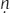

# CHAPTER 1. The Minor Capitoline Triad

## 1.6 THE THREE PROTO - INDO-EUROPEAN FUNCTIONS

<!-- page_12 -->

By at least the third millennium BC, the peoples of the early Indo-European community—now splintered into daughter cultures—had begun to spread across the European continent and to push deep into Asia.[^ch1fn15] One such group had descended into the Italian peninsula by no later than the early first millennium BC and possibly much earlier (see Mallory 1989: 89–94). With them they brought their age-old ideas about the gods and the

society of the gods. The archaic triad composed of Jupiter, Mars, and Quirinus, Dumézil discerned, is the Roman inheritance of a tripartite division of divine society that characterized Proto-Indo-European theology.

Dumézil’s analytic framework for the elucidation of Proto-Indo-European society has already been mentioned (see §1.4). In the course of a long and enormously productive research career, Dumézil developed and refined the notion that the distinctive feature of that society was its tripartite structure and ideology. The three distinct, hierarchically related elements shaping and defining Proto-Indo-European society—the three functions (“les trois fonctions”)—are, to use their common shorthand denotations, that of the priests (“prêtres”; the first function), that of the warriors (“guerriers”; second function), and that of the producers (“producteurs”; third function).

Dumézil’s first function, the function of sovereign power, itself entails two ideological aspects (“les deux aspects de la première fonction”), one legal, the other magico-religious. These two aspects are embodied, for example, in divine pairs such as Mitra and Varuṇa in the *Rig Veda* (see §1.6.1) and Týr and Óðinn in the Norse *Edda* (see §1.6.3.3), and in the dual juridical and religious roles played by priests in early Indo-European societies, such as Druids in Celtic Europe and Brahmans in India. In his essay, “Les trois fonctions sociales et cosmiques,” Dumézil expounds on the first-function nuances:

> … le sacré et les rapports soit des hommes avec le sacré (culte, magie), soit des hommes entre eux sous le regard et la garantie des dieux (droit, administration), et aussi le pouvoir souverain exercé par le roi ou ses délégués en conformité avec la volonté ou la faveur des dieux, et enfin, plus généralement, la science et l’intelligence, alors inséparables de la méditation et de la manipulation des choses sacrées. …[^ch1fn16]

> Dumézil’s second function is that of physical power and might:

> … la force physique, brutale, et les usages de la force, usages principalement mais non pas uniquement guerriers.[^ch1fn17]

<!-- page_13 -->

For Dumézil, the second function has a certain solitary character about it, though the great warrior is often accompanied by a warrior band. When interfunctional relationships find mythic expression, the second function typically distances itself from the first function with an attitude of defiance

or disdain. In contrast, Dumézil surmised, the relationship of the second function to the third is one of dependence and a reciprocating, dutiful complicity.[^ch1fn18] Dumézil also came to identify two fundamentally different types of warriors, one savage, monstrous—a kind of “bête humaine”—who kills with his bare hands or with a cudgel, the other a “surhomme,” intelligent, civilized, a master of weaponry.[^ch1fn19]

The third function of Indo-European society is for Dumézil the most internally diverse:

> Il est moins aisé de cerner en quelques mots l’essence de la troisième fonction, qui couvre des provinces nombreuses, entre lesquelles des liens évidents apparaissent, mais dont l’unité ne comporte pas de centre net: fécondité certes, humaine, animale et végétale, mais en même temps nourriture et richesse, et santé, et paix—avec les jouissances et les avantages de la paix—et souvent volupté, beauté, et aussi l’importante idée du «grand nombre», appliquée non seulement aux biens (abondance), mais aussi aux hommes qui composent le corps social (masse).[^ch1fn20]

It is a diffuse assemblage in comparison to functions one and two, and this heterogeneity has not gone unnoticed by Dumézil’s critics. There are, however, common threads that interlace and draw together these various elements, Dumézil argues; the realm of the third function is that of fecundity—fertility, fruitfulness—its conditions and its consequences:

> Il n’est d’ailleurs pas besoin d’un gros effort de réflexion pour sentir ce qui relie fortement la fécondité (des hommes, des animaux, des plantes) à ses conditions d’une part (la paix tranquille par opposition à la guerre, la sexualité et tout son arsenal physique et psychologique, la santé) et à ses conséquences d’autre part (la richesse sous toutes ses formes, le grand nombre des possesseurs et des choses possédées).[^ch1fn21]

<!-- page_14 -->

### *1.6.1 Tripartition and Dumézil*

It is important to bear in mind that “Proto-Indo-European tripartition” and “Georges Dumézil” do not constitute identical subsets. This seems to have been overlooked or otherwise misunderstood by many of his critics, especially by classicists who focus on the study of Roman religion. Such a tacit equation is evidenced, for example, by Beard, North, and Price (*BNP*, vol. 1: 14), who write in their survey work on Roman religion:

> Dumézil believed that the mythological structure of the Romans and of other Indo-Europeans was derived ultimately from the social divisions of the original Indo-European people themselves, and that these divisions gave rise to a ‘tri-functional ideology’—which caused all deities, myths and related human activities to fall into three distinct categories: 1. Religion and Law; 2. War; 3. Production, especially agricultural production. This was an enormously ambitious claim, and at first Dumézil’s theories drew very little acceptance.[^ch1fn22]

Enormously ambitious? Perhaps so, were this a careful statement of Dumézil’s research program, which, unfortunately, it is not. At what moment in its history the primitive Indo-European community began to see itself as structured in threes is unknown—possibly unknowable. (And at what point along the continuum of that history would one locate the “original Indo-European people”?) More than that, where does Dumézil claim that it was the social divisions of the Indo-Europeans that gave birth to their “trifunctional ideology”?[^ch1fn23] Dumézil’s was an enormously insightful claim, born of erudition and a remarkable breadth of comparative investigation, not confined by the walls of Rome. There is, however, more to Dumézil than tripartition, and tripartition is not unique to Dumézil.

1.6.1.1 TRIPARTITION AND BENVENISTE On the one side, as early as 1932, the French linguist Émile Benveniste had begun independently to explore and develop his own interpretation of Indo-European social classes. The most succinct expression of Benveniste’s conclusions is found in his masterly work treating primitive Indo-European economy, society, law, and religion, *Le vocabulaire des institutions indo-européennes* (1969); therein (as earlier) Benveniste argues for a similar hierarchically ordered, three-part social structure:

<!-- page_15 -->

> Par des séries parallèles de termes d’étymologie souvent parlante, mais différents d’une langue à l’autre, l’iranien, l’indien, le grec et l’italique attestent un commun héritage indo-européen: celui d’une société structurée et hiérarchisée selon trois fonctions fondamentales, celles de prêtre, de guerrier, d’agriculteur.[^ch1fn24]

The structure is most readily perceived among the Indo-Iranian peoples, and indeed, in the research path followed by both Benveniste and Dumézil,[^ch1fn25] the reconstruction of an ancestral structure was first projected to Proto-Indo-Iranian society (see Benveniste 1932; Dumézil 1930b). “Cette division qui embrasse la totalité des hommes est-elle limitée à la société indo-iranienne?”—Benveniste asks rhetorically in his great synthetic work of 1969 (vol. 1: 289); the answer: “On peut penser qu’elle est très ancienne et qu’elle remonte au passé indo-européen. De fait, elle a laissé ailleurs des traces.” The broader Indo-European evidence that he here invokes for a common ancestral tripartite social structure is that provided by Greek legends of the primitive organization of Ionian society (pp. 289–291) and by the ritual texts of the Atiedian priesthood of ancient Iguvium (pp. 291–292; see below, §3.3.3.2.3).[^ch1fn26] Yet additional evidence could be adduced, he suggests,[^ch1fn27] and he defers to Dumézil regarding matters of religion and mythology generally.[^ch1fn28]

<!-- page_16 -->

1.6.1.2 MORE THAN TRIPARTITION On the other side, Dumézil’s own research program was concerned with much more than simply the tripartition of Indo-European society. In an intriguing article exploring the possibility of a fourth Indo-European function, N. J. Allen (1987) calls attention to various remarks made by Dumézil in which he explicitly addresses this matter; indeed, Dumézil expresses annoyance at the view that his work is narrowly confined to concerns of tripartition. For example, in an interview which Dumézil gave to Jacques Bonnet and Didier Pralon in 1980, the interviewers

ask: “L’idéologie des trois fonctions est-elle la seule composante de l’idéologie indo-européenne?” Dumézil responds:

> Non, et je suis quelquefois agacé de me voir toujours ramené aux trois fonctions. Je me suis occupé d’autres choses: la théorie de l’Aurore par example, et celles du Solstice d’hiver, du calendrier romain, des organisations guerrières. Tout mon travail comparatif n’est pas «accroché» à la tripartition![^ch1fn29]

Volume 3 of Dumézil’s magnum opus, *Mythe et épopée*, concludes with three appendixes, the first of which is a study of Roman Mater Matuta, whom Dumézil identifies with the Vedic dawn goddess, Uṣas. Tracking the evolution of his own thought, Dumézil begins:

> Les études sur l’Aurore appartiennent à la seconde période de la nouvelle mythologie comparée. Entre 1935 et 1948, toute l’exploration comparative avait été concentrée sur la conception des trois fonctions, reconnue, en 1938, fondamentale dans l’idéologie des Indo-Européens: on ne s’était occupé que d’en inventorier les expressions, vivantes ou fossiles, dans la religion, dans l’épopée, dans la vie sociale des divers peuples de la famille. C’est ensuite seulement qu’on a pu entreprendre d’appliquer les procédés mis au point sur cette matière centrale à d’autres types de représentation mythologie des commencements, des feux, des saisons, eschatologie.[^ch1fn30]

Allen (1987: 33) summarizes this, quoting from Dumézil’s 1958 work, *L’Idéologie tripartite des Indo-Européens*:

> [Dumézil] is perfectly clear that the three functions do not exhaust the ideological heritage from Proto-Indo-European times. “However important, even central, the ideology of the three functions may be, it is far from constituting all the shared Indo-European heritage that comparative analysis can glimpse or reconstruct” (1958: 89).

### *1.6.2 Tripartition and the present work*

<!-- page_17 -->

For the study at hand, a notion of a primitive Indo-European three-part social structure and ideology—à la Benveniste and Dumézil—constitutes an essential building block. One can hardly see how it could be reasonably denied by the comparativist; the paradigm is fundamental, and elements of such a structure will recur throughout the present work. As the argument develops through the course of this investigation, however, it will

become clear that tripartition is but one plank—and at times, it may seem, not a very central one—in the stage on which our comparative analysis of Indo-European ritual boundaries and spaces is played out. The fundamental “threeness” of ancestral Indo-European self-awareness is, nevertheless, assumed, and crucially so; but to co-opt Dumézil’s declaration as a confession: “Tout mon travail comparatif n’est pas «accroché» à la tripartition.”

These various clarifications having been made, let us now consider some of the evidence that Dumézil has adduced for Proto-Indo-European tripartition.

### *1.6.3 Indo-European tripartition: the evidence*

Intact reflexes and vestigial remnants of the Proto-Indo-European divine social structure, and of the human structure it mirrors, are preserved across the ancient Indo-European world, but particularly well so at the eastern and western aspects of the Indo-European expansion area in antiquity—in the east, India and Iran; in the west, Scandinavia, but more so Celtic Europe and Italy. After surveying the fundamental evidence from the first several of these (§§1.6.3.1–1.6.3.4), we will turn our attention fully to Italy, specifically to Rome (§1.7).[^ch1fn31]

<!-- page_18 -->

1.6.3.1 INDIA The picture is clearest in India and Iran. The gods of Vedic India are divided among three classes: (i) the *Ādityas*, gods of sovereignty (first function); (ii) warrior deities, commonly named as the *Rudras* (second function); and (iii), rounding out the tripartite structure, the deities called the *Vasus*—having a corporate denotation meaning literally ‘goods, wealth’. In a parallel fashion, Vedic divine society is at times summarized by substituting for these group designations, the names of individual gods: (i) Mitra and Varu[image-glyph: unresolved image00352]a; (ii) Indra (along with Vāyu or Agni); and (iii) the Aśvins, also known as the Nāsatyas (see, inter alia, Dumézil 1986: 29–37). The hierarchical prominence of these deities is one of great antiquity, as is

revealed by their invocation in the treaty made between a king of Syrian Mitanni, Šattiwazza, and the Hittite monarch, Šuppiluliuma, in the fourteenth century BC. The people of Mitanni were predominantly speakers of the non-Indo-European language of Hurrian; however, speakers of an archaic form of Indo-Aryan (or perhaps a form of Indo-Iranian antecedent to the separation of Indo-Aryan and Iranian) entered the region at some early period and for a time gained dynastic control (see Harrak 1997). Called on to witness the treaty are several deities:

> mi-it-ra-, u-ru-wa-na-, in-da-ra, and na-ša-at-ti-ia.[^ch1fn32]

Clearly these gods are equivalent to their better-known Indic counterparts:

> Mitra, Varuṇa, Indra, and the Nāsatyas.

The same tripartition also characterizes human society in Vedic India. Three Indo-Aryan *var[image-glyph: unresolved image00355]as* or classes are identified: the *brāhmaṇa*, the priest-ly class; the *kṣatriya*, class of the warrior (*rājanya*); and the *vaiśya*, class of cultivators, goods-producers. To these three is appended a fourth, non-Aryan, *varṇa*—that of the *śudras*, the native peoples of India subjugated by the invading Indo-Aryans. We encounter these classes, for example, in *Rig Veda* 10.90.12, in the account of the dismemberment of the primeval giant Puruṣa—from whose body the universe is created—where the relative societal positions of the *varṇas* are clearly revealed:[^ch1fn33]

> brāhmaṇo ’sya mukham āsīd bāhū rājaniyaḥ kṛtaḥ

> ūrū tad asya yad vaiśyaḥ padbhyām śūdro ajāyata

> The Brahman was his mouth,

> arms were made into the Rājanya,

> His thighs—they the Vaiśya,

> from feet were born the Śudra.

<!-- page_19 -->

1.6.3.2 IRAN In spite of the religious reforms undertaken by Zarathuštra, a tripartite division of divine beings can still be found in Iranian theology (see, inter alia, *ME* 1.105–107; Dumézil 1986: 40–51). Zarathuštra elevated his god Ahura Mazdāh to a position of supremacy. The Aməša Spəntas, six abstract beings who embody the attributes of Ahura Mazdāh in the *Avesta* (the Zoroastrian book of scripture), correspond closely to the chief Vedic

deities as they span the three functions: (i) Aša Vahišta, patron of cattle, and (ii) Vohu Manah, patron of fire, match the sovereign gods Varuṇa and Mitra respectively; (iii) Xšaθra, patron of metal, has a name meaning ‘dominion’, cognate with Sanskrit *kṣatra-*, from which is derived *kṣatriya*, name of the warrior class (Indra, chief warrior deity in India, has been demonized in Iran); (iv) Spənta Ārmaiti, patron of earth, evokes the Vedic goddess Sarasvatī, the river goddess whose affiliations are with all three functions (one of a set of trifunctional deities attested across the ancient Indo-European world), but who closely aligns herself with the Aśvins; and (v) Haurvatāš and (vi) Amərətāš, patrons of waters and plants respectively, corresponding to the Vedic divine twins of the third function, the Aśvins or Nāsatyas.

Iran similarly preserves evidence of a tripartite division of human society. Three classes, or *pišθra*, are attested in the *Avesta*: that of the *zaotar*, the priest; the *nar*, the warrior, literally ‘man’ (cf. Greek ἀνήρ); and the *vāstar*, the herder. Such are their names in the *Gāthās* (the hymns constituting the oldest portion of the *Avesta*); in the later portions of the *Avesta* they are the *āθravan*, the *raθaēštar* ‘chariot-rider’, and *vāstryō-fšuyant* ‘fattening pasturer’ respectively (Boyce 1996: 5–6).

1.6.3.3 SCANDINAVIA Among the ancient Germanic peoples, and best attested in Norse records, divine society is again perceived to be of a tripartite nature. Óðinn (Old English Woden, namesake of *Wodnesdæg* ‘Wednesday’), king of the gods, belongs to the first function, as does Týr (Old English Tīw, as in *Tīwesdæg*, ‘Tuesday’), the god who voluntarily loses a hand to ensure the security of society. The former is a reflex of what Dumézil has identified to be the magico-religious aspect of the first function, and so is a homologue of Vedic Varuṇa; the latter, Týr, belongs to the legal aspect of the first function, making him a homologue of Vedic Mitra (see Dumézil 1973a). Among the Germanic gods, the principal representative of the second function is Þórr (Old English Thunor, eponym of *Thunresdæg*, ‘Thursday’). Óðinn, Týr, and Þórr all belong to that group of gods called the Æsir, who in Norse tradition had once been at war with a second family of gods, the Vanir. It is the Vanir who continue the Indo-European divine third function in Scandinavia, chief of whom are Njörðr and his two children, a son Freyr and a daughter Freyja. The war between the Æsir and the Vanir is itself a reflex of a Proto-Indo-European tradition of conflict which pits the third function against the first/second, seen also, for example, in the Indo-Aryan account of a conflict between the Aśvins and Indra.

<!-- page_20 -->

1.6.3.4 CELTIC EUROPE The tripartite structure of Gaulish society is well known from Caesar’s *Bellum Gallicum* 6.13:

> In omni Gallia eorum hominum, qui aliquo sunt numero atque honore, genera sunt duo. Nam plebes paene servorum habetur loco, quae nihil audet per se, nullo adhibetur consilio. Plerique, cum aut aere alieno aut magnitudine tributorum aut iniuria potentiorum premuntur, sese in servitutem dicant nobilibus: in hos eadem omnia sunt iura, quae dominis in servos. Sed de his duobus generibus alterum est druidum, alterum equitum.

> In all of Gaul exist two *genera* of people who are of a certain rank and honor. The *plebes* are accounted little more than slaves, who undertake no endeavor on their own and are in no way consulted for advice. The majority of them are weighed down by debt or heavy taxation or by the cruel whims of the more powerful; and so they enslave themselves to the upper classes. The latter classes have the very same authority over them as masters have over slaves. But concerning these other two *genera*, one is that of the Druids, the other that of the *equites*.

Caesar’s three Gaulish *genera*—Druid priests, warrior nobles (*equites*), and laboring commoners (*plebes*)—are matched term for term by the three classes of Irish society: *druí*, *flaith*, and *bó-aire* (Rees and Rees 1989: 111–113).[^ch1fn34] Relics of a theological structure of tripartition are also identifiable in medieval (and later) attestations of Irish and Welsh mythic lore (see Dumézil 1988: 153–159; *ME* 1.613–616; Rees and Rees 1989: 141–144).

And so we come to Rome and a principal vestige of Indo-European tripartition in that place, and in so doing begin a new phase of our discussion, one which will begin to move us nearer to the heart of the present investigation. This vestige is of course the Pre-Capitoline triad which we examined in detail above (see §1.5).

## Notes

[^ch1fn15]: On the Proto-Indo-European community, its early descendent cultures, and their geographic spread, see, inter alia, Mallory 1989; Meier-Brügger 2000: 59–64.

[^ch1fn16]: Dumézil 1992: 96; the essay first appeared in 1958 in the volume entitled *L’Idéologie tripartie des Indo-Européens*.

[^ch1fn17]: Dumézil 1992: 96.

[^ch1fn18]: Dumézil 1970: 43–45; “… in the circumstances in which he violates the rules of the first function and ignores its gods, the god or king of the second function mobilizes into his service the gods of the third function or some heroes born within it. And it is through these purifiers, healers, and givers of substance that he either hopes to escape, and, in effect, does escape from the grievous consequences of his useful but blameworthy deeds, or to recover the forces he had lost because of a false ally’s duplicity. In other words, in these ambiguous situations the third function—itself paying no great attention to the first—is put, or puts itself, at the disposal of the second, in accordance with its rank and nature” (p. 45).

[^ch1fn19]: Dumézil 1992: 176–177. These remarks are found in his essay “Les diverses fonctions dans la théologie, la mythologie et l’épopée,” originally published in Dumézil 1958.

[^ch1fn20]: Dumézil 1992: 96.

[^ch1fn21]: Bonnet 1981: 37; see also Dumézil 1982: 50; Allen 1987: 34.

[^ch1fn22]: *BNP*, vol. 1: 14.

[^ch1fn23]: This relationship between structure and ideology is a complex matter which has been admirably explored by N. J. Allen (1987: 29–33).

[^ch1fn24]: Benveniste 1969, vol. 1: 279.

[^ch1fn25]: This is not to suggest that Dumézil and Benveniste ever undertook anything like a common research effort. On the contrary, and unfortunately, relations between the two appear to have been somewhat distant. Consider, for example, Dumézil’s remarks made in an interview with Didier Eribon (Dumézil 1987: 23–29).

[^ch1fn26]: On the Atiedian priesthood and other evidence for tripartition provided by (especially) Roman and Greek cult, see Benveniste 1945a.

[^ch1fn27]: Consider Benveniste 1945b, in which article he explores Indo-European medical lore and tripartition.

[^ch1fn28]: “Au surplus, c’est le domaine auquel M. Georges Dumézil a consacré des travaux fondamentaux, trop connus pour qu’on les rappelle ici” (Benveniste 1969, vol. 1: 292).

[^ch1fn29]: See Bonnet 1981: 34.

[^ch1fn30]: *ME* 3.305.

[^ch1fn31]: For a convenient overview of Dumézil’s interpretations of Indo-European tripartition, see his “Leçon inaugurale,” reprinted in Dumézil 1992 (pp. 13–36). For more explicit discussion see the essays collected in part 2 of the same volume: “Les trois fonctions sociales et cosmiques”; “Les théologies triparties”; and “Les diverses fonctions dans la théologie, la mythologie et l’épopée” (pp. 69–193). The fullest single exposition of Dumézil’s Indo-European investigations is to be found in Dumézil 1995. A convenient treatment of Dumézilian ideas is found in Puhvel 1987. The development of Dumézil’s thought regarding tripartition is traced in Littleton 1982: 43–150. As noted immediately above, N. J. Allen (1987) has argued for expanding Dumézil’s tripartite structure by the addition of a fourth Indo-European function; see also Allen 2003.

[^ch1fn32]: In transcription of the syllabic cuneiform script. See Dumézil 1986: 24–26, 213–232.

[^ch1fn33]: The text of the *Rig Veda* used herein is that of van Nooten and Holland (1994).

[^ch1fn34]: On a further tripartition within the individual classes of Celtic society, see Rees and Rees 1989: 140–141.
