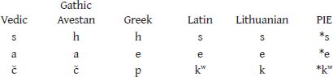

# CHAPTER 1. The Minor Capitoline Triad

## 1.7 JUPITER, MARS, QUIRINUS

<!-- page_21 -->

The Pre-Capitoline triad continues this ancient Indo-European tripartition of divine society in Rome. Jupiter, whose name (from **Diove Pater*, ‘Jove the Father’) is cognate with that of Greek Ζεύς Πατήρ, Vedic *Dyaus Pitar*, and Luvian *(Tatis) Tiwaz,* is god of the first function—the sovereign sky god whose priest, the Flamen Dialis, manifests responsibilities and characteristics

aligned with both aspects of the first function, legal and magico-religious (see *ARR*: 176–181).

Mars is the god of the second function, the warrior god whose month, March, opens the season of military campaigns; whose bellicose sacrificial rite, the Equus October, occurs at the end of the campaigning season; whose “wives” in the ancient prayers of the Roman priests (Aulus Gellius 13.23.2) are Moles (the ‘masses’ of battle) and Nerio, from Proto-Indo-European **ner-*, source of the name of the Iranian warrior class, *nar* (see §1.6.2), Greek ἀνήρ, Armenian *ayr*, Oscan **niir** ‘man’, Umbrian *nerf* (accusative plural) ‘princeps’, Old Irish *nert*, Welsh *nerth* ‘force’, and probably the name of the principal Indo-Aryan warrior god, *Indra* (see *ARR*: 203–213).

Quirinus is catalogued as one of the “gods of Titus Tatius,” that set of third-function deities to which Terminus also belongs (see §1.4). Served by one of the three Flamines Maiores, he is clearly the chief member of that group. Quirinus almost certainly owes his name to **co-virio-* ‘assemblage of men’, and is thus the god of the *curiae*. Reflecting the deity’s affiliation with the Roman populace generally, his priest, the Flamen Quirinalis, participates in sacred rites performed on behalf of other gods. An examination of these rites, Dumézil discerned, reveals the god’s fundamental affiliation with Roman grain—young grain in the field (the Robigalia), stored grain (the Summer Consualia), and roasted grain (the Fornacalia; see *ARR*: 156–161; Boyle and Woodard 2000: 197–199). Quirinus’ Flamen also takes part in the Larentalia—not a festival of grain, but one affiliated with the courtesan Acca Larentia, and so a festival falling squarely within the domain of the third function—realm of fertility and sensuality (see *ARR*: 269; Boyle and Woodard 2000: 206–207).

### *1.7.1 Response*

<!-- page_22 -->

Among classicists who focus on the study of Roman religion, there are some, chiefly within the Anglo-American tradition, who would casually dismiss Wissowa’s and Dumézil’s recognition of an archaic triad comprised of the gods served by the three Flamines Maiores, gods who as a set continue the tripartite ideology of the Indo-European ancestors of the Romans, gods who find a “cognate” triad among the Italic deities invoked in the Iguvine ritual of the Atiedian priesthood, as recognized by Benveniste and Dumézil. Such casual dismissiveness could only be maintained by choosing to ignore the great body of comparative evidence amassed by Benveniste and Dumézil, by ignoring the recurring structural patterns attested by widely separated Indo-European peoples within the historical period—in

a seeming refusal to look beyond the walls of Rome. This is not to say that some alternative interpretation could not be applied to the data provided by the methodical inquiries of Benveniste and Dumézil; it is to say that the claims of their comparative analyses cannot be dismissed by examining only the evidence internal to Rome, excising it from its cross-cultural Indo-European context.

The necessity of understanding and evaluating Dumézil’s work within a comparative framework has of course not gone unrecognized by all classicists presently engaged in the study of Roman religion. In a recent general work on Roman religion, for example, John Scheid writes of Dumézil and his method:

> Dumézil’s plan was to reconstruct the Roman religion of archaic times but, despite his brilliant analyses …, the religious attitudes reconstructed seem to relate more to the contemporaries of Cato and Augustus than to those of Romulus. But it is only fair to note that, from Dumézil’s own point of view, this would not necessarily have made any difference. For, as an Indo-Europeanist rather than a student of Roman religion alone, Dumézil was ultimately more interested in the timeless structures common to all societies which share Indo-European languages than in the precise historical period during which these structures first made their appearance. In the case of Rome, his principal concern was to show how closely the earliest religious structures he could detect matched those of other Indo-European societies. …

> Despite all the historical problems that they pose, Dumézil’s careful analyses of Roman myths, language and institutions provide an incomparable methodological model for the use and interpretation of sources.[^ch1fn35]

Scheid also rightly understands that the vantage point offered by the comparative perspective brings into clearer view what may be blurred in a local view:

<!-- page_23 -->

> Dumézil’s method was always first to examine the evidence within its own context and only then to compare the Roman data to similar structures in the wider Indo-European world (as more recently Walter Burkert has always looked carefully at the evidence before moving on to his own … theories). So even if … Dumézil’s comparison of Roman religious structures with those of other Indo-European societies leads principally to further questions, his careful analysis of the surviving evidence often constitutes a real methodological breakthrough—throwing light, for example, on the *modus operandi* of various shadowy deities and
> explaining, as no one had done before, their significance within Roman religion. By combining the philological methods of Wissowa with a more anthropological *savoir faire*, Dumézil effectively invented the religious anthropology of the Romans.[^ch1fn36]

Those scholars of Roman religion who dismiss the Indo-European tripartite heritage of the Pre-Capitoline triad typically do so as part and parcel of a broader Romano-centric rejection of tripartition. Regarding the latter response, consider the comments of Beard, North, and Price:[^ch1fn37]

> If Dumézil were right, that would mean (quite implausibly) that early Roman religion and myth encoded a social organization divided between kings, warriors and producers fundamentally opposed to the “actual” social organization of republican Rome (even probably regal Rome) itself. For everything that we know about early Roman society specifically excludes a division of functions according to Dumézil’s model. It was, in fact, one of the defining characteristics of republican Rome (and a principle on which many of its political institutions were based) that the warriors were the peasants, and that the voters were “warrior-peasants”; not that the warriors and the peasant agriculturalists were separate groups with a separate position in society and separate interests as Dumézil’s mythic scheme demands. In order to follow Dumézil, one would need to accept not only that the religious and mythic life of a primitive community could be organized differently from its social life, but that the two could be glaringly incompatible.[^ch1fn38]

<!-- page_24 -->

1.7.1.1 IDEOLOGY (PART 1) Glaringly incompatible? If there is something here which blinds us, it would seem to be reflected from the dazzling problems

with such a pronouncement—problems revealing a lack of understanding of Dumézil, Benveniste, their methods, and their conclusions. To begin with, as the authors of this statement must, one would expect, be aware, Dumézil addresses directly the matter of the historical social expression of the prehistoric Indo-European ideology; in *Archaic Roman Religion* he writes:

> In all the ancient Indo-European societies in which this ideological framework exists, it is a problem to know whether, and up to what point, the structure of the three functions is also expressed in an actual structure of society. For there is a difference between making an explicit survey of these three needs and causing a division of social behavior to correspond to them in practice. …[^ch1fn39]

Dumézil infers, and reasonably so, that throughout the long travels by which the primitive Indo-Europeans spread themselves from the shores of Ireland to the deserts of central Asia, there survived ipso facto the warrior element that effectuated that successful dissemination and, at least in some regions, the keepers of the sacred and legal traditions. (Consider “the astonishing resemblances. … between the Druids and the Brahmans and between the Irish *rí* and the Vedic *rājan.*”)[^ch1fn40] He then observes:

> Thus the two higher functions must have been guaranteed by the differentiated groups of the general population, which was often enlarged by the addition of conquered natives, and on which the third function devolved. But it is also certain that at the end of these great travels, after they had settled down, the greater part of the Indo-European-speaking groups sooner or later, often very soon, abandoned this framework in actual practice. It thus remained only ideological and formed a means of analyzing and understanding the world, but with regard to social organization it offered at best only an ideal cherished by the philosophers and a legendary view of the beginnings.[^ch1fn41]

One might profitably ask what precise sense Dumézil assigns to the term “ideology.” Allen addresses this point in his study of Indo-European ideology:

<!-- page_25 -->

> The qualitative question, simpler perhaps, turns on what one expects of an ideology. Dumézil does not spend much time on definitions of the
> term, but I have collected about a dozen remarks bearing on his use of it. Thus he writes recently (1985: 312): “By analogy with the words ‘theology’ and ‘mythology’, which mean respectively the articulated system of deities, and the more or less coherent and finite set of myths, I mean by ‘ideology’ the inventory of directing ideas that dominate the thinking and behaviour of a society”. Elsewhere he talks of realising (towards 1950) that the trifunctional ideology, where one finds it, may only be, and perhaps always have been, “an ideal, and at the same time a means of analysing and interpreting the forces which ensure the course of the world and the life of men” (1981 [=1995, vol. 1]: 15).[^ch1fn42]

Beyond the general case of the social expression of ideology, Dumézil explicitly addresses the situation in Rome:

> The problem must thus arise at Rome as well. But it arises under almost desperate conditions, since too many centuries elapsed between the origins and the account which the annalists gave of them for us to be able to expect authentic information concerning the earliest social organization. If in the eighth century there was any survival of a division of society into three classes, respectively operating the three functions, its last traces quickly disappeared, at any rate before the end of the regal period. It was probably one of the accomplishments of the Etruscan domination to achieve its destruction.

On Dumézil’s penultimate point (“If in the eighth century there was any survival of a division of society into three classes …”), Beard, North, and Price are thus actually in very close agreement with him. And it is worth noting that on his ultimate point as well (“It was probably one of the accomplishments of the Etruscan domination …”), the degree of separation seems not to be great, for Beard, North, and Price write regarding the Etruscans in early Rome:

> Although some particular practices (such as haruspicy) would forever remain linked to Etruscan roots, the “Roman” religious world had become saturated with influences from their Etruscan neighbors which had merged with and transformed the Latin culture of their ancestors. Jupiter was, after all, an ancient Latin deity with an ancient Latin name—and at the same time the focus of what we may choose to classify as (in part at least) Etruscan religious forms (such as the ceremonial of triumph or the Capitoline temple).[^ch1fn43]

<!-- page_26 -->

We will return shortly to the matter of Etruscan religious influences on Rome.

> And what of the above-cited pronouncement of Beard, North, and Price?

> In order to follow Dumézil, one would need to accept not only that the religious and mythic life of a primitive community could be organized differently from its social life, but that the two could be glaringly incompatible.

There are at least two different points to which we should give attention. One concerns the issue of “compatibility” and the other the “social life” of a primitive community vis-à-vis that of its ancestral culture, specifically its linguistic preservations.

1.7.1.2 HETEROGENEITY AND CONTINUITY To begin with, are communities monolithically homogenous? Never. They are striated and heterogeneous. Incompatibility within communities is not an exceptional state of affairs. One must more accurately first determine for what element of this primitive Roman community “the religious and mythic life” might reasonably be construed as “organized differently” and, thus, for whom the invoked incompatibility exists. In his insightful study of Indo-European ideology, N. J. Allen explores the historical continuity of Dumézil’s tripartite ideology:

> From this point of view the history of the Indo-Europeans consists in a transition from an early period, when the segmentary [that is, discretely tripartite] ideology was creative and pervasive, to the contemporary period, when it has, to all intents and purposes, given way to nonsegmentary ideologies.[^ch1fn44]

Allen then continues, echoing Dumézil’s own ponderings on the Indo-European cultural extensions rehearsed above:

<!-- page_27 -->

> Continua are often difficult to handle, and an ideology can very easily be only partly alive. It may be alive for the masses, dead for the elite, or vice versa. It might be strong enough to effect adaptations, too weak to inspire genuine innovation. It might be alive in narrative, dead so far as institutions were concerned. And so on. I imagine that even the earliest of our sources date from periods when the ideology was no longer alive as it had been when the PIE speakers were beginning to disperse. However it would be arbitrary to assume *that* was the time when the segmentary
> ideology was at its strongest. The process of decline could well have begun earlier—one can say nothing about dates.

The Roman ideological remnants of the old Indo-European tripartition, whatever the era of its apogee, survive within the realm of the divine. In Rome that ideology is indeed—in Allen’s words—only partly alive. It is kept alive in the domain of ritual and theological structure by the priests, or a subset thereof, guardians of ancient, ancient traditions and knowledge, as elsewhere in the Indo-European world (and beyond). It is at least the priestly element of society that houses the incompatibilities envisioned by Beard, North, and Price. In the modern world, the incompatible differences (one might even say glaring) between the religious ideology embraced by a cleric—Christian minister or priest, rabbi, mullah, and so on—and the actual structures, conventions, and behaviors of society at large, particularly societies fallen under the influence of some “foreign” element, are easily enough perceived; one need only read the headlines.

1.7.1.3 LES QUATRE CERCLES D’APPARTENANCE The second consideration is this. As seems to have been overlooked by Romanist critics of tripartite ideology, Benveniste argued cogently that there were dynamics of early Indo-European social structure quite distinct from tripartition.

> L’organisation tripartite qui vient d’être décrite établit, au sein de la société, des classes de fonction; elle ne revêt pas un caractère politique, sinon du fait que la classe sacerdotale, étant la première, détermine la hiérarchie des pouvoirs. L’organisation proprement sociale repose sur une classification toute différente: la société est considérée non plus dans la nature et la hiérarchie des classes, mais dans son extension en quelque sorte nationale, selon les cercles d’appartenance qui la contiennent.

> C’est dans l’ancien Iran que cette structure est la plus apparente. Elle comporte quatre cercles concentriques, quatre divisions sociales et territoriales qui, procédant de l’unité la plus petite, s’élargissent jusqu’à englober l’ensemble de la communauté.[^ch1fn45]

In Iran the innermost circle is that denoted by *dam-* (or *d[image-glyph: unresolved image00368]māna-*, *nmāna-*), ‘household’ or ‘family’. The next circle out is that of the *vīs*, ‘clan’ (“groupant plusieurs familles”), beyond which is the *zantu*, ‘tribe’ (“proprement «l’ensemble de ceux qui sont de même naissance»”). The outermost circle is that of the *dahyu* ‘country’.

<!-- page_28 -->

It is only in Iran that the structure plainly survives into the historical

period. Even in India it has undergone modification: though Sanskrit cognates of each term are attested, the system no longer remains a living mechanism (“… nous ne trouvons pas dans l’Inde une liaison organique entre ces quatre dénominations. Elles ne se rejoignent plus”[^ch1fn46]). Much more so elsewhere, though fossils of the system, frozen—sometimes idiomatically—in the lexicon, show themselves scattered across the Indo-European family. For example, each of the social units has its own chief: in Iran they are denoted the *dmāna-paiti*, the *vis-paiti*, the *zantu-paiti,* and the *dahyupaiti*, respectively; they exist in a hierarchical relationship, still surviving in Middle Iranian. Beside Vedic *dam-pati-* ‘master of the home’, cognate to Avestan *dmāna-paiti*, Greek preserves δεσ-πότης ‘master, despot, lord, owner’; the Avestan *vis-paiti* finds his etymological counterpart not only in Vedic *viś-pati-* ‘chief of the settlement, lord of the house’, but in Lithuanian *vi[image-glyph: unresolved image00369]š-pats* ‘lord’, Albanian *zot* ‘lord’ (product of obscuring sound change); compare the Old Prussian accusative feminine *waispattin* ‘the lady of the house’.[^ch1fn47]

Beyond the core household unit (Iranian *dam-*) with its well-known Greek and Latin linguistic relatives (such as Homeric δώ, Latin *domus*), there survive, in both Greek and Latin, forms etymologically related to the next two social levels, the Indo-European clan and tribe, though showing semantic distinction. Beside Iranian *vīs*, ‘clan’, Greek preserves οἶκος (earlier ϝοικος), meaning ‘house’, and Latin has *vīcus*, ‘village; block of houses’; and next to Iranian *zantu*, ‘tribe’, Greek shows γένος, denoting ‘race, offspring, family’, and Latin *gens*, meaning ‘race, people’, as well as identifying a family unit having a shared *nomen* and ancestor. But neither in Greece nor in Rome does the ancient Indo-European social structure in which such linguistic forms have their roots survive:

> La correspondance n’est qu’étymologique. En grec et en latin, ces vocables hérités ne s’ordonnent pas comme en iranien. Ils ne se recouvrent même pas entre le latin et le grec. … En latin, nous ne retrouvons pas non plus la structure iranienne: *vīcus* n’est pas le degré supérieur de *domus*; c’est autre chose que la *vīs* iranienne, autre chose aussi que le *(w)oîkos* grec.[^ch1fn48]

<!-- page_29 -->

The nested ancestral Indo-European social structure with its hierarchically ranked chieftains did not survive the urbanization of the Indo-European peoples who descended into the Italian peninsula and intermingled

with the non-Indo-European inhabitants of that place. Vestiges of the archaic nomenclature attached to that structure, however, still dotted the sociolinguistic landscape of spoken Latin.[^ch1fn49]

A parallel process of fossilization was at work on that other distinctive element of Indo-European social structure, tripartition. While a society-wide, living tripartition of functions had long since disappeared, quite possibly before the arrival of the Indo-Europeans in Italy, remnants of the ideology underlying and reflecting that prehistoric social tripartition survived in ancient Rome. Notably, expressions of this ideology were kept alive in ritual and theology by priestly figures—heirs to the yet more ancient first function and the repository of ancestral religious and legal traditions, like their counterparts in other Indo-European places—Brahman, *zaotar*, Druid. Beyond the priests, though assuredly not exclusive of their domain, mythic motifs of Indo-European origin, some of which centrally or incidentally assume notions of a tripartite division of society (as we shall see), were preserved in Roman society at large in the milieu of popular traditions about the gods.

1.7.1.4 IDEOLOGY (PART 2) One of the harsher voices to be raised in recent years against Dumézil from among the ranks of classicists is that of T. J. Cornell—though at the same time, it is a voice of endorsement. In his work on the history of early Italy and Rome—an admirably scholarly work, if at times given to hyperbole and aphorism—Cornell briefly rehearses and dismisses particular elements of Dumézil’s trifunctional interpretation of Rome’s traditions of its origins. It is important to note, however, that he does not issue a blanket dismissal of Indo-European tripartition à la Dumézil and Benveniste (the latter whom he does not mention); quite to the contrary, he sanctions the notion and its vestigial survival in Rome:

> Although traces of Indo-European myth and functional ideology are undoubtedly present in the stories of early Rome, and in particular in early Roman religion, the problem is to determine the extent and meaning of these traces.[^ch1fn50]

A fair enough assessment with which the present author fully concurs. Cornell later adds:

<!-- page_30 -->

> The three functions are certainly present in some early Roman religious
> institutions, most notably the three *flamines maiores*, priests who were specifically attached to the cults of Jupiter, Mars and Quirinus, representing sovereignty, war and production (respectively). …[^ch1fn51]

*1.7.1.4.1 The Romulean tribes* What Cornell finds dubious in Dumézil’s analyses are his interpretations of yet another element of Roman social structure, linked by Dumézil to Indo-European traditions preserved in the accounts of Rome’s beginnings. The objection concerns the reported earliest tribal division of Rome—that of the Ramnes, Luceres, and Titienses (see, inter alia, Varro, *Ling.* 5.55; Livy 10.6.7; Ovid, *Fasti* 3.132). Cornell writes, quoting Dumézil (in italics below):

> In his early works Dumézil argued that the three “Romulean” tribes, the Ramnes, Luceres and Tities, were functionally defined castes of priests, warriors and producers (respectively); but later he abandoned this theory (for which there is no supporting evidence in our texts), and argued instead that the framework of the three functions “*remained only ideological and formed a means of analyzing and understanding the world.*”[^ch1fn52]

The quotation that Cornell draws from *Archaic Roman Religion* (p. 163)—and which has a familiar ring to it—would here seem to have been penned by Dumézil as an explicit rejection of some earlier interpretation of the Romulean tribes. In actuality, Dumézil is with these words discussing the general replacement of a living tripartition of functions by a trifunctional ideology as the early Indo-Europeans moved across Europe and Asia and into the pages of history; it is a portion of the very quotation we invoked above (§1.7.1.1) in discussing that replacement.[^ch1fn53] In *Archaic Roman Religion*, Dumézil does, however, have something to say about the Romulean tribes; and in fairness to him, we should examine those remarks, whether or not we are prone to agree:

<!-- page_31 -->

> . … Romulus, the son of a god and the beneficiary of Jupiter’s promises, sometimes joined by his Etruscan ally Lucumon, the expert in war, is originally opposed to Titus Tatius, the leader of the wealthy Sabines and the father of the Sabine women, and then forms with him a complete and viable society. Now, this legend, in which each of the three leaders,
> with his respective following, is thoroughly characterized in terms of one of the functions—reread in particular lines 9–32 of the first *Roman Elegy* of Propertius—is intended to justify the oldest known division, the three tribes of which these leaders are the eponyms, the companions of Romulus becoming the *Ramnes*, those of Lucumon the *Luceres*, and those of Titus Tatius the *Titienses*.

Dumézil has set the stage; he now asks a question:

> May we assume from this that the three primitive tribes … had in effect a functional definition, with the Ramnes controlling political government and the cult (like the companions of “Remus” in Propertius 4.1.9–26), the Luceres being specialists in war (like Lucumon in the same text of Propertius, 26–29), and the Titienses being defined by their wealth of sheep (like the Tatius of Propertius, 30)?

What is Dumézil’s answer to this question in *Archaic Roman Religion*?

> The question remains open. I have offered a number of reasons for an affirmative answer, but none is compelling. In the fourth and third centuries the fabricators of Roman history had only a very vague idea of the pre-Servian tribes, and it is possible that the Ramnes, the Luceres, and the Titienses had received their functional coloration only from the “legend of the origins,” which was inherited from the Indo-European tradition and, as such, was faithfully trifunctional. But for the present study, an analysis of tenacious ideas and not a pursuit of inaccessible facts, this uncertainty is not very serious.[^ch1fn54]

From Dumézil’s remarks in *Archaic Roman Religion* it would seem clear that to claim that “he abandoned this theory” of an actual functional distinction existing between the three Romulean tribes would be an inaccuracy. We will return to this point below but first must address another portion of Cornell’s critique—the parenthetical dependent clause which immediately follows: “for which there is no supporting evidence in our texts.”

<!-- page_32 -->

This is a revealing comment. By the phrase “our texts” Cornell presumably means Roman and Greek texts treating Roman social history. For

Dumézil, “our texts,” vis-à-vis the problem of the functional nature of the three so-called Romulean tribes, would encompass a far greater range of textual materials. The difference is that between a Romano-centric dismissal of a particular instantiation of a broad Indo-European phenomenon and a comparative Indo-European affirmation of the same. It is the difference between examining only one part of a system in isolation—a particulate approach—and examining the entire system—a systemic approach to an organic whole.

*1.7.1.4.2 The comparative method* The methods of Dumézil and Benveniste are modeled on the comparative method of historical linguistics—together with the complementary discovery of the regularity of sound change, one of the preeminent scientific achievements of the nineteenth century.[^ch1fn55] The method is well known, but perhaps a simple illustration would not be out of place. The following phonetically and semantically similar verb forms are attested among the Indo-European languages:

| Vedic | *sác-ate* | ‘(s)he accompanies’ |
| --- | --- | --- |
| Gathic Avestan | *hac-aitē* | ‘(s)he follows’ |
| Greek | ἕπ-ομαι | ‘I follow, accompany’ |
| Latin | *sequ-or* | ‘I follow’ |
| Lithuanian | *sek-ù* | ‘I follow’ |

By setting up correspondence series, isolating and comparing each consonant and vowel sound of the root, the Proto-Indo-European verb root can be easily reconstructed:

The Proto-Indo-European verb root is thus **sekʷ-*.

<!-- page_33 -->

With the discovery of the Hittite archives at Bogazköy early in the twentieth century and the subsequent decipherment of the Anatolian Indo-European languages, Hittite and other Anatolian reflexes began to be integrated into such traditional Indo-European correspondence series, fine-tuning reconstructions especially by revealing the presence of the so-called

laryngeal consonants of the parent language (de Saussure’s “sonant coefficients”; see Szemerényi 1996: 121–130; Watkins 1998: 40–44; Hoenigswald, Woodard, and Clackson 2004: 519). Obviously not all Hittite lexemes find a match in such previously identified cognate sets, with many words having been borrowed from non-Indo-European languages prior to the time of earliest attestation (see Watkins 2004: 555–556). A form such as Hittite *ārki* ‘(s)he cuts up, divides up’, for example, is isolated from any previously known set of Indo-European cognates. Yet if the word were of Indo-European origin, it would project back to a Proto-Indo-European root **h₁erk-* (beginning with the number-one laryngeal). From that starting point one could then project forward, by applying independently attested rules of sound change, to Latin *erc-iscī* ‘to divide’, a word of otherwise unknown origin (see Rix 2001: 240, with further references).

Dumézil’s method of identifying individual cultural reflexes of archaic Indo-European institutions and projecting back to the parent culture is methodologically comparable to the process of isolating cognate sets and reconstructing their linguistic antecedent. *Pensée extériorisée*, he called it. Gregory Nagy summarizes beautifully in his foreword to the 1999 English translation of Dumézil’s *The Riddle of Nostradamus*:[^ch1fn56]

> In this project, Dumézil applies his theoretical models of “exteriorized thinking” (*pensée extériorisée*) to Nostradamus. … Dumézil’s empiricism centers on comparing the institutions of societies linked to each other by way of cognate languages that can be traced back to a prototypical common language, known to linguists as *Indo-European*.

> The key to this book is the comparative method itself, and how this method can reconstruct a frame of mind by externalizing the traditions that formed that frame. If different minds at different times internalize the same given tradition, then a comparatiste can find a link between these different minds by examining that tradition in its externalized forms. …[^ch1fn57]

Benveniste’s procedure is fundamentally the same, to the extent that it is likewise an appropriation of the comparative linguistic method. Consider a few remarks from Charles Malamoud’s review of Benveniste 1969:

<!-- page_34 -->

> *Le vocabulaire des institutions indo-européennes*, the book that is the subject of this article, belongs to both the “general linguistic” vein of
> Benveniste’s work and the “comparative grammar vein”. To be sure, the lexical material studied in the work is purely Indo-European. And insofar as formal analysis is involved, the methods used are the classical techniques of comparative grammar. Still, both the overall plan of the work and some of its particular arguments illustrate a series of theses set forth in his *Problèmes* [Benveniste 1966: 25]: “Individual and society naturally determine one another in and through language. … Society is possible only through language; and through language also the individual. … Expression (*langage*) always occurs within a *language* (*langue*), within a specific, defined linguistic structure. Language and society are inconceivable without one another. … Through language, man assimilates culture and perpetuates or transforms it. Like each language, moreover, each culture employs a specific symbolic apparatus with which each society identifies.”[^ch1fn58]

The comparative method is a powerful theoretical tool which provides the investigator with a synergistic breadth—the capability to discern more of the prehistoric language and community than could be discovered by examining any one of its descendants in isolation. With the ancestral structures delineated, one can then project forward to gain a clearer understanding of the evolutionary products of those structures. Malamoud addresses this back-and-forth procedure, common to both the comparative method in its application to language data as well as social and cultural institutions, and aptly terms it a “complex dialectic”:

<!-- page_35 -->

> What exactly is the book about? Is it about Indo-European society as it must have existed before it fragmented into the many peoples who spoke the various Indo-European languages that have come down to us in written texts? To a certain extent, yes. But can one assign to the initial prehistoric phase everything that can be found in each of the societies that grew out of it, and nothing more? That would amount to very little, and one could not even be certain of the inventory obtained in this way, for there were Indo-European populations that left only fleeting traces, and we cannot be sure that their evidence, if we could only lay our hands on it, would confirm or refute the results obtained elsewhere. And the evidence that we do possess is not all of equal value. In regard to what
> we believe to be the original state of things, some cultures were more faithful than others, or more faithful in some respects than in others. There is general agreement that the social structures and what Georges Dumézil has called the ideology of the Indo-Europeans were better preserved in Rome and in India than in Greece. But to say this is to imply that we already know what the original state was. In fact, we have filtered the available empirical data in such a way as to construct a model, and then we have used that model to reinterpret and reorganize the same data, thereby, when all is said and done, refining and systematizing our filtering procedure. The result is not, properly speaking, a vicious circle but a complex dialectic, the effect of which is always to make what is most consistent seem most plausible.[^ch1fn59]

This method—this complex dialectic—involves a movement from the known to the unknown; in the words of the great French physiologist and philosopher of the nineteenth century, Claude Bernard, “Man can learn nothing except by going from the known to the unknown.”[^ch1fn60] Given the nature of evidence of Indo-European tripartition that otherwise survives in Rome, we would be very much surprised indeed were there found what for Cornell might constitute “supporting evidence” in Latin and Greek texts of “functionally defined castes of priests, warriors and producers” (Cornell, p. 78). In the same way, there is obviously no text which provides supporting details for us of the origin of Latin *erc-iscī*. Nevertheless, we can hypothesize that it is a reflex of the same Indo-European source that gives rise to Hittite *ārki*, having previously reconstructed Proto-Indo-European vocabulary and identified the sound changes giving rise to the individual daughter Indo-European languages.

*1.7.1.4.3 The progression of ideas* While the above-cited remarks from *Archaic Roman Religion* (see §1.7.1.4.1) suggest that the claim that Dumézil “abandoned” his earlier views on the trifunctional nature of the Romulean tribes overshoots the mark, those views certainly did evolve in the years that elapsed between the publication of *Jupiter Mars Quirinus IV* in 1948 and the appearance of the revised edition of *Mythe et épopée* in 1986, the year of Dumézil’s death. Dumézil addresses these developments in, for example, *Mythe et épopée* I (pp. 432–434) and *Idées romaines* (pp. 209–215). In laying out one-by-one his criticisms of Dumézil, Cornell (1955: 78) returns again to his “abandonment” argument:

<!-- page_36 -->

> As we have seen, the idea that early Rome was once divided into three castes of priests, warriors and producers was abandoned even by Dumézil himself; Rome had its three tribes, but nothing links them with a division of functions.

Aside from the problem of the claim itself, already noted, the wording here—”the idea … was abandoned even by Dumézil himself”—bespeaks a seeming failure or unwillingness to understand or appreciate the progression of ideas that is common to scientific inquiry. And of course Rome’s three tribes can still be linked with a division of functions if we agree, as seems most probable, that what one finds in Rome is a survival of a tripartite ideology, per the conceptualization of society—the internalization of an archaic tradition common to the Indo-European peoples—as evidenced by Propertius, invoked by Dumézil.[^ch1fn61]

*1.7.1.4.4 A mythic history* A second criticism that Cornell advances concerns Dumézil’s interpretation of the annalistic traditions of Rome’s origins as a “mythic history”—a transposition of myth into history (see *ME* 1: 281–284). Dumézil finds in that history the Roman reflexes of certain widely attested Indo-European mythic motifs, such as that of a conflict between the functions (first/second versus third), a conflict that is situated at a moment when society begins to take shape (compare §1.6.3.3). In Rome the myth appears in the guise of Rome’s first war, that fought between Romulus with his Roman warriors (non–third function) and the Sabines (third function) under the leadership of Titus Tatius (see *ARR*: 66–76; *ME* 1: 290–303). Dumézil also sees in the persons of pre-Tarquin kings of Rome the expression—the embodiment—of Indo-European functions. Romulus and Numa Pompilius, contrasting figures, represent the two distinct aspects of the first function—magical and legal, respectively. The war-making Tullus Hostilius personifies the second function. The wealthy Sabines, providers of fertility to Rome, represent the third function, as already noted.[^ch1fn62]

<!-- page_37 -->

Cornell’s criticism here is directed at Dumézil’s contention that this history is fabricated, a product of the fourth and third centuries BC (see *ARR*: 66, 165; *ME* 1: 269–270): it is “the historicization of myths, … the transposition of fables into events” (*ARR*: 75). Cornell (p. 79) asks whether we could not see it the other way around: “… even if we allow that the stories of the origins of Rome are expressions of a functional mythology, does it necessarily follow that they are unhistorical?” In other words, could not those stories record actual events that were recast by marrying inherited mythic themes to tellings of those events? Cornell then quotes several phrases from Dumézil’s concluding remarks (*ARR*: 73), made after comparing the account of the Sabine War with the North Germanic tradition of the war between the Æsir and the Vanir (see §1.6.3.3); here the quotation is presented in a fuller form, with those portions cited by Cornell placed in italics:

<!-- page_38 -->

> There is no need to stress the exact parallelism not only of the ideological values which provide the point of departure but also of the intrigues from the beginning to end, including the two episodes[^ch1fn63] which describe
> the war between the rich gods and the magician gods. It seems hardly imaginable that chance should have twice created this vast structure, especially in view of the fact that other Indo-European peoples have homologous accounts. The simplest and humblest explanation is to admit that the Romans, as well as the Scandinavians, received this scenario from a common earlier tradition and that they *simply modernized its details, adapting them to their own “geography,” “history,” and customs and introducing the names of the countries, peoples, and heroes suggested by actuality.*

And again Cornell (p. 79) asks, incorporating phraseology from Dumézil’s conclusions:

> Would it not be possible … to argue that the materials “suggested by actuality” were drawn from an ancient tradition, possibly based on fact, that the original population of the city resulted from a fusion of Latin and Sabine elements?

In the present author’s view, the answer to these questions could very well be yes; my own inclination is to suspect just such an intermingling of more ancient Indo-European mythic tradition and less ancient Roman historical tradition. But Dumézil also allowed this possibility, and he states as much in a note on the same page of *Archaic Roman Religion* from which Cornell drew the above citation. Dumézil wrote:

> If it should be possible to demonstrate some day, archaeologically, that there was an ethnic duality in the origins of Rome, the account given by the annalistic tradition would still remain entirely “prefabricated”; the historicized myth would merely be superimposed on history.[^ch1fn64]

We see here, as we saw earlier, that Dumézil’s own views are not so far from those of his detractors. It would seem that much of Dumézil—perhaps more of Benveniste—has simply been selectively ignored by those detractors.

<!-- page_39 -->

*1.7.1.4.5 A broader expression* From the vantage point of the comparativist, vestiges of a deeply ancient Indo-European ideology are clearly perceptible in Rome, as they are in Iguvium (see Poultney 1951: 19–20; Benveniste 1945a; also see below, §3.3.3.2.3). Indeed, the ideology shows itself to the

present day in the annual celebration of the festival for Saints Ubaldo, George, and Anthony in modern Gubbio.[^ch1fn65] Benveniste reminds us of the persistence of the ideology into medieval England:

> Toward the end of the ninth century, Alfred the Great added this observation to his translation of Boethius: “A populated territory: that is the work with which a king concerns himself. He needs men of prayer, men of war, and men of labor.” In the fourteenth century, moreover, one could read this in an English sermon … “God made clerics, knights, and tillers of the soil, but the Demon made burghers and usurers.” With the growth of cities, guilds and commerce, the ancient order in which the preacher saw the natural order came to an end.[^ch1fn66]

Its survival in the *varṇas* of India is self-evident.[^ch1fn67] We leave aside the consideration of its presence in such modern-era social and cultural phenomena as the society of the former Soviet Union and the American governmental system.[^ch1fn68]

## Notes

[^ch1fn35]: Scheid 2003: 9–10, 11.

[^ch1fn36]: Scheid 2003: 15.

[^ch1fn37]: Regarding the Pre-Capitoline triad itself, Beard, North, and Price seem to be somewhat ambivalent. In volume 1 of their *Religions of Rome*, they write (p. 15): “The familiar deities of the Capitoline triad (Jupiter, Juno, and Minerva) failed to fit the [tripartite] model; but [Dumézil] found his three functions in the gods of the ‘old triad’—Jupiter, Mars, Quirinus. Although this group was of no particular prominence through most of the history of Roman religion, they were the gods to whom the three most important priests of early Rome … were dedicated—and Dumézil found other traces of evidence to suggest that these three had preceded the Capitoline deities as the central gods of the Roman pantheon. They appeared to fit his three functions perfectly. …

[^ch1fn38]: *BNP*, vol. 1: 15.

[^ch1fn39]: *ARR*: 162.

[^ch1fn40]: Irish *rí* and the Vedic *rājan* are reflexes of the Proto-Indo-European word for king, cognate with Latin *rēx*, all from the root **h₃rēǵ-*. The word survives only at the eastern and western extremities of the Indo-European expansion area; see Benveniste 1969, vol. 2: 9–15.

[^ch1fn41]: *ARR*: 163. Even supposing Dumézil were right about their very earliest significance, all three soon developed into the supposed domains of at least one and possibly both of the others.” The tone appears at least mildly disparaging. However, in volume 2 (pp. 5–6, 9) Beard, North, and Price seem to embrace the concept of the Pre-Capitoline triad.

[^ch1fn42]: Allen 1987: 32.

[^ch1fn43]: *BNP*, vol. 1: 60. For a further and fuller consideration of these remarks, see below, §1.9.

[^ch1fn44]: Allen 1987: 26.

[^ch1fn45]: Benveniste 1969, vol. 1: 293–294.

[^ch1fn46]: Beveniste 1969, vol. 1: 294.

[^ch1fn47]: Ibid., p. 295; see also Mallory and Adams 1997: 192–193.

[^ch1fn48]: Beveniste 1969, vol. 1: 295.

[^ch1fn49]: For a full treatment of the evidence, see Beveniste 1969, vol. 1: 293–319.

[^ch1fn50]: Cornell 1995: 78.

[^ch1fn51]: Cornell 1995: 80.

[^ch1fn52]: Cornell 1995: 77–78.

[^ch1fn53]: I.e. “Thus the two higher functions must have been guaranteed by the differentiated groups of the general population, which was often enlarged by the addition of conquered natives, and on which the third function devolved. But it is also certain that at the end of these great travels, after they had settled down, the greater part of the Indo-European-speaking groups sooner or later, often very soon, abandoned this framework in actual practice. It thus remained only ideological and formed a means of analyzing and understanding the world, but with regard to social organization it offered at best only an ideal cherished by the philosophers and a legendary view of the beginnings.” See *ARR*: 165.

[^ch1fn54]: *ARR*: 164–165.

[^ch1fn55]: For an excellent and up-to-date discussion of the method, see Ringe 2004.

[^ch1fn56]: First published in 1984 under the title *Le moyne noir en gris dedans Varennes*.

[^ch1fn57]: Dumézil 1999: vii. The quotation from Nagy continues: “. … that is what Dumézil does in linking a tradition that he finds reflected in the work of the Roman historian Livy, whose life straddles the first centuries BC and AD, with what goes on in the minds of two historical figures who had independently internalized that tradition in the context of their own Classical formation: these two figures are Nostradamus, in the sixteenth century AD, and Louis XVI, in the late eighteenth.”

[^ch1fn58]: Malamoud 1971; reprinted in Loraux, Nagy, and Slatkin 2001, p. 430. The present author wishes to express his appreciation to Gregory Nagy for bringing Malamoud’s review to his attention.

[^ch1fn59]: Malamoud, p. 430.

[^ch1fn60]: Bernard 1957: 45. The present author wishes to express his appreciation to Dr. John B. Simpson for bringing Claude Bernard to his attention.

[^ch1fn61]: For additional consideration of the ancient Romulean tribes, see below, §1.9.1.1.

[^ch1fn62]: Dumézil also argued for third-function elements residing in the figure of Ancus Marcius (see *ME* 1: 280–281, with references). This is another focal point for Cornell’s criticism of Dumézil; citing Dumézil 1947, he states: “The evidence adduced by Dumézil to link Ancus with wealth and production is marginal and the argument is patently unconvincing” (Cornell 1995: 78). The present author would agree that the third-function role of Ancus within the mythic history of Rome is less transparent than that of the Sabines, and less pronounced than the first- and second-function nature of the preceding three kings. This was also, however, the view held, or arrived at, by Dumézil. We, along with Cornell, should give ear to Dumézil’s observations on Ancus in his work *The Destiny of the Warrior* (1970: 8; trans. of Dumézil 1969): “This functional interpretation of the founding kings has been generally accepted for the first three: the obviously deliberate antithesis between Romulus and Numa, recalling the two opposite yet necessary aspects of the first function, and the wholly warlike character of Tullus, demand little discussion. It has been otherwise for the fourth king, Ancus Marcius. Despite the anachronisms that have long been recognized in the work attributed to him, one cannot help having the impression that it is with Ancus Marcius that historical authenticity begins to carry some appreciable weight in the traditions; that he represents, in the series of kings, the point at which a purely fictitious history, which is intended merely to explain, is welded to a history retouched, reevaluated, to be sure, but in its inception genuine and recorded. This sort of coming to earth of the speculations that a people or a dynasty makes upon its past is always a delicate point for the critic: Upon what ordinal term, for example, in the series of Ynglingar—those descendants of the god Freyr who little by little become the very real kings of the Swedish Uplands, then of southern Norway—must the human mantle first be placed? The matter continues to be debated, and there is considerable divergence of opinion. Mutatis mutandis, it is just the same for Ancus, so that one hesitates—and many evince some reluctance—to recognize, even in one part of his ‘history’ or a part of his character, a last fragment of a pseudo history of mythical origin only intended to illustrate the successive appearances of the three functions.” Cornell has again moved too quickly to judgment.

[^ch1fn63]: Succinctly, Dumézil’s “two episodes” are those of (i) the treacherous intervention of a gold-desiring woman on the side of the possessors of wealth; and (ii) the battle-field intervention of the god of magic. In each instance there is a less than completely successful outcome. See the discussions in *ARR*: 68–73 and *ME* 1: 295–299.

[^ch1fn64]: *ARR*: 73, n. 17; the passage quoted is reproduced in *Archaic Roman Religion* from Dumézil 1949. Cornell adds (1995: 79): “We could equally suppose that the stereotyped figures of Numa and Tullus were created by imposing functional specialisation upon two kings who were respectively celebrated in tradition for religious reforms and a successful war. …” Again, this seems an entirely possible, perhaps probable, scenario.

[^ch1fn65]: See Dumézil 1979: 123–143. N. J. Allen (1987: 26) writes: “The legacy of the old ideology may be detectable today in various forms, ranging from straightforward punctate manifestations in folklorist contexts to diffuse attitudes. One thinks of the recent discovery of a trifunctional triad of saints in a festival still performed at Gubbio in Italy …, and of the enduring importance of the varṇas in India. But these cannot be recent *inventions*. They are clearly survivals, creations of earlier times. In broad terms, the trifunctional ideology is ancient history, dead and gone, or at most transmuted beyond recognition.”

[^ch1fn66]: Benveniste 1945a; in Loraux, Nagy, and Slatkin 2001: 447. Benveniste cites Owst 1933: 553 and Moss 1935: 271.

[^ch1fn67]: Allen (1987: 26) points to this as well; see note above.

[^ch1fn68]: For a discussion of these and other possible modern examples of the persistence of the Indo-European tripartite ideology, see Littleton 1982: 231–232.
