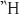

<!-- page_96 -->

# CHAPTER 3. Into the Teacup

## 3.1 INTRODUCTION

The public rites of the Terminalia, the Ambarvalia, the Arval celebration of the goddess Dea Dia, ancient rituals of lustration preserved in the writings of Cato, Virgil, and Tibullus—these are the things which will occupy our attention in chapter 3. We will examine these rituals and their component parts comparatively, holding them up to the light side by side, and shining the illuminating brilliance of Vedic ritual and cult on them. We begin where we left off in the preceding chapter.

## 3.2 THE PUBLIC RITES OF THE TERMINALIA

In chapter 2, we examined the private festival of the Terminalia; the public observance, as will become clear, is of greater interest and significance for our study. It is at the sixth milestone of the Via Laurentina that the public rite of the boundary god is celebrated on February 23. Of the sacrifice and road, Ovid writes (*Fast.* 2.679–684):

> Est via quae populum Laurentes ducit in agros,

> quondam Dardanio regna petita duci:

<!-- page_97 -->

> Illa lanigeri pecoris tibi, Termine, fibris

> sacra videt fieri sextus ab Urbe lapis.

> Gentibus est aliis tellus data limite certo:

> Romanae spatium est Urbis et orbis idem.

> There is a road which leads folk to Laurentine fields,

> The realm once sought by the Dardan leader;

> Its sixth stone from the city sees a woolly sheep’s guts

> Being sacrificed, Terminus, to you.

> For other nations the earth has fixed boundaries;

> Rome’s city and the world are the same space.

In lines 683–684, the poet echoes an ideology to which he had given expression in his description of the events of January’s Kalends (1.85–88):

> Iuppiter arce sua totum cum spectet in orbem,

> nil nisi Romanum quod tueatur habet.

> Salve, laeta dies, meliorque revertere semper,

> a populo rerum digna potente coli.

> Jupiter, viewing all the world from his citadel,

> Observes nothing un-Roman to protect.

> Hail, joyful day, and happier returns always,

> Worthy festival of a master people.

To these words, we shall return (see §4.5).

The reason for the locale where the public ritual is observed is not given. The common and certainly accurate interpretation has been that the sixth milestone coincides with an old boundary between the Roman and Laurentine territories (see Alföldi 1965: 296–304; Frazer 1929, vol. 2: 486; Warde Fowler 1899: 327). In other words, the mile marker occurred at the site of an ancient *terminus*, erected by a roadway (the Via Laurentina; compare Frontinus’ remarks in §2.8.2 about the placement of *termini* close to roads) passing through the Ager Romanus—a *terminus* which at a certain moment in Rome’s history marked the frontier boundary.

Dionysius of Halicarnassus makes oblique reference to the observance of the public rites but provides us with little additional information. After relating how Numa had declared that the removal or destruction of a *terminus* was a sacrilege, and that a person who consequently murdered the perpetrator of such an act was not guilty of homicide (this crime being the referent of τοῦτο … τὸ δίκαιον in the passage below; see §2.8.2), the historian adds (*Ant. Rom.* 2.74.4–5):

<!-- page_98 -->

> τοῦτο δ’ οὐκ ἐπὶ τών ἰδιωτικών κατεστήσατο μόνον κτήσεων τὸ δίκαιον, ἀλλὰ καὶ ἐπὶ τῶν δημοσίων, ὅροις κἀκείνας περιλαβών, ἵνα καὶ τὴν Ῥωμαίων γῆν ἀπὸ τῆς ἀστυγείτονος ὅριοι διαιρώσαι θεοὶ καὶ τὴν κοινὴν ἀπὸ τῆς ἰδίας. τοῦτο μέχρι τών καθ’ ἡμᾶς χρόνων φυλάττουσι ‘Ρωμαῖοι μνημεῖα τῆς ὁσίας αὐτῆς ἕνεκα. θεούς τε γὰρ ἡγοῦνται τούς τέρμονας καὶ θύουσιν αὐτοῖς ὁσέτη, τών μὲν ἐμψύχων οὐδέν (οὐ γὰρ ὅσιον αἱμάττειν τούς λίθους), πελάνους δὲ δημητρίους καὶ ἄλλας τινὰς καρπών ἀπαρχάς.

> And he established this right not with regard to private property only, but indeed to public property as well—having circumscribed these with boundary-stones also, so that the boundary gods might both separate Roman land from that of neighboring peoples, as well as common land from private. To the present day, the Romans preserve this practice as a remembrance of an earlier time—for the sake of ritual itself. For they consider the *termini* gods and year by year they make offerings to them, but not of living things (for it is not lawful to bloody the stones), rather of cakes of grain and certain other firstfruits.

Does Dionysius suggest that the observance of the public ritual took place at more locales than one? So it would seem.

## 3.3 THE AMBARVALIA

In his commentary on the *Fasti* (2: 497), a paradigm of scholarship from the early part of the last century, Sir James Frazer could segue naturally from his discussion of the public observance of the Terminalia to remarks on the Ambarvalia, one festival being sufficiently reminiscent of the other in flavor and in particulars. Both are celebrations fundamentally concerned with boundaries and bounded spaces; both belong to the ritual sphere of the earth and its protection; both are celebrated publicly along roadways leading from Rome, at about the same distance from the city; both must have their origin in a rustic, distant past.

### *3.3.1 Strabo*

The Greek geographer Strabo (5.3.2), describing the site where Romulus and Remus would establish their city and the towns which then surrounded that place, writes:

<!-- page_99 -->

> μεταξύ γοῦν τοῦ πέμπτου καὶ τοῦ ἕκτου λίθου τών τὰ μίλια διασημαινόντων τῆς ‘Ρώμης καλεῖται τόπος Φῆστοι. τοῦτον δ’ ὅριον ἀποφαίνουσι τῆς τότε Ῥωμαίων γῆς, οἵ θ’ ἱερομνήμονες θυσίαν
> ἐπιτελοῦσιν ἐνταῦθά τε καὶ ἐν ἄλλοις τόποις πλείοσιν ὡς ὁρίοις αὐθημερόν, ἣν καλοῦσιν Ἀμβαρουίαν.

> In any event, between the fifth and sixth stones marking the miles from Rome is a place called Festi. And this was then, they claim, the boundary of Roman territory; the Pontifices celebrate a sacred festival both there and, on the same day, at still other places—these being boundaries. They call the festival the Ambarvia.

Strabo’s *Festi* (Φῆστοι)—the only one of those boundary-places that he identifies at which are celebrated the Ambarvalia, or Ambarvia (Ἀμβαρουία) as he names the rite—is not otherwise known, and its geographic identification has provided fuel for speculation over the years. Since the mid-nineteenth-century work of De Rossi,[^ch3fn1] many scholars have assumed that this Festi ought to be equated with the *lucus* ‘grove’ of the Fratres Arvales, those priests whom we encountered in chapter 2 in our discussion of the Roman ritual use of blood (see §2.7.2). But this could only be so were the Ambarvalia and the rites of Dea Dia, the goddess served by the Fratres Arvales, one and the same (see Scheid 1990: 99–100). They are undeniably similar, but probably not a single ritual. (We shall return to this problem immediately below.) Beyond this general equation, other—more idiosyncratic—conjectures have been made concerning the presumed toponym Festi. Thus, Münzer (*RE* 4: 1832) suggested that there might be an etymological link with the name of P. Curiatius Fistus Trigeminus. Schulze (1904: 564, n.3) proposed that Festi might be related to an Oscan place name Fistlus, from a conjectured earlier *Fisti.

Norden (1939: 175–176), accepting none of the aforementioned suggestions, tentatively offers a potential connection between Festi and the verbal phrase *f(inis)esto*, which is conjectured to occur in the archaic and quite problematic augural formula preserved by Varro (*Ling.* 7.8):[^ch3fn2]

> [i]tem<pla> tescaque † me ita sunto quoad ego † eas te lingua[m] nuncupavero.

> ullaber arbos quirquir est quam me sentio dixisse templum tescumque[m] † festo in sinistrum.

> ollaner arbos quirquir est quod me sentio dixisse te<m>plum tescumque[m] † festo dextrum.

<!-- page_100 -->

> inter ea conregione conspicione cortumione utique ea erectissime sensi.

Norden arrives at a possible explanation of the place name by drawing on a matrix of connections involving the following: (i) the Pontifices; (ii) augural space; (iii) the Ager Romanus; and (iv) the *pomerium*. Remarking that it falls to the Pontifices—the priests (ἱερομνήμονες) of Strabo’s Ambarvia—to consecrate the sacred spaces delimited by the Augures, he invokes the affinities of the augural boundaries and those of the Ager Romanus, citing Varro *Ling.* 5.33:

> Ut nostri augures publici disserunt, agrorum sunt genera quinque: Romanus, Gabinus, peregrinus, hosticus, incertus. Romanus dictus unde Roma ab Rom<ul>o; Gabinus ab oppido Gabi<i>s; peregrinus ager pacatus, qui extra Romanum et Gabinum, quod uno modo in his serv<a>ntur auspicia; dictus peregrinus a peregendo, id est a progrediendo: eo enim ex agro Romano primum progrediebantur: quocirca Gabinus quoque peregrinus, sed quod auspicia habet singularia, ab reliquo discretus; hosticus dictus ab hostibus; incertus is, qui de his quattuor qui sit ignoratur.

> As our public Augures detail, there are five types of *agri*: the Ager Romanus, Gabinus, Peregrinus, Hosticus, and Incertus. The Ager Romanus is so named after Romulus [Romus?], as is Rome; the Ager Gabinus from the town of Gabii. The Ager Peregrinus is land subdued, which is outside the Ager Romanus and Gabinus, because in these two, auspices are observed in a single way; Peregrinus takes its name from a ‘going onward’, from an ‘advancing’: indeed, into this *ager* they were first making advances from the Ager Romanus. In this way of course the Ager Gabinus is likewise Peregrinus, but because it has its particular form of auspices, it is kept distinct from the rest. The Ager Hosticus is named after *hostes* ‘enemies’; Ager Incertus is that which is uncertain in its affiliation to these four.

Norden additionally, and parenthetically, draws attention to the role of the Augures in fixing the boundaries of the urban sacred space, the *pomerium*, as described by Aulus Gellius (*NA* 13.14.1):

> Pomerium quid esset augures populi Romani qui libros De Auspiciis scripserunt istiusmodi sententia definierunt: Pomerium est locus intra agrum effatum per totius urbis circuitum pone muros regionibus certeis determinatus, qui facit finem urbani auspicii.

<!-- page_101 -->

> The Augures of the Roman people who wrote the books *De Auspiciis* defined *pomerium* as having this meaning: “The *pomerium* is that space
> within the *ager* that the Augures delineate along the circuit of the entire city, lying beyond the walls, fixed by firm bounding-lines and constituting the boundary of the urban auspices.”

The pontifical-augural-sacred boundaries connection being made, Norden—with much caution clearly intended—asks whether the place name Festi might not be a fictive plural (the rite is celebrated at several places) based on the *f(inis)esto* of Varro’s augural formula.[^ch3fn3] As Scheid (1990: 100) observes, the interpretation is certainly ingenious, but no more satisfying than those which Norden dismisses. We walk away empty-handed, wondering whether the place name has any significance at all.

### *3.3.2 Festus*

In the Latin literary record, the name of Strabo’s festival, Ambarvalia (or Ambarvia, as the Greek writer actually calls it), occurs only in the work of two writers, though rituals are elsewhere described that have been commonly identified as celebrations of the Ambarvalia, if not so named. To Strabo’s remarks can be added Festus’ brief identification of the adjective *Ambarvales* (p. 5M):

> Ambarvales hostiae appellabantur, quae pro arvis a duobus fratribus sacrificabantur.

> Ambarvales is the name they gave to the victims which were sacrificed on behalf of the lands (*arva*) by the two Brothers.

And in his note on the meaning of the word *amptermini*, Festus adds this (p. 17M):

> Amptermini, qui circa terminos provinciae manent. Unde amiciri, amburbium, ambarvalia, amplexus dicta sunt.

> *Amptermini*—in that they are situated around (*circa*) the extremities (*termini*) of a *provincia*; whence *amiciri*, *amburbium*, *ambarvalia*, *amplexus* have been so named.

<!-- page_102 -->

Whatever it is that is being defined, one clearly perceives Festus, to the extent his record has been preserved, to have understood that the term *ambarvalia* means ‘around the lands’ or ‘fields’ (*arva*). One could assume that such a meaning is trivially self-evident, and records of land-lustration

rites have survived which explicitly describe the circumambulating of land-boundaries, though without naming the rites as “Ambarvalia.” To this also we return below.

### *3.3.3 Cato*

In an early treatise on agriculture and estate management (c. 160 BC), Cato (*Agr.* 141) preserves for us the description of a rite of land lustration. Among the liturgical elements that Cato records is a prayer offered up to Mars—an invocation of great antiquity. In his analysis of the structure of the prayer, Watkins (1995: 197) writes: “This prayer to Mars has been justly qualified by Risch 1979 as the ‘oldest Latin text preserved,’ ‘actually older than Early Latin literature,’ the monuments of authors of the third and second centuries BC.” He continues (p. 199): “This prayer … is indeed not only the most ancient piece of Latin literature but the oldest Latin poem that we possess.” Here are Cato’s words:

> Agrum lustrare sic oportet. Impera suovitaurilia circumagi:

> “Cum divis volentibus quodque bene eveniat, mando tibi, Mani, uti illace suovitaurilia fundum agrum terramque meam quota ex parte sive circumagi sive circumferenda censeas, uti cures lustrare.”

> Ianum Iovemque vino praefamino, sic dicito: “Mars pater, te precor quaesoque uti sies volens propitius mihi domo familiaeque nostrae, quoius re ergo agrum terram fundumque meum suovitaurilia circumagi iussi, uti tu morbos visos invisosque, viduertatem vastitudinemque, calamitates intemperiasque prohibessis defendas averruncesque; utique tu fruges, frumenta, vineta virgultaque grandire beneque evenire siris, pastores pecuaque salva servassis duisque bonam salutem valetudinemque mihi domo familiaeque nostrae; harumce rerum ergo, fundi terrae agrique mei lustrandi lustrique faciendi ergo, sicuti dixi, macte hisce suovitaurilibus lactentibus inmolandis esto; Mars pater, eiusdem rei ergo macte hisce suovitaurilibus lactentibus esto.”

> Item cultro facito struem et fertum uti adsiet, inde obmoveto. Ubi porcum inmolabis, agnum vitulumque, sic oportet: “Eiusque rei ergo macte suovitaurilibus inmolandis esto.” Nominare vetat Martem neque agnum vitulumque. Si minus in omnis litabit, sic verba concipito: “Mars pater, siquid tibi in illisce suovitaurilibus lactentibus neque satisfactum est, te hisce suovitaurilibus piaculo.” Si in uno duobusve dubitabit, sic verba concipito: “Mars pater, quod tibi illoc porco neque satisfactum est, te hoc porco piaculo.”

> Following is how one should perform a lustration of a field:

<!-- page_103 -->

> Undertake the preparations for the *suovitaurilia* to be driven about: “So that each [victim][^ch3fn4] may be allotted propitiously to the good-willed gods, I bid you, Manius, that you determine in which part that *suovitaurilia* is to be driven or carried around my farm, land (*ager*) and earth—that you take care to purify.”[^ch3fn5]

> First invoke Janus and Jupiter with wine and recite this: “Mars Pater, I beseech and implore you, that you might be gracious and propitious to me, my house and my household, and on this account I have directed the *suovitaurilia* to be driven around my land, earth and farm; that you might avert, keep away, and ward off sickness, seen and unseen, scarcity and desolation, disaster and extremes of nature; and that you might allow crops, grains, vines and bushes to grow large and to bear well, that you might keep safe herders and herds and give well-being and good health to me, my house and my household. On account of these things, on account of purifying my farm, earth and land and performing a lustration, just as I have declared, be honored with these suckling victims, the *suovitaurilia*; Mars Pater, on account of this same thing, be honored with this suckling *suovitaurilia*.”

> In addition, with the sacrificial knife prepare the *strues*-cake and the *fertum*-cake,[^ch3fn6] that it be at hand, and then make the offering. When you immolate the pig, lamb and calf, you should do so with: “On account of this, be honored with the immolated *suovitaurilia*.” It is forbidden to name Mars and the lamb and calf. And if you obtain less than favorable omens in all three, utter these words: “Mars Pater, if anything in that suckling *suovitaurilia* has not satisfied you, I make atonement to you with this *suovitaurilia*.” If there is uncertainty over one or two, utter these words: “Mars Pater, because something of that pig has not satisfied you, I make atonement to you with this pig.”

<!-- page_104 -->

3.3.3.1 SUOVETAURILIA The *suovetaurilia* (sometimes *suovitaurilia*, as here in Cato’s text) or *solitaurilia* is a sacrifice which consists of three victims: a boar, a bull, and a ram—hence the name, being derived from *sus*, *ovis* plus, *taurus* (see Benveniste 1969, vol. 1: 28–36, vol. 2: 156–157; 1945a). As discussed

above (see §1.5.3), the *suovetaurilia* is the sacrifice of the *secunda spolia*, offered to Mars (Festus, p. 189M). The *suovetaurilia* is offered in conjunction with various rites of purification; Mars is again characteristically the recipient. In the case of the field lustration as described by Cato, the animals are young (*lactentia suovetaurilia*); in other instances, adult animals are offered (*suovetaurilia maiora*; see *CIL* 6.2099.2.8). In an episode dated to the reign of Servius Tullius, Livy (1.44.2–3) records an offering of the *suovetaurilia* on the Campus Martius at the time of the first census, undertaken for the purification of the army. Valerius Maximus (4.1.10) makes passing reference to Scipio Africanus conducting the census and emending the prayer recited by a scribe as a *suovetaurilia* was being offered. Varro (*Rust*. 2.1.10) states that when the *populus Romanus* is purified, a *suovetaurilia* is driven about. In an instance of *devotio* (see §1.5.2), writes Livy (8.10.14), if the spear on which a consul has stood in making the prayer of *devotio* should fall into enemy hands, then atonement must be made by the offering of a *suovetaurilia* to Mars. Tacitus (*Hist*. 4.53) records how when the Capitoline temple was restored under Vespasian, the area of the temple was purified by the offering of a *suovetaurilia* by the praetor Helvidius Priscus, under the supervision of the Pontifex Plautius Aelianus.

The census and lustration of the army during the rule of Servius Tullius that Livy describes, to which we alluded above, is similarly preserved by Dionysius of Halicarnassus (*Ant. Rom.* 4.22.1–3); but the Greek historian gives his fuller account a curious twist:

> Τότε δ’ οὖν ὁ Τύλλιος ἐπειδὴ διέταξε τὸ περὶ τὰς τιμήσεις, κελεύσας τούς πολίτας ἅπαντας συνελθεῖν εἰς τὸ μέγιστον τών πρὸ τῆς πόλεως πεδίων ἔχοντας τὰ ὅπλα, καὶ τάξας τούς θ’ ἱππεῖς κατὰ τέλη καὶ τούς πεζούς ἐν φάλαγγι καὶ τούς ἐσταλμένους τὸν ψιλικὸν ὁπλισμὸν ἐν τοῖς ἰδίοις ἑκάστους λόχοις, καθαρμὸν αὐτών ἐποιήσατο ταύρῳ καὶ κριὀ καὶ κάπρῳ. τὰ δ’ ἱερεῖα ταῦτα τρὶς περιαχθῆναι περὶ τὸ στρατόπεδον κελεύσας ἔθυσε τὀ κατέχοντι τὸ πεδίον ῷρει. τοῦτον τὸν καθαρμὸν ἕως τών κατ’ ἐμὲ χρόνων ‘Ρωμαῖοι καθαίρονται μετὰ τὴν συντέλειαν τών τιμήσεων ὑπὸ τών ἐχόντων τὴν ἱερωτάτην ἀρχήν, λοῦστρον [image-glyph: unresolved image00413]νομάζοντες.

<!-- page_105 -->

> Then Tullius, when he had completed the census, after ordering all the citizens to assemble with their arms in the largest of the fields before the city, and after marshaling the cavalry according to their units, and the
> infantry in battle order, and the light-armed soldiers in their individual *centuriae*, he offered for them a purificatory sacrifice of a bull, a ram, and a goat [*sic*]. Having ordered these victims to be led around the army three times, he sacrificed them to Mars, who possesses that field. To my own day, the Romans are purified with this sacrifice after the completion of the census by those holding the most sacred office, calling it a *lustrum*.

That the Roman *suovetaurilia* consisted of a bull, a ram, and a boar—not a goat—is completely beyond doubt. Why does Dionysius’ record miss this? Some error of scribal transmission seems most probable—and not inexplicable in the light of Greek sacrificial tradition. The Greeks have their own threefold sacrifice of a bull, ram, and boar, the τριττύς. However, the Greek set shows variation, such as a bull, a boar, and a goat; and a boar, a ram, and a goat.

The Indo-European antiquity of the threefold sacrificial set is demonstrated by the existence of a Vedic counterpart as well. The three animals sacrificed in the Indic rite are a bull, a sheep, and a goat (identical to Dionysius’ set), pigs not being used for sacrifice in Vedic India (along with wild beasts, fish, birds, and dogs; see Keith 1998: 279). The Vedic sacrifice occurs as a part of that ritual called the Sautrāmaṇī. As noted above (§2.6.1.1), the Sautrāmaṇī is one of two rituals which are characterized by the use of the intoxicating liquid called *surā*, the other being the Vājapeya. This unique linkage of the Sautrāmaṇī to the Vājapeya with its primitive flavor is intriguing and not likely to be of a purely coincidental nature, further suggesting the deeply archaic heritage of the triple sacrifice. The Sautrāmaṇī is of two types, occurring as an independent rite (the Kauki[image-glyph: unresolved image00414]ī), on the one hand, and as a component of the Rajāsūya, on the other. The Rajāsūya is the ceremony in which the king is consecrated and is itself functionally linked to the Vājapeya (see Keith 1998a: 340). Just as the Roman *suovetaurilia* is a sacrifice offered to the warrior god Mars, so the Vedic Sautrāmaṇī belongs chiefly to Indra, taking its name from his epithet Sutrāman, ‘good protector’.

<!-- page_106 -->

The Vedic rite is, however, rather complex; while Indra is the principal recipient, deities of the realm of fertility and fecundity figure prominently. Both the Aśvins, the divine twins of the third function, and the goddess Sarasvatī (see §1.6.2), also receive a share of the triple sacrifice—the former the goat, the latter the sheep. In light of this comparandum, the clearly distributive sense of Cato’s rationale—”So that each [victim] may be allotted propitiously to the good-willed gods, I bid you, Manius, that you determine in which part that *suovetaurilia* is to be driven or carried around

my farm, land (*ager*) and earth. …”—comes more sharply into focus. The evidence for the distributive quality of the threefold offering is, however, not only comparative. On the basis of internal Roman evidence (following Krause 1931), Émile Benveniste (1945a) long ago contended similarly with regard to *suovetaurilia* recipients: the pig is the sacrifice typically offered to the earth, Tellus (though also to other earth and agricultural deities; see §3.3.4); the sheep or lamb is the victim of Jupiter; the bull characteristically goes to Mars. Both the Roman and Vedic rights of the triple sacrifice, while performed for the warrior god, have their own distributive sets of constituent recipients.

There is, in addition, another set of offering recipients that are conspicuously present in the Vedic Sautrāmaṇī. Libations are poured not only to the Aśvins, to Sarasvatī, and to Indra (the same three recipients of the triple animal sacrifice) but also to the spirits of the departed, the Pitaras (equivalent to the Roman Manes). Thereby the Pitaras find enjoyment, are satisfied, are purified, “for the Sautrāmaṇī is a means of purification” (*ŚB* 12.8.1.8). As we shall see, chthonic elements are also conspicuously present in Cato’s rite.[^ch3fn7]

3.3.3.2 MANIUS A second important element of Cato’s lustration rite that needs to be addressed is the identity of “Manius.” It has been conjectured that this one who plays a vital role in the driving around of the *suovetaurilia* might be a slave; or that the name essentially functions to identify “person X” (whose identity is of no particular importance);[^ch3fn8] or that he is perhaps some sort of land manager or “soothsayer” (Scullard 1981: 124). A close reading of the initial invocation of the ritual coupled with general considerations of context suggest a rather different identification for Manius. The name itself is simply too suggestive for us to default to the interpretation that it is nothing more than an arbitrary appellation that Cato has pulled out of his hat and placed in the mouth of his ideal worshipper in order to fill out the liturgy.

<!-- page_107 -->

*3.3.3.2.1 The Lares* As is well known, the Lares, those divine protectors of Roman households and guardians of crossroads (places of intersecting boundaries, where images of Lares were commonly erected), beings that

exist in all geophysical spaces, also play an agrarian role, protecting fields and imbuing fertility. In *Fasti* 5.129–132, verses describing the dedication of an altar to the *Lares Praestites* on the Kalends of May (the third day of the *ludi* ‘games’ of Flora, goddess of flowering crops), Ovid appears to allude to the tradition that the Lares were introduced into Rome by the Sabine king Titus Tatius (l. 131; see Boyle and Woodard 2000: 259–260). Varro (*Ling.* 5.74) makes it explicit, as we have seen already (§1.4), listing the Lares among the “gods of Titus Tatius”:

> Ops, Flora, Vediouis, Saturnus, Sol, Luna, Volcanus, Summanus, Larunda, Terminus, Quirinus, Vortumnus, the Lares, Diana, and Lucina

—deities whose affiliation is generally with the realm of fecundity and goods production.

Tibullus writes of the Lares, invoking them in company with other agrarian deities (1.1.7–24):

> ipse seram teneras maturo tempore vites

> rusticus et facili grandia poma manu:

> nec spes destituat sed frugum semper acervos

> praebeat et pleno pinguia musta lacu.

> nam veneror, seu stipes habet desertus in agris

> seu vetus in trivio florida serta lapis;

> et quodcumque mihi pomum novus educat annus,

> libatum agricolae ponitur ante deo.

> flava Ceres, tibi fit nostro de rure corona

> spicea, quae templi pendeat ante fores;

> pomosisque ruber custos donatur in hortis

> terreat ut saeva falce Priapus aves.

> vos quoque, felicis quondam, nunc pauperis agri

> custodes, fertis munera vestra, Lares.

> tunc vitula innumeros lustrabat caesa iuvencos:

> nunc agna exigui est hostia parva soli.

> agna cadet vobis, quam circum rustica pubes

> clamet “io, messes et bona vina date.”

> On just the right days, let this rustic plant the tender vines

> and the sturdy fruit-trees with a nimble hand.

> And let hope not fail, but mounds of grain always

> supply and lush new wines for a full vat.

> For I pay homage, whether a lonely stump in the fields wears

> flowered garlands, or an aged stone at crossroads;

> and whatever fruit the new season furnishes for me,

> an offering is placed before the farmer’s god.

<!-- page_108 -->

> For you, yellow-haired Ceres, a crown of grain from my estate

> comes to hang at the doors of your temple;

> and the red sentry is stationed in the fruit-filled gardens,

> Priapus, scaring the birds with his savage sickle.

> And you too, protectors of a once prosperous farm—

> now poor—receive your tributes, Lares.

> Then, a slaughtered calf used to purify countless bullocks;

> now, a lamb is the paltry victim for a desolate patch.

> A lamb will fall for you, and around it country folk will cry,

> “Please—give us bountiful harvests and wine.”

Bracketed by expressions of hope and supplication for harvests of much grain and wine, the Lares join Terminus (whether “stump” or “stone”; see §2.5) and Ceres as recipients of the country folk’s offerings.

The Fratres Arvales, whom we have already encountered on two occasions, celebrate rites which resemble those of the Ambarvalia (to be equated with the Ambarvalia, say some: see §3.3.6), rites designed to make the fields fertile (Varro, *Ling.* 5.85). In the archaic and somewhat obscure hymn which they sing, the Carmen Arvale, the priests invoke the Lares, as well as the Semones (see §4.9.2.1) and Mars (the translation that follows is based on that of Schilling 1991: 604):

> Enos Lases iuvate, | [e]nos Lases iuvate, enos Lases iuvate!

> Neve Luae Rue Marma sins incurrere in pleores, neve Luae Rue Marmar

> | [si]ns incurrere in pleoris, neve Lue Rue Marmar sers incurrere in

> pleores!

> Satur fu, fere Mars, limen | [sal]i, sta berber, satur fu, fere Mars, limen

> sali sta berber, satur fu, fere Mars, limen sa[l]i s[t]a berber!

> [Sem]unis alternei advocapit conctos, Semunis alternei advocapit

> conctos, Simunis altern[ei] advocapit | [conct]tos!

> Enos Marmor iuvato, enos Marmor iuvato, enos Marmor iuvato!

> Triumpe, triumpe, triumpe, trium[pe, tri]umpe!

> Help us, O Lares; help us, O Lares; help us, O Lares!

> Mars, O Mars, don’t let Dissolution, Destruction pounce upon the

> people (?)! Mars, O Mars, don’t let Dissolution, Destruction pounce

> upon the people (?)! Mars, O Mars, don’t let Dissolution, Destruction

> pounce upon the people (?)!

> Be surfeited, savage Mars; leap to the border, take your position! Be

> surfeited, savage Mars; leap to the border, take your position! Be

> surfeited, savage Mars; leap to the border, take your position!

> You will invoke the Semones one by one, all together! You will invoke

> the Semones one by one, all together! You will invoke the Semones one

> by one, all together!

<!-- page_109 -->

> Help us Mars, O Mars! Help us Mars, O Mars! Help us Mars, O Mars!

> Victory, victory, victory, victory, victory!

*3.3.3.2.2 The Mater Larum* The Acta of the Fratres Arvales record the offering of sacrifices made to the Lares, two male sheep, and also sacrifices to their mother, the Mater Larum, who receives two ewes (see Scheid 1990: 589–590, and n. 70). Moreover, from the heights of the temple of their goddess Dea Dia, the Fratres Arvales offer a meal to the Mater Larum. Vessels of clay (*ollae*) filled with *puls* are consecrated within the temple. *Puls* is a type of boiled porridge made from *far*, said by Varro (*Ling.* 5.105) to have been the most ancient of Roman foods. This common meal of early Romans remained in ritual use. In addition to its presentation to the Mater Larum, it was fed, for example, to sacred chickens used in the taking of auspices (see Festus, p. 285M; Valerius Maximus 2.5), and employed in the performance of various other ancient rites (see Pliny, *HN* 18.85). Wagenvoort (1956: 113) notes the comparison of Roman *puls* and Greek πέλανος, a mixture of meal and honey offered to gods and to the dead.

Following the consecration of the vessels, certain members of the brotherhood, those holding the offices of Magister and Flamen, along with the public slaves (*publici*) who served the Fratres, and two priests,[^ch3fn9] carry the *ollae* to the temple doors and pitch them down the slope leading up to the temple as a dinner for the Mater Larum (*cena Matri Larum*).[^ch3fn10] Since Eitrem 1910, this rite has been commonly, though not universally,[^ch3fn11] interpreted as an offering typical of those made to the dead (see, inter alia, Radke 1972: 434–435; Wagenvoort 1956: 113–114;[^ch3fn12] Taylor 1925: 299–300), with comparison made to, inter alia, the following:

1 The Greek custom of presenting offerings to Hermes, god of the dead, in clay pots called χύτροι.

<!-- page_110 -->

2 The Lemuria, festival of the *lemures* (ancestral ghosts who leave their

tombs and return to their former earthly dwelling places), who are dispelled by the casting down of black beans (see Boyle and Woodard 2000: 267–268).

3 The account of the origin of the Lacus Curtius, which tells how a great abyss opened in the Roman forum and how one Marcus Curtius, a courageous young warrior, rightly interpreting an augury, plunged in, having dedicated himself to the gods above and to the abyss and to the Manes. Bystanders threw offerings and grain in after him (Livy 7.6.4–5; Valerius Maximus 5.6.2). According to Varro (*Ling.* 5.148), Haruspices determined that the sacrifice was demanded by the god Manius (*deus Manius*), requiring that the bravest citizen be sent down to him (*id est civem fortissimum eo demitti*). Compare the annual tossing of coins into the Lacus Curtius for the well-being of Augustus (Suetonius, *Aug*. 57.1).

The Mater Larum is named by Varro (*Ling.* 9.61) as Mania (compare Arnobius, *Adv. Nat.* 3.41). Macrobius (*Sat*. 1.7.34–35) likewise identifies her and writes that in the time of Tarquinius Superbus, during the celebration of the Compitalia (see below), games were held at crossroads in honor of the Lares and their mother Mania, and that boys were sacrificed to the latter for the well-being of a family; after the expulsion of the Tarquins, the consul Junius Brutus substituted heads of garlic and of poppies for those of boys (cf. Ovid, *Fast.* 3.327–348). The abbreviation *MA* appearing in the entry for May 11, middle day of the Lemuria, in the only surviving Republican calendar, the Fasti Antiates Maiores, is very likely a reference to a sacrifice made to Mania (see Scullard 1981: 119).

The above-mentioned Compitalia is a winter festival of moveable date, celebrated between the Saturnalia of December 17 and the Nones of January.[^ch3fn13] Its name is derived from the place of celebration, the *compita* ‘crossroads’; at these loci of intersecting boundaries were worshipped the Lares Compitales, along with their mother Mania, as we have noted. Dionysius of Halicarnassus (*Ant. Rom.* 4.14.3–4) attributes the institution of the Compitalia to Servius Tullius and writes that slaves play a leading role in the performing of the rites, doing so with their slave-status (τὸ δοῦλον) temporarily suspended. Dionysius adds that each individual household contributes cakes to the celebration, while Festus (p. 121M) describes a further rite:

> Laneae effigies Conpitalibus noctu dabantur in conpita, quod lares, quorum is erat dies festus, animae putabantur esse hominum redactae in numerum deorum.

<!-- page_111 -->

> During the Compitalia, woolen effigies were placed at night at crossroads, because the Lares, to whom the festival belongs, were considered to be the souls of men brought into the body of the gods.

And more specifically, Festus (p. 239M) writes:

> Pilae et effigies viriles et muliebres ex lana Conpitalibus suspendebantur in conpitis, quod hunc diem festum esse deorum inferorum, quos vocant Lares, putarent, quibus tot pilae, quot capita servorum; tot effigies, quot essent liberi, ponebantur, ut vivis parcerent et essent his pilis et simulacris contenti.

> Balls and effigies of men and women, made of wool, were suspended at crossroads during the Compitalia, because they considered this festival to belong to infernal gods, whom they call Lares. For these they hung up as many balls as there were heads of slaves and as many effigies as free people, so that the Lares might leave the living alone and be satisfied with these balls and images.

Following his remarks concerning Brutus’ substitution of garlic and poppy heads for human heads in the Compitalia sacrifice to Mania, Macrobius (*Sat*. 1.7.35) similarly notes that effigies were hung up for Mania before the doorways of each house to avert any harm that might threaten the families living within.[^ch3fn14]

*3.3.3.2.3 Mania and Manius* Mania, the Mater Larum, thus revealed, plainly appears to be an infernal or chthonic deity. Her nature is, however, almost automatically complicated by the scholarly uncertainty which has characterized interpretations of the original nature of her sons, the Lares.[^ch3fn15] Are they in origin spirits of the dead or are they guardians of crossroads, of the agrarian home, and other spaces? For Dumézil, she is a “difficult question,” quickly addressed (see *ARR*: 341 n. 20). He doubts that the idea of a “mother of the Lares” is an ancient one, “if we grant that the mythology of Rome’s historical times had eliminated filiations and that they were reintroduced only under Greek influence.” Here he alludes, inter alia, to the apparent absence in Rome of genealogical connections among the gods such as those so well known in Greek tradition (see *ARR*: 47–50); thus, he remarks (*ARR*: 49):

<!-- page_112 -->

> At the end of the Etruscan period, when the three Capitoline gods were united in a single temple with three *cellae*, it is not certain that Juno Regina was Jupiter’s “wife,” even though an indirect Greek influence was probable about this time. Ops and Consus form a theological and ritual couple, not a married pair.

But could not one equally imagine the relationship of the Mater Larum and the Lares—mother and sons—as chiefly of a theological and ritual nature? Such a relationship would certainly seem to be suggested by the few contexts in which record of the Mater Larum is preserved.

There are other filiations sanctioned by Dumézil. He allows the ritual preservation of an Indo-European divine sister relationship in the Matralia (June 11), festival of the dawn goddess Mater Matuta, though in its Roman expression the sibling relationship is transferred to the human domain (see Boyle and Woodard 2000: 301–302). Compare also Nerio and Moles, presented by Aulus Gellius (*NA* 13.23.2) as the “wives” of Mars.[^ch3fn16] Nerio appears to have been supplanted by Minerva, under the influence of Greek Athena; hence, it is Minerva and Mars, along with Volcanus and Lua Mater (compare “Luae” in the Carmen Arvale, above) to whom the battlefield spoils are presented.[^ch3fn17] Dumézil sees the Roman affiliation in the threesome Mars, Nerio, Moles recurring in the Norse triad Thor, Mothi, Magni (*ARR*: 207–208). Regardless of the ultimate antiquity of the relationship of the Mater Larum and the Lares, synchronically our Roman sources portray her as their mother (cf. Scheid 1990: 592–593), and it is this which is of most importance presently.

<!-- page_113 -->

Dumézil’s second misgiving regarding the Mater Larum is that even if she “were a goddess of the underworld, … this would not affect the Lares themselves. … In short, the Mater Larum cannot serve as a point of departure for an exegesis of the Lares” (*ARR*: 341 n. 20). This may be true enough regarding some “original” nature of the Lares, but again, from a synchronic perspective, her character likely does reflect what the Lares were perceived to be. This is essentially the point that Scheid (1990: 592) makes when he writes: “Il n’en demeure pas moins qu’à l’époque de César et d’Auguste, l’interprétation démoniaque, infernale, des *Lares* et de leur mère avait

bien cours: on la trouve chez Varron et Festus, elle est aussi attestée par la traduction grecque de Lares ([image-glyph: unresolved image00415]ρωες, parfois δαίμονες), notamment dans les *Res gestae* d’Auguste” (*RG* 4.19). Though, as already observed, the synchronic picture of the Lares is a complex one: “Nous savons également que d’autres explications encore circulaient, souvent sous la plume des mêmes auteurs” (Scheid 1990: 592).[^ch3fn18]

We have already noted the Roman priestly propensity for pairing female deities—deified abstractions—with (usually) male gods. When Aulus Gellius couples Mars with Nerio and Moles, he also writes (*NA* 13.23.1–3):

> Conprecationes deum inmortalium, quae ritu Romano fiunt, expositae sunt in libris sacerdotum populi Romani et in plerisque antiquis orationibus. In his scriptum est: “Luam Saturni, Salaciam Neptuni, Horam Quirini, Virites Quirini, Maiam Volcani, Heriem Iunonis, Moles Martis Nereienemque Martis.”

> Prayers to the immortal gods, which are made according to the Roman rite, have been set out in the Books of the Priests of the Roman people and in many ancient treatises. In these is written: “Lua of Saturn, Salacia of Neptune, Hora of Quirinus, Virites of Quirinus, Maia of Volcanus, Heries of Juno, Moles of Mars, and Nerio of Mars.”

Whatever the greater syntactic context of the prayers might have been, an affiliation of the various female divinities (in the accusative) with their coupled gods (in the genitive)[^ch3fn19] is certainly denoted. In some instances these divine pairings are independently attested. For example, in addition to traditions about Mars and his wife Nerio noted above, Macrobius (*Sat*. 1.12.18) writes that Maia (*Maia Volcani*) was wife of Vulcan and that his ancient priest, the Flamen Vulcanalis, sacrificed to Maia on the Kalends of May. Ovid (*Met*. 14.829–851) recounts how Hersilia, the Sabine wife of Romulus, was transformed into Hora (*Hora Quirini*) after Romulus was deified as Quirinus. Salacia (*Salacia Neptulni*) is a sea goddess, whom Varro (*Ling.* 5.72) calls wife of Neptune (etymologizing her name as a derivative of *salum* ‘billow, sea’); and the learned grammarian makes passing reference to “Lua of Saturn” (*Lua Saturni*) at *De Lingua Latina* 8.36 in a discussion of homonymy.

<!-- page_114 -->

Such pairings are well established among agrarian deities. The most obvious example is provided by the ancient Italic pair Liber and Libera, god and goddess of fertility, both agricultural and human. Together with Ceres, Liber and Libera formed an Aventine triad; perhaps a plebeian response, in effect, to the Capitoline triad (see *ARR*: 378–380; Boyle and Woodard 2000: 223–226).

Ceres herself has a male counterpart, Cerus, whether or not he should be viewed as her “spouse.”[^ch3fn20] For an Italic cognate compare the Iguvine deity Çerfus Martius, a chthonic god to whom dark-colored victims are sacrificed (Poultney 1959: 283), and the masculine and feminine epithets Çerfius and Çerfia used of the deities Prestota, Tursa, and Hondus. In the lustration ritual of the city of Iguvium, as described in the bronze tables of the Atiedian priesthood, a triad of deities plays a central role—a triad which receives no other mention in the tables (Poultney 1951: 277): the male deity Çerfus Martius, and the female deities named as “Prestota Çerfia of Çerfus Martius” (Prestota Çerfia Çerfer Matier), and “Tursa Çerfia of Çerfus Martius” (Tursa Çerfia Çerfer Matier). This formulaic denotation of the goddesses compares precisely to Aulus Gellius’ “Moles of Mars,” “Nerio of Mars,” and so forth.

Roman Cerus is invoked in the Carmen Saliorum, the song of Mars’ priests, the Salii. Thus Festus (p. 122M), writing of the goddess Mater Matuta and etymologically related forms, records:

> Matrem Matutam antiqui ob bonitatem appellabant, et maturum idoneum usui, et mane principium diei, et inferi di Manes, ut subpliciter appellati bono essent, et in Carmine Saliari Cerus Manus intellegitur creator bonus.

> The ancients coined *Mater Matuta* from her ‘goodness’, and *maturus* [‘ripe, mature, timely’] from being ‘proper in use’, and *mane* [‘morning’] from the ‘beginning of the day’; and the infernal gods are dubbed *Manes*, as they were humbly invoked for ‘good’; and in the *Carmen Saliorum*, *Cerus Manus* means ‘good creator’.

And among the lines of the hymn of the Salii preserved by Varro (*Ling.* 7.26), we read, as a god of procreation—Consivius—is addressed:

<!-- page_115 -->

> Ianeus iam es, duonus Cerus es, duonus Ianus

> Now you are the Gatekeeper, you are good Cerus, you are good Janus.

For Macrobius (*Sat*. 1.15–16), *Consivius* is an epithet of Janus, derived from *consero* ‘to sow’. It may well be the case that the antiquarian has conflated two archaic deities, originally distinct. In the same breath, Macrobius also speaks of Janus Quirinus, where conflation has undeniably occurred (on Janus Quirinus, see Boyle and Woodard 2000: 301, with references). With the masculine Consivius, compare feminine Consiva, a name used for Ops, goddess of abundant harvest, according to Festus (p. 186M). A similar female-male pairing appears to be provided by Tellus, goddess of earth, closely associated with Ceres, and Tellurus, mentioned by Martianus Capella (1.49). Compare with Tellurus the god Tellumo, whom St. Augustine, citing Varro, identifies as the male counterpart of Tellus (*De Civ. D.* 7. 23).

Festus’ etymological set composed of Mater *Matuta*, *maturus*, *mane*, *Manes*, and Cerus *Manus* is a legitimate one. All are ultimately descended from a root **meh₂-* meaning ‘good’ (see Watkins 2000: 50; *DELL*: 383–384, 386, 391); compare Old Irish *maith*, Welsh *mad* ‘good’ (see *WP* 2: 220–221). Regardless of the particular derivational pathway involved, *Mania*, the name of the mother of the Lares, is certainly also to be included in this set (see Tabeling 1975: 90–92). As a common noun, *mania* is used to denote certain effigies: Macrobius (*Sat*. 1.7.35) uses it to name the woolen images suspended at the doorway during the Compitalia (see above; cf. Varro, *Sat. Men.* 463); Festus (p. 129M) records that the word denotes grotesque figures made of flour and says that it is the name nurses give to ghosts when frightening small children. Besides Mania, Mother of the Lares, and undoubtedly a by-form of her (see Tabeling 1975: 89–91; Wissowa 1971: 240), there exists a goddess called Genita Mana. Pliny (*HN* 29.58) writes that she receives the sacrifice of puppies; Plutarch, in one of his *Roman Questions* (*Quaest. Rom.* 52), provides additional insight:

> Διὰ τί τῇ καλουμένῃ Γενείτῃ Μάνῃ κύνα θύουσι καὶ κατεύχονται μηδένα χρηστὸν ἀποβῆναι τών οἰκογενών;

> [image-glyph: unresolved image00416] ὅτι δαίμων ἐστὶν ἡ Γενείτα περὶ τὰς γενέσεις καὶ τὰς λοχείας τών φθαρτών; Φύσιν γάρ τινα σημαίνει τοὔνομα καὶ γένεσιν τὴν Φέουσαν γένεσιν. Ὥσπερ οὖν οἱ Ἕλληνες τῇ Ἑκάτῃ, καὶ τῇ Γενείτῃ κύνα Ῥωμαῖοι θύουσιν ὑπὲρ τών οἰκογενών. ‘Αργείους δὲ Σωκράτης φησὶ τῇ Εἰλιονείᾳ κύνα θύειν διὰ τὴν Φᾳστώνην τῆς λοχείας. τὸ δὲ τῆς εὐχῆς πότερον οὐκ ἐπ’ ἀνθρώπων ἐστὶν οἰκογενών, μηδένα χρηστὸν γενέσθαι ἀλλὰ κυνών; χαλεπούς γὰρ εἶναι δεῖ καὶ φοβερούς τούς κύνας.

<!-- page_116 -->

> ἬΗ διὰ τὸ χρηστούς κομψώς λέγεσθαι τούς τελευτώντας αἰνιττόμενοι διὰ τῆς εὐχῆς αἰτοῦνται μηδένα τών συνοίκων ἀποθανεῖν; οὐ δεῖ δὲ τοῦτο θαυμάζειν. καὶ γὰρ Ἀριστοτέλης ἐν ταῖς ‘Αρκάδων πρὸς Λακεδαιμονίους συνθήκαις γεγράφθαι φησὶ μηδένα χρηστὸν ποιεῖν βοηθείας χάριν τοῖς λακωνίζουσι τών Τεγεατών, ὅπερ εἶναι μηδένα ἀποκτιννύναι.

> Why do they sacrifice a bitch to the goddess known as Genita Mana? And why do they pray that no one born in the house will turn out good?

> Is it because Genita is a *daemon* concerned with the origin and birthing of the perishable? For her name means something like ‘flow’ and ‘birth’, or ‘flowing birth’. Therefore, just as the Greeks sacrifice a bitch to Hecate, so the Romans do likewise to Genita for the sake of those home-born. Socrates says that the Argives sacrifice a bitch to Eilioneia (Eileithyia) because of the ease with which it births. But does the prayer that ‘no one born in the house be good’ refer not to people but to dogs? For dogs ought to be dangerous and terrible.

> Or, because the dead are euphemistically called ‘the good,’ are they tacitly, through this prayer, asking that no one of the household may die? This should come as no surprise. Aristotle says that in the treaty of the Arcadians with the Spartans, it is written that “no one will be made good on account of giving aid to the Spartanizers at Tegea”—that is to say, no one will be killed.

While Plutarch’s etymologizing may be slightly askew, the second of his conjectures regarding the sense of the prayer offered to the goddess is likely right on target—a prayer that those born within the house will not (soon) join the ranks of the Manes (the ‘good’). In any event, Genita Mana, like her alloform Mania, Mother of the Lares,[^ch3fn21] plainly appears to be an infernal deity, and one affiliated with fecundity, the bringing forth of the fruit of the womb.

<!-- page_117 -->

Is not the Manius who is addressed at the outset of the archaic lustral formulae preserved by Cato simply the male “counterpart” of the chthonic goddess Mania, the Mater Larum? The pattern is a productive one, as we have seen, within the ranks of the deities of the soil and fertility (Dumézil’s third function), though the historical and cultic processes through which such “couplings” arose may have been manifold: Libera has her Liber, Ceres her Cerus, Consiva her Consivius, and Tellus her Tellumo/Tellurus. In the very same way, feminine Mania is matched by masculine Manius. His name is a part of the same linguistic stock as that of Mania, Mana, and the Manes,

placing him in the realm of the infernal. Moreover, the god is undoubtedly that same chthonic deity, *deus Manius*, who, as Varro (*Ling.* 5.148) records, caused *terra* to gape wide in the Forum Romanum and required the bravest Roman citizen to be plunged down into the earth. We saw that Manus Cerus is invoked in the lines of the Carmen Saliorum (Festus p. 122M)—the song of the priests of Mars; and in verses from the obscure and poorly understood Carmen preserved by Varro (*Ling.* 7.26), a deity of procreation can be addressed as both *duonus Cerus* and *duonus Ianus,* god of beginnings. In an intriguingly parallel fashion, at the beginning of Cato’s lustral rite, prior to the offer of the prayer to Mars, the deity with whom the rite is centrally concerned, Manius is first entreated, after which Janus himself, as well as Jupiter, is invoked.

And what role does chthonic Manius play in Cato’s lustration rite? This god of the earth is bidden to control the movements of the trio of victims, to direct them through *fundus*, *ager*, and *terra*, and to do so for the efficacy of the lustration:

> Undertake the preparations for the *suovitaurilia* to be driven about: “So that each [victim] may be allotted propitiously to the good-willed gods, I bid you, Manius, that you determine in which part that *suovitaurilia* is to be driven or carried around my farm, land and earth—that you take care to purify. …”

<!-- page_118 -->

It is not a slave, or a soothsayer, or a land manager, or a John Doe, but a god of the earth who plays a key role in a purificatory ritual played out within a bounded space of earth—a ritual directed first and foremost at the warrior deity, Mars. The role of Manius in this ritual, as well as the relationship of the worshipper to him, however, is fundamentally different from that of the other deities involved.[^ch3fn22] He is not invoked with offerings of wine as are Janus and Jupiter; he is not humbly implored to show kindness and endow the worshipper with health, protection, and abundance as is Mars. The relationship is one of dependence, but not one of worshipful adoration. The god is directed to guide the victims along the proper path as they

move through the agrarian space turned ritual space, in such a way as to ensure an efficacious lustration.

*Mando tibi, Mani*—”I bid you, Manius.” How can the worshiper use such direct language with a deity? Such directness with a chthonic deity appears to be a feature of prehistoric Indo-European theology, no less primitive than the ritual that Cato has passed on to us in this, the “oldest Latin text preserved.” Hittite religious practice provides the cognate tradition. Almost without exception, the Hittites invoke and worship their deities with reverence. Reichardt (1998: 66–68) has shown, however, that the Sun goddess of earth—like Manius, a chthonic deity—can be threatened with the “oath of the ritual” if she should fail to provide certain blessings; otherwise such coarse address is used only with a group of foreign deities, the gods of Gasga. In Reichardt’s words (p. 68), “These deities, then, are being treated like human vassals.”[^ch3fn23] Cato’s worshipper treats the chthonic Manius in a similar way and, accordingly, as we have seen, many had supposed Manius to be merely human.

### *3.3.4 Virgil*

In his *Georgics*, Virgil offers a poetic account of an agrarian rite involving circumambulation with sacrificial victims—one not uncommonly identified with the Ambarvalia. After describing the destruction and fury of wind- and rain-storms in autumn and spring, Virgil writes (*Georg*. 1.335–350):

> hoc metuens caeli mensis et sidera serva,

> frigida Saturni sese quo stella receptet,

> quos ignis caelo Cyllenius erret in orbis.

> in primis venerare deos, atque annua magnae

> sacra refer Cereri laetis operatus in herbis

> extremae sub casum hiemis, iam vere sereno.

> tum pingues agni et tum mollissima vina,

> tum somni dulces densaeque in montibus umbrae.

> cuncta tibi Cererem pubes agrestis adoret:

> cui tu lacte favos et miti dilue Baccho,

> terque novas circum felix eat hostia fruges,

> omnis quam chorus et socii comitentur ovantes,

> et Cererem clamore vocent in tecta; neque ante

> falcem maturis quisquam supponat aristis,

<!-- page_119 -->

> quam Cereri torta redimitus tempora quercu

> det motus incompositos et carmina dicat.

> Fearing this, watch the months and constellations of heaven,

> to which the cold star of Saturn withdraws itself,

> into what heavenly orbits fiery Mercury wanders.

> Especially worship the gods, and to great Ceres

> her yearly sacrifices pay, worshipping on lush lawns

> beyond the eclipse of winter’s end, now in fair spring.

> Then lambs are fat, then wine most mellow,

> then sleep is sweet, then shadows deep upon the hills.

> Let all your country folk worship Ceres:

> for her bathe honeycomb in milk and mellow wine;

> and around the young crops thrice let the auspicious victim pass,

> which the whole band of revelers and friends accompany rejoicing,

> and who with shouts summon Ceres into their homes; and

> the scythe let no one apply to the ripe grain crop, before

> having crowned his temples with a twining oaken garland,

> he makes the clumsy gestures and chants the hymns for Ceres.

With a setting in spring and such attention paid to Ceres, one immediately suspects reference to a private observance of the Cerialia. This festival of Ceres was celebrated with games annually from April 12–19; the Cerialia proper are marked in the calendars as falling on the last of these days. In his *Fasti* entry for April 12, Ovid writes (ll. 393–416):

> Hinc Cereris ludi: non est opus indice causae;

> sponte deae munus promeritumque patet.

> panis erat primis virides mortalibus herbae,

> quas tellus nullo sollicitante dabat;

> et modo carpebant vivax e caespite gramen,

> nunc epulae tenera fronde cacumen erant.

> postmodo glans nota est: bene erat iam glande reperta,

> duraque magnificas quercus habebat opes.

> prima Ceres homine ad meliora alimenta vocato

> mutavit glandes utiliore cibo.

> illa iugo tauros collum praebere coegit:

> tum primum soles eruta vidit humus.

> aes erat in pretio, Chalybeia massa latebat:

> eheu, perpetuo debuit illa tegi.

> pace Ceres laeta est; et vos orate, coloni,

> perpetuam pacem pacificumque ducem.

> farra deae micaeque licet salientis honorem

> detis et in veteres turea grana focos;

<!-- page_120 -->

> et, si tura aberunt, unctas accendite taedas:

> parva bonae Cereri, sint modo casta, placent.

> a bove succincti cultros removete ministri:

> bos aret; ignavam sacrificate suem.

> apta iugo cervix non est ferienda securi:

> vivat et in dura saepe laboret humo.

> Next the Ceres Shows. Their cause requires no telling.

> The goddess’ gift and service are clear.

> The bread of primal man consisted of green plants,

> Which the earth created unprovoked.

> At times he plucked the living grass from the turf

> Or feasted on a treetop’s juicy leaves.

> Later acorns were found. The acorn made life good;

> Hardy oak trees held sumptuous wealth.

> Ceres was the first to improve man’s nutrition

> By replacing acorns with better food.

> She forced the bull to offer its neck to the yoke;

> Uprooted soil then first glimpsed the sun.

> Copper was prized, and iron ingots lurked concealed—

> Ah! they should have been hidden for ever.

> Ceres rejoices in peace; you should beg, farmers,

> Perpetual peace and pacific leader.

> You may honor the goddess with spelt and dancing salt

> And grains of incense on ancient hearths.

> If incense is missing, light some pitchy torches;

> Little things, if pure, please good Ceres.

> Remove your knives from the oxen, cassocked priests.

> The ox should plough; sacrifice idle sows.

> The neck suited to the yoke should not be pole-axed;

> Let him live and often work the hard ground.

As the boar, or suckling pig, and other members of the *suovetaurilia* are offered corporately to Mars, so the sow, a female pig, is the characteristic victim of the goddess Ceres (see also *Fast.* 1.349–353).

<!-- page_121 -->

Cato (*Agr.* 134) describes the sacrifice of yet another sow to Ceres, the *porca praecidanea* (and also to Tellus, on whom see immediately below; Varro in Nonius p. 163L). Unlike the springtime rite described in the above passage, the sacrifice of the *porca praecidanea* precedes a harvest: the sow is offered prior to gathering in spelt, wheat, barley, beans, and rape seed, by Cato’s account. Along with the sacrifice of a sow to Ceres, the harvest ritual is marked by the offering of prayers, incense, and wine to Janus, Jupiter, and Juno; the two first-named also receive cakes—*strues* to Janus and *fertum*

to Jupiter, the same cakes specified in Cato’s field lustration (see §3.3.3). According to Aulus Gellius (*NA* 4.6.7–8), the *porca praecidanea* was offered to Ceres prior to harvest as an expiation (*piaculum*)—a precautionary measure in case someone had failed to perform the proper rite of purification for a household contaminated by a death.[^ch3fn24] Festus (p. 250M) tells us that a sacrifice of a sow, the *porca praesentanea*, is made to Ceres close by the body of one who has died for the sake of purifying the family.

Yet, as we have already seen, porcine sacrifices are not unique to Mars (nominally so—as one element of the *suovetaurilia*) and Ceres. Recall that in Iguvium, three suckling pigs are sacrificed to Fisus Sancius (see §1.5.4), and that Ovid, in his description of the celebration of the Terminalia in the private cult (*Fast.* 2.639–658), tells us that pigs are offered to Terminus (see §2.8.5).

<!-- page_122 -->

The list of recipients can be expanded. According to Macrobius (*Sat*. 1.12.18–20), a pregnant sow is sacrificed to the Roman goddess Maia, which, he continues, some view as evidence that she is to be regarded as Earth, since this is the victim proper to Earth (in fact, Macrobius, *Sat*. 1.12.21 cites Cornelius Labeo as reporting that in the *Books of the Pontifices*, Maia is also invoked as Bona Dea, Fauna, Ops, and Fatua). Arnobius (*Adv. Nat.* 7.22), in agreement, states that a pregnant sow is sacrificed to Tellus, goddess of the earth. Similarly, Ovid, in his verses on the moveable festival called the *Feriae Sementivae* ‘Festival of Sowing’, writes that spelt and a pregnant sow are offered to Ceres and Tellus (*Fast.* 1.671–672), two deities closely linked by their fields of operation (see Boyle and Woodard 2000: 246–246; Wagenvoort 1956: 162–166). According to Macrobius (*Sat*. 3.11.10), a pregnant sow is sacrificed to Ceres and Hercules twelve days before the Kalends of January (December 21), along with bread and oenomel (*mulsum*).[^ch3fn25] Horace (*Odes* 3.23.1–8) advises the *rustica* Phidyle that if she should offer incense, grain, and a pig to the Lares, then vine, crop, and flock will be kept safe

and sound; so in *Satires* 2.3.164–165: *immolet aequis hic porcum Laribus*. The Fratres Arvales offer pigs in their sacred grove to effect expiation (*porcae piaculares*; see Scheid 1990: 553–571). Cato (*Agr.* 139), along the same lines, says that before any grove is thinned, a pig (*porcus piaculum*) should be sacrificed to the deity of the grove with a prayer that the deity might thereby be “gracious and propitious” to the sacrificer, his house, household, and children (*uti sies volens propitius mihi domo familiaeque meae liberisque meis*; compare the prayer to Mars which accompanies the *suovetaurilia*). Long ago, Frazer (1929, 2: 157, 297) pointed out that cross-culturally pigs are commonly sacrificed for the good of crops and that the blood of pigs is widely considered of great potency for returning fecundity to the soil.

Even a quick perusal of the preceding enumerations clearly reveals that the sacrifice of pigs is intimately bound up with deities of the earth and agriculture, with purification of the earth for the sake of fertility and agrarian well-being, and even with purification of the agrarian household.[^ch3fn26] The offering of pigs is, in fact, even more broadly associated with the realm of fertility (Dumézil’s third function), as can be seen by their sacrifice to Juno, goddess of childbirth, among her other attributes.[^ch3fn27] Thus, the Regina Sacrorum (wife of the priest called the Rex Sacrorum; see §1.5.1) sacrifices either a female lamb or a sow to Juno in the Regia on the Kalends of each month (Macrobius, *Sat*. 1.15.19). According to Cicero (*Div*. 1.101) during an earthquake an admonition was reported to have been heard coming from the temple of Juno Moneta, instructing that a pregnant sow be offered to her as an expiatory sacrifice (*procuratio*). Ovid (*Am*. 3.13) records how Juno receives from priestesses of Falerii a sacrificial threesome: in addition to a pig, they offer to the goddess white cows, as well as calves, and a ram. The assemblage of victims appears to be simply a variant of the *suovetaurilia*, with which the priestesses annually process within a grove sacred to their goddess.[^ch3fn28]

<!-- page_123 -->

Returning to our earlier point, the springtime festival of Ceres to which Virgil refers is most likely the Cerialia of mid-April. Le Bonniec, in his study of Ceres (1958: 136; drawing on Bayet 1955, and others), makes the

same observation,[^ch3fn29] though he thinks that more than one festival is being described in the lines of *Georgics* 1.335–350—aside from the harvest scene to which the poet makes a forward-looking allusion in the lines 348–350. Beginning with line 343 (*cuncta tibi Cererem pubes agrestis adoret*), Le Bonniec (p. 139) sees a straightforward description of the Ambarvalia; in this he seems to be in fundamental agreement with Warde Fowler (1899: 126), whom he cites:

> It is not clear to what festival or festivals Virgil is alluding in the first few of these lines. … But from line 343 onwards the reference is certainly to Ambarvalia *of some kind* [emphasis is mine], perhaps to the private *lustratio* of the farmer before harvest began, of which the Roman festival was a magnified copy.

Certain more recent works have followed suit: for example, Scullard (1981: 125) cites the passage in his description of the Ambarvalia; the *Oxford Classical Dictionary* (p. 70) cites the text as evidence for the private rite in its entry for “Ambarvalia”; Turcan (2001: 40) casually defers to this hypothesis; and so forth.

There are dissenting opinions, however. As Le Bonniec points out, both Hunziker (1877–1919a) and Grimal (1949) read lines 343 and following as a continued description of the Cerialia. In his careful analysis of the Ambarvalia, Kilgour (1938: 226) identifies Virgil’s rite in its entirety as what he terms a *lustratio agri*, a ritual of lustration celebrated by an individual farmer “for the protection of his steading against such physical or spiritual enemies as might dare to cross its boundary.” Also included under Kilgour’s rubric of *lustratio agri* is Cato’s rite of *De Agricultura* 141 (see §3.3.3), and these two he opposes to the state Ambarvalia described by Strabo (see §3.3.1). Scheid (1990) follows in large measure the analysis of Kilgour.

<!-- page_124 -->

The disagreement which we see here is, unfortunately, symptomatic of the dearth of evidence which has survived for the Roman rite or rites under consideration. Definitive resolution may remain an elusive goal, but in an attempt to bring some clarity to these matters vis-à-vis their Indo-European background, let us consider a few mutually related points. First of all, as other investigators have noted, both Macrobius and Servius comment on Virgil’s text. According to Macrobius (*Sat*. 3.5.7), the victim (*hostia*) of *Georgics* 1.345 is denoted *ambarvalis*, citing Festus for the identification

of the term. In his commentary on the passage, Servius notes that the victim is “auspicious” (*felix hostia*) in that it is “fertile,” as sows characteristically are, he adds, and that the rite is an *ambarvale sacrum*. The ritual is undeniably *ambarvalic*, to coin a term: Virgil, as well as Macrobius and Servius, makes it plain that the victim—a *porca* says Servius, as we would surely expect—is led around the new growth of the field. By definition, then, the victim and rite are to be denoted as *ambarvalis* (from *ambi-* ‘round’ + *arvum* ‘field’; we will return to the etymology below—see §4.6); the use of the adjective probably tells us nothing more than this. In other words, we likely need to make a distinction between some rite that can be characterized as ambarvalic, on the one hand, and a specific ritual, the Ambarvalia, on the other hand, as identified by Strabo. This is in effect the above noted distinction made by Kilgour (1938: 225–235). It echoes the sentiment captured by Warde Fowler (1911: 80), who writes this about the *Georgics* passage:

> Like the descriptions of Ovid [*Fast.* 1.663ff.; Warde Fowler refers to Feriae Sementivae] and Tibullus [see below], it is more valuable to us for the idea it gives us of the spirit of old Italian agricultural religion than for exact knowledge about dates and details. There was, of course, endless variety in Italy in both these; and it is waste of time to try and make the descriptions of the rural poets fit in with the fixed festivals of the Roman city calendar.

Note that Warde Fowler veers from his earlier musings (1899: 126) cited by Le Bonniec and mentioned above—that two different festivals hide within these lines. In his 1911 work he sees the *Georgics* verses as referring to a single rite, which he calls a *lustratio pagi* (p. 213):

> … we have in the later poets several charming allusions to a *lustratio pagi*, and it is of a rite of this kind that Virgil must have been thinking when he wrote the beautiful passage in the first Georgic beginning “In primis venerare deos”; and the lines

> terque novas circum felix eat hostia fruges,

> omnis quam chorus et socii comitentur ovantes, etc.,

<!-- page_125 -->

This leads us to the second point. As we have just reminded ourselves, Le Bonniec argues that in *Georgics* 1.335–350, Virgil must be referring to both the Cerialia and the Ambarvalia, rather than solely to the former, for the following reason. The Ambarvalia, or we might say an ambarvalic rite, is a lustration; that is, it is conducted for the sake of ritual purification. This is certain. However, Le Bonniec (1958: 139, 145 n. 1) contends that the Cerialia

do not involve a lustration; had they, he writes, Ovid would certainly have mentioned such in his description of the festival (see above). Since Ovid does not mention *lustratio* in conjunction with the Cerialia, and since an ambarvalic rite is a *lustratio*, lines 343 and following cannot, ergo, describe the Cerialia.

The argument seems to me to be a fragile one, constructed *ex silentio* (and we plainly see how hampered we are by a deficiency of data). Ovid waxes poetic about the Cerialia, but he transmits precious little information to us regarding the specifics of the private ritual. Lustrations, whether of fields or of arms (the Armilustrium) or of trumpets (the Tubilustria) or of animals (the Parilia) are ritual purifications. Ceres receives the sacrifice of pigs; if the shedding of pigs’ blood is supposed to have any efficacy, it is the efficacy of purification, particularly purification of the earth, as we have seen quite clearly. The Cerialia could hardly be divorced from the notion of *lustratio*; to attempt to do so would amount to little more than semantic quibbling. It would come as no surprise at all if a lustral circumambulation formed a component of the rite, and that is precisely what we see attested if we read the lines beginning with *Georgics* 1.343 as continuing Virgil’s description of the Cerealia, as seems most natural.

Third, while Virgil writes of a lustral circumambulation, there is no mention of the *suovetaurilia* commonly associated with such a lustration. To the contrary, Servius identifies the auspicious victim (*felix hostia*) conducted around the new growth as Ceres’ favorite, the sow. We have already seen evidence, provided by Ovid (*Am*. 3.13), that outside of Rome, in the Faliscan city of Falerii, Juno is worshipped in her sacred grove with a procession and the sacrifice of a pig, cows with calves, and a ram—transparently a variant of the *suovetaurilia*. What are we to make of these things? It seems that we have unmistakable evidence that the victims involved in lustral circumambulation exhibit ritual, and perhaps regional, variation. Such variation is precisely what we found in the case of the Greek counterpart, the τριττύς (see §3.3.3.1).

<!-- page_126 -->

As we have seen from our study of Terminus, the extensive ritual records of ancient India often shine an illuminating light on the more meager testimony of Roman rite. If we look to India for enlightenment in this case, we find that alongside the Sautrāmaṇī, preserving the Vedic homologue of the *suovetaurilia* discussed above (§3.3.3.1), ritual circumambulation is also attested there. However, circumambulation in Vedic India is a matter quite distinct from that of the Sautrāmaṇī. We encounter circumambulation in the animal sacrifice of the great Soma ritual discussed above (see §2.6.1). According to *Śatapatha Brāhmaṇa* 3.8.1.6, prior to the sacrifice of the victim,

an Agnīdh, the fire-carrying priest, takes a firebrand and carries it around the victim (three times; *AB* 2.5). He does so to put a protective perimeter about the victim to protect it from evil spirits. As the rite is described in the *Kātyāyana Śrauta Sūtra* (6.5.2.3), the priest carries the fire three times around the space in which are situated the victim, the sacrificial butter (*ghee*), the *yūpa* (the post to which the victim is tied, marking the boundary of the sacrificial space), the place of immolation, the Cātvāla (the pit outside of the sacrificial ground), and the Āhavanīya. Alternatively, it is carried around a more limited space, containing the victim, the sacrificial butter, and the place of immolation.

While the circumambulation of the animal sacrifice is probably of most significance for our purposes (as we shall see), other instances of the practice are attested. Thus, in the sacrifice called the Aśvamedha, the horse sacrifice in which Dumézil discerned a common Indo-European origin with the Equus October of Rome (see *ARR*: 224–227), the wives of that king on whose behalf the sacrifice is made walk three times around the body of the victim, and then three times again (*ŚB* 13.2.8.4). In the Śatarudriya ceremony, dedicated to the god Rudra, terrifying and wild member of the warrior element of divine society who can be both friend and foe,[^ch3fn30] an Agnīdh sprinkles the great fire altar. After doing so he must circumambulate the altar three times, as a kind of apology to the altar for the sprinkling, and so protecting himself and regaining vital energy (*ŚB* 9.1.2.1–8). Dumézil (*ARR*: 230, n. 41) notes that *Atharva Veda* 6.28 (a hymn against birds of ill omen; see Whitney and Lanman 1996, 1: 300–301) was recited in association with the leading of a cow and fire three times around a house.

Circumambulation and the triple victims of the Sautrāmaṇī are discrete components of Vedic rite. This is an important observation vis-à-vis certain assumptions that have been made about the prominence of Ceres in the above ambarvalic text and rite. As we shall see immediately below, Tibullus also records a lustral circumambulation in which Ceres plays a dominant role. Some investigators have proposed that these poetic records indicate a diachronic shift, with Ceres gaining ground in the agricultural realm at the expense of Mars. Thus, Warde Fowler (1899: 126) wrote of Virgil and his *Georgics* lines:

<!-- page_127 -->

> His description answers closely to the well-known directions of Cato; and if it is Ceres who appears in Virgil’s lines, and not Mars, the deity most prominent in Cato’s account, this may be explained by the undoubted extension of the worship of Ceres, and the corresponding contraction of that of Mars, as the latter became more and more converted into a god of war.

Warde Fowler’s analysis is of course based on the view that Mars is fundamentally (“originally”) an agrarian deity. This idea was popular when Warde Fowler wrote, and later as well—an idea which Dumézil confronted head-on (“the great debate”; see *ARR*: 213–241) and which has now lost much of its appeal and following. Kilgour (1938: 236), in his study of the Ambarvalia, expresses a similar sentiment about Ceres and Mars, but with a somewhat different twist:

> Some notice ought to be taken here of the Virgil and Tibullus references. The Ambarvalia, as has been said, is generally considered to have been celebrated, originally at least, in honor of Mars. The private “lustratio agri” was still a piece of Mars-worship in the time of Cato, but when Virgil and Tibullus describe these festivals, the leading deity is clearly Ceres. This is fairly intelligible, since during the latter end of the Republic and the early days of the Empire, Ceres seems to have come more and more into the forefront of the deities of agriculture, which was, of course, her place. Mars, on the other hand, became more and more what he probably was originally, a fierce war-god. Their line of thought may have been that Mars (being now under the influence of the Greek Ares) was not in his proper place in an agricultural festival, failing to observe that the deity was being propitiated for the protection of the crops, not to cause them to grow. They therefore substituted Ceres, whom they knew as an agricultural deity, thus unwittingly causing her to take over a task which could not have been altogether congenial.

<!-- page_128 -->

The personality and worship of Ceres undeniably underwent changes as she came under Greek influence, experiencing assimilation to Demeter.[^ch3fn31] That, however, is a separate matter. What the Vedic evidence reveals to us is that the Ambarvalia or, more precisely, the ambarvalic rite of circumambulation, is not “celebrated … in honor of Mars” (and certainly not “originally”). If there were a one-to-one correspondence here—a sort of *if and only if* relationship—the proper association would be that of Mars with the canonical *suovetaurilia*, corresponding to Indra’s association with the

Sautrāmaṇī—not of Mars with lustral circumambulation. Yet even here, the correspondence is not strictly one-to-one in India; as we saw above (§3.3.3.1), the Aśvins and Sarasvatī, deities of fertility and fecundity, also have a part of the threefold animal sacrifice. So it is in Rome as well—Mars is only nominally the recipient of the triple offering; the *suovetaurilia* has its own set of constituent recipients.

Circumambulation within a sacred plot of earth is one component of Vedic and Roman rite, inherited from common Indo-European ancestors—a component which could be mixed and matched with other elements to create various ritual permutations. Circumambulation is paired with the *suovetaurilia* when Mars is the central deity of the rite; it is paired with a *porca* when that deity is Ceres. There is no reason why the affiliation of Ceres—a goddess of the earth—with lustral circumambulation must be considered a secondary development of the late Republic.[^ch3fn32] And yet other considerations militate against this view, as we shall see.

### *3.3.5 Tibullus*

As alluded to directly above, Tibullus records in his second book (2.1.1–24) a rite of lustration in which Ceres plays a central role:

> Quisquis adest, faveat: fruges lustramus et agros,

> ritus ut a prisco traditus extat avo.

> Bacche, veni, dulcisque tuis e cornibus uva

> pendeat, et spicis tempora cinge, Ceres.

> luce sacra requiescat humus, requiescat arator,

> et grave suspenso vomere cesset opus.

> solvite vincla iugis; nunc ad praesepia debent

> plena coronato stare boves capite.

> omnia sint operata deo; non audeat ulla

> lanificam pensis imposuisse manum.

> vos quoque abesse procul iubeo, discedat ab aris,

> cui tulit hesterna gaudia nocte Venus.

> casta placent superis: pura cum veste venite

> et manibus puris sumite fontis aquam.

> cernite, fulgentes ut eat sacer agnus ad aras

> vinctaque post olea candida turba comas.

> di patrii, purgamus agros, purgamus agrestes:

> vos mala de nostris pellite limitibus,

<!-- page_129 -->

> neu seges eludat messem fallacibus herbis,

> neu timeat celeres tardior agna lupos.

> tunc nitidus plenis confisus rusticus agris

> ingeret ardenti grandia ligna foco,

> turbaque vernarum, saturi bona signa coloni,

> ludet et ex virgis extruet ante casas.

> Whoever is present, keep silent: we lustrate crops and lands,

> with a rite passed down from ancient fathers.

> Bacchus, come, and let the sweet cluster hang from your

> horns; Ceres, ring your temples with bristling grain.

> This sacred day let the earth find rest, let the ploughman find rest;

> the ploughshare’s hung up, let hard labor cease.

> Loosen the bonds from the yokes; now at filled troughs ought

> the oxen stand with garland-crowned heads.

> Let all efforts be devoted to the god; be sure that no wool

> spinner intends to put her hand to working the wool.

> You also I bid to keep your distance, stay away from the altar

> if Venus visited her pleasures upon you last night.

> Chastity pleases the gods above: in unsoiled clothing come

> and with unsoiled hands lift water from the fount.

> Perceive how the sacred lamb goes to the shining altar and

> the white-clad throng comes after with olive encircled locks.

> Gods of our fathers, we purify the fields, we purify the country folk:

> You, drive away evil beyond our boundaries.

> Neither let the grain field cheat the harvest with stunted shafts,

> nor the dawdling lamb fear the swift wolves.

> Then the beaming country-man confident in fields of plenty

> will heap great wood upon the blazing hearth,

> And a host of slaves born at home, good signs of a palled farmer,

> will make merry before it and heap up hovels of twigs.

> My prayers will be answered: don’t you see in the auspicious entrails

> that the liver omen reveals the gods to be indulgent.

<!-- page_130 -->

An ambarvalic sort of lustration appears to be suggested, though there is no specific reference to circumambulation, unless *lustrare* is used in its secondary sense, which denotes such a procession. This is clearly a bit different from the texts examined earlier, and Kilgour separates it from his *lustratio agri* and his Ambarvalia proper (see §3.3.4). For Kilgour (1938: 227–228) it is a *lustratio pagi*—a lustration which involved a procession around the boundaries of a rural community, a *pagus*. Similarly, Warde Fowler (1911: 80) was inclined to view the passage as describing “a *lustratio* of the *ager paganus*.” Some investigators have argued for similarities to the Feriae

Sementivae (the moveable ‘Festival of Sowing’) at which a pregnant sow and spelt are offered to Ceres and Tellus (see Boyle and Woodard 2000: 182–183), and the Paganalia (yet another moveable festival, celebrated in the *pagi*; see Varro, *Ling.* 6.24, 26), against which view see Le Bonniec 1958: 144–146.

Lines 17–20 are particularly interesting in light of our observations about Cato’s chthonic Manius (see §3.3.3.2):

> di patrii, purgamus agros, purgamus agrestes:

> vos mala de nostris pellite limitibus,

> neu seges eludat messem fallacibus herbis,

> neu timeat celeres tardior agna lupos.

> Gods of our fathers, we purify the fields, we purify the country folk:

> You, drive away evil beyond our boundaries.

> Neither let the grain field cheat the harvest with stunted shafts,

> nor the dawdling lamb fear the swift wolves.

The Di Patrii who are invoked to drive away evil beyond the boundaries of the purified space and to protect vegetation and flocks are very probably the Lares. In 1.10.15, Tibullus calls on the Lares Patrii to protect him in war, offering them a pig, a *rustica hostia*. We saw that in Tibullus 1.1.19–24 (§3.3.3.2) the poet calls on the Lares for abundance of crops and wine, promising a lamb in return.

### *3.3.6 The Fratres Arvales*

<!-- page_131 -->

Is the public Ambarvalia as described by Strabo (see §3.3.1) to be equated with the rites conducted by the priesthood of the Fratres Arvales in honor of their goddess Dea Dia, as preserved in their ritual records, the *Acta Fratrum Arvalium* (see §3.3.3.2)?[^ch3fn33] If within the history of the study of Roman land lustration rituals there has been a tempest in a teacup, this is it. Writing at the close of the century before last, Warde Fowler (1899: 125) could rehearse the controversy, citing Mommsen, Henzen, and Jordan as authorities on the pro side of the issue, Marquardt on the con side, and circumspectly conclude: “The question is, however, for us of no great importance, as the *acta* do not add to our knowledge of what was done at the Ambarvalia.” The advent of the twentieth century, the century of the great

global conflicts, ushered in no peaceful resolution of this controversy. By the final decade of that century, Scheid (1990: 99, n. 13; 446, n. 11; 447, n. 12, drawing on Kilgour 1938: 225) could enumerate a list of scholars favoring the *identity* of the Arval rites and those of Strabo (or generally the Ambarvalia) which includes: Mommsen (1859: 70, n. 99a); Henzen (1874: 46ff.); de Rossi (1877, 3: 690ff.); Jordan (1879: 200ff.); Beloch (1880: 43–44); Boehm (*RE* 8: 2029); Marbach (*RE* 14: 1919); Wissowa (*RE* 2: 1478); Gatti (1895: 690, 695); Warde Fowler (1899: 124–125; 1911: 213); Usener (1911: 298); Pais (1913: 605, n.2); Frazer (1929, vol. 2: 497); Birt (1937: 969); Norden (1939: 162, 175); Latte (1960: 65); Lugli (1966: 647); Chirasi (1968: 199); Scholz (1970: 64–66). Scheid’s list of those who *distinguish* the two rituals includes: Desjardins (1854: 235–236); Schwegler (1856, vol. 1: 434); Marquardt (1878: 418); Preller (1858, vol. 1: 301, 371, 406, 424–425); Huschke (1869: 63); Hirschfeld (1869: 1501–1502); Oldenberg (1875: 20–30); Hunziker (1877–1919b); Kilgour (1938: 225–240); Alföldi (1965: 296–304); Lasserre (1967: 206); Gjerstadt (1967: 277–278); Schilling (1970: 256–257); and Scheid himself (1990: 442–451).

Dumézil, in the course of his discussion of Roman priests in *Archaic Roman Religion* (p. 592), places himself in the former camp—not in addressing the controversy directly but in operating with an assumed identity of the rites of the Fratres Arvales and the Ambarvalia:

> The twelve Fratres Arvales were charged with protecting the *arva*, the cultivated fields, against all dangers. In primitive times they did this, like Cato’s peasant on his little property, by means of a circumambulation of the *ager*, followed by *suovetaurilia*. In this festival, the Ambarvalia, as in the ritual which Cato describes, Mars was honored not as an “agrarian god” but in his traditional role as a warrior god who puts his military prowess or his menacing strength in the service of the *arva*, against visible or invisible foes. Before the end of the Republic, the ritual had been replaced by sacrifices at various points on the former boundary of the ager, and the sodality itself had disappeared, leaving its cult to the Pontifices. Augustus renewed it, and the fortunate preservation of long fragments of the Acta of the new Arvales makes their rituals among the best known; unhappily, however, these are not the primitive rituals.

<!-- page_132 -->

For Dumézil, the relationship which exists between the Arval rites and those described by Strabo is thus revealed to be of a chronological nature. The surviving Acta date from about 21 BC to AD 304, with the appearance of the earliest inscriptions usually held to evidence a reform or revitalization of the priesthood at the hands of Augustus (see Scheid 1990: 679–746). For his above analysis, Dumézil has clearly drawn on the fragments of the

Carmen Arvale, the hymn of the Arvals (see §3.3.3.2), and on Varro’s (*Ling.* 5.85) etymologizing of the name of the priesthood:

> Fratres Arvales dicti qui sacra publica faciunt propterea ut fruges ferant arva: a ferendo et arvis Fratres Arvales dicti.

> The priests are named Fratres Arvales who perform public rites so that the fields might be fruitful: from *ferre* and from *arva* the Fratres Arvales are named.

That may have been so in the late Republic when Varro wrote, but by the time Augustus comes to power, suggests Dumézil, the public rite of land lustration—Ambarvalia—as Strabo records it, is a ceremony being conducted by the Pontifices at Φῆστοι and several other sites on the old Ager Romanus (see §3.3.1). Thus, Dumézil appears to reason, the role of the earlier Fratres Arvales in this affair has been supplanted diachronically by the Pontifices. When the priesthood is revitalized by Augustus, its province is something other than what it once was.

While exercising care not to put words in Dumézil’s mouth, one might still abstract from the preceding the conclusion that for Dumézil the assumed Ambarvalia of the earlier Fratres Arvales and that of their successors in the rite, the Pontifices, are rightly related as variant forms of a rite of land lustration. (“Before the end of the Republic, the ritual had been replaced by sacrifices at various points on the former boundary of the ager. …”) This very view is in fact expressed more overtly earlier in the same work (*ARR*: 230–231), when in his defense of Mars against the “agrarian” interpretation, Dumézil writes:

> The Ambarvalia belong to a class of lustrations which has several other varieties; for example, the great quinquennial lustration of the people (*lustrum conditum*) and the *amburbium* are also performed by the circumambulation of animals to be sacrificed. …[^ch3fn34] But these various rituals, like the Ambarvalia, do not make Mars a specialist in anything but “protection by force”; his whole function is on this periphery which the processions render perceptible; whatever may be the objects which he is charged with protecting, he is the sentinel who operates at the front, on the threshold as the *carmen Arvale* probably says, and who halts the enemy.

<!-- page_133 -->

3.3.6.1 THE FESTIVAL OF DEA DIA The Fratres Arvales celebrated the rites of their goddess Dea Dia annually in the month of May. The exact dates

of the festival, as recorded in the Acta, differ from year to year, but the celebration always entails three days of ritual activity[^ch3fn35] over a span of four days, with a one-day interval separating festival days one and two. The rites of day one are conducted in Rome at the home of the Magister, the chief member of the Fratres Arvales, and were characterized by offerings of wine and incense, with feasting and the anointing of an image of Dea Dia.

After an intermission of one day, the rites of day two begin in the sacred grove of the Fratres Arvales, located at the fifth milestone from Rome along the Via Campana (at modern La Magliana). In the morning, the Magister sacrifices two pigs (*porcae piaculares*; see §3.3.4) to Dea Dia, followed by the offering of a cow (*vacca honoraria*). Before or about midday the Fratres Arvales dine on a meal which includes the sacrificed pigs and their blood. Afterward a third victim is sacrificed, a lamb (*agna opima*), a libation of wine and incense are offered, and various rituals are conducted such as the passing of grains (*fruges*) among the priests, who receive them with the left hand, passing them on with the right (see Scheid 1990: 601–612); the tossing down of clay vessels from the temple of Dea Dia (see §3.3.3.2); a ritual sharing of loaves of bread decorated with laurel; and the anointing of statues of goddesses with *lumemulia cum rapinis* (see Scheid 1990: 625–627). The Carmen Arvale is sung, invoking Mars, the Lares, and Semones (see §4.9.2.1), followed by a dinner banquet in the tetrastyle of the grove, into which plates along with *campanae* and beakers of sweet wine were brought in *more pompae*, “in processional style” (see Scheid 1990: 633–634). Afterward chariot races are held in the circus of the grove. With the games concluded, the Fratres return to the home of the Magister in Rome for the offering of libations and further banqueting.

The third day is a simpler affair, looking much like the first day. The setting is again the home of the Magister in Rome. The rites consist of banqueting; offerings of wine, incense, and grain; and the lighting of lamps. On the curious ritual elements denoted as *Tuscanicae* ‘Etruscan’ which are used in conjunction with lamp lighting, see the discussion below (§4.9.4.1).

3.3.6.2 THE AGER ROMANUS Is the Arval festival of Dea Dia identical to the state Ambarvalia described by Strabo (*Geography* 5.3.2)? Let us look again at what Strabo has to say:

<!-- page_134 -->

> μεταξύ γοῦν τοῦ πέμπτου καὶ τοῦ ἕκτου λίθου τών τὰ μίλια διασημαινόντων τῆς ‘Ρώμης καλεῖται τόπος Φῆστοι. τοῦτον δ’ ὅριον ἀποφαίνουσι τῆς τότε Ῥωμαίων γῆς, οἵ θ’ ἱερομνήμονες θυσίαν ἐπιτελοῦσιν ἐνταῦθά τε καὶ ἐν ἄλλοις τόποις πλείοσιν ὡς ὁρίοις αὐθημερόν, ἣν καλοῦσιν Ἀμβαρουίαν.

> In any event, between the fifth and sixth stones marking the miles from Rome is a place called Festi. And this was then, they claim, the boundary of Roman territory; the Pontifices celebrate a sacred festival both there and, on the same day, at still other places—these being boundaries. They call the festival the Ambarvia.

If we limit our comparison by using only that evidence which Strabo provides—the only incontrovertible account of any annual public Ambarvalia which we seem to possess—a case for equivalence is difficult to support: we could say that we surmise that the two rituals are identical; we cannot say that the surviving evidence of the two rituals clearly reveals that they are identical. The only shared distinctive feature is that of locale, and this is only a subset relationship.

The grove of the Fratres Arvales is located on the Via Campana at the fifth milestone from Rome; Strabo writes that the public rites of the Ambarvalia are celebrated at the mysterious Festi (Φῆστοι) “between the fifth and sixth stones marking the miles from Rome” and *at several other sites which constitute boundaries*. On the basis of locale alone, could we not just as well argue that Strabo’s so-called Ambarvalia at Festi, which the text actually names as *Ambarvia* (Ἀμβαρουία), is one instantiation of the boundary festival, the public Terminalia, a festival that, as we have seen (§3.2), Ovid reports (*Fast.* 2.679–684) was celebrated at the sixth milestone of the Via Laurentina—a festival that is on the same day celebrated as a private ritual at many boundaries (see §2.8.5)? Such an equation would even offer the prima facie advantage of not requiring us to rationalize the contradiction in the identity of the presiding priests—Strabo’s priests are the Pontifices (οἱ ἱερομνήμονες), not the Fratres Arvales. There is of course the matter of Strabo’s naming of his ritual—Ἀμβαρουία. But it would come as no surprise if the Terminalia were celebrated with an ambarvalic rite; which is after all a ritual tracing, declaration, and protecting of a boundary.

<!-- page_135 -->

Regardless, the argument by locale is not persuasive for either of these equations: (i) Strabo’s Ambarvia = the Arval festival of Dea Dia; or (ii) Strabo’s Ambarvia = the Terminalia. As Alföldi (1965: 296–304) demonstrated, the approximate distance from Rome at which these festivals are held is not unique to these three, but is shared by several sites of ritual significance.

Being located at approximately equidistant points from Rome in various directions from the city, these sites are situated along a circumference which at an early period in the history of Rome constituted the boundary of the Ager Romanus, to which Strabo alludes. In addition to (i) the Arval grove on the Via Campana; (ii) the place of the public Terminalia on the Via Laurentina; and (iii) the site of Strabo’s public Ambarvia, these include the following:

(iv) *Fortuna Muliebris*: The sacred precinct and temple of Fortuna Muliebris (“Fortune of Women”) stood on the Via Latina at the fourth milestone from Rome. According to Roman tradition, early in the fifth century BC, Marcius Coriolanus, a prominent Roman who had opposed providing grain to the plebeians during a famine, went into exile among the Volscians. Under the urgings and command of Coriolanus and the Volscian Attius Tullius, the Volscian peoples revolted and waged war against Rome. After capturing numerous cities under Roman control, Coriolanus turned to attack Rome itself. In repeated attempts to negotiate peace, Rome sent both envoys and priests to the camp of Coriolanus, but all to no avail. Finally, a large contingent of Roman women, which included Veturia, the mother of Coriolanus, and his wife Volumnia, marched to the Volscian camp. Berated and shamed by his mother, Coriolanus relented and peacefully withdrew the Volscian army, terminating the campaign (see Livy 2.34.1–40.12).

To celebrate this peaceful and uncanny victory of the women of Rome, the senate, at the request of the women, funded the establishment of a sacred precinct and annual rites of worship of Fortuna Muliebris, and the construction of a temple for the goddess at the site of the encounter with Coriolanus. The first celebration of the rites was held on the Kalends of December, one year to the day after the retreat of the Volscians. Valeria, a woman who had been prominent in organizing the delegation of women, was designated to serve as priestess (see Dionysius of Halicarnassus, *Ant. Rom.* 8.55.1–5). Two statues of the goddess were erected in her temple, one funded by the senate, the other by the Roman women. On two occasions the latter statue (as recorded in the *Books of the Pontifices*, according to Dionysius of Halicarnassus, *Ant. Rom.* 8.56.1) was reported to have spoken. The words of the statue are variously reported; according to Valerius Maximus (1.8.4), for instance, she announced: *Rite me, matronae, dedistis riteque dedicastis* (“Rightly, Matrons, you have given me and rightly you have dedicated me”); compare Dionysius of Halicarnassus, *Ant. Rom.* 8.56.2; Plutarch, *Cor*. 37.3; *De Fort. Rom.* 318. On the goddess Fortuna and her numerous specific forms, see Boyle and Woodard 2000: 235.

<!-- page_136 -->

(v) *The Robigalia*: The festival of Robigus (or female Robigo), deity of grain rust, was annually celebrated on April 25. Verrius Flaccus (*CIL* I² pp. 236, 316) records that the place of celebration was a grove located at the fifth milestone from Rome along the Via Claudia. One of the archaic priests, the Flamen Quirinalis, presided and offered the sacrifice of sheep and a dog to Robigus for the protection of the new standing crop from fungus. The festival is ancient, Numa Pompilius having established it in the eleventh year of his kingship, according to Pliny (*HN* 18.285; compare Tertullian, *De Spect.* 5). Of the Robigalia, Ovid (*Fast.* 4.905–932) writes as an observer and participant:

> hac mihi Nomento Romam cum luce redirem,

> obstitit in media candida turba via:

> flamen in antiquae lucum Robiginis ibat,

> exta canis flammis, exta daturus ovis.

> protinus accessi, ritus ne nescius essem;

> edidit haec flamen verba, Quirine, tuus:

> “aspera Robigo, parcas Cerialibus herbis,

> et tremat in summa leve cacumen humo.

> tu sata sideribus caeli nutrita secundi

> crescere, dum fiant falcibus apta, sinas.

> vis tua non levis est: quae tu frumenta notasti,

> maestus in amissis illa colonus habet;

> nec venti tantum Cereri nocuere nec imbres,

> nec sic marmoreo pallet adusta gelu,

> quantum si culmos Titan incalfacit udos:

> tum locus est irae, diva timenda, tuae.

> parce, precor, scabrasque manus a messibus aufer,

> neve noce cultis; posse nocere sat est.

> nec teneras segetes, sed durum amplectere ferrum,

> quodque potest alios perdere perde prior.

> utilius gladios et tela nocentia carpes:

> nil opus est illis; otia mundus agit.

> sarcula nunc durusque bidens et vomer aduncus,

> ruris opes, niteant; inquinet arma situs,

> conatusque aliquis vagina ducere ferrum

> adstrictum longa sentiat esse mora.

> at tu ne viola Cererem, semperque colonus

> absenti possit solvere vota tibi.”

> On this day, as I returned to Rome from Nomentum,

> A crowd in white obstructed me mid-street.

<!-- page_137 -->

> A Flamen marched to the grove of ancient Robigo

> To give dog guts and sheep guts to the flames.

> I accosted him at once to learn of the rite.

> Your Flamen delivered these words, Quirinus:

> “Scaly Robigo, god of rust, spare Ceres’ grain;

> Let silky blades quiver on the soil’s skin.

> Let growing crops be nourished by a friendly sky

> And stars, until they ripen for the scythe.

> Your power is not slight. The lachrymose farmer

> Counts as lost the corn which you have marked.

> The damage done to Ceres from wind and rain,

> Or from the burning white of marble frost,

> Is far less than when Titan sears the sodden stalks.

> That is the time of your anger, dread goddess.

> Spare us, I pray, keep scabrous hands from the harvest.

> Harm no crops. The power to harm is enough.

> Do not grip the delicate corn, but hard iron,

> And destroy what is destructive, first.

> It is better to devour swords and lethal spears.

> They have no use; the world practices peace.

> Now let the hoe, hard fork and arcing plough shimmer;

> They are the field’s wealth. Let neglect rust arms;

> And let any attempt to unsheathe the sword

> Feel the iron clogged from long disuse.

> Do not violate Ceres: always let the farmer

> Fulfill his pledges for your absence.”

(vi) *Ager Gabinus and the augural boundary:* Alföldi adds to the list of radial points a locus (or continuum) east of Rome on the augural boundary separating the Ager Romanus from the Ager Gabinus. As we have seen (§3.3.1), Varro (*Ling.* 5.33) lists five types of *agri*, of which the Ager Gabinus and the Ager Romanus are two, and that both of these regions have their own particular form of auspices, on which basis the Augures hold them distinct from the various other three types of *agri*. The designated point would lie on the Via Praenestina (running from Rome to Gabii) where the road is intersected by the augural boundary.

<!-- page_138 -->

(vii) *Statue of Mars:* Finally, Alföldi draws into this set of ritual boundary-locales a certain statue of Mars and images of wolves located on the Via Appia. Livy (22.1.12), in a long list of prodigies reported to have occurred in 217 BC, writes that these statues were observed to sweat. Alföldi suggests that these must have been associated with the temple of Mars that stood

along the Via Appia. From Rome to the town of Bovillae, a distance of about 10.5 miles, the Via Appia was stone-paved in two stages. The first round of paving covered the road from the Porta Capena,[^ch3fn36] where it exited the city, to the temple of Mars (295 BC; Livy 10.23.12–13; compare 38.28.3), the second from the temple to Bovillae (292 BC; Livy 10.47.4). Given this bisection, Alföldi (1965: 302–303) concludes: “so this Mars with the wolves stood just at the distance from Rome, where we must look for our old demarcation line.”

The temple of Mars on the Via Appia, however, was located rather closer to Rome than to Bovillae. According to an inscription of the Collegium of Aesculapius and Hygia (*ILS* 7213), Mars’ temple was situated between the first and second milestones on the Via Appia (see *LTUR*, vol. 5: 31; Richardson 1992: 244–245; Platner 1929: 327). The temple was vowed in 390 BC, during the Gallic war, and dedicated in 387 by one Titus Quinctius (see Livy 6.5.8), a Duumvir Sacris Faciendis, the priests in charge of the Sibylline Books (see Boyle and Woodard 2000: 239, 285). The deviation of this site on the Via Appia from the canonical four- to six-mile distance from Rome may or may not be of significance for including its locale in the list of cardinal ritual points surrounding the city along the ancient boundary of the Ager Romanus. In any event, an interesting feature of this temple does invite comparison to boundary marking.

Next to the temple of Mars on the Via Appia was positioned a stone, called the Lapis Manalis. During periods of drought the stone was dragged into the city, resulting in an immediate rainfall according to Festus (pp. 2, 128M). In this ceremony of *aquaelicium*, it is the Pontifices who transport the stone within the city walls (Servius, *Aen*. 3.175). For Festus (p. 128M) the name of the stone is derived from *manare* ‘to flow’, but the prospect of an affiliation with the Manes is tantalizing; Festus, in fact, identifies in the same passage another Lapis Manalis which he reports was believed to cover the opening to Orcus, the infernal abode of the Manes (and even here he makes an etymological link, not only with Manes, but again with *manare*, in its sense ‘to pass’; for a similar etymological link of *manare* and *mane* ‘morning’, compare Varro, *Ling.* 6.4).

<!-- page_139 -->

3.3.6.3 THE SAME OR DIFFERENT? We have seen that the evidence provided by locale is not in itself sufficient to establish the identity of Strabo’s Ambarvia (Ambarvalia) and the Arval rites of Dea Dia. Is there anything

else? Those who have argued for, or assumed, the identity of the two rituals have, of course, done so by bringing to the problem the evidence provided by other attestations of ambarvalic rites and land lustration. The procedure is based on the tacit assumption that one such rite informs another and that one can extrapolate from the composite evidence an idealized Ambarvalia which can then be used to hypothesize the identity of Strabo’s rite and that of the Fratres Arvales.[^ch3fn37]

Let us, however, look at it in a different way. On the basis of the evidence which has survived, no two of the various instantiations of field and crop lustration can be demonstrated to be identical. We have already seen that *suovetaurilia* and ambarvalic lustration appear to be separate ritual components of such rites, inherited from ancestral traditions and which can be used in various combinations with other ritual elements. If one tries to extrapolate an idealized form of the Ambarvalia, and compare it to the Arval ritual, then what immediately becomes clear in the process is that the Arval ritual itself departs from any sort of idealized norm. What are preserved in the evidentiary record are several variations on a theme. Such ritual variation is well known in the Indo-European world. This is precisely what we find in India in the case of the plethora of Soma rituals, all of which are variations on a single basic ritual, the Agniṣṭoma (see Keith 1988a: 326, 336). Vis-à-vis Vedic India, it is interesting that, impressionistically, among the various Roman lustration rites, the Arval ritual of Dea Dia is most reminiscent of Indian ritual with its detailed sequence of offerings punctuated by ritual meals. To this evocative matter we shall return in §4.3.5, examining the Arval ritual in greater detail.

<!-- page_140 -->

Given such variation in ambarvalic rites, could we even begin to demonstrate that the two rituals—Strabo’s Ambarvalia and the Arval rite of Dea Dia—are identical, are to be equated, on the basis of the evidence which attests them? The answer to *that* question is certainly “no.” To the contrary, on that basis the two are seen to be complementary—they themselves look to be variations on a theme. One is celebrated at a single site (the grove of Dea Dia); the other at a multiplicity of sites (Festi and

other boundary places). One set of priests conducts one ritual (the Fratres Arvales); another set the other (the Pontifices). One is at least in name (and possibly only nominally) identified with an ambarvalic rite of circumambulation (Ambarvia/Ambarvalia), without the record specifying any victims; the other involves *suovetaurilia*—and not exactly the canonical type—without circumambulation. The *suovetaurilia* of Dea Dia takes the form of (i) two pigs (*porcae piaculares*), expiatory offerings, sacrificed in the morning; (ii) a cow (*vacca honoraria*) offered thereafter; and (iii) a lamb (*agna opima*) sacrificed following the midday meal. Rather than the bull, boar, and ram which are led around a boundary, and images of which depict the animals as queued up awaiting slaughter at the hands of *victimarii*, the Arval *suovetaurilia* brings to mind much more readily a comparison to Faliscan Juno’s received offering of a pig, cows with calves, and a ram led through her grove (see §3.3.4).

## 3.4 CONCLUSION

From the summit of Jupiter’s Capitoline temple, Terminus—god of boundaries—looks out on a world whose space is unboundedly Roman: “Rome’s city and the world are the same space.” Yet there are recognized sacred boundaries—the *pomerium* around urban Rome, and the more distant boundary of the Ager Romanus. These are boundaries encapsulating spaces of sacred activity. The sacred spaces are complementary. Thus, the urban auspices can only be taken within the space bounded by the *pomerium*. The assemblage of the three canonical sacred flames—ancient and Proto-Indo-European in origin—burn within and along the boundary of that smaller, urban sacred space.

<!-- page_141 -->

The ritual activities conducted within the space bounded by the Ager Romanus are more varied—though within variety is similarity. Along the distal boundary of the Ager Romanus are celebrated the public rites of Terminus, as well as the Ambarvalia (at Strabo’s mysterious *Festi*) and the Arval ritual of Dea Dia—and yet other rituals. A careful examination of the several known “ambarvalic” rites reveals that these are related to one another as variations on a theme (*allorituals*, to coin yet another term); Vedic India provides an instructive parallel in the variation exhibited among the several forms of the Soma sacrifice—all being variants modeled on the Agniṣṭoma, and all well documented, in contrast to the Roman rites. What is more, an investigation of Roman lustral rites vis-à-vis Vedic ritual shows that the ancient Indo-European cultic elements of the triple victim—the Roman *suovetaurilia*—and of circumambulation are independent

constituents not uniquely bound to each other. They are utilized separately and in various ritual combinations.

Chthonic or infernal deities are conspicuously present in ambarvalic rites. The Lares and, especially, the Mater Larum, occupy a prominent position in the Arval celebration of Dea Dia. Tibullus invokes the Lares for abundance of crops and wine. In Cato’s deeply ancient lustral prayer, Manius—certainly to be identified with Varro’s chthonic *deus Manius*—is charged with leading the victims through the field in such a way as to produce a lustration of maximum efficacy. In the previous chapter we saw that the blood of a victim is to be poured into the hole dug for a *terminus*, and this must undoubtedly constitute an offering to the chthonic beings whose domain has been disturbed in the planting of the boundary stone, just as *ghee* and barley water are poured into the hole dug for the *yūpa* and the Sadas post—offerings for the earth-dwelling Pitaras—equivalent to the Manes—and for evil spirits that could rise from the earth through the hole.

## Notes

[^ch3fn1]: De Rossi 1858; on the history of the problem see Alföldi 1965: 298.

[^ch3fn2]: For the restoration of Varro’s text, see Norden 1939: 3–106; for *f(inis)esto*, see especially pp. 31–45.

[^ch3fn3]: “Macht nun ΦΗΣΤΟΙ nicht den Eindruck einer fiktiven Pluralbildung von FESTO?” (Norden 1939: 176).

[^ch3fn4]: The “each,” i.e. the neuter adjective *quodque*, must surely be construed as referring to each of the component elements of the *suovitaurilia*, just as neuter *quid* is so used below (*siquid tibi in illisce suovitaurilibus lactentibus. …*). For the common use of *evenio* in the sense ‘be allotted to’, see *OLD*.

[^ch3fn5]: Or perhaps the sense is “you take charge of the lustration.”

[^ch3fn6]: The cake called *strues* is said by Festus (p. 310M) to look something like joined fingers, encased within overlying ‘strips of dough’ (? *panicula*). As here, *strues* is commonly mentioned in conjunction with the cake called *fertum* (or *ferctum*); indeed, Festus (p. 85M) makes explicit reference to their joint use at sacrifices (*ferctum genus libi dictum, quod crebrius ad sacra ferebatur, nec sine strue …*). Aulus Gellius (*NA* 10.15.14) reports that among those many, peculiar proscriptions to which the Flamen Dialis must adhere is the requirement that a box containing both *strues* and *fertum* be kept at the foot of his bed.

[^ch3fn7]: For discussion of the Sautrāmaṇī, see Keith 1998a: 352–354; Renou 1957: 110. Dumézil’s views are presented in Dumézil 1947: 117–158; 1996: 237–240.

[^ch3fn8]: Thus, for example: “. … In any case, Cato envisages here (as in the public ritual) that the officiant at the sacrifice recites the prayer, while a man of lower status actually conducts (and kills) the animals.” *BNP*, vol. 2: 153, n. 1.

[^ch3fn9]: On the roles of these various officiants within this rite, see Scheid 1990: 588, n. 67.

[^ch3fn10]: *Et (pro)magister et flamen et publici, duo sacerdotes, ollas acceperunt et ianuis apertis per clivum matri Larum cenam iactaverunt*; Scheid 1990: 585.

[^ch3fn11]: See Wissowa 1917. Compare the remarks of Scheid 1990: 589–592.

[^ch3fn12]: Wagenvoort (p. 114) writes: “To our mind Eitrem comes nearer to the right solution when he presumes: ‘The Romans too buried the dead in earthen vessels and this gives us an indication how to explain the worship of the *ollae* in the rites of the Arvales, which *ollae* were thrown out of the temple door down the slope, which will certainly have meant sending them after the souls (cf. θύραζε κᾶρες and *manes exite paterni*)’. It is indeed not quite clear how the *ollae* full of porridge could have had anything to do with the earthen vessels used for funerals. But that they were sent after the souls of the dead must however be correct.”

[^ch3fn13]: On the movable date and, by the fourth century AD, its reported restriction to early January, see Scullard 1981: 58; 244, n.47.; Frazer 1929, vol. 2: 454; Warde Fowler 1899: 279.

[^ch3fn14]: For cross-cultural, typological parallels of this Roman practice of presenting effigies to infernal beings as substitutes for human life, see Frazer 1929, vol. 2: 456–458.

[^ch3fn15]: On the complexity of the evidence revealing the Mater Larum which is provided by the rites of the Fratres Arvales, see Scheid 1990: 587–598.

[^ch3fn16]: The names occur in a listing of goddesses (divine personifications of abstract qualities) affiliated with other deities which Aulus Gellius reports to have encountered in priestly books and prayers: Lua-Saturn, Salacia-Neptune, Hora-Quirinus, Virites-Quirinus, Maia-Vulcan, Heries-Juno, Moles-Mars, Nerio-Mars. Nerio as wife of Mars is discussed at length in 13.23.3–19. On the tradition of Nerio as wife of Mars, see Boyle and Woodard 2000: 222–223.

[^ch3fn17]: See *ARR*: 209, 272, 305; Boyle and Woodard 2000: 222–223.

[^ch3fn18]: For an overview of the alleged similarities between the Mater Larum and Acca Larentia, see Scheid 1990: 590–592. According to Ausonius (*Technop*. 8.9), the mother of the Lares is Larunda, one of those deities whom Varro includes in his list of the “gods of Titus Tatius” (see §1.4). On Acca Larentia and Larunda, see Boyle and Woodard 2000: 206–207.

[^ch3fn19]: *Heriem Iunonis* is the exception.

[^ch3fn20]: Frazer (1929, vol. 3: 263) writes, “In her original form [Ceres] seems to have had a male partner or husband named Cerus. … This coupling of the goddess with a god of the same name is evidence of the native antiquity of the pair; and a further proof of it is furnished by the assignment of a flamen, with the title flamen Cerialis, to their worship at Rome, for none but genuine old Italian deities were served by flamens. …” For Wagenvoort (1956: 160), in contrast, the two form “not a pair but a doublet.”

[^ch3fn21]: With the sacrifice of a dog to Mana, compare the representation of the Lares Praestites as accompanied by a dog (Ovid, *Fast.* 5.129–146; see Boyle and Woodard 2000: 259–260) and the tradition that they were clothed in dog skin (Plutarch, *Quaest. Rom.* 51).

[^ch3fn22]: And the role of Manius is obscured in various English translations of the passage: for example, Hooper and Ash 1993: 121: “Bidding the *suovetaurilia* to be led around, use the words: ‘That with the good help of the gods success may crown our work, I bid thee, Manius, to take care to purify my farm, my land, my ground with this *suovetaurilia*, in whatever part thou thinkest best for them to be driven or carried around’ ”; and *BNP*, vol. 2: 152: “Order the *suovetaurilia* to be driven round the land, using these words: ‘With the good will of the gods, and so that the result may be favourable, I bid you, Manius, to take care to purify my farm, my land, my ground with this *suovetaurilia*, over whatever area you judge that they should be driven or carried around.’ ”

[^ch3fn23]: The present author wishes to express his appreciation to Professor H. Craig Melchert for bringing the Hittite parallel and Reichardt’s work to his attention.

[^ch3fn24]: As Warde Fowler (1911: 121) puts it: “In case a man has wittingly or unwittingly omitted to pay the proper rites (*iusta facere*) to his own dead, it was his duty to make this offering, lest as a result of the neglect the earth-power should not yield him a good harvest.” His ensuing remark is of interest, though the opening speculation should be taken with some caution, as “originally” may refer to some far more archaic moment than Warde Fowler envisioned: “Originally, we need hardly doubt, Tellus was alone concerned in this; but Ceres, who at all times represented rather the ripening and ripened corn than the seed in the bosom of the earth, gradually took her place beside her, and the idea gained ground that the offering was more immediately concerned with the harvest than with the Manes.”

[^ch3fn25]: A rite about which nothing else is known (see Scullard 1981: 210). Might it be connected with the Larentalia which is celebrated two days later?

[^ch3fn26]: Compare the Greek custom of purifying one who has committed homicide by cutting the throat of a young pig so that the blood flows down on the hands of the one being cleansed; see Aeschylus, *Eum.* 276–286; 443–452; Apollonius Rhodius, *Argon.* 4: 700–717.

[^ch3fn27]: On Dumézil’s interpretation of Juno as being trifunctional in origin, see Boyle and Woodard 2000: 186–187 with references.

[^ch3fn28]: There is also a sort of scapegoat involved in the ritual, though apparently not as a sacrifice to Juno. A female goat is pelted with missiles by boys; the boy who wounds the goat receives a prize. Ovid considers the entire ritual to be of Greek (Argive) origin.

[^ch3fn29]: See also Warde Fowler 1899: 126, n. 1. The description is not generally that of a harvest festival, as in Spaeth (1996: 63), though there is reference to a rite conducted prior to harvest, on which see below.

[^ch3fn30]: In the present context, Warde Fowler’s (1911: 134) characterization of Mars is interesting: “I do not see in him only a deity of agriculture, or only a god of war; in my view he is a spirit of the wilder regions, where dwell the wolf and the woodpecker which are connected with him in legend: a spirit who dwells on the outskirts of civilisation, and can with profit be propitiated both for help against the enemies beyond, and for the protection of the crops and cattle within, the boundaries of human activity.”

[^ch3fn31]: See Le Bonniec 1958: 379–455; Spaeth 1996, especially pp. 8–9, 127–134; Boyle and Woodard 2000: 223–224.

[^ch3fn32]: Le Bonniec (1958: 147–148) and Dumézil (1944: 44–45) likewise argue, on the basis of functional differences in the deities, that Ceres has not supplanted Mars in agrarian rites.

[^ch3fn33]: For over a century, the standard edition of the Arval *Acta* has been Henzen 1874, with additional inscriptions appearing in a supplemental volume, Pasoli 1950; for a bibliography of the publication of additional fragments, see Scheid 1990: 8 and Beard 1985: 114, n. 1. For the corpus of the *Acta*, see now Scheid 1998.

[^ch3fn34]: This view is, of course, fundamentally that captured by Kilgour 1938 in his study of the Ambarvalia.

[^ch3fn35]: For a schematic overview of the rituals conducted during the course of the three days, see Scheid 1990: 478 and the accompanying discussion. In the paragraphs of this section we briefly rehearse the ritual structure of the three-day festival and return in §4.7 and §4.9 to a more detailed examination.

[^ch3fn36]: For Dumézil’s ideas concerning the Porta Capena, the temple of Mars, and archaic Roman tripartition, see Dumézil 1985: 47–54.

[^ch3fn37]: Calendrical data have at times been submitted as evidence for the identity of the state Ambarvalia and the Arval rites of May in the grove of Dea Dia, as in, for example, Scullard 1981: 124; Henzen 1874: 46–47. Specifically these data are provided by the *Menologia Rustica* (*CIL* I2: 280) noting that Roman grain was lustrated in the month of May (*segetes lustrantur*) and by an entry in the *Acta Sanctorum* on the martyrdom of Sissenius on 28 May, AD 393 that makes reference to a lustration of the fields. The entries have little bearing on the date of the Ambarvalia; see Kilgour 1938: 229–230 and Scheid 1990: 448–451 for rebuttals of the claim.
