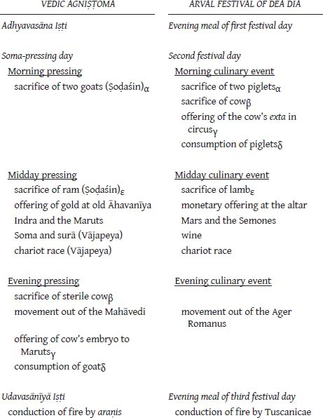

# CHAPTER 4. The Fourth Fire

## 4.10 THE ROBIGALIA

Having examined at length the Arval Festival of Dea Dia vis-à-vis the Vedic Agniṣṭoma, let us return to our survey of ritual sites along the distal border of the Ager Romanus. Among the remaining landmarks lying on that boundary, two especially capture our attention because, as in the Arval rites performed in the grove of Dea Dia, the god Mars is present. These we now consider in turn—first the Robigalia and then Mars’ temple on the Via Appia (§4.11).

The April ritual of the Robigalia, like the May rites of Dea Dia, is celebrated for the benefit of Roman fields. In this instance (see §3.3.6.2), the desired effect is quite specific: protection from fungus infestation is afforded by appeasing the deity of grain rust, Robigus or Robigo. The locale is a grove located along the Via Claudia at the fifth milestone from Rome. The Via Claudia runs north and slightly west out of Rome, taking a somewhat more westerly course at the Pontus Milvius, where it diverges from the Via Flaminia. The grove thus stands at a northwest coordinate along the boundary of the Ager Romanus, corresponding roughly to the southwest coordinate provided by the Arval grove on the Via Campana.

<!-- page_231 -->

<!-- page_232 -->

At the time of the Robigalia, not only are sacrifices made to the deity, but *ludi* are held in which runners compete (*Feriae Robigo Via Claudia ad milliarium V ne robigo frumentis noceat. Sacrificium et ludi cursoribus maioribus minoribusque fiunt*; *CIL* I2 pp. 236, 316). According to Tertullian (*De Spect.* 5), Numa Pompilius established *ludi* in honor of Robigus and Mars, an apparent

reference to the games of the Robigalia. As at the southwest locus of the Ager Romanus, so also at the northwest Mars again makes an appearance; at each locale the rites conducted look to the well-being of Roman fields. Just so, as we saw in §3.3.3, Mars figures prominently in Cato’s prayer of field lustration.

### *4.10.1 Agrarian Mars*

It is the conjoining of Mars to obvious agricultural exercises such as these which gave rise to the scholarly notion of an “agrarian Mars”—a Mars who is fundamentally a god of nature and plant growth. The idea is one which enjoyed considerable popularity in the late nineteenth and early twentieth centuries,[^ch4fn63] and which continued to exist long thereafter. Already in 1912, however, Wissowa had begun to dispel this notion (Wissowa 1971: 143):

> Mit Unrecht haben Neuere in diesen Flurumgängen einen Beweis dafür finden wollen, daß Mars von Haus aus ein Vegetations- und Ackergott sei: soweit die Überlieferung uns ein Urteil gestattet, ist Mars den Römern nie etwas anderes gewesen als Kriegsgott, und wenn man ihn um Schutz der Fluren anfleht, so geschieht das nicht, damit er das Wachstum der Saaten fördere, sondern damit er Kriegsnot und Verwüstung von den Feldern fernhalte.

Norden (1939: 216–222) took up the issue of the nature of Mars vis-à-vis his affiliation with the Semones in the Carmen Arvale. The picture emerges from Norden’s study of a Mars who provides protection, who drives away evil (*Übelabwehrer*), allowing the deities of agriculture to perform their tasks.

This doctrine of a guardian Mars working in concert with agrarian deities is methodically developed by Dumézil in *Archaic Roman Religion* (pp. 213–241). He does so by responding point by point to the arguments which H. J. Rose adduced in favor of “agrarian Mars”—Rose being a leading exponent of that theory in the mid–twentieth century. Following in the steps of Wissowa and Norden, Dumézil argues in effect that the idea of an “agrarian Mars” results from a confusion of place of operation with the operation itself: when Mars appears in an agrarian capacity he does so acting as the protecting, vigilant god of war exerting his martial powers in an agricultural setting (*ARR*: 228–229):

<!-- page_233 -->

> … Mars, in the invocations which the Fratres Arvales address to him, is at the same time this savage divinity and this watchful divinity, while in the lustration of the field which Cato describes he is only the watchful god, in no way involved in the mysterious processes which perpetuate vegetable life.

Dumézil interprets the various Ambarvalic rites of the Romans as establishing an unseen boundary which Mars, the divine protector, the god of battle, is called on to defend (*ARR*: 230–231):

> These ceremonies establish around the *ager*, the *urbs*, etc., an invisible barrier which, provided it is guarded, will be crossed neither by human enemies, whom the ramparts and the army are already prepared for, nor by malignant powers, themselves invisible, especially those which can cause sickness. … But these various rituals … do not make of Mars a specialist in anything but “protection by force”; his whole function is on their periphery which the processions render perceptible.

As for Norden, so for Dumézil, Mars’ presence at this peripheral space allows the deities of plant growth to function unimpeded by hostile forces (*ARR*: 231):

> On occasion he allows specialist divinities—in the Ambarvalia themselves, according to the *Carmen* [*Arvale*], the Lares, gods of the soil, and those designated by the term *Semones*, the animate form of the inanimate *semina*; Ceres, according to Virgil (*Georg.* 1.338)—to perform a technical, creative task which varies according to circumstance.

Scheid (1990: 621–622) seconds Dumézil’s view of Mars’ role in the rites of the Arvals and takes the interpretation a logical step further. The guardian Mars not only allows the Lares and Semones to accomplish their agricultural tasks, but he equally facilitates the actions of Dea Dia.

> … comme l’écrit G. Dumézil, Mars permet, par sa garde, à ces divinités spécialisées de faire un travail technique et créateur. Sur un plan plus général, Mars rend le même service à Dea Dia, en lui garantissant l’absence de toute mauvaise influence venue de l’extérieur. Cette collaboration entre Mars et une divinité «agraire» cautionnant la bonne maturation des *fruges*, Dea Dia, n’est pas isolée, comme le prouve le culte implanté sur la même rive du Tibre, au cinquième mille de la via Claudia, c’est-à-dire aux confins de *l’Ager Romanus antiquus*, qui s’adresse à Robigo, déesse de la rouille des blés, *et* à Mars.

<!-- page_234 -->

And so we arrive back at the Robigalia. Yet notice that given this interpretative

model, the role which the guardian Mars plays vis-à-vis Dea Dia (and the Semones and Lares) must be quite different than that which he fulfills at the grove of Robigus. Dea Dia, object of worship in the Arval rites, is a beneficent divinity whom Mars assists by warding off the evil and malignancy that would short-circuit her beneficence. In contrast, Robigus, placated at the Robigalia, *is* the malignancy. Varro, who has told us that the Fratres Arvales perform their rites so that Roman fields might be fruitful (*Ling.* 5.85), also writes (*Ling.* 6.16):

> Robigalia dicta ab Robigo; secundum segetes huic deo sacrificatur, ne robigo occupet segetes.

> The Robigalia is named for Robigo; sacrifice is made to this deity along the grain fields so that rust (*robigo*) may not seize the fields.

The rites of Robigus are celebrated at the boundary of the Ager Romanus; and an implicit notion of field-boundary is present in Varro’s words. The “invisible boundary” is there for Mars to protect, but what is he warding off so that the agrarian deity, Robigus, can function effectively? Nothing, of course; for it is Robigus himself (herself) who is being held at bay by the rites of April 25. Ovid states this plainly in the Robigalia prayer of the Flamen Quirinalis which he recites (see §3.3.6.2). Aulus Gellius (*NA* 5.12.14) makes it clear in his discussion of gods who have power more for harm than for help:

> In istis autem diis quos placari oportet, uti mala a nobis vel a frugibus natis amoliantur, Auruncus quoque habetur et Robigus.

> Moreover, among those gods whom one ought to placate so that evil might be warded off from us or from our growing crops are numbered also Auruncus and Robigus.

Columella (*Rust*. 10.337–343) makes it clearer, when after lamenting an infestation of the destructive *eruca* (a caterpillar) brought on by rains, he continues:

> Haec ne ruricolae paterentur monstra, salutis

> Ipsa novas artes varia experientia rerum

> Et labor ostendit miseris, ususque magister

> Tradidit agricolis, ventos sedare furentes,

> Et tempestatem Tuscis avertere sacris.

> Hinc mala Rubigo virides ne torreat herbas,

> Sanguine lactentis catuli placatur et extis.

> Hinc caput Arcadici nudum cute fertur aselli

> Tyrrhenus fixisse Tages in limite ruris.

<!-- page_235 -->

> That the tillers should not suffer with these beasts,

> mixed trial-and-error and labor have revealed

> to the unfortunates new skills of remedy, and customs

> a master passed on to the farmers, to calm raging winds,

> and to turn aside the storm by Etruscan rites.

> Hence lest malefic Rubigo should scorch green plants,

> She is placated with the blood and guts of a suckling pup.

> Hence the skinned head of an Arcadian ass, they say,

> the Etruscan Tages hung up at the rural boundary.

(Tages being the fabled Etruscan soothsayer who was credited with introducing haruspices to the Etruscans; see Festus p. 359M, Cicero, *Div*. 2.50).

The proposed relational model of guardian Mars present at the boundary, warding off menace, allowing invoked deities of plants and soil to function unharassed by ill, begins to break down at the Robigalia. The god there worshipped is a deity having a force that is *in laedendo magis quam in iuvando potentem*, who must be placated by canine sacrifice and implored in prayer “to keep scabrous hands from the harvest” (Ovid, *Fast.* 4.921). Yet Mars is there too.

Dumézil’s refutations of Rose’s arguments are reasoned and persuasive. Mars, at least in some “original” sense, was not an agrarian deity. His presence in the rites celebrated along the boundary of the Ager Romanus and in private Ambarvalic rituals with their own “invisible boundaries” is almost certainly a function of his fundamentally bellicose nature. As we shall see in chapter 5, however, my understanding of the motivation for Mars’ presence in the bounded spaces of those rites is not that articulated by Dumézil, his predecessors, and his followers.

## Notes

[^ch4fn63]: For references to several works of the period in which Mars is so presented, see Wissowa 1971: 143, n. 6.
