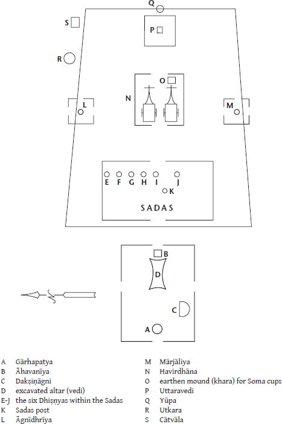
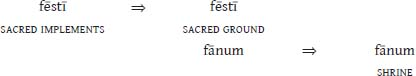

# CHAPTER 4. The Fourth Fire

## 4.3 THE MAHĀVEDI

To say that the fire which now lies at the eastern terminus of the axis formed by the Gārhapatya and Āhavanīya is a “fourth flame” is only partially accurate. While the flame is positionally distinct from the three canonical fires of the Devayajana (the small space of the Iṣṭi), it is in effect a new Āhavanīya, moved eastward from its original site (via the rite called the Agnipraṇayana, ‘the carrying forth of fire’); correspondingly, the original Gārhapatya is chain-shifted to the place of the original Āhavanīya. In fact, the entirety of the ceremony celebrated in conjunction with the Mahāvedi can be viewed as a ritual progression from west to east: the first rites within the sacrificial area are performed to the west, where the three fires are housed; on the altar of the “fourth” flame, at the eastern boundary of the Mahāvedi, the final rites are performed; the time in between is marked by much ritual activity, traversing the sacred spaces from west to east with fire and Soma.

<!-- page_144 -->

The Mahāvedi is a topographically complex space, measured out with ritual precision. Its western aspect is of greater length along the north–south axis than its eastern aspect, so that the entire area is trapezoidal in

shape.[^ch4fn1] At the western end of the Mahāvedi, immediately east of the (original) Āhavanīya, there is constructed the shed called the Sadas, already encountered in our discussion of the Sadas post (see §2.6.3.4). Being the height of the sacrificer at its midpoint (at the central east–west axis), and slanting to the height of his navel at the north and south ends, the Sadas houses six of the hearths called Dhiṣṇyas, each constructed for a different priest (the Hotar, the Brāhmaṇācchaḥsin, the Potar, the Neṣṭar, the Acchāvāka, and the Maitrāvaruṇa). The Sadas is said to belong to Indra (*ŚB* 3.6.1.1, while being identified as “Viṣṇu’s stomach”).

<!-- page_145 -->

Two other hearths are set up in the Mahāvedi, one at about the midpoint of the northern boundary of the space, the other due south of it, on the southern boundary. Each is covered by a square hut. The former is the Āgnīdhrīya, the Dhiṣṇya-hearth for the fire-carrying priest, the Agnīdh (or Āgnīdhra); and the latter hearth is that of the Mārjāliya. The hearth of the Agnīdh is said to be sacred to all the gods (*ŚB* 3.6.1.26–29); it is the first of the Dhiṣṇyas to be built (*ŚB* 9.4.3.5) and is lit from the fire of the Gārhapatya (*ŚB* 6.6.4.15). The Mārjāliya hearth is used for the cleansing of the ritual utensils (*ŚB* 14.2.2.43); in *Śatapatha Brāhmaṇa* 9.4.3.8 (a part of the description of the building of the great fire altar) we read that six bricks are placed on the Mārjāliya for the Pitaras (the Manes), being in the south, the region of the Pitaras.

<!-- page_146 -->

Between the two latter hearths, in the middle of the Mahāvedi, is built another shed, the Havirdhāna. After being anointed by the sacrificer’s wife (on which see Jamison 1996: 124–127), two Soma carts are moved eastward from the small sacred space of the Devayajana into the great sacrificial arena of the Mahāvedi. It is for the sheltering of these carts, following their journey from the west, that the Havirdhāna is built. The carts are parked side by side, facing east. Beneath the front portion of the cart parked to the south, four sound-holes are dug, the Uparavas, using formulas and a ritual akin to those used at the digging of holes for the *yūpa* and Sadas-post (see *ŚB* 3.5.4.1–24). The dirt from the Uparavas will be used for constructing the six Dhiṣṇya-hearths set up within the Sadas (see above). Over these holes boards are placed which will be used for pressing the Soma, the holes

amplifying the sound of the pressing. This shed, like the Soma carts it shelters, is sacred to Viṣṇu (*ŚB* 3.5.3.2).

Following the construction of the various sheds comes the ritual of “leading forth of Agni and Soma” into the Mahāvedi. The sacrificial post, the *yūpa*, is then prepared and erected as described in §2.6.1.

### *4.3.1 The conquest*

At least two aspects of worship within this enlarged ritual space, the Mahāvedi, are of particular interest and significance for our investigation. First, the movement of fire, Soma, cultic implements, priests, and the sacrificer from the smaller sacred ground of the Devayajana to the much enlarged space of the Mahāvedi is clearly presented as a journey, or more precisely, a migratory conquest. In her study of the sacrificer’s wife, Jamison (1996: 125) notes:

> Just as the journey to the new Āhavanīya has its ritual procession, so the driving of the Soma-carts to their garage in the middle of the Mahāvedi is accompanied with some fanfare. The wife’s anointing of the linchpins and the oblation in the wheel-tracks immediately precede the start of their eastern progress.[^ch4fn2] Despite the brevity of the journey, it is treated in some ways as if it were a pioneering expedition to the unknown east—as is dramatized by the wife’s anointing the pins in only one direction, toward the east, thus giving the wheels a preliminary warm-up spin.

Heesterman (1993) directly addresses the fundamentally itinerant and questing nature of the Agniṣṭoma—the model Soma sacrifice—with its ritual trek into the Mahāvedi (p. 126):

> But it is significant that carrying the fire and Soma to their place on the Mahāvedi (Agnīṣomapraṇayana) is pictured as a wide-ranging, conquering progress. … The Mahāvedi is a temporary encampment that will be left again after completing the Soma sacrifice. And indeed, at the end of the Soma ritual proper, a cow dedicated to Mitra and Varuṇa is sacrificed, and finally the fires are taken up in the fire drill to settle elsewhere for, again, another sacrifice, the “breaking-up” Iṣṭi.

In offering these observations, Heesterman alludes to the mantra of *Taittirīya Saṃhitā* 1.3.4.c, spoken as the priests make their way toward the altar of the Agnīdh within the Mahāvedi (Keith 1967: 39, with modification):

<!-- page_147 -->

> May Agni here make room for us;

> May he go before us cleaving the foe;

> Joyously may he conquer our foes;

> May he win spoils in the contest for spoils.

The priestly procession into the great sacred space is an invasion, divinely led and bent on acquisition of space and spoils. Addressing the elaborate landscape of the Mahāvedi of the Soma sacrifice, Heesterman (1993: 128) continues:

> Apart from the shed where the two carts are put … at the back of the oblational hearth, there are the Āgnīdhrīya and the Mārjāliya or cleansing huts on the northern and southern boundaries, each with its own fire hearth, and, in between these two huts, the Sadas where the Dhiṣṇya hearths are located, and where the Soma is drunk. … The Soma Mahāvedi would seem to continue the tradition of an independent temporary emplacement at a considerable distance, somewhere out in the wilderness. Otherwise it would be hard to explain the presence of the two Soma carts solemnly driven to their shed on the Mahāvedi—an act that, given the limited space, looks distinctly odd if not somewhat comical.

<!-- page_148 -->

Among other evidence which Heesterman (1993: 128–129) cites for the conceptualization of the sacrifice as an expedition is that provided by the ritual called the Yātsattra, the various Sattras (‘sessions’) being rituals having more than twelve Soma-pressing days (see Keith 1998a: 349–352; Renou 1957: 107).[^ch4fn3] The Yātsattra is dedicated to the goddess Sarasvatī (*KŚS* 24.5.25) and takes the form of an eastward journey along the Sarasvatī river; the trek begins in the desert regions where the river disappears and continues on to the river’s source at Plakṣa Prāsravaṇa (a distance of forty days by horseback; *PB* 25.10.16). Each day of the ritual the hearth of the Gārhapatya is moved progressively farther to the east, the distance moved being determined by the throw of a *śamyā*, a wooden yoke-pin. In the usual case, what is being advanced each day, however, is the Mahāvedi, the relocated Gārhapatya no longer being identified with the original fire of the ritual

ground of the Devayajana. Like so many sacral mobile-units, the Sadas, the Āgnīdhrīya shed, and the shed for the Soma carts, the Havirdhāna, are all built on wheels so they can be easily advanced to the next day’s location. Similarly, the base of the *yūpa* is given a shape which will facilitate its being dragged to a new, extended boundary (on all of which, see *PB* 25.10.4–5). The Brahmans who advance into this self-perpetuating sacred space take with them a herd of one hundred cows and one bull and the hopeful expectation that the herd will have grown to one thousand head by the end of the sacrificial journey. If the herd should increase to that number before Plakṣa Prāsravaṇa is reached, the sacrificial session is terminated. Cessation of the rite likewise occurs if the cattle should all die or if the sacrificer should die before the ritual “land’s end” is reached (*PB* 25.10.19–22; *KŚS* 24.6.16). At the union of the Sarasvatī and the river Dṛṣadvatī, an offering is made to the fire god who burns within the waters, Apām Napāt.[^ch4fn4] Upon arrival in the region of Plakṣa Prāsravaṇa, an Iṣṭi is performed for the fire god in the form of Agni Kāma ‘erotic desire’. In addition, a female slave and a mare who have recently given birth are presented as a gift, along with their offspring, to someone in that place (*PB* 25.10.22; *KŚS* 24.6.5).

In this sacred expedition and cattle drive, Heesterman (1993: 129) sees a reflection of more mundane nomadic activities:

> In reality the Yātsattra reflects the transhumance circuit with fire and cattle. Its sacral aspect has been lifted out of its natural context and ritualistically translated into a daily moving sacrificial ritual that completely fills out the intervals between encampments.

<!-- page_149 -->

Indeed such nomadic behavior and its age-old antecedents may inform the structure of the rite; but there is more here than just a rote transference of cyclic migration to a sacred realm (and Heesterman undoubtedly does not mean to suggest otherwise). The Yātsattra is not only a pageant but a metaphor. As in the basic Agniṣṭoma and its more typical variants, the ritual is accomplished toward the realization of specific advantage for the sacrificer. Perpetual eastward movement through sacred space, measured out by one *śamyā* toss after another, brings the sacrificer to the heavenly world. According to the *Pañcaviṃśa Brāhmaṇa* (25.10.16), the distance from the ritual’s starting point in the desert to its end point at Plakṣa Prāsravaṇa is equivalent to the distance from earth to heaven: “they go to the world of heaven by a journey commensurate with the Sarasvatī” (Caland’s translation). It was by this ritual that one Namin Sāpya, king of Videha, passed

immediately into the heavenly world (*PB* 25.10.17). The journey by the Sarasvatī is the path to the gods (*TS* 7.2.1.3).

Reminiscent of the stepwise Soma ritual conducted eastward along the Sarasvatī is the legend of Māthava Videgha (noted by Heesterman, 1993: 129), which perhaps embodies a collective memory of Indo-European advances into India. The tale is preserved in *Śatapatha Brāhmaṇa* 1.4.1.10–19. Māthava Videgha carried the fire god Agni Vaiśvānara (Agni ‘for all the people’) within his mouth. His family priest, Gotama Rāhūgaṇa, addressed Māthava but received no response, Māthava Videgha fearing that Agni would slip through his lips if he should speak. The priest thereupon recited various verses to Agni, and at the mention of “ghee” in one verse (*RV* 5.26.2), Agni bolted from Māthava’s mouth. The fire fell to the ground and swept eastward along the Sarasvatī, by (or in) which Māthava had been standing. The fire continued cascading eastward, pursued by Māthava Videgha and his priest, as far as the Sadānīrā river. This river—flowing cold from the Himalayas—the fire did not devour as it had all other rivers in its path. For that reason the Brahmans did not pass beyond that river in olden days, this *Brāhmaṇa* reports, though they had done so by that period which the work recognizes as the “present day.”

One could well imagine that the tradition of an ancient eastward advance of Agni along the Sarasvatī provided a certain historical and theological legitimization for situating the ritual journey of the Yātsattra in that geographical space. As we have seen, however, the notion of Soma ritual as a journey is not unique to the sessions along the Sarasvatī. In Heesterman’s words (1993: 129):

> The Yātsattras cannot be viewed as a special or exceptional case. … It is this mobile pattern that is preserved, in telescoped form and drawn together within the confines of the single *devayajana*, by the basic paradigm of the soma ritual, the Agniṣṭoma.

### *4.3.2 Sanskrit Dhiṣṇyaḥ*

<!-- page_150 -->

The second feature of the enlarged ritual ground of the Mahāvedi of which we should take note is that of the various hearths raised along the northern and western boundary of that great ritual space, the Dhiṣṇya-hearths. As pointed out above (§4.3), the Āgnīdhrīya (the Dhiṣṇya-hearth located along the northern boundary of the Mahāvedi) and the six fires of the Sadas each belong to a different priest. These seven hearths along with the (new) Āhavanīya on the eastern boundary, standing next to the *yūpa*, and the Mārjāliya on the southern border are said to be raised for the protection

of the Soma (*ŚB* 3.6.2.22); the Dhiṣṇyas once guarded Soma in the world beyond, before it was taken by the gods (*TS* 6.3.1.2).

The Sanskrit name for these priestly hearths is an ancient one, descended from Proto-Indo-European cultic terminology. Beyond its nominal use, *Dhiṣṇyaḥ* occurs adjectivally with the meaning ‘devout, pious, holy’. Its origins can be traced to the Proto-Indo-European root **dʰeh₁s-*. This root provides Armenian *dik‘* ‘gods’ and may well be the source of the Greek word for ‘god’, θεός. Italic reflexes are well attested and widespread. The suffixed form **dʰeh₁s–yeh₂-* gives Latin *fēriae* (Early Latin *fēsia*; see Festus, pp. 86, 264M), ‘a religious festival, holy day’. Formed with a *to-* suffix, the stem **dʰeh₁s-to-* develops into Latin *fēstus* ‘festive’, commonly occurring in the phrase *diēs fēstus* ‘holy day’—which certainly preserves in a frozen context an archaic sense of the adjective. The zero-grade *no-* stem, **dʰh₁s-no-*, gives rise to Latin *fānum* ‘plot of consecrated ground’ (as in Livy 10.37.15), from which develops the senses ‘shrine, temple’; compare Italic cognates with similar meanings, Oscan *fíísnú* (nominative), Umbrian *fesnaf-e* (accusative plural + enclitic postposition), Paelignian *fesn*.

Though earlier investigators seem to have neglected it, there is certainly one other Latin reflex of Proto-Indo-European **dʰeh₁s-*. More precisely, this reflex is a variant of one of the above; and this reflex is, of course, Strabo’s *fēstī* (φῆστοι), *<*dʰeh₁s-to-*, the sacred “place” (τόπος) where the priests celebrate the Ambarvalia on behalf of the Roman people. The “place” is undoubtedly not a geographic locale, as has been widely assumed, but an element of cultic topography. It is not a town or a village, but an altar or a fire or some similar sacrificial “spot.” Strabo’s term, τόπος, is commonly used to denote some kind of “place” other than a geographic one. Given the plural morphology of the term, at least in origin it must have denoted a set of such cultic items; and we are reminded immediately of its Sanskrit counterpart and the multiple number of Dhiṣṇya-hearths set up in the Soma sacrifice, each belonging to a priest. One might wonder if such a multiplicity is reflected in Strabo’s report that the priests (ἱερομνήμονες) “celebrate the sacred festival both there and, on the same day, at still other places (ἐν ἄλλοις τόποις)—these being boundaries.”

<!-- page_151 -->

Or perhaps by Strabo’s day the term *fēstī* had come to denote, by a metonymic shift, the site(s) of the sacred ground consecrated for the celebration of the rite. In this case *fēstī* is semantically equivalent to *fānum* in its earlier sense, which itself undergoes an eventual shift in meaning from ‘consecrated ground’ to ‘temple, shrine’. One would then suspect that the two forms participate in a semantic chain shift, a common enough phenomenon

in the history of language. In other words, one advancing meaning displaces the next:

Particularly instructive for the development of *fēstī* is the semantic evolution evidenced in Latin singular *aedēs* ‘temple, sanctuary, shrine’, plural *aedēs* ‘house, household’ from the Proto-Indo-European root **h₂ei-* ‘to burn’. This root, in the extended form **h₂ei-dʰ-*, is also the source of Greek αἴθος ‘fire, burning heat’; Sanskrit *édhaḥ* ‘firewood’; Old Irish *aed* ‘fire’; Welsh *aidd* ‘heat’; Old Icelandic *eisa* ‘fire’. In this instance the denotation of the Latin reflex of **h₂ei-dʰ-* clearly shifts from a sense ‘fire’ to ‘place of the fire’.

An additional and partially overlapping consideration is this. Semantic variation between the singular and plural forms of a noun—even as in *aedēs* (singular) ‘temple, sanctuary, shrine’ beside *aedēs* (plural) ‘house, household’—is well known in Latin. Examples include the following, to name but a few: *castrum* ‘fortified post’, *castra* ‘camp’; *fīnis* ‘boundary’, *fīnēs* ‘territory’; *littera* ‘letter’ (that is, ‘alphabetic symbol’), *litterae* ‘letter’ (that is, ‘document’, ‘scholarship’). In most of the preceding instances, and in other similar examples, the denotative shift moves from particular instance to a broader expression of which the particular instance is a part.[^ch4fn5] In the present case we may be dealing with a variation of the sort *fēstus* ‘sacred X’, *fēstī* ‘sacred ground’ (that is, ‘ground/space of the sacred X’), where X is a hearth or some similar cultic apparatus.

Notice also that given the interpretation of *fēstus*, *fēstī* proposed here, the Latin term matches the semantics of the Sanskrit exactly. The Proto-Indo-European thematic suffixes **-to-* and **-no-* are both used to derive adjectives from verb roots; their use is essentially equivalent (though presumably at some very early period of Proto-Indo-European linguistic history there was some distinction in that use). Sanskrit *Dhiṣṇyaḥ* preserves the *no-* stem form of the adjective derived from **dʰeh₁s-*, Latin *fēstus* the *to-* stem. Both have the same meaning, ‘sacred, holy’, and both are pressed into service as nouns to name a topographic feature of the cultic ground of sacrifice.

<!-- page_152 -->

Like Sanskrit, Latin also shows a *no-* stem form—the *fānum* of our chain-shifting

model presented above—preserving the archaic zero-grade of such derivatives, **dʰh₁s-no-*. In its earliest attested use, it has been already nominalized to denote the sacred ground; the adjective survives in the prefixed form *profānus* ‘profane, secular, polluted’. Beside *profānus*, compare *profēstus*, used of days which are not sacred (on *profānus* and *profēstus*, see Benveniste 1960).

Regardless of semantic specifics, what is most significant is the cognate relationship which exists between a Latin and a Sanskrit term denoting cultic elements associated with religious rites of bounded, bordered sacred spaces. Undoubtedly we must look for a common origin in the vocabulary and practice of Proto-Indo-European ritual.

## Notes

[^ch4fn1]: As described in *Śatapatha Brāhmaṇa* 3.5.1.1–11, the western border of the Mahāvedi stretches 30 steps—15 “steps” north and south of a benchmark peg driven into the ground on that border, along the east–west axis passing through the *Gārhapatya* and *Āhavanīya*. The eastern boundary falls 36 steps from this peg and extends for 24 steps—12 steps north and south of the east–west axis (cf. *ŚB* 10.2.3.1–18, where dimensions of the ground of the Iṣṭi are also given). A ‘step’, *prakrama*, is about 3 feet.

[^ch4fn2]: See *Śatapatha Brāhmaṇa* 3.5.3.13–17 for the ritual of the wife anointing the cart.

[^ch4fn3]: Consider Keith’s (1998a: 349–350) encapsulating summary: “The Sattras all differ from other forms of the Soma sacrifice, because all the performers must be consecrated and must be Brahmans: there is therefore no separate sacrificer: all share in the benefits of the offering: each bears the burdens of his own errors, whereas at the ordinary sacrifice the sacrificer receives the benefit and the evil results of errors alike. … The aims of the Sattras are most various: the obtaining of wealth, of cattle, of offspring, of prosperous marriage, and many other things. Much as they are, it is clear, elaborated by the priest, they reflect here and there primitive conceptions of sacrifice.”

[^ch4fn4]: A similar Sattra is conducted along the course of the Dṛṣadvatī; see *PB* 25.13.

[^ch4fn5]: Also, in Latin pluralization is used to derive concrete nouns from abstracts.
