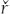
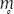

# CHAPTER 4. The Fourth Fire

## 4.6 THE PUBLIC AMBARVALIA

Between the fifth and sixth milestones from Rome along a road of, unfortunately, undisclosed identity, the priests that Strabo calls ἱερομνήμονες celebrate the state festival of the Ambarvalia, or Ambarvia by Strabo’s record (see §3.3.1). The festival, as we have seen, is celebrated not only here, at this boundary place, but at several other boundary locales as well and on the same day. These places being boundaries, *termini* are certainly involved. Moreover, as we have argued (see §4.3.2), other cultic implements having homologous structures found within the Vedic Mahāvedi are also present: *fēstī*, quite probably hearths, cognate in name and likely in function to the Dhiṣṇya-hearths of the several priests of the Soma rituals.

Viewed within the context of the Ager Romanus as the great sacred space—ritually comparable and evolutionarily homologous to the Vedic Mahāvedi—the name of the festival takes on new significance. An idea that one commonly encounters in the scholarly literature on the Ambarvalia is that the state ritual essentially replicates the private rites of field lustration, but on a much larger geographic scale, with the result that a circumambulation using the *suovetaurilia*, of the sort described by Cato (see §3.3.3), must necessarily be omitted from or in some way modified in the public observance. For example, Kilgour (1938: 228) writes:

> … there is the practical difficulty of conducting such a procession round the boundary of the Ager Romanus once, much less three times. Even in the earliest days, when Rome had just become a city, this must have caused a rite so elaborate, if it were ever conceived, to be very early abandoned.

<!-- page_158 -->

And then, commenting on Strabo’s account of the public Ambarvalia (p. 229):

> There, it is not suggested that any circumambulation of the Ager Romanus took place, but rather, as we should expect, that sacrifices were made at a particular spot or spots on the boundary, the whole ceremony being intended as a symbolical lustration of the Ager.

Quite similarly, Scullard (1981: 125) observes:

> When Rome was a group of Iron Age villages, victims could easily be driven round the bounds of each settlement and later around the united town. But as Rome grew, it would become physically impossible to follow her expanding boundaries beyond a few miles: instead sacrifices were apparently made at certain fixed points.

Warde Fowler (1899: 125), speaking of the Fratres Arvales and the Ambarvalia in the same breath, remarks:

> … it is almost certain that, as the Roman territory continued to increase, the brethren must have dropped the duty of driving victims round it, for obvious reasons.

The reader gets the picture.

It is indeed most improbable that the *suovetaurilia* were ever driven around the perimeter of the Ager Romanus. Anyone familiar with handling the modern domesticated boar, presumably bred to be somewhat more docile than his ancient ancestor, can hardly imagine getting such a creature around even a single field. The Vedic rites which we are using for comparison suggest something very different, and this something different is probably preserved in the Latin name of the event, Ambarvalia. The morphology of the term is straightforward, being a derivative of *amb(i)-* + *arvum*; the semantics of the term may, however, be somewhat less obvious.

Latin *arvum* denotes ‘field’, ‘ploughed land’ as well as simply ‘ground, territory, countryside’. An Umbrian cognate survives in **arvam-en**, accusative singular plus the postposition **-en**, meaning ‘to the field’, as well as locative **arven** ‘in the field’. The Umbrian forms are preserved in the rites of the priests called the Atiedian Brothers—recorded in the Iguvine Tables—and occur in the following context (table III 7–14; text and translation from Poultney 1959: 202–204):

<!-- page_159 -->

> **iinuk : uhtur : vape[image-glyph: unresolved image00346]e : / kumnakle : sistu : sakre : uvem : uhtur : / teitu : puntes : terkantur : inumek : sakre : / uvem : urtas : puntes : fratrum :**
> **upetuta : / inumek : via : mersuva : arvamen : etuta : / erak : pir : persklu : u[image-glyph: unresolved image00346]etu : sakre : uvem : / kletra : fertuta : aituta : arven : kletram : / amparitu : eruk : esunu : futu :**

> Then the *auctor* shall sit on the stone seat in the meeting-place. The *auctor* shall designate a young pig and a sheep, the groups of five shall inspect them, then the groups of five rising shall accept the young pig and the sheep. Then they shall go by the accustomed way to the field. On the way load the fire [with incense] with a prayer. They shall lift and carry the young pig and the sheep on a litter. Set up the litter in the field. Then the sacrifice shall take place.

The “field” is clearly a place of ritual significance, though of uncertain location; following Rosenzweig (1937: 18–19), Poultney (1959: 203) suggests it may be “the level plain near the Roman theatre where the [Iguvine] Tables were discovered.” After the victims are taken to this field, they are then sacrificed, but not in the field, rather in a grove (or temple, **vukum**). The **sakre** (‘young pig’; compare Untermann 2000: 650–651) is offered to Jupiter (**Iuvepatre**) and the sheep to the god Pomonus Poplicus.

The Latin preverb *amb(i)-* means ‘round, about’; its sense is less fundamentally ‘around’: “Le sens est plutôt «de chaque côté de» que «autour» (*circum* et gr. περί) proprement dit” (*DELL*: 26). Both senses characterize the Proto-Indo-European etymon **ambʰi*, **[image-glyph: unresolved image00427]bʰi* (*WP*, vol. 1: 54). In Latin words made with *amb(i)*, the meaning is commonly that of (indirect) movement within and through some sphere of activity—sometimes this is the sole sense, sometimes it co-occurs with the sense of movement around the periphery. Let us consider a few examples (in all instances, see *OLD*):

1 *Ambages* (from *amb(i)-* + *ago*) denotes chiefly ‘a meandering’, ‘a wandering about’, also some sort of evasive movement or discourse; similarly, *ambiguus* is ‘wavering, having uncertain direction’.

2 *Ambio* (from *amb(i)-* + *eo*) is ‘to visit (in rotation)’, ‘to go round’, or ‘to bypass’; also ‘to encircle, surround’; similarly, *ambitiosus* means ‘winding, twisting, embracing’.

3 *Ambulo* (from *amb(i)-* + the Latin reflex of Proto-Indo-European **h₂elh₂-* ‘to wander, go aimlessly’ (*LIV* 264), not surviving as a simplex form in Latin) means ‘to walk, go about, walk abroad, to march’; it does not mean *‘to go around a perimeter’.

4 *Amfractus* (from *amb(i)-* + *frango*) denotes ‘a bend’, ‘a winding course, a turn in the road’; also ‘the circular course of a heavenly body’.

5 *Anquiro* (from *amb(i)-* + *quaero*) is ‘to seek, search for’.

<!-- page_160 -->

If we are correct in identifying the functional equivalence and common historical origin of the great sacred spaces of Vedic India and of Rome,

ritual movements within the sacred space of the Vedic Mahāvedi suggest that *ambarvalis* originally denotes the movements of priests (and sacrificer?) within the great sacred ground of the Ager Romanus—movement not around its periphery, but movement across the space from the proximal boundary of the *pomerium* to the distal boundary of the Ager Romanus. The recurring Latin use of *amb(i)-* in the sense of ‘meandering’, ‘twisting’—that is, ‘from side to side’—suggests that the archaic ambarvalic journey is not a straight passage through the sacred space, but involves priestly trips here and there, just as in India, perhaps visits to several *fēstī* and/or other features of cultic topography within the great sacred ground. And perhaps the sense of Strabo’s claim that the public Ambarvalia are celebrated at various places that are boundaries is this—that the priests in their ambarvalic journeying move from one *terminus* to another within the great sacred space, or that the Ambarvalia in toto involves priests or teams of priests wandering through the Ager Romanus, individually concluding their sacred journeys at one of several *termini* marking the distal boundary of this space, as many as are required for properly observing this public festival.

There is yet another consideration, and possibly one of even greater significance for the Latin semantics. In Vedic ritual the very journey of priests from the small space of the Devayajana into the great space of the Mahāvedi is itself not one which traverses the shortest possible distance. When fire from the Āhavanīya is placed in a pan of gravel and conducted eastward to the Uttaravedi at the distal end of the Mahāvedi (the Agnipraṇayana; see §4.3), the route which is followed is an indirect one which leads from the conjunction of the two contiguous spaces, up along the northern edge of the Mahāvedi, and over and down to the Uttaravedi (see Eggeling 1995: pt. 2: 122, n. 3; for the circuitous route followed by the priests in the Agniṣṭoma which Martin Haug witnessed in the mid–nineteenth century, see the end map in Haug 1922).[^ch4fn11]

<!-- page_161 -->

Similar is the route of the priests and sacrificer as they pass from

the space of the Devayajana into and through the Mahāvedi in the rite of Agnīṣomapraṇayana, “the carrying forth of fire and Soma”—that rite which we have seen, in Heesterman’s words (1993: 126), to be “pictured as a wide-ranging, conquering progress” (see §4.3.1). Following the construction of the various sheds and hearths within the Mahāvedi and the eastward journey of the Soma carts, and prior to the erection of the *yūpa* and the offering of the animal sacrifice, fire, Soma, and various movable cultic implements[^ch4fn12] are transported from the small space into the large. With Agni ‘fire’ leading the way—warding off evil spirits, striking down those who hate, gaining riches and conquering the enemy (*ŚB* 3.6.3.11–12)—the procession of fire and Soma moves into the Mahāvedi, heading first to the northern-most Dhiṣṇya-hearth, the Āgnīdhrīya (see §4.3). After the Adhvaryu lays fire on that hearth, the procession continues to the north side of the Uttaravedi at the eastern boundary of the Mahāvedi, and then west and south to the Soma-cart shed (the Havirdhāna; *ŚB* 3.6.3.12–21).

The use of Latin *ambarvalis* to denote ritual movement through the great sacred space of the Ager Romanus linguistically replicates the attested circuitous movements of priests and sacrificers within the corresponding Vedic ritual space. Both point back to a common Proto-Indo-European practice of a journey made around and about a sacred ground delimited for sacrifice. Each is evidence of an internalization of a single ancestral tradition.

The deeply archaic prayer preserved for us by Cato (*Agr*. 141), recited at a rite of land lustration (see §3.3.3), appears clearly to support this interpretation of a wandering journey within the sacred arena:

> Cum divis volentibus quodque bene eveniat, mando tibi, Mani, uti illace suovitaurilia fundum agrum terramque meam quota ex parte sive circumagi sive circumferenda censeas, uti cures lustrare.

> So that each [victim] may be allotted propitiously to the good-willed gods, I bid you, Manius, that you determine in which part that *suovitaurilia* is be driven or carried around my farm, land (*ager*) and earth—that you take care to purify.

<!-- page_162 -->

This movement of the *suovitaurilia* within the sacred space of this private

rite is not simply a driving around the periphery. The journey of the threefold sacrifice is not predetermined. A god of the ground, Manius, is invoked to lead the victims in the proper path though the sacred space of the farm—whatever path that might be—in order to ensure or maximize the efficacy of the purificatory rite.

Cato’s rite of land lustration is certainly part and parcel of a set of Roman ambarvalic rites. This is widely recognized. As we proposed above, the members of this set are synchronic variants of the same sort as the many variants of the Soma ritual in Vedic India. Both sets, Roman and Vedic, have a common origin in the cultic life of their common ancestors, the Proto-Indo-Europeans. There is, however, a fundamental difference in the internal composition of the two sets; and this difference follows from the nature of the Roman and Vedic societies. The Vedic rites preserve basic features characteristic of a pastoral society and its nomadism. The site of the Gārhapatya must be swept of animal dung before the flame is established. The sacred spaces, both the small space of the Devayajana and the great space of the Mahāvedi, are temporary structures, put down and taken up like the encampments of a people on the move. The various forms of the Soma rite all involve the same kinds of spaces, however. All are variations on the theme of the Agniṣṭoma with an Iṣṭi and subsequent rites conducted within the Mahāvedi.

Things are different at Rome. In the landed society of the Romans, not nomadic but sessile, it is the constant and unmoving temple of Vesta, where no animals are kept, that must be annually cleansed of “dung” (*stercus*; a fossilized remnant of the archaic Indo-European procedure survives and is observed annually; see §4.12). The small sacred space, that within the *pomerium*, and the great space, that lying between the *pomerium* and the far boundary of the Ager Romanus, are of permanence; though the boundary of the *pomerium* and that of the Ager Romanus certainly shifted at times. Variation among related rites is more complex in Rome; it is probably not so in terms of casuistic complexity, but it is so to the extent that variation involves not only formal permutations of ritual elements, but the use of different planes and regions of the total sacred space of Roman society. One might say that Roman ritual variation is more complex geometrically.

<!-- page_163 -->

The various rites and ceremonies which involve some sacred locale on the distal boundary of the Ager Romanus geographically constitute so many ritual wedges of that great sacred space. However, similar rites are celebrated in both the private and public domain, within more confined areas which are superimposed on the small and great sacred grounds. Such

rites are celebrated on the many plots of privately owned land and in public subdivisions of urban space—many of those same spaces with which one normally associates a presence of Lares. The early Indo-European rites of the sacred movable spaces of a pastoralist people, ceremonies which involve a ritual questing journey into a sacred ground as revealed in Vedic tradition, have given rise to Roman rites of fixed space, already subdued and possessed.

In the case of Roman rites celebrated on privately owned property—ambarvalic rites of field lustration—the role of the sacred ground has undergone a theological shift. No longer is it only the medium of the sacred journey and sacrifice; instead, it has become the object of the sacrificial ritual as well. No longer is it the space invaded so as to facilitate a metaphysical possession of the earth; it is now actually possessed ground in need of protection and purification. The space of ambarvalic lustration remains the arena of the sacred, but it is now possessed space. As a consequence, the boundary marker of the sacred ritual ground is no longer a temporary, even movable, cultic implement—as the Vedic *yūpa* remains. In Rome it has become the fixed *terminus*, permanent in nature, protected by the law of Numa, tampered with on pain of death. Yet the longed-for result of the ritual conducted within the space so bounded remains in essence unchanged. Just as the Vedic sacrificer journeys into the Mahāvedi, all the way to the *yūpa*, touching it, even mounting it, in order to obtain blessings of increase and prosperity, so for the same blessing does the Roman landowner lustrate his fields. What is more, annually the landowner and his neighbor honor Terminus at the *terminus* erected on their shared boundary. And at the public festival celebrated on the same day, it would seem, the old doctrine of metaphysical possession of the earth, accomplished by a journey to the limits of the great sacred space, is dusted off and trotted out (see §4.5).

<!-- page_164 -->

Let us return briefly to the matter of the presence of sacrificial victims at the public Ambarvalia. As we noted in §3.3.6.3, Strabo provides no indication that his public ritual is one that entails the use of the *suovetaurilia*; though, as we have witnessed, this is commonly assumed. Such an assumption may or may not be warranted; we observed in §3.3.5 that the *suovetaurilia* and circumambulatory rites are separate ritual components inherited in Rome and Vedic India from Proto-Indo-European tradition, and we examined variation in these features among the several “ambarvalia-type” rituals. Regardless of whether or not Strabo’s priests are offering the set of victims which consists of a boar, ram, and bull, his use of θυσία to denote the rite celebrated (οἵ θ’ ἱερομνήμονες θυσίαν ἐπιτελοῦσιν)

certainly reveals that sacrifice is being made at these various boundary locales, as we would expect.

## Notes

[^ch4fn11]: In 1863, Haug (1922: iv–v) wrote: “… I made the greatest efforts to obtain oral information from some of those few Brāhmaṇs who are known by the name Śrotriyas, or Śrautis, and who alone are the preservers of the sacrificial mysteries as they descended from the remotest times. The task was no easy one, and no European scholar in this country before me even succeeded in it. This is not to be wondered at; for the proper knowledge of the ritual is everywhere in India now rapidly dying out, and in many parts, chiefly in those under British rule, it has already died out. Besides, the communication of these mysteries to foreigners is regarded by old devout Brāhmaṇs (and they alone have the knowledge) as such a monstrous profanation of their sacred creed, and fraught with the most serious consequences to their position, that they can only, after long efforts, and under payment of very handsome sums, be prevailed upon to give information. Not withstanding, at length I succeeded in procuring the assistance of a Śrauti, who not only had performed the small sacrifices, such as the Darśapūrnamāsa Iṣṭi, but who had even officiated as one of the Hotars, or Udgātars, at several Soma sacrifices, which are now very rarely brought. In order to obtain a thorough understanding of the whole course of an Iṣṭi and a Soma sacrifice, I induced him (about 18 months ago) to show me in some secluded place in my premises, the principal ceremonies.”

[^ch4fn12]: See, for example, the set of items enumerated in *Śatapatha Brāhmaṇa* 3.6.3.10.
