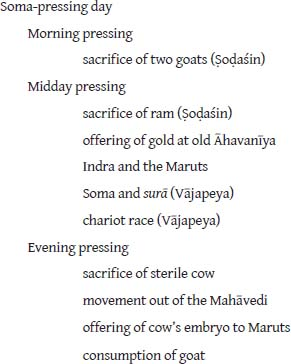

# CHAPTER 4. The Fourth Fire

<!-- page_167 -->

## 4.8 THE SOMA-PRESSING DAY

The priests have journeyed into the great sacred space of the Mahāvedi. Completed are the days of preparation and the three Upasad days (the days of, inter alia, acquisition of the Soma, preparation of the altars, erection of the various sheds and the *yūpa*, celebration of the rites described above). It is now the day of the Soma feast, when Soma plants will be pressed and the Soma beverage consumed and offered. The centerpiece of this day of myriad ritual is the midday pressing of Soma (Mādhyandinasavana; *ŚB* 4.3.3.1–4.3.4.33), bracketed by a morning pressing (Prātahsavana) and an evening pressing (Tṛtīyasavana; *ŚB* 4.3.5.1–4.5.2.18). Each of these three events is described below; the descriptions are summary rather then exhaustive in the presentation of ritual detail.[^ch4fn15] To provide the reader with a guidepost, some seminal elements of the pressing day which will prove to be of particular interest to us are outlined in figure 4.2.

<!-- page_168 -->

### *4.8.1 The morning pressing*

The day begins with prayers to Agni, god of fire, Uṣas, the dawn goddess (cognate and equivalent to Latin *Aurora*, Greek Ἠώς), and her twins sons, the Aśvins. Next follows the morning pressing of Soma in two parts—a preliminary pressing followed by the Mahābhiṣava, ‘great pressing’ (which itself consists of three rounds of pressing).[^ch4fn16] Subsequent to the pressing of the Soma, there occurs a procession of priests and sacrificer; while the Hotar remains seated at the Soma-cart shed, a column led by the Adhvaryu, followed by five other priests and the sacrificer, each holding the clothing of the preceding person, moves northward within the Mahāvedi toward the altar. Then positioning themselves close to the Cātvāla, the pit just beyond the northern boundary of the Mahāvedi (at the northeastern corner), the Adhvaryu throws a stalk of grass toward the pit and the *Bahiṣpavamāna stotra* is chanted (*ŚB* 4.2.5.1–7; Caland and Henry 1906: 171–172).

A goat is sacrificed to Agni, as a part of the rites of the morning pressing, and it will be cooked throughout the day.[^ch4fn17] If the particular variant of the Agniṣṭoma celebrated is that called the Ukthya (characterized by the chanting and recitation of five, rather than three, sets of *stotras* (hymns) and *śastras* (praise songs) during the evening pressing, and so having the same number of such sets as the two earlier pressings), then *two* goats are sacrificed. In this instance, the second victim is offered both to Agni and to Indra (see *ŚB* 4.2.5.14).

In addition to the above rites, the morning pressing includes various cake offerings and offerings of other grain products as well as, of course, the numerous priestly libations and draughts of Soma. An element common to the three pressings of the day is the ritual movement called *sarpaṇa* (a ‘creeping’; compare Latin *serpo* ‘to crawl, to wind, twist, to creep’; Greek ἕρπω ‘to creep, to crawl’). The term connotes the movement of priests to and from the Dhiṣṇya-hearths in the Sadas. According to the *Kātyāyana Śrauta Sūtra* (9.6.33), at the time of the morning pressing, the movement is to be made in a sitting position; during the midday pressing the priests proceed while assuming a bent-over posture; and for the evening pressing they are to walk erect. While sitting by the several fires in the Sadas, to which they have crept, the priests consume their cups of Soma.

<!-- page_169 -->

### *4.8.2 The midday pressing*

The midday pressing belongs almost exclusively (*niṣkevalya*) to the warrior god Indra (*ŚB* 4.3.3.6). In conjunction with Indra, ritual attention is also paid to the Maruts—thus Indra Marutvat is invoked, Marutvatīya cups of Soma are drawn, and so on. The Maruts[^ch4fn18] are a band of warrior deities, sons of Rudra (later Śiva), who are especially closely linked to Indra as comrades-in-arms, but are at times also associated with Viṣṇu, and also with Parjanya, god of rain and thundering storm, or Trita Āptya, another warrior deity affiliated with and showing similarities to Indra. Their mother is said to be a cow, identified with the goddess Pṛśni. In *Rig Veda* 1.133.6 their number is said to be “thrice-seven,” while in the *Rig Veda* 8.85.8 they are “thrice-sixty.” They are known for their singing, which brings strength to Indra, and they play the pipe. In domestic ritual, offerings are made to the Maruts on the thresholds.[^ch4fn19]

The Maruts are connected with rain and storm. They are described as bright, wearing ornaments and helmets of shining gold, cloaked in rain, riding in golden chariots, drawn by the winds or bay steeds; lightening is their weapon—their spear—as well as a golden ax. They bring rain, accompanied by lightning and thunder. They are commonly identified as the winds, and their name comes to provide a common noun denoting ‘wind’, *maruta-*. According to the *Atharva Veda* (18.2.21–22), the Maruts carry the dead on pleasant winds into the presence of the Pitaras (the Manes), sprinkling the dead one with rain.

The general form of the midday pressing is much like that of the morning pressing. There again occur the chanting of verses and numerous libations and draughts of Soma. The midday pressing is also the occasion for the Dadhigharma, a libation of hot milk combined with sour milk. It is during this pressing that the priests receive gifts, *dakṣiṇās* (their fees), from the sacrificer; an offering of gold is made at the Gārhapatya fire (the old Āhavanīya) and the gifts are distributed to the officiating priests. According to the *Śatapatha Brāhmaṇa* (see 4.3.4.2–7), no fewer than one hundred cattle ought be given for a Soma sacrifice. Other sources specify that one hundred and twelve cattle are to be presented, some identify smaller numbers—sixty, twenty-one, or seven—and some call for a gift of one thousand cattle or all of the wealth of the sacrificer, except for his eldest son (for these and still other gift possibilities, see Caland and Henry 1907: 290).

<!-- page_170 -->

### *4.8.3 The evening pressing*

The evening pressing is again marked by various Soma libations and draughts, though it is a less spectacular affair, at least to the extent that Soma plants from the earlier pressings are now re-pressed. The victim which was offered in the morning pressing and which has cooked throughout the day is now used in making oblations and is eaten—in conjunction with which bits of rice cake are thrown into the *camasa* cups (cups of the various priests) for the departed ancestors of the sacrificer (see Caland and Henry 1907: 344, 350–352; Eggeling 1995, pt. 2: 356–357, n. 3). A rice pap offering is made to Soma, unique to the third pressing, and in the account of the *Śatapatha Brāhmaṇa* (4.4.2.1–5) its presence here is explicated in terms of Soma’s sacredness to the Pitaras.[^ch4fn20] Conspicuous among the Soma libations of the evening is that of the *Hāriyojana graha* (*ŚB* 4.4.3.2–15; an “additional” libation). The cup takes its name from the hariyojana, the team of bay steeds yoked to Indra’s chariot. For the libation, the *Taittirīya Saṃhitā* (1.4.28) preserves the mantra:

> You are the bay who yokes the bay steeds, driver of bay steeds, bearer of the thunderbolt, lover of Pṛśni. To you, god Soma, for whom the sacrificial formulas are uttered, the songs sung, the verses recited, I draw the libation associated with the bay steeds.

(For several close variants of the mantra, see Caland and Henry 1907: 383–384.) Parched grain (the grain of the steeds) is added to the Soma.[^ch4fn21] The libation is called the “horse-winning” and “cow-winning” draught.

There then follows the rite of the Avabhṛtha, an expiatory bath (*ŚB* 4.4.5.1–23). Priests, sacrificer, and sacrificer’s wife walk northward across the boundary of the Mahāvedi en route to a designated water source, standing or flowing. Various ritual implements that have been used in the Soma sacrifice are tossed into the water, and the sacrificer and his wife descend for a bath. After bathing they put on a change of clothing, retracing their steps back into the Mahāvedi.

<!-- page_171 -->

At the conclusion of the evening ceremony, yet another victim is sacrificed.

A sterile cow is offered to the gods Mitra and Varuṇa.[^ch4fn22] If no sterile cow is available, however, a bullock may be substituted (*ŚB* 4.5.1.9).[^ch4fn23]

In addition to the goat and sterile cow offered on the pressing day, certain variants of the Agniṣṭoma require the sacrifice of yet other victims. Thus, the [image-glyph: unresolved image00347]oḍaśin ceremony, having sixteen *stotras* and *śastras* (rather than twelve) includes the sacrifice of a second goat, like the Ukthya described above, as well as the offering of a ram to Indra (for a total of four victims on the pressing day—two goats, a ram, and a cow). The variant called the Atirātra adds one more victim, a he-goat offered to Sarasvatī, and extends the Soma ceremony beyond the evening pressing through the night, with twenty-nine *stotras* and *śastras*.[^ch4fn24]

### *4.8.4 The concluding Iṣṭi*

The completion of the Soma-sacrifice is marked by the performance of an Iṣṭi, the Udavasānīyā Iṣṭi. It is not, however, performed within that small sacred space located west of the Mahāvedi, that place of the three canonical flames which is set up for the performance of an Iṣṭi. Instead, the ceremony takes place north or east of the Mahāvedi (Caland and Henry 1907: 411). The Udavasānīyā Iṣṭi entails the use of the “churning sticks,” the *araṇis*, (that is, a fire drill), to kindle a flame, and the presentation of a cake offering to the fire god Agni. The kindling is required because the sacrifice at this late hour in the ritual is perceived as having lost its strength, as being exhausted. The flame which is generated is “lifted” from the various hearths of the officiating priests; that is to say, the churning sticks are placed close to those hearths and heated, or actually lit by their flames, and in this way the priests “lift” fire from those hearths and set it down at the site of the Udavasānīyā Iṣṭi (*ŚB* 4.5.1.13–16).

The Soma-sacrifice has been completed. The priests take their leave and the sacrificer returns home. Before him goes the sacrificial fire—either in the form of an actual flame, or symbolically contained within the churning sticks (Caland and Henry 1907: 413).

<!-- page_172 -->

This concluding Iṣṭi serves as a counterpart, structurally and functionally, to that rite which occurs at the very beginning of the Agniṣṭoma, called the Adhyavasāna (Caland and Henry 1907: 411). The Adhyavasāna marks the solemn entry of the sacrificer into the newly constructed prācīnavaḥśa, the shelter which is built to cover the Devayajana, the small sacred ground of the Iṣṭi. In his processional entry into that covered space, the sacrificer is accompanied by his wife and various cultic officiants. The processors carry cultic implements required for the now unfolding Agniṣṭoma, the sacrificer bringing Soma and the fire drill (Caland and Henry 1906: 9–10).

The Udavasānīyā Iṣṭi and the Adhyavasāna not only bracket the Agniṣṭoma as coda and onset, but the Udavasānīyā Iṣṭi, in a similar fashion, formally parallels the ritual of the Paunarādheyikī Iṣṭi (see Eggeling 1995, pt. 2: 389, n. 2). The latter is the Iṣṭi which is undertaken when it is deemed necessary for the sacrificer to reestablish his sacrificial fires, and so, again, serves as an initiatory ritual in contradistinction to the concluding function of the Udavasānīyā Iṣṭi. The Paunarādheyikī Iṣṭi is performed if the sacrificial fires do not bring prosperity to the sacrificer; the old flames are permitted to die down, and new fires are generated by means of the fire drill (see Keith 1998a: 316–318; Renou 1957: 101–102).

## Notes

[^ch4fn15]: In addition to the sources cited below, on the Soma pressings, and the *Agniṣṭoma* generally, see especially Caland and Henry 1906–1907.

[^ch4fn16]: For the rites associated with the morning pressing, see *ŚB* 3.9.3.1–4.3.2.13; Keith 1998a: 328–329; Renou 1957: 105.

[^ch4fn17]: On the previous day, the final of the Upasad days of the *Agniṣṭoma*; a goat was sacrificed to both Agni and Soma.

[^ch4fn18]: On the Maruts, see especially Keith 1998a: 150–153. On their connection to the gods called the Ṛbhus (who have an affiliation with the evening pressing), see p. 176.

[^ch4fn19]: As well as to Dhātṛ, Vidhātṛ, and Puṣan; see Keith 1998a: 360.

[^ch4fn20]: Coming a bit later in the ceremony is the offering of the Pātnīvata cup with the curious rite of the Neṣṭar sitting on the lap of the Agnīdh, at which point the wife of the sacrificer (the Patnī) is led up. On the rite and the prominent position of the sacrificer’s wife in the evening pressing, see Jamison 1996: 127–146.

[^ch4fn21]: A libation of grain to the Pitaras is recorded in *BŚS* 8.17, and only there. See Caland and Henry 1907: 387.

[^ch4fn22]: If, however, postmortem inspection of the uterus reveals that the cow was not barren but carried a fetal calf, special measures must be taken, which include offering the fetus to the Maruts (see *ŚB* 4.5.2.1–18).

[^ch4fn23]: Or even an offering of milk curds, according to *Kātyāyana Śrauta Sūtra* 10.9.15.

[^ch4fn24]: On the *Ukthya*, *Ṣoḍaśin*, and *Atirātra*, see Keith 1998a: 334–336; 1998b: 53–54. See also *ĀpŚS* 14.1; the author wishes to express his appreciation to Prof. Stephanie Jamison for bringing this text to his attention.
