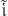
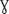
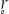
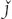
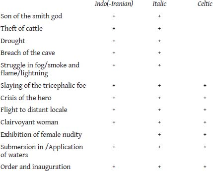
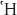
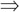
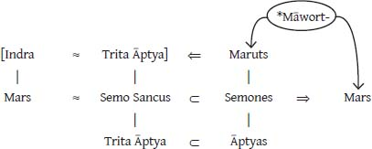

# CHAPTER 4. The Fourth Fire

## 4.9 THE ARVAL RITES OF DEA DIA (II)

### *4.9.2 The midday culinary episode*

After finishing their *gustatio* of pork, the priests don the *toga praetexta*, and with heads covered and garlanded with grain they return to the grove, where the Promagister sacrifices the third member of the *suovetaurilia*, a lamb (*agna opima*), and examines the entrails for omens. After a libation of wine and incense, the priests proceed to the temple, in and around which numerous rites are performed. Beginning with the libations, these rites, in the view of Scheid (1990: 577–578), themselves constitute a sacrificial banquet, one celebrated for the Arval goddess Dea Dia. The elements of this complex of sacrificial events include the following: within the temple, sacrifices are made with the *ollae* (the clay vessels that will be offered to the Mater Larum); the Promagister and Flamen sacrifice on grass (*caespite*) before the temple; then going out to the altar they make a monetary offering (see Scheid 1990: 613–615); the Promagister and Flamen offer libations of incense and wine with vessels of silver; two Arval priests go down with the public slaves to obtain grains (while others remain before the temple door); returning with the grains, the priests pass them from one to another (giving with the right hand and receiving with the left) and then give them to the public slaves; they go into the temple and pray to the *ollae*, and then throw the clay vessels down the hill (the offering to the Mater Larum; see §3.3.3.2); the priests then sit on benches of marble and share bread decorated with laurel; they take *lumemulia cum rapinis* ‘soap (?) with turnips’ and anoint images of the goddess; the temple is then closed and all leave but the priests, who, shut up within the temple, dance and sing the Carmen Arvale (the translation is based on that of Schilling 1991: 604):

> Enos Lases iuvate, | [e]nos Lases iuvate, enos Lases iuvate!

> Neve Luae Rue Marma sins incurrere in pleores, neve Luae Rue Marmar

> | [si]ns incurrere in pleoris, neve Lue Rue Marmar sers incurrere in

> pleores!

<!-- page_177 -->

> Satur fu, fere Mars, limen | [sal]i, sta berber, satur fu, fere Mars, limen

> sali sta berber, satur fu, fere Mars, limen sa[l]i s[t]a berber!

> [Sem]unis alternei advocapit conctos, Semunis alternei advocapit

> conctos, Simunis altern[ei] advocapit | [conct]tos!

> Enos Marmor iuvato, enos Marmor iuvato, enos Marmor iuvato!

> Triumpe, triumpe, triumpe, trium[pe, tri]umpe!

> Help us, O Lares; help us, O Lares; help us, O Lares!

> Mars, O Mars, don’t let Dissolution, Destruction pounce upon the

> people (?)! Mars, O Mars, don’t let Dissolution, Destruction

> pounce upon the people (?)! Mars, O Mars, don’t let Dissolution,

> Destruction pounce upon the people (?)!

> Be surfeited, savage Mars; leap to the border, take your position! Be

> surfeited, savage Mars; leap to the border, take your position! Be

> surfeited, savage Mars; leap to the border, take your position!

> You will invoke the Semones one by one, all together! You will invoke

> the Semones one by one, all together! You will invoke the

> Semones one by one, all together!

> Help us Mars, O Mars! Help us Mars, O Mars! Help us Mars, O Mars!

> Victory, victory, victory, victory, victory!

When the dancing and hymning are finished, the public slaves enter and collect the books (*libelli*) which had been used by the Arvals in the rite of the Carmen. The priests stand before the door of the temple (now reopened; see Scheid 1990: 629–630); garlands are offered and carried within the interior of the temple by the *kalatores* (the priestly assistants) to crown the statues, the name of each priest is called out, and each touches the altars. The Arvals elect their Magister for the coming year and propose a new Flamen. After speaking felicitations to one another (for Scheid [1990: 631], bringing to a close the sacrificial “banquet” of the goddess) the priests descend from the grove for their meal in the tetrastyle.

This feast in the tetrastyle, the capstone event of the midday culinary episode, is that banquet which we examined earlier (see §4.2.5). The priests exchange the *toga praetexta* for white dinner attire. Dishes arrive *more pompae*, ‘in processional style’, accompanied by *campanae* (likely ‘Campanian vessels’) and great quantities of sweet wine (*mulsum*). Those present obtain a gift of one hundred denarii, and there is a distribution of rose petals as well.

<!-- page_178 -->

The midday culinary episode, appearing to be the centerpiece of this the second day of the Arval festival for Dea Dia, bears unmistakable similarities to the climax of the Agniṣṭoma pressing day, the midday Soma pressing. Generally, the various and repeated movements of the Arval priests

and their several assistants through the sacrificial arena of the goddess, especially those ambulations concerned with activities in and around her temple, the monetary offering at the altar, the ritual seating of the priests and their reciprocal sharing of cultic elements, the return to the tetrastyle, the processional delivery of the dishes and wine within the tetrastyle, the distribution of gifts—all are reminiscent of the activities and movements of the Vedic priests and their own assistants within the Mahāvedi, their “creeping” back to the Sadas where, seated by their various Dhiṣṇya-hearths, the priests drink Soma; their passing of cultic implements to one another; the offering of gold at the altar of the old Āhavanīya and the distribution of the sacrificer’s gifts.

Particularly intriguing is the profuse quantity of sweet wine which is provided for the Arval priests during the tetrastyle banquet—thirteen liters for each. The inebriating product of the grape provides for Rome the functional, cultic equivalent of the intoxicating substance of Vedic ritual. In the present context, we think immediately of pressings of the Soma plant (see Dumézil 1975: 87–97; Woodard 2002: 93–94). Soma “provokes in the men (and gods) who drink it a kind of euphoric exaltation that the texts take great pains to distinguish from ordinary intoxication and that in certain ways suggests the effects of hallucinogenic substances …” (Malamoud 1991: 803). The Soma drinker is carried away in a state of ecstasy, imagining himself to be capable of superhuman feats (*RV* 10.119). The priest who presses Soma finds joy; a sense of greatness is acquired through use of the substance; and the Soma drinker achieves immortality (*RV* 9.113). The ritual use of this material (eluding definitive identification)[^ch4fn29] is at least of Proto-Indo-Iranian origin, as revealed by the equivalent use in Iranian rites of *Haoma*, cognate in name to Sanskrit *Soma*. Of the Iranian material, Boyce (1996: 158) writes:

> When crushed it yielded a drink which exhilarated and gave heightened powers; and this was the only intoxicant (*madha*) which produced no harmful effects. “All other *madha* are accompanied by Wrath with the bloody club; but the *madha* of Haoma makes one nimble” [*Yasna* 10.8]. “The *madha* of Haoma is accompanied by its own rightfulness (*aša-*)” [*Yašt* 17.5].

It has long been suggested that the Indo-Iranian ritual use of the intoxicant **sauma* continues a Proto-Indo-European use of **medʰu-* ‘mead’ (see Keith 1998a: 172, Renou 1957: 71).

<!-- page_179 -->

There is, however, another intoxicating substance which receives ritual use in Vedic India—the fermented beverage called *surā*. This is the material which we encountered earlier in our discussion of the rites of the Vājapeya (see §2.6.1.1) and of the rites preserving the *suovetaurilia* homologue, the Sautrāmaṇī (see §3.3.3.1). Its sacred use is restricted to these primitive rituals—undoubtedly a testimony to the great antiquity of their heritage.

Might the Arval use of excessive quantities of wine at the banquet of the midday culinary event—conducted into the tetrastyle *more pompae*—be a fossilized reflex of an early Indo-European custom of ritual intoxication? If so, a homologous structure may survive generally in the Vedic ritual use of Soma (and the corresponding Zoroastrian Haoma rites). Perhaps a more likely and specific homologue of the Arval practice, however, is provided by the use of *surā* and its processional conveyance (along with honey) out of the Soma-cart shed which appears in the midday pressing of the Vājapeya (as described in §2.6.1.1).

That we are on the right track in identifying a particularly close relationship of ritual homology between the Arval rites celebrated on the second day of the May festival and the rites of the Soma-pressing day of the primitive Vājapeya is suggested by what happens next in the grove of Dea Dia. Following the meal in the tetrastyle, the Magister puts on his *laticlave* and *ricinium* and a garland of roses. He ascends above the starting gates in the *circus* of the grove and signals for the *ludi* to begin—chariot races, with both four-horse and two-horse chariots running, as well as events involving *desultores* (riders jumping between horses). Other priests position themselves by the finish line. The victors receive palms and crowns of silver.

The significance of the races for this day is signaled by their prominent mention in the more skeletal versions of the Acta. Thus, in the records of AD 38, the entire second day of the festival is very succinctly summarized by reference to three seminal rites only—the sacrifice of the cow, that of the lamb, and the running of the races. Scheid (1990: 636) draws attention to the prominent position accorded the *ludi*, stating: “Par conséquent, les jeux doivent être considérés comme l’un des temps forts de l’office de la deuxième journée.”

We have seen that a seminal event of the Vājapeya—one which takes place as a part of the midday Soma-pressing and one which serves as a distinctive feature of this primitive rite—is likewise the running of a chariot race (see §2.6.1.1). The sacrificer in a three-horse chariot races against sixteen opponents in four-horse chariots. The victor of the race is predetermined—the sacrificer takes the honors.

<!-- page_180 -->

The Vājapeya is a ritual in which are conjoined the acquisition of victory and the gaining of fertility. Keith (1998a: 340) draws attention to this concatenation, as we noted in our discussion of the Vājapeya. The combination is one which renders the primordial nature of the ritual obscure for Keith: “It is accordingly impossible to lay down precisely the original character of the rite: it was not merely the feast of victory of the winner in a chariot race, such as might be paralleled in Greek ritual, nor was it solely an agricultural rite. …”

Whatever its “original” value—one which must surely be situated in yet more archaic Indo-European cult—the peculiar conjunction of fertility and victory that characterizes the Vedic Vājapeya is exactly replicated in the rites of the second day of the Arval festival of Dea Dia. The Fratres Arvales are those priests whose ritual activities are conducted to imbue the fields with fertility, as Varro tells us and as their name transparently reveals. Yet there is more to the ritual. The “attainment of victory” lies at its very core—not only prominently evidenced by the seminal position of the chariot race, but by the imploring of Mars in the hymn of the Arvales to bring “Victory, victory, victory, victory, victory!” (*Triumpe, triumpe, triumpe, triumpe, triumpe!*).

The Vājapeya also intersects with the second day of the Arval festival in yet another way. The victims offered in the grove of Dea Dia, as we have seen (§3.3.6.3), represent a variant form of the canonical *suovetaurilia*: two pigs (*porcae piaculares*), a cow (*vacca honoraria*), and a lamb (*agna opima*). In our discussion of the Agniṣṭoma, we noted that the victims offered on the Soma-pressing day show some variation, depending on whether the ceremony is of the type called Ukthya, [image-glyph: unresolved image00347]oḍaśin, or Atirātra (§4.8.3). The Vājapeya is a [image-glyph: unresolved image00347]oḍaśin rite, meaning that the pressing-day victims are these: two goats, a ram offered to Indra, and a sterile cow offered to the Mitra and Varuṇa (*ŚB* 5.1.3.1–3)—mutatis mutandis, a replica of the Arval *suovetaurilia*. While the Arval set matches the [image-glyph: unresolved image00347]oḍaśin set one-to-one, the Vājapeya departs from the norm of the [image-glyph: unresolved image00347]oḍaśin by the offering of yet additional victims: a goat is offered to the goddess Sarasvatī (*ŚB* 5.1.3.2; compare *ŚB* 5.1.3.11) and, in keeping with the characteristic number of the Vājapeya, seventeen goats (hornless, male) are sacrificed to Prajāpati (*ŚB* 5.1.3.7–10), a creator god bestowing fertility and, in the Brāhmaṇas and Saḥhitās, the creator god *par excellence* (see Keith 1998a: 207). Here we certainly see at work the Vedic propensity for ritual proliferation.

<!-- page_181 -->

It will be readily apparent to the reader that a number of the Arval practices mentioned in the preceding paragraphs do not uniquely link the *midday culinary episode* to the *midday Soma pressing*. That is to say, many of

the corresponding events of the Agniṣṭoma are not specific to the midday pressing but are shared by the morning and evening pressings as well. Conversely, at least one element of the midday Soma pressing, the distribution of gifts, characterizes not only the midday culinary episode of the second day of the Arval rites but also the evening episode as well as the banquets of days one and three (see §4.2.5). Apart from the *mulsum-surā* and chariot-racing homologues linking the Vājapeya with the Arval ritual, this, in effect, leaves only—among those shared midday elements *specified thus far*—a single uniquely similar feature: the Arval monetary offering which the Promagister and the Flamen make upon returning to the altar from the temple of the goddess, alongside the offering of gold which the Adhvaryu makes upon returning temporarily from the Mahāvedi to the old Āhavanīya in the Devayajana, the space of the Iṣṭi (see Caland and Henry 1907: 289).

The several similarities which do not share temporal specificity—coupled with those that do share such specific agreement—provide, however, a general context of agreement between the Arval and Vedic midday events within which a single overriding point of idiosyncratic correspondence firmly joins the two. The crescendo of the midday culinary episode seems plainly to be reached at the moment of the performance of the Carmen Arvale. As discussed above, the midday Soma pressing belongs almost exclusively to Indra, the chief warrior god. The Carmen Arvale of the midday culinary event is a hymn sung first and foremost to Indra’s Roman counterpart, Mars. Scheid (1990: 622) surmises:

> L’association du banquet de Dia et de l’invocation de Mars avec ses compagnons nous engage à conclure que, dans les rituels qui se déroulent *in luco*, on s’adresse à deux divinités avant tout, à dea Dia, patronne des lieux, et à Mars, dont l’assistance est requise pour que Dia puisse déployer son activité bénéfique; …

As in the Agniṣṭoma, the midday Soma pressing is the special domain of the warrior Indra, so in the Arval festival celebrated within the precinct of Dea Dia, it is the midday culinary event that is bound up with the warrior Mars—the second of the two deities with which the Arval rites of May are principally concerned.

<!-- page_182 -->

4.9.2.1 THE SEMONES Indra is, however, not the only deity who leaves his stamp on the midday Soma pressing. Particular ritual attention is also paid to his companions, that band of warriors called the Maruts. Just so, beside Mars, the Carmen Arvale entreats two bands of deities, the Lares, beings

of a clearly chthonic nature within the context of the Arval ritual, and the somewhat more mysterious—but certainly of greater significance for our comparative analysis—Semones. The identity of the Semones is commonly intuited from their name’s supposed etymon, *semina* ‘seeds’. Given the dearth of information which the hymn provides about these beings and the affiliation of the Arval rites with the fertility of Roman fields, the linkage of Semones and *semina* is a natural one. The interpretation is seemingly reinforced by the opening of the hymn, verses invoking the Lares, deities of the ground. Thus, Scheid (1990: 621) writes:

> Mars est à prendre dans ce contexte comme le dieu guerrier qui se dresse «sur le seuil» de Rome et défend le territoire; les Lares et les *Semones* lui sont adjoints, les uns en tant que dieux du sol et du terroir, les seconds vraisemblablement comme dieux des *semina*, des semences. …

Here Scheid, in envisioning the Semones to be gods of the seeds, is following, as he acknowledges, the interpretations laid down by Norden (1939: 204–222) and subsequently developed by Dumézil (*ARR*: 228–231). For the latter, the Semones “preside over the life of the *semina*.”[^ch4fn30]

Two observations should be made at this point. First, there is an asymmetry in the invocation of the two divine groups named in the Carmen Arvale. The priests call on the help of the Lares directly—not so with the Semones. It is “savage Mars” who must invoke these gods; the war god in effect serves as an intermediary through whom the band of the Semones are individually and collectively summoned for their assistance.

<!-- page_183 -->

Secondly, while seeds are undeniably necessary for plant growth, visà-vis field fertility, they are obviously of a fundamentally quite different nature from the material of that other band of deities who are invoked in the *carmen*—namely, soil. Seeds are the raw stuff of plant growth, the germ of plant life; soil is the medium which makes possible that life, a part of the support mechanism. As every gardener knows, however, a rich soil only provides half of the equation for a fertile field; there is an additional support mechanism required. One also needs rain. If the Fratres Arvales are responsible for bringing fertility to the Roman fields, as Varro tells us and as is commonly accepted, one would expect—practically automatically—that their great hymn would invoke not only gods who reside in the

soil, but those who send the rains. What the Vedic rites almost certainly reveal to us is that Mars’ companions (whom Mars himself must invoke) the Semones, like Indra’s companions the Maruts, are deities of the rain.

Latin *sēmen*, *sēminis* ‘seed’ is a derivative of *serere* ‘to sow’, evolved from the Proto-Indo-European verb root **seh₁–*, of the same meaning.[^ch4fn31] The name of our Roman rain deities, *Sēmonēs*, however, probably shares a common origin with forms such as Lithuanian *séilė* ‘saliva, drool’ from Proto-Indo-European **seh₁(i)-*, which itself is probably etymologically linked to the roots **seikw-* ‘to flow out’ and **seib-* ‘to pour out, let flow’. The former serves as etymon of, inter alia, Old High German *seihhen* and Serbian Church Slavic s[image-glyph: unresolved image00433][image-glyph: unresolved image00434][image-glyph: unresolved image00435], both meaning ‘to urinate’; Tocharian A *sikaṃtär* ‘they are flooded’; and Sanskrit *siñcáti* and Young Avestan *hiṇcaiti* ‘he pours out’. The two last named are nasal-infix presents from **si-né/n-kw-*, which appears also to have a Sabellian reflex **simpe-* ‘to pour out, to ladle’, as reflected in the Latin loan word *simpulum*, the name of a cultic vessel used for pouring or ladling (see *LIV*: 523; *WP*, vol. 2: 464, 466–467). The related root **seib-* gives, inter alia, Epic Greek εἴβω ‘to drop, to let fall in drops’, in the passive ‘to trickle down’ (*LSJG*: 482), Middle Dutch *sīpen* ‘to drop’ (*LIV*: 521); compare Latin *sēbum* (*sēvum*) ‘tallow’ and the associated verb *sēbāre* ‘to dip in tallow’, denoting candle making,[^ch4fn32] perhaps from **seh₁(i)b-* (*WP*, vol. 2: 467–468). Proto-Indo-European **seh₁ (i)-*, our proposed source of *Sēmonēs*, is probably, at least originally, that same root **seh₁(i)-* which provides one group of widely attested reflexes meaning ‘sieve, strainer’ and ‘to sift, to strain’, and another group meaning fundamentally ‘to let loose’: examples include Greek ἠθέω ‘to sift, strain, let trickle out’; Old Norse *sáld* ‘sieve’; and Vedic *-syati* ‘to make loose’ (*LIV*: 518–519; *WP*, vol. 2: 459–463).

As in the Carmen Arvale, sung at the midday culinary episode, it is the warrior Mars who invokes the Semones, those who pour down the waters, so in the midday Soma pressing, the warrior Indra calls on the Maruts to come and join him in his fight against the monstrous Vṛtra, the drought-bringing serpent who holds back the rains and the streams. According to the *Śatapatha Brāhmaṇa* (4.3.3.6–18), the three Marutvatīya cups are drawn so that Indra may press the Maruts into service against Vṛtra. The slaying of this monster is Indra’s great heroic deed, for which his praises are rehearsed again and again in the Vedas—a slaying which causes the waters to flow down “like lowing cattle” (*RV* 1.32.2; see §4.9.2.4).

<!-- page_184 -->

4.9.2.2 SEMO SANCUS Aside from their presence in the hymn of the Arvals, the Semones corporately receive vague mention in a Sabellian inscription from Corfinium, and individually through references to a goddess Semonia (see Wissowa 1971: 130–132) and the somewhat-better-documented—but still rather mysterious—god Semo Sancus. The last-named is commonly identified as a god of Sabine origin and is equated with the deity called Dius Fidius, being at times denoted by the quadranomial Semo Sancus Dius Fidius. The great antiquity of the notion that Semo Sancus and Dius Fidius are one and the same is revealed by the presence in Umbrian ritual of the god called Fisus Sancius (see Poultney 1959: 252–254).

Identifying the Semones of the Fratres Arvales as gods who send rains, and drawing them into the sphere of Indra’s warrior companions, the Maruts, is harmonious with—and brings a certain unexpected clarity to—what precious little is known of Semo Sancus (Dius Fidius). Much of this knowledge is succinctly summarized by Varro (*Ling.* 5.66), who attributes its source to the emminent Roman scholar Lucius Aelius (Stilo). Having cited the name Dius Fidius in an etymologizing disquisition, Varro writes of the god:

> Itaque inde eius perforatum tectum, ut ea videatur divum, id est caelum. Quidam negant sub tecto per hunc deierare oportere. Aelius Dium Fidium dicebat Diovis filium, ut Graeci Διόσκορον Castorem, et putabat hunc esse Sancum ab Sabina lingua et Herculem a Graeca.

> And so, his [temple] roof is pierced with a hole so that the *divum*, that is, the sky, may thus be seen. Some say that one ought not swear an oath by the god’s name while under a roof. Aelius used to say that Dius Fidius is a son of *Diovis*, just as the Greeks call Castor a *Dioskoros* [‘boy of Zeus’], and he always thought this god to be Sancus in the Sabine language and Hercules in the Greek.

Let us consider in turn the elements of Varro’s description of this god.

<!-- page_185 -->

First, Semo Sancus Dius Fidius is a deity whose province is the sky. According to Lydus (*Mens*. 4.90), sancus is the Sabine word meaning ‘sky’. The roof of the temple of Dius Fidius is open to the heavens, like that of the Capitoline shrine of Terminus. Oaths are commonly sworn by this deity—*me Dius Fidius* (see Plautus, *Asin*. 23; Festus, p. 147M; Aulus Gellius, *NA* 10.14.3–4; and so on)—and as Varro notes in the above passage, such oaths must be sworn beneath the open sky. Elsewhere Varro (in Nonius, p. 793L) reports, concerning domestic ritual, that when one swears by this god it is necessary to leave the roofed areas of the house and to step into the *compluvium*

beneath open sky. Similarly, the solemn oaths sworn *per Iovem lapidem*, by Jupiter and his stone, the *lapis silex* housed in the temple of Jupiter Feretrius, must be made outside of the god’s temple (see Warde Fowler 1899: 138). By Varro’s testimony, Aelius reckoned Dius Fidius to be son of Jupiter (*Diovis*; compare Festus, p. 147M). Whatever popular synchronic relationship the two gods may have had in Aelius’ day, the divine names *Dius* and *Jupiter* and the divine personalities that they denote are almost certainly related diachronically. Latin *Jupiter* (**Diove Pater*) is descended from Proto-Indo-European **Dyeus Ph₂tēr*, name of the sky god, which also provides Greek Ζεύς Πατήρ, Vedic *Dyaus Pitar*, and Luvian (*Tatis*) *Tiwaz* (see §1.7). Varro is thus etymologically on target when he draws Διόσκορος into the equation.[^ch4fn33] Proto-Indo-European **Dyeus* is itself derived from the root **deiw-* ‘to shine’, and this etymon is very likely also the ultimate source of Latin *Dius*.

<!-- page_186 -->

Beyond this general affiliation with the sky, Semo Sancus Dius Fidius shows a clear link to one specific atmospheric phenomenon, the hallmark of the storm—lightning. The god possessed a temple on the Quirinal hill (see *LTUR*: 4: 263–264; Richardson 1992: 347), said to have been built by Tarquinius Superbus but dedicated only in 466 BC on the Nones of June (Dionysius of Halicarnassus, *Ant. Rom.* 9.60.8; Ovid, *Fast.* 6.213–218). It appears that on the Quirinal the god was served by the priesthood called the *Decuria Sacerdotum Bidentalium*. Evidence of their service is provided by votive inscriptions left by the priests to this god on the Quirinal as well as on the Tiber Isle.[^ch4fn34] An inscription from the Tiber Isle was found in conjunction with a statue of the deity that appears to have held a thunderbolt in its left hand.[^ch4fn35] The Sacerdotes Bidentales are priests whose name reveals them to be affiliated with the lightning strike, a place so struck being denoted

*bidental*; and the sacrificial victims, commonly sheep, offered in expiation for the strike, *bidentes*. The evidence of the strike was buried, which, together with the sacrifice, purified the ground.

The term *bidentes* is curious. In antiquity it caught the attention of Aulus Gellius (*NA* 16.6), who tells us that in his own study of documents of Pontifical law he discovered that the word had earlier been *bidennes*, used of animals ‘two-years’ old (that is, derived from *annus* ‘year’), and speculates that by sound change it had evolved into *bidentes*. Iulius Hyginus, he allows, has a different understanding of the sense of the term, claiming that *bidentes* are animals with two teeth larger than the remainder (having eight in all), marking the age of the animals as appropriate for sacrificial use (compare Festus, p. 33M). Given that the fulgural science was well developed among the Etruscans, the term may conceivably be an Etruscan word which the Romans folk-etymologized.[^ch4fn36]

<!-- page_187 -->

There are yet other indications of the fulgural affiliation of Semo Sancus. A bird of augury bears the god’s name, the *avis Sanqualis* (see Festus, p. 317M; compare the name of the god’s gate at the southwest end of the Quirinal, the *porta Sanqualis*, located near his temple, Festus, p. 345M). Festus (p. 317M) and Pliny (*HN* 10.20) identify the bird as an *ossifraga* (‘bone- breaker’, probably a lammergeier), of a sort not spotted in Rome since the days of the augur Mucius, adds Pliny (anchoring his observations in his own time). Livy records consecutively two sets of prodigies which occurred in 177 BC; the *avis Sanqualis* plays a role in the second, and the two sets are probably linked. The *first* set (41.9.4–7) consists of those prodigies reported *before* the consuls Gaius Claudius Pulcher and Tiberius Sempronius Gracchus drew lots in preparation for war against Sardinia and Histria. Livy records the *second* set (41.13.1–3) immediately *following* his account of the outcome of those conflicts—Sempronius’ victory in Sardinia and Claudius’ defeat of both the Histrians and the Ligurians. The first-named of those prodigies of the former set concerns a stone that had fallen from the sky, landing in a grove sacred to Mars in Crustumerium, a Sabine town north and slightly east of Rome. The first-named prodigy of the second set likewise concerns a sacred stone of Crustumerium; while Livy does not explicitly equate the two stones, given the shared context of the prodigies, their identity may well be rightly construed as self-evident (see Warde Fowler 1899: 140, n. 2). Concerning this stone, Livy reports that an *avis Sanqualis* (a ‘bonebreaker’)

had struck it with his beak and cleaved it. The account of this prodigy is doubly interesting in that it presents the god Semo Sancus, through his augural bird, not only displaying his fulgural nature, striking and breaking apart a stone which had rained down from heaven, but sets him in conjunction with Mars, into whose grove the meteor had fallen. Here, much as in the Carmen Arvale, Mars and Semones—one rather than all—are united.

Semo Sancus Dius Fidius, god affiliated with the heavens and lightning, deity by whom oaths are sworn, also operates within the domain of the warrior. These various affiliations are intertwined within an episode of great antiquity in Rome’s history, the conquest of Gabii by Tarquinius Superbus. Through intrigue and subterfuge, Sextus, son of the Tarquin king of Rome, had placed himself in a position of power within Gabii, so that the city was in time delivered to Rome with almost no opposition from the Gabini (see Livy 1.53.4–54.10; Dionysius of Halicarnassus, *Ant. Rom.* 4.53.1–58.4). According to Dionysius of Halicarnassus, Tarquinius, thinking it would strengthen his own position in Rome, treated the inhabitants of the captured city with beneficence and made certain concessions to them, taking oaths and certifying these arrangements with a treaty (*Ant. Rom.* 4.58.4):

> καὶ ἵνα μηδὲν αὐτοῖς ἔτι δεῖμα περὶ τοῦ μέλλοντος ὑπάρχῃ χρόνου μηδ’ ἐνδοιάζωσιν εἰ βέβαια ταῦτα σφίσι διαμενεῖ, γράψας ἐφ’ ο[image-glyph: unresolved image00436]ς ἔσονται δικαίοις φίλοι, τὰ περὶ τούτων ὅρκια συνετέλεσεν ἐπὶ τῆς ἐκκλησίας παραχρῆμα καὶ διωμόσατο κατὰ τών σφαγίων. τούτων ἐστὶ τών ὁρκίων μνημεῖον ἐν Ῥώμῃ κείμενον ἐν ἱερὀ Διὸς Πιστίου, [image-glyph: unresolved image00437]ν Ῥωμαῖοι Σάγκον καλοῦσιν, ἀσπὶς ξυλίνη βύρσῃ βοείᾳ περίτονος τοῦ σφαγιασθέντος ἐπὶ τών ὁρκίων τότε βοός, γράμμασιν ἀρχα[image-glyph: unresolved image00438]κοῖς ἐπιγεγραμμένη τὰς γενομένας αὐτοῖς ὁμολογίας.

> And in order that [the Gabini] should neither be in fear regarding the future nor in doubt whether the promises made to them would be preserved intact, after specifying in writing the terms by which they would be considered friends, [Tarquinius] immediately sanctioned a treaty concerning these matters in the assembly [of the Gabini] and he swore an oath over the victims. There is a copy of this treaty in Rome, installed within a temple of Dius Fidius, whom the Romans call Sancus—a wooden shield covered with ox-hide, that of the ox sacrificed at the time of the treaty, with the terms thereof inscribed in archaic letters.[^ch4fn37]

<!-- page_188 -->

Thus Rome’s first treaty—an archaic document marking the terms for cessation of war—finds refuge in the temple of Semo Sancus.[^ch4fn38]

We should note as an aside that a bronze statue of a woman called Gaia Caecilia was also displayed in the temple of Semo Sancus. Plutarch (*Quaest. Rom.* 30) identifies her as the female companion of one of the sons of Tarquinius. For Festus (p. 241M), Gaia Caecilia is wife to Tarquinius Priscus; similarly, Pliny (*HN* 8.194) reports that Gaia Caecilia is an alternative denotation for Tanaquil, wife of the elder Tarquin. Gaia’s statue in Semo Sancus’ temple, continues Festus, is girded by a belt in which certain prophylactic devices (*remedia*) of her invention, called *praebia*, had been laced. Those in danger would come and scrape off shavings of these *praebia*[^ch4fn39] for protection. Pliny further records that the wool on the distaff and spindle of this woman was kept in the temple of Semo Sancus. Plutarch (*Quaest. Rom.* 30) writes that the sandals and spindle of Gaia Caecilia had been kept there in the old days. The temple also housed, according to Livy (8.20.8–9), certain bronze *orbes* provided by the sale of the property of Vitruvius Vaccus, the Fundanian general defeated by Rome in 329 BC.

<!-- page_189 -->

Semo Sancus Dius Fidius is drawn yet more fully into the realm of the warrior. As Varro tells us, he is identified with the warrior par excellence, Hercules. Festus (pp. 147, 229M) attests to the same identification (*id est Hercules*). In his poem on the setting up of the Ara Maxima, the altar said to have been built by Hercules at his defeat of the cattle-thieving monster Cacus, Propertius (4.9.71–74) can invoke Hercules as Sancus, the *sanctus pater*.[^ch4fn40] Semo Sancus and Hercules share an immediate affiliation in that the Romans swear oaths by both: *me Dius Fidius* stands alongside *me Hercule*[^ch4fn41] (as does *me Castor* [see Festus, p. 125M], the first typically used by men, the second by women). The source of the Roman oath by Hercules is obviously Greek, Heracles being one of those deities by whom the Greeks commonly swear. The ready Roman acquisition of the oath *me Hercule* must, however, betray a fundamental similarity between Roman Semo Sancus

Dius Fidius and Greek Heracles. Over a century ago, Warde Fowler aptly gave expression to this observation, though his own interpretation of the Roman god was assuredly quite different from our own:

> Again, the Roman oaths *me Dius Fidius* and *me Hercule* are synonymous; that the former was the older can hardly be doubted, and the latter must have come into vogue when the Greek oath by Heracles became familiar. Thus the origin of *me Hercule* must be found in a union of the characteristics of Hercules with those of the native Dius Fidius.

4.9.2.3 HERCULES AND CACUS A significant feature of Hercules’ affiliation with the oath in Rome is his above-mentioned altar, the Ara Maxima (the ‘Greatest Altar’). Standing in the Forum Boarium, opposite the entrance to the Circus Maximus, the Ara Maxima was an altar at which oaths were taken, agreements made, and tithes offered (Dionysius of Halicarnassus, *Ant. Rom.* 1.40.6; Diodorus Siculus 4.21.3–4). Hercules himself was said to have offered a tithe of cattle at the altar (Festus, p. 237M; *Ant. Rom.* 1.40.3). Rituals conducted at the Ara Maxima were said in antiquity to be Greek in form rather than Roman.[^ch4fn42]

It was during Hercules’ visit with Evander and other Arcadian Greek settlers of the pre-Romulean Palatine, that the Greek hero is said to have established the Ara Maxima. At the time, Hercules was en route back to Greece with the trophies of the tenth labor assigned to him by his master Eurystheus—the cattle of Geryon. After crossing the Tiber in the vicinity of the Palatine, Hercules rested, and as he slept some of his cattle were stolen by the monstrous Cacus. Ovid tells the tale (*Fast.* 1.543–582; compare Virgil, *Aen.* 8.184–305; Propertius 4.9.1–20):

> Ecce boves illuc Erytheidas adplicat heros

> emensus longi claviger orbis iter,

> dumque huic hospitium domus est Tegeaea, vagantur

> incustoditae lata per arva boves.

> mane erat: excussus somno Tirynthius actor

> de numero tauros sentit abesse duos.

> nulla videt quaerens taciti vestigia furti:

> traxerat aversos Cacus in antra ferox,

> Cacus, Aventinae timor atque infamia silvae,

> non leve finitimis hospitibusque malum.

<!-- page_190 -->

> dira viro facies, vires pro corpore, corpus

> grande (pater monstri Mulciber huius erat),

> proque domo longis spelunca recessibus ingens,

> abdita, vix ipsis invenienda feris;

> ora super postes adfixaque bracchia pendent,

> squalidaque humanis ossibus albet humus.

> servata male parte boum Iove natus abibat:

> mugitum rauco furta dedere sono.

> “accipio revocamen” ait, vocemque secutus

> impia per silvas ultor ad antra venit.

> ille aditum fracti praestruxerat obice montis;

> vix iuga movissent quinque bis illud opus.

> nititur hic umeris (caelum quoque sederat illis),

> et vastum motu conlabefactat onus.

> quod simul eversum est, fragor aethera terruit ipsum,

> ictaque subsedit pondere molis humus.

> prima movet Cacus conlata proelia dextra

> remque ferox saxis stipitibusque gerit.

> quis ubi nil agitur, patrias male fortis ad artes

> confugit, et flammas ore sonante vomit;

> quas quotiens proflat, spirare Typhoea credas

> et rapidum Aetnaeo fulgur ab igne iaci.

> occupat Alcides, adductaque clava trinodis

> ter quater adverso sedit in ore viri.

> ille cadit mixtosque vomit cum sanguine fumos

> et lato moriens pectore plangit humum.

> immolat ex illis taurum tibi, Iuppiter, unum

> victor et Evandrum ruricolasque vocat,

> constituitque sibi, quae Maxima dicitur, aram,

> hic ubi pars Urbis de bove nomen habet.

> Look, here comes the club-carrying hero driving

> Erythea’s cows on his long world journey.

> And while he is hosted in the Tegean house,

> Cattle roam unguarded through broad acres.

> It was morning: the acting herder from Tiryns

> Jolts from sleep and counts two bulls as missing.

> He searches, but sees no tracks from the silent theft;

> Cacus had dragged them backward to his cave,

> Savage Cacus, the Aventine wood’s terror and shame,

> No light problem for neighbors and guests.

> His face was grim, his strength matched his body, his body

> Huge: this monster’s father was Mulciber.

<!-- page_191 -->

> A vast labyrinthine cavern served as his house,

> Remote: even beasts could barely find it.

> Faces and limbs hang nailed above the doorposts;

> The filthy ground blanches with men’s bones.

> Jupiter’s son was leaving with part of the herd

> Lost; the plunder bellowed raucously.

> “I welcome the recall,” he shouts. The avenger tracks

> The sound through the woods to the impious lair.

> Cacus had blocked the entrance with a barricade of rock;

> Scarcely ten ox-teams could have shifted it.

> Heaving with his shoulders (heaven once rested there),

> Hercules moves and topples the huge mass.

> The crash of its dislodgment dismayed heaven itself;

> The battered earth sank beneath the bulk’s weight.

> Cacus at first fights hand to hand and skirmishes

> Ferociously with boulders and trees.

> When this does nothing, he resorts unbravely

> To his father’s arts, and retches roaring flame.

> You would think every blast was Typhoeus’ breath,

> A bolt of lightning hurled from Etna’s fire.

> Alcides grabs him, and sinks the tri-knotted club

> Three or four times in his opponent’s face.

> He collapses and vomits smoke mingled with blood,

> And hits the ground, dying, with his broad chest.

> The victor sacrifices one bull to you, Jove,

> And calls Evander and the country folk.

> He set up an altar to himself called ‘Maxima’

> In the city district named from cattle.

For Virgil (*Aen.* 8.193–199), Cacus is a huge creature, half-human (*semihomo*) and fire-bellowing, a son of Volcanus (equivalent to Ovid’s *Mulciber*, a name which may be derived from *mulcere*, ‘to soothe, appease’; see *DELL*: 418.). Propertius (4.9.10) knows the monster to have three heads.

<!-- page_192 -->

4.9.2.4 INDRA AND VṚTRA One familiar with the Vedas can hardly read the story of Cacus, his theft of cattle, and his destruction at the hands of the hero Hercules without being immediately reminded of the tale of Indra’s great heroic deed, the destruction of the cattle-thieving, drought-bringing monster, Vṛtra. The resemblance is unmistakable and did not escape the attention of earlier investigators. While there are still earlier mentionings of the similarity (for example, in Kuhn 1848), in 1863 Michel Bréal, the French philologist and pioneering linguist, published a book-length analysis

of Hercules and Cacus (republished in Bréal 1877), in which he invoked the comparison of Indra and Vṛtra.[^ch4fn43]

The significance of the comparison and the common Indo-European origin which it entails was slipping into the background, however, by the second decade of the twentieth century, chiefly under the influence, it would seem, of Wissowa (1971: 282–283) and subsequently Bayet (1926). For both scholars, the story was introduced to the Romans by Greeks of Magna Graecia. Wissowa (1971: 283) sees in the legend a Roman adaptation of a blending of three different Greek traditions—those of Heracles’ fights with Geryon, owner of the cattle, and with the giant Alcyoneus, and the tale of Hermes’ theft of Apollo’s cattle. The Roman account, Wissowa conjectures, does not predate Virgil by much. The same sentiment is offered, almost verbatim, by Dumézil himself (*ARR*: 433): “… the legend of the rather unfriendly meeting of Hercules and Cacus was certainly not very old when Virgil reinforced it by his art.”

<!-- page_193 -->

Drawing on Bayet’s study, which seems to have exerted an appreciable influence on him, Dumézil points out that the Roman tradition looks to be only one particular form of a Herculean tale which must have been popular in Magna Graecia. Thus at the site of Crotona in the south of Italy, a certain Lacinius tried to steal Heracles’ cattle as he was driving them through that region; the strong man killed Lacinius and, accidentally, Croton as well, who had welcomed Heracles. In expiation, Heracles built a great tomb for Croton and prophesied that a city (Crotona) would one day be named for him. A similar story is told of Lacinius and one Locrus, who, slain by Heracles, becomes the namesake of Locri. To be sure, the Cacus described by Livy (1.7.5–7) and Dionysius of Halicarnassus (*Ant. Rom.* 1.39.2–4) is no fire-breathing monster, but a cave-dwelling shepherd. The second-century BC annalist Gnaeus Gellius knows Cacus as a man who comes to Italy with the Phrygian king Marsyas; this Cacus leads an attack against Campania and is there killed by Hercules (see Alföldi 1965: 228–229; note his discussion of an Etruscan Cacus, a prophet captured by the Etruscan heroic pair, the

brothers Vibenna). For Diodorus Siculus (4.21.1–3) he is Cacius, a prominent member of the Palatine community who welcomes Hercules hospitably. Some authorities report that Cacus has a sister, Caca, a fire goddess with a shrine in which a perpetual flame burns, and who is worshipped in a manner similar to the worship of Vesta; she was promoted to such divine status as a reward for betraying her brother to Hercules.[^ch4fn44]

The story of Hercules and Cacus could well be a Roman expression of a tale commonly told among Greeks of Italy as they nurtured memories of their homeland, a story of their beloved hero Heracles and a cattle thief whom he encounters and kills as he drives Geryon’s cows homeward to Eurystheus. The whole affair smacks of the sort of local legends about folk heroes such as Paul Bunyan that sprang up as new settlers arrived in and moved across the frontier of America. The fact remains, however, that the Roman “variant” of this story is remarkably similar to the single most prominent achievement in the dossier of Indra, his destruction of Vṛtra, and appears particularly so when viewed in the light of the character of Semo Sancus and the Semones which we see emerging. The Indic account itself exists in several variant forms, for more than one of which there is good evidence of an antiquity that antedates Vedic India. More than that, we would contend, the Roman account of Hercules and the monstrous Cacus is indeed descended from the same Indo-European tradition that gives rise to the Vedic stories.

> Indrasya nu vīriyāṇi pra vocaḥ yāni cakāra prathamāni vajrī

> ahann ahim anu apas tatarda pra vakṣaṇā abhinat parvatānām

> Now I proclaim the bold deeds of Indra,

> the first done by the thunderbolt-wielder.

> He killed the dragon and opened the waters;

> he cleaved the belly of the mountains.

<!-- page_194 -->

So begins *Rig Veda* 1.32, telling the deed to which allusion is made again and again in the Vedas (see especially Watkins 1995: 297–320 and passim; Benveniste and Renou 1934). The dragon (*ahi-*) is named Vṛtra ‘resistance’. In his mountain cave he has held back the waters—commonly likened to cattle—and so he brings drought. Indra slays the dragon and the waters stream down “like lowing cattle” (*RV* 1.32.2). The great warrior god does not accomplish this deed alone, however. He is assisted by Viṣṇu and by his

comrades-in-arms, the storming Maruts.[^ch4fn45] At times, the Maruts alone are said to have defeated the monster. The deed is also credited to Trita Āptya, to whom we shall return shortly.

Indra is commonly called Vṛtrahan, ‘slayer of Vṛtra’, an epithet which can also be applied to other conquering deities, but which first and foremost belongs to Indra. The figure of the Vṛtrahan is at least of common Indo-Iranian origin, being matched by Avestan Vərəθra[image-glyph: unresolved image00440]na (both descending from Proto-Indo-Iranian **v[image-glyph: unresolved image00441]tra-[image-glyph: unresolved image00442]ʰan-* ‘smiting resistance’, though the latter is quite distinct from Avestan Indra, who has been demonized through the religious reforms of Zaraθuštra. Dumézil (1970: 111–138), looking further afield, draws attention to a related warrior figure, the Armenian Vahagn, acquired from the Iranian Parthians. Comparing the birth narrative of Vahagn, preserved by the Armenian historian Moses of Chorene, with the Brahmanic account of the rebirth of Indra following his defeat of Vṛtra, Dumézil can argue that the common linguistic antecedent of Vedic Vṛtrahan and Avestan Vərəθra[image-glyph: unresolved image00440]na was a denotation applied already to Proto-Indo-Iranian Indra (see especially pp. 117, 128–129). Even so, there is good reason to suspect that the monster Vṛtra has acquired his name derivatively from the epithet of his slayer (see Watkins 1995: 298, 304, with references to Benveniste and Renou 1934).

4.9.2.5 TRITA ĀPTYA AND THE TRICEPHAL As already noted, the Vedic tale of the destruction of the worm exists in varied forms. The variant which is richest in mythic detail, and so provides the most valuable diagnostic for detecting homologous traditions among other Indo-European peoples, is the tale identifying the slayer of the dragon—one with three heads—as Trita Āptya, operating in league with Indra (who sometimes acts alone, who sometimes seems to be identical to Trita Āptya). Because of the similarities demonstrably shared with other Indo-European traditions, this account ipso facto leaves the impression of being of a more primitive, a more primary sort than the variety “Indra Vṛtrahan slays Vṛtra,” for which there is a dearth of specifics.[^ch4fn46]

<!-- page_195 -->

The dragon slayer Trita Āptya is a deity affiliated with water (compare Sanskrit *ap* ‘water’, *āpaḥ* ‘waters’), the ‘third’ (*trita*) of the Āptya brothers

(the other two being, naturally, Ekata ‘first’ and Dvita ‘second’ Āptya). The fire deity, Agni, had hidden in the waters, from which he was unwillingly extracted by the gods. The *Śatapatha Brāhmaṇa* tells it thus: Agni spat on those waters, from which then emerged Trita Āptya and his brothers (compare *MS* 4.1.9; *TB* 3.2.8.9–12).[^ch4fn47] These three then attached themselves to the retinue of Indra, following him in his wanderings. Consonant with their name, the Āptya are affiliated with a ritual of purification which is conducted while pouring water for each of the three brothers in turn (see *ŚB* 1.2.3.1–5). Trita Āptya has a dwelling in the heavens. In *Rig Veda* 2.34, a hymn to the Maruts—who are praised as lovers of rain, glowing like fire, gleaming in their armor, bringing food to those who praise them—Trita Āptya is said to convey the Maruts to their worshippers in his chariot (v. 14). The Maruts, conversely, are said to have reinforced the strength of Trita as he aided Indra in his fight against the dragon in *Rig Veda* 8.7.24, in which hymn the Maruts are also praised for hacking away the limbs of Vṛtra and cleaving the mountain in which the waters were held.

In the default tradition, the dragon who is killed by Trita Āptya bears the name Viśvarūpa ‘having many shapes’. He is a son of Tvaṣṭr, the smith-god who made the thunderbolt for Indra. Viśvarūpa, also called Triśiras ‘tricephalic’, is characteristically and redundantly described not only as three-headed but as six-eyed as well. As in Indra’s slaying of Vṛtra, the cattle motif is again prominent: Viśvarūpa possesses cattle which are driven away by the one who slays him. The Indic tradition of Trita Āptya slaying Viśvarūpa is exactly matched by an Iranian account; the *Avesta* preserves a record of the warrior Thraētaona (= Trita Āptya) and his destruction of the dragon Aži Dahāka—three-headed, six-eyed, three-mouthed. The motif is not only common Indo-Iranian but early Indo-European, as we have seen, being matched by the Greek tradition of Heracles’ murder of the three-headed (three-bodied) Geryon and the theft of his cattle.[^ch4fn48]

Other variant forms of the Indic tradition should be mentioned. First, there are the Paṇis, demonic creatures who pen up stolen cattle in a cave. Indra (or some other deity, such as Agni or Soma) attacks them and releases the cattle. Similarly, Trita Āptya or Indra shatters the creature called Vala ‘enclosure’ and releases cattle he has corralled.

<!-- page_196 -->

4.9.2.6 SEMO SANCUS AND THE TRICEPHAL To return to the point made prior to the recent digression on the slaying of monsters—three-headed,

cattle-thieving, and otherwise—the Roman tradition about Cacus and his theft of the cattle of Hercules might very well preserve a folk legend common among Greeks of the south of Italy—one that recounts how a human thief had tried to rob Heracles as he drove Geryon’s cattle toward Greece. At the same time, in view of the secure Indo-European motif of the hero who slays a three-headed monster, attested by parallel Indic, Iranian, and Greek accounts, coupled with the Roman predilection for preserving ancient Indo-European religious ideas, structures, and vocabulary, there is a strong a priori case for identifying Hercules’ destruction of Cacus as yet another inherited form of this ancient Indo-European myth. The two formative phenomena here at work—one of borrowing, one of inheritance—are certainly not of necessity mutually exclusive processes. There is, one might deduce, an a posteriori suggestion of this dual operation in the striking dichotomy that characterizes the differing accounts of this event. Cacus is a man for the historians, Livy, Dionysius of Halicarnassus, Gnaeus Gellius, Diodorus Siculus—there is no suggestion to the contrary. Cacus is a terrifying monster for the poets, Ovid, Virgil, Propertius—there is no suggestion to the contrary.

Given the Roman assimilation of Greek Heracles to native Semo Sancus, underlying the story of Hercules and Cacus is almost certainly an inherited Italic myth of Semo Sancus and his slaying of a three-headed, cattle-holding fiend. Like Trita Āptya, Semo Sancus is one member of a larger set of deities, and these, in both instances, are deities whose essential affiliation is with water—rainwater in the case of the fulgural Semo Sancus, and in a naturalistically parallel manner, the waters from which fire emerged in the case of Trita Āptya. The same affiliation equally characterizes the stormy Maruts, who themselves are credited with assisting in or performing the execution of Vṛtra and Viśvarūpa. Each band of deities—Italic Semones and Indic Āptyas and Maruts—forms part of the retinue of the great warrior god, Roman Mars and Indic Indra: the Indic relationship is amply attested; the Roman is revealed by Mars and the Semones conspiring in the Carmen Arvale, with Mars invoked to call this band into action.

<!-- page_197 -->

The cattle-holding villains similarly match. Like Viśvarūpa, the Roman thief Cacus is three-headed. This we learn from Propertius, who writes not only of three temples struck by the hero (*tria tempora*; 4.9.15) but describes the monster as producing noises emanating from three mouths (*per tria ora*; 4.9.10); compare Avestan descriptions of Aži Dahāka as “three-mouthed, three-headed, six-eyed” (as in *Yašt* 9.8: … Azīm Dahākəm θrizafanəm θrikamərəδəm xšuuaš.ašīm …). Propertius’ description likely rests on an archaic Indo-European “poetic and mythographic formula” of the sort identified by Watkins (“THREE-HEADED and SIX-EYED”) on the basis of IndoIranian

and Greek evidence (see Watkins 1995: 464–468). The Roman evidence taken in tandem with the Avestan likely suggests a fuller form of the formula (THREE-MOUTHED and THREE-HEADED and SIX-EYED).

Also like Viśvarūpa (and Vṛtra by some accounts), Cacus is the son of the smith-god. Virgil, describing the half-human monster, terrible in form (*semihominis*[^ch4fn49] *Caci facies dira*; *Aen.* 8.194), tells us that his father was Volcanus (*huic monstro Volcanus erat pater*; 8.198). In the same way, Ovid identifies Cacus’ father as Mulciber (*pater monstri Mulciber huius erat*; *Fast.* 1.554). The agreement between the Indic and Italic myths at this point involves an element so idiosyncratic as to provide a compelling diagnostic of the ultimate common source of the two traditions. An equivalent paternity is absent from the Greek traditions of Heracles and Geryon, in which the latter is held to be son of Chrysaor, offspring of Medusa and Poseidon (see Hesiod, *Theog.* 280–288; Apollodorus, *Bibl.* 2.4.2–3). Greece and its Heraclean traditions, hence, do not provide the Romans with a pedigree for the monster Cacus; the origin of that element of the Italic tradition is of far greater antiquity.

The Latin poetic descriptions of the struggle between Hercules / Semo Sancus and Cacus are likewise impressively similar to Vedic accounts of Indra’s battle with Vṛtra. No other two Indo-European strains of the myth are so similar in this regard. In India, Vṛtra is holed up in his mountain lair:

- Indra splits open the mountain where Vṛtra has penned up the cattle (*RV* 1.32.1–2).

- With his thunderbolt of a thousand points, Indra strikes the dragon, who is situated down within his lair (*RV* 6.17.9–10).

- The dragon enshrouds himself in fog and fights with lightening (*RV* 1.32.13).

- Vṛtra cannot withstand the attack of Indra; the hero shatters him and crushes his nose (*RV* 1.32.6). He smashes Vṛtra’s jaws (*AV* 1.21.3).

- Indra strikes Vṛtra on the neck with his thunderbolt, or cudgel (*RV* 1.32.7; for the meaning ‘cudgel’ of Sanskrit *vájra-* and its significance, see Watkins 1995: 332, 410–411, 430–431).

- Indra fells the dragon like a tree laid low by an ax (*RV* 1.32.5).

In Rome, Cacus blocks the entrance to his cave:

<!-- page_198 -->

- Hercules heaves and topples the great obstructive mass with an

enormous heaven-shaking crash (Ovid, *Fast.* 1.563–568); or he wrenches the top from the mount, gutting the cavern of Cacus.

- Hercules rains down missiles on the monster (Virgil, *Aen.* 8.236–250).

- Cacus enshrouds himself in a fog of smoke (Virgil, *Aen.* 8.251–255) and belches flames (Ovid, *Fast.* 1.573–574).

- Hercules throttles Cacus (Virgil, *Aen.* 8.259–261); he seizes him and strikes the monster in the face (*os*) “three times, and four times” (*ter quater*) with his “three-knotted” club (*clava trinodis*; Ovid. *Fast.* 1.575–576).

- The hero strikes the monster on each of its three temples with his club (*ramus*) and lays him out dead (Propertius 4.9.15–16).

A word about Ovid’s lexical choices: as cited above, Boyle and Woodard (2000: 20) translate *Fasti* 1.575–576, *occupat Alcides, adductaque clava trinodis ter quater adverso sedit in ore viri*, as “Alcides grabs him, and sinks the tri-knotted club three or four times in his opponent’s face.” The rendering of *os* as English “face,” rather than by its primary sense of “mouth,” is typical of translations of the verse (compare Frazer 1989: 43; Nagle 1995: 52) and is perhaps informed by Propertius’ corresponding use of *tempus* (*iacuit pulsus tria tempora ramo Cacus*; 4.9.15–16). A literary depiction of the tri-notted club being repeatedly slammed on the monster’s *face*—as opposed to slammed on his *mouth*—probably has a somewhat more heroic flavor and makes for a more dramatically pleasing translation.

Even so, examination of the lines within their immediate context gives one cause to reconsider. Lines 569–578 are repeated below together with the Boyle and Woodard translation, slightly modified:

> prima movet Cacus conlata proelia dextra

> remque ferox saxis stipitibusque gerit.

> quis ubi nil agitur, patrias male fortis ad artes

> confugit, et flammas *ore* sonante vomit;

> quas quotiens proflat, spirare Typhoea credas

> et rapidum Aetnaeo fulgur ab igne iaci.

> occupat Alcides, adductaque clava trinodis

> *ter* quater adverso sedit in *ore* viri.

> ille cadit mixtosque vomit cum sanguine fumos

> et lato moriens pectore plangit humum.

> Cacus at first fights hand to hand and skirmishes

> Ferociously with boulders and trees.

> When this does nothing, he resorts unbravely

> To his father’s arts, and retches flames from his roaring *mouth*.

<!-- page_199 -->

> You would think every blast was Typhoeus’ breath,

> A bolt of lightning hurled from Etna’s fire.

> Alcides grabs him, and sinks the tri-knotted club

> *Three* or four times in his opponent’s *mouth*.

> He collapses and vomits smoke mingled with blood,

> And hits the ground, dying, with his broad chest.

The monster has abandoned his hand-to-hand tactics; it is Cacus’ fire-belching mouth (l. 572) which has become the immediate source of danger to the hero. That the hero’s cudgel-blows are being described as delivered directly to the monster’s mouth, serving now as the creature’s chief weapon, appears probable and is reinforced by the significant textual variant *in ora* ‘against the lips’, ‘against the mouth’. This line of inquiry is made yet more intriguing by the poet’s declaration that these blows to the mouth are made three times (or four times): *ter quater adverso sedit in ore viri*. It would involve taking but a small interpretative step to posit that lying behind Ovid’s line is a tradition of a strike being delivered to each of three mouths (whether the account is intentionally altered by Ovid or the poet simply uses a modified version circulating in his day—or to which he otherwise had access). So interpreted, Ovid’s description of the hero’s fight with the monster transparently points back to an archaic Italic mythic theme (and ultimately Proto-Indo-European formula) of the hero’s destruction of a three-mouthed, three-headed monster, one which is preserved more fully and explicitly by Propertius. Indeed, the sense of the variant reading *in ora* could be “against the mouths,” reflecting the ancient tricephalic tradition of the monster.

4.9.2.7 HERCULES AND BONA DEA A marked feature of rituals conducted at Hercules’ altar in the Forum Boarium, the Ara Maxima, is the exclusion of women. Not so very far from this altar, situated on the slopes of the eastern prominence of the Aventine (*Aventinus Minor*), stood the temple of the ‘good goddess’, Bona Dea. The cult of Bona Dea was characterized by an equal but opposite form of discrimination, males being prohibited from entering the temple of the goddess (Ovid, *Fast.* 5.153–154; Macrobius, *Sat*. 1.12.26–27). Men were similarly excluded from a secret nocturnal rite of Bona Dea held each December at the home of a Roman magistrate—the setting of the scandalous affair of 62 BC when Clodius, disguised as a lute girl, slipped into the rites as they were being celebrated at the home of Julius Caesar (see Plutarch, *Caes.* 9.3–10.7 and the discussion of Brouwer 1989: 363–370).

<!-- page_200 -->

The rationale proffered for excluding women from rites observed at the Ara Maxima is linked to the neighboring goddess Bona Dea. Propertius preserves the tradition (4.9.21–74). Following Hercules’ defeat of Cacus and release of the pent-up cattle (and prophesying the future Forum Boarium), the hero is exhausted and parched with thirst (4.9.21–26):

> Dixerat, et sicco torquet sitis ora palato,

> terraque non ullas feta ministrat aquas.

> sed procul inclusas audit ridere puellas,

> lucus ubi umbroso fecerat orbe nemus,

> femineae loca clausa deae fontesque piandos,

> impune et nullis sacra retecta viris.

> He spoke, and his palate dry, thirst torments his lips,

> and water-rich earth offers him not a drop.

> But from afar he hears secreted maidens laughing,

> where a wood had made a grove of shadowy orb,

> Place enclosed for women’s goddess and springs for cleansing,

> and rites unveiled to no man with impunity.

Captivated by the lilting, watery sounds, the spent hero hurries to the grove, desperately in search of relief. It is a place of deep shade and song birds, with suspended red headbands veiling its entrance (4.9.31–36):

> huc ruit in siccam congesta pulvere barbam,

> et iacit ante fores verba minora deo:

> “Vos precor, o luci sacro quae luditis antro,

> pandite defessis hospita fana viris.

> fontis egens erro circum antra sonantia lymphis;

> et cava succepto flumine palma sat est. …”

> Here he rushes with dust clumped in his dry beard,

> and before the gates he speaks words too small for a god:

> “I beg you, who play within the sacred hollow of this grove,

> make your sacred spaces hospitably open to exhausted men.

> In need of a spring, I wander around dells that sing with waters;

> a cupped hand of scooped-up water is enough. …”

The hero identifies himself, rehearses his warrior fame, especially his descent into the realm of Dis (an anachronistic reference to Heracles’ twelfth labor, not yet accomplished at the time he acquires Geryon’s cattle), and continues to bemoan his present anguish (4.9.65–66):[^ch4fn50]

<!-- page_201 -->

> “Angulus hic mundi nunc me mea fata trahentem

> accipit: haec fesso vix mihi tecta patent. …”

> “This corner of the world now has me—dragging out

> my fate: exhausted, these shelters hardly take me in. …”

Hercules tries to persuade the priestess of the goddess to admit him to the grove, recounting his service to Omphale in women’s clothing (an event lying beyond Heracles’ service to Eurystheus; 4.9.51–60):

> talibus Alcides; at talibus alma sacerdos,

> puniceo canas stamine vincta comas:

> “Parce oculis, hospes, lucoque abscede verendo;

> cede agedum et tuta limina linque fuga

> interdicta viris metuenda lege piatur

> quae se summota vindicat ara casa.

> magno Tiresias aspexit Pallada vates,

> fortia dum posita Gorgone membra lavat.

> di tibi dent alios fontes: haec lympha puellis

> avia secreti limitis unda fluit.”

> Thus spoke Alcides; but said the kindly priestess,

> her hoary locks tethered by a red band:

> “Avert your eyes, stranger, and depart this holy grove,

> withdraw now and leave its thresholds in safe retreat.

> Prohibited to men, it is avenged by a law to be feared,

> by which the altar in this secluded hut takes its revenge.

> At a great price Teresias the prophet gazed upon Pallas,

> while she bathed her strong limbs, her Aegis laid aside.

> May the gods give you other springs: these waters for maidens

> flow, remote spring of hidden course.”

<!-- page_202 -->

The “great price” paid by the Greek prophet Teresias is the blindness which struck him as he gazed at Athena, naked in her stream-bath (see Apollodorus, *Bibl*. 3.6.7; Callimachus, *Hymn 5*.57–130). Clearly, the message of the old priestess is that the hero would see the women within the grove naked, should he enter, and suffer a similar fate.[^ch4fn51] Hercules is not, however,

to be dissuaded from obtaining relief from his anguish—naked women or no (4.9.61–70):

> sic anus: ille umeris postis concussit opacos,

> nec tulit iratam ianua clausa sitim.

> at postquam exhausto iam flumine vicerat aestum,

> ponit vix siccis tristia iura labris:

> “Maxima quae gregibus devotast Ara repertis,

> ara per has” inquit “maxima facta manus,

> haec nullis umquam pateat veneranda puellis,

> Herculis externi ne sit inulta sitis.”

> Thus spoke the hag: he rammed in the shady door-posts with his shoulders,

> and the closed gate did not withstand his furious thirst.

> But after he had subdued his raging heat, the stream now drained,

> with lips barely dried he ordains a solemn law:

> “The Ara Maxima, which was vowed with my cattle recovered,

> altar made greatest,” said he, “by these hands,

> Let this venerable site never be open to any woman,

> lest the thirst of the foreigner Hercules be unavenged.”

Propertius than concludes this etiological story with a remarkable postscript (4.9.71–74; the order of the couplets is that of Goold 1999):

> hunc, quoniam manibus purgatum sanxerat orbem,

> sic Sancum Tatiae composuere Cures.

> Sancte pater, salve, cui iam favet aspera Iuno:

> Sance, velis libro dexter inesse meo.

> This one, since by his hands he consecrated the orb made pure,

> Cures of Tatius thus established as Sancus.

> Blessed Father, hail, whom now harsh Juno kindly favors:

> Sancus, may you, propitious, be pleased to have a place in my book.

<!-- page_203 -->

Cures is the city of the Sabine Titus Tatius, and, as noted above, it is with

the Sabines that Semo Sancus Dius Fidius is commonly affiliated.[^ch4fn52] Compare the remarks of St. Augustine (*De Civ. D.* 18.19):

> Sed Aenean, quoniam quando mortuus est non conparuit, deum sibi fecerunt Latini. Sabini etiam regem suum primum Sancum sive, ut aliqui appellant, Sanctum, rettulerunt in deos.

> But Aeneas—since he disappeared when he died, the Latins made him their god. The Sabines also assigned to the gods their first king, Sancus, or, as others call him, Sanctus.

Lactantius (*Div. Inst.* 1.15) agrees with St. Augustine.

The two final couplets of Propertius 4.9 are remarkable for several reasons. For one, with these lines Propertius not only links Semo Sancus directly to the personage of Hercules but also brings the Italic god explicitly into the context of the myth of the triple-mouthed, triple-headed monster and the hero who slays him. Moreover, it is clear that Propertius is thereby tying together the tale of the tricephalic monster, the ensuing exhaustion of the hero, and the establishment or legitimization of Sancus as a deity among the Sabines. To see why this concatenation of events, and specific elements thereof, is of such significance, we must examine some of Dumézil’s own findings about the hero who slays the tricephal—but, first, an aside.

<!-- page_204 -->

*4.9.2.7.1 Propertius the poet* Before moving ahead—a word on Propertius. The author is all too aware that some classicists will object to his use of Propertius and other poets as providers of data for deeply ancient Indo-European traditions and the reflexes of those traditions in Rome, crying that “the poets have their own agendas, literary and political”; “the poets possess personal creativity and are not just conduits for the transmission of archaic motifs”; and similar such things. Unquestionably these are not completely irrelevant matters. However, to reject out of hand cross-culturally recurring structure because of the mantle in which it is cloaked in Rome would be abjectly nonsensical and a pitiable squandering of precious data. That complex Roman data preserved by the poets closely match equally complex data from other and widely distributed Indo-European traditions—Indic, Scythian, Celtic—self-evidently demonstrates the value

of a comparative investigation using the core traditions preserved by Roman poets. In the case immediately at hand, the poet is Propertius—who, by the time he has penned his fourth book of elegy has become the self-styled Roman Callimachus (4.1.61–64):

> Ennius hirsuta cingat sua dicta corona:

> mi folia ex hedera porrige, Bacche, tua,

> ut nostris tumefacta superbiat Umbria libris,

> Umbria Romani patria Callimachi!

> Ennius may crown his lines with a shaggy garland:

> Hold out to me leaves of your ivy, Bacchus,

> So that Umbria may burst with pride at my books,

> Umbria, homeland of the Roman Callimachus!

Propertius is Umbrian—in the hills and valleys of which place the ancient Italic rites and gods were preserved down to the century of Propertius, as revealed by the bronze *tabulae Iguvinae* of the Atiedian priesthood of Umbria (see §§1.5.4; 3.3.3.2.3)—traditions making their presence felt even to the present day (see §1.7.1.4.5). He is an Umbrian come to Rome with the death of his father and the confiscation and parceling out of his family’s property by Octavian following the Perusine War. In Rome he would put on the *toga virilis* in the presence of “his mother’s gods” (*matris et ante deos libera sumpta toga*; 4.1.132). And now, in his fourth book of elegy, he instructs his readers in ancient gods and rites; the Umbrian continues (4.1.67–70):

> Roma, fave, tibi surgit opus; date candida, cives,

> omina; et inceptis dextera cantet avis!

> sacra deosque canam et cognomina prisca locorum:

> has meus ad metas sudet oportet equus.

> Rome, show me favor—for you my work arises; give favorable omens,

> Citizens, and let an auspicious bird proclaim its start!

> Rites and gods I shall sing, and the ancient names of places:

> To that goal my sweating steed must strive.

<!-- page_205 -->

Though he puts behind him much of the erotic emphasis of his earlier work, Propertius remains politically irreverent to the end; consider his Callimachean account of Actium (4.6). And one wonders whether that irreverence might find subtle expression in aetiological recounting of ancient Italic tradition on which he was weaned in Umbria; we have noted already the conspicuous presence of Fisus Sancius (recall Semo Sancus in Propertius 4.9)

in the Umbrian ritual of the Atiedian priests (see §1.5.4; and §4.9.2.2 on Semo Sancus Dius Fidius). In any event, Augustus must have given the nod to the poet’s new venture—all to the benefit of the comparativist.

By the rationale of my critics, the historical linguist would reject the value of, for example, Tocharian for providing data relevant to the study of the parent Indo-European language. Tocharian is first attested only in the sixth century AD. Its speakers had been settled in the deserts of China for centuries prior to the earliest attestation of the language. The documents preserving the Tocharian languages are largely Buddhist materials, culturally far removed from the speakers of the parent language. Yet the structures of the language are unequivocally Indo-European and provide important data for comparative Indo-European analysis and the reconstruction of Proto-Indo-European.

By that same rationale, the comparative ichthyologist would reject the value of the cartilaginous skeletal structure of chimaeras for studying the developmental history of cartilaginous fish. Chimaeras have only a single external gill opening, possess an erectile dorsal spine, a tentaculum in front of the pelvic fins and another on the forehead, and teeth fused into plates. In spite of their specialized developmental features, however, they remain relevant to the comparative study of Chondrichthyes, whether a member of the class, together with sharks, skates, and rays, or constituting a separate class.

Moreover, though the process is fundamentally different (one of borrowing rather than shared inheritance), by the same token Hellenists would reject the value of looking to the Near East for literary sources of Homeric and Hesiodic traditions. Homer and Hesiod, no one would deny, are personally creative and have their own literary designs grounded in archaic Greece. Nevertheless, they can incorporate in their epics Near Eastern motifs found, for example, in the Anatolian and Mesopotamian traditions of a king in heaven and his struggle for the throne, and in the Babylonian *Atrahasis* with its account of the division of the cosmos among three gods by the casting of lots. And the poets of those Near Eastern traditions are themselves no less creative and no less culturally contextualized.

The reader gets the picture. The movement from the known to the unknown, reminding ourselves again of Bernard’s dictum, the crux of all scientific investigation and discovery, only occurs by the careful, informed analysis of the data with which the investigator is presented. To ignore that data is to choose not to move, not to discover.

<!-- page_206 -->

4.9.2.8 THE HERO BEYOND THE BOUNDARY An item in Indra’s dragon-slaying dossier has been carefully studied by Dumézil vis-à-vis Ossetic (Iranian) and Irish heroic traditions. This episode proves to be of great importance, we will argue, in understanding the Roman tradition of the dragon-slayer Semo Sancus, a.k.a. Hercules, and reflects fundamental elements of Roman cult, inherited from much earlier Indo-European religious practice. Dumézil’s own interpretative analysis focuses on the canonical Indo-European “threeness” of the several accounts and on the calming or cooling of the hero which follows his destruction of the monstrous tricephalic foe. These are undeniably central and crucial elements of the traditions; however, I would claim that equal, if not greater, significance lies in events acted out within the spatial domain—the hero’s withdrawal to a place beyond “the boundary,” his eventual return, and the benefit that society accrues upon his return.

*4.9.2.8.1 The Indic hero* Indra has defeated the cattle-thieving serpent Vṛtra. With the monster destroyed, however, a loss of strength and vitality, a sense of foreboding ironically overwhelm the warrior god. He flees and takes refuge in a remote, watery corner of the earth.

The trauma is mentioned only once in the *Rig Veda*, in hymn 1.32, one of the principal texts praising Indra’s incomparable deed (noted above). This hymn succinctly touches on numerous aspects of Indra’s fight with the monster—so many teasingly compact building blocks of the episode. Recitation of these heroic deeds comes to a crescendo in the thirteenth verse:

> nāsmai vidyun na tanyatuḥ siṣedha na yām miham akirad dhrāduniḥ ca Indraś ca yad yuyudhāte ahiś ca utāparībhyo Maghavā vi jigye.

> Neither lightning nor thunder helped him,

> nor the hail and fog he spread about.

> When Indra and the dragon struggled,

> Maghavan gained the victory for all time.

The description is familiar. Ovid (*Fast.* 1.573–574) has told us how the monster struggling with Hercules resorts at the end to flames, belched forth like lightning from Etna. Virgil (*Aen.* 8.251–255) describes how in desperation—the hero having split open the monster’s cavernous enclosure—Cacus cloaks himself in a fog of smoke:

> Ille autem, neque enim fuga iam super ulla pericli,

> faucibus ingentem fumum (mirabile dictu)

> evomit involvitque domum caligine caeca

<!-- page_207 -->

> prospectum eripiens oculis, glomeratque sub antro

> fumiferam noctem commixitis igne tenebris.

> But he, since now there can be no flight from danger,

> from his jaws heavy smoke (marvelous to tell)

> he belches forth, and shrouds his den in blinding fog

> snatching away sight from eyes, and he gathers deep in the cave

> smoke-borne night, darkness mixed with flame.

It is all to no avail in the end. Hercules charges through the smoke (8.259–261):

> Hic Cacum in tenebris incendia vana vomentem

> corripit in nodum complexus, et angit inhaerens

> elisos oculos et siccum sanguine guttur.

> Here in darkness Cacus retching useless flames,

> the hero seized him in a knot-tight hold, and with a viselike grip

> he throttles him, his eyes bulging and throat choked of blood.

Back to *Rig Veda* 1.32—after the great victory of Maghavan (epithet of Indra) something happens, ever so briefly described in verse fourteen:

> aher yātāraḥ kam apaśya indra hṛdi yat te jaghnuṣo bhīr agachat

> nava ca yan navatiḥ ca sravantīḥ śyeno na bhīto ataro rajāḥsi

> What dragon-avenger did you see, Indra,

> that terror grabbed your heart when you had slain him [the dragon],

> and that you crossed the ninety-nine streams

> like a frightened eagle crosses the skies?

These are strange lines that one would not expect to find appended to the praises of Indra’s great victory—coming immediately after the laudatory verse thirteen. In Dumézil’s words (1970: 124): “they constitute the surfacing, unique in the entire hymnal, of a mythical theme that was perplexing rather than useful.”

The tradition is preserved more fully in various other sources, most importantly in book 5 of the *Mahābhārata*. There the tale is much embellished, in the fashion typical of this epic of myriad verse, and the two major variants of Indra’s fight with the dragon are presented as sequential events. The core account runs as follows (*MBh.* 5.9–18).

<!-- page_208 -->

Indra slays tricephalic Viśvarūpa, whereupon the hero burns with a fever as he looks on the glory of the fallen monster. He persuades a woodcutter

to cut off Viśvarūpa’s three heads. The notion of “three-mouthed” (see §4.9.2.6) again presents itself as seminal, this time in an Indic context: each of the tricephal’s three mouths had served its own purpose; with one he had spoken the Vedas and drunk Soma; with one he had swallowed up space; with one he drank the ancient alcoholic beverage *surā*. Now, from the mouth of each decapitated head, birds fly out—heathcocks, partridges, and sparrows, respectively. With the decapitation, Indra is cooled of his fever.

Furious at the death of his son, Tvaṣṭr (the Indic Volcanus) creates the monster Vṛtra for the purpose of killing Indra. Vṛtra and Indra fight. The dragon swallows Indra; but the gods, coming to the rescue, create “the yawn,” and through Vṛtra’s yawning mouth Indra makes his escape. Indra retreats from the fray, but with the assistance of Viṣṇu kills the monster by stealth. The gods and all manner of creatures heap praises on the monster-slayer, Indra.

Then comes the depression. Indra flees—”The Indra of the Gods went to the end of the worlds and, bereft of consciousness and wits, was no longer aware of anything, being pressed down by his guilt. He dwelled concealed in the Waters, writhing like a snake” (van Buitenen 1978: 207). With Indra’s withdrawal, desolation and drought seize the earth: “the earth looked ravaged, her trees gone, her wilderness dried up. The streams of the rivers dwindled and the ponds stood empty. Panic seized all creatures because of the drought, and the gods and all great seers trembled sorely” (van Buitenen 1978: 207).

The gods, desperate for the restoration of order, choose one Nahuṣa to be their king. Upon gaining kingship, Nahuṣa becomes consumed with lust; chief among the objects on which falls his lustful gaze is Indra’s wife, Śacī (also called Indrāṇī). She finds his advances repulsive and in her despair devotes herself to the worship of the goddess Rātri ‘Night’.

As a consequence of Śacī’s devotion to Indra and to truth, a female spirit of divination, Upaśruti, presents herself to the goddess. Upaśruti leads Śacī, and together the two pass beyond the Himalayas to an island lush in trees and plants, in the midst of a great sea. On the island is a pond, a place of birds, filled with thousands of colorful lotuses. Upaśruti conducts Śacī into the stalk of a large white lotus, and there within a fiber of the lotus is Indra, reduced to a tiny form. Śacī and her oracular guide likewise assume miniature size. The goddess tells Indra of Nahuṣa’s lustful intentions, pleading with her husband to return to his former greatness and reclaim his position as king among gods. Indra responds that he is too weak to challenge Nahuṣa but proposes a plan which will lead to Nahuṣa’s downfall through his own arrogance. Śacī departs from Indra’s hideaway.

<!-- page_209 -->

In what appears to be a variant form of the discovery episode, the god Bṛhaspati sends Agni in the shape of a woman to search for Indra. At first unsuccessful, having searched all places except within the waters of the world, the unwilling fire god is compelled by Bṛhaspati’s praise to search even the waters. He finds mini-Indra within the lotus fiber at the remote watery locale described above.

Next, Bṛhaspati and others gods, along with seers and gandharvas (centaurlike creatures), journey to the place of Indra’s withdrawal. Coaxed by their praises, Indra begins to grow and recovers his size and strength. Indra’s plan proves to be effective, and Nahuṣa falls from power. Śacī is reunited with her husband and he, Indra, again is enthroned as king of gods.

*4.9.2.8.2 The Irish hero* Dumézil recognized that we are here confronted with a mythic theme that is not unique to Indic or even Indo-Iranian tradition. It is an early Indo-European theme of (i) the tricephal-slayer (the monster-slayer) experiencing a traumatic crisis following his heroic deed—a crisis that threatens to disrupt society; (ii) the tale of his recovery and restoration; and (iii) the consequent benefit to society. This archaic tradition, he argued, is one which surfaces among the Celts, preserved in Irish traditions about CúChulainn, the great warrior of Ulster (see Dumézil 1970: 133–137; 1942: 37–38, 41–44, 58–59). The story is preserved in various manuscripts, notably the *Lebor na hUidre* (“The Book of the Dun Cow”), the *Lebor Buide Lecáin* (“The Yellow Book of Lecan”), and the *Lebor Laighnech* (“The Book of Leinster”).

<!-- page_210 -->

When CúChulainn is still a boy, he learns from the Druid Cathbad that whoever should mount a chariot for the first time on that very day would acquire never-ending fame. Taking possession of the chariot and driver that belong to Conchobor, king of Ulster, CúChulainn travels from the royal village of Emain Macha to the frontier of Ulster. On this day, the frontier boundary is being guarded by the celebrated warrior Conall Cernach. CúChulainn smashes the shaft of Conall’s chariot, tells him to return to Emain Macha, and continues on his own journey farther into the borderlands. He comes at last in this remote region to the place inhabited by the three sons of Nechta Scéne, terrible beings who have killed half of the warriors of Ulster. They are Foill, Fannall, and Tuachell, each possessing a fabulous battle advantage. One of the brothers is undefeatable unless killed by the first blow struck against him; one is able to move across the surface of water with the ease of a swan or a swallow; one has never before been injured by any weapon. Using the spear called Del Chliss, the young CúChulainn slays all three of these preternatural foes. He decapitates them each

and, with their heads stowed in his chariot, hurries back toward Emain Macha, possessed by a maniacal warrior-fury.

What next follows in this tale is a remarkable account of the cooling of CúChulainn’s fevered rage. His approach to Emain Macha is seen by the woman Leborcham, wise and clairvoyant, who warns that if he is not stopped, his fury will be turned against the warriors of Ulster and they will perish. Conchobor, the king, is keenly aware of the danger at hand and orders that the appropriate measures be taken to protect the Ulster warriors and the people of Emain Macha. He sends out one hundred and fifty nude women to show themselves lewdly to CúChulainn. According to the *Lebor Laighnech*, they are led by the woman named Scandlach; in the version of the *Lebor na hUidre* and the *Lebor Buide Lecáin*, they are led by Mugain, wife of Conchobor, who verbally confronts CúChulainn and, flaunting her breasts, says, “these are the warriors you must fight.” Upon gazing at this exhibitionistic horde, CúChulainn averts his face, is seized, and is doused in three vats of cold water successively. His heat causes the first vat to explode; it causes the water in the second to boil; it makes the cold water of the third sufficiently hot as to be of a temperature that some would find unbearable. When he emerges from the third vat, his raging heat has been cooled so that he no longer poses a danger to the people of Ulster. The queen Mugain presents CúChulainn with a blue cloak having a silver brooch and he then takes a seat at the king’s feet, which will henceforth be his place.

*4.9.2.8.3 The Ossetic hero* This Irish tale of the warrior who must be cooled of his fevered rage, Dumézil perceived, shares certain elements with a tradition of Iranian origin. Among the mythic lore of the Ossetes, an enclave of Indo-European peoples in the Caucasus, descended from the Iranian Scythians and Sarmatians of antiquity, are the epic accounts of those heroes called the Narts (see Dumézil 1930a; 1978; *ME* 1: 440–603).

<!-- page_211 -->

One of the greatest Nart warriors is Batraz, son of Xæmyc (whose mythology in part appears to continue that of the Scythian “Ares,” identified by Herodotus (4.62); (see Dumézil 1970: 137; *ME* 1: 570–575). Batraz will be born from an abscess on his father’s back, created when his pregnant mother spits on Xæmyc, implanting between his shoulders the embryo she was carrying. When the time comes for Batraz to be born, he is delivered by Satana, the sagacious sister of Xæmyc. Satana takes her pregnant brother to the top of a tower seven stories high; at the base of this tower seven cauldrons of water have been positioned. With a steel blade she lances the abscess, and from it neophyte Batraz falls flaming into the cauldrons

of water below. He is a child of steel, and so great is the heat with which he burns that the water does not cool him. The fiery child calls out for water to quench the flame that burns within him (or to temper his steel). Satana rushes to a spring for more cooling water. There, however, she is confronted by a seven-headed dragon (or the devil) who will only allow her to collect water on condition of first having intercourse with him; this she does. Following his childhood, which shows certain similarities to that of Hercules (Charachidzé 1991: 317–318), Batraz will ascend into the heavens to make his home. Periodically he will streak down to earth in a fulgural form to protect his people, or sometimes to harm them.[^ch4fn53]

*4.9.2.8.4 The Italic hero* While it might be fair to claim (as we have allowed) that the legend of Hercules and Cacus (that is, the tale of Hercules’ visit to Evander and the Arcadian Greeks who settled the pre-Romulean Palatine, the theft of the Greek hero’s cattle by Cacus, and Hercules’ consequent destruction of the thief) may not be much older than Virgil, beneath the veneer of the Roman story of Hercules and Cacus, we must certainly discern a deeply archaic Italic myth of Semo Sancus and the monster that he slays, *three-headed*, and *three-mouthed* (and *six-eyed*), cattle-corralling, son of the smith-god. Both these attributes and the very struggle itself between monster and monster-slayer we have already seen to be identical to Indo-Iranian, especially Indic, expressions of a common Indo-European tradition. The similarities, however, go even further.

<!-- page_212 -->

*Crisis and flight*. First is the matter of the trauma of the hero. After Indra’s victorious acts of monster-slaying, he is laid low by a crisis; he flees into a remote place and takes refuge within the waters. After the young CúChulainn’s initial combat and triumph over the triple adversary, the three terrible sons of Nechta Scéne, in remote lands beyond the Ulster border, he also enters a traumatized state. His is not a debilitating depression and anxiety but a debilitating pathological rage—a warrior-fury that burns within him and must be relieved by a double remedy which involves

a spectacle of parading female nudity and successive applications of cooling water. In each case, Indic and Celtic, the well-being of society has been jeopardized by the hero’s trauma.

Hercules has vanquished his triple-headed opponent Cacus. The after-effect of his great victory, however, is a debilitating trauma of thirst and exhaustion, revealed in the ancient tradition preciously preserved by Propertius—a dryness consumes Hercules like the drought that grips the earth in the midst of Indra’s trauma. In his crisis, Hercules, like Indra, flees to a place of waters, and like Indra, king of gods, his demeaning, panicked response stands in stark contrast to his divine greatness. Consider again Propertius 4.9.31–36:

> huc ruit in siccam congesta pulvere barbam,

> et iacit ante fores verba minora deo:

> “Vos precor, o luci sacro quae luditis antro,

> pandite defessis hospita fana viris.

> fontis egens erro circum antra sonantia lymphis;

> et cava succepto flumine palma sat est. …”

> Here he rushes with dust clumped in his dry beard,

> and before the gates he speaks words too small for a god:

> “I beg you, who play within the sacred hollow of this grove,

> make your sacred spaces hospitably open to exhausted men.

> In need of a spring, I wander around dells that sing with waters;

> a cupped hand of scooped-up water is enough. …”

The society of the Indic gods is plunged into turmoil with Indra’s flight; the lecherous and villainous Nahuṣa becomes king, menacing even Indra’s wife. The hero of the Italic form of the myth, going about in the guise of Hercules in the surviving sources, is portrayed as disrupting the ordered calmness of Bona Dea’s rites and the society of her followers gathered within her sacred grove.

*Female nudity*. The Italic tradition shows a particular closeness to the Celtic, an alignment which we might not have anticipated but one which in retrospect should come as no surprise. Whatever its “original” significance, the curious episode of massive female nudity invoked in conjunction with the restoration of the dysfunctional hero is certainly as much a part of the Italic tradition as it is the Celtic. That Hercules will see the women within Bona Dea’s grove in a nude state should he enter is clearly the envisioned event upon which the old priestess’ warning is predicated:

> “Parce oculis, hospes, lucoque abscede verendo;

> cede agedum et tuta limina linque fuga

<!-- page_213 -->

> ………………………

> magno Tiresias aspexit Pallada vates,

> fortia dum posita Gorgone membra lavat.

> di tibi dent alios fontes: haec lympha puellis

> avia secreti limitis unda fluit.”

> “Avert your eyes, stranger, and depart this holy grove,

> withdraw now and leave its thresholds in safe retreat.

> ………………………………

> At a great price Teresias the prophet gazed on Pallas,

> while she bathed her strong limbs, her Aegis laid aside.

> May the gods give you other springs: these waters for maidens

> flow, remote spring of hidden course.”

Hercules certainly does not depart from the place, but forces his way into the grove and heads straight for the maidens’ springs. Since he does not share the fate of Teresias—though Propertius has the priestess declare he will, should he gaze upon the women—perhaps in the underlying Italic tradition the raging warrior, like CúChulainn, does in fact avert his gaze. Is this peculiar element of the myth of Indo-European origin, or is it specifically Italo-Celtic (or western Indo-European)? No unambiguous hint of it appears to be preserved in the Indo-Iranian traditions.[^ch4fn54]

<!-- page_214 -->

*Cooling waters*. The second element involved in cooling the fevered rage of CúChulainn—an immersion in successive cold water baths—likewise surfaces in Propertius’ poem. In the Italic tradition as preserved, there is a sort of reversal evidenced, in that Hercules takes the entire stream into himself, rather than having his body thoroughly immersed within the waters; though one could imagine that the motif of swallowing the waters is a natural extrapolation from a tradition of lying in them, given that Hercules’ hero-crisis is presented as one of extreme thirst. That the notion of the hero’s thirst may have been less pronounced—and his “heat” more so—in an antecedent form of the Italic tradition is suggested by the choice of words preserved in line 63, almost surprising in the present context: *at postquam exhausto iam flumine vicerat aestum …* (“But after he had subdued his raging heat, the stream now drained …”). While thirst and exhaustion drove the hero to the “remote spring of hidden course” (*avia secreti limitis unda*), the relief that the waters bring is said to have subdued (*vicerat*) not his thirst, but his *aestus*. The word means ‘heat, feverishness, rage, fury’, of common origin with *aestās* ‘summer’ and *aedēs* ‘temple’ (the place of

the hearth), and its use places Hercules and CúChulainn squarely within a common domain of post-combat trauma. That the motif of cooling the warrior’s flaming rage by immersion in cold water is common Indo-European is suggested by the recurrence of this element in the birth account of Batraz, the “Nart Hercules.” Beyond which, it is within the waters that the warrior Indra hides in his traumatized state.

*Remote space.* There is an additional feature common to the Indic and Celtic traditions—namely, a notion of liminal space figures saliently. In each tradition the hero crosses the boundaries of society and journeys into some remote locale. In his crisis state, Indra flees to the “end of the worlds.” Young CúChulainn passes beyond the frontier boundary of Ulster, and in this remote space he confronts his tricephalic foe and is possessed by a fevered rage.

Is this seminal notion of remote space also present in the Italic tradition as evidenced in Propertius’ poetic tale of Hercules? There is an indication of this. The old hag who confronts the hero refers to the waters of the women as *avia secreti limitis unda*, “a remote spring of hidden course”—a somewhat curious designation for a stream lying within a grove of the Aventine. Upon the lips of the hero in crisis, the poet places the words (4.9.65–66):

> Angulus hic mundi nunc me mea fata trahentem

> accipit: haec fesso vix mihi tecta patent. …

> This corner of the world now has me—dragging out

> my fate: exhausted, these shelters hardly take me in. …

To be sure, Greek *Heracles* is in a foreign and remote place, a “corner of the world” far from his home in Greece, but this is of course a tradition different from that one with which we are here centrally concerned. The remoteness of Heracles at this moment in the “distant labor” of Geryon’s cattle readily assimilates to the remoteness of the Italic hero, Semo Sancus, who has fled in crisis following his destruction of the three-headed monster.

<!-- page_215 -->

*Clairvoyant woman*. Another element bound up with this motif of remote space is again shared by the Indic and Irish traditions. In each instance, there is a female figure—wise, clairvoyant—who serves as a bridge between that liminal space and the space of the dysfunctional hero’s own society. In India she is the spirit of divination, Upaśruti, who knows the whereabouts of the hero’s remote, watery hiding place—space filled with birds and colorful lotuses—and who leads Śacī there to him. In Ireland she is Leborcham,

a sorceress of Ulster, who perceives and announces the approach of the raging CúChulainn and the peril he brings as he returns from his destruction of the triple foe in the remoteness of the frontier, headed toward Emain Macha, where, as with Indra, waters will cover him.

Structurally and functionally, this is the very position occupied by the silver-haired hag (*anus*) who confronts Hercules at the gated threshold of Bona Dea’s grove. She is physically located at the boundary that separates the waterless space in which the hero languishes (*terraque non ullas feta ministrat aquas*, “and water-rich earth offers him not a drop”) from the watery shadeland of the grove. She is a priestess of the goddess, proclaiming that the “remote spring” lies within the lush, songbird-filled space of the grove blossoming with the priestesses’ red headbands, and foretelling the hero’s fate should he gaze upon the bathing maidens.

*Order and inauguration*. Following the hero’s recovery in both the Celtic and Indic traditions, order is restored and the hero undergoes an inauguration. The warriors of Ulster are preserved, and CúChulainn is elegantly cloaked and takes the place he will thereafter occupy at the knee of King Conchobor. The despotic Nahuṣa is toppled, and Indra takes up his position as king of gods.

It is the same in the Italic tradition—a remarkable parallel of Indo-European antiquity preserved for us only in the poetic account of Hercules and Cacus told by Propertius. And at this moment in the story, the Italic myth slips out of its Greek disguise: Hercules establishes the Ara Maxima, place of oaths, agreements, and tithes—all planks in the structured order of Roman society; and he “becomes” Sancus (Propertius 4.9.73–74):

> hunc, quoniam manibus purgatum sanxerat orbem,

> sic Sancum Tatiae composuere Cures.

> This one, since by his hands he consecrated the orb made pure,

> Cures of Tatius thus established as Sancus.

The tricephal-slaying hero, recovered from his trauma, is inaugurated as the Sabine deity Semo Sancus. To judge from the record of St. Augustine and Lactantius (see above), Semo Sancus enjoyed a position of sovereignty: the similarity to Indra is patent; CúChulainn—at the knee of king Conchobor—is not far removed. In the Italic version of the myth did the warrior Semo Sancus become a divine king or regain the throne he held *before* his trauma? We can see this final, inaugural element of the tradition in its Italic form only dimly, but clearly enough to recognize that, as in the Celtic and Indic versions, it completes the myth.

<!-- page_216 -->

4.9.2.9 THE ITALIC REFLEX The Roman account of Hercules and Cacus may indeed present the local instantiation of a folk tradition common among the Greek colonists of Magna Graecia. If so, however, it exists only as a thin veneer spread across an Italic reflex of a deeply archaic Indo-European myth. Semo Sancus faces a dreadful monster, *three-headed*, *three-mouthed* (and *six-eyed*). The creature is a son of the smith-god, corralling cattle in his cavernous lair. Semo Sancus splits open the lair, struggles desperately with the monster cloaked in fog and hurling flame; he slays the creature and releases the pent-up cattle. Yet after his great victory, Semo Sancus is overwhelmed by a crisis. Fleeing like one vanquished rather than a victor, he moves through space to a lush place of cooling waters; a female figure of clairvoyance plays some intermediary role in locating the space. There, being exposed to a great show of feminine nudity, he finds recovery through the ministrations of the cooling waters. Order thereby returns to society and Semo Sancus is inaugurated in a position of, or proximate to, sovereignty.

Such is the minimalistic form of our recovered Italic myth of the tricephal slayer. That we should find well-preserved forms of a Proto-Indo-European tradition along *both* the Indo-Iranian and the Italo-Celtic rims of the ancient Indo-European world comes as no surprise. These are places of peoples noted for their religious and mythic conservatism. The striking thing here is that the Italic reflex of the myth is so very closely aligned to the Indic but at the same time preserves in common with the Celtic tradition at least one major component of the ancestral myth absent from its Indic form—the exhibition of female nudity. The intermediate status of the Italic tradition and its particular similarity to the Indic is made readily evident by a schematic summary of the structural elements of this Indo-European myth as presented in figure 4.4, where the “Indo(-Iranian)” features entail both the slaying of the serpent Vṛtra and the three-headed Viśvarūpa.

<!-- page_217 -->

Clearly a fair amount of restructuring has occurred in the Celtic tradition by the time of its medieval Irish attestation. The three-headed opponent has been teased apart into a preternatural triple foe, each member of which is decapitated by the tricephal-slayer. The remote space is now not that to which the hero in crisis flees, but the space in which the tricephal is killed, the dysfunctional warrior then “fleeing” back to the space of society. Drought—that is, the absence of water—plays a conspicuous role in both the Indic and Italic traditions. Vṛtra holds back the waters, released when Indra slays him; later drought comes when traumatized Indra has fled. In parallel fashion, Hercules experiences agonizing thirst, the earth offering him no water, after he has killed Cacus and released the cattle. In

all three traditions, the warrior fleeing in crisis then passes into a place of copious water.

<!-- page_218 -->

Just as the folktale of Hercules and Cacus is an accretion deposited on the foundation provided by the ancient Italic myth of Semo Sancus and the three-headed monster that he slays, so Bona Dea certainly has nothing to do with this tale in origin.[^ch4fn55] Her presence here is the consequence of a gender-charged topographic juxtaposition of sacred spaces that both required and provided an interpretative scheme. Women are excluded from worship at Hercules’ Ara Maxima; men are excluded from the rites celebrated at Bona Dea’s Aventine temple. The two sites effectively bookend the Circus Maximus, the Ara Maxima being directly opposite the open end of the chariot arena and the temple of Bona Dea lying almost due south of the opposite (turning) end. While the remains of the temple have yet to be

identified, its location is securely described as situated on the slopes of the Aventine (Aventinus Minor) just beneath the Saxum, where Remus had stood as he scanned the skies for a sighting of augural birds (see Richardson 1992: 59–60l; *LTUR*, vol. 1: 149). The altar and temple were no more than about 900 meters apart. Once Hercules and Cacus were assimilated to Semo Sancus and his three-headed foe, the gravity generated by this +/- opposition of space and gender pulled Bona Dea and her temple spaces inextricably into the tale.

Additional factors may have contributed to Bona Dea’s eventual integration into the archaic Italic myth, the most likely being the position of these two sites vis-à-vis the ancient *pomerium*. This sacred urban boundary, writes Tacitus (*Ann*. 12.24), was ploughed from the Forum Boarium so as to include the Ara Maxima, which seemingly stood very close to the boundary and marked the southwest cardinal point of its circuit. The Aventine, in sharp contrast, remained conspicuously outside the *pomerium* up until the time of Claudius. Not only that, but “it appears that the Aventinus was originally *ager publicus*, as the settling there of people from the various towns conquered by Rome shows” (Richardson 1992: 47; see also *LTUR*, vol. 1: 147–148).[^ch4fn56]

The spatial contrast characterizing the position of the Ara Maxima and the temple of Bona Dea is an exact mirror of the contrast between the two alternating spaces in the episode of the traumatized warrior. One is the space of society, the other the remote space beyond the boundary of society. The first is Vedic India (land of the seven streams) and Emain Macha. The latter is the watery space beyond the Himalayas at the worlds’ end, and the distant fortress of the three sons of Nechta Scéne beyond the frontier boundary of Ulster. The spatial contrast of the ancient Italic tradition of the hero in crisis translates locally in Rome as near and remote by reference to the sacred boundary of the *pomerium*. The near, native space of ordered Roman society is that of the Palatine, the Forum Boarium, the Ara Maxima. The remote, foreign space is that of the Aventine (peopled by outsiders), the temple precinct of Bona Dea, envisioned as a lush, secreted grove and place of waters. The alternating spaces of the ancient Indo-European myth find an object lesson in the hills of Rome.

<!-- page_219 -->

We have come to the myth of the tricephal-slaying Semo Sancus by way of the Fratres Arvales. One might be tempted at this point to interpret the Arval ritual as having spiraled in on itself. The May ritual of the Fratres

Arvales is one which uses the two alternating Roman sacred spaces corresponding to those of the Vedic Devayajana and Mahāvedi—the space of urban Rome and that of the Ager Romanus. On the second day of the ritual the Arvals move across the *pomerium* from the former, proximal space into the latter, distal space. At the zenith of the midday culinary episode within the grove of Dea Dia the priests chant their Carmen Arvale to Mars, calling on him to invoke the Semones. One—and most probably chief—of the Semones is Semo Sancus, the slayer of the three-headed monster, who in his hour of trauma flees from the space of Roman society into the foreign space of remoteness, respectively expressed in Roman *myth* as the proximal space of the *pomerium* and the distal space of the Aventine beyond the *pomerium*. A similar spatial interpretation finds expression in *ritual*—in the Arval ritual, juxtaposing the proximal space of urban Rome and the distal space of the Ager Romanus, separated by the *pomerium*. A ritual requiring movement through two spaces invokes a myth which tells of movement through two spaces. The ritual undergoes an involution. Carnival fun-houses and childhood fascinations with pairs of mirrors readily come to mind. It is as though the Arval ritual were one mirror, while the Carmen Arvale, with its invocation of the Semones, were a second that is held before the first. Gazing at the one, we see the other reflected in it, and within that reflection we see again the counterreflection of the first mirror, and so on ad infinitum.

There is, however, an alternative interpretation of the myth-ritual spatial relationship which presents itself—a slight variant of the preceding and one which most likely cuts to the heart of the matter. The space into which the hero in crisis flees is a remote wilderness space beyond the boundary of order. This is not the space of the Mahāvedi; this is not the space of the Ager Romanus. In other words—in a Roman context—the *ritual* counterpart of the border beyond which the traumatized hero of the *myth* flees is not the boundary between the small sacred space of urban Rome and the great sacred space of the Ager Romanus—but the distal boundary of the Ager Romanus itself. It is a space beyond the realm of Roman religious order. The ritual significance of so identifying the mythic boundary crossed by the tricephal-slayer will present itself in the next section.

<!-- page_220 -->

4.9.2.10 MARS AND SEMO SANCUS Before concluding our discussion of Semo Sancus and the myth of the tricephal-slayer, there is one question left to consider, an obvious one snatched into the foreground by the preceding observations: “Where is Mars in all of this?” Or to rephrase it a bit:

“If Mars is the great warrior god, why isn’t he the tricephal-slayer?” The question is, mutatis mutandis, not so different from questions which might be, and have been, asked about Indra and Trita Āptya.

Long ago, the Johns Hopkins Sanskritist Maurice Bloomfield cogently summarized the relationship of Indra and Trita Āptya in the *Rig Veda*, observing that “Trita is in general the double of Indra in his struggles with the demons” (Bloomfield 1896: 434). In *Rig Veda* 1.187.1, 6, for example, Trita is credited with having slain and dismembered the dragon Vṛtra. *Rig Veda* 1.52 rehearses Indra’s slaying of Vṛtra, and in the context of lines identifying his helpers in the deed, the Maruts (v. 5), likens the deed to Trita’s smiting of Vala (‘enclosure’; see §4.9.2.5). The word *Vala* is from the same root as *Vṛtra* and is used “of the cave where the (rain-)cows are pent up and of the demon who holds them prisoner” (Watkins 1995: 298); Indra is commonly identified as his slayer (see Keith 1998a: 128, 223, 235). Bloomfield sees that here (*RV* 1.52.5) Trita is presented as “Indra’s predecessor and model in the fights against the dragons” (1896: 434); the idea that Trita Āptya is historically the predecessor of Indra in the role of dragon-slayer is one commonly encountered.

The familiar alternative interpretation is that Trita Āptya is Indra’s assisting and assisted dragon-slayer. Thus, in *Rig Veda* 8.7.24 he is credited with fighting alongside Indra and assisting him in the killing of Vṛtra. In *Rig Veda* 10.48.2 Indra is said to have obtained cows from the dragon for Trita Āptya; in *Rig Veda* 1.163.2 Trita is said to have harnessed the horse that Yama gave to Indra (the horse of the Vedic horse sacrifice, the Aśvamedha). *Rig Veda* 10.99.6 praises Indra for overcoming the loud-roaring, six-eyed, three-headed demon and Trita for killing the boar, being strengthened by Indra for the deed; here “the MONSTER is assimilated to a ‘boar’” (see Watkins 1995: 316; the Iranian hero Vərəθra[image-glyph: unresolved image00440]na undergoes a similar assimilation—see Watkins, p. 320). In *Rig Veda* 2.11.18–19, Indra is said to have dismembered Vṛtra and to have given over Viśvarūpa to Trita. *Rig Veda* 10.8.8–9 lauds Trita, urged on by Indra, for killing the “seven-rayed, three-headed” Viśvarūpa and for freeing his cattle, and praises Indra for dismembering and decapitating the tricephal and seizing his cattle.

<!-- page_221 -->

A remarkably similar uneasy and volatile functional equivalence of Mars (corresponding to Indra) and Semo Sancus (corresponding to Trita Āptya) survives in Rome. Hercules is Semo Sancus; this, as we have seen, is quite cleanly attested. The fullest surviving version of the Roman myth of the tricephal-slayer, that preserved by Propertius, interprets the inaugural experience of the recovered hero as Hercules “becoming” Sancus. Consider, however, some fascinating bits of information that Macrobius

recapitulates in the dialogue of *Saturnalia* 3.12. He places on the lips of the religious antiquarian Vettius Praetextus a defense of Virgil’s report (*Aen.* 8.285–305) that the Salii sang the mighty deeds of Hercules at the Ara Maxima, concluding their performance with the tale of his defeat of fire-breathing Cacus. The Salii are the dancing priests of Mars, and their songs the obscure Carmina Saliaria (see §1.5.5). According to Praetextus, Virgil is right on target here, for among the Pontifices, Hercules is considered to be equivalent to Mars (*Sat*. 3.12.5). Moreover, he continues, Varro has demonstrated the same equivalence in his work ῷλλος ο[image-glyph: unresolved image00444]τος [image-glyph: unresolved image00445]ρακλῆς. Praetextus’ presentation of evidence continues to role. The Chaldeans give the name “star of Hercules” to that star which all others call the “star of Mars” (*Sat*. 3.12.6). In Octavius Hersennius’ book *De Sacris Saliaribus Tiburtium*, that author shows that the Salii were established for Hercules, and that on certain days they perform rites for him after they take auspices (*Sat*. 3.12.7). The learned scholar Antonius Gnipho demonstrated that the Salii were assigned to Hercules (*Sat*. 3.12.8).

The distinction between Mars and Semo Sancus blurs. One is tempted to co-opt Bloomfield’s observation about Indra and Trita Āptya and pronounce that “Mars and Semo Sancus are doubles” in a particular sphere of activity, for which monster slaying would be the probable candidate. Yet they are different—as are Indra and Trita Āptya. In the Carmen Arvale, Mars is implored to “invoke the Semones one by one, all together.”[^ch4fn57]

The ground becomes soggier still. On the one hand, Semo Sancus is certainly the Italic comparandum of the Vedic watery third brother, Trita Āptya, monster-slayer operating alone or in tandem with Indra. On the other hand, as we argued, the Semones, “all together” are deities associated with rain who are called into the fray by savage Mars—a concatenation which places them on a par with the storming warrior companions of Indra who aid him, or desert him, in his fight with the dragon, or who accomplish the deed on their own—the Maruts.[^ch4fn58]

<!-- page_222 -->

Latin *Mars* is of course a phonetically reduced form of earlier *Māvors*, descended from a still earlier **Māwort-*. Both Latin *Mars* and Vedic *Marút* denote beings that belong to the same ideological sphere—that of the warrior—and both are conspicuously celebrated as part of the midday rite within their own respective ritual cultures, Arval and Vedic. Beyond these ideological and cultic similarities, they perhaps show also a common linguistic origin: the great Italic warrior god may well share a common denotation with the dragon-slaying cohorts of the great Vedic warrior god. The etymological equation of **Māwort-* and *Marút* is old and well known and is a sensible one which may prove to be sound; uncertainty hinges on the difference of vowel quantity in the initial syllable—Italic long [a:] versus Sanskrit short [a] (see Leumann 1963: 115, with n. 1 and references).[^ch4fn59]

The above observations concerning relationships and fluctuations within the Italic and Indic mythic traditions are graphically summarized in figure 4.5. The use of symbols is as follows: ≈ represents a relationship of partial functional equivalence; [image-glyph: unresolved image00446] and [image-glyph: unresolved image00447] indicate a relationship of assistance; [image-glyph: unresolved image00448] indicates membership in a subset; the vertical connecting lines encode cross-cultural correspondences; the curved lines denote an etymological relationship.

<!-- page_223 -->

In sum, the fluidity in the identity of the Vedic monster-slayer, mutatis mutandis, shows itself in Italy. Recurring variability at the eastern and western edges of the ancient Indo-European world suggests some synchronic heterogeneity in the antecedent mythic tradition of the common Indo-European ancestors of the Italic and Indic peoples. If the names of Mars and the Maruts are of common linguistic descent, the picture of heterogeneity is enhanced. As we have seen, in India the ambiguous function of Trita Āptya is commonly resolved into that of tricephal-slayer assisted by Indra. Exactly the same relationship recurs in the corresponding Iranian tradition, in which the hero Thraētaona (equivalent to Trita Āptya) slays the triple-headed dragon Aži Dahāka with the support of Vərəθra[image-glyph: unresolved image00440]na (compare Indra Vṛtrahan). Watkins notes that a black-figure amphora from the British Museum, which depicts Heracles facing a three-headed Geryon, places a likeness of Athena behind the hero—a source of divine support:

“Athena thus has the same functional role toward Heracles in the myth as Vərəθra[image-glyph: unresolved image00440]na toward Thraētaona and Indra toward Trita” (Watkins 1995: 467). This resolution is perhaps then common to the Indo-European ancestors of the Greeks and Indo-Iranians.

These latter considerations lead us to the final point to be made concerning the myth of the tricephal-slayer. There is one quite obvious difference between the Indic and Italic versions of the tale of the hero in crisis, which we have thus far neglected to address. In India, it is Indra himself who is overwhelmed and flees, not Trita Āptya. Conversely, in Rome it is not Mars, the chief warrior god (Indra’s counterpart), who despairs and withdraws, but Semo Sancus, principal member of the body of the Semones. This is the configuration to which Propertius’ poetic account points.

What do we make of this? Perhaps the Roman tradition keeps alive a strain of a Proto-Indo-European mythic tradition in which the dysfunctional hero is not the chief warrior god but another member of this class, functional ancestor of the homologous pair Trita Āptya and Semo Sancus. We have noted already that some Indologists have regarded Trita Āptya as Indra’s historical predecessor in monster slaying. Given the meager nature of the Italic evidence, however, Propertius’ account obviously does not obviate the possibility that there also existed an Italic version of the myth in which Semo Sancus slays the tricephal, strengthened by Mars, who himself is then overwhelmed by crisis. To be sure there is no internal evidence of a compelling nature to suggest this possibility—only a comparative analysis buttressed by the reported equivalence of Mars and Semo Sancus discussed above. One might wonder whether certain of those obscure lines of the Carmen Arvale addressed to Mars may have had as their “original” context such a tale of the traumatized Mars. Let us consider this possibility further.

<!-- page_224 -->

When Indra has fled beyond the ends of the worlds and lies hidden within the waters in a lotus fiber, tiny in form, a host of gods, Brahmans and gandharvas come lauding his great deeds, calling on him to come forth and be strong. Their words of *Mahābhārata* 5.16 effect his growth and recovery (the translation is that of van Buitenen 1978: 214):

> Thou wert the killer of the grisly Asura Namuci, and of the Śambara and Vala, both of dreadful prowess. Grow, thou of the Hundred Sacrifices, destroy all foes! Rise up, Thunderbolt-Wielder, behold the Gods and seers assembled! Great Indra, by killing the Danavas thou hast rescued the worlds, O lord. Resorting to the foam of the waters that was strengthened by the splendor of Viṣṇu, thou hast slain Vṛtra of yore, king of the gods, lord of the world!

> By all creatures, desirable one, thou art

> To be worshipped, none in the world is your equal.

> Thou, Śakra, supportest the creatures all,

> Great feats hast thou wrought in the cause of the gods.

> Protect the gods and the worlds, great Indra, gain strength!

Consider again the verses that the Arvals sing to Mars during the midday culinary episode (after Schilling 1991: 604):

> Neve Luae Rue Marma sins incurrere in pleores!

> Satur fu, fere Mars, limen sali sta berber!

> Semunis alternei advocapit conctos!

> Enos Marmor iuvato!

> Triumpe, triumpe, triumpe, trium[pe, tri]umpe!

> Mars, O Mars, don’t let Dissolution, Destruction pounce upon the people (?)!

> Be surfeited, savage Mars; leap to the border, take your position!

> You will invoke the Semones one by one, all together!

> Help us Mars, O Mars!

> Victory, victory, victory, victory, victory!

Is Mars the traumatized warrior who is implored to quit his retreat and return to action? Rather than “be surfeited!” is the meaning of *satur fu* “be sufficiently strong!”—that is, “regain strength!” (compare *satis* in the sense of ‘one having sufficient strength, power’)? Is the border to which savage Mars is adjured to leap that one which he had crossed in fleeing from society into the remote space? In other words, is the leap to the border a return from the place of withdrawal beyond ordered society to the boundary of the great sacred space of the Ager Romanus—the same boundary at which the Arvals sing their *carmen* to Mars?

On that note, let us return to our examination of the Arval festival.

## Notes

[^ch4fn29]: For an attempt at its identification, see especially Wasson 1972, 1971.

[^ch4fn30]: On the unpersuasive etymology which Martianus Capella proposed in antiquity, deriving *Semo* from *se homo*, from *semihomo* (as though the name reflected the Semones’ status as demigods), see Norden 1939: 204; Wissowa 1971: 130, n. 2; Frazer 1929, vol. 4: 165.

[^ch4fn31]: The Latin verb comes from a reduplicated zero-grade **si-sh₁-*.

[^ch4fn32]: Which activity Columella (*Rust*. 2.21.3) says to be among those permitted by the religious rites of the ancients.

[^ch4fn33]: And he perhaps would have remained so had he added Διόνυσος ‘Dionysus’ (Pamphylian Διϝονύσεις, Mycenaean di-wo-nu-so). Plutarch (*Quaest. Rom.* 28) writes that the Roman children were not permitted to swear by Hercules under a roof, but were required to go outdoors to do so. By “Hercules” he is most probably referring to Semo Sancus Dius Fidius; as Varro notes the latter is commonly equated with Hercules, and to this association we return below. But Plutarch goes on to record that the Romans also do not swear by Dionysus beneath a roof. Might the ancient savant here be bifurcating Semo Sancus Dius Fidius into Hercules (= Semo Sancus) and Dionysus (= Dius Fidius)?

[^ch4fn34]: *CIL* 6.567 (*Semoni Sanco deo Fidio*); *CIL* 6.568 (*Sanco sancto Semon(i) deo Fidio*); *CIL* 6.30994 (*Semoni Sanco sancto deo Fidio*).

[^ch4fn35]: Early Christians commonly identified the inscription and statue with Simon Magus; see Eusebius, *Hist. Eccl.* 2.13.3; Tertullian, *Apol.* 13.9. See also *LTUR*, vol. 4: 264; Richardson 1992: 347–348.

[^ch4fn36]: For Roman accounts of fulgural doctrine and its place in Etruria, see especially Seneca, *Q. Nat.* 2.32–59; Pliny, *HN* 2.138–144. For modern treatments and interpretations of the Roman accounts, see *ARR*: 637–649; Thulin 1968.

[^ch4fn37]: Compare the decrees which Servius Tullius had engraved on a bronze stele and displayed at the Aventine temple of Diana. According to Dionysius of Halicarnassus (*Ant. Rom.* 4.26.5), the decrees were written with a script that had been used in Greece in the remote past.

[^ch4fn38]: Compare Virgil, *Aen.* 12.200: *audiat haec genitor qui foedera fulmine sancit* (‘May the *genitor* hear these [words] who ratifies treaties by [his] lightning’).

[^ch4fn39]: By the same name, *praebia*, Varro (*Ling.* 7.107) identifies such devices (*remedia*) as being worn by boys for protection.

[^ch4fn40]: With Propertius’ *sanctus pater*, compare the dedications of the Sacerdotes Biden-tales: *CIL* 6.568 (*Sanco sancto Semon(i) deo Fidio*); *CIL* 6.30994 (*Semoni Sanco sancto deo Fidio*). *Sancus* is by editorial revision; Propertius actually names the god *Sanctus*, as is otherwise attested (by, among others, St. Augustine, *De Civ. D.* 18.19), undoubtedly by folk etymology based on *sanctus*, ‘sacred’.

[^ch4fn41]: See the above note on Plutarch, *Quaest. Rom.* 28.

[^ch4fn42]: *Ant. Rom.* 1.39.4; Servius, *Aen.* 8.276; Macrobius, *Sat.* 3.6.17; see the discussion in *ARR*: 436.

[^ch4fn43]: Various subsequent investigators followed Bréal’s lead: inter alia, Schwegler 1853: 371; Peter 1937, vol. 1: 2279; Oldenberg 1917: 143–144; cf. Frazer 1929, vol. 2: 209–210. Bréal’s work is a gem from the very infancy of the comparative analysis of Indo-European myth and religion, probably of greatest value for a study of the history of the discipline; indeed, in the preface to Bréal 1877, the author writes: “Mon souhait, en finissant, est que ce livre contribue à répandre de plus en plus le goût des recherches historiques appliquées à la religion et au langage, et qu’il leur attire de nouveaux disciples” (p. vi). Dumézil writes (*ARR*: 433): “ ‘Hercules and Cacus’—these names call to mind the fine book by Michel Bréal—now out of date, but how intelligent (1863)!—written in the heroic, enthusiastic period of Indo-European studies.”

[^ch4fn44]: Lactantius, *Div. Inst.* 1.20; Servius, *Aen.* 8.190. On Caca, see Wissowa 1971: 161, n. 6. Of Caca’s existence as a goddess, Dumézil is suspicious; see *ARR*: 43, n. 10. The variant of this story preserved by Aurelius Victor (*Orig. Gent. Rom.* 6.8) identifies the owner of the cattle as a Greek of Herculean strength named Recaranus; cf. Servius, *Aen.* 8.203.

[^ch4fn45]: The slaying of the monster is at times associated with Soma and Agni. In one tradition, the Maruts are said to have retreated from the fray, as in *RV* 1.165.6.

[^ch4fn46]: Compare Watkins’ (1995: 299, n. 4) citation and translation of remarks penned in Benveniste and Renou 1934 (p. 108): “The myth of Vṛtra can be subsumed essentially in the formula ‘Indra slew Vṛtra’: the brute fact is repeated a hundred times with different variations which most of the time bring no additional information. But one feature predominates, namely that this act is considered important. …”

[^ch4fn47]: On the two last-named texts, see Bloomfield 1896 and Dumont 1956.

[^ch4fn48]: See Benveniste and Renou 1934; Dumézil 1970: 12–28; Watkins 1995: 313–320, 464–468.

[^ch4fn49]: Has Virgil in his description of the monster as *semihomo* inadvertently left a trace of the ancient Italic tradition in which the slayer of the monster was named as Semo or the Semones? Compare the Roman folk etymology that derives Semo from *semihomo* to which Martianus Capella gives voice (see note above).

[^ch4fn50]: Here we have followed Goold’s transposition of lines 65–66; see Goold 1999: 374.

[^ch4fn51]: This is not to suggest that the poet’s words betray a practice of ritual nudity in the cult of Bona Dea. Regarding that consideration, however, certain observations made by Brouwer in his study of the goddess (1989: 331) are of interest: “Descriptions of the festivities of the goddess, too, make it clear that the wine is an important element and certainly not an offering only. In his picture of the perverse celebration of the Bona Dea mysteries by men, Juvenal warns the degenerate that he will be received by those who, at home, wear long ribbons round their foreheads and hide their necks under necklaces ‘trying to mollify Bona Dea with the belly of a young sow and a larger crater’ (with wine). Juvenal’s diatribe against immoral women gives a description of the feast in honour of Bona Dea as an opportunity for sexual dissipations, stimulated, among other things, by wine-drinking: ‘The mysteries of Bona Dea are known when the flute stirs the loins and Priapus’ maenads delirious with music and wine whirl round with flying hair and uttering loud shrieks. Oh, how strong is then the desire for the pleasures of the bed that sways their senses, what cries now passion is roused, how abundantly streams that old wine down their wet legs.’ ”

[^ch4fn52]: As noted earlier, *Sancus* in lines 72 and 74 is an editorial revision of *Sanctus*, a modified form of the god’s name that certainly owes its shape to folk etymology; see St. Augustine’s remarks that follow in the main text. Obviously, Propertius is here making precisely such an etymological connection, linking *Sancus* (*Sanctus*) with *sanctus*, in *Sanctus Pater*, ‘blessed father’.

[^ch4fn53]: On the birth narrative, see *ME* 1: 571–572; Dumézil 1970: 137–138; 1978: 22–24. Dumézil (1970: 138) notes that the story of Batraz and the cooling of his fire is obviously different from the tale told of CúChulainn’s similar experience in that the former is a birth narrative. For Batraz the thermal condition is innate; for CúChulainn it is acquired. Dumézil finds a parallel to the Indic account of mini-Indra emerging from the Lotus stalk fiber in the birth narrative of the Armenian warrior Vahagn (of Iranian origin), born flaming from a reed in the sea (see Dumézil 1970: 127–132). To this extent, he observes, there is an analogous relationship between these traditions concerning Batraz and CúChulainn, on the one hand, and those concerning Vahagn and Indra, on the other.

[^ch4fn54]: Unless it might have common origin with the sexual advances that Nahuṣa makes toward Indra’s wife and the intercourse with the seven-headed monster to which Satana must consent before she can bring water from the spring to cool flaming Batraz.

[^ch4fn55]: Note that the cause of the exclusion of women from the rites of Hercules’ great altar is not uniquely bound to this archaic Italic myth of the slaying of the tricephal. Plutarch (*Quaest. Rom.* 60) records a separate tradition, according to which women were not allowed because Carmenta (goddess of the *carmen*, identified with Evander’s mother) had arrived late at the inaugural rites (cf. Aurelius Victor, *Orig. Gent. Rom.* 6.7). The Bona Dea opposition is a sufficient but not necessary etiological feature of the Ara Maxima’s discriminatory rites.

[^ch4fn56]: On the latter point Richardson cites Livy 1.33.2 and Dionysius of Halicarnassus, *Ant. Rom.* 3.43.

[^ch4fn57]: And note the reference to a priest of the Cerfi and the Semunes in a dialect inscription from Corfinium; compare Çerfus Martius of the Umbrian ritual. On the inscription, see Norden 1939: 217, 220.

[^ch4fn58]: In terms of the archaic tripartition of Indo-European society, the Maruts and Semo Sancus share in common a peculiar (and, hence, perhaps significant) feature. The Maruts belong to the warrior class (second function) of divine society, the Rudras. However, in Vedic tradition they are sometimes presented as being the common people (third function) among the gods. They are so depicted in, for example, *ŚB* 4.5.2.16, in the ceremony of offering the embryo of the “sterile” cow who turned out not to be. We noted above a possible connection of this Vedic rite with the midday culinary event of the Arvals; see §3.3.5.1. In a fully parallel fashion, Italic Semo Sancus has an undeniable warrior affiliation (second function); yet he is said to have been a god of the Sabines, and we have seen that in Roman tradition, the Sabine gods are commonly deities associated with the realm of the third function (i.e. “the gods of Titus Tatius”).

[^ch4fn59]: There is a slightly different, somewhat more symmetrical interpretative scheme which will be considered only briefly in the present work: namely that the Indic threesome Indra-Āptyas-Maruts finds an Italic correspondent in the divine threesome hymned in the Carmen Arvale, Mars-Semones-Lares.
