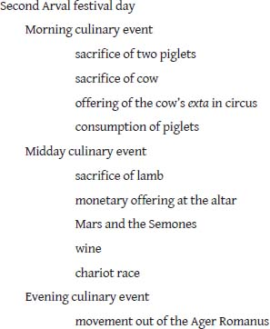

# CHAPTER 4. The Fourth Fire

## 4.9 THE ARVAL RITES OF DEA DIA (II)

<!-- page_173 -->

When the Arval rites of the goddess Dea Dia are examined within the context of an archaic Indo-European doctrine of dual sacred spaces (urban Rome and Ager Romanus; Vedic Devayajana and Mahāvedi) certain structural parallels and similarities between these Roman rites and those of the Agniṣṭoma, particularly those observed on the Soma-pressing day, unexpectedly present themselves. Obviously suggestive is the parallel triadic structure[^ch4fn25] of the pressing day rituals and the central day of the Arval ritual, both in terms of a gross three-way division of the day and of features replicated within the divisions. Thus, the second day of Arval rites is punctuated by three episodes of banqueting: (i) the meal made from the pigs sacrificed in the morning; (ii) the dinner banquet in the tetrastyle of the grove; and (iii) the evening banquet at the home of the Magister back in Rome. The pressing day of the Agniṣṭoma is similarly segmented by three episodes of Soma libation and ingestion—morning, midday, and evening.

We shall consider in turn each of these culinary episodes and the activities which cluster with them. Again, to provide the reader with a guide through the coming discussion, elements of the second day of the Arval ritual which will prove especially important from a comparative perspective are outlined in figure 4.3.

## Notes

[^ch4fn25]: Or should we say “tripartite structure”? According to *Śatapatha Brāhmaṇa* 4.3.5.1, the morning pressing belongs to the Vasus (third function), the midday pressing to the Rudras (second function; the conspicuous position of Indra in this pressing has already been noted), and the evening pressing to the Ādityas (first function), along with the other gods.
