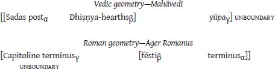

<!-- page_241 -->

# CHAPTER 5. From the Inside Out

## 5.1 INTRODUCTION

In this the final chapter of our study we will more closely examine elements of the Indo-European sacred spaces. Particular attention will be given to the boundary markers of the great sacred space, especially to their instantiation in Roman cult and the significance of their use for, inter alia, revealing the character of the gods Terminus and Mars. Discussions in this chapter will also focus somewhat more directly on the ancient Indo-European cult which is parent to the Vedic and Roman ritual practices examined throughout. The empirical method employed for these discussions is one that projects original (that is, historically antecedent) structures on the basis of identified homologous structures; Dumézil called it *pensée extériorisée* ‘exteriorized thinking’, which was discussed in §1.7.1.4.2. As we saw in that discussion, Dumézil’s method, similar to Benveniste’s, is in effect the scientific comparative method which linguists use in reconstructing earlier, unattested forms of language by comparing descendent languages, but here applied to cultural and social reflexes rather than linguistic forms.

<!-- page_242 -->

## 5.2 PROTO - INDO-EUROPEAN CULT

Vedic and Roman cult share a duality of sacred space—one small (Devayajana and urban Rome), one great (Mahāvedi and Ager Romanus). The common linguistic and cultural origin of the Indic and Italic peoples is beyond question. The religious preservationism of these two Indo-European societies ringing the eastern and western rims of the Indo-European expansion area in antiquity is well documented, revealed both by lexical evidence (see Benveniste 1969) and by cultic practice (see *ARR*). Ergo, the most economical and at the same time compelling interpretation of this shared structure of sacred space is one which appeals to inheritance: Vedic and Roman religious practice both continue a Proto-Indo-European doctrine and cultic use of dual sacred spaces. Extrapolating from the Vedic and Roman traditions, what conclusions can we draw about the ancestral Indo-European practices?

### *5.2.1 The small space*

Several considerations point to the freestanding cultic use of the Indo-European small space without the large. Most obvious of these is the Vedic observance of the various Iṣṭis—rites that require only the small space. In Rome the small sacred space—that bounded by the *pomerium*—likewise has a distinctive use, being the space within which the urban auspices must be conducted. In both India and Rome, the small space is that which houses the three canonical flames—flames which fulfill discrete ritual functions not dependent on operations being conducted within the large space.

### *5.2.2 East*

<!-- page_243 -->

In Vedic practice, the great space is laid out to the east of the small. In Roman ritual, the great space has become an all encompassing expansion surrounding the small. The concentric geometry of the sacred spatial arrangement in Rome, we have proposed, is consequent to the immobile and permanent nature of Roman society—so many great-space extensions emanating from the boundary of the fixed small space, melding together by design or by inevitable necessity to form a continuous enclosure. Yet even in Rome there is clear evidence of the theological primacy of the eastward expansion. Like the Vedic Yātsattra with its iterative eastward expansion of the Mahāvedi along the course of the river Sarasvatī (see §4.3.1), so in Rome there is an iterated movement of the larger sacred space beyond

the eastern boundary of the Ager Romanus—along the course, as it were, of the Via Praenestina. The Ager Gabinus with its own form of auspices, and so distinguished from the Ager Peregrinus, is a great sacred space that projects from the eastern boundary of the Ager Romanus, one step further removed from the small space of urban Rome (see §4.12).

East is also otherwise revealed to be the direction of theological preeminence. In Vedic India, the east is the region that belongs to the gods,[^ch5fn1] and offerings are made to the gods while facing east (*ŚB* 3.1.1.6–7; compare *ŚB* 14.2.2.28). East is the region of the fire god Agni (*ŚB* 3.2.3.16; 6.3.3.2) and is under his protection (*ŚB* 8.6.1.5). It is the region associated with the *brāhmaṇa*, the priestly class (*ŚB* 5.4.1.3).[^ch5fn2] Note also that the three canonical flames of the Devayajana, the ground of the Iṣṭi, and the relocated Āhavanīya, Sadas, Soma-cart shed, and *yūpa* of the Mahāvedi all lie along the west-to-east axis passing through those two spaces.

<!-- page_244 -->

East is similarly critical in Rome. Temples are to be situated—to the extent possible, writes Vitruvius (4.5.1)—so that the temple (*aedes*) and the image of its deity are profiled against the eastern sky (facing west); the sacrificer thus looks to the east toward the image, and from the east the deity’s gaze is returned (compare Clement of Alexandria, *Strom.* 7 7). Servius (*Aen.* 12.172) records that it is to the east that Romans face when they pray to the gods (compare Ovid, *Fast.* 4.777–778).[^ch5fn3] Reminiscent of the east–west axis of the Vedic sacred spaces is the axis which Livy’s *lituus-*wielding Augur traces in the sky from east to west at the inauguration of Numa Pompilius (1.18.7–10). While Numa sits facing south, the Augur (at his left) is turned to the east—revealed by his designation of the regions to the south as “right” and those to the north as “left.” Servius (*Aen.* 2.693) concurs with the augural designation of north as “left”; and Isidorus Hispalensis (*Etym.* 15.4.7) writes that an augural *templum* faces to the east (*ut qui consuleret atque precaretur rectum aspiceret orientem*). Dionysius of Halicarnassus (*Ant. Rom.* 2.5.1–5) describes the best orientation for augury as

eastward-facing, being the region from which the sun, moon, stars, and planetary bodies rise.

There is an alternative Roman tradition according to which the front of the augural space faces south. The notion is preserved by Varro (*Ling.* 7.7) who, writing of the four sections of the *templum*, identifies the eastern as “left” and the southern as “front” (*Eius templi partes quattuor dicuntur, sinistra ab oriente … antica ad meridiem*). This looks to be part and parcel of the same doctrine espoused by Festus (p. 220M) when he records that the southern part of the sky illuminated by the sun is called “front” and the northern part “back.” When that famous Augur Attus Navius (whose confrontation with Tarquinius we earlier examined; see §1.9.1.1) first displayed his augural skills by divining the location of the largest bunch of grapes in his vineyard, he measured out his augural *templum* while facing south—such at any rate is Cicero’s account (*Div.* 1.30–31); Dionysius of Halicarnassus (*Ant. Rom.* 3.70.2–5) fails to mention the southward orientation. Whatever historical processes might lie behind this augural bifurcation in Rome, it is worth noting that even if the Augur should face to the south, east still plays a prominent role: east is then “left,” and in Roman augural tradition, auspicious omens are observed on the left.[^ch5fn4]

The eastward progression of the Vedic Soma-sacrifices and the Roman ritual expansion eastward into the Ager Gabinus, coupled with the Roman propensity for eastward orientation in augural rites, and the identification of the east with the domain of the gods in both cultures points to a parent Indo-European cult and theology in which the direction of the rising sun played comparable roles. In Proto-Indo-European cult, the small sacred space could be used independently—marked off, cleaned of animal dung, and otherwise prepared as necessary by the Indo-European pastoralist worshippers and their priests. Certain religious concerns, however, required that the small sacred space be augmented by the measuring out of a large space to its east—the direction of the gods—and that the ritual be expanded by movement of the celebrants into and through that space. Judging from the iterative nature of the eastward expansion evidenced independently by the Yātsattra rites and the Ager Gabinus, the Proto-Indo-European eastward expansion of sacred space could likewise be realized as a repeated ritual event.

<!-- page_245 -->

### *5.2.3 The unboundary*

On the distal boundary of the great sacred space is erected an upright marker—the *yūpa* (sacrificial stake) in Vedic India; the *terminus sacrificalis* in Rome. Though it stands on the border of the sacred terrain, dividing the realm of sacrificial order from the world of disorder which lies beyond, for the sacrificer the *yūpa* is not a limiting device. It does not mark an end point beyond which the sacrificer cannot progress. To the contrary, the *yūpa* is a facilitating device; in a sense it marks an “unboundary” for the sacrificer. The *yūpa* opens the way to the acquisition of blessings: it brings rain (§2.6.1); it provides livestock, offspring, fertility to the fields, sustenance, long life, and prosperity (§2.6.2). Positioned at the eastern edge of the sacred arena—on the unboundary—it stands at the highest point on earth, brings immortality, and gives the sacrificer access to the world of the gods (§§2.6.1.1; 2.6.2). By means of the *yūpa* the sacrificer gains possession of the earth—an earth which in the symbolism of ritual is equated in expanse with the *vedi* at the edge of which the *yūpa* stands (§4.5).

5.2.3.1 THE UNBOUNDARY LOST The notion of the unboundary—the boundary which is not—is also to be found in Rome. On the one hand, within the historicized mythology of Rome’s first two kings, Romulus and Numa—radically contrastive personalities—the unboundary is presented as meeting its demise. Thus, in Plutarch’s *Life of Numa* and *Roman Questions*, as we have seen, the Greek sage writes of how it was Numa who first built temples to Fides and Terminus (§1.5.4), and appears to suggest that it was Numa who first established sacrifices for the boundary god, making them bloodless as befits a guardian of justice and peace (§2.8.4). His predecessor Romulus had placed no such boundary markers around Roman territory, we are told (*Quaest. Rom.* 15):

> … ὅπως ἐξῇ προ[image-glyph: unresolved image00438]έναι καὶ ἀποτέμνεσθαι καὶ νομίζειν πᾶσαν ἰδίαν …

> … so that it might be possible to move forward and to seize and regard all [land] to be his own. …

This is precisely the realization of the advantage held out by the *yūpa*. It is the same act ritualized in the iterative expansion of the Mahāvedi in the Yātsattra rituals.

<!-- page_246 -->

The Sabine Numa, however, was of a different ilk. While Romulus had much enlarged the territory of Rome by the spear, Numa—possessed by a

passion for justice—is portrayed as promoting agriculture and introducing the benefits of the georgic lifestyle to Romans, and thereby removing from Rome the propensity for war. As a part of his land reforms, Numa is credited with dividing Roman territory into the rural districts called *pagi* (Plutarch, *Numa* 16.1–4; Dionysius of Halicarnassus, *Ant. Rom.* 2.76.1–2) and requiring each landowner to delineate his own property-boundaries, marking them with *termini* (*Ant. Rom.* 2.74.2–5).

Numa’s boundary and land reforms—to use the phenomenology of the historicized mythic tradition—are the consequence of the transformation of an archaic Indo-European pastoral society, with its rituals of symbolic and ever-advancing acquisitions of earth, into the landed society of Rome in which shared boundaries between fields must remain fixed and inviolate (§4.4). The temporary sacrificial space intended to bring blessings and advantage for the sacrificer has been replaced by permanent properties—fields—in which the old rituals of the sacred space continue to be acted out. The perceived benefit is purification of the field with the goal of bringing to the sacrificer (the owner/tiller) blessings and advantage. The structures have changed; the theology remains unchanged (see §4.6). The inherited marker of the osmotic *unboundary* which is ancestral to both the Vedic *yūpa* and the Roman *terminus sacrificalis* must then become in Rome a marker of the impermeable *boundary* as well. This is the evolutionary bifurcation discussed in §2.8.4—the ancient Indo-European cultic implement splitting into both the benchmark *termini* and the sacred *termini sacrificales*.

<!-- page_247 -->

There is an additional consequence of the Roman monumentalization of the Indo-European cultic marker of the sacred space. It is not a necessary consequence but indeed a natural one, given the well-known Roman tendency for divinely animating inanimate objects and abstract notions. The *termini*—in origin part of the equipment of the cult—have been deified as Terminus, god of the boundary. The religion of Rome is rife with such deifications—providing much fuel for the fires of the Church Fathers. St. Augustine (*De Civ. D.* 4.8)—using Varro, again, as his source for the names—would taunt Roman paganism for its dependence on deities such as Cluacina, goddess of sewers; Volupia, goddess of pleasure; Lubentina, goddess of *libido*; Rusina, goddess of fields; Jugatinus, god of mountain tops; Collatina, goddess of hills; Vallonia, goddess of valleys; Seia, goddess of seeds; Nodutus, god of the joints of stems; Forculus, god of doors; Cardea, goddess of hinges; Limentinus, god of the threshold. The list goes on. Terminus is

the most significant member of this set, attesting to the great antiquity and significance of the object which he animates.[^ch5fn5]

The Vedic *yūpa* brings to the sacrificer blessings of fecundity and increase. This must certainly be the functional essence of the *yūpa*’s Indo-European prototype, since the same fundamental notion survives in its Roman reflex. The continuity is most readily apparent in the character of Terminus, the deified descendent of the “proto-*yūpa*.” Terminus is one member of that set of deities collectively named as “the gods of Titus Tatius” (see §1.4)—Roman deities of “prosperity and fertility” (*ARR*: 170) who continue, ideologically, the third function of early Indo-European society. The primitive *terminus*—standing on the unboundary, bringer of fecundity and increase—has become Terminus—god of the boundary, assimilated into the body of the gods of fecundity and increase.

5.2.3.2 THE UNBOUNDARY GAINED On the other hand—with a view to the remainder of the world—a Roman notion of the unboundary survives—alive and well. Numa may have set up *termini* around Rome (Dionysius of Halicarnassus, *Ant. Rom.* 2.74.4; Plutarch, *Quaest. Rom.* 15; *Numa* 16.2), but as Ovid has told us in words describing the Terminalia and sacrifices offered to Teminus along the boundary of the Ager Romanus (*Fast.* 2.683–684; see §§3.2; 4.5):

> Gentibus est aliis tellus data limite certo:

> Romanae spatium est Urbis et orbis idem.

> For other nations the earth has fixed boundaries;

> Rome’s city and the world are the same space.

<!-- page_248 -->

Rome’s boundary—*unlike all others*—is an unboundary. These lines likely preserve a Latin pun on *urbs* ‘city’ and *orbis* ‘world’ which is otherwise

attested, beginning with Cicero (*Cat.* 4.11), argues Nicolet (1991: 110–111, 114; see also Edwards 1996: 87, 100). And as we noted earlier (see §3.2), the poet captures the same view in lines on the Kalends of January (*Fast.* 1.85–86):

> Iuppiter arce sua totum cum spectet in orbem,

> nil nisi Romanum quod tueatur habet.

> Jupiter, viewing all the world from his citadel,

> Observes nothing un-Roman to protect.

The same cosmology finds expression in Virgil (*Aen.* 1.278–279); foretelling the future founding of Rome—the “walls of Mars”—Jupiter proclaims:

> His ego nec metas rerum nec tempora pono;

> imperium sine fine dedi.

> To these [walls] I set no boundaries or duration of possessions;

> an empire without limit I have given.

Ovid hints at the doctrine again—in words reminiscent of the Vedic sacrificer’s proclaimed access to the world of the gods *and* possession of the earth by means of the elevated *yūpa*, when in the miserable gray of Tomi the poet looks back to that city from which he has been exiled (*Tr.* 1.5.69–70)—no mean city it is:

> Sed quae de septem totum circumspicit orbem

> montibus, imperii Roma deumque locus.

> But which surveys the whole world from seven

> hills—Rome, place of gods and empire.

(Compare *Tr.* 3.7.51–52; *Pont.* 2.1.23–24; Propertius 3.11.57.)

In the charming, learned style of early-twentieth-century scholarly prose, Frazer (1929, vol. 2: 90), in commenting on *Fasti* 1.85–86, writes:

> Roman poets loved to boast of Rome as the capital of the whole earth, and to speak of the Roman empire as co-extensive with the globe. It is curious to reflect that to the Greeks and Romans, civilized and enlightened as they were, by far the greater part of the terrestrial globe, with all its teeming population, remained utterly unknown. They were like ants who mistake their ant-hill for the world.

<!-- page_249 -->

Writing in the last decade of the same century, Edwards (1996: 99) draws attention to Pliny’s descriptions of Rome in *Historia Naturalis* 3.66–67 and

36.101–124, and especially to his claim of 36.101 regarding the buildings of Rome:

> universitate vero acervata et in quendam unum cumulum coiecta non alia magnitudo exsurget quam si mundus alius quidam in uno loco narretur.

> With the whole lot of them brought together and stacked up in a kind of mound, an expanse would rise up as if some other world were being described in one space.

Edwards surmises, “The sum of Rome is equivalent to another world, *mundus alius*” (pp. 99–100) and draws Pliny’s remarks into the sphere of the notion that *urbs* equals *orbis*, citing *Fasti* 2.684. For Edwards, this is a rhetorical stratagem: “Another strategy for conveying the city’s unique status is to represent Rome as in itself equivalent to the entire world” (p. 99). Again, she writes of Rome functioning “as a metonymy of the world” (p. 87).

Both of these scholarly views express vital synchronic interpretations. Frazer undoubtedly captures a kind of anthropological tendency, or even a universal—indeed, people do not have to live in such cosmopolitan places as Rome and Athens to “mistake their ant-hill for the world.” Equally certain is that, as Edwards (following Nicolet 1991) notes, the tenet of “*urbs* equals *orbis*” becomes a literary motif which suits well the rhetoric of Roman imperialism. Lying behind this tenet, however, is an ancient theological doctrine of the sacred space which, in conjunction with the marker of the unboundary, is symbolic of the “earth to be possessed”—a promise of blessing to the sacrificer. Mutatis mutandis, the acclamation of *Śatapatha Brāhmaṇa* 3.7.2.1, “Verily as large as the *vedi* is, so large is the earth” (after Eggeling 1995, pt. 2: 175; see §4.5), is remarkably well paraphrased by Edward’s observation (p. 87) that “Rome can function as a metonymy of the world. …” Something like a purist version of this doctrine is preserved in Ovid’s lines penned in the *Fasti* entries for the Terminalia (2.683–684) and the Kalends of January (1.85–86); Virgil has not moved far from it in *Aeneid* 1.278–279. The theological doctrine, however, lends itself to more mundane interpretations of the imperial city’s hegemony over the peoples and lands that Rome has subjugated. Thus Pliny, writing of the grandeur of Rome’s buildings, declares the world has also been conquered in the architectural realm (*HN* 36.101; see Edwards 1996: 100).

### *5.2.4 A theo-geometric shift*

<!-- page_250 -->

Bearing in mind that precious little remains of the theology of the rites celebrated along the boundary of the Ager Romanus, we note what clearly

appears to be a spatial differential distinguishing the Roman and Vedic traditions of the unboundary. In Vedic cult it is at the distal boundary of the great sacred space—where the *yūpa* stands—that the unboundary and other blessings provided by that erected post are realized. There the sacrificer—touching and climbing the *yūpa*—gains access to the world of the gods; there he possesses the earth; that spot—where the *yūpa* stands—is claimed to be the highest point on earth. In contrast, in Roman cult it is on the summit of the Capitoline, a proximal locale, that a *terminus* stands—the Capitoline Terminus—and from this lofty perch Jupiter looks down on the world, seeing nothing un-Roman. It is here, on the Capitoline hill, that the theology of the unboundary is most conspicuously realized. Edwards, in her 1996 study of the “literary topography” of Rome, notes the preeminent position of the Capitoline (see, especially, pp. 69–95): “If Rome can function as a metonymy of the world …, then the Capitol functions as a metonymy of Rome itself” (p. 87). And again she writes: “The Capitol was the seat not of day-to-day political power in Rome (most meetings of the senate and of the people took place elsewhere), but rather of Rome’s symbolic power” (see also Borgeaud 1987: 91, whom she cites).

Why does this differential exist? It seems that we are dealing with a spatial shift in Rome (positing that the Vedic condition continues the practice of the primitive Indo-European cult). Such a shift may well be consequent to the temporary sacred spaces of Indo-European cult being replaced by the immovable spaces of Rome, and the accompanying evolutionary bifurcation of the inherited sacred boundary markers into secular and sacred alloforms. The *unboundary* marker shifts from the *termini* rimming the Ager Romanus—perceived as not only a sacred boundary but also as a *fixed boundary* of the state—to *the* Terminus standing on Jupiter’s Capitoline summit, the symbol of Roman power—to appropriate the words of the Vedic commentary, the “highest point on earth” (the *summa* are in the power of Jupiter; St. Augustine, *De Civ. D.* 7.9; see §2.7.1). By this Roman *yūpa*, Rome—like the Vedic sacrificer—gains possession of the earth.

<!-- page_251 -->

On the other hand, there is clear evidence that this shifted configuration itself has an Indo-European prehistory. As we saw in §2.4, the stone marker Terminus, standing on the Capitoline summit, ensconced within the temple of the sovereign deity Jupiter, is a Roman expression of an Indo-European matrix which also survives among both the Celts and the Indo-Aryans. This configuration among the latter peoples—a *linga* resting on an elevated structure within the residence of the king—was in fact our entrée into an examination of the *yūpa* and the Vedic sacred spaces. That is to say, the Vedic antecedent of the *linga* of the god Śiva is identified as the

*yūpa* (§2.6). We subsequently discovered, however, that the *yūpa*—a *columna mundi* (like the Śiva *linga*)—is matched by several closely related by-forms: the *skambha*; the flaming *liṅgodbhava*; the *Indradhvaja*; and the Sadas post (§2.6.3). The last of these shares a mirror-image geometry with the *yūpa*—the Sadas post standing at the western boundary of the Mahāvedi, the *yūpa* standing at the eastern, so that the two posts bracket that great sacrificial space. The ritual conducted at the erection of the Sadas post is nearly identical to the one which accompanies the raising of the *yūpa* (§2.6.3.4). Even more significantly, like the *yūpa* the Sadas post is a facilitator of blessings, strengthening the *brāhmaṇa* and the *kṣatriya* (priest and warrior classes) through the ritual of its erection. Much as with the *yūpa*, the blessings of the Sadas post are anchored particularly in the realm of production and fertility. It brings wealth and abundance (*ŚB* 3.6.1.17). It is made of *udumbara*—a kind of wood equated with “strength and food” (*ŚB* 3.6.1.2). The sacrificer touches it (as he touches the *yūpa*) and prays, and thereby he gains offspring and cattle, or whatever he might wish (*ŚB* 3.6.1.20).

The general similarity in the rituals of raising the Sadas post and the *yūpa*, the Sadas post’s transparent status as a *columna mundi* (see §2.6.3.4), and its pronounced affiliation with fertility, give us cause to ponder whether it might be this truncated *yūpa*—the Sadas post, an alloform of the sacrificial stake—which is more immediately antecedent to the Śiva *linga*, and hence which is the Vedic “cognate” of the Irish stone of Fál and (of greatest importance for our present purpose) of the Roman *terminus*—the divine Terminus—which stands on the Capitoline summit. To some extent, admittedly, identifying that antecedent pillar as the Sadas post rather than the *yūpa* is to make a moot distinction. The two structures are clearly closely related (we have called them alloforms), standing at either end of the Mahāvedi, raised on or very close to the east–west axis that bisects the small and great sacred spaces, on which lie the several sacred fires. In other words, one might claim that lying behind these two structures is a common, monolithic conceptual notion which likewise finds expression in the various members of the Indo-European matrix of the sacred stone. Two pieces of evidence, however, suggest that we are justified in splitting this hair of *yūpa* versus Sadas post.

<!-- page_252 -->

First, in our discussion of the Indo-European matrix of which Terminus is the Roman member (§2.4), we argued that two of the features comprising that matrix concern the realm of sovereignty. The sacred stone is both affiliated with a figure of sovereignty and occupies an elevated position in a sovereign space. Thus Terminus resides within the temple of Jupiter Optimus Maximus and stands on the summit of the Capitoline hill; the *linga*

of Śiva resides within the king’s residence and is there positioned atop a pyramid; the Irish stone of Fál announces the legitimate king of Ireland and is positioned on top of the hill of the royal village of Tara.

These features are exactly replicated by the Sadas post, which in Vedic ritual is likewise affiliated with and positionally linked to the sovereign realm. The Sadas post stands at the western border of the Mahāvedi; and according to the *Śatapatha Brāhmaṇa* (8.6.1.7), the western region of that space belongs to the gods called the Ādityas (§1.6.1), representatives of the first function (see §1.4) of divine society—the domain of sovereignty. Beyond that, the protector of the west is said to be Varuṇa, who along with Mitra, stands at the head of the gods of the first function; Varuṇa and Mitra, as we have seen already (§1.3), occupy a position in Vedic India equivalent to that of Jupiter in Rome. The Sadas post stands on the extremity of the Mahāvedi that belongs to the gods of the sovereign domain, and thus like the various members of our Indo-European matrix bears an affiliation with figures of sovereignty. The element of elevation is also present in the west to the extent that when the sacrificer is choosing a space for the Soma sacrifice, he is to select a place which “lies highest” (*ŚB* 3.1.1.1) and which slopes downward from west to east (or slopes down to the north; *ŚB* 3.1.1.2). At the same time, we should bear in mind that the *yūpa* is ritually proclaimed to occupy the highest place on earth.

The second bit of evidence for identifying the Sadas post and the *terminus* on the Capitoline as homologous structures is this. We noted that the Indo-European matrix of the sacred stone is trifunctional in nature. Each of the three stones which evidence the matrix—Indo-Aryan, Irish, and Roman—belongs to the realm of fertility and productivity (third function); at the same time each is associated with both the domain of sovereignty (first function) and the domain of the warrior (second function; see §2.4).

<!-- page_253 -->

Here again, the Sadas post shows a remarkable parallel. The affiliation of this western boundary marker with the realm of fecundity (third function) is fundamental—it brings blessings of increase and fertility to the sacrificer (on whose behalf the Soma-sacrifice is being performed). At the same time, when the Sadas post is ritually planted, an invocation is made to Dyutāna, son of the Maruts (Indra’s warrior companions; second function) and to Mitra and Varuṇa (chief of the Ādityas; first function; *ŚB* 3.6.1.16). Moreover, as the priest mounds up earth around the planted Sadas post, he prayerfully addresses the pillar as champion of the *brāhmaṇa* class (first function), of the *kṣatriya* class (second function), and of the increase of wealth and abundance (third function; *ŚB* 3.6.1.17). As he tamps down the earth around the post, he prays that it will sustain the *brāhmaṇa* class (first

function), the *kṣatriya* class (second function), and life and offspring (third function; *ŚB* 3.6.1.18).

5.2.4.1 TWO COLUMNS Two posts mark the limits of the great sacred space in India and Rome. The Vedic and Roman cults show a nearly exact match in the geometry of those two posts. They show only a slightly less exact theological match.

One of those posts stands on the distal boundary of the great sacred space. In India it is the *yūpa* (often one of several) raised at the eastern edge of the Mahāvedi; in Rome it is the *terminus* erected at the boundary of the Ager Romanus (any one of numerous *termini* located along that encircling boundary).

The other of the posts stands at the proximal boundary of the great space. In India, it is the Sadas post set up on the western extremity of the Mahāvedi, close to the seam where that space adjoins the small sacred space of the Devayajana. In Rome, the proximal *terminus* stands on the summit of the Capitoline hill; its placement there must date to the earliest periods of the Indo-European habitation of Rome and so to a time when the ancient *pomerium* passed around the Palatine (see Holloway 1994: 101–102) and excluded the Capitoline.

The traits of the Indic columns can be summarized as follows:

1 The temporary movable space of the Vedic Mahāvedi is studded by two columns standing at the polar extremities of that space, lying on or close to the east–west axis which bisects the Mahāvedi.

2 Each column is a *columna mundi*.

3 Each post brings blessings of increase and fecundity for the sacrificer. 4 The proximal column stands in the quarter of the Ādityas (the west), manifestly trifunctional in its affiliations.

4 The space slopes from the proximal to the distal column, though the latter—the *yūpa*—is declared to occupy the “highest point on earth.”

5 The distal column is a marker of the unboundary.

In Rome, these traits are replicated, mutatis mutandis:

<!-- page_254 -->

1 The fixed space of the Ager Romanus is marked by *termini* ringing the far boundary of that great Roman sacred arena and by a single proximal *terminus* standing on the Capitoline heights just beyond the Palatine *pomerium* (§4.4). This Capitoline *terminus* early on became the permanent Roman Sadas post from which one radiating axis after another was extended, like so many spokes from a hub, across the Ager Romanus—the Roman Mahāvedi—toward distal *termini sacrificales* set up at sites of

periodic ritual activity along the rim of the far boundary of the great sacred space, partitioning the Ager Romanus into so many wedges of sacred space. The revolving wheel of perpetual sacred activity so created is in effect the fixed-place, steady-state equivalent of the ever-advancing *yūpa* and the ever-extending Mahāvedi of the Vedic Yātsattra ritual (§4.3.1). So viewed, the perpetually cycling rituals along the periphery of the Ager Romanus would constitute a synchronically productive variant of the historically circumscribed expansion into the Ager Gabinus (on which, see §4.12).

2 Like the homologous Vedic columns, the proximal as well as the distal *termini* of Roman cult represents a *columna mundi* (§2.7.1).

3 Also like their Vedic homologues, each *terminus* is fundamentally affiliated with the realm of fecundity, revealed by the inclusion of the deified Terminus in the third-function set of deities that Varro denotes as the “gods of Titus Tatius” (§1.4), and by comparative evidence supplied by the Indo-European feature-matrix of the sacred stone.

4 As in India, the proximal column resides in the region of the realm of divine sovereignty—standing on Jupiter’s Capitoline. The Roman sovereign god must have been affiliated with the Capitoline hill long before the construction of the temple of Jupiter Optimus Maximus. This is certainly the condition reflected in the annalistic tradition of Rome’s origins: after his defeat of Acron, king of the Caeninenses, at the outset of the Sabine war, Romulus—Rome’s founding regent—offers the slain warrior’s spoils to Jupiter Feretrius on the Capitoline (depositing them at a sacred oak), and there vows to Jupiter Rome’s first temple (Livy 1.10.4–7; compare Plutarch, *Rom.* 16.3–7; Propertius 4.10.5–22).[^ch5fn6]

Also like the Sadas post standing in the quarter of the Ādityas, the *terminus* of Jupiter’s Capitoline participates in a trifunctional assemblage, being also affiliated with the warrior’s realm: this deified Terminus is there affiliated with Juventas—and even Mars has a continued, if inconspicuous, presence, writes St. Augustine (§1.11). This trifunctionality brings us back to the very heart of the problem with which we began this study: this same trifunctional assemblage of Terminus, Juventas, and Jupiter *is* the Minor Capitoline triad.

<!-- page_255 -->

5 Consider the prescribed raised elevation of the western boundary of the Mahāvedi. Obviously the lay of the Capitoline is likewise elevated, yet the Capitoline is the smallest of the seven hills of Rome (Richardson 1992: 68). Paradoxical it is, then, that the hill of Jupiter—in whose power are the *summa* (St. Augustine, *De Civ. D.* 7.9, following Varro)—is not the greatest. When the god who possesses the *summa* looks down on the world and sees nothing un-Roman, it is not from the highest possible elevation in Rome. It reminds us of the paradox of the elevation of the *yūpa*, which is declared to occupy the highest spot on earth, though the elevation of the great sacred space is to slope down toward the eastern boundary at which the *yūpa* stands.

6 We have already seen that the claim that the *yūpa* occupies the highest spot on earth is a declaration made about the marker of the unboundary and that in Rome, with the evolutionary differentiation of the ancient sacred boundary marker into a marker of state and private boundaries as well, the essence of the unboundary is shifted from the *termini* of the periphery—from the Roman *yūpas*—to the *terminus* of the Capitoline—the Roman Sadas post. That this shift was not simply an unconscious process—an automatic theological knee jerk—is suggested by an observation made much earlier in this work and, at the moment of the observation, seemingly unconnected with the Capitoline hill, the notion of an unboundary, and any other such matter—but very much connected with the column of the distal boundary.

In his account of the Ambarvalia, or Ambarvia as he dubs it, the Greek geographer Strabo says that the festival is celebrated at a place called Festi on the boundary of the Roman territory—and at still other boundary places (see §3.3.1). We argued that Strabo’s Festi (Φῆστοι) is not a geographic τόπος, but a worship “place” that shares a linguistic and cultic origin with Vedic *Dhiṣṇya*, from Proto-Indo-European **dʰeh₁s-* (see §4.3.2). The Dhiṣṇya-hearths of the Mahāvedi are six fires located beneath the Sadas (plus a seventh, the Āgnīdhrīya, along the northern boundary of the great sacred space). They stand in a row (running north to south) immediately to the east of the Sadas post. In other words, the Dhiṣṇya-hearths (six of the seven) are part of the landscape of the proximal boundary of the great sacred space of the Mahāvedi. Strabo’s Festi, however, is situated along the distal boundary of the great sacred space of Rome, the Ager Romanus.

<!-- page_256 -->

We did not entertain this spatial distinction in our earlier discussion of Festi vis-à-vis the Dhiṣṇya-hearths. Perhaps it is of no consequence; one might claim that Latin *fēsti* and Sanskrit *Dhiṣṇyaḥ* are simply terms descended from the available nomenclature of Proto-Indo-European cult and came to be applied independently to functionally similar but spatially dissimilar

cultic structures in the Roman and Vedic great sacred spaces. The mirror-image spatial relationship which *fēsti* and the Dhiṣṇya-hearths display makes this suggestion unlikely, however, when it is viewed in tandem with the co-occuring mirror-image relationship of the placement of the marker of the unboundary in Rome and in India. We have argued that the marker of the unboundary shifts in Rome from being embodied in the column on the distal boundary of the great sacred space to that of the proximal boundary of that space. There appears to have been a concomitant or responsive Roman shift of the cultic implements—*fēsti*—located next to the column of the proximal boundary. As the unboundary marker moves proximally, the *fēsti* move distally, preserving an ancient cultic geometry of the great sacred space that remains intact in the homologous Vedic space:

That the marker of the unboundary must remain separated from the Dhiṣṇya-hearths/*fēsti* by the length of the great sacred space—even when that marker has shifted in Rome—clearly suggests that the Vedic Dhiṣṇya-hearths and the Roman *fēsti* have not only denotations that are of common Indo-European origin but that they are in fact homologous cultic structures (see §4.3.2). Antecedent to both is a great sacred space of Proto-Indo-European cult, studded at each end by posts; just interior to the post of the proximal end of that space is a set of priestly altars.

<!-- page_257 -->

Like the architecture of the sacred edifices of many of the world’s faiths, the geometry of the sacred spaces is ancient and resistant to change. When in Rome there is a realignment of the bracketing columns vis-à-vis the notion of the unboundary—consequent to the evolution of fixed boundaries in the landed society of Rome—the ancient geometry is preserved by a sliding of the altars to the far column. An intriguing typological parallel is provided by the rotation in sacred Christian architecture which occurred in the fourth century AD. In antiquity, churches were constructed along an approximate east–west axis. During the time of Constantine, the sanctuary was regularly located at the western end of a church. By the middle

of the fourth century, however, church architecture had been reoriented 180 degrees, with the apse shifting to the eastern aspect (see Davies 1953: 81–83; the shift may actually represent a return to a still earlier east–west orientation).

5.2.4.2 TERMINUS What the preceding sections have made clear is just how central and fundamental Terminus was to the archaic Capitoline. Now it becomes clear why Terminus—in the mythic history of the Romans—could not possibly be compelled to leave his Capitoline locale to make room for the new triad. We see why Terminus was selected to continue the third-function presence among the members of the Minor Capitoline triad. The affiliation of a *terminus* with the place must have been every bit as old as Jupiter’s presence there (compare Jupiter Terminus), born out of age-old cultic practices that the Italic peoples brought with them as they entered the Italian peninsula. In the ancient inherited Indo-European theology, Terminus could not be dissociated from the Capitoline, and the boundary god’s presence there was requisite for the preservation of the unboundary of Rome. This is precisely the religious doctrine that is preserved—cloaked in garments of the state—in the accounts of his refusal to leave the Capitoline. These we encountered at the outset of our study (see §§1.2; 1.11); let us rehearse them once more as we come to the end. Dionysius of Halicarnassus (*Ant. Rom.* 3.69.6) writes of Terminus and Juventas:

> … ἐκ δὲ τούτου συνέβαλον οἱ μάντεις ὅτι τῆς Ῥωμαίων πόλεως οὔτε τούς ὅρους μετακινήσει καιρὸς οὐθεὶς οὔτε τὴν ἀκμὴν μεταβαλεῖ

> … and from this the Augures determined that nothing would ever bring about either the disruption of the boundaries of the Roman city or the loss of its vitality

Livy (1.55.4–5) records:

> idque omen auguriumque ita acceptum est, non motam Termini sedem unumque eum deorum non evocatum sacratis sibi finibus firma stabiliaque cuncta portendere

> And this omen and augury was so interpreted: that the seat of Terminus was not moved, and that he alone among the gods was not called out beyond the boundary made sacred to him, foreshadowed that all would be steadfast and unfailing

And St. Augustine (*De Civ. D.* 4.29), drawing on Varro, tells us:

<!-- page_258 -->

> Sic enim, inquiunt, significatum est Martiam gentem, id est Romanam, nemini locum quem teneret daturam, Romanos quoque terminos propter deum Terminum neminem commoturum, iuventutem etiam Romanam propter deam Iuventatem nemini esse cessuram.

> Thus, they say, it was portended that the people of Mars—that is, the Roman people—would hand over to no one any place which they held; and that, on account of Terminus, no one would move the Roman boundaries; and again, on account of the goddess Juventas, that the Roman warrior manhood would surrender to no one.

As the Vedic evidence of the Sadas post also makes plain, Terminus—that is, the Capitoline *terminus—*is itself in its primitive cultic origins inextricably a part of a trifunctional assemblage. It is a member of a set no less trifunctional than the Pre-Capitoline triad itself (Jupiter, Mars, Quirinus), and no less ancient. One might wonder whether the Capitoline *terminus* belongs in a sense to an even more ancient trifunctional structure—a configuration of the archaic Indo-European cult preserved remarkably faithfully in Rome, while the Pre-Capitoline triad is a particular Roman—or early Italic—permutation of Indo-European tripartite theology. Regardless of relative antiquity, when Terminus is seen from the perspective of his cultic, trifunctional origin, it is little wonder that he—the Capitoline instantiation of the unboundary—must remain on the Capitoline as an element of a trifunctional set—what we have called the Minor Capitoline triad—at the seemingly Tarquin-inspired appearance of the temple of Jupiter Optimus Maximus.

### *5.2.5 Terminus and Mars*

<!-- page_259 -->

Terminus—or the *terminus*—and Mars have a particular closeness. St. Augustine, with Varro as his guide, has told us that in addition to Terminus and Juventas, Mars himself refused to vacate the Capitoline for the construction of the temple of Jupiter Optimus Maximus—a somewhat paradoxical state of affairs given that the raising of that edifice marks the replacement of an ancient Indo-European triad, of which Mars is a member, with a different triadic collection of deities. Mars is invoked along the distal boundary of the Ager Romanus, a place ringed by *termini*, by the Fratres Arvales, priests of the fields, as they hymn their *carmen* (see §4.9.2). Beyond that, we saw his presence recurring at various ritual sites along that ancient sacred boundary—homologous to the far boundary of the Mahāvedi (§§4.10–4.11). He is also notably present at ambarvalic rites celebrated in smaller bounded spaces, as in the lustration rite described by

Cato (§3.3.3). It is the centrality of Mars in such agrarian settings and ritual activities that led to the idea of an “agrarian Mars” (§4.10.1).

5.2.5.1 INDRA AND VI[image-glyph: unresolved image00347]ṆU To gain an understanding of why Mars is present in the fields and borderlands and why he is invoked in the rites of those places, we must once again look to Vedic India. The *yūpa*—standing on the distal boundary of the great sacred space, marker of the unboundary—is not only a *source* of blessing, fecundity, and wealth—it is also a *means*. The *yūpa* is a thunderbolt, and with it the sacrificer takes possession of the earth and—equally important—he prevents his enemies from having a part therein (*ŚB* 3.7.2.1; see §4.5). The *yūpa* is raised as a *columna mundi* transcending sky, air, and earth, and by that post—a thunderbolt—the sacrificer gains those worlds and prevents his enemies from doing likewise (*ŚB* 3.7.1.14; Eggeling 1995, pt. 2: 171). The post is described as an eight-edged weapon that protects the sacrificer and wards off demonic forces (*AB* 2.1.1–2). The thunderbolt is the weapon of Indra, warrior god, as we saw in our study of Semo Sancus (see especially §4.9.2.6), and Indra is himself associated with the *yūpa* (as in *AV* 4.24.4). We saw also that Indra is conspicuously present in the great sacred space on the Soma-pressing day; the midday pressing belongs almost exclusively to him (§4.8.2). Of the various by-forms of the *yūpa* which we discussed in §2.6.3, one has particular relevance here, namely the *Indradhvaja*, ‘Indra’s banner’. It is set up “for the destruction of the king’s enemies” and the top of the staff is pointed in the direction of the city of the enemy (see §2.6.3.3). Also conspicuously affiliated with the banner is Viṣṇu, which leads us to the next point.

<!-- page_260 -->

Indra’s affiliation with the *yūpa* itself is chiefly an indirect one. There is another warrior figure with whom the *yūpa* is more closely bound. He is the aforementioned Viṣṇu (see especially §§2.6.1; 2.6.3; 2.7), the three-stepping god who is companion to Indra, assisting him in the fight against the dragon (§§4.9.2.4; 4.9.2.8.1) and at times affiliated with Indra’s warrior band, the Maruts (§4.8.2).[^ch5fn7] Indra’s particular connection with the *yūpa*

through Viṣṇu is made plain, for example, in *Śatapatha Brāhma[image-glyph: unresolved image00355]a* 3.7.1.17. The sacrificer touches the *yūpa* immediately after the priest hoists it into position, and he is made to address the post, reciting words from *Rig Veda* 1.22.19 (Eggeling 1995, pt. 2: 171–172, with modification):

> “See the deeds of Viṣṇu, whereby he beheld the sacred ordinances, Indra’s allied friend!” For the one who has set up the sacrificial post has hurled the thunderbolt: “See Viṣṇu’s conquest!” is what the sacrificer means to say when he says “See the deeds of Viṣṇu, whereby he beheld the sacred ordinances, Indra’s allied friend!” Indra, for certain, is the deity of the sacrifice, and the sacrificial post belongs to Viṣṇu; he thereby connects it with Indra; therefore he says, “Indra’s allied friend.”

Viṣṇu, in taking his three steps, transcends and conquers the spaces of the universe (see Gonda 1993: 55 with references). He extends the spaces for the habitations of human kind. Thus he is praised in *Rig Veda* 7.100.4:

> vi cakrame pṛthivīm eṣa etāḥ kṣetrāya Viṣṇur manuṣe daśasyan

> dhruvāso asya kīrayo janāsa urukṣitiḥ sujanimā cakāra

> This Viṣṇu traversed the earth

> for a habitable space for humankind, assisting.

> Itinerant people gained a fixed space;

> the good creator made for them a broad habitation

Indra is at times drawn into Viṣṇu’s conquering advance, creating space for humankind. In the Soma ceremony hymn of *Rig Veda* 6.69, for example, Indra and Viṣṇu (denoted by the dvandva *Indrāviṣṇū*) are invoked to come to the Soma feast on their “enemy-conquering horses” (stanza 4); are urged to lead the sacrificers forward on paths free from obstructions (stanza 1); are praised for stepping broadly and thereby increasing the space of the air and making broad the regions of space for humankind (stanza 5). The hymn ends (stanza 8) by addressing the two warrior deities as conquering but unconquered, as having brought about limitless threefold space when they had fought.

It can be no accident that the god to whom belongs the marker of the unboundary, Viṣṇu, is the god who conquers and creates space. In the carrying of fire and Soma from the small sacred space into the Mahāvedi, the rite of Agnīṣomapraṇayana—“pictured as a wide-ranging, conquering progress” (Heesterman 1993: 126; see §4.3.1)—Viṣṇu is addressed with lines from the *Sāma Veda* (5.38). The litany is rehearsed in *Śatapatha Brāhmaṇa* 3.6.3.15 (Eggeling 1995, pt. 2: 159–160, with modification):

<!-- page_261 -->

> Stride widely, Viṣṇu, make wide room for our abode! Drink the *ghee*, you who are born of *ghee*, and speed the lord of the sacrifice ever onwards!

The Soma-carts that journey from the west into the Mahāvedi, as if setting out on “a pioneering expedition to the unknown east” (Jamison 1996: 125; see §4.3.1)—these Soma-carts belong to Viṣṇu (*ŚB* 3.5.3.15). Before the carts begin their journey, the sacrificer’s wife anoints them with butter (*ghee*), and hymns to Viṣṇu are recited (*RV* 1.22.17; *RV* 7.99.3). When the carts are brought to rest at their journey’s end in the Mahāvedi, both are propped in position; *Śatapatha Brāhmaṇa* 3.5.3.21–22 describes the act (Eggeling 1995, pt. 2: 133, with modification):

> The Adhvaryu, having gone round along the north side of the carts, props the southern cart, with “Now will I declare the heroic deeds of Viṣṇu, who measured out the regions of the earth; who propped the upper seat, striding three times, the wide-stepping!”

> The assistant then props the northern cart, with “Either from the heaven, Viṣṇu, or from the earth, or from the great wide airy region, Viṣṇu, fill both of your hands with wealth and bestow on us from the right and the left.”

The Havirdhāna, the shed in which the Soma-carts are parked (§4.3), is likewise sacred to Viṣṇu (*ŚB* 3.5.3.2).

The *yūpa* belongs to wide-striding, space-extending, conquering Viṣṇu. At the other end of the great sacred space—the proximal end—stands the Sadas post, linked with fertility and blessings—like its taller counterpart, the *yūpa*—with its markedly trifunctional affiliations. The shelter beneath which it stands, the Sadas, is proclaimed to belong to Viṣṇu’s warrior affiliate, Indra (*ŚB* 3.6.1.1).[^ch5fn8]

<!-- page_262 -->

5.2.5.2 INVASION AND CONQUEST The questing journey of the sacrificer and priests into the great sacred space of the Mahāvedi, the staking out of that space with altars and huts, and the continued progress toward the column that stands on its distal, eastern border (a boundary which is not) constitute an odyssey in which gods of war play a fundamental role. Most notable in the event is Viṣṇu, the god who transcends, conquers, and expands space. Indra, most renowned of the warrior gods, accompanies him. In our initial discussion of this journey (§4.3.1), we saw that Agni,

the god of fire, also plays an aggressive offensive role, serving as the point man, leading the way, as portrayed in the lines of *Taittirīya Saṃhitā* 1.3.4.c chanted by the priests moving into the Mahāvedi (Keith 1967: 39, with modification):[^ch5fn9]

> May Agni here make room for us;

> May he go before us cleaving the foe;

> Joyously may he conquer our foes;

> May he win spoils in the contest for spoils.

It is unmistakable that worshipful expansion into the Mahāvedi reflects and rehearses an event of invasion and conquest. In this questing journey the gods of war are conspicuously invoked; their presence is essential for gaining the space of expansion and crushing the opposition, mortal or demonic, which will inevitably present itself.

Homologous to the conspicuous presence of the warrior gods Indra and Viṣṇu in the space of the Mahāvedi is the presence of Mars in the space of the Ager Romanus. To phrase the matter somewhat differently: whatever it is that Indra and Viṣṇu are doing within the Mahāvedi, Mars is doing the same within the Ager Romanus. The procession of Vedic priests through the Mahāvedi and the ambarvalic movement of Roman priests through the Ager Romanus are both descended from a common ancestral rite of the questing journey from the small sacred space into the great. The journey is an invasion; the gods of war must be invoked to take the lead, to vanquish the opponent, to secure possession of the invaded space. As warrior Indra and, especially, Viṣṇu, the god who enlarges space, are bound to the Vedic *yūpa*, the marker of the unboundary, source and means of blessing, so Mars is linked to the Roman *terminus* (deified as Terminus). He is present and invoked around the distal rim of the Ager Romanus, at those terminal points of ritual salience. In the *carmen* of the Fratres Arvales he is called on to take up a position on that encircling boundary, to bring in the storming Semones, to drive away the forces of destruction. At the Robigalia he is present to protect against the demonic forces of crop destruction and ensure the blessing of fecundity. Doubtless he was similarly invoked, hymned, and celebrated at numerous other cardinal points at the far edge of the great Roman sacred space.

<!-- page_263 -->

At some moment in the history of Roman religion, the ambarvalic movements

into the Ager Romanus perhaps ceased to be assigned the synchronic interpretation of the conquering journey. Even beyond that moment,

as certainly before it, Mars would remain at his old stations on the distal boundary, frozen there in form by a religious unwillingness to modify deeply ancient ancestral rites long removed from the context of migratory society. If he has been forgotten in the journey (and there seems to be no evidence which would compel us to believe that he has been), he is still remembered at the border—boundary between the ordered world of sacrifice and ritual within and the wilderness of disorder without, the place of the *termini* to which he bears an age-old linkage.

In the case of Cato’s ambarvalic rites of field lustration, as we saw earlier (§4.6), a theological shift has occurred. The *medium* of the Indo-European sacred space has been transformed into the *object* of Roman ground which is to be made pure: the space which is invaded and conquered to bring blessing and afford possession of the earth has given way to space already possessed and in need of protection and purification in order that it may bring a blessing. An ambarvalic movement is preserved—a procession of the *suovetaurilia* about the space to be purified, the path of which is directed by the chthonic deity Manius; and the warrior god whose presence is crucial for victory likewise remains—Mars is invoked (Cato, *Agr.* 141):

> Ianum Iovemque vino praefamino, sic dicito: “Mars pater, te precor quaesoque uti sies volens propitius mihi domo familiaeque nostrae, quoius re ergo agrum terram fundumque meum suovitaurilia circumagi iussi, uti tu morbos visos invisosque, viduertatem vastitudinemque, calamitates intemperiasque prohibessis defendas averruncesque; utique tu fruges, frumenta, vineta virgultaque grandire beneque evenire siris, pastores pecuaque salva servassis duisque bonam salutem valetudinemque mihi domo familiaeque nostrae; harumce rerum ergo, fundi terrae agrique mei lustrandi lustrique faciendi ergo, sicuti dixi, macte hisce suovitaurilibus lactentibus inmolandis esto; Mars pater, eiusdem rei ergo macte hisce suovitaurilibus lactentibus esto.”

<!-- page_264 -->

> First invoke Janus and Jupiter with wine and recite this: “Mars Pater, I beseech and implore you, that you might be gracious and propitious to me, my house and my household, and on this account I have directed the *suovitaurilia* to be driven around my land, earth and farm; that you might avert, keep away, and ward off sickness, seen and unseen, scarcity and desolation, disaster and extremes of nature; and that you might allow crops, grains, vines and bushes to grow large and to bear well, that you might keep safe herders and herds and give well-being and good health to me, my house and my household. On account of these things, on account
> of purifying my farm, earth and land and performing a lustration, just as I have declared, be honored with these suckling victims, the *suovitaurilia*; Mars Pater, on account of this same thing, be honored with this suckling *suovitaurilia*.”

The warrior god protects the sacrificer and the sacred ground of the sacrifice; he brings blessings of fecundity, wealth, and well-being. We are here not far removed theologically, mutatis mutandis, from the realm and actions of Indra and, especially, Viṣṇu within the great sacred space of the Mahāvedi. Only in Cato’s prayer, blessings of fertility are sought from Mars rather than his *terminus* (Viṣṇu’s *yūpa*)—which undoubtedly stood close by on the boundary of the field being lustrated. In the bounded space of the field with its boundaries held inviolate by the boundary marker (under the law of Numa), the focus has shifted from that marker—descended from the ancient fertility- and wealth-bringing sacred boundary post—to the warrior god inextricably bound to it.

5.2.5.3 AGRARIAN MARS Is Mars an agrarian deity? He is a warrior, descended from a great Indo-European class of warrior gods, representative of that class in the Pre-Capitoline triad. He is not a god of vegetable matter, not a deity who causes the plants to spring from the earth cyclically. His is not the vine; no patron of the budding tree is he. He is, however, quite at home in the fields.

<!-- page_265 -->

The answer to the above question depends on how we frame the notion of “agrarian deity.” If one is to define “agrarian deity” generally as ‘a god associated with the fields’, or even somewhat more narrowly as something like ‘a god facilitating the growth of field crops’, then the answer to the question is clearly, “Yes, Mars is an agrarian deity.” He is addressed precisely as such a god in Cato’s prayer. Mars is not simply the guardian deity who keeps a vigilant watch, allowing agricultural gods to accomplish their tasks unimpeded by threatening powers, as Dumézil claims (following Wissowa and Norden; see §4.10.1). He is implored by the landowner/worshipper to keep away disaster, to give a fecund harvest, to protect herds and family. These are the blessings of the *yūpa*; the warrior god has become the bestower of such advantages secondarily; they belonged originally to his column on the sacred boundary—the unboundary. Mars’ integral involvement in the ritual journey into the great sacred space and his close affiliation with the marker of the unboundary—source of blessings and fertility—have led in Rome to a realignment of his role as the rites of the

metaphysically unbounded sacred space are appropriated for use in the possessed space of the bounded field.

While this realignment occurs in Mars’ personality, there is, nevertheless, a clear indication of a living Roman awareness or memory of Mars’ special linkage to the *terminus*. As we saw early in our study (§1.11) and noted again in beginning this chapter, Varro records a tradition, passed on to us by St. Augustine, that not only Terminus and Juventas refused to vacate the Capitoline for the construction of the temple of Jupiter Optimus Maximus, but Mars himself could not be budged. The building of that temple is the visible expression of the radical shift that occurred when the old Indo-European Pre-Capitoline triad—Jupiter, Mars, Quirinus—was supplanted by the new Capitoline triad—Jupiter, Juno, Minerva—under (traditionally identified) Tarquin influence.

Mars is so closely bound to Terminus—the deified Roman “Sadas post” and Capitoline marker of the unboundary who cannot possibly leave the Capitoline—that even though the warrior god has been excised from the principal divine threesome of Rome, he still must remain in the space cleared out for the new triad. There is, we have argued, a continued Indo-European triad that remains in that space—the Minor Capitoline triad consisting of Jupiter, Juventas, and Terminus. The warrior Mars’ ongoing presence on the Capitoline in the tradition preserved by Varro seems not only paradoxical but redundant. But Mars does not remain because he continues the warrior presence (Indo-European second function) in that space; he does not remain because he is still a member of a principal triad of deities served by the ancient Flamens; he remains because of his age-old bond to the boundary marker Terminus.

## 5.3 CONCLUSION

<!-- page_266 -->

It is widely accepted that sometime in the third millennium BC, Indo-European societies began to abandon the familiar surroundings of their native regions and to spread themselves broadly across Europe and deeply into Asia. These migratory invasions[^ch5fn10] proved to be so successful that Indo-Europeans gained the upper hand throughout Europe, so that virtually all of the native languages of the pre-Indo-European peoples of that continent were annihilated. In the east the momentum generated by these movements

would propel Indo-Europeans into the Indian subcontinent and central Asia, all the way to the deserts of China. What fueled this wanderlust? What drove the Indo-Europeans to be so intent on diffusion—and to be so effective in its realization?

The answers to these and related questions are undoubtedly complex and multifaceted. Far-flung population migration is not a phenomenon unique to ancient Indo-Europeans; one has only to look at the peopling of the Americas, for example, to find supporting evidence for this claim. Much of what drives a people to pick up their belongings and move (rapidly or incrementally) to a different place is clearly a function of human need, informed by particular social and cultural attitudes and practices. Broad considerations such as these, however, are far beyond the pale of the present investigation and would likely be readily claimed as the investigatory property of other disciplines.

In the case of the early Indo-Europeans, however, the present comparative study of Roman and Vedic cult and its operation within sacred spaces reveals at least one specific factor which almost certainly played a role in the Indo-European propensity to move and to establish dominance over “the other.” Ancient Indo-European pastoralists practiced a religion in which sacred rites were observed within a temporarily demarcated sacred space. For certain more weighty rites, this space was enlarged by adjoining to its eastern border a larger sacred arena, each end of which was marked by the erection of a column. In the celebration of these rites, priests and worshippers advanced from the small space into and through the great space, journeying toward its eastern boundary, the region of the gods, and toward the column—a *columna mundi*—which stood there. That *columna mundi* makes the distal boundary of the great space in actuality no boundary at all, but a conduit for continued expansion. The trek into the great space is thus a metaphysical journey—a metaphor for an unending journey and a limitless acquisition of space. In making that journey, the Indo-European sacrificer gains a promise of land and the material blessings which it brings to the pastoralist; more than that, the sacrificer, by way of the *columna mundi*—the pole of blessing—gains access to the gods themselves and to their world—to the realm of divine space. This questing journey, like all journeys, is fraught with danger. The way is led by warrior gods who are invoked to vanquish any and all opposing powers, to remove obstructions that lie in the path of the journeying priests and worshippers, to lead them to spaces of blessing. The *columna mundi* which opens the way to those blessings is in the very possession of the warrior god(s).

<!-- page_267 -->

The theology of the victorious journey though space, led by conquering warrior gods, translates into a divine imperative to advance across the spaces of the earth. It is the Biblical injunction of “be fruitful and multiply” raised to the nth power. Possessed of such a theology cum ideology and compelled by it, little wonder it is that early Indo-European peoples so doggedly pursued and achieved acquisition of the spaces of Europe and many of those of Asia.

## Notes

[^ch5fn1]: The region of the north belongs to men, the south to the Pitaras, and the west to snakes (*ŚB* 3.1.1.6–7).

[^ch5fn2]: The south is associated with the Kṣatriya, the warriors and the west with the Vaiśya, the goods producers (*ŚB* 5.4.1.4–5). At the same time, within the context of the space of the Mahāvedi, the lords of the east are said to be the Vasus (the third function of divine society), those of the south are the Rudras (second function), those of the west are the Ādityas (first function), and the lords of the north are the Maruts (*ŚB* 8.6.1.5–8).

[^ch5fn3]: According to Tertullian (*Apol*. 16.9–10), Christians likewise pray toward the east, a custom which brought the charge of sun worshipping from pagans.

[^ch5fn4]: See Dionysius of Halicarnassus, *Ant*. *Rom*. 2.5.2–5; Virgil, *Aen*. 9.630–631; Plutarch, *Quaest. Rom.* 78. For the spatial orientation of the Roman *templum*, see *ARR*: 597; Frazer 1929, vol. 3: 365–367.

[^ch5fn5]: Such divine animation is bound up with the problematic notion of *numina*. Surveying the concept, *BNP* (vol. 2: 3) states “The word *numen*, meaning ‘nod’ or ‘divine power’, is used by Roman poets of the early Empire, such as Ovid, to indicate the mysterious presence of godhead in natural or man-made objects, in this case the boundary stone—the *terminus*. According to animistic theories of Roman religion, Terminus was an example of the earliest form of Roman deity; it was never represented in human style, but always seen as the divine power residing in the boundary stone. And the word *numen* itself, following these theories, was the standard Latin term for the pre-anthropomorphic ‘divinities’ of the early period.” For Dumézil’s arguments against the ideas of animistic theories, such as that of H. J. Rose and his followers, see *ARR*: 18–31.

[^ch5fn6]: Jupiter appears to have had an even wider affiliation with non-Palatine Roman hills—and with their trees—at an early period in Rome’s history (see Warde Fowler 1899: 228–229). On the Esquiline was found the grove of Jupiter called the Lucus Fagutalis (from *fagus* ‘beech’), where there was a shrine (*sacellum*) of Jupiter Fagutalis (see *LTUR*: vol. 3: 135; Richardson 1992: 148). Juppiter Viminus had an archaic altar on the Viminal, with perhaps the name of both hill and altar derived from *vimen*, denoting a flexible branch, commonly willow (*LTUR*: vol. 3: 162; Richardson 1992: 227–228, 431). Compare also the *sacellum* of the Capitoleum Vetus on the Quirinal, which perhaps in origin predates the Capitoline triad (Warde Fowler 1899: 228–229).

[^ch5fn7]: Consider Keith’s summary remarks (1998a: 109) on the relationship of the two warrior gods: “Viṣṇu is closely associated with Indra: one hymn is devoted to the pair of gods, and, when Viṣṇu is celebrated by himself, Indra is the only other god who is given a place; when about to perform his supreme feat of slaying Vṛtra, Indra implores Viṣṇu to step out more widely. Through his association with Indra, Viṣṇu becomes a drinker of Soma, and he cooks for Indra 100 buffaloes and a brew of milk. Through his connexion with Indra Viṣṇu also is associated with the Maruts, with whom he shares honour in one hymn.”

[^ch5fn8]: The Sadas is said to be Viṣṇu’s belly (*ŚB* 3.6.1.1). Viṣṇu is equated with the sacrifice and various artifacts of the Mahāvedi are identified with parts of his body.

[^ch5fn9]: Compare the sacrificer’s prayer to Agni in *Śatapatha Brāhmaṇa* 3.6.3.11–12 (see §4.6) and the tale of Agni escaping from the mouth of Māthava Videgha and racing eastward along the Sarasvatī (*ŚB* 1.4.1.10–19; see §4.3.1).

[^ch5fn10]: For a different view of Indo-European expansion in antiquity, see Renfrew 1988.
