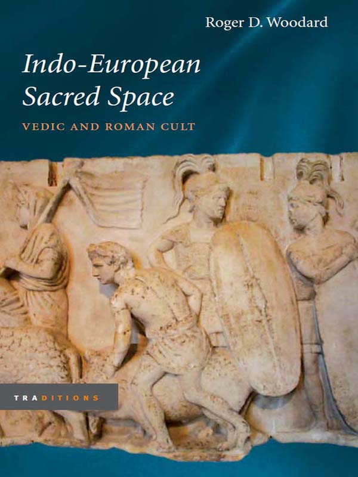
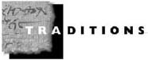

<!-- page_i -->

## INDO-EUROPEAN SACRED SPACE

<!-- page_ii -->

GENERAL EDITOR

Gregory Nagy

Harvard University

EDITORIAL BOARD

Olga M. Davidson

Wellesley College

Bruce Lincoln

University of Chicago

Alexander Nehamas

Princeton University

*A list of books in the series appears at the end of this book.*

<!-- page_iii -->

# *Indo-European Sacred Space*

## VEDIC AND ROMAN CULT

## ROGER D. WOODARD

## UNIVERSITY OF ILLINOIS PRESS

## URBANA AND CHICAGO

<!-- page_iv -->

© 2006 by the Board of Trustees of the University of Illinois

All rights reserved

Manufactured in the United States of America

 This book is printed on acid-free paper.

C 5 4 3 2 1

Library of Congress Cataloging-in-Publication Data

Woodard, Roger D.

Indo-European sacred space : Vedic and Roman cult / Roger D. Woodard.

p. cm. -- (Traditions)

Includes bibliographical references (p. ) and index.

ISBN-13: 978-0-252-02988-2 (isbn 13 cloth : alk. paper)

ISBN-10: 0-252-02988-7 (isbn 10 cloth : alk. paper)

1. Indo-Europeans--Religion. 2. Rome--Religion. 3. India--Religion. 4. Mythology, Roman. 5. Mythology, Indic. 6. Sacred space.

I. Title. II. Series: Traditions (Urbana, Ill.)

BL660.W66 2006

200’.89’09--dc22 2005017055

<!-- page_v -->

To the memory of

James Wilson Poultney

Colleague, Mentor, Friend

<!-- page_vii -->

## CONTENTS

Preface

Acknowledgments

1. The Minor Capitoline Triad

2. Terminus

3. Into the Teacup

4. The Fourth Fire

5. From the Inside Out

Postscript

Abbreviations

Bibliography

Index

<!-- page_ix -->

## PREFACE

*Indo-European Sacred Space* is a work about two particular bounded spaces—one small, one great—used in the practice of the ancestral Indo-European religion. The focus of the study falls squarely upon the reflexes of those spaces as they survived in two Indo-European descendent cultures, one lying on the western margin of the area of Indo-European expansion in antiquity, the other on the eastern. In the west, the small cultic ground survives as the space of urban Rome, bounded by the pomerium; and the large, as the vast arena which lies between the pomerium and the distal boundary of the Ager Romanus. Comparable spaces, of common origin, are found within the cult of Vedic India; and as on other occasions, the well-attested Vedic structures and usages have much to reveal about Roman cult.

Both in terms of scholarly history and theory, my starting point for this investigation is Georges Dumézil’s model of Roman religion, developed vis-à-vis the overarching threefold ideology of Proto-Indo-European society. One of the objectives of the present work is thus to present a clear and concise summary of Dumézil’s arguments for the survival of ancient Indo-European ideology in early Roman religion; this is the principal, but not exclusive, focus of chapter 1. A second and more important objective is to jump forward from that Dumézilian platform and to offer a new understanding of Roman and, more generally, primitive Indo-European religious structures and phenomena; one that goes beyond and, in some instances, differs appreciably from Dumézil’s own interpretations. The work which is presented herein therefore marks a beginning—certainly not a fait accompli.

Dumézil is not the only eminent twentieth-century scholar of the classical and Indo-European disciplinae with whom this work is connected. Another is my former Johns Hopkins colleague, James Wilson Poultney. It is as a dedication to the memory of his life, his friendship, and his always uncompromising standards of scholarly excellence that I offer this work, and but hope it to be a suitable offering.

<!-- page_xi -->

## ACKNOWLEDGMENTS

Many are those to whom I am indebted for assistance, advice, and support in the preparation of this work. All cannot be named, but I would be remiss not to express special thanks to a few: to Gregory Nagy, editor of this series, for his friendship and support; to Willis Regier and his staff at the University of Illinois Press, for their excellent professionalism and guidance; to Chris Dadian of the Center for Hellenic Studies for his invaluable aid with the manuscript; to N. J. Allen of the Institute of Social and Cultural Anthropology at Oxford University, for his wisdom, expertise, and much more; to my collaborator A. J. Boyle and Penguin Books for their kind permission to utilize translations from our *Ovid: Fasti* (2004). My indebtedness to Katherine and Paul far exceeds what mere words of mortal tongue can convey.

I wish also to express my heartfelt appreciation to the College of Arts and Sciences at the University of Buffalo for generously providing a subsidy to support the publication of this work.

<!-- page_xiii -->

## INDO-EUROPEAN SACRED SPACE
