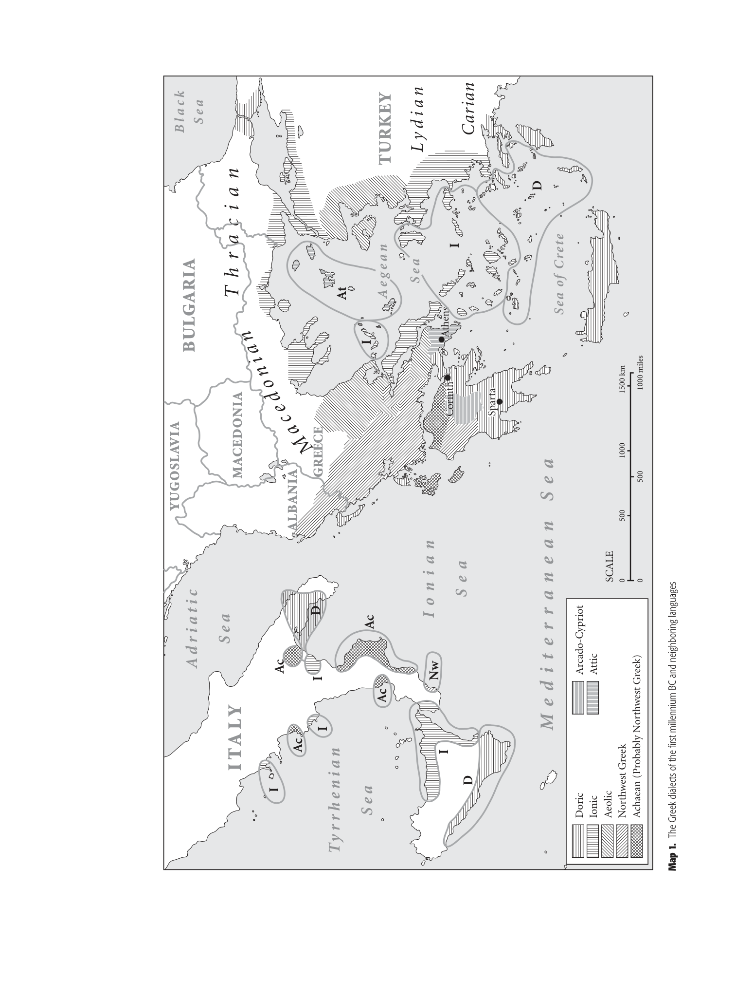

# bibliography-chapter-2: Bibliography — Chapter 2: Attic Greek

<!-- pdf-page: 70 -->
Bibliography
Allen, W. 1973. Accent and Rhythm. Cambridge: Cambridge University Press.
———. 1987. Vox Graeca (3rd edition). Cambridge: Cambridge University Press.
Browning, R. 1983. Medieval and Modern Greek (2nd edition). Cambridge: Cambridge University
Press.
Buck, C. 1933. Comparative Grammar of Greek and Latin. Chicago: University of Chicago Press.

<!-- pdf-page: 71 -->
Buck, C. and W. Petersen. 1945. A Reverse Index of Greek Nouns and Adjectives. Chicago: University
of Chicago Press.
Chantraine, P. 1968ff. Dictionnaire ´etymologique de la langue grecque: Histoire des mots. Paris:
Klincksieck.
———. 1984. Morphologie historique du grec (2nd edition). Paris: Klincksieck.
Denniston, J. 1954. The Greek Particles (revised edition by K. Dover). Oxford: Oxford University
Press.
Devine, A. and L. Stephens. 1994. The Prosody of Greek Speech. Oxford: Oxford University Press.
Dover, K. 1960. Greek Word Order. Cambridge: Cambridge University Press.
Gildersleeve, B. 1900. Greek Syntax. Amsterdam: Gieben.
Jeffery, L. 1990. The Local Scripts of Archaic Greece (revised edition). Supplement by A. Johnston.
Oxford: Oxford University Press.
Kirchhoff, A. 1887. Studien zur Geschichte des griechischen Alphabets. G¨utersloh: Bertelsmann.
Lejeune, M. 1982. Phon´etique historique du myc´enien et du grec ancien. Paris: Klincksieck.
Masson, O. 1983. Les inscriptions chypriotes syllabiques. Paris: Edition E. de Boccard.
Meier-Br¨ugger, M. 1992. Griechische Sprachwissenchaft (2 vols.) Berlin: DeGruyter.
Meillet, A. 1965. Aper¸cu d’une histoire de la langue grecque (7th edition). Paris: Klincksieck.
Meillet, A. and J. Vendryes. 1979. Trait´e de grammaire compar´ee des langues classiques (5th edition).
Paris: Champion.
Nagy, G. 1974. Comparative Studies in Greek and Indic Meter. Cambridge, MA: Harvard University
Press.
Palmer, L. 1980. The Greek Language. Atlantic Highlands, NJ: Humanities Press.
Rix, H. 1976. Historische Grammatik des Griechischen. Darmstadt: Wissenschaftliche
Buchgesellschaft.
Schwyzer, E. 1939ff. Griechische Grammatik (4 vols.). Munich: Beck.
Sihler, A. 1995. New Comparative Grammar of Greek and Latin. Oxford: Oxford University Press.
Smyth, H. 1956. Greek Grammar (revised edition by G. Messing). Cambridge, MA: Harvard
University Press.
Threatte, L. 1980. The Grammar of Attic Inscriptions, vol. I. Berlin: De Gruyter.
Vendryes, J. 1916. Trait´e d’accentuation grecque. Paris: Klincksieck.
Ventris, M. and J. Chadwick. 1973. Documents in Mycenaean Greek (2nd edition). Cambridge:
Cambridge University Press.
Woodard, R. 1997. Greek Writing from Knossos to Homer. Oxford: Oxford University Press.

<!-- pdf-page: 72 -->
0
500
1000
1500 km
0
500
1000 miles
SCALE
I TA LY
GREECE
ALBANIA
MACEDONIA
BULGARIA
B l a c k
S e a
A e g e a n
S e a
TURKEY
Sea of Crete
I o n i a n
S e a
M e d i t e r r a n e a n  S e a
A d r i a t i c
S e a
YUGOSLAVIA
Ty r r h e n i a n
S e a
M
a
c
e d o
n i a n
T h r a c i a n
L y d i a n
Carian
Athens
Corinth
Sparta
At
I
I
D
I
Ac
I
Ac
I
D
Nw
Ac
I
Ac
D
Doric
Ionic
Aeolic
Northwest Greek
Achaean (Probably Northwest Greek)
Arcado-Cypriot
Attic

