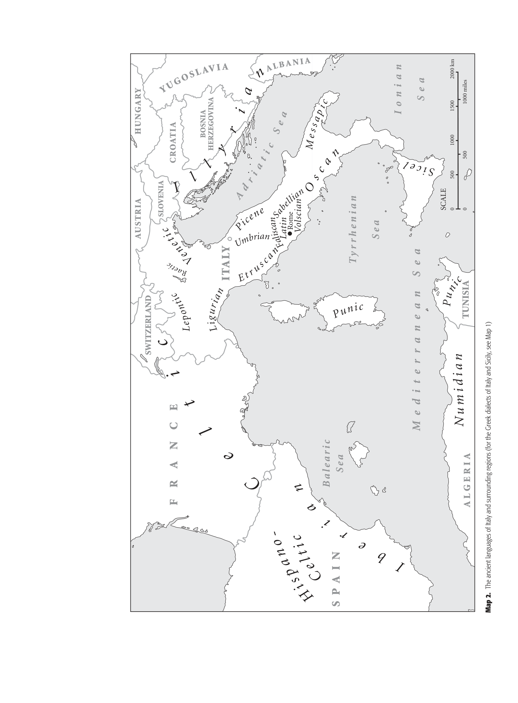

# bibliography-chapter-5: Bibliography — Chapter 5: Sabellian languages

<!-- pdf-page: 145 -->
Bibliography
Adiego Lajara, I. J. 1990. “Der Archaismus des Sudpikenischen.” Historische Sprachforschung
103:69–79.
Benediktsson, H. 1960. “The vowel syncope in Oscan-Umbrian.” Norsk Tidsskrift for Sprogvidenskap
19:157–295.
Briquel, Dominique. 1972. “Sur des faits d’´ecriture en Sabine et dans l’ager Capenas. M´elanges de
l’Ecole franc¸aise de Rome.” Antiquit´e 84:789–845.
Buck, C. Darling. 1928. A Grammar of Oscan and Umbrian (2nd edition). Boston: Ginn.
Colonna, G. 1974. “Nuovi dati epigrafici sulla protostoria della Campania.” Atti della riunione
scientifica, pp. 151–169.
Cowgill, W. 1970. “Italic and Celtic superlatives and the dialects of Indo-European.” In G. Cardona,
H. Hoenigswald, and A. Senn (eds.), Indoeuropean and Indoeuropeans, pp. 113–153.
Philadelphia, PA: University of Pennsylvania Press.
———. 1973. “The source of Latin st¯are, with notes on comparable forms elsewhere in
Indo-European.” Journal of Indo-European Studies 1:271–303.
———. 1976. “The second plural of the Umbrian verb.” In G. Cardona and N. H. Zide (eds.),
Festschrift for Henry Hoenigswald, pp. 81–90. T¨ubingen: Narr.
Cristofani, M. 1979. “Recent advances in Etruscan epigraphy and language.” In D. and F. R. Ridgway
(eds.), Italy before the Romans: The Iron Age, Orientalizing and Etruscan Periods, pp. 373–412.
London/New York/San Francisco: Academic Press.
Durante, M. 1978. “I dialetti medio-italici.” In A. L. Prosdocimi (ed.), Lingue e dialetti dell’Italia
antica, pp. 789–823. Popoli e civilt`a dell’Italia antica VI. Roma: Biblioteca di Storia Patria.
Garc´ıa-Ramon, J. L. 1993. “Zur Morphosyntax der passivischen Infinitive im Oskisch-Umbrisch.” In
H. Rix (ed.), Oskisch-Umbrisch. Texte und Grammatik. Arbeitstagung der Indogermanischen
Gesellschaft und der Societ`a Italiana di Glottologia vom 25. bis 28. September 1991 in Freiburg,
pp. 106–124. Wiesbaden: Dr. Ludwig Reichert.
Gusmani, R. 1966. “Umbrisch pihafiund Verwandtes.” Indogermanische Forschungen 71:64–80.
———. 1970. “Osco sipus.” Archivio glottologico italiano 55:145–149.
Jeffers, R. 1973. “Problems with the reconstruction of Proto-Italic.” Journal of Indo-European Studies
1:330–344.
Jones, D. M. 1950. “The relation of Latin to Osco-Umbrian.” Transactions of the Philological Society,
pp. 60–87.
———. 1962. “Imperative and jussive subjunctive in Umbrian.” Glotta 40:210–219.
Joseph, B. D. and R. E. Wallace. 1987. “Latin sum and Oscan s´um, sim, esum.” American Journal of
Philology 108:675–93.
Lejeune, M. 1949. “Sur le traitement osque de *-¯a final.” Bulletin de la Soci´et´e Linguistique de Paris
45:104–110.
———. 1970. “Phonologie osque et graphie grecque.” Revue des ´Etudes Anciennes 72:271–316.
———. 1975. “R´eflexions sur la phonologie du vocalism osque.” Bulletin de la Soci´et´e Linguistique de
Paris 70:233–251.
Marinetti, A. 1981. “Il sudpiceno come italico (e come ‘sabino’?): nota preliminare.” Studi etruschi
49:113–158.
———. 1985. Le iscrizioni sudpicene. I: Testi. Lingue e iscrizioni dell’Italia antica 5. Firenze: Leo S.
Olschki.
Meiser, G. 1986. Lautgeschichte der umbrischen Sprache. Innsbruck: Institut f¨ur Sprachwissenschaft
der Universit¨at Innsbruck (IBS 51).
———. 1987. “P¨alignisch, Latein und S¨udpikenisch.” Glotta 65:104–125.
———. 1993. “Uritalisches Modussyntax: zur Genese des Konjunktiv Imperfekt.” In H. Rix (ed.),
Oskisch-Umbrisch. Texte und Grammatik. Arbeitstagung der Indogermanischen Gesellschaft und
der Societ`a Italiana di Glottologia vom 25. bis 28. September 1991 in Freiburg, pp. 167–195.
Wiesbaden: Dr. Ludwig Reichert.
Negri, M. 1976. “I perfetti oscoumbri in -f-.” Rendiconti dell’Istituto Lombardo di Scienze e Lettere,
classe di lettere e scienze morali e storiche 110:3–10.
Nussbaum, A. 1973. “Benuso, couortuso, and the archetype of Tab. IG. I and VI–VIIa.” Journal of
Indo-European Studies 1:356–369.

<!-- pdf-page: 146 -->
———. 1976. “Umbrian ‘pisher.” Glotta 54:241–253.
Olzscha, K. 1958. “Das umbrische Perfekt auf -nki-.” Glotta 36:300–304.
———. 1963. “Das f-Perfektum im Oskisch-Umbrischen.” Glotta 41:290–299.
Poccetti, P. 1979. Nuovi documenti italici a complemento del Manuale di E. Vetter. Pisa: Giardini.
Porzio Gernia, M. L. 1970. “Aspetti dell’influsso latino sul lessico e sulla sintassi osca.” Archivio
glottologico italiano 55:94–144.
Poultney, J. W. 1959. The Bronze Tables of Iguvium. Baltimore: American Philological Association.
Prosdocimi, A. L. 1978a. “L’Osco.” In A. L. Prosdocimi (ed.), Lingue e dialetti dell’Italia antica,
pp. 825–911. Popoli e civilt`a dell’Italia antica VI. Roma: Biblioteca di Storia Patria.
———. 1978b. “L’Umbro.” In A. L. Prosdocimi (ed.), Lingue e dialetti dell’Italia antica, pp. 587–787.
Popoli e civilt`a dell’Italia antica VI. Roma: Biblioteca di Storia Patria.
———. 1984. Le tavole iguvine, I. Firenze: Leo S. Olschki.
Rix, H. 1976a. “Die umbrischen Infinitive auf -fiund die urindogermanische Infinitivendung
*-dhi¯oi.” In A. Morpurgo Davies and W. Meid (eds.), Studies in Greek, Italic, and Indo-European
Linguistics offered to Leonard Palmer, pp. 319–331. Innsbruck: Institut f¨ur Sprachwissenschaft
der Universit¨at Innsbruck.
———. 1976b. “Subjonctif et infinitif dans les compl´etives de l’ombrien.” Bulletin de la Soci´et´e
Linguistique de Paris 71:221–220.
———. 1976c. “Umbrisch ene . . . kupifiaia.” M¨unchener Studien zur Sprachwissenschaft 34:151–164.
———. 1983. “Umbro e Proto-Osco-Umbro.” In E. Vineis (ed.), Le lingue indoeuropee di
frammentaria attestazione. Atti del Convegno della Societ`a Italiana di Glottologia e della
Indogermanische Gesellschaft, Udine, 22–24 settembre 1981, pp. 91–107. Pisa: Giardini.
———. 1985. “Descrizioni di rituali in Etrusco e in Italico. L’Etrusco e le lingue dell’Italia antica.” In
A. Moreschini (ed.), Atti del Convegno della Societ`a Italiana di Glottologia, Pisa, 8 e 9 dicembre
1984, pp. 21–37. Pisa: Giardini.
———. 1986. “Die Endung des Akkusativ Plural commune im Oskischen.” In A. Etter (ed.),
o-o-pe-ro-si, Festschrift f¨ur Ernst Risch zum 75. Geburtstag, pp. 583–597. Berlin/New York: de
Gruyter.
———. 1992a. “La lingua dei Volsci. Testi e parentela.” I Volsci. Quaderni di archeologia
etrusco-italica 20:37–49.
———. 1992b. “Una firma paleo-umbra.” Archivio glottologico italiano 77:243–252.
Rix, H. 2002. Sabellische Texte. Die Texte des Oskischen, Umbrischen und S¨udpikenishen. Heidelberg:
C. Winter.
Rocca, G. 1996. Iscrizioni umbre minori. Firenze: Olschki.
Schmid, W. 1954. “Anaptyze, Doppelschreibung und Akzent im Oskischen.” Zeitschrift f¨ur
vergleichende Sprachforschung 72:30–46.
Untermann, J. 1973. “The Osco-Umbrian preverbs a-, ad-, and an-.” Journal of Indo-European
Studies 1:387–393.
Untermann, J. 2000. W¨orterbuch des Oskisch-Umbrischen. Heidelberg: Carl Winter.
Wallace, R. E. 1985. “Volscian sistiatiens.” Glotta 63:93–101.
Vetter, E. 1953. Handbuch der italischen Dialekte. I. Texte mit Erkl¨arung, Glossen, W¨orterverzeichnis.
Heidelberg: Carl Winter.
Von Planta, R. 1892–1897. Grammatik der oskisch-umbrischen Dialekte (2 vols.). Strasburg: Tr¨ubner.

<!-- pdf-page: 147 -->
0
500
1000
1500
2000 km
0
500
1000 miles
SCALE
S P A I N
F
R
A
N
C
E
SWITZERLAND
A L G E R I A
TUNISIA
ITALY
SLOVENIA
CROATIA
AUSTRIA
HUNGARY
Y U
G
O
S L
A
VI
A
BOSNIA
HERZEGOVINA
A
L
BA
N I A
I o n i a n
S e a
Ty r r h e n i a n
S e a
M e d i t e r r a n e a n  S e a
B alea r i c
Sea
A d r
i a
t
i c
S e a
H
i
s
p
a
n o
-
C
e
l t
i
c
I
b
e
r
i
a
n
C
e
l
t
i
c
N
u m i d i a
n
P
u
n
i
c
P
u
n
i
c
S
i
c
e
l
O
s
c
a
n
M
e
s s
a p
i c
Ve
n e
t
i
c
L
i
g
u
ri
an
L
e
po
n
t
ic
P
i
c
e
n
e
E
t
r
u
s c
a n
Rome
Volscian
Latin
U
m
b
ri
a
n
F
al
is
c
a
n
S
a
be
l
lia
n
R
a
e
t
ic
I
l
l
y
r
i
a
n

