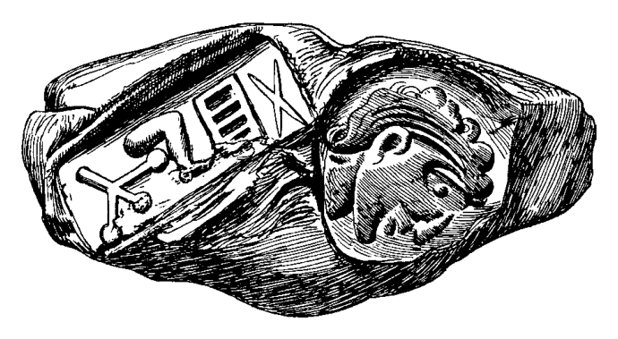
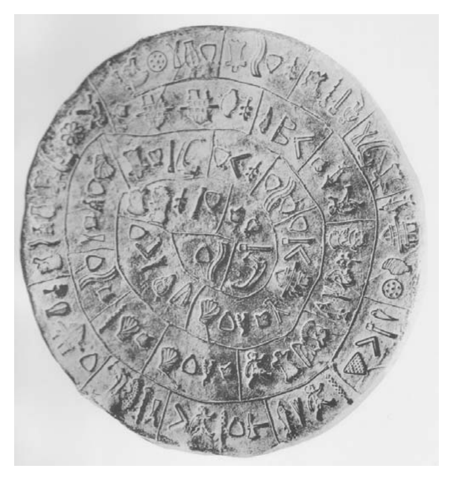
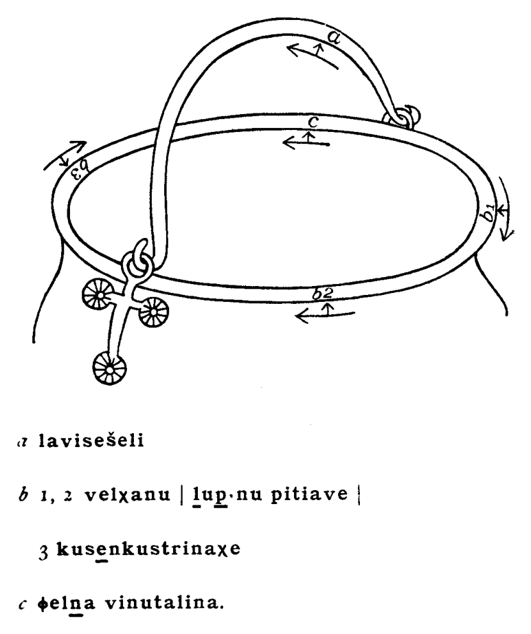

# Chapter 1: Language in ancient Europe: an introduction

<!-- pdf-page: 23 -->
chapter 1
Language in ancient
Europe: an introduction
roger d. woodard
The Sanscrit language, whatever be its antiquity, is of a wonderful structure; more perfect than the
Greek, more copious than the Latin, and more exquisitely refined than either, yet bearing to both of
them a stronger affinity, both in the roots of verbs and in the forms of grammar, than could possibly
have been produced by accident; so strong, indeed, that no philologer could examine them all three,
without believing them to have sprung from some common source, which, perhaps, no longer exists:
there is a similar reason, though not quite so forcible, for supposing that both the Gothik and the
Celtick, though blended with a very different idiom, had the same origin with the Sanscrit; and the
old Persian might be added to the same family.
Asiatick Researches 1:442–443
In recent years, these words of an English jurist, Sir William Jones, have been frequently
quoted (at times in truncated form) in works dealing with Indo-European linguistic origins.
And appropriately so. They are words of historic proportion, spoken in Calcutta, 2 February
1786, at a meeting of the Asiatick Society, an organization that Jones had founded soon
after his arrival in India in 1783 (on Jones, see, inter alia, Edgerton 1967). If Jones was
not the first scholar to recognize the genetic relatedness of languages (see, inter alia, the
discussion in Mallory 1989:9–11) and if history has treated Jones with greater kindness than
other pioneers of comparative linguistic investigation, the foundational remarks were his
that produced sufficient awareness, garnered sufficient attention – sustained or recollected –
to mark an identifiable beginning of the study of comparative linguistics and the study of
that great language family of which Sanskrit, Greek, Latin, Gothic, Celtic, and Old Persian
are members – and are but a few of its members.
All of the chapters that follow are devoted to languages belonging to the Indo-European
language family – with one exception: Etruscan. This is not by editorial design, but by
historical accident. Many of these are languages whose speakers clustered at points along the
northern rim of the central Mediterranean basin. Over half are languages spoken wholly or
partially within the space of the Italian Peninsula.
There were languages spoken in Europe prior to the expansion of the Indo-European
peoples across the European continent – an event that unfolded over a period of millennia,
likely having its inception in about the middle of the fifth millennium BC. For the most
part, evidence of those “Old European” languages survives only as shadows cast across the
grammars and lexica of the Indo-European languages: they were simply spoken too early in
Europe’s history to have had the opportunity to achieve a written form that would survive
in the historical record.
The earliest documented Indo-European languages of Europe were those that had the
good fortune to be spoken in a time after the advent of writing systems suitable for their
recording and in places in which those writing systems were created – or to which their

<!-- pdf-page: 24 -->

use expanded – and to be written on materials that escaped decay within the natural en-
vironment in which they were produced and deposited. For most – though not all – of
the Indo-European languages of Europe, a single writing system provided the key – di-
rectly or indirectly, immediately or through some evolutionary chain – to epigraphic sur-
vival. That writing system was not, however, the “Indo-Europeans’ gift to Europe.” It was,
on the contrary, the adaptation by one particular Indo-European people of a pre-existing
writing system of southwest Asia, whose roots can be traced now with some certainty to
Egypt (see the Introduction to the companion volume entitled The Ancient Languages of
Syria-Palestine and Arabia). That writing system was, of course, the Greek alphabet (see
Ch. 2, §2).
And what of the residue – i.e. those languages of ancient Europe that have been preserved
using something other than alphabetic writing? The Greeks – the very designers of the
“alphabet” – had prior to the time of its creation, during the Mycenaean era, recorded their
language on clay tablets using the syllabic script that Sir Arthur Evans, the distinguished
British archeologist (1851–1941), dubbed Linear B; and among the Greeks of Cyprus, a
related script – the Cypriot syllabary – remained in use long after the creation of the alphabet.
Aside from these varieties of Greek, the languages of Europe that were written with a non-
alphabetic script are at the present time poorly understood – if at all. The inverse corollary
holds only in part, for some of the ancient languages of Europe, though indeed written
in a script based upon the Greek alphabet – sometimes only slightly modified – remain
undeciphered.
The Linear B syllabary of the Mycenaean Greeks was almost certainly based on the Cretan
script that Evans called Linear A (see more on this below) – a still undeciphered writing
system. In fact, three different undeciphered scripts have survived in the remains of the
pre-Greek, Minoan civilization (as also named by Evans) of ancient Crete. The oldest of
these is called Cretan Hieroglyphic or Cretan Pictographic (see Fig. 1.1) and its use is dated
to the period 2000–1600 BC, seal stones providing the bulk of examples. The pictographic
symbols making up the script probably have a syllabic value.
The second of the undeciphered Cretan scripts is known from only a single document,
the Phaistos Disk (dated to about 1700 BC; see Fig. 1.2). The disk has been the object of
repeated attempts at decipherment since its discovery in the early twentieth century. While
success has often been claimed, none of the proposed decipherments carries conviction.
Linear A, the third of the Minoan scripts, is the best represented of the three. Dating
from about the mid nineteenth to mid fifteenth centuries BC, Linear A documents partially
overlap chronologically with those written in Cretan Hieroglyphic, though in terms of
historical development, the former may trace its origins to the latter. Linear A, in turn,

<!-- pdf-page: 25 -->

appears to be the source of the Mycenaean Greek script, Linear B (see Ch. 3, §§1.1; 1.2; 2.1),
though a simple direct linear descent is not probable. Of the three Minoan scripts, Linear
A holds the greatest hope for decipherment. Recent work by Brown (1990) and Finkelberg
(1990–1991) has taken up a notion proposed by Palmer in the middle of the twentieth
century (e.g., Palmer 1968) which would identify the Linear A language as a member of
the Anatolian subfamily of Indo-European. On the Cretan scripts see, inter alia, Chadwick
1990; Palaima 1988; Woodard 1997.
Mention should also be made of the undeciphered language called Eteo-Cretan. Much
later than the three Bronze Age Minoan scripts, Eteo-Cretan is preserved in inscriptions
written in the Greek alphabet. On Eteo-Cretan, see Duhoux 1982.
Prior to the emergence of Greek writing on Cyprus, attested by about the middle of
the eleventh century BC (and the somewhat later appearance of Phoenician; see WAL
Ch. 11, §1.2; Ch. 2, §2), the island was inhabited by a people, or by groups of people, who
were recording their speech in the undeciphered set of scripts called Cypro-Minoan (see
Table 1.1). As the name suggests, these Cypriot writing systems appear to have their origin
in a writing system of Minoan Crete, Linear A being the likely candidate. Archaic Cypro-
Minoan is the name given to the script found on only a single inscription, dated to about
1500 BC. This script has been analyzed as the likely ancestor of the more widely attested
Cypro-Minoan1,foundinusebetweenapproximatelythelatesixteenthandtwelfthcenturies
BC. A distinct script, Cypro-Minoan 2, has been found on thirteenth-century documents
from the site of Enkomi. Yet a third, Cypro-Minoan 3, dating also to the thirteenth century
BC, has turned up not on Cyprus but in the remains of the ancient Syrian city of Ugarit (see
WAL Ch. 9, §1; on the Cypro-Minoan scripts, see especially E. Masson 1974, 1977; Palaima
1989). Cypro-Minoan remains undeciphered.

<!-- pdf-page: 26 -->
Table 1.1
A partial inventory of Cypro-Minoan characters
À
¿
õ
¤
Ö
ô
ƒ
á
Δ
≈
Ü
ú
°
ÿ
ò
Å
∫
≠
É
¡
±
∏
ü
⁄
æ
™
«
à
ù
Õ
‹
Ñ
Æ
•
»
¨
”
∞
…
ª
Œ
Ä
´
Ω
§
ö
Ç
Cypro-Minoan 1 appears to have provided the graphic model for the Greek syllabary of
Cyprus (see Ch. 3, §2.2). This Greek syllabic script was in turn not only used for writing
Greek but also adopted for some other language of Cyprus, as yet undeciphered, dubbed
Eteo-Cypriot. The Eteo-Cypriot inscriptions are commonly regarded as the documentary
remains of an indigenous people of Cyprus who had withstood assimilation to the commu-
nities of Greek and Phoenician settlers. After Greek and Phoenician settlement of Cyprus,
Eteo-Cypriots appear to have concentrated particularly in the area of Amathus (on the
Eteo-Cypriot inscriptions, see O. Masson 1983:85–87).
From Portugal and Spain come ancient inscriptions recorded in those scripts called
Iberian, broadly divided into two groups, Northeast and South Iberian. The latter group
includes the variety of the script called Turdetan, after the ancient Turdetanians, of whom the
Greek geographer Strabo wrote: “These are counted the wisest people among the Iberians;
they write with an alphabet and possess prose works and poetry of ancient heritage, and laws
composed in meter, six thousand years old, so they say” (Geography 3.1.6). One form of the
Northeast Iberian writing system was adopted by speakers of Celtic for recording their own
language (Hispano-Celtic or Celtiberian; see Ch. 8, especially §2.1), and these Celtic docu-
ments are interpretable (for the language, see Ch. 8, especially §§3.1; 3.4; 4.2.1.1; 4.3.6; 5.1).
However, the Iberian scripts were used principally for a language or languages which are
not understood, in spite of the fact that there also occur Iberian-language (Old Hispanic)
inscriptions written with the Greek and Roman alphabets, and even bilingual texts. On the
Iberian scripts and language(s) see, inter alia, Untermann 1975, 1980, 1990, 1997; Swiggers
1996; Diringer 1968:193–195.
While the South Picene language of eastern coastal Italy appears to be demonstrably
Indo-European (belonging to the Sabellian branch of Italic; see Ch. 5), the genetic affiliation
of its meagerly attested northern neighbor, North Picene, remains uncertain (though the
two were formerly lumped together under the name East Italic or Old Sabellian). Though
completely readable (being written in an Etruscan-based alphabet), North Picene remains
largely impenetrable, in spite of the fact that a Latin – North Picene bilingual exists (a
brief inscription, the identity of the non-Latin portion of which has been disputed). For an
examinationtowardatentativetranslationofthelongNorthPiceneinscription,theNovilara
Stele, see Poultney 1979 (providing a summary of earlier attempts at interpretation).
The documentation of Insular Celtic – the Celtic languages of Ireland and Britain – (as
opposed to Continental Celtic; see Ch. 8) which has survived from antiquity is very meager
indeed, and is limited to Irish. The script used in recording this early Irish is the unusual
alphabetic system called Ogham (see Table 1.2); most of its characters consist of slashing

<!-- pdf-page: 27 -->
Table 1.2
Irish Ogham (Craobh-Ruadh); font courtesy of Michael Everson
Symbol
Transcription
Name
Symbol
Transcription
Name
l
b
beithe
q
h
´uath
m
l
luis
r
d
dair
n
f
fern
s
t
tinne
o
s
sail
t
c
coll
p
n
nin
u
q
ceirt
v
m
muin
{
a
ailm
w
g
gort
|
o
onn
x
ng
g´etal
}
u
´ur
y
z
straif
~
e
edad
z
r
ruis

i
idad
[unclear-glyph:U+0080]
ea
´ebad
[unclear-glyph:U+0081]
oi
´or
[unclear-glyph:U+0083]
ia
iph´ın
[unclear-glyph:U+0082]
ui
uilen
[unclear-glyph:U+0084]
ae
emancholl
lines, longer and shorter (notches being used at times for vowel characters), giving the
impression that it was originally designed to be “written” by means of an ax or some similar
sharp instrument, with wood serving as a medium. The Ogham inscriptions, which date as
early as the fourth century AD (and perhaps as early as the second century), can be read
(owing to our knowledge of later Irish) but consist largely of personal names and provide
little data on which can be constructed a linguistic description of Ogham Irish. For such
descriptions of Insular Celtic, the linguist must await the appearance of Old Irish and Old
Welsh manuscripts in about the eighth century AD (and hence Ogham Irish is not treated
in the present volume).
There is, however, a second ancient language of Britain which is written with a variety of
Ogham, the language of Pictish. The Picts, who receive their name from Latin Picti “painted
ones”(presumablyreferringtothepracticeoftattooing,thoughotheretymologieshavebeen
proposed), inhabited portions of modern Scotland, along with the Scots, a Celtic people of
Irish origin. A much broader, earlier distribution of the Picts has also been claimed. The
Picts are known for their production of stone monuments on which are engraved intriguing
images of animals and other designs, at times accompanied by Ogham inscriptions. The
language of the Pictish Ogham inscriptions is not understood; it is not Celtic and probably
not Indo-European. On the Pictish language, see Jackson 1980; for Ogham generally, see
McMannus 1991.
In addition to the above enumerated poorly understood ancient languages of Europe
(non-Greek Cretan and Cypriot languages, Iberian, North Picene, and Pictish), several other
European languages are attested that are somewhat better known, though too meagerly so, it
was judged, to be assigned individual chapters in this volume of grammatical descriptions.
Brief discussion of these – many of which were spoken in or near Italy – now follows.
1.
SICEL
From Sicily come several inscriptions written in a language which appears to be Indo-
European; a number of glosses are claimed as well (see Conway, Whatmough, and Johnson

<!-- pdf-page: 28 -->
1933 II:449–458; on Sicel generally, see Pulgram 1978:71–73 with references). The name
assigned to the language, Sicel or Siculan, is that given by Greek colonists to the native
peoples of Sicily whom they there encountered in the eighth century BC. Little is known
about the ethnicity of these Siceli. The form esti occurs in Sicel, seemingly the archetypal
Indo-European “(s)he is.” Interpretations of other inscriptional forms show considerable
variation. Tradition held that the Siceli had migrated to Sicily from the Italian peninsula:
thus, Varro (On the Latin Language 5.101) writes that they came from Rome; Diodorus
Siculus (Library of History 5.6.3–4) records that the Siceli had come from Italy and settled
in the region of Sicily formerly occupied by a people called the Sicani. On the basis of the
available linguistic evidence, however, Sicel cannot be demonstrated to be a member of the
Italic subfamily of Indo-European (see Ch. 4, §1).
On the inscriptional fragments from western Sicily identified as Elymian, see Cowgill and
Mayrhofer 1986:58 with references.
2.
RAETIC AND LEMNIAN
From the eastern Alps, homeland of the tribes called Raeti by the Romans, come a very few
inscriptions in a language which has been claimed to bear certain Indo-European charac-
teristics. For example, from an inscription carved on a bronze pot (the Caslir Situla; see
Fig. 1.3) comes the Raetic form -talina which has been compared to Latin tollo “I raise”

<!-- pdf-page: 29 -->
(see Pulgram 1978:40 with additional references). However, similarities to Etruscan have
also been identified and the two are perhaps to be placed in a single language family, along
with a language attested on the island of Lemnos in the north of the Aegean Sea. Lemnian
is known principally from a single inscribed stele bearing the engraved image of a warrior,
dated to the sixth century BC. On these connections, see Chapter 7, §1.
Of the Raeti, the Roman historian Livy (History 5.33.11) writes, following upon his
discussion of the Etruscans: “Undoubtedly the Alpine tribes also have the same origin,
particularly the Raeti, who have been made wild by the very place where they live, preserving
nothing of their ancient ways except their language – and not even it without corruptions.”
3.
LIGURIAN
The Ligurians were an ancient people of northwestern Italy. Writing in the second century
BC, the Greek historian Polybius (Histories 2.16.1–2) situates the Ligurians on the slopes
of the Apennines, extending from the Alpine junction above Marseilles around to Pisa on
the seaward slopes and to Arezzo on the inland side. Another Greek, Diodorus Siculus
(Library of History 5.39.1–8), writes of the Ligurians eking out a life of hardship in their
heavily forested, rock-strewn, snow-covered homeland and of the extraordinary stamina
and strength which this lifestyle engendered in both men and women.
The Ligurian language appears to be attested in certain place names and glosses, some
of which have been assigned Indo-European etymologies. For example, Pliny the Elder, a
Roman author of the first century AD, in describing the grain called secale in Latin, noted
that its Ligurian name (the name among the Taurini) is asia (Natural History 18.141). If
the Ligurian form was once sasia (see Conway, Whatmough, and Johnson 1933 II:158),
then, it has been proposed, the word may find relatives in Celtic – Welsh haidd and
Breton heiz “barley.” The location of its speakers, abutting Celtic areas (and Strabo writes
of Celtoligurians; Geography 4.6.3), might itself be taken to suggest an affiliation with
the Indo-European family, but such a relationship cannot be confirmed by the available
linguistic evidence.
4.
ILLYRIAN
The historical peoples called Illyrian occupied a broad area of the northwest Balkans.
Evidence for an Indo-European intrusion into the region can be identified by the late third
millennium BC; an identifiable “Illyrian” culture appears only in the Iron Age (see, inter
alia, Wilkes 1992:28–66). By the first century AD, the Greek geographer Strabo, in de-
scribing that part of Europe south of the Ister (the Danube), can identify as Illyrian those
people inhabiting the region bounded on the east by the meandering Ister, on the west by
the Adriatic Sea, and lying above ancient Epirus (Geography 7.5.1). For the Romans, the
province of Illyricum denotes a rather larger administrative area. The term “Illyrian” can,
however, be used by classical authors to designate a variety of peoples in and beyond the
Balkans (see the discussion in Katiˇci´c 1976:156–163).
Within the northwestern Balkan region itself there was considerable cultural diversity,
with not only the so-called Illyrian tribes being present, but Celts as well, by at least the third
century BC. Strabo writes of the Iapodes dwelling near Mount Ocra (close to the border of
modern Slovenia and Croatia) whom he calls a mixed Celtic and Illyrian tribe (Geography
4.6.10) and who, he adds, use Celtic armor but are tattooed like the Illyrians and Thracians

<!-- pdf-page: 30 -->
(Geography 7.5.4; on the Thracians see below). In his account of the wars which various
Illyrian tribes waged against one another and against the Romans, the Greek historian and
Romancitizen,AppianofAlexandria,writinginthesecondcenturyAD,preservesatradition
in which one hears echoes of such Balkan ethnic diversity. Appian (Roman History 10.2)
records that the Illyrians received their name from Illyrius, a son of Polyphemus (the cyclops
of Homer’s Odyssey) and the nymph Galatea, and that Illyrius has two brothers, Celtus and
Galas, namesakes of the Celts and the Galatae (the latter commonly being synonymous with
“Celt” and perhaps used here to invoke descent from Galatea).
The Illyrian language presents an unusual case. While the Illyrians are a well-documented
people of antiquity, not a single verifiable inscription has survived written in the Illyrian
language (on two proposed Illyrian inscriptions, one demonstrably Byzantine Greek, see
Katiˇci´c 1976:169–170). Even so, much linguistic attention (perhaps a disproportionately
large amount) has been paid to the language of the Illyrians. Chiefly on the basis of Illyrian
place and personal names, the language is commonly identified as Indo-European. To pro-
vide but two examples, the frequently attested name Vescleves has been etymologized as a
reflex of Proto-Indo-European *wesu-ˆklewes (“good fame”), with Sanskrit Vasu´sravas being
drawn into the analysis; the place name Birziminium, interpreted as meaning “hillock,” has
been traced to the Proto-Indo-European root *bherˆgh-, source of, inter alia, Germanic forms
such as Old English beorg “hill” (see Katiˇci´c 1976:172–176 for discussion). This onomastic
evidence is supplemented by the survival of just a very few glosses of Illyrian words; for ex-
ample, the Illyrian word for “mist” is cited as rhinos ([unclear-glyph:U+0002][unclear-glyph:U+0003][unclear-glyph:U+0004][unclear-glyph:U+0005][unclear-glyph:U+0006]) in one of the scholia on Homer;
see Katiˇci´c 1976:170–171, who compares Albanian re, earlier ren, “cloud.” Extensive study of
Illyrian was undertaken by Hans Krahe in the middle decades of the twentieth century, who,
along with other scholars, argued for a broad distribution of Illyrian peoples considerably
beyond the Balkans (see, for example, Krahe 1940); though in his later work, Krahe curbed
his view of the extent of Illyrian settlement (see, for example, Krahe 1955). Radoslav Katiˇci´c
(1976:179–180) has argued, on the basis of a careful study of the onomastic evidence, that
the core onomastic area of Illyrian proper is to be located in the southeast of that Balkan
region traditionally associated with the Illyrians (centered in modern Albania).
The modern Albanian language, it has been conjectured, is descended directly from
ancient Illyrian. Albanian is not attested until the fifteenth century AD and in its historical
development has been influenced heavily by Latin, Greek, Turkish, and Slavic languages, so
much so that it was quite late in being identified as an Indo-European language. Its possible
affiliation with the scantily attested Illyrian, though not unreasonable on historical and
linguistic grounds, can be considered little more than conjecture barring the discovery of
additional Illyrian evidence.
5.
THRACIAN
At the northern end of the Aegean Sea, stretching upward to the Danube, lived in antiquity
people speaking the Indo-European language of Thracian. The ancestors of the Iron Age
Thracians had probably arrived in the Balkans as a part of the movement which brought
the forebears of the Illyrians. For the Greeks, Thrace was a place wild and uncultivated,
home to both savage Ares and Dionysus, god of wine who inspired frenzy and brutality in
his worshipers. Herodotus (Histories 5.3; 9.119) writes of the Thracian practices of
human sacrifice and widow immolation, and of the enormous population of the Thracians
(second only to the Indians) and their lack of political unity. Were they unified, surmises
the historian, they would be the most powerful people on the face of the earth.

<!-- pdf-page: 31 -->
Though the Thracian language is not well preserved, its attestation, unlike that of Illyrian,
is sufficient to place its membership in the Indo-European family practically beyond doubt.
A few short Thracian inscriptions survive (see Brixhe and Panayotou 1994a:185–188), but
more valuable are the numerous glosses (e.g., b´olinthos “European bison,” cf. Old Norse
boli “bull”; brˆutos “beer,” cf. Old English breowan “to brew”) coupled with the evidence of
place and personal names. For a summary of the evidence see Katiˇci´c 1976:138–142; Brixhe
and Panayotou 1994a:188–189; see also Cowgill and Mayrhofer 1986:54–55, with references.
OnomasticevidencemaysuggesttheoccurrenceofalanguageboundarywithintheThracian
area, demarcated by Mount Haemus. South of this boundary the language evidenced has
been distinguished as Thracian, while that to the north has been called Daco-Mysian.
According to Greek tradition, the Phrygians of Anatolia had migrated from the Balkans
(see Herodotus, Histories 7.73, who writes that the Phrygians were formerly called the
Briges and had been neighbors of the Macedonians; on the Macedonians see below), a view
with which modern scholarship is generally in agreement. The Phrygian language does
show certain similarities to Thracian, and some linguists have argued for linking the two
in a single linguistic unit (Thraco-Phrygian). The appropriateness of the subgrouping is,
however, uncertain; see WAL Chapter 31, §1.5.
6.
MACEDONIAN
North of the Greeks, bracketed by Illyrians and Thracians, lived the Macedonians. Much
uncertainty surrounds the linguistic status of the Macedonian peoples. Though, under the
patronage of Macedonian kings, Philip the Second and his son Alexander the Great, Greek
culture would be spread across the Mediterranean and Near Eastern world and the Greek
language would become a lingua franca (the Attic-based Koine dialect; see Ch. 2, §1) spoken
from Italy to India, it remains unclear if Greek was the native language of the Macedonians
(see Brixhe and Panayotou 1994b:206–207 for a synopsis of ideas about the identity of
Macedonian).
To be sure, the Greek orator Demosthenes, in the fourth century BC, can revile and
lambaste Philip as one of the barbaroi (“barbarians,” those who do not speak Greek, i.e.,
those who babble; Orations 3.17) and rehearse how in the old days the Macedonian king
had been rightly subject to the Greeks, as barbaroi should be (Orations 3.24). He can skewer
Philip with the charge that, not only is he not a Greek and unrelated to the Greeks, he is
not even a barbaros from some worthwhile place, but he is a plague out of Macedonia – a
place from which you cannot even acquire a good slave (Orations 9.31). A century earlier,
Herodotus had told the story of an ancestor of Philip, Alexander the First (a contempo-
rary of Herodotus), who had been allowed to compete in games at Olympia – though
barbaroi were excluded from the competition – because he was able to demonstrate satis-
factorily that he himself was descended from a Greek banished from Argos (Histories 5.22;
8.137–139).
Explicit references to “Macedonian speech” exist. Plutarch, the Greek savant of the first
and second centuries AD, when writing of Cleopatra (Life of Antony 27.3–4), the last of the
Ptolemies (the Macedonian kings of Egypt), lauds her linguistic abilities, reporting that she
could speak the languages of the Ethiopians, Troglodytes, Hebrews, Arabs, Syrians, Medes,
and Parthians. In contrast, her male predecessors had not even learned Egyptian and some
had even “ceased to speak Macedonian” ([unclear-glyph:U+0007][unclear-glyph:U+0008]
[unclear-glyph:U+000B][unclear-glyph:U+000C][unclear-glyph:U+0004]
[unclear-glyph:U+000E]
[unclear-glyph:U+0003][unclear-glyph:U+0004] [unclear-glyph:U+000F]	[unclear-glyph:U+0010][unclear-glyph:U+0003][unclear-glyph:U+0011][unclear-glyph:U+0005][unclear-glyph:U+0004][unclear-glyph:U+0012][unclear-glyph:U+0013][unclear-glyph:U+0004]). Presumably they had
continued to speak Greek (i.e., had not taken a vow of silence). Athenaeus, a Greek writer
of the later second century AD, in his account of a “Learned Banquet” (Deipnosophistae

<!-- pdf-page: 32 -->
3.121f–122a), places on the lips of one of the guests, the cynic Cynulcus, a Latin word decocta
(a kind of drink made by boiling and then rapidly cooling a liquid); in turn, Athenaeus has
another guest, Ulpian (an “Atticist,” promoting the use of untainted Attic Greek), rebuke
Cynulcus for uttering a barbarism (!). Cynulcus fires back, retorting that even in the best old
Greek one finds Persian loanwords and that he knows many Attic Greeks “using Macedonian
speech” ([unclear-glyph:U+0007][unclear-glyph:U+0008]
[unclear-glyph:U+000B][unclear-glyph:U+000C][unclear-glyph:U+0004]
[unclear-glyph:U+000E][unclear-glyph:U+000C][unclear-glyph:U+0004][unclear-glyph:U+0012][unclear-glyph:U+0008][unclear-glyph:U+0006]; a participle from Plutarch’s verb). Elsewhere, Plutarch uses an
adverbmakedonist´ı([unclear-glyph:U+0007][unclear-glyph:U+0008]
[unclear-glyph:U+000B][unclear-glyph:U+000C][unclear-glyph:U+0004][unclear-glyph:U+0003][unclear-glyph:U+0014][unclear-glyph:U+0012]
)havingthesamesense.Forexample,inhisLifeofAlexander
(51.4), Plutarch recounts how the Macedonian conqueror, in a fit of rage, refusing to be
quieted by his body guards, shouted out for the hypaspistai (Macedonian infantry troops,
one contingent of the army of Alexander), “calling in Macedonian – and this was a sign of a
great disturbance.” The precise sense of “speaking Macedonian” in these and other passages
can be and has been debated; yet when these references to Macedonian speech are considered
in their context, it is not difficult for one to conclude that what is being reported is the use
of a distinct, non-Greek (“barbarian”) Macedonian language.
In contrast, however, other classical authors explicitly identify the Macedonians as a Greek
people. Polybius, the Greek historian of the second century BC, for example, describes
Macedonians and Greeks as being homophylos ([unclear-glyph:U+0015][unclear-glyph:U+0007][unclear-glyph:U+0005][unclear-glyph:U+0016][unclear-glyph:U+0017][unclear-glyph:U+0010][unclear-glyph:U+000C][unclear-glyph:U+0006]), “of the same race” or “akin”
(Histories 9.37.7). For references to other, similar texts, see Katiˇci´c 1976:107–108.
AninterestingcaseisprovidedbyaninstanceinwhichMacedoniansidentifythemselvesas
GreeksandspeakersofGreek.TheRomanhistorianLivy(firstcenturiesBCandAD),writing
of events in the war waged by Philip the Fifth of Macedon and his Arcarnanian Greek allies
against Athens, with Rome as its own ally, records a meeting of the council of the Aetolian
Confederacy, at which representatives from Philip, from Athens and from Rome address the
council, each seeking Aetolian assistance in the war (200 BC). In his speech to the council,
the Macedonian ambassador refers to the Romans as “a foreign people set apart more by
language and customs and laws than by the space of sea and land” (31.29.12). In contrast,
“Aetolians, Acarnanians and Macedonians [are] people of the same language . . . [and] with
foreigners, with barbarians all Greeks are, and will be, at eternal war” (31.29.15). The dialect
oftheAetolianConfederacy,aleagueoftheAetoliansofnorthwestGreece,wastheNorthwest
Greek Koine, a “common” dialect used throughout regions controlled by the Confederacy
(see Ch. 3, §1.1.5). Is it this lingua franca to which Livy has his Macedonian diplomat self-
servingly refer? One could well imagine that it would be the Macedonian’s langue de choix
on such an occasion. The Acarnanians also inhabited northwest Greece, though Acarnanian
inscriptions from this period are written in the Doric Koine, only slightly different from the
Aetolian dialect.
Surviving Macedonian texts have not proved helpful in identifying the native language
of the Macedonians. Most of the Macedonian inscriptions are written in Attic Greek, the
dialect broadly disseminated by Philip and Alexander. A fourth-century BC inscription
found recently in the remains of the great Macedonian city of Pella appears to be written
in a variety of Northwest Greek and has led to conjectures that this may be the previously
unattested Macedonian language (see the comments of Brixhe and Panayotou 1994b:209
along with the mention of other finds in n.19).
The evidence provided by Macedonian glosses is conveniently summarized by Katiˇci´c
(1976:108–112), who analyzes these as belonging to three different classes. One class consists
of words that are quite close to known Greek lexemes, some, though probably not all, of
which appear likely to be loanwords directly from Greek: for example, komm´arai; compare
Greek k´ammaroi (	[unclear-glyph:U+0018][unclear-glyph:U+0007][unclear-glyph:U+0007][unclear-glyph:U+0008][unclear-glyph:U+0019][unclear-glyph:U+000C][unclear-glyph:U+0003]), a type of lobster (pl.). A second set is made up of Macedonian
wordswhichhavenoGreekcounterparts,suchasal´ı¯e “boar.” Thethirdgroupissimilartothe
firsttotheextentthatitconsistsofMacedonianwordsapparentlyhavingGreekcounterparts;

<!-- pdf-page: 33 -->
it differs from the first class, however, in that these Macedonian words are perhaps to be
analyzed as cognates of the Greek lexemes, rather than borrowings. In other words, by such
an analysis, the related Macedonian and Greek forms have evolved historically from words
occurring in a common parent language, either Proto-Indo-European or, alternatively, some
later, intermediate Balkan Indo-European language. Compare, for example, Macedonian
adˆ-e “sky” and Greek aith´-e[unclear-glyph:U+0002]r ([unclear-glyph:U+0008][unclear-glyph:U+001A][unclear-glyph:U+001B][unclear-glyph:U+001C][unclear-glyph:U+0019]); Macedonian kebal´a “head” (cf. gabal´a which the Greek
lexicographer Hesychius also glosses as “head,” without identifying the linguistic source of
the word) and Greek kephal´-e[unclear-glyph:U+0002] (
[unclear-glyph:U+0016][unclear-glyph:U+0008][unclear-glyph:U+0010][unclear-glyph:U+001C]). If such sets are rightly analyzed as cognates, the
Macedonian language departs conspicuously from Greek in showing voiced unaspirated
rather than voiceless aspirated reflexes of the earlier Indo-European voiced aspirated stops
(on the Greek development, see Ch. 2, §3.7.1).
7.
MESSAPIC
The Messapii were a people of southeast Italy, inhabiting ancient Calabria (the Sallentine
peninsula,the“heel”oftheItalian“boot”).Strabo,theGreekgeographer,records(Geography
6.3.1) that the Greeks give the name Messapia to that region, also called Iapygia, but adds
that the locals of the area make a distinction between the Salentini (in the south) and
the Calabri. Northward lies the country of the Peucetii and of the Daunuii (Apulia). For
Polybius (Histories 3.88.4), however, Iapygia is the region inhabited by the Daunuii, Peucetii,
and Messapii (though elsewhere he writes of “Iapyges and Messapii”; see Histories 2.24.11).
Messapic survives in a large number of inscriptions, recording chiefly proper names,
dating from about the sixth to the first century BC (the most abundantly attested ancient
language not to receive individual treatment in this volume), including many recent finds
from a grotto in Lecce (see Santoro 1983–1984). This language of ancient Italy is Indo-
European, but not Italic; that is, it is not a member of the subfamily to which belong Latin
and Sabellian (see Chs. 4 and 5). No close genetic affiliation with any other known Indo-
European language can be definitively demonstrated, though a close connection to Illyrian
hasbeenalleged.Indeed,theMessapicmaterialsprovidedamajorcomponentoftheevidence
adducedbyKraheandothersforthestudyof Illyrian.Theredoexistancienttraditionsabout
the settling of southeast Italy by Illyrian peoples. For example, Pliny (Natural History 3.102)
makes cursory reference to the story that the “Paediculi” of Apulia were descended from
nine young men and nine young women of Illyria. A linking of the two languages, Illyrian
and Messapic, must, however, remain a linguistically unverifiable hypothesis until such time
as Illyrian is better attested.
In the above discussion of Macedonian vis-`a-vis Greek, reference was made to cognates
and to historical evolution of attested languages from earlier, unattested, parent languages.
The realization that certain languages share an ancestry – that they are “sprung from some
common source, which, perhaps, no longer exists” – was the fundamental genius of William
Jones’ remarks made to the Asiatick Society that February day in Calcutta. Cognates –
individuallinguisticstructures(words,andstructuressmallerthanwords)havingacommon
origin in an ancestral language – are not, of course, limited to Sanskrit, Latin, Greek, Celtic,
andGothic–thelanguagesnamedbyJonesinthoselineswithwhichthisIntroductionbegan.
Save Sanskrit, all of these languages – Latin, Greek, Celtic, Gothic – are treated in this
volume (see Chs. 4, 2–3, 8, and 9, respectively), along with yet other languages belonging to
the same language family – languages sprung from the same common source – namely, Falis-
can (see Ch. 4), numerous Sabellian languages (the non-Latino-Faliscan Italic languages;

<!-- pdf-page: 34 -->
see Ch. 5), Venetic (see Ch. 6), and the language of the archaic runic inscriptions of north-
ern Europe (see Ch. 10). Other ancient Indo-European languages – not only Sanskrit, but
also Middle Indic, Hittite and other Anatolian languages, Old Persian, Avestan, Pahlavi,
Phrygian, and Armenian – will be found in companion volumes. On the basis of a care-
ful comparison of these, and still other Indo-European languages (first attested at a mo-
ment too recent in time for inclusion in these volumes), the parent language envisioned by
Jones – Proto-Indo-European – has been, and continues to be, reconstructed. At the end
of this volume, the reader will find an Appendix on Reconstructed Indo-European, setting
out a treatment of the phonology, morphology, and syntax of this deeply archaic language –
ancestor of all Indo-European languages. The remarkable method that allows such recon-
struction – the comparative method of historical linguistics – which took shape in the nine-
teenth and twentieth centuries in the wake of Jones’ observations, is described in the opening
section of that Appendix and is treated more broadly and in more detail in the Appendix
on “Reconstructed ancient languages” that appears at the end of the companion volume
entitled The Ancient Languages of Asia and the Americas.
