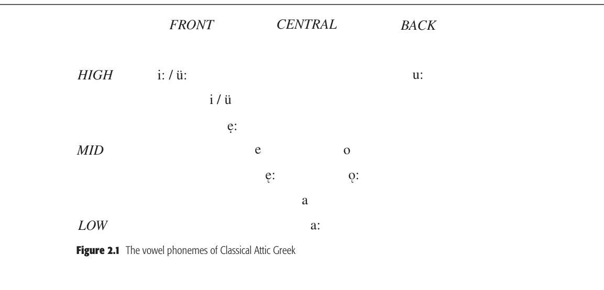

# Chapter 2: Attic Greek

<!-- pdf-page: 36 -->
chapter 2
Attic Greek
roger d. woodard
1.
HISTORICAL AND CULTURAL CONTEXTS
Though in this introductory section, and at certain other points as well, attention is given
to the ancient Greek language as a whole, the central topic of this chapter will be that dialect
called Attic, the spoken dialect of the region of Attica and the principal written dialect
of Classical Greek literature. The many other dialects of Greek attested in antiquity will
properly be the focus of Chapter 3.
Greek is a member of the Indo-European family of languages. It resides in that ma-
jor subdivision of the family called centum (see Appendix), though its closest linguistic
affinities are with the Indo-Iranian and Armenian languages, both members of the satem
subset. The arrival in the Balkan peninsula of those Indo-Europeans who would in time
be called the Greeks is most probably to be dated to c. 2100 or 1900 BC. One of the three
earliest attested Indo-European languages, Greek is first documented on clay tablets re-
covered from the ruins of various Mycenaean palaces found on the Greek mainland and
on the island of Crete, dating c. 1400–1200 BC; already during the Mycenaean period, the
language displays dialectal variation. Ancient Greek is phonologically and morphologi-
cally quite conservative and has been a cornerstone in the reconstruction of Proto-Indo-
European.
The history of the language has been traditionally divided into several chronological
phases. Subsequent to the Mycenaean period, the Greeks fell into a prolonged period of
illiteracy (though not in Cyprus, see Ch. 3). The language which reappears at the end of
this Dark Age is called Archaic Greek, represented principally by the writings of Homer
and Hesiod (eighth century BC). With the advent of the fifth-century BC Greek literati,
the language is labeled Classical. Though numerous dialects of Greek are attested during
the first millennium BC, in both literary and nonliterary sources (enumerated in Ch. 3), the
principal dialect of classical literature is Attic. With the expansion of Hellenic culture under
Philip of Macedon in the middle of the fourth century BC, the Attic dialect begins to
spread geographically, developing into a Hellenistic Koine. This Hellenistic period of Greek
continues until the fourth century AD. The final phase of Greek in antiquity is that of the
Byzantine era, stretching from the fourth to the fourteenth century AD. All of the dialects
of Modern Greek are descendants of Attic, aside from the dialect of Tsaconian, which traces
its ancestry to the ancient Laconian dialect.

<!-- pdf-page: 37 -->
2.
WRITING SYSTEMS
The earliest preserved Greek writing systems are syllabic scripts, the Linear B syllabary of the
Mycenaeans and the distinct, though clearly related, Cypriot syllabary. Both are discussed
in Chapter 3, §§2.1–2.2.
The third of the ancient Greek writing systems and the longest employed is the Greek al-
phabet. As in the case of the two syallabic scripts which preceded it, the alphabet was founded
upon a writing system that the Greeks acquired from a non-Greek people, in this instance
the Phoenicians. In typical Canaanite fashion, the segmental writing system of the Phoeni-
cians was consonantal, containing no distinct vowel characters. As the Greek adapters of this
Semitic script had no phonetic need for several of the Phoenician consonantal characters
(representing consonants not occurring in the Greek language), the Greeks assigned vowel
values to these characters, thus creating the first fully alphabetic writing system (i.e., a seg-
mental system containing both distinct consonant and vowel graphemes; see Table 2.1). For
example, to the Phoenician character ’aleph, representing a glottal stop, the Greeks assigned
the value of a (alpha); and to the Phoenician symbol for a voiced pharyngeal fricative, ‘ayin,
the Greeks gave the value of o (omicron). To the end of the Phoenician script (terminating
in taw (t)), additional characters were appended (not all at the same time) – symbols for
vowels and for consonants, the latter showing some variation in value among the many local
alphabets which arose in the Greek world. The Greek acquisition of the Phoenician script is
most probably to be placed in Cyprus, likely in the ninth century BC, in the author’s view,
though numerous other ideas have been offered.
The numerous local or epichoric alphabets which developed as use of the script spread
across the Greek-speaking world can be divided into certain fundamental alphabet-types.
This classification is based chiefly, though not solely, on the presence and variety of the
so-called “supplemental,” non-Phoenician consonantal characters. The alphabet of Athens
and the surrounding region of Attica had belonged to the category of “light blue” alphabets
(the color terms which are commonly applied to ancient Greek alphabets have their origin
Table 2.1
The Greek alphabet
Character
Phonetic value
Character
Phonetic value
A, [unclear-glyph:U+0002]
a(:)
[unclear-glyph:U+0002], [unclear-glyph:U+0003]
k + s
B, [unclear-glyph:U+0004]
b
[unclear-glyph:U+0005], [unclear-glyph:U+0006]
o
[unclear-glyph:U+0007], [unclear-glyph:U+0008]
g
[unclear-glyph:U+0003],
p

,
d
:
s
E,
e
y
k
w
P,
r
Z, [unclear-glyph:U+000E]
z + d
[unclear-glyph:U+0004], [unclear-glyph:U+000F]
s
H, [unclear-glyph:U+0010]
[unclear-glyph:U+0011]e:
T, [unclear-glyph:U+0012]
t
Q, θ
th
ϒ, [unclear-glyph:U+0013]
¨u(:)
I, [unclear-glyph:U+0014]
i(:)
[unclear-glyph:U+0006], [unclear-glyph:U+0015]
ph
K, [unclear-glyph:U+0016]
k
X, [unclear-glyph:U+0017]
kh
[unclear-glyph:U+0018], [unclear-glyph:U+0019]
l
[unclear-glyph:U+0007], [unclear-glyph:U+001A]
p + s
M, [unclear-glyph:U+001B]
m
[unclear-glyph:U+0008],
[unclear-glyph:U+001D]o:
N,
n

<!-- pdf-page: 38 -->
in Kirchhoff 1887; see Ch. 3, §2). In 403–402 BC, however, Athens officially adopted the
east Ionian alphabet (a “dark blue” script); and it is this form of the alphabetic Greek script
which is most familiar to modern readers of Greek (see Table 2.1).
3.
PHONOLOGY
3.1 Consonants
The phonemic inventory of Attic Greek consonants is presented in Table 2.2.
As illustrated, Attic possesses a symmetrical system of nine oral stops: three manners
of stops (voiceless unaspirated, voiceless aspirated, and voiced) produced at three distinct
points of articulation (bilabial, dental, and velar; labiovelar stops /kw/, /kwh/, and /gw/ are
attested in the second millennium BC dialect of Mycenaean Greek, on which see Ch. 3).
Filling out the set of obstruents are two voiceless fricatives – the dental /s/ and the glottal
/h/. The Classical Attic sonorant system consists of two nasals, bilabial /m/ and dental /n/
(on velar [ŋ] see below), and two dental liquids, /l/ and /r/. A labiovelar glide /w/ had existed
at an earlier phase of Attic and has limited attestation in Attic’s sister dialect of Ionic (and
various other dialects; see Ch. 3).
In addition to the bilabial and dental nasal phonemes /m/ and /n/, Attic also possessed
a velar nasal [ŋ]. Velar [ŋ] is a positional variant which occurs in two contexts: the dental
/n/ becomes [ŋ] when it precedes a velar stop (i.e., /n/ →[ŋ] / —- {/k/, /g/, /kh/}); and the
velar stop /g/ becomes [ŋ] when it occurs before the bilabial nasal [m] (i.e., /g/ →[ŋ] / —-
/m/) and perhaps before the dental /n/ as well. There is no distinct alphabetic symbol for
the velar nasal; instead the sound is represented by the letter gamma (i.e., [unclear-glyph:U+0008][unclear-glyph:U+0016], [unclear-glyph:U+0008][unclear-glyph:U+0008], [unclear-glyph:U+0008][unclear-glyph:U+0017], [unclear-glyph:U+0008][unclear-glyph:U+001B]).
Agma is reported by Latin grammarians to be the name which the Greeks gave to gamma
when used to spell [ŋ] (see Allen 1987:33–37).
In early Attic inscriptions, the alphabetic symbol qoppa (y) was used to represent a /k/
which occurred next to a back vowel. Such spelling clearly suggests a backed allophone of
the velar stop in this position.
3.2 Vowels

arrangement.
Table 2.2
The consonantal phonemes of Classical Attic Greek
Place of articulation
Manner of articulation
Bilabial
Dental
Velar
Glottal
Stops
Voiceless unaspirated
p
t
k
Voiceless aspirated
ph
th
kh
Voiced
b
d
g
Fricatives
s
h
Nasals
m
n
Liquids
Lateral
l
Nonlateral
r

<!-- pdf-page: 39 -->
HIGH
FRONT
CENTRAL
MID
LOW
BACK
u:
o
o:
a
a:
e:
e
e:
i / ü
i: / ü:
.

As can be seen, the vowel system of Classical Attic is markedly asymmetric, with front
vowels outnumbering back vowels by more than two to one. Four high-front vowels occur,
/i/ ([unclear-glyph:U+0014]), /i:/ ([unclear-glyph:U+0014]), /¨u/ ([unclear-glyph:U+0013]), /¨u:/ ([unclear-glyph:U+0013]), distinguished by vowel length and presence or absence of lip
rounding. In the mid-front region there are three vowels: long tense /e.:/ ([unclear-glyph:U+000C][unclear-glyph:U+0014]), long lax / [unclear-glyph:U+001F]e:/
([unclear-glyph:U+0010]) and short /e/ ([unclear-glyph:U+000C]). Two vowels are produced in the low-central region: long /a:/ ([unclear-glyph:U+0002]) and
short /a/ ([unclear-glyph:U+0002]). At the back of the mouth, only three vowels are articulated: long lax mid-back
/ [unclear-glyph:U+001D]o:/ ([unclear-glyph:U+001C]), short mid-back /o/ ([unclear-glyph:U+0006]), and long high-back /u:/ ([unclear-glyph:U+0006][unclear-glyph:U+0013]). As indicated, long and short
vowels are distinguished orthographically only in the case of the mid vowels.
In addition to the monophthongs of Figure 2.1, Classical Attic is characterized by eleven
diphthongs:
(1)
“Short” diphthongs
/ai/ ([unclear-glyph:U+0002][unclear-glyph:U+0014])
/au/ ([unclear-glyph:U+0002][unclear-glyph:U+0013])
/eu/ ([unclear-glyph:U+000C][unclear-glyph:U+0013])
/oi/ ([unclear-glyph:U+0006][unclear-glyph:U+0014])
/¨ui/ ([unclear-glyph:U+0013][unclear-glyph:U+0014])
“Long” diphthongs
/a:i/ (¯[unclear-glyph:U+0002][unclear-glyph:U+0014] or [unclear-glyph:U+0002]!)
/a:u/ (¯[unclear-glyph:U+0002][unclear-glyph:U+0013])
/ [unclear-glyph:U+001F]e:i/ ([unclear-glyph:U+0010][unclear-glyph:U+0014] or [unclear-glyph:U+0010][unclear-glyph:U+001D])
/ [unclear-glyph:U+001F]e:u/ ([unclear-glyph:U+0010][unclear-glyph:U+0013])
/ [unclear-glyph:U+001D]o:i/ ([unclear-glyph:U+001C][unclear-glyph:U+0014] or [unclear-glyph:U+001C][unclear-glyph:U+0011])
/ [unclear-glyph:U+001D]o:u/ ([unclear-glyph:U+001C][unclear-glyph:U+0013])
At an earlier time in the history of the Attic dialect (perhaps still in the early period of
Classical Attic), the vowel sounds written [unclear-glyph:U+000C][unclear-glyph:U+0014] and [unclear-glyph:U+0006][unclear-glyph:U+0013] had also been diphthongs, /ei/ and
/ou/ respectively. However, by the fourth century BC, [unclear-glyph:U+000C][unclear-glyph:U+0014] had come to be regularly used
to spell both the reflex of the inherited diphthong */ei/ and that of the long vowel */e.:/ (a
long vowel which was the product of contraction and compensatory lengthening processes).
Likewise, [unclear-glyph:U+0006][unclear-glyph:U+0013] was utilized to represent both that sound which descended from the earlier
diphthong */ou/ and that one which continued the long monophthong */o.:/ (likewise the
outcome of contraction and compensatory lengthening). The orthographic merger of the
two vowel sounds in each instance reveals a prior phonological merger: either the inherited
diphthongs (*/ei/ and */ou/) had become monophthongs or the earlier long monophthongs
(*/e.:/ and */o.:/) had undergone diphthongization. Throughout the history of the Greek
language, monophthongization is attested recurringly, leaving little doubt that */ei/ and
*/ou/ became /e.:/ and /o.:/ respectively, and not vice versa. This monophthongization had

<!-- pdf-page: 40 -->
probably occurred by the fifth century BC. Hence Classical Attic [unclear-glyph:U+000C][unclear-glyph:U+0014] and [unclear-glyph:U+0006][unclear-glyph:U+0013] are digraphic
spellings of monophthongs; one often encounters the term “spurious diphthong” for these
digraphs.
AsecondfundamentaldiachroniccharacteristicofGreekvocalicphonologyisthefronting
and raising of vowels, particularly long vowels, along the periphery of the vowel space. The
mid-back vowel */o.:/ (which had arisen by contraction, compensatory lengthening and
monophthongization as discussed above) was raised to become high-back /u:/ (probably
by the fourth century BC). This raising process appears to have followed upon an earlier
frontingofinherited */u/and */u:/to/¨u/and/¨u:/respectively(perhapsinthesixthcenturyBC
or earlier). Fronting and raising of the low-central vowel /a:/ perhaps produced an allophone
*[æ:] which occurred in all contexts except after a preceding /e/, /i/, /i:/, or /r/ and which
would subsequently be further raised to merge with / [unclear-glyph:U+001F]e:/ (though it has also been argued that
the raising affected all instances of /a:/ and a subsequent back-change of */æ:/ to /a:/ took
place after /e/, /i/, /i:/, or /r/).
3.3 Phonotaxis
Attic Greek permits consonants to cluster freely. Word-initially, a variety of biconsonantal
clusters occurs ([s + stop]; [s + nasal]; [stop + stop]; [stop + s]; [stop + nasal]; [stop +
liquid]; [nasal + nasal]; and at an earlier phase [glide + liquid]) as well as two triconsonantal
sequences ([s + stop + liquid]; [s + stop + nasal]). Word-internally, the juxtaposition of
syllable-final and syllable-initial consonant clusters generates yet additional permutations
of consonants (though many earlier word-internal clusters had been simplified prior to
the fifth century). In word-final position the set of possible consonant sequences is more
limited: [l + s]; [(m +) p + s]; [({ŋ, r} +) k + s]. This phonotactic restriction on possible
word-final clusters reflects that one which allows only three single word-final consonants in
Greek – [r], [n], and [s] (except in the case of clitics).
3.4 Syllable structure
ItisgenerallythecasethatinAtticasinotherGreekdialects,word-internalconsonantclusters
are heterosyllabic. In the case of biconsonantal clusters, a syllable boundary simply falls
between the two consonants, regardless of the consonants involved. If the cluster consists of
threeormoreconsonants,theboundaryfallswithinthecluster,withitspreciselocationbeing
primarily a function of the relative sonority of the particular consonants which form the
cluster.ClassicalAttic,however,providesanotableexceptiontotheforegoinggeneralization,
showing a certain propensity for open syllables followed by a complex onset in the following
syllable. This behavior is observed in the case of a subset of [stop + liquid] and [stop +
nasal] clusters (clusters traditionally designated muta cum liquida); thus, metrical patterns
of Classical Attic verse reveal that at times words such as [k ′¨upris] ("#	
[unclear-glyph:U+0014]$ “Cyprus”) and
[t´ekmar] ([unclear-glyph:U+0012]%[unclear-glyph:U+0016][unclear-glyph:U+001B][unclear-glyph:U+0002]
 “token”) are syllabified [k ′¨u|pris] and [t´e | kmar].
3.5 Vowel length
As indicated in Figure 2.1, vowel length is phonemic in ancient Greek. Since the time of
Gottfried Hermann, Greek vowel duration has been described in terms of morae: a short
vowel is said to consist of a single mora; a long vowel or diphthong of two morae. In antiquity
vowel duration was defined in terms of an essentially identical unit, the khron´os prˆo [unclear-glyph:U+001D]:tos
([unclear-glyph:U+0017]
[unclear-glyph:U+0006][unclear-glyph:U+001E]&$ 	
'[unclear-glyph:U+0012][unclear-glyph:U+0006]$ “primary measure”; see Allen 1987:99–100). By the preceding criteria,

<!-- pdf-page: 41 -->
one might anticipate the so-called long diphthongs to consist of three morae; however, for
purposes of accent placement, a phenomenon dependent upon the moric structure of a
syllable, long diphthongs are treated like other diphthongs and long vowels, in other words
as if they were bimoric. Long diphthongs, both those inherited from Proto-Indo-European
and those which developed secondarily by contraction, were eliminated over time through
shortening of the first vowel of the diphthong or through loss of the second. By the first
century BC the spoken Greek language probably no longer possessed such sounds; though
in some instances they continued as a part of Greek orthography into the Byzantine period
(and hence remain part of the traditional orthography of ancient Greek), represented by the
iota-subscript (herein transcribed by an i within parens).
3.6 Accent
Ancient Greek, like its Proto-Indo-European ancestor, was characterized by a pitch or tonal
accent. In the traditional orthography of Attic, three different accentual markings are used:
acute (´); grave (`) and circumflex (ˆ). The acute and grave diacritics are allographic variants
marking high pitch and occurring in complementary distribution: the grave is used on final
syllables, unless the accented word occurs at sentence end or is followed by an enclitic, or
the accented word is an interrogative; in these exceptional contexts and elsewhere the acute
is used. High pitch marked by the acute/grave accent can occur on syllables containing one
mora (those with a short vowel) and on syllables of two morae (those with a long vowel
or diphthong). In the latter case, high pitch occurs on the rightmost mora of the syllable
(i.e., . . . |m ´m|[unclear-glyph:U+0004] . . . ). In contrast, the circumflex can only occur on syllables containing two
morae; within such syllables high pitch occurs on the leftmost mora and falling pitch on
the ensuing (rightmost) mora (i.e., . . . | ´m `m|[unclear-glyph:U+0004] . . . ). In the case of the high pitch marked
by the acute accent, falling pitch also follows, but in this instance the fall occurs across the
succeeding syllable (rather than on the succeeding mora within the same syllable; Allen
1973:234).
While the pitch accent of Proto-Indo-European was free, that of Greek was fixed. The
Greek accent can only occur on the final three syllables of a word: the ultima (final), penult
(second to final), and antepenult (third to final). The accent of nouns tends to remain on
the same syllable throughout the paradigm (subject to the aforementioned limitations), but
that of verbs tends to be recessive, occurring as far from the end of the word as the limit of
accentuation permits. No more than one mora is permitted to follow the pitch fall which
ensues high pitch. The result is that the circumflex accent (. . . | ´m `m|[unclear-glyph:U+0004] . . . ) is limited to the
ultima and penult, and can only occur on the penult when the ultima contains a short
vowel (i.e., only a single mora). The acute accent (i.e., . . . |(m) ´m|[unclear-glyph:U+0004] . . . ) can then occur on
the ultima (in which case it is normally marked by the grave allograph), the penult, and
the antepenult, but the antepenult can only bear the acute accent (i.e., have high pitch) if
the vowel of the ultima is short.
Attic accent is further characterized by particular requirements. For example, by the so-
called Final Trochee Rule of Attic, the occurrence of acute and circumflex accents on the
penult is a matter of complementary distribution. If the vowel of the ultima is short and
that of the penult is long, high pitch occurring on the rightmost mora of the penult (i.e.,
acute accent) is retracted to the leftmost mora (i.e., becomes circumflex); in other words
[ . . . |m ´m| `m #] →[ . . . | ´m `m|m #], compare Doric [g¨una´ıkes] ([unclear-glyph:U+0008][unclear-glyph:U+0013][unclear-glyph:U+001E][unclear-glyph:U+0002]([unclear-glyph:U+0016][unclear-glyph:U+000C]$ “women”) and Attic
[g¨unaˆıkes] ([unclear-glyph:U+0008][unclear-glyph:U+0013][unclear-glyph:U+001E][unclear-glyph:U+0002])[unclear-glyph:U+0016][unclear-glyph:U+000C]$). Thus in Attic a penult with a long vowel bears the circumflex if the
ultima is short, and the acute if the ultima is long (recall that a circumflex cannot occur on
the penult if the ultima is long).

<!-- pdf-page: 42 -->
3.7 Diachronic developments
3.7.1
Obstruents
Except where affected by conditioned sound changes, the stops of Proto-Indo-European
(voiceless, voiced, and voiced aspirated) retain their integrity in Greek, though the voiced
aspirates are devoiced: *bh →[ph] ([unclear-glyph:U+0015]), *dh →[th] (*), and so forth. In addition the palatal
and velar stop phonemes of Proto-Indo-European merge as Greek velars; thus *[unclear-glyph:U+0004]
k and *k →
[k] ([unclear-glyph:U+0016]), *[unclear-glyph:U+0002]
[unclear-glyph:U+0005] and *[unclear-glyph:U+0005] →[¸] ([unclear-glyph:U+0008]), while *[unclear-glyph:U+0005]h and *[unclear-glyph:U+0002]
[unclear-glyph:U+0005]h →[kh] ([unclear-glyph:U+0017]). A subset of the Proto-Indo-
European voiced aspirated stops will emerge in historical Greek as plain voiceless stops,
without aspiration, by the operation of Grassman’s Law: within a word, the first of two (non-
contiguous) aspirated consonants loses its aspiration (a dissimilatory change also occurring
in Sanskrit). Thus, Proto-Greek (PG) *thrikhos →[trikh´os] ([unclear-glyph:U+0012]
[unclear-glyph:U+0014][unclear-glyph:U+0017]&$ “of hair”). Voiceless aspi-
rated stops also lose their aspiration before the fricative s; this deaspiration occurred prior
to the Grassman’s Law change, thus bleeding potential instances of such change. For ex-
ample, *thrikhs, the Proto-Greek nominative of [trikh´os], becomes [thr´ıks] (*
([unclear-glyph:U+0003]), removing
the conditioning context for aspirate dissimilation and stranding the initial aspirated stop
(irregularity so introduced into many paradigms was eliminated by analogy). The Grass-
man’s Law deaspiration also affected instances of h which precede an aspirated stop; for
example, PG *hekh¯o[unclear-glyph:U+001D] →[´ekh [unclear-glyph:U+001D]o:] (+[unclear-glyph:U+0017][unclear-glyph:U+001C] “I have”). Compare the future [h´eks [unclear-glyph:U+001D]o:] (,[unclear-glyph:U+0003][unclear-glyph:U+001C], in
which the initial [h-] is preserved as a result of *kh having previously lost its aspiration
before [-s-]).
The flagrant exception to the preservation of the integrity of Proto-Indo-European stops
is provided by the reflexes of the labiovelar in Attic and other Greek dialects of the first
millennium BC. Though the labiovelars are generally preserved in the second-millennium
dialect of Mycenaean Greek (with loss of voicing in the case of *g wh), they have disappeared
completely by the time of the earliest attestation of Attic. Bilabial reflexes emerge as the
default development of the labiovelars; in other words, PIE *kw, *g w, *g wh →[p, b, ph]
(π, β, φ) respectively. Other developments are contextually conditioned. Before and after
thehigh-backroundedvowelu,thelabialelementofthelabiovelarisdissimilated,producing
a velar reflex: *kw, *g w, *g wh →[k, g, kh] (κ, γ, χ). For example, PIE *su-gwih₃-¯es →[h¨ugı [unclear-glyph:U+0011]´e:s]
(-[unclear-glyph:U+0008][unclear-glyph:U+0014][unclear-glyph:U+0010]. $ “healthy”). In Attic, the labiovelars developed into dental stops when found before
the mid-front vowels: PIE *kw, *g w, *g wh →[t, d, th] (τ, δ, θ) respectively; for example,
*g welbh-u- →[delph ′¨us] ([unclear-glyph:U+000B][unclear-glyph:U+000C][unclear-glyph:U+0019][unclear-glyph:U+0015]#$ “womb”). Dental reflexes also arise before the high-front
vowel [i], but only in the case of the voiceless labiovelar *kw; voiced *g w and aspirated *g wh
here give rise to the bilabial reflexes, [b] and [ph] respectively. Thus, *kwi-nu- →[t´ın [unclear-glyph:U+001D]o:]
([unclear-glyph:U+0012]([unclear-glyph:U+001E][unclear-glyph:U+001C] “I pay”), while *g wih₃-o- →[b´ıos] ([unclear-glyph:U+0004]([unclear-glyph:U+0006]$ “life”); compare [h¨ugı [unclear-glyph:U+0011]´e:s] from the same
root.
An almost identical course of development is displayed by the Proto-Indo-European
consonantal sequence of palatal stop + labiovelar glide, except that a geminate reflex is
generated word-internally. For example, PIE *e
[unclear-glyph:U+0004]
kwos →[h´ıppos] (/		[unclear-glyph:U+0006]$ “horse”). Word-
initially, the outcome is identical to the labiovelar stop development: PIE *[unclear-glyph:U+0002]
[unclear-glyph:U+0005]hw¯er →[th´e[unclear-glyph:U+001F]:r]
(*[unclear-glyph:U+0010]. 
 “beast”).
Though involved in many particular contextual developments, the Proto-Indo-European
fricative *s shows, broadly speaking, three principal reflexes in Greek: [s], [h], and Ø. Word-
initially, *s-becomes[h]whenfollowedbyeitheravowel,[w],aliquid,oranasal;forexample,
PIE *septm˚ →[hept´a] (0	[unclear-glyph:U+0012]1 “seven”). When the ensuing consonant is [l] or a nasal, the
[h] is subsequently lost (still preserved in early inscriptional Attic and in other dialects);
thus, PIE *slagw- →[lamb´an [unclear-glyph:U+001D]o:] ([unclear-glyph:U+0019][unclear-glyph:U+0002][unclear-glyph:U+001B][unclear-glyph:U+0004]1[unclear-glyph:U+001E][unclear-glyph:U+001C] “I take”). Intervocalically, *-s- likewise becomes

<!-- pdf-page: 43 -->
[-h-] and subsequently is lost (without attestation in the first millennium): *[unclear-glyph:U+0002]
[unclear-glyph:U+0005]enh₁-es-os →
Homeric [g´eneos] ([unclear-glyph:U+0008]%[unclear-glyph:U+001E][unclear-glyph:U+000C][unclear-glyph:U+0006]$; and with vowel contraction) →Attic [g´enu:s] ([unclear-glyph:U+0008]%[unclear-glyph:U+001E][unclear-glyph:U+0006][unclear-glyph:U+0013]$ “of race”).
The Proto-Indo-European fricative is preserved (i) word-initially when followed by a voice-
less stop (e.g., *sth₂-tos →[stat´os] ([unclear-glyph:U+000F][unclear-glyph:U+0012][unclear-glyph:U+0002][unclear-glyph:U+0012]&$ “placed”)); (ii) when flanked by a voiceless stop
on one side and a vowel on the other (e.g., *h₁esti →[est´ı] (2[unclear-glyph:U+000F][unclear-glyph:U+0012]( “(s)he is”)); and (iii)
word-finally (as in [g´enu:s]).
3.7.2
Sonorants
The Proto-Indo-European consonantal nasals, *m and *n, and liquids, *r and *l, are well
preserved in Attic as in other Greek dialects; though like *s, these consonants are affected
by a number of changes which occur in combination with other consonants (see below).
Also, Proto-Indo-European *-m regularly becomes Greek [-n] in word-final position: for
example, *sem →[h´en] (,[unclear-glyph:U+001E] “one”). On the other hand, the Proto-Indo-European syllabic
nasals, *m˚ and *n˚ , and syllabic liquids, *r˚ and *l˚ , are both modified in all contexts. The nasals
*m˚ and *n˚ become respectively the Greek sequences [am] and [an] before a vowel (optionally
preceded by a laryngeal, on which see below) and before a glide; elsewhere they show the
common reflex [a]. Thus, *de
[unclear-glyph:U+0004]
km˚ becomes [d´eka] ([unclear-glyph:U+000B]%[unclear-glyph:U+0016][unclear-glyph:U+0002] “ten”), while the negative prefix *n˚ -
shows up as [an-] in [´an-¨udros] (3[unclear-glyph:U+001E]–[unclear-glyph:U+0013][unclear-glyph:U+000B]
[unclear-glyph:U+0006]$ “without water”). The syllabic liquids also show
a bifurcation of reflexes in Attic, though with somewhat different results. PIE *r. gives rise to
either [ar] or [ra]. There is uncertainty regarding the precise regular distribution of these
two reflexes, though [ar] may occur in approximately the same contexts as [am] and [an],
as well as in word-final position. Thus, PIE *y¯ekwr˚ →[hˆe[unclear-glyph:U+001F]:par] (4	[unclear-glyph:U+0002]
 “liver”), while PIE
*str˚ -to- →[strat´os] ([unclear-glyph:U+000F][unclear-glyph:U+0012]
[unclear-glyph:U+0002][unclear-glyph:U+0012]&$ “army”). The lateral syllabic liquid *l˚ similarly becomes Attic
[al] or [la], with perhaps the same distribution as [ar] and [ra], though without word-final
reflexes; PIE *pl˚ th₂-u- →[plat ′¨us] (	[unclear-glyph:U+0019][unclear-glyph:U+0002][unclear-glyph:U+0012]#$ “wide, flat”).
The two remaining PIE sonorant consonants, *y and *w, are far less persistent in Greek.
A palatal glide phoneme /y/ is never attested in ancient Attic, or in any other Greek dialect
of the first millennium BC (a [y] offglide which occurs between [i] and an ensuing vowel
is sometimes spelled in the syllabic writing system of the Cypriot Greeks and presumably
existed in other dialects as well). Word-initially PIE *y in some instances becomes Greek
[h], as in [hˆe[unclear-glyph:U+001F]:par] (4	[unclear-glyph:U+0002]
 “liver”), but in other, practically identical word-initial contexts,
the Greek reflex is [zd]: PIE *yes-o- →[zd´e [unclear-glyph:U+001D]o:] ([unclear-glyph:U+000E]%[unclear-glyph:U+001C] “I boil”). The factors conditioning this
split remain unclear. Intervocalic *y has disappeared from the Attic dialect; indirect evidence
suggests that *[h] was an intermediate reflex in this process. Thus, PIE *treyes →*[trehes] →
*[trees] →(by contraction and raising) [trˆe.:s] ([unclear-glyph:U+0012]
[unclear-glyph:U+000C])$ “three”). The palatal glide is also
involved in various changes in combination with other consonants.
While PIE *w is preserved in many Greek dialects as late as the fourth century BC, its
disappearance from Attic-Ionic is relatively early, being attested only in a very few Central
andWestIonicinscriptions(inAtticspellingthealphabeticsymbolfor/w/, ,occursattimes,
used to represent a [w-] on-glide preceding the vowel /u/). Somewhat like *y, the labiovelar
glide shows a developmental bifurcation at the beginning of the word: *w becomes [h] word-
initially when followed by [r]; further erosion to φ occurs when the ensuing sound is a vowel
or [l] (though instances of an [h] reflex before a vowel do occur – perhaps conditioned by an
[s] following the vowel). Thus, PIE *wreh₁- →[hr´e[unclear-glyph:U+001F]:tra:] (5[unclear-glyph:U+0010]. [unclear-glyph:U+0012]
[unclear-glyph:U+0002] “verbal agreement”), while
*woi
[unclear-glyph:U+0004]
k- →[oˆıkos] ([unclear-glyph:U+0006]6[unclear-glyph:U+0016][unclear-glyph:U+0006]$ “house”). Intervocalically, as with *y, *w disappears in Attic without
a trace: PIE *h₃ewi- →[´ois] (78$ “sheep”). When occurring in consonantal sequences, *w
experiences yet additional developments.

<!-- pdf-page: 44 -->
3.7.3
Combinatory changes
In the preceding paragraph, and repeatedly in the foregoing discussion, reference has been
made to phonological reflexes which arise when consonants are in contact with one another
(so-called combinatory or syntagmatic changes). The following chart summarizes some of
the more significant of these phonological developments in Attic:
(2)
Combinatory phonological developments of Attic
A. PG *p(h)y →[pt]
B. PG *t(h)y →[s]
C. PG *t(h) + y →[tt] (i.e., when a detectable intervening morpheme boundary occurs;
on this complex matter, see Rix 1976:90–91; Lejeune 1982:103–104)
D. PG *k(w)(h)y →[t] word-initially (i.e., PG *k, *kh, *kw, *kwh)
E. PG *k(w)(h)y →[tt] elsewhere
F. PG *dy →[zd]
G. PG *g (w)y →[zd]
H. PG *tw →[s] word-initially
I. PG *tw →[tt] elsewhere
J. PG *{t(h), d}w →{[t(h)], [d]}
K. PG *dl →[ll]
L. PG *bn →[mn]
M. PG *{p(h), b}m →[mm]
N. PG *{ph, b}s →[ps]
O. PG *{kh, g }s →[ks]
P. PG *{t(h), d}s →[s]
Q. PG *ss →[s]
R. PG *ti →[si] however, the change does not occur if *ti is preceded by *s
S. PG *{t(h), d}t(h) →[st(h)]
T. PG *{r, n}y →[y{r, n}] / [{a, o}] —-
U. PG *{r, n}y →[{r, n}] / [{e, i, u}] —- with compensatory lengthening of the preceding
vowel
V. PG *ly →[ll]
W. PG *ln →[l] with compensatory lengthening of a preceding vowel
X. PG *{r, l, n, s}w →[{r, l, n}] where *s is of secondary origin (i.e., not inherited from
Proto-Indo-European), without compensatory lengthening of a preceding vowel
Y. PG *N →[unclear-glyph:U+0002] place of articulation / —- [stop]α place of articulation (where N = nasal)
Z. PG *m{y, s} →[n{y, s}]
AA. PG *ns →[s] word-finally; with compensatory lengthening of a preceding vowel
BB. PG *nsV →[sV] where *s is of secondary origin (i.e., not inherited from Proto-Indo-
European); with compensatory lengthening of a preceding vowel
CC. PG *nsC →[sC] without compensatory lengthening of a preceding vowel
DD. PG *NsV →[NV] where *s is inherited; with compensatory lengthening of a preceding
vowel
EE. PG *m{r, l} →[b{r, l}] and *nr →[dr] word-initially
FF. PG *m{r, l} →[mb{r, l}] and *nr →[ndr] intervocalically
GG. PG *{t(h), d}sC →[sC]
HH. PG *CisCi →[sCi]
II. PG *CsC →[CC], in the case of most remaining PG *CsC clusters
JJ. PG *Vsw →[Vw] where *s is inherited; with compensatory lengthening of the
preceding vowel and subsequent loss of [w]

<!-- pdf-page: 45 -->
KK. PG *Vs{r, l, m, n} →[V{r, l, m, n}] with compensatory lengthening of the preceding
vowel
LL. PG *rs →[rr] where *s does not belong to the aorist suffix
MM. PG
*{r,l}s →[s] where
*s belongs to the aorist suffix; with compensatory
lengthening of the preceding vowel (cf. DD)
3.7.4
Laryngeals
It is the Greek language which best preserves evidence of the Proto-Indo-European conso-
nants conventionally called laryngeal (*h₁, *h₂, and *h₃). When these parent laryngeal sounds
are sandwiched between two consonants, each shows a distinctive vowel reflex in Greek ([e],
[a], and [o] respectively): for example, PIE *ph₂t¯er gives Greek [pat´e[unclear-glyph:U+001F]:r] (	[unclear-glyph:U+0002][unclear-glyph:U+0012][unclear-glyph:U+0010]. 
 “father”). A
laryngeal following the vowel *e results in a long vowel reflex, also distinctively colored (i.e.,
*eh₁ →[ [unclear-glyph:U+001F]e:]; *eh₂ →[a:] →[ [unclear-glyph:U+001F]e:] in Attic-Ionic; *eh₃ →[ [unclear-glyph:U+001D]o:]); thus, PIE *deh₃- yields, with
reduplication, [d´ı-d [unclear-glyph:U+001D]o:-mi] ([unclear-glyph:U+000B](-[unclear-glyph:U+000B][unclear-glyph:U+001C]-[unclear-glyph:U+001B][unclear-glyph:U+0014] “I give”). If, on the other hand, the laryngeal precedes
a vowel *e, it distinctively colors but does not lengthen the vowel (i.e., *h₁e →[e]; *h₂e →
[a]; *h₃e →[o]): for example, PIE *dh₃-ent- produces the aorist participial stem [dont-]
([unclear-glyph:U+000B][unclear-glyph:U+0006][unclear-glyph:U+001E][unclear-glyph:U+0012]- “given”). For additional laryngeal developments in Greek, see Rix 1976:68–76.
3.7.5
Vowels
As indicated above, the reduction of consonant clusters in Attic is frequently accompanied
by lengthening of a short vowel which precedes the cluster. In addition, long vowels were
generated by contraction of short vowels which had become contiguous through loss of
intervocalic *s, *y,and *w (mostcommonlyoccurringsingly,butsometimesincombination)
and through morphological restructuring. Contraction is a relatively recent phenomenon in
ancient Greek, as is reflected by variation in the outcome of contraction among the different
first-millennium dialects. The general results of contraction in Attic are as follows:
(3)
A. Two identical short vowels contract to produce the corresponding long vowel,
thoughthemidvowels[e]+[e]yield[e.:],and[o]+[o]produce *[o.:],subsequently
raised to [u:] (see §3.2)
B. A short mid-back vowel contracts with a short mid-front or a low vowel to yield
a long mid-back vowel: for example, [a] + [o] gives [ [unclear-glyph:U+001D]o:] and [e] + [o] gives *[o.:],
raised to [u:]
C. While [a] + [e] produces [a:], [e] + [a] yields [ [unclear-glyph:U+001F]e:]
D. The high vowels [i] and *[u] (see §3.2) form i- and u-diphthongs with a preceding
vowel
Conversely, in Attic, as in all dialects, long vowels become short in certain contexts. Proto-
Greek long vowels (though not those arising later) were shortened when they preceded
the sequence sonorant + consonant; thus PG *st¯antes produces Attic [st´antes] ([unclear-glyph:U+000F][unclear-glyph:U+0012]1[unclear-glyph:U+001E][unclear-glyph:U+0012][unclear-glyph:U+000C]$
“stood”) – the Greek expression of Osthoff’s Law. As a consequence, the first vowel of
the so-called long diphthongs is shortened in most word-internal contexts (the second
diphthongal element serving as a glide in the operation of this change). At times, long
vowels in Attic and certain other dialects also undergo shortening when followed by another
vowel: compare Homeric [basil´e[unclear-glyph:U+001F]: [unclear-glyph:U+001D]o:n] ([unclear-glyph:U+0004][unclear-glyph:U+0002][unclear-glyph:U+000F][unclear-glyph:U+0014][unclear-glyph:U+0019][unclear-glyph:U+0010]. [unclear-glyph:U+001C][unclear-glyph:U+001E]) and Attic-Ionic [basil´e [unclear-glyph:U+001D]o:n] ([unclear-glyph:U+0004][unclear-glyph:U+0002][unclear-glyph:U+000F][unclear-glyph:U+0014][unclear-glyph:U+0019]%
“of kings”). However, in the case of the sequences [ [unclear-glyph:U+001F]e:a] and [ [unclear-glyph:U+001F]e:o], concomitant with this
shortening, the second vowel is sometimes lengthened (quantitative metathesis) in Ionic
and, especially, Attic: thus, Homeric [basilˆe[unclear-glyph:U+001F]:os] ([unclear-glyph:U+0004][unclear-glyph:U+0002][unclear-glyph:U+000F][unclear-glyph:U+0014][unclear-glyph:U+0019]9[unclear-glyph:U+0006]$), but Attic [basil´e [unclear-glyph:U+001D]o:s] ([unclear-glyph:U+0004][unclear-glyph:U+0002][unclear-glyph:U+000F][unclear-glyph:U+0014][unclear-glyph:U+0019]%[unclear-glyph:U+001C]$
“of a king”).

<!-- pdf-page: 46 -->
4.
MORPHOLOGY
4.1 Nominal morphology
The Greek nominal is morphologically marked for case, gender, and number. Five different
grammatical cases are identified: vocative, nominative, accusative, genitive, and dative. In
certain inflectional classes, each case-marker has a distinct morphological form. The func-
tions of the Proto-Indo-European ablative have been absorbed by the Greek genitive, and the
locative and instrumental by the Greek dative. Three nominal genders, feminine, masculine,
and neuter, are distinguished; and nouns are inflected in three numbers: singular, dual, and
plural. By the fifth century BC, however, the dual has become restricted in use, and by the
Hellenistic period has disappeared except in a few frozen contexts.
4.1.1
Noun classes
Within Greek grammatical tradition, nouns are divided into three declensional classes:
the principally feminine first declension; the predominantly masculine and neuter second
declension; and the third declension, of mixed gender. Each of the declensions has Proto-
Indo-European ancestry. Within the parent Indo-European language, nominals, as well as
verbals, are characterized by a tripartite structure; each word consists of a root, to which is
optionally attached a suffix, followed in turn by an ending (R + (S) + E). Regarding mor-
phological typology, Greek is predominantly a fusional language. This is clearly illustrated
by the paradigm of (4) below, in which endings and suffixes freely combine and lose their
morphological integrity.
4.1.1.1
First declension
The majority of first declension feminine nouns of Greek are descended from Proto-Indo-
European nouns formed with the suffix *-eh₂-. As noted above, by regular sound change
PIE *-eh₂- becomes Greek [a:] (:), which in Attic, in most contexts, is raised and fronted
to [ [unclear-glyph:U+001F]e:] ([unclear-glyph:U+0010]). This characteristic [unclear-glyph:U+0010] vowel is obscured in the plural of the first declension by
contraction and morphological restructuring. As an example of first declension nouns of
this type, consider the paradigm of t¯ım¢[unclear-glyph:U+001F] ([unclear-glyph:U+0012]¯[unclear-glyph:U+0014][unclear-glyph:U+001B][unclear-glyph:U+0010]. “honor”).
(4)
The Attic first declension I
Singular
Dual
Plural
Nominative
t¯ım¢[unclear-glyph:U+001F] ([unclear-glyph:U+0012]¯[unclear-glyph:U+0014][unclear-glyph:U+001B][unclear-glyph:U+0010]. )
t¯ım´¯a ([unclear-glyph:U+0012]¯[unclear-glyph:U+0014][unclear-glyph:U+001B] ´¯[unclear-glyph:U+0002])
t¯ıma´ı ([unclear-glyph:U+0012]¯[unclear-glyph:U+0014][unclear-glyph:U+001B][unclear-glyph:U+0002]()
Vocative
t¯ım¢[unclear-glyph:U+001F] ([unclear-glyph:U+0012]¯[unclear-glyph:U+0014][unclear-glyph:U+001B][unclear-glyph:U+0010]. )
t¯ım´¯a ([unclear-glyph:U+0012]¯[unclear-glyph:U+0014][unclear-glyph:U+001B] ´¯[unclear-glyph:U+0002])
t¯ıma´ı ([unclear-glyph:U+0012]¯[unclear-glyph:U+0014][unclear-glyph:U+001B][unclear-glyph:U+0002]()
Accusative
t¯ım¢[unclear-glyph:U+001F]n ([unclear-glyph:U+0012]¯[unclear-glyph:U+0014][unclear-glyph:U+001B][unclear-glyph:U+0010]. [unclear-glyph:U+001E])
t¯ım´¯a ([unclear-glyph:U+0012]¯[unclear-glyph:U+0014][unclear-glyph:U+001B] ´¯[unclear-glyph:U+0002])
t¯ım´¯as ([unclear-glyph:U+0012]¯[unclear-glyph:U+0014][unclear-glyph:U+001B] ´¯[unclear-glyph:U+0002]$)
Genitive
t¯ımˆ$[unclear-glyph:U+001F]s ([unclear-glyph:U+0012]¯[unclear-glyph:U+0014][unclear-glyph:U+001B]9$)
t¯ımaˆın ([unclear-glyph:U+0012]¯[unclear-glyph:U+0014][unclear-glyph:U+001B][unclear-glyph:U+0002])[unclear-glyph:U+001E])
t¯ımˆ¯on ([unclear-glyph:U+0012]¯[unclear-glyph:U+0014][unclear-glyph:U+001B]'[unclear-glyph:U+001E])
Dative
t¯ım´$[unclear-glyph:U+001F](i) ([unclear-glyph:U+0012]¯[unclear-glyph:U+0014][unclear-glyph:U+001B];[unclear-glyph:U+0011])
t¯ımaˆın ([unclear-glyph:U+0012]¯[unclear-glyph:U+0014][unclear-glyph:U+001B][unclear-glyph:U+0002])[unclear-glyph:U+001E])
t¯ımaˆıs ([unclear-glyph:U+0012]¯[unclear-glyph:U+0014][unclear-glyph:U+001B][unclear-glyph:U+0002])$)
Early Attic attests a dative plural in which the [unclear-glyph:U+0010] stem-vowel is still preserved, as in d´ık¯e[unclear-glyph:U+001F]si
([unclear-glyph:U+000B]([unclear-glyph:U+0016][unclear-glyph:U+0010][unclear-glyph:U+000F][unclear-glyph:U+0014] “for penalties”). The long : of the nominative, vocative, and accusative dual is
secondary.
When the noun root ends in [e, i, i:] or [r], the [a:] reflex of the PIE *-eh₂- suffix is
preserved in Attic, thus producing a first declension singular of the type of kh§[unclear-glyph:U+001D]r¯a ([unclear-glyph:U+0017]<
¯[unclear-glyph:U+0002]
“place”):

<!-- pdf-page: 47 -->
(5)
The Attic first declension II
Singular
Nominative
kh§[unclear-glyph:U+001D]r¯a ([unclear-glyph:U+0017]<
:)
Vocative
kh§[unclear-glyph:U+001D]r¯a ([unclear-glyph:U+0017]<
:)
Accusative
kh§[unclear-glyph:U+001D]r¯an ([unclear-glyph:U+0017]<
:[unclear-glyph:U+001E])
Genitive
kh§[unclear-glyph:U+001D]r¯as ([unclear-glyph:U+0017]<
:$)
Dative
kh§[unclear-glyph:U+001D]r¯a(i) ([unclear-glyph:U+0017]<
:[unclear-glyph:U+001D])
The dual and plural of this type are identical to those of the t¯ım¢[unclear-glyph:U+001F] type.
Proto-Indo-European also formed nominals with an ablauting suffix *-yeh₂- (e-grade),
*-ih₂- (ø-grade). Developing the respective Proto-Greek reflexes *-y¯a and *-ya, Attic [- [unclear-glyph:U+001F]e:] ([unclear-glyph:U+0010])
and [-a] ([unclear-glyph:U+0002]), nouns of this type fall formally into the feminine first declension. This suffix is
quite frequently attached to roots and stems ending in a consonant, which, in combination
with the ensuing glide *-y, is subject to sound change. Thus, the root *ped- (“foot”) provides a
noun tr´apezda ([unclear-glyph:U+0012]
1	[unclear-glyph:U+000C][unclear-glyph:U+000E][unclear-glyph:U+0002] “table”; see (2F)), *glokh- gives glˆ¯o[unclear-glyph:U+001D]tta ([unclear-glyph:U+0008][unclear-glyph:U+0019]'[unclear-glyph:U+0012][unclear-glyph:U+0012][unclear-glyph:U+0002] “tongue”; see (2E)),
*smor- gives moˆıra ([unclear-glyph:U+001B][unclear-glyph:U+0006])
[unclear-glyph:U+0002] “portion”; see (2S)), and so forth.
(6)
The Attic first declension III
Singular
Nominative
tr´apezda ([unclear-glyph:U+0012]
1	[unclear-glyph:U+000C][unclear-glyph:U+000E][unclear-glyph:U+0002])
Vocative
tr´apezda ([unclear-glyph:U+0012]
1	[unclear-glyph:U+000C][unclear-glyph:U+000E][unclear-glyph:U+0002])
with the suffix -*ih₂-
Accusative
tr´apezdan ([unclear-glyph:U+0012]
1	[unclear-glyph:U+000C][unclear-glyph:U+000E][unclear-glyph:U+0002][unclear-glyph:U+001E])
[unclear-glyph:U+0002]
Genitive
trap´ezd¯e[unclear-glyph:U+001F]s ([unclear-glyph:U+0012]
[unclear-glyph:U+0002]	%[unclear-glyph:U+000E][unclear-glyph:U+0010]$)
with the suffix -*yeh₂-
Dative
trap´ezd¯e[unclear-glyph:U+001F](i) ([unclear-glyph:U+0012]
[unclear-glyph:U+0002]	%[unclear-glyph:U+000E][unclear-glyph:U+0010][unclear-glyph:U+001F])
[unclear-glyph:U+0003]
The dual and plural are formed like that of t¯ım¢[unclear-glyph:U+001F] and kh§[unclear-glyph:U+001D]r¯a. Thus, the so-called ˘a-feminine
of the first declension differs from the other feminine nouns of this declension only in the
nominative, accusative, and vocative of the singular.
Also derived from stems in *-eh₂- and placed within the Greek first declension is a group
of masculine nouns having a nominative singular ending in -¯e[unclear-glyph:U+001F]s (-[unclear-glyph:U+0010]$):
(7)
The Attic first declension IV
Singular
Nominative
pol´ıt¯e[unclear-glyph:U+001F]s (	[unclear-glyph:U+0006][unclear-glyph:U+0019]([unclear-glyph:U+0012][unclear-glyph:U+0010]$)
Vocative
polˆıta (	[unclear-glyph:U+0006][unclear-glyph:U+0019])[unclear-glyph:U+0012][unclear-glyph:U+0002])
Accusative
pol´ıt¯e[unclear-glyph:U+001F]n (	[unclear-glyph:U+0006][unclear-glyph:U+0019]([unclear-glyph:U+0012][unclear-glyph:U+0010][unclear-glyph:U+001E])
Genitive
pol´ıt¯u (	[unclear-glyph:U+0006][unclear-glyph:U+0019]([unclear-glyph:U+0012][unclear-glyph:U+0006][unclear-glyph:U+0013])
Dative
pol´ıt¯e[unclear-glyph:U+001F](i) (	[unclear-glyph:U+0006][unclear-glyph:U+0019]([unclear-glyph:U+0012][unclear-glyph:U+0010][unclear-glyph:U+001F])
The nominative and genitive singular have been influenced by the masculine nouns of the
second declension. Both the dual and plural are formed like those of the feminine nouns of
the first declension.
4.1.1.2
Second declension
The nouns of the Greek second declension, continuing the thematic stems of Proto-Indo-
European, are characterized by a suffix terminating in the vowel o or e (sometimes obscured
by sound change). The inflection of the masculine nouns is here demonstrated with l´¨ukos
([unclear-glyph:U+0019]#[unclear-glyph:U+0016][unclear-glyph:U+0006]$ “wolf”):

<!-- pdf-page: 48 -->
(8)
The Attic second declension I
Singular
Dual
Plural
Nominative
l ′¨ukos ([unclear-glyph:U+0019]#[unclear-glyph:U+0016][unclear-glyph:U+0006]$)
l ′¨uk¯o[unclear-glyph:U+001F] ([unclear-glyph:U+0019]#[unclear-glyph:U+0016][unclear-glyph:U+001C])
l ′¨ukoi ([unclear-glyph:U+0019]#[unclear-glyph:U+0016][unclear-glyph:U+0006][unclear-glyph:U+0014])
Vocative
l ′¨uke ([unclear-glyph:U+0019]#[unclear-glyph:U+0016][unclear-glyph:U+000C])
l ′¨uk¯o[unclear-glyph:U+001F]([unclear-glyph:U+0019]#[unclear-glyph:U+0016][unclear-glyph:U+001C])
l ′¨ukoi ([unclear-glyph:U+0019]#[unclear-glyph:U+0016][unclear-glyph:U+0006][unclear-glyph:U+0014])
Accusative
l ′¨ukon ([unclear-glyph:U+0019]#[unclear-glyph:U+0016][unclear-glyph:U+0006][unclear-glyph:U+001E])
l ′¨uk¯o[unclear-glyph:U+001F]([unclear-glyph:U+0019]#[unclear-glyph:U+0016][unclear-glyph:U+001C])
l ′¨uk¯us ([unclear-glyph:U+0019]#[unclear-glyph:U+0016][unclear-glyph:U+0006][unclear-glyph:U+0013]$)
Genitive
l ′¨uk¯u ([unclear-glyph:U+0019]#[unclear-glyph:U+0016][unclear-glyph:U+0006][unclear-glyph:U+0013])
l ′¨ukoin ([unclear-glyph:U+0019]#[unclear-glyph:U+0016][unclear-glyph:U+0006][unclear-glyph:U+0014][unclear-glyph:U+001E])
l ′¨uk¯o[unclear-glyph:U+001F]n ([unclear-glyph:U+0019]#[unclear-glyph:U+0016][unclear-glyph:U+001C][unclear-glyph:U+001E])
Dative
l ′¨uk¯o[unclear-glyph:U+001F](i) ([unclear-glyph:U+0019]#[unclear-glyph:U+0016][unclear-glyph:U+001C][unclear-glyph:U+0011])
l ′¨ukoin ([unclear-glyph:U+0019]#[unclear-glyph:U+0016][unclear-glyph:U+0006][unclear-glyph:U+0014][unclear-glyph:U+001E])
l ′¨ukois ([unclear-glyph:U+0019]#[unclear-glyph:U+0016][unclear-glyph:U+0006][unclear-glyph:U+0014]$)
Early Attic preserves a dative plural ending in -oisi (-[unclear-glyph:U+0006][unclear-glyph:U+0014][unclear-glyph:U+000F][unclear-glyph:U+0014]). A very few nouns following the
above inflectional pattern have feminine gender.
With the exception of the nominative, vocative, and accusative case forms, both singular
and plural, neuter nouns of the second declension have the same inflection as the masculine
nouns. Consider the paradigm of zd¨ug´on ([unclear-glyph:U+000E][unclear-glyph:U+0013][unclear-glyph:U+0008]&[unclear-glyph:U+001E] “yoke”):
(9)
The Attic second declension II
Singular
Dual
Plural
Nominative
zd¨ug´on ([unclear-glyph:U+000E][unclear-glyph:U+0013][unclear-glyph:U+0008]&[unclear-glyph:U+001E])
zd¨ug§[unclear-glyph:U+001F]([unclear-glyph:U+000E][unclear-glyph:U+0013][unclear-glyph:U+0008]<)
zd¨ug´a ([unclear-glyph:U+000E][unclear-glyph:U+0013][unclear-glyph:U+0008]1)
Vocative
zd¨ug´on ([unclear-glyph:U+000E][unclear-glyph:U+0013][unclear-glyph:U+0008]&[unclear-glyph:U+001E])
zd¨ug§[unclear-glyph:U+001F]([unclear-glyph:U+000E][unclear-glyph:U+0013][unclear-glyph:U+0008]<)
zd¨ug´a ([unclear-glyph:U+000E][unclear-glyph:U+0013][unclear-glyph:U+0008]1)
Accusative
zd¨ug´on ([unclear-glyph:U+000E][unclear-glyph:U+0013][unclear-glyph:U+0008]&[unclear-glyph:U+001E])
zd¨ug§[unclear-glyph:U+001F]([unclear-glyph:U+000E][unclear-glyph:U+0013][unclear-glyph:U+0008]<)
zd¨ug´a ([unclear-glyph:U+000E][unclear-glyph:U+0013][unclear-glyph:U+0008]1)
Genitive
zd¨ugˆ¯u ([unclear-glyph:U+000E][unclear-glyph:U+0013][unclear-glyph:U+0008][unclear-glyph:U+0006]=)
zd¨ugoˆın ([unclear-glyph:U+000E][unclear-glyph:U+0013][unclear-glyph:U+0008][unclear-glyph:U+0006])[unclear-glyph:U+001E])
zd¨ugˆ¯o[unclear-glyph:U+001D]n ([unclear-glyph:U+000E][unclear-glyph:U+0013][unclear-glyph:U+0008]'[unclear-glyph:U+001E])
Dative
zd¨ug§[unclear-glyph:U+001F](i) ([unclear-glyph:U+000E][unclear-glyph:U+0013][unclear-glyph:U+0008]'> )
zd¨ugoˆın ([unclear-glyph:U+000E][unclear-glyph:U+0013][unclear-glyph:U+0008][unclear-glyph:U+0006])[unclear-glyph:U+001E])
zd¨ugoˆıs ([unclear-glyph:U+000E][unclear-glyph:U+0013][unclear-glyph:U+0008][unclear-glyph:U+0006])$)
Contraction of the thematic vowel with a preceding -o- or -e- gives rise to a set
of second declension masculine and neuter nominals having a long vowel in the in-
flection of the nominative, accusative, and vocative singular: for example, nomina-
tive masculine singular nˆ¯us ([unclear-glyph:U+001E][unclear-glyph:U+0006]=$ “mind”); accusative singular nˆ¯un ([unclear-glyph:U+001E][unclear-glyph:U+0006]=[unclear-glyph:U+001E]); nomina-
tive, accusative neuter singular ostˆ¯un (?[unclear-glyph:U+000F][unclear-glyph:U+0012][unclear-glyph:U+0006]=[unclear-glyph:U+001E] “bone”). Contraction often also oc-
curs in the nominative, accusative neuter plural, yielding a final long -¯a, as in ostˆ¯a
(?[unclear-glyph:U+000F][unclear-glyph:U+0012]ˆ¯[unclear-glyph:U+0002]).
Yet other sound changes, including quantitative metathesis, produce a distinctive second
declension inflectional paradigm marked by the presence of the long vowel -¯o[unclear-glyph:U+001F]- (-[unclear-glyph:U+001C]-), the
so-called Attic declension. Consider the paradigm of Attic ne§@s ([unclear-glyph:U+001E][unclear-glyph:U+000C]<$ “temple”; Ionic n¯e[unclear-glyph:U+001F]´os,
[unclear-glyph:U+001E][unclear-glyph:U+0010]&$) as an example:
(10)
The Attic second declension III
Singular
Dual
Plural
Nominative
ne§[unclear-glyph:U+001D]s ([unclear-glyph:U+001E][unclear-glyph:U+000C]<$)
ne§[unclear-glyph:U+001D]([unclear-glyph:U+001E][unclear-glyph:U+000C]<)
ne§[unclear-glyph:U+001D](i) ([unclear-glyph:U+001E][unclear-glyph:U+000C]<@)
Vocative
ne§[unclear-glyph:U+001D]s ([unclear-glyph:U+001E][unclear-glyph:U+000C]<$)
ne§[unclear-glyph:U+001D]([unclear-glyph:U+001E][unclear-glyph:U+000C]<)
ne§[unclear-glyph:U+001D](i) ([unclear-glyph:U+001E][unclear-glyph:U+000C]<@)
Accusative
ne§[unclear-glyph:U+001D]n ([unclear-glyph:U+001E][unclear-glyph:U+000C]<[unclear-glyph:U+001E])
ne§[unclear-glyph:U+001D]([unclear-glyph:U+001E][unclear-glyph:U+000C]<)
ne§[unclear-glyph:U+001D]s ([unclear-glyph:U+001E][unclear-glyph:U+000C]<$)
Genitive
ne§[unclear-glyph:U+001D]([unclear-glyph:U+001E][unclear-glyph:U+000C]<)
ne§[unclear-glyph:U+001D](i)n ([unclear-glyph:U+001E][unclear-glyph:U+000C]<[unclear-glyph:U+001F][unclear-glyph:U+001E])
ne§[unclear-glyph:U+001D]n ([unclear-glyph:U+001E][unclear-glyph:U+000C]<[unclear-glyph:U+001E])
Dative
ne§[unclear-glyph:U+001D](i) ([unclear-glyph:U+001E][unclear-glyph:U+000C]<[unclear-glyph:U+001F])
ne§[unclear-glyph:U+001D](i)n ([unclear-glyph:U+001E][unclear-glyph:U+000C]<[unclear-glyph:U+001F][unclear-glyph:U+001E])
ne§[unclear-glyph:U+001D](i)s ([unclear-glyph:U+001E][unclear-glyph:U+000C]<@$)
4.1.1.3
Third declension
The Greek third declension is the historical, grammatical repository of a broad array of
Proto-Indo-European athematic noun stems. These stems are athematic in that they end in
a consonant or in the vowel i or u (in other words, in some sound other than the thematic
vowel o/e). In Proto-Indo-European such stems were characterized by distinctive patterns
of ablaut variation and accent placement. No fewer than four fundamental patterns have

<!-- pdf-page: 49 -->
been identified for the parent language (though this is a matter on which there is not
full agreement among Indo-Europeanists): acrostatic (with two subtypes), amphikinetic,
proterokinetic, and hysterokinetic. The following table schematically summarizes ablaut
gradation(e-grade/o-grade/ø-grade)andaccentplacementforeachoftheseathematicnoun-
types of Proto-Indo-European:
Table 2.3
Ablauting noun patterns of PIE
Strong stem
Weak stem
Root
Suffix
Ending
Root
Suffix
Ending
Acrostatic I
´o
ø
ø
´e
ø
ø
Acrostatic II
¢
ø
ø
´e
ø
ø
Amphikinetic
´e
o
ø
ø
ø
´e
Proterokinetic
´e
ø
ø
ø
´e
ø
Hysterokinetic
ø
´e
ø
ø
ø
´e
In addition to these, Proto-Indo-European also possessed root nouns (athematic nouns
having a root which serves as a stem without attachment of a suffix) displaying a distinct
pattern of accent and ablaut variation between strong and weak stems. For masculine and
feminine nouns, the strong stem is usually identified as that of the (a) nominative singular,
dual, and plural; and (b) the accusative singular and dual. The strong stem of the neuter is
that of the nominative and accusative plural. The stem of all other cases is weak.
Greek is one of the languages which best provides evidence of this Proto-Indo-European
inflectional phenomenon. Even so, the ancestral patterns have often been obscured in Greek
by processes of paradigm regularization; for example, within a given paradigm Greek has
essentially limited ablaut variation to the suffix. Consequently, in a synchronic grammatical
description of Greek, third declension noun stems are more appropriately and efficiently
categorized by their final member than by their ancestral ablaut and accent pattern.
The endings which are attached to Greek nouns of the third declension are the following:
(11)
The Attic third declension endings
Singular
Dual
Plural
Nominative
-s (-$) or ø
-e (-[unclear-glyph:U+000C])
-es (-[unclear-glyph:U+000C]$) or -a (-[unclear-glyph:U+0002])
Vocative
-s (-$) or ø
-e (-[unclear-glyph:U+000C])
-es (-[unclear-glyph:U+000C]$) or -a (-[unclear-glyph:U+0002])
Accusative
-a (-[unclear-glyph:U+0002]) or -n (-[unclear-glyph:U+001E])
-e (-[unclear-glyph:U+000C])
-as (-[unclear-glyph:U+0002]$), -s (-$) or -a (-[unclear-glyph:U+0002])
Genitive
-os (-o$)
-oin (-[unclear-glyph:U+0006][unclear-glyph:U+0014][unclear-glyph:U+001E])
-¯o[unclear-glyph:U+001D]n (-[unclear-glyph:U+001C][unclear-glyph:U+001E])
Dative
-i (-[unclear-glyph:U+0014])
-oin (-[unclear-glyph:U+0006][unclear-glyph:U+0014][unclear-glyph:U+001E])
-si (-[unclear-glyph:U+000F][unclear-glyph:U+0014])
The endings of the third declension and those of the first declension share a common Proto-
Indo-European heritage – distinct from that set of endings utilized for inflecting thematic
nouns (second declension). Sound changes will in some instances arise when the ending
is attached to the stem, obscuring the phonetic shape of both ending and stem. Analog-
ical remodeling of particular case forms also commonly occurs within third declension
paradigms.
Each of the principal third declension stem-types is here illustrated using a partial
paradigm (the illustration is not, however, exhaustive, as various distinct subcategories
exist for most stem-types):

<!-- pdf-page: 50 -->
1.
stop-stems (stems ending in a stop). (A) phl´eb- (“vein,” fem.): phl´ep-s ([unclear-glyph:U+0015][unclear-glyph:U+0019]%[unclear-glyph:U+001A], nom.
sg.), phleb-´os ([unclear-glyph:U+0015][unclear-glyph:U+0019][unclear-glyph:U+000C][unclear-glyph:U+0004]&$, gen. sg.), phl´eb-a ([unclear-glyph:U+0015][unclear-glyph:U+0019]%[unclear-glyph:U+0004][unclear-glyph:U+0002], acc. sg.); (B) pod- (“foot,” masc.): p´¯u-s
(	[unclear-glyph:U+0006]#$, nom. sg., the vowel is irregular, < *pod-s); pod-´os (	[unclear-glyph:U+0006][unclear-glyph:U+000B]&$, gen. sg.); po-s´ı (	[unclear-glyph:U+0006][unclear-glyph:U+000F](,
dat. pl., < *pod-si).
2.
s-stems. genes- (“race,” neut.): g´en-os ([unclear-glyph:U+0008]%[unclear-glyph:U+001E][unclear-glyph:U+0006]$, nom./acc. sg., i.e., g´en-os-ø), g´en-¯us ([unclear-glyph:U+0008]%A
[unclear-glyph:U+001E][unclear-glyph:U+0006][unclear-glyph:U+0013]$, gen. sg., < *gen-e-os < *gen-es-os), g´en-¯e [unclear-glyph:U+001F] ([unclear-glyph:U+0008]%[unclear-glyph:U+001E][unclear-glyph:U+0010], nom./acc. pl., < *gen-e-a <
*gen-es-a).
3.
n-stems. (A) poimen- (“shepherd,” masc.): poi-m¢[unclear-glyph:U+001F]n (	[unclear-glyph:U+0006][unclear-glyph:U+0014][unclear-glyph:U+001B][unclear-glyph:U+0010]. [unclear-glyph:U+001E], nom. sg., i.e., poi-m¢[unclear-glyph:U+001F]n-
ø, lengthening of stem-vowel is of Proto-Indo-European date), poi-m´en-os (	[unclear-glyph:U+0006][unclear-glyph:U+0014][unclear-glyph:U+001B]%[unclear-glyph:U+001E][unclear-glyph:U+0006]$,
gen. sg.), poi-m´e-si (	[unclear-glyph:U+0006][unclear-glyph:U+0014][unclear-glyph:U+001B]%[unclear-glyph:U+000F][unclear-glyph:U+0014], dat. pl. < *poi-mn˚ -si with ø-grade of the suffix; regular
phonological reflex -ma- analogically modified to -me-); (B) s¯o[unclear-glyph:U+001F]mat- (“body,” neut.):
s¯o[unclear-glyph:U+001F]-ma ([unclear-glyph:U+000F]'[unclear-glyph:U+001B][unclear-glyph:U+0002], nom./acc. sg., < *s¯o-mn˚ -ø), s§[unclear-glyph:U+001D]-mat-os ([unclear-glyph:U+000F]<[unclear-glyph:U+001B][unclear-glyph:U+0002][unclear-glyph:U+0012][unclear-glyph:U+0006]$, gen. sg., < *s ¯o-mn˚ -t-
os, the source of the -t- is uncertain; it occurs throughout the paradigm of the neuter
n-stems, other than in the nom./acc. sg., and is found also in other types of third
declension paradigms).
4.
r-stems. pater- (“father,” masc.): pa-t¢[unclear-glyph:U+001F]r (	[unclear-glyph:U+0002][unclear-glyph:U+0012][unclear-glyph:U+0010]. 
, nom. sg., i.e., pa-t¢[unclear-glyph:U+001F]r-ø, lengthening
of stem-vowel is of Proto-Indo-European date), pa-tr-´os (	[unclear-glyph:U+0002][unclear-glyph:U+0012]
&$, gen. sg.), pa-t´er-as
(	[unclear-glyph:U+0002][unclear-glyph:U+0012]%
[unclear-glyph:U+0002]$, acc. pl.).
5.
r/n-heteroclite stems (r-stem in the nom./acc. sg. and n-stem elsewhere). h¯e[unclear-glyph:U+001F]par-
(“liver,” neut.): hˆ¯e[unclear-glyph:U+001F]p-ar (4	[unclear-glyph:U+0002]
, nom./acc. sg., i.e., hˆ¯e[unclear-glyph:U+001F]p-ar-ø), h¢[unclear-glyph:U+001F]p-at-i (B	[unclear-glyph:U+0002][unclear-glyph:U+0012][unclear-glyph:U+0014], dat. sg.,
with -t- as in neuter n-stems), h¢[unclear-glyph:U+001F]p-a-si (B	[unclear-glyph:U+0002][unclear-glyph:U+000F][unclear-glyph:U+0014], dat. pl.).
6.
i-stems. (A) poli- (“city,” fem., ablauting suffix): p´ol-i-s (	&[unclear-glyph:U+0019][unclear-glyph:U+0014]$, nom. sg.), p´ol-e-¯o[unclear-glyph:U+001D]s
(	&[unclear-glyph:U+0019][unclear-glyph:U+000C][unclear-glyph:U+001C]$, gen. sg., < p´ol-¯e [unclear-glyph:U+001F]-os by quantitative metathesis), p´ol-e. ¯s (	&[unclear-glyph:U+0019][unclear-glyph:U+000C][unclear-glyph:U+0014]$, nom. pl. <
*pol-ey-es); (B) oi- (“sheep,” masc./fem., nonablauting suffix): oˆı-s ([unclear-glyph:U+0006]6$, nom. sg.), oi-´os
([unclear-glyph:U+0006]C&$, gen. sg.), oˆı-es ([unclear-glyph:U+0006]6[unclear-glyph:U+000C]$, nom. pl.); see also Ch. 3, §4.1.1.3.
7.
u-stems. (A) p¯e[unclear-glyph:U+001F]kh¨u- (“forearm,” masc., ablauting -˘u- suffix): p¯e[unclear-glyph:U+001F]kh-¨u-s (	9[unclear-glyph:U+0017][unclear-glyph:U+0013]$, nom.
sg.), p¢[unclear-glyph:U+001F]kh-¯e.s (	[unclear-glyph:U+0010]. [unclear-glyph:U+0017][unclear-glyph:U+000C][unclear-glyph:U+0014]$, nom. pl. < *p¯ekh-ew-es); (B) s¨u- (“sow,” fem., nonablauting -¯u-
stem): sˆ¨u-s ([unclear-glyph:U+000F]=$, nom. sg.), s ′¨u-es ([unclear-glyph:U+000F]#[unclear-glyph:U+000C]$, nom. pl. < *suw-es).
8.
diphthongal u-stems. basileu- (“king,” masc., ¯eu-stem): basil-e´u-s ([unclear-glyph:U+0004][unclear-glyph:U+0002][unclear-glyph:U+000F][unclear-glyph:U+0014][unclear-glyph:U+0019][unclear-glyph:U+000C]#$, nom.
sg., <
*basil-¯eu-s), basil-´e-¯o[unclear-glyph:U+001D]s ([unclear-glyph:U+0004][unclear-glyph:U+0002][unclear-glyph:U+000F][unclear-glyph:U+0014][unclear-glyph:U+0019]%[unclear-glyph:U+001C]$, gen. sg., <
*basil-¯e [unclear-glyph:U+001F]w-os by quantita-
tive metathesis), basil-´e-¯as ([unclear-glyph:U+0004][unclear-glyph:U+0002][unclear-glyph:U+000F][unclear-glyph:U+0014][unclear-glyph:U+0019]%:$, acc. pl., <
*basil-¯e [unclear-glyph:U+001F]w-as by quantitative
metathesis).
4.1.2
Adjectives
Greek adjectives are constructed by utilizing most of the nominal stem-types which were
elaborated above. As adjectives agree with the nouns they modify in case, gender, and
number, any single adjective, unlike most nouns, can be assigned multiple genders. The
most commonly occurring adjectives are those which form the feminine, in Attic, using
an -¯e[unclear-glyph:U+001F]- stem (first declension) and form the masculine and neuter using a thematic stem
(second declension): agath-´os (D[unclear-glyph:U+0008][unclear-glyph:U+0002]*-&$ “good,” masc.), agath-¢[unclear-glyph:U+001F] (D[unclear-glyph:U+0008][unclear-glyph:U+0002]*-[unclear-glyph:U+0010]. , fem.), agath-´on
(D[unclear-glyph:U+0008][unclear-glyph:U+0002]*-&[unclear-glyph:U+001E], neut.). Some adjectives make no morphological distinction between masculine
and feminine gender. A subset of these are thematic adjectives with the common nonneuter
gender marked by masculine inflection; such adjectives commonly contain prefixes: ´a-dik-os
(3-[unclear-glyph:U+000B][unclear-glyph:U+0014][unclear-glyph:U+0016]-[unclear-glyph:U+0006]$ “unjust,” masc. and fem.), ´a-dik-on (3-[unclear-glyph:U+000B][unclear-glyph:U+0014][unclear-glyph:U+0016]-[unclear-glyph:U+0006][unclear-glyph:U+001E], neut.). Certain adjectives of this
type conform to the “Attic declension” discussed above. Similarly, consonant stem adjectives
commonly have a single masculine/feminine form: for example, the s-stem al¯e [unclear-glyph:U+001F]th¢[unclear-glyph:U+001F]s (D[unclear-glyph:U+0019][unclear-glyph:U+0010]*[unclear-glyph:U+0010]. $,

<!-- pdf-page: 51 -->
“true,” masc. and fem.), al¯e[unclear-glyph:U+001F]th´es (D[unclear-glyph:U+0019][unclear-glyph:U+0010]*%$, neut.). In contrast, adjectives formed from u-stems
(stems formed with a short -u- suffix as opposed to the long -¯u- of most u-stem nouns)
distinguish the three genders morphologically, forming the feminine by utilizing the short
-a- morphology of the first declension (i.e., the PG suffix *-ya/y¯a-, PIE *-ih₂/yeh₂-): h¯e[unclear-glyph:U+001F]d ′¨us
(E[unclear-glyph:U+000B]#$,“sweet”masc.),h¯e[unclear-glyph:U+001F]dˆe.a(E[unclear-glyph:U+000B][unclear-glyph:U+000C])[unclear-glyph:U+0002][fromPG *sw¯ad-ew-ya],fem.),h¯e[unclear-glyph:U+001F]d ′¨u(E[unclear-glyph:U+000B]#,neut.).Certain
n-stem adjectives as well as adjectives formed with a suffix terminating in -nt- (compare
the active participle below) also make a three-way morphological distinction, utilizing the
*-ya/y¯a- formant for the feminine.
Comparatives and superlatives are productively generated by attaching the suffixes
-tero- and -tato- respectively to the adjective stem: gl¨uk ′¨us ([unclear-glyph:U+0008][unclear-glyph:U+0019][unclear-glyph:U+0013][unclear-glyph:U+0016]#$ “sweet”), gl¨uk ′¨u-tero-s
([unclear-glyph:U+0008][unclear-glyph:U+0019][unclear-glyph:U+0013][unclear-glyph:U+0016]#-[unclear-glyph:U+0012][unclear-glyph:U+000C]
[unclear-glyph:U+0006]-$ “sweeter”), gl¨uk ′¨u-tato-s ([unclear-glyph:U+0008][unclear-glyph:U+0019][unclear-glyph:U+0013][unclear-glyph:U+0016]#-[unclear-glyph:U+0012][unclear-glyph:U+0002][unclear-glyph:U+0012][unclear-glyph:U+0006]-$ “sweetest”). Less commonly, Greek
produces the comparative with a suffix -i¯o˘n- attached directly to the adjective root, in
origin the ø-grade (*-is-) of an ablauting s-stem suffix *-yes- to which Greek appended
a nasal formant: h¯e[unclear-glyph:U+001F]d- ′¨us (E[unclear-glyph:U+000B]-#$ “sweet”), h¯e[unclear-glyph:U+001F]d-´ı¯o [unclear-glyph:U+001D]n (E[unclear-glyph:U+000B]-([unclear-glyph:U+001C][unclear-glyph:U+001E] “sweeter”). The corresponding
superlative marker is produced by attaching -to- to the ø-grade: h¢[unclear-glyph:U+001F]d-is-to-s (B[unclear-glyph:U+000B]-[unclear-glyph:U+0014][unclear-glyph:U+000F]-[unclear-glyph:U+0012][unclear-glyph:U+0006]-$
“sweetest”).
4.1.3
Pronouns
Attic and the other dialects of ancient Greek possess a wealth of pronouns.
4.1.3.1
Personal pronouns
Personal pronouns, enclitic and accented forms, occur in the singular, dual, and plural for
each of the three persons, though by the period of Classical Attic, the third-person forms,
aside from the dative singular and plural, are little used, and when they are used have a
reflexive function (see 4.1.3.2):
(12)
Attic personal pronouns
Singular
First
Second
Third
Nominative
eg§[unclear-glyph:U+001D](2[unclear-glyph:U+0008]<)
su′¨ ([unclear-glyph:U+000F]#)
—
Genitive
emˆ¯u (2[unclear-glyph:U+001B][unclear-glyph:U+0006]=)
sˆ¯u ([unclear-glyph:U+000F][unclear-glyph:U+0006]=)
hˆ¯u ([unclear-glyph:U+0006]F)
Dative
emo´ı (2[unclear-glyph:U+001B][unclear-glyph:U+0006]()
so´ı ([unclear-glyph:U+000F][unclear-glyph:U+0006]()
hoˆı ([unclear-glyph:U+0006]G)
Accusative
em´e (2[unclear-glyph:U+001B]%)
s´e ([unclear-glyph:U+000F]%)
h´e (,)
Dual
First
Second
Nom./Acc.
n§ [unclear-glyph:U+001F]([unclear-glyph:U+001E]<)
sph§[unclear-glyph:U+001F]([unclear-glyph:U+000F][unclear-glyph:U+0015]<)
Gen./Dat.
nˆ¯o[unclear-glyph:U+001F](i)n ([unclear-glyph:U+001E]'@[unclear-glyph:U+001E])
sphˆ¯o[unclear-glyph:U+001F](i)n ([unclear-glyph:U+000F][unclear-glyph:U+0015]'@[unclear-glyph:U+001E])
Plural
First
Second
Third
Nominative
h¯e[unclear-glyph:U+001F]mˆ¯e.s (E[unclear-glyph:U+001B][unclear-glyph:U+000C])$)
h¯¨umˆ¯e.s (-[unclear-glyph:U+001B][unclear-glyph:U+000C])$)
sphˆ¯e.s ([unclear-glyph:U+000F][unclear-glyph:U+0015][unclear-glyph:U+000C])$)
Genitive
h¯e[unclear-glyph:U+001F]mˆ¯o[unclear-glyph:U+001F]n (E[unclear-glyph:U+001B]'[unclear-glyph:U+001E])
h¯¨umˆ¯o[unclear-glyph:U+001F]n (-[unclear-glyph:U+001B]'[unclear-glyph:U+001E])
sphˆ¯o[unclear-glyph:U+001F]n ([unclear-glyph:U+000F][unclear-glyph:U+0015]'[unclear-glyph:U+001E])
Dative
h¯e[unclear-glyph:U+001F]mˆın (E[unclear-glyph:U+001B])[unclear-glyph:U+001E])
h¯¨umˆın (-[unclear-glyph:U+001B])[unclear-glyph:U+001E])
sph´ısi ([unclear-glyph:U+000F][unclear-glyph:U+0015]([unclear-glyph:U+000F][unclear-glyph:U+0014])
Accusative
h¯e[unclear-glyph:U+001F]mˆas (E[unclear-glyph:U+001B]H$)
h¯¨umˆas (-[unclear-glyph:U+001B]H$)
sphˆas ([unclear-glyph:U+000F][unclear-glyph:U+0015]H$)

<!-- pdf-page: 52 -->
The oblique forms of the singular personal pronouns and the dative of the third-person
plural also occur as enclitics, in which case the first-person pronouns lack the initial e- (i.e.,
m¯u ([unclear-glyph:U+001B][unclear-glyph:U+0006][unclear-glyph:U+0013]), etc.). Furthermore, the oblique cases of the first and second plural pronouns
are found with accent on the initial syllable; such forms have been similarly designated as
enclitic or, alternatively, as simply “unemphatic” (see Allen 1973:243).
Utilizing the stem of the personal pronouns, possessive pronominal adjectives were derived
by attaching the thematic suffixes -o- and -tero-; feminine forms are constructed with the
long -¯a- morphology of the first declension. Nominatives of the first and second persons
respectively are formed as follows: (i) em´os (2[unclear-glyph:U+001B]&$ masc.), em¢[unclear-glyph:U+001D](2[unclear-glyph:U+001B][unclear-glyph:U+0010]. fem.), em´on (2[unclear-glyph:U+001B]&[unclear-glyph:U+001E] neut.);
(ii) s´os ([unclear-glyph:U+000F]&$ masc.), s¢[unclear-glyph:U+001D] ([unclear-glyph:U+000F][unclear-glyph:U+0010]. fem.), s´on ([unclear-glyph:U+000F]&[unclear-glyph:U+001E] neut.). Instead of the third-person possessive
adjective – h´os (I$ masc.), h¢[unclear-glyph:U+001D] (B fem.), h´on (I[unclear-glyph:U+001E] neut.) – Classical Attic normally uses mas-
culine/neuter autˆ¯u ([unclear-glyph:U+0002]J[unclear-glyph:U+0012][unclear-glyph:U+0006]=) and feminine autˆ$[unclear-glyph:U+001F]s ([unclear-glyph:U+0002]J[unclear-glyph:U+0012]9$), genitives of the pronoun aut´os
([unclear-glyph:U+0002]J[unclear-glyph:U+0012]&$, etc., see below). First and second singular possessives are at times also used reflex-
ively. Plural possessives of the first and second persons appear in the nominative masculine
singular as h¯e[unclear-glyph:U+001F]m´eteros (E[unclear-glyph:U+001B]%[unclear-glyph:U+0012][unclear-glyph:U+000C]
[unclear-glyph:U+0006]$) and h¯¨um´eteros (-[unclear-glyph:U+001B]%[unclear-glyph:U+0012][unclear-glyph:U+000C]
[unclear-glyph:U+0006]$) respectively. Attic normally uses
autˆ¯o[unclear-glyph:U+001F]n ([unclear-glyph:U+0002]J[unclear-glyph:U+0012]'[unclear-glyph:U+001E]), the genitive plural of aut´os, for third-person possession. A third-person
possessive sph´eteros ([unclear-glyph:U+000F][unclear-glyph:U+0015]%[unclear-glyph:U+0012][unclear-glyph:U+000C]
[unclear-glyph:U+0006]$), etc. is reflexive in use, normally accompanied by autˆ¯o[unclear-glyph:U+001F]n; the
first and second plural forms are commonly used as reflexive possessives also (usually in
combination with autˆ¯o[unclear-glyph:U+001F]n).
4.1.3.2
Reflexive pronouns
The reflexive pronouns of Attic were formed from the personal pronouns used in combi-
nation with the pronoun aut´os. In the singular these have undergone univerbation (not yet
having been joined in Homer) and only the second member shows inflection (occurring
only in the oblique cases), with a thematic masculine/neuter and long -¯a- feminine. The
genitive singular is thus formed as follows: (i) first person emautˆ¯u (2[unclear-glyph:U+001B][unclear-glyph:U+0002][unclear-glyph:U+0013][unclear-glyph:U+0012][unclear-glyph:U+0006]= “myself,” masc.),
emautˆ¯e[unclear-glyph:U+001F]s (2[unclear-glyph:U+001B][unclear-glyph:U+0002][unclear-glyph:U+0013][unclear-glyph:U+0012]9$ fem.); (ii) second person s(e)autˆ¯u ([unclear-glyph:U+000F]([unclear-glyph:U+000C])[unclear-glyph:U+0002][unclear-glyph:U+0013][unclear-glyph:U+0012][unclear-glyph:U+0006]= “yourself,” masc.), s(e)autˆ¯e[unclear-glyph:U+001F]s
([unclear-glyph:U+000F]([unclear-glyph:U+000C])[unclear-glyph:U+0002][unclear-glyph:U+0013][unclear-glyph:U+0012]9$ fem.); (iii) h(e)autˆ¯u (0[unclear-glyph:U+0002][unclear-glyph:U+0013][unclear-glyph:U+0012][unclear-glyph:U+0006]= or K[unclear-glyph:U+0013][unclear-glyph:U+0012][unclear-glyph:U+0006]= “himself, itself,” masc./neut.), h(e)autˆ¯e[unclear-glyph:U+001F]s
(0[unclear-glyph:U+0002][unclear-glyph:U+0013][unclear-glyph:U+0012]9$ or K[unclear-glyph:U+0013][unclear-glyph:U+0012]9$, “herself,” fem.). In contrast, the two elements of the plural reflexives
remain independent; consider the genitive plural (note that the genitive plural is identical
for all genders): (i) first person h¯e[unclear-glyph:U+001F]mˆ¯o[unclear-glyph:U+001F]n autˆ¯o[unclear-glyph:U+001F]n (E[unclear-glyph:U+001B]'[unclear-glyph:U+001E] [unclear-glyph:U+0002]J[unclear-glyph:U+0012]'[unclear-glyph:U+001E] “ourselves”); (ii) second per-
son h¯¨umˆ¯o[unclear-glyph:U+001F]n autˆ¯o[unclear-glyph:U+001F]n (-[unclear-glyph:U+001B]'[unclear-glyph:U+001E] [unclear-glyph:U+0002]J[unclear-glyph:U+0012]'[unclear-glyph:U+001E] “yourselves”); (iii) third person sphˆ¯o[unclear-glyph:U+001F]n autˆ¯o[unclear-glyph:U+001F]n ([unclear-glyph:U+000F][unclear-glyph:U+0015]'[unclear-glyph:U+001E] [unclear-glyph:U+0002]J[unclear-glyph:U+0012]'
“themselves”). However, at an early period in Attic, the third singular reflexive is generalized
to the third plural so that h(e)autˆ¯o[unclear-glyph:U+001F]n and the other case forms eventually usurp the position
of sphˆ¯o[unclear-glyph:U+001F]n autˆ¯o[unclear-glyph:U+001F]n, etc. (moreover, the h(e)aut- morpheme will in time be completely gener-
alized, replacing the reflexive forms of the first and second persons, singular and plural).
As pointed out above, Attic also uses the third-person pronouns (hˆ¯u, hoˆı, h´e, sphˆ¯o[unclear-glyph:U+001F]n, sph´ısi,
sphˆas) reflexively. These function as the so-called “indirect” or “long-distance” reflexives,
appearing in subordinate clauses and having an antecedent in a higher clause (though the
h(e)aut- third-person reflexive frequently is also so used).
4.1.3.3
Reciprocal pronoun
Inadditiontothereflexive,Greekpossessesareciprocalpronounall¯e[unclear-glyph:U+001F]lo-(D[unclear-glyph:U+0019][unclear-glyph:U+0019][unclear-glyph:U+0010][unclear-glyph:U+0019][unclear-glyph:U+0006]-),meaning
“each other, one another.” It occurs in the oblique cases of the dual and plural. The accusative
masculine, feminine, and neuter plural are offered as examples: all¢[unclear-glyph:U+001D]l¯us (D[unclear-glyph:U+0019][unclear-glyph:U+0019][unclear-glyph:U+0010]. [unclear-glyph:U+0019][unclear-glyph:U+0006][unclear-glyph:U+0013]$), all¢[unclear-glyph:U+001D]l¯as
(D[unclear-glyph:U+0019][unclear-glyph:U+0019][unclear-glyph:U+0010]. [unclear-glyph:U+0019]:$), ´all¯e[unclear-glyph:U+001F]la (3[unclear-glyph:U+0019][unclear-glyph:U+0019][unclear-glyph:U+0010][unclear-glyph:U+0019][unclear-glyph:U+0002]).

<!-- pdf-page: 53 -->
4.1.3.4
Definite article
Under the heading of demonstrative pronouns can be treated the Greek definite article,
which had its origin as a demonstrative and still functions as such in Homer. Like the
reflexive and reciprocal pronouns, the demonstratives form a thematic masculine/neuter
stem and a long -¯a- feminine; however, the declension of these pronouns is not at all points
identical to that of the corresponding nouns. Such differences are to be seen in the paradigm
of the Attic article; note the nominative masculine singular and the nominative/accusative
neuter singular:
(13)
Attic definite article
Singular
Masculine
Feminine
Neuter
Nominative
ho (L)
h¯e [unclear-glyph:U+001F](E)
t´o ([unclear-glyph:U+0012]&)
Genitive
tˆ¯u ([unclear-glyph:U+0012][unclear-glyph:U+0006]=)
tˆ¯e[unclear-glyph:U+001F]s ([unclear-glyph:U+0012]9$)
tˆ¯u ([unclear-glyph:U+0012][unclear-glyph:U+0006]=)
Dative
tˆ¯o[unclear-glyph:U+001F](i) ([unclear-glyph:U+0012]'@)
tˆ¯e[unclear-glyph:U+001F](i) ([unclear-glyph:U+0012]9[unclear-glyph:U+001F])
tˆ¯o[unclear-glyph:U+001F](i) ([unclear-glyph:U+0012]'@)
Accusative
t´on ([unclear-glyph:U+0012]&[unclear-glyph:U+001E])
t¢[unclear-glyph:U+001D]n ([unclear-glyph:U+0012][unclear-glyph:U+0010]. [unclear-glyph:U+001E])
t´o ([unclear-glyph:U+0012]&)
Dual
Masculine
Feminine
Neuter
Nom./Acc.
t§[unclear-glyph:U+001D]([unclear-glyph:U+0012]<)
t§[unclear-glyph:U+001D]([unclear-glyph:U+0012]<)
t§[unclear-glyph:U+001D]([unclear-glyph:U+0012]<)
Gen./Dat.
toˆın ([unclear-glyph:U+0012][unclear-glyph:U+0006])[unclear-glyph:U+001E])
toˆın ([unclear-glyph:U+0012][unclear-glyph:U+0006])[unclear-glyph:U+001E])
toˆın ([unclear-glyph:U+0012][unclear-glyph:U+0006])[unclear-glyph:U+001E])
Plural
Masculine
Feminine
Neuter
Nominative
hoi ([unclear-glyph:U+0006]M)
hai ([unclear-glyph:U+0002]M)
t´a ([unclear-glyph:U+0012]1)
Genitive
tˆ¯o[unclear-glyph:U+001F]n ([unclear-glyph:U+0012]'[unclear-glyph:U+001E])
tˆ¯o[unclear-glyph:U+001F]n ([unclear-glyph:U+0012]'[unclear-glyph:U+001E])
tˆ¯o[unclear-glyph:U+001F]n ([unclear-glyph:U+0012]'[unclear-glyph:U+001E])
Dative
toˆıs ([unclear-glyph:U+0012][unclear-glyph:U+0006])$)
taˆıs ([unclear-glyph:U+0012][unclear-glyph:U+0002])$)
toˆıs ([unclear-glyph:U+0012][unclear-glyph:U+0006])$)
Accusative
t¶s ([unclear-glyph:U+0012][unclear-glyph:U+0006]#$)
t£s ([unclear-glyph:U+0012]:. $)
t´a ([unclear-glyph:U+0012]1)
Thenominative/accusativesingulartermination-oisfromPIE *-odandcharacterizesvarious
demonstrative pronouns.
4.1.3.5
Demonstrative pronouns
Attic has three principal demonstratives, one of which was formed from that early demon-
strative which became the article, plus a particle -de: h´ode (I[unclear-glyph:U+000B][unclear-glyph:U+000C]), h¢[unclear-glyph:U+001F]de (B[unclear-glyph:U+000B][unclear-glyph:U+000C]), t´ode ([unclear-glyph:U+0012]&[unclear-glyph:U+000B][unclear-glyph:U+000C]).
The demonstrative hˆ¯utos ([unclear-glyph:U+0006]F[unclear-glyph:U+0012][unclear-glyph:U+0006]$ masc.), ha´ut¯e [unclear-glyph:U+001F]([unclear-glyph:U+0002] Nu[unclear-glyph:U+0012][unclear-glyph:U+0010] fem.), tˆ¯uto ([unclear-glyph:U+0012][unclear-glyph:U+0006]=[unclear-glyph:U+0012][unclear-glyph:U+0006] neut.) appears to
trace its origin to the same source, constructed with a particle -u- and a formant -to-. Both
h´ode and hˆ¯utos function as near demonstratives the former is generally used to refer to some
entity in nearer proximity to the speaker than the latter. The far demonstrative of Greek is
ekˆ¯e.nos (2[unclear-glyph:U+0016][unclear-glyph:U+000C])[unclear-glyph:U+001E][unclear-glyph:U+0006]$ masc.), ek´¯e.n¯e[unclear-glyph:U+001F](2[unclear-glyph:U+0016][unclear-glyph:U+000C]([unclear-glyph:U+001E][unclear-glyph:U+0010] fem.), ekˆ¯e.no (2[unclear-glyph:U+0016][unclear-glyph:U+000C])[unclear-glyph:U+001E][unclear-glyph:U+0006] neut.). Declined like ekˆ¯e.nos is the
so-called emphatic pronoun aut´os ([unclear-glyph:U+0002]J[unclear-glyph:U+0012]&$ masc.), aut¢[unclear-glyph:U+001F] ([unclear-glyph:U+0002]J[unclear-glyph:U+0012][unclear-glyph:U+0010]. fem.), aut´o ([unclear-glyph:U+0002]J[unclear-glyph:U+0012]& neut.). As
noted above, aut´os is utilized in reflexive constructions and serves in lieu of the third-person
personal pronoun in the oblique cases; in addition aut´os is used in conjunction with a noun
to express emphasis or sameness.
4.1.3.6
Interrogative/indefinite pronoun
Greek inherited from Proto-Indo-European an interrogative/indefinite pronoun. The inter-
rogative t´ıs, t´ı ([unclear-glyph:U+0012]($, [unclear-glyph:U+0012](; “who, which, what”) is tonic, while the segmentally identical indefinite

<!-- pdf-page: 54 -->
tis, ti (“someone, something, etc.”) is enclitic. The interrogative is illustrated in (14); the
nasal which appears in most of the oblique cases has been generalized from an inherited
accusative singular *t´ın; as with adjectives of two endings, a gender distinction occurs only
in the nominative and accusative:
(14)
Attic interrogative pronoun
Singular
Dual
Plural
Nom. masc./fem.
t´ıs ([unclear-glyph:U+0012]($)
t´ıne ([unclear-glyph:U+0012]([unclear-glyph:U+001E][unclear-glyph:U+000C])
t´ınes ([unclear-glyph:U+0012]([unclear-glyph:U+001E][unclear-glyph:U+000C]$)
Acc. masc./fem.
t´ına ([unclear-glyph:U+0012]([unclear-glyph:U+001E][unclear-glyph:U+0002])
t´ıne ([unclear-glyph:U+0012]([unclear-glyph:U+001E][unclear-glyph:U+000C])
t´ınas ([unclear-glyph:U+0012]([unclear-glyph:U+001E][unclear-glyph:U+0002]$)
Nom./acc. neut.
t´ı ([unclear-glyph:U+0012]()
t´ıne ([unclear-glyph:U+0012]([unclear-glyph:U+001E][unclear-glyph:U+000C])
t´ına ([unclear-glyph:U+0012]([unclear-glyph:U+001E][unclear-glyph:U+0002])
Genitive
t´ınos ([unclear-glyph:U+0012]([unclear-glyph:U+001E][unclear-glyph:U+0006]$)
t´ınoin ([unclear-glyph:U+0012]([unclear-glyph:U+001E][unclear-glyph:U+0006][unclear-glyph:U+0014][unclear-glyph:U+001E])
t´ın¯o[unclear-glyph:U+001D]n ([unclear-glyph:U+0012]([unclear-glyph:U+001E][unclear-glyph:U+001C][unclear-glyph:U+001E])
Dative
t´ıni ([unclear-glyph:U+0012]([unclear-glyph:U+001E][unclear-glyph:U+0014])
t´ınoin ([unclear-glyph:U+0012]([unclear-glyph:U+001E][unclear-glyph:U+0006][unclear-glyph:U+0014][unclear-glyph:U+001E])
t´ısi ([unclear-glyph:U+0012]([unclear-glyph:U+000F][unclear-glyph:U+0014])
A thematic variant is preserved in various dialects, found in Attic in the genitive singular tˆ¯u
([unclear-glyph:U+0012][unclear-glyph:U+0006]=), from which a dative tˆ¯o[unclear-glyph:U+001F]([unclear-glyph:U+0012]'@, Homeric [unclear-glyph:U+0012]%[unclear-glyph:U+001C]@) was created.
4.1.3.7
Relative pronouns
The Greek relative pronoun developed from a Proto-Indo-European stem *yo-, *yeh₂-; the
inflection is that characteristic of ekˆ¯e.nos and aut´os: nominative h´os (I$ masc.), h¢[unclear-glyph:U+001F] (B fem.),
h´o (I neut.); genitive hˆ¯u ([unclear-glyph:U+0006]F masc./neut.), hˆ$[unclear-glyph:U+001F]s (4$ fem.), and so forth. In addition, Greek
possesses an indefinite relative pronoun (“whoever, whatever, etc.”) composed of the relative
and indefinite pronouns in combination, with both members inflected: for example, h´ostis
(I[unclear-glyph:U+000F][unclear-glyph:U+0012][unclear-glyph:U+0014]$ masc.), h¢[unclear-glyph:U+001F]tis (B[unclear-glyph:U+0012][unclear-glyph:U+0014]$ fem.), h´oti (I[unclear-glyph:U+0012][unclear-glyph:U+0014] neut.); genitive hˆ¯utinos ([unclear-glyph:U+0006]F[unclear-glyph:U+0012][unclear-glyph:U+0014][unclear-glyph:U+001E][unclear-glyph:U+0006]$ masc./neut.),
hˆ¯e[unclear-glyph:U+001F]stinos (4[unclear-glyph:U+000F][unclear-glyph:U+0012][unclear-glyph:U+0014][unclear-glyph:U+001E][unclear-glyph:U+0006]$ fem.). In Attic there also exist variant forms of the genitive and dative,
singular and plural, which consist of an uninflected first member h´o- joined to a thematized
second member: for example, h´ot¯u (I[unclear-glyph:U+0012][unclear-glyph:U+0006][unclear-glyph:U+0013] gen. sg.), h´ot¯o [unclear-glyph:U+001D](i) (I[unclear-glyph:U+0012][unclear-glyph:U+001C]@ dat. sg., both masc./neut.).
4.2 Verbal morphology
The verbal system of ancient Greek is quite complex. Greek verbs are marked for tense, voice,
mood, person, and number. The so-called tenses of Greek require some discussion and are
treated in the immediately following paragraphs. Verbs are inflected for three voices (active,
middle, and passive), three persons (first, second, and third) and three numbers (singular,
dual, and plural). Stems are marked for four moods: indicative (the mood of declaration,
factual statement), subjunctive (future-oriented, the mood of will and probability), optative
(the mood of wish and potentiality), and imperative (the mood of command).
The Greek verbal system is characterized by seven inflectionally distinct tenses: present,
imperfect, aorist, perfect, pluperfect, future, and future perfect. Though these verbal cate-
gories have been traditionally labeled “tenses,” they possess independent temporal signifi-
cance only in the indicative mood. Most fundamentally, the so-called tenses of Greek register
aspectual differences.
4.2.1
Verbal aspect
At least three different verbal aspects can be identified in Greek: perfective, imperfective,
and aoristic. The perfective aspect signifies action which the speaker views as complete, as a
packaged whole, and the results of which continue to exist. This is the aspectual significance

<!-- pdf-page: 55 -->
of the Greek perfect “tense,” which Gildersleeve (1900:99) aptly and succinctly described
in stating that it “looks at both ends of an action.” The pluperfect (which is limited to the
indicative mood and so always has temporal significance in independent clauses) denotes
complete action producing a result which continued into some referential moment in the
past. Similarly the future perfect represents complete action producing a result which will
continue into some referential moment in the future.
While the perfective aspect signifies complete action, the imperfective aspect repre-
sents action which is continuing, ongoing (and hence not complete). The present stem
denotes the imperfective aspect and provides two distinct tenses in the indicative mood: the
present and the imperfect. The latter is used of action taking place in the past (and only
occurs in the indicative mood), the former of non-past action. Compare imperfect indica-
tive ´egraphon, “I was writing” (+[unclear-glyph:U+0008]
[unclear-glyph:U+0002][unclear-glyph:U+0015][unclear-glyph:U+0006][unclear-glyph:U+001E]) with perfect indicative g´egrapha, “I have written”
([unclear-glyph:U+0008]%[unclear-glyph:U+0008]
[unclear-glyph:U+0002][unclear-glyph:U+0015][unclear-glyph:U+0002]).
The aoristic aspect is conveyed by the aorist “tense” stem and signifies action which is
reported simply as an occurrence, an event, without suggestion as to its completeness or
continuance–hencethenameofthetense:aorist(D&
[unclear-glyph:U+0014][unclear-glyph:U+000F][unclear-glyph:U+0012][unclear-glyph:U+0006]$“undefined,unlimited”).Within
the indicative mood, the aorist has temporal significance and represents past action.
The aspectual distinctions outlined above are relatively discrete in the indicative mood
even though verb-stems conveying particular aspectual notions in this mood also have
temporal significance (i.e., actually have tense value). However, this aspectual distinctiveness
begins to blur in the case of the present and future indicative. We have seen that the present
stem is a carrier of the imperfective aspect and that this is the stem of both the imperfect
indicative and present indicative. While the imperfect regularly signifies imperfective aspect
andthepresentindicativeoftendoesso,insomeinstancesthepresentindicativeisaspectually
aoristic, being used simply to record the occurrence of an action in present time without
any notion of continuation. The future indicative is sometimes analyzed as fundamentally
signifying aoristic aspect, and perhaps in a majority of instances the future does simply cite
the occurrence of an action, in aoristic fashion. However, in other instances the future clearly
is used in an imperfective sense to signify continuous action.
4.2.2
Thematic present tense stems
In the parent Indo-European language, various means existed for forming the present tense
stem, most of which survive in the grammar of Greek, at least vestigially. For the formation
of thematic stems, the Attic dialect utilizes each of the following constructions:
1. The present tense stem can be formed by attaching the thematic vowel to the verb root.
In Proto-Indo-European, present tense stems thus formed were of two types – those with
accented e-grade of the root, and those with ø-grade of the root with accent on the thematic
suffix (the so-called tud´ati type). Reflexes of both types occur in Greek: ph´er¯o [unclear-glyph:U+001D]([unclear-glyph:U+0015]%
[unclear-glyph:U+001C]“I bear,”
< *bh´er-e/o-) is of the former type, and gr´aph¯o [unclear-glyph:U+001D] ([unclear-glyph:U+0008]
1[unclear-glyph:U+0015][unclear-glyph:U+001C] “I write,” < *gr˚ bh-´e/´o-) is of the
latter. Reduplicated forms of the thematic present tense stem occur in Greek, as they did in
Proto-Indo-European; the vowel used in constructing the reduplicated syllable is -i-, as in,
for example, t´ıkt¯o[unclear-glyph:U+001D]([unclear-glyph:U+0012]([unclear-glyph:U+0016][unclear-glyph:U+0012][unclear-glyph:U+001C], “I bring forth,” < *ti-tk-e/o-).
2. In Greek, as in its Indo-European ancestor language, a highly productive suffix -ye/yo-
was used to build verb-stems either by attaching the suffix directly to a verb root (primary
suffix) or by adding the suffix to an already existing stem (secondary suffix), most commonly
to noun stems (forming denominative verbs), but also to verb-stems (forming deverbative
verbs). Primary formations are of two types – one with e-grade of the root, the other with
ø-grade. Though a commonly utilized formant, the occurrence of -ye/yo- is opaque because

<!-- pdf-page: 56 -->
its addition results in numerous phonological modifications to stems. These modifications
give rise to three of the traditionally identified classes of present tense stems: the tau-class,
the iota-class, and the contract verbs.
2A. The τ-class: The verbs assigned to the tau-class are characterized by the presence
of the consonantal cluster -pt- (-	[unclear-glyph:U+0012]-), the reflex of an earlier sequence *bilabial + y; for
example, sk´eptomai ([unclear-glyph:U+000F][unclear-glyph:U+0016]%	[unclear-glyph:U+0012][unclear-glyph:U+0006][unclear-glyph:U+001B][unclear-glyph:U+0002][unclear-glyph:U+0014] “I look carefully”) < PG *skep-ye/o-.
2B. The ı-class: A heterogeneous set of verbs, the iota-class consists of several subtypes:
(i)
Verb-stems formed in -tt- (-[unclear-glyph:U+0012][unclear-glyph:U+0012]-) in Attic (but -ss- (-[unclear-glyph:U+000F][unclear-glyph:U+000F]-) in many dialects), from
the earlier sequences voiceless {dental, velar, labiovelar} stop + y; for example, p´ett¯o
(	%[unclear-glyph:U+0012][unclear-glyph:U+0012][unclear-glyph:U+001C], “I cook”) < PG *pekw-ye/o-.
(ii)
Verb-stems formed in -zd- (-[unclear-glyph:U+000E]-), from the Proto-Greek sequences voiced {dental, velar,
labiovelar} stop + y; for example, n´ızd¯o [unclear-glyph:U+001D]([unclear-glyph:U+001E]([unclear-glyph:U+000E][unclear-glyph:U+001C] “I wash”) from *nigw-ye/o-.
(iii)
Verb-stems formed in -ll- (-[unclear-glyph:U+0019][unclear-glyph:U+0019]-) from the Proto-Greek sequence *-ly-; for example,
st´ell¯o[unclear-glyph:U+001D]([unclear-glyph:U+000F][unclear-glyph:U+0012]%[unclear-glyph:U+0019][unclear-glyph:U+0019][unclear-glyph:U+001C] “I set in order”), from *stel-ye/o-.
(iv)
Verb-stems in -a´ın- (-[unclear-glyph:U+0002]([unclear-glyph:U+001E]-) and -a´ır- (-[unclear-glyph:U+0002](
-), from the earlier sequences *-any-, *-amy-,
*-ary-; for example, ba´ın¯o[unclear-glyph:U+001D]([unclear-glyph:U+0004][unclear-glyph:U+0002]([unclear-glyph:U+001E][unclear-glyph:U+001C], “I walk, go”), from PG *g wm˚ -ye/o-.
(v)
Verb-stems in -{¢. ´¯ı, ´¯¨u} n- and -{¢. , ´¯ı, ´¯¨u}r- from the Proto-Greek sequences *-{e, i, u}{n,
r}y-; for example, t¢. n¯o[unclear-glyph:U+001D]([unclear-glyph:U+0012][unclear-glyph:U+000C]([unclear-glyph:U+001E][unclear-glyph:U+001C] “I stretch”) from *ten-ye/o-.
(vi)
Verb-stems in -ai- (-[unclear-glyph:U+0002][unclear-glyph:U+0014]-) and *-ei- (*-[unclear-glyph:U+000C][unclear-glyph:U+0014]-) from Proto-Greek sequences *{a, e}w-ye/o-; for
example, ka´ı¯o[unclear-glyph:U+001D]([unclear-glyph:U+0016][unclear-glyph:U+0002]([unclear-glyph:U+001C] “I light,”) from *kaw-ye/o-. In Attic and most other dialects, verbs
ending in *-ei¯o[unclear-glyph:U+001D](*-[unclear-glyph:U+000C][unclear-glyph:U+0014][unclear-glyph:U+001C]) were analogically modified to -eu¯o [unclear-glyph:U+001D](-[unclear-glyph:U+000C][unclear-glyph:U+0013][unclear-glyph:U+001C]), under the influence
of nonpresent tenses and corresponding nouns in -eu-s (-[unclear-glyph:U+000C][unclear-glyph:U+0013]-$).
2C. The contract verbs: A large class of verbs built with the -ye/o- suffix is that of the so-
called contract verbs. These are predominantly denominatives, constructed by the addition
of -ye/o- to a stem ending in a vowel (sometimes as the result of consonant loss). With the
loss of intervocalic -y-, the resulting adjacent vowels contracted, giving this class its defining
characteristic. Contract presents are of three principal types: those in -a¯o [unclear-glyph:U+001D](-[unclear-glyph:U+0002][unclear-glyph:U+001C]), -e¯o[unclear-glyph:U+001D](-[unclear-glyph:U+000C][unclear-glyph:U+001C]),
and -o¯o[unclear-glyph:U+001D](-[unclear-glyph:U+0006][unclear-glyph:U+001C]).
(i)
Verbs ending in -a¯o[unclear-glyph:U+001D](-[unclear-glyph:U+0002][unclear-glyph:U+001C]). These are primarily denominative verbs formed from noun
stems in -¯a- (first declension nouns); for example, t¯ım´a¯o [unclear-glyph:U+001D]([unclear-glyph:U+0012][unclear-glyph:U+0014][unclear-glyph:U+001B]1[unclear-glyph:U+001C] “I honor”) from PG
*t¯ım-¯a-ye/o- (cf. t¯ım¢[unclear-glyph:U+001F] [[unclear-glyph:U+0012]¯[unclear-glyph:U+0014][unclear-glyph:U+001B][unclear-glyph:U+0010]. “honor”]).
(ii)
Verbs ending in -e¯o[unclear-glyph:U+001D](-[unclear-glyph:U+000C][unclear-glyph:U+001C]). This somewhat heterogeneous class of verbs consists pre-
dominantly of denominative verbs made from thematic noun stems (second de-
clension nouns) having e-grade of the thematic suffix; for example oik´e¯o [unclear-glyph:U+001D] ([unclear-glyph:U+0006]C[unclear-glyph:U+0016]%[unclear-glyph:U+001C] “I
inhabit”)fromPG *woik-e-ye/o-(cf.o´ıkos[[unclear-glyph:U+0006]O[unclear-glyph:U+0016][unclear-glyph:U+0006]$ “house”]).AmongotherProto-Indo-
European formations which contribute to this set are s-stems (e.g., tel´e¯o [unclear-glyph:U+001D][[unclear-glyph:U+0012][unclear-glyph:U+000C][unclear-glyph:U+0019]%[unclear-glyph:U+001C], “I
complete”] from PG *tel-es-ye/o-); iterative/causatives formed with o-grade of the root
and a suffix -´eye/o- (e.g., phob´e¯o [unclear-glyph:U+001D][[unclear-glyph:U+0015][unclear-glyph:U+0006][unclear-glyph:U+0004]%[unclear-glyph:U+001C]“I strike with fear”] from PG *phogw-eye/o-);
and stems built with a stative formant *-eh₁- (e.g., hr¯ıg´e¯o [unclear-glyph:U+001D][5¯[unclear-glyph:U+0014][unclear-glyph:U+0008]%[unclear-glyph:U+001C] “I shiver with cold”]
from PIE *sr¯ıg-eh₁-).
(iii)
Verbs in -o¯o[unclear-glyph:U+001D] (-[unclear-glyph:U+0006][unclear-glyph:U+001C]). While the preceding two types of contract verbs have Proto-
Indo-European antecedents, this third type, as a productive category, is original to
Greek. Contract verbs of the -a¯o [unclear-glyph:U+001D] (-[unclear-glyph:U+0002][unclear-glyph:U+001C]) type furnished the pattern for analogical
creation of -o¯o[unclear-glyph:U+001D](-[unclear-glyph:U+0006][unclear-glyph:U+001C]) denominatives of second declension nominals. Such verbs are
commonly factitive in sense; for example d¯e[unclear-glyph:U+001F]l´o¯o [unclear-glyph:U+001D]([unclear-glyph:U+000B][unclear-glyph:U+0010][unclear-glyph:U+0019]&[unclear-glyph:U+001C] “I make clear”) beside dˆ¯e[unclear-glyph:U+001F]los
([unclear-glyph:U+000B]9[unclear-glyph:U+0019][unclear-glyph:U+0006]$ “clear”).

<!-- pdf-page: 57 -->
In Attic, contraction of the vowels which were juxtaposed subsequent to the loss of
-y- adhered to the contraction patterns outlined above, thus producing present (active
indicative) paradigms such as those of tim´a¯o [unclear-glyph:U+001D]([unclear-glyph:U+0012][unclear-glyph:U+0014][unclear-glyph:U+001B]1[unclear-glyph:U+001C]), oik´e¯o [unclear-glyph:U+001D]([unclear-glyph:U+0006]C[unclear-glyph:U+0016]%[unclear-glyph:U+001C]), d¯e[unclear-glyph:U+001F]l´o¯o [unclear-glyph:U+001D]([unclear-glyph:U+000B][unclear-glyph:U+0010][unclear-glyph:U+0019]&[unclear-glyph:U+001C]):
(15)
Attic contract verbs
1st sg.
t¯ımˆ¯o
([unclear-glyph:U+0012]¯[unclear-glyph:U+0014][unclear-glyph:U+001B]')
oikˆ¯o
([unclear-glyph:U+0006]C[unclear-glyph:U+0016]')
d¯e[unclear-glyph:U+001F]lˆ¯o
([unclear-glyph:U+000B][unclear-glyph:U+0010][unclear-glyph:U+0019]')
2nd sg.
t¯ımˆ¯a(i)s
([unclear-glyph:U+0012]¯[unclear-glyph:U+0014][unclear-glyph:U+001B]H@$)
oikˆ¯e.s
([unclear-glyph:U+0006]C[unclear-glyph:U+0016][unclear-glyph:U+000C])$)
d¯e[unclear-glyph:U+001F]loˆıs
([unclear-glyph:U+000B][unclear-glyph:U+0010][unclear-glyph:U+0019][unclear-glyph:U+0006])$)
3rd sg.
t¯ımˆ¯a(i)
([unclear-glyph:U+0012]¯[unclear-glyph:U+0014][unclear-glyph:U+001B]H@)
oikˆ¯e.
([unclear-glyph:U+0006]C[unclear-glyph:U+0016][unclear-glyph:U+000C]))
d¯e[unclear-glyph:U+001F]loˆı
([unclear-glyph:U+000B][unclear-glyph:U+0010][unclear-glyph:U+0019][unclear-glyph:U+0006]))
1st pl.
t¯ımˆ¯o[unclear-glyph:U+001D]men
([unclear-glyph:U+0012]¯[unclear-glyph:U+0014][unclear-glyph:U+001B]'[unclear-glyph:U+001B][unclear-glyph:U+000C][unclear-glyph:U+001E])
oikˆ¯umen
([unclear-glyph:U+0006]C[unclear-glyph:U+0016][unclear-glyph:U+0006]=[unclear-glyph:U+001B][unclear-glyph:U+000C][unclear-glyph:U+001E])
d¯e[unclear-glyph:U+001F]lˆ¯umen
([unclear-glyph:U+000B][unclear-glyph:U+0010][unclear-glyph:U+0019][unclear-glyph:U+0006]=[unclear-glyph:U+001B][unclear-glyph:U+000C][unclear-glyph:U+001E])
2nd pl.
t¯ımˆ¯ate
([unclear-glyph:U+0012]¯[unclear-glyph:U+0014][unclear-glyph:U+001B]H[unclear-glyph:U+0012][unclear-glyph:U+000C])
oikˆ¯e.te
([unclear-glyph:U+0006]C[unclear-glyph:U+0016][unclear-glyph:U+000C])[unclear-glyph:U+0012][unclear-glyph:U+000C])
d¯e[unclear-glyph:U+001F]lˆ¯ute
([unclear-glyph:U+000B][unclear-glyph:U+0010][unclear-glyph:U+0019][unclear-glyph:U+0006]=[unclear-glyph:U+0012][unclear-glyph:U+000C])
3rd pl.
t¯ımˆ¯o[unclear-glyph:U+001D]si
([unclear-glyph:U+0012]¯[unclear-glyph:U+0014][unclear-glyph:U+001B]'[unclear-glyph:U+000F][unclear-glyph:U+0014])
oikˆ¯usi
([unclear-glyph:U+0006]C[unclear-glyph:U+0016][unclear-glyph:U+0006]=[unclear-glyph:U+000F][unclear-glyph:U+0014])
d¯e[unclear-glyph:U+001F]lˆ¯usi
([unclear-glyph:U+000B][unclear-glyph:U+0010][unclear-glyph:U+0019][unclear-glyph:U+0006]=[unclear-glyph:U+000F][unclear-glyph:U+0014])
3. The Greek thematic suffix -ske/o- is descended from PIE *-s(
[unclear-glyph:U+0004]
k)e/o-, originally used in
the formation of iteratives. Among stem formations found are those with ø-gradeof theroot,
for example b´a-ske ([unclear-glyph:U+0004]1-[unclear-glyph:U+000F][unclear-glyph:U+0016][unclear-glyph:U+000C] “go!”), in some instances with reduplication, as in di-d´a-sk¯o
([unclear-glyph:U+000B][unclear-glyph:U+0014]-[unclear-glyph:U+000B]1-[unclear-glyph:U+000F][unclear-glyph:U+0016][unclear-glyph:U+001C] “I teach”).
4. A fourth present tense formation is that of the nu-class, a set of verb-stems having
Proto-Indo-European antecedents, built with various formants containing n. In the parent
language, nasal presents (originally iterative or inchoative in sense) were formed by insertion
of an ablauting infix *-ne/n- before the final consonant of the root; from roots ending in
*-w and *-h were abstracted new suffixes *-neu-/-nu- and *-neh-/-nh-. The parent infix *-n-
is preserved in some Greek thematic verbs, but is used in conjunction with a suffix -ane/o-,
itself derived originally from the Proto-Indo-European nasal infix: for example, p¨u-n-th-
´ano-mai (	[unclear-glyph:U+0013]-[unclear-glyph:U+001E]-*-1[unclear-glyph:U+001E][unclear-glyph:U+0006]-[unclear-glyph:U+001B][unclear-glyph:U+0002][unclear-glyph:U+0014] “I learn”). Still other Greek nasal presents are formed with this
same suffix, but without the nasal infix: for example, auks-´an¯o [unclear-glyph:U+001D] ([unclear-glyph:U+0002]J[unclear-glyph:U+0003]-1[unclear-glyph:U+001E][unclear-glyph:U+001C]“I increase”). A
third thematic nasal present of Greek is built with a suffix -ne/o-: for example, d´ak-n¯o
([unclear-glyph:U+000B]1[unclear-glyph:U+0016]-[unclear-glyph:U+001E][unclear-glyph:U+001C] “I bite”); certain stems display a thematicized form of the above-mentioned Proto-
Indo-European suffix *-nu-, that is PG *-nwe/o-: for example, Attic t´ı-n¯o[unclear-glyph:U+001D]([unclear-glyph:U+0012](-[unclear-glyph:U+001E][unclear-glyph:U+001C] “I pay”); cf.
Ionic t´¯ı-n¯o[unclear-glyph:U+001D]([unclear-glyph:U+0012]´¯ı-[unclear-glyph:U+001E][unclear-glyph:U+001C]), from Proto-Attic-Ionic *ti-nw¯o[unclear-glyph:U+001D](*ti-[unclear-glyph:U+001E] [unclear-glyph:U+001C]). From athematic nu-stems (see
below) developed a thematized formant -nuo/e-: for example, d¯e.k-n ′¨u¯o [unclear-glyph:U+001D]([unclear-glyph:U+000B][unclear-glyph:U+000C][unclear-glyph:U+0014][unclear-glyph:U+0016]-[unclear-glyph:U+001E]#[unclear-glyph:U+001C], “I point
out”).
4.2.3
Athematic present tense stems
Athematic present tense stems are of four basic types. Two of these involve Greek reflexes
of the Proto-Indo-European nasal suffixes abstracted from nasal infixed roots ending in *-h
and *-w (noted above):
1.
In Attic, athematic present tense stems are formed with the suffix -n¯e [unclear-glyph:U+001F]- (-n¯a- outside
of Attic and Ionic, from PIE *-neh₂-) or -na- (from PIE *-nh₂-). The former occurs in
the active singular, the latter elsewhere: thus, active p´er-n¯e [unclear-glyph:U+001F]-mi (	%
-[unclear-glyph:U+001E][unclear-glyph:U+0010]-[unclear-glyph:U+001B][unclear-glyph:U+0014] “I sell”).
2.
The Attic suffixes -n¯¨u (instead of *-neu-, an analogical formation based on *-n¯a-) and
-n¨u- show the same distribution as -n¯e [unclear-glyph:U+001F]- and -na-: for example, ´ar-n¨u-mai (3
-[unclear-glyph:U+001E][unclear-glyph:U+0013]-[unclear-glyph:U+001B][unclear-glyph:U+0002][unclear-glyph:U+0014]
“I win,” with short ¨u, being in the middle voice).
3.
Root presents are formed by attaching athematic endings directly to the verb root;
e-grade of the root occurs in the active indicative singular and in the subjunctive,
elsewhere the zero-grade: for example, ph¯e[unclear-glyph:U+001F]-m´ı ([unclear-glyph:U+0015][unclear-glyph:U+0010]-[unclear-glyph:U+001B]( “I say,” from PIE *bheh₂-), pha-
m´en ([unclear-glyph:U+0015][unclear-glyph:U+0002]-[unclear-glyph:U+001B]%[unclear-glyph:U+001E] “we say,” from PIE *bhh₂-).

<!-- pdf-page: 58 -->
4.
Athematic reduplicated presents are likewise formed utilizing a root stem, but with
reduplication of the initial consonant of the root: for example, d´ı-d¯o[unclear-glyph:U+001D]-mi ([unclear-glyph:U+000B](-[unclear-glyph:U+000B][unclear-glyph:U+001C]-[unclear-glyph:U+001B][unclear-glyph:U+0014]
“I give,” from PIE *-deh₃-), d´ı-do-men ([unclear-glyph:U+000B](-[unclear-glyph:U+000B][unclear-glyph:U+0006]-[unclear-glyph:U+001B][unclear-glyph:U+000C][unclear-glyph:U+001E] “we give,” from PIE *-dh₃-).
4.2.4
Imperfect tense
As was noted above, the Greek imperfect is built with present tense stems. The imper-
fect differs from the present by the use of secondary, rather than primary, verb endings
(see below), and by the presence of the temporal prefix e-, the augment. Thus, beside
present ph´er-¯o[unclear-glyph:U+001D]([unclear-glyph:U+0015]%
-[unclear-glyph:U+001C], “I bear”), there is formed an imperfect ´e-pher-on (+-[unclear-glyph:U+0015][unclear-glyph:U+000C]
-[unclear-glyph:U+0006][unclear-glyph:U+001E], “I was
bearing”). The e-augment is also used in the formation of the other “secondary” tenses –
the aorist and pluperfect – and is also attested in Indo-Iranian, Phrygian, and Armenian.
Its use is optional in early Greek, as in Vedic Sanskrit and Avestan, but in time becomes
requisite.
4.2.5
Future tense stems
The future tense of Greek is formed with a suffix -se/o-, descended from the Proto-Indo-
European desiderative suffix *-s(y)e/o-. Greek future stems are of two principal types, the
sigmatic (or s-) future and the contract future. The former occurs with roots ending in
a stop or -s, such as d´¯e.k-s¯o[unclear-glyph:U+001D] ([unclear-glyph:U+000B][unclear-glyph:U+000C]([unclear-glyph:U+0016]-[unclear-glyph:U+000F][unclear-glyph:U+001C] “I will show”), and with certain roots (and stems)
having a final vowel, in which case the intervocalic -s- of -se/o- (having been lost by regular
sound change) has been restored analogically: l ′¨u-s¯o[unclear-glyph:U+001D]([unclear-glyph:U+0019] ′P-[unclear-glyph:U+000F][unclear-glyph:U+001C] “I will loose”). Contract futures
have their origin in the future stems of Proto-Indo-European roots terminating in the
laryngeals *h₁ and *h₂, such as *ere -s¯o[unclear-glyph:U+001F] (*[unclear-glyph:U+000C]
[unclear-glyph:U+000C]-[unclear-glyph:U+000F][unclear-glyph:U+001C] “I will speak”) from PIE *werh₁-; and *ela-s¯o
(*[unclear-glyph:U+000C][unclear-glyph:U+0019][unclear-glyph:U+0002]-[unclear-glyph:U+000F][unclear-glyph:U+001C] “I will drive”) from PIE *h₁elh₂-. Regular loss of the Proto-Greek intervocalic -s-
yields contract verbs in -e¯o[unclear-glyph:U+001D] and -a¯o [unclear-glyph:U+001D]: thus er´e¯o [unclear-glyph:U+001D] (2
%[unclear-glyph:U+001C]) and el´a¯o [unclear-glyph:U+001D] (2[unclear-glyph:U+0019]1[unclear-glyph:U+001C]). The -e¯o[unclear-glyph:U+001D] contract
future was then generalized to almost all Greek verb formants ending in a liquid or a
nasal. In Attic this future construction was extended to yet an even wider range of verbs,
resulting in the inflection dubbed the “Attic future”: compare (with contraction) Attic telˆ¯o
([unclear-glyph:U+0012][unclear-glyph:U+000C][unclear-glyph:U+0019]' “I will complete”; Ionic tel´e¯o[unclear-glyph:U+001D]([unclear-glyph:U+0012][unclear-glyph:U+000C][unclear-glyph:U+0019]%[unclear-glyph:U+001C]) and Homeric tel´ess¯o [unclear-glyph:U+001D]([unclear-glyph:U+0012][unclear-glyph:U+000C][unclear-glyph:U+0019]%[unclear-glyph:U+000F][unclear-glyph:U+000F][unclear-glyph:U+001C]), from the stem
teles-.
Greek future tense verbs are not uncommonly inflected with middle endings, for exam-
ple p´¯e.-somai (	[unclear-glyph:U+000C](A[unclear-glyph:U+000F][unclear-glyph:U+0006][unclear-glyph:U+001B][unclear-glyph:U+0002][unclear-glyph:U+0014] “I will suffer”), and in instances show reduplication as well, for
example Homeric de-d´ek-somai ([unclear-glyph:U+000B][unclear-glyph:U+000C][unclear-glyph:U+000B]%[unclear-glyph:U+0003][unclear-glyph:U+0006][unclear-glyph:U+001B][unclear-glyph:U+0002][unclear-glyph:U+0014] “I will receive”). Both of these characteristics
likely have their origin in the morphology of the Proto-Indo-European desiderative. Though
future middle inflection could also be used to convey passive voice, a new future passive
construction was built utilizing the aorist passive suffixes (see below) -t h¯e@- (-*[unclear-glyph:U+0010]-, the first
future passive) and -¯e[unclear-glyph:U+001F]- (-[unclear-glyph:U+0010]-, the second future passive) to which was attached the future
middle -somai (-[unclear-glyph:U+000F][unclear-glyph:U+0006][unclear-glyph:U+001B][unclear-glyph:U+0002][unclear-glyph:U+0014]), etc. The construction is little known in Homer but has become
common by the period of Classical Attic.
4.2.6
Aorist tense stems
The morphology of the aorist tense is of three basic types: athematic, thematic (which
together comprise the traditional second aorist category), and sigmatic (first aorist), each
with Proto-Indo-European ancestry. The class of Greek athematic aorists consists primarily

<!-- pdf-page: 59 -->
of nonablauting root verbs (though preserving traces of Proto-Indo-European ablaut): for
example, ´e-b¯e [unclear-glyph:U+001F]-n (+-[unclear-glyph:U+0004][unclear-glyph:U+0010]-[unclear-glyph:U+001E] “I went,” from PIE *g weh₂-). In the case of a small subset of three
verbs, the singular athematic aorist is formed with a -k- extension of the root, preserving
vowel gradation: for example, ´e-th¯e@-k-a (+-*[unclear-glyph:U+0010]-[unclear-glyph:U+0016]-[unclear-glyph:U+0002] “I placed,” from PIE *dheh₁-; cf. Latin
fe-c-i “I made”), displaying so-called alpha-thematic morphology (where -a, the regular
reflex of the first singular ending *-m
˚ , and which arose regularly in the third plural, is
extended through much of the paradigm [thus second singular ´e-th¯e[unclear-glyph:U+001F]-k-a-s (+-*[unclear-glyph:U+0010]-[unclear-glyph:U+0016]-[unclear-glyph:U+0002]-$)] – a
morphology also characteristic of certain other root aorists).
Thematic aorists are formed predominantly with ø-grade of the root, originally accented
on the thematic suffix: for example, ´e-lip-on (+-[unclear-glyph:U+0019][unclear-glyph:U+0014]	-[unclear-glyph:U+0006][unclear-glyph:U+001E] “I left”). As in Sanskrit, some display
reduplication: ˆ¯e.p-on ([unclear-glyph:U+000C]6	[unclear-glyph:U+0006][unclear-glyph:U+001E] “I spoke,” from *e-we-wkw-o-).
The Greek sigmatic aorist is clearly inherited from Proto-Indo-European, though the
origin of its characteristic -s- marker is disputed: ´e-d¯e.k-sa (+[unclear-glyph:U+000B][unclear-glyph:U+000C][unclear-glyph:U+0014][unclear-glyph:U+0003][unclear-glyph:U+0002], “I showed,” from *e-deik-
s-m˚ ). The -s-a(-) reflex, regular in the first singular and the third plural, was analogically
extended through most of the sigmatic aorist paradigm, i.e., the paradigm has become
alpha-thematic.
The passive voice of the aorist could be expressed by middle inflection in early Greek, as
in Sanskrit; however, a morphologically distinct aorist passive developed from intransitive
aorist actives in -¯e -, which formant is likely to be traced to a Proto-Indo-European stative
suffix *-eh₁-/-h₁-: thus, e-kh´ar-¯e [unclear-glyph:U+001F]-n (2A[unclear-glyph:U+0017]1
A[unclear-glyph:U+0010]A[unclear-glyph:U+001E], “I rejoiced; I was delighted”); with possible o-
grade, survives only he-£l- ¯o[unclear-glyph:U+001D]-n (0- .:[unclear-glyph:U+0019]–[unclear-glyph:U+001C]A[unclear-glyph:U+001E] “I was taken”). The details of origin are uncertain,
butalongside-¯e-theredevelopedanaoristpassivemarker-th¯e-(secondandfirstaoristpassives
respectively), perhaps of greater utility for verb bases ending in a vowel, as in e-l ′¨u-th¯e[unclear-glyph:U+001F]-n
(2A[unclear-glyph:U+0019]Ù-*[unclear-glyph:U+0010]A[unclear-glyph:U+001E] “I was released”).
4.2.7
Perfect tense stems
The Greek perfect stem is formed in four principal manners and, in the active indicative,
inflected with a set of perfect endings, continuing in part those of Proto-Indo-European. The
archaic verb oˆıd-a ([unclear-glyph:U+0006]6[unclear-glyph:U+000B]A[unclear-glyph:U+0002] “I know” [in origin “I have seen”], from PIE *wid-), one perfect
type in and of itself, preserves the Proto-Indo-European pattern of o-grade of the root in the
active singular, ø-grade in the plural (´ıs-men [O[unclear-glyph:U+000F]A[unclear-glyph:U+001B][unclear-glyph:U+000C][unclear-glyph:U+001E] “we know”]), with endings attached to
the root.
The so-called first perfect of Attic is the most commonly occurring perfect stem; its
hallmark is a -k- formant which precedes the endings, probably to be linked to the -k- of
the three athematic aorists mentioned above. Relatively late in origin and a uniquely Greek
formation, the k-perfect began with verb roots ending in a long vowel, as in, for example,
b´e-b¯e [unclear-glyph:U+001F] -k-a ([unclear-glyph:U+0004]%A[unclear-glyph:U+0004][unclear-glyph:U+0010]A[unclear-glyph:U+0016]A[unclear-glyph:U+0002] “I have gone,” from PIE *g weh₂-). The construction first appeared
in the singular, spreading subsequently to the plural and to verb roots of other shapes.
As in the preceding example, perfect stems normally show an initial reduplicated syllable
(to be found already in the parent Indo-European language), on which see immediately
below.
Lacking the -k- formant of the first perfect, the Attic second perfect is characterized by
an absence of root alternation in the active voice. Both this perfect stem and that of the
k-perfect display alpha-thematic inflection in the active indicative (extended from the first
singular and third plural).
The fourth perfect type, the aspirated perfect, is primarily an Attic-Ionic development,
one which had its origin in the middle voice. The perfect middle is formed by attaching

<!-- pdf-page: 60 -->
endings directly to the verb root. Each of the perfect middle endings begins with a consonant
exceptfortheearlythirdplural-atai(-[unclear-glyph:U+0002][unclear-glyph:U+0012][unclear-glyph:U+0002][unclear-glyph:U+0014]).Throughprocessesofassimilation,allroot-final
bilabial stops, whether -p, -b, or -ph, are modified by the attached consonant of the ending –
and all undergo identical modification, so that the original quality of the bilabial stop
(voiceless, voiced, or aspirated) is obscured. Root-final velar stops (-k, -g, -kh) are likewise
neutralized. For example, from tr´ep-¯o[unclear-glyph:U+001D]([unclear-glyph:U+0012]
%	[unclear-glyph:U+001C] “I turn”) is generated a middle second plural
t´e-traph-the ([unclear-glyph:U+0012]%A[unclear-glyph:U+0012]
[unclear-glyph:U+0002]QA*[unclear-glyph:U+000C] “you have turned”). In the case of some roots with a final bilabial or
velar, the aspirated reflex of the second plural spreads to the third plural, as in te-tr´aph-atai
([unclear-glyph:U+0012][unclear-glyph:U+000C]A[unclear-glyph:U+0012]
1Q-[unclear-glyph:U+0002][unclear-glyph:U+0012][unclear-glyph:U+0002][unclear-glyph:U+0014], rather than *te-tr´ap-atai) – a stage which is preserved in Homer. From this
starting point, the aspirate is then generalized through the perfect active: thus, t´e-troph-a
([unclear-glyph:U+0012]%A[unclear-glyph:U+0012]
[unclear-glyph:U+0006]QA[unclear-glyph:U+0002] “I have turned” ) rather than *t´e-trop-a.
4.2.7.1
Perfect stem reduplication
Mostcommonlyrootsbeginning#C1(C2)V-reduplicateas#C1e-C1(C2)V-(asinb´e-b¯e [unclear-glyph:U+001F]@-k-a),
though a good number of root-initial #CC- sequences in Attic (e.g., ps-, ks-, gn-)
“reduplicate” synchronically by prefixing the vowel e- (e.g., ´e-psau-k-a (+A[unclear-glyph:U+001A][unclear-glyph:U+0002][unclear-glyph:U+0013]A[unclear-glyph:U+0016]A[unclear-glyph:U+0002] “I have
touched”). The latter reduplication appears to have spread from perfects of verb roots with
initial #sC- clusters: by regular sound change *#se-sC- yields #he-sC- (e.g., h´e-st¯e [unclear-glyph:U+001F]-k-a (%A[unclear-glyph:U+000F][unclear-glyph:U+0012][unclear-glyph:U+0010]A
[unclear-glyph:U+0016]A[unclear-glyph:U+0002]“Ihavestood”)from *se-st¯e [unclear-glyph:U+001F]-k-a).Thespreadofunaspiratede-(ratherthanhe-)waslikely
supported by the e- augment of the other preterite tenses, aorist and imperfect. Moreover,
in some instances of initial #sC- clusters, regular dissimilatory processes of deaspiration
produced an e- reduplication: thus, ´¯e.-l¯e [unclear-glyph:U+001F]ph-a ([unclear-glyph:U+000C]OA[unclear-glyph:U+0019][unclear-glyph:U+0010]QA[unclear-glyph:U+0002] “I have taken”) from *he-lh¯aph-a,
from *se-sl¯aph-a (certain #s + sonorant clusters perhaps being particularly susceptible to this
development).
Proto-Indo-European verb roots beginning with a laryngeal produce Greek perfect stems
which synchronically appear to “reduplicate” by lengthening an initial vowel: for example,
ˆ¯e[unclear-glyph:U+001F]g-mai (R[unclear-glyph:U+0008]A[unclear-glyph:U+001B][unclear-glyph:U+0002][unclear-glyph:U+0014] “I have led,” perfect of ´ag¯o (3[unclear-glyph:U+0008][unclear-glyph:U+001C])), from PG *¯ag-, from PIE *h₂e-h₂
[unclear-glyph:U+0002]
¸-.
This synchronic pattern of producing the perfect stem by lengthening an initial vowel then
spread to other vowel-initial roots.
Yet a distinct type of reduplication is exhibited by verb roots which begin with a vowel fol-
lowed by a sonorant consonant; such roots form a perfect stem by reduplicating the vowel +
sonorant sequence and lengthening the vowel of the root. The exact origin of the structure is
a matter of disagreement, though again is likely to lie in the presence of an initial laryngeal:
thus, el´¯e[unclear-glyph:U+001F]l¨uth-a (2[unclear-glyph:U+0019]A;[unclear-glyph:U+0019][unclear-glyph:U+0013]*A[unclear-glyph:U+0002] “I have come”), from *h₁le-h₁ludh-. The pattern is extended to
other verb roots beginning with a vowel and becomes especially common in Attic (and
Ionic), thus being dubbed Attic reduplication.
4.2.7.2
Pluperfect and future perfect
Before leaving perfect morphology, attention needs to be given to the pluperfect and future
perfect.BothofthesetensesareGreekinnovations,nottobefoundinProto-Indo-European.
The Attic pluperfect is formed with the perfect stem, to which the augment is prefixed if
the stem begins with a consonant (such is the general case at least). In the active voice, the
Classical Attic pluperfect endings preserve a formant -e-, of uncertain origin (attested in
Homer), which is followed in turn by the perfect endings in the singular and the secondary
endings in the dual and plural (though the third plural appends -san). In the singular,
Attic contracts the -e- and the ensuing morph: thus *e-le-l¨u-k-e-a (*[unclear-glyph:U+000C]A[unclear-glyph:U+0019][unclear-glyph:U+000C]A[unclear-glyph:U+0019]#A[unclear-glyph:U+0016]A[unclear-glyph:U+000C]A[unclear-glyph:U+0002]) yields
e-le-l ′¨u-k-¯e [unclear-glyph:U+001F] (2A[unclear-glyph:U+0019][unclear-glyph:U+000C]A[unclear-glyph:U+0019]#A[unclear-glyph:U+0016]A[unclear-glyph:U+0010] “I had released”). In both Homer and later Attic, variant plu-
perfect active morphology occurs. The Attic middle is produced by adding the secondary

<!-- pdf-page: 61 -->
middle endings to the pluperfect stem (as described above): e-le-l ′¨u-m¯e [unclear-glyph:U+001F]n (2A[unclear-glyph:U+0019][unclear-glyph:U+000C]A[unclear-glyph:U+0019]#A[unclear-glyph:U+001B][unclear-glyph:U+0010][unclear-glyph:U+001E] “I had
ransomed”). Attachment of the sigmatic future s + ending complex to the perfect stem yields
the future perfect.
4.2.8
Nonindicative moods
The above elaboration of the tense stems of Attic has focused upon stems as they occur in the
indicative, the unmarked mood of Greek by the fifth century. A survey of the morphology
of the nonindicative moods follows.
4.2.8.1
Subjunctive mood
In Proto-Indo-European the subjunctive is marked by an ablauting suffix -e/o- attached
to the root. The Greek reflex of this construction, the so-called short vowel subjunctive,
characterized athematic stems in early Greek and is preserved in Homer and else-
where: for example ´¯e.d-o-men ([unclear-glyph:U+000C]O[unclear-glyph:U+000B]A[unclear-glyph:U+0006]A[unclear-glyph:U+001B][unclear-glyph:U+000C][unclear-glyph:U+001E] “may we know”, from the e-grade of *wid-,
perfect subjunctive). The attachment of this suffix -e/o- to thematic stems yielded, by
contraction with the thematic vowel, the Greek long vowel subjunctive: l´¯¨u-¯o [unclear-glyph:U+001D]-men ([unclear-glyph:U+0019] ′P-
[unclear-glyph:U+001C]A[unclear-glyph:U+001B][unclear-glyph:U+000C][unclear-glyph:U+001E] “may we release,” present subjunctive). Extension of this long vowel morphol-
ogy to the aforementioned athematic stems results in, for example, Attic ¯e.d-ˆ¯o [unclear-glyph:U+001D]-men
([unclear-glyph:U+000C]C[unclear-glyph:U+000B]A'A[unclear-glyph:U+001B][unclear-glyph:U+000C][unclear-glyph:U+001E]).
4.2.8.2
Optative mood
The optative mood in the parent Indo-European language was marked by the suffix
*-yeh₁/ih₁-, originally attached to the root, with *-ih₁- subsequently also affixed to the-
matic stems. The former is antecedent to the Greek athematic optative suffix, as in
Attic .¢¯e[unclear-glyph:U+001F]-n (earlier *e´ı¯e[unclear-glyph:U+001F]-n [[unclear-glyph:U+000C]O[unclear-glyph:U+0010]A[unclear-glyph:U+001E] “I would be”] from *h₁s-y´eh₁-) and ˆ¯e.-men (earlier *eˆı-
men [[unclear-glyph:U+000C]6A[unclear-glyph:U+001B][unclear-glyph:U+000C][unclear-glyph:U+001E] “we would be”] from *h₁s-ih₁-). In the case of thematic and alpha-thematic
stems, the Attic reflex is -oi- and -ai- respectively: ph´er-oi-mi (Q%
A[unclear-glyph:U+0006][unclear-glyph:U+0014]A[unclear-glyph:U+001B][unclear-glyph:U+0014] “I would bear”),
with the primary athematic ending (on primary and secondary endings see below) ex-
tended to earlier ph´er-oi-a (Q%
A[unclear-glyph:U+0006][unclear-glyph:U+0014]A[unclear-glyph:U+0002], from *bh´er-o-ih₁-m
˚ ), though secondary endings are
commonly preserved in the optative paradigm; l´¯¨u-s-ai-mi ([unclear-glyph:U+0019] ′PA[unclear-glyph:U+000F]A[unclear-glyph:U+0002][unclear-glyph:U+0014]A[unclear-glyph:U+001B][unclear-glyph:U+0014] “I would release,”
aorist).
4.2.8.3
Imperative mood
A multiplicity of morphological markings characterizes the Greek imperative. As in Proto-
Indo-European, the active second singular is formed with the bare stem alone (i.e., with-
out an ending), or by attaching to the stem the particle -thi (PIE *-dhi); the former con-
struction provides the most frequently occurring Greek imperative, the latter is limited to
athematic stems: for example, ph´er-e (Q%
A[unclear-glyph:U+000C] “carry !”); ´ı-thi (´ıA*[unclear-glyph:U+0014], “go !”). In addition, the
second singular is formed in Attic by attachment of the word-final formants -s (the sec-
ondary ending) and -i (both occurring rarely), as well as -on, characterizing alpha-thematic
aorist inflection. Proto-Indo-European filled out portions of the imperative paradigm uti-
lizing the injunctive mood (like the indicative in form but with secondary, rather than
primary, endings and expressing “timeless truths”). Injunctive morphology is preserved
in the Greek second-person plural imperative (ph´erete [Q%
[unclear-glyph:U+000C][unclear-glyph:U+0012][unclear-glyph:U+000C] “carry!”]), looking like
the Greek indicative (as does the second dual). The third-person singular imperative is
marked by the appending of a particle -t¯o [unclear-glyph:U+001D] (-[unclear-glyph:U+0012][unclear-glyph:U+001C], PIE *-t¯od) to the verb-stem (pher´e-t¯o

<!-- pdf-page: 62 -->
[Q[unclear-glyph:U+000C]
%A[unclear-glyph:U+0012][unclear-glyph:U+001C] “let him/her carry”]), from which a third dual marker -t¯o [unclear-glyph:U+001D]n (-[unclear-glyph:U+0012][unclear-glyph:U+001C][unclear-glyph:U+001E]) was cre-
ated. The third-person plural takes several forms in Attic, building with the particle -t¯o [unclear-glyph:U+001D],
such as pher´o-nt¯o[unclear-glyph:U+001D]n (Q[unclear-glyph:U+000C]
&A[unclear-glyph:U+001E][unclear-glyph:U+0012][unclear-glyph:U+001C][unclear-glyph:U+001E] “let them carry”), where the bookend nasals are taken over
from the primary (*-onti > -¯usi) and secondary (-on) third plural endings. Middle im-
perative endings likewise continue injunctive morphology (e.g., second singular *phere-so
(*Q[unclear-glyph:U+000C]
[unclear-glyph:U+000C]A[unclear-glyph:U+000F][unclear-glyph:U+0006]), becoming ph´er¯u (Q%
[unclear-glyph:U+0006][unclear-glyph:U+0013])) and display analogical reshaping (e.g., the third sin-
gular ending -sth¯o[unclear-glyph:U+001D](-[unclear-glyph:U+000F]*[unclear-glyph:U+001C]), after middle second plural -sthe(-[unclear-glyph:U+000F]*[unclear-glyph:U+000C]) and active third singular
-t¯o[unclear-glyph:U+001D](-[unclear-glyph:U+0012][unclear-glyph:U+001C])).
4.2.9
Verb endings
The verb endings of Greek are traditionally classified as primary and secondary. In broad
terms, the primary endings are used with non-past tenses, the secondary endings with
past tenses and the optative mood. Endings are further differentiated as thematic (attached
to a thematic stem) and (otherwise) athematic. The following charts illustrate Attic verb
endings. In the case of thematic verbs, division is made between the root and thematic suffix;
for athematic, division is marked before the ending. In (16) primary active thematic and
athematic endings are illustrated by the present active indicative of ph´er¯o [unclear-glyph:U+001D](Q%
[unclear-glyph:U+001C] “I carry”)
and t´ıth¯e[unclear-glyph:U+001F]mi ([unclear-glyph:U+0012](*[unclear-glyph:U+0010][unclear-glyph:U+001B][unclear-glyph:U+0014] “I place”) respectively:
(16)
Attic verb endings I: primary active
Thematic
Athematic
Singular
1.
ph´er-¯o
([unclear-glyph:U+0015]%
-[unclear-glyph:U+001C])
t´ıth¯e[unclear-glyph:U+001F]-mi
([unclear-glyph:U+0012](*[unclear-glyph:U+0010]-[unclear-glyph:U+001B][unclear-glyph:U+0014])
2.
ph´er-¯e.s
([unclear-glyph:U+0015]%
-[unclear-glyph:U+000C][unclear-glyph:U+0014]$)
t´ıth¯e[unclear-glyph:U+001F]-s
([unclear-glyph:U+0012](*[unclear-glyph:U+0010]-$)
3.
ph´er-¯e.
([unclear-glyph:U+0015]%
-[unclear-glyph:U+000C][unclear-glyph:U+0014])
t´ıth¯e[unclear-glyph:U+001F]-si
([unclear-glyph:U+0012](*[unclear-glyph:U+0010]-[unclear-glyph:U+000F][unclear-glyph:U+0014])
Dual
2.
ph´er-eton
([unclear-glyph:U+0015]%
-[unclear-glyph:U+000C][unclear-glyph:U+0012][unclear-glyph:U+0006][unclear-glyph:U+001E])
t´ıthe-ton
([unclear-glyph:U+0012](*[unclear-glyph:U+000C]-[unclear-glyph:U+0012][unclear-glyph:U+0006][unclear-glyph:U+001E])
3.
ph´er-eton
([unclear-glyph:U+0015]%
-[unclear-glyph:U+000C][unclear-glyph:U+0012][unclear-glyph:U+0006][unclear-glyph:U+001E])
t´ıthe-ton
([unclear-glyph:U+0012](*[unclear-glyph:U+000C]-[unclear-glyph:U+0012][unclear-glyph:U+0006][unclear-glyph:U+001E])
Plural
1
ph´er-omen
([unclear-glyph:U+0015]%
-[unclear-glyph:U+0006][unclear-glyph:U+001B][unclear-glyph:U+000C][unclear-glyph:U+001E])
t´ıthe-men
([unclear-glyph:U+0012](*[unclear-glyph:U+000C]-[unclear-glyph:U+001B][unclear-glyph:U+000C][unclear-glyph:U+001E])
2.
ph´er-ete
([unclear-glyph:U+0015]%
-[unclear-glyph:U+000C][unclear-glyph:U+0012][unclear-glyph:U+000C])
t´ıthe-te
([unclear-glyph:U+0012](*[unclear-glyph:U+000C]-[unclear-glyph:U+0012][unclear-glyph:U+000C])
3.
ph´er-¯usi
([unclear-glyph:U+0015]%
-[unclear-glyph:U+0006][unclear-glyph:U+0013][unclear-glyph:U+000F][unclear-glyph:U+0014])
tith´e-¯asi
([unclear-glyph:U+0012][unclear-glyph:U+0014]*%-:[unclear-glyph:U+000F][unclear-glyph:U+0014])
Secondary active thematic and athematic endings are illustrated by the imperfect active
indicative paradigms of ph´er¯o[unclear-glyph:U+001D]and h´ıst¯e [unclear-glyph:U+001F]mi (([unclear-glyph:U+000F][unclear-glyph:U+0012][unclear-glyph:U+0010][unclear-glyph:U+001B][unclear-glyph:U+0014] “I stand”) respectively:
(17)
Attic verb endings II: secondary active
Thematic
Athematic
Singular
1.
´epher-on
(+Q[unclear-glyph:U+000C]
A[unclear-glyph:U+0006][unclear-glyph:U+001E])
h´ıst¯e[unclear-glyph:U+001F]-n
(/[unclear-glyph:U+000F][unclear-glyph:U+0012][unclear-glyph:U+0010]A[unclear-glyph:U+001E])
2.
´epher-es
(+Q[unclear-glyph:U+000C]
A[unclear-glyph:U+000C]$)
h´ıst¯e[unclear-glyph:U+001F]-s
(/[unclear-glyph:U+000F][unclear-glyph:U+0012][unclear-glyph:U+0010]A$)
3.
´epher-e
(+Q[unclear-glyph:U+000C]
A[unclear-glyph:U+000C])
h´ıst¯e
(/[unclear-glyph:U+000F][unclear-glyph:U+0012][unclear-glyph:U+0010])
Dual
2.
eph´er-eton
(+Q[unclear-glyph:U+000C]
A[unclear-glyph:U+000C][unclear-glyph:U+0012][unclear-glyph:U+0006][unclear-glyph:U+001E])
h´ısta-ton
(/[unclear-glyph:U+000F][unclear-glyph:U+0012][unclear-glyph:U+0002]A[unclear-glyph:U+0012][unclear-glyph:U+0006][unclear-glyph:U+001E])
3.
epher-´et¯e[unclear-glyph:U+001F]n
(+Q[unclear-glyph:U+000C]
A%[unclear-glyph:U+0012][unclear-glyph:U+0010][unclear-glyph:U+001E])
hist´a-t¯e[unclear-glyph:U+001F]n
(/[unclear-glyph:U+000F][unclear-glyph:U+0012]1A[unclear-glyph:U+0012][unclear-glyph:U+0010][unclear-glyph:U+001E])
Plural
1.
eph´er-omen
(+Q[unclear-glyph:U+000C]
A[unclear-glyph:U+0006][unclear-glyph:U+001B][unclear-glyph:U+000C][unclear-glyph:U+001E])
h´ısta-men
(/[unclear-glyph:U+000F][unclear-glyph:U+0012][unclear-glyph:U+0002]A[unclear-glyph:U+001B][unclear-glyph:U+000C][unclear-glyph:U+001E])
2.
eph´er-ete
(+Q[unclear-glyph:U+000C]
A[unclear-glyph:U+000C][unclear-glyph:U+0012][unclear-glyph:U+000C])
h´ısta-te
(/[unclear-glyph:U+000F][unclear-glyph:U+0012][unclear-glyph:U+0002]A[unclear-glyph:U+0012][unclear-glyph:U+000C])
3.
´epher-on
(+Q[unclear-glyph:U+000C]
A[unclear-glyph:U+0006][unclear-glyph:U+001E])
h´ısta-san
(/[unclear-glyph:U+000F][unclear-glyph:U+0012][unclear-glyph:U+0002]A[unclear-glyph:U+000F][unclear-glyph:U+0002][unclear-glyph:U+001E])
Middle endings are used to express both middle and passive voice, as in Proto-Indo-
European; though distinct passive inflection developed for particular tenses, as noted above.

<!-- pdf-page: 63 -->
In (18), the primary middle endings are illustrated with the present middle indicative
paradigms of thematic ph´er¯o and athematic t´ıth¯e[unclear-glyph:U+001F]mi:
(18)
Attic verb endings III: primary middle
Thematic
Athematic
Singular
1.
ph´er-omai
(Q%
A[unclear-glyph:U+0006][unclear-glyph:U+001B][unclear-glyph:U+0002][unclear-glyph:U+0014])
t´ıthe-mai
([unclear-glyph:U+0012](*[unclear-glyph:U+000C]A[unclear-glyph:U+001B][unclear-glyph:U+0002][unclear-glyph:U+0014])
2.
ph´er-¯e[unclear-glyph:U+001F](i)
(Q%
A[unclear-glyph:U+0010][unclear-glyph:U+001F])
t´ıthe-sai
([unclear-glyph:U+0012](*[unclear-glyph:U+000C]A[unclear-glyph:U+000F][unclear-glyph:U+0002][unclear-glyph:U+0014])
3.
ph´er-etai
(Q%
A[unclear-glyph:U+000C][unclear-glyph:U+0012][unclear-glyph:U+0002][unclear-glyph:U+0014])
t´ıthe-tai
([unclear-glyph:U+0012](*[unclear-glyph:U+000C]A[unclear-glyph:U+0012][unclear-glyph:U+0002][unclear-glyph:U+0014])
Dual
2.
ph´er-esthon
(Q%
A[unclear-glyph:U+000C][unclear-glyph:U+000F]*[unclear-glyph:U+0006][unclear-glyph:U+001E])
t´ıthe-sthon
([unclear-glyph:U+0012](*[unclear-glyph:U+000C]A[unclear-glyph:U+000F]*[unclear-glyph:U+0006][unclear-glyph:U+001E])
3.
ph´er-esthon
(Q%
A[unclear-glyph:U+000C][unclear-glyph:U+000F]*[unclear-glyph:U+0006][unclear-glyph:U+001E])
t´ıthe-sthon
([unclear-glyph:U+0012](*[unclear-glyph:U+000C]A[unclear-glyph:U+000F]*[unclear-glyph:U+0006][unclear-glyph:U+001E])
Plural
1.
pher-´ometha
(Q[unclear-glyph:U+000C]
A&[unclear-glyph:U+001B][unclear-glyph:U+000C]*[unclear-glyph:U+0002])
tith´e-metha
([unclear-glyph:U+0012][unclear-glyph:U+0014]*%A[unclear-glyph:U+001B][unclear-glyph:U+000C]*[unclear-glyph:U+0002])
2.
ph´er-esthe
(Q%
A[unclear-glyph:U+000C][unclear-glyph:U+000F]*[unclear-glyph:U+000C])
t´ıthe-sthe
([unclear-glyph:U+0012](*[unclear-glyph:U+000C]A[unclear-glyph:U+000F]*[unclear-glyph:U+000C])
3.
ph´er-ontai
(Q%
A[unclear-glyph:U+0006][unclear-glyph:U+001E][unclear-glyph:U+0012][unclear-glyph:U+0002][unclear-glyph:U+0014])
t´ıthe-ntai
([unclear-glyph:U+0012](*[unclear-glyph:U+000C]A[unclear-glyph:U+001E][unclear-glyph:U+0012][unclear-glyph:U+0002][unclear-glyph:U+0014])
(19) presents the secondary middle endings, utilizing the imperfect middle indicative
paradigms of thematic ph´er¯o[unclear-glyph:U+001D]and athematic t´ıth¯e[unclear-glyph:U+001F]mi:
(19)
Attic verb endings IV: secondary middle
Thematic
Athematic
Singular
1.
epher-´om¯e[unclear-glyph:U+001F]n
(2Q[unclear-glyph:U+000C]
A&[unclear-glyph:U+001B][unclear-glyph:U+0010][unclear-glyph:U+001E])
etith´e-m¯e[unclear-glyph:U+001F]n
(2[unclear-glyph:U+0012][unclear-glyph:U+0014]*%A[unclear-glyph:U+001B][unclear-glyph:U+0010][unclear-glyph:U+001E])
2.
eph´er-¯u
(2Q%
A[unclear-glyph:U+0006][unclear-glyph:U+0013])
et´ıthe-so
(2[unclear-glyph:U+0012](*[unclear-glyph:U+000C]A[unclear-glyph:U+000F][unclear-glyph:U+0006])
3.
eph´er-eto
(2Q%
A[unclear-glyph:U+000C][unclear-glyph:U+0012][unclear-glyph:U+0006])
et´ıthe-to
(2[unclear-glyph:U+0012](*[unclear-glyph:U+000C]A[unclear-glyph:U+0012][unclear-glyph:U+0006])
Dual
2.
eph´er-esthon
(2Q%
A[unclear-glyph:U+000C][unclear-glyph:U+000F]*[unclear-glyph:U+0006][unclear-glyph:U+001E])
et´ıthe-sthon
(2[unclear-glyph:U+0012](*[unclear-glyph:U+000C]A[unclear-glyph:U+000F]*[unclear-glyph:U+0006][unclear-glyph:U+001E])
3.
epher-´esth¯e[unclear-glyph:U+001F]n
(2Q[unclear-glyph:U+000C]
A%[unclear-glyph:U+000F]*[unclear-glyph:U+0010][unclear-glyph:U+001E])
etith´e-sth¯e[unclear-glyph:U+001F]n
(2[unclear-glyph:U+0012][unclear-glyph:U+0014]*%A[unclear-glyph:U+000F]*[unclear-glyph:U+0010][unclear-glyph:U+001E])
Plural
1.
epher-´ometha
(2Q[unclear-glyph:U+000C]
A&[unclear-glyph:U+001B][unclear-glyph:U+000C]*[unclear-glyph:U+0002])
etith´e-metha
(2[unclear-glyph:U+0012][unclear-glyph:U+0014]*%A[unclear-glyph:U+001B][unclear-glyph:U+000C]*[unclear-glyph:U+0002])
2.
eph´er-esthe
(2Q%
A[unclear-glyph:U+000C][unclear-glyph:U+000F]*[unclear-glyph:U+000C])
et´ıthe-sthe
(2[unclear-glyph:U+0012](*[unclear-glyph:U+000C]A[unclear-glyph:U+000F]*[unclear-glyph:U+000C])
3.
eph´er-onto
(2Q%
A[unclear-glyph:U+0006][unclear-glyph:U+001E][unclear-glyph:U+0012][unclear-glyph:U+0006])
et´ıthe-nto
(2[unclear-glyph:U+0012](*[unclear-glyph:U+000C]A[unclear-glyph:U+001E][unclear-glyph:U+0012][unclear-glyph:U+0006])
In the singular active indicative, Greek preserves an inherited set of perfect endings, seen
in the inflection of oˆıd-a ([unclear-glyph:U+0006]6[unclear-glyph:U+000B]A[unclear-glyph:U+0002] “I know”). In the other perfect stem-types, represented
below by l´eloipa ([unclear-glyph:U+0019]%[unclear-glyph:U+0019][unclear-glyph:U+0006][unclear-glyph:U+0014]	[unclear-glyph:U+0002] “I have left”), the secondary second-person singular -s (-$) has
been invoked to replace inherited −tha (-*[unclear-glyph:U+0002]):
(20)
Attic verb endings V: perfect
Singular
1.
oˆıd-a
([unclear-glyph:U+0006]6[unclear-glyph:U+000B]A[unclear-glyph:U+0002])
l´eloip-a
([unclear-glyph:U+0019]%[unclear-glyph:U+0019][unclear-glyph:U+0006][unclear-glyph:U+0014]	A[unclear-glyph:U+0002])
2.
oˆıs-tha
([unclear-glyph:U+0006]6[unclear-glyph:U+000F]A*[unclear-glyph:U+0002])
l´eloip-as
([unclear-glyph:U+0019]%[unclear-glyph:U+0019][unclear-glyph:U+0006][unclear-glyph:U+0014]	A[unclear-glyph:U+0002]$)
3.
oˆıd-e
([unclear-glyph:U+0006]6[unclear-glyph:U+000B]A[unclear-glyph:U+000C])
l´eloip-e
([unclear-glyph:U+0019]%[unclear-glyph:U+0019][unclear-glyph:U+0006][unclear-glyph:U+0014]	A[unclear-glyph:U+000C])
4.2.10
Infinitives
Attic possesses active, middle, and passive (or middle-passive) infinitives in the present,
future, aorist, and perfect tenses. While the origin of the Greek infinitives is a matter of
some uncertainty, it appears likely that they developed from verbal nouns inflected for
particular cases. Attic thematic stems produce an active infinitive which terminates in -¯e.n
(-[unclear-glyph:U+000C][unclear-glyph:U+0014][unclear-glyph:U+001E], earlier *-ein), apparently in origin an endingless locative of an n-stem (probably from
*-sen, with loss of *-s- and contraction of the thematic vowel and the initial vowel of the
remaining *-en). Athematic verbs in Attic form the active infinitive in -(e)nai: thus, tith´enai

<!-- pdf-page: 64 -->
([unclear-glyph:U+0012][unclear-glyph:U+0014]*%[unclear-glyph:U+001E][unclear-glyph:U+0002][unclear-glyph:U+0014] “to place,” present); dˆ¯unai ([unclear-glyph:U+000B][unclear-glyph:U+0006]=[unclear-glyph:U+001E][unclear-glyph:U+0002][unclear-glyph:U+0014] “to give,” aorist); ¯e.d´enai ([unclear-glyph:U+000C]C[unclear-glyph:U+000B]%[unclear-glyph:U+001E][unclear-glyph:U+0002][unclear-glyph:U+0014] “to know,”
perfect). The origin of the formant -(e)nai is disputed – perhaps arising from a particle *-ai
appended to an n-stem, perhaps from a locative in *-eneh₂-i. The active infinitive of sigmatic
aorists terminates in -sai (-[unclear-glyph:U+000F][unclear-glyph:U+0002][unclear-glyph:U+0014]), which perhaps preserves the particle *-ai mentioned above,
or again is perhaps to be traced to a locative. The middle infinitives – present, future, aorist,
and perfect; thematic and athematic – end in -sthai (-[unclear-glyph:U+000F]*[unclear-glyph:U+0002][unclear-glyph:U+0014]), often conjectured to be related
to Indo-Iranian infinitives in *-dhyai (as the aorist active -sai has been conjectured to be so
related).
4.2.11
Participles
Active,middle,andpassive(ormiddle-passive)participlesoccurinthepresent,future,aorist,
and perfect tenses, and are inflected for all three genders. The active participle of the present,
future, and aorist is formed with the suffix -nt- (-[unclear-glyph:U+001E][unclear-glyph:U+0012]-). When attached to a thematic stem,
the stem bears the o-grade of the thematic vowel: for example, the present active participles
ph´er-o-nt-os ([unclear-glyph:U+0015]%
A[unclear-glyph:U+0006]A[unclear-glyph:U+001E][unclear-glyph:U+0012]A[unclear-glyph:U+0006]$ “carrying,” gen. masc./neut. sg.); ph´er-¯o [unclear-glyph:U+001D]n ([unclear-glyph:U+0015]%
A[unclear-glyph:U+001C][unclear-glyph:U+001E], nom. masc.
sg. from *pher-o-nt-s, with irregular lengthening of the final vowel); ph´er-¯us-a ([unclear-glyph:U+0015]%
A[unclear-glyph:U+0006][unclear-glyph:U+0013][unclear-glyph:U+000F]A
[unclear-glyph:U+0002], nom. fem. sg. from *pher-o-nt-ya). As the preceding examples illustrate, the masculine
and neuter active participles have the expected consonant-stem inflection; feminines follow
the inflection of (first declension) nouns of the *-ih₂/yeh₂- type. Sigmatic aorists form the
present active participle with a formant -ant- rather than *-at- (as expected by regular
sound change, from *-s-n˚ t-) under the influence of thematic stems: l´¯¨u-s-ant-os ([unclear-glyph:U+0019] ′PA[unclear-glyph:U+000F]A[unclear-glyph:U+0002][unclear-glyph:U+001E][unclear-glyph:U+0012]A
[unclear-glyph:U+0006]$, “releasing,” gen. masc./neut. sg.). The perfect active participle is formed with a suffix
*-wos- (prior to the disappearance of Attic w) in the masculine and neuter, zero-grade -us-
in the feminine: ¯e.d-§[unclear-glyph:U+001F]s ([unclear-glyph:U+000C]C[unclear-glyph:U+000B]A<$ “knowing,” nom. masc. sg., from *weid-w¯os); ¯e.d-uˆıa ([unclear-glyph:U+000C]C[unclear-glyph:U+000B]A[unclear-glyph:U+0013])[unclear-glyph:U+0002],
nom. fem. sg., from *wid-us-ih₂). Middle participles are formed utilizing a thematic suffix
-meno-.
4.2.12
Verbal adjectives
In various daughter languages, including Greek, verbal adjectives developed from the
Proto-Indo-European stem formant consisting of [unclear-glyph:U+0015]-grade of the root plus the suffix
*-t´o-. While the original sense was passive, the Greek verbal adjective came to express
active notions as well, and lacked the root constraint of the parent language: kl¨u-t´o-s
([unclear-glyph:U+0016][unclear-glyph:U+0019][unclear-glyph:U+0013]A[unclear-glyph:U+0012]&A$, “heard of, famous”); phil¯e [unclear-glyph:U+001F]-t´o-s ([unclear-glyph:U+0015][unclear-glyph:U+0014][unclear-glyph:U+0019][unclear-glyph:U+0010]A[unclear-glyph:U+0012]&A$ “to be loved”); pis-t´o-s (	[unclear-glyph:U+0014][unclear-glyph:U+000F]A[unclear-glyph:U+0012]&A$, “to
be believed; believing”). This is perhaps the same suffix used in the formation of ordi-
nals and superlatives. Adjectives indicating necessity are formed with a suffix -t´eo-, of dis-
puted origin though frequently linked to Sanskrit -tavya-: grap-t´eo-s ([unclear-glyph:U+0008]
[unclear-glyph:U+0002]	A[unclear-glyph:U+0012]%[unclear-glyph:U+0006]A$ “must be
written”).
4.3 Adverbs
Attic, like other Greek dialects, productively forms adverbs from adjectives utilizing a for-
mant -¯o[unclear-glyph:U+001D]s: kak´os ([unclear-glyph:U+0016][unclear-glyph:U+0002][unclear-glyph:U+0016]&$ “bad”), kakˆ¯o[unclear-glyph:U+001F]s ([unclear-glyph:U+0016][unclear-glyph:U+0002][unclear-glyph:U+0016]'$ “ill”); h¯e[unclear-glyph:U+001F]d ′¨us (E[unclear-glyph:U+000B]#$ “sweet”), h¯e[unclear-glyph:U+001F]de´¯o [unclear-glyph:U+001D]s (E[unclear-glyph:U+000B][unclear-glyph:U+000C]<$
“sweetly”). For the comparative adverb, the accusative neuter singular of the comparative
adjectiveisused,andforthesuperlativeadverb,theaccusativeneuterpluralofthesuperlative

<!-- pdf-page: 65 -->
adjective. In addition, Greek possesses many adverbs which are simply lexicalized nouns of
various case forms (some no longer productive in Attic): for example, nominative (appar-
ently) h´apaks (S	[unclear-glyph:U+0002][unclear-glyph:U+0003] “once”); accusative t´¯e[unclear-glyph:U+001F]meron ([unclear-glyph:U+0012];[unclear-glyph:U+001B][unclear-glyph:U+000C]
[unclear-glyph:U+0006][unclear-glyph:U+001E] “today”); dative koinˆ¯e[unclear-glyph:U+001F](i) ([unclear-glyph:U+0016][unclear-glyph:U+0006][unclear-glyph:U+0014][unclear-glyph:U+001E]9[unclear-glyph:U+0011]
“in common”); locative o´ıkoi ([unclear-glyph:U+0006]O[unclear-glyph:U+0016][unclear-glyph:U+0006][unclear-glyph:U+0014] “at home”); instrumental l´athr¯a ([unclear-glyph:U+0019]1*
: “secretly”). Sim-
ilarly some adverbs are lexicalized univerbated prepositional phrases: ek-pod´¯o [unclear-glyph:U+001D]n (2[unclear-glyph:U+0016]	[unclear-glyph:U+0006][unclear-glyph:U+000B]<[unclear-glyph:U+001E],
“out of the way,” literally “away from the feet”). Numerous suffixes, of uncertain origin, are
also used for adverb formation, such as -then, with ablatival sense, in, for example, ´en-then
(+[unclear-glyph:U+001E]A*[unclear-glyph:U+000C][unclear-glyph:U+001E] “thence”).
4.4 Compounds
Nominal compounding is a common phenomenon in Greek as it was in the parent
Indo-European language. In Greek, nominal compounds are most frequently composed
of two elements, infrequently more than two, and show inflection of the last mem-
ber only. While Attic displays a wide variety of compound types, these can be conve-
niently, if not exhaustively, classified as endocentric and exocentric, invoking categories
from traditional Indo-European grammar. The former can be subdivided into copula-
tive and determinative; the principal representative of the exocentric type is the possessive
compound.
Copulative compounds coordinate two (or more) members: for example, n¨ukhth-¢[unclear-glyph:U+001F]meron
([unclear-glyph:U+001E][unclear-glyph:U+0013][unclear-glyph:U+0017]*A;[unclear-glyph:U+001B][unclear-glyph:U+000C]
[unclear-glyph:U+0006][unclear-glyph:U+001E] “night and day”). Determinatives may be descriptive (the first member mod-
ifies the second adjectivally or adverbially) or dependent (the first member is grammatically
dependent on the second, or occasionally vice versa): for example, akr´o-polis (D[unclear-glyph:U+0016]
&A	[unclear-glyph:U+0006][unclear-glyph:U+0019][unclear-glyph:U+0014]$
“upper city”) and Di´os-k¯uroi (
[unclear-glyph:U+0014]&[unclear-glyph:U+000F]A[unclear-glyph:U+0016][unclear-glyph:U+0006][unclear-glyph:U+0013]
[unclear-glyph:U+0006][unclear-glyph:U+0014] “sons (boys) of Zeus”) respectively. Possessive
compounds are similar in sense to determinatives, but are used adjectivally to indicate pos-
session of a trait or quality: arg¨ur´o-toksos (D
[unclear-glyph:U+0008][unclear-glyph:U+0013]
&A[unclear-glyph:U+0012][unclear-glyph:U+0006][unclear-glyph:U+0003][unclear-glyph:U+0006]$ “having a silver bow”). At times
in Greek, as commonly in Sanskrit, possessive compounds are derived from determinatives
by a shift in accent.
4.5 Numerals
Of the Attic cardinals 1 through 10, only the first four are declined, as in Proto-Indo-
European:
(21)
The Attic cardinals
1
hˆ¯e.s, m´ıa, h´en
[unclear-glyph:U+000C]G$, [unclear-glyph:U+001B]([unclear-glyph:U+0002], ,
(masc. fem., neut.)
2
d ′¨uo
[unclear-glyph:U+000B]#[unclear-glyph:U+0006]
(declined as a dual)
3
trˆ¯e.s, tr´ıa
[unclear-glyph:U+0012]
[unclear-glyph:U+000C])$, [unclear-glyph:U+0012]
([unclear-glyph:U+0002]
(masc./fem., neut.)
4
t´ettares, t´ettara
[unclear-glyph:U+0012]%[unclear-glyph:U+0012][unclear-glyph:U+0012][unclear-glyph:U+0002]
[unclear-glyph:U+000C]$T [unclear-glyph:U+0012]%[unclear-glyph:U+0012][unclear-glyph:U+0012][unclear-glyph:U+0002]
[unclear-glyph:U+0002]
(masc./fem., neut.)
5
p´ente
	%[unclear-glyph:U+001E][unclear-glyph:U+0012]
6
h´eks
,[unclear-glyph:U+0003]
7
hept´a
0	[unclear-glyph:U+0012]1
8
okt§
?[unclear-glyph:U+0016][unclear-glyph:U+0012]<
9
enn´ea
2[unclear-glyph:U+001E][unclear-glyph:U+001E]%[unclear-glyph:U+0002]
10
d´eka
[unclear-glyph:U+000B]%[unclear-glyph:U+0016][unclear-glyph:U+0002]
From 11 through 199, the cardinals are indeclinable. Between 11 and 19, these are composed

<!-- pdf-page: 66 -->
of compounds with d´eka: for example, d§[unclear-glyph:U+001D]-deka ([unclear-glyph:U+000B]<A[unclear-glyph:U+000B][unclear-glyph:U+000C][unclear-glyph:U+0016][unclear-glyph:U+0002] “12”). The decads 20 to 90, com-
posed of a form of the appropriate monad and a reflex of Proto-Indo-European *d
[unclear-glyph:U+0004]
km
˚ t- or
o-grade *d
[unclear-glyph:U+0004]
komt- (cf. *de
[unclear-glyph:U+0004]
km
˚ (t) “ten”) are as follows:
(22)
The Attic decads
20
´¯e.kosi
[unclear-glyph:U+000C]O[unclear-glyph:U+0016][unclear-glyph:U+0006][unclear-glyph:U+000F][unclear-glyph:U+0014]
30
tri´¯akonta
[unclear-glyph:U+0012]
[unclear-glyph:U+0014]:. [unclear-glyph:U+0016][unclear-glyph:U+0006][unclear-glyph:U+001E][unclear-glyph:U+0012][unclear-glyph:U+0002]
40
tettar´akonta
[unclear-glyph:U+0012][unclear-glyph:U+000C][unclear-glyph:U+0012][unclear-glyph:U+0012][unclear-glyph:U+0002]
1[unclear-glyph:U+0016][unclear-glyph:U+0006][unclear-glyph:U+001E][unclear-glyph:U+0012][unclear-glyph:U+0002]
50
pent´¯e[unclear-glyph:U+001F]konta
	[unclear-glyph:U+000C][unclear-glyph:U+001E][unclear-glyph:U+0012];[unclear-glyph:U+0016][unclear-glyph:U+0006][unclear-glyph:U+001E][unclear-glyph:U+0012][unclear-glyph:U+0002]
60
heks´¯e[unclear-glyph:U+001F]konta
0[unclear-glyph:U+0003];[unclear-glyph:U+0016][unclear-glyph:U+0006][unclear-glyph:U+001E][unclear-glyph:U+0012][unclear-glyph:U+0002]
70
hebdom´¯e[unclear-glyph:U+001F]konta
0[unclear-glyph:U+0004][unclear-glyph:U+000B][unclear-glyph:U+0006][unclear-glyph:U+001B];[unclear-glyph:U+0016][unclear-glyph:U+0006][unclear-glyph:U+001E][unclear-glyph:U+0012][unclear-glyph:U+0002]
80
ogdo´¯e[unclear-glyph:U+001F]konta
?[unclear-glyph:U+0008][unclear-glyph:U+000B][unclear-glyph:U+0006];[unclear-glyph:U+0016][unclear-glyph:U+0006][unclear-glyph:U+001E][unclear-glyph:U+0012][unclear-glyph:U+0002]
90
enen´¯e[unclear-glyph:U+001F]konta
2[unclear-glyph:U+001E][unclear-glyph:U+000C][unclear-glyph:U+001E];[unclear-glyph:U+0016][unclear-glyph:U+0006][unclear-glyph:U+001E][unclear-glyph:U+0012][unclear-glyph:U+0002]
Hundreds are expressed by -katon (used for 100, PIE *[unclear-glyph:U+0004]
km˚ tom) and its inflected Attic
derivative -k´osioi preceded by a form of the appropriate monad; for example:
(23)
The Attic decads
100
hekat´on
0[unclear-glyph:U+0016][unclear-glyph:U+0002][unclear-glyph:U+0012]&
200
di¯ak´osioi
[unclear-glyph:U+000B][unclear-glyph:U+0014]:[unclear-glyph:U+0016]&[unclear-glyph:U+000F][unclear-glyph:U+0014][unclear-glyph:U+0006][unclear-glyph:U+0014]
300
tri¯ak´osioi
[unclear-glyph:U+0012]
[unclear-glyph:U+0014]:[unclear-glyph:U+0016]&[unclear-glyph:U+000F][unclear-glyph:U+0014][unclear-glyph:U+0006][unclear-glyph:U+0014]
400
tetrak´osioi
[unclear-glyph:U+0012][unclear-glyph:U+000C][unclear-glyph:U+0012]
[unclear-glyph:U+0002][unclear-glyph:U+0016]&[unclear-glyph:U+000F][unclear-glyph:U+0014][unclear-glyph:U+0006][unclear-glyph:U+0014]
One thousand is kh´¯ılioi ([unclear-glyph:U+0017]´¯[unclear-glyph:U+0014][unclear-glyph:U+0019][unclear-glyph:U+0014][unclear-glyph:U+0006][unclear-glyph:U+0014]) and 10,000 is m´¯¨urioi ([unclear-glyph:U+001B] ′P
[unclear-glyph:U+0014][unclear-glyph:U+0006][unclear-glyph:U+0014]).
Compound numbers are expressed in various ways. Where x is the smaller number and
Y the larger, the typical formulae are: (i) x ka`ı Y (where ka´ı ([unclear-glyph:U+0016][unclear-glyph:U+0002]() is the conjunction “and”);
(ii) Y (ka`ı) x. In the second, ka´ı is optional; compare English “three and twenty blackbirds”
and “twenty-three.” If the last digit of the compound is eight or nine the common practice is
to express the number as the next highest decad minus two or one respectively: for example,
d¨uoˆın d´eontes pent¢[unclear-glyph:U+001F]konta ([unclear-glyph:U+000B][unclear-glyph:U+0013][unclear-glyph:U+0006])[unclear-glyph:U+001E] [unclear-glyph:U+000B]%[unclear-glyph:U+0006][unclear-glyph:U+001E][unclear-glyph:U+0012][unclear-glyph:U+000C]$ 	[unclear-glyph:U+000C][unclear-glyph:U+001E][unclear-glyph:U+0012];[unclear-glyph:U+0016][unclear-glyph:U+0006][unclear-glyph:U+001E][unclear-glyph:U+0012][unclear-glyph:U+0002] “forty-eight,” literally “fifty lacking
two”).
Ordinals are generally derived from the corresponding cardinals utilizing the suffix -to-.
The ordinals “first” and “second” are exceptions regarding the cardinal base, and “seventh”
and “eighth” show variation of the suffix. All ordinals are declined.
(24)
The Attic ordinals
first
prˆ¯o[unclear-glyph:U+001D]tos
	
'[unclear-glyph:U+0012][unclear-glyph:U+0006]$
second
de´uteros
[unclear-glyph:U+000B][unclear-glyph:U+000C]#[unclear-glyph:U+0012][unclear-glyph:U+000C]
[unclear-glyph:U+0006]$
third
tr´ıtos
[unclear-glyph:U+0012]
([unclear-glyph:U+0012][unclear-glyph:U+0006]$
fourth
t´etartos
[unclear-glyph:U+0012]%[unclear-glyph:U+0012][unclear-glyph:U+0002]
[unclear-glyph:U+0012][unclear-glyph:U+0006]$
fifth
p´emptos
	%[unclear-glyph:U+001B]	[unclear-glyph:U+0012][unclear-glyph:U+0006]$
sixth
h´ektos
,[unclear-glyph:U+0016][unclear-glyph:U+0012][unclear-glyph:U+0006]$
seventh
h´ebdomos
,[unclear-glyph:U+0004][unclear-glyph:U+000B][unclear-glyph:U+0006][unclear-glyph:U+001B][unclear-glyph:U+0006]$
eighth
´ogdoos
7[unclear-glyph:U+0008][unclear-glyph:U+000B][unclear-glyph:U+0006][unclear-glyph:U+0006]$
ninth
´enatos
+[unclear-glyph:U+001E][unclear-glyph:U+0002][unclear-glyph:U+0012][unclear-glyph:U+0006]$
tenth
d´ekatos
[unclear-glyph:U+000B]%[unclear-glyph:U+0016][unclear-glyph:U+0002][unclear-glyph:U+0012][unclear-glyph:U+0006]$

<!-- pdf-page: 67 -->
5.
SYNTAX
5.1 Word order
As is the case with many early Indo-European languages possessing well-developed systems
of nominal and verbal morphological marking, the word order of Greek is identified as free.
That is to say, the order of sentence constituents is highly variable, though not all possible
permutations can actually occur. Various investigators conducting statistical examinations
of Greek texts have noted a tendency in Classical Greek for the subject to precede the verb
(SV) and likewise for the object to precede the verb (OV). The result is that SV and OV have
been identified as “unmarked” orders, and variation in these and other basic constituent
orders has been commonly attributed to stylistic, pragmatic, and even prosodic factors.
5.2 Clitics
In the preceding sections allusion has been made to clitic elements; Classical Attic, like the
other dialects of ancient Greek, possessed numerous such clitics, divided into the two broad
classes of enclitics and proclitics. Traditionally these are analyzed as unaccented (atonic)
lexemes which form an accent unit with the preceding (enclitics) or following (proclitics)
tonic form. Among the enclitics are included the oblique cases of the singular personal
pronouns, the indefinite pronoun and adverbs, and various grammatical particles (of which
Greek has many, both adverbial and conjunctive). Under the heading of proclitic have been
listed monosyllabic forms of the article which begin with a vowel, and certain prepositions
and conjunctions. It should be noted that a proclitic class was not a notion treated by the
Greekgrammariansandthatthebreadthofitsmembershipanditsprosodicnaturehavebeen
debated by modern scholars (see Devine and Stephens 1994:356–361). The occurrence of
clitics in the parent Indo-European language and their placement in Wackernagel’s position
(after the first accented word of the sentence) is a well-established phenomenon, preserved
particularly clearly in Anatolian (see WAL Chs. 18–23).
5.3 Post- and prepositives
ClassesofGreeklexemescanbefurtherdistinguishedaspostpositive andprepositive.Enclitics
constitute roughly a large subset of the former and proclitics of the latter (for enumeration
of class membership see Dover 1960:12–14). As formulated by Dover, postpositives (q)
are generally not permitted in clause-initial position, while prepositives (p) are normally
excluded from clause-final position. Words which are not so limited – most of the words of
the language – can be labeled mobile (M), again following Dover (1960:12). In early Greek,
postpositives tend to aggregate after the first mobile word of the sentence, but over time this
tendency is progressively eroded. A familiar sentence-initial syntactic pattern of Classical
Attic is #pq1Mq2 where q1 can only be a connecting particle, q2 can be any other postpositive
(Dover 1960:16; Dover attributes the emergence of this pattern to an interaction of factors,
including a partial coalescence of prepositives and mobile forms).
5.4 Coordination
Greek freely allows coordination and subordination. Coordination is commonly effected
utilizing the enclitic conjunction te ([unclear-glyph:U+0012][unclear-glyph:U+000C]) and the tonic ka´ı ([unclear-glyph:U+0016][unclear-glyph:U+0002](). Both can be used to conjoin

<!-- pdf-page: 68 -->
individual words, clauses and sentences and are frequently used in combination with one
another and with still other conjunctions. The conjunctive particle d´e ([unclear-glyph:U+000B]%) is frequently used
to introduce clauses and occurs in second position. Often a clause so introduced is coupled
with a second clause marked by the particle m´en ([unclear-glyph:U+001B]%[unclear-glyph:U+001E]), the two existing in a contrastive
relationship (“on the one hand” . . . “on the other hand”).
5.5 Subordination
Withregardtosyntax,thesubordinateclausesofGreekareofthreebasictypes,distinguished
by the verb form – finite, infinitival, and participial. Within each type structural variation
occurs. Subordinate clauses frequently contain a finite verb and are introduced by a comple-
mentizer, of which the language possesses several. For example, the complementizers h´ına
(M[unclear-glyph:U+001E][unclear-glyph:U+0002]), h¯o[unclear-glyph:U+001D]s (U$), and h´op¯o[unclear-glyph:U+001D]s (I	[unclear-glyph:U+001C]$) are used to mark subordinate clauses containing a finite
verb in the subjunctive or optative mood – subordinate constructions traditionally identi-
fied as purpose (or final) clauses. If the verb of the matrix clause is inflected in a so-called
primary tense (present, future, perfect, future perfect), the subjunctive is used in the em-
bedded clause; if the tense of the matrix verb is “secondary” (imperfect, aorist, pluperfect),
the subordinate verb appears in the optative (or subjunctive) mood.
(25) 	[unclear-glyph:U+0002][unclear-glyph:U+0014][unclear-glyph:U+000B][unclear-glyph:U+000C]#[unclear-glyph:U+001C] [unclear-glyph:U+0012]V 	[unclear-glyph:U+0002][unclear-glyph:U+0014][unclear-glyph:U+000B]([unclear-glyph:U+0006][unclear-glyph:U+001E] /[unclear-glyph:U+001E][unclear-glyph:U+0002] 2[unclear-glyph:U+0016][unclear-glyph:U+001B]1*[unclear-glyph:U+0010][unclear-glyph:U+0011]
paide´u¯o[unclear-glyph:U+001D]t`o paid´ıon h´ına ekm´ath¯e[unclear-glyph:U+001F](i)
“I teach (present) the child in order that he may learn (subjunctive)”
After a verb expressing the notion of saying, a complement clause commonly is intro-
duced by h´oti (I[unclear-glyph:U+0012][unclear-glyph:U+0014]) or h¯o[unclear-glyph:U+001D]s (U$); if the tense of matrix verb is primary, the mood of the
subordinate verb is unaltered (i.e., the mood is retained which would have been present had
the subordinate clause been independent), but may be changed to the optative if the matrix
verb tense is secondary.
(26) +[unclear-glyph:U+0019][unclear-glyph:U+000C][unclear-glyph:U+0003][unclear-glyph:U+000C][unclear-glyph:U+001E] I[unclear-glyph:U+0012][unclear-glyph:U+0014] W[unclear-glyph:U+001C][unclear-glyph:U+0016]
1[unclear-glyph:U+0012][unclear-glyph:U+0010]$ 	[unclear-glyph:U+0002][unclear-glyph:U+0014][unclear-glyph:U+000B][unclear-glyph:U+000C]#[unclear-glyph:U+0006][unclear-glyph:U+0014] [unclear-glyph:U+0012]V 	[unclear-glyph:U+0002][unclear-glyph:U+0014][unclear-glyph:U+000B]([unclear-glyph:U+0006]
´eleksen h´oti S¯o[unclear-glyph:U+001D]kr´at¯e[unclear-glyph:U+001F]s paide´uoi t`o paid´ıon
“(S)he said (aorist) that Socrates was teaching (optative) the child”
The second fundamental type of subordinate clause construction is that in which the verb
is infinitival. For example, this syntax is typical of clauses embedded in matrix sentences
containing a verb of thinking or, in some cases, a verb of saying. If the subject of the
embedded clause is identical to that of the matrix clause, it is not expressed; if the two are
different, the embedded subject appears in the accusative case.
(27) [unclear-glyph:U+001E][unclear-glyph:U+0006][unclear-glyph:U+001B]([unclear-glyph:U+000E][unclear-glyph:U+000C][unclear-glyph:U+0014] W[unclear-glyph:U+001C][unclear-glyph:U+0016]
1[unclear-glyph:U+0012][unclear-glyph:U+0010][unclear-glyph:U+001E] 	[unclear-glyph:U+0002][unclear-glyph:U+0014][unclear-glyph:U+000B][unclear-glyph:U+000C]#[unclear-glyph:U+000C][unclear-glyph:U+0014][unclear-glyph:U+001E] [unclear-glyph:U+0012]V 	[unclear-glyph:U+0002][unclear-glyph:U+0014][unclear-glyph:U+000B]([unclear-glyph:U+0006]
nom´ızd¯e. S¯o[unclear-glyph:U+001D]kr´at¯e[unclear-glyph:U+001F]n paide´u¯e.n t`o paid´ıon
“(S)he thinks that Socrates (accusative) is teaching (infinitive) the child”
Third and less commonly, a subordinate clause may be constructed with a participial
verb. Certain verbs expressing perception and knowing take subordinate clauses of this
construction. If both matrix and embedded clause have the same subject, the participle
stands in the nominative case. If the subjects are different, the subordinate subject and
participle are inflected as accusatives (or, in certain instances, some other oblique case).
(28) D[unclear-glyph:U+0016][unclear-glyph:U+0006]#[unclear-glyph:U+001C] W[unclear-glyph:U+001C][unclear-glyph:U+0016]
1[unclear-glyph:U+0012][unclear-glyph:U+0010][unclear-glyph:U+001E] 	[unclear-glyph:U+0002][unclear-glyph:U+0014][unclear-glyph:U+000B][unclear-glyph:U+000C]#[unclear-glyph:U+0006][unclear-glyph:U+001E][unclear-glyph:U+0012][unclear-glyph:U+0002] [unclear-glyph:U+0012]V 	[unclear-glyph:U+0002][unclear-glyph:U+0014][unclear-glyph:U+000B]([unclear-glyph:U+0006]
ako´u¯o[unclear-glyph:U+001D]S¯o[unclear-glyph:U+001D]kr´at¯e[unclear-glyph:U+001F]n paide´uonta t`o paid´ıon
“I hear that Socrates (accusative) is teaching (participle) the child”

<!-- pdf-page: 69 -->
5.6 Conditional clauses
Atticpossessesanelaboratesyntactico-semanticsystemofconditionalclauses.Nofewerthan
eight distinct patterns can be identified, varying structurally by the verb tense and/or mood
foundintheprotasisandintheapodosis(andthepresenceorabsenceoftheparticle ´an(3[unclear-glyph:U+001E])).
The various conditional constructions differ in nuance by the partial intersection of three
semantic factors: temporality (past, present, future); likelihood of fulfillment; and generality
(or specificity) of the event to which reference is made. For example, the imperfect indicative
in both protasis and apodosis signals a present unreal (or contrary to fact) conditional – a
conditional relation which could, but does not in fact, exist:
(29) [unclear-glyph:U+000C]C W[unclear-glyph:U+001C][unclear-glyph:U+0016]
1[unclear-glyph:U+0012][unclear-glyph:U+0010]$ 2	[unclear-glyph:U+0002]([unclear-glyph:U+000B][unclear-glyph:U+000C][unclear-glyph:U+0013][unclear-glyph:U+000C] [unclear-glyph:U+0012]V 	[unclear-glyph:U+0002][unclear-glyph:U+0014][unclear-glyph:U+000B]([unclear-glyph:U+0006][unclear-glyph:U+001E]T X[unclear-glyph:U+001E] 2[unclear-glyph:U+000B]#[unclear-glyph:U+001E][unclear-glyph:U+0002][unclear-glyph:U+0012][unclear-glyph:U+0006] [unclear-glyph:U+0008]
1Q[unclear-glyph:U+000C][unclear-glyph:U+0014]
¯e. S¯o[unclear-glyph:U+001D]kr´at¯e[unclear-glyph:U+001F]s epa´ıdeue t`o paid´ıon, `an ed ′¨unato gr´aph¯e.n
“If Socrates taught the child, he would be able to write (but Socrates does not teach
the child)”
5.7 Agreement
Agreement is expressed between: (i) subject and verb in person and number; (ii) adjective
and noun in case, gender, and number; (iii) a word and its appositive in case; and (iv) a
relative pronoun and its antecedent in gender and number. The case of a relative pronoun
is determined by its syntactic position in the relative clause; however, the relative pronoun
frequently is inflected to agree with the case of its antecedent (case attraction). A notable
exception to regular subject/verb agreement is of Proto-Indo-European origin: neuter plural
subjects (collectives in origin) take singular subjects.
5.8 Long-distance anaphora
In the classical Attic dialect of the fifth century BC, there exists a well-developed system
of reflexive pronouns. As described above, a distinct reflexive formant occurs for each of
the three persons of the singular and plural, though the third singular form has begun to
be utilized in lieu of the existing third plural. A reflexive pronoun is employed when it
and its antecedent occur within the same clause. In the case of the third person, however,
the reflexive can also appear in a subordinate clause when its antecedent is in a dominating
clause. The h(e)aut- third-person form is sometimes utilized in this “long-distance” fashion.
As discussed earlier (see §4.1.3.2), there is a morphologically distinct, so-called “indirect”
reflexive which also functions in this manner – in origin the early personal pronouns of the
third person, familiar from Homer.
6.
LEXICON
The lexicon of a language is a mirror of its speakers’ culture and a footprint of its history. An-
cientGreekisoneofthegrammaticallymostconservativeoftheattestedIndo-Europeanlan-
guages and not surprisingly preserves, at least within its core lexicon, many words of Proto-
Indo-European pedigree (a number of which have been encountered above). These include
kinship terms such as pat¢[unclear-glyph:U+001F]r (	[unclear-glyph:U+0002][unclear-glyph:U+0012];
 “father”), m¢[unclear-glyph:U+001F]t¯e[unclear-glyph:U+001F]r ([unclear-glyph:U+001B];[unclear-glyph:U+0012][unclear-glyph:U+0010]
 “mother”), th¨ug´at¯e [unclear-glyph:U+001F]r (*[unclear-glyph:U+0013][unclear-glyph:U+0008]1[unclear-glyph:U+0012][unclear-glyph:U+0010]
“daughter”); names of domesticated and wild animals, for example h´ıppos (/		[unclear-glyph:U+0006]$ “horse”),
taˆuros([unclear-glyph:U+0012][unclear-glyph:U+0002]=
[unclear-glyph:U+0006]$“bull”),h ′¨us(Y$“pig”),´ophis(7Q[unclear-glyph:U+0014]$“snake”),mˆ¨us([unclear-glyph:U+001B]=$ “mouse”);namesof body
parts such as kard´ıa ([unclear-glyph:U+0016][unclear-glyph:U+0002]
[unclear-glyph:U+000B]([unclear-glyph:U+0002] “heart”), hˆ¯e[unclear-glyph:U+001F]par (4	[unclear-glyph:U+0002]
 “liver”), omphal´os (?[unclear-glyph:U+001B]Q[unclear-glyph:U+0002][unclear-glyph:U+0019]&$ “navel”).

<!-- pdf-page: 70 -->
The reader may consult the discussion of verb morphology in §4.2 for numerous examples
of inherited Proto-Indo-European verb roots.
There are a great many words of the Greek language, however, which have no clear Indo-
European etymology. When the Greeks arrived in the Balkan peninsula late in the third
millennium, they came to a place which had an indigenous population, and from the lan-
guageor,morelikely,languagesofthispopulationtheGreekscertainlyacquiredapartoftheir
lexicon. Some scholars have attributed a subset of these borrowings to an unattested, broadly
distributed“Mediterranean”or“Aegean”substratumlanguage,assuperficiallysimilarforms
crop up in numerous of the attested languages of the ancient Mediterranean. Under this
rubric have been listed words such as er´ebinthos (2
%[unclear-glyph:U+0004][unclear-glyph:U+0014][unclear-glyph:U+001E]*[unclear-glyph:U+0006]$ “chick-pea”), m´ıntha ([unclear-glyph:U+001B]([unclear-glyph:U+001E]*[unclear-glyph:U+0002]
“mint”), sˆ¨ukon ([unclear-glyph:U+000F]=[unclear-glyph:U+0016][unclear-glyph:U+0006][unclear-glyph:U+001E] “fig”), hr´odon (5&[unclear-glyph:U+000B][unclear-glyph:U+0006][unclear-glyph:U+001E] “rose”), h¨u´akinthos (-1[unclear-glyph:U+0016][unclear-glyph:U+0014][unclear-glyph:U+001E]*[unclear-glyph:U+0006]$ “hyacinth”),
m´ol¨ubdos ([unclear-glyph:U+001B]&[unclear-glyph:U+0019][unclear-glyph:U+0013][unclear-glyph:U+0004][unclear-glyph:U+000B][unclear-glyph:U+0006]$ “lead”).
Some scholars have held out the possibility that one or more Indo-European languages
were already spoken in the Balkan peninsula at the time the Greeks arrived and that these
languages similarly provided loans to the Greek lexicon. Thus, a so-called Pelasgian element
of the Greek vocabulary has been proposed, with forms cited such as t ′¨umbos ([unclear-glyph:U+0012]#[unclear-glyph:U+001B][unclear-glyph:U+0004][unclear-glyph:U+0006]$
“grave”) beside t´aphos ([unclear-glyph:U+0012]1Q[unclear-glyph:U+0006]$, the regular Greek reflex of PIE *dhm
˚ bhos) and p ′¨urgos (	#
[unclear-glyph:U+0008][unclear-glyph:U+0006]$
“tower”), compare Germanic *burgs (“hill-fort”). The Pelasgian hypothesis has not been
widely received without reservation.
Among the attested languages of antiquity from which Greek unquestionably acquired
vocabulary, Semitic occupies a prominent position. Securely identified Semitic loanwords
include d´eltos ([unclear-glyph:U+000B]%[unclear-glyph:U+0019][unclear-glyph:U+0012][unclear-glyph:U+0006]$ “writing tablet”), khit´¯o [unclear-glyph:U+001D]n ([unclear-glyph:U+0017][unclear-glyph:U+0014][unclear-glyph:U+0012]<[unclear-glyph:U+001E] a garment; of Sumerian origin),
khr¯¨us´os ([unclear-glyph:U+0017]
P[unclear-glyph:U+000F]&$ “gold”), kr´okos ([unclear-glyph:U+0016]
&[unclear-glyph:U+0016][unclear-glyph:U+0006]$ “saffron,” though not of Semitic origin; perhaps
originally from an Anatolian place name), m´alth¯e[unclear-glyph:U+001F]([unclear-glyph:U+001B]1[unclear-glyph:U+0019]*[unclear-glyph:U+0010] “wax”), and s¢[unclear-glyph:U+001F]samon ([unclear-glyph:U+000F];[unclear-glyph:U+000F][unclear-glyph:U+0002][unclear-glyph:U+001B][unclear-glyph:U+0006]
“sesame seed”). Hittite loans include k ′¨uanos ([unclear-glyph:U+0016]#[unclear-glyph:U+0002][unclear-glyph:U+001E][unclear-glyph:U+0006]$ “dark blue enamel”; though itself likely
of non-Hittite origin). Iranian appears to provide, among other forms, kaun´ak¯e[unclear-glyph:U+001F]s ([unclear-glyph:U+0016][unclear-glyph:U+0002][unclear-glyph:U+0013][unclear-glyph:U+001E]1[unclear-glyph:U+0016][unclear-glyph:U+0010]$
a woolen robe).
7.
READING LIST
For a traditional grammatical treatment of classical Greek, Smyth 1956 is a standard and
comprehensive work. Excellent linguistic overviews of Greek are to be found in Buck 1933
(updated and modified in Sihler 1995), Palmer 1980 and Rix 1976. Jeffery 1990 provides a
valuable and detailed discussion of the Greek alphabets; on the alphabet and especially its
origin, see also Woodard 1997. For phonetics and phonology, see the excellent treatments
in Allen 1987, Devine and Stephens 1994 and Lejeune 1982. Chantraine 1984 provides a
valuable survey of Greek morphology. Dover 1960 offers an insightful analysis of Greek word
order. For the Greek lexicon, various etymological dictionaries are available; see particularly
Chantraine 1968ff. An excellent overview of the development of Greek beyond the period
examined herein is to be found in Browning 1983.
