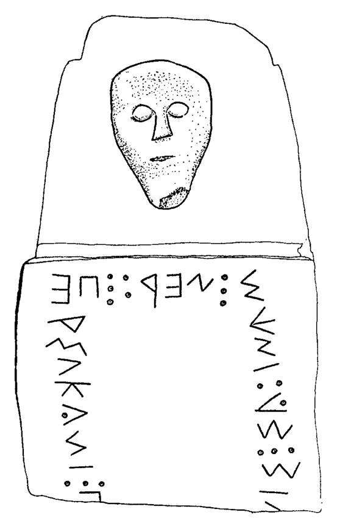
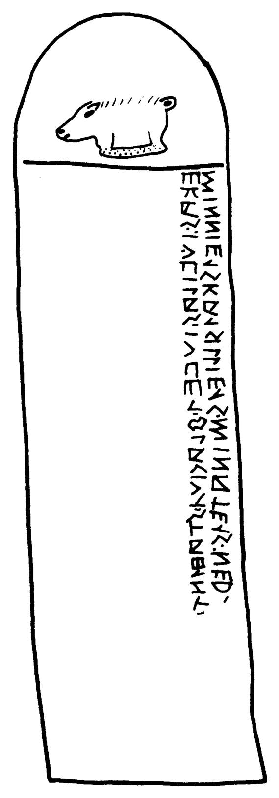

# Chapter 5: Sabellian languages

<!-- pdf-page: 119 -->
chapter 5
Sabellian languages
rex e. wallace
1.
HISTORICAL AND CULTURAL CONTEXTS
The term “Sabellian” refers to a group of genetically related languages that were spoken
throughout a substantial portion of pre-Roman Italy. Oscan and Umbrian are considered
the major representatives of this group because they are attested by the largest corpora
of inscriptions. The former was spoken in the southern half of the Italian peninsula, in
the territories of Samnium, Campania, Lucania, and Bruttium; the latter was spoken east
of the Tiber River in Umbria. Other Sabellian languages include Paelignian, Marrucinian,
Vestinian, Marsian, Volscian, Hernican, Aequian, and Sabine – languages which were spoken
in central Italy in the hill districts lying east and southeast of Rome. Recently, South Picene,
a language spoken in southern Picenum and in northern Samnium, and Pre-Samnite, the
language of Sabellian peoples who inhabited southern Campania before the arrival of the
Oscan-speaking Samnites, have been added to the inventory of Sabellian tongues.
Archeological evidence has not yet shed sufficient light on the dates at which or the routes
by which, Sabellian speakers moved into the Italian peninsula. By the beginning of the
historical period (c. 700 BC), however, Sabellian speakers had spread over a considerable
portion of central Italy, from Umbria and Picenum in the northeast to the Sorrentine
peninsula in the southwest (see Map 2). Sabellian tribes were still on the move during the
fifth and fourth centuries. Roman historical sources document the invasion of Campania
and the capture of Capua, Cumae, and Paestum by Oscan-speaking Samnites. By the middle
of the fourth century they had pushed south into Lucania and Bruttium, and southeast into
Apulian territory. At the beginning of the third century there were Oscan speakers in Sicily.
The Mamertini, a band of mercenary soldiers, crossed the straits in 289 BC and wrested
control of the Sicilian city of Messana from the Greeks.
The Sabellian languages did not survive Roman expansion. Those languages spoken in
central Italy succumbed to Romanization earlier than did those in the north and south.
Sabellian speakers in central Italy had probably shifted to Latin before the end of the Roman
Republic (c. 30 BC). In some areas Sabellian was more tenacious. Evidence from the city
of Pompeii indicates that Oscan was still being spoken there when the city was destroyed
by Vesuvius in AD 79. However, it is unlikely that any Sabellian language survived much
beyond the first century AD, by which time the territories of the Sabellians were securely
incorporated into the Roman Empire both politically and culturally.
The Sabellian languages are documented almost exclusively by inscriptions. The texts
belong to standard epigraphical types: dedications, epitaphs, proprietary inscriptions, in-
scriptions on public works, religious regulations, contracts, curses, trademarks, legends on
coins, and so forth. A few Sabellian vocabulary items are preserved by Roman and Greek

<!-- pdf-page: 120 -->
writers of the late Republic and early imperial period, but they do not add substantially to
our knowledge of any Sabellian language (Vetter 1953:362–378).
Oscan owns the largest corpus of texts, approximately six hundred and fifty inscriptions.
They cover a span of six hundred years, from the sixth century BC to the first century AD.
Most of the inscriptions belong to the period between 300 and 89 BC, the latter being the
date of the final Sabellian uprising against Rome. The nucleus of the corpus, over 30 per-
cent of the texts, comes from the Campanian cities of Capua and Pompeii. One of the
most important Oscan inscriptions was also discovered in Campania, the so-called Cippus
Abellanus, a limestone plaque recording an agreement between the cities of Nola and Abella
regarding the common use of a sanctuary of Heracles. The longest Oscan text, the Tabula
Bantina, is from the Lucanian town of Bantia. This bronze tablet is incised with a list of
statutes concerning municipal administration.
Even though the number of Umbrian inscriptions does not exceed forty, the corpus
is one of the most important in ancient Italy. Umbrian was the language of the Tabulae
Iguvinae (Iguvine Tablets), seven bronze tablets that were discovered in Gubbio (Roman
Iguvium) in the fifteenth century. The tablets were incised with the ritual regulations and
cultic instructions of a religious fraternity, the Atiedian brotherhood. They date from the
first half of the third century (for Tablets I–Vb7) to the end of the second century (for
Tablets Vb8–VII). Despite the relative lateness of these texts, it is likely that many of the
ritual procedures and regulations stem from an earlier tradition (see Rix 1985).
The remaining Sabellian languages are much less well represented. For most, there are
only a few short and often fragmentary inscriptions.
Examples of Sabellian inscriptions are given below (Figs. 5.1–2). According to standard
epigraphical conventions, texts written in native Sabellian alphabets are transcribed in bold-
face type; texts written in a Republican Latin alphabet appear in italics. The editio minor of
Sabellian inscriptions is Rix 2002. Vetter 1953 and Poccetti 1979 remain invaluable for epi-
graphic and linguistic commentary. An editio maior of the Tabulae Iguvinae was published
by Prosdocimi in 1984. Shorter Umbrian texts are collected in Rocca 1996. Marinetti 1985
is the editio maior for South Picene inscriptions.
The Sabellian languages, together with Latin and Faliscan, belong to the Italic branch of
the Indo-European language family. The evidence for an Italic subgroup consists of three
significant morphological innovations that are shared exclusively by Sabellian and Latino-
Faliscan:
(1)
Innovations shared by Sabellian and Latino-Faliscan
A.
Imperfectsubjunctivesuffix *-s¯e-,e.g.,Oscanfus´ıd“shouldbe”3rdsg.impf.subjunc.,
Latin foret 3rd sg. impf. subjunc. < *fus¯ed
B.
Imperfect indicative suffix *-f¯a-, e.g., Oscan fufans “they were” 3rd pl. impf., Latin
port¯abant “they were carrying” 3rd pl. impf. (*-fa- > -b¯a- in Latin)
C.
Verbal adjective formation in *-ndo-, e.g., Oscan ´upsannam acc. sg. fem. “to be built,”
Umbrian pihaner gen. sg. masc. “to be purified” (*-nd- > -nn- in Sabellian), Latin
operandam acc. sg. fem. “to be built”
The Sabellian languages share several significant morphological innovations, among
which are the spread of the i-stem genitive singular ending *-eis to o-stem and consonant-
stem inflection; the spread of the o-stem accusative singular *-om to consonant-stems; per-
sonal and reflexive pronominal forms with accusative singular -om/-om (e.g., Umbrian tiom
“you,” m´ıom “me,” Oscan siom “himself”); and the development of a mediopassive infini-
tive suffix in -fir/-fi(Oscan sakraf´ır “to be consecrated,” Umbrian pihafi“to be purified”).

<!-- pdf-page: 121 -->

[–?]nis : safin ´um : nerf : persukant : p[—?]
]nis-[name ?] ‘‘Sabines’’-gen. pl. masc. ‘‘leaders’’-acc. pl. masc. ‘‘?’’-3rd pl. pres. act. ‘‘[names?] they ? the leaders of the Sabines [?]’’
Prominent phonological innovations include the syncope of
*o in word-final syllables
(*ghortos > Oscan h´urz “enclosure”), the raising of inherited mid vowels (e.g., *¯e to *¯e.,
Proto-Sabellian *f¯e.sn¯a giving Oscan f´ı´ısn´u “sanctuary,” cf. Latin f¯estus “festal”), and the
change of Proto-Indo-European labiovelars to labials (*kwis > Oscan pis “who”).
Interrelationships among the Sabellian languages are difficult to determine because
there is so little evidence for the languages in central Italy. However, the split into two
Sabellian subgroups, one closely aligned with Umbrian, the other with Oscan, is not sup-
ported by the evidence. Instead, the territories occupied by Sabellian speakers form a lin-
guistic continuum with Umbrian positioned in the north, Oscan in the south, and the
Sabellian languages in central Italy constituting a transitional linguistic area where the
languages have both Oscoid and Umbroid features (Wallace 1985). Exactly how South
Picene fits into this schema is currently under deliberation (Meiser 1987; Adiego Lajara
1990).
2.
WRITING SYSTEMS
The Sabellian languages were written in a variety of different alphabets. The type of alphabet
employed depended on two factors: when a Sabellian tribe became literate and from what

<!-- pdf-page: 122 -->

ekas : i ´uvilas . iuve´ı . flagiu´ı . stah´ınt . / minnie´ıs ka´ısillie´ıs . minate´ıs : ner .
‘‘these’’-nom. pl. fem. ‘‘Iovilas’’-nom. pl. fem. ‘‘Jupiter’’-dat. sg. masc. ‘‘Flagius’’-dat. sg. masc. ‘‘be standing’’-3rd pl. pres. act. ‘‘Minis’’-gen. sg. masc.
‘‘Kaisilies’’-gen. sg. masc. ‘‘Minaz’’-gen. sg. masc. ‘‘commander’’-abbreviation for gen. sg. masc.
‘‘These Iovilas are set up for Juppiter Flagius. [They belong to] Minis Kaisillies, [son of] Minas, commander.’’

<!-- pdf-page: 123 -->
Table 5.1
National Oscan alphabet, c. 250 BC
Character
Transcription
Character
Transcription
a
a
m
m
B
b
n
n
c
g
P
p
d
d
R
r
E
e
s
s
W
v
T
t
z
z
U
u
h
h
f
f
i
i
ˆ
´ı
k
k
√
´u
l
1
source – Greek, Etruscan, or Latin – the alphabet was borrowed. Some Sabellian tribes
borrowed from more than one source.
Oscan inscriptions were written in three different alphabets. Inscriptions from Campania
and Samnium were composed in an alphabet that was borrowed from Etruscans who had
colonized the Campanian plain in the sixth century BC. In the territories of Lucania and
Bruttium, Oscan inscriptions were written in an alphabet of the East Greek type. A few
inscriptions from the first century BC, including the important Tabula Bantina, were written
in a Republican Latin alphabet.
TheOscanalphabetthatdevelopedfromCampanianEtruscansourceswasformedduring
thelasthalfofthefifthcenturyBC.ThisalphabetspreadrapidlythroughoutOscan-speaking
Campania and into Samnium and was eventually codified as the so-called national Oscan
script (see Table 5.1). At the beginning of the third century, two new signs were incorporated
into the abecedarium in order to represent more accurately the phonology of Oscan mid
vowels. Diacritics were added to the letters i and u to create signs for the vowels /¯e./, /e./ ˆ
and /o/ √. These signs are transcribed as ´ı and ´u respectively.
The Sabellian-speaking tribes in central Italy, most of whom became literate via contact
with Romans, borrowed the Latin alphabet. In a few instances, there is evidence for changes
in the inventory of signs. In Paelignian, for example, the sign delta was modified by means
of a diacritic and then employed on several inscriptions to represent the outcome of the
palatalization of a voiced dental stop (*dy > [[unclear-glyph:U+0002]]), transcribed as -D, for example, Paelignian
petie-Du “Petiedia” (nom. sg. fem.).
UmbrianwaswritteninseveraldifferentlocalversionsofanEtruscanalphabet(Cristofani
1979). One of the earliest Umbrian inscriptions, that inscribed on a statue of Mars, was
written in an alphabet similar to the one used in the central Etruscan city of Orvieto. The
alphabet of Umbrian inscriptions from Colfiorito may also have come from this area, as is
indicated by the fact that gamma was used for the voiceless velar /k/ rather than kappa. In
contrast, the Iguvine Tablets I through Vb7 were inscribed in an Etruscan-based alphabet
that did not have the letter gamma. This alphabet had a north Etruscan source, perhaps
Perusia or Cortona (see Table 5.2).
The chief characteristic of the Umbrian alphabet used for the Iguvine Tablets I–Va is the
absence of the signs gamma and omicron. The voiced stop /g/ was represented by kappa, and

<!-- pdf-page: 124 -->
Table 5.2
Umbrian alphabet, Iguvine Tablets I--Vb7, c. 250 BC
Character
Transcription
Character
Transcription
A
a
m
m
b
b
n
n
R
ˇr
p
p
e
e
r
r
w
v
s
s
z
z
t
t
h
h
u
u
i
i
f
f
k
k
c
c¸
l
l
upsilon was used for the mid vowel /o/. Interestingly, the signs beta and delta were a part of
this script, although it is not clear whether they were inherited from the Etruscan alphabet
that served as a model or were reborrowed from another source. Delta was used for a voiced
fricative /z./ (˘r) rather than for the voiced stop /d/, which was represented by tau. Both pi and
beta shared the function of representing the voiced stop /b/, e.g., hapinaf, habina (acc. pl.
fem.) ‘lambs.” The inherited Etruscan inventory of signs was further modified in order to
represent the native Umbrian phoneme /˘s/. The letter d (transcribed c¸), of uncertain origin,
was assigned this function.
Tablets Vb8, VI, and VII and a small number of Umbrian inscriptions belonging to the
second and first centuries BC were written in a Republican Latin alphabet. The inventory
of signs was augmented by the addition of S′ (/˘s/, transcribed ´s), a Latin sigma modified by
an oblique stroke appended in the upper left quadrant of the sign space.
Sabellian inscriptions composed in an Etruscan-based alphabet were generally written
sinistrograde (right to left), but some were written dextrograde and a few others were laid
out in boustrophedon (“as the ox plows”) style, every other line alternating in direction.
Oscan inscriptions in the Greek alphabet were consistently written from left to right, as were
the Sabellian inscriptions in the Latin alphabet, including Tablets Vb8, VI, and VII of the
Tabulae Iguvinae.
Most Sabellian inscriptions in Etruscan-based alphabets use some form of punctuation
to separate words, although a few of the earliest inscriptions are written scriptio continua.
Punctuation between words is customarily a single point appearing at mid-line level, but
word-dividers also take the form of double or triple puncts, the latter being particularly
common on South Picene inscriptions in order to avoid confusion with the sign for /f/ : (see

rarely use punctuation for word boundaries; scriptio continua is the norm.
3.
PHONOLOGY
Despite the genetic affiliation of the Sabellian languages, the phonological systems of each
language developed distinctive characteristics. The Oscan sound system was more conser-
vative, the Umbrian system more innovative.

<!-- pdf-page: 125 -->
Table 5.3
The consonantal phonemes of Oscan
Place of articulation
Manner of
articulation
Bilabial
Labiodental
Dental
Palatal
Velar
Labiovelar
Glottal
Stop
Voiceless
p
t
k
Voiced
b
d
g
Fricative
f
s
h
Nasal
m
n
Liquid
Lateral
l
Nonlateral
r
Glide
y
w
Throughout the remaining sections of this chapter, the following abbrevations are used
in glossing examples: G (gentilicium); PN (praenomen); DN (name of a god or goddess).
3.1 Oscan consonants
The Oscan consonantal inventory consists of fifteen members. There are three sets of stops –
labials, dentals, and velars – with each set having a contrast in voicing. The three fricatives
are all voiceless, and the nasals, liquids, and semivowels voiced.
These phonemes are illustrated by the examples of (2):
(2)
Oscan consonant phonemes
p´us (“who”) /p/, tangin´ud (“decree”) /t/, k´umbened (“it was agreed”) /k/
bl´ussii(e´ıs) (“Blossius” G) /b/, deded (“he gave”) /d/, geneta´ı (“Genita” DN) /g/
faamat (“he calls”) /f/, s´um (“I am”) /s/, heriiad (“he should wish for”) /h/
maatre´ıs (“mother”) /m/, niir (“commander”) /n/
le´ıg´uss (“statute”) /l/, regature´ı (“the director,” epithet of Jupiter) /r/
i´uve´ı (“Jupiter” DN)/y/, veru (“gate”) /w/
The fricative /h/ was probably restricted to word-initial position. The fact that non-
etymological h appears occasionally to mark vocalic hiatus supports this view; consider
Oscan stah´ınt /st¯ae.nt/.
Intervocalic /s/ was phonetically voiced. The evidence is provided by inscriptions written
in the Latin alphabet where the sign z is employed to write the sound derived from original
*s, for example, ezum [ezum] “to be” (pres. inf.), egmazum [egmazum] “affairs” (gen. pl.
fem.). It is possible that the fricative /f/ was also voiced intervocalically, but the writing
system provides no evidence in this instance.
3.1.1
Palatalization
All geographical varieties of Oscan palatalize consonants (except for /f, s, w/) in the environ-
ment of a following /y/. Palatalization was marked in the national alphabet by gemination
of the palatalized consonant: for example, mamerttia´ıs “of Mamers (name of month)”

<!-- pdf-page: 126 -->
<*-ty-, meddikkiai “the office of meddix” (title of political official) <*-ky-, k´umbennie´ıs
“assembly” <*-ny-, v´ıtelli´u “Italia” <*-ly-. The dialect of Bantia, which is attested by the
Tabula Bantina (c. 90–80 BC), shows a more advanced stage of development. Dental and
velar stops were assibilated and the glide was lost, thus, bansae “Bantia” (town in Apulia)
<*-ty-; meddixud <*-ky-. Moreover, palatalized liquids were spelled without any indication
of palatalization, e.g., famelo [-eʎo] “servant” <*-ly-; herest [-e´re-] “he will wish for” <*-ry-.
3.1.2
Anaptyxis
AnotherfeaturecharacteristicofOscanphonologyistheanaptyxisofvowelstobreakupclus-
ters consisting of sonorant (liquids, nasals) and some other consonant. Anaptyxis occurred
in sonorant plus consonant clusters, for example, aragetud “silver” (abl. sg.) < *argent¯od,
as well as in consonant plus sonorant clusters, for example, patere´ı “father” (dat. sg. masc.)
< *patrei, provided the preceding vowel was short. In the case of so-called anterior anaptyxis,
the quality of the anaptyctic vowel was determined by the quality of the vowel preceding the
sonorant, for example, aragetud and herekle´ıs “Herakles” (gen. sg. masc.) < *herkle´ıs. On
the other hand, in posterior anaptyxis the quality of the anaptyctic vowel was determined by
the quality of the vowel following the sonorant, as in patere´ı and tef´ur´um “burnt offering”
(acc. sg.) < *tefrom.
3.2 Oscan vowels
The Oscan vowel system is made up of eleven phonemes. There are three pairs of phonemes
in the front region, each pair being distinguished by the features of height and length: /i/ and
/¯ı/; /e./ and /¯e./; /e/ and /¯e/. The inventory of back vowels is half that of the front region: two
highvowels,/u/and/¯u/,andonemidvowel,/o/.Thelowvowels/a/and/¯a/filloutthesystem.
In the national Oscan script, long vowels in word-initial/radical syllables are distinguished
from short ones (see §3.3) by double writing of the vowel sign, though this orthographic
practice is by no means consistently employed, even within the same inscription.
(3)
Oscan vowel phonemes
vi´ıbis (PN) /¯ı/, tangin´ud (“decree”) /i/ (no examples in initial syllables)
f´ı´ısnam (“temple, sanctuary”) /¯e./, ´ıd´ık (“it”) /e./
teer[´um] (“territory”) /¯e/, ped´u (“foot”) /e/
fluusa´ı (“Flora” DN) /¯u/, purasia´ı (“concerned with fire”) /u/
p´ud (“which”) /o/ (no examples of /¯o/ are attested)
slaagid (“boundary”) /¯a/, tangin´ud (“decree”) /a/
In addition to these simple vowel phonemes Oscan also has five diphthongs, /ai/, /ei/,
/oi/, /au/, and /ou/.
(4)
kva´ısture´ı (“quaestor”) /ai/, de´ıva´ı (“divine”) /ei/, m´u´ınik´u (“common”) /oi/
avt (“but”) /au/, l´uvke´ı (“grove”) /ou/
Although the evidence is not conclusive, it is likely that the distinction in vowel length
noted above was maintained only in word-initial/radical syllables (Lejeune 1970:279). It
is also likely that distinctions in vowel quality were neutralized in word-final syllables.
Etymological *¯a in absolute final position and etymological *o, *¯o, and *u in final syllables,

<!-- pdf-page: 127 -->
both open and closed, are spelled either ´u or u in the national Oscan alphabet, the vari-
ation in spelling being tied to the writing habits of local scribes. The use of ´u or u to
spell what originally were four different sounds suggests that they all developed phonet-
ically to a mid vowel having a quality between that of [u] and [o], perhaps [o.] (Lejeune
1970:300–305).
At the beginning of the third century BC, the Oscan vowel system was augmented by a
sound that developed from short /u/ after dental consonants. In the national alphabet this
sound is spelled iu, for example, tiurr´ı “tower” (acc. sg.) < *turrim, compare Latin turrim;
this spelling probably represents a palatalized [u], in other words [tyurre.]. However, there
is some evidence to suggest that by the end of the third century the pronunciation of this
phone had developed to a front rounded vowel [¨u]. For representing this sound, third- and
second-century Oscan inscriptions written in the Greek alphabet use upsilon ([unclear-glyph:U+0002]), which had
the value [¨u] in Greek at the time, for example, [unclear-glyph:U+0003][unclear-glyph:U+0004][unclear-glyph:U+0002][unclear-glyph:U+0005][unclear-glyph:U+0006][unclear-glyph:U+0007][unclear-glyph:U+0004][unclear-glyph:U+0008][unclear-glyph:U+0004]	 /n(y)¨umsdieis/ (gen. sg. masc.),
[unclear-glyph:U+0003][unclear-glyph:U+0002][unclear-glyph:U+0005]
[unclear-glyph:U+0004][unclear-glyph:U+0005]/n¨umpsim/ (acc. sg. masc.). In order to keep the high-back vowels /u, ¯u/ graphically
distinct from [¨u], they were spelled with the digraph [unclear-glyph:U+000B][unclear-glyph:U+0002], e.g., [unclear-glyph:U+000B][unclear-glyph:U+0002][unclear-glyph:U+000C][unclear-glyph:U+0006]
[unclear-glyph:U+000E]	 /¯upsens/ “they built”
(3rd pl. perf.).
3.3 Umbrian consonants
The Umbrian consonantal inventory displays several substantive differences when com-
pared with that of Oscan. In addition to the dental fricative /s/, Umbrian has a voiceless
palato-alveolar spirant that developed from the prehistoric combinations *ky, *ki, *ke, for
example, c¸erfie /˘serfye/ “Serfia” (epithet of deities) dat. sg. masc. Perhaps the most inter-
esting innovation in the system was the change that introduced yet another fricative. This
new sound, which was probably a voiced retroflex spirant /z./, developed from intervo-
calic *d and also from intervocalic *l when adjacent to palatal vowels (Meiser 1986:213).
In the native alphabet the sound is represented by the sign R (˘r); in the Latin alpha-
bet it is spelled with the digraph rs, for example, te˘ra, dirsa /de.z.a/ “gives” (3rd sg. pres.
subjunc.).
Table 5.4
The consonantal phonemes of Umbrian
Place of articulation
Manner of
Labio-
Palato-
Labio-
articulation
Bilabial
dental
Dental
alveolar
Retroflex
Palatal
Velar
velar
Glottal
Stop
Voiceless
p
t
k
Voiced
b
d
g
Fricative
Voiceless
f
s
˘s
h
Voiced
z.
Nasal
m
n
Liquid
Lateral
l
Nonlateral
r
Glide
y
w

<!-- pdf-page: 128 -->
These sounds can be illustrated by the following examples:
(5)
Umbrian consonant phonemes
poplom (“people. nation”) /p/, tuta, totam (“community, state”) /t/, kumaltu,
comoltu (“let him grind”) /k/
krapuvi, grabouie (“Grabovius,” epithet of Jupiter) /b/, te˘ra, dirsa (“he should
give”) /d/, grabouie /g/
fust (“he will give”) /f/, stahu (“stand”) /s/, c¸erfie, ´serfie (“Serfius, Serfia,” epithet of
deities) /ˇs/, habia (“he should take hold of”) /h/
matrer (“mother”) /m/, nerf (“commander”) /n/
kumaltu, comoltu (“let him grind”) /l/, rufru (“red”) /r/, te˘ra (“he should give”) /z./
iuviu, iouiu (“of Jupiter”) /y/, verufe, uerir (“gate”) /w/
In Umbrian h is weakly articulated. The sound was lost in medial environments before
the historical period, and the character h was frequently used to mark both vocalic hiatus
and vowel length, for example, stahu /st¯au/ “I stand” (1st sg. pres. act.), ahatripursatu /¯a
tripuz.atu/ (3rd sg. impv. II) “dance the three-step.” In word-initial position h may also have
been lost. Spellings with and without h are found in the earliest sections of the Tablets, for
example,eretu“wishedfor”(abl.sg.neut.),asareexamplesofhappearingwhereunexpected
on etymological grounds, for example, ebetrafe acc. pl. fem. + postposition versus hebetafe
(a place name).
3.3.1
Word-final consonants
Particularly characteristic of Umbrian are changes affecting word-final consonants. In the
oldest Umbrian inscriptions word-final d is not spelled, for example, dede “gave” 3rd sg.
perf. Word-final s is spelled sporadically in Iguvine Tablets I–Vb7, indicating that it too
was weakened. In those Iguvine Tablets written in the Latin alphabet, original word-final s
was rhotacized to r, for example, popler (gen. sg. masc.) “people, nation” < *popleis (Meiser
1986:277); furthermore, word-final m, n, f (<*-ns), and r, including r from original s, were
in the process of being lost. The writing of word-final f in these Tablets is illustrative; f is
regularly, but not always, omitted in polysyllabic words and in monosyllables ending in a
consonant cluster. In other monosyllables, however, f is generally written. The result is a
sentence such as the following, in which final f is spelled in two words but not in two others
(rofu, peiu): abrof trif fetu heriei rofu heriei peiu (VIIa 3) “let him sacrifice three boars, either
red or spotted.”
3.4 Umbrian vowels
The basic inventory of Umbrian vowels is similar to that found in Oscan, though with two
additional phonemes. The first is a long mid /¯o/, corresponding to short /o/; the second
is a short mid vowel which is phonetically lower than /o/, perhaps /ɔ/. As in Oscan, the
distinction between long and short vowels is maintained in word-initial or radical syllables,
etymological long vowels being shortened in medial and final syllables (Meiser 1986:150).
Umbrian has no diphthongs corresponding to those found in Oscan cognates; all
diphthongs inherited from Proto-Sabellian were monophthongized before the historical
period and merged with existing long or short vowel phonemes. New diphthongs subse-
quently arose in Umbrian as the result of phonological changes, for example, /d¯eytu/ deitu
(3rd sg. impv. II) “speak,” aitu /aytu/ (3rd sg. impv. II) “set in motion.”

<!-- pdf-page: 129 -->
(6)
Umbrian vowel phonemes
persnihmu (“pray”) /¯ı/, atiersir (“Atiedian”) /i/
sehmeniar (“of ?”) /¯e./, aves, avis, aueis (“bird”) /e./
esuna, eesona (“religious”) /¯e/, a˘rfertur (“chief priest”) /e/
kumnahkle (“meeting place”) /¯a/, a˘rfertur /a/
pihaz, pihos (“purified”) /ɔ/
uhtur, oht (“auctor,” title of political office) /¯o/, poplom, puplum (“people,
nation”) /o/
struhc¸la (“offering”) /¯u/, fust, fust (“he will be”) /u/
3.5 Sabellian accent
Very little is known about the word accent of any Sabellian language. Nevertheless, it is
possible to make informed inferences about accentuation based on orthographic practices
and on certain phonological processes that affected the Sabellian languages, in particular
Oscan and Umbrian, at various stages in their development. In all Sabellian languages
short vowels were lost before word-final *s. Short vowels in open medial syllables were also
syncopated before the historic period. This vocalic instability suggests that Sabellian had
a stress accent which was positioned on the initial syllable of words. The fact that vowel
length is indicated only in initial/radical syllables in both Oscan and Umbrian (with rare
exceptions) suggests that word-initial/radical accent was still in place during the historical
period (Meiser 1986:150; for Oscan antepenultimate accent, see Schmid 1954).
4.
MORPHOLOGY
The Sabellian languages are classified typologically as fusional, inflecting languages. All
inflectional categories are signaled through endings attached to nominal and verbal stems.
Several word classes, such as conjunctions, pre- and postpositions, sentential adverbs, and
the cardinal numerals four and above, are uninflected.
4.1 Nominal morphology
The nominal system is composed of nouns, adjectives, and pronouns. With the exception
of a handful of forms, all members inflect for the grammatical features of case, number, and
gender. Sabellian has seven cases (nominative, vocative, accusative, dative, ablative, genitive,
locative), two numbers (singular and plural), and three gender categories (masculine, fem-
inine, and neuter). Nouns are generally assigned to one of the three genders on the basis of
their stem-type. For example, a-stems are feminine, o-stems and u-stems either masculine
or neuter, men-stems neuter, and so forth. There are, however, exceptions, particularly in
the case of animate nouns, which are assigned gender based on sex, not on form. Adjectives,
most pronouns, and the cardinal numerals from one to three inflect so as to agree in gender
and case with the noun which they modify, for example, Umbrian tutaper ikuvina “for the
Iguvine state” (abl. sg. fem.); Umbrian tref sif kumiaf “three pregnant sows” (acc. pl. fem.).
4.1.1
Nominal classes
Nouns are formally organized into subsystems – declensions – according to the formation of
the stem (see Table 5.5). Sabellian has four major vocalic-stem declensions: a- (Oscan aasa´ı

<!-- pdf-page: 130 -->
Table 5.5
Sabellian noun stems
a-stems
Oscan
Umbrian
nom. sg.
v´ı´u, touto
muta, mutu
voc. sg.
—
Tursa, prestota
acc. sg.
v´ıam, toutam
tuta, totam
dat. sg.
de´ıva´ı
tute, tote
abl. sg.
e´ıtiuvad, toutad
tuta, tota
gen. sg.
vereias
tutas, totar
loc. sg.
v´ıa´ı, bansae
tafle, tote
nom. pl.
aasas, scriftas
pumpe˘rias, iuengar
acc. pl.
v´ıass, eituas
vitlaf, uitla
dat./abl./loc. pl.
kerssna´ıs
tekuries, dequrier
gen. pl.
eehiianas´um
urnasiaru, pracatarum
o-stems
Oscan
Umbrian
nom. sg.
h´urz
Ikuvins
voc. sg.
Statie, Silie
Serfe, Tefre
acc. sg.
h´urt´um
puplum, poplom
dat. sg.
h´urt´u´ı
kumnacle, pople
abl. sg.
sakarakl´ud
puplu, poplu
gen. sg.
sakarakle´ıs
katles, popler
loc. sg.
tere´ı, comenei
kumne, pople
nom. pl.
N´uvlan´us
Ikuvinus, Iouinur
acc. pl.
fe´ıh´uss
vitluf, uitlu
dat./abl./loc. pl.
N´uvlan´u´ıs
veskles, uesclir
gen. pl.
N´uvlan´um
pihaklu, pihaclo
i-stems
Oscan
Umbrian
nom. sg.
a´ıdil
ukar
voc. sg.
—
—
acc. sg.
slag´ım
uvem, uerfale (neut.)
dat. sg.
—
ocre
abl. sg.
slagid
ocri-per
gen. sg.
aeteis
ocrer
loc. sg.
—
ukre, ocre
nom./voc. pl.
—
puntes, sakreu (neut.)
acc. pl.
—
avif, avef, perakneu (neut.)
dat./abl./loc. pl.
luisarifs
avis, aves
gen. pl.
[a]´ıtt´ıum
peracrio
consonant-stems
Oscan
Umbrian
nom. sg.
medd´ıss
a˘rfertur, pir (neut.)
voc . sg.
—
Iupater
acc. sg.
—
capirso(m), pir (neut.)
dat. sg.
med´ıke´ı
nomne
(cont.)

<!-- pdf-page: 131 -->
Table 5.5
(cont.)
Oscan
Umbrian
abl. sg.
—
kapi˘re
gen. sg.
med´ıke´ıs
nomner/matres
loc. sg.
—
—
nom./voc. sg.
humuns
frater/uasor (neut.)
acc. sg.
—
capif, tuderor (neut.)
dat./abl./loc. sg.
—
capi˘rus
gen. sg.
fratr´um
fratrum
“altar” [loc. sg. fem.]), o- (Umbrian poplom “people” [acc. sg. masc.]), i- (Umbrian uvi-
kum “with a sheep” [abl. sg. + postposition -kum]), and u-stems (Umbrian trifu “tribe”
[acc. sg.]). In addition, four major consonant-stem declensions occur: stop- (Oscan aitatum
“one’s age” [acc. sg.]), s- (Umbrian me˘rs “law” [nom. sg. neut.]), r- (Oscan patir “father”
[nom. sg. masc.]), and n-stems (Umbrian umen “ointment” [acc. sg. neut.]). Sabellian
probably also had another vocalic-stem declension, ¯e-stems (Umbrian re-per “according to
the ceremony” [abl. sg. fem.] + postposition -per). Unfortunately, the evidence is limited
to a few words in Umbrian, and it is consequently impossible to determine to what extent
these constituted a special inflectional class.
Within these basic inflectional categories there exist several distinct paradigmatic
subclasses. For example, o-stems, i-stems, and consonant-stems split into subgroups
based on the gender of the noun – neuters having inflectional endings which are dis-
tinct from masculines and feminines in the nominative and accusative singular and
plural:
(7)
Oscan o-stem masculines and neuters
masculine
neuter
nom. sg.
h´urz
tef´ur´um
acc. sg.
h´urt´um
dunum
nom. pl.
N´uvlan´us
veru
acc. pl.
fe´ıh´uss
veru
In addition, o-stems and i-stems developed subtypes as a result of sound changes that
eliminated short *o and short *i in word-final syllables before *s and, in the case of *o, also
in the environment *-yom. Owing to these changes, o-stems that were built historically
with a *yo-suffix came to have an inflectional pattern that was distinct from other types of
o-stems. This latter group, in turn, is distinguished depending on whether the nominative
singular retained or lost its original word-final *s. Compare, for example, the nominative
and accusative singulars in (8):
(8)
Subclasses of Umbrian o-stem nouns
*to-stems
*ro-stems
*lo-stems
*yo-stems
nom. sg.
ta´sez /ta˘sets/
ager
katel
Vuv´cis
acc. sg.
ehiato(m)
kaprum
katlu(m)
graboui(m)

<!-- pdf-page: 132 -->
4.1.2
Diachronic developments
The paradigms given in Table 5.5 also serve to illustrate the main features of the diachrony
of the nominal system in the Sabellian languages, namely the formal merger of cases both
withinandacrossparadigms.Thei-stemgenitivesingularending,Oscan-e´ıs/Umbrian-e(s),
was taken over by o-stems and consonant-stems. The accusative singular ending -om/-´um,
originally at home in o-stem inflection, spread into the consonant-stems. In Oscan the
similarities between these two inflectional classes are even greater because the consonant-
stems also borrowed the o-stem ablative singular -´ud/-ud, for example, Oscan tangin´ud
(abl. sg.) “decree,” ligud (abl. sg.) “law.”
Generally, however, the formal merger of cases in Umbrian is considerably more advanced
than in Oscan. Sound changes in Umbrian, in particular the monophthongization of diph-
thongs and the loss of word-final consonants, eliminated distinctions between case endings:
consider, for example, Umbrian a-stem tote (dat. sg. fem.) “state,” tote (loc. sg. fem.) “state,”
compare Oscan a-stem anagtiai (dat. sg. fem.) “Angitia” (name of goddess), aasa´ı (loc. sg.
fem.) “altar”; Umbrian a-stem uestisia (acc. sg. fem.) “offering cake,” uestisia (abl. sg. fem.),
compare Oscan a-stem v´ıam (acc. sg. fem.) “road,” toutad (abl. sg. fem.) “state.”
4.1.3
Adjectives
Adjectives are organized into paradigmatic classes on the same basis as nouns, although
the number of stem-types is more restricted. Adjectives are inflected as o-stems, a-stems,
i-stems, and consonant-stems (no u-stems or ¯e-stems occur). Together o-stems and a-stems
form one adjective declension, the masculine and neuters taking o-stem inflection (as in
Oscan t´uvt´ıks “of the community, state” [nom. sg. masc.], touticom [acc. sg. neut.]) and
the feminines taking a-stem inflection (Oscan toutico [nom. sg. fem.] with -o from *¯a). In
contrast, i-stem and consonant-stem adjectives occur in all three gender classes (e.g., i-stem,
Umbrian perakri “fit for sacrifice” [abl. sg. masc.], perakre [acc. sg. fem.]).
The inflectional category of degree, comparative and superlative, is marked by suffixes
addedtotheadjectivestem.Theregularsuffixesare-tro-and-imo-respectively,forexample,
Umbrian mestru (nom. sg. fem.) “greater,” Oscan maimas (nom. pl. fem.) “greatest.”
4.1.4
Pronouns
The Sabellian pronominal system includes personal, reflexive, demonstrative, emphatic,
anaphoric, interrogative, indefinite, and relative pronouns. The pronouns for first and
second persons are not marked for gender, but the rest of the forms in the pronominal
system are assigned gender based on that of the noun with which they are in agreement or
to which they refer, for example, Umbrian este persklum “this ceremony” (acc. sg. neut.).
Sabellian pronouns show significant differences in inflection when compared with nouns
and adjectives. These differences are particularly strong in the personal pronouns, but are
manifest also in other pronominal categories. For example, the dative singular of the first-
and second-person pronouns has unique endings -he, -fe/-fei, for example, Umbrian mehe
“tome,”tefe“toyou,”Oscant(e)fei“toyou,”compareLatintibi.Furthermore,thedativesin-
gular and the locative singular of demonstratives and relatives are marked by distinctive end-
ings in Umbrian, dative -smi, -smei, locative -sme, for example, Umbrian demonstrative
esmi-k, esmei “this” (dat. sg.), relative pusme “who, which” (dat. sg.), demonstrative esme
“this” (loc. sg.). The pronominal neuter nominative/accusative singular is distinguished
from nominals by its case ending -d, Oscan p´ud “which,” Umbrian pu˘re “which”
<*pod-id.

<!-- pdf-page: 133 -->
Outside of the personal pronouns, Sabellian pronominal formations exhibit either a-, o-,
or i-stem inflection. The relative and indefinite pronouns have the stems po- and pi-:
(9)
Oscan and Umbrian relative pronouns
Oscan
Umbrian
nom. sg. masc.
—
poi, porsi
nom. sg. fem.
pa´ı
—
nom. sg. neut.
p´ud
pu˘re
acc. sg. fem.
paam
—
dat. sg. masc.
pui
pusme
abl. sg. fem.
pad, poizad
pora
nom. pl. masc.
p´us
pure
nom./acc. pl. neut.
pa´ı
porse
acc. pl. fem.
—
pafe
Demonstrative formations typically have a-/o-stem inflection: for example, Paelignian ecuc
“this” (nom. sg. fem.) < *ek¯a-k(e), Oscan ekas “this” (nom. pl. fem.), both with stem *eko-
/ek¯a-; Oscan e´ıse´ıs “his” (gen. sg. masc.), Umbrian erer “this” (gen. sg. masc.), with stem
*eiso-; Umbrian estu “that” (acc. sg. masc.), with stem *isto-; Oscan eksuk “this” (abl. sg.
neut.); Umbrian eso “this” (nom. sg. fem.) < *eks¯a, with stem *ekso-/eks¯a-:
(10)
Oscan and Umbrian demonstrative pronouns (stem *i-/ei-)
Oscan
Umbrian
nom. sg. masc.
izic
erek
nom. sg. fem.
iiuk
—
nom. sg. neut.
´ıd´ık
e˘rek
acc. sg. masc.
ionc
—
acc. sg. fem.
´ıak
eam
nom. pl. masc.
iusc
—
acc. pl. fem.
iafc (Marrucinian)
eaf
nom./acc. pl. neut.
ioc
eu
The Sabellian anaphoric pronoun is built with the stem *i-/ey-, for example, Oscan izic “he”
(nom. sg. masc.), Umbrian erek, erec “he” (nom. sg. masc.).
In the prehistory of the Sabellian languages many of these pronominal forms were aug-
mented by means of particles. The accretion of these particles to pronominal forms had
the effect of producing paradigms with inflectional endings that appear, at first glance,
to have little in common with those of the nominal system. In many instances the in-
flectional ending of a pronominal form cannot easily be recognized until the particle has
been removed, for example, Umbrian erarunt “the same” = erar (gen. sg. fem.) + particle
-unt < *es¯as-ont; Umbrian erak “this” = era (abl. sg. fem.) + particle -k < *es¯ad-k(e);
Umbrian pu˘re “which” = pu˘r (nom. sg. neut.) + particle -e < *pod-i.
4.2 Verbal morphology
The Sabellian verb is inflected for the categories of tense, voice, mood, person, and number.
There are three persons (first, second, third), two numbers (singular, plural), and two voices
(active,mediopassive).Themoodcategoriesareindicative,imperative,andsubjunctive.Five

<!-- pdf-page: 134 -->
different tense forms are attested for Sabellian verbs: present, imperfect, future, perfect, and
future perfect. The basic symmetry of the Sabellian system and the fact that it is quite similar
to that of Latin suggest the occurrence of another tense form, the pluperfect, compare Latin
portauerat “had carried.”
4.2.1
Aspectual stems
The finite verb system is formally organized into subsystems based on two stem-types
that mark a distinction in aspect, the infectum (present system) and the perfectum (perfect
system). Present, imperfect, and future tense forms are built on the stem of the infectum,
the perfect and the future perfect on that of the perfectum:
(11)
infectum
perfectum
pres.
didet “he gives” (Vestinian)
perf fefa<c>id “he should do”
fut.
didest “he will give”
fut. perf. fefacust “he will have done”
impf.
fufans “they were”
pluperf. ? —
4.2.2
Verb endings
The grammatical categories of person, number, and voice are signaled by affixes traditionally
called“personalendings.”Theseareoftwobasicsets,oneforactiveandoneformediopassive
voice (see Table 5.6). The active set of endings has two forms depending on the tense of the
verb to which it is attached: the so-called primary endings are used for present, future, and
future perfect tenses; while secondary endings are used for imperfect and perfect indicative,
and for all tenses of the subjunctive. In the passive voice, only Umbrian shows a primary
versus secondary distinction, for example, 3rd sg. mediopass. – primary herter “it is desir-
able” (3rd sg. pres.); secondary emantur “they should be accepted” (3rd sg. pres. subjunc.).
Table 5.6
Sabellian personal endings
primary
1st sg. act.
Umbrian suboca-u “I invoke”
2nd sg. act.
Umbrian herie-s “you will desire”
3rd sg. act.
Vestinian dide-t “he gives”
3rd sg. mediopass.
Oscan uinc-ter “he is convicted”
1st pl. act.
—
2nd pl.
—
3rd pl. act.
Umbrian furfa-nt “they shear”
3rd pl. mediopass.
Umbrian ostens-endi “they will be presented”
secondary
1st sg. act.
Oscan manaf-´um “I entrusted”
2nd sg. act.
—
3rd sg. act.
Oscan pr´ufatte-d “he approved”
1st pl. act.
South Picene adstaeo-ms “we have set up”
2nd pl. act.
Umbrian benuso /-us-so/ “you all will have come”
3rd pl. act.
Paelignian coisat-ens “they took care of”
3rd pl. mediopass.
Umbrian ema-ntur “they should be accepted”

<!-- pdf-page: 135 -->
The Sabellian languages also possess a third singular mediopassive suffix -r for use in
impersonal constructions, for example, Umbrian ferar (3rd sg. pres. subjunc.). mediopass.
“there is a carrying,” ier (3rd sg. pres. mediopass.) “there is a going.”
4.2.3
Verbal classes
The Sabellian verb is organized into paradigmatic classes, or conjugations, based on the
form of the verb-stem found in present tense inflection. If verbs such as “to be” (Oscan
s´um “I am”) and “to go” (Umbrian est “he will go”) are excluded as “irregular,” five
basic conjugational patterns can be established: a-conjugation (Oscan faamat “he calls”);
e-conjugation (Umbrian tusetu/tusitu “let him pursue,” Oscan fat´ıum “to speak,”
licitud “let it be permitted”); i-conjugation (Umbrian seritu “let him watch out for”);
y/i-conjugation (Umbrian fac¸iu /fa˘syo(m)/ “to sacrifice,” Oscan fakiiad “he should make”);
and e/ø-conjugation (Oscan agum “to move,” actud “let him move,” Umbrian aitu “let
him move”). Forms of the y/i- and e/ø-conjugations such as the Oscan imperatives factud,
actud are derived from earlier forms in which medial vowels were present – short i for
factud < *fakit¯od, short e for actud < *aket¯od.
4.2.4
Verb tense
Tense is typically signaled by a combination of stem-type (perfectum versus imperfectum;
see §4.2.1) and suffixation. Outside of the present and perfect there are special tense-forming
suffixes. The imperfect has -fa-, the future -(e)s-, and the future perfect -us-: for example,
Oscan fu-fa-ns “they were” 3rd pl. impf., Oscan deiua-s-t “he will swear” (3rd sg. fut.),
Oscan tr´ıbarakatt-us-et “they will have built” (3rd pl. fut. perf.).
Sabellian perfect tense stems of active voice are formed by a number of different mor-
phological operations: (i) reduplication (Oscan deded “he gave” [3rd sg. perf.], fefacid “he
should do” [3rd sg. perf. subjunc.]; Umbrian dede “he gave” [3rd sg. perf.]); (ii) suffixation
(-tt-: Oscan pr´ufatted “he approved” [3rd sg. perf.]; -nc¸i-/-n´si-; Umbrian purdin´siust “he
will have presented” [3rd sg. fut. perf.]; -f-: Umbrian andirsafust “he will have made a
circuit” [3rd sg. fut. perf.]); and (iii) radical vowel lengthening (Oscan uupsens “they built”
[3rd. pl. perf.]). Some perfects are formed from the bare verb-stem, minus the suffix used to
generate the present: for example, Umbrian anpelust “he will have slain” (3rd sg. fut. perf.)
built to a present that is characterized by a suffix -ne, anpentu “let him slay” < *-pennet¯od
< *-pelnet¯od. In the mediopassive, the perfect is formed by a periphrastic construction in-
volving the past participle plus a form of the verb “to be”: for example, Oscan pr´uft´uset
(“they have been approved” [3rd pl. perf. mediopass.]; Oscan scriftas set “they have been
written” [3rd pl. perf. mediopass.]; Umbrian pihaz fust “it will have been purified” [3rd
sg. fut. perf. mediopass.]). Interestingly, there is one perfect mediopassive formation that
is not a periphrastic, Oscan comparascuster “it will have been discussed,” a future perfect
found in the Tabula Bantina. Presumably this formation is an independent (and late?) Oscan
creation.
In some cases, in particular derived verbs, the stem of the perfect is built directly from
the present. For example, a-stem presents generally form -t(t)-stem perfects in Oscan and
in the Sabellian languages of central Italy: thus, Oscan duunated “he presented” (3rd sg.
perf.); Paelignian coisatens “they took care of” (3rd pl. perf.); Marrucinian amatens “they
seized” (3rd pl. perf.); Volscian sistiatiens “they set up” (3rd pl. perf.). Still, even here there
are exceptions. The verb-stem opsa- “build” forms a perfect by lengthening the radical vowel
and truncating the present stem vowel a, thus Oscan uupsens “they built” (3rd pl. perf.).

<!-- pdf-page: 136 -->
In Umbrian, a-stems form their perfects by means of the suffix -f-, andirsafust “he will have
made the circuit” (3rd sg. fut. perf.). In many cases the type of perfect formation cannot be
predicted by the paradigmatic class of the present. For example, the verb “to give” forms a
reduplicated present (Vestinian didet “he gives” [3rd sg. pres.]) and a reduplicated perfect
(Oscan deded “he gave” [3rd sg. perf.]), while the verb “to make” forms a y/i- present but a
reduplicated perfect, fakiiad “he should make” (3rd sg. pres. subjunc.), fefacid “he should
make” (3rd sg. perf. subjunc.).
4.2.5
Nonindicative moods
Subjunctive mood is indicated by suffixes which are attached to the verb-stem preceding
the personal endings. Present subjunctive is marked by -a in Umbrian for all present classes
except a-conjugation, which shows -ia: for example, e-conjugation habi-a “he should hold”
(3rd sg. pres. subjunc.); compare a-conjugation porta-ia “he should carry” (3rd sg. pres.
subjunc.). In Oscan -i is used for a-conjugation, deiua-i-d “he should swear” (3rd sg. pres.
subjunc.), -a for all other conjugation classes, for example, p´ut´ı-a-ns “they should be able”
(3rd pl. pres. subjunc.).
The imperfect subjunctive is attested only in Oscan and Paelignian. The suffix used is
Oscan -s´ı, Paelignian -se (< *s¯e): Oscan fu-s´ı-d “he should be” (3rd sg. impf. subjunc.);
Paelignian upsa-se-ter “it was built” (3rd sg. impf. subj. mediopass.). For the perfect sub-
junctive active, the suffix is -´ı/i, Oscan tr´ıbarakatt-´ı-ns “they should build” (3rd pl. perf.
subjunc.).
Imperative mood forms have two special sets of person, number, and voice endings. So-
called imperative I endings are used for commands that are to be carried out immediately
following the time of speaking:
(12)
Imperative I
2nd sg. act.
Umbrian anserio “observe”
3rd sg.
—
2nd pl. act.
Umbrian eta-tu “go,” Paelignian ei-te “go”
2nd pl. mediopass.
Umbrian katera-mu “arrange in order”
3rd pl.
—
Imperative II endings are reserved for commands to be carried out at some undefined
point in the future. This type is particularly common in the Iguvine Tablets, where sets
of ritual instructions are set forth to be carried out whenever the religious observance is
required:
(13)
Imperative II
2nd sg. act.
Umbrian ene-tu “begin”
2nd sg. mediopass.
Umbrian persni-mu “pray”
3rd sg. act.
Oscan liki-tud “let it be permitted”
3rd sg. mediopass.
Oscan censa-mur “let him be assessed”
2nd pl. act.
Umbrian ambre-tuto “circumambulate”
2nd pl. mediopass.
Umbrian pesni-mumo “pray”
3rd pl. act.
Umbrian habi-tuto “let them hold”
3rd pl. mediopass.
Umbrian pesni-mumo “let them pray”

<!-- pdf-page: 137 -->
4.2.6
Nonfinite verbals
An important component of the Sabellian verbal system consists of a constellation of nonfi-
nite formations. These include present infinitives, both active and mediopassive (Umbrian
erom “to be” [pres. act.]; Umbrian pihafi“to be expiated” [pres. mediopass.]); present and
past participles (Umbrian zeref “sitting” [pres. act.]; Umbrian c¸ersnatur “having dined”
[past. mediopass.]); supines (Umbrian anzeriatu “to observe”); and the so-called gerundive
(Oscan ´upsannam “to be built”).
4.3 Derivational morphology
Complex Sabellian words are formed by means of the morphological processes of affix-
ation and compounding. Affixation, in particular suffixation, appears to have been more
productive than compounding.
4.3.1
Suffixation
Several suffixes are used productively to form nouns in Oscan and Umbrian. The suffix -iuf
(nom. sg.)/-in- (other cases) produces nouns with abstract or concrete meanings, for ex-
ample, Oscan tr´ıbarakkiuf “a building,” compare tr´ıbarakattens “they built.” The extended
suffix -tiuf/-tin- has the same morphological function, for example, Oscan medicatinom
“judgment,” Umbrian natine “tribe,” compare Praenestine Latin nationu “childbirth”
(gen. sg.). The suffix -tur is used to form agent nouns from verb-stems, for example, Oscan
regature´ı “the director” (epithet of Jupiter) dat. sg. from *reg¯a- “direct,” a˘rfertur “flamen,
chief priest” from *ad-fer- “to carry.” The suffix -etia, which is added to noun stems to build
abstracts, is attested in Umbrian by several formations that serve to indicate terms of elected
office, for example, kvestretie “in the term of office as quaestor” (loc. sg.).
One productive adjective-forming suffix is -(a)sio- “relating to, pertaining to,” used to
form adjectives from nominal stems: for example, Oscan kerssnasias “concerned with
banquets” (nom. pl. fem.), compare Oscan kersnu “banquet” (nom. sg. fem.); purasia´ı
“concerned with fire” (loc. sg. fem.), compare Umbrian pir “fire” (nom./acc. sg. neut.). The
suffix -ano- is also used to form adjectives from nouns; most of the examples attested in
inscriptions are formed from ethnic or topographical names, for example, Oscan Abellan´us
“from the city of Abella” (nom. pl. masc.), Umbrian Treblanir “leading to Trebula” (abl. sg.
neut.).
Verbs are productively formed in all Sabellian languages by means of the suffix -a or
by extensions of this suffix, -ia, -ta, etc. Formations in -a, a suffix used primarily
to build verbs from nouns and adjectives, are widely attested: thus, Umbrian kuratu
“accomplished” (acc. sg. neut. mediopass. part.); Paelignian coisatens “they supervised”
(3rd pl. perf.) < *kois¯a-, compare Latin c¯ura “concern”; Oscan deiuaid “he should swear”
(3rd sg. pres. subjunc.) < *deiu¯a-, compare Oscan de´ıva´ı “divine” (dat. sg. fem.); Umbrian
pihatu “let him purify” (3rd sg. impv. II), compare Volscian pihom “religiously unobjection-
able” (nom. sg. neut.); Oscan teremnattens “they set a limit on” (3rd pl. perf.) < *termn¯a-,
compare Oscan teremn´ıss (acc. pl.), Latin termen “limit”; Umbrian osatu “let him build”
(3rd sg. impv. II) < *opes¯a-, compare Latin opus “work.” This suffix, as well as variants de-
rived from it, are also used in the formation of deverbative verbs: for example, Umbrian
andirsafust “he will have made the circuit” (3rd sg. fut. perf.) < *am-did-¯a-; Umbrian kumb-
ifiatu “deliver instructions” (2nd sg. impv. II) < *kom-bif-i¯a-, compare Latin f¯ıdit “he puts
confidence in”; Umbrian etaians “they go” (3rd pl. pres. subjunc.) < *ey-t¯a-.

<!-- pdf-page: 138 -->
4.3.2
Compounds
Sabellian compound formations consist in large part of words with an adverbial first con-
stituent. In fact, the only pervasive type of verbal composition attested in Sabellian involves
the use of adverbial elements: for example, Umbrian aha-uendu “let him turn away” (3rd
sg. impv. II), am-pendu “let him slay” (3rd sg. impv. II), re-vestu “let him examine” (3rd sg.
impv. II), etc. There is also a substantial number of nominals formed by means of an adver-
bial first constituent. The best attested are built with the privative element a-, an- “not”: for
example, Oscan an-censto “unburnt” (nom. sg. fem.); Umbrian a-uirseto “unseen” (nom. sg.
neut.), an-takres “unground” (abl. pl.), a-snata “not wet” (acc. pl. neut.), a-sec¸eta “uncut”
(abl. sg. fem.).
Nominal compounding is not well represented in Sabellian. There are a couple of good
examples of possessive compounds with numerals as the first member, for example, Um-
brian petur-purs-us (dat. pl.) “animals” (i.e., “having four feet”); du-pursus (dat. pl.) “having
two feet.” But aside from these, there are few formations that qualify as compounds from a
synchronic point of view, though several forms derive historically from compounds: thus,
Oscan medd´ıss “meddix” (a title of magistracy), which was originally an adjectival com-
pound with first member *med- “law” and second member *dik- “speaking,” compare Latin
i¯udex < *iowes-dik- “speaking the law.” The semantics of medd´ıss, the fact that it refers to
a magistracy, suggests that it was no longer interpreted synchronically as a compound.
4.3.3
Locative case formation
An especially interesting morphological development is found in the Oscan and Umbrian
casesystem.ThepostpositionOscan-en“in,upon,”Umbrian-en,-e,-em“in,upon”governs
the locative case in one of its primary functions. When this postposition was added to the
locative of o-stem nominal forms in Oscan, or to the locative of vowel stems in Umbrian, the
vowel of the case ending and initial vowel of the postposition contracted, as in Oscan h´urt´ın
/hort¯e.n/ “in the precinct” < *hortey-en. This contracted form of ending + postposition was
then reanalyzed as a new form of the locative case. That such was indeed the case is indicated
bynounphrasesinwhichthis“ending”isattachedtobothadjectivesandnouns,forexample,
Oscan hurt´ın Kerr´ıi´ın “in the precinct of Ceres” (loc. sg. masc.), Umbrian ocrem Fisiem “on
the Fisian Mount” (loc. sg.); and by instances in which the postposition has been added to a
noun already marked with the original postposition, for example, Umbrian toteme Iouinem
“in the Iguvine community.” In this instance, toteme can be segmented diachronically as tote
(loc. sg. fem.) + postposition -em + postposition -e.
4.4 Numerals
Lack of evidence prevents a comprehensive treatment of numerals in Sabellian. Cardinal
numbers are well represented only by “two” and “three,” which inflected for gender, case,
and number: Umbrian sif trif “three sows” (acc. pl. fem.), triia tefra “three pieces of burnt
offering” (acc. pl. neut.). The number “four” pettiur is found on one Oscan inscription
(Rix Sa17). Unfortunately, the inscription is fragmentary and the context in which the word
occurs is no longer recoverable. The number “twelve” is attested in Umbrian in the form of
a copulative compound “ten + two,” desen-duf (acc. pl.). Other cardinals can only be pieced
together from derived formations. For example, the Umbrian nominal forms pumpe˘rias
“representing 5 decuriae” and puntes “groups of five” point to *pompe as the form for the
cardinal “five.”
In addition to the cardinals, a few ordinals and multiplicative adverbs are attested.
Umbrian has forms for the first three ordinals: prumum, promom “first” (acc. sg. neut.),

<!-- pdf-page: 139 -->
etre “second” (dat. sg. fem.), and tertiam-a “third” (acc. sg. fem.) + postposition -a.
Multiplicatives are also attested in Umbrian: sumel “once,” duti “two times,” triuper “three
times,” and nuvis “nine times.”
5.
SYNTAX
5.1 Case usage
In Sabellian the role of noun phrases in a sentence is denoted by the inflectional feature
case. The complements of the verb are marked by nominative case for subject, accusative
case for direct object, and dative case for indirect object or beneficiary. Nominative is also
used for adjectival and nominal predicates in copular sentences, and accusative case for
the objects of certain prepositions and for goal of motion. Vocative is the case of direct
address. The remaining oblique case forms, genitive, ablative, and locative, are used for
adnominal (genitive = possession, partitive) or adverbial functions (ablative = place from
which, source; locative = place where, time when).
5.2 Word order
The order of the major constituents in a Sabellian sentence is predominantly Subject–
Object–Verb (SOV), but almost all possible permutations of this basic order are attested in
inscriptions. Changes from basic SOV order do not affect the grammaticality of a sentence
and are usually motivated by considerations of focus (topicalization), prosody (speech
rhythm), or aesthetics (style).
The order of elements within a noun phrase depends on the type of modifier. Typ-
ically, adjectives occupy postnominal position (Oscan l´ıgat´u´ıs n´uvlan´u´ıs “legates from
Nola”), while genitive noun phrases are placed before the modified noun (Oscan herekle´ıs
f´ı´ısnu “temple of Herakles”), though adjectives can also appear in prenominal position
(Oscan m´u´ınike´ı tere´ı “in common territory”) and genitives can follow their head noun
(sakarakl´um herekle´ıs “sanctuary of Herakles”). Numerals and pronominal modifiers are
almost invariably placed before the noun (Umbrian tref hapinaf “three lambs”; Oscan e´ıse´ı
tere´ı “in that territory”). Definite relative clauses usually follow the antecedent noun phrase,
but there are examples in which the relative clause is preposed; sample relative clauses are
given in (14):
(14)
Relative clauses in Sabellian
A. p´ust.
fe´ıh´u´ıs.
p´us.
f´ısnam.
behind walls-abl. pl. masc. which-nom. pl. masc. temple-acc. sg. fem.
amfret
surround-3rd pl. pres.
“Behind the walls which surround the temple” (Oscan Rix CA)
B. pafe.
trif.
promom. haburent.
which-acc. pl. fem. three-acc. pl. fem. first-adv. will catch-3rd pl. fut. perf.
eaf.
acersoniem /
these-acc. pl. fem.
Acedonia-loc. sg. fem. + postposition
fetu
sacrifice-3rd sg. impv. II
“Which three [victims] they will have caught first, these he shall
sacrifice at Acedonia” (Umbrian VIIa 52)

<!-- pdf-page: 140 -->
The Sabellian languages possess both prepositions and postpositions, Umbrian exhibiting
a good selection of the latter: -a˘r “to, toward”; -co, -ku “with”; -en, -e, -em “into, to, upon”;
-per “for”; -to, -ta, -tu “from.” In the other Sabellian languages, however, postpositions
are much less common (see Oscan censtom-en “for the census” and 4.3.3). In the case of
prepositionalphraseswithadjectivemodifiers,itiscommontofindtheprepositionstanding
between the adjective and the noun: thus, Umbrian nertru-co persi (abl. sg. masc.) “at the
left foot,” compare Latin magn¯o cum dol¯ore (abl. sg. masc.) “with great sorrow.”
5.3 Agreement
There are three basic rules of agreement in Sabellian:
1.
Pronominal modifiers and adjectives, both attributive as well as predicative, modify
their head noun in terms of the inflectional features of gender, number, and case, for
example, sif kumiaf (fem. acc. pl.) “pregnant sows.”
2.
A relative pronoun agrees with the head of its antecedent noun phrase in gender and
number, while case is determined by the role of the relative word within its clause (see
the examples in [14] above).
3.
Verbs are marked for person and number based on the person and number of their
subject. So, in the Oscan sentence of (15) below, the verb form censazet “they will
assess” (3rd pl. fut.) is marked for third-person plural in order to agree with the
nominative plural subject censtur “censors.”
(15) pon
censtur
bansae
tautam
when-conj. censors-nom. pl. masc. Bantia-loc. sg. fem. people-acc. sg. fem.
censazet
“assess”-3rd pl. fut.
“When the censors will assess the people at Bantia” (Oscan Rix TB)
Deviations from these rules of agreement do occur and can usually be attributed to
factors such as “agreement through sense.” So, for example, in the following sentence from
the Iguvine Tablets the main verb prusikurent “they will have proclaimed” (3rd pl. fut. perf.)
is marked for plural based on the collective sense of the grammatically singular subject noun
phrase mestru karu (nom. sg. fem.) “the greater portion” = “majority.”
(16) sve
mestru
karu
fratru
if-conj. greater-nom. sg. fem. portion-nom. sg. fem. brothers-gen. pl. masc.
Atiie˘riu
pure
ulu
Atiedian-gen. pl. masc. who-nom. pl. masc. there-adv.
benurent
prusikurent
rehte
come-3rd pl. fut. perf. proclaim-3rd pl. fut. perf. properly-adv.
kuratu eru
has been executed-perf. pass. inf.
“If a majority of the Atiedian brothers who will have come there will have
proclaimed that [the ceremony] has been executed properly” (Umbrian Va 24–26)
5.4 Main clauses
The mood of a Sabellian verb in main clauses is semantically determined. Statements
of fact take the indicative mood. Subjunctive mood is used for wishes (Oscan nep p´ut´ıad
“([I hope] he is not able”) and for prohibitions (ni hipid “let him not hold”). Commands

<!-- pdf-page: 141 -->
and prescriptions appear in the imperative (Umbrian anserio “observe”; Oscan factud “let
him make”).
5.5 Subordinate clauses
5.5.1
Modal distribution
In dependent clauses the distribution of the subjunctive and indicative moods is a function
of the type of subordination involved. In indirect commands the subjunctive mood is used
as a replacement for the imperative. In Umbrian this type of subordination does not take
an introductory conjunction.
(17) kupifiatu
rupiname
erus
order-3rd sg. impv. ii Rubinia-acc. sg. fem. + postposition erus-acc. sg. neut.
tera
ene
tra sahta
distribute-3rd sg. pres. subjunc. and-conj. Trans Sancta-acc. sg. fem.
kupifiaia
order-3rd sg. pres. subjunc.
“At Rubinia he shall order him to distribute the erus and to give the command
at Trans Sancta” (Umbrian Ib 35)
Indirect questions use both indicative and subjunctive depending on whether the event
described in the question is considered a fact or a possibility, but there is at least one example,
cited in (18), of the use of a subjunctive as a replacement for the indicative mood of the
direct question.
(18) ehvelklu
feia . . .
sve
rehte
vote-acc. sg. neut. take-3rd sg. pres. subjunc. if-conj. properly-adv.
kuratu si
execute-perf. mediopass. part. + be-3rd sg. subjunc. (= perf. pass.)
“Let him take a vote on whether [the ceremony] has been properly executed”
(Umbrian Va 23)
The spread of the subjunctive mood at the expense of the indicative appears to have been
in progress during the historical period.
5.5.2
Subordinating conjunctions
Temporal clauses are introduced by a variety of conjunctions: Umbrian arnipo “until”; Um-
brian ape “when”; Umbrian ponne, pune, Oscan pun “when”; Oscan pruter pan, Umbrian
prepa “before”; Umbrian post pane “after.” Adverbial clauses of purpose are signaled by the
conjunction puz Oscan, pusi Umbrian “so that” and a subjunctive mood verb in the subor-
dinate clause. The conjunction meaning “if,” sve Umbrian, sva´ı Oscan, marks the protasis
of a conditional clause.
5.5.3
Infinitival complements
Infinitives are used to represent the main verb of a statement that is subordinated in indirect
discourse. The subject in the subordinated clause shifts from nominative to accusative case,
and the tense of the infinitive is determined by the tense of the verb in direct discourse.

<!-- pdf-page: 142 -->
Thus, in the Umbrian example of (19), the perfect periphrastic infinitive is used because the
tense of the verb in direct discourse was perfect:
(19) prusikurent
rehte
proclaim-3rd pl. fut. perf. properly-adv.
kuratu eru
execute-perf. mediopass. part. acc.sg. neut. + be-pres. act. inf. =
perf. pass. inf.
“(A majority of the brotherhood) will have proclaimed that it [the ceremony]
has been properly executed” (Umbrian Va 26)
Infinitives also serve as the complements of verbs that have meanings within the semantic
range of “wish,” “be necessary,” “be fit,” etc. The examples cited below are from Umbrian.
(20) A.
pune
puplum
aferum
heries
when-conj.
people-acc. sg. masc.
purify-pres. inf.
wish-2nd sg. fut.
avef
anzeriatu
etu
birds-acc. pl. fem.
observe-supine
go-2nd sg. impv. ii
“When you will wish to purify the people, go to observe the birds”
(Umbrian Ib 10)
B.
perse
mers
est
esu
if-conj.
right-nom. sg. neut.
is-3rd sg. pres. act.
this-abl. sg. masc.
sorsu
persondru
pig-abl. sg. masc.
excellent-abl. sg. masc.
pihaclu
pihafi
victim of purification-abl. sg. neut.
be purified-pres. mediopass. inf.
“If it is right that it be purified with this excellent pig as a victim of purification”
(Umbrian VIb 31)
Supines are used as complements to verbs of motion; see anzeriatu in the first sentence
of (20).
5.5.4
Sequence of tenses
In indirect commands, indirect questions, adverbial clauses of the purpose type, and subor-
dinate clauses within indirect discourse, the tense of the subjunctive is governed by the tense
of the main verb, so-called consecutio temporum “sequence of tenses.” Present tense in the
main clause requires present tense of the subjunctive in the subordinate clause; past tense in
the main requires an imperfect subjunctive in the subordinate clause. In the Oscan example
of (21), the verb in the subordinate clause is imperfect subjunctive because the governing
verb is in the perfect tense:
(21) k´umbened
thesavr´um
p´un
agree-3rd sg. perf.
treasury-acc. sg. masc.
when-conj.
patens´ıns
m´u´ın´ıkad
tangin´ud
open-3rd pl. impf. subjunc.
common-abl. sg. fem.
consent-abl. sg. fem.
patens´ıns
open-3rd pl. impf. subjunc.
“It was agreed [that] when they opened the treasury they should open it by
joint agreement” (Oscan Rix CA)

<!-- pdf-page: 143 -->
5.5.5
Relative clause formation
There are two important Sabellian syntactic processes that concern relative clause forma-
tion – attraction and incorporation. Attraction refers to the process whereby the antecedent
of a relative pronoun is attracted into the case of the relative, or the case of the relative is
modified to agree with that of its antecedent (so-called reverse attraction). Incorporation
refers to movement of the antecedent out of the main clause and into the relative clause.
In the Oscan sentence of (22), both syntactic processes are at work: (i) ligud, which serves
as the antecedent of the relative pronoun poizad, is incorporated into the relative clause; and
(ii) the relative pronoun poizad, which is the underlying direct object accusative of the verb
anget<.>uzet, is attracted into the ablative case of the antecedent.
(22) censamur.
esuf . . .
poizad.
assess-3rd sg. pres. mediopass. impv. ii self-nom. sg. masc. which-abl. sg. fem.
ligud /
iusc.
censtur.
law-abl. sg. fem.
this-nom. pl. masc.
censors-nom. pl. masc.
censaum.
anget<.>uzet
assess-pres. act. inf.
propose-3rd pl. fut. perf.
“He himself shall be assessed by the law which these censors shall have proposed to
take the census” (Oscan Rix TB)
6.
THE LEXICON
The basic layer of the Sabellian lexicon is made up of words inherited from Proto-Indo-
European. Many of these words are attested in both branches of Italic as well as in other
Indo-European languages:
(15).
(23)
Sabellian words of Proto-Indo-European origin
A.
“father”: Oscan pater nom. sg. masc., South Picene patere´ıh dat. sg. masc., Latin
pater
B.
“mother”: Oscan maatre´ıs gen. sg. fem., South Picene matereih dat. sg. fem., Latin
m¯ater
C.
“brother”: Umbrian frater nom. pl. masc., Latin fr¯ater
D.
“carries”: Umbrian ferest 3rd sg. fut., Volscian ferom pres. inf., Marrucinian feret
3rd pl. pres., Latin fert 3rd sg. pres.
E.
“says”: Oscan de´ıkum pres. act. inf., Latin d¯ıcit 3rd sg. pres.
F.
“be”: Oscan s´um, sim 1st sg. pres., est 3rd sg. pres., Umbrian est, Volscian estu 3rd
sg. impv. II, South Picene esum 1st sg. pres., Pre-Samnite esum, Latin sum, est
G.
“foot”: Umbrian peri abl. sg. masc., Oscan ped´u gen. pl. masc., Latin p¯es
Other Sabellian vocabulary items have solid etymological connections with languages in
other branches of Indo-European but lack Latino-Faliscan cognates:
(16).
(24)
Inherited Sabellian vocabulary not found in Latino-Faliscan
A.
“son”: Oscan pukluidat. sg. masc., Paelignian puclois dat. pl. masc., Marsian pucle[s]
dat. pl. masc., Sanskrit putras, cf. Latin f¯ılius
B.
“daughter”: Oscan fut´ır nom. sg. fem., Greek [unclear-glyph:U+000F][unclear-glyph:U+0002][unclear-glyph:U+0010][unclear-glyph:U+0011][unclear-glyph:U+0012][unclear-glyph:U+0008][unclear-glyph:U+0013], Sanskrit duhit¯a, cf. Latin f¯ilia
C.
“fire”: Umbrian pir nom./acc. sg. neut., Oscan puras´ıa´ı “having to do with fire” loc.
sg. fem., Greek [unclear-glyph:U+000C][unclear-glyph:U+0014][unclear-glyph:U+0013], English fire, cf. Latin ignis

<!-- pdf-page: 144 -->
D.
“water”: Umbrian utur “water” nom./acc. sg. neut., Greek [unclear-glyph:U+0015][unclear-glyph:U+0007][unclear-glyph:U+0016][unclear-glyph:U+0013], cf. Latin aqua but
note also Oscan aapa “water”
E.
“community”: Oscan touto nom. sg. fem., Umbrian totam acc. sg. fem., Marrucinian
toutai dat. sg. fem., cf. Venetic teuta[m] acc. sg. fem., Lithuanian tauta “people,”
Gothic piuda “people,” Old Irish tuath “people”
AsmallsetofvocabularyitemsarerestrictedtoItalic.Asubstantialnumberoftheseshared
vocabulary items are associated with religion and ritual practices: for example, Latin sacer
“sacred,” Oscan sakr´ım “victim” (acc. sg.); Latin sanctum “consecrated,” Oscan saaht´um
(acc. sg. neut.); Latin pius “obedient,” piat “he propitiates,” Volscian pihom “religiously
unobjectionable” (nom. sg. neut.), Umbrian pihatu “let him purify” (3rd sg. impv. II);
Latin feriae “days of religious observance,” Oscan fi´ıs´ıa´ıs (dat pl. fem.). A few items in this
category, however, belong to “secular” levels of the lexicon: thus, Latin c¯ena “dinner,” Oscan
kersnu (nom. sg. fem.); Latin habet “he has, holds,” Oscan hafiest (3rd sg. fut.); Latin ¯ut¯ı
“to use,” Oscan ´u´ıttiuf “use” (nom. sg.); Latin familia “family,” Oscan famelo “household”
(nom. sg. fem.); Latin c¯urat “he superintends,” Paelignian coisatens (3rd pl. perf.), Umbrian
kuraia (3rd sg. pres. subjunc.).
Loanwords entered the Sabellian languages from three main sources: Greek, Etruscan,
and Latin. The earliest layer of loanwords in Oscan resulted from contact with Greeks and
Etruscans in southern Italy. A considerable portion of these loans are the names of deities
or their divine epithets: for example, Herekle´ıs “Herakles” (gen. sg.), compare Etruscan
hercle, Greek [unclear-glyph:U+0017][unclear-glyph:U+0013][unclear-glyph:U+0018][unclear-glyph:U+0019][unclear-glyph:U+001A][unclear-glyph:U+001B]	; Herukina´ı (dat. sg.), compare Greek ’[unclear-glyph:U+001C][unclear-glyph:U+0013][unclear-glyph:U+0002][unclear-glyph:U+0019]´ı[unclear-glyph:U+000E][unclear-glyph:U+0008], epithet of Aphrodite;
[unclear-glyph:U+001D][unclear-glyph:U+000C][unclear-glyph:U+000C]
[unclear-glyph:U+001A][unclear-glyph:U+001A][unclear-glyph:U+000B][unclear-glyph:U+0002][unclear-glyph:U+000E][unclear-glyph:U+0008][unclear-glyph:U+0004] “Apollo” (dat. sg.), Appellune´ıs (gen. sg.), compare Doric Greek ’[unclear-glyph:U+001D][unclear-glyph:U+000C][unclear-glyph:U+001E][unclear-glyph:U+001A][unclear-glyph:U+001A][unclear-glyph:U+0016][unclear-glyph:U+000E].
Outside of nomina sacra, there is a handful of cultural borrowings: for example, Oscan
k´u´ın´ıks“quarts”(nom.pl.),compareGreek[unclear-glyph:U+001F][unclear-glyph:U+000B]![unclear-glyph:U+000E][unclear-glyph:U+0004]"“quart(drymeasure)”;Oscanthesavr´um
“storehouse” (acc. sg.), compare Greek [unclear-glyph:U+000F][unclear-glyph:U+0008][unclear-glyph:U+0006][unclear-glyph:U+0018][unclear-glyph:U+000E][unclear-glyph:U+0013]#	. Other words, ultimately of Greek origin,
made their way into Sabellian via Etruscan intermediation, for example, Oscan culchna
(nom. sg.) “kylix,” cf. Etruscan culicna, Greek [unclear-glyph:U+0019][unclear-glyph:U+000E][unclear-glyph:U+001A]$[unclear-glyph:U+001F][unclear-glyph:U+000E][unclear-glyph:U+0018].
Greek loans, particularly the names of divinities, penetrated also into the Sabellian
languages of central Italy. A late second-century Paelignian inscription (Ve 213) reveals
the names of two Greek divinities: Uranias “Urania” (gen. sg.), Perseponas “Persephone”
(gen. sg.).
Etruscan may be the source for one of the most important sacred terms in Sabellian. The
word for “god” that is attested in the central Sabellian languages (Marrucinian aisos “gods”
[nom. pl. masc.], Marsian esos [nom. pl. masc.], Paelignian aisis [dat. pl. masc.]) and in
Oscan (aisu(s)is dat. pl. masc.) is based on the root ais-, which is the uninflected form of
the word in Etruscan, ais “god.”
InthethirdandsecondcenturiesBC,astheinfluenceofRomanLatinbecameprogressively
more pervasive, Latin loanwords began to appear in all levels of the Sabellian lexicon, but
most importantly in the spheres of politics and the law. Oscan and Umbrian public officials
appear in inscriptions with the titles of magistracies borrowed from Rome: Latin quaestor
gives Umbrian kvestur (nom. sg.), Oscan kva´ısstur (nom. sg.); Latin c¯ensor provides Oscan
keenzstur (nom. sg.); and Latin aedilis is taken over as Oscan a´ıdil (nom. sg.). The Oscan
word for assembly is replaced by Latin sen¯atus, thus Oscan senateis (gen. sg.). Oscan ceus
“citizen” is based on Latin c¯ıuis. The Oscan Tabula Bantina, inscribed at the beginning
of the first century BC, attests a formidable array of borrowings and calques based on
Latin legal and political terminology. The borrowings in this text are a barometer of Rome’s
growingcultural,political,andlinguisticsupremacyinfirst-centuryItalyandoftheSabellian
languages’ declining linguistic fortunes.
