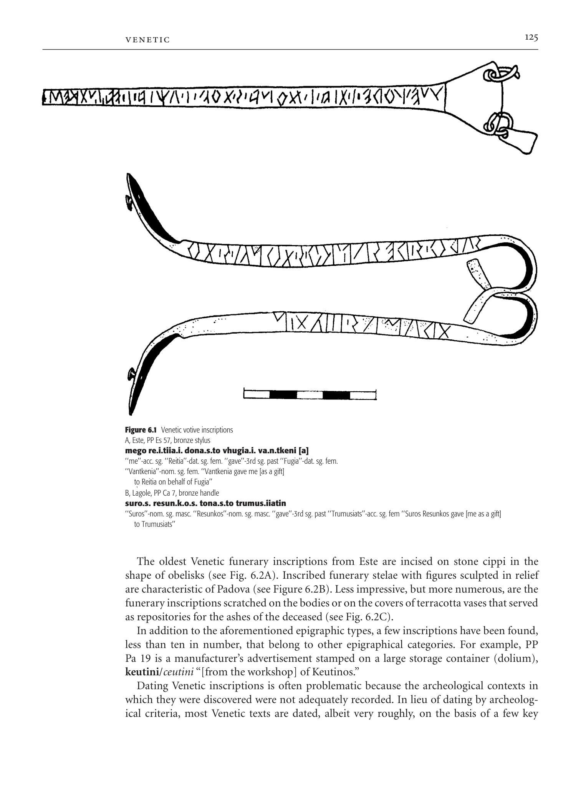
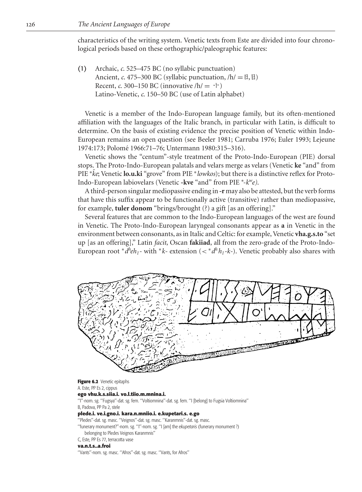
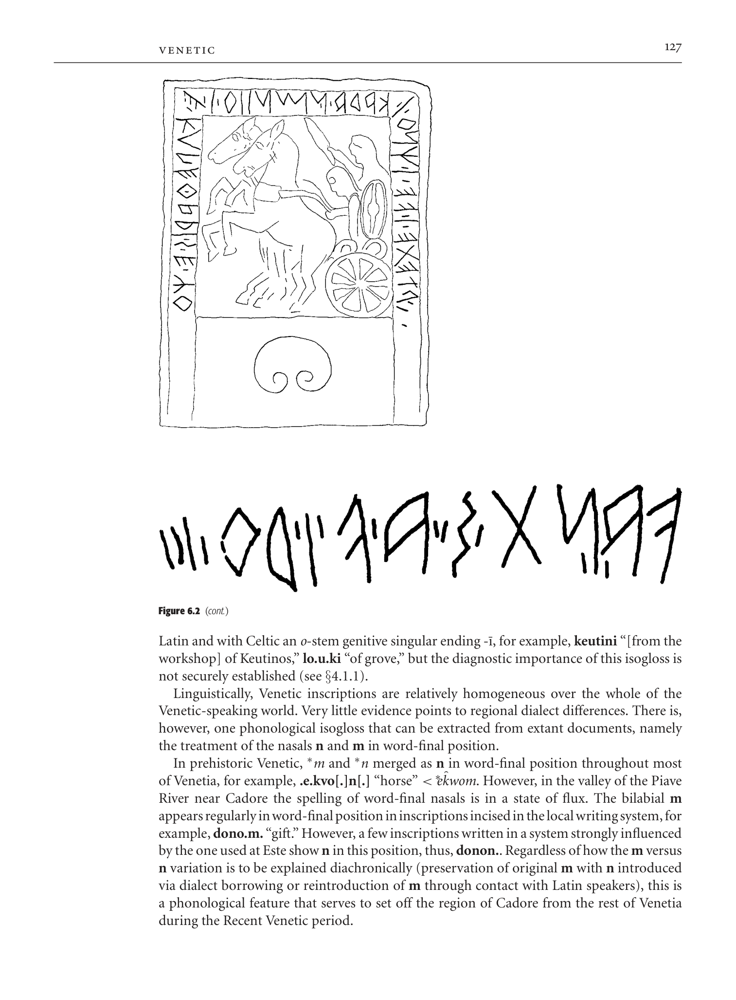
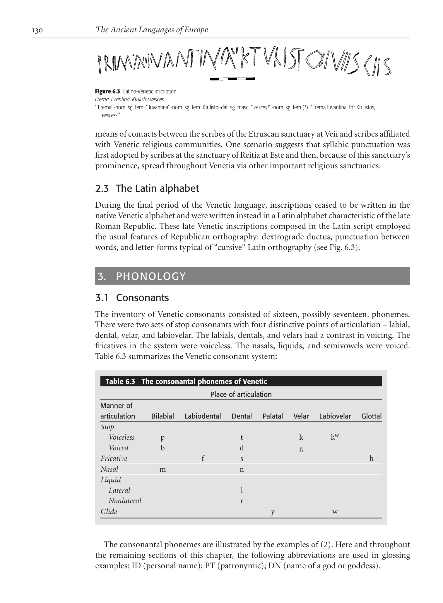

# Chapter 6: Venetic

<!-- pdf-page: 148 -->
chapter 6
Venetic
rex e. wallace
1.
HISTORICAL AND CULTURAL CONTEXTS
The Venetic language is attested by approximately 350 inscriptions that have come to light
in the territory of pre-Roman Venetia in northeastern Italy. The inscriptions cover a span of
nearly five hundred years, dating from the final quarter of the sixth century to the middle of
the first century BC. The spoken language did not survive Roman colonial expansion and
the spread of Latin into the northeastern portions of the Italian peninsula during the second
and first centuries BC. Venetic has no modern descendants.
Venetic inscriptions have been found at sites scattered throughout most of pre-Roman
Venetia as well as in territories lying to the north and east. The community of Adria, which
is situated in the Po River valley a few kilometers inland from the Adriatic Sea, marks the
southern limit. The rock inscriptions at W¨urmlach and the votive texts from Gurina, both
sites located in the valley of the Gail River in Austrian Carinthia, mark the northernmost
boundary. Venetic inscriptions have been uncovered as far east as Trieste at the head of the
Adriatic.
The most abundant source for Venetic inscriptions is the sanctuary of the goddess Reitia
at Baratella just east of Este. The religious sanctuary at L`agole di Calalzo in the valley of
the Piave River is another principal source, yielding nearly a quarter of the total number
of Venetic texts. Important inscriptions come also from Padova and Vicenza in the south,
from Montebelluna and Belluno located along the Piave River, from Oderzo, situated east
of the Piave at the head of the Adriatic Sea, and from Gurina in the valley of the Gail River.
According to Livy, the Veneti arrived in northeastern Italy as exiles from the Trojan War.
Livy’s account of the arrival of the Veneti is fictitious (he was a native of Venetic Padua), but
the date of the arrival of Venetic-speaking peoples implied by his tale is likely to be accurate.
Archeological evidence points to the development of an independent Iron Age culture in this
area shortly after the beginning of the first millennium BC (Fogolari 1988; Ridgway 1979).
The corpus of Venetic inscriptions consists almost exclusively of two epigraphic types,
votive inscriptions and funerary inscriptions, with each type accounting for approximately
one-half of the total number of inscriptions.
Votive texts were inscribed on objects such as bronze plaques, small replicas of alpha-
betic tablets, bronze writing implements, and the handles of bronze pails, all of which
were commissioned for dedication at religious sanctuaries. The following are typical votive
inscriptions (see Fig. 6.1). Inscriptions in the native Venetic alphabet are printed in boldface
type; those in the Latin alphabet are in italics. Inscriptions are cited from Pellegrini and
Prosdocimi 1967 = PP; Prosdocimi 1978 = P*.

<!-- pdf-page: 149 -->

A, Este, PP Es 57, bronze stylus
mego re.i.tiia.i. dona.s.to vhugia.i. va.n.tkeni [a]
‘‘me’’-acc. sg. ‘‘Reitia’’-dat. sg. fem. ‘‘gave’’-3rd sg. past ‘‘Fugia’’-dat. sg. fem.
‘‘Vantkenia’’-nom. sg. fem. ‘‘Vantkenia gave me [as a gift]
to Reitia on behalf of Fugia’’
B, L`agole, PP Ca 7, bronze handle
suro.s. resun.k.o.s. tona.s.to trumus.iiatin
‘‘Suros’’-nom. sg. masc. ‘‘Resunkos’’-nom. sg. masc. ‘‘gave’’-3rd sg. past ‘‘Trumusiats’’-acc. sg. fem ‘‘Suros Resunkos gave [me as a gift]
to Trumusiats’’
The oldest Venetic funerary inscriptions from Este are incised on stone cippi in the
shape of obelisks (see Fig. 6.2A). Inscribed funerary stelae with figures sculpted in relief
are characteristic of Padova (see Figure 6.2B). Less impressive, but more numerous, are the
funerary inscriptions scratched on the bodies or on the covers of terracotta vases that served
as repositories for the ashes of the deceased (see Fig. 6.2C).
In addition to the aforementioned epigraphic types, a few inscriptions have been found,
less than ten in number, that belong to other epigraphical categories. For example, PP
Pa 19 is a manufacturer’s advertisement stamped on a large storage container (dolium),
keutini/ceutini “[from the workshop] of Keutinos.”
Dating Venetic inscriptions is often problematic because the archeological contexts in
which they were discovered were not adequately recorded. In lieu of dating by archeolog-
ical criteria, most Venetic texts are dated, albeit very roughly, on the basis of a few key

<!-- pdf-page: 150 -->
characteristics of the writing system. Venetic texts from Este are divided into four chrono-
logical periods based on these orthographic/paleographic features:
(1)
Archaic, c. 525–475 BC (no syllabic punctuation)
Ancient, c. 475–300 BC (syllabic punctuation, /h/ = h, j)
Recent, c. 300–150 BC (innovative /h/ =
)
Latino-Venetic, c. 150–50 BC (use of Latin alphabet)
Venetic is a member of the Indo-European language family, but its often-mentioned
affiliation with the languages of the Italic branch, in particular with Latin, is difficult to
determine. On the basis of existing evidence the precise position of Venetic within Indo-
European remains an open question (see Beeler 1981; Carruba 1976; Euler 1993; Lejeune
1974:173; Polom´e 1966:71–76; Untermann 1980:315–316).
Venetic shows the “centum”-style treatment of the Proto-Indo-European (PIE) dorsal
stops. The Proto-Indo-European palatals and velars merge as velars (Venetic ke “and” from
PIE *[unclear-glyph:U+0002]
ke; Venetic lo.u.ki “grove” from PIE *lowkos); but there is a distinctive reflex for Proto-
Indo-European labiovelars (Venetic -kve “and” from PIE *-kwe).
A third-person singular mediopassive ending in -r may also be attested, but the verb forms
that have this suffix appear to be functionally active (transitive) rather than mediopassive,
for example, tuler donom “brings/brought (?) a gift [as an offering].”
Several features that are common to the Indo-European languages of the west are found
in Venetic. The Proto-Indo-European laryngeal consonants appear as a in Venetic in the
environment between consonants, as in Italic and Celtic: for example, Venetic vha.g.s.to “set
up [as an offering],” Latin facit, Oscan fakiiad, all from the zero-grade of the Proto-Indo-
European root *dheh₁- with *k- extension (< *dhh₁-k-). Venetic probably also shares with

A. Este, PP Es 2, cippus
ego vhu.k.s.siia.i. vo.l.tiio.m.mnina.i.
‘‘I’’-nom. sg. ‘‘Fugsya’’-dat. sg. fem. ‘‘Voltiomnina’’-dat. sg. fem. ‘‘I [belong] to Fugsia Voltiomnina’’
B, Padova, PP Pa 2, stele
plede.i. ve.i.gno.i. kara.n.mniio.i. e.kupetari.s. e.go
‘‘Pledes’’-dat. sg. masc. ‘‘Veignos’’-dat. sg. masc. ‘‘Karanmnis’’-dat. sg. masc.
‘‘funerary monument?’’-nom. sg. ‘‘I’’-nom. sg. ‘‘I [am] the ekupetaris (funerary monument ?)
belonging to Pledes Veignos Karanmnis’’
C, Este, PP Es 77, terracotta vase
va.n.t.s..a.froi
‘‘Vants’’-nom. sg. masc. ‘‘Afros’’-dat. sg. masc. ‘‘Vants, for Afros’’

<!-- pdf-page: 151 -->

Latin and with Celtic an o-stem genitive singular ending -¯ı, for example, keutini “[from the
workshop] of Keutinos,” lo.u.ki “of grove,” but the diagnostic importance of this isogloss is
not securely established (see §4.1.1).
Linguistically, Venetic inscriptions are relatively homogeneous over the whole of the
Venetic-speaking world. Very little evidence points to regional dialect differences. There is,
however, one phonological isogloss that can be extracted from extant documents, namely
the treatment of the nasals n and m in word-final position.
In prehistoric Venetic, *m and *n merged as n in word-final position throughout most
of Venetia, for example, .e.kvo[.]n[.] “horse” < *e
[unclear-glyph:U+0002]
kwom. However, in the valley of the Piave
River near Cadore the spelling of word-final nasals is in a state of flux. The bilabial m
appearsregularlyinword-finalpositionininscriptionsincisedinthelocalwritingsystem,for
example, dono.m. “gift.” However, a few inscriptions written in a system strongly influenced
by the one used at Este show n in this position, thus, donon.. Regardless of how the m versus
n variation is to be explained diachronically (preservation of original m with n introduced
via dialect borrowing or reintroduction of m through contact with Latin speakers), this is
a phonological feature that serves to set off the region of Cadore from the rest of Venetia
during the Recent Venetic period.

<!-- pdf-page: 152 -->
2.
WRITING SYSTEMS
2.1 The Venetic alphabet
Venetic texts prior to the Latino-Venetic period were written in an alphabetic script that
was introduced into southern Venetia from Etruria during the first half of the sixth century
BC (Cristofani 1979:388–389; Pandolfini and Prosdocimi 1990:244–289). The source of the
Venetic alphabet was a northern Etruscan script of the “reformed” type, namely one that
had eliminated the letters beta, gamma, delta, and omicron from the canonical list of letters
forming the teaching alphabet. The fact that the Etruscan alphabet introduced into Venetia
lacked these letters forced those responsible for adaptation to use the letters phi, khi, and
theta with a new function, namely as signs for the voiced stops /b/, /g/, and /d/ respectively.
At some point during the formative stages, the letter omicron was “reborrowed,” most likely
from a Greek source, and added to the very end of the alphabetic series, thus yielding the
earliest form of the native Venetic alphabet, the so-called alphabet princeps (see Table 6.1).
Local differences in the spelling of the dental stop phonemes /t/ and /d/ developed during
the latter half of the sixth century and the first decades of the fifth century as the alphabet
princeps spread throughout Venetia. Other communities altered the spelling of the alphabet
princeps in diverse ways, thus giving rise to the local writing traditions attested by Venetic
inscriptions (see Table 6.2).
During the Recent Venetic period (c. 300–150 BC) orthographic changes and stylistic de-
velopmentsthatalteredtheshapesofcertainlettersintroducedgreatergeographicaldiversity
into Venetic orthography.
One interesting diachronic change concerns the spelling of the labiodental phoneme
/f/. In the northern Etruscan writing system of the sixth century, /f/ was spelled by
Table 6.1
Venetic alphabet princeps (c. 550 BC)
A
a
E
e
W
v
z
h
h
d
i
i
k
k
l
l
m
n
p
x
s
r
r
ß
s
t
t
u
u
b
C
g
[
o
hW
spelling for /f/

<!-- pdf-page: 153 -->
Table 6.2
Spelling of Venetic dental stops
/t/
/d/
Este, L`agole
Padova
Vicenza
Cadore
means of a digraph vh jW. Venetic inherited and maintained this digraphic spelling in
most local writing traditions. However, at Cadore, after the sound /h/ was lost, the di-
graphic spelling of /f/ was simplified to heta
= /f/, for example,
= /futtos/
(PP Ca 15).
Inscriptions from Este dating to the period before 300 BC typically show the letter heta in
its older shapes h, j. Near the end of the fourth century h is stylistically streamlined to a form
without horizontal strokes
, a form that is all but identical to iota with syllabic punctuation
(see §2.2). For example, the personal name vhaba.i.tonia shows both .i. (iota with syllabic
punctuation) and h with precisely the same form
. The motivation for this stylistic change
is not clear, but the innovative form of h spread rapidly from Este throughout most of
Venetia during the first decades of the Recent Venetic period. Interestingly, this innovation
failed to gain a foothold at L`agole and at Idria in the Julian Alps. Even more remarkable is the
fact that at Idria the letter h j was used with the same functions that the letter
had in other
local writing systems: it represented the second part of i-diphthongs and the second part of
the digraphic spelling of the sound /f/, for example, la.i.v.na.i. =
(PP Is 1).
Venetic inscriptions were written scriptio continua, without spaces separating words,
thoughinmoderncopiesofthetextswordbreaksaregenerallyindicated.Themostcommon
direction of writing was sinistrograde, but dextrograde writing was not unusual. A few
Venetic inscriptions were written in boustrophedon style (“as the ox plows”), with every
other line alternating in direction. The precise layout and arrangement of inscriptions on
obelisks, stelae, and bronze plaques depended to some extent on the aesthetic considerations
of the sponsor or of the craftsman responsible for the work (see Fig. 6.2a and b).
2.2 Syllabic punctuation
The most striking feature of the Venetic orthography was “syllabic punctuation.” This was
a form of punctuation (indicated in transliteration by a period) in which all syllable-initial
vowels (word-initial vowels and vowels in hiatus), with the usual exception of i, and all
syllable-final consonants, including the final element of diphthongs, received a mark in
the form of a short vertical stroke or, less often, a point, for example,
,
. Punctuation
was generally placed both in front of and behind the letter, as noted above, but at L`agole
inscriptions are found in which punctuation is marked with a single point, usually placed
after the letter.
Syllabic punctuation is not found on the earliest Venetic inscriptions and thus must be a
secondary development postdating the borrowing of the alphabet from Etruscans. It appears
first on Venetic inscriptions from the fifth century and is an obligatory feature of the writing
system from this period onward. The probable source of syllabic punctuation is the scribal
school affiliated with the religious sanctuary of Apollo in the southern Etruscan city of Veii
(Wachter 1986). Syllabic punctuation is used on votive inscriptions at this sanctuary from
c.600toc.500BCanditislikelythatthisorthographicfeaturewasintroducedintoVenetiaby

<!-- pdf-page: 154 -->

Frema..I.vantina..Ktulistoi vesces
‘‘Frema’’-nom. sg. fem. ‘‘Iuvantina’’-nom. sg. fem. Ktulistoi-dat. sg. masc. ‘‘vesces?’’-nom. sg. fem.(?) ‘‘Frema Iuvantina, for Ktulistos,
vesces?’’
means of contacts between the scribes of the Etruscan sanctuary at Veii and scribes affiliated
with Venetic religious communities. One scenario suggests that syllabic punctuation was
first adopted by scribes at the sanctuary of Reitia at Este and then, because of this sanctuary’s
prominence, spread throughout Venetia via other important religious sanctuaries.
2.3 The Latin alphabet
During the final period of the Venetic language, inscriptions ceased to be written in the
native Venetic alphabet and were written instead in a Latin alphabet characteristic of the late
Roman Republic. These late Venetic inscriptions composed in the Latin script employed
the usual features of Republican orthography: dextrograde ductus, punctuation between
words, and letter-forms typical of “cursive” Latin orthography (see Fig. 6.3).
3.
PHONOLOGY
3.1 Consonants
The inventory of Venetic consonants consisted of sixteen, possibly seventeen, phonemes.
There were two sets of stop consonants with four distinctive points of articulation – labial,
dental, velar, and labiovelar. The labials, dentals, and velars had a contrast in voicing. The
fricatives in the system were voiceless. The nasals, liquids, and semivowels were voiced.
Table 6.3 summarizes the Venetic consonant system:
Table 6.3
The consonantal phonemes of Venetic
Place of articulation
Manner of
articulation
Bilabial
Labiodental
Dental
Palatal
Velar
Labiovelar
Glottal
Stop
Voiceless
p
t
k
kw
Voiced
b
d
g
Fricative
f
s
h
Nasal
m
n
Liquid
Lateral
l
Nonlateral
r
Glide
y
w
The consonantal phonemes are illustrated by the examples of (2). Here and throughout
the remaining sections of this chapter, the following abbreviations are used in glossing
examples: ID (personal name); PT (patronymic); DN (name of a god or goddess).

<!-- pdf-page: 155 -->
(2)
Venetic consonantal phonemes
per. (“by, through”?) /p/, te.r.monio.s. (“of the boundaries”) /t/, ke (“and”)
/k/, .e.kvo[.]n[.] (“horse”) /kw/
bu.k.ka (“Bukka” ID) /b/, de.i.vo.s. (“god”) /d/, .e.go (‘I’) /g/
vha.g.s.to (“he made”) /f/, donasan (“they gave”) /s/, ho.s.tihavo.s. (“Hostihavos”
ID) /h/
murtuvoi (“dead”) /m/, dono.m. (“gift”) /n/
lo.u.derobo.s. (“children”) /l/, re.i.tiia.n. (“Reitia” DN) /r/
iorobo.s. (“?”) /y/, vo.l.tiiomno.i. (“Voltiomnos” ID) /w/
In addition to these sounds, the letter san x (transcribed by ´s) probably represented a
phoneme distinct from /s/, most likely a palatal fricative /ˇs/ or a dental affricate /ts/ (Lejeune
1974:152–157). Unfortunately, neither the status nor the quality of the sound represented
by ´s can be securely determined.
3.2 Vowels
There were at least five vowels in the Venetic phonemic inventory, all differing in quality. The
writing system did not distinguish vowel quantity but it is possible that Venetic maintained
the distinction in length that it inherited from Proto-Indo-European. If so, the Venetic vowel
system had a five-way distinction in quality accompanied by a distinction in quantity at each
position.
(3)
Venetic vowel phonemes
vivoi (“living”) /¯ı/, tribus.iiate.i. (“Tribusiatis” epithet of Reitia) /i/
pater (“father”) /¯e/, te.r.monio.s. (“of the boundaries”) /e/
vhratere.i. (“brother”) /¯a/, vha.g.s.to (“he made”) /a/
dono.n. (“gift”) /¯o/, hostihavo.s (“Hostihavos” ID) /o/
.u. (“on behalf of”) /¯u/, klutiiari.s. (“Klutiaris” PT) /u/
The simple vowel phonemes listed above were complemented by six diphthongs:
(4)
de.i.vo.s. (“gods”) /ei/, te[.]u[.]ta (“community, nation”) /eu/
bro.i.joko.s. (“Broijokos” ID) /oi/, vhouge (“Fougonta” ID) /ou/
.a..i.su.n. (“god”) /ai/, augar (“?”) /au/
Of these the diphthong eu was subject to both geographical and chronological restrictions,
found in a handful of words from L`agole and also attested once at Padova. All of the
examples date to the Recent Venetic period or later, which makes interference via contact
with non-Venetic (Celtic?) speakers a likely culprit (see Lejeune 1974:110–111), though a
sound change ou > eu (geographically restricted?) cannot be ruled out of the picture.
3.3 Diachronic developments
The inventory of vowels remained relatively stable throughout the history of the lan-
guage. However, in the Latino-Venetic period, particularly in Venetic inscriptions writ-
ten in the Latin alphabet, there is evidence for sporadic monophthongization: ou > o /¯o/,
Toticinai (dat. sg. fem.), and ei > e /¯e/, Trumusiate (dat. sg. fem.). Since ou and ei de-
velop to /o/ and /e/ in nonurban Latin inscriptions, it is possible that these changes were
contact-induced.

<!-- pdf-page: 156 -->
ThemajorfeaturesofthediachronicphonologyofVeneticvowelsarethechangesaffecting
the suffix -yo-. In the prehistoric period *o was lost before word-final *s in the environment
*C-yos; thus, *Cyos > *Cis. Onomastic formations in *-yo-, for example, ve.n.noni.s. (nom.
sg. masc.) < *-nyos and klutiiari.s. (nom. sg. masc.) < *-ryos illustrate this development. In
the historic period, the i resulting from loss of *o in this suffix was also lost before word-final
-s,forexample,.e.ge.s.t.s.(nom.sg.masc.)< *egestis< *egestyos,compare.e.ge.s.tiio.i.(dat.
sg. masc.). This change is characteristic of the Recent Venetic and Latino-Venetic periods,
though it seems to have affected different areas of the Venetic-speaking world at different
times and with varying degrees of intensity (Lejeune 1974:111–125).
The inventory of consonantal phonemes was subject to reorganization as a result of
several phonological changes. The earliest documented change involved the loss of the
glottal fricative h. The sound disappeared in all Venetic-speaking areas between c. 350 and
300 BC.
By the beginning of the Latino-Venetic period the distinction between s and ´s also seems
to have been eliminated. In Venetic inscriptions written in the Latin alphabet, both sounds
are represented by means of Latin sigma, though it should be kept in mind that the lack of
an orthographic distinction here could be attributed to underdifferentiation on the part of
the Latin spelling system, Latin having a single sibilant sound in its phonemic inventory.
3.4 Accent
No direct evidence is available to determine the accentual system of Venetic. It is possible to
infer, however, from the syncope of short vowels in noninitial syllables, that Venetic had a
stress accent system with stress positioned on or near the initial syllable (Lejeune 1974:125;
Prosdocimi 1978:318).
4.
MORPHOLOGY
Venetic was, like all ancient Indo-European languages, an inflecting language. Inflectional
categories were specified by means of suffixes attached to nominal and verbal stems.
4.1 Nominal morphology
The Venetic nominal system, comprising nouns, adjectives, and pronominal forms possesses
the inflectional features of case, number, and grammatical gender. There are three genders
(masculine, feminine, and neuter) and two numbers (singular and plural). The total sum of
cases in the nominal system cannot be securely determined because the extant inscriptions
are so few, and because the inscriptions that are attested belong to such restricted epigraphic
types. As a result, there are serious gaps in all nominal paradigms. From the evidence at
hand, however, it is possible to recognize five cases: nominative, dative, accusative, genitive,
and ablative.
4.1.1
Nominal classes
Venetic adjectives and nouns are organized into inflectional classes based on the sound char-
acterizing the stem. There are five vocalic-stem classes: o-stems (ke.l.lo.s. nom. sg. masc.);
a-stems (vhugiia fem. sg. masc.); u-stems (.a..i.su.n. “god” acc. sg.); i-stems (trumusijatin
acc. sg. fem.); and e-stems (.e.nogene.s. nom. sg. masc. vs. .e.nogene.i. dat. sg.). The o-stems
split into subtypes: stems in -yo- had the vowel(s) of the nominative singular syncopated,

<!-- pdf-page: 157 -->
for example, yo-stem .a.kut.s. (nom. sg. masc.) < *akutis < *akutyos, compare .a.kutiio.i.
(dat. sg. masc.). Consonant-stems had three inflectional types: stop-stems (va.n.t.s. nom.
sg. masc.); r-stems (lemetore<.i.> dat. sg. masc.); and n-stems (mo.l.do nom. sg. masc.
with loss of final -n, compare pupone.i. dat. sg. masc.).
(5)
Venetic o-, yo-, and a-stems
o-stems
yo-stems
a-stems
nom. sg.
vo.l.tiiomno.s.
.a.kut.s.
vhrema
acc. sg.
.e.kvo[.]n[.]
—
re.i.tia.n.
dat. sg.
vo.l.tiiomno.i.
.a.kutiio.i.
vhu.k.s.siia.i.
abl. sg.
leno
vo.l.tio
—
gen. sg.
keutini
—
—
nom. pl.
—
—
—
acc. pl.
de.i.vo.s.
te.r.monio.s.
—
dat./abl. pl.
andeticobos
—
—
(6)
Venetic r-, n-, and stop-stems
r-stems
n-stems
stop-stems
nom. sg.
lemetor
molo
va.n.t.s.
acc. sg.
—
—
—
dat. sg.
lemetore.i.
pupone.i.
va.n.te.i.
abl. sg.
—
—
—
gen. sg.
—
—
—
nom. pl.
.a.nsores
—
—
acc. pl.
—
—
—
dat./abl. pl.
—
—
—
The evidence for the o-stem genitive singular -i rests on a small number of forms, almost
all of which are problematic in one way or another (see Untermann 1960, 1980). The least
controversial example of this case ending is stamped, along with a version in Latin, on the
body of a large storage container (PP Pa 19), namely keutini, Latin ceutini, “[from the
workshop] of Keutinos.” But since this inscription belongs to the latest Venetic period, it
may not be possible to rule out Latin influence here, even though the name appears to
be of local origin (Prosdocimi 1978:303). The only other reasonably good example of this
i-ending is lo.u.ki, which is found on an inscription from Padova (PP Pa 14; Prosdocimi
1979) as the object in a prepositional phrase .e.n.to.l.lo.u.ki “within the grove” (/entol/ for
*entos via assimilation ?). Unfortunately, this text and its interpretation are not at all clear
and so the analysis of lo.u.ki as a genitive must be viewed with some caution.
The publication of an inscription discovered near Oderzo (Prosdocimi 1984 *Od 7) offers
a more interesting entry in the discussion of o-stem genitives in Venetic. The text, which is
cited below, is incised on an oval-shaped funerary stone. Side (b) has a bipartite onomastic
phrase in the nominative case; side (a) is inscribed with a single word.
(7)
Oderzo, P *Od 7, oval-shaped funerary stone
(b) padros . pompeteguaios.
(a) kaialoiso
Side (a) has been interpreted as the genitive singular of an o-stem idionym kaialo-
(GambiariandColonna1988:138;Lejeune1989).Thisinterpretationmayprovetobecorrect

<!-- pdf-page: 158 -->
but it is not without difficulties because the Proto-Indo-European form of the o-stem geni-
tive singular is *-osyo, not -oiso (cf. the Latin o-stem genitive singulars ualesiosio popliosio).
A satisfactory explanation for the change in this putative Venetic ending *-osyo > -oiso has
not yet been offered (for suggestions, see Gambiari and Colonna 1988:138; Lejeune 1989:64;
Eska 1995:42–43). Interestingly, forms with what appear to be the same ending -oiso are
attested on Lepontic inscriptions (for which, see Gambiari and Colonna 1988; Eska 1995),
so that a final determination concerning Venetic kaialoiso must be made with due consid-
eration of the Celtic evidence (see now Eska and Wallace 1999).
4.1.2
Pronouns
Venetic inscriptions have thus far yielded only three pronominal forms. Two forms belong to
thefirst-personpronoun:ego(nom.sg.)andmego(acc.sg.).Thethirdformisapronominal
adjective sselboisselboi “himself” (dat. sg.), which is interesting not only because of its double
spelling of the sibilant and its reduplicative structure, but also because of its etymological
connection to forms found in Gothic silba and Old High German selbselbo.
4.2 Verbal morphology
Venetic verbs are inflected for tense (present, past), mood (indicative, imperative, and pos-
sibly subjunctive), voice (active, mediopassive), person (first, second, third), and number
(singular, plural).
4.2.1
Verbal classes
The number of inflectional classes for present tense verbs cannot be determined. The past
tense forms dona.s.to “gave,” donasan, presuppose a-stem inflection in the present (dona-).
atisteit “sets up” is customarily analyzed as a present tense form built from the zero-grade
of the PIE root *steh₂- “stand” + prefix ati-, but exactly how and with what morphemes the
stem -stei- has been formed is not at all clear (Lejeune 1974; Prosdocimi 1978; Untermann
1980).
Dona.s.to, donasan, and vha.g.s.to “offered” form their past tense stems by means of a
suffix-s-,andsomaybeparsedasdona-s-to,dona-s-an,vhag-s-to.Foretymologicalreasons
doto “gave” probably also qualifies as a past tense form. In most Proto-Indo-European
languages the past tense (aorist) of the verb “give” is a root formation and Venetic doto
appears to have a similar structure (do-to), compare Greek ´ed¯oke (3rd sg. act.), ´edoto (3rd
sg. mediopass.) “he gave” and Vedic ad¯at (3rd sg. act.), adita (3rd sg. mediopass.) “he gave.”
The tense of the verb forms tole.r., tule.r., tola.r. “brought” (?) is more difficult to gauge
because the suffixes -e/a-r and their functions are not clear. The fact that the verbs tole.r.,
tule.r., tola.r. are used in votive texts, contexts in which past tense forms are preferred to
presents by a significantly large margin, points to a past tense formation. However, neither
the suffixes -e/a-, nor the bare mediopassive ending (?) -r, are characteristic of past tense
formations.
4.2.2
Verb endings
The inflectional features of person, number, and voice are marked by “personal endings.”
The ending for active voice is attested by the third singular -t (atisteit). It is also likely that the
endings were split into sets based on tense stems, a set of primary endings for present and a
set of secondary endings for past (sg. pres. -t, sg. past -to, pl. past -an).

<!-- pdf-page: 159 -->
The third singular past ending -to looks like the secondary mediopassive ending found in
Greek-to andSanskrit -ta.TheVeneticendingmaysharewiththeseacommonetymological
source, but it is not clear that it has middle force in Venetic, and it seems to correspond
functionally to the active third plural ending -an.
(8)
Venetic verb forms: summary
present
atisteit (“sets up”)
past
dona.s.to (“gave”), donasan
vha.g.s.to (“made”), doto (“gave”)
tole.r. (?), tola.r.
tule.r.
4.2.3
Nonfinite verbals
The nonfinite forms of the verb system are even less well represented than the finite forms.
There is one possible example of a present participle in -nt-, horvionte, but its root form,
meaning, and case are not readily apparent. Other participle forms in -nt- appear in ono-
mastic formations, for example, vho.u.go.n.ta.i. (dat. sg. fem.), vho.u.go.n.te[.i.] (dat. sg.
masc.), both from the root vhoug- “flee,” compare Greek phe´ugont- “flees,” Latin fugient-
(3rd-i¯o). A Latino-Venetic inscription from the first century (PP Es 113) contains the only
possible example in Venetic of a deverbal adjective in -to-, poltos “distressed.”
4.3 Naming constructions
The basic form for personal names, of both women and men, is the individual name or
idionym (va.n.t.s. masc.; vhugia fem.). Additional names were commonly added to the
idionym to create two- or three-part onomastic phrases (suro.s. resu.n.ko.s. masc.; va.n.t.s.
mo.l.do.n.ke.o. kara.n.mn.s. masc.).
Some idionyms were originally substantives, and their derivational history is clear. For
example, the idionym vho.u.go.n.t- is in origin a participial formation in -ont- built to the
verb root vhoug- “flee” (see §4.2.3). *domator-, an idionym presupposed by the derived
name tomatoriio.i. dat. sg. masc. (initial t by distant assimilation?), is built from the stem
*doma- by means of an agent noun suffix -tor, compare Latin domitor “tamer” (< PIE
*domh₂- “tame”).
Feminine idionyms are generally secondary formations. Most are derived from mas-
culine o-stem idionyms by replacing the stem-vowel -o with -a, for example, masculine
vhugiio- gives feminine vhugiia. Feminines built to consonant-stems generally add -a to
the final consonant of the masculine stem, thus, masculine vhougont- provides feminine
vho.u.go.n.ta.
The forms making up the second and third members of Venetic personal names are de-
rived from idionyms by means of a limited set of suffixes belonging to either o-stem (for mas-
culine)ora-stem(forfeminine)inflection:forexample,-io:vho.u.go.n.tio.i.(dat.sg.masc.);
-ia: vhu.k.s.siia.i. (dat. sg. fem.); -ko: ossoko.s. (nom. sg. masc.); -ka: vho.u.go.n.tiiaka
(nom. sg. fem.); -(V)nko: .a.r.bo.n.ko.s. (nom. sg. masc.); -na: vho.u.go.n.tna (nom. sg.
fem.); and -kno: bo.i.kno.s. (nom. sg. masc.).
The familial relationships specified by the second and third members of personal name
constructions are the subject of serious disagreement. One of the interpretations currently
under debate regards the formations built with -io/-ia, -ko/-ka, -kno, etc. as patronymics

<!-- pdf-page: 160 -->
(Lejeune 1974:53–57). Thus, in bipartite constructions the second member of the phrase
specified the patronymic of the idionym, for example, va.n.t.s. mo.l.donke.o. “Vants, (son)
of Moldo,” while in tripartite constructions the third member referred to the grandfather
of the idionym, for example, ka.n.te.s. vo.t.te.i.iio.s. a.kut.s. “Kantes, (son) of Vottos, (the
son) of Akutos” (for a dissenting view, see Untermann 1980).
Feminine constructions having derived forms in -na as the second or third member indi-
cate a different type of relationship. The na-suffix is specialized to designate the gamonymic
(Lejeune 1974:60–63). Thus, in the phrase ne.r.ka lemeto.r.na, the second member spec-
ifies the “wife of Lemetor.” Three-member constructions, such as vhugiia.i. a.n.detina.i.
vhuginiia.i., indicate both gamonymic and patronymic, thus “Fugia, (wife) of Andetos,
(daughter) of Fugs.”
4.4 Compounds
Several nominal compounds are attested in the Venetic onomastic system. There are native
formations such as ho.s.ti-havo.s., volti-genei, vo.l.to-pariko.s., and eno-kleves, as well as
formations of Celtic origin, for example ve.r.ko.n.darna < *Wer-kon-daros. Outside of the
anthroponymic formations, however, the inscriptions give us only a single example of a
nominal compound, .ekvopetari[.]s. plus variants .e.kupetari.s., .e.p.petari.s., ecupetaris,
and equpetars.
This compound undoubtedly refers to a funerary monument of some type, perhaps for
members of an equestrian social class, suggested, of course, by the fact that the first element
is the stem .ekvo- “horse.” Nevertheless, this compound continues to generate considerable
discussion, not only because the second constituent pet- has yet to be given a convincing
etymological explanation, but also because it is not clear how the variants .ekvo-, e.p.-, etc.
are to be connected to one another, if at all (see Brewer 1985; Lejeune 1971a; Prosdocimi
1978:297–301; Pulgram 1976).
5.
SYNTAX
5.1 Case usage
In typical Indo-European fashion, the role of Venetic noun phrases (NPs) is denoted by
the inflectional feature case. The complements of the verb are marked by nominative case
for subject, accusative case for direct object, and dative case for indirect object and for
beneficiary. The genitive case is used to indicate possession. Accusative and ablative serve as
the cases to mark NPs as the objects of prepositions, the case of the object being determined
by the preposition: per “by, through (?)” and .u. “on behalf of” governed the accusative case;
.o.p “because of (?)” took the ablative.
5.2 Word order
Nothing definitive can be said about the underlying order of the major constituents (subject,
direct object, verb) in a Venetic sentence. Only votive inscriptions have finite verb forms, and
the order of the constituents attested for this sentential type may be the result of syntactic
processes such as topicalization.
At Este, iscrizioni parlanti (“speaking inscriptions”) are found with SVO (Subject–Verb–
Object), OVS, and OSV orders:

<!-- pdf-page: 161 -->
(9)
Este, PP Es 48, stylus
SVO: vhu.g.siia vo.l.tiio.n.mnin.(a) dona.s.to r(e).i.tiia.i. mego
“Fugsia”-nom. sg. fem. “Voltionmnina”-nom. sg. fem. “give”-3rd sg. past
“Reitia”-dat. sg. fem. “me”-1st pro. acc. sg.
“Fugsia, wife of Voltiomnos, gave me to Reitia”
Este, PP Es 54, stylus
OSV: mego (v)hugia dona.s.to re.i.tia.i.
“me”-1st pro. acc. sg. “Fugia”-nom. sg. fem. “give”-3rd sg. past “Reitia”-dat.
sg. fem.
“Fugia gave me to Reitia”
Este, PP Es 53, stylus
OVS: mego dona.s.to re.i.tiia.i. ner(.)ka lemeto.r.na
“me”-1st pro. acc. sg. “give”-3rd sg. past “Reitia”-dat. sg. fem. “Ner(i)ka”-nom.
sg. fem. “Lemetorna”-nom. sg. fem.
“Nerka, wife of Lemetor, gave me to Reitia”
Numerically, OVS is the most prominent, followed by OSV. These orders could be the result
of the movement of the direct object pronoun mego “me” into sentence-initial position,
which is a common position for the first-person pronoun in votive inscriptions of this type
in all of the languages of ancient Italy. As a result, it is quite possible that the basic order
at Este was SVO, which has the smallest actual number of attestations, and that the various
permutations of this basic order are the result of syntactic movement rules: SVO becomes
OSV by fronting the direct object, OVS by subject–verb inversion. This would bring the basic
order of the major constituents at Este in line with what is attested for votive inscriptions at
Lagol`e (Berman 1973).
The order of elements within a noun phrase depends upon the type of modifier present.
As far as can be determined, adjectives are generally positioned before the head noun
(te.r.mon.io.s. de.i.vo.s. “gods of the boundary”?). In onomastic noun phrases, however,
the patronymic and gamonymic modifiers followed the idionym (vhugiia.i. a.n.detina.i.
vhuginiia.i. “Fugia, (wife) of Andetos, (daughter) of Fugs”).
5.3 Agreement
The Venetic verb is marked with an inflectional ending which agrees with its subject in
number and person (third person unless a pronominal non-third-person subject is used);
thus, below, the verb doto takes the third singular ending -to, having the singular subject
vhrema.i.s.tina.
(10) Este, PP Es 41, stylus
vhrema.i.s.tina doto re.i.tiia.i.
“Fremaistina”-nom. sg. fem. “gave”-3rd sg. past act. “Reitia”-dat. sg. fem.
(a divinity)
“Fremaistina gave [me] to Reitia”
Agreement is also found in Venetic noun phrases. An attributive adjective agrees with its
head noun in case, number, and gender, for example, te.r.mon.io.s. de.i.vo.s. (masc. acc.
pl.) “gods of the boundary” (?). In onomastic phrases the modifiers of the idionym similarly
show agreement (see §5.2).

<!-- pdf-page: 162 -->
5.4 Coordination
Unfortunately, Venetic inscriptions do not attest any examples of sentential subordination.
Thereis,however,someevidenceforcoordination.Coordinatenounphrasesandcoordinate
sentences were linked by one of two conjunctions, kve or ke. The two forms appear to be
functionally similar but differ in terms of their syntax. kve is judged to be enclitic on
etymological grounds (vivoi oliialekve murtuvoi “for [him] living and oliiale (?) dead”);
ke may have been proclitic (.<a>.i.mo.i. ke lo.u.derobo.s. “for Aimos and [her] children”).
6.
LEXICON
Apart from personal names and theonyms the number of vocabulary items in the known
Venetic lexicon amounts to approximately fifty words. So few lexemes cannot provide an
adequate picture of the lexicon; this condition is only exacerbated by the fact that the
vocabulary is drawn basically from two text-types.
The “core” element of the Venetic lexicon consists of those words which have etymological
connections to lexemes in other Indo-European languages. The words listed in (11) have
solid Indo-European comparanda.
(11).
(11)
Venetic words with cognates in Indo-European
dono.m./dono.n. acc. sg. neut. “gift,” cf. Latin d¯onum, Oscan d´unum “gift”
doto “gave,” cf. Greek d´ıd¯osi “gives,” ´edoto “gave”
dona.s.to “presented (as a gift),” Latin d¯onat “presents (as a gift),” Oscan
duunated “presented (as a gift)”
vha.g.s.to “offered,” cf. Latin facit “makes,” Oscan fakiiad “makes”
<v>hratere.i. dat. sg. masc. “brother,” cf. Latin fr¯ater “brother,” Umbrian frater
nom. pl. masc. “brothers,” Greek phr´¯et¯er “brotherhood”
hostei dat. sg. masc. “host,” cf. Latin hostis “guest”
vivoi dat. sg. masc. “living,” cf. Latin u¯ıuus “alive,” Oscan bivus nom. pl. masc.
“alive”
murtuvoi dat. sg. masc. “dead,” cf. Latin mortuus “dead”
kve “and,” cf. Latin que “and,” Greek te “and”
In addition to vocabulary with sound Indo-European pedigrees, there is a handful of
words with probable etymological connections within Indo-European. For example, the
root vol-, found in the ablative form vo.l.tiio, is most likely connected with the Proto-Indo-
European root *wel- “wish, desire.” vo.l.tiio is probably an adjective built from a nomen
actionis *wl˚-ti- (Lejeune 1974:88). Similarly, the root mag-, which forms the base of the
Venetic noun magetlon, mag- plus instrumental suffix -(e)tlo-, referring in all likelihood to
an offering of some type, may be etymologically connected with the root attested in Latin
mactus “honored, adored.”
Venetic also has a small cache of vocabulary items that are without Indo-European ety-
mologies. An interesting example is the nominal form vesces (nom. sg.),ve.s.ke.´s. (nom. sg.),
ve.s.ketei (dat. sg.), which is used as either an attribute of, or an appositional noun phrase
referring to, masculine and feminine names. The meaning of this form remains unclear,
at least in part because it lacks an etymological connection within Indo-European (for an
attempt, see Lejeune 1973; contra, see Untermann 1980). The Venetic noun .a..i.su.n. (acc.
sg.), .a..i.su.s. (acc. pl.), which is assigned the meaning “god(s)” on the basis of comparison

<!-- pdf-page: 163 -->
with forms found in the Sabellian languages, e.g., Paelignian aisis “gods,” Marrucinian aisos,
etc., could be a western Indo-European formation. However, it is worth noting that the stem
ais- is also found in Etruscan (ais, eis “god”) and may well have been borrowed into Venetic
and Sabellian through contact with Etruscan speakers.
During the second and first centuries BC, Roman presence in territories beyond the Po
Valley intensified. One result of contact between Romans and the Veneti was the introduc-
tion of Latin loanwords into Venetic. The best examples are miles “soldier” and liber.tos.
“freedman.” It is also worth mentioning that the kinship term filia “daughter,” which is often
assumed to be a native Venetic word (Lejeune 1967), may actually be a loan from Latin.
The inscription on which this word appears is incised in a Latin alphabet and can thus be
dated to c. 150–50 BC. Admittedly, the status of this word in the Venetic lexicon cannot be
securely determined on the basis of this inscription alone, but the fact that a loan from Latin
cannot be ruled out serves as a reminder that the shift from Venetic to Latin as the language
of choice in this area was well underway at this time.
