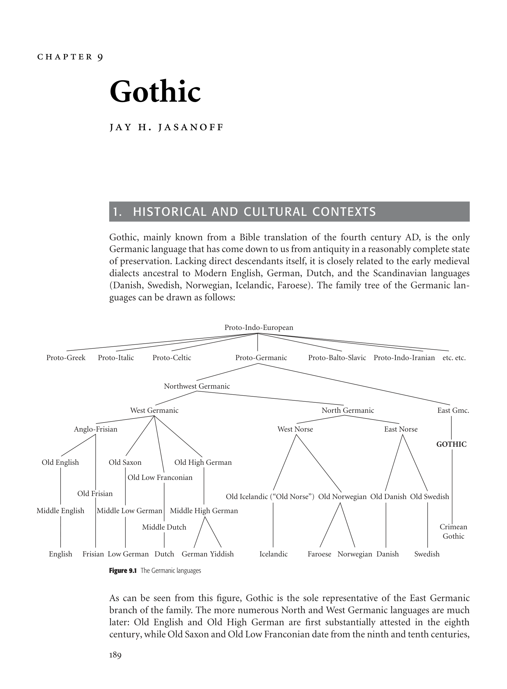

# Chapter 9: Gothic

<!-- pdf-page: 213 -->
chapter 9
Gothic
jay h. jasanoff
1.
HISTORICAL AND CULTURAL CONTEXTS
Gothic, mainly known from a Bible translation of the fourth century AD, is the only
Germanic language that has come down to us from antiquity in a reasonably complete state
of preservation. Lacking direct descendants itself, it is closely related to the early medieval
dialects ancestral to Modern English, German, Dutch, and the Scandinavian languages
(Danish, Swedish, Norwegian, Icelandic, Faroese). The family tree of the Germanic lan-
guages can be drawn as follows:
Proto-Indo-European
Proto-Germanic
Proto-Balto-Slavic
Proto-Indo-Iranian
etc. etc.
East Gmc.
GOTHIC
Crimean
Gothic
Swedish
Danish
Norwegian
Faroese
Icelandic
German Yiddish
Dutch
Middle Dutch
Low German
Frisian
English
Middle English
Middle Low German
Old Frisian
Old English
Old Saxon
Anglo-Frisian
Middle High German
Old Icelandic (“Old Norse”) Old Norwegian  Old Danish  Old Swedish
East Norse
North Germanic
West Norse
Old High German
Old Low Franconian
West Germanic
Northwest Germanic
Proto-Celtic
Proto-Italic
Proto-Greek

As can be seen from this figure, Gothic is the sole representative of the East Germanic
branch of the family. The more numerous North and West Germanic languages are much
later: Old English and Old High German are first substantially attested in the eighth
century, while Old Saxon and Old Low Franconian date from the ninth and tenth centuries,

<!-- pdf-page: 214 -->
respectively. The remaining “Old” Germanic languages – Old Frisian and the early Scan-
dinavian dialects – are essentially languages of the High Middle Ages, contemporary with
Middle English and Middle High German. It is thus not surprising that Gothic presents a
significantly more conservative appearance than its Germanic sister dialects. The only com-
parably archaic remains of an early Germanic language are the Early Northwest Germanic
inscriptions of the third, fourth, and fifth centuries, mostly from Denmark and written in
the indigenous runic alphabet (see Ch. 10). These, however, are only tantalizing fragments,
often deliberately obscure and topheavy with personal names.
Like other East Germanic tribes such as the Vandals, Burgundians, Gepids, and Heruls,
the Goths originally lived in the area of present-day Poland and eastern Germany; their own
traditions placed their earliest home in southern Sweden. Moving toward the mouth of the
Danube and the Black Sea shortly before 200 AD, they first began to make serious raids into
Roman territory in the middle of the third century. A hundred years later they had expanded
significantly eastwards and split into two sub-peoples: the Ostrogoths (“East Goths”), located
beyond the Dniester, who controlled most of the modern eastern Ukraine; and the Visigoths
(meaning unclear; not “West Goths”), who remained centered in the southwest of the
Ukraine and adjacent parts of Moldova and Rumania. It was in the latter area, toward the
middle of the fourth century, that the Arian Christian Wulfila (Ulfilas, Ulphilas) began
his ultimately successful effort to convert the Goths to Christianity. Wulfila (Gothic for
“Little Wolf”) was himself a native speaker of Gothic, and like many missionaries then and
now, recognized the value of translating the Christian scriptures into the language of his
intended converts. For this purpose he devised a Greek-based alphabet which remained
in use for as long as Gothic continued to be written (see §2). The surviving remains of
Wulfila’stranslation,amountingtosomewhatlessthanhalfoftheNewTestament,constitute
the great bulk of the Gothic corpus that has come down to us. Although the Christian
Gothic community over which Wulfila presided as bishop was still small at the time of his
death (c. 382), he laid the groundwork for future missionary work so effectively that Arian
Christianity soon became something like a national religion among the Germanic tribes of
eastern and central Europe. Yet, interestingly, the Bible seems never to have been translated
into Vandal, or Burgundian, or Herulian; evidently these East Germanic languages were
close enough to Gothic to make such endeavors unnecessary.
The career of the Goths in the upheavals that accompanied the end of the Western Roman
Empire was short but spectacular. The Visigoths, after sacking Rome in 410, established
themselves in southern Gaul and subsequently in Spain; here their kingdom lasted until the
Moorish conquest of 711, although all our documents from Visigothic Spain are in Latin.
TheOstrogoths,inthemeantime,establishedashort-livedkingdominItalyundertheirgreat
ruler Theodoric (492–526). Unlike their Spanish cousins, the “Italian” Goths appear to have
cultivated their fledgling literary tradition during their half-century of independence. It is to
sixth-century Italy, and not to Spain, that we owe our surviving manuscripts of the Gothic
Bible, including the famous 188-page Codex Argenteus now housed in Uppsala, Sweden.
Also of Italian origin are the few surviving non-Biblical Gothic monuments, which include a
fragmentary commentary on the Gospel of John (the so-called Skeireins or “explanation”),
a calendar, and two very short legal documents. Following the Byzantine reconquest of Italy
in 552, the Ostrogoths – and with them the Gothic language – disappear from history.
Or nearly disappear. By chance, a ninth- or tenth-century parchment (the Salzburg–
Vienna Alcuin Ms.) has come down to us containing two incomplete versions of the Gothic
alphabet and a few verses from the Gothic Bible, the latter accompanied by a mixed tran-
scription/ translation into Old High German. A curious feature of this document is that the
Gothic letters bear names, which closely resemble the names of the corresponding runes in
Old English and Old Norse. We can only guess at the specific circumstances under which

<!-- pdf-page: 215 -->
this information came to be recorded, but one thing seems certain: the descendants of the
Ostrogoths who withdrew over the Alps in the middle of the sixth century somehow man-
aged to retain a shadow of their linguistic and religious identity, albeit tenuously, for a period
of three or four hundred years.
Another Gothic “survival” turns up much later in a very different corner of Europe. In
the middle of the sixteenth century AD, Ogier van Busbecq, the ambassador of the emperor
Charles V to the court of the Turkish sultan Suleiman the Magnificent, recorded eighty-six
words of a language spoken in the sultan’s Crimean dominions that reminded him of his
native Flemish. Most of the lexical items written down by Busbecq are, in fact, obviously
Germanic,andone,ada“egg,”appearstoshowthedistinctivelyEastGermanicsoundchange
of *-jj- to -ddj- (see §3.6.4). It is usually held, therefore, that the Crimean Goths were the
last remnants of the Gothic population that once occupied the northern shore of the Black
Sea, and that their language was a direct descendant of the Gothic of the fourth century.
Unfortunately, by the time anyone thought to extend Busbecq’s vocabulary, Crimean Gothic
had disappeared.
2.
WRITING SYSTEMS
Apart from Busbecq’s word list and two or three problematic runic inscriptions, the entire
surviving Gothic corpus is written in Wulfila’s alphabet. Table 9.1 shows the letters as they
appear in our most important Gothic manuscript, the Codex Argenteus:
Table 9.1
Wulfila’s alphabet
Transcription
Numerical value
Name
l
a
1
aza
r
b
2
bercna
g
g
3
geuua
A
d
4
daaz
e
e
5
eyz
q
q
6
quertra
z
z
7
ezec
h
h
8
haal
v
p
9
thyth
i ï
i, ¨ı
10
iiz
r
k
20
chozma
l
l
30
laaz
m
m
40
manna
n
n
50
noicz
j
j
60
gaar
u
u
70
uraz
p
p
80
pertra
y
–
90
—
r
r
100
reda
s
s
200
sugil
t
t
300
tyz
w
w
400
uuinne
f
f
500
fe
c
x
600
enguz
x
#
700
uuaer
o
o
800
utal
!
—
900
—

<!-- pdf-page: 216 -->
The essentially Greek inspiration of this alphabet is shown by a number of features,
including:
1.
The form of the letters, about two-thirds of which closely resemble their uncial
Greek counterparts;
2.
The order of the letters and their associated numerical values;
3.
Greek orthographic practices, such as the (late) use of ai to stand for the monoph-
thong [[unclear-glyph:U+0002]], and the use of g to stand for the the velar nasal [Å] before velar consonants.
Wulfila did not, however, adhere slavishly to his Greek model. In several instances he
assigned altogether new values to Greek letters which would otherwise have been useless
in Gothic. This was the case with Greek F ([w]), which became Gothic q ([kw]), and
with Ψ (psi), which was probably the source of the Gothic character [unclear-glyph:U+0002]([hw]). Curiously,
Wulfila chose not to use the letters Φ (phi) and Θ (theta) to write the Gothic voiceless
fricatives [f] and [ϑ], respectively, despite the fact that Φ and Θ had precisely these values
in fourth-century Greek. Instead, he employed Φ to write Gothic [ϑ] and borrowed the
Latin letter F to write Gothic [f]. The new phonetic value of Φ led to its being moved to
the alphabetic position formerly occupied by Θ, while the new Latin-derived f took over
the place vacated by Φ. Other Latin letters that found their way into the Gothic alpha-
bet were r and h, as well as the variant of the s-character used in the Codex Argenteus
(other Gothic manuscripts show an s that is decidedly more Greek-looking). In addition,
several Gothic letters have been claimed to come from the runic alphabet – u, for exam-
ple, which Wulfila used in place of the Greek digraph OY. But the extent to which runic
writing played a role in the creation of the Gothic alphabet is highly controversial, not
least because many of the characters in the runic alphabet are very similar to their Latin
counterparts.
3.
PHONOLOGY
3.1 Consonants
The most highly structured part of the Gothic consonant system consists of a symmetrically
organized subsystem of twelve stops and fricatives (the term coronal is used here to denote
the dental, alveolar, and palatal regions):
(1)
Labial
Coronal
Velar
Labiovelar
Voiceless stops
/p/
/t/
/k/
/kw/ <q>
Voiceless fricatives
/f/
/π/
/h/
/hw/ <[unclear-glyph:U+0002]>
Voiced stops/Fricatives
/b/
/d/
/g/
/gw/ <gw>
Of the voiceless stops, the labial /p/ is infrequent outside obvious Greek and Latin loan-
words(e.g.,praufetus“prophet,”pund “pound”).Thelabiovelar/kw/,whichWulfila’snative-
speaker intuition led him to write with a single character (q), patterns phonotactically as a
single consonant (cf. qrammiπa “moistness,” with initial qr-) and is best analyzed as a unitary
phoneme. The voiceless fricatives include /h/ and /hw/ (likewise a unitary phoneme), which,
phonetically, were probably indistinguishable from the English sounds spelled h and wh – in
other words, simple glottal fricatives with no significant velar occlusion. (This was doubtless
also the case in syllable-final position, as, e.g., in sa[unclear-glyph:U+0002] “saw” [1st, 3rd sg.], nahts “night” and
sa[unclear-glyph:U+0002]t “saw” [2nd sg.]; the development of [h] to velar [x] in this position in German [cf.
Nacht, etc.] had no parallel in Gothic). Historically, however, they arose from older *x and

<!-- pdf-page: 217 -->
*xw, and structurally their place is still clearly with the oral fricatives /f/ and /π/, with which
they share important distributional properties.
The sounds denoted by the letters b, d, g(w) were voiced stops in some environments
and voiced fricatives in others. The stop reading is certain after consonants (e.g., windan
[windan] “wind,” siggwan [siŋgwan] “sing,” πaurban “need” [πɔrban]), and probable, at least
for b and d, in word-initial position (barn [b-] “child,” dags [d-] “day”). After vowels, single
b, d, and g are fricatives (e.g., sibun [si[unclear-glyph:U+0003]un] “seven,” bidjan [bi[unclear-glyph:U+0004]jan] “ask,” ligan [ligan]
“lie.” The stop /gw/ is found only after nasals (in words like siggwan) and in the geminate
combination -ggw- (e.g., bliggwan [-ggw-] “strike”); there is thus no fricative allophone [gw].
The remaining Gothic consonants include two sibilants and a standard complement of
nasals, liquids, and glides:
(2)
Labial
Coronal
Velar
Nasals
/m/
/n/
([Å] <g>)
Voiceless sibilant
/s/
Voiced sibilant
/z/
Liquids
/r/, /l/
Glides
/w/
/y/
The voiced sibilant /z/ is not found in word-initial position. The velar nasal [Å], spelled
<g> in imitation of Greek practice, is the automatic realization of /n/ before velar and
labiovelar stops. The graphic sequence -ggw- is thus ambiguous, representing both [-ggw-]
and [-Ågw-].
3.2 Vowels
Gothic has five short and seven long vowels, along with a single diphthong:
(3)
Short
Long
Front
Back
Front
Back
High
/i/ <i>
/u/ <u>
/i:/ <ei>
/u:/ <u>
High-mid
/e:/ <e>
/o:/ <o>
Low-mid
/[unclear-glyph:U+0002]/ <ai>
/ɔ/ <au>
/[unclear-glyph:U+0002]:/ <ai>
/ɔ:/ <au>
Low
/a/ <a>
/a:/ <a>
Diphthong
/iu/
3.2.1
Short vowels
Among the short vowels, /[unclear-glyph:U+0002]/ and /ɔ/ are only marginally phonemic, being in most cases mere
positional variants of underlying /i/ and /u/ before -r, -h, and -œ (breaking; see §3.4.2). But
both have a general distribution in foreign (i.e., Greek and Biblical Semitic) words (e.g.,
aikklesjo [[unclear-glyph:U+0002]kkle:sjo:] “church,” Greek [unclear-glyph:U+0003][unclear-glyph:U+0004][unclear-glyph:U+0004][unclear-glyph:U+0005][unclear-glyph:U+0006][unclear-glyph:U+0007][unclear-glyph:U+0008]	; apaustaulus [apɔstɔlus] “apostle,” Greek

[unclear-glyph:U+000B][unclear-glyph:U+0007][unclear-glyph:U+000C]
[unclear-glyph:U+0005]
[unclear-glyph:U+000E]), and /[unclear-glyph:U+0002]/ serves as the normal reduplication vowel in native Gothic preterites of
the type letan – lailot [l[unclear-glyph:U+0002]lo:t] “let,” aukan – aiauk [[unclear-glyph:U+0002]ɔ:k] “increase.” The use of the graphic
diphthong <ai> to stand for a front monophthong is based directly on late Greek practice;
the parallel use of <au> for [ɔ] is an innovation of Wulfila’s system.

<!-- pdf-page: 218 -->
3.2.2
Long vowels
The long vowels include the high-mid vowels /e:/ and /o:/, which lack short counterparts and
are unambiguously indicated by the letters e and o. The Gothic alphabet, however, does not
mark length as such. The long versions of [a], [[unclear-glyph:U+0002]],[ɔ], and [u] are not written differently from
their short equivalents; orthography alone gives no indication that πahta “(s)he thought,”
air “early,” hauhs “high,” and bruπs “young woman” represent [πa:hta], [[unclear-glyph:U+0002]:r], [hɔ:hs], and
[bru:πs], respectively, with distinctive length (note that the modern editorial practice of
writing πˆahta, a´ır, ha´uhs, and brˆuπs to indicate length, and writing ´ai and ´au for short /[unclear-glyph:U+0002]/
and /ɔ/, has no basis in ancient usage). The case of /i/ and /i:/, which are orthographically
distinguished as <i> and <ei> (cf. bitan “bitten” [nom. sg. neut.] vs. beitan “to bite” [inf.]),
is exceptional. Wulfila’s practice probably reflects a qualitative difference between the two
i-vowels, perhaps comparable to that between the relatively low [-i-] and the relatively high
[-i:-] of German bitten “ask” versus bieten “offer.”
The seven long vowels show considerable differences of patterning and distribution. Low
central /a:/ is rare, being confined in the native Gothic lexicon to etymological sequences
of *-anh-, which yielded [-˜¯ah-] in Proto-Germanic and subsequently lost its nasalization
in Gothic (cf. 3.4.4). The lower-mid vowels /[unclear-glyph:U+0002]:/ and /ɔ:/, on the other hand, are relatively
common; they represent the Proto-Germanic diphthongs *ai and *au and pattern as the
o-grade counterparts of /i/ and /u/. There is little basis for the view, rooted in a coincidence
of Germanic etymology and Greek orthography, that “long” ai and au actually represent
synchronic diphthongs in Wulfila’s Gothic. The only true Gothic diphthong is /iu/.
3.3 Accent
The position of the word accent is not overtly indicated. To judge from the other Germanic
languages, ordinary words were stressed on their first syllable. But in verbal compounds
consisting of a prefix and a lexical verb, the prefix was proclitic, so that the accent probably
remained on the initial syllable of the verbal root (cf. af-niman [af-n´ıman] “take away” and
and-niman [and-n´ıman] “receive,” with the accentuation of the simplex niman [n´ıman]
“take”). The accent pattern of the corresponding nominal compounds (e.g., anda-numts
“reception,” anda-numja “receiver”) is uncertain.
3.4 Synchronic phonological processes
A number of automatic phonological rules, reflecting historical sound changes, affect the
surface form of Gothic words.
3.4.1
Word-final devoicing
This rule applies exclusively to fricatives, converting [[unclear-glyph:U+0003]], [[unclear-glyph:U+0004]], [g], and [z] to [f], [π], [x], and
[s] in absolute-final position: for example, gaf < *gab, third singular preterite of giban “give”;
baπ < *bad, third singular preterite of bidjan “ask”; maujos < *maujoz, genitive singular of
mawi “girl.” The devoicing of [--[unclear-glyph:U+0004]] to [x] is not noted orthographically (cf. mag [max] “is
able”), presumably because the [--[unclear-glyph:U+0004]] : [x] contrast was not phonemic and there was no letter
in ordinary use to denote the voiceless velar fricative (Wulfila’s use of the letter x is virtually
confined to the divine name Xristus “Christ”). No devoicing is found in forms of the type
band “bound” and waurd “word,” showing that the final consonant was a stop in these
environments.

<!-- pdf-page: 219 -->
3.4.2
Breaking
This is the traditional name (German Brechung) for the regular lowering of synchronically
underlying *i and *u to ai [[unclear-glyph:U+0002]] and au [ɔ] before -r, -h, and -[unclear-glyph:U+0002]:, for example, wairπan
“become,” first singular preterite warπ, first plural preterite waurπum, participle waurπans,
paralleling the regular pattern seen in hilpan “help” halp, hulpum, hulpans.
3.4.3
Hiatus lowering
This is the regular but comparatively rare process by which long high and high-mid vowels
were replaced by their low-mid counterparts when immediately followed by another vowel:
as in saian [s[unclear-glyph:U+0002]:an] < *sean [se:an] “sow”; stauida [stɔ:i[unclear-glyph:U+0004]a] < *stoida [sto:i[unclear-glyph:U+0004]a], third singular
preterite of stojan “judge.”
3.4.4
Loss of -n- before -h- with compensatory lengthening
This process is found not only after -a- (cf. πahta < *πanhta; see §3.2.2), but also after -u-
(cf.πuhta < *πunhta,thirdsingularpreteriteof πugkjan“seem”)and-i-(cf.πeihan < *πinhan
“prosper”). The nasalized vowels that originally resulted from *-Vnh- sequences fell together
with non-nasal /a:/, /u:/, and /i:/ in Wulfila’s language.
3.5 Morphophonemic processes
Phonological processes that have been morphologized, i.e., restricted to specific morphemes
and/or morphological categories, include the following:
3.5.1
Grammatical change
Grammatical change (German grammatischer Wechsel) is the traditional name for the al-
ternation of word-internal voiceless and voiced fricatives (or stops derived from fricatives)
under conditions originally governed by Verner’s Law (see §3.6.2): for example, hafjan “lift”
versus uf-haban “lift up”; fra-wairπan “perish” versus fra-wardjan “destroy”; third singular
aih [[unclear-glyph:U+0002]:h] “has” versus third plural aigun [[unclear-glyph:U+0002]:--[unclear-glyph:U+0004]un]. Voiced : voiceless pairs of this type are much
rarer in Gothic than in the other early Germanic languages. But Gothic has a number of
derivational suffixes which vary according to Thurneysen’s Law: a voiced fricative appears
when the preceding syllable begins with a voiceless consonant, and vice versa: for example
auπida“desert”versusdiupiπa“depth”;wulπags“glorious”versusstainahs“stony”;fraistubni
“temptation” versus waldufni “power”.
3.5.2
Ablaut
Ablaut,orapophony,isthesystemofmorphologicallygovernedvowelalternationsinherited
by Gothic and the other Germanic languages from Proto-Indo-European (PIE). The clearest
examples are seen in the formation of the principal parts of strong verbs, as in wairπan
(< PIE *wert-; “e-grade”), warπ (< PIE *wort-; “o-grade”), waurπum (< PIE *wr[unclear-glyph:U+0005]t-; “zero-
grade”), waurπans (likewise < PIE *wr[unclear-glyph:U+0005]t-). But ablaut changes are also associated with other
derivational and inflectional processes, ranging from the inflection of n-stem nouns (e.g.,
acc. sg. auhsan “ox” < pre-Germanic *ukson-; dat. sg. auhsin < *uksen-; gen. pl. auhsne <
*uksn-) to the formation of causatives from underlying strong verbs (e.g., frawairπan →
frawardjan, sitan “sit” →satjan “set”).

<!-- pdf-page: 220 -->
3.5.3
Sievers’ Law
Sievers’ Law describes the regulated distribution – observable in both ja-stem nouns and
adjectives, and in verbs with infinitives in -jan – of -ji- after “light” sequences (i.e., sequences
of the form *- ˘VC-) and -ei- [i:] after “heavy” sequences (i.e., sequences of the form *- ¯VC-
and *-VCC-): e.g., harjis “army” versus hairdeis “shepherd”; third singular satjiπ “sets”
versus frawardeiπ “destroys.” In its Proto-Indo-European form, Sievers’ Law mandated
the realization of underlying *-y- as *-iy- after heavy sequences; the -ei- of hairdeis and
frawardeiπ is the contraction product of pre-Germanic *-iji-.
3.5.4
Dental substitution
Suffix-initial -d- is replaced by -s- after an immediately preceding root-final -t- or -d-, or
by -t- after any other root-final obstruent. In the former case the root-final -t- or -d-
itself becomes -s-; in the latter case the root-final obstruent is represented by the corre-
sponding voiceless fricative: for example, witan “know,” preterite wissa; πaurban “need,”
preterite πaurfta; magan “be able,” preterite mahta. Contrast the “normal” pattern seen in
munan “think,” preterite munda; satjan, preterite satida; etc. These alternations reflect the
special treatment of dental + dental clusters in Proto-Indo-European, and the failure of
voiceless stops to undergo the Germanic Consonant Shift (see §3.6.1) when preceded by an
obstruent.
3.5.5
Clitic-related effects
Word-final-susuallybecomes-z-beforevowel-initialenclitics,especially-(u)h“and”andthe
relativizing particle -ei: e.g., [unclear-glyph:U+0002]azuh “each” < nominative singular masculine [unclear-glyph:U+0002]as “who” +
-uh (cf. Lat. quisque), where the final -s is a devoiced etymological *-z; and πizei “whose” <
genitive singular masculine πis “his” + -ei, where the -z is analogical. Similar effects are
seen in the behavior of prefixes; compare the variant forms in us-hafjan “lift up,” uz-anan
“breatheout,”andur-reisan“arise.”Thefinal-h of-(u)hsometimesassimilatestoafollowing
-π-, as in wesunuππan (= wesun-uh-πan) “but there were,” sumaiππan (= sumai-h-πan) “but
some,” etc.
3.6 Diachronic developments
3.6.1
Grimm’s Law
As a Germanic language, Gothic shared in the characteristic phonological developments
that set Germanic apart from the rest of the Indo-European family. The most conspicuous
sound change in the prehistory of Germanic was Grimm’s Law or the Germanic Consonant
Shift, which took place in three steps:
(4)
A. PIE voiceless stops *p, *t, *[unclear-glyph:U+0005]
k (+ *k),1 *kw became the voiceless fricatives *f ,
*π, *x (> h), *xw(> *hw) when not preceded by an obstruent
B. PIE voiced stops *b (rare), *d, *[unclear-glyph:U+0005]g (+ *g), *g w became the voiceless stops *p,
*t, *k, *kw
C. PIE voiced aspirated stops
*bh,
*dh,
*[unclear-glyph:U+0005]g h (+ *g h),
*g wh became the voiced
fricatives *[unclear-glyph:U+0003], *[unclear-glyph:U+0004], *--[unclear-glyph:U+0004], *--[unclear-glyph:U+0004]w, which further developed to voiced stops in some envi-
ronments

<!-- pdf-page: 221 -->
Examples are legion: compare (A) Go. fotus (Eng. foot), πrija (Eng. three), haurn (Eng.
horn), [unclear-glyph:U+0002]ata (Eng. what) beside Lat. p¯es, tr¯es, cornu, quod; (B) Go. tunπus (Eng. tooth),
kaurn (Eng. corn), qius (Eng. quick) beside Lat. d¯ens, gr¯anum, u¯ıuus (< *gw¯ıwos); (C) Go.
beitan (Eng. bite), (ga)-daursan (Eng. dare), gaits (Eng. goat), warmjan (Eng. warm, with
w- < *--[unclear-glyph:U+0004]w-) beside Skt. bhid- “split,” dhr[unclear-glyph:U+0005]s.- “be bold,” Lat. haedus (< *x- < *kh- < *[unclear-glyph:U+0005]g h-), Skt.
gharm´a- (< *g wh-) “hot drink.”
The voiceless stops, however, remained unchanged after *s (cf. Go. steigan “climb” beside
Gk. [unclear-glyph:U+0007][unclear-glyph:U+000C][unclear-glyph:U+0002][unclear-glyph:U+0008][unclear-glyph:U+000F][unclear-glyph:U+0010] (ste´ıkh¯o) “id.”) or when preceded by another stop (cf. Go. -hafts “having, having
taken” beside Lat. captus “taken”).
3.6.2
Verner’s Law
The Germanic Consonant Shift applied both word-initially and word-internally (Proto-
Indo-European word-final stops were lost). In word-internal position, however, the voice-
less fricatives produced by the shift, together with the inherited sibilant fricative *s, were
potentially subject to Verner’s Law. The effect of this rule was to convert *f , *π, *x, *xw, and
*s to the corresponding voiced fricatives *[unclear-glyph:U+0003], *[unclear-glyph:U+0004], *--[unclear-glyph:U+0004], *--[unclear-glyph:U+0004]w, and *z when the preceding vowel
did not bear the pre-Germanic (equivalent to the Proto-Indo-European) movable accent.
Thus, the Proto-Indo-European word for “father,” which was accented on the second syllable
(cf. Skt. pit´ar-, Gk.
	[unclear-glyph:U+000C][unclear-glyph:U+0006][unclear-glyph:U+0011] [unclear-glyph:U+0012] (pat´¯er)), gave *faπ´¯er by Grimm’s Law and *fa[unclear-glyph:U+0004]´¯er (> Go. fadar) by
Verner’s Law, while the word for “brother,” which had initial accent (cf. Skt. bhr´¯atar-, Gk.
[unclear-glyph:U+0013][unclear-glyph:U+0012] ´¯	[unclear-glyph:U+000C][unclear-glyph:U+0006][unclear-glyph:U+0012] (phr´¯at¯er)), became *[unclear-glyph:U+0003]r´¯oπ¯er by Grimm’s Law and retained its voiceless *-π- in Gothic
(broπar). Following the operation of Verner’s Law, the pre-Germanic system of “free” ac-
cent was replaced by the attested Germanic system of fixed initial stress (see §3.3), so that
the original condition for the voicing of word-internal fricatives can no longer be detected
synchronically in Gothic or in any other Germanic language.
3.6.3
Further obstruent developments
The obstruent system that emerged from the operation of Grimm’s and Verner’s Laws was
subject to further changes within the Germanic period, notably the following:
1.
The weakening of *x and *xw to *h and *hw.
2.
The “strengthening” of *[unclear-glyph:U+0003], *[unclear-glyph:U+0004], *--[unclear-glyph:U+0004], and *--[unclear-glyph:U+0004]w to stops after nasals and, at least in the
case of *[unclear-glyph:U+0003] and *[unclear-glyph:U+0004], word-initially.
3.
Thedevelopmentofthefricative *--[unclear-glyph:U+0004]w to *w inmostremainingenvironments(though
*--[unclear-glyph:U+0004]w was dissimilated to *--[unclear-glyph:U+0004] before a following *u; note the Gothic pair magus “boy”
< *ma--[unclear-glyph:U+0004]wuz vs. mawi “girl” < *ma--[unclear-glyph:U+0004]w¯ı).
4.
The change of *s to *z, regardless of the original position of the accent, in absolute
final position.
The resulting Proto-Germanic system was hardly modified in Gothic at all, save by the
introduction of final devoicing and by the substitution of [b], [d], [g] for [--b], [--d], [--[unclear-glyph:U+0004]] after
non-nasal consonants (waurd, etc.; see §3.4.1).
3.6.4
Sonorant developments
The Proto-Indo-European consonant system also included the liquids *r and *l, the nasals
*m and *n (the latter with a velar allophone [Å]), the glides *y and *w, and the three
so-called laryngeals *h₁, *h₂, and *h₃, of uncertain phonetic value. The liquids were pre-
served unchanged in Germanic and Gothic. This was also true of the nasals except before *h

<!-- pdf-page: 222 -->
and in absolute final position, where *-m and *-n fell together and eventually disappeared.
But the fate of the glides *y and *w was more complicated. Word-initially and postconso-
nantally, *y and *w were preserved as Germanic *j and *w, respectively (cf. Go. juk [Eng.
yoke], winds [Eng. wind] beside Lat. iugum, uentus). After vowels, however, there were two
basic treatments:
1.
Germanic *-Ø- and *-w-, respectively (cf. Go. bau-an “dwell” < *bh¯u-ye/o-; aiws
“age, time” beside Lat. aeuom). A specifically Gothic change subsequently deleted
*-w- after the rounded vowel o (cf. stojan “judge” < *st¯owjan, pret. stauida < *st¯oida
< *st¯owida).
2.
Germanic *-jj- and *-ww-, respectively, whence Gothic -ddj- and -ggw-, respectively:
e.g.,Gmc. *twajj¯on“oftwo”(gen.),Go.twaddje(cf.Skt.dvayoh. “id.”);Gmc. *trewwaz
“true,” Go. triggws (cf. Old Prussian druw¯ıt “believe”). The seemingly irregular
doubling or Versch¨arfung of *-y- and *-w- to *-jj- and *-ww- is now thought to
reflect the original presence of a Proto-Indo-European laryngeal after the glide.
Apart from their role in Versch¨arfung, laryngeals had much the same treatment in Ger-
manic as in the other Indo-European languages; their typical fate was to disappear with
compensatory lengthening of an immediately preceding vocalic element in the same sylla-
ble. The vocalic element in question might be a vowel proper (*e, *a, etc.) or a syllabic liquid
(*r[unclear-glyph:U+0005], *l[unclear-glyph:U+0005]) or nasal (*m[unclear-glyph:U+0005], *n[unclear-glyph:U+0005]) – the syllabic liquids or nasals being non-contrastive sounds which
served in Proto-Indo-European as allophones of consonantal *r, *l, *m, *n.
3.6.5
Vocalic developments
3.6.5.1
Proto-Indo-European
Following the loss of laryngeals, the Proto-Indo-European dialect ancestral to Germanic
had five short and five long vowels:
(5)
Short
Long
Front
Back
Front
Back
High
i
u
¯ı
¯u
Mid
e
o
¯e
¯o
Low
a
¯a
(It is no longer customary to include a central mid vowel *ə in the inventory of Proto-
Indo-European short vowels. The sound denoted by this symbol in older handbooks was a
subphonemic support vowel; cf., e.g., *ph₂t ´¯er [pəh₂t´e:r], which was eventually phonologized
as /a/ in most Indo-European languages.) In addition, there were four short and four long
syllabic liquids and nasals:
(6)
r[unclear-glyph:U+0005], l[unclear-glyph:U+0005], m[unclear-glyph:U+0005], n[unclear-glyph:U+0005]
¯r[unclear-glyph:U+0005], ¯l[unclear-glyph:U+0005], ¯m[unclear-glyph:U+0005], ¯n[unclear-glyph:U+0005]
and six short and six long i- and u-diphthongs:
(7)
ei
ai
oi
¯ei
¯ai
¯oi
eu
au
ou
¯eu
¯au
¯ou
This is the inventory of syllabic nuclei that must be taken as the point of departure for the
history of the Proto-Indo-European vowel system in Germanic.
3.6.5.2
Proto-Germanic
The number of vowels and vowel-like elements was greatly reduced over the course
of the three millennia or so that passed between dialectal Proto-Indo-European and

<!-- pdf-page: 223 -->
Proto-Germanic. An early development was the shortening of the long diphthongs and
the long syllabic liquids and nasals, which merged with their short counterparts; syl-
labic liquids and nasals were subsequently eliminated altogether by the change of *r[unclear-glyph:U+0005],
*l[unclear-glyph:U+0005], *m[unclear-glyph:U+0005] , *n[unclear-glyph:U+0005] to the vowel + consonant sequences *ur, *ul, *um, *un: e.g., Gothic fulls “full”
< *fulnaz < *p¯l[unclear-glyph:U+0005]n´os < *pl[unclear-glyph:U+0005]h₁-n´o-s; hund “100” < *hundan < *[unclear-glyph:U+0005]
km[unclear-glyph:U+0005] t´om; haurn “horn” < *hurnan
< *[unclear-glyph:U+0005]
kr[unclear-glyph:U+0005]n´om. Among the vowels proper, the *a : *o distinction was lost in both the long and
short subsystems, the longs merging as *¯o (cf. Go. broπar, bloma “flower” beside Lat. fr¯ater,
fl¯os) and the shorts as *a (cf. Go. akrs “field,” ahtau “eight” beside Lat. ager, oct¯o). (It is
interesting to note that a similar confusion of a- and o-vowels occurred in the neighboring
Indo-European languages, Celtic and Balto-Slavic.) There was also a change of short *e to *i
in certain environments: for example, before nasal clusters (*-nt-, *-mb-, etc.), and before an
*i in the next syllable (cf. Old High German bintan, Gothic bindan “bind” < *bh´endhonom;
OHG ist, Go. ist “is” < *´esti; but OHG geban, Go. giban “give” < *g h´ebhonom; forms are
cited from Old High German to show the still recoverable difference between Germanic *e
and *i, which was effaced entirely in Gothic). These developments were paralleled in the
treatment of the diphthongs: *ai and *oi merged as *ai; *au and *ou merged as *au; *ei gave
*¯ı (i.e., /ii/, spelled <ei>; cf. Go. steigan [OHG stıgan] beside Gk. [unclear-glyph:U+0007][unclear-glyph:U+000C][unclear-glyph:U+0002][unclear-glyph:U+0008][unclear-glyph:U+000F][unclear-glyph:U+0010] (ste´ık ¯h¯o)); and
*eu gave the new diphthong *iu before an *i in the following syllable (cf. OHG 3rd sg. biu-
tit “offers” < Gmc. *biudiπ, but inf. beotan, biotan < Gmc. *beudan). Within the long vowel
subsystem, *¯e was phonetically lowered to approximately the sound heard in English sad (i.e.,
[¯æ]), while the phonetic place of the old *¯e was taken over by a new vowel *¯e2, of obscure
origin.
The result of the foregoing, in the end, was the vowel system reconstructible for Proto-
Germanic:
(8)
Proto-Germanic monophthongs
Short
Long
Front
Back
Front
Back
High
i
u
¯ı
¯u
Mid
e
[o]
¯e2
¯o
Low
a
¯æ
Some authorities set up a secondary short *o for Proto-Germanic, but there is no evidence for
such a vowel in the prehistory of Gothic, and it can equally well be explained as a common
innovation of the North and West Germanic dialects. The low vowel *¯æ is commonly also
written *¯e or *¯e1.
(9)
Proto-Germanic diphthongs
ai
au
eu
iu
In addition, there were also nasalized *¯a N, *¯ıN, *¯uN, and probably – at least in final syllables –
other nasalized vowels as well. All were purely allophonic.
3.6.5.3
Gothic
The main Gothic innovations in the treatment of the Germanic short vowels were the
complete merger of *e and *i as i (cf. Go. giban beside OHG geban, etc.) and the subsequent

<!-- pdf-page: 224 -->
creation of new low-mid vowels by “breaking” before -r, -h, and -[unclear-glyph:U+0002] (see §3.4.2). The long
vowels were somewhat more extensively restructured, with *¯æ and *¯e2 falling together as the
high-mid vowel written e (cf. Go. her “here” [OHG her, hiar] < *he2r, identical in vocalism
with first plural preterite gebum “we gave” [OHG g¯abum] < *g ¯æbum), and a new ¯a joining
the system through the denasalization of *¯a N. Here as in the shorts, the system was expanded
by the addition of new low-mid vowels – this time through the monophthongization of *ai
and *au (cf. §3.4.2). As a byproduct of the general shift of short *e to *i, the two remaining
diphthongs, *eu and *iu, fell together as *iu in Gothic (cf. -biudan, -biudiπbeside OHG biotan,
biutit).
Gothic shows major changes vis-`a-vis Proto-Germanic in its treatment of final syl-
lables. Proto-Germanic generally preserved the vowels of late Proto-Indo-European final
syllables intact; thus, for example, the o-stem nominative singular in *-os was still *-az
in Proto-Germanic (cf. Runic Norse -aR; and see Ch. 10, §2.1), and the first singular
present in *-¯o (< *-oh₂) remained as *-¯o. In addition to normal long and short endings,
however, Proto-Germanic also had final syllables with hyperlong or “trimoric” long vow-
els; these mainly arose from prehistoric sequences of two vowels in hiatus (e.g., PGmc.
*gal¯ık˜¯o “similarly,” with trimoric or “circumflex” *-˜¯o from PIE *-o-h₂ad). Gothic is often
said to have undergone a “law of three moras” or Dreimorengesetz, under which short vow-
els were lost (cf. nom. sg. dags “day” < *dagaz) in final syllables, normal (bimoric) long
vowels were shortened (cf. 1st sg. nima “I take”), and trimoric long vowels became bimoric
longs (cf. galeiko). But this generalization is not completely valid: *-u(-) was never lost
at all (cf. sunus (< *-uz) “son,” faihu (< *-u) “cattle”), and even bimoric long vowels re-
tained their length before *-z (acc. pl. gibos “gifts” < *-¯oz < late PIE *-¯as < *-ah₂(m)s).
As in every other Germanic language, the Auslautsgesetze of Gothic still present many
problems.
4.
MORPHOLOGY
4.1 Nominal morphology
From a morphological point of view, Gothic is an averagely conservative older Indo-
European language, similar in overall complexity to, e.g., Old Church Slavonic. Nouns
come in three genders (masculine, feminine, neuter) and distinguish five cases (nomina-
tive, vocative, genitive, dative, accusative). There are singular and plural forms, but no dual
(though the dual survives in personal pronouns; see §4.1.4). A number of features familiar
from other Indo-European languages, such as the identity of the nominative and accusative
cases in the neuter, and the identity of the nominative and vocative in the plural, appear in
Gothic as well.
4.1.1
Nominal case development
Proto-Indo-Europeanhadeightcases:nominative,accusative,instrumental,dative,ablative,
genitive, locative, and vocative. Of these, the ablative was lost in Germanic (it survives in
adverbs like Gothic galeiko “similarly”; see §4.3), and the dative and the locative merged
to form the synchronic dative. The instrumental, which was still a separate case in Proto-
Germanic, was absorbed by the dative in the post-Germanic history of Gothic; thus, a form
which patterns as a dative in Gothic may in principle go back to a Proto-Indo-European
dative, locative, or instrumental.

<!-- pdf-page: 225 -->
4.1.2
Nominal stem-classes
Gothic declensions are conveniently classified according to the original stem-final element,
which is usually best preserved in the dative plural and/or accusative plural. The most
important types, as in the other Germanic languages, are (i) a- and ja-stems; (ii) ¯o- and
j¯o-stems;(iii)i-stems;(iv)u-stems(collectivelytermedstrong);and(v)n-stems(traditionally
termed weak). The basic paradigms are given in Table 9.2.
In the ja-stems, the difference between hairdeis and harjis is due to Sievers’ Law (see
§3.5.3). The endings of i-, u-, and n-stems show traces of stem-final ablaut: anstim : anstais :
ansteis(< *-ey-es);sunum:sunaus:suniwe(< *-ew-˜¯om);guma(< *-¯o(n)):gumins:gumans;
and nam˜¯o (< *-˜¯o (n)) : namins : namna. Minor declensional types include relics of other
consonant-stemclasses,especiallyr-andnt-stems(e.g.,broπar,gen.broπrs,nom.pl.broπrjus;
nasjands “savior,” gen. nasjandis, nom. pl. nasjands).
4.1.2.1
Ablaut and accent patterns
Proto-Indo-Europeannouns,withtheexceptionofo-stems(>Gmc.(j)a-stems)and ¯a-stems
(> Gmc. ¯o-stems), were characterized by complex alternations of ablaut and accent which
affected the root, the derivational suffix that optionally followed the root, and the gram-
matical ending proper or desinence. Four or five such ablaut/accent patterns can be recon-
structed for stems containing a suffix (e.g., *-t(e/o)r-, *-(e/o)n-, *-w(e/o)nt-, *-t(e/o)i-, etc.).
Thus, for example, the oldest recoverable declension of the Proto-Indo-European word
for “father” (Go. fadar) was of the hysterokinetic type, with nominative singular *ph₂-t´¯er
(zero-grade root, accented ¯e-grade suffix, zero desinence), accusative singular *ph₂-t´er-m[unclear-glyph:U+0005]
(accented e-grade suffix, invariant desinence), and genitive singular *ph₂-tr-´es (zero-grade
suffix, accented e-grade desinence). Quite different from this was the declension of the word
for “sowing, seed” (Go. seπs; i-stem), which was proterokinetic, with nominative singular
*s´eh₁-ti-s, accusative singular *s´eh₁-ti-m (accented e-grade root, zero-grade suffix, invari-
ant desinence), and genitive singular *sh₁-t´ei-s (zero-grade root, accented e-grade suffix,
zero-grade desinence). Root nouns – nouns lacking a derivational suffix – displayed com-
parable inner-paradigmatic allomorphy, as in the Proto-Indo-European word for “foot”
(Go. fotus): nominative singular *p´¯od-s (¯o-grade root, invariant desinence), accusative sin-
gular *p´od-m[unclear-glyph:U+0005] (o-grade root, invariant desinence), genitive singular *p´ed-s (e-grade root,
zero-grade desinence).
Little remains of this complexity in Germanic and Gothic. Root ablaut was almost
completely abandoned within paradigms (seπs and fotus generalized the vocalism of the
nominative singular), and suffixes and desinences fused to form what can be described
synchronically as “i-stem endings,” “u-stem endings,” “n-stem endings,” etc. Only the
n-stems, which underwent a period of great expansion in Germanic, retain something of the
variety of Indo-European ablaut patterns, as can be seen by comparing the morphological
differences between guma, hairto, and namo (see Table 9.2; the feminine n-stem types – qino
and managei – are entirely a Germanic innovation).
4.1.2.2
Gothic ¯o- and j¯o-stems
The Proto-Indo-European o- and ¯a-stems (i.e., thematic and eh₂-stems respectively) lacked
the ablaut alternations of the other stem-types – a fact no doubt partly responsible for their
frequency and productivity around the family. In Gothic the ¯o-stems (< ¯a-stems) in par-
ticular retain a fairly transparent declension, with the historical desinences added to
the still-preserved stem-vowel (e.g., dat. sg. gibai < *-˜¯ai < *-eh₂-ei; nom. pl. gibos < *-˜¯as

<!-- pdf-page: 226 -->
Table 9.2
Gothic nominal stems
a- and ja-stems (hlaifs [masc.] “bread,” waurd [neut.] “word,” hairdeis [masc.] “shepherd,”
harjis [masc.] “army,” kuni [neut.] “race”):
Sg. nom.
hlaifs
waurd
hairdeis
harjis
kuni
voc.
hlaif
waurd
hairdi
hari
kuni
gen.
hlaibis
waurdis
hairdeis
harjis
kunjis
dat.
hlaiba
waurda
hairdja
harja
kunja
acc.
hlaif
waurd
hairdi
hari
kuni
Pl. nom.
hlaibos
waurda
hairdjos
harjos
kunja
gen.
hlaibe
waurde
hairdje
harje
kunje
dat.
hlaibam
waurdam
hairdjam
harjam
kunjam
acc.
hlaibans
waurda
hairdjans
harjans
kunja
¯o- and j¯o-stems (giba [fem.] “gift,” bandi [fem.] “bond,” mawi [fem.] “girl”):
Sg. nom.
giba
bandi
mawi
voc.
giba
bandi
mawi
gen.
gibos
bandjos
maujos
dat.
gibai
bandjai
maujai
acc.
giba
bandja
mauja
Pl. nom.
gibos
bandjos
maujos
gen.
gibo
bandjo
maujo
dat.
gibom
bandjom
maujom
acc.
gibos
bandjos
maujos
i- and u-stems (gasts [masc.] “guest,” ansts [fem.] “favor,” sunus [masc.] “son”):
Sg. nom.
gasts
ansts
sunus
voc.
gast
ansts
sunau, -u
gen.
gastis
anstais
sunaus
dat.
gasta
anstai
sunau
acc.
gast
anst
sunu
Pl. nom.
gasteis
ansteis
sunjus
gen.
gaste
anste
suniwe
dat.
gastim
anstim
sunum
acc.
gastins
anstins
sununs
n-stems (guma [masc.] “man,” hairto [neut.] “heart,” namo [neut.] “name,” qino [fem.]
“woman,” managei [fem.] “multitude”):
Sg. nom.
guma
hairto
namo
qino
managei
voc.
guma
hairto
namo
qino
managei
gen.
gumins
hairtins
namins
qinons
manageins
dat.
gumin
hairtin
namin
qinon
managein
acc.
guman
hairto
namo
qinon
managein
Pl. nom.
gumans
hairtona
namna
qinons
manageins
gen.
gumane
hairtane
namne
qinono
manageino
dat.
gumam
hairtam
namnam
qinom
manageim
acc.
gumans
hairtona
namna
qinons
manageins

<!-- pdf-page: 227 -->
< *-eh₂-es; etc.). The j¯o-stems mostly follow the same pattern, but include the significant
subtype represented by mawi, which historically contains an ablauting proterokinetic suffix
*-¯ı-/-y¯a- < *-ih₂-/-yeh₂- (nom. sg. -i < *-ih₂, gen. sg. -jos < *-yeh₂-s; cf. Sanskrit nom. dev´¯ı
“goddess,” gen. devy´¯as; Greek nom. [unclear-glyph:U+000C][unclear-glyph:U+0012][unclear-glyph:U+0014]
[unclear-glyph:U+0002][unclear-glyph:U+0015]	, gen. [unclear-glyph:U+000C][unclear-glyph:U+0012]
[unclear-glyph:U+0016][unclear-glyph:U+0015][unclear-glyph:U+0006][unclear-glyph:U+000E], see Ch. 2, §4.1.1.1).
4.1.2.3
Gothic a- and ja-stems
The a- and ja-stems (continuing the Proto-Indo-European thematic stems) show greater
phonetic erosion than the ¯o- and j¯o-stems, especially in the singular; thus, for example, the
accusative singular in Germanic, *-an (< PIE *-om), was reduced to zero (Go. dag), while
the corresponding sequence *-(i)jan (< *-(i)yom) was reduced to -i (hari, hairdi). In the
genitive singular, Gothic -is (-jis, -eis) is a late borrowing from the pronominal declension
(cf. gen. sg. þis, [unclear-glyph:U+0002]is < PIE *tes(y)o, *kwes(y)o); the other Germanic languages have forms
pointing to *-os(y)o.
4.1.3
Nominal endings
The historical endings proper show considerable phonetic reduction in Gothic: PIE *-es
gave -s in the nom. pl. sunjus (< *-ew-es); PIE *-i (locative) gave zero in the dative singular
gumin (< *-en-i); PIE *-m gave zero in the masculine and feminine accusative singular of all
stem-classes.
The endings of the dative plural and genitive plural call for special comment. The Gothic
dative plural in -m continues the Proto-Germanic instrumental plural in *-mi(z), which
has close counterparts in Baltic (Lithuanian -mi) and Slavic (Old Church Slavic -mi), but
contrasts with forms in *-bhi(s) in the other Indo-European languages. The origin of the
masculine and neuter genitive plural in -e is a mystery. Most feminines form their genitive
plural in -o < *-˜¯on < *-˜¯om, and *-˜¯om is the ending for all three genders in the other Germanic
languages (cf. Old High German -o, Old Saxon -o, Old English -a, Old Icelandic -a) and
elsewhere in Indo-European (cf. Latin -um, Greek -[unclear-glyph:U+0010][unclear-glyph:U+0017], etc.). The e-colored Gothic ending,
presumably from *-˜¯en, is an unexplained innovation.
4.1.4
Pronouns
Demonstrative and interrogative pronouns show points of contact with a- and ¯o-stem
nouns, but with a great many idiosyncrasies (see §4.1.4.1). Below are given the paradigms of
sa (masc.), so (fem.), þata (neut.) “this; the” (definite article) and [unclear-glyph:U+0002]as, [unclear-glyph:U+0002]o, [unclear-glyph:U+0002]a “who, what.”
Note the existence of a special instrumental form in the interrogative.
(10)
Masc.
Fem.
Neut.
Masc.
Fem.
Neut.
Sg. nom.
sa
so
πata
[unclear-glyph:U+0002]as
[unclear-glyph:U+0002]o
[unclear-glyph:U+0002]a
gen.
πis
πizos
πis
[unclear-glyph:U+0002]is
*[unclear-glyph:U+0002]izos
[unclear-glyph:U+0002]is
dat.
πamma
πizai
πamma
[unclear-glyph:U+0002]amma
[unclear-glyph:U+0002]izai
[unclear-glyph:U+0002]amma
acc.
πana
πo
πata
[unclear-glyph:U+0002]ana
[unclear-glyph:U+0002]o
[unclear-glyph:U+0002]a
instr.
(= dat.)
(= dat.)
[unclear-glyph:U+0002]e
Pl. nom.
πai
πos
πo
gen.
πize
πizo
πize
dat.
πaim
πaim
πaim
acc.
πans
πos
πo
Based on these are the more emphatic demonstrative sah, soh, þatuh “this . . . here” and the
indefinite [unclear-glyph:U+0002]azuh, [unclear-glyph:U+0002]oh, [unclear-glyph:U+0002]ah “each,” which consist of the forms of sa and [unclear-glyph:U+0002]as followed by

<!-- pdf-page: 228 -->
-(u)h “and” (see §3.5.5). In lieu of a separate relative pronoun, Gothic uses sa with the
conjunction ei “that” (nom. saei, soei, þatei, gen. þizei, þizozei, etc.). Other demonstratives,
interrogatives, and indefinites, including jains “that . . . there,” [unclear-glyph:U+0002]arjis “which,” and [unclear-glyph:U+0002]arjizuh
“each,” are declined as strong adjectives (see §4.1.5).
The personal pronoun of the third person is a weakened demonstrative with separate
masculine, feminine, and neuter forms; the declension is similar to that of sa and [unclear-glyph:U+0002]as. The
first- and second-person pronouns, on the other hand, are morphologically unique. Here
and here alone in Gothic declension, there are separate dual forms.
(11)
“he”
“she”
“it”
“I”
“you”
Sg. nom.
is
si
ita
ik
πu
gen.
is
izos
is
meina
πeina
dat.
imma
izai
imma
mis
πus
acc.
ina
ija
ita
mik
πuk
Du. nom.
wit
jut (?)
gen.
ugkara
igqara
dat.
ugkis
igqis
acc.
ugkis
igqis
Pl.
nom.
eis
ijos
ija
weis
jus
gen.
ize
izo
ize
unsara
izwara
dat.
im
im
im
uns, unsis
izwis
acc.
ins
ijos
ija
uns, unsis
izwis
There is also a third-person reflexive pronoun, indifferent to gender and number, with gen.
seina, dat. sis, and acc. sik.
4.1.4.1
Pronominal idiosyncrasies
Although many of the Proto-Indo-European demonstrative and interrogative pronouns also
had stems in *-o- (masculine and neuter) and *-¯a- (feminine), their declension was marked
by a number of idiosyncratic features. Thus, the Gothic pronominal dative plural in -aim
(þaim, etc.) shows the normal dative plural marker -m (see §4.1.3) added to an augmented
stem form þai-, which otherwise surfaces without a case ending as the nominative plural
masculine form. Other stem-extending elements in the Gothic pronominal system are -mm-
< *-zm- (dat. sg. masc./neut. þamma; cf. Sanskrit tasmai) and -z- (gen. sg. fem. þizos, dat.
sg. fem. þizai, gen. pl. masc./neut. þize; cf. Sanskrit tasy¯as, tasyai, tes.¯am). The accusative
singular masculine in -ana (þana, etc.) shows the addition of a particle -a < *-¯o to the old
accusative in *-n. The peculiar nominative singular forms sa (masc.) and so (fem.) go back to
a defective stem *so-, fused into a single paradigm with *to- since Indo-European times. The
use of a suppletive stem in the nominative singular of the unmarked Proto-Indo-European
demonstrative recalls the contrast between ik versus mik, mis, meina, or weis versus uns(is),
unsara in the personal pronouns.
4.1.5
Adjectives
Gothic shares with the other Germanic languages the peculiarity of declining adjectives
in two ways. The weak declension is used with the demonstrative/article sa; the forms are
the same as those of the masculine, feminine, and neuter n-stem nouns guma, qino, and
hairto (see Table 9.2): for example, sa blinda magus “the blind boy,” genitive þis blindins
magaus, etc.; so blindo mawi “the blind girl,” genitive þizos blindons maujos, etc. The strong

<!-- pdf-page: 229 -->
declension appears in all other environments. The endings are basically those of ordinary
(j)a- and (j)¯o-stems, but with a heavy admixture of pronominal forms:
(12)
Masc.
Fem.
Neut.
Sg. nom.
blinds
blinda
blind, blindata
gen.
blindis
blindaizos
blindis
dat.
blindamma
blindai
blindamma
acc.
blindana
blinda
blind, blindata
Pl. nom.
blindai
blindos
blinda
gen.
blindaize
blindaizo
blindaize
dat.
blindaim
blindaim
blindaim
acc.
blindans
blindos
blinda
The strong:weak distinction between adjectives is one of the most characteristic features
of Germanic. The strong adjectives continue the basic type, inherited from Proto-Indo-
European. Their declension, originally no different from that of (j)a-, (j)¯o-, i- or u-stem
nouns, was heavily influenced by the demonstrative pronouns before the breakup of Proto-
Germanic. The weak adjectives, on the other hand, are a completely new category. The
suffix *-(e/o)n- originally served to form “individualized” derived nouns of the type Latin
Cato, gen. -¯onis, literally “Smarty,” or Greek [unclear-glyph:U+0018][unclear-glyph:U+000C][unclear-glyph:U+0012][unclear-glyph:U+0014][unclear-glyph:U+0019][unclear-glyph:U+0010][unclear-glyph:U+0017] (Str´ab¯on), gen. -[unclear-glyph:U+0010][unclear-glyph:U+0017]
[unclear-glyph:U+000E] (-¯onos), literally
“Squint-eyes,” from o-stem adjectives (cf. catus “smart,” [unclear-glyph:U+0007][unclear-glyph:U+000C][unclear-glyph:U+0012]	[unclear-glyph:U+0019][unclear-glyph:U+000B][unclear-glyph:U+000E] (strab´os) “squint-eyed”).
The pre-Germanic ancestor of a phrase like Gothic sa blinda magus thus probably once
meant something like “the blind person, a boy.” But by late Proto-Germanic and Gothic,
the distribution of the two types had become completely grammaticalized, the weak form
being de rigueur after the definite article and the strong form being almost mandatory
elsewhere.
Inprinciple,mostadjectivesalsoformacomparativeandasuperlative.Thecomparativeis
always declined according to the weak paradigm; it is marked by a suffix -iza (nom. sg. masc.;
fem. -izei, neut. -izo) or, less frequently, -oza (-ozei, -ozo). The superlative ends in -ists or -osts
and is declined both strong and weak: for example, manags “much”: comparative managiza :
superlative managists; arms “miserable” : *armoza : armosts. A few common adjectives have
suppletive comparative and superlative forms, e.g., goþs “good” : batiza “better” : batists
“best”; mikils “large” : maiza “larger” : maists “largest.”
4.2 Verbal morphology
The Gothic verbal system is similar to that of the other Germanic languages, but with a
number of conspicuously archaic features. In addition to the singular and plural, there are
special dual forms in the first and second persons. The only tenses are the present and
preterite; to express future time Gothic uses the simple present rather than a periphrastic
construction like English I will go or German ich werde gehen. No purely morphological
distinction is made between forms meaning “I went” and “I was going/used to go,” or
between “I went” and “I have gone.” The active : passive distinction, marked periphrastically
in the other early Germanic languages, is expressed in Gothic, at least in the present tense,
with the aid of a special inflected passive. There are three moods – indicative, optative, and
imperative; the imperative is remarkable for having third- as well as second-person forms.
The nonfinite forms of the verb, consisting of an infinitive, a present active participle, and
a past passive participle, conform to the Germanic standard.

<!-- pdf-page: 230 -->
4.2.1
Strong versus weak
As in the declensional system (see §§4.1.2, 4.1.5), most verbs can be classified as strong
or weak. The terms are traditional, going back to Jakob Grimm in the early nineteenth
century. (As used by Grimm, “strong” referred to vowel-stem nouns and vowel-changing
verbs, while “weak” referred to consonant-stem [typically n-stem] nouns and consonant-
suffixing verbs). Formally, verbs are distinguished as strong or weak depending on how
they form their preterite and past participle. Strong verbs, which are almost always pri-
mary, are characterized by a participle in -an(a)- (nom. sg. masc. -ans) and by ablaut or
reduplication (occasionally both) in the preterite. Weak verbs, typically denominative or
derived from another verb, are marked everywhere outside the present by a dental suffix,
normally -d-.
To generate the complete paradigm of a normal strong or weak verb, it is necessary to
know four potentially different stem-forms, corresponding to the four principal parts of
traditional grammars:
1.
The infinitive (e.g., niman “take,” satjan “set”), reflecting the stem of the present
indicative and optative (active and passive), and of the imperative and present
participle;
2.
The first singular preterite (e.g., nam, satida), underlying the rest of the preterite
singular;
3.
Thefirstpluralpreterite(e.g.,nemum,satidedum),underlyingtherestofthepreterite
plural and dual, along with the preterite optative;
4.
The past participle (e.g., numans, satiþs [stem satida-]).
4.2.2
Strong verbs
The principal parts of strong verbs fall into seven well-defined patterns or classes. The first
six are characterized by ablaut:
(13) Class
Infinitive
1st sg. pret.
1st pl. pret.
Past part.
I
beitan
“bite”
bait
bitum
bitans
II
-biudan
“offer”
-bauπ
-budum
-budans
III
bindan
“bind”
band
bundum
bundans
wairπan
“become”
warπ
waurπum
waurπans
IV
niman
“take”
nam
nemum
numans
bairan
“bear”
bar
berum
baurans
V
giban
“give”
gaf
gebum
gibans
VI
faran
“go”
for
forum
farans
(wairþan, waurþans, etc.; bairan, baurans, etc. show the breaking of i to ai and u to au; see
§3.4.2).
Class VII is reduplicated, usually without ablaut; the reduplication vowel is -ai- (= short
/[unclear-glyph:U+0002]/; see §3.2.1):
(14) VII
skaidan
“separate”
skaiskaiπ
skaiskaidum
skaidans
aukan
“increase”
aiauk
aiaukum
aukans
letan
“let”
lailot
lailotum
letans
[unclear-glyph:U+0002]opan
“boast”
[unclear-glyph:U+0002]ai[unclear-glyph:U+0002]op
[unclear-glyph:U+0002]ai[unclear-glyph:U+0002]opum
[unclear-glyph:U+0002]opans
A very few strong verbs have infinitives in -jan or -nan, which affects their conjugation in the
present but not in the preterite or past participle: for example, bidjan – baþ – bedum – bidans

<!-- pdf-page: 231 -->
“request”; hafjan – hof – hofum – hafans “lift”; fraihnan – frah – frehum – fraihans “ask”
(note also standan – stoþ – stoþum, with infixed -n- in the present stem).
Theclassmembershipofagivenstrongverbisgenerallypredictablefromthevocalismand
root structure of the infinitive. Note that classes III–V are in complementary distribution:
in class III the root ends in a nasal + obstruent or liquid + obstruent cluster; in class IV it
ends in a single liquid or nasal; in class V it ends in a stop or fricative. Class VII includes all
strong verbs with ai, au, e (cf. also saian “sow” < *sean [see §3.4.3], pret. saiso) or o in the
infinitive.
4.2.3
Weak verbs
The weak verbs are likewise traditionally grouped into classes:
(15) Class
Infinitive
1st sg. pret.
1st pl. pret.
Past part.
I
satjan
“set”
satida
satidedum
satiπs
II
salbon
“anoint”
salboda
salbodedum
salboπs
III
haban
“have”
habaida
habaidedum
habaiπs
IV
fullnan
“become full”
fullnoda
fullnodedum
—
A small number of weak verbs with infinitives in -jan, such as waurkjan, pret. waurhta
“make” and þagkjan, pret. þahta (< *-anh-) “think,” lack the union vowel -i- in the preterite
andpastparticiple.ClassIweakverbswithaheavyfirstsyllable(e.g.,hausjan“hear”)ormore
than one syllable before the infinitive ending (e.g., mikiljan “magnify”) substitute -ei- for -ji-
in the present, exactly as in ja-stem nouns (3rd sg. hauseiþ, mikileiþ). Class IV weak verbs
in -nan, which are intransitive, lack past participles; their inflection is like that of niman
in the present but like that of salbon in the preterite (see Table 9.3). The mood sign of the
optative is /i:/, which appears as -ei- in the preterite and contracts with the preceding stem
vowel to give -ai- (nimai-, satjai-, etc.) or -o- (salbo-) in the present.
4.2.4
Preterito-presents
By far the largest class of irregular verbs are the so-called preterito-presents – verbs whose
presents resemble strong preterites and whose synchronic preterites are weak. Given below
are representative forms of witan “know,” munan “think,” magan “be able,” and þaurban
“need”:
(16) Pres. indic. sg. 1
wait
man
mag
πarf
2
waist
mant
magt
πarft
3
wait
man
mag
πarf
pl. 1
witum
munum
magum
πaurbum
2
wituπ
munuπ
maguπ
πaurbuπ
3
witun
munun
magun
πaurbun
opt. sg. 2
witeis
muneis
mageis
πaurbeis
3
witi
muni
magi
πaurbi
part.
witands,
munands,
magands,
πaurbands,
fem. -ei
fem. -ei
fem. -ei
fem. -ei
Pret. indic. sg. 1
wissa
munda
mahta
πaurfta
pl. 1
wissedum
mundedum
mahtedum
πaurftedum
Also irregular are wisan – was – wesum “be,” with a suppletive and anomalous present (sg.
im, is, ist, pl. sijum, sijuπ, sind; opt. sijai-), and wiljan – wilda – wildedum “want,” which

<!-- pdf-page: 232 -->
Table 9.3
Gothic strong and weak verb paradigms
Active
Pres. indic.
sg.
1
nima
satja
salbo
haba
2
nimis
satjis
salbos
habais
3
nimiπ
satjiπ
salboπ
habaiπ
du.
1
nimos
satjos
salbos
habos
2
nimats
satjats
salbots
habats
pl.
1
nimam
satjam
salbom
habam
2
nimiπ
satjiπ
salboπ
habaiπ
3
nimand
satjand
salbond
haband
Pres. opt.
sg.
1
nimau
satjau
salbo
habau
2
nimais
satjais
salbos
habais
3
nimai
satjai
salbo
habai
du.
1
nimaiwa
satjaiwa
salbowa (?)
habaiwa
2
nimats
satjats
salbots
habats
pl.
1
nimaima
satjaima
salboma
habaima
2
nimaiπ
satjaiπ
salboπ
habaiπ
3
nimaina
satjaina
salbona
habaina
Pres. impv.
sg.
2
nim
satei
salbo
habai
3
nimadau
satjadau
salbodau
habadau
du.
2
nimats
satjats
salbots
habats
pl.
1
nimam
satjam
salbom
habam
2
nimiπ
satjiπ
salboπ
habaiπ
3
nimandau
satjandau
salbondau
habandau
Pres. part.
nimands, f. -ei
satjands, f. -ei
salbonds, f. -ei
habands, f. -ei
Pres. inf.
niman
satjan
salbon
haban
Pret. indic.
sg.
1
nam
satida
salboda
habaida
2
namt
satides
salbodes
habaides
3
nam
satida
salboda
habaida
du.
1
nemu
satidedu
salbodedu
habaidedu
2
nemuts
satideduts
salbodeduts
habaideduts
pl.
1
nemum
satidedum
salbodedum
habaidedum
2
nemuπ
satideduπ
salbodeduπ
habaideduπ
3
nemun
satidedun
salbodedun
habaidedun
Pret. opt.
sg.
1
nemjau
satidedjau
salbodedjau
habaidedjau
2
nemeis
satidedeis
salbodedeis
habaidedeis
3
nemi
satidedi
salbodedi
habaidedi
du.
1
nemeiwa
satidedeiwa
salbodedeiwa
habaidedeiwa
2
nemeits
satidedeits
salbodedeits
habaidedeits
pl.
1
nemeima
satidedeima
salbodedeima
habaidedeima
2
nemeiπ
satidedeiπ
salbodedeiπ
habaidedeiπ
3
nemeina
satidedeina
salbodedeina
habaidedeina
Passive
Pres. indic.
sg.
1
nimada
satjada
salboda
habada
2
nimaza
satjaza
salboza
habaza
3
nimada
satjada
salboda
habada
pl.
1–3
nimanda
satjanda
salbonda
habanda
Pres. opt.
sg.
1
nimaidau
satjaidau
salbodau
habaidau
2
nimaizau
satjaizau
salbozau
habaizau
3
nimaidau
satjaidau
salbodau
habaidau
pl.
1–3
nimaindau
satjaindau
salbondau
habandau
Pres. part.
numans, fem. -a
satiπs, fem. -da
salboπs, fem. -da
habaiπs, fem. -da

<!-- pdf-page: 233 -->
inflects in the present like a preterite optative (wiljau, wileis, etc.). Note, too, the irregular
preterite iddja, pl. iddjedum, suppleting gaggan “go.”
4.2.5
Verb endings
The inflection of the individual moods and tenses in Gothic conforms closely to what
would be expected in an archaic Germanic language. In the present system, both strong and
(class I) weak verbs preserve the inherited distribution of the thematic vowel (-i- in nimis,
nimiπ; -a- in nimam, nimand, part. nimands; -a < *-¯o (< *-o-h₂) in 1st sg. nima). The only
athematic present to survive in Gothic was the verb meaning “to be,” which preserves a trace
of the athematic ending *-mi in the first singular form im (on Indo-European thematic and
athematic morphology see Appendix 1, §3.4). The optative of an athematic present underlies
the paradigm of wiljan (see §4.2.4).
The verb endings themselves are well anchored in Indo-European comparative grammar,
including those of the present optative, which differ in part from the terminations of the
indicative (e.g., 1st sg. nimau < *-oih₁-m[unclear-glyph:U+0005] , 3rd sg. nimai < *-oih₁-t, with the Proto-Indo-
European secondary endings). In the other Gothic modal category, the imperative (no trace
of the Indo-European subjunctive survives in Gothic), the second singular and second plural
go back to well-established preforms in *-e and *-ete, while the third-person forms in -adau
and -andau have close, though not exact, counterparts in Sanskrit and Hittite. The special
passive forms nimada (3rd sg., extended to the 1st sg.), nimaza (2nd sg.), and nimanda
(3rd pl., extended to the 1st, 2nd pl.) continue earlier middles in *-toi, *-soi, and *-ntoi, with
exact equivalents in Greek and Sanskrit. A significant innovation of the passive in Gothic and
Germanic was the generalization of the a-colored variant of the thematic vowel throughout
the paradigm.
All preterites are inflected alike outside the indicative singular. The plural (and dual)
endings contain the vowel -u-, which arose by regular sound change in the third plural
(-un < *-n[unclear-glyph:U+0005]t) and was morphologically extended as a union vowel. In the singular, strong
preterites and preterito-presents have the reduced endings of the Proto-Indo-European
perfect (1st sg. *-a (< *-h₂a), 2nd sg. *-t(h)a (< *-th₂a), 3rd sg. *-e). The singular of the
weak preterite has special endings, of which only the first-person form in *-(d)¯on is wholly
uncontroversial.
4.2.6
Diachrony of the Gothic verb
The Gothic verbal system retains a number of significant archaisms vis-`a-vis the other Ger-
manic languages, such as the inflected passive, the third-person imperative, and the special
dual forms of the first and second person. Yet in comparison with the Indo-European parent
language, Gothic shares the characteristic Germanic features of reduction and regularization:
reduction in the number of grammatical categories, and regularization in the number of
ways that these categories can be expressed.
4.2.6.1
Tense-aspect
The Proto-Indo-European tense-aspect system included three preterite-like formations:
(i) the imperfect, built to the present stem and sharing its imperfective (iterative, durative,
etc.) nuance; (ii) the aorist, formed from a distinct stem and denoting a punctual action or
process; and (iii) the perfect, likewise formed from its own stem and properly denoting the
state resulting from a process. Proto-Germanic reduced this system more drastically than
most of the other early Indo-European languages, completely eliminating the imperfect and
aorist and converting the perfect into a simple preterite.

<!-- pdf-page: 234 -->
4.2.6.2
Strong verbs
The past tense which arose from the Indo-European perfect was the Germanic and Gothic
strong preterite, which betrays many traces of its origin. The perfect in Proto-Indo-European
was characterized by reduplication with *-e-, special endings, and o : zero ablaut; the ac-
cent was on the o-grade root in the indicative singular and on the endings elsewhere. In
general, Germanic gave up reduplication in verbs where ablaut was preserved, but retained
reduplication in the minority of cases where ablaut distinctions were impossible. The strong
preterites of classes I–III illustrate the typical treatment:
(17) Class
PIE (sg./pl.)
Germanic
Gothic
I
*bhebh´oid-/*bhebhid-′
*bait-/*bit-
bait/bitum
II
*bhebh´oudh-/*bhebhudh-′
*baud-/*bud-
bauπ/budum
III
*bhebh´ondh-/*bhebhn[unclear-glyph:U+0005]dh-′
*band-/*bund-
band/bundum
*wew´ort-/*wewr[unclear-glyph:U+0005]t-′
*warπ-/*wurd-
warπ/waurπum
There is a complication in classes IV (niman, bairan) and V (giban), where the singular has
the regular o-grade (nam, bar, gaf < *(ne)n´om-, *(bhe)bh´or-, *(ghe)gh´obh-), but the plural,
which would have been inconvenient or unpronounceable with the expected zero-grade
(*nmum, *brum, *gbum),insertsan-*æ-ofuncertainorigin(nemum,berum,gebum).ClassVI
is deviant; the nucleus consists of verbs which had Proto-Indo-European *-a- in the present
andmadetheirperfectsbylengthening *-a-to *-¯a-(cf.Go.skaban“scrape,”pret.skof,skobum,
matching Lat. scab¯o “scratch,” perf. sc¯ab¯ı). Class VII, with retained reduplication, is largely
composed of verbs which were incapable of ablaut, or whose vocalism in the perfect fell
together with their vocalism in the present (skaidan – skaiskaiπ, aukan – aiauk, etc.). Ablaut
and reduplication aside, a peculiarity of the strong preterite in Gothic is the elimination of
inherited grammatischer Wechsel (see §3.5.1) between singular and plural. Note the contrast
between, on the one hand, Gothic warπ – waurπum, with -π- in both singular and plural,
and, on the other, Old English wearπ – wurdon, with etymological *-√- in the plural.
The regularization and regimentation characteristic of the preterite are equally typical of
the present (and of the derived present infinitive, which continues a Proto-Indo-European
verbal noun in *-ono-; Go. bairan = Skt. bh´aran. am “(act of) carrying”). Of the numerous
ways that roots could form presents in Proto-Indo-European, one was greatly extended
at the expense of the others in Germanic – the primary thematic type, marked by accented
e-grade of the root and the suffix-like thematic vowel *-e/o- (*-e- before obstruents, *-o- else-
where). Thus, the standardly cited examples beitan (< *bh´eide/o-), -biudan (< *bh´eudhe/o-),
bindan (< *bh´endhe/o-), niman (< *n´eme/o-), and giban (< *gh´ebhe/o-) all go back to e-grade
thematic preforms; the comparative evidence, however, indicates that at least *bheid- “split”
and *bheudh- “awake” formed their presents differently in Proto-Indo-European (cf. Lat.
fi-n-d¯o, Skt. budh-ya-te). In classes I–V the monotony of the usual pattern is broken only by
a handful of old ye/o- and ne/o-presents like bidjan and fraihnan (see §4.2.2). Even the more
seriously aberrant classes VI and VII, consisting of inherited o-grade presents (e.g., faran)
and verbs with inherent a-vocalism (skaban, etc.), have been considerably normalized.
The past participle of strong verbs goes back to a zero-grade verbal adjective in *-ana-
< *-on´o-, which was generalized at the expense of the competing participial suffix *-t´o-.
Classes I–III thus show the same vocalism in the participle as in the preterite plural (bitans,
-budans, bundans, waurπans). In classes IV and V, where the vocalism of the preterite plural
is an innovation (Go. nemum, gebum, etc.), the vowel of the participle is secondary as well
(numans, gibans). The pattern of the non-ablauting verbs of class VII, which have the same

<!-- pdf-page: 235 -->
vowel in the participle as in the present (skaiπans, haitans, etc.), was copied in class VI
(farans).
4.2.6.3
Weak verbs
The two most important classes of weak verbs, represented by satjan (class I) and salbon
(class II), go back to Proto-Indo-European presents in *-eye/o- and *-¯aye/o- (earlier
*-eh₂ye/o-), respectively. The suffix *-eye/o- made causatives and denominatives in the parent
language; typical Gothic reflexes are satjan itself (< *sod-´eye/o-) and fulljan “fill (tr.).” Proto-
Indo-European *-¯aye/o- made both denominatives like salbon itself (< salba “unguent”) and
iteratives of the type [unclear-glyph:U+0002]arbon “walk back and forth” (< [unclear-glyph:U+0002]airban “walk”).
Since derived verbs had no perfects in Proto-Indo-European, they lacked ablauting or
reduplicated preterites in Germanic. New preterites were therefore needed, and these were
of a characteristic innovated type, marked by an added dental element. The origin of this for-
mation,theweakpreterite,isthemostwidelydiscussedmorphologicalprobleminGermanic.
Although there is no solution that is generally agreed upon, many arguments favor the old
view that the weak preterite goes back to a periphrastic formation involving the verb “to
do” (Gmc. *d¯on, pret. *ded-/*d¯æd-). Particularly striking is the resemblance of the Gothic
plural forms in -dedum, -deduπ, -dedun to the Old High German free-standing preterite
plural t¯atum, t¯atut, t¯atun “we, you, they did.” The “long” endings -dedum, -deduπ, and so
forth are a Gothic specialty; the other Germanic languages simplified *-dæd- to *-d- under
the influence of the singular.
The *-da- of the weak past participle goes back to PIE *-t´o-, which was favored over *-ana-
< *-ono- because of its resemblance – probably originally accidental – to the preterite marker
*-d(æd)-. The vowel that preceded the participial suffix was extracted from the stem of the
(pre-Germanic) present: class I presents in *-eye/o- were given participles in *-e-t´o- (Go.
satiπs < *satidaz < *sod-e-t´o-) and class II presents in *-¯aye/o- were given participles in
*-¯a-t´o- (Go. salboπs < *salb¯odaz < *solp-¯a-t´o-). The pattern of employing *-e- (> Gmc. *-i-)
and *-¯a- (> Gmc. *-¯o-) as “linking vowels” before the dental of the participle eventually
became characteristic of the preterite proper as well (cf. Go. satida, satidedum and salboda,
salbodedum).
The stage was thus set for two further developments:
1.
The weak verbs of class III, which were marked by an etymologically obscure diph-
thong *-ai- in some of their present forms (cf. Go. habaiπ “has”), extended this
element to the preterite and past participle (cf. Go. habaiπ – habaida – habaiπs).
2.
The preterito-presents (see §4.2.4) – old stative perfects that escaped the normal
Germanic development of the perfect to a preterite – were provided with weak
preterites based on their inherited participles in *-t´o- (cf. Go. witan, part. *wissa-
(< *wid-t´o-), pret. wissa; πaurban, part. πaurfts, pret. πaurfta).
4.3 Adverbs
Gothicadverbsareproductivelymadefromadjectivesbymeansofthesuffixes-ba,ofobscure
origin (e.g., bairhtaba “brightly” from bairhts “bright”) and -o, historically the ending of
the a-stem ablative singular (e.g., galeiko “similarly” from galeiks “similar”). Adverbs of
location are commonly associated in semantically related groups, as, for example, πar –
πadei – πaπro “there” – “thither” – “thence”; inna – inn – innaπro, innana “within” – “to
within” – “from within.” Like adjectives, adverbs can have comparatives and superlatives;

<!-- pdf-page: 236 -->
the comparative form ends in -is (e.g., airis “earlier,” hauhis “higher”), showing a more
archaic variant of the suffix (from PIE *-yes-/-yos-/-is-) than the n-extended form found in
adjectives (see §4.1.5).
4.4 Numerals
The numerals in Gothic present a characteristic mixture of inflected and invariant forms.
The numbers from 1 (ains) to 3 (*πreis) are adjectives with masculine, feminine, and neuter
forms; 2 (twai) has the notable genitive formtwaddje (< *twajj-), apparently the replacement
of an old genitive dual. From 4 (fidwor) onwards there are no gender distinctions and only
optional inflection for case. Noteworthy among the higher numerals are the decades from
20 to 60, which incorporate the u-stem noun tigus (cf. taihun “10”) “a tenfold” (e.g., twai
tigjus “20,” etc.). Both 100 (hund) and 1,000 (πusundi) are nouns.
5.
SYNTAX
5.1 Syntax and the Greek text
Because almost the whole Gothic corpus is a literal translation from the Greek, it is extremely
difficult to tell how much of Wulfila’s syntax is authentically Gothic and how much is Greek
in Gothic disguise. Thus, for example, the supposed dative absolute construction seen in
the recurrent phrase (at) andanahtja waurπanamma “when evening had come on” has often
been dismissed as artificial because the dative absolute in Gothic invariably translates a
similar construction – the genitive absolute – in Greek (
[unclear-glyph:U+001A][unclear-glyph:U+0008]	[unclear-glyph:U+000E] [unclear-glyph:U+001B][unclear-glyph:U+0002][unclear-glyph:U+0017]
[unclear-glyph:U+001C][unclear-glyph:U+0016][unclear-glyph:U+0017][unclear-glyph:U+0006][unclear-glyph:U+000E]).
Relativelysafeconclusionscanbedrawn,ontheotherhand,abouttheplacementofenclitic
particles and pronouns, which frequently pattern quite differently in the two languages. In
Mark 8.23, for example, where the Greek reads
(18) [unclear-glyph:U+0003]
[unclear-glyph:U+0006][unclear-glyph:U+0012]
	[unclear-glyph:U+001E][unclear-glyph:U+000C][unclear-glyph:U+000B][unclear-glyph:U+0017]
[unclear-glyph:U+0002]
[unclear-glyph:U+000C]!
[unclear-glyph:U+0019][unclear-glyph:U+0005][unclear-glyph:U+0016]
[unclear-glyph:U+0002]!
he was asking
him
if
anything
he sees
“He asked him whether he saw anything”
the Gothic has
(19) frah ina ga-u-[unclear-glyph:U+0002]a-se[unclear-glyph:U+0002]i
with both the question particle -u (here = “whether”) and the indefinite/interrogative pro-
noun [unclear-glyph:U+0002]a (here = “anything”) infixed into the compound verb ga-sai[unclear-glyph:U+0002]an “see” (perfective).
Such tmesis, or “cutting,” of a compound is an Indo-European feature that was lost from
New Testament Greek, but remains fairly common in Gothic, especially when the inserted
element is -uh “and” (cf. uz-uh-hof “and he raised” < us-hafjan “raise”).
5.2 Word order
Larger-scale questions about word order are harder to answer. The best evidence comes
from cases where a word-for-word translation was simply impossible. Thus, in II Timothy
3.12,theGreekmediopassiveverb"![unclear-glyph:U+0010][unclear-glyph:U+000F]#$[unclear-glyph:U+0007]
[unclear-glyph:U+0017][unclear-glyph:U+000C]	!“theywillsufferpersecution”couldonlybe
rendered by a two-word sequence in Gothic, with separate words for “will suffer” (winnand)
and “persecution” (wrakos). Here and in similar cases, Wulfila put the object before the verb

<!-- pdf-page: 237 -->
(wrakos winnand); when the object was a pronoun, on the other hand, he put the verb
first (cf. Matthew 27.5 %
$[unclear-glyph:U+001B]&	[unclear-glyph:U+000C]
 “he hanged himself,” rendered ushaihah sik in Gothic).
Occasional details like these, gleaned from a minute comparison of the Greek and Gothic
texts, provide our safest points of reference for the study of Gothic syntax.
5.3 Prepositions
Gothic has a full complement of prepositions, some of which govern the dative (e.g., miπ
“with,” us “out of,” fram “from”), some the accusative (e.g., faur “for,” and “along,” πairh
“through”), and some more than one case, including the genitive (e.g., ana “at” [+ dat.],
“to” [+ acc.]; in “in” [+ dat.], “into” [+ acc.], “on account of” [+ gen.]).
As in most early Indo-European languages, the inventory of prepositions overlaps con-
siderably with the set of preverbs – preposition-like elements optionally prefixed to verbs
to form compounds (e.g., ana-biudan “command,” faur-biudan “forbid”; af-niman “take
away,” and-niman “receive”). Although prepositions and preverbs can be traced historically
to a single category, the two are synchronically quite distinct in Gothic; thus, for example,
the common preverbs fra- (sometimes meaning “away, forth”) and ga- (sometimes mean-
ing “together” and sometimes merely perfectivizing) lack prepositional counterparts. As in
the oldest Greek and Sanskrit, verbal compounds in Gothic sometimes display tmesis – the
interposition of a restricted range of words and particles between the verb and prefix: for ex-
ample, ga-u-[unclear-glyph:U+0002]a-se[unclear-glyph:U+0002]i “whether he might have seen anything” (ga-sai[unclear-glyph:U+0002]an “see” [perfective],
-u = question particle, [unclear-glyph:U+0002]a = indefinite/interrogative pronoun); uz-uh-hof “and he raised”
(us-hafjan “raise,” -uh “and”). Phrase-internal facts like these are among our safest points
of reference for the study of Gothic syntax.
5.4 Conjunctions
Gothic retains the inherited enclitic -(u)h (PIE *-kwe) “and”; the normal free-standing
word for “and” is jah (< *yo-kwe), with cognates elsewhere in Germanic. The ubiquitous
subordinating conjunction is ei, which in isolation introduces purpose clauses and which
combineswithotherwordstoformcomplexconjunctionsofthetypeπatei“that,”akei “but,”
faurπizei “before,” miππanei “while,” and so forth. Other common conjunctions include
aiππau “or,” auk “for,” iπ “but,” and unte “until,” swe “as,” and πau “than,” all inherited or
composed of inherited materials.
Note
1. Germanic belongs to the centum division of IE languages, in which the PIE “palatals” *[unclear-glyph:U+0005]
k, *[unclear-glyph:U+0005]g, *[unclear-glyph:U+0005]gh
and the less common “velars” *k, *g, *gh fell together into a single velar series.
