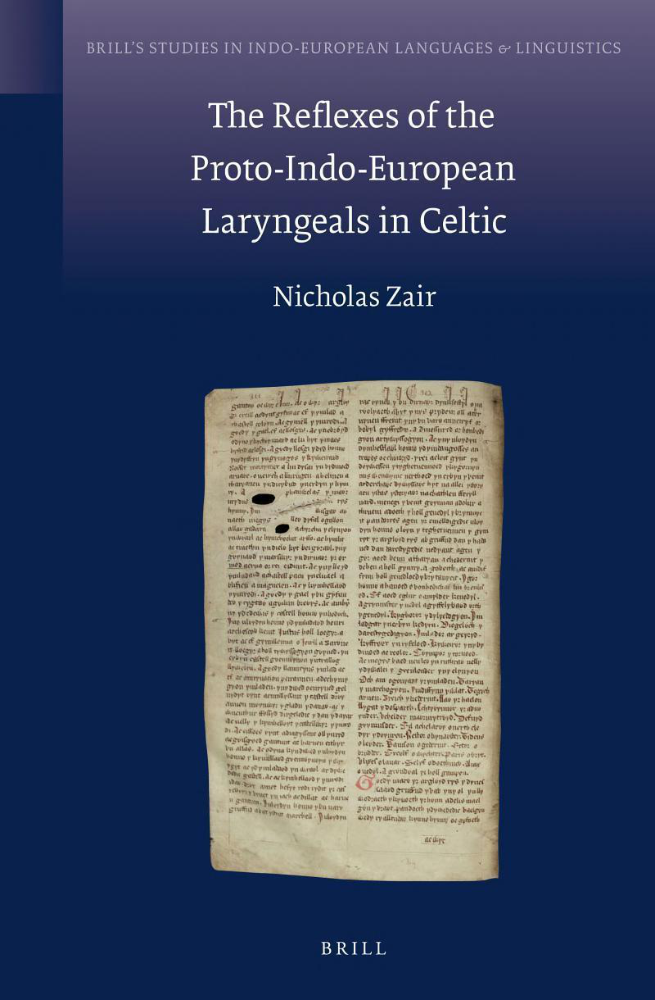

# The Reflexes of the Proto-Indo-European Laryngeals in Celtic

<!-- pdf-page: 2 -->

The Reflexes of the Proto-Indo-European Laryngeals in Celtic

<!-- pdf-page: 3 -->

Brill’s Studies in Indo-European Languages & Linguistics Series Editors Craig Melchert University of California at Los Angeles Olav Hackstein Ludwig-Maximilians-Universität Munich

Editorial Board José-Luis García-Ramón, University of Cologne Andrew Garrett, University of California at Berkeley Stephanie Jamison, University of California at Los Angeles Joshua T. Katz, Princeton University Alexander Lubotsky, University of Leiden Alan J. Nussbaum, Cornell University Georges-Jean Pinault, École Pratique des Hautes Études, Paris Jeremy Rau, Harvard University Elisabeth Rieken, Philipps-Universität Marburg Stefan Schumacher, Vienna University

## Volume 7

The titles published in this series are listed at brill.nl/bsiel

<!-- pdf-page: 4 -->

The Reflexes of the Proto-Indo-European Laryngeals in Celtic

By Nicholas Zair

## Leiden • Boston

<!-- pdf-page: 5 -->

Cover illustration: Folio 78v of The Red Book of Hergest (Jesus MS.111), The Principal and Fellows of Jesus College, Oxford.

Library of Congress Cataloging-in-Publication Data

Zair, Nicholas, 1982-

The reflexes of the Proto-Indo-European laryngeals in Celtic / by Nicholas Zair. p. cm. – (Brill's studies in Indo-European languages & linguistics; 7) Thesis (Ph.D.)–Oxford University, 2010. Includes bibliographical references and index. ISBN 978-90-04-22539-8 (alk. paper) – ISBN 978-90-04-23309-6 (e-book) 1. Celtic languages–Phonology, Historical. 2. Laryngeals (Phonetics) 3. Grammar, Comparative and general–Phonology. 4. Indo-European languages–Phonology, Historical. I. Title.

PB1028.Z35 2012 491.6–dc23

This publication has been typeset in the multilingual “Brill” typeface. With over 5,100 characters covering Latin, IPA, Greek, and Cyrillic, this typeface is especially suitable for use in the humanities. For more information, please see www.brill.nl/brill-typeface.

ISSN 1875-6328 ISBN 978 90 04 22539 8 (hardback) ISBN 978 90 04 23309 6 (e-book)

Copyright 2012 by Koninklijke Brill NV, Leiden, The Netherlands. Koninklijke Brill NV incorporates the imprints Brill, Global Oriental, Hotei Publishing, IDC Publishers and Martinus Nijhoff Publishers.

All rights reserved. No part of this publication may be reproduced, translated, stored in a retrieval system, or transmitted in any form or by any means, electronic, mechanical, photocopying, recording or otherwise, without prior written permission from the publisher.

Authorization to photocopy items for internal or personal use is granted by Koninklijke Brill NV provided that the appropriate fees are paid directly to The Copyright Clearance Center, 222 Rosewood Drive, Suite 910, Danvers, MA 01923, USA. Fees are subject to change.

This book is printed on acid-free paper.

<!-- pdf-page: 6 -->

CONTENTS

Acknowledgements . . . . . . . . . . . . . . . . . . . . . . . . . . . . . . . . . . . . . . . . . . . . . . . . . . . . . xiii
Abbreviations . . . . . . . . . . . . . . . . . . . . . . . . . . . . . . . . . . . . . . . . . . . . . . . . . . . . . . . . . . . xv
Note on Conventions . . . . . . . . . . . . . . . . . . . . . . . . . . . . . . . . . . . . . . . . . . . . . . . . . . . xvii

I. Introduction . . . . . . . . . . . . . . . . . . . . . . . . . . . . . . . . . . . . . . . . . . . . . . . . . . . . . . . . . .        1
The Reflexes of the Proto-Indo-European Laryngeals in Celtic . . . . .                                                               1
### §1. Purpose and Methodology of the Present Work . . . . . . . . .                                                                 1

The Laryngeals . . . . . . . . . . . . . . . . . . . . . . . . . . . . . . . . . . . . . . . . . . . . . . . . . . . . .              3
### §2. Indo-European and

Laryngeals . . . . . . . . . . . . . . . . . . . . . . . . .                                                3
### §3. The

Laryngeals: Phonetics and Phonology . . . . . . . . . . . . . .                                                           4
### §4. The

Indo-European Syllable . . . . . . . . . . . . . . . . . . . . . . . . . . . .                                            7
### §5. Indo-European Root Structure and Root-Initial

Laryngeals. . . . . . . . . . . . . . . . . . . . . . . . . . . . . . . . . . . . . . . . . . . . . . .                     9
### §6. Indo-European *-a- . . . . . . . . . . . . . . . . . . . . . . . . . . . . . . . . . . . . .                                  10

Laryngeals in the Indo-European Languages . . . . . . . . . . . . . . . . . . . . . . .                                               11
### §7. General . . . . . . . . . . . . . . . . . . . . . . . . . . . . . . . . . . . . . . . . . . . . . . . . .                     11
### §8. Germanic . . . . . . . . . . . . . . . . . . . . . . . . . . . . . . . . . . . . . . . . . . . . . . .                        11
### §9. Balto-Slavic . . . . . . . . . . . . . . . . . . . . . . . . . . . . . . . . . . . . . . . . . . . . .                        12
### §10. Anatolian . . . . . . . . . . . . . . . . . . . . . . . . . . . . . . . . . . . . . . . . . . . . . . .                      14
### §11. Armenian . . . . . . . . . . . . . . . . . . . . . . . . . . . . . . . . . . . . . . . . . . . . . . .                       14
Celtic Sources . . . . . . . . . . . . . . . . . . . . . . . . . . . . . . . . . . . . . . . . . . . . . . . . . . . . . .            15
### §12. Brittonic. . . . . . . . . . . . . . . . . . . . . . . . . . . . . . . . . . . . . . . . . . . . . . . . .                   15
### §13. Irish . . . . . . . . . . . . . . . . . . . . . . . . . . . . . . . . . . . . . . . . . . . . . . . . . . . . .              16
### §14. Gaulish . . . . . . . . . . . . . . . . . . . . . . . . . . . . . . . . . . . . . . . . . . . . . . . . . .                  16
### §15. Lepontic . . . . . . . . . . . . . . . . . . . . . . . . . . . . . . . . . . . . . . . . . . . . . . . .                     17
### §16. Celtiberian . . . . . . . . . . . . . . . . . . . . . . . . . . . . . . . . . . . . . . . . . . . . . .                      17
Structure of the Book . . . . . . . . . . . . . . . . . . . . . . . . . . . . . . . . . . . . . . . . . . . . . . .                   18
### §17. Outline . . . . . . . . . . . . . . . . . . . . . . . . . . . . . . . . . . . . . . . . . . . . . . . . . .                  18

II. Word-Initial Laryngeal . . . . . . . . . . . . . . . . . . . . . . . . . . . . . . . . . . . . . . . . . . . . . . .                   19
#HeC- . . . . . . . . . . . . . . . . . . . . . . . . . . . . . . . . . . . . . . . . . . . . . . . . . . . . . . . . . . . . . . .   19
### §18. Introduction . . . . . . . . . . . . . . . . . . . . . . . . . . . . . . . . . . . . . . . . . . . .                          19
### §19. *h₁eC- . . . . . . . . . . . . . . . . . . . . . . . . . . . . . . . . . . . . . . . . . . . . . . . . . . .                  19
### §20. *h₂eC- . . . . . . . . . . . . . . . . . . . . . . . . . . . . . . . . . . . . . . . . . . . . . . . . . . .                  19
### §21. *h₃eC- . . . . . . . . . . . . . . . . . . . . . . . . . . . . . . . . . . . . . . . . . . . . . . . . . . .                  19

<!-- pdf-page: 7 -->

#HoC- . . . . . . . . . . . . . . . . . . . . . . . . . . . . . . . . . . . . . . . . . . . . . . . . . . . . . . . . . . . . . .      20
### §22. Introduction . . . . . . . . . . . . . . . . . . . . . . . . . . . . . . . . . . . . . . . . . . . .                           20
### §23. *h₁oC- . . . . . . . . . . . . . . . . . . . . . . . . . . . . . . . . . . . . . . . . . . . . . . . . . . .                   20
### §24. *h₂o- > *a- . . . . . . . . . . . . . . . . . . . . . . . . . . . . . . . . . . . . . . . . . . . . . . .                      20
### §25. *h₂o- > *o- . . . . . . . . . . . . . . . . . . . . . . . . . . . . . . . . . . . . . . . . . . . . . . .                      21
### §26. *h₃oC- . . . . . . . . . . . . . . . . . . . . . . . . . . . . . . . . . . . . . . . . . . . . . . . . . . .                   24
### §27. Conclusion . . . . . . . . . . . . . . . . . . . . . . . . . . . . . . . . . . . . . . . . . . . . . .                         24
#HĒ- . . . . . . . . . . . . . . . . . . . . . . . . . . . . . . . . . . . . . . . . . . . . . . . . . . . . . . . . . . . . . . . .   24
Introduction . . . . . . . . . . . . . . . . . . . . . . . . . . . . . . . . . . . . . . . . . . . . . . . . . . .                  24
### §28. *HōC- . . . . . . . . . . . . . . . . . . . . . . . . . . . . . . . . . . . . . . . . . . . . . . . . . . .                    24
#HeHC- . . . . . . . . . . . . . . . . . . . . . . . . . . . . . . . . . . . . . . . . . . . . . . . . . . . . . . . . . . . . .       25
### §29. Introduction . . . . . . . . . . . . . . . . . . . . . . . . . . . . . . . . . . . . . . . . . . . .                           25
### §30. Material . . . . . . . . . . . . . . . . . . . . . . . . . . . . . . . . . . . . . . . . . . . . . . . . .                     25
#HIC- . . . . . . . . . . . . . . . . . . . . . . . . . . . . . . . . . . . . . . . . . . . . . . . . . . . . . . . . . . . . . . .    25
### §31. Introduction . . . . . . . . . . . . . . . . . . . . . . . . . . . . . . . . . . . . . . . . . . . .                           25
### §32. *HiC- > *iC- . . . . . . . . . . . . . . . . . . . . . . . . . . . . . . . . . . . . . . . . . . . . .                         26
### §33. *HuC- > *uC- . . . . . . . . . . . . . . . . . . . . . . . . . . . . . . . . . . . . . . . . . . . .                           26
### §34. *HuC- > *au̯C- . . . . . . . . . . . . . . . . . . . . . . . . . . . . . . . . . . . . . . . . . . .                          28
### §35. Conclusion . . . . . . . . . . . . . . . . . . . . . . . . . . . . . . . . . . . . . . . . . . . . . .                         29
#HR̥ C- . . . . . . . . . . . . . . . . . . . . . . . . . . . . . . . . . . . . . . . . . . . . . . . . . . . . . . . . . . . . . .    29
### §36. Introduction . . . . . . . . . . . . . . . . . . . . . . . . . . . . . . . . . . . . . . . . . . . .                           29
### §37. *HR̥ C- > *RiC- . . . . . . . . . . . . . . . . . . . . . . . . . . . . . . . . . . . . . . . . . . .                          30
### §38. *HR̥ C- > *aRC- . . . . . . . . . . . . . . . . . . . . . . . . . . . . . . . . . . . . . . . . . .                            34
### §39. Conclusion . . . . . . . . . . . . . . . . . . . . . . . . . . . . . . . . . . . . . . . . . . . . . .                         37
#HR̥ HC- . . . . . . . . . . . . . . . . . . . . . . . . . . . . . . . . . . . . . . . . . . . . . . . . . . . . . . . . . . . .       38
### §40. Introduction . . . . . . . . . . . . . . . . . . . . . . . . . . . . . . . . . . . . . . . . . . . .                           38
### §41. *HR̥ HC- > *aRC- . . . . . . . . . . . . . . . . . . . . . . . . . . . . . . . . . . . . . . . . .                             38
### §42. *HR̥ HC- > *RāC-. . . . . . . . . . . . . . . . . . . . . . . . . . . . . . . . . . . . . . . . .                              41
### §43. *HR̥ HC- > *RăC-. . . . . . . . . . . . . . . . . . . . . . . . . . . . . . . . . . . . . . . . .                              43
### §44. *HR̥ HC- > *aRaC- . . . . . . . . . . . . . . . . . . . . . . . . . . . . . . . . . . . . . . .                                43
### §45. Conclusion . . . . . . . . . . . . . . . . . . . . . . . . . . . . . . . . . . . . . . . . . . . . . .                         44
#HIHC- . . . . . . . . . . . . . . . . . . . . . . . . . . . . . . . . . . . . . . . . . . . . . . . . . . . . . . . . . . . . .       46
### §46. Introduction . . . . . . . . . . . . . . . . . . . . . . . . . . . . . . . . . . . . . . . . . . . .                           46
### §47. *HIHC- > *I̯aC- . . . . . . . . . . . . . . . . . . . . . . . . . . . . . . . . . . . . . . . . . .                            46
### §48. *HIHC- > *ĪC- . . . . . . . . . . . . . . . . . . . . . . . . . . . . . . . . . . . . . . . . . . .                            47
### §49. *HIHC- > *IC- . . . . . . . . . . . . . . . . . . . . . . . . . . . . . . . . . . . . . . . . . . .                            48
### §50. Conclusion . . . . . . . . . . . . . . . . . . . . . . . . . . . . . . . . . . . . . . . . . . . . . .                         48
#HC- . . . . . . . . . . . . . . . . . . . . . . . . . . . . . . . . . . . . . . . . . . . . . . . . . . . . . . . . . . . . . . . .   48
### §51. Introduction . . . . . . . . . . . . . . . . . . . . . . . . . . . . . . . . . . . . . . . . . . . .                           48
### §52. *HRV- > *RV- and *HI̯V- > *I̯V- . . . . . . . . . . . . . . . . . . . . . . . . . .                                            49

<!-- pdf-page: 8 -->

### §53. *HS- > *S- . . . . . . . . . . . . . . . . . . . . . . . . . . . . . . . . . . . . . . . . . . . . . . .                     52
### §54. *HS- > *aS- . . . . . . . . . . . . . . . . . . . . . . . . . . . . . . . . . . . . . . . . . . . . . .                      53
### §55. Conclusion . . . . . . . . . . . . . . . . . . . . . . . . . . . . . . . . . . . . . . . . . . . . . .                       54
#HHC- . . . . . . . . . . . . . . . . . . . . . . . . . . . . . . . . . . . . . . . . . . . . . . . . . . . . . . . . . . . . . .    55
### §56. Introduction . . . . . . . . . . . . . . . . . . . . . . . . . . . . . . . . . . . . . . . . . . . .                         55
### §57. *HHC- > *aC- . . . . . . . . . . . . . . . . . . . . . . . . . . . . . . . . . . . . . . . . . . . .                         55
### §58. *HHC- > *C- . . . . . . . . . . . . . . . . . . . . . . . . . . . . . . . . . . . . . . . . . . . . .                        55
### §59. Conclusion . . . . . . . . . . . . . . . . . . . . . . . . . . . . . . . . . . . . . . . . . . . . . .                       56

III. Laryngeals in the First Syllable . . . . . . . . . . . . . . . . . . . . . . . . . . . . . . . . . . . . . .                           57
#CHC- . . . . . . . . . . . . . . . . . . . . . . . . . . . . . . . . . . . . . . . . . . . . . . . . . . . . . . . . . . . . . .     57
### §60. Introduction . . . . . . . . . . . . . . . . . . . . . . . . . . . . . . . . . . . . . . . . . . . .                        57
### §61. *CHC- > *CaC- . . . . . . . . . . . . . . . . . . . . . . . . . . . . . . . . . . . . . . . . . .                           57
### §62. *sHC- > *sC- . . . . . . . . . . . . . . . . . . . . . . . . . . . . . . . . . . . . . . . . . . . . .                      57
### §63. Conclusion . . . . . . . . . . . . . . . . . . . . . . . . . . . . . . . . . . . . . . . . . . . . . .                      58
#R̥ HC- . . . . . . . . . . . . . . . . . . . . . . . . . . . . . . . . . . . . . . . . . . . . . . . . . . . . . . . . . . . . . .   58
### §64. Introduction . . . . . . . . . . . . . . . . . . . . . . . . . . . . . . . . . . . . . . . . . . . .                        58
### §65. *R̥ HC- > *RăC- . . . . . . . . . . . . . . . . . . . . . . . . . . . . . . . . . . . . . . . . . .                         58
### §66. Conclusion . . . . . . . . . . . . . . . . . . . . . . . . . . . . . . . . . . . . . . . . . . . . . .                      65
#IHC- . . . . . . . . . . . . . . . . . . . . . . . . . . . . . . . . . . . . . . . . . . . . . . . . . . . . . . . . . . . . . . .   66
### §67. Introduction . . . . . . . . . . . . . . . . . . . . . . . . . . . . . . . . . . . . . . . . . . . .                        66
### §68. *IHC- > *I̯aC- . . . . . . . . . . . . . . . . . . . . . . . . . . . . . . . . . . . . . . . . . . . .                      66
### §69. *IHC- > *ĪC- in Irish, *I̯aC- in British and Gaulish . . . . . . .                                                          68
### §70. *IHC- > *ĪC- . . . . . . . . . . . . . . . . . . . . . . . . . . . . . . . . . . . . . . . . . . . . .                      68
### §71. Conclusion . . . . . . . . . . . . . . . . . . . . . . . . . . . . . . . . . . . . . . . . . . . . . .                      68
#CHEC- . . . . . . . . . . . . . . . . . . . . . . . . . . . . . . . . . . . . . . . . . . . . . . . . . . . . . . . . . . . . .      69
### §72. Introduction . . . . . . . . . . . . . . . . . . . . . . . . . . . . . . . . . . . . . . . . . . . .                        69
### §73. *CHEC- . . . . . . . . . . . . . . . . . . . . . . . . . . . . . . . . . . . . . . . . . . . . . . . . . .                  69
#CR̥ HC(C)- . . . . . . . . . . . . . . . . . . . . . . . . . . . . . . . . . . . . . . . . . . . . . . . . . . . . . . . . .         69
### §74. Introduction . . . . . . . . . . . . . . . . . . . . . . . . . . . . . . . . . . . . . . . . . . . .                        69
### §75. *CR̥ HC(C)- > *CRăC(C)- . . . . . . . . . . . . . . . . . . . . . . . . . . . . . . . .                                     70
### §76. *CR̥ HC(C)- > *CRāC(C)- . . . . . . . . . . . . . . . . . . . . . . . . . . . . . . . .                                     77
### §77. *CR̥ HC(C)- > *CaRC(C)- . . . . . . . . . . . . . . . . . . . . . . . . . . . . . . . .                                     82
### §78. Conclusion . . . . . . . . . . . . . . . . . . . . . . . . . . . . . . . . . . . . . . . . . . . . . .                      84
#CR̥ HI̯- . . . . . . . . . . . . . . . . . . . . . . . . . . . . . . . . . . . . . . . . . . . . . . . . . . . . . . . . . . . . .   89
### §79. Introduction . . . . . . . . . . . . . . . . . . . . . . . . . . . . . . . . . . . . . . . . . . . .                        89
### §80. *CR̥ Hi̯- > *CRi̯- . . . . . . . . . . . . . . . . . . . . . . . . . . . . . . . . . . . . . . . . . .                      91
### §81. *CR̥ Hi̯- > *CRāi̯- . . . . . . . . . . . . . . . . . . . . . . . . . . . . . . . . . . . . . . . . .                       94
### §82. *CR̥ Hu̯- > *CR̥ u̯- . . . . . . . . . . . . . . . . . . . . . . . . . . . . . . . . . . . . . . . . .                     94
### §83. *CR̥ Hu̯- > *CRā̆u̯- . . . . . . . . . . . . . . . . . . . . . . . . . . . . . . . . . . . . . . . .                       95

<!-- pdf-page: 9 -->

### §84. Conclusion . . . . . . . . . . . . . . . . . . . . . . . . . . . . . . . . . . . . . . . . . . . . . . 100
### §85. Excursus:

The Origin of MIr. blá . . . . . . . . . . . . . . . . . . . . . . . . . 101
#CIHI̯- . . . . . . . . . . . . . . . . . . . . . . . . . . . . . . . . . . . . . . . . . . . . . . . . . . . . . . . . . . . . . . 102
### §86. Introduction . . . . . . . . . . . . . . . . . . . . . . . . . . . . . . . . . . . . . . . . . . . . 102
### §87. *CIHi̯- > *CĬi̯- . . . . . . . . . . . . . . . . . . . . . . . . . . . . . . . . . . . . . . . . . . . . 102
### §88. *CIHi̯- > *CĪi̯- . . . . . . . . . . . . . . . . . . . . . . . . . . . . . . . . . . . . . . . . . . . . 104
### §89. *CIHu̯- > *CĬu̯- . . . . . . . . . . . . . . . . . . . . . . . . . . . . . . . . . . . . . . . . . . 104
### §90. *CIHu̯- > CĪu̯- . . . . . . . . . . . . . . . . . . . . . . . . . . . . . . . . . . . . . . . . . . . 107
### §91. Conclusion . . . . . . . . . . . . . . . . . . . . . . . . . . . . . . . . . . . . . . . . . . . . . . 108
#CEHC- . . . . . . . . . . . . . . . . . . . . . . . . . . . . . . . . . . . . . . . . . . . . . . . . . . . . . . . . . . . . . 109
### §92. Introduction . . . . . . . . . . . . . . . . . . . . . . . . . . . . . . . . . . . . . . . . . . . . 109
### §93. *Ceh₁C- . . . . . . . . . . . . . . . . . . . . . . . . . . . . . . . . . . . . . . . . . . . . . . . . . . 109
### §94. *Ceh₂C- . . . . . . . . . . . . . . . . . . . . . . . . . . . . . . . . . . . . . . . . . . . . . . . . . 109
### §95. *Ceh₃C- . . . . . . . . . . . . . . . . . . . . . . . . . . . . . . . . . . . . . . . . . . . . . . . . . 110
### §96. *Coh₁C-. . . . . . . . . . . . . . . . . . . . . . . . . . . . . . . . . . . . . . . . . . . . . . . . . . 110
### §97. *Coh₂C- . . . . . . . . . . . . . . . . . . . . . . . . . . . . . . . . . . . . . . . . . . . . . . . . . 111
#CIHC- and #CHIC- . . . . . . . . . . . . . . . . . . . . . . . . . . . . . . . . . . . . . . . . . . . . . . . . 111
### §98. Introduction . . . . . . . . . . . . . . . . . . . . . . . . . . . . . . . . . . . . . . . . . . . . 111
### §99. *CIHC- > *CĪC- . . . . . . . . . . . . . . . . . . . . . . . . . . . . . . . . . . . . . . . . . . 113
### §100. *CHIC- > *CĪC- . . . . . . . . . . . . . . . . . . . . . . . . . . . . . . . . . . . . . . . . . . 118
### §101. *CHIC- > *CĬC- . . . . . . . . . . . . . . . . . . . . . . . . . . . . . . . . . . . . . . . . . . 121
### §102. *CR̥ HIC- > *CRĪC- . . . . . . . . . . . . . . . . . . . . . . . . . . . . . . . . . . . . . . . 125
### §103. *CR̥ HIC- > *CRĬC- . . . . . . . . . . . . . . . . . . . . . . . . . . . . . . . . . . . . . . . 126
### §104. Conclusion . . . . . . . . . . . . . . . . . . . . . . . . . . . . . . . . . . . . . . . . . . . . . . 128
### §105. Excursus: Pretonic *CHIC- Clusters in Greek,

Italic
and Balto-Slavic . . . . . . . . . . . . . . . . . . . . . . . . . . . . . . . . . . . . . . . . . 128
Dybo’s Rule . . . . . . . . . . . . . . . . . . . . . . . . . . . . . . . . . . . . . . . . . . . . . . . . . . . . . . . . . 132
### §106. Introduction . . . . . . . . . . . . . . . . . . . . . . . . . . . . . . . . . . . . . . . . . . . . 132
### §107. *CEHC- > *CĔC- . . . . . . . . . . . . . . . . . . . . . . . . . . . . . . . . . . . . . . . . . 134
### §108. *CIHC- > *CĬC- . . . . . . . . . . . . . . . . . . . . . . . . . . . . . . . . . . . . . . . . . . 137
### §109. Evidence from Other Languages . . . . . . . . . . . . . . . . . . . . . . . . 143
### §110. Evaluation: Schrijver’s

Theory . . . . . . . . . . . . . . . . . . . . . . . . . . . 145
### §111. Evaluation: Zair’s

Theory . . . . . . . . . . . . . . . . . . . . . . . . . . . . . . . . 145
### §112. Evaluation: Isaac’s

Theory . . . . . . . . . . . . . . . . . . . . . . . . . . . . . . . 146
### §113. Conclusion . . . . . . . . . . . . . . . . . . . . . . . . . . . . . . . . . . . . . . . . . . . . . . 147
#CEHCC- and #CIHCC-: The ‘Wetter Regel’. . . . . . . . . . . . . . . . . . . . . . . . . 150
### §114. Introduction . . . . . . . . . . . . . . . . . . . . . . . . . . . . . . . . . . . . . . . . . . . . 150
### §115. *CEHCR/I̯- > *CĒCR/I̯- and *CIHCR/I̯- > *CĪCR/I̯- . . . . . . 151
### §116. *CEHCR/I̯- > *CĔCR/I̯- and *CIHCR/I̯- > *CĬCR/I̯- . . . . . . 153
### §117. *CEHCP- > *CĒCP- and *CIHCP- > *CĪCP- . . . . . . . . . . . . . . 156

<!-- pdf-page: 10 -->

### §118. *CEHCP- > *CĔCP- and *CIHCP- > *CĬCP- . . . . . . . . . . . . . . 157
### §119. Conclusion . . . . . . . . . . . . . . . . . . . . . . . . . . . . . . . . . . . . . . . . . . . . . . 158
-CHCC- . . . . . . . . . . . . . . . . . . . . . . . . . . . . . . . . . . . . . . . . . . . . . . . . . . . . . . . . . . . . . 160
### §120. Introduction . . . . . . . . . . . . . . . . . . . . . . . . . . . . . . . . . . . . . . . . . . . . 160
### §121. *-CHCC- > *-CCC- . . . . . . . . . . . . . . . . . . . . . . . . . . . . . . . . . . . . . . . 162
### §122. *-CHCC- > *-CaCC- . . . . . . . . . . . . . . . . . . . . . . . . . . . . . . . . . . . . . 166
### §123. Conclusion . . . . . . . . . . . . . . . . . . . . . . . . . . . . . . . . . . . . . . . . . . . . . . 167

IV. Laryngeals in a Non-Initial Syllable . . . . . . . . . . . . . . . . . . . . . . . . . . . . . . . . . . 169
#CEHE- . . . . . . . . . . . . . . . . . . . . . . . . . . . . . . . . . . . . . . . . . . . . . . . . . . . . . . . . . . . . . 169
### §124. Material . . . . . . . . . . . . . . . . . . . . . . . . . . . . . . . . . . . . . . . . . . . . . . . . . 169
#CR̥ HE- and #CR̥ HI- . . . . . . . . . . . . . . . . . . . . . . . . . . . . . . . . . . . . . . . . . . . . . . . . 169
### §125. Introduction . . . . . . . . . . . . . . . . . . . . . . . . . . . . . . . . . . . . . . . . . . . . 169
### §126. Material . . . . . . . . . . . . . . . . . . . . . . . . . . . . . . . . . . . . . . . . . . . . . . . . . 169
#CIHE-. . . . . . . . . . . . . . . . . . . . . . . . . . . . . . . . . . . . . . . . . . . . . . . . . . . . . . . . . . . . . . 170
### §127. Introduction . . . . . . . . . . . . . . . . . . . . . . . . . . . . . . . . . . . . . . . . . . . . 170
### §128. Material . . . . . . . . . . . . . . . . . . . . . . . . . . . . . . . . . . . . . . . . . . . . . . . . . 170
#CEHI-. . . . . . . . . . . . . . . . . . . . . . . . . . . . . . . . . . . . . . . . . . . . . . . . . . . . . . . . . . . . . . 171
### §129. Introduction . . . . . . . . . . . . . . . . . . . . . . . . . . . . . . . . . . . . . . . . . . . . 171
### §130. Material . . . . . . . . . . . . . . . . . . . . . . . . . . . . . . . . . . . . . . . . . . . . . . . . . 171
#CVHR̥ - and #VHR̥ - . . . . . . . . . . . . . . . . . . . . . . . . . . . . . . . . . . . . . . . . . . . . . . . . . 172
### §131. Introduction . . . . . . . . . . . . . . . . . . . . . . . . . . . . . . . . . . . . . . . . . . . . 172
### §132. *CEHR̥ - . . . . . . . . . . . . . . . . . . . . . . . . . . . . . . . . . . . . . . . . . . . . . . . . . . 174
### §133. *CIHR̥ - . . . . . . . . . . . . . . . . . . . . . . . . . . . . . . . . . . . . . . . . . . . . . . . . . . 176
### §134. *CR̥ HR̥ - and *R̥ HR̥ - . . . . . . . . . . . . . . . . . . . . . . . . . . . . . . . . . . . . . . 177
### §135. Conclusion . . . . . . . . . . . . . . . . . . . . . . . . . . . . . . . . . . . . . . . . . . . . . . 179
-CHC- and -CHC# . . . . . . . . . . . . . . . . . . . . . . . . . . . . . . . . . . . . . . . . . . . . . . . . . . 180
### §136. Introduction . . . . . . . . . . . . . . . . . . . . . . . . . . . . . . . . . . . . . . . . . . . . 180
### §137. *-CHC- > *-CC- . . . . . . . . . . . . . . . . . . . . . . . . . . . . . . . . . . . . . . . . . . 181
### §138. *-CHC- > *-CaC- . . . . . . . . . . . . . . . . . . . . . . . . . . . . . . . . . . . . . . . . . 193
### §139. Conclusion . . . . . . . . . . . . . . . . . . . . . . . . . . . . . . . . . . . . . . . . . . . . . . 199
-VCHI̯- . . . . . . . . . . . . . . . . . . . . . . . . . . . . . . . . . . . . . . . . . . . . . . . . . . . . . . . . . . . . . . 201
### §140. Introduction . . . . . . . . . . . . . . . . . . . . . . . . . . . . . . . . . . . . . . . . . . . . 201
### §141. *-VRHi̯- > *-VRi̯- . . . . . . . . . . . . . . . . . . . . . . . . . . . . . . . . . . . . . . . . . 202
### §142. *-VPHi̯- > *-VPi̯- . . . . . . . . . . . . . . . . . . . . . . . . . . . . . . . . . . . . . . . . . 204
### §143. *-VRHu̯- > *-VRu̯- . . . . . . . . . . . . . . . . . . . . . . . . . . . . . . . . . . . . . . . . 205
### §144. *-VRHu̯- > *-VRau̯- . . . . . . . . . . . . . . . . . . . . . . . . . . . . . . . . . . . . . . 208
### §145. *-VPHu̯- > *-VPu̯- . . . . . . . . . . . . . . . . . . . . . . . . . . . . . . . . . . . . . . . . 213
### §146. *-VPHu̯- > *-VPau̯- . . . . . . . . . . . . . . . . . . . . . . . . . . . . . . . . . . . . . . . 214
### §147. Conclusion . . . . . . . . . . . . . . . . . . . . . . . . . . . . . . . . . . . . . . . . . . . . . . 214

<!-- pdf-page: 11 -->

-VCHV- . . . . . . . . . . . . . . . . . . . . . . . . . . . . . . . . . . . . . . . . . . . . . . . . . . . . . . . . . . . . . 215
### §148. Introduction . . . . . . . . . . . . . . . . . . . . . . . . . . . . . . . . . . . . . . . . . . . . 215
### §149. *-VTh₃V- . . . . . . . . . . . . . . . . . . . . . . . . . . . . . . . . . . . . . . . . . . . . . . . . . 215
### §150. *-eI̯HV- . . . . . . . . . . . . . . . . . . . . . . . . . . . . . . . . . . . . . . . . . . . . . . . . . . 217
### §151. *-VCHV- (Where C is not T or *-i̯-) . . . . . . . . . . . . . . . . . . . . . . 218
### §152. Conclusion . . . . . . . . . . . . . . . . . . . . . . . . . . . . . . . . . . . . . . . . . . . . . . 218

V. Word-Final Laryngeals . . . . . . . . . . . . . . . . . . . . . . . . . . . . . . . . . . . . . . . . . . . . . . . 219
-IH# . . . . . . . . . . . . . . . . . . . . . . . . . . . . . . . . . . . . . . . . . . . . . . . . . . . . . . . . . . . . . . . . . 219
### §153. Introduction . . . . . . . . . . . . . . . . . . . . . . . . . . . . . . . . . . . . . . . . . . . . 219
### §154. Material . . . . . . . . . . . . . . . . . . . . . . . . . . . . . . . . . . . . . . . . . . . . . . . . . 219
### §155. Conclusion . . . . . . . . . . . . . . . . . . . . . . . . . . . . . . . . . . . . . . . . . . . . . . 220
-EH# . . . . . . . . . . . . . . . . . . . . . . . . . . . . . . . . . . . . . . . . . . . . . . . . . . . . . . . . . . . . . . . . 220
### §156. Introduction . . . . . . . . . . . . . . . . . . . . . . . . . . . . . . . . . . . . . . . . . . . . 220
### §157. Material . . . . . . . . . . . . . . . . . . . . . . . . . . . . . . . . . . . . . . . . . . . . . . . . . 221
-CH# . . . . . . . . . . . . . . . . . . . . . . . . . . . . . . . . . . . . . . . . . . . . . . . . . . . . . . . . . . . . . . . . 221
### §158. Introduction . . . . . . . . . . . . . . . . . . . . . . . . . . . . . . . . . . . . . . . . . . . . 221
### §159. *-PH . . . . . . . . . . . . . . . . . . . . . . . . . . . . . . . . . . . . . . . . . . . . . . . . . . . . . 221
### §160. *-RH . . . . . . . . . . . . . . . . . . . . . . . . . . . . . . . . . . . . . . . . . . . . . . . . . . . . . 223
### §161. Conclusion . . . . . . . . . . . . . . . . . . . . . . . . . . . . . . . . . . . . . . . . . . . . . . 224

VI. Other Environments . . . . . . . . . . . . . . . . . . . . . . . . . . . . . . . . . . . . . . . . . . . . . . . . 225
-EI̯HC- . . . . . . . . . . . . . . . . . . . . . . . . . . . . . . . . . . . . . . . . . . . . . . . . . . . . . . . . . . . . . . 225
### §162. Introduction . . . . . . . . . . . . . . . . . . . . . . . . . . . . . . . . . . . . . . . . . . . . 225
### §163. *-EI̯HC- > *-EI̯C-. . . . . . . . . . . . . . . . . . . . . . . . . . . . . . . . . . . . . . . . . 226
### §164. *-EI̯HC- > *-EI̯aC- . . . . . . . . . . . . . . . . . . . . . . . . . . . . . . . . . . . . . . . 236
### §165. Conclusion . . . . . . . . . . . . . . . . . . . . . . . . . . . . . . . . . . . . . . . . . . . . . . 240

The Saussure Effect . . . . . . . . . . . . . . . . . . . . . . . . . . . . . . . . . . . . . . . . . . . . . . . . . 243
### §166. Introduction . . . . . . . . . . . . . . . . . . . . . . . . . . . . . . . . . . . . . . . . . . . . 243
### §167. *-oRHC> *-oRC- . . . . . . . . . . . . . . . . . . . . . . . . . . . . . . . . . . . . . . . . . 244
### §168. *-oIHC- > *-oI̯C- . . . . . . . . . . . . . . . . . . . . . . . . . . . . . . . . . . . . . . . . . 246
### §169. *-oRHC- > *-oRaC- . . . . . . . . . . . . . . . . . . . . . . . . . . . . . . . . . . . . . . 248
### §170. *-oIHC- > *-oI̯aC- . . . . . . . . . . . . . . . . . . . . . . . . . . . . . . . . . . . . . . . 248
### §171. Conclusion . . . . . . . . . . . . . . . . . . . . . . . . . . . . . . . . . . . . . . . . . . . . . . 249

Eichner’s Law . . . . . . . . . . . . . . . . . . . . . . . . . . . . . . . . . . . . . . . . . . . . . . . . . . . . . . . 249
### §172. Introduction . . . . . . . . . . . . . . . . . . . . . . . . . . . . . . . . . . . . . . . . . . . . 249
### §173. Evidence for Colouring of *-ē- by

Adjacent Laryngeal . . 249
### §174. Evidence for Non-Colouring of *-ē- by

Adjacent
Laryngeal. . . . . . . . . . . . . . . . . . . . . . . . . . . . . . . . . . . . . . . . . . . . . . . . 251
### §175. Conclusion . . . . . . . . . . . . . . . . . . . . . . . . . . . . . . . . . . . . . . . . . . . . . . 253

<!-- pdf-page: 12 -->

VII. Laryngeals in Composition . . . . . . . . . . . . . . . . . . . . . . . . . . . . . . . . . . . . . . . . . 255
Loss of Laryngeals in Compounds . . . . . . . . . . . . . . . . . . . . . . . . . . . . . . . . . . 255
### §176. Introduction . . . . . . . . . . . . . . . . . . . . . . . . . . . . . . . . . . . . . . . . . . . . 255
### §177. *-CR̥ HV- and *-CIHV- (The νεογνός Rule). . . . . . . . . . . . . . . . 257
### §178. *-CR̥ HC- . . . . . . . . . . . . . . . . . . . . . . . . . . . . . . . . . . . . . . . . . . . . . . . . . 259
### §179. *-CIHC- . . . . . . . . . . . . . . . . . . . . . . . . . . . . . . . . . . . . . . . . . . . . . . . . . 261
### §180. *-CHC- . . . . . . . . . . . . . . . . . . . . . . . . . . . . . . . . . . . . . . . . . . . . . . . . . . 261
### §181. Conclusion . . . . . . . . . . . . . . . . . . . . . . . . . . . . . . . . . . . . . . . . . . . . . . 261
### §182. Excursus:

The Proto-Celtic Desiderative/Future . . . . . . . . 263

VIII. Conclusion . . . . . . . . . . . . . . . . . . . . . . . . . . . . . . . . . . . . . . . . . . . . . . . . . . . . . . . . 265
Summary and Conclusions . . . . . . . . . . . . . . . . . . . . . . . . . . . . . . . . . . . . . . . . . 265
### §183. Results . . . . . . . . . . . . . . . . . . . . . . . . . . . . . . . . . . . . . . . . . . . . . . . . . . 265
### §184. Chapter II: Word-Initial Laryngeal . . . . . . . . . . . . . . . . . . . . . . 265
### §185. Chapter III:

Laryngeals in the First Syllable . . . . . . . . . . . . . 265
### §186. Chapter IV:

Laryngeals in Non-Initial Syllable. . . . . . . . . . . 266
### §187. Chapter V: Word-Final

Laryngeals . . . . . . . . . . . . . . . . . . . . . . 267
### §188. Chapter VI: Other Environments . . . . . . . . . . . . . . . . . . . . . . . . 267
### §189. Chapter VII:

Laryngeals in Composition . . . . . . . . . . . . . . . . 267
### §190. Celtic

Laryngeals and Syllabification . . . . . . . . . . . . . . . . . . . . 267
### §191. Celtic Evidence for the Phonetics of the

Laryngeals . . . . 268
### §192. Italo-Celtic . . . . . . . . . . . . . . . . . . . . . . . . . . . . . . . . . . . . . . . . . . . . . . 268

References . . . . . . . . . . . . . . . . . . . . . . . . . . . . . . . . . . . . . . . . . . . . . . . . . . . . . . . . . . . . . . 273
Index Verborum . . . . . . . . . . . . . . . . . . . . . . . . . . . . . . . . . . . . . . . . . . . . . . . . . . . . . . . . 295

<!-- pdf-page: 14 -->

# Acknowledgements

This book started life as my doctoral thesis, which was supported financially by a Doctoral Competition Grant from the Arts and Humanities Research Council of Great Britain, and by a Rhŷs Studentship in Celtic Studies at Jesus College, Oxford. I am still grateful to all those who helped me in the course of researching and writing the thesis, especially to my supervisor Andreas Willi, and to Peter Schrijver, who hosted me in Utrecht in the autumn of 2008 and who was unfailingly enthusiastic and generous with his time. My time in Utrecht was made possible by a Scatcherd European Scholarship from Oxford University. It would be impossible to include the names of everyone who has helped me in the course of researching and writing this book, by listening, encouraging, or suggesting references or improvements. Special thanks go to the following people, who were kind enough to send me copies of work which was forthcoming or otherwise unavailable to me: Andrew Byrd, Joseph Eska, Anders Jørgensen, Micheál Ó Flaithearta, Tijmen Pronk, Peter Schrijver, Ranjan Sen, David Stifter, and Michael Weiss. I am particularly indebted to those unfortunates who for one reason or another had to read the thesis in its entirety, and provided copious suggestions for its improvement: my D.Phil examiners John Penney and Paul Russell, David Stifter, Craig Melchert, and the two anonymous reviewers for Brill. Katherine McDonald proof-read the whole manuscript. Without their input, this book would be much inferior; the remaining blemishes and mistakes are entirely my responsibility. This book is dedicated to my parents, Elaine and Roger Zair, and to my wife Rachele De Felice.

<!-- pdf-page: 16 -->

| Abbrev. | Meaning | Abbrev. | Meaning |
|---|---|---|---|
| ABBREVIATIONS |  |  |  |

| Abbrev. | Meaning | Abbrev. | Meaning |
|---|---|---|---|
| acc. | accusative | Lat. | Latin |
| adj. | adjective | Latv. | Latvian |
| adv. | adverb | LC. | Late Cornish |
| Aeol. | Aeolic | Lep. | Lepontic |
| Alb. | Albanian | Lith. | Lithuanian |
| aor. | aorist | Luv. | Luvian |
| Arm. | Armenian | Lyc. | Lycian |
| Att. | Attic | m. | masculine |
| Av. | Avestan | MB. | Middle Breton |
| B. | Modern Breton | MC. | Middle Cornish |
| Celtib. | Celtiberian | MHG. | Middle High German |
| CLuv. | Cuneiform Luvian | MIr. | Middle Irish |
| coll. | collective | MLG. | Middle Low German |
| conj. | conjunct | MPers. | Middle Persian |
| Cret. | Cretan | MW. | Middle Welsh |
| dat. | dative | n. | neuter |
| dial. | dialect | NE. | Modern English |
| Dor. | Doric | NHG. | Modern High German |
| f. | feminine | NIr. | Modern Irish |
| fut. | future | nom. | nominative |
| Gallo-Lat. | Gallo-Latin | Norw. | Norwegian |
| Gaul. | Gaulish | NPers. | Modern Persian |
| gen. | genitive | OAv. | Old Avestan |
| Gk. | Greek | OB. | Old Breton |
| gl. | glossing | OBrit. | Old British |
| Goth. | Gothic | OC. | Old Cornish |
| Hesych. | Hesychian | OCS. | Old Church Slavonic |
| Hitt. | Hittite | OCz. | Old Czech |
| Hom. | Homeric | OE. | Old English |
| impers. | impersonal | OFr. | Old French |
| impf. | imperfect | Og. | Ogam |
| impv. | imperative | OHG. | Old High German |
| inf. | infinitive | OHitt. | Old Hittite |
| Ion. | Ionic | OIr. | Old Irish |
| Lac. | Laconian | OLat. | Old Latin |

<!-- pdf-page: 17 -->

OLith.—Old Lithuanian          prep.—preposition
ON.—Old Norse                  pres.—present
OPers.—Old Persian             pret.—preterite
OPruss.—Old Prussian           Russ.—Russian
opt.—optative                  SCr.—Serbo-Croatian
ORuss.—Old Russian             sg.—singular
OS.—Old Saxon                  singul.—singulative
Osc.—Oscan                     Skt.—Sanskrit
OSwed.—Old Swedish             Slov.—Slovenian
OW.—Old Welsh                  subj.—subjunctive
p.n.—personal name             Swed.—Swedish
p.p.—past participle           Toch.—Tocharian
part.—participle               U.—Umbrian
pass.—passive                  v.n.—verbal noun
perf.—perfect                  Van.—Vannetais
Phryg.—Phrygian                voc.—vocative
pl.—plural                     W.—Modern Welsh
pl.n.—place name               YAv.—Young Avestan

<!-- pdf-page: 18 -->

# Note on Conventions

The following conventions are used to refer in an abbreviated way to classes of phonemes:

C = any non-syllabic segment (plosives, fricatives including *-s- and H, R, I̯) S = any obstruent (plosives, fricatives including *-s- and H) P = any plosive M = any non-plosive consonant (fricatives including *-s- and H, R, I̯) T = any voiceless plosive D = any voiced plosive H = any laryngeal R = any sonorant (*-l-, *-m-, *-n-, *-r-)     R̥ = a syllabic sonorant L = any liquid (*-l-, *-r-)                   L̥ = a syllabic liquid N = any nasal (*-m-, *-n-)                    N̥ = a syllabic nasal I = any high vowel (*-i-, *-u-)               I̯ = a non-syllabic high vowel E = any non-high vowel (*-a-, *-o-, *-e-) V = any syllabic segment (R̥ , I, E)
